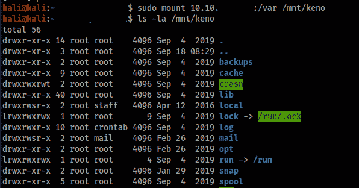
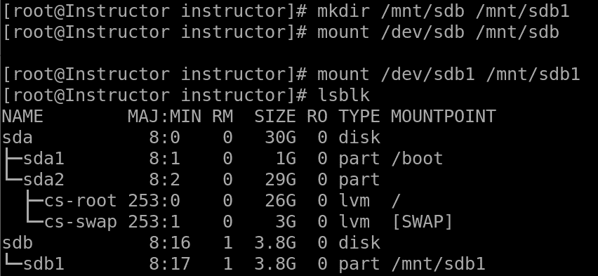
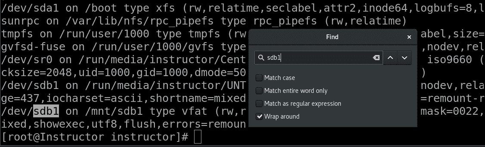
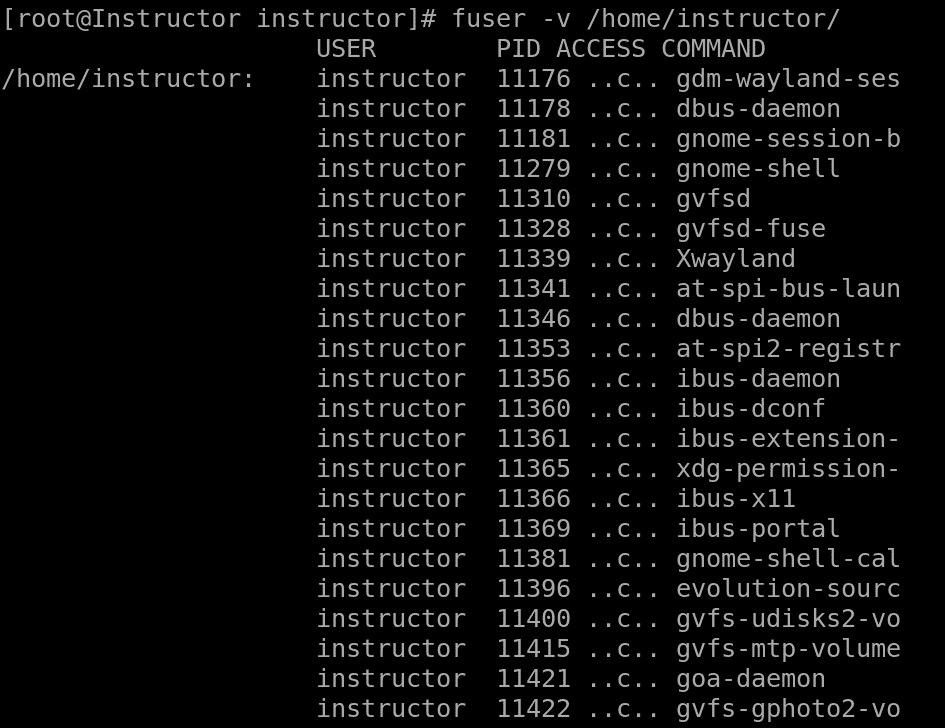
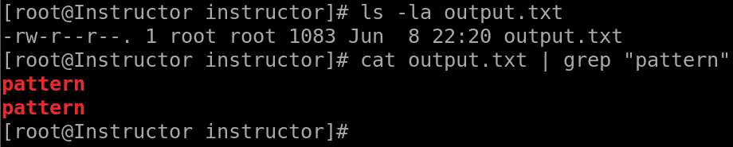
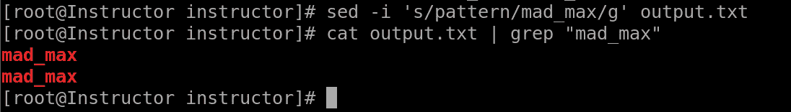
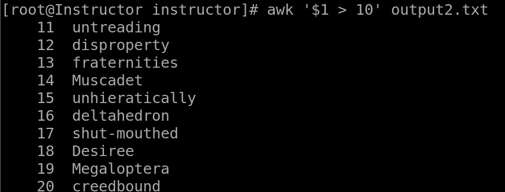
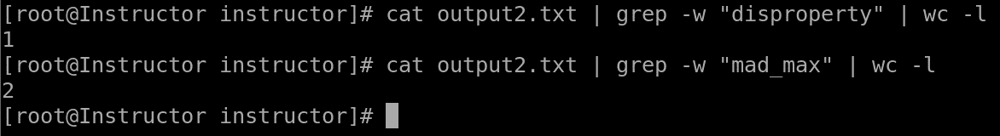

# 第六章：文件系统挂载和操作命令

Linux 文件系统挂载和操作命令是一组重要工具，允许 Linux 系统管理员管理和操作文件系统及存储设备。这些命令提供了一种灵活高效的方式来挂载和卸载文件系统，管理磁盘分区，并执行各种文件操作任务。由于其多功能性、可靠性和易用性，这些命令在 Linux 环境中被广泛使用。系统管理员高度重视这些命令的一个关键原因是它们能够管理文件系统和存储设备。这些命令使管理员能够挂载不同类型的文件系统，如 `ext4`、`NTFS` 或 `NFS`，使数据在 Linux 系统中可访问和可用。它们还提供了管理网络文件系统的选项，允许管理员通过网络连接和访问远程文件系统。另一个这些工具的重要方面是它们在磁盘分区管理中的作用。通过这些工具，管理员可以创建、调整大小和删除磁盘分区，从而确保磁盘空间的高效分配，并根据特定要求组织数据。能够操作分区对设置多重启动系统、创建专用存储区域或为虚拟机管理磁盘空间等任务至关重要。

这些命令提供了额外的文件操作功能，例如导航和浏览文件系统、搜索文件、操作文件权限和所有权，以及执行复制、移动和删除文件等任务。这种灵活性使得文件管理和维护操作更加高效，确保 Linux 系统内数据的组织、完整性和安全性。

在本章中，我们将探讨这一类别中一些最重要的命令。这些命令在管理文件系统中起着至关重要的作用，允许挂载和卸载设备，并使数据访问和存储更加高效。系统管理员在建立设备与文件系统之间的连接、控制已挂载资源并执行各种文件操作时，严重依赖这些命令。

本章将涵盖以下主要内容：

+   Linux 挂载命令

+   mount 命令

+   umount 命令

+   fuser 命令

+   使用 cat、grep 等进行文件操作

# Linux 挂载命令

在 Linux 中，挂载是指将文件系统连接到目录树结构中的特定目录，使操作系统及其用户能够访问该文件系统的内容。`mount`命令在这个过程中发挥着至关重要的作用，通过将设备或远程网络共享与挂载点（即文件系统变得可访问的目录）关联起来。通过使用`mount`命令，Linux 系统管理员可以动态地将各种类型的文件系统（包括本地磁盘、网络共享、虚拟文件系统和可移动存储设备）附加到文件系统层次结构中的特定挂载点。

Linux 的`mount`命令是 Linux 中连接文件系统到特定挂载点的关键工具，允许管理员有效地利用存储资源并提供无缝的数据访问。通过`mount`命令，Linux 系统管理员可以配置和管理各种文件系统类型，设置挂载选项，并集成额外的存储设备。挂载对于组织数据、促进系统启动过程以及扩展存储容量至关重要，是 Linux 文件系统管理的基本组成部分。

# 挂载命令

在 Linux 中，`mount`命令是一个强大的工具，用于将文件系统连接并集成到操作系统的目录树结构中。通过使用`mount`命令，管理员可以有效地扩展可用的存储容量，管理不同设备上的数据，并确保用户能够无缝访问数据。`mount`命令的重要性之一是它提供了存储管理的灵活性和可扩展性。通过`mount`命令，管理员可以轻松地将新的存储设备或网络共享添加到系统中，使其对用户可用，而不会干扰现有的文件系统。这使得存储资源的分配和利用更加高效，确保数据以有序和可访问的方式存储。

`mount`命令在系统启动过程中也起着至关重要的作用。在启动时，包含操作系统必要文件的根文件系统是通过`mount`命令挂载的。这一操作需要超级用户（`sudo`）权限。挂载根文件系统确保系统能够访问并加载必要的文件，以成功启动。如果没有`mount`命令，操作系统将无法定位和访问根文件系统，导致启动失败，系统无法使用。

让我们看一个使用`mount`命令的场景：

+   **挂载 NFS 共享**：以下截图显示了挂载 NFS 共享的代码：

图 6.1 – 挂载 NFS 共享

我们将逐步解析命令以便更清楚：

+   `10.10.XXX.XX`。这个 IP 地址表示托管共享目录的 NFS 服务器的网络位置。

+   `/var`被指定为导出的共享名称。这指的是在 NFS 服务器上被共享到网络的特定目录或文件系统。

+   `/mnt/Keno`。这个目录作为本地系统上的访问点，NFS 共享将被集成到此处。

+   最后，`ls -la /mnt/Keno`命令用于以详细和全面的格式列出`/mnt/Keno`目录的内容。

通过执行`ls -la /mnt/Keno`，你将看到`/mnt/Keno`目录中所有文件和目录的详细列表，包括隐藏文件。输出将包括文件/目录权限、所有权、大小、修改日期和名称等信息。

+   **挂载第二个存储设备和分区**：以下截图显示了挂载第二个存储设备和分区的代码：

图 6.2 – 挂载第二个存储设备和分区 1

让我们分解命令以更清晰地理解：

+   第一个命令使用`mkdir`命令创建了两个目录，`/mnt/sdb`和`/mnt/sdb1`。`mkdir`命令用于在指定位置创建目录。在这个例子中，它在`/mnt`目录下创建了两个目录：`/mnt/sdb`和`/mnt/sdb1`。这些目录将作为对应设备的挂载点。

+   第二个命令尝试使用`mount`命令将`/dev/sdb`设备挂载到挂载点`/mnt/sdb`。`mount`命令用于将文件系统附加到目录结构中。在这种情况下，它试图将`/dev/sdb`设备（表示整个磁盘）挂载到挂载点`/mnt/sdb`。

+   第三个命令使用`mount`命令将`/dev/sdb1`设备（代表磁盘上的特定分区）挂载到挂载点`/mnt/sdb1`。这个命令成功地将指定的分区挂载到相应的挂载点。

+   最后，第四个命令以树状格式列出所有可用的块设备信息。它提供了系统中块设备的概览，包括它们的名称、大小和分区信息。在执行完之前的步骤后，运行这个命令可以查看已挂载设备（在本例中为`sdb`及其分区`sdb1`）和其他连接的存储设备的详细信息。

`mount`命令没有任何参数时，显示所有当前已挂载的文件系统。要检查`sdb1`是否已挂载，可以在输出中查找其条目。你可以使用*Ctrl* + *F*快捷键打开终端中的搜索弹窗，输入`sdb1`以快速定位相关信息。这允许你轻松地查明`sdb1`是否已挂载，并获取其关联的详细信息。如果`sdb1`已挂载，你将看到它的挂载点和其他相关信息：

图 6.3 – 安装第二个存储设备和分区 2

+   `/etc/mtab` 文件包含当前挂载的文件系统列表。查找输出中与`sdb1`对应的行。该行将包含设备路径（`/dev/sdb1`）、挂载点和其他信息：

.jpg)

图 6.4 – 检查 `/etc/mtab` 文件

通过检查`mount`命令的输出或`/etc/mtab`文件，你可以确定`sdb1`是否已被挂载，并找到其对应的挂载点。

# umount 命令

在 Linux 中，`umount`命令用于卸载或从目录树中分离已挂载的文件系统。它允许系统管理员安全地移除已挂载的设备或网络共享，确保所有待处理的读写操作完成，并在卸载文件系统之前，正确地刷新所有缓存数据。此命令对于维护文件系统的完整性和防止数据损坏至关重要。使用`umount`命令的主要原因之一是安全地断开存储设备或网络共享与系统的连接。当文件系统被挂载时，它在设备或网络共享与文件系统层次结构中的目录之间建立了连接。卸载文件系统可确保任何正在进行的读写操作完成，从而防止数据丢失或损坏。它还会释放与已挂载文件系统相关的系统资源，释放内存并提升系统性能。

需要注意的是，通过此命令挂载的目录并非永久性挂载。系统重启后，它们将自动卸载。如果你希望将挂载点设为永久，并在启动时自动挂载文件系统，你需要更新`/etc/fstab`（文件系统表）配置文件，添加相应的条目。这样可以确保挂载点在重启后依然有效，并且可以持续存在。

在 Linux 中，`umount`命令对管理可移动媒体（如 USB 驱动器或外部硬盘）至关重要。在物理断开设备与系统的连接之前，必须使用`umount`命令卸载它。这确保了所有数据都已写入设备，防止数据丢失或文件系统不一致。此外，`umount`命令还用于分离网络共享，如 NFS 或 Samba 挂载，使用户能够安全地断开远程文件系统。

需要注意的是，`umount`命令通常需要超级用户权限，因此你可能需要使用`sudo`来执行它。执行`umount`命令对于安全卸载 Linux 中的挂载文件系统至关重要。它确保数据完整性、释放系统资源，并促进存储设备或网络共享的正确移除。通过使用`umount`命令，系统管理员可以有效地管理文件系统连接，保持整体系统的稳定性和可靠性。

让我们来看一些使用`umount`命令的场景：

+   **卸载** **一个分区**。

    卸载分区确保所有待处理的读写操作完成，并且允许你安全地断开或对存储设备进行维护，避免数据损坏的风险：

图 6.5 – 卸载一个分区

执行这些命令后，系统将从各自的挂载点卸载指定的分区。你可以通过使用`mount`命令或检查`df`命令的输出，确认设备不再列为挂载在指定位置。

+   **卸载** **多个文件系统**：

图 6.6 – 卸载多个文件系统

该命令同时卸载多个文件系统。在此示例中，它卸载了挂载在`/mnt/usb1`和`/mnt/usb2`的 USB 驱动器，以及挂载在`/mnt/nfs`的 NFS 共享。

# `fuser`命令

Linux 中的`fuser`命令是一个强大的工具，用于识别当前正在访问或使用指定文件、目录或套接字的进程。它提供了有关哪些进程持有活动文件句柄或与给定文件或目录的网络连接的信息。该命令主要用于调查和解决与资源使用、文件锁定和无响应进程相关的问题。

请注意，`fuser`命令通常需要超级用户权限，因此你可能需要使用`sudo`来执行它。`fuser`命令的重要性在于它帮助系统管理员识别和解决与文件访问相关的冲突。通过使用适当的选项运行该命令并指定目标文件或目录，管理员可以获取到一个**进程 ID**（**PIDs**）列表，这些进程正打开某个文件或目录。

这些信息在文件被锁定的场景中非常有价值，这会阻止其他进程访问或修改该文件。通过识别负责锁定的进程，管理员可以采取适当的措施，如终止或重启进程，以释放文件锁并恢复正常操作。

`fuser` 命令的重要性在于其在维护文件系统完整性中的角色。它确保在执行任何维护任务之前，设备绑定的资源得到正确释放。这一点非常关键，因为试图卸载或分离仍在使用中的设备可能导致意外错误和数据不一致性。通过识别哪些进程正在使用特定文件、目录或套接字，管理员可以解决资源争用问题，排查文件访问冲突，并确保系统的平稳运行。此外，`fuser` 命令帮助释放文件锁并促进安全资源管理。它允许管理员在对文件系统进行更改之前，积极解决任何潜在的冲突或依赖关系。通过防止进程独占访问文件或目录，`fuser` 命令确保其他操作能够无缝执行。最终，`fuser` 命令增强了系统稳定性，最小化了数据丢失的风险，并有助于管理文件系统和存储设备的整体效率。

让我们探讨一些基于场景的示例，展示了使用 `fuser` 命令的用法：

+   **检查当前正在访问文件或目录的进程**：

图 6.7 – 检查当前正在访问文件或目录的进程

下面是命令的各个部分的功能：

+   `fuser` 是正在执行的实际命令

+   `-v` 是一个选项，代表**详细模式**，提供关于访问目录的进程的更详细信息。

+   `/home/instructor` 是要检查的目录的路径。

当你运行这个命令时，它会显示一个进程列表，以及它们的 PID，这些进程目前正在使用指定目录内的文件或目录。详细输出将包括额外的信息，如用户、访问类型（读、写或两者）和访问时间。

+   **检查当前目录中使用特定文件的进程**：

图 6.8 – 检查当前目录中使用特定文件的进程

下面是命令的各个部分的功能：

+   `fuser` 是正在执行的实际命令。

+   `.` 表示当前目录

当你运行这个命令时，它会显示一个进程列表，以及它们的 PID，这些进程目前正在使用当前目录内的文件或目录。这包括当前目录内的任何子目录和文件。

输出还显示该进程的 PID 为`12102`。这意味着操作系统可以使用这个唯一的标识符来识别该进程，而 PID 输出中的`c`字符表示该进程已打开文件进行读写。

`fuser`命令将在`ACCESS`列中列出以下类型的访问：

+   `C`：可读写

+   `R`：仅可读

+   `W`：仅供写入

+   `U`：由已不再运行的进程打开

+   `4330`。`-n`选项指定了网络协议。

图 6.9 – 确定使用网络套接字的进程

下面是命令及其组成部分的详细说明：

+   `fuser`是命令本身，代表**文件用户**。它用于识别正在使用文件或网络套接字的进程。

+   `-n tcp`是一个指定要搜索的网络协议类型的选项。在这种情况下，它设置为`tcp`，表示我们关心的是 TCP 连接。

+   `4330`是我们要检查的特定 TCP 端口号。

当你运行此命令时，它将提供有关当前正在使用 TCP 端口`4330`的进程的信息。它将显示进程的 PID，以及其他详细信息，如拥有该进程的用户和与之关联的命令。

# 使用`cat`、`grep`等命令进行文件操作

使用像`cat`和`grep`这样的命令是 Linux 及其他类 Unix 系统中处理文件的基础。这些命令提供了强大且多功能的工具，用于管理和提取文件中的信息。它们对于系统管理员、开发者以及任何定期处理文本文件的人来说都是必不可少的。文件操作命令的重要性之一是它们能够高效地处理和操作大量数据。像`cat`、`grep`这样的命令是用于在文件中进行搜索和模式匹配的。`grep`允许用户搜索特定的文本模式，提取相关信息并过滤掉不必要的数据。这对于分析日志文件、从源文件中提取特定的代码行，或者在文件中搜索特定的错误消息非常有价值。其多功能性和高效性使它成为各种任务的不可或缺的工具，如数据分析、系统故障排除和日志文件解析。

除了`cat`和`grep`之外，Linux 中还有许多其他文件操作命令，每个命令都有特定的用途。例如，像`sed`和`awk`这样的命令提供了高级的文本处理功能，使用户能够执行诸如搜索和替换、基于模式的编辑以及字段提取等复杂操作。这些命令使用户能够自动化重复任务、转换数据并精确控制文件操作。高效地使用这些命令进行文件操作可以提高生产力，支持有效的数据分析，并促进系统管理和开发任务的自动化。让我们来看看系统管理员如何在日常任务中利用这些强大的工具：

+   使用`cat`和`grep`提取包含特定模式的行：

图 6.10 – 使用 cat 和 grep 提取包含特定模式的行

`cat output.txt | grep "pattern"`命令用于显示`output.txt`文件中与指定模式匹配的行。这里，`cat output.txt`用于显示`output.txt`的内容，输出通过管道（`|`）传递给`grep`命令。`grep`命令搜索包含指定模式的行，并只显示这些行。要使用`grep`，你只需运行类似`grep "search_term" your_file`的命令，其中`search_term`是你要搜索的文本或模式，`your_file`是你要搜索的文件。

+   使用`sed`替换文件中的文本：

图 6.11 – 使用 sed 替换文件中的文本

`sed -i 's/pattern/mad_max/g' output.txt`命令用于替换`output.txt`文件中指定模式的所有出现，并就地修改文件。

下面是命令的详细说明：

+   `sed`：流编辑器命令，用于文本操作。

+   `-i`：指定“就地”编辑模式，这意味着更改将直接应用于`output.txt`文件。

+   `'s/pattern/mad_max/g'`：这是一个替换命令，格式为`'s/old_text/new_text/g'`。它告诉`sed`搜索指定的模式并将其替换为`mad_max`。`g`标志用于在每个匹配行上进行全局替换，而不仅仅是替换第一次出现的匹配项。

最后，`cat output.txt | grep "mad_max"`命令用于搜索`output.txt`文件中包含`mad_max`的行。

+   使用`awk`根据条件过滤行。

    该命令使用`awk`根据条件过滤文件（`output2.txt`）中的行，条件是第一列的值大于 10。只有满足条件的行会被显示：

图 6.12 – awk – 基于条件过滤行

`awk '$1 > 10' output2.txt`命令用于从文件中过滤并打印第一列值大于 10 的行。以下是该命令每个部分的解释：

+   `awk`：Linux 中用于文本处理和模式扫描的命令行工具。

+   `'$1 > 10'`：要匹配的输入文件中的模式或条件。在这种情况下，它检查第一列（用`$1`表示）的值是否大于 10。

+   `output2.txt`：命令读取输入的文件名称。

当你运行这个命令时，`awk`会读取`output2.txt`文件的内容，并对每一行进行给定模式的评估。如果某一行的第一列值大于 10，该行将被输出。

例如，假设`file.txt`包含以下几行：

图 6.13 – awk 示例 1

运行`awk '$1 > 10' file.txt`命令将输出以下内容：

图 6.14 – awk 示例 2

它会过滤掉第一列值不大于 10 的行，并仅打印满足条件的行。

+   使用`cat`、`grep`和`wc`统计文件中某个特定单词的出现次数（**单词计数**）：

图 6.15 – 使用 cat、grep 和 wc 统计文件中某个特定单词的出现次数

该命令统计`output2.txt`文件中精确单词`disproperty`的出现次数。输出结果以单行计数形式显示。以下是命令的详细说明：

+   在第一个命令`cat output2.txt | grep -w "disproperty" | wc -l`中，`output2.txt`文件被传递给`cat`命令，`cat`读取并显示文件内容。输出然后通过管道（`|`）传递给带有`-w`标志的`grep`命令，`grep`在输入中搜索精确的单词`disproperty`。结果再次通过管道传递给`wc -l`命令，后者统计行数（`-l`）。该命令的输出是`1`，表示`disproperty`在文件中出现一次。

+   在第二个命令`cat output2.txt | grep -w "mad_max" | wc -l`中，执行相同的过程。`output2.txt`文件被`cat`读取，输出通过管道传递给`grep -w "mad_max"`来搜索精确单词`mad_max`。结果再通过管道传递给`wc -l`来统计行数。在这种情况下，输出是`2`，表示`mad_max`在文件中出现两次。

这些示例展示了`cat`、`grep`、`sed`和`awk`命令在执行各种文件操作任务（如过滤行、替换文本、提取字段和计数出现次数）中的多功能性和强大功能。

总体来说，文件操作命令如`cat`、`grep`、`sed`和`awk`在 Linux 中管理和提取文件信息中起着至关重要的作用。它们提供了强大而高效的工具，用于处理基于文本的数据，使用户能够轻松地连接、搜索、过滤和转换文件。它们的重要性在于能够处理大量数据，促进高效的数据分析，并自动化重复任务。通过掌握这些命令，用户能够获得有效处理文件的宝贵技能，从而更加高效地完成任务，提高 Linux 环境中的整体生产力。

总结来说，Linux 挂载和操作命令是管理文件系统、挂载和卸载设备、以及在 Linux 中操作文件的关键工具。这些命令使系统管理员能够在设备和文件系统之间建立连接，控制对挂载资源的访问，并执行各种文件操作。通过熟练地使用这些命令，系统管理员可以优化数据访问和存储，实施强有力的安全措施，并保持文件系统的完整性。总体而言，Linux 挂载和操作命令在确保高效的系统管理、保护数据安全和维持一个安全且有序的 Linux 环境中是不可或缺的。

# 总结

本章集中讨论了 Linux 挂载和操作命令，它们是管理文件系统、挂载和卸载设备、以及在 Linux 中操作文件的基本工具。本章首先强调了这些命令在建立设备与文件系统之间的连接、控制对挂载资源的访问以及执行各种文件操作中的重要性。`mount`命令作为核心工具，允许管理员将文件系统和设备挂载到特定的挂载点，确保高效的数据访问和存储。`umount`命令作为其对立命令，允许安全地卸载文件系统并分离存储设备。`fuser`命令在需要检查是否有活动进程访问文件或目录（例如在卸载或分离设备之前）时尤为宝贵，有效防止数据丢失或损坏。此外，本章还探讨了`cat`、`grep`、`sed`和`awk`命令在文件操作中的应用，包括搜索模式、替换文本和提取特定数据。这些命令为高效地操作和分析文件提供了多种灵活的方式。总体来说，Linux 挂载和操作命令为管理员提供了管理文件系统、控制访问、排除冲突并确保 Linux 环境完整性和安全性的手段。

在接下来的章节中，我们将专门介绍文件内容和转换命令，深入探讨一系列强大的工具，这些工具使系统管理员能够在 Linux 环境中有效地处理和修改文件内容。本章作为我们常用命令系列的一部分，将广泛覆盖一系列不可或缺的命令，这些命令在无缝的文件内容管理和高效的文件格式转换中得到广泛应用。

# 第三部分：常用命令 - 第二部分

在*第三部分*，我们专注于常用的 Linux 命令，用于文件分析、转换、激活、监控、故障排除、网络管理等。本节简化了各种任务的实际命令使用。

本节包含以下章节：

+   *第七章*，*文件内容与转换*

+   *第八章*，*Linux SWAP*

+   *第九章*，*监控与调试*

+   *第十章*，*Linux IPTABLES 与网络管理*

+   *第十一章*，*文件传输、下载与日志管理*
