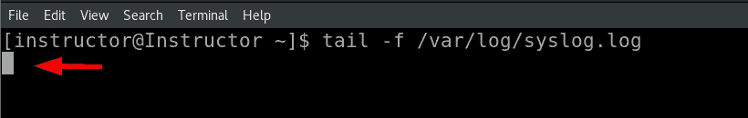
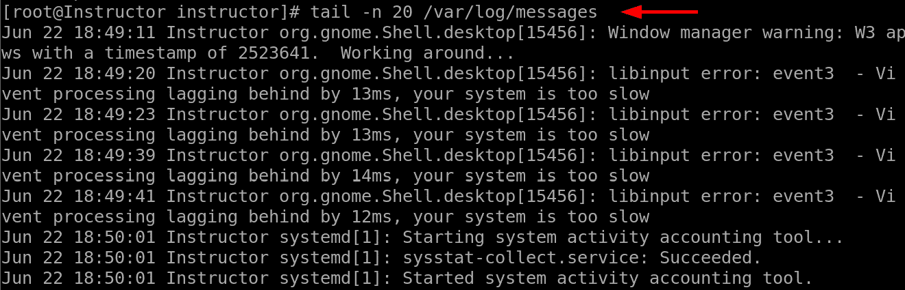
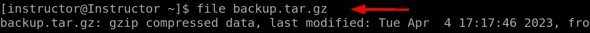
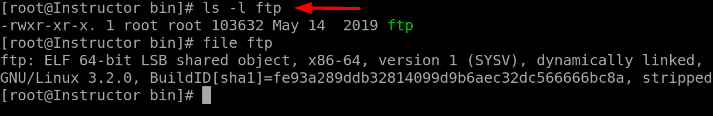
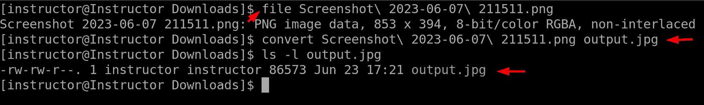
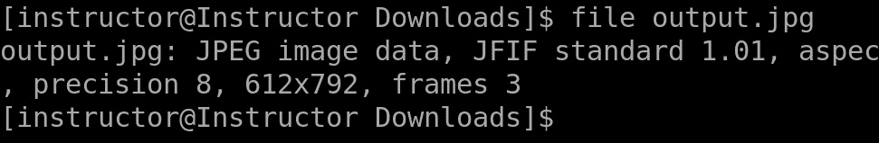
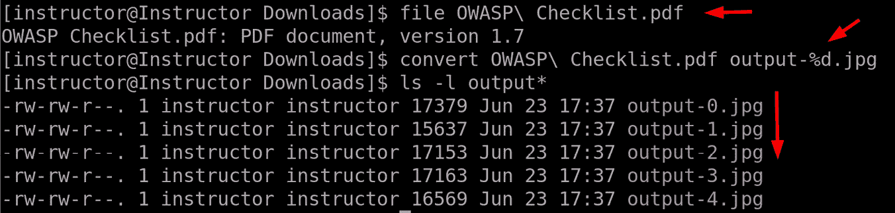
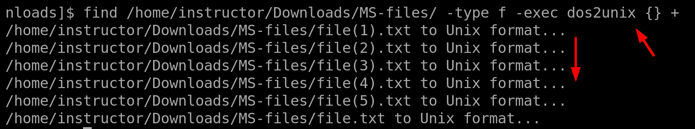
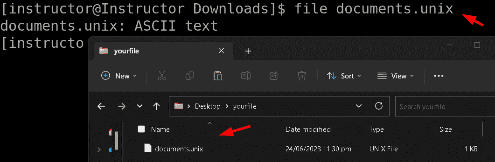
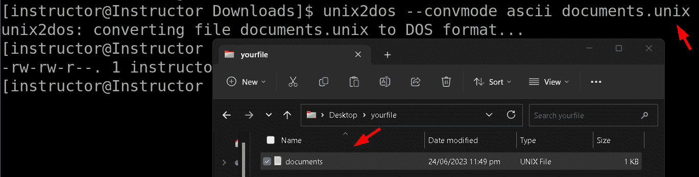

# 第七章：文件内容和转换命令

文件内容和转换命令在 Linux 系统管理员的日常操作中发挥着关键作用。这些命令提供了广泛的工具和功能，用于高效管理和操作 Linux 环境中的文件内容。凭借访问、搜索、修改和转换文件内容的能力，这些命令提供了巨大的灵活性和便利性，使其成为管理员不可或缺的工具。文件内容和转换命令被 Linux 系统管理员广泛使用的一个重要原因是它们在处理文本数据中的重要性。这些命令使管理员能够查看和分析文件内容、提取特定信息，并基于模式或条件执行操作。无论是搜索特定关键词、筛选数据，还是从日志文件中提取相关信息，这些命令都简化了过程，并使管理员能够高效处理大量文本数据。

此外，文件内容和转换命令在管理和操作文件格式中具有至关重要的作用。它们提供了将文件在不同格式之间转换的能力，如在 Unix 和 Windows 行结束符之间转换、字符编码转换以及根据特定需求转换文件格式。这种多功能性确保了不同系统和应用之间的无缝兼容性和互操作性，使得数据交换和在各种环境下处理文件变得更加容易。文件内容和转换命令的广泛应用还归功于它们在自动化任务和提高生产力方面的作用。这些命令可以与脚本和自动化工具结合，执行对文件的复杂操作，如批处理、数据提取和数据转换。通过利用脚本和这些命令的强大功能，管理员可以创建高效的工作流程，节省时间，并确保在多个任务或系统中保持文件操作的一致性。这些命令是 Linux 系统管理员高度赞赏的不可或缺的工具，因其在管理文件内容、提取相关信息以及进行文件格式转换方面的卓越能力。这些命令的重要性来源于它们处理文本数据的出色能力、高效处理各种文件格式的能力，并通过自动化简化任务，从而提高生产力和运营效率。

在本章中，我们将探讨文件内容和转换命令的迷人领域，这些是系统管理员非常看重的工具。它们在管理和操作文件内容、提取相关信息以及执行文件格式转换方面起着关键作用。它们提供了一系列强大的功能，提升了管理员工作效率和生产力。在本章中，我们将涵盖以下主要主题：

+   tail 和 file 命令

+   转换命令

+   使用 dos2unix 将 MS-DOS 文件转换为 Unix 格式

+   使用 unix2dos 将 Unix 文件转换为 MS-DOS 格式

+   recode 命令

# tail 和 file 命令

`tail`和`file`命令是 Linux 中强大的工具，扮演着文件管理和分析的重要角色。`tail`命令用于显示文件的结尾部分或实时监控文件变化。它对于监控日志文件特别有用，管理员可以查看最新的条目并跟踪系统活动。`tail`命令还允许多种选项，如指定显示的行数或持续更新输出。它提供的实时文件内容视图使其成为排查问题和系统监控中不可或缺的工具。另一方面，`file`命令用于确定给定文件的文件类型。它通过检查文件内容并提供有关其格式的信息，比如是文本文件、二进制文件，还是某种特定类型的文件，如图像、音频或视频文件。`file`命令使用文件签名数据库并进行深入分析，以准确识别文件类型。这些信息对于决定如何处理和解释文件至关重要，因为不同的文件类型可能需要不同的处理或操作。

`tail`和`file`命令的重要性在于它们能够提供关于文件内容和特征的关键信息。通过使用`tail`命令，管理员可以快速访问并监控日志文件中的最新更新，帮助调试和排查系统问题。而`file`命令则帮助管理员识别未知或模糊的文件类型，确保使用适当的工具和应用程序进行进一步处理或分析。这些命令通过提供即时的文件信息，节省了时间和精力，使管理员能够做出明智的决策并采取适当的行动。让我们看几个例子：

+   使用`tail`命令持续显示`syslog.log`文件的最后 10 行，并在新的日志条目追加时实时更新输出。这有助于监控系统事件并在问题发生时进行排查：

图 7.1 – 实时监控日志文件

当你运行 `tail -f /var/log/syslog.log` 命令时，光标会持续闪烁，因为带有 `-f` 选项的 `tail` 命令会不断监控指定文件的最新更新或变化。它实时跟踪文件，并显示任何附加到文件的新内容。闪烁的光标表示 `tail` 命令正在积极监控文件，等待事件发生。一旦 `/var/log/syslog.log` 文件中有新条目被写入，它们将显示在终端窗口中，光标也会相应更新。

这一功能对于监控日志文件或其他需要实时更新的文件特别有用。它允许系统管理员跟踪最新事件或变化，而无需手动刷新文件显示。闪烁的光标作为一个视觉指示，表示命令正在积极运行并捕捉新的内容。

+   `tail` 命令用于显示 `messages` 日志文件的最后 20 行。通过指定 `-n` 选项，管理员可以自定义显示的行数，这在处理大型日志文件时非常有用：

图 7.2 – 查看大型日志文件的最后 20 行

+   `file` 命令用于确定 `backup.tar.gz` 文件的文件类型，并提供其格式信息。它将文件识别为一个 `gzip` 压缩文件，并可能显示额外的细节，例如版本：

图 7.3 – 确定文档的文件类型

+   `file` 命令用于分析 `ftp` 二进制文件，并提供其格式信息。它将文件识别为二进制文件，并可能根据文件的结构和内容提供额外的详细信息：

图 7.4 – 分析二进制文件

这些示例展示了 `tail` 和 `file` 命令在各种文件管理和分析场景中的多功能性。无论是监控日志文件、检查文件类型，还是分析二进制数据，这些命令都为系统管理员提供了强大的功能。它们的易用性、多功能性以及能够提供关键信息的能力，使得 `tail` 和 `file` 命令在文件管理和分析任务中不可或缺。

# 转换命令

`convert`命令是一个强大的工具，在 Linux 系统中用于文件转换和处理。它提供了一个方便的方式来转换不同格式之间的文件，例如图像格式、文档格式等。这个命令非常多功能，支持广泛的文件格式，是 Linux 系统管理员和用户不可或缺的工具。`convert`命令重要的原因之一是它能够促进跨平台兼容性。它允许将文件从一种格式转换为另一种格式，确保文件能够在不同系统和应用程序之间轻松访问和使用。例如，它可以将图像文件从一种格式转换为另一种格式，使其与各种图像查看或编辑软件兼容。这增强了文件的互操作性，促进了无缝协作。`convert`命令常用于各种用途，如调整图像大小、改变图像质量、应用滤镜或效果、合并或拆分文档等。它的使用不仅限于基本的文件格式转换，还提供了修改和增强文件的附加功能。这种多功能性使其成为图形设计、网页开发、文档处理和多媒体制作等领域的重要工具。

`convert`命令的目的是简化和自动化文件转换任务。与其使用不同的软件或在线工具手动转换文件，不如直接在命令行中使用该命令进行转换。特别是在处理大量文件时，这样可以节省时间和精力。此外，该命令可以集成到脚本或自动化工作流中，从而实现高效且一致的文件转换过程。既然我们已经详细讨论了`convert`命令，接下来让我们通过一些实例来实践我们的知识。我们将使用`convert`命令来执行各种文件转换：

+   `convert`命令用于将 PNG 图像文件转换为 JPEG 格式，并将其保存为新的`output.jpg`文件：

图 7.5 – 将图像文件从 PNG 格式转换为 JPEG 格式（1）

图 7.6 – 将图像文件从 PNG 格式转换为 JPEG 格式（2）

当需要将图像文件转换为不同格式时，这个命令非常有用，比如在准备图像以便用于网页显示或与某些应用程序兼容时。

让我们分解一下*图 7.5*和*7.6*：

+   `file Screenshot\ 2023-06-07\ 211511.png`：此命令使用`file`命令来确定`Screenshot 2023-06-07 211511.png`文件的类型。它显示有关文件的信息，例如格式、尺寸、色深和是否交错。在这种情况下，它表示该文件是一个 PNG 图像，分辨率为 853 x 394 像素，使用 8 位 RGBA 色彩空间，并且是非交错的。

+   `convert Screenshot\ 2023-06-07\ 211511.png output.jpg`：此命令利用`convert`命令将`Screenshot 2023-06-07 211511.png`文件转换为 JPEG 格式，并将其保存为`output.jpg`。

以下是`output.jpg`文件的截图：

图 7.7 – output.jpg

在此案例中，它将文件从 PNG 格式转换为 JPEG 格式，这有助于文件大小的减少或与仅支持 JPEG 图像的应用程序的兼容性。

+   `convert`命令，您可以将`input.pdf`文件（一种 PDF 文档）转换为一系列 JPEG 图像。生成的图像将命名为`output-1.jpg`、`output-2.jpg`等。这个转换过程允许您提取 PDF 的内容，并将每一页保存为单独的 JPEG 图像：

图 7.8 – 将 PDF 文件转换为一系列 JPEG 图像

PDF 的每一页都被转换为单独的 JPEG 图像。当您想提取单独的页面或将 PDF 转换为图像文件以进行进一步处理或显示时，这将非常有用。

让我们分析一下*图* *7.8*：

+   `convert OWASP\ Checklist.pdf output-%d.jpg`：此命令利用`convert`命令将`OWASP Checklist.pdf`文件转换为一系列 JPEG 图像。`%d`字符是占位符，会被顺序数字替换，创建多个输出文件，命名为`output-1.jpg`、`output-2.jpg`等。生成的 JPEG 图像将保存在当前目录中。

+   `ls -l output*`：此命令使用`ls`命令并带有`-l`选项，显示以`output`开头的文件的详细信息。星号（`*`）作为通配符，匹配跟在`output`后面的任何字符。`-l`选项提供长格式列表，显示文件的权限、所有者、组、文件大小、修改时间戳以及其他属性。此命令用于列出由先前的`convert`命令创建的输出文件的详细信息。

这个 `convert` 命令提供了一种多功能且高效的解决方案，用于在 Linux 环境中执行文件格式转换和处理。凭借其对多种格式的广泛支持、用户友好的界面和自动化能力，`convert` 命令成为高效管理和转换文件的必备工具。无论目的是实现跨平台兼容性、进行图像编辑，还是促进文档处理，`convert` 命令都是一种可靠的工具，用于转换和编辑文件，简化流程并提高整体生产力。

# 使用 dos2unix 将 MS-DOS 文件转换为 Unix 格式

`dos2unix` 是一个强大的工具，用于将文本文件从 MS-DOS/Windows 格式转换为 Unix 格式。在 MS-DOS 格式中，文本文件中的行由回车符和换行符（`\r\n`）终止，而在 Unix 格式中，行由单一的换行符（`\n`）终止。`dos2unix` 命令会自动执行必要的转换，确保不同平台之间的兼容性。该命令在需要在 Unix 环境中处理或执行文本文件时特别有用。使用 `dos2unix` 命令的主要原因之一是确保在 MS-DOS/Windows 和 Unix 系统之间传输或共享文件时，文件能够无缝兼容。通过将 MS-DOS 格式的文件转换为 Unix 格式，消除了与行终止符相关的潜在问题。这在处理脚本、配置文件或任何需要 Unix 工具处理的基于文本的文件时至关重要。`dos2unix` 命令确保文件能够在 Unix 环境中正确读取、编辑和执行，确保一致和可靠的结果。

`dos2unix` 命令的重要性在于它能够促进 MS-DOS/Windows 和 Unix 系统之间的顺畅协作和互操作性。它确保在 MS-DOS 中创建或修改的文件可以无缝地在 Unix 环境中使用，从而支持高效的跨平台工作流。此外，该命令在 shell 脚本编写和自动化任务中得到了广泛应用。它允许系统管理员自动化多个文件的转换过程，或者将其集成到脚本中，以确保一致的文件格式标准。这有助于维护文件的完整性，并通过消除手动转换的工作，提高整体生产力。我们将提供演示并通过以下示例进行讲解：

+   调用 `dos2unix` 工具，它会执行转换过程。该工具检测到 `file.txt` 的文件格式为 MS-DOS，然后将其转换为 Unix 格式。转换过程涉及调整行结束符和其他格式元素，以符合 Unix 标准：

图 7.9 – 将单个 MS-DOS 文件转换为 Unix 格式

在命令的输出中，你可以看到类似 `dos2unix: converting file file.txt to Unix format...` 的信息。此消息表明转换过程正在进行，且指定的文件 `file.txt` 正在被转换为 Unix 格式。

+   `find /home/instructor/Downloads/MS-files/ -type f -exec dos2unix {} +` 命令用于查找并将特定目录及其子目录中的多个文件从 MS-DOS 格式转换为 Unix 格式：

图 7.10 – 递归地将目录及其子目录中的所有 MS-DOS 文件转换为 Unix 格式

以下是该命令的工作原理：

+   `find`：启动 `find` 命令，用于查找文件和目录。

+   `/home/instructor/Downloads/MS-files/`：指定搜索开始的目录，在此案例中，它是 `Downloads` 目录中的 `MS-files` 目录。

+   `-type f`：指定搜索仅考虑常规文件，排除目录和其他类型的文件。

+   `-exec`：指定对于每个找到的文件应执行以下命令。

+   `dos2unix {} +`：调用 `dos2unix` 命令将找到的文件转换为 Unix 格式。`{}` 字符作为占位符，代表 `find` 命令找到的每个文件名，`+` 符号表示可以将多个文件传递给一次 `dos2unix` 命令执行。

执行此命令后，指定目录及其子目录中的所有常规文件将被搜索。每当找到一个文件，`dos2unix` 命令就会执行，将其从 MS-DOS 格式转换为 Unix 格式。该命令支持高效的批处理多个文件，减少了单独执行每个转换命令的需求。

`dos2unix` 是一个基本命令，旨在将 MS-DOS 格式的文本文件转换为 Unix 格式。它的应用确保了跨平台兼容性，防止因行终止符的不同而产生的问题。通过无缝的文件转换，它促进了 MS-DOS/Windows 和 Unix 系统之间的协作与互操作性。此外，这个命令在自动化活动和脚本中也具有重要意义，能够简化文件转换过程，同时保持文件格式的一致性。

# 使用 unix2dos 将 Unix 文件转换为 MS-DOS 格式

现在，让我们来看看这个*邪恶的双胞胎*——`unix2dos`。它是一个命令行工具，用于将文本文件从 Unix/Linux 格式转换为 MS-DOS/Windows 格式。`unix2dos`起源于 Unix 的早期，旨在促进 Unix 系统与 MS-DOS 系统之间的文件兼容性。在 Unix 格式中，行结尾由单一的换行符（`\n`）表示，而在 MS-DOS 格式中，行结尾由回车符加换行符（`\r\n`）表示。`unix2dos`命令的重要性在于它能够确保 Unix 和 MS-DOS 系统之间的文件兼容性和互操作性。在计算机早期，Unix 和 MS-DOS 是用于不同平台的流行操作系统，而文件格式差异在这些系统之间共享文件时带来了挑战。`unix2dos`命令通过将 Unix 文件转换为 MS-DOS 格式提供了解决方案，使它们能够在 MS-DOS 系统上被读取和使用。这个转换过程确保行结尾能够被正确解析，从而保持文件内容的完整性。

`unix2dos`命令主要用于将文本文件从 Unix/Linux 系统传输到 MS-DOS/Windows 系统。当共享包含文本内容的文件时，尤其有用，例如代码文件、配置文件、脚本或任何其他文本文件。通过使用`unix2dos`将 Unix 文件转换为 MS-DOS 格式，用户可以确保文件兼容，并且可以在 MS-DOS/Windows 系统上正确查看、编辑和执行。这条命令通常用于需要在 Unix 和 MS-DOS 系统之间进行协作或文件交换的场景。例如，让我们转换一个单独的文件。

该命令将`document.txt`从 Unix 格式转换为 MS-DOS 格式，但首先让我们检查一下文件：

图 7.11 – 将 file.txt 从 Unix 格式转换为 MS-DOS 格式

从前面的截图中我们可以看到，我们创建的文件`documents.unix`包含一些由于 MS-DOS 系统的限制而无法读取的内容或特性。在尝试在 MS-DOS 系统上打开或读取此文件时，可能会遇到错误或显示不正确的内容。

现在，让我们转换这个文件。

`unix2dos --convmode ascii documents.unix`命令使用`unix2dos`工具将名为`documents.unix`的文件从 Unix 格式转换为 DOS 格式：

图 7.12 – unix2dos 将 documents.unix 文件转换为 DOS 格式

当运行此命令时，指定了`--convmode ascii`标志，这表示转换应使用`--convmode ascii`，即指示`unix2dos`使用 ASCII 编码进行文件转换。

执行该命令后，`unix2dos: converting file documents.unix to DOS format...`的输出消息表示转换过程正在进行。原始的`documents.unix`文件正在转换为 DOS 格式，这意味着文件中的行结束符从 Unix 换行符（`\n`）被改为 DOS 格式，即由回车符（`\r`）和换行符（`\n`）组成。转换完成后，`documents.unix`文件将变为 DOS 格式，使其能够与基于 DOS 的系统和应用程序兼容。此格式的变化确保文件能够在 DOS 或 Windows 平台上正确显示和处理，因为这些平台期望文件具有 DOS 风格的行结束符。

`unix2dos`的目的是通过转换文件格式，确保 Unix 和 MS-DOS 系统之间的文本文件能够无缝交换，从而实现兼容性。它消除了由于不兼容的行结束符所可能引发的问题，确保文件能够在 MS-DOS/Windows 系统上正确解析和显示。该命令通过将换行符转换为回车和换行符序列，遵循 MS-DOS/Windows 平台的行结束符约定，达成这一目的。这个转换过程允许文件在共享、编辑和处理时，原始内容不会丢失或失真，实现 Unix 与 MS-DOS 系统之间的平稳互操作。

# recode 命令

`recode`命令是 Linux 中一个多功能且强大的工具，用于字符集的转换和处理。它的目的是将文本文件的编码从一种字符集转换到另一种字符集，确保不同系统和应用程序之间的兼容性和正确解释。该命令支持广泛的字符集，使其成为处理多语言数据和解决数据交换中可能出现的编码问题的宝贵工具。`recode`命令之所以重要，主要是因为它能够确保文本数据的一致性和准确性。不同的系统和应用程序可能使用不同的字符集或编码，导致乱码或显示不正确的文本。通过使用`recode`，系统管理员可以将文本文件转换为所需的字符集，从而消除这些问题，确保文本在各种平台上的正确渲染和解释。

`recode`命令在需要字符集转换的场景中得到广泛应用。它能够实现使用不同编码的系统之间的无缝集成和数据交换，确保文本表示的兼容性和一致性。这在多语言环境中尤为重要，因为文本数据可能包含来自不同语言和字符集的字符。通过使用`recode`命令，系统管理员可以克服编码障碍，促进在使用不同字符集的用户之间的顺畅沟通与协作。通过以下示例，我们可以深入了解`recode`命令的实际应用及其带来的好处：

+   `ISO-8859-1`格式的文件需要转换为`UTF-8`。`recode`命令可以通过执行以下命令完成此操作：

图 7.13 – 转换文件编码

下面是命令的分解：

+   `recode UTF-8..ISO-8859-1 file.txt`：此命令将`file.txt`的字符编码从`UTF-8`转换为`ISO-8859-1`。`UTF-8`是一种广泛使用的字符编码器，支持多种语言的字符，而`ISO-8859-1`（也称为`UTF-8`编码字符的对应`ISO-8859-1`等效字符）。

+   `recode ISO-8859-1..UTF-8 file.txt`：此命令将`file.txt`的字符编码从`ISO-8859-1`转换为`UTF-8`。此命令是对前一个命令过程的逆操作，将`ISO-8859-1`编码的字符映射到其对应的`UTF-8`表示。

这两个命令都使用了`recode`命令行工具，这是 Linux 中常用的字符编码转换工具。这些命令的目的是便于在不同字符编码之间转换文本文件，使得它们能够被预期特定编码的系统或应用程序正确地解读和显示。

总结来说，Linux 中的`recode`命令是一个重要的字符集转换和处理工具。它的意义在于能够确保不同系统和应用程序之间文本数据的兼容性、正确呈现和准确解释。通过使用`recode`，系统管理员可以解决编码问题，实现文本表示的一致性，并促进多语言环境中的无缝数据交换。

# 总结

本章为我们提供了对在 Linux 环境中转换和操作文件内容所需的各种命令的全面了解。章节涵盖了一系列重要命令，包括`tail`、`file`、`convert`、`dos2unix`、`unix2dos` 和 `recode`。这些命令为处理文件、执行格式转换以及确保不同系统之间的兼容性提供了强大的功能。`tail` 和 `file` 命令使我们能够提取文件的特定部分并收集有关文件类型和格式的宝贵信息。`convert` 命令被证明是一个多功能的工具，用于转换文件格式，允许我们将文件从一种格式转换为另一种格式。

在下一章，我们将深入探讨 Linux 的 SWAP 命令。这些命令对于管理交换空间至关重要，提供额外的内存资源、初始化分区或文件以供交换使用，并监控内存消耗。通过理解和使用这些命令，系统管理员可以优化内存管理，并提高 Linux 环境中的系统性能。
