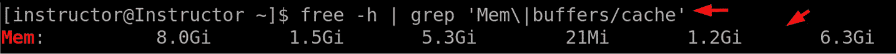
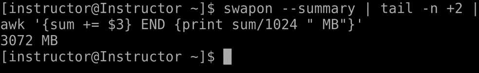
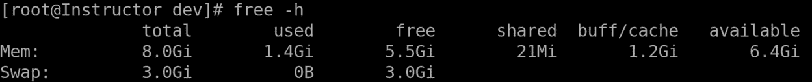
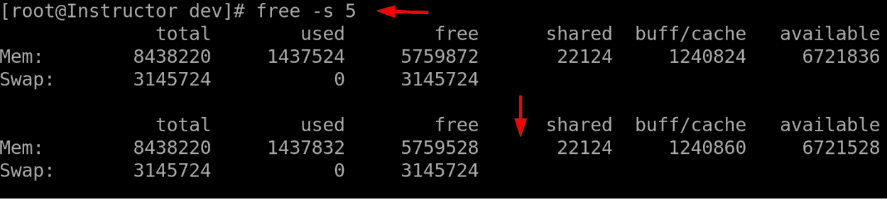

# Linux SWAP 命令

Linux SWAP 命令是 Linux 系统管理中的一个重要组成部分，允许管理员有效管理操作系统中的交换空间。交换空间是内存管理中的关键组件，当物理 RAM 容量不足时，提供额外的虚拟内存。这些命令在 Linux 系统管理员中广泛使用，因为它们在优化系统性能和确保高效内存利用方面具有重要作用。Linux SWAP 命令的重要性在于它们能够增强系统稳定性并防止与内存耗尽相关的问题。通过有效管理交换空间，管理员可以缓解内存瓶颈，使系统能够处理内存密集型任务并防止崩溃或变慢。这在系统遇到高内存需求或同时运行多个资源密集型应用程序时尤为重要。这些命令的目的是为管理员提供必要的工具来控制和监控交换空间。它们使管理员能够配置和激活交换设备或文件，从而精细调整系统的内存管理设置。此外，它们提供内存使用情况的洞察，允许管理员监控交换空间的使用情况，并做出关于内存分配和优化的明智决策。由于它们在确保高效内存使用和系统稳定性方面的作用，Linux 系统管理员高度重视这些命令。通过使用这些命令，管理员可以根据系统的需求主动管理和分配内存资源，从而提高系统性能，减少内存相关问题，并增强整体可靠性。

通过这些命令，系统管理员可以有效管理交换空间并优化内存使用。它们的重要性在于能够增强系统稳定性、防止内存耗尽，并允许高效处理内存密集型任务。

本章将涵盖以下主要主题：

+   swapon 命令

+   free 命令

# swapon 命令

`swapon` 命令是 Linux 中一个至关重要的工具，它允许系统管理员激活和配置交换设备或文件。交换空间作为物理内存（RAM）的扩展，为系统提供额外的虚拟内存。它位于磁盘上，通常以专用分区或交换文件的形式存在。操作系统将这个磁盘空间作为物理 RAM 的扩展，允许在 RAM 和交换空间之间根据需要移动数据，以高效管理系统内存。`swapon` 命令在高效管理内存资源和优化系统性能方面起着重要作用。`swapon` 命令至关重要的一个原因是它能够处理系统物理内存不足以应对工作负载的情况。通过使用 `swapon` 命令激活交换设备或文件，管理员可以有效地增加可用内存资源，使系统能够处理内存密集型任务，而不会遇到内存不足或性能下降的问题。这在物理内存有限或运行资源密集型应用程序的环境中尤为重要。

由于其多功能性和灵活性，这个命令在 Linux 系统管理员中被广泛使用。它使管理员能够根据具体需求配置交换设备或文件。这包括指定交换空间的位置和大小，以及为多个交换设备定义交换优先级。`swapon` 命令使管理员能够微调系统的内存管理设置，确保高效利用可用资源。`swapon` 命令的主要目的是启用高效的内存管理并优化系统性能。通过激活交换设备或文件，该命令扩展了系统的虚拟内存，使其能够处理超出物理 RAM 容量的内存需求。这有助于防止与内存相关的问题，如 `swapon` 命令是维护系统稳定性并确保系统平稳运行的关键工具，尤其是在内存需求波动或超过物理内存限制的环境中。让我们探索一些示例并利用它们的实际应用：

+   `swapon` 命令提供了一种获取有关活动交换设备的全面详细信息的方式，提供有价值的信息，如设备路径、类型、大小和优先级。此功能允许系统管理员了解当前启用的交换设备及其相关属性。通过执行 `swapon` 命令，用户可以检索有关活动交换配置的详细摘要，便于高效监控和管理交换资源：

图 8.1 – 执行 swapon 命令以获取活动交换设备的详细信息

在此示例中，输出显示以下列：

+   `NAME`：该列指示交换设备的名称或标识符。在此示例中，显示为`/dev/dm-1`，表示在`/dev/dm-1`设备上的交换分区。

+   `TYPE`：该列指示交换设备的类型。这里显示设备是`partition`类型，表示它是一个专门用于交换空间的分区。

+   `SIZE`：该列显示交换设备的大小。在示例中，大小为`3G`，表示交换分区的容量为 3 GB。

+   `USED`：该列表示当前正在使用的交换空间量。在输出中，它显示为`0B`，表示当前没有使用任何交换空间。

+   `PRIO`：该列表示分配给交换设备的优先级。较高的优先级值表示更倾向于使用该交换设备。在此示例中，优先级为`-2`，意味着该交换设备的优先级较低。

+   `free`命令用于显示系统的内存使用情况，包括总物理内存（RAM）、已用内存、空闲内存和交换空间。在接下来的内存使用监控主题中，我们将详细介绍`free`命令，并解释如何解读其输出，以评估系统的内存状况：

图 8.2 – 显示内存使用情况的信息

`free -h | grep 'Mem|buffers/cache'`命令的输出提供了系统内存使用情况的信息。以`Mem:`开头的行显示系统物理内存（RAM）的详细信息。在这个例子中，它显示了总物理内存为`8.0Gi`（GB）。下一列显示已使用的内存量，为`1.5Gi`。接下来的列表示为缓冲区和缓存分配的内存量，为`5.3Gi`。随后的列提供了其他内存指标的信息，比如为内核用途使用的内存量（`21Mi`）和可用内存（`1.2Gi`和`6.3Gi`）。

+   **示例 3**：检查可用交换空间：

图 8.3 – 检查可用交换空间

`swapon --summary | tail -n +2 | awk '{sum += $3} END {print sum/1024 " MB"}'`命令的输出提供了以 MB 为单位的总交换空间大小。

让我们一步步解析该命令：

+   `swapon --summary`显示当前活动交换设备及其相应大小的摘要。

+   `tail -n +2`过滤输出并跳过第一行（即标题行），仅显示包含交换设备信息的后续行。

+   `awk '{sum += $3} END {print sum/1024 " MB"}'` 使用 `awk` 命令计算第三列的总和（该列表示每个交换设备的大小），并将结果存储在 `sum` 变量中。`END` 块在处理完所有行后执行，它将总和除以 1,024，以将其从 KB 转换为 MB，并显示单位 `MB`。

在此示例中，`3072 MB` 的输出表示交换空间的总大小为 3,072 MB。此信息对于监控和管理系统中可用的交换空间非常有用。

通过结合这些命令，您可以全面了解 Linux 系统中 RAM 的可用内存和交换空间的情况。此外，`swapon` 命令在配置和启用特定文件或设备作为交换空间方面发挥着至关重要的作用，当系统需要时，可以扩展虚拟内存容量。这有助于实现高效的内存管理，并确保系统能够处理超过物理内存容量的任务。总的来说，`swapon` 命令对系统管理员来说具有重要意义。它的主要功能是激活和配置交换设备或文件，从而为系统增加额外的虚拟内存。这个功能对于有效管理内存资源、避免内存耗尽以及提高整体系统性能至关重要。`swapon` 命令提供了多种选项和设置，允许管理员微调内存管理参数，最大化利用可用资源。因此，它已成为 Linux 系统管理员工具箱中不可或缺的工具，帮助他们优化内存使用并保持系统良好运行。

# free 命令

`free` 命令是一个强大的工具，用于 Linux 系统中提供关于系统内存使用情况的信息。它在监控和管理内存资源中起着至关重要的作用，使系统管理员能够优化系统性能，并确保有效利用可用内存。该命令显示各种度量指标，包括总内存、已用内存、空闲内存以及为缓冲区和缓存分配的内存。通过分析 `free` 命令的输出，管理员可以评估系统的内存状态，识别潜在的内存问题，并做出关于内存分配和优化的明智决策。`free` 命令的重要性在于它能够提供内存使用的实时信息。内存是任何系统中的关键资源，监控其使用情况对维持系统的稳定性和性能至关重要。`free` 命令提供了一个全面的内存利用概况，使管理员能够识别占用大量内存的进程，检测内存泄漏，并采取适当的措施缓解内存相关问题。它还可以让管理员评估内存密集型任务对系统整体性能的影响，并进行必要的调整以优化资源分配。

`free` 命令被 Linux 系统管理员广泛用于各种目的。它有助于排查与内存相关的问题，例如识别内存使用过高或可用内存不足。管理员可以使用该命令确定系统是否内存不足，并采取适当措施缓解问题，例如通过终止不必要的进程释放内存，或优化关键应用程序的内存分配。此外，`free` 命令还可以用于容量规划，管理员可以收集内存使用趋势的数据，以判断是否需要增加额外的内存资源来应对未来的需求。它是监控系统性能的有力工具，确保内存的最佳利用，并保持一个稳定高效的 Linux 环境。在我们之前的讨论中，我们探讨了 `free` 命令的功能。现在，让我们通过研究该命令的其他标志和选项，进一步了解它：

+   检查内存使用情况：

图 8.4 – 使用 free 命令检查内存使用情况

这将以人类可读的格式显示内存使用情况，展示总内存、已用内存和可用内存。

+   检查连续模式下的内存使用情况：

图 8.5 – 使用 free 命令检查连续模式下的内存使用情况

`-s` 标志指定了更新显示的内存信息的时间间隔（单位：秒）。在这个示例中，命令会每 5 秒刷新一次内存使用情况，提供实时更新。

总的来说，`free` 命令提供实时的内存使用信息，并帮助排查与内存相关的问题。这使得它成为内存管理的一个重要组成部分。通过利用 `free` 命令提供的洞察，管理员可以做出明智的决策，提升系统性能，并确保 Linux 系统中的资源分配高效。

# 总结

本章深入探讨了 Linux SWAP 命令，它们在 Linux 系统中的内存管理和性能优化中至关重要。本章重点介绍了两个关键命令：`swapon` 和 `free`。`swapon` 命令使系统管理员能够激活和配置交换设备或文件，从而为系统增加额外的内存资源。最后，`free` 命令提供实时的内存使用信息，帮助识别与内存相关的问题，并协助容量规划。

在下一章中，我们将探索一系列必备工具，用于监控系统性能、排查问题以及调试 Linux 环境中的问题。这些命令提供了关于系统各个方面的宝贵信息，帮助管理员高效识别和解决问题。通过掌握这些命令，系统管理员可以维持 Linux 系统的稳定性、可靠性和性能。
