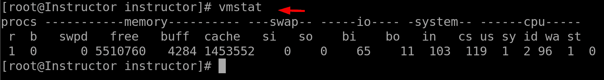
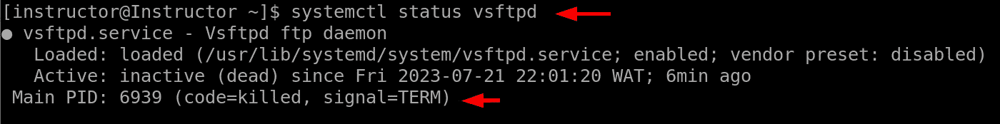

# Linux 监控与调试命令

Linux 监控与调试命令是 Linux 系统管理员在监控系统性能、故障排除和调试 Linux 环境中的问题时广泛使用的一组重要工具。这些命令提供了实时的系统各个组件和进程的洞察，帮助管理员及时识别并解决潜在的瓶颈、错误或性能问题。这些命令的重要性在于它们能够确保系统的稳定性，优化资源利用，并提升整体的系统性能。通过利用监控与调试命令，管理员可以主动管理系统健康，减少风险，并保持一个可靠高效的 Linux 环境。这些命令的主要目标是为系统管理员提供必备的工具，以有效监控和诊断 Linux 系统的状态。它们还可以提供关键的系统指标，如 CPU 使用率、内存利用率、磁盘 I/O、网络活动和进程信息等宝贵的洞察。通过密切监控这些指标，管理员可以主动识别任何异常行为，跟踪系统性能趋势，并在问题扩大之前发现潜在问题。此外，调试命令提供了强大的能力，用于调查和解决系统错误、软件漏洞和兼容性问题。它们使管理员能够跟踪程序执行过程，捕获错误日志，分析系统日志，并执行故障排除步骤，找出问题的根本原因并采取适当的解决措施。

这些命令是系统管理员最常用的工具之一，原因有几个。首先，这些命令为管理员提供了实时和准确的系统性能与行为数据，使他们能够做出明智的决策并采取主动措施以优化系统资源。其次，这些命令提供了广泛的功能，允许管理员根据需求监控和分析特定的组件或进程。这种灵活性使得这些命令可以适应各种使用场景。除此之外，这些命令还通过提供详细的信息和诊断能力，促进了高效的故障排除和调试过程。这帮助管理员节省了识别和解决问题的时间和精力，从而提高了系统的稳定性并减少了停机时间。

在本章中，我们将介绍以下主要内容：

+   top、ps、pstree、strace、watch、smartctl 和 uptime 命令

+   lsof、lsmod、last reboot、last、w 和 vmstat 命令

+   kill 命令

+   pkill 命令

随着 Linux 的流行，它成为了服务器和企业环境中一个重要的选择，强大的监控和调试工具的需求也变得显而易见。Linux 社区认识到拥有全面工具的重要性，这些工具可以提供系统性能的深入分析，帮助故障排除，并实现高效的调试。随着时间的推移，开发了众多命令行工具、软件包和框架来满足这些需求。这些工具旨在为管理员提供实时监控能力、详细的系统信息和先进的调试功能。Linux 监控和调试命令的不断演变是由现代系统的日益复杂性、对最佳性能的需求以及快速识别和解决问题的需求驱动的。今天，Linux 管理员可以利用大量强大的工具来有效地监控和调试系统，确保 Linux 环境的稳定性、可靠性和性能。

# `top` 命令

`top` 命令是一个强大的 Linux 工具，用于实时监控系统进程和资源使用情况。它是系统管理员用来深入了解 Linux 系统性能和健康状况的首选工具。`top` 命令的主要目的是展示系统进程、CPU 使用率、内存利用情况、负载平均值以及其他关键系统统计信息的动态交互式概览。通过持续更新这些信息，管理员可以快速识别占用资源过多的进程、瓶颈或可能影响系统性能的异常情况。`top` 命令是 Linux 监控的重要组成部分，提供了系统活动的全面视图，并促进了高效的故障排除。

`top` 命令被系统管理员广泛使用的一个关键原因是其多功能性。它以紧凑且易于理解的格式提供丰富的信息，使其成为监控系统健康状况的宝贵工具。管理员可以使用 `top` 命令观察实时的 CPU 使用情况、内存分配和进程活动。这使他们能够检测潜在的性能问题，识别消耗过多资源的进程，并采取适当的措施来优化系统性能。此外，`top` 命令还提供系统负载平均值的信息，指示整体系统工作负载，帮助管理员判断系统是否处于高负载状态。`top` 命令的重要性不仅仅在于监控系统资源。它还作为一种诊断工具，用于排查系统问题。管理员可以使用 `top` 命令调查特定进程的行为，识别潜在瓶颈，并分析资源消耗模式。通过了解系统资源的分配和利用情况，管理员可以做出明智的决策，以优化系统性能并解决问题。`top` 命令还支持交互式功能，允许管理员动态调整显示，按各种标准对进程进行排序，并向单个进程发送信号，以进行进一步分析或控制。这种灵活性和控制力使得 `top` 命令成为 Linux 系统管理员的必备工具。让我们深入探讨如何在 CentOS 终端中使用 `top` 命令：

+   `top` 命令提供了有关系统统计信息的实时洞察，包括 CPU 使用率、内存利用率和系统负载。这些信息会动态更新，提供系统性能和资源分配的全面概述：

图 9.1 – 查看整体系统统计信息

+   `top` 命令还提供了根据 CPU 使用率对显示的进程列表进行排序的功能。可以在下图中看到这一点：

图 9.2 – 根据 CPU 使用率排序进程

此功能使您能够快速识别消耗最多 CPU 资源的进程，因为它会在输出的顶部列出。这样的功能为优先处理和监控 CPU 密集型进程提供了便捷的方法。这反过来使系统管理员更容易识别潜在的性能瓶颈，并采取适当的措施来优化系统资源。

+   `-o %MEM` 选项用于监控内存使用情况，如下图所示：

图 9.3 – 监控内存使用的命令

结果如下所示：

图 9.4 – 监控内存使用情况

`top` 命令将按内存使用情况对进程进行排序，显示进程列表，允许您监控哪些进程占用了最多的内存。

+   `username` 为我们要过滤的实际用户名：

图 9.5 – 按用户过滤进程的命令

结果如下：

图 9.6 – 使用 top 按用户过滤进程

`top` 命令过滤显示的进程，仅显示由指定用户名拥有的进程。

总体而言，`top` 命令是一个多功能且重要的工具，用于在 Linux 环境中监控系统进程和资源使用情况。它对系统性能的实时洞察、互动功能和诊断能力，使其成为系统管理员的宝贵资产。通过使用 `top` 命令，系统管理员可以有效地监控系统健康状况，识别资源密集型进程，排除故障，并优化系统性能。它在 Linux 系统管理员中被广泛使用，证明了其在维持 Linux 系统稳定性、可靠性和最佳功能方面的重要性和有效性。

# `ps` 命令

`ps` 命令是 Linux 中的一个强大工具，用于提供关于系统上运行的进程的信息。它的优势在于能够实时查看系统中运行的进程。它是监控系统健康状况和效率的宝贵工具，允许管理员识别任何可能影响系统性能的不正常或资源密集型进程。

`ps` 命令的主要用途是进程监控和管理。管理员可以使用它查看系统上活动进程的快照，包括它们的状态、资源使用情况及与其他进程的关系。这些信息对于排除系统故障、识别潜在瓶颈和优化系统性能至关重要。

例如，`ps` 命令可以用于以下操作：

+   `ps` 命令显示系统中所有正在运行的进程列表。它提供每个进程的信息，包括进程 ID（PID）、与进程关联的终端、从启动以来的 CPU 和内存使用情况，以及启动该进程的命令：

图 9.7 – 使用 ps 命令查看所有运行中的进程

+   使用 `-e` 选项的 `ps` 命令会显示特定用户拥有的进程列表，其中 `username` 替换为实际的用户名。它对于管理员提供特定用户进程的概览非常有用：

图 9.8 – 查看由特定用户拥有的进程

总之，`ps` 命令是 Linux 系统管理员的基石工具，提供有关运行进程的重要信息，并促进进程管理和故障排除。它提供的实时进程状态、资源利用率和进程关系信息，使管理员能够确保系统的稳定性、提高性能并有效分配系统资源。凭借其多功能性和广泛的应用范围，`ps` 命令仍然是 Linux 监控和管理工具包中不可或缺的一部分。

# pstree 命令

`pstree` 命令是一个 Linux 工具，用于以树状结构显示系统中正在运行的进程。它提供了一个进程的可视化和层级化视图，显示了进程之间的父子关系。当试图理解进程结构以及不同进程如何相互关联时，这个命令特别有用。通过以树状格式显示进程，管理员可以快速识别父进程（`init` 或 `system`）及其子进程，从而帮助他们把握整体的进程层级。这个信息对于系统调试、性能分析和故障排除至关重要。`pstree` 命令还帮助进程管理，因为它允许管理员可视化复杂的进程结构及其依赖关系，从而更容易识别潜在问题并优化系统性能。让我们仔细看看它的使用方法：

+   `pstree` 命令：

图 9.9 – 使用 pstree 命令查看进程树

+   在终端中运行 `pstree -p` 命令时，它将显示系统中所有运行进程的层级表示，类似于标准的 `pstree` 输出，但每个进程的 PID 会显示在其名称旁边。PID 是操作系统分配给每个进程的唯一 ID：

图 9.10 – 使用 pstree 查看 PID

`pstree -p` 命令在故障排除或调查系统中的进程时特别有用。它允许您快速识别进程之间的父子关系及其对应的 PID。这有助于理解系统中运行的进程结构，并帮助您识别可能导致问题或消耗过多资源的特定进程。

# strace 命令

`strace`命令是一个强大的 Linux 工具，用于跟踪和调试进程所做的系统调用。它在进程运行时拦截并记录进程所发出的系统调用，提供有关进程与 Linux 内核之间交互的详细信息。这种级别的可见性对于诊断和解决与系统调用、应用行为和软件错误相关的问题具有无价的价值。通过分析`strace`的输出，管理员可以识别文件访问问题、库依赖关系、权限错误或资源冲突等问题。它特别适用于调试复杂的应用程序、排查崩溃问题和确保程序正确执行。`strace`命令广泛被系统管理员、开发人员和支持团队用作调查底层系统交互、理解各种软件和性能问题根本原因的基本工具。请注意，使用`strace`跟踪具有提升权限或系统级别访问的进程时，需要`sudo`权限。`pstree`和`strace`命令是 Linux 管理员工具箱中的两个必备工具。它们提供有关进程层次结构和系统交互的宝贵见解，帮助管理员了解系统行为、诊断问题并优化性能。`pstree`有助于清晰地可视化进程关系，使管理员能够理解复杂的进程结构并识别可能的进程瓶颈。另一方面，`strace`提供了对系统调用的深入跟踪，使管理员能够监视进程与内核之间的交互，从而有助于调试和识别软件应用中的问题。这些命令的重要性体现在它们能够简化故障排除过程、增强系统稳定性和提高整体系统性能，使其成为 Linux 系统管理员不可或缺的工具。我们将探索每个命令的示例：

+   `strace`命令将仅跟踪`ls`命令发出的打开和读取系统调用

+   过滤系统调用可以专注于特定操作，减少`strace`生成的输出量

+   分析过滤后的输出，以深入了解`ls`命令如何通过打开和读取文件与文件进行交互：

图 9.11 – 使用 strace 过滤系统调用

总结来说，`pstree` 和 `strace` 命令是 Linux 系统管理员不可或缺的工具，每个工具在系统监控和调试中都有独特的用途。`pstree` 命令提供了一个清晰的、层次化的运行进程视图，简化了进程关系和依赖性的理解。这种可视化表现有助于故障排除、性能分析和进程管理任务，从而提高系统稳定性和性能。另一方面，`strace` 命令擅长追踪系统调用，并提供关于进程行为、软件错误和低级系统交互的详细信息。这种强大的可见性对诊断复杂问题和识别软件问题的根本原因至关重要。系统管理员和开发人员依赖 `strace` 来排查崩溃、检测权限错误、解决库依赖问题，并确保程序正确执行。

# watch 命令

`watch` 命令是 Linux 中一个强大的实用工具，用于在定义的时间间隔内反复执行指定的命令，并在终端显示其输出。它特别适用于实时监控和观察系统数据随时间变化的情况。该命令接受一个命令行参数，并定期刷新终端屏幕以显示给定命令的更新输出。这种连续刷新的方式提供了数据的动态视图，使系统管理员更容易跟踪系统指标、分析进程或观察某些命令的行为。`watch` 命令对于需要频繁更新的监控任务非常有用，例如检查系统资源使用情况、日志文件更新或网络活动。它简化了获取实时信息的过程，使管理员能够迅速响应任何变化或异常，是 Linux 系统管理员工具包中不可或缺的工具。

我们可以使用 `watch` 命令结合 `ifconfig` 命令来实时监控网络流量：

图 9.12 – 实时监控网络流量的命令

结果如下：

图 9.13 – 结合使用 watch 和 ifconfig 命令

现在让我们来看看另一个命令——`smartctl` 命令。

# smartctl 命令

`smartctl` 命令是 Linux 系统管理员管理硬盘和存储设备的重要工具。它是 `smartctl` 命令的一部分，管理员可以主动监控存储设备的状态，检测即将发生故障的迹象，并采取必要的措施来防止数据丢失和系统停机。这些宝贵的信息使系统管理员能够做出明智的决策，进行存储维护、升级规划和更换策略，确保数据完整性和系统稳定性。

我们可以使用 `smartctl` 命令获取存储设备的健康状况和状态：

图 9.14 – 使用 smartctl 获取存储设备的健康状态

# uptime 命令

`uptime` 命令是 Linux 系统管理员用来快速检查系统当前运行时间和负载平均值的简单但重要的工具。执行时，该命令会显示当前时间、系统自上次启动以来的运行时间、当前登录的用户数量，以及过去 1、5 和 15 分钟的负载平均值。负载平均值代表指定时间间隔内，系统运行队列中的进程平均数量。`uptime` 命令对于评估系统性能、资源利用率和系统响应能力至关重要。通过定期监控运行时间和负载平均值，管理员可以识别系统活动高峰期和潜在的瓶颈，从而做出关于系统优化、容量规划和资源分配的明智决策。此工具在排除性能问题时尤其有用，因为它提供了系统健康状况的快速快照，并帮助管理员检测异常或系统负载过重的时段。

通过进一步探讨提供的上述命令示例，我们将深入研究如何高效地被系统管理员使用：

+   **监控** **CPU 使用率**：

图 9.15 – 监控 CPU 使用率的命令

结果如下：

图 9.16 – 使用 uptime 监控 CPU 使用率

总结来说，`watch`、`smartctl` 和 `uptime` 命令是 Linux 系统管理员不可或缺的工具，提供了实时监控、存储设备管理和系统性能评估的宝贵功能。

# lsof 命令

Linux 中的 `lsof` 命令是用于执行各种管理任务的工具，例如终止占用关键文件锁的进程或识别与特定网络连接相关联的进程。

`lsof` 命令的主要用途在于其多功能性和灵活性。它可以用来检查各种类型的资源，如常规文件、目录、网络套接字以及字符/块设备。这使它成为调查网络相关问题、分析磁盘使用情况、管理挂载的文件系统以及检查潜在资源泄漏的必备工具。总的来说，`lsof` 命令为 Linux 系统管理员提供了丰富的文件和进程交互信息，有助于高效的系统管理和故障排除。

我们将使用以下命令列出系统中所有打开的文件：

图 9.17 – 使用 lsof 列出系统中所有打开的文件

以下是命令的分解：

+   `lsof`：执行的命令是 `lsof`。它提供了关于当前由系统打开并使用的文件和进程的信息。

+   `>`：这是 Linux 中的重定向操作符。它用于将命令的输出重定向到文件，而不是显示在终端上。

+   `file.txt`：这是 `lsof` 命令输出将被保存的文件名。你可以选择任何你想要的文件名，但 `file.txt` 只是一个示例。

# lsmod 命令

`lsmod` 命令用于显示当前系统上加载的内核模块。内核模块是可以动态加载或卸载到 Linux 内核中的小段代码，它们为操作系统添加或移除特定功能。`lsmod` 命令提供了一个简洁且有组织的视图，显示了内核模块的名称、大小以及它们的引用或依赖关系的数量。`lsmod` 命令的意义在于其能够检查内核的运行时配置。这个命令为系统管理员提供了确认当前加载并处于活动状态的内核模块的能力。这些信息在故障排除硬件相关问题时非常重要，因为内核模块在管理设备驱动程序和其他关键功能中起着至关重要的作用。

我们将使用以下命令查看当前加载的内核模块：

图 9.18 – 使用 lsmod 查看当前加载的内核模块

下面是输出的解释：

+   表头行提供了输出中各列的名称。三个主要列是 `Module`、`Size` 和 `Used by`。

+   `Module` 列列出了加载的内核模块的名称，`Size` 和 `Used by` 列分别表示每个模块在内存中的大小以及使用该模块的内核组件的数量。

+   输出显示了当前加载并由系统使用的几个内核模块的信息。

+   每一行对应一个特定的内核模块，列提供了关于该模块的详细信息。

    例如，我们来看第一行：

    +   `nls_utf8` 模块已加载，并占用 16,384 字节内存

    +   有一个内核组件使用了 `nls_utf8` 模块

    同样，其他行提供了有关当前加载的不同模块及其各自大小和使用情况的信息。

# 最后一次重启命令

Linux 中的 `last reboot` 命令是一个简单但至关重要的工具，用于提供系统重启历史的信息。它显示了先前系统重启的时间戳，以及自上次重启以来的时间。这些信息对于系统管理员跟踪系统的可用性和正常运行时间非常有帮助。通过定期检查最后的重启时间戳，管理员可以快速识别系统是否经历了任何意外的关机或重启。此信息对于诊断可能导致系统不稳定的硬件或软件问题至关重要。

`last reboot` 命令的主要用途是进行历史分析和跟踪系统的可用性。系统管理员可以利用这些信息来计算系统的**平均故障间隔时间**（**MTBF**）和**平均修复时间**（**MTTR**），这些是评估系统可靠性的关键指标。

要显示系统的重启历史，我们使用以下命令：

图 9.19 – 使用 last reboot 命令显示系统的重启历史

# last 命令

`last` 命令是一个多功能且强大的工具，Linux 系统管理员用它来查看系统上用户登录活动的历史记录。它显示了先前登录会话的列表，包括日期、时间、持续时长以及登录发生的远程主机。这些信息对于监控用户访问系统、识别潜在的安全漏洞以及调查未授权的访问尝试至关重要。`last` 命令允许管理员跟踪用户活动、检测异常的登录模式，并确保系统的安全性和完整性。此外，它还通过提供全面的用户登录事件日志，方便了审计和合规性工作，使其成为系统管理员工具包中的关键组成部分。

以下示例显示了最后登录的用户和系统关机/重启时间：

图 9.20 – 查看最后登录用户和系统关机/重启时间

# w 命令

`w` 命令是一个有价值的工具，提供关于登录用户及其在系统上的活动的实时信息。执行时，`w` 命令显示当前登录用户的列表，并提供他们的用户名、终端、登录时间、空闲时间和当前进程等详细信息。此命令使系统管理员能够监控用户会话、检查系统负载，并评估资源利用情况。`w` 命令特别有助于管理系统资源，确保用户之间的资源公平分配。它帮助管理员识别可能消耗过多资源或导致系统性能问题的用户。通过获取这些实时数据，管理员可以采取主动措施来优化资源分配，提高系统效率，并确保顺畅和响应快速的用户体验。

以下示例显示当前登录用户及其活动的信息：

图 9.21 – 使用 w 命令显示当前登录用户及其活动的信息

# vmstat 命令

`vmstat` 命令是一个强大的工具，用于监控系统性能和分析资源使用情况。执行时，`vmstat` 命令提供有关各种系统统计信息的详细报告，包括 CPU 使用率、内存使用、虚拟内存、磁盘 I/O 和系统进程。这个全面的概览可以帮助系统管理员识别性能瓶颈、检测潜在问题，并做出关于系统优化和资源分配的明智决策。`vmstat` 命令对于性能调优、容量规划和排除系统减速或资源约束特别有价值。它提供了系统健康状况和性能的宝贵见解，使管理员能够主动解决任何新出现的问题，确保 Linux 环境的平稳运行。

以下示例用于实时监控系统内存、处理器和 I/O 统计信息：

图 9.22 – 使用 vmstat 监控系统内存和进程

此命令用于显示虚拟内存统计信息、系统进程和 CPU 利用率。

以下是命令的分解：

+   `procs`：此项显示有关进程和进程状态的信息。`r` 列表示处于 `running` 状态的进程数，而 `b` 列表示处于 `uninterruptible sleep` 或 `blocked` 状态的进程数。

+   `memory`：此部分提供有关内存使用情况的详细信息。`swpd` 列显示已交换到磁盘的虚拟内存使用量（以 KB 为单位）。`free` 列显示可供进程使用的空闲内存量（以 KB 为单位）。`buff` 列显示作为缓冲区缓存由内核使用的内存量（以 KB 为单位）。`cache` 列显示作为页缓存由内核使用的内存量（以 KB 为单位）。

+   `swap`：显示关于交换空间使用情况的信息。`si` 列表示每秒从磁盘交换进内存的内存量（以 KB 为单位），`so` 列表示每秒交换到磁盘的内存量（以 KB 为单位）。

+   `io`：提供有关 I/O 操作的信息。`bi` 列显示每秒从块设备（如硬盘）接收的块数，`bo` 列显示每秒发送到块设备的块数。

+   `system`：此部分显示与系统相关的统计信息。`in` 列表示每秒的中断次数，`cs` 列表示每秒的上下文切换次数。

+   `cpu`：此部分提供 CPU 利用率统计信息。`us` 列表示用户级进程所占的 CPU 时间百分比。`sy` 列表示系统级进程所占的 CPU 时间百分比。`id` 列表示空闲 CPU 时间的百分比。`wa` 列表示等待 I/O 操作的 CPU 时间百分比。`st` 列表示从**虚拟** **机**（**VM**）中被窃取的 CPU 时间百分比。

# kill 命令

`kill` 命令是 Linux 中一个基础且强大的工具，用于终止或向正在运行的进程发送信号。在许多情况下，它需要超级用户（`sudo`）权限才能终止属于其他用户或对系统操作至关重要的进程。它的主要作用是根据进程的 PID 优雅地停止或强制终止进程。`kill` 命令允许系统管理员管理和控制进程的执行，确保系统平稳运行和资源管理。`kill` 命令最常发送的信号之一是 `SIGTERM`（信号 15），它礼貌地请求进程终止，并给进程一个执行清理任务的机会。除此之外，`kill` 命令还可以发送其他信号，如 `SIGKILL`（信号 9），它强制终止进程，而不允许其执行任何清理操作。这在进程无响应或导致系统不稳定时非常有用。`kill` 命令对处理无响应或问题进程至关重要，能够防止资源耗尽并保持系统稳定。此外，`kill` 命令在进程管理中发挥着重要作用，使管理员能够优先处理某些进程。通过发送不同的信号，管理员可以改变运行进程的行为。例如，发送 `SIGSTOP` 信号可以暂停一个进程，而发送 `SIGCONT` 信号则可以恢复该进程。这一功能对于暂停和恢复进程或根据特定条件控制其执行非常有用。`kill` 命令是 Linux 系统管理员在处理进程相关问题、管理系统资源和确保系统高效可靠运行时不可或缺的工具。

此外，`kill` 命令在进程协调中也起着重要作用，管理员可以通过 `kill` 命令促进进程间的通信与协调，从而提高系统的整体性能和功能性。`kill` 命令还常用于 Shell 脚本和自动化脚本中来管理进程，是自动化系统任务和维护的重要工具。

使用 `kill` 命令终止特定进程的步骤如下：

1.  使用 `ps` 命令查找目标进程的 PID。

1.  使用 `kill` 命令加上 PID 来终止进程：

图 9.23 – 使用 kill 命令终止特定进程

1.  我们使用 `systemctl` 命令来验证进程，如下所示：

图 9.24 – 验证 kill 进程

# pkill 命令

`pkill`命令是 Linux 中一个强大的工具，用于根据进程名称或其他条件终止或发送信号给进程。它的主要目的是提供一种比使用进程 ID（PID）更简便和高效的方式来终止进程。其重要性的一大原因在于，它能够简化终止多个相同名称进程的过程。这对于处理运行多个进程的应用程序尤其有用，例如 Web 服务器或数据库服务器。`pkill`命令确保终止所有相关进程，而无需逐一识别和输入 PID。它的易用性使得它成为系统管理员在各种场景下的宝贵工具，包括故障排除、进程管理和自动化。

我们可以使用`pkill`命令终止多个进程。

使用`pkill`命令后跟进程名称来终止所有具有相同名称的进程：

图 9.25 – 使用 pkill 命令终止多个进程

总之，Linux 监控和调试命令是 Linux 系统管理员不可或缺的工具。这些命令使管理员能够监控系统性能、排查问题，并确保 Linux 系统的稳定性和可靠性。管理员可以通过使用多种命令深入了解系统行为，识别问题并实施有效的解决方案。通过掌握这些命令，管理员能够优化系统性能、增强安全性，并提供流畅的用户体验。总体而言，Linux 监控和调试命令对于维护 Linux 环境的健康和功能至关重要。

# 总结

本章深入探讨了一系列关键工具，旨在帮助 Linux 系统管理员高效地监控系统性能并识别和解决潜在问题。本章涵盖了多种命令，每个命令都在帮助管理员深入了解系统的不同方面方面起着重要作用。从使用`top`和`vmstat`进行实时监控，到使用`pstree`分析进程关系，再到使用`strace`调试软件问题，本章为管理员提供了宝贵的工具，确保 Linux 系统的稳定性、可靠性和最佳性能。

此外，本章还探讨了如`watch`、`smartctl`、`uptime`、`kill`和`pkill`等命令，它们分别帮助执行重复命令、管理存储设备、终止进程、检查系统运行时间和负载平均值。这些监控和调试命令的组合使系统管理员能够全面了解系统健康状况、资源利用率和用户活动，帮助他们做出明智的决策，并主动解决潜在问题。

在下一章，我们将深入探讨一系列必不可少的工具，旨在促进网络管理并提升 Linux 环境中的系统性能。本章涵盖了各种命令，每个命令在配置和监控网络设置方面都有其特定的用途。从用于防火墙管理的`iptables`到用于网络接口配置的`ifconfig`和`ip`等命令，本章为系统管理员提供了确保网络顺畅运行和安全通信的必要工具。
