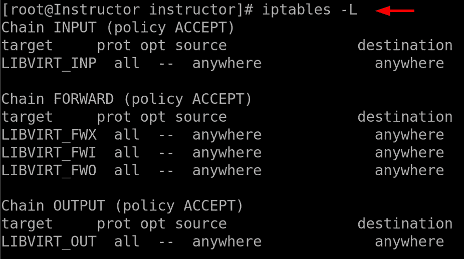
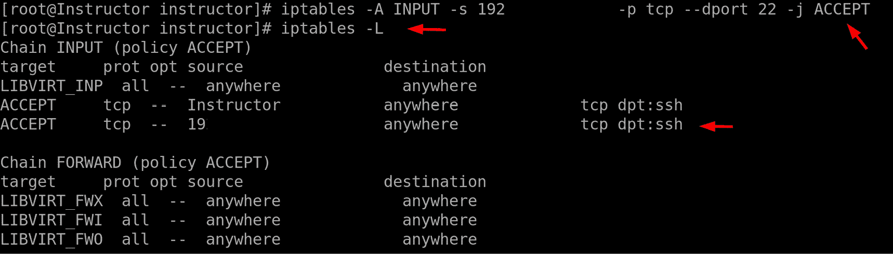
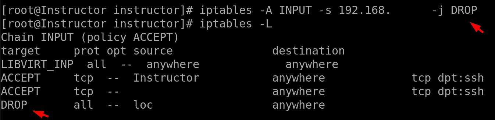
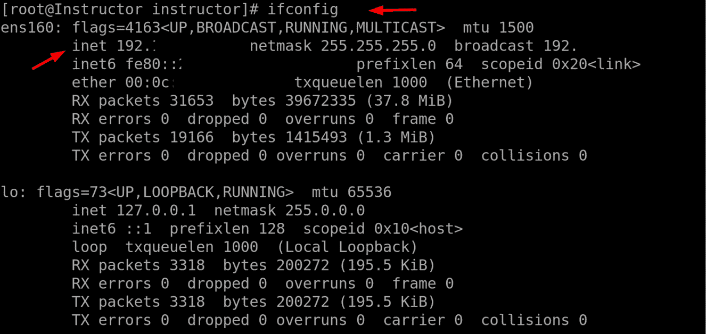
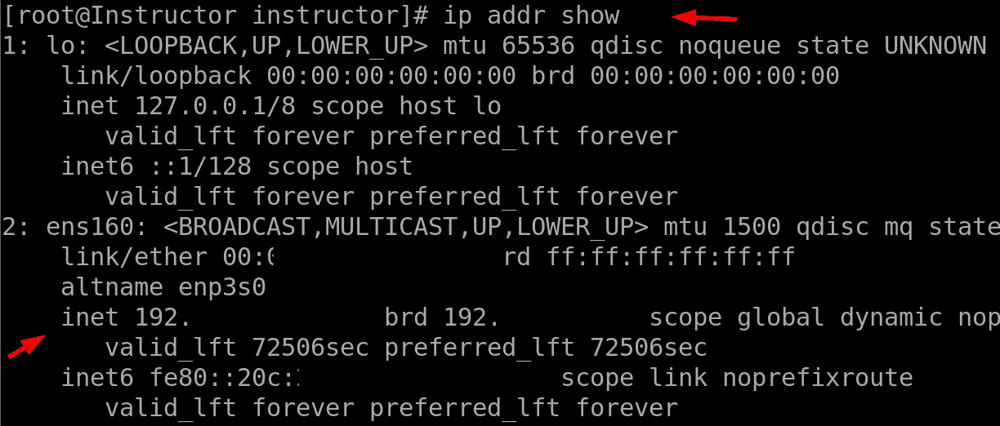
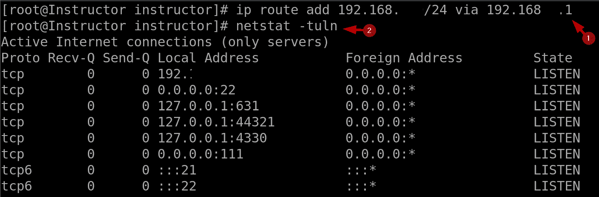
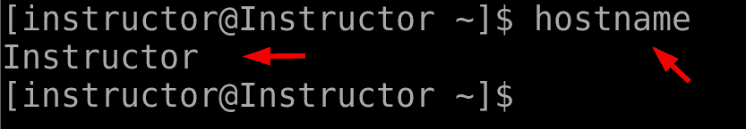
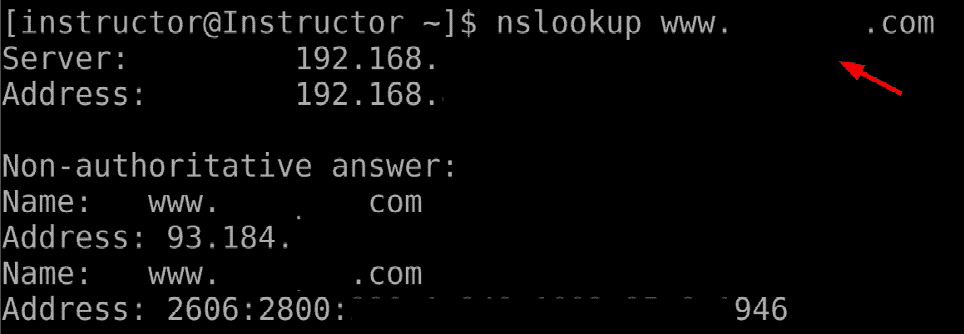
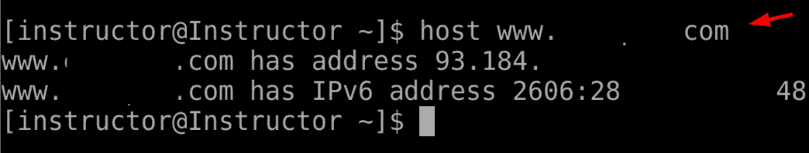

# 10

# Linux IPTABLES 和网络命令

Linux IPTABLES 和网络命令是 Linux 系统管理员管理和控制网络流量与安全的基本工具。IPTABLES 是一款强大的防火墙工具，允许管理员定义规则来过滤、转发和修改网络数据包。它在确保网络安全方面起着至关重要的作用，能够阻止未经授权的访问，防止恶意流量，保护敏感数据。此外，IPTABLES 还使管理员能够创建复杂的网络配置，如**网络地址转换**（**NAT**）和端口转发，以优化网络性能，并促进内外部网络之间的通信，而 Linux 中的网络命令提供了广泛的功能，帮助监控和管理网络连接、接口以及网络相关的统计数据。这些命令能够提供网络性能、带宽使用情况和活跃连接的信息，使管理员能够识别瓶颈、诊断网络问题并优化网络资源。此外，它们通过提供有关网络状态和活动的实时信息，帮助排查网络相关问题，如 DNS 解析、数据包丢失和连接问题。

Linux IPTABLES 和网络命令的重要性在于它们能够有效地保障和管理网络通信。由于基于 Linux 的系统广泛应用于各种领域，包括服务器、路由器和物联网设备，网络安全和高效流量控制的需求变得尤为重要。通过使用 IPTABLES 和网络命令，管理员可以实施定制化的网络策略和访问控制列表，确保只有授权流量被允许，同时阻止潜在威胁。这种对网络流量的精细控制为防御网络攻击提供了额外的防线，使这些命令成为 Linux 系统管理员不可或缺的工具。

本章将深入探讨以下主要内容：

+   iptables -t ACCEPT

+   iptables -t DROP

+   ifconfig、ip、route 和 netstat

+   主机名和 nslookup

+   主机

在我们继续之前，我们还必须认识到 IPTABLES 和网络命令在优化网络性能和资源利用方面的重要贡献。通过分析网络统计数据和带宽使用情况，管理员可以识别需要改进的领域，并根据网络架构和容量规划做出明智的决策。这种主动的方式确保网络资源得到高效利用，提升整体网络性能并减少停机时间。IPTABLES 和网络命令提供多功能的功能，保障网络安全，监控网络活动并优化网络性能。它们的灵活性和能够配置自定义网络策略的能力使它们在管理和维护稳定、安全的网络环境中不可或缺。由于网络安全和高效的资源管理是现代计算的关键方面，Linux 的 IPTABLES 和网络命令依然是各行业和环境中 Linux 系统管理员最广泛使用的工具之一。

# iptables -t ACCEPT

在 Linux 网络与安全领域，带有`-t`选项和`ACCEPT`目标的`iptables`命令至关重要。`iptables`是 Linux 中的一款强大防火墙工具，允许管理员根据指定的条件定义进出网络数据包的规则，从而允许或拒绝访问。命令中的`-t ACCEPT`部分用于指定规则的目标，在此情况下是接受数据包。使用`iptables`与`-t ACCEPT`配置的重要性在于它能够对网络流量进行精细控制，允许管理员定义管理数据流向系统的规则。通过使用`iptables`与`ACCEPT`目标，管理员可以明确允许数据包通过防火墙，从而确保授权的网络通信能够被允许，同时潜在的有害或未经授权的流量被阻止。这一能力对于网络安全至关重要，它使管理员能够定义量身定制的访问规则，保护系统免受恶意攻击和未授权访问。

接下来，我们将深入探讨如何使用`iptables -t` `ACCEPT`命令的实际示例：

1.  查看当前的`iptables`规则以了解现有配置：

图 10.1 – 查看当前的 iptables 规则

1.  允许来自指定 IP 地址（`192.168.x.xxx`）的传入 SSH 连接。

    当你使用`iptables`命令时，它会向`iptables`防火墙的`INPUT`链添加一条规则，允许来自源 IP 地址`192.168.x.xxx`的传入 TCP 流量通过目标端口`22`（这是 SSH 的默认端口）。如果规则成功添加，终端中不会显示任何确认或信息。

1.  要检查 `iptables` 防火墙中的规则并验证新规则是否已添加，可以使用以下命令：

图 10.2 – 允许来自指定 IP 的 SSH 连接

# iptables -t DROP

在 Linux 中，`iptables` 命令是管理网络流量和执行安全策略的基础工具。它允许系统管理员为进出网络的数据包定义规则，根据指定的标准授予或拒绝访问。`-t` 标志与 `iptables` 配合使用时，指定规则所在的目标表。在安全性方面，`DROP` 目标尤为重要。当与 `-t` 结合使用时，如 `iptables -t DROP`，它表示匹配定义规则的入站网络数据包将被丢弃或阻止，进而有效拒绝访问。在 Linux 中，`iptables` 命令允许管理员管理和操作**netfilter** 防火墙规则，这些规则决定内核如何处理网络数据包。管理员可以通过有选择地丢弃数据包，阻止恶意或可疑流量进入网络。

对于专家来说，`iptables -t DROP` 提供了对网络流量的细粒度控制，使他们能够定制规则并有效地缓解复杂的安全风险。此外，通过策略性地使用 `DROP` 目标，管理员可以防止某些类型的攻击，如**拒绝服务攻击**（**DoS**）和**分布式拒绝服务攻击**（**DDoS**），避免其压垮系统并中断服务，或者使用此命令来阻止已知恶意活动的特定 IP 地址，限制对某些服务的访问，或保护易受攻击的端口。

`DROP` 操作的主要用途是根据定义的标准（如源 IP 地址、目标端口和协议类型）筛选和控制入站网络流量。通过指定规则，管理员可以确定哪些数据包应该被丢弃，从而防止它们到达预定目的地。此命令在制定网络安全策略中起着至关重要的作用，因为它允许管理员定义与组织的安全要求和合规性标准相符的规则。通过高效管理网络流量，Linux 系统管理员可以创建一个强大且安全的网络环境，保护其基础设施免受潜在威胁。接下来，让我们深入探讨如何实际运用 `iptables -t` `DROP` 命令。

要阻止来自指定 IP 地址的入站流量，请使用以下命令：

图 10.3 – 阻止入站流量

此命令将新规则添加到 `iptables` 的 `INPUT` 链中，丢弃来自 IP 地址 `192.168.x.xxx` 的任何入站数据包。

# ifconfig, ip, route 和 netstat

`ifconfig` 命令，即 `ifconfig` 命令，仍然是网络管理和高级配置的基础命令。专家可以利用 `ifconfig` 手动配置网络接口，设置静态 IP 地址，启用或禁用特定接口，并修改高级网络设置。在服务器环境中，`ifconfig` 尤其有用，因为那里通常有多个网络接口，并且需要特定的配置。此外，`ifconfig` 可以与其他命令结合使用，以进行网络诊断和性能监控。虽然 `ifconfig` 被广泛使用，并且 Linux 管理员非常熟悉它，但值得注意的是，某些 Linux 发行版正在逐步弃用该命令，转而使用如 `ip` 这样的新工具。尽管如此，`ifconfig` 在许多 Linux 环境中仍然具有相关性和价值，提供了一种简单而有效的方式来管理网络接口。

## ip, route, 和 netstat

`ip`、`route` 和 `netstat` 命令是 Linux 网络工具，它们共同提供了一个全面的网络配置、路由和监控功能集。这些命令对于初学者和专家来说，都能提供关于网络设置、流量路由和活动网络连接的重要信息。`ip` 是一个多功能的命令，取代了许多 `ifconfig` 的功能，提供了网络接口、路由表和隧道的高级配置选项。`route` 允许用户查看和修改系统的 IP 路由表，控制数据包在网络之间的转发方式。`netstat` 提供了网络连接、开放端口和活动网络统计信息的详细概览。需要注意的是，掌握这些命令对于理解网络设置和故障排除至关重要。`ip` 命令为 `ifconfig` 提供了更现代和功能更丰富的替代方案，提供了更广泛的网络配置和管理功能。`route` 帮助初学者掌握路由的概念以及数据包如何在网络中进行转发。`netstat` 帮助初学者识别活动的网络连接、监控端口使用情况并诊断网络问题，例如识别消耗网络资源的进程。随着初学者探索 Linux 网络，这些命令为他们提供了必要的工具，以有效地理解和配置网络设置。这些命令在网络管理和故障排除中变得不可或缺。例如，`ip` 命令的高级功能使专家能够设置复杂的网络配置，创建虚拟接口，管理路由表并实现 NAT。`route` 允许专家精细调优路由规则，优化流量流动，并高效管理多个网络接口。`netstat` 是专家监控网络性能、检测可疑网络活动和识别潜在安全威胁的宝贵工具。这些命令结合使用，提供了全面的网络可视化，使专家能够维护一个强大且安全的网络环境。`ip`、`route` 和 `netstat` 的深度和多功能性使它们成为 Linux 网络管理员不可或缺的工具，使他们能够优化网络性能、排除故障并确保网络连接的顺畅和可靠。现在我们已经了解了这些命令，让我们通过实际例子来应用它们：

+   要查看当前网络接口及其配置，运行以下命令：

图 10.4 – 查看当前网络接口

+   让我们利用 `ip` 命令来查看网络接口：

图 10.5 – 查看当前网络接口

这将显示所有网络接口的列表，包括它们的 IP 地址、子网掩码以及其他网络配置细节。

+   要向路由和查看网络统计信息中添加静态路由，例如打开的网络连接和监听端口，请运行以下命令：

图 10.6 – 路由与查看网络统计信息

此命令通过`192.168.x.x`网关将路由添加到`192.168.x.0/24`子网。然后，下一条命令显示所有活动网络连接及其对应的端口。

`netstat`命令中的`-tuln`选项用于以数字格式显示系统上所有打开的 TCP 和 UDP 端口：

+   `-t`：显示 TCP 连接

+   `-u`：显示 UDP 连接

+   `-l`：显示监听端口

+   `-n`：显示数字地址，而不是试图解析符号化的主机、端口或用户名

`ip route add`命令的影响是什么？

`ip route add`命令用于向路由表中添加一条新路由。路由表是内核用于确定如何将数据包路由到目的地的数据库。

`ip route add`命令的影响是它将允许系统与`192.168.x.x/24`网络上的设备进行通信。

`ip route add`命令可以用于添加任何网络的路由，而不仅仅是本地网络。这对于配置不同网络之间的路由或通过 VPN 进行数据包路由非常有用。

# 主机名和 nslookup

Linux 中的`hostname`命令用于查看或设置系统的主机名。主机名是分配给网络中设备的唯一标识符，帮助区分其他设备。主机名对于各种网络任务至关重要，例如通过网络访问设备和在与其他设备通信时识别它。`hostname`命令提供了一种简单有效的方式来管理系统的主机名，是 Linux 管理员不可或缺的工具。`hostname`命令的重要性在于它在网络和系统标识中的作用。一个有意义的主机名有助于增强系统在网络中的可管理性和组织性，简化了管理任务，使得更容易定位和与特定设备进行通信。此外，主机名通常用于日志文件和系统监控工具中，以提供上下文并标识事件的来源，有助于故障排除和审计。对于托管多个服务的服务器，设置一个具有描述性的主机名可以帮助用户和管理员识别每台服务器的目的或功能，从而简化系统管理并减少混淆的风险。总的来说，`hostname`命令在维护高效的网络操作和有效的系统管理方面起着至关重要的作用。

`nslookup` 命令是一个强大的工具，用于将 `www.example.com` 等域名解析为计算机可以理解的 IP 地址（例如，`192.168.x.x`）。`nslookup` 命令提供了一种交互式查询 DNS 服务器的方法，使其成为网络管理员和开发人员不可或缺的工具。`nslookup` 命令的重要性在于它能够帮助排查 DNS 相关问题并验证 DNS 配置。它允许管理员验证 DNS 记录，检查域名是否解析到正确的 IP 地址，并排查 DNS 解析问题。通过使用 `nslookup` 命令查询特定的 DNS 服务器，管理员可以确保 DNS 信息的准确性，并诊断与 DNS 相关的问题，例如错误的 DNS 条目或配置错误的 DNS 服务器。此外，`nslookup` 命令还可以用来测试 DNS 服务器的响应时间，帮助管理员识别 DNS 基础设施中的潜在瓶颈并优化 DNS 性能。总的来说，`nslookup` 命令是管理和排查 Linux 环境中 DNS 问题的不可或缺的工具，确保网络通信和互联网连接的顺畅运行。

现在，让我们在实际示例中应用这些命令：

+   要显示系统的主机名，只需输入以下命令：

图 10.7 – 显示系统的主机名

此命令将输出您的 Linux 系统的主机名。主机名是一个唯一的名称，用于在网络上标识系统，并用于本地和远程通信。

+   要为特定域（例如，`www.example.com`）执行 DNS 域名解析，可以使用 `nslookup` 或 `host` 命令。以下是一个示例：

图 10.8 – 执行 DNS 域名解析

# host

`host`命令是一个强大的工具，主要用于 Linux 系统中的 DNS 相关任务。它的主要功能是执行 DNS 查询，将域名转换为 IP 地址，反之亦然。`host`命令的重要性在于它作为一个多功能工具，帮助网络管理员和开发人员解决 DNS 查询和排除域名解析问题。通过使用`host`命令，管理员可以验证域名是否正确映射到 IP 地址，确保互联网设备之间的正常通信。此外，`host`命令还提供关于 DNS 记录的信息，例如域的授权名称服务器，`host`命令常用于多种场景，如在域名更改后检查 DNS 传播，诊断 DNS 解析问题，以及验证域名配置。它的易用性和提供实时 DNS 信息的能力使它成为网络和系统管理领域中新手和专家的必备工具。现在，让我们通过实际示例深入了解这些命令的使用：

+   和`nslookup`一样，我们也可以使用`host`命令执行相同的操作。

    这两个命令将显示与提供的域名关联的 IP 地址。DNS 负责将人类可读的域名转换为计算机可以理解的 IP 地址。这些命令可以让你检查 DNS 解析是否正常工作，并检索特定域的 IP 地址：

图 10.9 – 使用 host 命令检查 DNS 解析

总结来说，Linux IPTABLES 和网络命令在 Linux 系统管理员的工具库中扮演着至关重要的角色，提供了确保网络安全、监控网络活动和优化整体性能的必要功能。

# 总结

在本章中，我们探讨了 Linux 系统管理员的必备工具，这些工具为他们提供了强大的能力，以有效管理网络通信并增强网络安全。本章介绍了一系列命令，每个命令在配置网络规则和深入了解网络活动方面都有特定的作用。`iptables`命令，如`iptables -t ACCEPT`和`iptables -t DROP`，允许管理员自定义网络策略，允许授权流量同时阻止潜在威胁。这些命令在保护网络资源和防御网络攻击中发挥着至关重要的作用，是 Linux 系统管理员不可或缺的工具。本章还深入探讨了网络配置和分析命令，包括`ifconfig`、`ip`、`route`和`netstat`。这些命令为管理员提供了查看和管理网络接口、配置 IP 地址、检查路由表和监控网络统计信息的能力。通过使用这些命令，管理员可以优化网络性能，排查连接问题，并确保资源的高效利用。此外，本章还探讨了`hostname`、`nslookup`和`host`命令，它们提供有关 DNS 解析和主机名相关信息的洞见。这些命令对于验证 DNS 配置、解析域名和诊断网络连接问题非常有价值。这些网络命令的无缝集成为 Linux 系统管理员提供了必要的工具，以维护稳定、安全和高效的网络环境。

在下一章，我们将探索一组关键工具，这些工具能够实现无缝的文件传输、高效的下载以及有效的日志文件管理，适用于 Linux 环境。我们将涵盖一系列命令，每个命令在简化文件传输和确保日志文件可访问性方面都具有特定作用。从使用`netcat`和`socat`将文件复制到远程系统，到利用`wget`、`curl`、`axel`等工具进行高效的文件下载，本章将为系统管理员提供必备的技术，以有效地处理各种与文件相关的任务。
