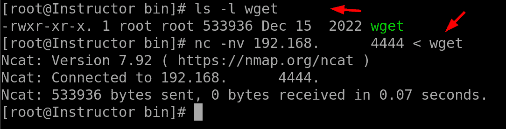
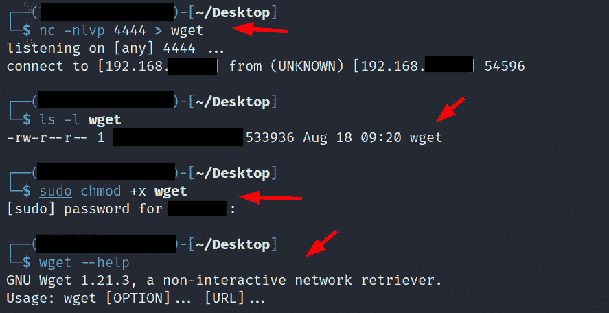
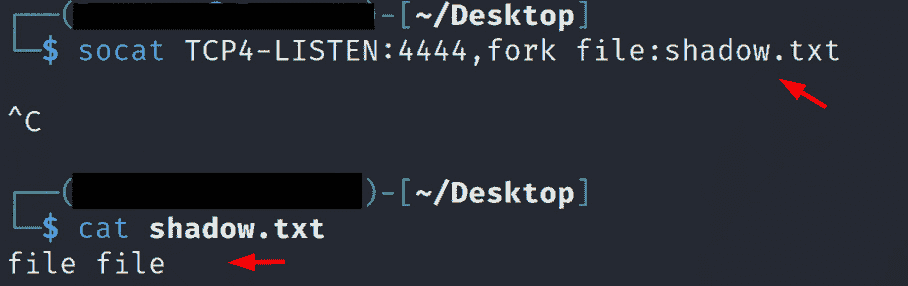
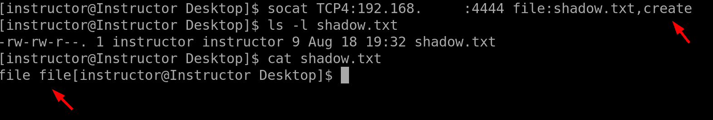
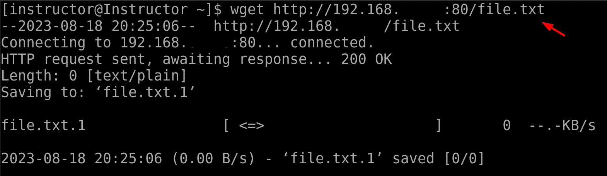
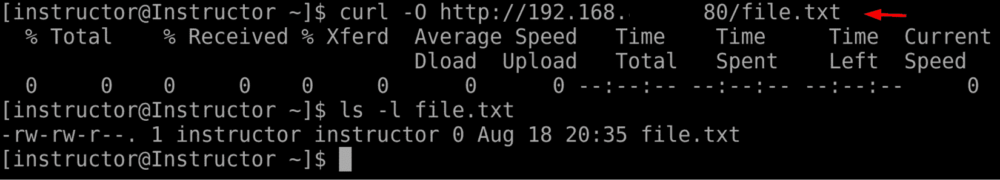

# 11

# 文件传输、下载和管理日志文件

文件传输、下载和管理日志文件是有效管理 Linux 系统的关键方面，使系统管理员能够高效处理数据交换、获取必要的软件或内容，并保持系统活动的强大记录。这个多方面的主题涵盖了各种命令和工具，每个工具都有独特的用途，共同支持无缝的文件操作和日志管理。理解并掌握这些工具对管理员至关重要，以确保系统正常运行、解决问题并保持数据完整性。

文件传输、下载和管理日志文件命令的重要性在于它们在日常系统管理任务中的核心作用。像`netcat`、`socat`、`wget`、`curl`和`axel`这样的文件传输命令可以在本地系统和远程系统之间无缝地交换数据。这些工具对于共享文件、备份和配置文件非常关键，既适用于内部网络，也适用于互联网。类似地，像`wget`、`curl`和`axel`这样的下载命令使管理员能够高效地从远程服务器或仓库中获取文件、软件包和更新。这些命令对高效获取必要资源、确保系统保持最新和装备齐全至关重要。同样重要的是管理日志文件，这在系统分析、性能监控和故障排除中起着关键作用。日志文件是记录系统活动、错误和事件的重要信息。通过探索常见的日志文件，管理员可以深入了解系统的健康状况，发现潜在问题，并采取预防措施。这种可见性对于保持系统稳定、确保安全性以及符合监管要求至关重要。

在本章中，我们将深入探讨以下主要主题：

+   使用`netcat`和`socat`将文件复制到远程系统

+   使用`wget`和`curl`下载文件

+   探索常见的日志文件

掌握文件传输、下载和管理日志文件命令的目的是为了让系统管理员具备高效执行各种任务的能力。通过理解这些工具，管理员可以自信地执行文件传输、安全内容交换，并获取必要的数据。他们还可以分析和解读日志文件，获取有关系统性能的宝贵信息，并诊断潜在问题。这些命令提供了执行各种文件操作和维护有序日志管理系统所需的灵活性和控制力。因此，文件传输、下载和管理日志文件命令对 Linux 系统管理员来说仍然至关重要，广泛应用于帮助他们高效管理系统、提供最佳性能和安全性。

# 使用 netcat 和 socat 将文件复制到远程系统

使用`netcat`和`socat`命令将文件复制到远程系统是 Linux 环境中文件传输和系统管理的一个关键方面。`netcat`和`socat`都是功能强大的网络工具，能够提供在网络中系统之间传输数据的强大能力。这些命令提供了一种简单高效的方式，可以安全地将文件、目录或数据流从一个主机传输到另一个主机，因此它们是 Linux 系统管理员不可或缺的工具。它们在网络层操作，允许通过 TCP 或 UDP 连接传输数据，非常适合跨网络传输大文件或备份。与传统的文件传输方法不同，`netcat`和`socat`提供了一种更加轻量和灵活的方法。FTP 和 SCP 是已知的网络文件传输方法，但它们也有一些局限性。例如，FTP 需要专用的 FTP 服务器设置，这可能会消耗大量资源，并且在临时网络环境中灵活性较差。SCP 虽然安全，但依赖 SSH，并且在某些情况下可能无法使用或不切实际。而`netcat`和`socat`则是轻量级且多功能的工具，允许直接的网络通信，非常适合快速且临时的文件传输。它们不需要专用服务器或复杂的配置，使它们在各种网络管理和故障排除任务中都非常有价值。此外，它们还可以在数据复制、系统备份、远程管理甚至加密通信隧道等多种场景中使用。这些命令为管理员提供了更大的数据传输过程控制，使得文件传输任务更易于定制和自动化。

使用`netcat`和`socat`将文件复制到远程系统是非常实用且高效的。管理员可以通过将内容通过`netcat`或`socat`管道传输到目标系统，快速完成文件传输。这个过程相对简单，仅涉及一行命令，减少了复杂设置或额外软件安装的需求。此外，`netcat`和`socat`支持多种选项，允许管理员指定数据流、处理多个连接并控制传输速度，提供了更大的灵活性和对文件传输过程的控制。总的来说，`netcat`和`socat`命令为将文件复制到远程系统提供了高效可靠的解决方案，简化了文件传输任务，提升了系统管理的整体效率。接下来，我们将深入探讨这些命令如何在系统管理员的实际应用中有效使用：

+   使用`netcat`进行文件传输（CentOS 机器）：

    +   第一个命令 `ls -l /bin/wget` 列出位于 `/bin` 目录中的 `wget` 文件的详细信息。输出包含权限、所有者、组、大小、修改日期以及文件名等属性。在此，`wget` 文件具有 `-rwxr-xr-x` 权限，表示文件所有者具有读、写和执行权限，其他用户则仅具有执行权限。

    +   第二个命令 `nc -nv 192.168.x.xxx 4444 < wget` 使用 `nc`（即 `netcat`）命令进行网络通信。在此，用户尝试将 `wget` 文件的内容发送到 IP 地址为 `192.168.x.xxx` 的远程机器上的 `4444` 端口。`<` 符号用于输入重定向，表示将 `wget` 文件的内容作为输入提供给 `nc` 命令。

    +   `-n` 标志确保不会对 IP 地址 `192.168.x.xxx` 进行 DNS 解析，`-v` 提供关于连接过程的详细输出。

    +   后续行显示了 `netcat` 命令的输出。首先，它显示了正在使用的 Ncat 版本（Ncat 是 `netcat` 的现代重实现）。然后，它报告已成功连接到指定的 IP 地址和端口：

图 11.1 – 使用 netcat 进行文件传输

+   远程机器：

    +   执行的第一个命令是 `nc -nlvp 4444 > wget`。该命令使用 `nc`（即 `netcat`）工具监听端口 `4444` 上的网络连接。传入连接的输出被重定向到当前目录下名为 `wget` 的文件中。`>` 符号用于输出重定向。输出结果表明系统当前正在监听端口 `4444`。请注意，使用 `nc` 发送文件时，终端中不会显示进度条。

    +   执行的第二个命令是 `ls -l wget`。该命令列出当前目录中 `wget` 文件的详细信息。输出包括权限、所有者、组、大小、修改日期以及文件名等属性。

    +   执行的第三个命令是 `sudo chmod +x wget`。该命令使用 `chmod` 修改 `wget` 文件的权限，`+x` 参数为文件添加可执行权限。

    +   最终执行的命令是 `wget --help`。该命令旨在验证文件是否已成功传输，输出结果表明该命令执行成功：

图 11.2 – 使用 nc 接收传入文件

+   使用 `socat` 进行文件传输（远程机器）：

    在远程机器上执行了` socat TCP4-LISTEN:4444,fork file:shadow.txt`命令。该命令在`4444`端口设置了一个 TCP 监听器。当有连接到此端口时，`socat`会读取本地`shadow.txt`文件的内容并将其发送到连接的客户端。`fork`选项允许`socat`独立处理多个传入的连接。在此示例中，`shadow.txt`文件包含文本`file file`，如下所示：

图 11.3 – 使用 socat 在远程机器上发送文件

+   CentOS 机器：

    在 CentOS 机器上执行了` socat TCP4:192.168.x.xxx:4444 file:shadow.txt, create`命令。该命令发起一个 TCP 连接到 IP 地址为`192.168.x.xxx`、端口为`4444`的远程机器。一旦连接成功，`socat`会读取本地`shadow.txt`文件的内容并将其发送到远程机器。`create`选项指示`socat`在远程机器上创建`shadow.txt`文件（如果该文件尚不存在）。传输完成后，本地的`shadow.txt`文件将会被创建或用接收到的数据覆盖。`ls -l shadow.txt`命令确认文件的创建，`cat shadow.txt`命令则显示其内容，即`file file`：

图 11.4 – 接收并验证传输的文件

尽管 Netcat 和 Socat 都用于网络任务和数据传输，但 Netcat 是一个更为简单的工具，主要用于基本的网络任务，而 Socat 提供了更多的高级功能和选项，适用于更广泛的网络场景，包括复杂的数据处理、加密和代理。

# 使用 wget 和 curl 下载文件

下载文件是系统管理中的一项基本任务，`wget`和`curl`等工具在简化和优化此过程方面发挥着关键作用。这些命令旨在从远程服务器、仓库或 URL 中获取文件并将其带到本地系统。它们的重要性源于保持系统更新最新软件版本、获取关键数据以及高效管理资源的需求。这些命令的意义在于其多功能性和易用性。例如，`wget`是一款功能强大的工具，能够处理多种协议，如 HTTP、HTTPS 和 FTP。它递归下载文件并镜像整个网站的能力对于管理大规模系统或网站的管理员尤其重要。另一方面，`curl`同样强大，支持多种协议，使管理员不仅能够下载文件，还能执行各种其他网络相关任务，如向服务器发送数据和处理身份验证。

这些命令对于系统管理员来说不可或缺，因为它们在保持软件最新、检索重要数据以及确保系统平稳运行方面发挥着重要作用。它们的易用性、处理不同协议的灵活性以及加速下载的能力，使其成为每个 Linux 系统管理员工具包中的必备工具。让我们在 Linux 机器上实际应用这些命令：

+   使用`wget`：

    `wget http://192.168.x.xxx:80/file.txt`命令用于从远程网络服务器下载文件。下面是该命令各部分的详细解释：

    +   `http://192.168.x.xxx:80/file.txt`：这是我们想要下载的文件的 URL。这里的`http`指定了用于下载的协议——在本例中为 HTTP

    当我们执行此命令时，`wget`会与提供的 IP 地址和端口建立 HTTP 连接，发送 HTTP GET 请求以获取指定的文件(`/file.txt`)，并收到该文件的内容作为响应。下载的文件将以与服务器上相同的名称（在本例中为`file.txt`）保存在我们本地计算机的当前工作目录中：

图 11.5 – 使用 wget 下载文件

+   使用`curl`：

    `curl -O http://192.168.x.xxx:80/file.txt`命令用于使用`curl`命令行工具从远程网络服务器下载文件。下面是该命令各部分的详细解释：

    +   `curl`：这是一个命令行工具，`-O`选项表示告诉`curl`使用与远程服务器上相同的名称保存下载的文件。此选项用于保留原始文件名。

    +   `http://192.168.x.xxx:80/file.txt`：这是你想要下载的文件的 URL，类似于之前的解释：

        +   `http`：这是指定用于下载的协议——在本例中为 HTTP

    当我们执行此命令时，`curl`会与提供的 IP 地址和端口建立 HTTP 连接，发送 HTTP GET 请求以获取指定的文件(`/file.txt`)，并收到该文件的内容作为响应。下载的文件将以与服务器上相同的名称（`file.txt`）保存在本地计算机的当前工作目录中：

图 11.6 – 使用 curl 下载文件

通过提供批量下载、可恢复传输和详细进度报告等选项，`wget`和`curl`简化了从远程源获取文件的过程，提高了管理人员在各个领域和行业中的效率和生产力。

# 探索常见日志文件

系统管理员检查日志文件出于多种原因，因为它们在保持系统健康、诊断问题和确保安全方面至关重要。这些日志提供了系统活动、错误和事件的全面记录，使管理员能够深入了解系统的行为。例如，`/var/log/messages`日志是一个关于系统广泛事件的宝贵资源，有助于排查可能影响整个系统的问题。该日志的重要性在于它能够提供系统健康和性能的全貌，帮助管理员及早发现异常，处理潜在的瓶颈或威胁。

此外，日志文件如`/var/log/secure`和`/var/log/auth.log`在维护系统安全性方面至关重要。系统管理员持续监控这些日志，以跟踪身份验证和授权活动，帮助他们识别未经授权的访问尝试或安全漏洞。此类日志的重要性不容小觑，因为它们提供了调查安全事件、执行访问控制和减轻潜在安全风险所需的必要痕迹。此外，类似`/var/log/httpd/`这样的与 Web 服务器相关的日志，对于识别未经授权的访问尝试、可疑活动或 Web 服务器错误至关重要，这对于保持 Web 应用程序的完整性和安全性至关重要。定期检查这些日志使管理员能够主动识别和修复安全漏洞，从而确保敏感数据和系统的安全。

在 CentOS 8 中，几个常见的日志文件位于不同的目录中，记录系统事件、应用程序活动和错误。以下是一些常见日志文件的列表及其路径：

+   `/var/log/messages`:

    该日志文件包含由各个进程生成的系统通用消息。它是不同日志消息的汇总位置，包括来自守护进程、服务和内核的消息。

+   `/var/log/dmesg`:

    内核环形缓冲区的消息存储在这里。这些消息提供了关于内核在启动期间以及系统运行时与硬件交互的信息。

+   `/var/log/boot.log`:

    此文件包含与启动过程和启动信息相关的消息。它对于诊断启动问题非常有用。

+   `/var/log/secure`:

    认证和安全相关的事件，包括成功和失败的登录尝试，都会在此记录。监控此文件有助于追踪未经授权的访问尝试。

+   `/var/log/wtmp`:

    该日志文件记录用户的登录和登出历史。它保持用户会话及其持续时间的记录。

+   `/var/log/yum.log`和`/var/log/dnf.rpm.log`:

    这些日志包含了软件包管理活动。条目包括使用 YUM 或 DNF 包管理器执行的软件包安装、更新和删除操作。

+   `/var/log/httpd/`、`/var/log/mariadb/`、`/var/log/nginx/`:

    这些目录包含与 Apache、MariaDB 和 nginx 服务器相关的日志，包括访问日志、错误日志和其他服务器相关事件。

+   `/var/log/maillog`：

    这条日志专门用于与电子邮件相关的活动，跟踪邮件发送、接收和邮件服务器配置中的错误，有助于排除电子邮件通信问题。

+   `/var/log/cron`：

    专注于计划任务，这条日志记录了 cron 作业的执行情况及其结果，对于确保自动化任务按预期运行至关重要。

+   `/var/log/audit/audit.log`：

    审计日志是安全团队的宝贵财富。它包含系统活动和安全事件的记录，有助于识别可疑活动和政策违规行为。

+   `/var/log/auth.log`：

    与 `/var/log/secure` 类似，这条日志专注于身份验证和授权活动。它是用户访问、密码更改和权限修改的窗口。

+   `/var/log/kern.log`：

    内核消息和与硬件相关的事件被记录在这里。在排除硬件问题或内核级别问题时，这些日志非常重要。

+   `/var/log/udev`：

    该目录包含与设备管理和设备事件相关的日志，有助于了解设备相关问题。

+   `/var/log/sssd/` 和 `/var/log/avahi-daemon/`：

    这些日志分别与**系统安全服务守护进程**（**SSSD**）和 Avahi 守护进程相关。SSSD 处理身份验证和身份解析，而 Avahi 专注于本地网络服务发现。

+   `/var/log/firewalld`：

    `firewalld`日志提供有关防火墙规则和活动的信息，有助于监控和管理网络安全。

+   `/var/log/audit/`：

    该目录存储 SELinux 审核日志，帮助跟踪与安全相关的事件并识别策略违规行为。

+   `/var/log/sa/`：

    系统账务（`sa`）日志有助于监控系统性能指标，如 CPU、内存和磁盘使用情况。

+   `/var/log/cloud-init.log`：

    云初始化日志包含有关云实例初始化过程的信息，有助于跟踪基于云的系统设置。

+   `/var/log/libvirt/`：

    Libvirt 日志包含与使用 Libvirt 框架进行虚拟化相关的事件和活动。

本质上，系统管理员定期检查这些日志文件是不可或缺的。这些日志作为故障排除、性能优化和安全增强的重要工具，通过利用这些日志中嵌入的见解，管理员可以确保系统的无缝运行、快速解决问题，并保持强大的安全防护，从而有助于 Linux 环境的整体稳定性和可靠性。

# 总结

本章提供了针对 Linux 系统管理员的关键技术和工具的全面探索。本章旨在让管理员具备高效管理文件传输、执行无缝下载和有效处理日志文件的能力，这些都是维护健壮且安全的 Linux 系统的重要方面。我们首先学习了如何在利用`netcat`和`socat`的功能下，将文件复制到远程系统。这些工具促进了安全高效的文件传输，为管理员提供了自信地跨网络交换数据的手段。随后，我们深入探讨了利用`wget`和`curl`命令下载文件的技巧。这些命令使管理员能够无缝地从网络或其他远程位置获取内容，简化了获取系统管理和增强所需资源的过程。本章还进一步丰富了内容，深入讨论了日志文件的重要性及其多样性，日志文件是有效系统管理的基本组成部分。日志记录是监控系统活动、诊断潜在问题和保障安全协议的不可或缺的实践。通过深入了解常见的日志文件，Linux 系统管理员能够全面掌握系统健康状况和性能指标。掌握日志文件的理解能力对于故障排除、及时识别安全漏洞和优化整体系统功能至关重要。这一全面的探索使管理员具备了主动应对挑战、维护系统完整性和推动高效运营的专业知识。

在下一章，我们将深入探讨 Linux 系统的关键安全措施。我们将向你展示如何在 SELinux 中利用强制和宽松模式，管理 SELinux 布尔值，确保**安全外壳（SSH）**访问的策略、锁定用户账户的方法，以及增强系统启动安全性的技术。

# 第四部分：Linux 安全与云

在本部分，我们将深入探讨 Linux 安全，这是生产系统管理员的一项关键职责。Linux 拥有强大的安全工具，如 SELinux、集成防火墙和标准系统权限。本节提供了 Linux 安全措施的清晰概述，并指导你在 AWS 上设置 CentOS 8。

本节包含以下章节：

+   *第十二章*，*探索 Linux 安全*

+   *第十三章*，*云中的 Linux*
