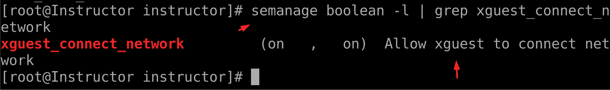
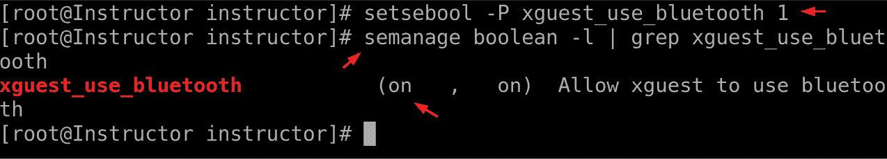

# 12

# 探索 Linux 安全

在信息技术不断发展的背景下，系统和数据的安全始终是一个坚定的优先事项。作为无数基础设施的支柱，Linux 操作系统在各个领域巩固了其存在，从服务器到嵌入式设备。在这一领域，本章将展开一场全面的旅程，深入探讨 Linux 安全。此次探索不仅仅是强化数字堡垒的练习，它是保护敏感信息、保证操作完整性、维护用户信任的关键追求。在当今互联互通的数字时代，Linux 安全的重要性不可过分强调。各类组织依赖基于 Linux 的系统来管理数据库、驱动网站以及协调复杂的网络。这些系统包含大量敏感信息，从专有算法到个人用户数据。确保这些数据的安全不仅是保持竞争优势的必要条件，也是保护相关实体声誉的关键。安全漏洞可能导致严重后果，包括财务损失、法律后果和客户信任的丧失。

本次探索的目的超越了常规系统管理的范畴。这是针对可能利用漏洞并造成破坏的潜在威胁采取的主动立场。掌握深厚安全机制的 Linux 管理员可以建立强大的防御体系，抵御各种网络威胁，从恶意软件、勒索病毒到数据泄露和拒绝服务攻击。通过理解 Linux 安全的复杂性，管理员能够有效减轻风险、迅速应对新兴威胁，并防止可能摧毁操作的安全事件。

Linux 安全不仅仅是一个技术清单——它是负责任管理的一个核心组成部分。首先，Linux 是一个开源生态系统，这意味着其源代码是公开可获取的。虽然这促进了协作和快速开发，但也使系统暴露于潜在的审查和利用之中。因此，了解 Linux 安全至关重要，以便发现并修复可能被忽视的漏洞。此外，Linux 的多样化应用，从个人计算到企业服务器，要求对安全采取细致入微的方法。管理员必须在考虑到每种场景的独特安全需求的同时，穿越这一广泛的安全领域。这需要深入理解 Linux 安全机制，如访问控制、加密、身份验证协议和入侵检测系统。通过有效利用这些工具，管理员可以定制符合特定需求的安全策略。

从本质上讲，本章作为 Linux 管理的指南针，帮助管理员掌握必要的知识和策略，维护基于 Linux 的系统的韧性和完整性，构建一个安全作为运营成功不动摇支柱的数字环境。

本章将深入探讨以下主要内容：

+   使用强制模式和宽容模式

+   启用或禁用 SELinux 布尔值

+   锁定用户账户

+   SSH 安全配置

# 使用强制模式和宽容模式

在访问控制和安全管理领域，**强制**模式和**宽容**模式起着至关重要的作用，特别是在像 Linux 这样的操作系统中。这些模式与安全机制的行为有关，例如 **强制访问控制**（**MAC**）框架。例如，RHEL 和 Fedora Linux 使用 **增强安全 Linux**（**SELinux**）作为其 MAC 框架，而 Ubuntu 则使用 AppArmor 达到类似目的。强制模式表示一种严格遵守安全策略的状态，禁止任何违反这些规则的操作。另一方面，宽容模式采取更加宽松的态度，允许那些在“强制”模式下通常会被拒绝的操作。这些模式的目的是在保持系统完整性和促进必要操作之间找到平衡，避免不必要的阻碍。这些模式对于系统管理员来说至关重要，管理员可以通过它们增强系统安全性，同时确保系统平稳运行。通过使用强制模式，管理员可以确保所有操作，无论是用户还是应用程序发起的，都严格遵守既定的安全策略。这可以防止未经授权的访问，减少潜在的攻击面，并降低与漏洞、恶意软件渗透和未经授权的数据操作相关的风险。相反，宽容模式在需要严格安全措施立即实施可能会干扰关键操作或导致意外后果的场景中非常有价值。管理员可以暂时切换到宽容模式，以识别在强制模式下可能出现的问题。这种方法有助于在不造成系统广泛中断的情况下微调安全策略。此外，宽容模式允许管理员在完全执行安全策略更改之前，了解其范围和影响。

## 简要介绍 Linux 加固和 SELinux 强制模式与宽容模式的作用

在不断变化的网络安全领域，**Linux 加固**一词成为了一项重要的实践，用于提高基于 Linux 的系统的安全性。Linux 加固指的是通过最小化漏洞、减少攻击面并实施强有力的防御机制，系统化地增强 Linux 操作系统的安全性。在其核心，Linux 加固旨在创建一个能够抵御广泛威胁的环境，从网络攻击到未经授权的数据泄露。在技术与安全的精妙配合中，SELinux 的强制模式和宽容模式扮演着重要角色，塑造了系统管理员采用的防御策略。

## 强制模式的角色

在 MAC（强制访问控制）领域，SELinux 是一个开创性的框架，在 Linux 系统内强制执行细粒度的安全策略。SELinux 的强制模式扮演着类似于坚定守护者的角色，只允许与精确定义的安全规则一致的操作。当在强制模式下运行时，SELinux 会严格执行访问控制和安全上下文，从而限制潜在的恶意行为，降低未经授权入侵的可能性。此模式确保即使攻击者获得了访问权限，他们的活动和利用漏洞的能力也会受到严重限制，从而增强系统的整体韧性。要启用强制模式：

图 12.1 – SELinux 的强制模式

让我们更深入地了解：

+   `setenforce` 命令用于修改 SELinux 的强制模式。通过运行 `sudo setenforce 1`，你指示 SELinux 切换到强制模式。在此模式下，SELinux 将严格执行定义的安全策略，拒绝违反这些策略的操作。

+   要验证 SELinux 是否处于强制模式，可以使用 `getenforce` 命令。`getenforce` 命令提供了一种简单的方法来查询 SELinux 的状态，并确定它是处于强制模式还是宽容模式。

## 宽容模式的角色

相比之下，SELinux 的宽容模式则在安全领域中充当了一个具有洞察力的观察者。当切换到宽容模式时，SELinux 不会阻止违反安全策略的操作，但会积极记录这些事件。此模式为系统管理员提供了一个重要工具，帮助他们在不突然中断操作的情况下微调安全策略。通过分析在宽容模式下生成的日志，管理员可以识别如果系统处于强制模式时可能出现的问题。这一宝贵的反馈循环使管理员能够反复优化安全策略，确保在严格的安全性和操作功能之间找到最佳平衡，从而启用 SELinux 的宽容模式：

图 12.2 – SELinux 的宽松模式

让我们更仔细地看看：

+   这一次，通过运行 `sudo setenforce 0`，您指示 SELinux 切换到宽松模式。在宽松模式下，SELinux 不会主动阻止违反安全策略的操作，而是记录这些操作以便后续分析。

+   要验证 SELinux 是否处于强制模式，可以使用 `getenforce` 命令来检查它是否已经切换到宽松模式。

总结来说，SELinux 的强制模式和宽松模式之间的动态互动展示了 Linux 强化的微妙艺术。这些模式为管理员提供了细致的安全管理方式，使他们可以在严格执行和务实观察之间做出选择。通过谨慎地部署这些模式，管理员能够在错综复杂的 Linux 安全世界中游刃有余，创建能够自信应对不断变化的网络威胁的强化环境。

# 启用或禁用 SELinux 布尔值

在复杂的 Linux 安全环境中，SELinux 作为一个动态框架，使管理员能够精细地调整访问控制并执行安全策略。SELinux 配置工具的核心是布尔值，它封装了能够启用或禁用特定安全功能的二进制设置。这些布尔值就像是加密密钥，能够解锁各种安全配置，允许管理员精确地塑造系统行为。从启用网络连接以支持 Web 服务器到允许特定用户交互，布尔值为定制安全协议提供了细致的方式，确保系统在所需的安全边界内运行。启用或禁用 SELinux 布尔值的重要性超越了单纯的定制化，它在将系统安全与数字环境日益变化的操作需求对接中起着关键作用。一个实际的例子可以在 Web 服务器场景中找到。在部署 Web 应用时，某些功能可能需要网络连接，比如发送电子邮件或访问远程数据库。通过操作布尔值，管理员可以为 Web 服务器进程启用特定的网络相关权限，同时将其他潜在的易受攻击操作锁定。这种细致的控制不仅可以降低风险，还确保了安全性是功能实现的推动力，而非阻碍。

SELinux 布尔值的使用扩展到系统管理员需要平衡安全性和可用性的场景。例如，在引入新的软件包时，它可能需要不寻常的访问权限才能发挥最佳功能。管理员可以修改布尔值，授予临时权限，而不是妥协整个系统的安全性。这使得管理员能够在受控环境中评估软件的行为，同时保持大系统的完整性。此外，启用或禁用特定布尔值的能力有助于实施符合组织政策和法规要求的安全策略。这不仅增强了安全性，还通过允许管理员满足独特的操作需求，简化了合规工作。现在，让我们看一下所有 SELinux 布尔设置的当前值，并了解输出：

图 12.3 – 当前布尔值输出

提供的输出是运行`getsebool -a`命令的结果。此命令用于显示所有 SELinux 布尔设置的当前值。SELinux 布尔值是二进制设置，决定是否启用（on）或禁用（off）特定的安全功能或权限。这些布尔值允许管理员精细控制 SELinux 强制执行的行为和安全策略。让我们分解输出并解释每一行：

+   `abrt_anon_write --> off`：这表示允许**自动错误报告工具**（**ABRT**）写入匿名内存的 SELinux 布尔值当前已禁用。

+   `abrt_handle_event --> off`：此布尔值控制是否允许 ABRT 处理事件，当前已禁用。ABRT 处理系统事件，如崩溃或异常终止。

+   `abrt_upload_watch_anon_write --> on`：这意味着允许 ABRT 监视具有匿名写入访问权限的上传的布尔值已启用。

+   `antivirus_can_scan_system --> off`：这表示允许杀毒软件扫描整个系统的布尔值当前已禁用。

+   `antivirus_use_jit --> off`：控制是否允许杀毒软件使用**即时扫描**（**JIT**）的布尔值已禁用。

+   `auditadm_exec_content --> on`：这表示允许`auditadm`用户执行内容的布尔值已启用。

+   `authlogin_nsswitch_use_ldap --> off`：决定`authlogin`程序是否应使用**网络安全服务**（**NSS**）LDAP 模块的布尔值已禁用。

+   `authlogin_radius --> off`：控制`authlogin`程序是否可以使用`radius`协议进行身份验证的布尔值已禁用。

+   `authlogin_yubikey --> off`：这意味着禁止`authlogin`程序使用 YubiKey 进行身份验证的布尔值已禁用。

+   `awstats_purge_apache_log_files --> off`：决定是否允许 `awstats` 清除 Apache 日志文件的布尔值已被禁用。

每一行都代表一个特定的 SELinux 布尔值及其当前状态。箭头旁边的值（即 `on` 或 `off`）表示该布尔值是启用还是禁用。这些布尔值允许系统管理员根据具体的操作需求调整系统的安全策略，同时保持系统的强大安全性。

## 搜索布尔值并获取其信息

按照以下步骤操作：

1.  如果您不确定布尔值的确切名称，但想要搜索它，可以使用 `semanage boolean -l` 命令：

图 12.4 – 搜索布尔值

1.  要检查特定 SELinux 布尔值的状态，请使用 `getsebool` 命令，并输入布尔值的名称。例如，要检查其状态，您可以运行以下命令：

图 12.5 – 检查特定布尔值的状态

1.  现在，让我们运行一个命令来获取布尔值的信息：

图 12.6 – 获取布尔值的信息

上述命令会在 SELinux 布尔值列表中进行搜索，找到名为 `xguest_connect_network` 的布尔值，并显示其当前状态为 `on`，表示允许 `xguest` 用户或进程进行网络连接。注释提供了关于该布尔值存在原因以及它所控制内容的额外背景信息。

现在，让我们启用并禁用一个布尔值。

## 启用 SELinux 布尔值

要启用 SELinux 布尔值，可以使用 `setsebool` 命令并加上 `-P` 选项（该选项使更改永久），然后输入布尔值的名称和 `1` 表示启用。例如，如果您想启用 `xguest_use_bluetooth` 布尔值，可以运行以下代码：

图 12.7 – 启用布尔值

执行此命令后，我们使用 `semanage` 命令获取有关所做更改的信息。此命令将 `xguest_use_bluetooth` 布尔值设置为 `on`，并使该更改在系统重启后保持永久。

## 禁用 SELinux 布尔值

要禁用 SELinux 布尔值，请使用 `setsebool` 命令并加上 `-P` 选项，接着输入布尔值的名称和 `0` 表示禁用。例如，要禁用 `mount_anyfile` 布尔值，请按以下步骤操作：

1.  查询当前状态：

    `semanage boolean -l | grep mount_anyfile`：此命令列出所有 SELinux 布尔值，并使用`grep`过滤输出，查找包含`mount_anyfile`的行。该行显示`mount_anyfile`布尔值当前已启用，如（`on, on`）所示。此外，它还提供了描述`Allow mount to anyfile`，解释了此布尔值的目的。

1.  禁用布尔值：

    `setsebool -P mount_anyfile 0`：此命令使用`setsebool`来更改`mount_anyfile`布尔值的状态。`-P`标志使此更改永久生效（即使在重启后也能保持），`0`表示“关闭”。运行此命令后，SELinux 被配置为禁止`mount`命令将任何文件挂载为文件系统。

1.  验证更改：

    `semanage boolean -l | grep mount_anyfile`：此命令用于查询在修改后`mount_anyfile`布尔值的状态。现在，它显示为（`off, off`），确认该布尔值已被禁用。描述保持不变，表明`mount`命令不允许将任何文件挂载为文件系统：

图 12.8 – 禁用布尔值

此命令将`mount_anyfile`布尔值设置为`off`，并确保此更改在系统重启后依然有效。

总结来说，命令检查了`mount_anyfile` SELinux 布尔值的状态，禁用了它，并验证更改是否生效。SELinux 布尔值使管理员能够精细控制系统中的访问权限和权限，修改这些布尔值时应清楚了解它们对系统操作的安全影响。

# 锁定用户账户

在 SELinux 中，锁定用户账户的概念通常与标准的 Linux 账户管理实践相关，例如使用`passwd`命令。SELinux 本身并不直接处理账户锁定；相反，它依赖 Linux 的账户管理工具来锁定和解锁用户账户。以下是一些锁定和解锁用户账户的终端示例：

+   锁定用户账户：

    要锁定用户账户，通常通过更改账户的密码来禁用该账户。这可以通过使用`passwd`命令并加上`-l`（锁定）选项来实现：

图 12.9 – 锁定用户账户

+   解锁用户账户：

    要解锁已被锁定的用户账户，可以再次使用`passwd`命令，并加上`-u`选项来解锁，同时使用`f`选项强制执行：

图 12.10 – 解锁用户账户

第一个命令解锁了 `intruder` 用户的密码，输出确认该账户已成功解锁。第二个命令提供了关于该用户当前密码状态的信息，表明他们已设置密码，并且密码使用 SHA-512 加密。这一场景确保 `intruder` 用户现在可以使用他们的密码访问账户。

# 加固 SSH

**安全外壳**（**SSH**）是一种广泛使用的协议，用于通过不安全的网络进行安全远程访问和文件传输。它在现代 IT 基础设施中扮演着至关重要的角色，使管理员、开发人员和用户能够安全地访问远程系统。然而，要充分发挥 SSH 的潜力，并在远程连接过程中维护数据的机密性和完整性，实施强有力的安全措施至关重要。

加固 SSH 的主要目的是保护敏感信息，并防止未经授权访问远程系统。SSH 通过在传输过程中加密数据，并采用强大的身份验证机制来实现这一目标。通过使用加密协议，SSH 确保客户端与服务器之间交换的数据保持机密，并且不易受到恶意攻击者的窃听。此外，SSH 的公钥认证和基于密码的认证机制增强了远程访问的安全性，降低了未经授权登录的风险。SSH 的安全隧道功能（即 SSH 隧道）还扩展了它的使用范围，除了远程访问外，还可用于安全的数据传输和网络管理。总之，保护 SSH 安全对于保护敏感数据、抵御恶意入侵以及确保远程连接的可信度至关重要。SSH 安全性的重要性在于其在企业环境中的普及性及其在保障远程访问服务器、网络设备和云基础设施安全方面的关键作用。SSH 安全性不足可能导致灾难性的后果，包括数据泄露、未经授权的系统访问和机密信息泄露。这强调了实施最佳实践的必要性，例如强制执行强密码策略、使用多因素认证，并配置 SSH 服务器以仅允许受信任的用户和主机访问。SSH 安全性还符合合规要求和监管标准，因此对于受到 GDPR 或 HIPAA 等数据保护法规约束的组织至关重要。以下是一些示例：

+   更改默认 SSH 端口：

    将默认的 SSH 端口（`22`）更改为非标准端口有助于防止自动扫描和暴力破解攻击。

    要将 SSH 端口更改为 `2222`，请编辑位于终端角落的 SSH 配置文件 `/etc/ssh/sshd_config`，如以下截图所示：

图 12.11 – 更改默认端口

在文件中，找到 `Port 22` 这一行并将其更改为 `Port 2222` 或您选择的任何其他端口号。保存文件。

+   更新 SELinux 规则：

    当启用 SELinux 时，需要注意的是，SELinux 策略旨在通过对各种系统资源（包括网络端口）强制执行严格的规则和限制来增强系统安全性。这些策略可能最初会阻止您在新端口上配置的 SSH 流量。

    为确保 SSH 流量能够顺畅地流动到新端口，您需要更新 SELinux 策略以允许它。您可以使用 `semanage` 命令来实现这一点，`semanage` 是一个强大的 SELinux 策略管理工具。具体来说，您需要使用 `semanage` 修改 SELinux 端口策略，以允许在新端口上进行 SSH 通信。

    一旦您完成了必要的策略调整，务必应用这些更改，并重启 SSH 服务以使新配置生效。这确保了根据更新后的 SELinux 策略，修改端口上的 SSH 连接能够被允许。以下是您可以执行的步骤：

图 12.12 – 更新 SELinux 规则并重启 sshd

我们可以通过运行以下命令来验证这一点：

图 12.13 – 验证更改

+   禁用密码认证：

    禁用基于密码的认证，改用公钥认证可以通过消除密码猜测攻击的风险来增强安全性。

    编辑 SSH 配置文件 `/etc/ssh/sshd_config`，该文件位于 shell 的角落，如下所示的截图所示：

图 12.14 – 禁用密码认证

找到 `PasswordAuthentication yes` 这一行并将其更改为 `Password` **Authentication no**。保存文件并重启 SSH：

图 12.15 – 重启 sshd

最终，确保 SSH 安全不仅仅是技术实施的问题，更是全面网络安全策略的基本组成部分，它有助于增强 IT 系统的韧性和可信度。

# 总结

本章为 Linux 管理员提供了关于 SELinux 模式及其如何影响系统安全的深入理解。我们探讨了强制模式和宽松模式的概念，以及它们在 Linux 管理中的重要性。管理员需要学会利用这些模式，以在安全性和系统功能之间找到平衡，确保有效执行 SELinux 策略。本章还涵盖了*启用或禁用 SELinux 布尔值*这一关键主题。我们深入探讨了 SELinux 布尔值的原因、重要性及其实际应用，展示了它们如何帮助管理员根据特定的系统需求微调安全策略。通过启用或禁用布尔值，管理员可以在确保高安全性的同时，为系统量身定制 SELinux 策略，提供更大的灵活性。本章还探讨了系统安全的另一个重要方面，即*在 SELinux 安全中锁定用户帐户*。在这一部分，你了解了锁定用户帐户的原因、重要性及其在 SELinux 框架内实现的方法。这些知识应该帮助你有效管理用户访问权限，提升系统的整体安全性。

最后，我们深入探讨了 SSH 的安全性，这是远程系统管理的一个关键组件。管理员学习了确保 SSH 安全的最佳实践，包括更改默认 SSH 端口、禁用密码认证并使用公钥认证、以及将 SSH 访问限制为特定用户或组。通过实施这些安全措施，管理员增强了远程访问 Linux 系统的安全性。

在下一章中，我们将探索云计算的世界，以及 Linux 在其中扮演的关键角色。本章将带领你了解如何在云端运行 Linux 机器、创建 Linux 实例，以及在基于云的 Linux 环境中的各种管理任务。到本章结束时，你将掌握在云计算时代中茁壮成长所需的知识和技能。
