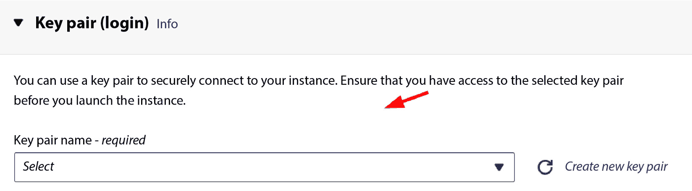
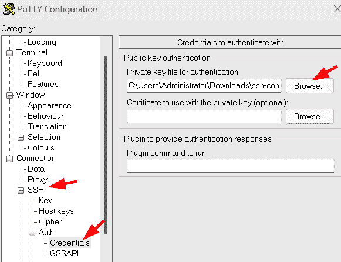
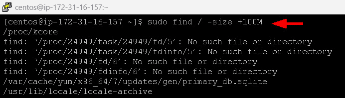

# 第十三章：云中的 Linux

云计算的出现彻底改变了 IT 基础设施的格局，而 Linux 一直站在这一变革的前沿。Linux 在云生态系统中的整合不仅重塑了企业和组织管理计算资源的方式，也为系统管理员提供了一个动态且可扩展的环境。本介绍深入探讨了 Linux 在云中的关键作用，以及它如何重新定义系统管理的格局。Linux 以其开源特性和多功能性而著称，已经顺利适应了云环境。通过这样做，它为基于云的解决方案提供了一个稳定且灵活的基础。Linux 在云中突出的一个关键原因是它能够为特定的云服务提供商（如 **Amazon Web Services** (**AWS**)、Microsoft Azure 和 Google Cloud Platform）提供量身定制的发行版。对于系统管理员来说，这意味着他们可以以与所选云基础设施完美契合的方式利用 Linux 的强大功能，从而简化资源管理和部署。

Linux 在云计算中的一个主要角色是让系统管理员能够轻松创建和管理虚拟实例。像 CentOS 这样的 Linux 发行版为管理员提供了强大且安全的平台，可以部署从网站托管到数据分析等各种云服务。虽然 CentOS 因其稳定性、兼容性和强大的社区支持而闻名，但需要注意的是，Ubuntu 和其他各种基于 Linux 的服务器在云中也被广泛使用。当进行互联网搜索时，你会发现关于这些平台是否适合你特定需求的不同观点。这不仅简化了虚拟机启动的过程，还允许管理员根据需要上调或下调资源，提供响应迅速且具有成本效益的解决方案。

Linux 还提供了许多对云中系统管理至关重要的功能和工具，如下所示：

+   **资源虚拟化**：Linux 允许系统管理员创建和管理 **虚拟机** (**VMs**)，虚拟机是可以在单一物理服务器上运行多个操作系统和应用程序的隔离计算环境。这使得资源的高效利用成为可能，并促进了云服务的动态扩展。

+   **容器化**：Linux 还是容器化的流行平台，容器化是一种轻量级的虚拟化技术，允许应用程序在称为容器的隔离环境中打包并部署。容器具有高度的可移植性和可扩展性，非常适合运行云原生应用程序。

+   **安全性**：Linux 以其安全性特性而闻名，例如**增强型安全 Linux**（**SELinux**），它提供了对系统访问和权限的细粒度控制。这使得 Linux 成为一个安全的平台，适合在多租户环境中运行基于云的工作负载。

+   **自动化**：Linux 提供了一系列工具和框架，用于自动化系统管理任务，如配置管理、部署和监控。这使得系统管理员能够高效且有效地管理大型且复杂的云环境。

此外，诸如 CentOS 等 Linux 发行版优先考虑云环境中的安全性和稳定性。系统管理员依赖 Linux 严格的安全协议和及时的更新来保护基于云的资产免受威胁。Linux 的开源性质进一步使管理员能够根据特定的组织需求定制安全配置，确保托管在云中的数据和应用程序的安全。

在本章中，我们将深入探讨 AWS 服务范围内的以下主要主题：

+   在 AWS 上创建 EC2 实例

+   使用 PuTTY 连接到已创建的 EC2 实例

+   在我们的 EC2 实例上工作

# 在 AWS 上创建 EC2 实例

在 AWS 上创建**弹性计算云**（**EC2**）实例是构建和部署可扩展、灵活的云计算资源的基础步骤。EC2 实例可以被视为 AWS 云中的虚拟服务器，了解如何创建 EC2 实例对于充分发挥 AWS 的强大功能至关重要。这项技能的重要性在于它为企业和组织提供了无与伦比的灵活性和成本效益。通过创建 EC2 实例，用户可以按需提供计算能力，根据变化的工作负载纵向或横向扩展资源，并通过仅为所消耗的资源付费来实现运营效率。创建 EC2 实例的主要原因在于它们为云计算领域带来的灵活性和多功能性。EC2 实例可以根据特定的应用需求进行定制，无论是运行 Web 服务器、托管数据库、进行数据分析还是运行机器学习工作负载。能够从多种实例类型中进行选择，每种实例类型都针对不同的使用场景进行了优化，允许用户根据应用需求量身定制其虚拟服务器。此外，用户可以选择操作系统、配置网络设置并选择存储选项，从而对云基础设施拥有无与伦比的控制权。

创建 EC2 实例的用途不仅仅是资源分配；它还包括高可用性、容错性和可扩展性。EC2 实例可以与 AWS 服务如**弹性负载均衡**（**ELB**）、自动扩展和 Amazon RDS 集成，以构建具有弹性和可扩展性的应用程序。可以随时启动、停止和终止实例，从而确保资源的最佳利用和成本管理。此外，EC2 实例是许多基于云的解决方案的基础，包括网站托管、数据处理和内容交付，因此它们是 AWS 广大生态系统中的核心组成部分。总之，掌握 EC2 实例的创建对于任何想要充分利用 AWS 云计算能力的人来说都是至关重要的。这使用户能够设计和部署稳健、可扩展且成本效益高的云解决方案，满足现代企业和组织的独特需求。

在创建实例之前，请访问 AWS 网站 ([`aws.amazon.com/`](https://aws.amazon.com/)) 创建账户。请注意，初始账户激活可能需要长达 24 小时的时间，因此必须提前规划。在 AWS 免费套餐的背景下，需要了解它为用户提供了在特定使用限制下免费探索 AWS 服务的机会。您可以在以下截图所示的常见问题解答部分找到更多信息：

图 13.1 – AWS 免费套餐信息

接下来，我们可以登录我们的 AWS 账户，并在 AWS 平台上开始创建 EC2 实例：

1.  我们可以在控制面板上找到 EC2，如下图所示：

图 13.2 – 搜索 EC2 虚拟服务器

该操作将带我们进入 EC2 控制面板。在**资源**部分，我们当前没有正在运行的实例、专用主机和实例，如下图所示：

图 13.3 – EC2 控制面板和资源面板

1.  AWS 控制台提供了一个用户友好的界面，用于管理您的 EC2 实例。点击**实例**按钮可以访问一个页面，显示您的活动 EC2 实例。在这里，您可以执行各种操作，如停止或终止正在运行的实例，并与它们建立连接。另一方面，**启动实例**按钮将引导您进入一个专门用于创建新 EC2 实例的页面。在这里，您可以从多种实例类型中选择，并根据需要定制实例的操作系统、应用程序和其他设置。

图 13.4 – 查看活动的 EC2 实例

1.  首先，我们为实例命名。然后，点击**浏览更多** **AMI** 链接：

图 13.5 – 选择一个 AMI（1）

1.  接下来，我们将导航到市场区域中的`CentOS 8`并选择下面截图所示的选项：

图 13.6 – 选择一个 AMI（2）

AWS 中的 AMI 作为现成的模板或虚拟机镜像。它们包含了启动虚拟实例所需的操作系统、应用程序服务器和其他必要软件等基本组件。这些 AMI 简化并加快了创建虚拟机的过程，免去了手动安装和配置的麻烦。此外，AMI 具有多样性，提供不同配置，并且与多种操作系统兼容，是在 AWS 云中快速部署虚拟实例的基石。如需了解 AMI 的更详细信息，请访问[`docs.aws.amazon.com/AWSEC2/latest/UserGuide/AMIs.html?tag=buylocal0e8-20`](https://docs.aws.amazon.com/AWSEC2/latest/UserGuide/AMIs.html?tag=buylocal0e8-20)。

1.  接下来，我们会看到一个弹出窗口，显示 CentOS 8 的相关信息和一个**继续**按钮。点击它：

图 13.7 – 选择一个 AMI（3）

1.  接下来是**密钥** **对（登录）**。

    一个密钥对由两个加密密钥组成：公钥和私钥。公钥用于加密数据，而私钥用于解密数据。当使用密钥对登录到实例时，实例使用公钥来加密你的登录凭证。随后，你使用私钥解密登录凭证。

    关于密钥对登录屏幕的附加信息包括：

    +   **选择密钥对**下拉菜单显示与你的账户相关联的所有密钥对列表。

    +   **创建新密钥对**按钮允许你生成一个新的密钥对。

    +   **下载你的密钥对**按钮允许你下载与所选密钥对相关的私钥。

注意

保持你的私钥秘密非常重要。如果其他人获得了你的私钥，他们将能够登录到你的实例并访问你的数据。

图 13.8 – 密钥对（登录）窗口

1.  让我们创建一个新的密钥对。你需要点击`connect`。

1.  **密钥对类型**：此字段允许你选择要创建的密钥对类型。你有两个选项：**RSA**或**ED25519**。RSA 是更常见的密钥对类型，所有 AWS 服务都支持它。ED25519 是一种更新且更安全的密钥对类型，优于 RSA，但我们将使用 RSA。

1.  **私钥文件格式**：在此字段中，您可以选择希望保存私钥的格式。您有两种选择：**.pem** 或 **.ppk**。**.pem** 是私钥的标准格式，所有 SSH 客户端都支持它。**.ppk** 是 PuTTY SSH 客户端特有的格式。我们将选择**.ppk**选项，然后点击**创建密钥** **对**按钮：

图 13.9 – 创建密钥对

点击 `Downloads` 文件夹后：

图 13.10 – 下载的 .ppk 密钥

接下来，我们将进行网络设置。安全组页面提供了与您的 AWS 账户关联的所有安全组的综合视图。该页面上每个安全组条目包括安全组名称、描述及其**虚拟私有云**（**VPC**）关联等信息。在安全组页面，您可以执行多种操作，包括创建新安全组、修改现有的安全组以及删除不再需要的安全组。

让我们深入了解什么是 VPC。

VPC 是 AWS 及类似云计算平台的基本组成部分。它是一个虚拟网络环境，允许用户创建和管理 AWS 云基础设施的逻辑隔离部分。VPC 提供了对云资源的额外安全层和控制权限，允许用户设计自己的网络架构，定义 IP 地址范围，创建子网，并配置路由表。

在 VPC 内，用户可以启动和管理广泛的云资源，包括虚拟机（EC2 实例）、数据库、负载均衡器等。通过将云环境划分为 VPC，组织可以建立与传统数据中心架构相似的隔离网络，同时享有云的灵活性和可扩展性。这种隔离使用户能够实施精细化的安全策略，确保只有授权流量能够访问 VPC 内的资源。VPC 还支持创建 VPN 和与本地数据中心的直接连接，促进安全的混合云部署。总之，VPC 是云网络的基石，为部署和管理云资源提供了一个灵活且受控的环境，同时增强了安全性和网络隔离。

1.  要启动创建新安全组的过程，请在**网络** **设置**页面点击**编辑**按钮：

图 13.11 – 编辑安全组（1）

1.  在下一页，点击**创建安全组**按钮以创建一个新的安全组。

    要编辑现有的安全组，请点击相应的安全组名称：

图 13.12 – 编辑安全组（2）

1.  如果你希望删除一个安全组，点击安全组名称，然后点击**删除安全组**按钮。

    这里有一些有效利用安全组的有用技巧：

    +   **保持限制规则**：在设置安全组时，遵循最小权限原则。仅允许对 EC2 实例功能至关重要的流量。

    +   **隔离流量**：为不同类型的流量创建独立的安全组。例如，将 Web 服务器和数据库服务器的安全组分开，可以增强你的网络安全性。

    +   **定期审核**：定期评估你的安全组，以确保它们与你不断变化的需求和安全要求相符。

1.  最后，我们来看一下规则。它们允许来自互联网任何来源的 SSH 流量连接到指定安全组的端口`22`：

图 13.13 – 入站安全组规则

让我们分解一下这个规则的各个组件：

+   **类型**：这表示规则允许的流量类型。在此实例中，它是**ssh**。

+   `TCP`。

+   `22`。

+   `0.0.0.0/0`，表示允许来自互联网任何地方的流量。

+   **描述**：这是规则的简要描述，在此情况下为 SSH 访问。

1.  接下来，我们将配置存储。

    根卷类型是指用于实例根设备的存储，该设备包含操作系统和必要文件。

    有两种主要的根卷类型：

    +   `30` GB：

图 13.14 – 配置存储

+   **实例存储**：这些卷为 EC2 实例提供临时存储，但不具备持久性。实例存储卷中的数据在实例终止时不会保留。

在启动 EC2 实例时选择根卷类型。虽然启动后可以更改根卷类型，但这样做需要停止实例。

大多数 EC2 实例选择 EBS 卷作为其根存储，原因如下：

+   **持久性**：EBS 卷即使在实例终止后也会保留数据，因此非常适合存储关键数据，如操作系统文件和应用程序数据。

+   **可扩展性**：EBS 卷可以调整大小，适应具有不同存储需求的应用程序。

+   `通用用途`（`SSD`）、`预置 IOPS`（`SSD`）和`磁性`，使用户能够根据其应用程序选择适当的性能级别。

1.  在做出这些选择后，我们进入摘要区域以启动实例。摘要包含以下信息（另见*图 10.15*）：

    +   **实例数量**：**1**

    +   **软件镜像（AMI）**：**CentOS-7-2111-20220825_1.x86_64 ami-002070d43b0a4f171**

    +   **虚拟服务器类型（实例类型）**：**t2.micro**

    +   **防火墙（安全组）**：**INS-Security-Group**

    +   **存储（卷）**：**1 个卷 -** **30 GB**

    概述还显示该实例符合 AWS 免费套餐的条件。这意味着您在第一年内每月最多可以免费使用该实例 750 小时。

图 13.15 – 概述

1.  点击 **启动实例**。当您看到实例启动进度成功时，点击 **EC2** 旁边的 **实例**：

图 13.16 – 实例成功启动

1.  在前一步点击 **EC2** 后，我们将被重定向到 **EC2** **仪表板** 页面。以下截图显示了一个状态为 **Running** 且状态检查为 **2/2 checks passed** 的 AWS EC2 实例：

图 13.17 – 2/2 checks passed

这表示实例当前正在运行，并且 AWS EC2 执行的两项状态检查已成功完成。

AWS EC2 对每个运行中的实例进行两种类型的状态检查：

+   系统状态检查，用于监控支持实例的 AWS 系统

+   实例状态检查，用于识别 EC2 实例内部的问题

如果这些状态检查中的一个失败，则实例的总体状态会标记为 **Impaired**。在这种情况下，实例可能无法按预期正常运行。

**Impaired** 状态表示实例的健康状况可能存在问题，但并不意味着实例无法修复。

根据问题的性质，您可能能够在不重新创建整个 AMI 的情况下进行故障排除并解决问题。解决问题的具体步骤将取决于故障的性质。以下是一些问题类型的示例：

+   **系统状态检查失败**：如果此检查失败，通常表示底层基础设施存在问题。AWS 可能会自动尝试恢复实例。在某些情况下，您可能需要停止并重新启动实例，或者您可能需要联系 AWS 支持寻求帮助。

+   **实例状态检查失败**：当此检查失败时，通常指向实例本身的问题，例如软件或配置问题。通常您可以访问实例，识别问题并应用修复，而无需创建新的 AMI。

在前面的截图中，**2/2 checks passed** 状态确认系统检查和实例检查都已成功通过，表明实例处于健康且完全运行的状态。

# 使用 PuTTY 连接到已创建的 EC2 实例

在 AWS 中建立与 EC2 实例的连接是利用云计算能力的一个基础步骤。它涉及到创建到托管在 AWS 云基础设施中的虚拟服务器的远程连接。这个连接允许用户访问、管理和配置虚拟服务器，充分利用 AWS 提供的灵活性、可扩展性和成本效益。

连接到 EC2 实例的主要动机是获得对基于云的服务器环境的安全和高效的远程访问。这种连接对系统管理员、开发人员和 DevOps 从业者来说非常宝贵，使他们能够执行与服务器设置、软件安装、实时监控、故障排除和日常维护相关的关键任务。它使服务器资源的无缝管理和文件传输成为可能，并能够及时实施系统更新，所有这些都不需要在服务器位置亲自操作。连接到 EC2 实例对于部署和管理 Web 应用程序、数据库和其他云原生服务至关重要。它简化了协作工作，并确保云资源在任何位置都能访问，使其成为现代云基础设施管理的一个基本组成部分。

连接到 EC2 实例的目的多种多样。系统管理员使用远程访问来监督服务器配置、应用安全补丁并监控性能指标。开发人员利用这些连接来部署和测试应用程序、调试程序以及管理云中的开发环境。DevOps 团队依赖远程连接来简化服务器配置、配置大规模的服务器群集，并高效地协调复杂的**持续集成/持续部署**（**CI/CD**）流水线。采用**基础设施即代码**（**IaC**）原则的组织依赖远程访问来系统化和高效地编程管理云基础设施。

在连接到我们创建的实例之前，请访问 [`www.chiark.greenend.org.uk/~sgtatham/putty/latest.html`](https://www.chiark.greenend.org.uk/~sgtatham/putty/latest.html) 下载 PuTTY。根据你系统的架构，可以选择 64 位版本或 32 位版本：

图 13.18 – PuTTY 64 位版本或 32 位版本

安装 PuTTY 后，我们可以继续检查我们创建的 Linux 实例。我们将检查实例摘要，其中包括公共 IPv4 地址以及与安全、网络、存储、状态检查、监控、标签和私有 IPv4 地址相关的详细信息：

图 13.19 – 实例摘要视图

我们可以尝试快速使用 PuTTY 连接到我们的实例：

图 13.20 – PuTTY 配置

输入实例摘要中的公有 IP 地址到 `22`，然后点击 **打开**。随后，你将看到 PuTTY 输出。屏幕截图中的信息显示，我们的用户正在尝试以 root 用户身份通过公钥登录到 EC2 实例。这是因为，默认情况下，EC2 实例上的 root 登录是禁用的：

图 13.21 – PuTTY 输出

系统提示用户改为以 `centos` 用户登录，但在此之前，让我们先检查一下如何在 PuTTY 上加载我们的 `.pkk` 密钥。定位到密钥：

图 13.22 – 将 .pkk 密钥添加到 PuTTY

我们可以给它任何名称。看一下下面的示例：

图 13.23 – 已保存会话设置

图中的箭头指向的是 PuTTY 会话的默认设置，它们位于以下位置：

+   `centos@35.172.201.164`。

+   **已保存会话**：此按钮允许你将当前 PuTTY 会话设置保存到文件中。如果你经常连接到同一台服务器，这将非常有用，因为你可以简单地加载已保存的会话设置，而不必像在图中所示的 **Linux-AWS** 一样每次输入。

+   **加载**：此按钮允许你加载已保存的 PuTTY 会话。只需选择你想加载的会话文件，然后点击 **加载** 按钮。

+   `.``pkk` 密钥：

图 13.24 – 使用公钥进行身份验证

成功建立连接后，你将获得访问终端窗口的权限，从而高效地管理实例。

在验证系统可用空闲空间的过程中，我们使用 `df` 命令显示文件系统的相关信息。该命令提供磁盘使用情况和可用空间的视图。此外，我们执行 `whoami && hostname && uname -a` 命令序列。`whoami` 命令检索当前用户的用户名，`hostname` 显示系统的主机名，`uname -a` 提供全面的系统信息，包括内核版本和架构。

总结一下，连接到 EC2 实例是解锁云计算全部潜力的关键一步，它便于服务器管理、云原生应用开发和基础设施自动化，所有这些都能无缝集成在 AWS 云环境中。

# 在我们的 EC2 实例上工作

在本节中，我们将利用一些类似于 CentOS 中使用的命令，并应用于执行一些简短任务。所以，让我们开始吧：

+   **更新** **和升级**：

    你刚刚在 AWS 上启动了 CentOS 8 Linux 实例。为了确保其最新，使用以下命令：

图 13.25 – 更新和升级

这是交易摘要：

图 13.26 – 事务总结

总结信息显示有一个软件包正在安装中，42 个软件包正在更新，累积下载大小为 110 MB。系统提示用户决定是否继续安装过程。

在更新软件包时，软件包管理器作为用户管理软件安装、更新和删除的重要工具，能够简化系统操作。这些工具提供了灵活性，可以从多个来源安装软件，包括官方仓库、第三方仓库和本地文件，为用户提供多样的软件管理选项。

+   **软件包安装**：

    以下展示了在 CentOS 8 实例上安装 Apache Web 服务器的过程：

图 13.27 – 安装软件包

+   **服务管理**：

    以下是启动 Apache 服务并启用其开机自启的步骤：

图 13.28 – 启动 Apache 服务

下面是该命令的细分：

+   `sudo systemctl status httpd`：此命令检查 Apache HTTP 服务器 (`httpd`) 的状态。它显示有关服务的信息，如描述、是否已加载或处于活动状态，以及相关文档。在这种情况下，它显示该服务已加载但处于非活动（已停止）状态。

+   `sudo systemctl start httpd`：此命令启动 Apache HTTP 服务器。它启动服务，使其变为活动状态并开始运行。

+   `sudo systemctl enable httpd`：此命令启用 Apache HTTP 服务器在启动时自动启动。它会在多用户目标和 httpd 服务之间创建符号链接，确保系统启动时服务自动启动。

+   `sudo systemctl status httpd`：在启动并启用服务后，此命令再次检查 Apache HTTP 服务器的状态。现在，它显示服务已加载、已启用并且处于活动（运行）状态。它还提供有关该服务的额外信息，包括其主要 **进程 ID** (**PID**) 和当前状态。

+   `journalctl` 用于访问并查看 Linux 系统上的 `systemd` 日志。`systemd` 日志是一个系统日志，包含系统及其组件生成的各种日志条目和消息。`journalctl` 的输出以时间顺序显示日志条目，提供有关系统活动和事件的信息。

    在提供的输出中，我们可以观察到以下细节：

    +   该命令显示的日志可以从特定的时间戳开始（例如，`Mon 2023-10-16 21:22:47 UTC`），并以另一个时间戳结束（例如，`Mon 2023-10-16 23:15:01 UTC`），理解为时间戳可能会有所不同。

    +   日志显示了各种系统事件，包括来自 `systemd` 组件和内核相关活动的消息。

    +   这些事件可能包括系统初始化、SELinux 策略加载、硬件和内核配置、虚拟化检测、主机名配置等。

    +   日志条目还包括关于`systemd`进程及其状态的详细信息，比如是否启动成功或遇到问题。

    +   `journalctl`命令提供了系统活动的全面视图，有助于系统管理、调试和故障排除。

图 13.29 – 跟踪系统活动

`journalctl`是一个有价值的工具，帮助系统管理员监控系统健康状况并诊断问题。提供的输出代表了系统日志的一部分，包含事件和时间戳，允许用户有效地跟踪系统活动并诊断问题。

+   `sudo find / -size +100M`命令用于搜索整个文件系统（`/`），查找大于 100MB 的文件（+100MB）。它从根目录开始，搜索所有目录及子目录。输出会显示所有符合大小标准的文件路径：

图 13.30 – 查找文件 (1)

提供的输出显示它已经定位到几个大于 100MB 的文件，包括以下内容：

+   `/proc/kcore`：这个文件代表内核的核心内存，这是一个虚拟文件，而不是磁盘上的实际文件

+   `/var/cache/yum/x86_64/7/updates/gen/primary_db.sqlite`：这是一个数据库文件，由 YUM 包管理器用于存储有关可用包和更新的信息

+   `/usr/lib/locale/locale-archive`：这个文件包含用于国际化和本地化的系统区域信息

文件路径后的错误信息表明`find`命令无法访问`/proc`目录下的某些目录，这是预期中的情况，因为`/proc`是一个虚拟文件系统，里面不包含实际的磁盘文件。在这种情况下，错误信息可以安全地忽略。

`sudo find / -user root -o -group root | less`命令用于搜索整个文件系统（`/`），查找属于`root`用户或`root`组的文件和目录：

图 13.31 – 查找文件 (2)

命令中的`| less`部分将输出管道传递给`less`命令，允许更方便地浏览和逐屏查看结果。

提供的输出显示它已经定位到`/dev`目录中各种文件和目录，这些文件和目录要么属于`root`用户，要么属于`root`组。包括以下内容：

+   `/dev/vhci`：这是一个虚拟主机控制器接口

+   `/dev/vfio`：这是一个虚拟功能 I/O 接口

+   `/dev/vfio/vfio`：这是`/dev/vfio`下的一个子目录

+   `/dev/ppp`：这与**点对点协议**（**PPP**）设备相关

+   `/dev/uinput`：这是一个虚拟输入设备

+   `/dev/mqueue`：这些是消息队列设备

+   `/dev/hugepages`：这些是与内存管理中的大页相关的文件

+   `/dev/initctl`：这是一个**先进先出**（**FIFO**）特殊文件，用于与 init 进程进行通信

该命令对于系统管理员在识别具有特定所有权或组成员资格的文件和目录非常有帮助，这对于管理系统安全性和访问控制尤为重要。`less`命令用于使输出更易读、更易导航，尤其是在处理大量搜索结果时。

# 总结

本章指导你完成了在 AWS 上创建 Amazon EC2 实例的全面过程。本章探讨了在云中建立虚拟服务器所需的关键步骤，并深入研究了 AWS 上可用的各种实例类型和配置。重点关注实用性，你还学到了配置实例细节、更改存储以及为性能和安全设置安全组的宝贵知识。本章让你掌握了在云环境中管理 EC2 实例的知识和技能。它提供了逐步指南，教你如何在成功创建后与 AWS EC2 实例建立安全连接。本章还介绍了 PuTTY，一款广泛使用的 SSH 客户端，并详细阐述了如何有效使用它连接到基于 Linux 的 EC2 实例。旅程从 PuTTY 的概述和用于安全身份验证的 SSH 密钥对的基本概念开始。此外，你还获得了有关安装和配置 PuTTY 的详细指导，包括设置会话、配置凭证位置并加载会话。最后，在*我们的 EC2 实例操作*部分，我们探索了用户可以在 AWS EC2 实例上执行的实际管理任务。本章强调了更新和升级 EC2 实例的重要性，以确保它们的最佳运行并安装最新的软件包。它提供了逐步的指导，教你如何使用包管理器有效安装、更新和升级软件。你还学习了服务管理，能够使用`systemd`启动和管理服务。接着，本章介绍了`journalctl`，这是一个强大的工具，用于访问系统日志，监控活动、排除故障以及收集重要的系统健康信息。最后，本章通过使用`find`命令进行目录管理，圆满结束了你对动态云环境中 EC2 实例管理的全面理解。
