# 1

# Linux 和开源项目

系统管理是一项需要正确工具以实现所需流程优化的工作。要管理基于 GNU/Linux 的系统，你必须拥有一台能够促进上述优化的工作站。Linux 工作站在这方面提供了许多优势。根据我的经验，**Fedora Linux**，一个由**Red Hat**赞助的*社区开发*发行版，提供了一套推荐的 Linux 系统管理工具。

在学习如何配置工作站进行系统管理之前，我们将回顾一下这个操作系统的历史，以便我们能够更好地理解背景，最重要的是，知道我们如何能够帮助开发该发行版，以便我们能够改进它。

在本章中，我们将了解以下内容：

+   Linux 简史

+   理解 Linux 发行版

+   Fedora 项目

+   命令行界面

+   桌面环境

让我们开始吧！

# Linux 简史

在进入正题之前，我想提供一些关于操作系统历史的小背景。正如我们所知，个人计算机的历史相对较短——大约 50 年，特别是**GNU/Linux**的历史，甚至还不到这个时间。

在 1960 年代末期，*Ken Thompson*基于 Multics 在 PDP-7 小型计算机上编写了第一个版本的**Unix**，它由内核、shell、编辑器和汇编器组成，那时是黑暗的时代。

1970 年，操作系统的开发在 AT&T 贝尔实验室继续进行。此时，*Brian Kernighan*建议使用**Uniplexed Information & Computing Service**（**UNICS**）作为名称，运行在 PDP-11 计算机上。然而，使用的 BCPL 和 B 语言在新平台上存在一些实现问题。1972 年，*Denis Ritchie*利用这两种语言开发了一种新的高级语言，现在称为**C 语言**，增加了数据类型和其他强大功能。由此，**Unix**系统诞生了。

该平台的软件开发持续进行，操作系统有了重要的补充。1976 年，MIT 的学生*Richard Stallman*在一个完全使用自由软件的小组工作时，编写了第一个版本的**Emacs**，它是**文本编辑器与** **修正工具**（**TECO**）。

在 1980 年代初期，几乎所有的软件都是专有的，因为科技公司各自单独集中精力，而没有考虑协作开发。这促使*斯托尔曼*于 1983 年创建了**GNU 项目**（即*GNU 不是 Unix*），该项目旨在创建一个基于 Unix 的自由操作系统。因为 Unix 的总体设计已经得到了验证且具备可移植性，并且带回了计算机社区早期的合作精神。

Stallman 通过以 150 美元分发代码启动了**GNU Emacs**。他随后用这笔钱资助了 1985 年成立的**自由软件基金会**。Emacs 是根据*Emacs 通用公共许可证*发布的，该许可证允许自由分发和使用，同时保留版权，并且即使在对代码进行修改或添加时，也要求保留版权。

基于这一理念，1989 年发布了**GNU 通用公共许可证**（**GPL**）的第一个版本，将自由软件的使用和分发扩展到所有将其作为 GNU 项目一部分的编程开发。

许可证的第二个版本于 1991 年发布，主要的区别在于许可证的义务不能分开，因为存在冲突的义务。这一条款旨在阻止任何一方以专利侵权或其他诉讼为由，妨碍用户自由使用早期版本的权利。

在同一年，*Linus Torvalds*，一名芬兰学生，使用 Tanenbaum 的 1987 年书籍《操作系统：设计与实现》、Bach 的 1986 年书籍《UNIX 操作系统的设计》、以及 Jolitz 的文章《将 UNIX 移植到 386：一种实际方法》（William Jolitz，Dr. Dobb’s Journal，1991 年 1 月，16 卷 1 期，页码 16-46），移植了一些基础工具，创建了一个*(免费的)操作系统……用于 386(486) AT 克隆机*，并在 Usenet 小组`comp.os.minix`（[`groups.google.com/g/comp.os.minix/c/dlNtH7RRrGA/m/SwRavCzVE7gJ`](https://groups.google.com/g/comp.os.minix/c/dlNtH7RRrGA/m/SwRavCzVE7gJ)）上寻求帮助，这就是我们今天所知道的**Linux**：

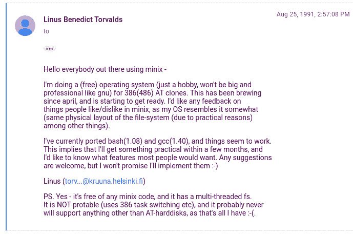

图 1.1 – Linus Torvalds 在 Usenet 小组 comp.os.minix 中的原始帖子

Linux 并非一直都是开源的。最初的 Linux 许可证禁止商业再分发。直到 1992 年初发布的**0.12**版本，Linux 内核才在 GPL 下发布。Linus Torvalds 表示，开源 Linux 是他做过的最好的事情。

受到这一努力成功的启发，出现了多个新的软件开发项目，以推动新创建的操作系统。这些开发提供了新的功能和工具，补充和促进了 Linux 的使用，并扩展了该平台在商业和个人用途等不同领域的应用。

GPL 的使用是推动基于计算机社区合作性质发展的动力。

这种合作精神奠定了今天我们所称之为 Linux 的基础，但为了让这些努力的成果惠及每个人，还需要推动力。这一推动力来自于 Linux 发行版，即称为 distro 的版本。

# 了解 Linux 发行版

**GNU 项目**在实现其官方开发的内核时遇到了一些问题。这个内核被称为**Hurd**，它是一个协议集合，规范了不同组件之间应如何相互作用 ([`www.gnu.org/software/hurd/index.html`](https://www.gnu.org/software/hurd/index.html))。这些工具运行良好，但没有足够的凝聚力与操作系统集成。当 Linus Torvalds 发布 Linux 内核时，许多热心的开发者将 GNU 代码，包括编译器，移植到 Linux 上。这些努力填补了剩余的空白，最终得到了一个完全免费的操作系统。

1992 年，Linux 和 GNU 项目联手 ([`laurel.datsi.fi.upm.es/~ssoo/IG/download/timeline.html`](http://laurel.datsi.fi.upm.es/~ssoo/IG/download/timeline.html))，*理查德·斯托曼*提议将其称为 GNU/Linux，因为许多工具都是从 GNU 项目集成的。这导致了新项目的诞生，这些项目将 GNU 工具和 Linux 内核整合成了我们今天所知的**Linux 发行版**。

发行版由 Linux 内核、GNU 工具和其他大量软件包组成；许多发行版还提供了类似于其他现代操作系统的安装系统。发行版通常被分为多个软件包，其中一些只提供内核二进制文件、编译工具和安装程序。软件包以已编译的代码形式提供，软件包的安装和卸载由**软件包管理系统**（**PMS**）而不是简单的文件归档工具来处理。

一些发行版甚至作为*嵌入式操作系统*交付到某些设备上，除了基于**Android**的移动发行版外。这些发行版是专门为移动电话创建的。

多年来，出现了不同的 GNU/Linux 发行版项目，其中那些历时较长的项目尤为重要。除此之外，它们还催生了新的发行版，包括以下内容：

+   **Slackware**：发布于 1993 年，最初名为**Softlanding Linux System**（**SLS**），并包含了 X Window 系统。在短暂的一段时间内（1992 年），它是最完整的发行版。凭借当时最新的工具，Slackware Linux 为新老用户提供了一个功能齐全的系统，适合用于各种需求，无论是作为桌面工作站还是服务器。Web、FTP 和电子邮件服务开箱即用，还有丰富的流行桌面环境可供选择。为了有意开发或编译额外软件的用户，还提供了完整的开发工具、编辑器和库。它是第一个受益于全球数百万开发者工作成果的发行版。

+   **Debian**：1993 年，*Ian Murdock* 对 SLS（后来称为*Slackware*）的维护不善和漏洞频发感到失望，发布了他最初称之为*Debian Linux 发行版*的操作系统。Debian 是他与当时女友 Debra Lynn 的名字与他自己名字的*合成词*（将几个单词的部分合并为一个新词）。Debian 的稳定版本在个人计算机和服务器中使用最为广泛。该版本包含了 *Debian Linux 宣言*，其中 Murdock 描述了他对操作系统的愿景，呼吁将其保持为“*在 Linux 和 GNU 精神下开放*”。Debian 的发行版本以**玩具总动员**电影中的人物命名。Debian 也是许多其他发行版的基础，**Ubuntu** 是其中最著名的。Debian 使用 **dpkg**（**Debian 包管理器**）作为包管理系统，以及其众多衍生版本。

+   **Red Hat**：同样在 1993 年，*Marc Ewing* 在北卡罗来纳州罗利市的家中创建、调试并分发他的 Linux 发行版 CD。Red Hat 这个名字来源于他大学时在计算机实验室的日子；他总是戴着一顶红色帽子，用户会说：“*如果你需要帮助，找那个戴红色帽子的人*。” Bob Young 在一次技术会议上遇到了他，并开始购买他的 CD 进行转售，因 Linux 的兴趣日益增长。1995 年，他们联合创办了 Red Hat Software。Red Hat 使用 **rpm**（最初名为 **Red Hat Package Manager**；由于它在多个 Linux 发行版中流行，后来改为 **RPM Package Manager**）作为包管理系统，以及其众多衍生版本。

现在，是时候了解我们使用的发行版了，它有一些有趣的原则。

# **Fedora 项目**

**Red Hat Linux** 每 6 个月发布一次，甚至可以在 Best Buy 买到。经过几次发布后，它开始获得大企业客户，部分原因是 2000 年左右 Microsoft 遭遇的反垄断诉讼，但它并没有为满足这些客户需求而定义明确的支持周期。公司意识到，他们试图在两个不同的方向上开发产品——一方面寻求行业所需的稳定性，另一方面则寻求使用最新的开源发展进行创新。

因此，他们决定将工作分成两个基本上独立的实体——**Red Hat 企业 Linux**（**RHEL**）和 **Fedora 项目**——每个实体都尽力解决自己的问题。

对于 **RHEL**，任务是将其打造成一个稳固、稳定的平台，客户和合作伙伴可以依赖它进行 5 至 7 年的支持周期。Red Hat 首次为 **Red Hat Linux 6.1** 提供了企业级 Linux 支持订阅。这并不是一个独立的产品；而是一个名为 **Red Hat 6.2E** 的订阅服务。此后，Red Hat 开始构建一个独立的产品，基于 Red Hat Linux，并具有商业服务级协议和更长的生命周期。

**Fedora Linux**由**Fedora 项目**（最初名为**Fedora.us**）开发，并由红帽资助。它遵循自己独立的发布计划，每 6 个月发布一个新版本（分别在 4 月和 10 月）。Fedora 提供了一个现代化的 Linux 操作系统，采用了行业中许多最新的技术。

要创建一个新的 RHEL 版本，大部分开发工作发生在*上游项目*中。然后，这个新版本会集成到 Fedora Linux 中，随后的“产品化”过程会在 CentOS Stream 中进行，最终成为 RHEL。

这个过程被称为红帽的贡献路径，对于深入了解该发行版的发展流程至关重要。它也帮助我们理解在这个流程中发行版的重要性。

## 红帽贡献路径

2020 年 12 月，红帽宣布停止开发**CentOS 项目**，这个项目自 2014 年起由红帽资助，其 2004 年版本 2 从**RHEL 2.1AS**分支而来，从那时起它被集成为**CentOS Stream**，并成为 RHEL 开发贡献路径的一部分。

RHEL 的开发始于社区项目，在这些项目中，行业中最新和最创新的技术被开发出来。Fedora 的角色是将这些技术适应并融入到每个新版本的发行版中。

每 3 年发布一个 RHEL 的新主版本。当下一个主版本的 RHEL 发布大约在 1 年内时，这些创新达到了一个最优开发水平，通过**Fedora 项目**的开发者、集成商以及独立软件和硬件供应商之间的反馈促进了这一进程，提供了行业所需的稳定性。然后，**CentOS Stream**从**Fedora Linux**分支出来。CentOS Stream 的代码成为下一个 RHEL 版本，这意味着用户可以在发布前参与产品开发并测试其工作负载。这成为了 RHEL 开发的持续集成，从而缩短了在未来 RHEL 版本发布中应考虑的反馈循环。

以下图展示了这一流程：

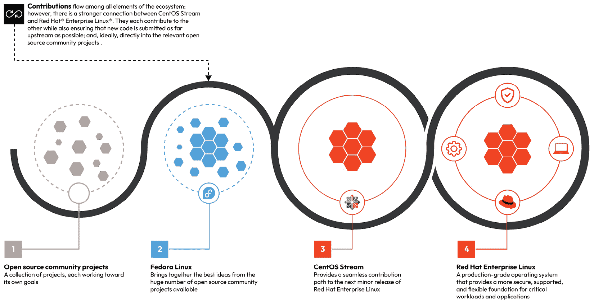

图 1.2 – 红帽贡献路径

**Fedora Linux**在 RHEL 的开发中扮演着至关重要的角色，如前所述，但**Fedora Linux**本身就是一个可用的操作系统，拥有行业中最现代化和创新的工具。作为副产品，它也被广泛应用于企业环境中，以管理基于 RHEL 的系统。这得益于上述红帽贡献路径所提供的便利。

## Fedora 的使命和基础

Fedora 项目致力于构建一个自由和开源的软件平台，合作并分享面向最终用户的解决方案。

由于**Fedora 社区**包含成千上万具有不同观点和方法的个人，他们的合作精神基于他们所称的**四大基础**：


图 1.3 – Fedora 的四大基础

让我们详细看看它们：

+   **自由**

“*我们致力于自由软件* *和内容*。”

([`docs.fedoraproject.org/en-US/project/`](https://docs.fedoraproject.org/en-US/project/))

目标是生产一个只包含自由软件的可用操作系统。避免使用专有或受专利保护的内容，采用免费的替代方案，从而提供一个能够将最具创新性的软软件带给每个人的发行版，使得任何人都能合法使用。

+   **朋友**

“*我们是一个强大且关爱的社区*。”

([`docs.fedoraproject.org/en-US/project/`](https://docs.fedoraproject.org/en-US/project/))

Fedora 社区是一个多学科且多元化的社区，具有共同的目标：推动自由软件的发展。任何愿意帮助的人，无论其技能如何，只要相信其核心价值观，都可以在这个社区找到一席之地，并享受一个友好与协作的环境。

+   **特点**

“*我们关心* *卓越的软件*。”

([`docs.fedoraproject.org/en-US/project/`](https://docs.fedoraproject.org/en-US/project/))

许多赋能 Linux 的功能来自 Fedora 社区，使其对全球的许多人都变得灵活且有用。Fedora 社区是自由软件开发的坚定信徒，无论这些功能是否被用于该发行版，它都支持功能的清晰和透明开发，使得任何想参与发行版的人都能使用这些功能。

+   **首先**

“*我们致力于* *创新*。”

([`docs.fedoraproject.org/en-US/project/`](https://docs.fedoraproject.org/en-US/project/))

Fedora 项目提供最新的稳定且强大的自由软件，是一个展示操作系统使用未来的平台。它推动这种软件的发展，展示了合作技术进步的成果。Fedora 总是考虑在一切之前为未来做好准备。

除了这四大基础，Fedora 项目还有一个非常明确的愿景和使命。

### 愿景

“Fedora 项目设想一个每个人都能从由包容、欢迎和开放思维的社区构建的自由和开源软件中受益的世界。”

([`docs.fedoraproject.org/en-US/project/#_our_vision`](https://docs.fedoraproject.org/en-US/project/#_our_vision))

Fedora 的愿景遵循 GNU 项目的原则，使用自由和开源软件的好处扩展到所有需要使用它的人，以一种包容所有社区并开放所有可能性的方式。

### 使命

“Fedora 为硬件、云和容器创建了一个创新平台，使软件开发人员和社区成员能够为其用户构建量身定制的解决方案。”

([`docs.fedoraproject.org/en-US/project/#_our_mission`](https://docs.fedoraproject.org/en-US/project/#_our_mission))

Fedora 的使命专注于创新和适应现有与未来平台上的技术，为增强最终用户体验的解决方案提供支持。

## 贡献项目

Fedora 社区致力于构建和开发自由开源软件，并推动对整个社区具有重要意义的进展。它快速且定期地将这些进展融入到发行版中，甚至融入到其他 GNU/Linux 发行版中。Fedora 在短期内整合了自由开源方法和易用性。

软件开发不仅仅涉及程序员——它还需要设计师、艺术家、作家、演讲者、翻译员、系统管理员等。协调这一切工作需要社区中的领导力，这使得决策不至于过度拖延。

重要事项

您无需成为贡献者即可使用 **Fedora Linux**。在接下来的章节中，您将学习 *如何使用 Fedora Linux 进行系统管理*。但是，如果您想要为项目做出贡献，以下是方法！

项目的领导由 **Fedora 委员会**提供，该委员会由八个职位组成，其中两个由选举产生的社区贡献者担任。除了委员会，还有几个领导小组：

+   **Fedora 工程指导委员会**（**FESCo**）：管理 Fedora 发行版的技术特性及 Fedora 项目中政策的具体实施。

+   **Fedora 思维委员会**：代表用户和贡献者社区的增长与支持的领导层。

除了工作组（各个版本的发行版在这里开发，如 **工作站**、**服务器**、**物联网**、**云** 和 **CoreOS**），一些子项目在 *Fedora 模式*下开发机会领域。还有一些较为非正式的兴趣小组（**SIGs**），它们为发行版采用框架或轻量级桌面环境。

### 行为准则

Fedora 通过一套准则促进其协作者与社区成员之间的最佳互动，这些准则包含在一个被称为 **行为准则** 的文档中，决策依据所有可用的信息和背景，以追求为其成员提供最佳的环境。它并不打算限制表达或惩罚任何社区成员；它仅详细说明了被视为可接受或不可接受的行为类型。

注意

有关完整的行为准则，请参阅 Fedora 文档：[`docs.fedoraproject.org/en-US/project/code-of-conduct/`](https://docs.fedoraproject.org/en-US/project/code-of-conduct/)。

### 开始使用 Fedora

要为 Fedora 项目做出贡献，请遵循以下步骤：

1.  第一步是创建一个用户账户，访问 [`accounts.fedoraproject.org/`](https://accounts.fedoraproject.org/)：


图 1.4 – Fedora 账户

1.  填写注册表单后，系统将要求您验证注册的电子邮件地址：

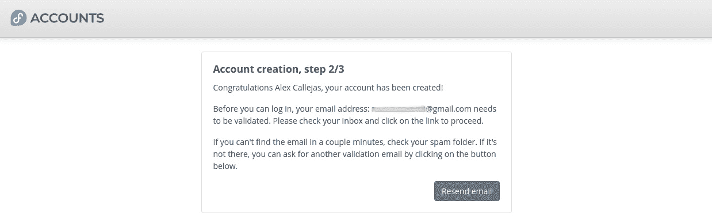

图 1.5 – Fedora 账户 – 账户创建

1.  点击你通过邮件收到的链接后，系统会要求你创建密码：

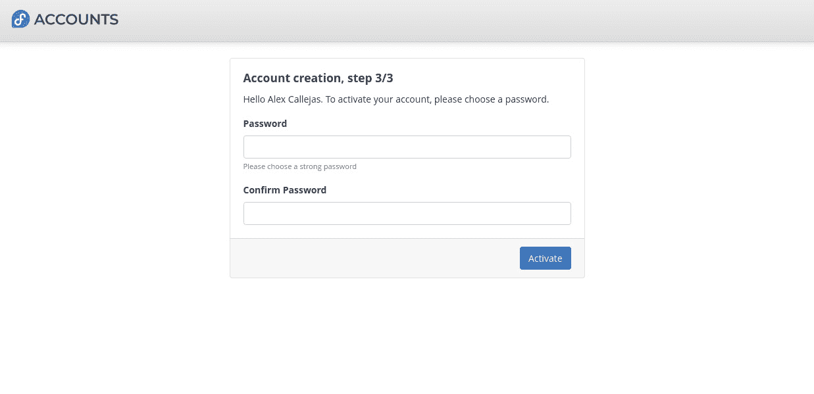

图 1.6 – Fedora 账户 – 设置密码

1.  访问个人资料后，点击 **协议** 标签来签署 **Fedora 项目贡献者协议** 文档：

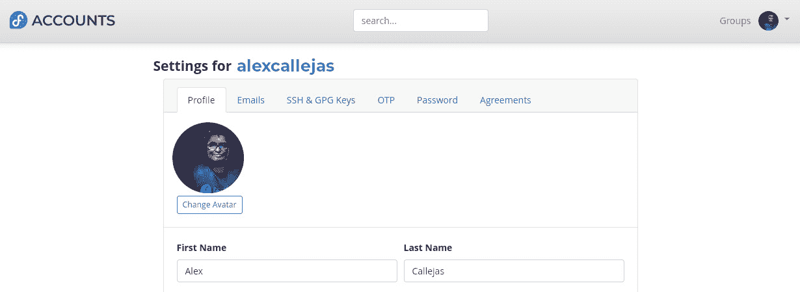

图 1.7 – Fedora 账户 – 配置文件设置

1.  点击 **签署** 按钮来签署协议：


图 1.8 – Fedora 账户 – Fedora 项目贡献者协议

签署协议后，继续进入个人资料配置区并加入一个感兴趣的开发或协作小组。

如有需要，Fedora 提供了一款在线工具 [`whatcanidoforfedora.org/`](https://whatcanidoforfedora.org/)，通过你提问的问题，帮助你找到与兴趣相匹配的小组：


图 1.9 – 我能为 Fedora 做些什么？

注

尽管此页面对于初次接触非常有用，但已被项目文档弃用。欲了解更多信息，请参考 [`docs.fedoraproject.org/en-US/project/join/`](https://docs.fedoraproject.org/en-US/project/join/) 中的兴趣小组 (SIG)。

现在我们知道如何为 Fedora 项目做出贡献，接下来让我们学习如何使用该发行版来管理基于 Linux 的系统。

## Fedora 作为系统管理工具

将 **Fedora Linux** 作为工作或学习中的主要发行版，也支持 Fedora 项目的发展，作为最终用户，你可以通过提供反馈来贡献，分享你对发行版中工具和服务的使用体验，还可以利用这些创新，使自己在日常活动中更加高效和有生产力。

在 IT 行业中，最重要的活动之一是系统管理，主要职责是维护、配置并确保计算机系统的可靠运行，尤其是多用户计算机如服务器。系统管理员需要确保被管理计算机的正常运行时间、性能、资源和安全性满足用户需求，同时确保在这一过程中不超出预定预算。

使用 Linux 工作站管理 Linux 系统提供了许多优势，这些优势可以提高效率和生产力，因为通过宿主操作系统，你可以自动化任务或根据被管理的操作系统执行功能测试。

Fedora 由于在 RHEL 贡献开发中的重要地位，成为了管理类似平台（如其变种（`rpm` 软件包））的一个高效工具。

同时，当使用这种方法进行 Linux 系统管理时，有可能为发行版的开发做出贡献，因为在这里我们会不断测试平台及其内部的各种软件包和项目。

因此，如果你希望使用**Fedora Linux**来管理基于 Linux 的系统，你可以通过报告意外行为或为系统性能的改进做贡献来支持**Fedora 项目**。这包括提出新功能的建议。在报告错误之前，建议查阅**Ask Fedora**网站 [`ask.fedoraproject.org/`](https://ask.fedoraproject.org/)，这是社区支持论坛，以确认该意外行为是否曾经发生过：

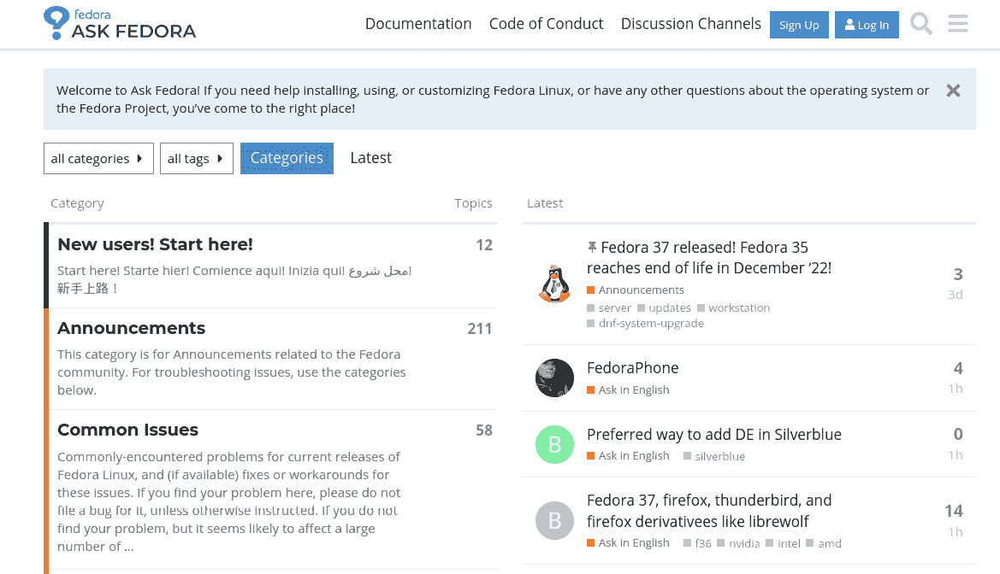

图 1.10 – Ask Fedora

注意

有关如何报告错误的更多信息，请参考 Fedora 文档 [`docs.fedoraproject.org/en-US/quick-docs/howto-file-a-bug/`](https://docs.fedoraproject.org/en-US/quick-docs/howto-file-a-bug/)。

在将发行版自定义为我们的系统管理工作站之前，让我们回顾一下如何使用我们的主要工具。

# 命令行界面

随着图形用户界面的发展，命令行的使用通常被舍弃。然而，命令行仍然是操作系统管理的主要工具，无论是*系统管理员*还是*高级和权力用户*。除了基于 Linux 的系统外，命令行也可以在 Windows 或 Mac 系统上使用。命令行的使用扩展了系统管理和运维的能力。

要达到最大效率所需的流利度，需要在每个机会中进行练习。使用 Linux 作为工作站让我们有机会练习这一技能，从而提高我们在执行日常任务时的生产力和效率。

**Fedora Linux**中默认的命令行解释器（Shell）是**Bourne Again Shell**（**Bash**），可以通过发行版提供的不同终端模拟程序访问：

+   **xterm**：这是 X Window 系统的原始终端模拟程序。

+   **Konsole**：用于**Konsole 桌面环境**（**KDE**）的终端模拟程序。

+   **gnome-terminal**：用于 GNOME 桌面环境的终端模拟程序。

+   **Alacritty**：这是一个轻量级的基于 OpenGL 的终端模拟程序，注重性能。

+   **yakuake**（**guake**）：这是一个下拉式终端模拟程序，可以通过快捷键轻松访问。**guake**是用于 GNOME 桌面环境的版本。

+   **Terminator**：这是基于**gnome-terminal**的终端模拟程序。它在一个窗口中提供多个终端模拟器实例，生成一个占满屏幕区域的终端控制台，并将其分割成一个可调整大小的网格。

现在我们了解了不同的终端模拟程序选项，让我们深入探讨一些有助于我们进入系统管理的主题。

## 基础知识

实践是提升控制台技能的唯一途径，但有一条路径可以帮助你提高。这条路径由四个部分组成，每个部分有三个层级；在练习过程中，以此作为指南，应该能帮助你在控制台上更加流利。

### 1\. 请向懂的人请教

当遇到意外行为或需要某个工具来提高任务效率时，很多人都会犯一个常见的错误——首先在互联网上查找；这个习惯甚至成为了一种常见的说法：*Google it*（谷歌一下）。但开源项目为我们提供了参考资料（即 man 和 info 页面），解释了选项以及大多数情况下的包、命令、进程和服务的使用。信息搜索的流程是我们作为系统管理员需要打破的第一个范式，以提高效率。

#### 基础水平

使用内置的 `help` 命令。如果你不知道或记不住如何使用某个命令，可以使用内置的 `help` 模块。为此，可以添加 `--help` 或 `-h` 参数，或者甚至直接运行该命令而不带任何参数。该命令可能会有这些基本的*help*选项之一。

注意

不是所有命令都有内置帮助选项。在某些情况下，命令可能提供一两个选项。你可以测试命令是否附带此类帮助选项。如果没有，请使用下一级帮助。

让我们看一下它们的每个例子：

+   使用内置**help**模块运行的命令：

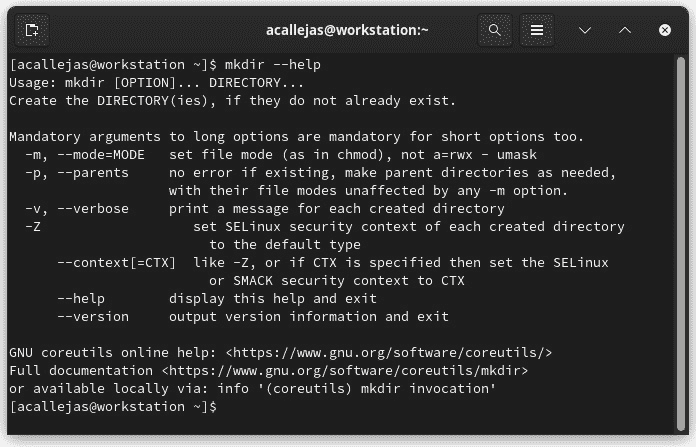

图 1.11 – 内置帮助模块

+   使用 **-h** 参数运行的命令：

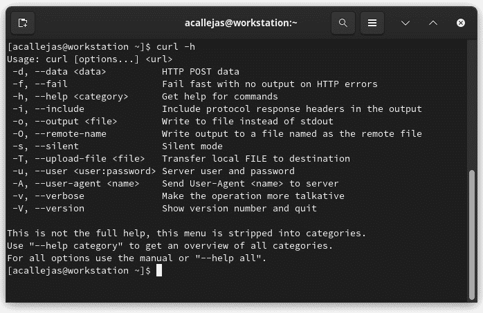

图 1.12 – 带有 -h 参数的命令运行

+   无参数运行的命令：

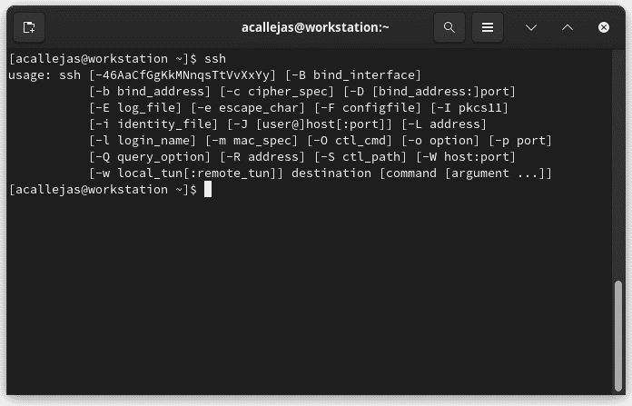

图 1.13 – 无参数运行的命令

这些是大多数命令中包含的基本推荐选项。现在我们来看一种更复杂的帮助方式。不幸的是，有时候它没有作为包的一部分提供，或者需要安装一个单独的包才能获得这种帮助。在每种情况下，都会提到这一点。

#### 中级水平

`man` 是你的*朋友*。除了内置的 `help` 命令，大多数命令都附带用户手册，详细说明了可用的各个选项和参数的使用方法。要查看手册，运行 `man <命令>` 命令：

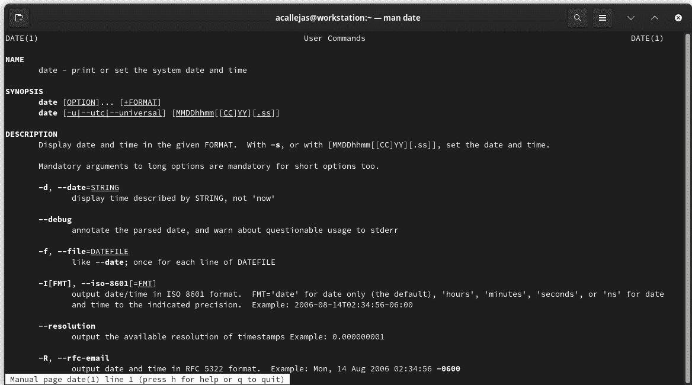

图 1.14 – 命令用户手册

在某些情况下，命令可能会包含 *info 页面*。这些页面可能引用相同的 `man` 页面，或者在某些情况下，提供有关命令使用方法和选项的更详细信息。要查看 `info` 页面，请运行 `info <命令>` 命令。

#### 高级水平

操作系统提供了一个目录，存放软件包和服务的文档——例如，在`/usr/share/doc`目录中。你应该考虑安装内核文档，包括内核附带的驱动程序文档和各种配置选项的参考。`kernel-doc`包包含内核文档，用于安装和运行多个任务作为 root 用户：

```
[root@workstation ~]# dnf -y install kernel-doc
...output omitted…
[root@workstation ~]# ls /usr/share/doc/kernel-doc-6.0.9-300/Documentation/
ABI atomic_t.txt crypto  features  ia64  kernel-hacking memory-barriers.txt
...output omitted...
[root@workstation ~]# cat \
> /usr/share/doc/kernel-doc-6.0.9-300/Documentation/networking/bonding.rst
...output omitted...
Introduction
============
The Linux bonding driver provides a method for aggregating
multiple network interfaces into a single logical "bonded" interface.
The behavior of the bonded interfaces depends upon the mode; generally
speaking, modes provide either hot standby or load balancing services.
Additionally, link integrity monitoring may be performed.
...output omitted...
```

在操作系统提供的选项耗尽后，你可以访问不同的*在线选项*。**社区**在你未找到合适的解决方案时非常有帮助。为此，你可以访问*邮件列表*、*电报频道*和*IRC*站点，如*Reddit*、*Stack Overflow*，或者由**Fedora 项目**本身提供的站点，如**Ask Fedora**。通过这些选项，你可以与社区取得联系，社区将始终提供帮助。

### 2\. 使用控制台

拥有一个基于 Linux 的工作站意味着在任何情况下都可以使用控制台，甚至在闲暇时也是如此。这个想法是利用任何机会使用它来启动应用程序或任务，并尽量减少使用鼠标和图形解决方案。

使用控制台的权限取决于使用它的用户的*权限*。特权账户是具有比普通用户更多权限的用户账户。特权账户可以执行例如安装或卸载软件、更新操作系统或更改系统或应用程序设置等操作。它们可能还可以访问普通用户无法访问的文件。

*命令提示符*提供有关正在使用它的用户权限的信息。

如果在打开控制台时，提示符显示为`$`，这意味着用户作为*非特权*用户登录到该系统。`$`提示符是普通用户的默认提示符：

```
[user@workstation ~]root user’s prompt is #. Logging in as a root user can be done in two ways:

*   By logging in with the **root** user’s username and password
*   By switching to the **root** user

This last point could involve the same username and password of the privileged user. Use the `su –` command to become the `root` user:

```

[user@workstation ~]$ su -

密码：[root 密码]

[root@workstation ~]sudo (*超级用户执行*) 命令，这是一个帮助我们为普通用户提供权限的程序。

大多数 Linux 发行版默认安装`sudo`。在某些情况下，甚至`root`访问权限被关闭。发生这种情况时，我们只能通过`sudo`命令访问。

在安装操作系统时，创建用户时可以选择将他们添加为*系统管理员组*的一部分。这将允许他们通过使用`sudo`命令和他们*自己的*密码切换到`root`用户。

要查看用户是否具有不同的`sudo`权限，请运行以下代码：

```
[user@workstation ~]$ sudo -l
Password: [user password]
Matching Defaults entries for user on workstation:
...output omitted...
User user may run the following commands on workstation:
    (ALL) PASSWD: ALL
...output omitted...
```

`(ALL) PASSWD: ALL`表示用户可以通过使用`sudo`命令和他们的密码访问操作系统的任何命令。要切换到`root`用户，请运行以下代码：

```
[user@workstation ~]$ sudo -i
Password: [user password]
[root@workstation ~]#
```

所以，现在我们知道如何使用控制台，根据我们的活动和权限，让我们学习如何提高我们的控制台技能。

基础级别

*只需使用它*。尽可能多地键入，以列出、搜索和打开应用程序。

中级水平

链接、重定向和连接。输入命令并理解它们的输出结果后，我们可以开始玩弄它们，将它们组合起来，从而简化任务。通过使用管道符号（`|`）以及使用 `>` 和 `<` 进行输出和输入的重定向，我们可以生成一串命令，这就是我们所说的*单行命令*。**Bash 单行命令**在计算机世界中非常著名，能够将命令链式连接起来执行特定任务甚至被视为一种艺术。在互联网上，甚至在社交网络中，我们可以找到许多这样的命令。有些命令使用这种重定向来解释用*AWK 编程语言*编写的模式处理并作为输出。

**示例**：将以下命令的输出发送到一个新文件：

```
[user@workstation ~]$ ip link show > link.txt
[user@workstation ~]$ cat link.txt
1: lo: <LOOPBACK,UP,LOWER_UP> mtu 65536 qdisc noqueue state UNKNOWN mode DEFAULT group default qlen 1000
    link/loopback 00:00:00:00:00:00 brd 00:00:00:00:00:00
2: enp1s0: <BROADCAST,MULTICAST,UP,LOWER_UP> mtu 1500 qdisc fq_codel state UP mode DEFAULT group default qlen 1000
    link/ether 52:54:00:f9:69:14 brd ff:ff:ff:ff:ff:ff
```

**示例**：获取开放并正在监听的 TCP 端口及与之相关的进程，使用逗号分隔：

```
[root@workstation ~]# ss -tulpn | grep tcp | awk '{ print $1","$2","$5","$7 }'
tcp,LISTEN,0.0.0.0:22,users:(("sshd",pid=844,fd=3))
tcp,LISTEN,127.0.0.54:53,users:(("systemd-resolve",pid=707,fd=19))
tcp,LISTEN,0.0.0.0:5355,users:(("systemd-resolve",pid=707,fd=11))
tcp,LISTEN,127.0.0.1:6010,users:(("sshd",pid=1514,fd=9))
tcp,LISTEN,127.0.0.53%lo:53,users:(("systemd-resolve",pid=707,fd=17))
tcp,LISTEN,127.0.0.1:631,users:(("cupsd",pid=842,fd=7))
tcp,LISTEN,[::]:22,users:(("sshd",pid=844,fd=4))
tcp,LISTEN,[::]:5355,users:(("systemd-resolve",pid=707,fd=13))
tcp,LISTEN,[::1]:6010,users:(("sshd",pid=1514,fd=8))
tcp,LISTEN,[::1]:631,users:(("cupsd",pid=842,fd=6))
```

高级水平

*如果你输入两次，你应该只编写一次脚本。*

在系统管理中，任务变得重复是非常常见的。自动化这些任务的第一步，就是将它们汇总并转化为一系列指令，这就是所谓的**shell 脚本**。这个脚本或指令序列可以包含执行复杂任务的命令，例如使用输出作为变量设置并在同一执行中重复使用它们。

有很多关于如何创建 shell 脚本的文档。它们的结构应该类似于以下内容：

```
#!/bin/bash ← [1]
#
# IDENTITY ← [2]
#
# VARIABLES ← [3]
# COMMANDS ← [4]
```

让我们来看一下每个部分中突出显示的文本所表示的含义：

+   **[1]**：*Shebang*。这表示使用这些指令的命令行解释器；脚本的功能测试必须确认其使用。

+   **[2]**：脚本必须包含身份识别信息——它的用途、作者、使用的版本，甚至创建日期和经历的修改。这个文档将帮助你使用它，并识别其范围。

+   **[3]**：在本节中，将设置用于执行指令的变量。

+   **[4]**：在本节中，你将找到将要执行的指令。

3. 编辑文本文件

在 Linux 中，*一切皆文件*。因此，我们必须使用文本编辑器来帮助我们执行配置或管理任务。深入了解首选编辑器有助于提高这项工作的效率，特别是如果某些编辑器具有专门的附加功能或插件，用于处理如识别或验证用不同编程语言或格式编写的文件的语法。

基础水平

GNU Nano 是一个简单、轻量级、开源的命令行文本编辑器，使用 C 语言编写。作为 GNU 项目的一部分开发，它模拟了 Pico 文本编辑器，后者是 Pine 邮件客户端的一部分：

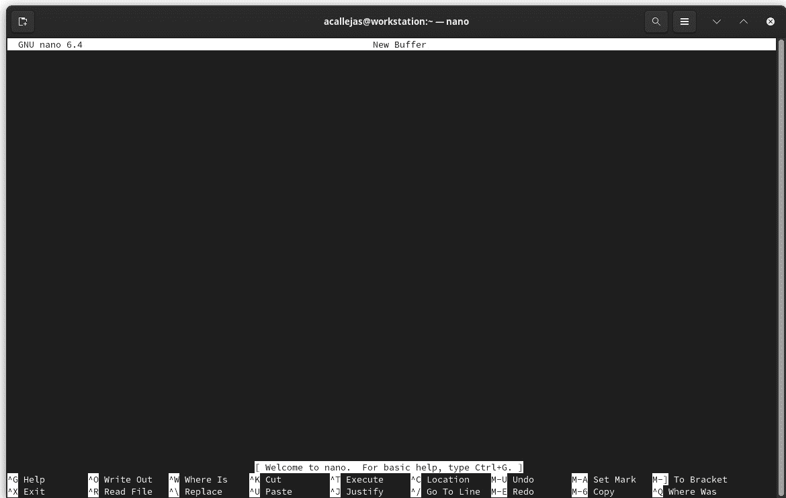

图 1.15 – Nano 编辑器

GNU Nano 没有很多附加功能，但它有一些内置的功能，例如用于突出显示不同编程语言的功能。

中级水平

Vim 是一个开源命令行文本编辑器（以*charityware*许可证授权），用`C`语言编写，并带有一个名为 Vim（或 VimL）的脚本语言。它于 1970 年代作为`ex`行编辑器的*可视模式*（`vi`，其基础）开发。最初的`vi`是一个没有语法高亮、用`C`编写且只有命令行界面的模式化文本编辑器。后来，在 1980 年代，`vim`作为`vi`文本编辑器的克隆版本发布，支持个人计算机，并作为`gVim`移植，增加了语法高亮、脚本语言（用于定制和扩展）以及对更多计算机平台的支持：

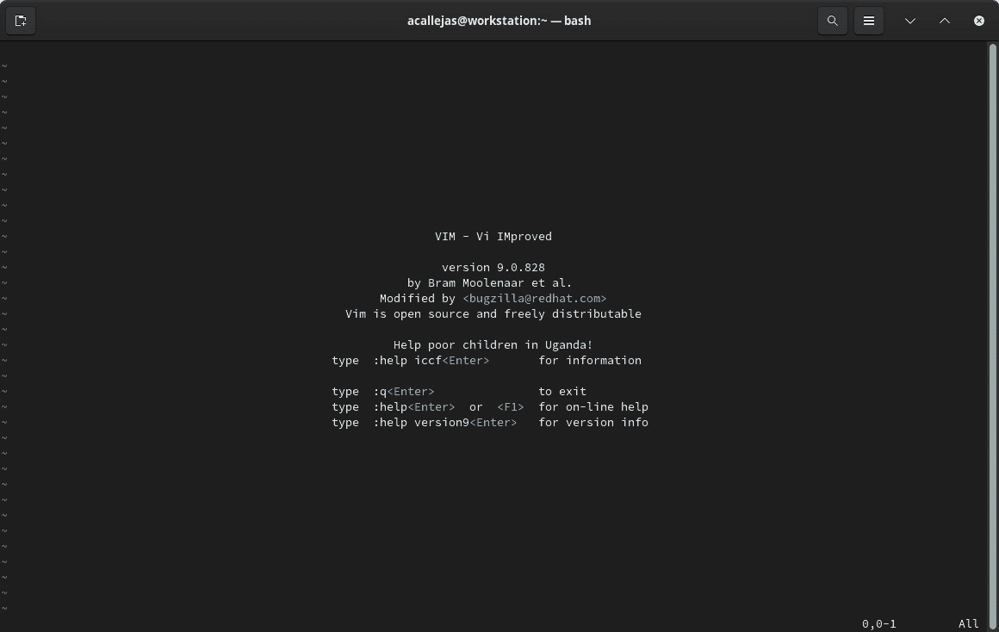

图 1.16 – Vim 编辑器

`vim`有许多附加组件和插件可以增强其使用功能。甚至可以为特定或特殊需求创建特别的插件。

高级层级

GNU Emacs 是一个免费、开源、可扩展、自我文档化的文本编辑器，使用`C`语言和自有的`Lisp`编程语言（`Emacs Lisp`）编写。它由**理查德·斯托尔曼**和**盖·L·斯蒂尔**开发，最初版本发布于 1985 年，现已移植到所有主要操作系统。作为 GNU 项目的一部分开发，Emacs 的使用通过编写`Emacs Lisp`插件得以扩展，这些插件可以在官方 Fedora 仓库中找到。它还通过**AppImage**包（沙箱应用）在 Fedora 上运行：

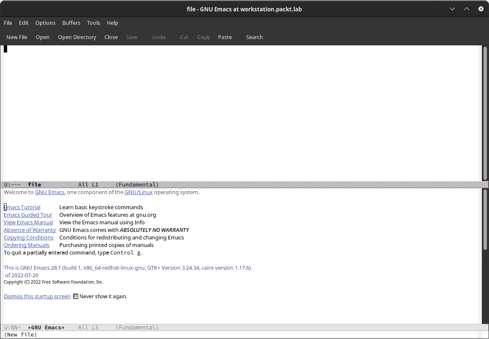

图 1.17 – GNU Emacs 编辑器

4\. 处理正则表达式

bash 命令解释器有多种方法来处理正则表达式，通过扩展命令行的功能来实现。

基础层级

在基础层面，使用模式匹配（通配符）、循环和退出代码是非常重要的。使用**通配符**，处理多个文件变得更加容易。通过使用元字符作为通配符，可以扩展匹配搜索的文件名和路径，命令一次性作用于一组文件。

下表展示了在基本用法中作为通配符使用的字符：

**字符**

|

**描述**

|

`*`

|

匹配任意数量的字符——例如，列出目录中所有`.txt`文件：

```
$ ls *.txt
```

|

`?`

|

匹配任意单个字符——例如，列出以`compar`字符串开头的`.sh`文件：

$ **ls compar*.sh**

```
compare.sh
```

|

`[ ]`

|

匹配方括号中任意一个字符——例如，列出一个目录中的文件，并筛选出以字母开头的文件：

$ **ls &#124;** **grep ^[a-z]**

`ompare.sh`

`onkyrc`

`abkey`

`abkey.pub`

|

`{ }`

|

包含一个以逗号分隔的字符串列表或序列。如果是这样，使用双点语法。一个例子是创建五个空文件并列出它们：

```
$ touch file{1..5}
```

```
$ ls file?
```

```
file1  file2  file3  file4  file5
```

|

`~`

|

匹配当前用户的主目录——例如，列出用户主目录中的`Downloads`目录：

$ **ls ~/Downloads/**

|

`$`

|

将字符串表示为变量——例如，打印用户的`PATH`变量到屏幕上：

```
$ echo $PATH
```

```
/home/user/.local/bin:/home/user/bin::/usr/local/bin:/usr/local/sbin:/usr/bin:/usr/sbin
```

|

循环帮助我们轻松地执行重复任务。在 Bash 中，`for`循环由以下语法构成：

```
for <variable> in <list>
do
command <variable>
done
```

你可以给这些循环添加一个条件，以便根据情况执行不同的操作：

```
if <condition>;
   then
       <statement 1>
       ...
       <statement n>
   else
       <statement alternative>
exit command shown in the following code, with an optional argument between 0 and 255, represents an exit code:

```

[user@workstation ~]$ cat test.sh

#!/bin/bash

echo "Hello, I'm a test"

exit 0

[user@workstation ~]$ ./test.sh

你好，我是一个测试

[user@workstation ~]$ echo $?

0 表示脚本成功运行且没有错误；任何其他值表示错误输出。

中级层次

正则表达式提供了一种*模式匹配*机制，帮助你搜索特定内容。`grep`、`less`和`vim`命令在使用时都支持正则表达式。大多数编程语言也支持正则表达式，尽管每种语言的语法可能有所不同。如前所述，这些命令可以串联并转换为搜索更复杂的结构。

在本节的末尾，你将找到一个引导示例，能够更好地说明这一层次。

高级层次

使用正则表达式和模式优化地编写脚本。

在脚本中处理正则表达式时要小心，因为链式命令使用一定量的内存和 CPU 处理能力，这不应低估。电池和功能测试阶段应该仔细规划，绝对不能在生产服务器上进行；此时，拥有一台 Linux 工作站来管理我们的服务器非常有利。我们可以基于本地虚拟机在实例中重建生产环境，并进行*超级脚本*的首次功能测试。

“*这就是* *方式*。”

“*耐心一点，* *年轻的帕达万*。”

这看起来可能是一个非常费力的过程，但并非如此。很多时候，它取决于实践，结合前面提到的特点，从而培养必要的技能。这不是一天的练习就能完成的——它需要努力和专注，因此你必须一步一步地走下去。

接下来，我们将进行一个引导练习，我将一步一步展示如何从一个简单的命令走向一个有明确目的的链式命令。这将向你展示如何根据需要结合下面显示的工具。

引导示例——释放文件系统中的空间

**描述**：因为一台托管服务器的根文件系统显示磁盘使用率为 92%，所以我们被分配了一个工单。我们需要确定多个责任并提供证据，以便记录问题并解决它，从而关闭工单。

**分析**：由于服务器的文件系统中没有单独的目录，因此需要确定哪些目录使用了最多的磁盘空间，并识别与之相关的应用程序或服务。

**解决方案**：

1.  作为 root 用户，切换到**root**目录（**/**）并列出可用的目录：

    ```
    [root@workstation ~]# cd /
    [root@workstation /]# ls
    afs  bin  boot  dev  etc  home  lib  lib64  lost+found  media  
    mnt  opt  proc  root  run  sbin  srv  sys  tmp  usr  var
    ```

    2. 运行以下命令列出目录。使用**-l**参数运行长列表，仅列出目录：

    ```
    [root@workstation /]# ls -l | grep ^d
    dr-xr-xr-x.   1 root root    0 Aug  9 08:27 afs
    dr-xr-xr-x.   6 root root 4096 Nov 22 13:12 boot
    drwxr-xr-x.  21 root root 4000 Nov 22 13:12 dev
    drwxr-xr-x.   1 root root 5186 Nov 22 13:12 etc
    drwxr-xr-x.   1 root root   18 Nov 21 21:41 home
    drwx------.   1 root root    0 Nov  5 02:18 lost+found
    drwxr-xr-x.   1 root root    0 Aug  9 08:27 media
    drwxr-xr-x.   1 root root    0 Aug  9 08:27 mnt
    drwxr-xr-x.   1 root root    0 Aug  9 08:27 opt
    dr-xr-xr-x. 329 root root    0 Nov 22 13:12 proc
    dr-xr-x---.   1 root root  188 Nov 22 01:45 root
    drwxr-xr-x.  58 root root 1580 Nov 22 13:14 run
    drwxr-xr-x.   1 root root    0 Aug  9 08:27 srv
    dr-xr-xr-x.  13 root root    0 Nov 22 13:12 sys
    drwxrwxrwt.  20 root root  460 Nov 23 00:06 tmp
    drwxr-xr-x.   1 root root  168 Nov  5 02:4.0 usr
    drwxr-xr-x.   1 root root  200 Nov  5 03:15 var
    ```

    3. 使用**awk**选择仅列出目录的名称（第 9 列）：

    ```
    [root@workstation /]# ls -l | grep ^d | awk '{ print $9 }'
    afs
    boot
    dev
    etc
    home
    lost+found
    media
    mnt
    opt
    proc
    root
    run
    srv
    sys
    tmp
    usr
    var
    ```

    4. 使用**xargs**和**du**命令确定每个目录使用的磁盘空间：

    ```
    [root@workstation /]# ls -l | grep ^d | awk '{ print $9 }' | xargs du -sk
    0    afs
    293680    boot
    0    dev
    33212    etc
    176728    home
    0    lost+found
    0    media
    0    mnt
    0    opt
    du: cannot read directory 'proc/3945/task/3945/net': Invalid argument
    du: cannot read directory 'proc/3945/net': Invalid argument
    du: cannot read directory 'proc/3946/task/3946/net': Invalid argument
    du: cannot read directory 'proc/3946/net': Invalid argument
    du: cannot access 'proc/7762/task/7762/fd/3': No such file or directory
    du: cannot access 'proc/7762/task/7762/fdinfo/3': No such file or directory
    du: cannot access 'proc/7762/fd/3': No such file or directory
    du: cannot access 'proc/7762/fdinfo/3': No such file or directory
    0    proc
    32    root
    du: cannot access 'run/user/1000/doc': Permission denied
    1632  run
    0    srv
    0    sys
    8    tmp
    8371056    usr
    6576996    var
    ```

    5. 为避免混淆，将标准错误输出(**stderr**)发送到**/dev/null**：

    ```
    [root@workstation /]# ls -l | grep ^d | awk '{ print $9 }' | \
    > xargs du -sk 2> /dev/null
    0    afs
    293680    boot
    0    dev
    33212    etc
    176728    home
    0    lost+found
    0    media
    0    mnt
    0    opt
    0    proc
    32    root
    1632    run
    0    srv
    0    sys
    8    tmp
    8371056    usr
    6576996    var
    ```

    6. 对结果进行排序：

    ```
    [root@workstation /]# ls -l | grep ^d | awk '{ print $9 }' | \
    > xargs du -sk 2> /dev/null  | sort -n
    0    afs
    0    dev
    0    lost+found
    0    media
    0    mnt
    0    opt
    0    proc
    0    srv
    0    sys
    8    tmp
    32    root
    1632    run
    33212    etc
    176728    home
    293680    boot
    6576996    var
    8371056    usr
    ```

    7. 丢弃磁盘空间使用最少的目录，仅保留*前 5*个：

    ```
    [root@workstation /]# ls -l | grep ^d | awk '{ print $9 }' | \
    > xargs du -sk 2> /dev/null  | sort -n | tail -5
    33212    etc
    176728    home
    293680    boot
    6576996    var
    8371056    usr
    ```

    8. 现在我们已经找到了磁盘使用量最高的*前 5*个目录，我们将仅处理这个顺序，并将其作为证据：

    ```
    [root@workstation /]# ls -l | grep ^d | awk '{ print $9 }' | \
    > xargs du -sk 2> /dev/null  | sort -n | tail -5 \
    > awk '{ print $2 }' | xargs du -sh
    33M        etc
    173M    home
    287M    boot
    6.3G    var
    8.0G    usr
    ```

应对每个*前 5*个目录执行相同的步骤，以便我们可以找到占用最多磁盘空间的子目录，它是导致问题的根源。找出哪个服务负责处理释放问题取决于目录的不同。

既然这些概念已经清晰，我们可以开始考虑如何为系统管理目的安装我们的工作站了。不过，在此之前，我们应该花点时间选择我们想要使用的桌面环境。

桌面环境

Fedora 的默认桌面环境是**GNOME**，但它为我们提供了使用其他桌面环境的选择，无论是轻量级的，还是具有特殊功能的桌面环境，例如那些使用不同图形引擎和专门库或专注于性能的桌面环境。这些替代环境由 Fedora 项目以 *Spin 发行版* 的形式提供。你可以下载基于 Fedora 的预配置桌面环境的 *Spin*：

注

有关 Fedora 的替代桌面环境的更多信息，请参考 *Fedora Spins*：[`spins.fedoraproject.org/`](https://spins.fedoraproject.org/)。

到此为止，我们已经结束了 *第一章*。让我们快速回顾一下我们学到的内容。

总结

在本章中，我们简要回顾了 Unix 操作系统的历史，这帮助我们了解了 Linux 及其发行版的起源与发展。除了让我们了解负责开发我们将用作系统管理工作站的发行版的项目如何运作外，它还帮助我们学习如何在日常工作中参与其中，并改进发行版。

在下一章中，我们将学习一些最佳实践和技巧，这些将帮助确保我们有一个良好的安装环境，从而帮助我们开展工作。

进一步阅读

若要了解本章涉及的更多内容，请访问以下链接：

+   *GNU/Linux 和* *Unix 时间线*: [`laurel.datsi.fi.upm.es/~ssoo/IG/download/timeline.html`](http://laurel.datsi.fi.upm.es/~ssoo/IG/download/timeline.html)

+   *GNU 系统概述，GNU 操作* *系统*: [`www.gnu.org/gnu/gnu-history.html`](https://www.gnu.org/gnu/gnu-history.html)

+   *Linux 和 GNU – GNU 项目 – 自由软件* *基金会*: [`www.gnu.org/gnu/linux-and-gnu.html`](https://www.gnu.org/gnu/linux-and-gnu.html)

+   *Red Hat 品牌标准 – 我们的* *历史*：[`www.redhat.com/en/about/brand/standards/history`](https://www.redhat.com/en/about/brand/standards/history)

+   *Fedora Linux 简短历史（视频），* *YouTube*：[`www.youtube.com/watch?v=NlNlcLD2zRM`](https://www.youtube.com/watch?v=NlNlcLD2zRM)

+   *CentOS Stream：通往 Red Hat Enterprise* *Linux* 的贡献路径：[`www.redhat.com/en/resources/centos-stream-datasheet`](https://www.redhat.com/en/resources/centos-stream-datasheet)

```

```

```

```
