# 安装最佳实践

现在我们已经对 Linux 发行版的历史和发展有了非常完整的了解，接下来我们来看一下安装**操作系统**（**OS**）的建议和最佳实践，安装到将作为我们工作站的计算机上。在这种情况下，最理想的是选择一台具备良好内存和 CPU 资源的便携式计算机，因为如果我们能在其上虚拟化，它将对我们进行功能测试有很大帮助。

本章将覆盖的主题如下：

+   创建启动介质

+   本地存储分区

+   第一次启动

+   包管理

开始吧！

# 技术要求

根据**Fedora 文档**（[`getfedora.org/en/workstation/download/`](https://getfedora.org/en/workstation/download/)），创建 Fedora Linux 启动介质需要一个 2 GB 的 USB 闪存驱动器。安装 Fedora Linux 至少需要 20 GB 的本地存储和 2 GB 的 RAM；推荐的配置是将两者的容量加倍。

访问[`getfedora.org`](https://getfedora.org)获取要安装的**Fedora 版本**镜像。Fedora 镜像是混合 ISO 格式，因此你可以在安装之前以*实时模式*测试它们。

在本章中，我们将介绍安装工作站的最佳实践，从性能和灵活性的角度，帮助我们管理 Linux 系统的应用程序。

为了创建启动介质，我们将使用 Fedora Linux。不过，创建启动介质的操作可以在任何 Linux 发行版上进行，最好是*基于 rpm 的*，也可以在 Windows 或 Mac 系统上进行。

在我们的安装中，我们将选择**Fedora Workstation**镜像作为最佳版本，因为它是一个经过精细打磨且易于在笔记本电脑和台式机上使用的操作系统，拥有适用于开发人员和各类用户的完整工具集。下载相应的镜像后，我们将创建启动介质，创建方法有多种。

# 创建启动介质

有多种方法可以创建启动介质，从 `dd` 命令到 `syslinux` 启动加载程序到设备的应用程序。此过程基于 Fedora Linux 构建一个启动加载程序，但它与镜像中的启动加载程序不同，因此启动介质的构建与镜像不一致，可能会导致启动错误。

`dnf` 或 `yum` 命令作为 `root` 用户：

```
[root@host ~]# dnf install mediawriter
```

注意

你可以在[`github.com/FedoraQt/MediaWriter`](https://github.com/FedoraQt/MediaWriter)下载 Fedora 媒体写入工具的其他平台版本。

让我们看看创建启动介质的过程是如何进行的。

## Fedora 媒体写入工具

该方法会擦除 USB 闪存驱动器上现有的数据，所以如果需要，务必先备份数据。

注意

获取有关替代启动介质创建方法的更多信息，请访问**Fedora Docs**的*创建和使用实时安装镜像*，网址：[`docs.fedoraproject.org/en-US/quick-docs/creating-and-using-a-live-installation-image/#proc_creating-and-using-live-usb`](https://docs.fedoraproject.org/en-US/quick-docs/creating-and-using-a-live-installation-image/#proc_creating-and-using-live-usb)。

按照以下步骤使用 Fedora Media Writer 创建启动介质：

1.  从**应用程序**菜单中选择**Fedora Media Writer**。如果尚未下载镜像，该工具会提供下载选项：

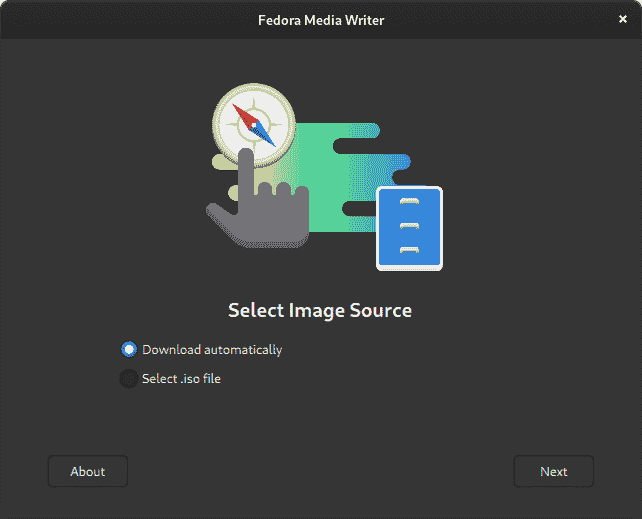

图 2.1 – Fedora Media Writer

1.  点击**下一步**按钮，选择要安装的版本：

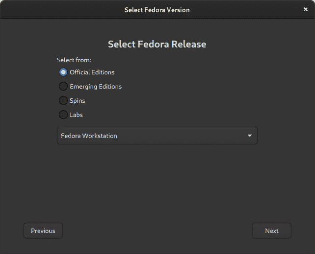

图 2.2 – Fedora Media Writer – 选择 Fedora 发布版

如果选择下载镜像，请启用**官方版本**单选按钮，并从下拉菜单中选择**Fedora Workstation**。

1.  点击**下一步**按钮，在下一个屏幕上，选择写入发布版/版本、硬件架构和要安装的设备。你可以选择在写入设备后删除已下载的镜像：

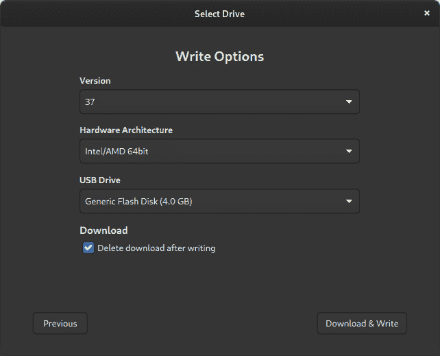

图 2.3 – Fedora Media Writer – 写入选项

1.  点击**下载并写入**按钮，等待其下载镜像并写入设备。

当镜像下载完成后，开始将镜像写入设备：

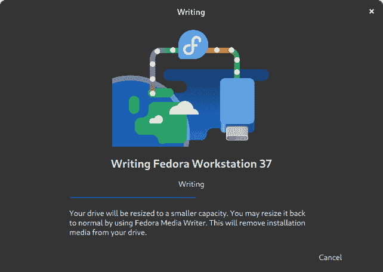

图 2.4 – Fedora Media Writer – 写入镜像

镜像写入完成后，开始检查已写入设备的数据：

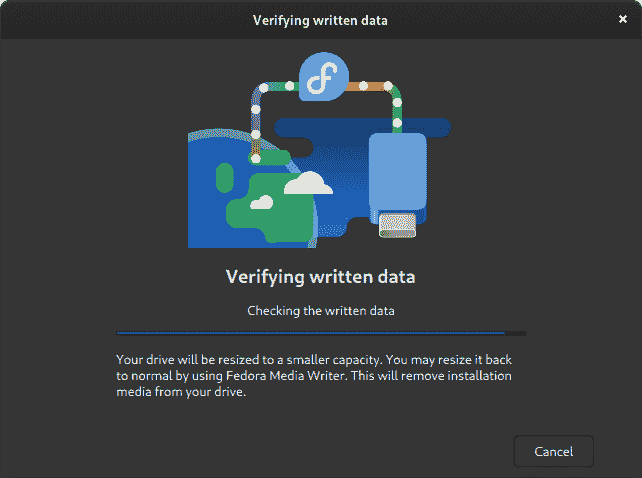

图 2.5 – Fedora Media Writer – 验证已写入的数据

1.  当数据验证完成后，点击**完成**按钮，移除启动介质设备。

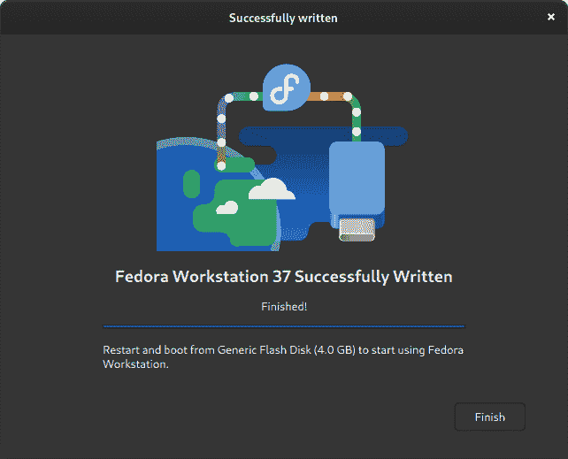

图 2.6 – Fedora Media Writer – 写入完成

将镜像写入启动介质后，现在是时候在计算机上安装并开始安装过程。

## 启动

如前所述，Fedora Linux 镜像是混合型的，这意味着操作系统可以从启动介质启动，进行功能测试，然后从那里执行完整的发行版安装。为此，请按照以下步骤进行：

1.  重启计算机并插入创建的启动介质，开始安装 Fedora Linux 镜像。启动屏幕会显示：

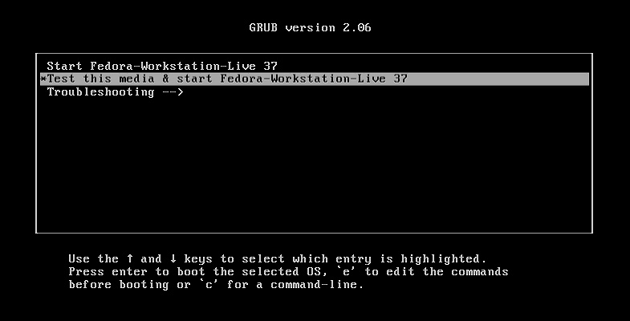

图 2.7 – 启动介质屏幕

1.  选择**测试此介质并启动 Fedora-Workstation-Live 37**选项；这对于确定在安装工作站时启动介质是否存在一致性问题非常重要。

1.  测试结束时，桌面会显示**欢迎使用 Fedora**屏幕，我们可以选择测试*Fedora Live*发行版或将其安装到硬盘设备上：

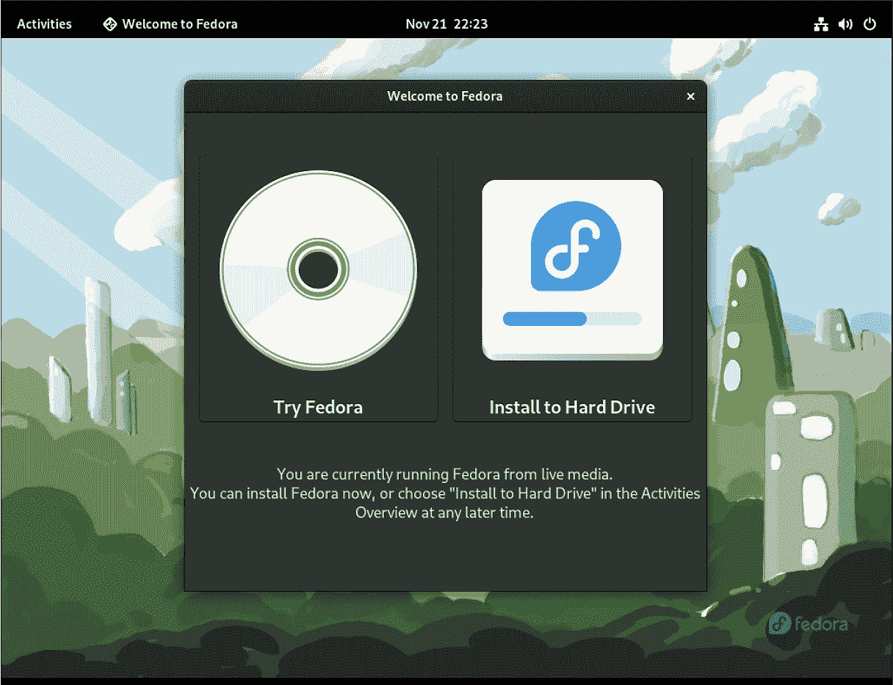

图 2.8 – Fedora Live – 欢迎屏幕

1.  选择**安装到硬盘**选项。在下一个屏幕上，根据你的偏好选择安装时使用的*语言*：

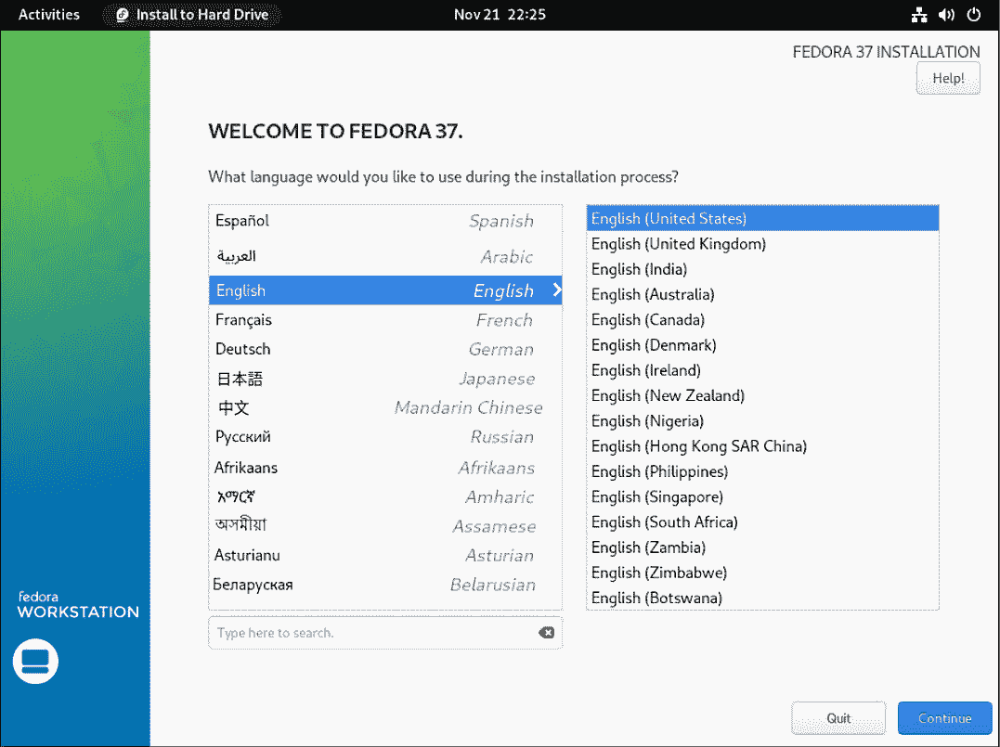

图 2.9 – Fedora 安装 – 选择语言

点击**继续**按钮。

1.  **安装摘要**屏幕出现。选择键盘映射，设置日期和时间以及当前位置。

点击**安装目标**按钮，选择系统应安装的设备：

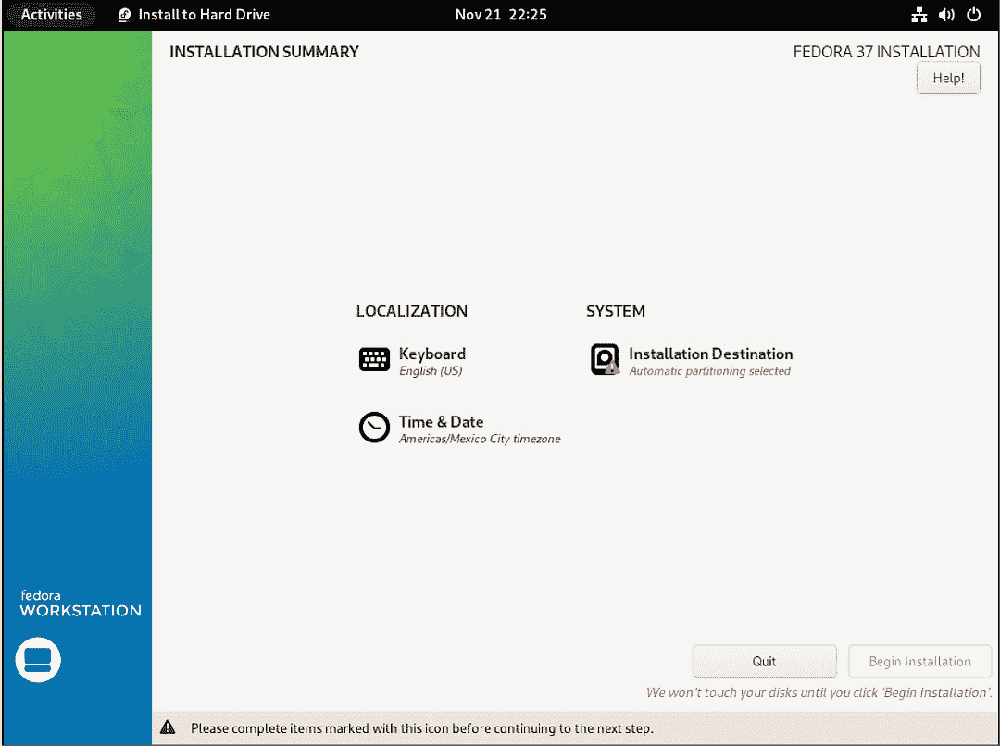

图 2.10 – Fedora 安装摘要

1.  将**存储配置**选项设置为**自定义**：

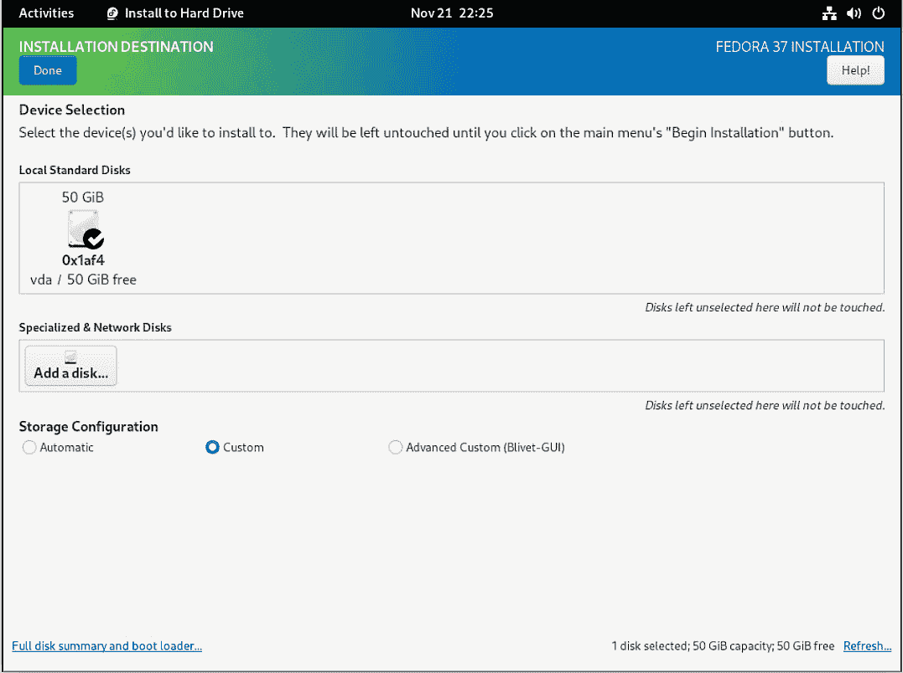

图 2.11 – Fedora 安装目标

1.  完成后点击**完成**按钮。

分区是存储管理的基本最佳实践之一。它意味着将本地存储分为多个小单元，按需划分，以便分开存储在每个部分的数据，除了能更好地组织数据外，还能避免整个操作系统崩溃的可能性。在没有分区的极端情况下，存储可能没有足够的空闲空间来继续操作。

由于最好在操作系统安装时进行此组织步骤，让我们利用这个步骤进行深入分析。开始吧。

# 本地存储分区

安装向导包括一个快捷方式，用于创建标准的分区。这在像安装工作站这样的情况下非常有用，但在其他特定用途的服务器情况下则不适用。我们将在后续章节讨论这些情况，并扩展一些基本的存储管理概念。

我们从向导提供的标准分区开始，并添加一些额外的挂载点，这将有助于我们的系统管理任务。

按照以下步骤对本地存储进行分区：

1.  **手动分区**屏幕允许你选择格式方案，保持为**Btrfs**，并通过点击**点击这里自动创建它们**链接来创建基本挂载点。

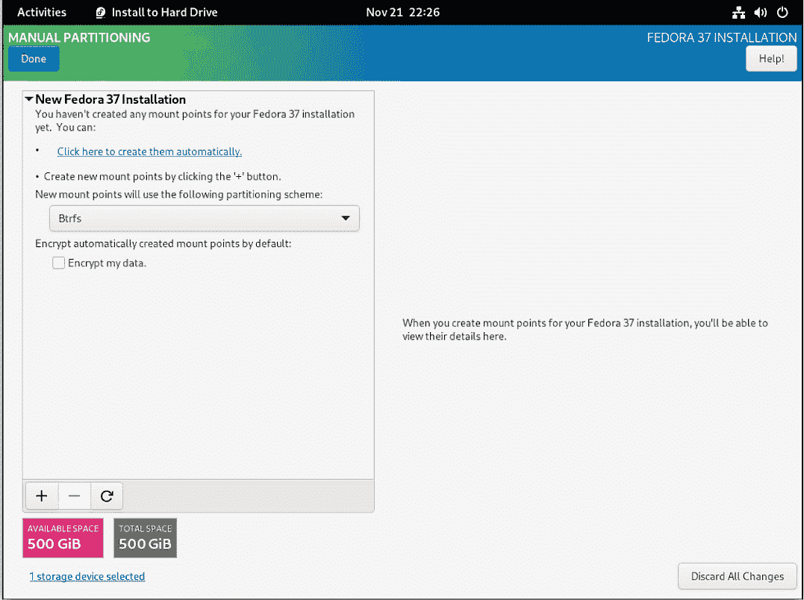

图 2.12 – Fedora 手动分区

应该创建一个挂载点基础，文件系统包括`/home`和`/`目录，以及`/boot`目录和`BIOS boot`，并将它们挂载到硬盘设备的前两个物理分区上。

1.  点击加号[**+**]按钮，以添加另一个挂载在**/var/lib/libvirt/images**目录上的文件系统；该目录将成为后续章节中将配置的客人**虚拟机**（**VMs**）的位置。

1.  更改分配的磁盘空间，使**/home**和**/**目录大约为 50 GiB。剩余的硬盘空间应分配给**/var/lib/libvirt/images**目录。

例如，对于一个 500 GiB 的硬盘设备，分配 100 GiB 给`/home`和`/`目录后，剩余的 400 GiB 存储空间被分配给`/var/lib/libvirt/images`目录。

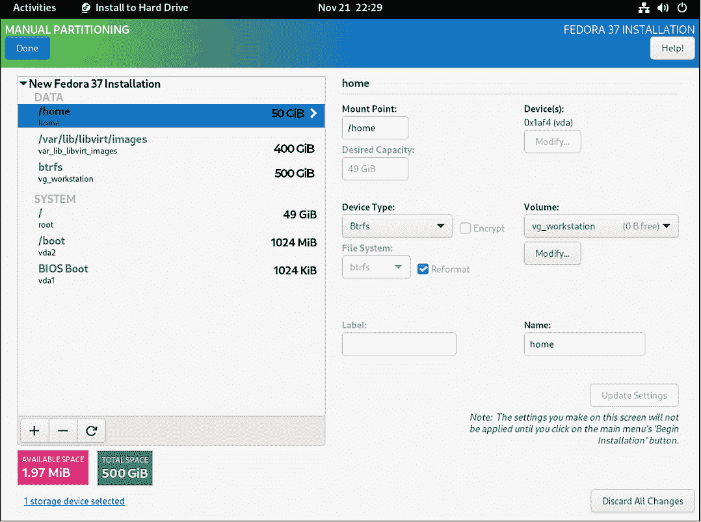

图 2.13 – Fedora 手动分区

点击**完成**按钮。

1.  **安装总结**屏幕显示没有遗漏的配置项，并启用**开始安装**按钮：

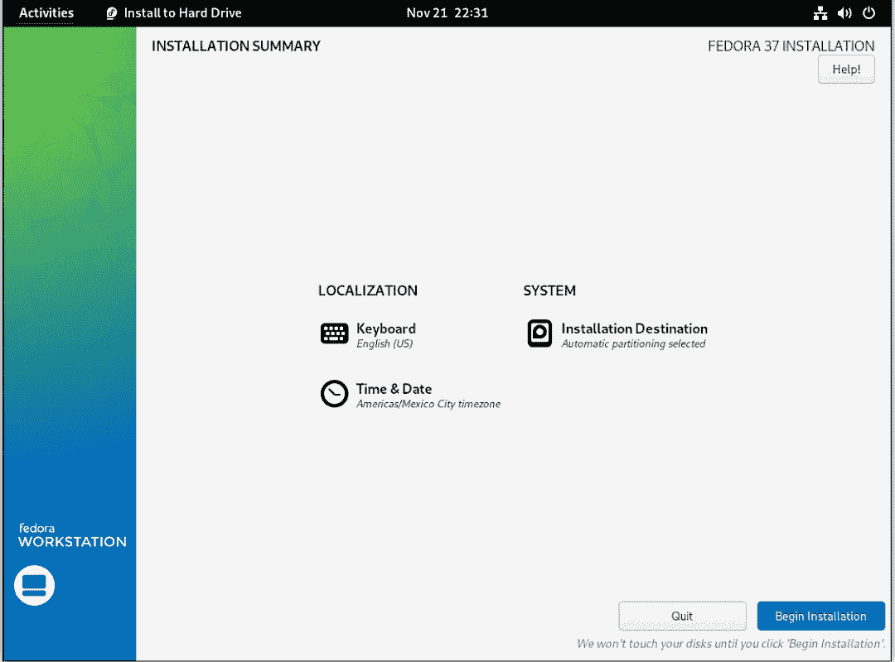

图 2.14 – Fedora 安装总结

点击**开始安装**按钮，等待安装完成。

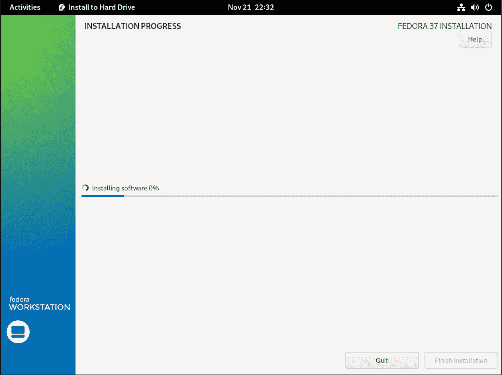

图 2.15 – Fedora 安装进度

1.  点击**完成安装**按钮。

1.  重启实时媒体并移除可启动媒体设备。

现在我们已经在计算机上安装了操作系统，让我们在第一次启动时完成配置。

# 第一次启动

操作系统已安装到计算机上，但访问的用户配置仍然缺失，以及一些首次启动时可能进行的个性化设置。让我们添加一些个性化配置，完成该发行版的安装。

按照以下步骤完成配置：

1.  重启系统时，**设置**屏幕会显示：

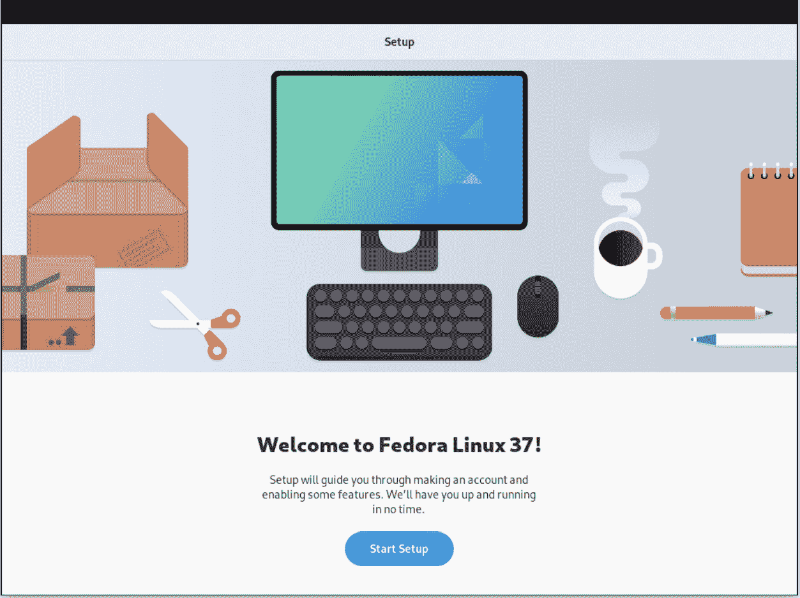

图 2.16 – Fedora 欢迎界面

点击**开始设置**按钮。

1.  在**隐私**设置屏幕上，如果您同意，请激活**位置服务**和**自动问题报告**开关。

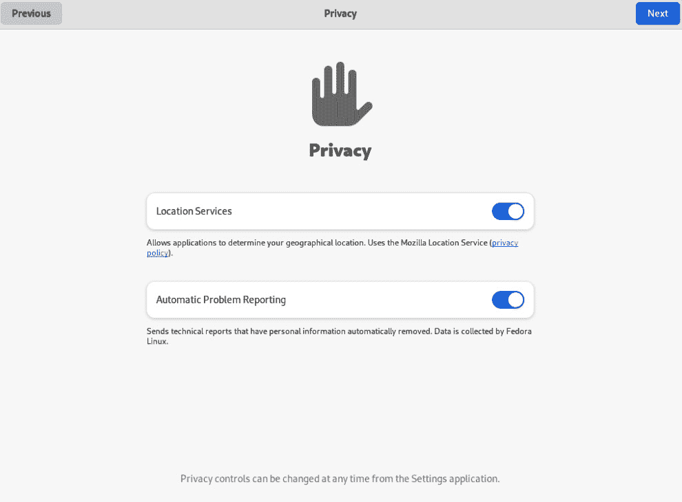

图 2.17 – Fedora 欢迎界面 – 隐私

启用**位置服务**允许一些应用程序，如*地图*或*天气*，根据您当前的位置提供本地信息。在考虑激活开关之前，请阅读隐私政策。

启用**自动问题报告**会将故障的技术报告发送给**Fedora 项目**。在发送之前，个人信息会被删除。操作系统会收集这些信息。

点击**下一步**按钮。

1.  在下一个屏幕上，通过点击**启用第三方** **软件库**按钮来启用第三方软件库。

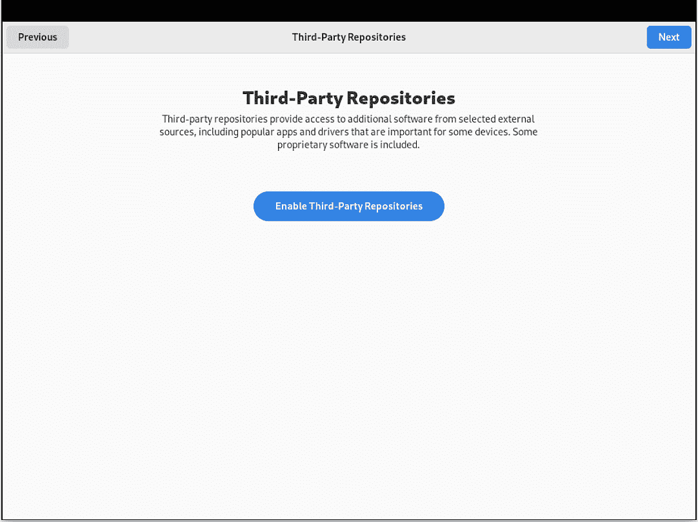

图 2.18 – Fedora 欢迎界面 – 第三方软件库

第三方仓库提供了从选定外部来源访问额外软件的途径，如流行的应用程序或某些驱动程序，包括专有软件。

点击**下一步**按钮。

1.  下一个屏幕让你通过选择服务并登录账户，连接你的**Google**、**Nextcloud** 或 **Microsoft** 在线服务账户。

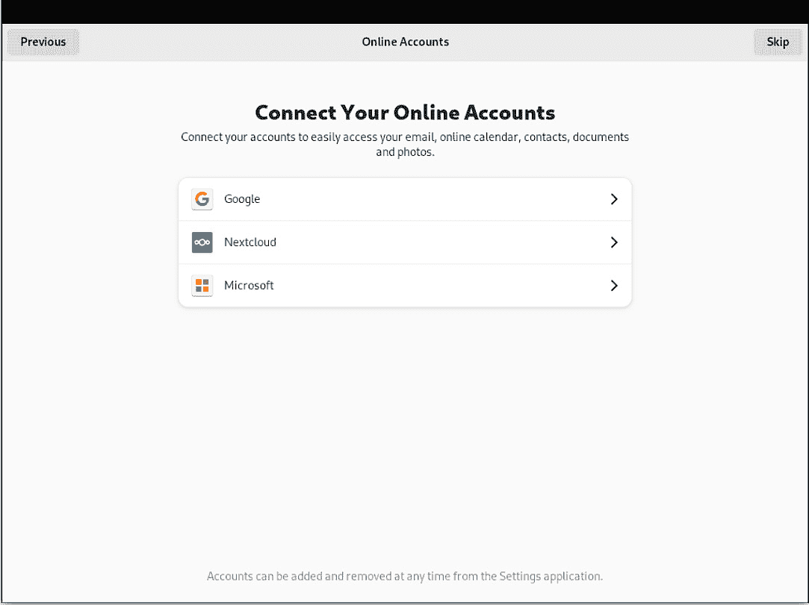

图 2.19 – Fedora 欢迎 – 在线账户

提示

这一步是可选的，不会干扰操作系统的活动。

要跳过此步骤，请点击**跳过**按钮。

1.  在下一个屏幕上创建你的登录账户：

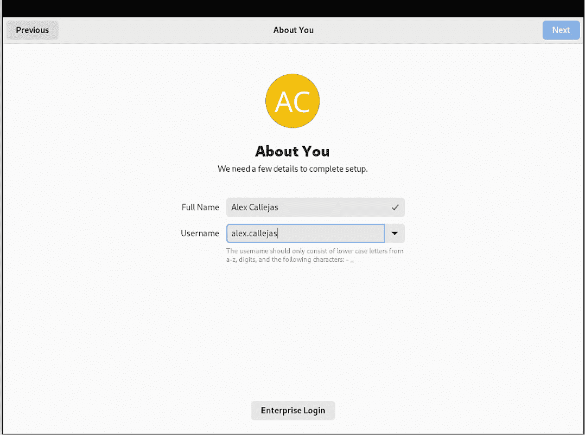

图 2.20 – Fedora 欢迎 – 关于你

完成后，点击**下一步**按钮。

1.  然后，为你的登录账户创建一个强密码；系统会指示*最低可接受的* *密码强度*。

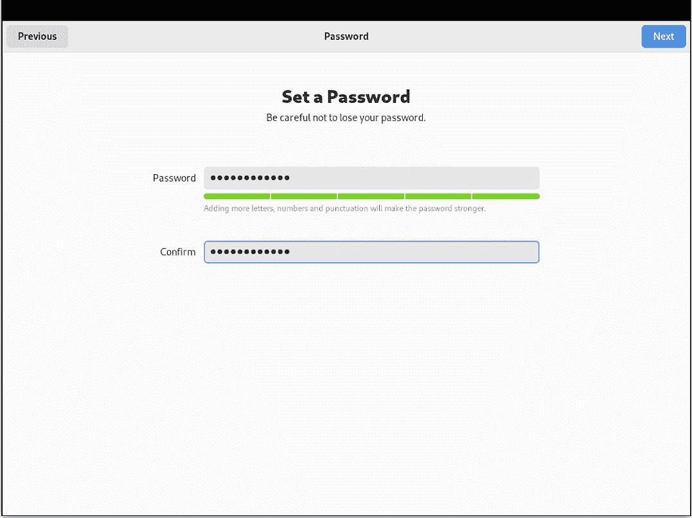

图 2.21 – Fedora 欢迎 – 密码

1.  完成后，点击**下一步**按钮。设置现已完成。

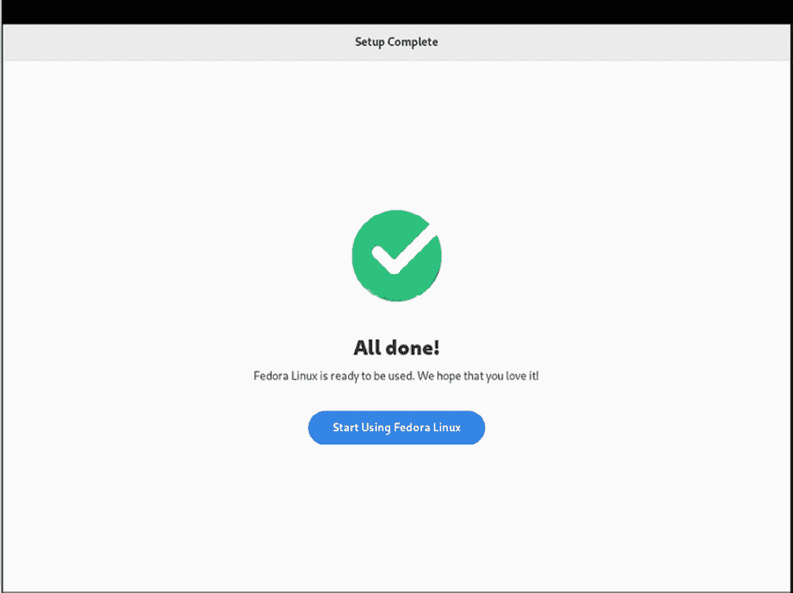

图 2.22 – Fedora 欢迎 – 设置完成

1.  点击**开始使用 Fedora Linux**按钮，工作区桌面将显示。

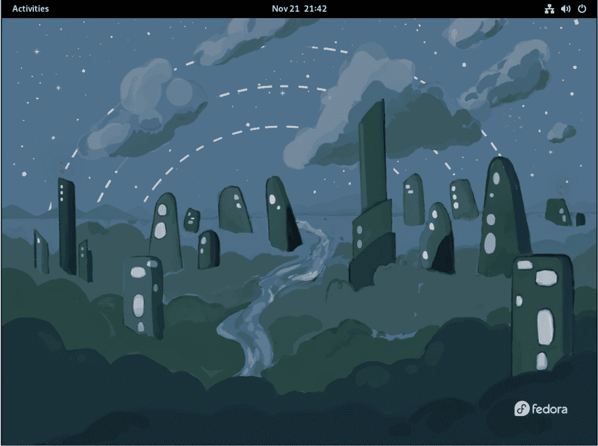

图 2.23 – Fedora Linux 37 Workstation GNOME 桌面

在控制台工作时间较长时，保护视力至关重要，尽量避免造成永久性损伤。GNOME 提供的选项之一是配置*暗黑模式*，它有助于避免这些视觉问题。

点击右上角的按钮，然后点击**暗黑模式**按钮以选择暗黑模式。

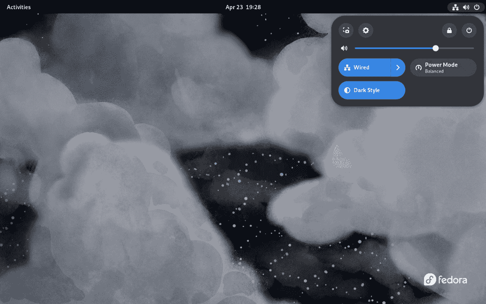

图 2.24 – Fedora 桌面 – 暗黑模式

重要提示

**给你的眼睛休息一下**。如果你长时间使用电脑或专注于某件事，有时会忘记眨眼，眼睛可能会感到疲劳。尝试使用 20-20-20 规则——每 20 分钟，看向前方约 20 英尺的地方，保持 20 秒。这一简单的练习有助于减轻眼睛疲劳。

如需更多关于如何预防视力丧失的建议，请参考**视力健康倡议**（**VHI**），访问 [`www.cdc.gov/visionhealth/risk/tips.htm/`](https://www.cdc.gov/visionhealth/risk/tips.htm/)。

安装和基本配置完成后，我们可以开始安装那些将帮助我们完成日常任务的实用工具。

为此，必须确保我们的电脑连接到互联网。与存储类似，在后续章节中，我们将回顾网络配置的基本概念，以优化其运行。此时，仅需知道系统网络可用，无论是有线或无线形式，都能下载和安装操作系统的包和更新。

现在，让我们学习如何更新操作系统并下载提供所需工具的额外软件包。

# 包管理

Fedora Linux 实时安装介质构建基于 `kickstart`（文本）文件，具体内容取决于镜像的版本，所包含的软件包也会有所不同。

Fedora 工作站版本包括以下软件包组：

+   常见网络管理器子模块

+   容器管理

+   核心

+   Fedora 工作站产品核心

+   Firefox 浏览器

+   字体

+   GNOME

+   客户端桌面代理

+   硬件支持

+   LibreOffice

+   多媒体

+   打印支持

+   base-x

注意

有关**Fedora 编译版**的更多信息，请参考**fedora-kickstarts**，网址为 [`pagure.io/fedora-kickstarts/`](https://pagure.io/fedora-kickstarts/)。

要查看已安装的软件包，请执行以下步骤：

1.  打开**活动**概览窗口，并从底部图标栏选择**软件**：

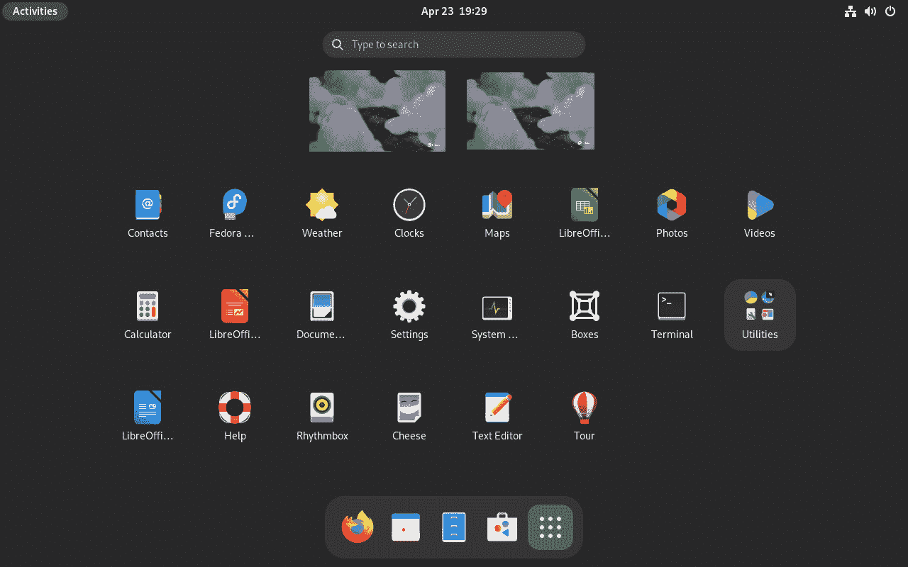

图 2.25 – 活动概览

1.  点击**已安装**标签：

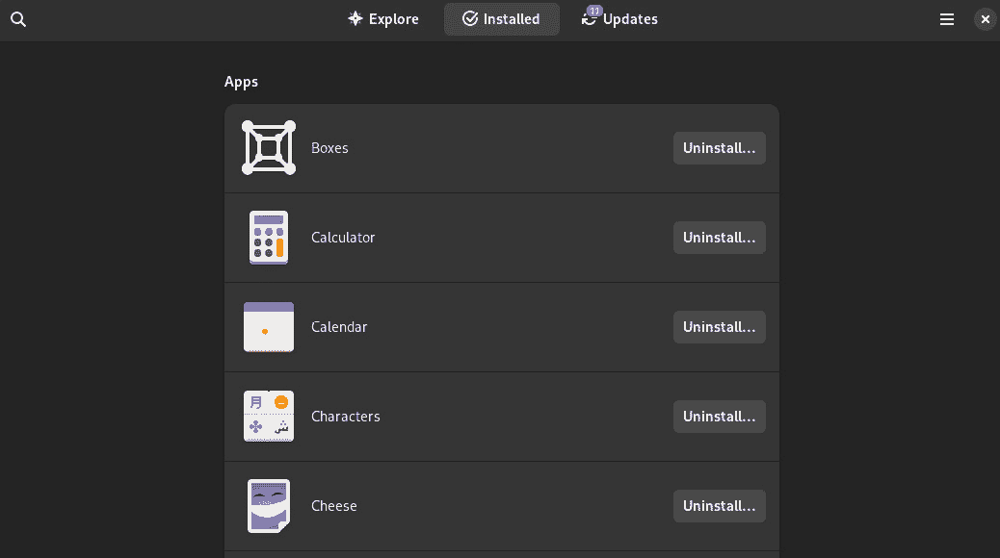

图 2.26 – 已安装软件

注意

获取发行版中包含的详细软件包列表，请访问我们的 *GitHub 仓库*，链接为 [`github.com/PacktPublishing/Fedora-Linux-System-Administration/blob/main/chapter2/fedora-37-packages.txt`](https://github.com/PacktPublishing/Fedora-Linux-System-Administration/blob/main/chapter2/fedora-37-packages.txt)。

1.  **更新**标签表明有软件包需要更新。点击**更新**标签：

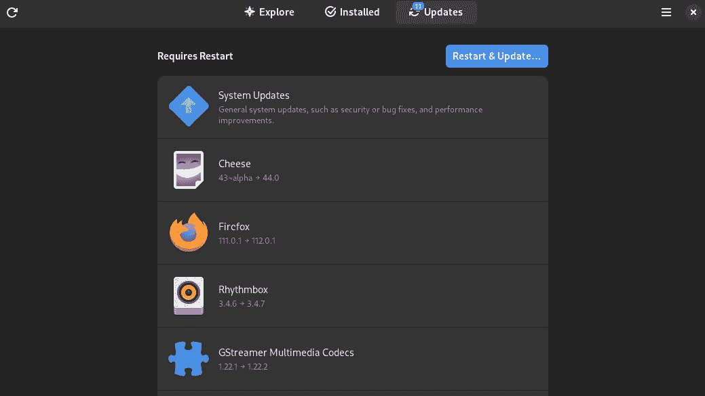

图 2.27 – 软件更新

重要

*由于这是第一次启动，更新所有* *操作系统软件包* 非常重要。

有关软件包更新内容的详细信息，请参阅 *Fedora 更新系统*，网址为 [`bodhi.fedoraproject.org/releases/F38`](https://bodhi.fedoraproject.org/releases/F38)。

1.  点击**重启 & 更新**按钮。

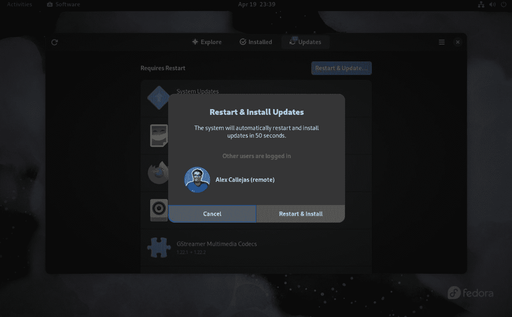

图 2.28 – 重启 & 安装更新

1.  点击**重启 & 安装**按钮。

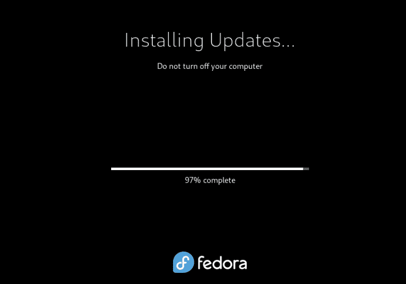

图 2.29 – 安装更新中…

等待安装更新，当计算机重启后，登录并验证在**软件** | **更新**中，确认更新已是最新版本。

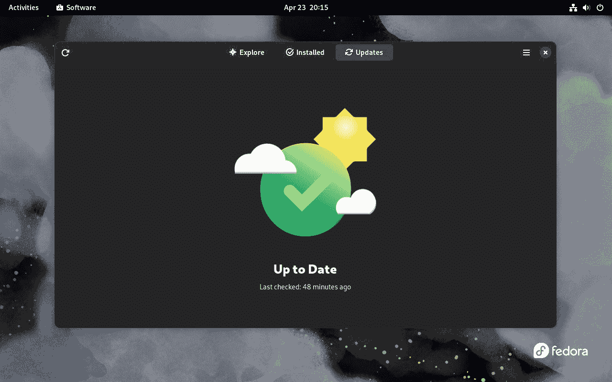

图 2.30 – 软件更新

关闭此窗口以继续安装额外的软件包。

# 额外的软件包选择

Fedora Linux 在其软件仓库中包含了许多可以简化系统管理日常任务的工具，但其中一些工具并未包含在系统安装中，因此需要单独安装。要在 Fedora Linux 上安装软件包，可以使用基于 *rpm 包* 的包管理器（在终端使用 `dnf` 命令）。

注意

有关**在 Fedora Linux 中安装软件包**的更多信息，请参阅*软件包管理系统*：[`docs.fedoraproject.org/en-US/quick-docs/package-management/`](https://docs.fedoraproject.org/en-US/quick-docs/package-management/)。

以下是一些推荐的工具：

+   **开发**：

    +   **gcc**：一个 GNU 项目的**C**和**C++**编译器

    +   **git**：一个分布式版本控制系统

    +   **make**：一个 GNU Make 实用工具，用于维护程序组

+   **笔记本电池电量**：

    +   **tlp**：一款应用节能设置和控制电池护理功能的工具

+   **网络扫描器**：

    +   **nmap**：一款网络探索工具和安全/端口扫描工具

+   **终端模拟器**：

    +   **terminator**：在一个窗口中存储和运行多个 GNOME 终端

+   **虚拟化**：

    +   **genisoimage**：一个生成 ISO 9660/Joliet/HFS 混合文件系统的程序

    +   **libguestfs**：一个用于访问和修改虚拟机磁盘映像的工具

    +   **qemu-kvm**：一个 QEMU PC 系统模拟器

    +   **virt-install**：一个使用**libvirt**虚拟化管理库创建新的**KVM**、**Xen**或*Linux 容器客户机*的工具

    +   **virt-manager**：一个用于管理**libvirt**虚拟机的图形化工具

    +   **virt-viewer**：一个显示虚拟机图形控制台的工具

打开 GNOME 终端以安装额外的软件包。然后，打开**活动概览**窗口，选择**终端**：

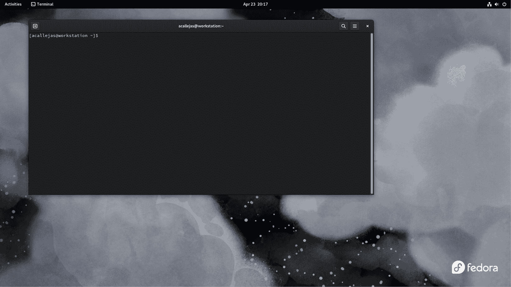

图 2.31 – GNOME 终端

使用`sudo`命令切换到`root`用户并清除所有仓库元数据：

```
[user@workstation ~]$ sudo -i
[sudo] password for user: [password]
[root@workstation ~]# dnf clean all
68 files removed
```

注意

清除元数据以强制包管理器刷新它是可选的。我一直认为这是一个良好的实践。

使用`dnf`命令安装额外的软件包：

```
[root@workstation ~]# dnf install gcc make libgcc git \
> qemu-kvm virt-manager virt-viewer libguestfs \
> virt-install genisoimage terminator nmap tlp
```

在后续章节中，我们将安装更多工具，以完成一些特定任务。

一旦系统升级并安装了额外的软件包，每个人都可以享受使用这些工具的体验。然而，你可能会发现某些工具或软件包可以通过增加一些功能或特性来得到增强。你可以将你的提议提交给 Fedora 项目，进行功能增强评估。

我们的工作站安装和基本配置已经完成，接下来让我们总结一下我们学到的内容。

# 总结

在本章中，我们回顾了安装 Fedora 到计算机上的最佳实践和技巧，包括基本的内存分区设置，以及我们工作站的初步配置步骤。

在下一章中，我们将学习如何通过合适的工具定制我们的工作站，以执行 Linux 系统管理。

# 进一步阅读

要了解本章涵盖的主题，可以参考以下资源：

+   *Fedora*: https://getfedora.org

+   *准备启动* *介质*：[`docs.fedoraproject.org/en-US/fedora/f35/install-guide/install/Preparing_for_Installation/#sect-preparing-boot-media`](https://docs.fedoraproject.org/en-US/fedora/f35/install-guide/install/Preparing_for_Installation/#sect-preparing-boot-media)

+   *Fedora 媒体* *写入工具*: [`github.com/FedoraQt/MediaWriter/`](https://github.com/FedoraQt/MediaWriter/)

+   *Fedora 37 –* *DistroWatch*: [`distrowatch.com/?newsid=11673`](https://distrowatch.com/?newsid=11673)

+   *fedora-kickstarts*: [`pagure.io/fedora-kickstarts`](https://pagure.io/fedora-kickstarts)

+   *fedora 构建* *系统*: [`koji.fedoraproject.org/koji/`](https://koji.fedoraproject.org/koji/)

+   *Fedora 更新* *系统*: [`bodhi.fedoraproject.org/`](https://bodhi.fedoraproject.org/)

+   *Fedora Workstation 工作* *小组*: [`pagure.io/fedora-workstation`](https://pagure.io/fedora-workstation)

+   *Fedora Pagure –* *问题*: [`pagure.io/fedora-workstation/issues`](https://pagure.io/fedora-workstation/issues)
