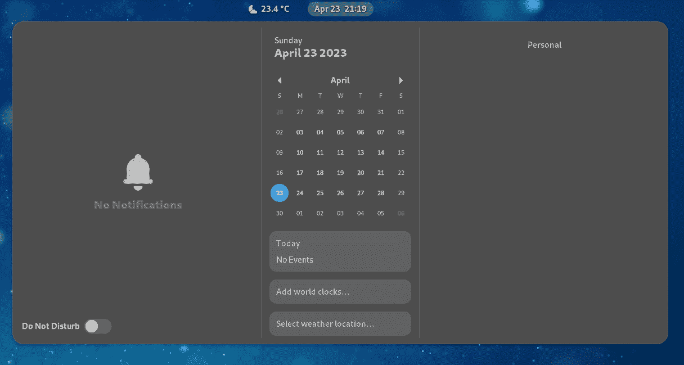
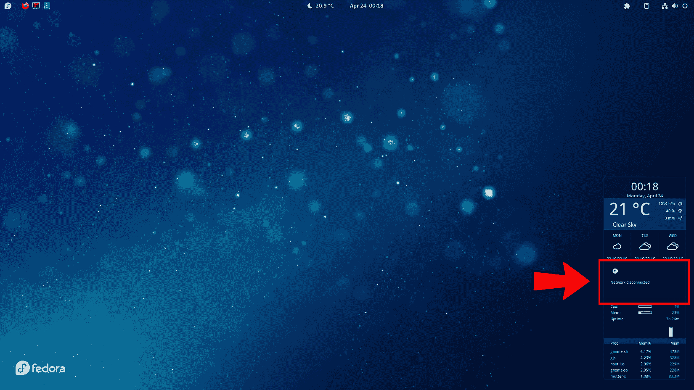

# 3

# 调优桌面环境

在我们的计算机上安装操作系统并完成必要的配置后，我们可以继续定制工作站，以优化流程。但此时，作为桌面环境的用户，感受到舒适的使用体验非常重要。在本章中，我们将逐步探讨如何定制桌面环境；你可以根据个人喜好省略或添加任何组件。我们将使用的桌面环境是**GNOME**，但大部分定制操作（除了 GNOME 插件）在任何桌面环境中都可以完成。

本章涵盖的定制组件如下：

+   初始系统调优

+   自定义面板和任务栏

+   通过小部件简化任务

+   配备快捷应用的任务栏

# 技术要求

本章中的练习需要你有一台安装了**Fedora Workstation**的个人计算机，版本为 37，这是本书的基础版本。如果你没有安装该操作系统，可以参考前一章，我提供了最佳安装实践。

让我们从资源优化开始调优桌面环境。

# 初始系统调优

调优 Linux 系统涉及其多个组件。因此，我们将从桌面调优开始，逐步进行，以尽可能优化我们的工作站。和往常一样，在这种情况下，最需要关注的是计算机的内存和 CPU 使用情况。

根据 Fedora 的官方文档（[`docs.fedoraproject.org/en-US/fedora/latest/release-notes/welcome/Hardware_Overview/`](https://docs.fedoraproject.org/en-US/fedora/latest/release-notes/welcome/Hardware_Overview/)），我们硬件上必须具备的最低系统要求如下：

+   2 GHz 双核处理器或更快

+   2 GB 系统内存

根据多个资源使用基准测试网站，如 diffen.com（[`www.diffen.com/difference/GNOME_vs_KDE`](https://www.diffen.com/difference/GNOME_vs_KDE)）、webdock.io（[`webdock.io/en/docs/how-guides/desktop-environments/overview-of-desktop-environments`](https://webdock.io/en/docs/how-guides/desktop-environments/overview-of-desktop-environments)）和 pcgamebenchmark.com（[`www.pcgamebenchmark.com/find-the-gnome-system-requirements`](https://www.pcgamebenchmark.com/find-the-gnome-system-requirements)），GNOME 桌面有以下规格：

+   800 MHz CPU 性能（1 GHz 以获得最佳性能）

+   512 MB **随机访问内存**（**RAM**）（1 GB 以获得最佳性能）

如果我们系统内存有限，一个有帮助的调优是调整**swappiness**值。

`0` 到 `100`，是*匿名页面*和*文件页面*之间的比例。

## 调节 swappiness 值

swappiness 值决定了写入硬盘虚拟内存（交换空间）中的数据量，这可能会导致系统变慢。

默认情况下，这个值是`60`，你可以通过从终端运行以下命令来验证它：

```
[root@workstation ~]# cat /proc/sys/vm/swappiness
/etc/sysctl.conf file by adding a lower value to this parameter. As a recommendation, add a comment of the change made as a backup:

```

[root@workstation ~]# cat /etc/sysctl.conf

...省略输出...

# 默认值是 60，减小该参数的值

vm.swappiness=10

```

 After saving the file, reboot the computer and confirm the changed value. With this, less information should write to the virtual drive.
With this basic tuning done, let’s get a better experience with the use of our desktop resources. So now, let’s go ahead and customize it to have the tools at hand and perform better day-to-day activities.
Tuning the desktop experience
In the GNOME desktop, in the upper-left corner, you will find the **Activities** menu button. By clicking it, access to the programs and system settings is available. Pressing the *Super* key also opens the **Activities** menu.
From the **Activities** menu, we can search for any program, but GNOME can not only search for software but also for any item that is available, such as locations, contacts, calendar appointments, notes, and so on.


Figure 3.1 – Searching from the Activities menu
This is very useful, but it can also mean a resource drain on the performance of the desktop environment. To limit GNOME’s search, click on the icons at the top right and click on the gear to open the configuration window. In the **Search** section, select only the source of the items to search for.


Figure 3.2 – Settings – Search
When a file search is enabled, a background program runs to read filenames and generate an index of them. This service runs often to detect new files as they are created. So, disabling file indexing can free up resources.


Figure 3.3 – Settings – Files disabled
Note
File indexing in GNOME comes from a service called **tracker**, which can be completely uninstalled to ensure that it does not run in the background. To uninstall it, run the **dnf** **remove** command:
**[root@workstation ~]# dnf** **remove tracker**
More tuning exists under GNOME, but the `dnf` command:

```

[root@workstation ~]# dnf install gnome-tweaks

```

 Let’s now take a look at some of the tunings available with the tool.
GNOME Tweak Tool
GNOME Tweak Tool is a new application that contains a variety of customization options beyond what’s available in the system settings ([`wiki.gnome.org/Gnome3CheatSheet`](https://wiki.gnome.org/Gnome3CheatSheet)).


Figure 3.4 – GNOME Tweaks
These tunings change the behavior or use of different desktop elements, such as the following:

*   **Appearance**
*   **Fonts**
*   **Keyboard &** **Mouse**
*   **Startup Applications**
*   **Top Bar**
*   **Window Titlebars**
*   **Windows**

A very useful tuning when our workstation is not portable is to disable the **suspension** of the computer when the lid closes. To disable this behavior, turn off the **Suspend when laptop lid is closed** switch in the **General** section of **Tweaks**.


Figure 3.5 – GNOME Tweaks – General
Note
Suspension is useful when moving around because it *saves* battery power. Please consider whether this option is useful for your day-to-day tasks.
Another tuning we should keep an eye on is the **system startup** applications, which are set in the **Startup Applications** section of **Tweaks**.


Figure 3.6 – GNOME Tweaks – Startup Applications
To add a startup application, click on the plus sign (**+**) and add the program.


Figure 3.7 – GNOME Tweaks – Adding Startup Applications
These tunings are the basic ones to optimize the performance of the desktop environment in our workstation. Now, let’s see some customizations to improve the user experience.
GNOME Shell extensions
These customizations come through the available GNOME desktop extensions. In the same way as with Chrome and Firefox browser extensions, **GNOME Shell extensions** enable small changes and modify the way GNOME works.
GNOME shell extensions can be installed with the `dnf install` command, and also from the browser, as follows:

1.  Open the URL [`extensions.gnome.org/`](https://extensions.gnome.org/) in the Firefox web browser.


Figure 3.8 – GNOME Shell extensions

1.  Click on the **Click here to install browser extension** link to install the browser extension, add the **GNOME Shell integration** extension, and accept the installation.


Figure 3.9 – GNOME Shell integration extension installed

1.  Once the installation is complete, the GNOME icon appears in the browser bar.


Figure 3.10 – GNOME icon in the browser bar

1.  Press the *F5* key to refresh the page and install the extensions.


Figure 3.11 – GNOME Extensions page
Now, let’s go over how to customize each component of our desktop environment, starting with the panel and the taskbar.
Customizing the panel and the taskbar
One of the functionalities that everybody misses in the desktop environment is having a menu that allows organized access to applications.
In the GNOME extensions, there are different menu options that help with this need.
In my case, I like to use the **ArcMenu extension**, as it provides a clean and clear organization of applications, and it adds some shortcuts to directories and system settings.
In the search bar, type `ArcMenu`, then click on the extension name, and toggle the switch to **ON** on the extension page ([`extensions.gnome.org/extension/3628/arcmenu/`](https://extensions.gnome.org/extension/3628/arcmenu/)). Click on the **Install** button.


Figure 3.12 – ArcMenu extension installation
The **ArcMenu** icon appears in the upper-left corner instead of the **Activities** menu. Click on it, and the menu opens.


Figure 3.13 – ArcMenu extension
Click on the ArcMenu **Settings** button to change the appearance and organization of the applications, as well as to add or remove shortcuts.


Figure 3.14 – ArcMenu settings
Instead of the *ArcMenu* icon, I prefer the *Fedora* icon to be shown. To do this, click on the **Menu Button** tab and click on the **Browse** button in the **Choose a new icon** section. Then, in the **Distro Icons** tab, choose the **Fedora** icon.


Figure 3.15 – Choosing the Fedora icon
Close the window, and now the Fedora icon shows up as the menu in the top-left corner.


Figure 3.16 – ArcMenu with the Fedora icon
The extension installation procedure is the same in all cases. Let’s now look at the extensions that will help us to improve the taskbar.
The taskbar
In the taskbar, the best practices include shortcuts to the most used applications, as well as to the general information and system settings.
On the left side, next to the menu, add the **Frippery Panel Favorites** extension ([`extensions.gnome.org/extension/4/panel-favorites/`](https://extensions.gnome.org/extension/4/panel-favorites/)).


Figure 3.17 – Frippery Panel Favorites
To add or remove favorites, from the menu, click on the **Activities Overview** icon and drag and drop the application icons to the bottom bar.


Figure 3.18 – Favorites applications
To have local weather information, add the **OpenWeather** extension ([`extensions.gnome.org/extension/750/openweather/`](https://extensions.gnome.org/extension/750/openweather/)) next to the clock in the center of the taskbar.


Figure 3.19 – OpenWeather extension
To change the location, click on the *settings icon* button in the lower-right corner, and in the **Locations** tab of the **Settings** window, click on the **Add** button to find the location and add it.


Figure 3.20 – OpenWeather Settings
The extensions that I recommend for the upper-right corner are as follows:

*   **Clipboard Indicator** – Saves the text copied for reuse:

[`extensions.gnome.org/extension/779/clipboard-indicator/`](https://extensions.gnome.org/extension/779/clipboard-indicator/)

*   **Extension List** – Provides access to the extension’s configuration:

[`extensions.gnome.org/extension/3088/extension-list/`](https://extensions.gnome.org/extension/3088/extension-list/)

*   **Hide Keyboard Layout** – Hides the keyboard layout configuration:

[`extensions.gnome.org/extension/2848/hide-keyboard-layout/`](https://extensions.gnome.org/extension/2848/hide-keyboard-layout/)

*   **Section Todo List** – Adds a simple to-do list:

[`extensions.gnome.org/extension/1104/section-todo-list/`](https://extensions.gnome.org/extension/1104/section-todo-list/)

*   **Removable Drive Menu** – When inserting a removable disk, it adds a quick access to unmount it:

[`extensions.gnome.org/extension/7/removable-drive-menu/`](https://extensions.gnome.org/extension/7/removable-drive-menu/)
In the case of a portable computer, the **Battery Time** extension ([`extensions.gnome.org/extension/5425/battery-time/`](https://extensions.gnome.org/extension/5425/battery-time/)) indicates the remaining charge time.


Figure 3.21 – Taskbar – Upper-right corner
Other extensions that help improve the look and feel of the desktop environment are as follows:

*   **User Avatar In Quick Settings** – Displays the user’s profile picture in the **Settings** part of the upper-right corner:

[`extensions.gnome.org/extension/5506/user-avatar-in-quick-settings/`](https://extensions.gnome.org/extension/5506/user-avatar-in-quick-settings/)

*   **Transparent Shell** – Makes desktop components (top bar, dash, workspace view, etc.) transparent:

[`extensions.gnome.org/extension/3518/transparent-shell/`](https://extensions.gnome.org/extension/3518/transparent-shell/)


Figure 3.22 – Customized taskbar
Fedora provides an extension that displays the distribution logo on the desktop wallpaper. You can install the `gnome-shell-extension-background-logo` package using the following `dnf` command:

```

[root@workstation ~]# dnf install gnome-shell-extension-background-logo

```

 Click on the **Extensions List** icon in the upper-right corner, then click on the *gear* icon next to the **Background Logo** extension to customize how the Fedora logo is displayed.


Figure 3.23 – Background Logo settings
Another thing that also improves the look and feel of the desktop environment is the **wallpaper**. One recommendation is to use a neutral background that does not distract our attention. On the [`pixabay.com/`](https://pixabay.com/) page, you can find some free-usage minimalist images to use as a wallpaper.
To change the wallpaper, right-click on the desktop background and select **Change background**, then in the **Appearance** section of the **Settings** window, click on the **+ Add Picture** button to add the downloaded image and apply the change.


Figure 3.24 – Appearance settings
Now, our custom desktop environment looks and feels better.


Figure 3.25 – Customized desktop
Our desktop environment looks pretty good, but we could improve it even more with other elements. Let’s see how to do that next.
Making tasks easy with widgets
**Widgets** are small applications designed to ease access or provide information on the desktop.
A to-do list shows a simple list of tasks to do, but if you need more details about the tasks or their development, you can use the GNOME **Task Widget** extension ([`extensions.gnome.org/extension/3569/task-widget/`](https://extensions.gnome.org/extension/3569/task-widget/)).


Figure 3.26 – Task widget extension
The **Task Widget** extension displays tasks near the Calendar widget, providing easy access to the task list along with the ability to merge task lists, group them by due date, mark them as completed for historical record, plus integrate with mail application calendars.
In Linux, widgets are generally used to provide computer performance information. There are various extensions that can be used to present information in the taskbar:

*   **Resource Monitor** – Displays CPU, memory, storage and network usage:

[`extensions.gnome.org/extension/1634/resource-monitor/`](https://extensions.gnome.org/extension/1634/resource-monitor/)


Figure 3.27 – Resource Monitor extension

*   **System Monitor** – Shows the use of resources by icons that change color according to their use. By default, it is placed in the center of the taskbar, but its location could be customized:

[`extensions.gnome.org/extension/1064/system-monitor/`](https://extensions.gnome.org/extension/1064/system-monitor/)


Figure 3.28 – System Monitor extension

*   **TopHat** – Displays CPU, memory, and network usage in a small graph:

[`extensions.gnome.org/extension/5219/tophat/`](https://extensions.gnome.org/extension/5219/tophat/)


Figure 3.29 – TopHat extension

*   **Vitals** – Displays a summary of CPU, memory, and network usage via icons, but clicking on the extension displays all monitored resources:

[`extensions.gnome.org/extension/1460/vitals/`](https://extensions.gnome.org/extension/1460/vitals/)


Figure 3.30 – Vitals extension
I do not use these extensions, as they somehow take away space from the taskbar and, in some cases, the taskbar looks like it has collapsed with so much information. In my case, I prefer an option that keeps my taskbar cleaner and displays all the system information I need on the desktop.
Conky
**Conky** ([`github.com/brndnmtthws/conky`](https://github.com/brndnmtthws/conky)) is a lightweight system monitor, created for the *X Window System*. It displays any kind of information on the desktop.
You can install Conky using the following `dnf` command:

```

[root@workstation ~]# dnf install conky

```

 You can browse the internet to find a lot of templates with different designs that could apply to Conky. I like to use those posted at [`www.deviantart.com/`](https://www.deviantart.com/).


Figure 3.31 – Conky designs at deviantart.com
I found my favorite Conky template, `conky_harmattan`, in a Deviant Art post ([`github.com/zagortenay333/conky_themes/tree/master/conky_harmattan`](https://github.com/zagortenay333/conky_themes/tree/master/conky_harmattan)). It has many themes included, but we’ll use the `conky_themes` repository in the user’s home directory to install it:

```

[acallejas@workstation ~]$ git clone \

```

 Note
We’ll talk a bit more about Git in a later chapter.
Change to the `conky_harmattan` directory inside the `conky_themes` directory:

```

将.harmattan-assets 和.harmattan-themes 目录添加到用户的主目录，保持它们为隐藏目录：

```
[acallejas@workstation conky_harmattan]$ cp -r .harmattan-assets ~/
[acallejas@workstation conky_harmattan]$ cp -r .harmattan-themes ~/
```

注意

**隐藏目录**是那些以句点（**.**）开头的目录。

我们将在用户主目录中的`.config/autostart`目录下创建一个文件，以将`conky`添加到系统启动项中。这样，在启动会话时，`conky`就会运行并显示在桌面上。

创建`~/.config/autostart/start_conky.desktop`文件，并输入以下内容：

```
[acallejas@workstation ~]$ vi .config/autostart/start_conky.desktop
[Desktop Entry]
Type=Application
Exec=/bin/sh -c "$HOME/.config/autostart/start_conky.sh"
Hidden=false
NoDisplay=false
Terminal=false
X-GNOME-Autostart-enabled=true
Name=Conky
GenericName=ConkyStartup
conky startup script as ~/.config/autostart/start_conky.sh with the following content:

```

[acallejas@workstation ~]$ cat .config/autostart/start_conky.sh

#!/bin/bash

killall conky

sleep 10

start_conky.sh 脚本：

```
[acallejas@workstation ~]$ chmod +x .config/autostart/start_conky.sh
```

注意

你可以在本书的仓库中找到这两个文件，地址为[`github.com/PacktPublishing/Fedora-Linux-System-Administration/tree/main/chapter3`](https://github.com/PacktPublishing/Fedora-Linux-System-Administration/tree/main/chapter3)。

如`conky_harmattan`文档所示，在**OpenWeatherMap**（[`openweathermap.org/`](http://openweathermap.org/)）注册一个私有 API 密钥，以获取当前天气信息。在同一页面上，查找城市代码，方法是搜索该城市并从浏览器的 URL 地址中复制代码：


图 3.32 – OpenWeatherMap 页面

通过编辑`~/.harmattan-themes/Glass/God-Mode/.conkyrc`文件添加这两项数据：

```
[acallejas@workstation ~]$ vi .harmattan-themes/Glass/God-Mode/.conkyrc
...output omitted...
-------------------------------------
--  API Key
-------------------------------------
template6="d60bb6c3b2b806caf46c43...",
-------------------------------------
--  City ID
-------------------------------------
template7="3530597",
...output omitted...
```

保存文件并通过从终端运行`conky`来测试配置：

```
conky displays on the desktop:


Figure 3.33 – Conky on the desktop
To customize the `conky` location, edit the `~/.harmattan-themes/Glass/God-Mode/.conkyrc` file in the `Windows Specifications` section by changing the `gap_x` and `gap_y` values, depending on the screen resolution:

```

[acallejas@workstation ~]$ vi .harmattan-themes/Glass/God-Mode/.conkyrc

...省略输出...

-------------------------------------

--  窗口规格

-------------------------------------

gap_x=1900,

gap_y=15,

...省略输出...

```

 Saving the file displays the change in Conky’s position:


Figure 3.34 – Conky monitor
To see the transparent window, uncomment the following lines from the `Windows Specifications` section of the `~/.``harmattan-themes/Glass/God-Mode/.conkyrc` file:

```

own_window_argb_visual=true,

own_window_argb_value=0,

```

 

Figure 3.35 – Conky with transparent window
To fix the network graph, check that the device name is correct in the `conky.text` section of the `~/.``harmattan-themes/Glass/God-Mode/.conkyrc` file:

```

${if_existing /proc/net/route enp1s0}

${voffset -344}${goto 40}${color5}上传: ${color2}${upspeed enp1s0}${color5}${goto 150}下载: ${color2}${downspeed enp1s0}

${voffset 10}${goto 40}${upspeedgraph enp1s0 26,80 FFFFFF FFFFFF}${goto 150}${downspeedgraph enp1s0 26,80 FFFFFF FFFFFF}

${voffset 9}${goto 40}${color5}发送: ${color2}${totalup enp1s0}${color5}${goto 150}接收: ${color2}${totaldown enp1s0}

${else}

```

 Saving the file displays the graphs in Conky:


Figure 3.36 – Conky graphs
GNOME extensions include many extra ways of customization. A very popular element is **docks**. Let’s see some of these options in the following section.
Handy applications with docks
**Launchers** or **docks** are a convenient way to access favorite and used applications. GNOME does not provide a dock, but you could get one through GNOME extensions.
The most popular are as follows:

*   **Dash to Dock** – Provides the classic dock with favorite applications. The dock location could change in the extension settings:

[`extensions.gnome.org/extension/307/dash-to-dock/`](https://extensions.gnome.org/extension/307/dash-to-dock/)


Figure 3.37 – Dash to Dock extension

*   **Floating Dock** – Provides a dock with a button, which, when pressed, displays favorite applications. The location of the dock could change in the extension settings:

[`extensions.gnome.org/extension/2542/floating-dock/`](https://extensions.gnome.org/extension/2542/floating-dock/)


Figure 3.38 – Floating Dock extension
This customization provides us with a clean desktop for our day-to-day tasks.
These customizations, of course, are not the only ones that exist. A `fedy` ([`github.com/rpmfusion-infra/fedy`](https://github.com/rpmfusion-infra/fedy)), which let us add codecs and third-party or proprietary software from a graphical interface.
Important
**RPM Fusion** is a set of repositories that are not affiliated with or supported by the **Fedora Project**. For more information, refer to *Enabling the RPM Fusion repositories* in the Fedora documentation at [`docs.fedoraproject.org/en-US/quick-docs/setup_rpmfusion/`](https://docs.fedoraproject.org/en-US/quick-docs/setup_rpmfusion/).
Before discussing the functionality of the applications involved, the following chapters provide a brief overview of the basic concepts of storage and networking that are needed for later use.
Summary
This chapter offered an overview of desktop environment customization, from resource tuning to tools and tips for a clean and minimalistic desktop.
We divided it into tuning and customization. Keeping that in mind, we customized only the taskbar and its components, as well as added the `conky` system monitor.
Customizing each of the elements of the desktop environment, besides improving the way it looks and feels, allows us to focus on our tasks. It is well known in Linux-based environments, which provide extreme customization of each component, that this task could be endless.
In my experience as a system administrator, not getting distracted by this kind of customization helps me to focus on my daily work.
In the next chapter, we will review the concepts of basic local storage, as well as how to optimize its use.
Further reading
To learn more about the topics that were covered in this chapter, take a look at the following resources:

*   *What Is Swappiness on Linux? (and How to Change* *It)*: [`www.howtogeek.com/449691/what-is-swapiness-on-linux-and-how-to-change-it/`](https://www.howtogeek.com/449691/what-is-swapiness-on-linux-and-how-to-change-it/)
*   *GNOME* *43*: [`release.gnome.org/43/`](https://release.gnome.org/43/)
*   *GNOME* *Wiki*: [`wiki.gnome.org/`](https://wiki.gnome.org/)
*   *GNOME 3 Cheat* *Sheet*: [`wiki.gnome.org/Gnome3CheatSheet`](https://wiki.gnome.org/Gnome3CheatSheet)
*   *GNOME* *Help*: [`help.gnome.org/`](https://help.gnome.org/)
*   *GNOME Shell* *Extensions*: [`extensions.gnome.org/about/`](https://extensions.gnome.org/about/)

```

```

```

```

```
