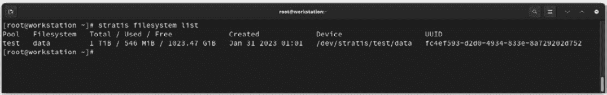

# 优化存储使用

在上一章中，我们提到过在操作系统安装过程中，本地存储配置的重要性。本地存储资源的优化对系统的健康至关重要。现在是时候回顾一下帮助优化的基本存储管理概念，如格式、文件系统、大小设置，以及管理工具，如逻辑卷和 Stratis。

在本章中，我们将涵盖以下主要内容：

+   理解文件格式和文件系统

+   优化存储空间大小

+   深入探讨逻辑卷管理器

+   探索 Stratis 存储

让我们开始吧！

# 技术要求

要执行本章中涉及的一些配置，您需要有空闲的本地存储空间，如果可能的话，最好在操作系统独立的本地磁盘上。无论空间大小如何，这样都可以完成任务。如果没有额外空间，一些配置可以在安装操作系统的同一磁盘上的本地空闲空间进行，尽管不推荐这样做。

当需要对与操作系统独立的磁盘或备用磁盘进行某些配置时，将会提到这一点。

下表显示了测试环境中的存储配置：

| **设备** | **大小** | **用途：** |
| --- | --- | --- |
| `/``dev/vda` | 50 GiB | 操作系统 |
| `/``dev/vdb` | 50 GiB | Btrfs, Stratis |
| `/``dev/vdc` | 10 GiB | Stratis |
| `/``dev/vdd` | 20 GiB | Stratis |

# 理解文件格式和文件系统

一个**文件系统**使操作系统能够找到它存储在本地磁盘上的数据。这些基本的可寻址存储单元构成一个**块**（通常大小约为 4,096 字节）。为了找到文件的内容，在大量可用存储块中，它使用 inode。一个**inode**包含有关文件的信息，这些信息存储在特定格式的存储块中，如文件的大小、位置、访问规则（即谁可以读取、写入或执行该文件）等。

从 Fedora Linux 33 开始，Workstation 版本的默认文件系统格式是 `xfs` 或者甚至是 `ext4`，Btrfs 是一个**写时复制**（**COW**）的 Linux 文件系统，具备许多先进的功能。

在 COW 文件系统中，一旦文件被修改，它不会被写回到磁盘上的同一块；它更像是一个重定向。这是为了保护原始数据，并确保将新数据写入未占用的 inode 中。这允许对文件的旧版本进行引用，便于访问，就像在**快照**中一样，保留系统在某一时刻的状态。

这种行为的缺点是，文件碎片化可能比其他文件系统更快，尽管对于常规的桌面使用来说，这个差异不太可能造成影响。

为了使修改后的文件在文件系统中显示，所有包含对此文件的引用的目录项都会以递归的方式进行更新。而且因为目录本身是一个指向文件的指针，并且具有 inode（因为它指示其中的文件），任何文件修改也会为目录创建一个新的 inode，这个过程会通过文件系统传递到根目录(`/`)。因此，只要旧目录的引用存在且没有被修改，整个文件系统仍然可以指向一个先前的状态，就像快照一样。

除了廉价且快速的快照，Btrfs 还包含其他功能，如错误检测、容错、恢复、透明压缩和集成的卷管理，并提供多设备存储池、类似 RAID 的功能以及数据和元数据的校验和，所有这些都具有易于使用的管理功能。

让我们创建一个测试用的 Btrfs 文件系统，以展示它的功能。

## 创建 Btrfs 文件系统

在这个示例的开发过程中，使用与操作系统安装位置不同的本地磁盘。这将从零开始向你介绍 Btrfs 文件系统的功能。请按照以下步骤操作：

1.  存储管理需要超级用户权限，因此使用**sudo**命令切换到**root**用户，并创建用于托管文件系统的**/btrfs**目录：

    ```
    [user@workstation ~]$ sudo -i
    [sudo] password for user: [password]
    [user@workstation ~]$ mkdir /btrfs
    ```

1.  确认要使用的设备。确保测试存储设备没有被占用。格式化意味着数据将被完全销毁。

有几个命令可以提供有关存储设备使用情况的信息。建议使用多个命令来验证它们。这些建议包括以下内容：

+   (**s**)**fdisk -l**

+   **parted -l**

+   **cat /proc/partitions**

+   **ls -****l /dev/disk/by-path**

+   **lsblk -p**


图 4.1 – 识别存储设备

在我们的示例中，未使用的存储设备是`/dev/vdb`，因为它显示没有任何分区。然而，它应该由**逻辑卷管理器**（**LVM**）管理。运行以下命令以显示由 LVM 管理的设备：

```
pvs -a
```


图 4.2 – 丢弃存储设备上的 LVM

注意

如果使用分区，需要确认该分区没有被其他文件系统占用，且没有挂载目录。可以使用以下基本命令：**fdisk**、**parted**、**mount**、**df**、**lsblk**、和**blkid**。

1.  创建存储池。使用 Btrfs 时，不需要在存储设备上创建物理分区。首先创建一个存储池，然后创建子卷。这些子卷可以设置配额和快照，因为这些可调整大小的分区可以共享数据块。

运行`mkfs.btrfs`命令将`/dev/vdb`格式化为`Btrfs`文件系统：

```
mkfs.btrfs -L testbtrfs /dev/vdb
```


图 4.3 – 创建 Btrfs 存储池

1.  将存储设备挂载到应该创建子卷的目录。使用**mount**命令：

    ```
    [root@workstation ~]# mount /dev/vdb /btrfs
    ```

在挂载了 Btrfs 文件系统后，我们来分析其存储空间的使用情况。

1.  要显示文件系统的结构，请运行以下命令：

    ```
    [root@workstation ~]# btrfs filesystem show /btrfs
    Label: 'testbtrfs'  uuid: def9423d-8684-487f-bd11-4829937752b6
    Total devices 1 FS bytes used 144.00KiB
    devid    1 size 50.00GiB used 1.56GiB path /dev/vdb
    ```

1.  要测量文件系统上可用的空间，请运行以下命令：

    ```
    [root@workstation ~]# btrfs filesystem df /btrfs
    Data, single: total=1.00GiB, used=0.00B
    System, DUP: total=32.00MiB, used=16.00KiB
    Metadata, DUP: total=256.00MiB, used=128.00KiB
    GlobalReserve, single: total=3.50MiB, used=0.00B
    ```

注意

以下部分将详细解释命令输出的含义。

在 Btrfs 中，子卷类似于包含在主机中的文件系统。一个 Btrfs 文件系统包含一个子卷，但可以存在多个额外的子卷。这些子卷以目录的形式出现在挂载的 Btrfs 文件系统中。子卷可以像任何其他用户可访问的目录一样访问，或者它可以挂载为一个独立的文件系统。

Btrfs 会将每个卷分开。默认情况下，Btrfs 文件系统包含一个子卷。这个子卷被设置为顶级子卷，并且即使没有指定，也会被挂载。随着子卷的创建，它们可以互相嵌套。但顶级子卷除外。因此，每个子卷都有一个可挂载的根目录，并且可以包含多个文件树。这为每个子卷以及主子卷的挂载点设置了一个相对位置。

**Btrfs 子卷**被认为更像是一个命名空间。

子卷有一些基本布局（包括快照），它们包括以下几种：

+   扁平 – 子卷是顶级的子级

+   嵌套 – 子卷位于文件层次结构的任何位置，位于其他子卷下面，而不是顶级子卷下

+   混合 – 两种基本方案可以混合使用，例如，基本结构采用平面布局，文件系统的某些部分被放置在嵌套的子卷中

让我们创建一个子卷：

1.  使用**btrfs subvolume create**命令创建**test**子卷：

    ```
    [root@workstation ~]# btrfs subvolume create /btrfs/test
    Create subvolume '/btrfs/test'
    ```

1.  使用**btrfs** **subvolume**命令查看子卷信息：

    ```
    [root@workstation ~]# btrfs subvolume show /btrfs/test
    ```


图 4.4 – 子卷信息

1.  创建**/test**目录并将子卷挂载到该目录：

    ```
    [root@workstation ~]# mkdir /test
    [root@workstation ~]# mount -o bind /btrfs/test /test
    ```

在这个示例中，子卷没有分配空间，因此它可以使用池中的所有可用空间。

1.  验证存储池的已用空间：

    ```
    [root@workstation ~]# btrfs filesystem du /btrfs
         Total   Exclusive  Set shared  Filename
         0.00B       0.00B           -  /btrfs/test
         0.00B       0.00B       0.00B  /btrfs
    ```

要获取更多关于空间使用的细节，请运行以下命令：

```
btrfs filesystem usage /btrfs
```


图 4.5 – Btrfs 池使用的存储空间

让我们创建一个 1GB 的空文件，以观察分配使用空间的变化。

1.  使用**dd**命令在**/test**目录中创建一个 1GB 的空文件：

    ```
    [root@workstation ~]# dd if=/dev/zero of=/test/example \
    > bs=1M count=1024
    ```

1.  验证存储池中分配空间的变化：

    ```
    [root@workstation ~]# btrfs filesystem du /btrfs
    [root@workstation ~]# btrfs filesystem usage /btrfs
    ```


图 4.6 – Btrfs 池使用的存储空间变化

这是示例的结束部分。我们从识别一个可免费使用的存储设备开始，将其格式化为`Btrfs`，在上面创建了一个存储池，创建了一个子卷，并将其挂载到文件系统中，详细分析了存储空间的使用情况。

在下一节中，我们将继续回顾 Fedora Linux 存储管理的基本概念。

# 优化存储空间大小

在上一节中，我们回顾了 Btrfs 文件系统的一些特性。现在是时候更详细地学习如何优化这些已用存储空间了。

Btrfs 在其最低级别保留了一些原始存储空间，因为卷需要包含文件数据或卷元数据。为此，它为文件系统分配了原始存储空间的一部分。存储空间的一部分被称为**块**。它的主要功能是容纳文件数据或卷元数据，以便在同一卷或另一个相似设备上进行复制。

存储空间被分配到块中，空间由块使用。没有块使用的块是未分配的；有一个或多个块被使用的块是已分配的。即使没有使用所有空间，所有块仍然可以被分配。

Btrfs 使用**延迟分配**来实现更好的磁盘分配。Btrfs 仅在系统需要处理脏页时才分配磁盘空间，因此最终，您会得到更大的分配和更大的连续数据块，这使得数据读取速度更快。

Btrfs 通过为数据分配 1 GB 的块和为元数据分配 256 MB 的块来分配磁盘空间。这意味着一个块有一个特定的配置文件：一旦为数据或元数据分配了一个块，该空间只能用于其中之一。因此，Btrfs 对于元数据和数据有不同的分配配置文件。

这种元数据和数据的划分可能会让人感到困惑：一个文件系统可能显示 10 GB 的数据，但只有 2 GB 的空闲空间。常见的操作系统命令，如 `df` 或 `du`，无法显示 Btrfs 中空间使用和块分配的完整信息。因此，Btrfs 包含了自己的命令，用于显示已用空间和已分配的块。

使用上一节创建的文件系统，让我们更仔细地查看存储空间使用情况和块分配。使用 `btrfs filesystem df` 命令来显示 `/` `btrfs` 信息：

```
[root@workstation ~]# btrfs filesystem df /btrfs
Data, single: total=1.00GiB, used=1.00GiB
System, DUP: total=8.00MiB, used=16.00KiB
Metadata, DUP: total=256.00MiB, used=1.17MiB
GlobalReserve, single: total=3.50MiB, used=16.00KiB
```

请观察以下内容：

+   **数据**、**系统**和**元数据**是不同的块组类型：

    +   **single** 是在 **mkfs** 时定义的分配配置文件。

    +   **DUP** 意味着 *重复*。它保证在同一磁盘上存在两个副本。此模式可以防止数据或元数据损坏，但无法防止磁盘故障。

    +   **total** 是为给定类型的所有分配配置文件保留的空间总和，即所有 **数据**/**单一**。注意，*这不是文件系统的总大小*。

    +   **used** 是数据已用空间的总和，即文件扩展和元数据块。

+   **GlobalReserve** 是人工设置的内部紧急空间：

    +   **GlobalReserve** 空间是用于的元数据的一部分。当文件系统的元数据耗尽时，它将被使用。虽然它没有被分配，但它显示为未使用的元数据空间。

从这里，您可以将其他存储设备添加到`/btrfs`文件系统中，使其成为一个跨所有添加设备的单一分区。为此，请按照以下步骤操作：

1.  使用**mkfs.btrfs**命令将额外的设备格式化为**Btrfs**：

    ```
    mkfs.btrfs /dev/vdc /dev/vdd...
    ```

1.  向挂载的设备添加设备：

    ```
    btrfs device add /dev/vdc /dev/vdd...
    Performing full device TRIM /dev/vdc (10.00GiB) ...
    Performing full device TRIM /dev/vdd (20.00GiB) ...
    ```

如果我们重新运行`btrfs filesystem df`命令，输出显示没有变化：

```
[root@workstation ~]# btrfs filesystem df /btrfs
Data, single: total=1.00GiB, used=1.00GiB
System, DUP: total=8.00MiB, used=16.00KiB
Metadata, DUP: total=256.00MiB, used=1.17MiB
GlobalReserve, single: total=3.50MiB, used=0.00B
```

这是因为添加的磁盘既没有分配给数据，也没有分配给元数据。使用`btrfs filesystem show`命令，以下输出显示：

```
[root@workstation ~]# btrfs filesystem show /btrfs
Label: 'testbtrfs'  uuid: 6c8ccaad-f9a0-4957-919e-8d87e02078e3
Total devices 3 FS bytes used 1.00GiB
devid    1 size 50.00GiB used 1.52GiB path /dev/vdb
devid    2 size 10.00GiB used 0.00B path /dev/vdc
devid    3 size 20.00GiB used 0.00B path /dev/vdd
```

`size`值是每个磁盘的大小，`used`值是分配在该磁盘上的块的大小。因此，新的文件系统大小是 80 GB，但没有从新设备分配任何块，留下 79 GB 的空闲空间供分配。使用常规的`df`命令显示此信息：

```
[root@workstation ~]# df -h /btrfs
Filesystem      Size  Used Avail Use% Mounted on
/dev/vdb         80G  1.1G   79G   2% /btrfs
```

Btrfs 可以重新分配空间并回收任何浪费的空间。如果添加了磁盘，可以运行`balance`命令，确保所有内容均匀分布到磁盘上。

平衡任何受更新影响的`Btrfs`卷并防止分配卷中的每个块非常有用。通常，只需要平衡使用率达到 50%或 70%的块即可。

要自动平衡已挂载的`/btrfs`文件系统，请运行`btrfs filesystem` `balance`命令：

```
[root@workstation ~]# btrfs filesystem balance /btrfs
Done, had to relocate 3 out of 3 chunks
```

通过重新运行`btrfs filesystem df`命令，它显示了文件系统中新块的分布：

```
[root@workstation ~]# btrfs filesystem df /btrfs
Data, single: total=1.00GiB, used=1.00GiB
System, DUP: total=32.00MiB, used=16.00KiB
Metadata, DUP: total=256.00MiB, used=1.16MiB
GlobalReserve, single: total=3.50MiB, used=0.00B
```

添加设备时，通常建议在文件系统上运行一次平衡。

Btrfs 本身不会对文件系统执行定期的重新平衡，并且可能会遇到磁盘空间管理的问题。如果不加以注意，这些错误信息可能会导致无法重新平衡文件系统上的分区或设备。

该问题通常发生在磁盘 I/O 和文件大小呈现特定模式时。这会导致磁盘空间使用效率低下，并且阻止新写入磁盘，从而生成`No space left on` `device`错误。

为了防止这种情况，请时不时运行一次长期的空间分配检查，通常基于我们系统的工作周期。最简单的解释这种时间段的方法是为某些企业的*现金结算*。例如：如果企业每月的 30 号进行现金结算，我们就有一个窗口期，在该日期前后各一天，这样我们就有 28 或 29 个*生产性*的日子，在这段时间内系统无法更改。在这两个日期上，我们可以检查分配的空间，确认一切正常。

让我们来看一下如何执行此空间分配检查。

## 空间分配检查

Btrfs 分配的块大小最大为分区大小的 1/10，最多为 1 GB。理想情况下，至少必须保留一个未分配的块，以便在重新平衡操作时使用。

注意

如果 Btrfs 没有分配文件系统的大部分空间，则无需运行重新平衡。文件系统的大部分空间是指大于 80%的大小，或者是整个文件系统大小减去 2 GB。

要确定再平衡是否能释放空间，比较分配给数据的空间与数据实际使用的空间。如果它们之间的差异大于最大块大小，那么再平衡可能会释放一些空间。

`btrfs filesystem usage` 命令提供了获取这两个值所需的信息：


图 4.7 – Btrfs 文件系统使用情况输出

让我们创建一个额外的文件，更好地举例说明此检查：

```
[root@workstation ~]# dd if=/dev/zero \
> of=/btrfs/test/example2 bs=1M count=49152
49152+0 records in
49152+0 records out
51539607552 bytes (52 GB, 48 GiB) copied, 70.17 s, 734 MB/s
```

现在我们有一个已使用 49 GB 的文件系统，接下来看看它们是如何分配的：

```
[root@workstation ~]# btrfs filesystem df /btrfs
Data, single: total=50.00GiB, used=48.45GiB
System, DUP: total=32.00MiB, used=16.00KiB
Metadata, DUP: total=256.00MiB, used=54.98MiB
GlobalReserve, single: total=53.69MiB, used=16.00KiB
[root@workstation ~]# btrfs filesystem show /btrfs
Label: 'testbtrfs'  uuid: 6c8ccaad-f9a0-4957-919e-8d87e02078e3
Total devices 3 FS bytes used 48.51GiB
devid    1 size 50.00GiB used 34.56GiB path /dev/vdb
devid    2 size 10.00GiB used 3.00GiB path /dev/vdc
devid    3 size 20.00GiB used 13.00GiB path /dev/vdd
```

使用 `btrfs filesystem usage` 命令并加上 `–b`（字节）参数来计算是否需要再平衡：


图 4.8 – Btrfs 文件系统使用情况输出

从输出中，突出显示设备的大小、设备上的分配情况，以及数据的大小和使用情况：

```
[root@workstation ~]# btrfs filesystem usage -b /btrfs
Overall:
    Device size:          85899345920
    Device allocated:          54291070976
    Device unallocated:     31608274944
    Device missing:          0
... output omitted...
Data,single: Size:53687091200, Used:52613349376 (98.00%)
... output omitted...
```

使用这些信息，按照以下步骤进行计算：

1.  设备大小为 **85899345920**。计算 80%：

    ```
    85899345920 * 0.80 = 68719476736
    ```

1.  设备大小为 **85899345920**。减去 2 GB (**2147483648**):

    ```
    85899345920 - 2147483648 = 83751862272
    ```

1.  比较两者结果。选择较大的值 (**83751862272**) 来与设备上的分配量进行比较：

    ```
    54291070976 < 83751862272
    ```

注意

如果设备分配小于计算出的条件，那么这部分检查为负，且不需要对该文件系统进行再平衡。但是必须进行数据存储效率检查，以确认不需要再平衡。

1.  估算分配空间与使用空间之间的差异：

    ```
    53687091200 - 52613349376 = 1073741824
    ```

1.  计算块大小：

    ```
    85899345920*0.10 = 8589934592
    ```

1.  比较两者结果：

    ```
    8589934592 > 1073741824
    ```

如果块大小大于差值，那么检查也是负的。不需要再平衡。

只有在设备分配大于设备大小的 80%（或设备大小减去 2 GB）且分配和使用的空间大于块大小时，才需要进行再平衡。

记住，*两个条件都不能满足*。如果第一次检查为负，则必须运行第二次检查，以确认不需要进行再平衡。

Fedora Linux 提供了一个工具，帮助我们获取 Btrfs 文件系统使用情况的详细报告。我们来看看如何使用它。

## 使用 btrfs-usage-report 命令

`python-btrfs` 模块的主要目的是检查 Btrfs 文件系统，作为对底层内核调用和 Btrfs 数据结构的封装。该模块包括 `btrfs-usage-report` 工具，展示 Btrfs 文件系统的使用报告。

要安装该工具，请使用 `dnf` 命令安装 `python3-btrfs` 包：

```
[root@workstation ~]# btrfs-usage-report command to get the report of the filesystem mounted on /btrfs. The report is complete, as shown in *Figure 4**.9*.
At the beginning, it shows the following:

*   The filesystem ID
*   The physical space used
*   The profiles

It also shows an estimate of the virtual space available and how much raw disk is allocated per chunk type:


Figure 4.9 – The Btrfs-usage-report output
The last part of the report adds detailed information about storage space allocation:


Figure 4.10 – The Btrfs-usage-report output
Besides checking the allocated space and the efficiency of the data storage check, this tool helps optimize the storage space used on our workstation.
Note
Get the complete output of the **btrfs-usage-report** command from the **/btrfs** filesystem of our GitHub repository at [`github.com/PacktPublishing/Fedora-Linux-System-Administration/blob/main/chapter4/btrfs-usage-report_btrfs.txt`](https://github.com/PacktPublishing/Fedora-Linux-System-Administration/blob/main/chapter4/btrfs-usage-report_btrfs.txt).
Despite all these advanced features, the use of Brtfs as a filesystem is not the default in distributions other than Fedora Linux or OpenSUSE. Generally, most distributions prefer to use LVM with `ext4` or `xfs` as the filesystem format.
Let’s see how different the Brtfs filesystem is from LVM.
Deep diving into Logical Volume Manager
Despite basic differences between Btrfs and LVM, they have a lot in common:

*   They focus on protecting against filesystem corruption
*   They support single - or multiple-device setup
*   They can create quick snapshots
*   Several tools exist to help manage them in graphic or command - line form

LVM sits on a layer before the filesystem, so it supports any filesystem. LVM converts *any* device or partition into a physical device (`pv`) that is dynamically manageable. Physical devices get placed in volume groups (`vg`), enabling the creation of logical volumes (`lv`).
This is how an LVM structure gets created sequentially:

1.  It creates physical devices with the available devices, using the **pvcreate [device1] [device2] ...** command.
2.  It joins the physical devices, creating the volume group, using the **vgcreate [vg_name] [pv1] [pv2] ...** command.
3.  It creates the logical volume with the **lvcreate** command.

To remove each layer from the LVM structure, run similar commands in reverse order:

1.  To delete the logical volume, use the **lvremove** command.
2.  Remove the volume group with the **vgremove** command.
3.  Remove the physical devices with the **pvremove** command.

The following figure shows the LVM creation and removal sequence:


Figure 4.11 – LVM creation and removal sequence and commands
Physical devices could be added or removed to grow or reduce a volume group. In the same way, a logical volume could be extended or reduced but requires data verification before running it. In the case of `xfs` filesystems on LVM, there is no logical volume reduction.
LVM takes a set of block devices and presents the system with a new block device (`lv`) with a fixed mapping to physical blocks.
A Btrfs subvolume is different from an LVM logical volume, in the structure and behavior. A `Btrfs` volume is a mountable filesystem tree, not a block device.
The following figure shows the basic structures:


Figure 4.12 – Btrfs subvolumes layouts
The typical Btrfs snapshot structure uses the flat scheme.
Let’s compare the snapshots of the Brtfs filesystem and LVM.
Differences between snapshots
LVM supports read-only and read-write snapshots. This eases the creation of consistent backups of active filesystems, with a defined size on the source volume group of the logical volume or an external source. This allows snapshots to belong to a thin provisioned pool when the target LV is a thin LV, which doesn’t consume fixed-size chunks of the source volume.
Creating snapshots on LVM is similar to creating a logical volume. Specify the snapshot name and the targeted LV, adding the following parameters to the `lvcreate` command:

```

lvcreate -s -n snapshot_name -L snapshot_size target_lv disk

```

 After taking the snapshot, all modifications made on the target LV will be stored in the new snapshot LV, but the old data remains in the source LV.
As needed, use the snapshot LV to roll back some changes in the source LV, mounting it in the affected directory instead of the original LV. Use the usual `mount` and `unmount` commands.
Remove the snapshot as an LV with the `lvremove` command:

```

lvremove /dev/vg_name/snapshot_name

```

 Note
It is possible to deactivate the logical volume before deleting it. Use the **lvchange -an** command. It will *not* show the prompt verifying whether you want to delete an active logical volume.
Snapshots in Btrfs are **COW clones** of a complete subvolume. They look similar to a new subvolume that contains the data of the cloned subvolume, but any changes in one do not affect the other. The space consumed increases as the original subvolume and the snapshot grow apart.
Create a snapshot using the `btrfs subvolume` command stating that it is a snapshot. Observe the following steps to create a snapshot on our `/btrfs` filesystem from the *Creating a Btrfs* *filesystem* section:

1.  List the subvolumes of the filesystem mounted on **/btrfs**:

    ```

    [root@workstation ~]# btrfs 子卷列表 /btrfs

    ID 256 gen 72 top level 5 path test

    ```

Note
The top-level subvolume with **Btrfs** ID **5** is the root of the volume. All subvolumes mount below it.

1.  Create a snapshot of the **test** subvolume:

    ```

    [root@workstation ~]# btrfs 子卷快照 \

    > /btrfs/test /btrfs/test_snapshot

    在 '/btrfs/test' 创建一个快照到 '/btrfs/test_snapshot'

    ```

     2.  Listing the subvolumes again displays the snapshot:

    ```

    [root@workstation ~]# btrfs 子卷列表 /btrfs

    ID 256 gen 76 顶级 5 路径 test

    ID 257 gen 76 顶级 5 路径 test_snapshot

    [root@workstation ~]# ls /btrfs/

    test   test_snapshot

    ```

     3.  Inspect the directories to verify that they contain the same data:

    ```

    [root@workstation ~]# tree /btrfs/

    /btrfs/

    ├── test

    │   └── example

    └── test_snapshot

    └── example

    3 个目录，2 个文件

    ```

With COW, each subvolume could change without changes in one affecting the other.
The differences between Btrfs and LVM are remarkable:

*   A Btrfs subvolume holds the capacity of the filesystem to which it belongs. A logical volume in LVM contains a capacity, which is a space reservation of the volume group it belongs to.
*   A Btrfs snapshot is a full-fledged subvolume, and once created there is no "original" and "snapshot." On LVM, a snapshot depends on the logical volume from the one that it came from.

For example, it is not possible to resize a logical volume or move its data with the `pvmove` command (from one physical volume to another) while having active snapshots of that logical volume.
Note
For more information about the LVM commands and their Btrfs equivalents, refer to the Fedora wiki article at [`fedoraproject.org/wiki/User:Chrismurphy/lvm2btrfs`](https://fedoraproject.org/wiki/User:Chrismurphy/lvm2btrfs).
Let’s now learn about Fedora’s latest approach to storage management, Stratis storage.
Discovering Stratis storage
`device mapper`, and existing filesystems such as `XFS`.
Here’s what you can do with Stratis:

*   Create, modify, and destroy storage pools
*   Allocate and detach filesystems from storage pools
*   Encrypt and decrypt filesystem data

Stratis storage brings together common storage management tools and automates them for ease of use. Here are some things it uses:

*   **device-mapper** – A framework for logical to physical mapping of data blocks
*   **LUKS** – An on-disk format for encryption that can securely manage multiple passwords
*   **XFS** – A scalable, journaling, and performant filesystem
*   **Clevis** – A framework for automated decryption

Here are the Stratis components:

*   **Blockdev** – Block devices, either a disk or a partition.
*   **Pool** – Consists of one or more block devices. A pool has a fixed total size, which represents the sum of all the block devices present in it.
*   **Filesystem** – Filesystems don’t have a fixed total size, thinly provisioned. The real size of the filesystem grows with the data stored in it. The thin volume and the filesystem increase automatically. Each pool could contain one or more filesystems, formatted with XFS.

The following diagram shows the layout of the components in the Stratis pool:


Figure 4.13 – Stratis storage components
Let’s create a Stratis test pool to show its capabilities.
Creating a Stratis pool
For this practice example, reuse the disks used in the *Btrfs* section in this chapter.
Follow these steps:

1.  Unmount the **Btrfs** and **/test** filesystem and remove the **/****btrfs** directory:

    ```

    [root@workstation ~]# umount /btrfs/test

    [root@workstation ~]# umount /btrfs

    [root@workstation ~]# rm -rf /btrfs

    ```

     2.  Removes the **Btrfs** filesystem from the storage devices using the **wipefs** command:

    ```

    [root@workstation ~]# wipefs /dev/vdb --all –f

    [root@workstation ~]# wipefs /dev/vdc --all -f

    [root@workstation ~]# wipefs /dev/vdd --all -f

    ```

The `--all` parameter deletes all available signatures.
The `-f` parameter forces erasure even if the filesystem is mounted.

1.  Install Stratis using the **dnf** command:

    ```

    [root@workstation ~]# dnf 安装 stratis-cli stratisd

    ```

     2.  Use the **systemctl** command to enable the **stratisd** service:

    ```

    [root@workstation ~]# systemctl 启用 --now stratisd

    ```

     3.  With the **fdisk** command, verify the size of the disk:


Figure 4.14 – Checking the disk size

1.  Use the **stratis pool create** command to create the pool test on the **/****dev/vdb** device:

    ```

    [root@workstation ~]# stratis 池创建 test /dev/vdb

    ```

     2.  List the Stratis pool using the **stratis pool** **list** command:


Figure 4.15 – Stratis pool list
The following table lists the fields of the `stratis pool` `list` output:

  **Field**
 |
  **Description**
 |

  Name
 |
  The name of the pool
 |

  Total/Used/Free
 |
  The physical usage statistics for the pool
 |

  Properties
 |
  Boolean-valued properties that the pool may have. Each property has a two-letter code in camel case. If the pool does not have the property, add a `~` symbol, which stands for *negation*, to the property code.
If the engine has experienced an error in obtaining the property, add a `?` symbol, which stands for *unknown*, to the property code.
The property codes are as follows:

*   **Ca** - Indicates that the pool has a cache

*   **Cr** - Indicates encrypted pool

*   **Op** - indicates that the pool allows over-provisioning

 |

  UUID
 |
  Universally Unique IDentifier of the pool
 |

  Alerts
 |
  Anything unusual or urgent information about the pool that the user needs information on.
 |

Let’s now add another device to the pool to see how the available space in the pool increases:

1.  Use the **stratis pool add-data** command to add the **/dev/vdc** device to the Stratis pool and list the pool again to observe the change:


Figure 4.16 – Stratis pool list
Now let’s create a filesystem to show the differences from a common filesystem.

1.  Create the filesystem data using the **stratis filesystem** **create** command:

    ```

    [root@workstation ~]# stratis 文件系统创建 test data

    ```

     2.  List the filesystems in the **test** pool to observe their properties. Use the **stratis filesystem** **list** command:



Figure 4.17 – Stratis filesystem list
Note that the total size of the filesystem is 1 TiB, even though the sum of the actual available disk space is 60 GiB:

```

[root@workstation ~]# stratis 文件系统列表 test

池     文件系统     总计 / 已用 / 可用

test   data         1 TiB / 546 MiB / 1023.47 GiB

...输出省略...

```

 As mentioned, the filesystem gets created on a thinly provisioned 1 TiB block device by design. Stratis handles the allocation of blocks from the pool and resizes the `XFS` filesystem on demand during its lifetime.
Stratis also facilitates the creation of snapshots of filesystems. A Stratis snapshot is a thinly provisioned real-time read/write copy of the source filesystem.
Let’s see how to create snapshots.

1.  Use the **stratis filesystem snapshot** command to create the snapshot, and then list the filesystems of the pool:


Figure 4.18 – Stratis filesystem list
The filesystems and their snapshots could mount in the traditional way in the operating system. Use the `mount` command and, to keep them mounted permanently, configure an entry in the `/``etc/fstab` file.
Note
For more information about Stratis, refer to the Stratis documentation at [`stratis-storage.github.io/howto/`](https://stratis-storage.github.io/howto/).
This concludes our review of storage basics. In the following chapters, we will review some other fundamental concepts, such as networking and the use of applications, along with applying system administration of Linux systems.
Summary
This chapter consisted of reviewing the basic concepts of storage management and focused on the Btrfs filesystem, performing practical examples to understand its use and main features, identifying storage devices, formatting storage devices, creating pools, and mounting filesystems.
We clarified some items that assist in optimizing the allocation of storage space and learned the main differences between Btrfs subvolumes and LVM.
As a bonus, we discussed the Fedora Project’s new approach to storage management with Stratis, the intention of which is to ease storage management.
In the next chapter, we will cover the fundamental concepts and configurations of network connections and how to optimize them.
Further reading
To learn more about the topics that were covered in the chapter, please visit the following links:

*   *Fedora Wiki –* *Btrfs*: [`fedoraproject.org/wiki/Btrfs`](https://fedoraproject.org/wiki/Btrfs)
*   *Btrfs* *documentation*: [`btrfs.readthedocs.io/en/latest/`](https://btrfs.readthedocs.io/en/latest/)
*   *Choose between Btrfs and* *LVM-ext4*: [`fedoramagazine.org/choose-between-btrfs-and-lvm-ext4/`](https://fedoramagazine.org/choose-between-btrfs-and-lvm-ext4/)
*   *Getting started with Stratis – up and* *running*: [`fedoramagazine.org/getting-started-with-stratis-up-and-running/`](https://fedoramagazine.org/getting-started-with-stratis-up-and-running/)
*   *Stratis* *storage*: [`stratis-storage.github.io/`](https://stratis-storage.github.io/)

```
