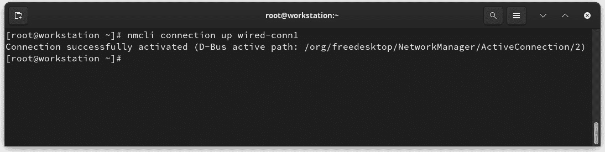
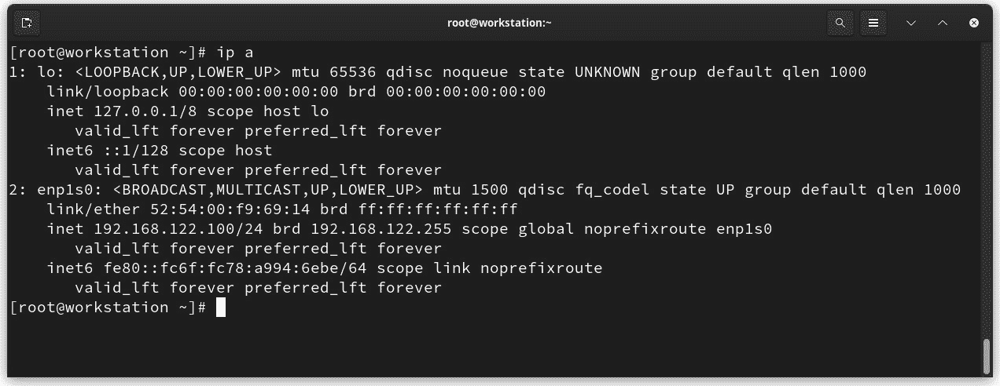

# 网络与连接性

现在，是时候回顾一下我们工作站上的网络配置和管理基础知识了。这将帮助我们了解在网络配置中可以调整和微调的基本要点。我们将深入了解 **NetworkManager** 管理工具，以及有关其使用的最常见技巧和示例。

我们还将讲解有线和无线网络配置。在下一部分，我们将回顾如何访问 **虚拟专用网络**（**VPN**）。最后，我们将学习用于监控网络性能和连接性工具。

本章我们将涵盖以下主要内容：

+   基础知识概述

+   调整无线连接

+   使用 VPN 改善网络连接

+   网络性能监控

让我们开始吧！

# 技术要求

本章中提到的配置需要访问本地网络，无论是有线还是无线。进行这些测试不需要专用的网络接口。

你可以在本书的 GitHub 仓库中找到本章使用的模板和示例文件：[`github.com/PacktPublishing/Fedora-Linux-System-Administration/tree/main/chapter5`](https://github.com/PacktPublishing/Fedora-Linux-System-Administration/tree/main/chapter5)

# 基础知识概述

NetworkManager 使用 *连接配置文件* 的概念，包含网络配置。这些配置文件支持多种格式来存储属性，例如 `int32`、`boolean`、`uint32`、`string`、`array of string`、`uint64` 等等。随着 NetworkManager 使用和功能的增长，`ifcfg` 文件可能不再受支持。

NetworkManager 使用插件来读取和写入这些数据。NetworkManager 增加了对新连接类型的支持，最终采用了一个更简化的配置文件格式，称为 `keyfile` 插件。

`keyfile` 插件支持所有 NetworkManager 支持的连接类型和功能。NetworkManager 使用 *INI-key* 文件格式来存储连接配置文件数据。

这个插件始终保持活动状态，并存储其他没有支持的活动插件所无法支持的任何连接。出于安全考虑，它会忽略任何*非 root* 用户可能读取或写入的文件，因为私钥和密码可能以明文存储在文件中。

让我们以一个以太网连接配置文件为例，更好地理解插件：

```
[connection]
id=net_connection
uuid= 9cd8a444-f501-4179-900e-f3754dbbe7c0
type=ethernet
autoconnect=true
[ipv4]
method=auto
[ipv6]
method=auto
[ethernet]
mac-address=48:2a:e3:8f:4b:aa
```

它由键值对的组（部分）组成，每组对应一个配置名称，描述为属性。规范中的大多数属性也以相同的格式写在 key 文件中。然而，一些值不太友好使用，这些值以更可读的形式存储在 `/etc/NetworkManager/system-connections/`、`/usr/lib/NetworkManager/system-connections/` 和 `/run/NetworkManager/system-connections/` 中。

注意

有关**密钥文件设置描述**插件的更多信息，请参阅*GNOME 开发者文档*：[`developer-old.gnome.org/NetworkManager/stable/nm-settings-keyfile.html`](https://developer-old.gnome.org/NetworkManager/stable/nm-settings-keyfile.html)。

和 Linux 中的任何文件一样，密钥文件可以被修改，但 NetworkManager 必须知道这些更改，才能考虑它们。

现在，让我们回顾一下帮助我们处理 NetworkManager 和网络配置的工具。

## NetworkManager 命令行界面（nmcli）

NetworkManager 可以通过`nmcli`命令行工具进行管理（`nmcli`允许我们创建、显示、编辑、删除、激活和停用网络连接。除了控制和显示网络设备的状态外，它还可以作为终端中的命令运行，或从脚本中调用）。

作为一个从终端运行的命令，`nmcli`可以创建、编辑、启动和停止网络连接，或显示网络设备的状态，而无需使用 GUI 或桌面小应用程序。

对于脚本，`nmcli`提供了一种简单的输出格式，可以适应数据处理，将网络配置集成到一个过程，而不是手动管理网络连接。

基本的`nmcli`命令运行格式如下：

```
nmcli [OPTIONS] OBJECT { COMMAND | help }
```

注意

要查看完整的选项列表，请在终端中运行**man** **nmcli**命令。

然后，要获取连接概况，运行`nmcli -o` `conn`命令：


图 5.1 – 网络连接概览

要查看`enp1s0`网络设备的概况，请运行`nmcli -o dev show` `enp1s0`命令：


图 5.2 – 网络设备概览

你可以列出`nmcli -f TYPE,FILENAME,NAME` `conn`命令：


图 5.3 – 检查网络连接密钥文件

在这种情况下，注意到工作站的*IP 地址*被设置为`auto`，这意味着它使用 DHCP 作为启动协议：

```
[ipv4]
method=192.168.122.100 instead of the one assigned by DHCP, follow these steps:

1.  Back up the original configuration of the connection:

    ```

    # cat /run/NetworkManager/system-connections/Wired\ connection\ 1.nmconnection >>  wired_connection_1.bkp.txt

    ```


Figure 5.4 – Backing up network connection settings
Note
Running the **cat** command to redirect the output to a file lets us know about and identify the contents of the file.

1.  Add the **enp1s0** connection as a new NetworkManager connection profile:

    ```

    # nmcli connection add con-name wired-conn1

    ifname enp1s0 type ethernet

    ```


Figure 5.5 – Adding the new NetworkManager connection profile

1.  Set the IP address of this profile:

    ```

    # nmcli connection modify wired-conn1

    ipv4.addresses 192.168.122.100/24

    ```


Figure 5.6 –  Setting the IP address

1.  Set the connection method to **manual**:

    ```

    # nmcli connection modify wired-conn1

    ipv4.method manual

    ```


Figure 5.7 – Setting the connection method

1.  Set the gateway to **192.168.122.1**:

    ```

    # nmcli connection modify wired-conn1  ipv4.gateway 192.168.122.1

    ```


Figure 5.8 – Setting the gateway

1.  Set **dns** to **192.168.122.1**:

    ```

    # nmcli connection modify wired-conn1  ipv4.dns 192.168.122.1

    ```


Figure 5.9 – Setting dns

1.  Activate the new NetworkManager connection profile:

    ```

    [root@workstation ~]# nmcli connection up wired-conn1

    ```



Figure 5.10 – Activating the NetworkManager profile

1.  Check the device’s status:

    ```

    [root@workstation ~]# nmcli device status

    ```


Figure 5.11 – Reviewing the device’s status

1.  Check the network configuration of the workstation. Confirm the changes in the IP address of the **enp1s0** device. Then, use the **ip** command:

    ```

    [root@workstation ~]# ip a

    ```



Figure 5.12 – Verifying the network configuration

1.  Review the workstation connection’s keyfiles:

    ```

    # nmcli -f TYPE,FILENAME,NAME conn

    ```


Figure 5.13 – Checking the keyfiles
Note that the *active configuration* is now highlighted in green.
Let’s compare the original backup file with the created one. Use the `diff` command to highlight the differences:


Figure 5.14 – Keyfile differences
The first difference is in the `id` value of the *connection name*. But also, notice that there is a change in the `uuid` value:

```

< id=Wired connection 1

< uuid=0938b01a-f879-3f76-a796-b3f856dc27ac

---

> id=wired-conn1
> 
> uuid=uuid) 用于此连接配置文件。这允许多个连接应用于同一设备，但只能激活其中一个。额外的连接使您可以快速切换不同的网络或配置。

连接在安装过程中被*自动配置*为 DHCP。由于在安装过程中此参数保持不变，启动时协议分配的属性之一是*自动连接优先级*：

```
< auto-connect, higher-priority connections are preferred. The default is 0. *A higher number means a* *higher priority*.
An interesting piece of data that can be found in the original keyfile is `timestamp`, in seconds since the **Unix Epoch**, when the connection was last successfully activated:

```

< ipv4 配置部分:

```
< method=auto
---
> address1=192.168.122.100/24,192.168.122.1
> dns=192.168.122.1;
> auto. The current keyfile is set to manual, plus the configuration of the *IP address*, *gateway*, and *DNS*.
A *wired connection* is the simplest example of network configuration, although several extra properties could be added.
A *wireless connection*, which is used for the kind of work involved in managing Linux servers, is the type of connection we will use the most, given its inherent mobility advantages.
Now, let’s see how, besides configuring our *wireless connection*, to optimize it with some fine-tuning settings.
Tuning wireless connectivity
Sometimes, the network’s devices are not recognized by the operating system. This is one of the common issues of using wireless networks.
Let’s start this section by ensuring that the wireless network device has support from the operating system by identifying which chipset it uses and which drivers work best for its operation.
Identifying the device
In a network device, the main thing is to identify the *Vendor ID* (the 16-bit number of the vendor – that is, the **VID**) and the *Product ID* (the 16-bit number of the product number – that is, the **PID**). Use the following commands for each case, depending on the bus used by the device:

*   PCI: **lspci -nn**
*   USB: **lsusb**:


Figure 5.15 – Identifying the network device
As shown in the preceding figure, the output of the `lspci` command provides the required chipset information:

```

00:00.0 PCI 桥 [0604]: Broadcom Inc. 及其子公司 BCM2711 PCIe 桥 [14e4:2711] (rev 10)

```

 Now, go to Google and type the chipset information in the form:

```

"14e4 2711" site:cateee.net/lkddb/

```

 This search leads to a chipset match in **Linux Kernel Driver DataBase** ([`cateee.net/lkddb/`](https://cateee.net/lkddb/)), which allows us to identify whether the wireless network device has support and which driver is the correct one to use:


Figure 5.16 – LKDDb search
If you search for chipset information in the form – that is, `"14e4:2711"` – it leads to several useful sites that provide more detailed information. Click on the **Hardware for Linux** page link ([`linux-hardware.org/`](https://linux-hardware.org/)) and find the chipset’s details:


Figure 5.17 – The Hardware for Linux site
With the preceding tools, we can identify the wireless device in our computer. Follow these steps to identify the vendor and its product ID:

1.  Run the **lspci** command to identify the card:

    ```

    [root@workstation ~]# lspci | grep -i broadcom

    00:00.0 PCI 桥: Broadcom Inc. 及其子公司 BCM2711 PCIe 桥 (rev 10)

    ```

Note
If the card is not integrated into the motherboard of the computer, use the **lsusb** command to identify this device.
A bus number, a device number, and a function number can be identified at the beginning of the output:

```

00:00.0

```

1.  Use this information to get detailed device information. To do so, run the **lspci** command:

    ```

    [root@workstation ~]# lspci -vv -s 00:00.0

    00:00.0 PCI 桥: Broadcom Inc. 及其子公司 BCM2711 PCIe 桥 (rev 10) (prog-if 00 [正常解码])

    设备树节点: /sys/firmware/devicetree/base/scb/pcie@7d500000/pci@0,0

    控制: I/O- Mem+ BusMaster+ SpecCycle- MemWINV- VGASnoop- ParErr- Stepping- SERR- FastB2B- DisINTx-

    状态: Cap+ 66MHz- UDF- FastB2B- ParErr- DEVSEL=fast >TAbort- <TAbort- <MAbort- >SERR- <PERR- INTx-

    延迟: 0

    中断: pin A 路由到 IRQ 38

    ...省略输出...

    ```

     2.  List the modules that were loaded in the kernel and search the identified chipset of the wireless card. Use the **lsmod** command:

    ```

    root@workstation ~]# lsmod | grep -i broadcom

    broadcom               28672  1

    bcm_phy_ptp            24576  1 broadcom

    bcm_phy_lib            28672  2 bcm_phy_ptp,broadcom

    ```

     3.  Use the **modinfo** command to display the module information:

    ```

    [root@workstation ~]# modinfo broadcom

    文件名:       /lib/modules/6.1.12-200.fc37.aarch64/kernel/drivers/net/phy/broadcom.ko.xz

    许可证:        GPL

    作者:         Maciej W. Rozycki

    描述:    Broadcom PHY 驱动

    ...省略输出...

    依赖:        bcm-phy-lib,bcm-phy-ptp

    intree:         Y

    名称:           broadcom

    vermagic:       6.1.12-200.fc37.aarch64 SMP 预占

    mod_unload aarch64

    sig_id:         PKCS#7

    签名者:         Fedora 内核签名密钥

    sig_key:        4C:FF:C2:28:93:D4:32:A9:E6:E0:32:6A:D9:B0

    ...省略输出...

    ```

With these simple steps, we can determine whether the wireless card is using the right, updated driver. This prevents any initial issues when connecting to a network.
Now, let’s learn how to identify the available wireless networks and configure our wireless card to get the best connectivity performance.
Finding the best quality network connection
By default, the `nmcli` command lists the available **Wi-Fi access points** that are no more than *30 seconds old* by enabling a network scan if necessary.
To list the available Wi-Fi access points, run the `nmcli dev wifi` `list` command:


Figure 5.18 – Listing the Wi-Fi access points
The `nmcli` command shows the Wi-Fi access points in different colors. Each one represents different signal strengths.
Soft colors, such as cyan, represent a weak signal (less than 30% intensity). A stronger signal (30-50%) is represented by a magenta color. Orange indicates a better signal (60-80%), whereas green represents an excellent signal (80-100%).
With the `--rescan` option, the scan could be forced to be disabled, regardless of the age of the access point list.
Use the `nmcli device` command to identify the wireless network device:


Figure 5.19 – Identifying the wireless network device
From the list of access points, select those that belong to the location of the workstation. Both have good signal quality:


Figure 5.20 – Selecting Wi-Fi access points
Select the access point with the best signal quality and connect to it. Use the `nmcli` command with the following format:

```

# nmcli device wifi connect [SSID] password [SSID-password]

```

 Note
This command preserves the **password** in the shell history. To remove it from the history, delete the corresponding line in the **~/.bash_history** file or run the **history -c** command to delete all entries.
Then, use the `nmcli device` command to confirm the device status change:


Figure 5.21 – Connecting to the access point
Repeat the same command and add the `show` and `device` options to display the connection details:


Figure 5.22 – Connection details
The **received signal strength indicator** (**RSSI**), which specifies how strong the received signal is, is measured in *decibels relative to one milliwatt* (**dBm**) or **10-3 W**.
To find the RSSI, it’s necessary to interpret the *raw value* given by `/proc/net/wireless` and then display it in the appropriate unit or greatest value (using 8-bit arithmetic).
Use the `iw` command to get the device link information:

```

[root@workstation ~]# iw wlan0 link

已连接到 2c:58:4f:7c:4a:1b (在 wlan0 上)

SSID: innsmouth

频率: 2462

RX: 1817351 字节 (8922 数据包)

TX: 806585 字节 (3517 数据包)

信号: -38 dBm

rx 比特率: 58.5 MBit/s

tx 比特率: 72.2 MBit/s

bss 标志:     短前导码

dtim 周期:     1

beacon int:     100

```

 The `iw` command grabs the information from the `/proc/net/wireless` file and interprets it. By combining this with the `watch` command, it is possible to directly monitor changes in the file. Here’s an example:

```

# watch -n 1 cat /proc/net/wireless

```

 

Figure 5.23 – Monitoring the quality of the connection
Monitoring the frequency of changes in quality values and comparing them on different networks could establish the optimal network to use for our system administration tasks. This will help us reduce connectivity interruptions in such tasks.
In the last section of this chapter, we will take a more in-depth look at monitoring connections for better performance and minimizing outages.
The `nm-connection-editor` is a *GTK-based* application for adding, deleting, and modifying network connections that NetworkManager stores. Let’s see how to do it.
nm-connection-editor
In the top-right corner of the taskbar, there is the control panel for settings, including the network connection. If the workstation is not connected to any network, only the icons for keyboard language, volume, and system power will appear:


Figure 5.24 – The top-right corner of the taskbar
Click on that area to display the control panel:


Figure 5.25 – Taskbar control panel
Follow these steps to connect the workstation to the wireless network:

1.  Click on the gear icon and select **Wi-Fi** to discover the available wireless networks:


Figure 5.26 – Wi-Fi – Visible Networks

1.  Locate the desired wireless network and click on it. If required, you will be prompted to enter the access password:


Figure 5.27 – Requesting access to the wireless network

1.  If the password you’ve entered is correct, you will be able to access the wireless network and the connection details will be shown:


Figure 5.28 – Connection details

1.  Now, the wireless connection icon will appear in the top-right corner of the taskbar:


Figure 5.29 – Wireless icon on the taskbar
When we click on it, the control panel will show us an icon that we can use to disable the connection or view the available networks:


Figure 5.30 – Wireless direct access icon
Now, we can configure the network access to our workstation, either cable or wireless, depending on our needs.
In the examples shown in this chapter, we have focused on setting access and ensuring a healthy connection to the network.
However, we cannot omit the security risks involved in connecting to a network, especially those with public access.
Let’s talk about this and how we can mitigate these risks.
What about security?
The use of wireless networks has boosted the mobility of jobs that rely on the use of computers.
Open wireless networks provide many facilities for remote work from anywhere in the world. However, they also include the risk of exposing confidential information about ourselves, our employers, or the clients we work with.
The most basic principle of security is to be aware of what we have open, such as ports, sockets, files, and/or processes. Some processes use the network’s open ports to maintain connectivity between the client and server machine. Applying security’s basic principle, we must be aware of the ports that have been opened and only allow those that we know must remain that way.
The tool that helps us in these cases is the **network firewall**.
As its name suggests, a network firewall is *a protective barrier that prevents unauthorized network communications*. Its main purpose is to prevent unauthorized access or use of the network services of our system.
`firewalld`.
`firewalld` provides dynamic firewall management with support for network/firewall zones. That support defines the *trust level* of network connections or interfaces. The `firewalld` D-Bus interface uses the `firewall-cmd`, `firewall-config`, and `firewall-applet` firewall configuration tools.
The following diagram shows the firewall management flow with `firewalld`:


Figure 5.31 – The firewall management flow with firewalld
By default, the `firewalld` service comes installed with Fedora. You can use the `firewall-cmd --``state` command:

```

[root@workstation ~]# firewall-cmd --state

firewall-cmd --list-all 命令:

```
[root@workstation ~]# firewall-cmd --list-all
FedoraWorkstation (active)
  target: default
  icmp-block-inversion: no
  interfaces: wlan0
  sources:
  services: dhcpv6-client mdns samba-client ssh
  ports: 1025-65535/udp 1025-65535/tcp
  protocols:
  forward: yes
  masquerade: no
  forward-ports:
  source-ports:
  icmp-blocks:
dhcpv6-client, mdns, samba-client, and ssh services, as well as the 1025-65535/udp and 1025-65535/tcp dynamic ports.
In our workstation use case, it is likely that we do not need to have services or ports exposed to the network. So, the best practice is to close them all.
Before closing them, use the `ss` command to investigate the ports that have been opened by the processes to determine whether they refer to the services and ports allowed in the firewall:

```

# ss -tulpn

```

 

Figure 5.32 – Ports and services connections
As a result of this analysis, it is clear that our network is not using the open services allowed in the firewall, so we should close them. Let’s look at the main reasons why we should do this:

*   The network does not have **ipv6** (**dhcpv6-client**)
*   DNS resolution does not use *multicast* on the network. (**mdns**)
*   We do not use shared directories by **CIFS** or **samba** (**samba-client**)
*   The workstation will be used to connect to other computers via **ssh**, but not in the opposite direction

To permanently remove the services from the configuration, use the `firewall-cmd` command:

```

[root@workstation ~]# firewall-cmd --permanent --delete-service={dhcpv6-client,mdns,samba-client}

错误: BUILTIN_SERVICE: 'dhcpv6-client' 是内建服务

错误: BUILTIN_SERVICE: 'mdns' 是内建服务

错误: BUILTIN_SERVICE: 'samba-client' 是内建服务

```

 Note
These services come as part of the system and they cannot be removed from the configuration.
The fourth point (from the preceding list) is also optional. We can do this if we need to connect to the workstation and connect to the managed servers from there, either as a *pivot server* or a *jump box*.
With the same command, remove the dynamic ports:

```

[root@workstation ~]# firewall-cmd --permanent --remove-port={1025-65535/udp,1025-65535/tcp}

成功

```

 Note
The **firewall-cmd --permanent** command only affects the configuration files, not the firewall running in memory.
The service must reload its configuration to consider the changes.
Use the `firewall-cmd --reload` command and verify the configuration change:

```

[root@workstation ~]# firewall-cmd --reload

成功

[root@workstation ~]# firewall-cmd --list-all

FedoraWorkstation (活动)

目标: 默认

icmp-block-inversion: 否

interfaces: wlan0

sources:

services: dhcpv6-client mdns samba-client ssh

ports:

protocols:

forward: yes

masquerade: no

forward-ports:

source-ports:

icmp-blocks:

rich rules:

```

 Thus, by adding services and/or ports, we will have better control of the connections to our workstation.
Note
For more information on the use of **firewalld**, refer to the service manual included in the operating system. Run the **man firewalld** command to access it.
From our side, the workstation has a secure environment that knows and authorizes the services and ports exposed to the network. But, especially in a public network, this communication must have an extra level of security. This could come from using a VPN.
Let’s learn how to use a VPN to secure the connection from our workstation to the managed computers.
Improving network connectivity using a VPN
A VPN is a way of connecting to a local network over the internet.
A VPN connection creates a *single virtual private network between two points*. Each bit of data gets encrypted from point to point via **tunneling**. Tunneling refers to the process by which VPN packets reach their destination. VPNs operate at the operating system level, redirecting all their traffic through other servers. All traffic, including its physical location, remains hidden during network browsing. When using a VPN, the VPN router, called the *proxy server*, appears as the origin of the connection, not the real one. So, neither the site offering public access nor anyone else will be able to deduce who you are or what you are doing.
The following diagram shows, with a red line, the tunneling created by the VPN by connecting the workstation to the managed server through the public network:


Figure 5.33 – Virtual private network
A VPN could be created with different types of tunneling using a variety of protocols, such as **Secure Shell** (**SSH**) or **Point-to-Point Protocol** (**PPP**). They also support different service providers, such as **Cisco**, **Juniper**, **NetScreen**, and **SonicWall**, and they are multi-compatible.
Now, let’s provide an overview of their two most common services: an **IPSec-based VPN** and **OpenVPN**.
IPSec-based VPN
`Libreswan` is an `Libreswan` uses the `NSS` library.
In Fedora, by default, `Libreswan` is not installed. So, install the `NetworkManager-libreswan-gnome` package with the `dnf` command:

```

[root@workstation ~]# dnf install NetworkManager-libreswan-gnome

```

 Later, we will describe how to configure the VPN client with this protocol.
OpenVPN
**OpenVPN** supports client authentication methods based on certificates, smart cards, and/or two-factor authentication. It allows access control policies through firewall rules. OpenVPN *is not* a web application proxy and *does not work* through a web browser. It needs to be set up in the properties of the network connection.
The OpenVPN client integrates into `NetworkManager` as an *applet*.
Now, let’s learn how to connect the workstation as a VPN client.
Configuring a VPN client with the Control Center
Follow these steps to connect the workstation as a VPN client:

1.  Go to the top-right corner, click on it, and click on the **gear** icon to open the **Control** **Center** area:


Figure 5.34 – Control Center

1.  In **Settings**, in the left column, click **Network**:


Figure 5.35 – Network settings

1.  In the **VPN** section, click on the *plus* (**+**) symbol to add a new connection.

If the workstation has the `NetworkManager-libreswan-gnome` package installed, the option to add an IPsec-based VPN will appear.
The following figure shows the difference. The `NetworkManager-libreswan-gnome` package installed, while the window on the right side does not have the package installed:


Figure 5.36 – Different VPN connection types available
Let’s look at each case.
IPsec-based VPN
The following figure shows the window for adding the **IPsec-based** **VPN** connection:


Figure 5.37 – IPsec-based VPN
In the **Identity** tab, add some general configuration properties for the connection:

*   **Name**: This will identify the **VPN** connection.
*   **General**:
    *   **Gateway**: The *name* or IP address of the **VPN** gateway
*   **Authentication**:
    *   **Type**: IPsec supports two different types of authentication:
        *   **IKEv2 (Certificate)**: This authentication uses a *certificate*, so it is the most secure option. This is the **default option** in the connection.
        *   **IKEv1 (XAUTH)**: The authentication uses a *username and password* or a *pre-shared key*.
*   **Certificate name**: The certificate’s filename
*   **Remote ID**: This is used if the remote server requires a local identifier for the IKE exchange

By clicking on the **Advanced** button, you can access more specific configuration details. If more details for the connection are needed, they can be set up in this window:


Figure 5.38 – IPsec-based VPN – Advanced Properties
After filling in the required fields, click the **Apply** button. Returning to the previous **Add VPN** screen, click the **Add** button to add the VPN connection.
OpenVPN
Clicking on **OpenVPN** displays a window similar to the IPsec-based screen:


Figure 5.39 – OpenVPN connection
Filling in all the fields, as you did for the previous connection type, allows you to add the OpenVPN connection.
However, adding an OpenVPN connection is typically done by *importing a certificate*. Let’s take a look at this process.
In the **Add VPN** connection window, click on the last option, **Import** **from file…**:


Figure 5.40 – Importing the .ovpn file certificate
Browse to the `.ovpn` file and click the **Open** button. The configuration window will display the connection information.
For example, in this case, we will import the `/``home/acallejas/sample.ovpn` file.
The following figure shows the **sample vpn** connection information:


Figure 5.41 – Sample VPN connection
Regarding the connection, note the following:

*   The file contains the connection’s **Name** and the remote access **Gateway** details.
*   Authentication requires **User name** and **Password.**
*   **CA certificate** is a **.pem** file. This file could request a *dynamic passphrase* or **one-time password** (**OTP**). This is generated by a physical, virtual, or hybrid device to allow access.

Click on the **Apply** button, if necessary. The OpenVPN connection will be added.
At the end of the VPN connection configuration, go to **Control Center** and select the VPN you want to access:


Figure 5.42 – Choosing a VPN connection
After successfully authenticating, the login icon will appear in the top-right corner:


Figure 5.43 – Workstation connected to the VPN
Note
One of the best practices for secure communications is to have your own VPN. For more information on how to do this, visit the articles published in **Fedora Magazine** at [`fedoramagazine.org/tag/vpn/`](https://fedoramagazine.org/tag/vpn/).
Now that we have improved our network connection, be it wired or wireless, using tuning or a VPN, let’s learn about some tools that will help us track the connection’s behavior.
Network performance monitoring
There are different and varied network connection monitoring tools, but I prefer those that can be managed via the console. This allows for flexibility and, at the same time, can be used to run test batteries to verify the information that’s been received.
The first tool we’ll look at is basic but also has enough power to generate a quick analysis of the connection’s behavior.
nmon
`nmon`) was created for the **IBM AIX** operating system with *release 4.3* in 2006 and was ported to Linux in 2015 under the **GNU General Public License** for use.
`nmon` is a benchmark tool. It collects operating system statistics, including the following:

*   CPU (and CPU thread utilization or CPU frequency)
*   GPU stats
*   Memory use (physical and virtual, swap and paging)
*   Disk (read and write, transfers plus service time and wait times, groups)
*   Network (read and write and transfers), and more

This information can be displayed on the screen or saved in a *comma-separated file*. This allows for file backup and analysis to be performed with data extraction tools.
`nmon` is available in Fedora’s repositories. Install `nmon` using the `dnf` command:

```

[root@workstation ~]# nmon command:

```
nmon window:


Figure 5.44 – nmon
In the case of network connection analysis, press `n` to display the connection statistics:


Figure 5.45 – Network stats
Note
**nmon** can collect a lot of useful information for workstation *performance benchmarking*. To learn more about its uses, refer to the **nmon for Linux** page at [`nmon.sourceforge.net/`](https://nmon.sourceforge.net/).
Another of my favorite tools is `bashtop`, but it is not included in the Fedora repositories at the time of writing. It must be installed by following the instructions on the project’s page on GitHub ([`github.com/aristocratos/bashtop#installation`](https://github.com/aristocratos/bashtop#installation)).
A `bashtop` that’s included in the official `bpytop`.
Let’s learn how to install and use it.
bpytop
`bpytop` is a *resource monitor* that displays usage and statistics for the processor, memory, disks, network, and processes.
It includes the most common features of resource monitors, such as ease of use and process manipulation at the touch of a key. However, it also has flexible features that allow data and processes to be manipulated simplistically. It can also be used to integrate themes that make it more attractive.
To install `bpytop`, follow these steps:

1.  As the **root** user, use the **dnf** command to install **bpytop**:

    ```

    [root@workstation ~]# dnf -y install bpytop

    ```

     2.  On the terminal, run **bpytop** as **root**:

    ```

    [root@workstation ~]# bpytop

    ```

The main monitor window will appear:


Figure 5.46 – bpytop monitor
Note
To learn more about **bpytop** monitor usage, refer to the **bpytop GitHub page** at [`github.com/aristocratos/bpytop`](https://github.com/aristocratos/bpytop).
These excellent monitoring tools allow us to track the performance of network connections.
Summary
In this chapter, we reviewed how to connect our workstation to a network, by cable or wirelessly. Besides learning how to fine-tune this connection through best practices, we reviewed how to use VPNs in detail, as well as how to connect our workstation with an IPsec-based VPN and OpenVPN. Finally, we reviewed two monitoring tools that can help us track the performance of the network’s connection.
In the next chapter, we will start learning about applications. We will begin by looking at some modern ways of using them, such as using *sandbox containers*.
Further reading
To learn more about the topics that were covered in this chapter, take a look at the following resources:

*   *Fedora Linux 36 no longer supports the ifcfg files to* *configure networking*:

[`fedoraproject.org/wiki/Releases/36/ChangeSet#No_ifcfg_by_default`](https://fedoraproject.org/wiki/Releases/36/ChangeSet#No_ifcfg_by_default)

*   *nm-settings-nmcli*:

[`developer-old.gnome.org/NetworkManager/stable/nm-settings-nmcli.html`](https://developer-old.gnome.org/NetworkManager/stable/nm-settings-nmcli.html)

*   *Ask Fedora –* *Wi-Fi*:

[`ask.fedoraproject.org/search?q=wifi%20tags%3Af37%2Cwifi%20order%3Aviews`](https://ask.fedoraproject.org/search?q=wifi%20tags%3Af37%2Cwifi%20order%3Aviews)

*   *Fedora Docs:* *Using firewalld*:

[`docs.fedoraproject.org/en-US/quick-docs/firewalld/`](https://docs.fedoraproject.org/en-US/quick-docs/firewalld/)

*   *Fedora* *Wiki: OpenVPN*:

[`fedoraproject.org/wiki/OpenVPN`](https://fedoraproject.org/wiki/OpenVPN)

```

```

```

```

```

```

```

```

```
