# 6

# 沙箱应用程序

为了为孩子们提供一个安全的游玩场所，您会创建一个围墙区域，并将他们的玩具存放在一个小盒子（或*容器*）里。当这个概念应用到游乐场时，我们称之为**沙箱**。在应用程序开发中，沙箱这个术语来源于这个概念。

在*沙箱化*方法中，每个应用程序都驻留在一个沙箱中，这是一个受控和限制的环境，用于运行其代码。这个环境帮助开发者隔离和保护系统资源。

开发者还使用*沙箱化环境*来识别应用程序的行为，并检测其行为中的错误或其他不良元素。

对于 Linux 环境，有几种方法可以沙箱化应用程序。在本书中，我们专注于其中的一些方法，包括被认为是*最不具侵入性*的（**AppImage**）以及由 **Fedora** **Project** 开发和支持的（**Flatpak**）。

在本章中，我们将涵盖以下主要主题：

+   检查沙箱应用程序

+   深入研究 AppImage 应用程序

+   检查 Flatpak 应用程序

# 技术要求

对于沙箱化或沙箱应用程序的开发，您需要安装一些软件包。大部分软件包都包含在 Fedora 的官方仓库中。

在每一节中，您将看到所需的软件包以及如何安装每个软件包。

如果我们使用任何未包含在官方 Fedora 仓库中的软件包或代码，我们将提供获取链接并给出安装说明。

本章中创建的示例可以在本书的 GitHub 仓库中找到，您可以通过以下 URL 访问：[`github.com/PacktPublishing/Fedora-Linux-System-Administration/tree/main/chapter6`](https://github.com/PacktPublishing/Fedora-Linux-System-Administration/tree/main/chapter6)。

# 检查沙箱应用程序

在开始之前，我们必须做出一个区分。应用程序隔离一直被视为*安全*或*限制措施*，无论是在发生入侵还是资源使用过度的情况下。

通过这一点，我们可以根据应用程序对资源的使用及其与主机系统的特权文件的互动关系来区分应用程序的开发。

然后，基于上述所需的抽象来托管系统中的代码，我们可以将应用程序类型化如下：

+   **本地**或**编译**：它在系统上运行，具有所有系统限制和特权。

+   **解释**：解释器逐行执行应用程序的代码，并将每条指令运行到系统中。过去，使用解释性语言创建的应用程序比使用编译性语言创建的应用程序要慢得多。但随着*即时编译*的发展，这一差距得到了缩小。

+   **Jailed**：它允许应用程序代码在系统上运行，但在一个*受限位置*。这种限制可能包括系统资源或甚至系统文件。监禁的结构可能看起来像系统，但对监禁内文件的更改或修改不会影响主机系统的行为。

+   **Sandbox**：这是一种比监禁更*受限*的环境。沙箱只包括运行应用程序和与系统交互所需的*文件*。此特性使得应用程序的移植变得更加高效。主机系统的发行版不会影响沙箱应用程序的运行时，只要求发行版支持该沙箱类型。

沙箱应用程序的开发可以非常简单，从在受控环境中打开系统上安装的应用程序，到从其他发行版移植应用程序，而不需要进行所有涉及使其在每个发行版上运行的开发工作。

让我们看看如何创建一个简单的沙箱应用程序。然后，了解 Fedora 中常见的沙箱应用程序打包方式。

## SELinux 沙箱

**SELinux**是一组允许我们为系统环境添加*安全层*的策略。基于这些策略，我们可以为应用程序设置沙箱。

注意

SELinux 将在本书的*第十二章*中详细介绍。

例如，让我们在与系统环境隔离的沙箱中运行**Firefox**浏览器。为此，请按照以下步骤操作：

1.  作为**root**用户，安装 SELinux 沙箱工具。使用**dnf**命令安装**policycoreutils-sandbox**包：

    ```
    [root@workstation ~]# dnf install policycoreutils-sandbox
    ```

1.  将 SELinux 配置为**Permissive**模式以允许 SELinux 沙箱。使用**setenforce**和**getenforce**命令验证更改：

    ```
    [root@workstation ~]# setenforce 0
    [root@workstation ~]# getenforce
    Permissive
    ```

1.  作为一个*非特权用户*，打开终端并在 SELinux 沙箱内，以*1280x1024*的窗口运行**firefox**。使用**sandbox**命令：

    ```
    $ sandbox command runs its own *X server* (-X) and enables policy enforcement for network and browser usage (-t sandbox_net -t sandbox_web_t). Set up sandbox and run firefox in a *1280x1024 window* (-w 1280x1024 firefox):
    ```

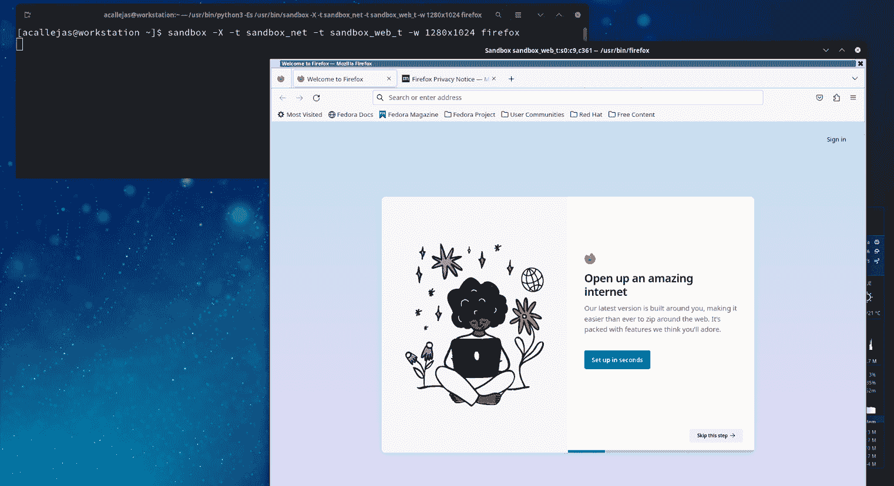

图 6.1 – Firefox 在 SELinux 沙箱中的运行

让我们了解如何*监控沙箱的性能*。

1.  使用**ps**命令查找沙箱的 PID：

    ```
    $ ps auf | grep firefox
    acallej+   30511  0.0  0.9 ...output omitted...
    ```

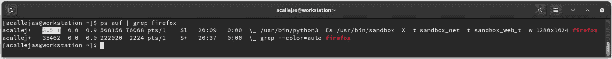

图 6.2 – 查找沙箱的 pid

1.  使用**top**命令监控找到的**PID**的性能：

    ```
    $ top -p 30511
    ```

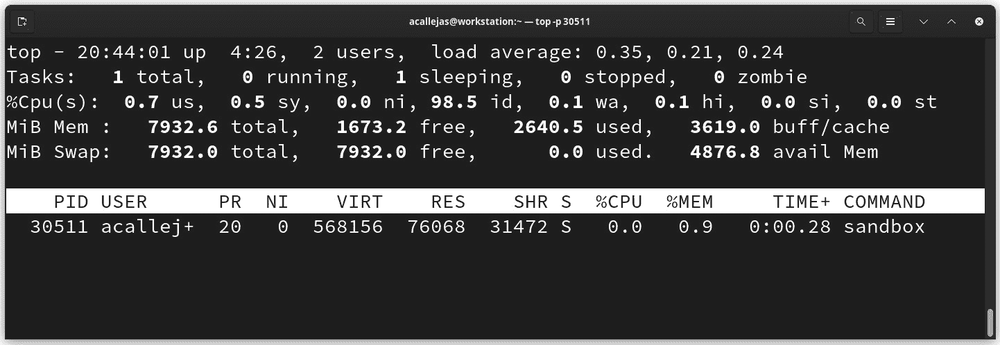

图 6.3 – 监控沙箱性能

网络浏览器被隔离，因此它的行为不会影响系统的其他部分。让我们看看如何验证这一点。

1.  在 Firefox 沙箱中，打开 Fedora 项目主页（[`start.fedoraproject.org/`](https://start.fedoraproject.org/)）：

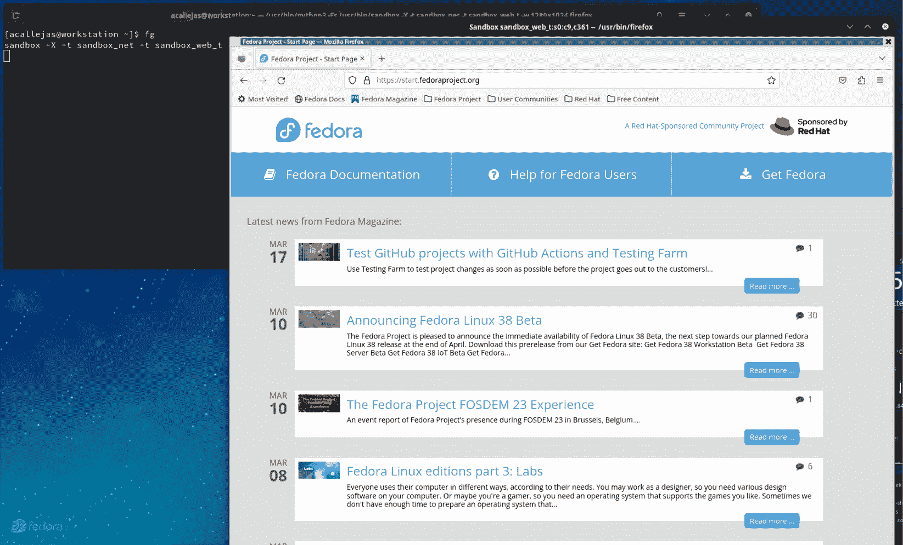

图 6.4 – 使用 Firefox 沙箱进行浏览

通过点击 Firefox 窗口右上角的**X**按钮来关闭 Firefox 沙箱。

1.  再次在沙箱中运行 Firefox：

    ```
    $ sandbox -X -t sandbox_net -t sandbox_web_t -w 1280x1024 firefox
    ```

    使用 *Ctrl* + *H* 打开浏览历史：

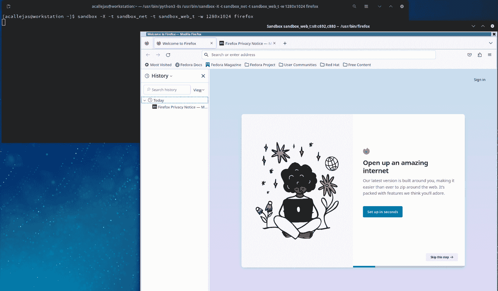

图 6.5 – 检查浏览历史

1.  再次关闭 Firefox 沙箱窗口。

请注意，没有关于访问过的网站的信息被保存。这些信息会保存在一个系统文件中。Firefox 在隔离模式下运行，这些信息存储在沙箱中。当沙箱关闭时，存储在其中的信息会被删除。

SELinux 沙箱有许多实际应用，例如，当一个 *不可信的文件* 需要被打开时。

对于一个 `pdf` 文件，作为示例，在沙箱中运行 `evince` 来阅读它。使用 `sandbox` 命令：

```
$ -i /home/acallejas/findings.pdf).
Note
For more information on the use of the **sandbox** command, refer to the **manual** by running **man sandbox**.
The SELinux sandbox is one of the most basic ways to isolate an application. Using this idea, it is now taken a step further using different frameworks or forms to package the applications to make them portable to different environments, easing their installation.
Let’s look at the most common examples of sandbox applications: **AppImages** and **Flatpaks**.
Diving deep into AppImage apps
Introduced in 2004 as **klik** by *Simon Peter* and renamed in 2011 as **PortableLinuxApp**, it was finally named in 2013 as we know it today: **AppImage**.
**AppImage** is a universal portable distribution format, also known as *upstream packaging*.
AppImages, as portable applications, do not need installation by the user. They also do not need administrator privileges to run. The user downloads the AppImage and assigns it execution permissions, and the application starts.
For a developer, creating AppImages is quite simple. An AppImage consists of a program package with dependency libraries and all the resources it needs during runtime.
AppImages are unique binaries, following the basic principle of *one application =* *one file*.
The tools to generate an AppImage from an **AppDir**. They are aware of possible incompatibilities between distributions and try to avoid them.
Once the AppImage is built, it runs on all major desktop distributions.
Let’s see how to run an AppImage as a user. Then, let’s walk through the development of an AppImage.
Running an AppImage
An AppImage is an image of the application.When you are running it, it mounts on the filesystem in the user space. Just give it *execution permissions* and double-click on it.
AppImages do not have an *application store* from which to download them, but there is a place to find and download hundreds of applications, known as **AppImageHub** ([`appimage.github.io/apps/`](https://appimage.github.io/apps/)).
For example, to download the developer version of **Firefox Nightly** and test new features without installing it, follow the subsequent steps:

1.  Open the Firefox browser and go to [`appimage.github.io/apps/`](https://appimage.github.io/apps/). Press the *Ctrl* + *F* key combination and search for the **firefox** string:

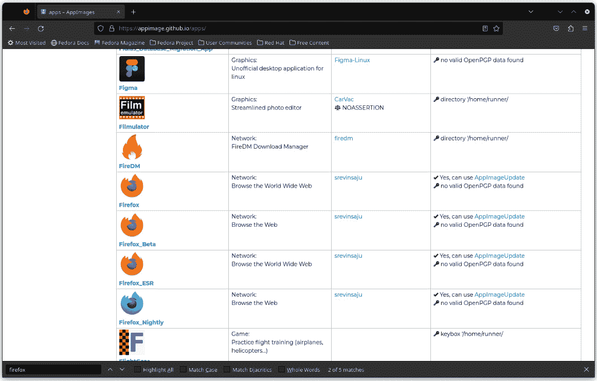

Figure 6.6 – Searching for the Firefox Nightly AppImage

1.  Click on the **Firefox_Nightly** link:

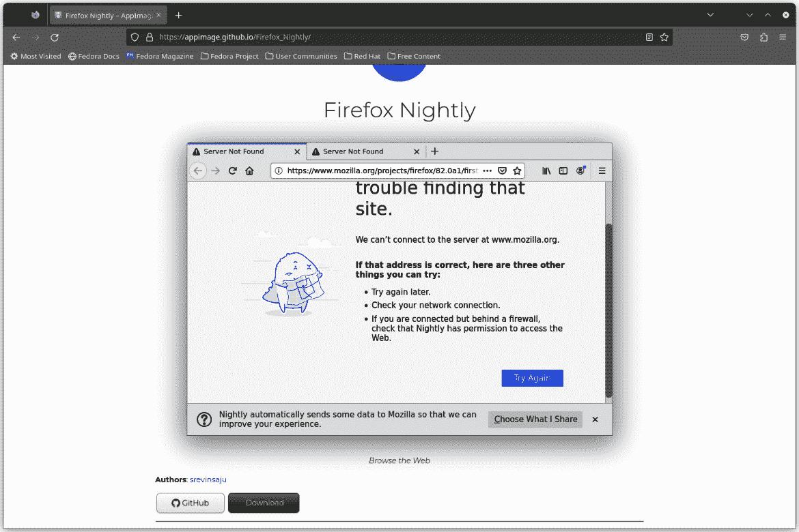

Figure 6.7 – Firefox_Nightly download window
Scroll down and click on the **Download** button.

1.  This button takes us to the GitHub repository where the AppImage resides. Click on the *latest version* to download it:

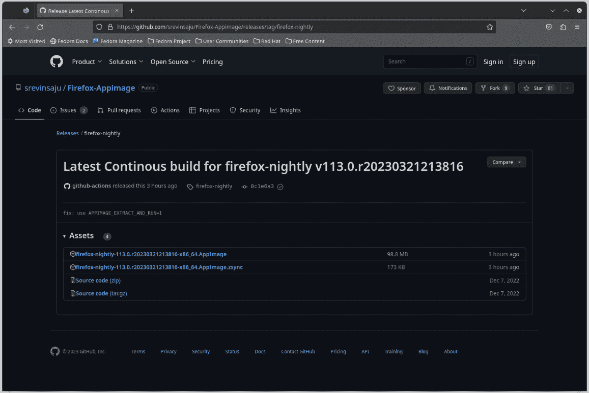

Figure 6.8 – Latest version in AppImage format
Wait for the download to finish.

1.  Open a terminal and switch to the **Downloads** directory. Review the downloaded AppImage by running a long listing. Use the **ls** command:

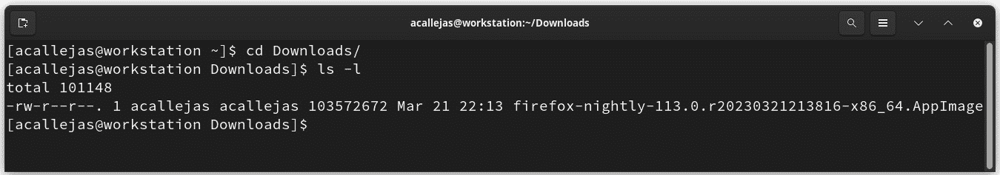

Figure 6.9 – Checking the AppImage

1.  Grant *execution permissions* to AppImage using the **chmod** command:

    ```

    $ chmod +x firefox-nightly-113.0.r20230321213816-x86_64.AppImage

    ```

     2.  Open the file browser and change parent directory to the **Downloads** directory. Right-click on the AppImage icon and click on **Properties**. Verify that the **Executable as program** switch button is enabled:

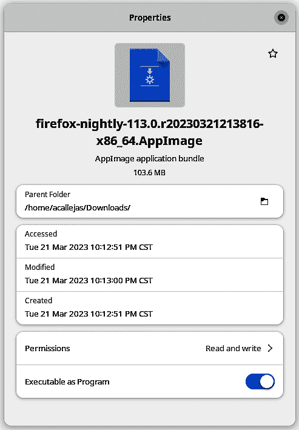

Figure 6.10 – AppImage properties

1.  Close the **Properties** window by clicking on **X** in the upper-right corner.
2.  Double-click on the AppImage icon. The Firefox Nightly window opens:


Figure 6.11 – Firefox Nightly on AppImage
With these simple steps, the application runs without being installed. If we prefer, we could create a *launcher* and add it to the shortcuts of the taskbar.
Let’s see now how to develop AppImages.
Developing AppImages
Developing AppImages is very simple. The **AppImage** project provides **AppImageKit**,  an implementation of the AppImage format focused on the *tiny runtime* of each one.
Note
AppImageKit is available to download at [`github.com/AppImage/AppImageKit/releases/continuous`](https://github.com/AppImage/AppImageKit/releases/continuous).
The core components of AppImageKit are as follows:

*   **runtime**: The runtime provides an executable header for an AppImage. The runtime mounts the filesystem image to a temporary location. Such a filesystem image is called an *AppDir*. It then launches the payload application. Downloading it is not required.
*   **Appimagetool**: This creates the AppImages by embedding the runtime and attaching the AppDir inside it. This tool comes as an AppImage.
*   **AppRun**: This provides the entry point of the AppImage. The runtime executes this file inside the AppDir. It doesn’t need to be a regular file; it could be a symlink to the main binary.

Note
The project adds and deprecates extra tools in the AppImageKit all the time, even those from third parties. So, keep an eye out for updates to the GitHub repository.
To create an AppImage, according to the project documentation, follow these steps:

1.  Download **appimagetool** using the **wget** command:

    ```

    $ wget \

    > https://github.com/AppImage/AppImageKit/releases/download/continuous/appimagetool-x86_64.AppImage

    ```

     2.  Add execution permissions with the **chmod** command:

    ```

    $ chmod a+x appimagetool-x86_64.AppImage

    ```

     3.  To create the AppDir, use a high-level tool such as **linuxdeployqt**. Assuming that the AppDir already has everything needed to run the application, run the **appimagetool** command to generate the AppImage:

    ```

    $ ./appimagetool-x86_64.AppImage some.AppDir

    ```

With this simple procedure, the new AppImage is created and ready to distribute.
Note
For more information on the use of AppImageKit, refer to the GitHub repository at [`github.com/AppImage/AppImageKit`](https://github.com/AppImage/AppImageKit).
So, now we know how to create and use AppImages, it’s time to look at the proposal drawn up by the Fedora Project itself. Let’s take a walk through the **flatpaks**.
Examining Flatpak applications
**First** is one of Fedora’s founding principles, so **Fedora Linux** is always on the *cutting edge*.
Flatpak is a new distribution-independent format for packaging and distributing Linux desktop applications.
The main goals of Flatpak include the following:

*   Create a single installation file that could be distributed to users of all distributions
*   Run applications that are as isolated as possible from the rest of the system

The biggest benefit to users is the ability to run any application, regardless of the version of Fedora Linux they use.
Its development name was `xdg-app` and it was renamed **Flatpak** in 2016 to reflect the fact that it became ready for wider use.
Flatpak is a system for building, distributing, and running sandboxed desktop applications on Linux.
Flatpak applications are installed through the `flatpak` command or through a GUI such as **GNOME Software** or **KDE Discover**.
**Flatpak** introduces some basic concepts, such as the following:

*   **Runtime**: A platform that provides the basic utilities needed for a Flatpak application to run.
*   **BaseApp**: An integrated platform for frameworks such as *Electron*.
*   **Flatpak bundle**: A specific export format for a single file. It contains one application. It is also known as *Flatpak runtime*.
*   **Sandboxes**: Applications build and run in an isolated environment. Only the content of the sandbox can be accessed by the program. Access to other resources, such as processes other than the sandbox, is not possible.
*   **Portals**: The mechanism through which applications interact with the host environment from within a sandbox. It provides interaction with data, files, and services without the need to add permissions to the sandbox.
*   **Repositories**: Flatpak applications and runtimes get stored and published via repositories such as Git repositories, which in some cases are named *registries*.

Let’s now look at the mechanisms for running Flatpak applications, and then we’ll walk a little bit through the development of Flatpak applications.
Using Flatpak applications
Flatpak is installed by default on Fedora desktop variants.
Flatpak applications are *fully integrated* into the operating system’s package manager. We can install them using the graphical interface or the command line.
Let’s first look at the simplest form of installation using the GUI.
Using the GUI
The origin of installable applications might come as a package built on the OS, not sandboxed or built in a sandbox.
For the end user, there is no difference, but it is possible to find out the installation format of an application from the software manager. It is very simple. For example, let’s inspect the format that installed the Firefox browser and its installation options. Follow the subsequent steps:

1.  As a *non-root user*, open the **Activities Overview** menu and click on **Software**:

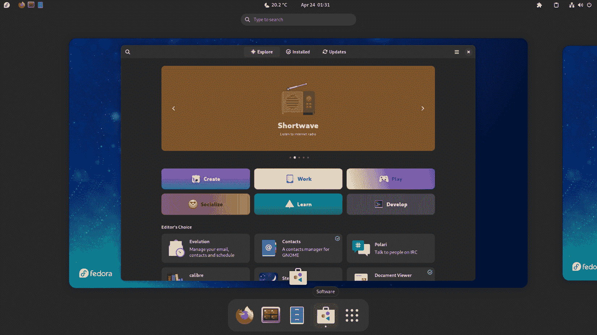

Figure 6.12 – Activities Overview menu

1.  Click on the *search* icon in the upper-left corner. In the search field, type **firefox** and press *Enter*:

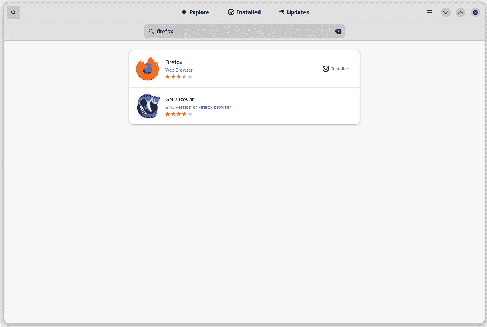

Figure 6.13 – Search for the application
Click on the **Firefox** icon, shown as **Installed**.

1.  Below the **Open** button, find the *installation source*. Click on the drop-down list:

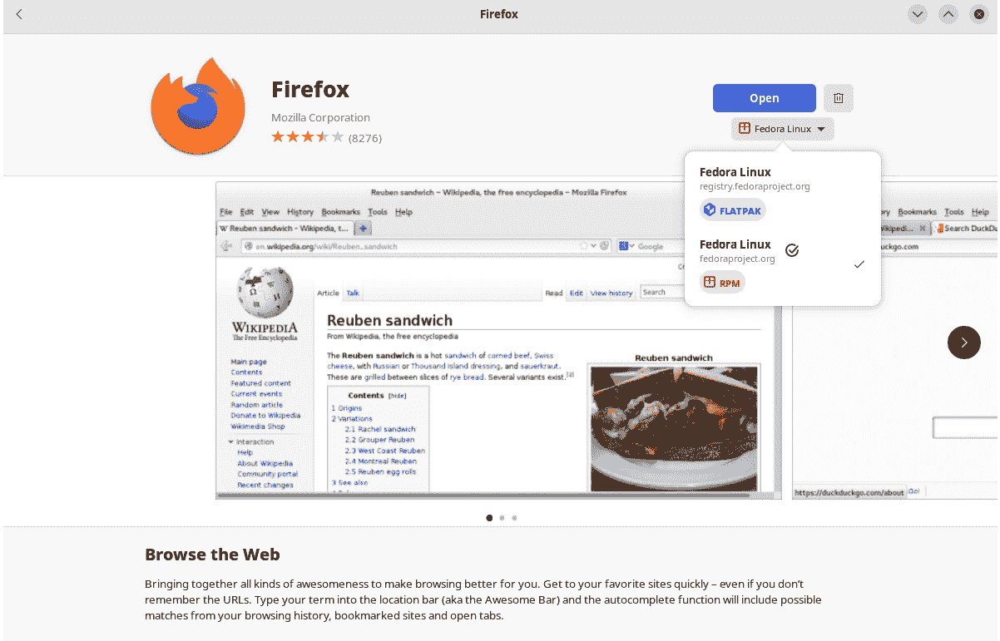

Figure 6.14 – Firefox installation source
Installation options for Firefox include the following:

*   **FLATPAK**: From the official Fedora registry ([registry.fedoraproject.org](http://registry.fedoraproject.org)) as a Flatpak application
*   **RPM**: From the official Fedora repositories ([fedoraproject.org](http://fedoraproject.org)) as RPM

In this case, it shows that Firefox was installed from the official Fedora repositories as a built RPM.
So, to install a Flatpak application with the software manager, just select the installation source.
Let’s install a *digital painting editor* as an example. Follow the subsequent steps:

1.  In the search field of the software manager, type **krita**:

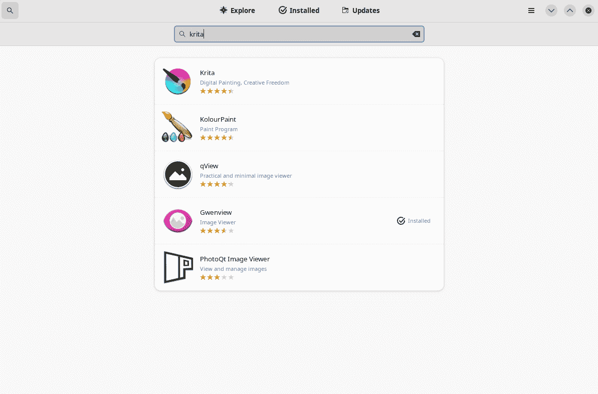

Figure 6.15 – Search for the application
Click on the first result.

1.  Verify the installation source as a Flatpak application. Below the **Install** button, click on the drop-down list:


Figure 6.16 – Verifying the installation source
Choose **Flatpak** as the installation source.

1.  Click the **Install** button. Wait until the installation is complete.
2.  Click the **Open** button:


Figure 6.17 – Open the application
The application opens and is ready for use:
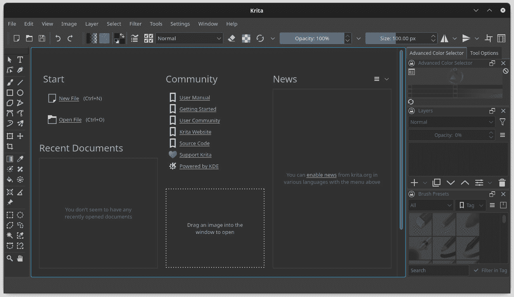

Figure 6.18 – Krita as a Flatpak application
As mentioned earlier, the end user experiences no difference with applications built on `rpm`. Through the command line, it is possible to inspect the resources used and the isolation of the application from the system along with other options such as adding other repositories of Flatpak applications.
Let’s now see how to use the command line to manage Flatpak applications.
Using the CLI
As mentioned in *Chapter 1*, the use of the command line expands the system administration capabilities. Let’s analyze the performance of the Flatpak application installed in the previous section. Follow the subsequent steps:

1.  As a **root** user, open a terminal and use the **ps** command to search for the **xdg-dbus-proxy** and **krita** processes:

    ```

    [root@workstation ~]# ps axf | egrep "krita|xdg-dbus-proxy"

    13340 ?  S   0:00  |   \_ bwrap --args 42 krita

    13359 ?  S   0:00  |       \_ bwrap --args 42 krita

    13360 ?  Sl  0:04 |           \_ krita

    13353 ?  S   0:00 \_ bwrap --args 42 xdg-dbus-proxy --args=44

    xdg-dbus-proxy 是一个用于 *D-Bus* 连接的过滤代理。它是 Krita 应用程序与系统交互的门户。

    ```

     2.  Using the method of the first section of this chapter, track the performance of both processes. Use the **top** command:

    ```

    [root@workstation ~]# top -p 13353,13360

    ```

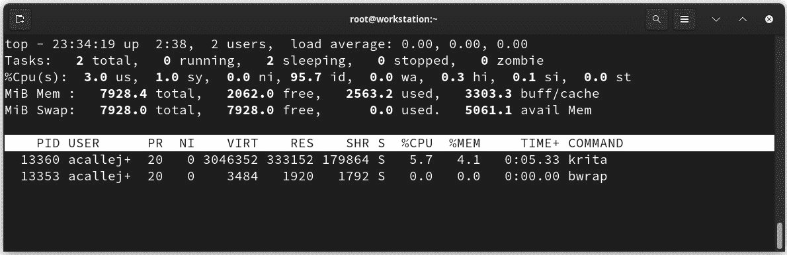

Figure 6.19 – Flatpak application performance
As mentioned at the beginning of this section, `flatpak` comes installed by default in Fedora Linux. It is available as a command to build, install, and run applications and runtimes. It could operate at the local or wide level, as a `root` or *non-root* user.
Let’s start to explore the capabilities of the `flatpak` command line.

1.  Use the **flatpak** command to list the Flatpak applications installed:

    ```

    [root@workstation ~]# flatpak list --app

    ```

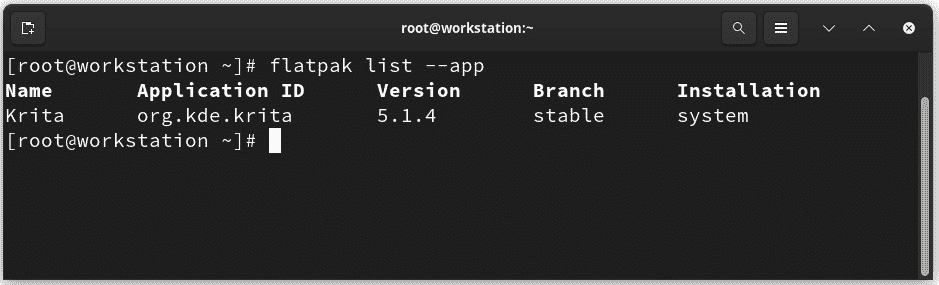

Figure 6.20 – Listing Flatpak applications

1.  To inspect the changes to Flatpak applications on the system, use the **flatpak** command with the **history** option:

    ```

    [root@workstation ~]# flatpak history

    ```

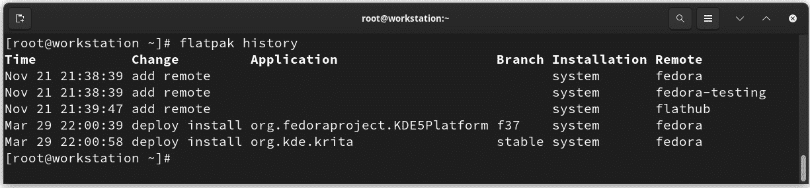

Figure 6.21 – Flatpak history
These changes include installation, update, or removal, covering applications and runtimes.

1.  To show the application details, use the **flatpak** command with the **info** option and the **Application ID** of the application:

    ```

    [root@workstation ~]# flatpak info org.kde.krita

    ```

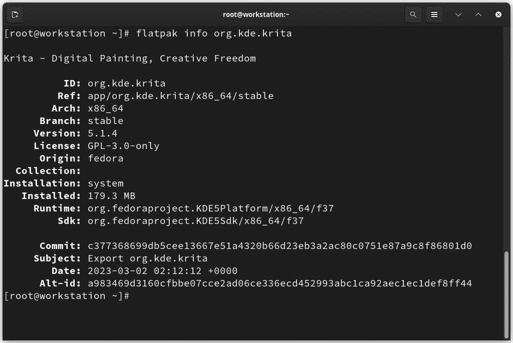

Figure 6.22 – Flatpak application info

1.  To display the running applications, use the **flatpak** command with the **ps** option:

    ```

    [root@workstation ~]# flatpak ps

    ```

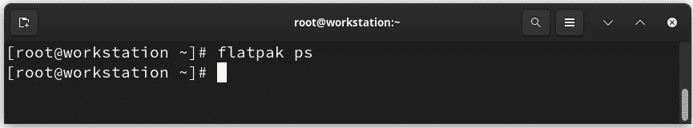

Figure 6.23 – Running Flatpak applications
Observe that the `root` user is not running any Flatpak applications.
Switch to the *non-root* user and run the same command:
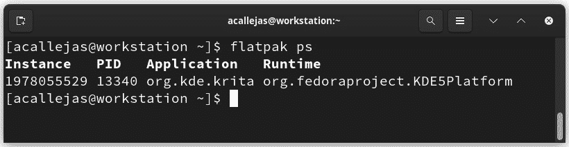

Figure 6.24 – Running Flatpak applications
Let’s now see how we can add Flatpak applications from the command line. But before that, it is important to identify the installation source.
As mentioned before, Flatpak applications in Fedora Linux are set by default and point to the official registry of the distribution.
Through the command line, it’s possible to add other repositories as installation sources and install more Flatpak applications because they are not in the Fedora registry, the version is different, or just to have more installation sources.
Let’s verify the general repository of Flatpak applications as an installation source. Follow the subsequent steps:

1.  As a **root** user, open a terminal and use the **flatpak** command to list the repositories:

    ```

    [root@workstation ~]# flatpak remotes

    ```

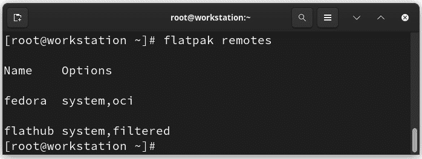

Figure 6.25 – Flatpak repositories

1.  Add more columns to show the details of the repositories. Use the **–** **–****columns=name,title,url,homepage** parameter:

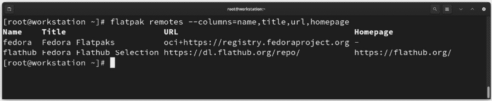

Figure 6.26 – Flatpak application repositories

1.  To list the applications available in a repository, use the **flatpak** command with the **remote-ls** option and the **Name** repository. To avoid *runtimes* and only list the applications, add the **–****app** parameter:

    ```

    [root@workstation ~]# flatpak remote-ls flathub --app

    ```

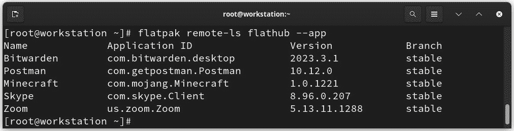

Figure 6.27 – Applications available on Flathub
In *step 1*, *Figure 6**.25* shows that the `flathub` repository appears as *filtered*.
Note
This is true for versions before Fedora Linux 38, where the Flathub filter was removed.
This is because the Fedora Linux configuration points to `Fedora Flatpaks`. `Fedora Flatpaks` is the remote Flatpak repository of the Fedora Project.
The difference is that Flathub makes applications and tools *as accessible as possible*, no matter what distribution they’re used in.
On the other hand, `Fedora Flatpaks` pushes RPMs from the Fedora Project and makes them accessible through Fedora Linux as Flatpak applications.
To have access to all the Flathub applications, let’s add the repository again without restrictions.

1.  Add the **flathub** repository using the **flatpak** command with the **remote-add** option. Add the **--if-not-exists** parameter [to prevent *reg*](https://flathub)*istry overwriting* (the repository URL is [`flathub.org/repo/flathub.flatpakrepo`](https://flathub.org/repo/flathub.flatpakrepo)):

    ```

    # flatpak remote-add --if-not-exists flathub \

    > .org/repo/flathub.flatpakrepo

    ```

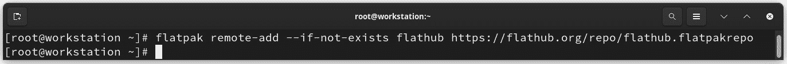

Figure 6.28 – Adding the Flathub repository

1.  List the repositories again using the **flatpak** **remotes** command:

    ```

    [root@workstation ~]# flatpak remotes

    ```

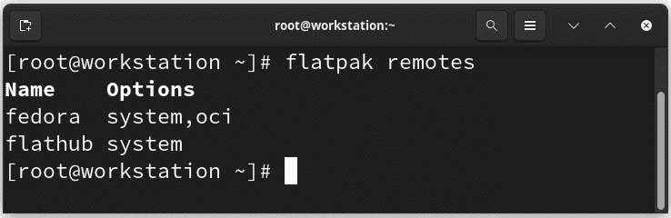

Figure 6.29 – Flatpak repositories
Note that Flathub is no longer *filtered*. Let’s now see what Flatpak applications offer us.

1.  List the applications available in the **flathub** repository. Use the **flatpak remote-ls flathub –****app** command:

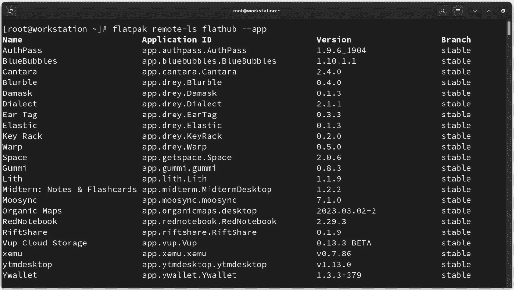

Figure 6.30 – Flathub applications
If we get the number of applications, we find that it has increased:

```

# flatpak remote-ls flathub --app | wc -l

```

*   **2164**

Let’s install an application.

1.  Switch to a *non-root* user and search for the **Telegram Desktop** app. Use the **flatpak remote-ls flathub –app** command and filter the **Telegram** **Desktop** string:

    ```

    $ flatpak remote-ls flathub --app | grep "Telegram Desktop"

    ```

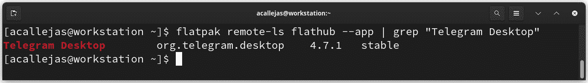

Figure 6.31 – Searching for the Telegram Desktop Flatpak application
Before installing it, let’s get the details of the Flatpak application.

1.  Use the **flatpak remote-info** command with the **flathub** repository option and the **Application ID** from **Telegram Desktop**:

    ```

    $ flatpak remote-info flathub org.telegram.desktop

    ```

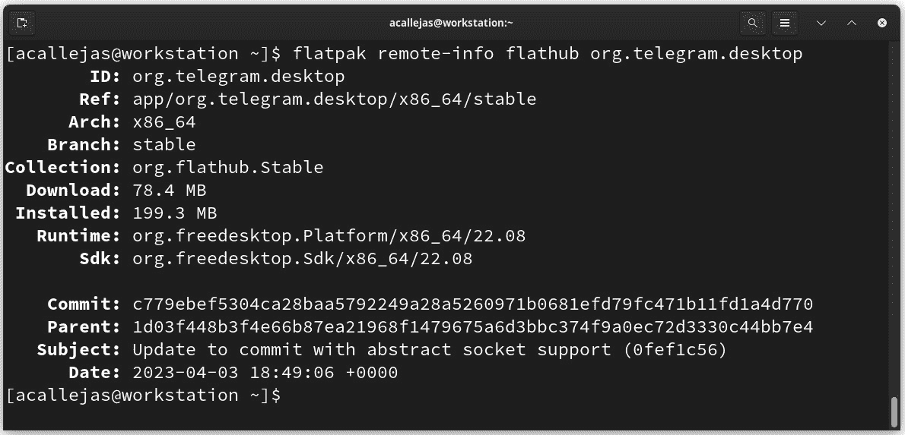

Figure 6.32 – Telegram Desktop info

1.  To install the application, use the **flatpak install** command with the **flathub** repository option and the **Telegram Desktop** **Application ID**:

    ```

    $ flatpak install flathub org.telegram.desktop

    ```

    Here’s the output:

    ```

    正在寻找匹配项…

    org.telegram.desktop/x86_64/stable 所需的运行时 (runtime/org.freedesktop.Platform/x86_64/22.08) 已在远程 flathub 中找到

    您想要安装它吗？[Y/n]：Y 来安装。等待安装完成：

    ```

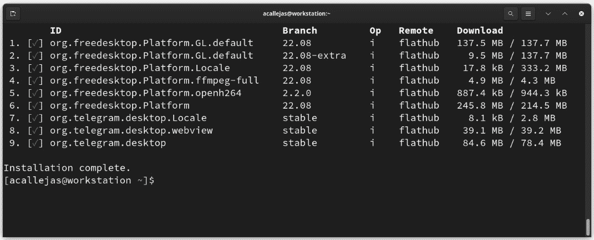

Figure 6.33 – Telegram Desktop installation

1.  Once installed, use the **flatpak run** command with the **Application ID** to run the application:

    ```

    $ flatpak run org.telegram.desktop

    ```

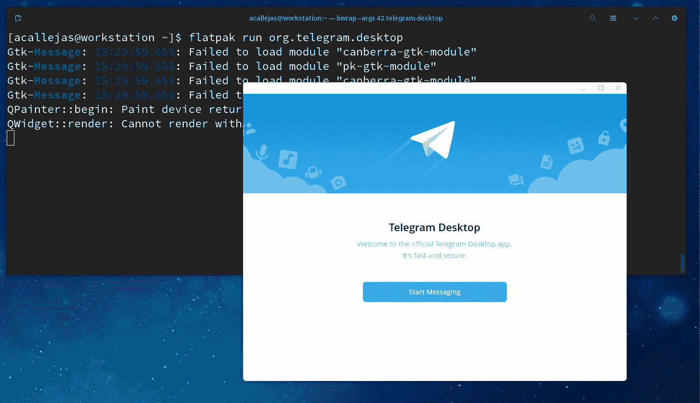

Figure 6.34 – Telegram Desktop Flatpak application

1.  After installation, it is possible to find it in the **Activities** menu and/or add it to **Favorites** to display the icon in the top bar:

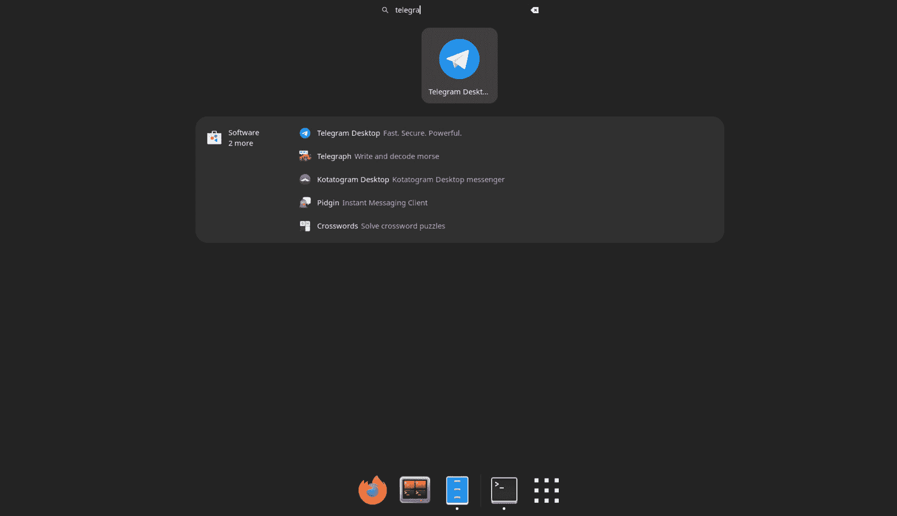

Figure 6.35 – Searching for Telegram Desktop in the Activities menu
Both procedures, graphical and CLI, provide an intuitive way to use Flatpak applications, regardless of the distribution or version installed.
Note
For more information on the use of Flatpak applications, [refer to th](https://docs)e *Using Flatpak* section of Flatpak’s documentation at [`docs.flatpak.org/en/latest/using-flatpak.html`](https://docs.flatpak.org/en/latest/using-flatpak.html).
Now, let’s walk through the process of creating Flatpak applications.
Building Flatpak applications
Building Flatpak applications is relatively simple. As a prerequisite, you must install, as a `root` user, the `flatpak-builder` package, either as an RPM or Flatpak application:

*   RP

    # **dnf** **list flatpak-builder**

*   Flatpak application

    # **flatpak install** **flathub org.flatpak.Builder**

As an example, let’s create a Flatpak application based on a simple `bash` script. To create our Flatpak application, follow the subsequent steps:

1.  Identify the runtime using the **flatpak remote-ls** command with the **-a** (*all*) parameter. To search both runtimes and applications in the **flathub** repository, filter the **freedesktop platform** string to find the latest version. As an optional filter, add a parameter to avoid **translations**:

    ```

    # flatpak remote-ls flathub -a | grep -i \

    > "freedesktop platform" | grep -v translations

    ```

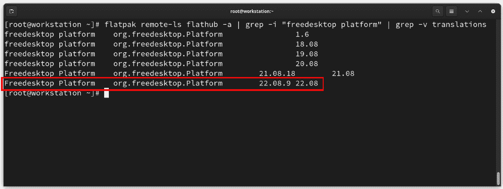

Figure 6.36 – Identifying the runtime
From the preceding figure, we can see that the last version is `22.08`. Next, we’ll search for the same version of the SDK.

1.  Use the **flatpak remote-ls** command with the **-a** (*all*) parameter in the **flathub** repository. Filter the **freedesktop SDK** string and the **22.08** version:

    ```

    # flatpak remote-ls flathub -a | grep -i \

    > "freedesktop SDK" | grep 22.08

    ```

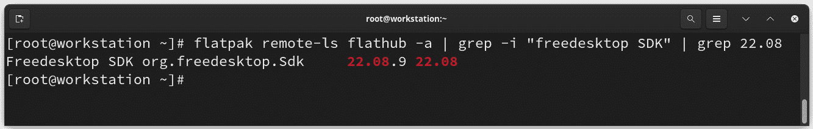

Figure 6.37 – Searching the SDK

1.  Use the **flatpak install** command to install both:

    ```

    # flatpak install flathub \

    org.freedesktop.Platform//22.08 \

    org.freedesktop.Sdk//22.08

    ```

    *   Looking for matches…

        ```

        跳过：org.telegram.desktop/x86_64/22.08 已安装

        ```

    ```

    您想要安装它吗？[Y/n]：Y

    ```

    Wait for the installation to finish:

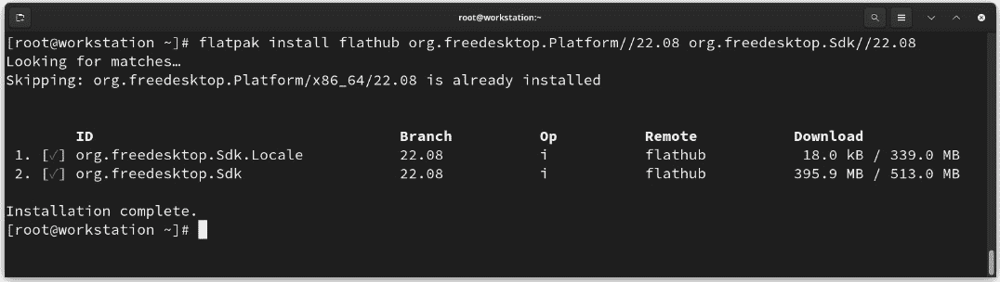

Figure 6.38 – SDK installation

1.  Create a **bash** script. For example, as a *non-root* user, copy the following and save it as **script.sh**:

    ```

    #!/bin/sh

    echo "Hello world, I'm a flatpak application"

    ```

     2.  Add the *manifest*. Each Flatpak application includes a file with basic build information known as the *manifest*. Create a file with the following and save it as **org.flatpak.script.yml** in the same directory as the **bash** script:

    ```

    app-id: org.flatpak.script

    runtime: org.freedesktop.Platform

    runtime-version: '22.08'

    sdk: org.freedesktop.Sdk

    command: script.sh

    modules:

    - name: script

    buildsystem: simple

    build-commands:

    - install -D script.sh /app/bin/script.sh

    sources:

    - type: file

    path: script.sh

    ```

     3.  Build the Flatpak application using the **flatpak-builder** command with the target directory and the *manifest*:

    ```

    $ flatpak-builder build-dir org.flatpak.script.yml

    ```

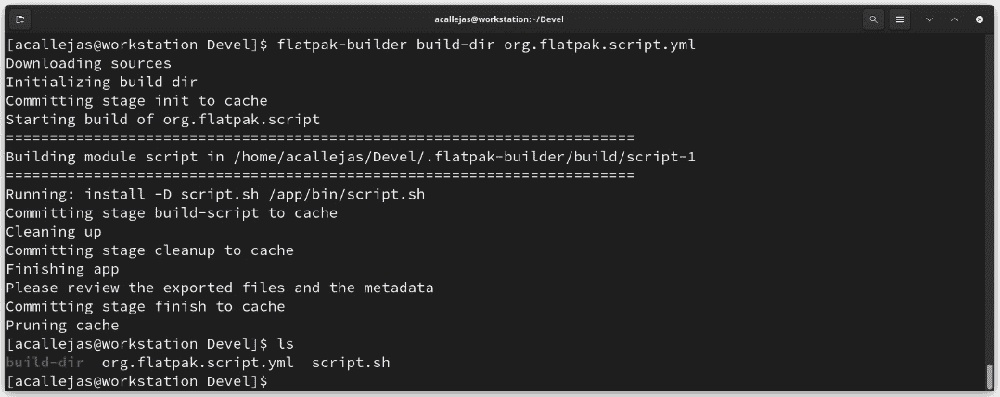

Figure 6.39 – Building the Flatpak application

1.  Install the Flatpak application using the **flatpak-builder** command. Add the **--user** option to install dependencies on the user’s local installation. With the **--force-clean** option, delete the previously created directory. This removes the contents of the directory and creates new build content:

    ```

    $ flatpak-builder --user --install --force-clean \

    > build-dir org.flatpak.script.yml

    ```

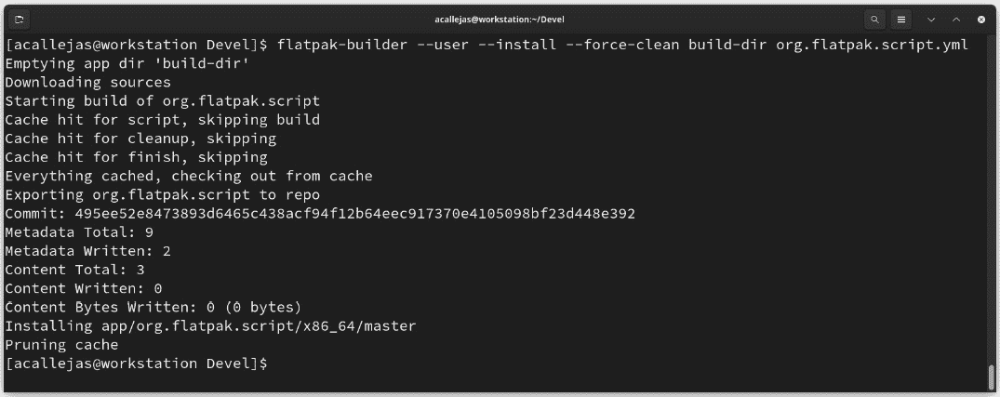

Figure 6.40 – Installing the Flatpak application

1.  Run the Flatpak application using the **flatpak** **run** command:

    ```

    $ flatpak run org.flatpak.script

    ```

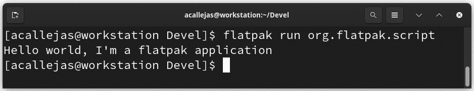

Figure 6.41 – Running the Flatpak application
This way, we have a Flatpak application based on a simple script with all the necessary sandbox and isolation features.
In a more complex case, the *manifest* should include all the necessary dependencies and files, declared as *modules*.
Note
For more information on the build of Flatpak applications, refer to the *Building* section of Flatpak’s documentation at [`docs.flatpak.org/en/latest/building.html`](https://docs.flatpak.org/en/latest/building.html).
This concludes our tour of sandbox applications. In the following chapters, we will discuss the installation options for different applications. Some should be installed via RPM and some others should be available as AppImages or Flatpak applications.
Summary
In this chapter, we learned how sandbox applications work, from a very illustrative example using SELinux and Firefox, to portable application formats widely used today.
We explored AppImage apps, from how to run them to using the AppImageKit to generate AppImages.
Finally, we took a deep look at Flatpak applications, a format that supports the Fedora Project and even maintains its own version of Fedora Flatpaks based on RPMs.
We also learned how to use the command line to extend the administration and use of sandboxed applications.
In the next chapter, we will take a walk through the most popular terminal-based text editors, plus look at some usage tricks and customizations.
Further reading
To learn more about the top[ics covered in this](https://flatpak.org/) chapter, you can visit the foll[owing links:](https://fedoramagazine.org/getting-started-flatpak/)

*   [*Flatpak*: https://flatpak.org/](https://fedoramagazine.org/getting-started-flatpak/)
*   [*Getting*](https://fedoramagazine.org/getting-started-flatpak/) *Started with* *Flatpak*: https://fedoram[agazine.org/getting-started-flatpak/](https://fedoramagazine.org/an-introduction-to-fedora-flatpaks/)
*   [*An introduction to Fedora*](https://fedoramagazine.org/an-introduction-to-fedora-flatpaks/)*Flatpaks*: https://fedoramagazine.org/an-introductio[n-to-fedora-flatpaks/](https://fedoramagazine.org/comparison-of-fedora-flatpaks-and-flathub-remotes/)
*   [*Comparison of Fedora Flatpaks and Flathub* *remotes*: http](https://fedoramagazine.org/comparison-of-fedora-flatpaks-and-flathub-remotes/)s://fedoramagazi[ne.org/comparison-of-fedora-flatpaks-and-flathub-remotes/](https://developer.fedoraproject.org/deployment/flatpak/flatpak-usage.html)
*   [*Flatpak* *Usage*:](https://developer.fedoraproject.org/deployment/flatpak/flatpak-usage.html) https://de[veloper.fedoraproject.or](https://flathub.org/home)g/deployment/flatpak/flatpak-usage.html
*   *Flathub*: https://flathub.org/home

```
