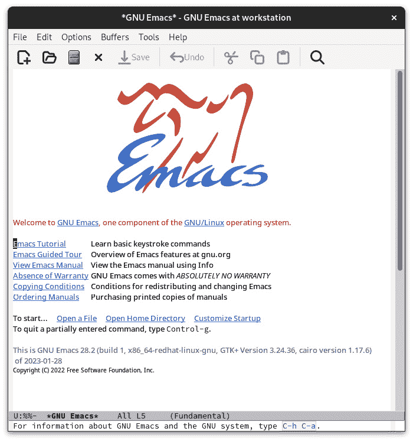
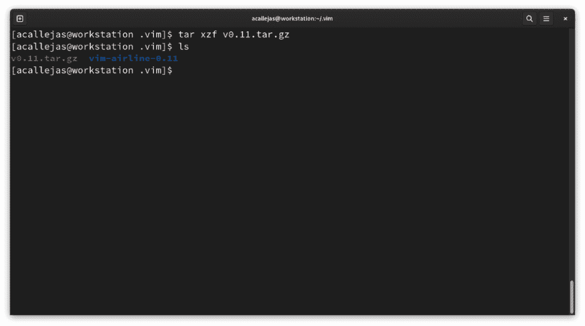

# 7

# 文本编辑器

在 *第一章* 中，我们建议你始终使用命令行来编辑文件。由于实践是提升我们控制台技能的唯一途径，我们应该利用每一个机会来这样做。文件编辑是配置系统时最基本也是最常用的技能。

一些文本编辑器甚至允许我们在操作系统上执行命令。这使我们能够练习这些命令。我们还可以通过安装插件或定制配置来扩展它们的功能。这些修改使我们能够格式化文件、验证语法并执行任务。

除了它们的用途外，我们还将讨论最流行文本编辑器的基本配置技巧和定制。

在本章中，我们将覆盖以下主要主题：

+   文本编辑器和命令行

+   Emacs 概述

+   Nano 基础

+   强大的 Vim

让我们开始吧！

# 技术要求

为了执行本章中提到的配置、定制和示例，需要安装`vim`和`nano`软件包的*基础版本*。`emacs`和其他一些软件包可能需要额外安装。大多数软件包都包含在 Fedora 官方仓库中。

在每个部分，你将看到所需的软件包以及如何安装每一个。

在使用未包含在官方 Fedora 仓库中的软件包或代码时，我们会提供获取链接并附上安装说明。

本章中创建的示例可以在书籍的 GitHub 仓库中下载：[`github.com/PacktPublishing/Fedora-Linux-System-Administration/tree/main/chapter7`](https://github.com/PacktPublishing/Fedora-Linux-System-Administration/tree/main/chapter7)。

# 文本编辑器和命令行

**UNIX** 操作系统具有一些独特的思想和概念，这些思想和概念塑造了其设计。UNIX 是第一个将所有 I/O 操作抽象化并统一概念的操作系统。UNIX 的创始人将这一概念称为**文件**。每个*文件*通过相同的**应用程序编程接口**（**API**）暴露自己。这种抽象化提供了许多优点，例如防止重复代码并提高可重用性。

要读取/写入磁盘、键盘、文档或网络设备，可以使用相同的一组基本命令（例如 `cat`、`more`、`grep`、`sed` 和 `echo` 命令）。

这个原则被概括为：“*一切皆文件*”。

这个基本概念有两个方面：

+   在 UNIX 中，一切皆*字节流*。

    关于文件的引用，称为*文件描述符*，I/O 访问使用相同的一组操作和相同的 API（无论设备类型和底层硬件是什么）。作为字节流，它允许以下操作：

    +   **阅读**

    +   **写入**

    +   **搜索**

    +   **关闭**

+   在 UNIX 中，文件系统充当一个通用的*命名空间*。

    文件不仅仅是具有一致 API 的字节流，它们还可以以统一的方式相互引用。UNIX 文件系统的*路径*提供了一种一致的、全局的资源标签方案，不管它们的性质如何。这个全局命名空间通常被视为*文件和目录的层次结构*。这是一个方便的抽象，文件路径可以指向*几乎任何东西*：一个文件系统、一个设备、一个网络共享或一个通信通道。

这意味着在 UNIX 中，进而在 Linux 中，任何东西都可以作为*文件*在文件系统空间中访问。所有这些的目的是使得不同的工具能够用于不同的事情。

用于更改文本文件内容的工具是文本编辑器。这些文件包含*纯文本*或*源代码*，无论是程序的代码还是文本格式化程序的代码，后者读取输入并生成可打印的输出。

UNIX/Linux 系统上文本编辑器的主要优点是能够在没有图形环境的情况下使用它们，在终端中操作。这个优点使得它们可以在*远程机器*上使用。由于不需要传输整个图形环境，使用文本编辑器可以提高网络的速度。作为系统管理员，你需要像专家一样从终端编辑文件。

`nano` 或 `vim` 是任何 Linux 发行版的基础包。在某些情况下，这些软件包是开箱即用的，还有一些发行版也包含了 `emacs`。

这些软件包实现的是相同的功能（编辑文本文件），但它们以非常不同的方式实现：

+   **nano**：最易于使用，但功能最少。

+   **vim**：学习曲线最陡峭，但一旦掌握，功能强大。

+   **emacs**：使用难度介于 **nano** 和 **vim** 之间。功能强大且可定制。并不总是作为基础包提供。

让我们深入探讨每一个编辑器。我们将从历史上最有分量的一个开始——**GNU Emacs**，由 Richard Stallman 创建。在 Fedora Workstation 中，需要安装它才能使用。让我们先了解一下它的概况。

# Emacs 概述

早期的文本编辑器非常原始，以至于无法打开整个文本文件。为了解决这个问题，文本编辑器变成了一种命令，它能够生成单词并将其写入文件、查找和替换文件中的单词、删除文件中的行等。

以这种方式编辑大型文档可能会变得相当无聊。因此，人们开始开发 **宏** 来执行常见的相关任务。

1983 年，Richard Stallman 发布了一个名为 **Editing Macros** 或简称 **Emacs** 的宏包。当 Stallman 博士启动 GNU 项目时，GNU Emacs 成为了他最成功的应用。

GNU Emacs 是为 POSIX 操作系统设计的文本编辑器。由于它是在现代计算机惯例和术语出现之前开发的，因此通常被认为是复杂的。

然而，GNU Emacs 提供了高效的命令，用于执行常见但复杂的操作，并且有着超过 40 年的插件和配置 *hack* 开发历史。一旦你掌握了 GNU Emacs 的基本使用，它将是一个强大、高效且可定制的编辑器，适用于一生。

最常见的 Emacs 版本是 GNU Emacs。

要在我们的 Fedora 工作站上安装它，可以通过主菜单中的软件应用选择 **RPM** 或 **FLATPAK** 作为安装源，就像我们在 *第六章* 中讲解的那样：


图 7.1 – 安装 Emacs

使用控制台也可以列出可用的插件。切换到 `root` 用户并运行以下命令：

```
# dnf list emacs*
```


图 7.2 – Emacs 和插件

列出并统计插件，总数不到 100 个：

```
# dnf list emacs-* | wc -l
85
```

按照你喜欢的方法安装 GNU Emacs，我们从基础开始。

## 基础知识

一开始，程序的可用性看起来似乎很复杂。但这只是因为它是在另一个时代创建的，所以稍有不同。按照这些指示开始适应用户界面吧。

在搜索框中打开 `Emacs`：


图 7.3 – 从菜单中打开 Emacs

作为 *非 root* 用户，也可以通过终端使用 `emacs` 命令打开：

```
$ emacs
```

在这两种情况下，**GNU Emacs** 窗口都会打开：



图 7.4 – GNU Emacs

在欢迎屏幕上，第一个链接，**Emacs 教程**，将带你进入应用程序的帮助教程：


图 7.5 – Emacs 教程

你可以通过按键组合返回该界面，随时需要时都可以。

大多数按键组合使用 *Ctrl* 键，并结合其他所需的按键组合。例如，打开教程时，按键组合是 *C-h* + *C-t*，意味着先按 *Ctrl* 键加 *h* 键，再按 *Ctrl* 键加 *t* 键；也就是你可以按住 *Ctrl* 键，先按 *h* 键，再按 *t* 键。

在某些情况下，*Alt* 键也用于按键组合。但其表示方法不同，用 *M* 表示。例如，使用 *Alt-x* 组合时，表示方法是 *M-x*。

这是因为 *Alt* 键过去被称为 *Meta* 键。请记住，在 GNU Emacs 开发时，许多当前的术语还没有被使用。

注意

字母 *M* 代表 *Meta* 键，在 x86 计算机上是 *Alt* 键。Emacs 也有其他平台的版本，比如在 macOS 上，*Meta* 键指的是 ** 的 *Cmd* 键。

使用图形界面有助于快速上手 GNU Emacs。菜单中包括了每个任务所用的按键组合：


图 7.6 – GNU Emacs 菜单

以下表格展示了最常见的任务及其相应的按键组合：

| 文件操作 |
| --- |
| 打开文件 | `C-x C-f` |
| 保存文件 | `C-x C-s` |
| 另存为 | `C-x C-w` |
| 关闭文件 | `C-x C-k` |
| 退出 | `C-x C-c` |
| 复制与粘贴 |
| 剪切 | `C-w` |
| 复制 | `M-w` |
| 帮助 |
| 显示所有快捷键绑定 | `C-h b` |
| 教程 | `C-h C-t` |

表 7.1 – GNU Emacs 常见的键盘组合

GNU Emacs 非常灵活，且在没有图形界面的终端中运行。这使得它成为系统管理中的一个必不可少的工具。

现在，让我们来看一下 GNU Emacs 的高级用法概述。

## 精通 GNU Emacs

乍一看，GNU Emacs 看起来像是一个非常复杂的文件编辑方式，因为它使用的键盘组合与其他文本编辑器不同。但对于系统管理员的日常任务，从终端运行时，GNU Emacs 是一个强大的解决方案。

让我们通过一个小示例来概览一下这个过程。按照以下步骤操作：

1.  在终端中通过运行 **emacs** 命令并带上 **--no-window-system** 参数来打开 **GNU Emacs**：

    ```
    $ emacs --no-window-system
    ```


图 7.7 – 终端中的 GNU Emacs

1.  从启动屏幕，浏览到要修改的测试文件。

1.  按下 *Ctrl* 键加 *x* 键 (*C-x*) 进入命令模式，然后按 *Ctrl* 和 *f* 键 (*C-f*) 查找要编辑的文件。按 *Tab* 键显示目录的内容：


图 7.8 – 查找要编辑的文件

1.  要编辑的文件是 **test** 文件。在底部的 **查找文件** 中输入 **test** 来打开该文件。


图 7.9 – 打开测试文件

注意

前面提到的文件可以在本书的 GitHub 仓库中找到，链接：[`github.com/PacktPublishing/Fedora-Linux-System-Administration/tree/main/chapter7`](https://github.com/PacktPublishing/Fedora-Linux-System-Administration/tree/main/chapter7)。

这个 `test` 文件是 `/etc/group` 和 `/etc/passwd` 文件的组合。


图 7.10 – 测试文件

1.  假设你需要查看 **test** 文件中两个文件的内容。在其中一个文件结束的地方，分割屏幕并在它们的内容之间移动。

    要分割屏幕，按下 *Ctrl* 键加 *x* 键和 *2* 键 (*C-x-2*)：


图 7.11 – 分割屏幕

1.  在 Emacs 中，**缓冲区**包含一个进程或一个文件。**窗口**是缓冲区的视图。**框架**是桌面窗口。

    以下图示展示了这些概念：


图 7.12 – 缓冲区、窗口和框架

这意味着我们将框架分割成两个窗口。每个缓冲区都编辑同一个 `test` 文件。

如果需要，每个缓冲区可以打开不同的文件，分割框架为更多的水平和垂直窗口，或者打开其他框架。

1.  要更改缓冲区，按 *Ctrl* 键和 *x* 键加 *o* 键 (*C-x-o*)。

1.  通过在文件内容中添加一行加号（**+**）来分隔内容。通过按 *Ctrl* 键和 *x* 键（*C-x*）加上 *Ctrl* 键和 *s* 键（*C-s*）来保存文件。


图 7.13 – 保存更改

1.  通过按下 *Ctrl* 键和 *x* 键（*C-x*）加上 *Ctrl* 键和 *c* 键（*C-c*）来退出保存的文件。

下表显示了高级任务及其对应的键组合：

| 文本选择 |
| --- |
| 开始选择 | `C-`*<空格>* 或 `C-@` |
| 取消选择 | `C-g` |
| 撤销 |
| 撤销 | `C-/` 或 `C-x-u` |
| 惊慌！ |
| 取消正在进行的命令或操作 | `C-g` |
| 复制和粘贴 |
| 粘贴 | `C-y` |
| 光标后剪切行 | `C-k` |
| 光标后剪切单词 | `M-d` |
| 导航 |
| 上一行 | `C-p` |
| 下一行 | `C-n` |
| 后退一个字符 | `C-b` |
| 后退一个单词 | `M-b` |
| 前进一个字符 | `C-f` |
| 前进一个单词 | `M-f` |
| 转到行首 | `C-a` |
| 转到行末 | `C-e` |
| 框架、窗口和缓冲区 |
| 垂直分割 | `C-x-3` |
| 水平分割 | `C-x-2` |
| 无分割 | `C-x-1` |
| 移除窗口 | `C-x-0` |
| 访问其他窗口 | `C-x-o` |
| 打开新框架 | `C-x-5-2` |

表 7.2 – GNU Emacs 高级键组合

现在让我们看看如何为文本编辑器添加增强功能。

### GNU Emacs 的动力

GNU Emacs 具有一些基本特性。并非所有实现，但是已经构想：

+   *它有很多插件*。并非所有文本编辑器都有插件，也并非所有都需要插件。有时唯一需要的功能是简单性。对于每天使用几小时的文本编辑器，插件提供了宝贵的增强和改进。

+   *它是一个可定制的环境，可以成为一个完整的桌面环境*，例如，跟踪项目、任务和事件，组织电子邮件和聊天，管理远程服务器。

+   *提供强大和灵活的键组合和可为* *特定模式* *配置的键映射。

+   *环境的每一个方面都是可定制的*。它允许修改所有应用程序的用户界面：帮助系统，文件和工作区选项卡，以及用户界面元素的字体和颜色。

通过 GNU Emacs 安装这些增强功能。按照以下步骤进行：

1.  通过按下 *Meta*（*Alt*）键和 *x* 键列出 GNU Emacs 中的可用软件包。进入软件包命令模式，窗口底部显示 *M-x* 组合键：


图 7.14 – 软件包命令模式

1.  输入 **list-packages** 并按 *Enter* 键：


图 7.15 – 列出的软件包

窗口显示了可安装的软件包：


图 7.16 – 可用软件包列表

1.  要查找一个包，例如，**yaml-mode**，以帮助我们处理 YAML 语法。在列表中，按下 *Ctrl* 键和 *s* 键（*C-s*）。在底部输入 **yaml-mode** 查找所选包：


图 7.17 – 搜索待安装的软件包

注意

这需要安装**emacs-yaml-mode.noarch**软件包才能正常工作。

1.  要查看软件包描述，按下*Meta*（*Alt*）键和*x*键（*M-x*），然后输入**describe-package**。


图 7.18 – 描述软件包

1.  这将窗口水平分割。要切换到*描述窗口*，请按下*Ctrl*键和*x*键，然后按*o*键（*C-x-o*）：


图 7.19 – 描述窗口

1.  通过按下*Ctrl*键和*x*键，然后按*0*键（*C-x-0*）来关闭窗口。

1.  通过按下*Meta*（*Alt*）键和*x*键（*M-x*），然后输入**package-menu-mark-install**来标记**yaml-mode**软件包进行安装。


图 7.20 – 标记待安装的软件包

这将在软件包的左侧添加一个`I`：


图 7.21 – 标记待安装的软件包

1.  要安装软件包，按下*Meta*（*Alt*）键和*x*键，然后输入**package-install-selected-packages**。


图 7.22 – 安装标记的软件包

1.  使用*C-x* + *C-c*退出 Emacs。

    安装过程非常快速。打开一个 YAML 文件，查看软件包的*帮助*菜单和语法：


图 7.23 – YAML 文件

如前图所示，许多软件包和插件可以安装，帮助我们实现特定的功能。

注意

在互联网上，你会找到很多软件包和插件的例子。作为个人推荐，可以查看这个 Reddit 帖子，里面是社区推荐的必备软件包：[`www.reddit.com/r/emacs/comments/w4gxoa/what_are_some_musthave_packages_for_emacs/`](https://www.reddit.com/r/emacs/comments/w4gxoa/what_are_some_musthave_packages_for_emacs/)。

GNU Emacs，尤其是对于新手用户，似乎使用起来非常复杂。这导致了更简单文本编辑器的普及。最受欢迎的文本编辑器之一是**Nano**，它成为了 Fedora Linux 的默认文本编辑器。

现在我们来回顾一下它使用的基本原则。

# Nano 基础

GNU nano 是作为 Pico 文本编辑器的免费替代品设计的，而 Pico 是华盛顿大学的 Pine 电子邮件套件的一部分。

1999 年底，**Chris Allegretta**从**Slackware**转到**Debian**。他想念一个包含**Pine**和**Pico**的软件包。所以，他决定制作一个 Pico 的克隆程序，当时叫做**Tip Isn’t** **Pico**（**TIP**）。

在 2000 年 1 月，TIP 因与另一个名为**tip**的程序发生冲突（该程序包括在许多旧版 Unix 系统中）而更名为**nano**。

2001 年 2 月，nano 获得了 Richard Stallman 的正式 GNU 声明。`nano`也在 2001 年 3 月 22 日达到了第一次生产版本。

要创建新文件，作为*非 root*用户，可以从终端运行`nano`命令：

```
$ nano
```


图 7.24 – Nano 文本编辑器

在窗口的底部任务栏上，有编辑器的帮助命令：


图 7.25 – nano 帮助命令

与`emacs`不同，`nano`使用脱字符符号（`^`）表示*Ctrl*键，因此按下*Ctrl*键和*G*键会显示帮助菜单。要退出，请按下*Ctrl*和*X*键。

注意

有关为什么使用脱字符符号（**^**）表示*Ctrl*，请参考[`retrocomputing.stackexchange.com/questions/10925/why-do-we-use-caret-as-the-symbol-for-ctrl-control`](https://retrocomputing.stackexchange.com/questions/10925/why-do-we-use-caret-as-the-symbol-for-ctrl-control)。

除了*Ctrl*键，`nano`还使用*Alt*键和一些符号作为特定任务命令的一部分。

下表显示了最常见的任务及其对应的快捷键组合：

| 文件管理 |
| --- |
| 显示帮助 | `^G` |
| 退出 | `^X` |
| 保存当前文件 | `^O` |
| 将另一个文件插入当前文件 | `^R` |
| 编辑 |
| 在光标位置插入新行 | `^M` |
| 删除光标下的字符 | `^D` |
| 删除光标左侧的字符 | `^H` |
| 在光标位置插入制表符 | `^I` |
| 对齐当前段落 | `^J` |
| 对齐整个文件 | `Alt+J` |
| 统计单词数、行数和字符数 | `Alt+D` |
| 查找与替换 |
| 查找字符串或正则表达式 | `^W` |
| 替换字符串或正则表达式 | `^\` |
| 重复上次搜索 | `Alt+W` |

表 7.3 – GNU nano 常见快捷键组合

GNU nano 以其*简洁*著称，无论是界面还是使用方式。

另一个文本编辑器，既不如`nano`那么简单，也不如`emacs`那么复杂，就是 vim 编辑器。

让我们逐步了解 Vim 编辑器及其自定义功能。

# 强大的 vim

**Vim**（**Vi IMproved**的缩写）是**Vi**文本编辑器的*增强*版，存在于所有 UNIX 系统中。Bram Moolenaar 在 1991 年推出了第一个版本。

Vim 是一个功能强大的编辑器，提供了许多开箱即用的功能。通过使用插件，可以增加新的功能，使得 Vim 更容易适应特定的工作流程。许多插件专注于常见功能，例如定位文件、提供信息、处理不同的文件语法或 Git 版本控制。

Vim 包含在 Fedora Linux 的基础安装中，尽管不是默认的文本编辑器。要将其更改为默认文本编辑器，可以将其添加到 shell 配置文件中。在 Bash 中，这个文件是`~/.bashrc`或`~/.bash_profile`。

添加以下全局变量，将 vim 编辑器设置为默认编辑器：

```
export VISUAL=vim
EDITOR variable.
A `VISUAL` editor is a full-screen editor such as vim or emacs.
An `EDITOR` editor works without using the terminal’s functionality (such as the old `ed` or `ex` mode of vi).
For example, when invoking an editor through Bash, Bash tries the `VISUAL` editor first. If `VISUAL` fails (because the terminal doesn’t support a full-screen editor), it tries `EDITOR`.
With both variables set to `vim`, grant their use as the default text editor.
Unlike emacs or nano, vim does not use key combinations. The vim editor works in two modes: *Command* and *Insert*. Now let’s review its basic usage.
The basics
The vim modes are essential in its use. To switch between modes, use the *Esc* key. The following figure shows the editing flow for a file with vim:


Figure 7.26 – Vim workflow
To create or open a file with vim, run the `vim` command in the terminal. This opens vim to its splash screen, in command mode:


Figure 7.27 – Vim splash screen
To start typing, and to switch to insert mode, press the *Esc* key and then the *I* key. The screen changes. In the upper-left corner the cursor appears, and in the bottom taskbar, the mode appears as **INSERT**:


Figure 7.28 – Insert mode
After typing, to return to command mode, press the *Esc* key. This clears the mode in the bottom bar.


Figure 7.29 – Command mode
The normal mode contains a command-line mode. Here, a variety of tasks, such as saving or quitting the file, can be run.
To enter command-line mode, press the colon key (`:`) and type the command for the desired task. The following table shows the commands for the most common tasks:

  Save/Quit
 |

  Write buffer
 |
  `:w`
 |

  Quit
 |
  `:q`
 |

  Write and quit
 |
  `:``wq`
 |

  Abandon buffer
 |
  `:``q!`
 |

  Other
 |

  Find down
 |
  `:/[``string]`
 |

  Set numbers
 |
  `:``se nu`
 |

  No numbers
 |
  `:``se nonu`
 |

Table 7.5 – Commands for common tasks
In normal mode, also, file editing tasks can be run. No need to press the colon key (`:`). Just run the command for the editing task needed. The following table shows the most common editing commands:

  Insert
 |

  After cursor
 |
  `a`
 |

  At the end of line
 |
  `A`
 |

  Before cursor
 |
  `i`
 |

  At beginning of line
 |
  `I`
 |

  Open line below
 |
  `o`
 |

  Open line above
 |
  `O`
 |

  Yank word
 |
  `yw`
 |

  Yank line
 |
  `yy`
 |

  Put (paste)
 |
  `p`
 |

  Change
 |

  Word
 |
  `cw`
 |

  Line
 |
  `cc`
 |

  Rest of line
 |
  `C`
 |

  Under cursor
 |
  `s`
 |

  Replace character
 |
  `r`
 |

  Delete
 |

  Word
 |
  `dw`
 |

  Line
 |
  `dd`
 |

  Rest of line
 |
  `D`
 |

  Under cursor
 |
  `x`
 |

  Before cursor
 |
  `X`
 |

  Transpose
 |
  `xp`
 |

Table 7.6 – Commands for editing tasks
Note
Vim includes a *tutor* to learn how to use it. To start the tutor, run the **vimtutor** command.
The flexibility and power of Vim make it an essential tool in system administration.
Let’s now get an overview of the advanced use of Vim.
Mastering vim
For many people, `vim` seems as complex as `emacs`. But in practice, with reference to *Figure 7**.26*, the editing flow is simpler. The only thing to get used to is switching between modes.
As proof of this, let’s use the same example used earlier with `emacs` to edit the `test` file, composed of the contents of the `/etc/passwd` and `/etc/group` files. Follow these steps:

1.  In the terminal, as a *non-root user*, run the **vim** command. To browse for the file, type a colon (**:**) and the letter **e** with a space. Type the letter **t** to browse for the **test** file and then press the *Tab* key. Vim shows in the bottom bar the files whose names begin with **t**:


Figure 7.30 – Browse for the test file

1.  To split the screen, as in **emacs**, type a colon (**:**) and then the **split** command:


Figure 7.31 – Split screen

1.  To switch screens, press the *Ctrl* key plus the *w* key twice (*Ctrl+ww*). Scroll down until you find the plus sign (**+**) characters added in the **emacs** example:


Figure 7.32 – Search for plus characters

1.  Let’s replace these plus signs (**+**) with asterisks (*****). Type a colon (**:**) and type the percent sign (**%**) plus the **s** letter. This indicates to **vim** that this is a substitution. Next, type a slash (**/**) to state the string to be replaced and again another slash (**/**) to type the characters that will replace the original string. Type another slash (**/**) and then the letter **g** to tell **vim** that the substitution must take place *globally*:


Figure 7.33 – Replacing characters

1.  Press the *Enter* key and **vim** performs the substitution. The bottom bar displays a message of the completed task:


Figure 7.34 – Modifying the test file

1.  To save and quit the file, type a colon (**:**) followed by the letters **w** and **q**, and then press the *Enter* key.

Note
On the internet, you can find more commands and advanced uses of **vim**. A very useful resource is the post *50 Useful Vim* *Commands*: [`vimtricks.com/p/50-useful-vim-commands/`](https://vimtricks.com/p/50-useful-vim-commands/).
Pimp my vim
Like `emacs`, Vim expands its capabilities with the installation of plugins and packages, in addition to customizing the interface to provide information or help edit the file. Beyond the look and feel, it adds features that increase the usability of the editor.
Unlike `emacs`, Vim uses a variety of initialization files where settings and customizations are included. Some of the most relevant files are as follows:

*   `:help doc-file-list` to get the complete list.
*   `tags` file used to find information in the documentation files
*   **/****usr/share/vim/vim90/syntax/syntax.vim**

    System-wide syntax initializations

*   **/****usr/share/vim/vim90/syntax/*.vim**

    Syntax files for various languages

*   **/****usr/share/vim/vimrc**

    System-wide Vim initializations

*   **~/.****vimrc**

    Personal Vim initializations

*   `:options` command. A nice way to view and set options.

The file that contains the Vim initializations is `vimrc`. The `vimrc` file is a collection of the following:

*   Configurations
*   Custom commands
*   Custom functions
*   Mappings
*   Plugins

Let’s take a look at some examples of each of them.
Configurations
In normal mode, it is possible to configure Vim to add some features. For example, to add numbers to lines to identify them, type a colon (`:`) followed by `set nu`:


Figure 7.35 – Numbered lines
This setting only remains enabled as long as the editor is open. Closing the editor disables it.
Keep this setting enabled by adding it to the `.``vimrc` file.
These settings could help with syntax while editing the file. For example, when editing YAML files, you could configure the `.vimrc` file in a basic way as follows:

```

set ts=2 ← [1]

set et ← [2]

set ai ← [3]

```

*   [**1**] A tab is two spaces
*   [**2**] Expand tabs
*   [**3**] Auto-indenting

Custom commands
In Vim, we can create custom commands to perform tasks. For example, we could create a command that tells us today’s date in various formats:

*   In the **.vimrc** file, add the following line:

    ```

    :command! TellDate echo call("strftime", [<args>])

    ```

     *   In Vim command mode, run the **TellDate** command as follows:

    ```

    :TellDate "%F"

    ```


Figure 7.36 – Custom date

*   To get the current time, run the **TellDate** command as follows:

    ```

    :TellDate "%H:%M"

    ```


Figure 7.37 – Current time
Custom functions
As seen previously, Vim allows us to run a built-in or custom command from command mode. But it is not limited to one; it could run a set of commands or series of instructions within the same command mode. Or they get written to a file and generated in a running Vim instance (`:source path/to/file`). Some of these files come up as part of the configuration from the `.``vimrc` file.
These scripts use **Vimscript** (also called **VimL**). This **Vim** ex-command subset provides many features that could be expected from a scripting language, such as values, variables, functions, and loops.
It is very common for a script to mix features of a scripting language and raw ex-commands.
The `.vimrc` file includes some files describing functions that extend the capabilities of the text editor. These functions get called using the native Vimscript `let` function, which assigns a value to a variable.
The function structure uses the following syntax:

```

{functionName}() 函数

{some_tasks}

endfunction

```

 The following table shows the most common functions of Vimscript:

  Buffer
 |
  Marks
 |

  Current line number
 |
  `line('.')`
 |
  Position of a mark
 |
  `getpos("'a")`
 |

  `col('.')`
 |
  `setpos("'a",...)`
 |

  `col('$')`
 |
  Position of selection start
 |
  `getpos("'<")`
 |

  Current line as string
 |
  `getline('.')`
 |
  Cursor
 |

  Get line 1
 |
  `getline(1)`
 |
  Moves cursor
 |
  `cursor(line,col)`
 |

  Get lines 1-5
 |
  `getline(1, 5)`
 |
  `cursor(line,col,off,curswant)`
 |

  Next blank line, returns line number
 |
  `search('^$')`
 |
  Returns [bufnum, line, col, off, curswant]
 |
  `getcurpos()`
 |

  Search but don’t move cursor
 |
  `search('^$','n')`
 |
  Date/time
 |
  `strftime('%c')`
 |

   |   |  `strftime('%c', getftime('file.c'))`
 |

Table 7.7 – Vimscript common functions
Mappings
Vim allows us to customize key mappings. It is useful to change the definition of the keys typed on the keyboard. The most common use is to define a sequence of commands for a function key. For example, if want to map the `x` key to the `dd` command to delete lines, in normal mode, in the `.vimrc` file, add the following line:

```

nmap x dd

```

 Mapping applies in four modes: *normal*, *visual*, *selection*, and *operator-pending*.
For help with mapping, commands, and modes, run the following in command mode:

```

:help map.txt

```

 

Figure 7.38 – Mapping help
Plugins
Vim plugins are installed via packages. A Vim package is a *directory* or *repository* that contains one or more plugins that depend on each other. Among its main features are the following:

*   Downloaded as a compressed file and unzipped in its own directory, which avoids it mixing with others and makes it easy to update and remove
*   Contain plugins loaded at startup and others that are only loaded when needed with **:packadd**

The directory recommended to install Vim packages inside is the user’s `.``vim` directory.
To exemplify the process, let’s install the most used plugin: **Vim Airline**.
Vim Airline is a plugin that replaces the standard Vim status line with a useful status bar, and provides useful information about the working file, including the following:

*   Filename
*   Save status
*   File type
*   Encoding
*   Position
*   Word count

**Vim mode**
To install Vim Airline, follow these steps:

1.  In the home directory of the *non-root user*, as the *non-root user*, create the **.****vim** directory:

    ```

    [acallejas@workstation ~]$ mkdir -p .vim

    ```

     2.  Change to the **.vim** directory. Download the Vim Airline package from its repository on GitHub ([`github.com/vim-airline/vim-airline`](https://github.com/vim-airline/vim-airline)):

    ```

    $ cd .vim

    $ wget https://github.com/vim-airline/vim-airline/archive/refs/tags/v0.11.tar.gz

    ```


Figure 7.39 – Download Vim Airline

1.  Decompress the Vim Airline package:

    ```

    $ tar xzf v0.11.tar.gz

    ```



Figure 7.40 – Decompressing the package

1.  Move the Vim Airline version directory as **vim-airline**

    ```

    $ mv vim-airline-0.11 vim-airline

    ```


Figure 7.41 – Renaming a directory

1.  Create the **pack/dist/start** path. Move the **vim-airline** directory into the **pack/dist/start** path:

    ```

    $ mkdir -p pack/dist/start

    $ mv vim-airline pack/dist/start/

    ```


Figure 7.42 – Relocating the vim-airline directory
Vim Airline is a Vimscript version of Powerline ([`github.com/powerline/powerline`](https://github.com/powerline/powerline)) written in Python.
Powerline includes a font with pretty symbols. To get these symbols with Vim Airline, install the patched font.

1.  As the **root** user, or with **sudo** if a non-root user has the privileges, install the **powerline-fonts** package using the **dnf** command:

    ```

    $ sudo dnf install powerline-fonts

    ```


Figure 7.43 – Installing the Powerline font

1.  Switch to the home directory and edit the **.vimrc** file to enable the font use. Add the line **let g:airline_powerline_fonts =** **1**:

    ```

    $ cd

    $ vim .vimrc

    ```


Figure 7.44 – Enabling font usage

1.  Edit the **test** file and check the new status bar:

    ```

    $ vim test

    ```


Figure 7.45 – vim-airline status bar

1.  When changing modes, the bar also changes its color to differentiate between the modes:
    *   This is what it looks like in Insert mode:


Figure 7.46 – Insert mode

*   The following is what it looks like in Command mode:


Figure 7.47 – Command mode
Note
Changing or customizing the color scheme is available. For further reference, visit the **vim-airlines-themes** repository on GitHub: [`github.com/vim-airline/vim-airline-themes`](https://github.com/vim-airline/vim-airline-themes).
This way, the plugin installation and configuration work in our editor.
There are many plugins, some very specialized, that complement Vim, with a similar installation.
Note
On the internet, you’ll find many examples of packages and plugins. As a personal recommendation, visit these posts with specialized recommendations to improve Vim:

*   *5 useful Vim tplugins for* *developers*: [`opensource.com/article/19/1/vim-plugins-developers`](https://opensource.com/article/19/1/vim-plugins-developers)
*   *Top five Vim plugins for* *sysadmins*: [`www.redhat.com/sysadmin/five-vim-plugins`](https://www.redhat.com/sysadmin/five-vim-plugins)

This concludes our walk-through of the text editors. In the following chapters, we’ll make use of them, adding plugins or packages for specialized tasks to help us with the system administration of our Linux systems.
Summary
In this chapter, we learned in depth about text editors, beginning with the fundamental understanding that in Unix/Linux, *everything is a file*. Thus, the use of the terminal as a tool to edit files eases the tasks of system configuration.
We took our first steps in **Emacs**. While it is known to be a very complex editor for novices, we offered a basic guide to get started with it.
We also reviewed the use of **Nano**, the default text editor in several distributions, including Fedora Linux.
We also deep-dived into the use of **Vim**, a well-known and recommended file editing tool for file management.
The decision is up to you, dear reader, to choose an editor of your preference.
In the next chapter, we will review the **LibreOffice** suite and its different programs for creating and editing commonly used file formats.
Further reading
To learn more about the topics covered in this chapter, you can visit the following links:

*   The Linux Documentation Project: Text editors

    [`tldp.org/LDP/intro-linux/html/sect_06_01.html`](https://tldp.org/LDP/intro-linux/html/sect_06_01.html)

*   *9 Best Text Editors for the Linux* *Command Line*

    [`itsfoss.com/command-line-text-editors-linux/`](https://itsfoss.com/command-line-text-editors-linux/)

*   *Linux skills: 9 tutorials to get more from your* *text editor*

    [`www.redhat.com/sysadmin/text-editor-roundup-2022`](https://www.redhat.com/sysadmin/text-editor-roundup-2022)

*   *A beginner’s guide to text editing* *with Emacs*

    [`www.redhat.com/sysadmin/beginners-guide-emacs`](https://www.redhat.com/sysadmin/beginners-guide-emacs)

*   *How to get started with the* *Vi editor*

    [`www.redhat.com/sysadmin/get-started-vi-editor`](https://www.redhat.com/sysadmin/get-started-vi-editor)

```
