# LibreOffice 套件

**GNU/Linux** 支持 *办公套件* 组织的标准化、优化和改进。办公套件是任何行业中最常见的工具之一，其目标是使工作更加实用和动态。办公套件是一组程序，允许你创建、修改、组织、存储、发送、接收、扫描和打印文件。办公套件的基本程序包括文字处理器、电子表格和用于项目的图像和/或演示文稿编辑器。

**LibreOffice** 是一款开源的办公套件。最初名为 OpenOffice，但当 Apache 收购它时，一些用户创建了一个分支，成为了 LibreOffice。

所有发行版和用户都采用了 LibreOffice，加速了其开发。LibreOffice 出现在最流行的 GNU/Linux 发行版中，除了 Flatpak 包之外，其安装非常简单。

本章我们将涵盖以下主要内容：

+   探索 Fedora Linux 上的办公工具

+   适应 Writer 和 Calc

+   创建幻灯片和图像管理

让我们开始吧！

# 技术要求

LibreOffice 默认安装在 Fedora Linux 工作站版本中，我们在*第二章*中安装了该版本。本章的内容开发仅要求你确认是否按照前述章节的步骤操作。如果没有，请确保在 Fedora Linux 工作站上安装 LibreOffice。

本章中创建的示例可在本书的 GitHub 仓库中下载，网址为：[`github.com/PacktPublishing/Fedora-Linux-System-Administration/tree/main/chapter8`](https://github.com/PacktPublishing/Fedora-Linux-System-Administration/tree/main/chapter8)。

# 探索 Fedora Linux 上的办公工具

**Fedora 项目** 并没有开发自己的办公套件，但它提供了一套默认的办公应用程序，旨在具有广泛的吸引力并提供有用的功能。官方软件库包含了 LibreOffice 组件。

除了 LibreOffice，Fedora Linux 还为你提供了安装其他办公套件的可能性，包括模板或字体等附加组件。

在深入了解 LibreOffice 的组件之前，让我们简要了解一下这些软件包。

## WPS Office

**WPS Office** 是一个 *跨平台*（Windows、Linux、Android 和 iOS）生产力套件，适用于计算机和移动设备。它被认为是一个高性能但 *专有* 的解决方案，与 Microsoft Office 兼容且可相提并论。它的 **Writer**、**Presentation** 和 **Spreadsheet** 组件是强大的解决方案，类似于微软的 **PowerPoint**、**Excel** 和 **Word**。

WPS Office 套件由 WPS Office 软件公司生产，WPS Office 软件公司是金山公司旗下的一家公司，金山公司是中国领先的互联网服务和软件公司。它与 Microsoft Office 格式完全兼容，并提供多种语言（超过 10 种）支持的拼写检查器。

在 Fedora Linux 上，它可以通过 Flathub 提供的 Flatpak 包安装。

注意

Flatpak 包附带警告，说明该 Flatpak 包未经 Kingsoft Office Corporation 验证、授权或支持。

## ONLYOFFICE

**ONLYOFFICE Desktop Editors** 是一个开源办公套件，适用于 Linux、Windows 和 macOS，依据**AGPLv3**协议自由分发。它由三个编辑器组成，分别用于文本文件、电子表格和演示文稿，并且与 Microsoft Office 格式本地兼容。

ONLYOFFICE Desktop Editors 提供了连接云平台的可能性，如 ONLYOFFICE、Nextcloud、ownCloud、Seafile、Liferay 和 kDrive，并允许在团队文档中进行协作，包括实时共同编辑、审阅、评论和通过聊天互动。

注意

**Affero 通用公共许可证**是一个*copyleft 许可证*，源自**GNU 通用公共许可证**。它旨在确保在网络上运行的软件能够得到社区的合作，并且增加了一个义务：如果软件提供网络服务，就必须分发该软件。

**自由软件基金会**建议任何在网络上运行的软件都应使用**GNU AGPLv3**许可证。你可以在[`www.gnu.org/licenses/agpl-3.0.html`](https://www.gnu.org/licenses/agpl-3.0.html)找到更多信息。

在 Fedora Linux 上，ONLYOFFICE Desktop Editors 可以通过 Flathub 提供的 Flatpak 包安装。

## Calligra

**Calligra** 是一个由 KDE 创建的办公套件。你无需安装 Plasma 桌面环境即可使用它，因为它在其他桌面环境中也能正常工作，例如使用 GNOME 的 Fedora 工作站。

Calligra 采用 OASIS 开放文档格式作为其原生文件格式。**开放文档格式**（**ODF**）是一种基于 XML 的开源办公应用文件格式，用于包含文本、电子表格、图表和图形元素的文档。

注意

如需了解更多关于**OASIS 开放文档格式**的信息，请参考 [`www.oasis-open.org/committees/tc_home.php?wg_abbrev=office`](https://www.oasis-open.org/committees/tc_home.php?wg_abbrev=office)。

Calligra 的主要组件如下：

+   **Calligra Words**：一个文字处理器，围绕主窗口组织，用于编辑和书写文本，右侧面板提供访问最常用工具的功能。

+   **Calligra Stage**：一个演示文稿编辑器，突出其模板，尽管模板不多，但为定制演示文稿提供了一个良好的基础。

+   **Calligra Sheets**：用于电子表格编辑。如同之前的例子一样，它提供针对特定情况的模板。

+   **Calligra Plan**：一个帮助你组织和层级化任务的工具。

+   **Karbon**：一个支持多页文档和导入 PDF 文件的矢量图形编辑器。

在 Fedora Linux 上，每个组件都可以单独作为 RPM 包或 Flatpak 包进行安装，由 Fedora Flatpaks 提供。

## 字体

Fedora Linux 默认安装了超过 70 种字体。然而，在其软件仓库中，提供了超过 1,000 种字体。要从官方仓库安装更多字体，请按照以下步骤操作：

1.  作为*非 root 用户*，在左上角打开菜单并点击**软件**：

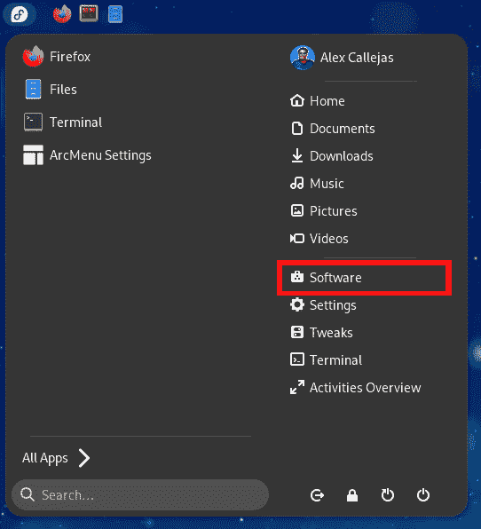

图 8.1 – 打开菜单

1.  点击左上角的搜索图标。在搜索框中输入**fonts**，然后按*回车键*。

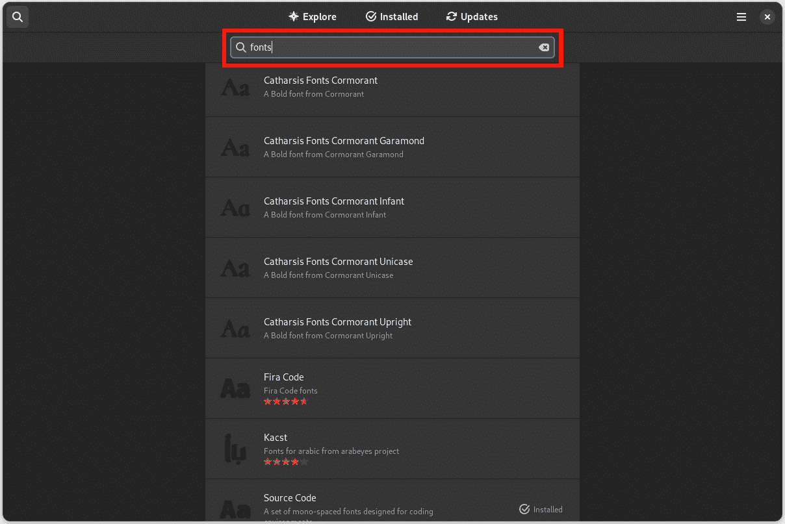

图 8.2 – 搜索字体

1.  选择所需的字体并安装它——例如，搜索字体**julietaula Montserrat Alternates**，然后点击字体图标。点击**安装**按钮：

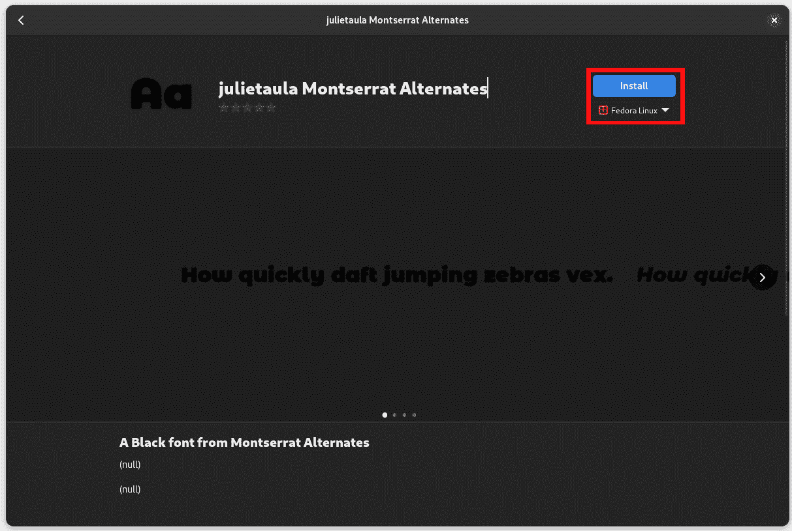

图 8.3 – 安装字体

等待安装完成。

安装结束后，该字体可以在办公套件中使用。

注意

有关**Montserrat 字体项目**的更多信息，请参考其在 GitHub 上的仓库：[`github.com/JulietaUla/Montserrat`](https://github.com/JulietaUla/Montserrat)。

现在我们已经了解了 LibreOffice 的替代选项以及如何安装更多字体，接下来我们来看看 Fedora Linux 的默认办公套件。

## LibreOffice

LibreOffice 是[OpenOffice.org](http://OpenOffice.org)的继任项目，通常被称为**OpenOffice**。

[OpenOffice.org](http://OpenOffice.org)于 2000 年开始，在 Sun Microsystems 发布 StarOffice 5.2 的源代码并允许个人免费使用后。

2010 年，Oracle 公司收购了 Sun Microsystems。这让[OpenOffice.org](http://OpenOffice.org)社区的成员感到担忧，因为 Oracle 对待开源软件的*众所周知的行为*（例如**Java 诉讼案**：[Google](https://en.wikipedia.org/wiki/Google_LLC_v._Oracle_America,_Inc)对 Oracle 提起诉讼）。

同年，[OpenOffice.org](http://OpenOffice.org)社区的成员宣布了文档基金会，这是一个旨在为办公套件的开发提供持续性的*非盈利*基金会。该基金会的主要项目是 LibreOffice，这是[OpenOffice.org](http://OpenOffice.org)的一个分支。

LibreOffice 增加了额外的功能，并通过定期发布和安全更新改善了与 Microsoft Office 的兼容性。

LibreOffice 的主要组成部分如下：

+   **Writer**：一个文字处理器

+   **Calc**：一个电子表格编辑器

+   **Impress**：一个幻灯片编辑器

Fedora Linux 在其软件仓库中包含了 LibreOffice 套件的附加组件：

+   **Base**：一个数据库管理器

+   **Draw**：一个绘图工具

任何已安装的 LibreOffice 组件程序都可以通过搜索栏中的`Libre`访问，如下图所示：

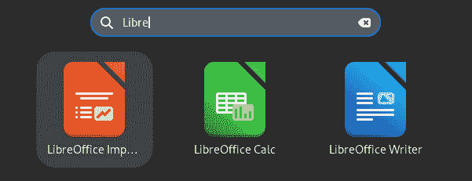

图 8.4 – 搜索 LibreOffice 组件

LibreOffice 组件也在菜单中作为**Office**类别进行分组。要访问它们，请按照以下步骤操作：

1.  作为一个*非管理员用户*，在左上角打开菜单，然后点击**所有** **应用**图标：

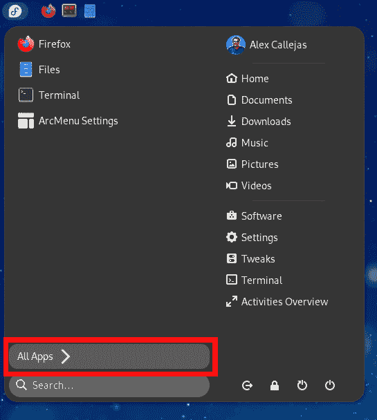

图 8.5 – 菜单中的所有应用

1.  在菜单提供的类别中，点击**Office**类别：

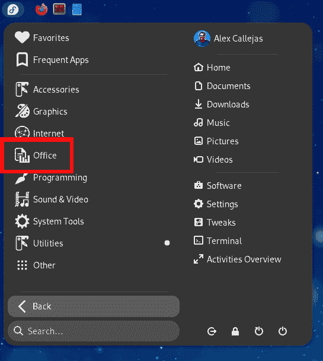

图 8.6 – Office 类别

1.  在**Office**类别中，找到已安装的 LibreOffice 组件：

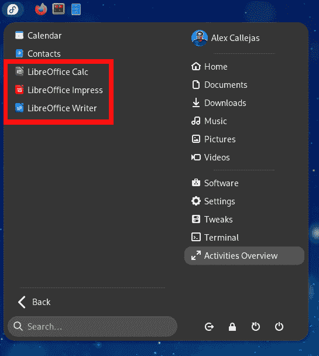

图 8.7 – 安装的 LibreOffice 组件

1.  要访问所需的组件，请点击其图标。

无论哪种访问方式，都可以打开 LibreOffice 组件并使用它们来创建和编辑文档。

让我们更仔细地看看每一个 LibreOffice 组件。

# 适应 Writer 和 Calc

文本编辑器和电子表格是办公套件中最常用的工具。通过它们，关于管理系统的文档得以呈现，我们将在后续章节中讨论**Linux**系统管理时涉及的内容。

让我们来看看这些 LibreOffice 组件的每一个。

## Writer

**LibreOffice Writer**是该套件中的文字处理软件。**Writer**是一个文字处理软件，类似于**Microsoft Word**和**Corel’s Word Perfect**，具有相似的功能和文件格式兼容性。Writer 的默认文件格式是**OpenDocument**（**ODT**），但它也能够打开和编辑 Microsoft Word 文件，如*DOC*、*DOCX*、*RTF*和*XHTML*。

LibreOffice Writer 类似于 Microsoft Word（如下图所示），因为它有许多可以在微软产品中找到的选项。

打开 Writer 来创建或编辑文本文件时，你将看到活动页面以及各种编辑资源。

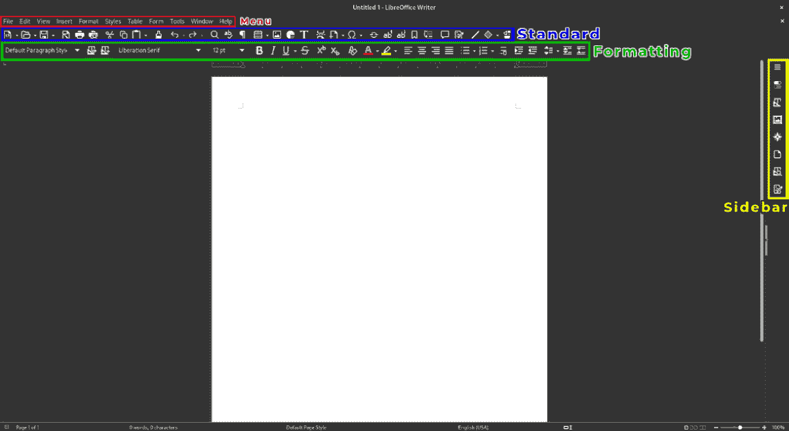

图 8.8 – LibreOffice Writer

编辑资源包括以下内容：

+   一个*菜单*，包含不同的标签：

    +   **文件**，包括打开或关闭现有文档或创建新文档的命令，此外还可以关闭应用程序。

    +   **编辑**，包括编辑活动文档的命令。

    +   **视图**包括显示界面视图和工具栏的命令。

    +   **插入**，包括将元素插入活动文档的命令。这些元素包括*图像*、*来自其他应用的对象*、*超链接*、*注释*、*符号*、*脚注*和*章节*。

    +   **格式**，包括格式化活动文档内容的命令。

    +   **样式**，包括应用、创建、编辑、加载和管理文本文件中的样式的命令。样式有几种类别，如*段落*、*字符*、*框架*、*页面*和*列表*。

    +   **表格**，包含插入、编辑和删除表格及其元素的命令，用于文本文档中。

    +   **表单**包含激活表单设计模式的命令，允许在文档中启用或禁用控件向导或控件表单。

    +   **工具**包含多种工具，包括拼写检查器、修订选项、邮件合并向导和扩展管理器，以及用于配置或自定义程序菜单和偏好的其他工具。

    +   **窗口**包含显示和操作文档窗口的命令。

    +   **帮助**提供访问 LibreOffice *帮助* 资源的途径。

+   各种*工具栏*：

    +   **标准**工具栏在每个**LibreOffice 套件**应用程序中都可用。其功能包括以下内容：

        +   **新建**（文档）

        +   **打开文件**

        +   **保存**和**另存为**

        +   **电子邮件文档**

        +   **编辑模式**

        +   **导出** **为 PDF**

        +   **直接打印文件**和**打印预览**

        +   **拼写**

        +   **剪切**、**复制**、**粘贴**和**克隆格式**

        +   **撤销**和**重做**

        +   **超链接**

    +   **格式**包含多种文本格式化功能。

+   **属性** *侧边栏*：

    +   侧边栏位于活动文档显示区域的左侧或右侧。它提供了*上下文属性*、*样式管理*、*文档导航*和*媒体* *画廊功能*。

上述功能和可访问的命令在 Writer 打开时默认加载，但可以通过启用其他工具栏来添加更多功能和命令。可以通过**视图**菜单下的**工具栏**选项启用这些工具栏：

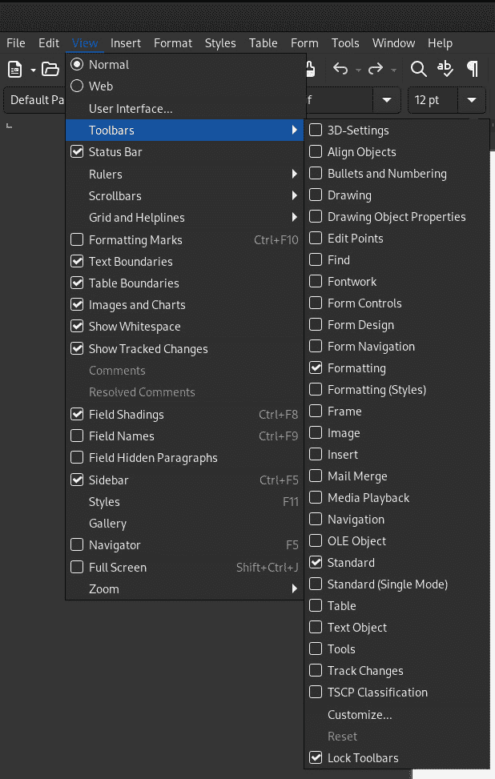

图 8.9 – Writer 中可用的工具栏

注意

有关 LibreOffice Writer 中可用工具栏选项的更多信息，请参阅 **LibreOffice Writer 帮助**，网址为[`help.libreoffice.org/latest/zh-CN/`](https://help.libreoffice.org/latest/zh-CN/)。

Writer 帮助我们在 Linux 系统管理中记录我们的流程。它可以通过多种适用的样式来改善文档。它还可以创建自己的样式和/或更改或自定义现有样式。

让我们来看一个如何在 LibreOffice Writer 中使用样式的例子。

### 在 LibreOffice Writer 中应用样式

在创建文档时，我们会格式化文本和段落以达到特定的外观和感觉。然而，这可能变成一项繁琐且耗时的任务，可以通过应用样式来解决。

LibreOffice Writer 通过应用样式将段落、字符和其他类似元素的格式属性链接起来。这不仅可以创建统一且专业的文档，还能通过计算文档的目录节省时间。

我们以一些小文本为例，命名为`Lorem Ipsum Doc.txt`，你可以在本书的 GitHub 仓库中找到该文件，位于`chapter 8`目录下（[`github.com/PacktPublishing/Fedora-Linux-System-Administration/blob/main/chapter8/Lorem%20Ipsum%20Doc.txt`](https://github.com/PacktPublishing/Fedora-Linux-System-Administration/blob/main/chapter8/Lorem%20Ipsum%20Doc.txt)）。

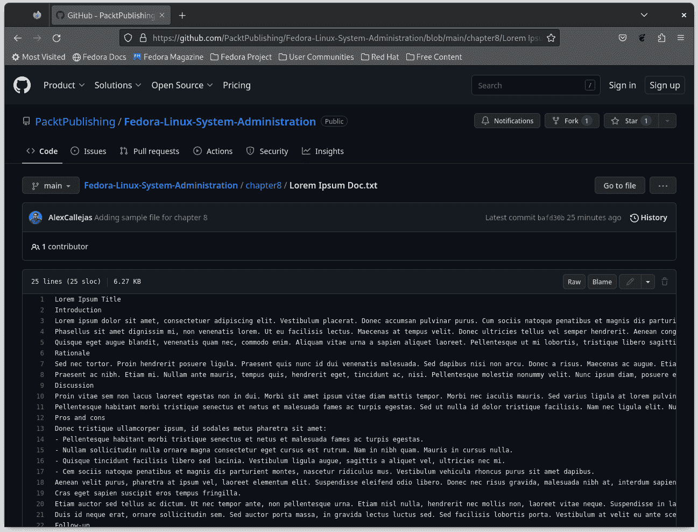

图 8.10 – GitHub 仓库中的示例文本

按照以下步骤为文本应用样式：

1.  打开 LibreOffice Writer。将文本复制到新文件中。将文件保存到一个已知位置，例如**$HOME/Documents**：

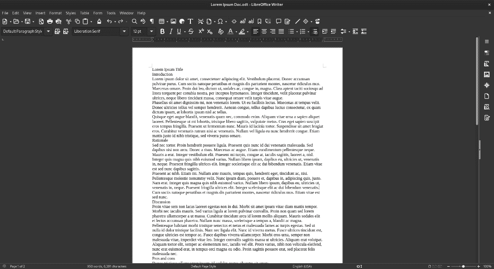

图 8.11 – Lorem Ipsum 文档

注意

为了避免在此练习中高亮显示拼写错误，禁用自动拼写检查。从**工具**菜单中，取消勾选**自动拼写检查**复选框，或者按*Shift* + *F7*键。

1.  增强屏幕上文本的可见性。在**查看**菜单中，点击**缩放**，然后选择**页面宽度**。注意，某些文本部分，如行或单词，似乎与段落分开。这表示段落之间有分隔符：

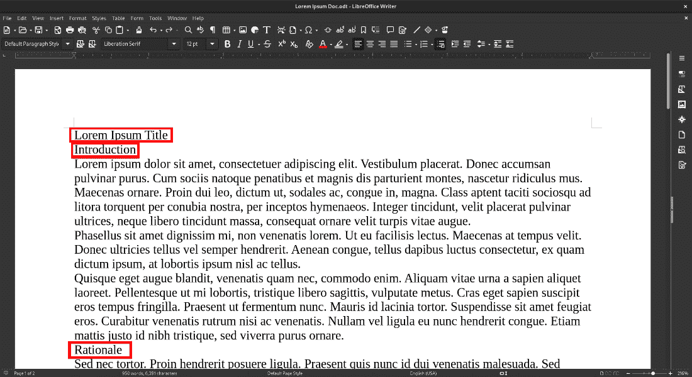

图 8.12 – 段落部分分隔符

在 LibreOffice Writer 中，章节标题称为*标题*。标题按层级顺序排列——一级标题叫做*Heading 1*，二级标题叫做*Heading 2*，三级标题叫做*Heading 3*，依此类推。现在让我们告诉 Writer 示例文本中包含哪些标题和小节标题。

1.  按下*F11*键以显示**样式**侧边栏：

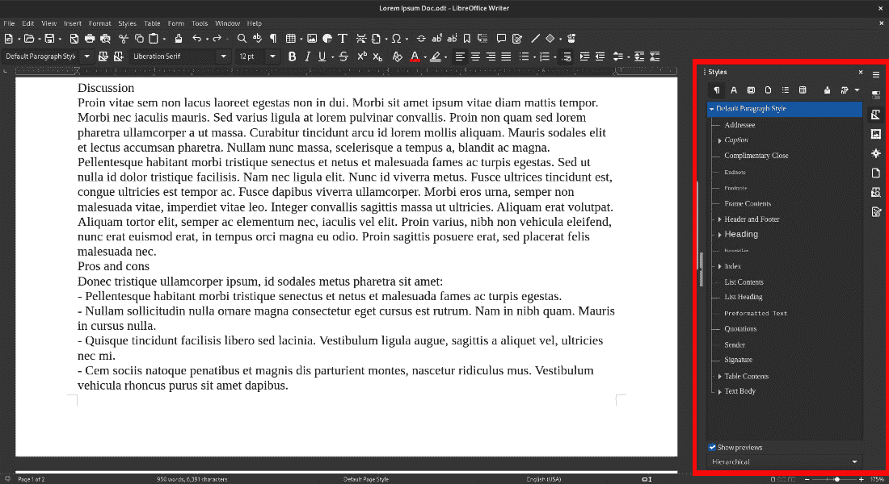

图 8.13 – 样式侧边栏

因为我们将*纯文本*粘贴到文档中，所以重要的是要告诉 Writer 该文本是文档的*正文*。

1.  使用*Ctrl* + *A*键选择所有文本。双击**文本正文**在**样式**侧边栏中的项目：

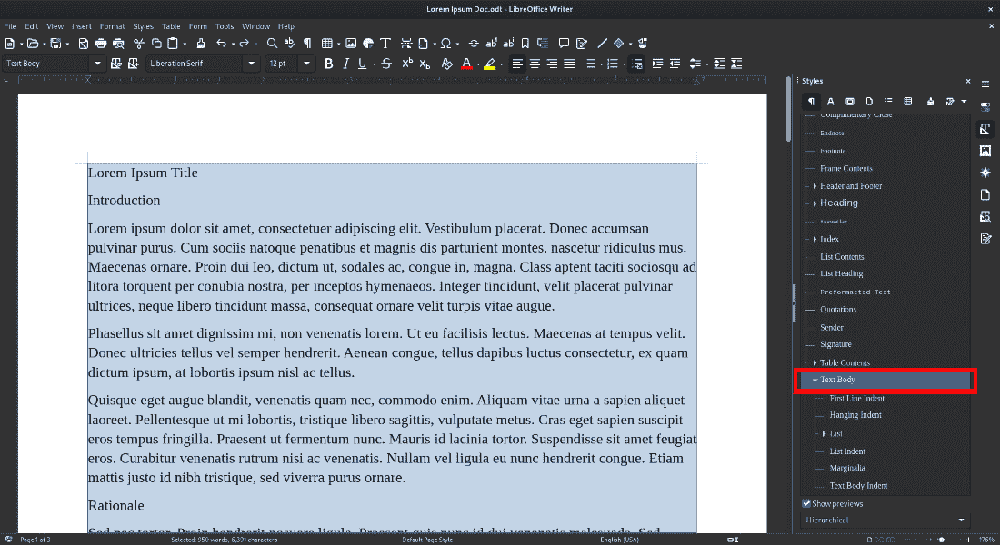

图 8.14 – 应用文本正文样式

请注意，段落会自动分隔，因为该样式在段落之间有**0.10”**的间距。如果你想更改此默认间距，右键单击**文本正文**样式并选择**修改**。然后，在**缩进和间距**选项卡中，修改**下方段落**值，最后点击**确定**按钮。

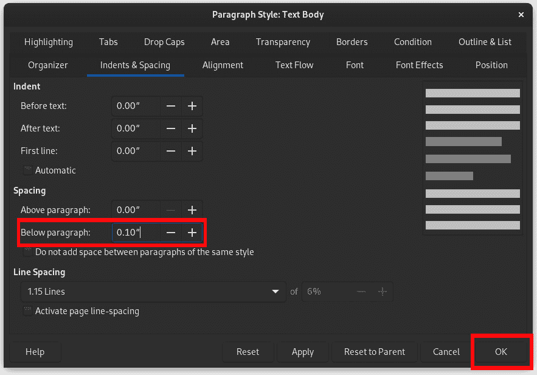

图 8.15 – 修改“下方段落”值

1.  将第一行设置为文档的标题。将光标放在第一行，然后点击**样式**侧边栏中的**标题**部分。双击**标题**。

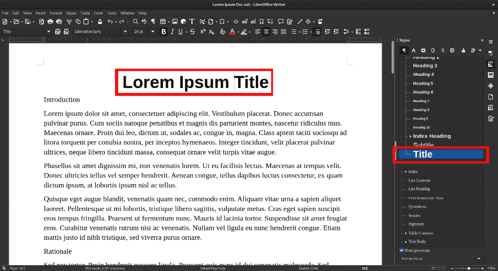

图 8.16 – 格式化标题

现在，格式化文本中的各个章节标题和小节标题。

**引言**、**理由**和**讨论**是*章节标题*。**优缺点**和**后续跟进**是**讨论**章节中的副标题。

1.  将光标放在**引言**行上，并在**样式**侧边栏中双击**标题 1**。

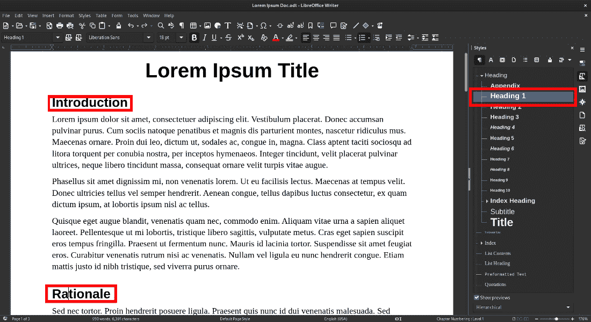

图 8.17 – 应用标题 1 样式

使用*Ctrl* + *1* 键，将光标放在**理由**和**讨论**的文字上，应用相同的样式。

1.  将光标放在**优缺点**上，然后在**样式**侧边栏中双击**标题 2**。然后，在**后续跟进**副标题下添加一句话，并重复此操作，或者使用*Ctrl* + *2* 键。

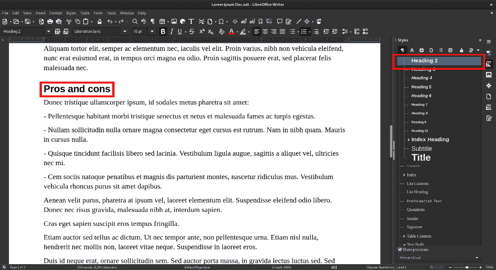

图 8.18 – 应用标题 2 样式

1.  在**优缺点**子部分，一些行以*破折号*（**-**）开头，这意味着这些行构成一个列表。选择这些行，并在**样式**侧边栏中双击**列表 1**样式。此样式为这些行添加缩进，如果你添加更多行，它们将成为列表的一部分。

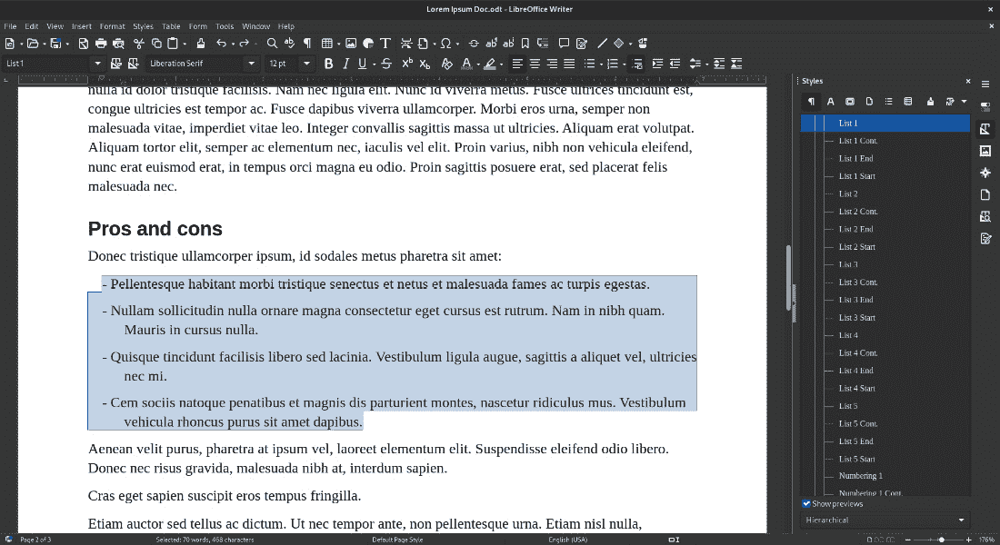

图 8.19 – 创建列表

最后，让我们为格式化后的文档添加*目录*。

1.  将光标放在标题的末尾，按下*Enter*。点击**插入**菜单，选择**目录和索引**。点击**目录、索引或参考书目**。**目录、索引或参考书目**窗口将会出现：

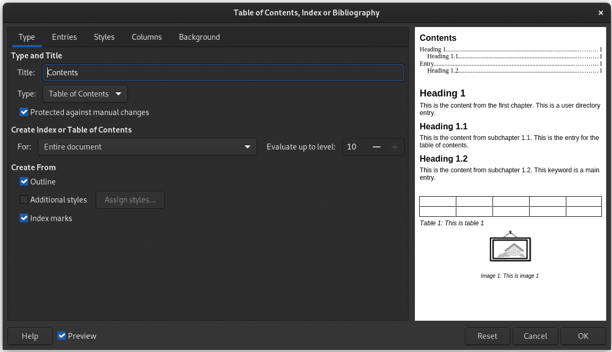

图 8.20 – 目录、索引或参考书目窗口

1.  如有需要，编辑标题。在窗口的选项卡中，对表格的外观进行更改。点击**确定**按钮，将目录插入到文档中，完成示例。

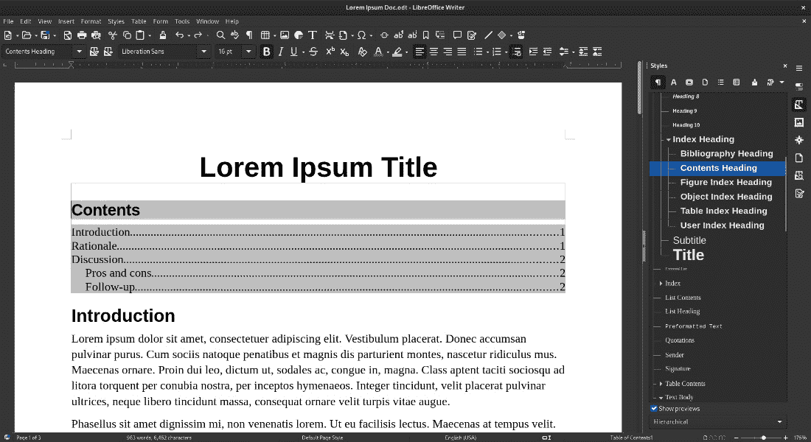

图 8.21 – 添加目录

通过这些简单的样式更改，你可以制作出更专业和统一的文档。所选样式可以自动应用，并且你可以通过右键单击目录并选择**更新** **索引**选项来更新目录。

注意

欲了解更多有关在 LibreOffice Writer 中应用样式的信息，请参阅**文档基金会 Wiki**中的第三方资源，路径为**Writer** | **Libre Office 样式教程**，网址：[`wiki.documentfoundation.org/Documentation/Third_Party_Resources`](https://wiki.documentfoundation.org/Documentation/Third_Party_Resources)。

其他**LibreOffice**组件中的*属性侧边栏*、一些*工具栏*和*应用样式*的过程保持不变。

现在，让我们概览其他组件及其可用编辑工具栏的差异。

## Calc

**LibreOffice Calc** 是该套件的电子表格组件，用于计算、分析和管理数据。它支持导入和修改 Microsoft Excel 电子表格。LibreOffice Calc 的界面与 Microsoft 相应的界面类似：

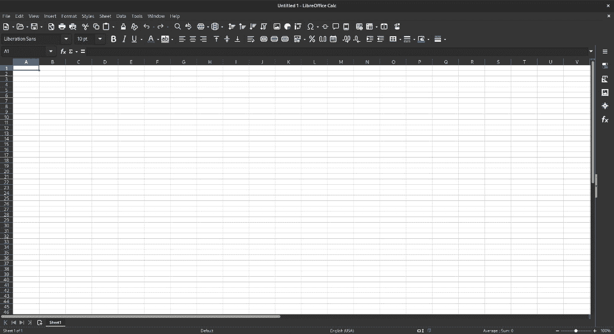

图 8.22 – LibreOffice Calc

它的主要功能包括以下内容：

+   **计算功能**：LibreOffice Calc 提供包括统计函数和银行函数在内的多种函数，用于创建公式并对数据进行复杂计算。它还包括一个**函数向导**，帮助你创建公式。

+   **假设计算**：可视化对由多个因素组成的计算因子进行更改后的即时结果，以及使用不同预定义场景管理大表格。

+   **数据库函数**：使用电子表格组织、存储和过滤数据。LibreOffice Calc 支持从数据库导出数据，支持拖放，或使用电子表格作为数据源，或作为插入的对象在 LibreOffice Writer 中使用。

+   **组织数据**：重新排序电子表格，以显示或隐藏特定的数据范围，根据特殊条件格式化范围，或快速计算小计和总计。

+   **动态图表**：LibreOffice Calc 通过动态图表展示电子表格数据，图表会在数据变化时更新。

+   **打开和保存 Microsoft Excel 文件**：将 Microsoft Excel 文件转换并保存为多种其他格式。LibreOffice Calc 的默认格式是**ODF** **电子表格**（**.ods**）。

LibreOffice Calc 界面与 LibreOffice Writer 界面类似。其主要区别在于，LibreOffice Calc 提供了一个额外的**数据**菜单。**标准**和**格式化**工具栏包括一些*单元格格式化*选项。Calc 还包括一个**公式栏**，可以从中添加*计算公式*：

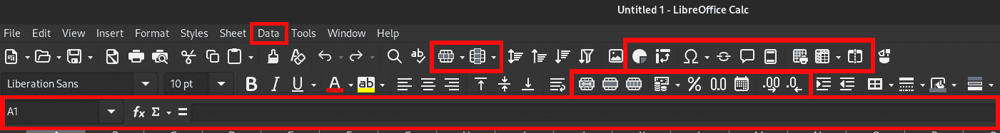

图 8.23 – LibreOffice Calc 界面

让我们来看看**Calc**界面中每个差异的详细信息：

+   **数据**菜单，包含编辑当前工作表数据的命令——即定义范围、排序和过滤数据、计算结果、勾画数据和创建数据透视表：

    +   **插入图表**：在当前电子表格中创建一个图表。

    +   **插入或编辑数据透视表**：使你能够组合、比较和分析大量数据。数据可以根据不同的视角进行组织、重新排序或汇总。

    +   **定义打印区域**：定义电子表格中需要打印的单元格范围。

    +   **冻结行和列**：将活动单元格或列的左上角区域分割，该区域变得不可滚动。

+   **格式化**工具栏包括 Calc 的一些功能，如下所示：

    +   **合并并居中或取消合并单元格，取决于当前的切换状态**：使用这些选项选择相邻的单元格，然后将其合并为一个居中的单元格。相反，大单元格可以拆分为独立的单元格。

    +   **格式化为货币**：单元格将获得在 **工具** | **选项** | **语言设置** | **语言** 中设置的默认货币格式。

    +   **格式化为百分比**：将百分比格式应用于选定单元格。

    +   **格式化为数字**：将默认数字格式应用于选定单元格。

    +   **格式化为日期**：根据 LibreOffice 区域设置，将默认日期格式应用于选定单元格。

    +   **添加或移除小数位数**：向选定单元格中的数字添加或移除小数位数。

+   使用 **公式**栏输入公式。按钮用于访问命令：

    +   **名称框**显示活动单元格的引用、所选单元格的范围或活动区域的名称。

    +   **函数向导**打开向导以帮助创建函数。

    +   **选择函数**从单元格范围中插入一个函数到活动单元格。该函数包括*求和*、*平均值*、*最小值*、*最大值*和*计数*。

    +   **函数**将公式添加到活动单元格中。

注意

有关 **LibreOffice Calc** 中可用的命令和选项的更多信息，请参阅 **LibreOffice 帮助**，网址为 [`help.libreoffice.org/latest/en-US/`](https://help.libreoffice.org/latest/en-US/)。

所有这些电子表格编辑工具有助于我们记录 Linux 系统管理过程，创建和/或编辑管理元素（如服务器、路由器、用户和密码）的清单或数据库。

现在，让我们来看看 LibreOffice 套件中管理幻灯片和图像的组件。

# 创建幻灯片和图像管理

在 Writer 协助下记录过程，以及在 Calc 支持下进行可管理元素的清单编制后，是时候展示我们项目的状态、进展或绩效总结了。帮助我们创建专业演示文稿的 LibreOffice 组件是 **LibreOffice Impress**。

LibreOffice Impress 使我们能够创建专业的幻灯片演示文稿，其中可以包括图形、绘图对象、文本、多媒体和许多其他元素，并且可以导入和更改 Microsoft PowerPoint 演示文稿。

对于屏幕上的幻灯片演示文稿，LibreOffice Impress 包括动画、幻灯片过渡和多媒体播放等功能。

与 Writer 和 Calc 类似，Impress 界面与其微软产品同行 Microsoft PowerPoint 相似。

为数不多的差异之一是在打开 LibreOffice Impress 时发生的。Impress 显示 **选择模板** 窗口：

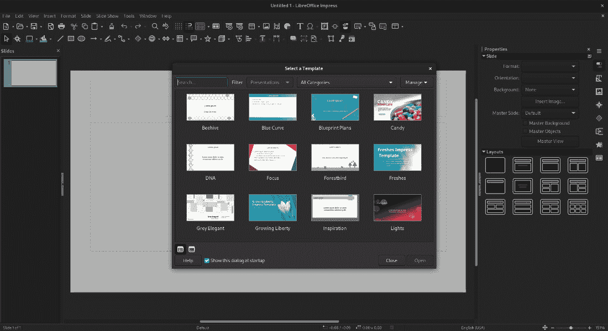

图 8.24 – 打开 LibreOffice Impress

LibreOffice 包含一套内置模板，用于创建文档、演示文稿、电子表格或绘图。通过模板管理器中的可用模板，你可以创建自己的模板或在线搜索额外的模板。

模板通过打开内容和格式已经完成的新文档来节省编辑时间。**模板管理器** 提供对模板的访问和组织功能。

可用模板的预览会出现在模板管理器的*主窗口*中，根据搜索和过滤选项进行显示。双击任何模板图标即可打开一个包含模板内容和格式的新文档。

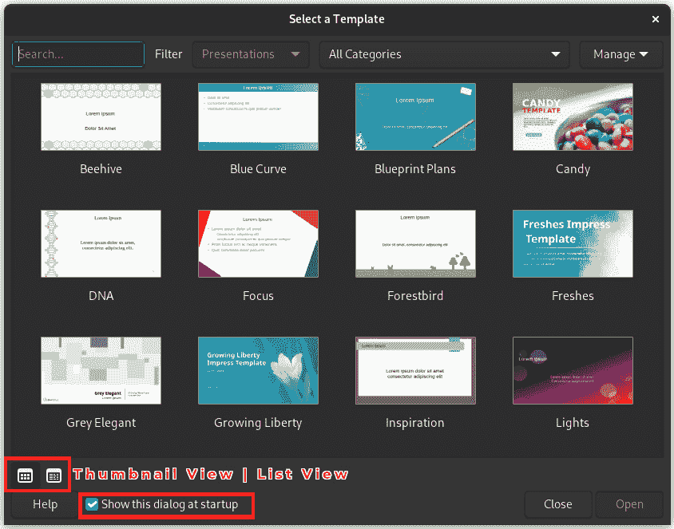

图 8.25 – 模板管理器

在左下角选择 **缩略图视图** 或 **列表视图** 来更改模板的显示方式。

你可以通过点击 **启动时显示此对话框** 复选框来禁用模板管理器窗口的显示。

**Writer** 和 **Calc** 界面之间的主要区别在于 LibreOffice Impress 提供了一些额外的菜单 – **幻灯片** 和 **幻灯片放映**。在 Impress 中，**格式化** 工具栏不会在启动时加载，而是显示 **绘图** 工具栏。它还包括 **标准** 工具栏、访问展示幻灯片的命令和 **演示文稿** 工具栏：

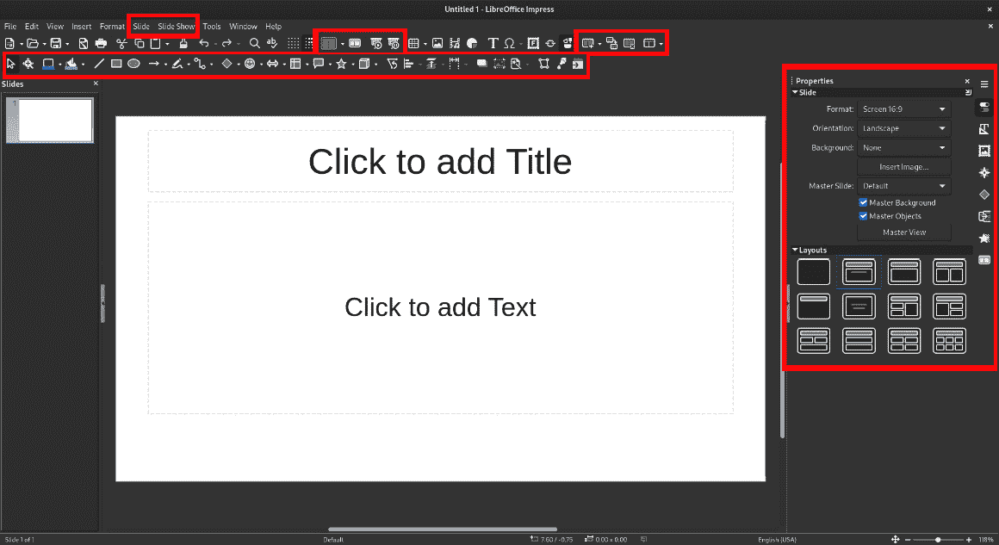

图 8.26 – LibreOffice Impress 界面

**属性** 边栏也有所不同，因为它专注于幻灯片。

让我们来看看 Impress 界面中每个差异的细节：

+   **幻灯片** 菜单提供导航和幻灯片管理命令 – 你可以*创建*、*编辑*、*复制* 和 *删除* 幻灯片，还可以*插入来自* *另一个演示文稿* 的幻灯片。

+   **幻灯片放映** 菜单包含播放演示文稿的命令和选项。包括*开始*幻灯片放映、*定义设置*、添加*计时器*，以及定义*对象交互*、*动画* 和 *过渡效果*。

+   **标准** 工具栏包括 Impress 的功能，例如以下内容：

    +   **显示视图**，在 **编辑模式** 或 **母版模式** 中。

    +   **母版幻灯片** 切换到 **母版幻灯片视图**，我们可以在此添加所需的元素，这些元素将出现在使用相同母版幻灯片的所有幻灯片中。

    +   **从第一张幻灯片开始** 和 **从当前幻灯片开始** 设定展示幻灯片放映的起始点。

    +   使用 **幻灯片** 工具栏按钮来管理幻灯片 – **新建幻灯片**、**复制幻灯片**、**删除幻灯片** 和 **幻灯片布局**。

    +   **绘图** 工具栏包含常用的编辑工具。**绘图** 工具栏在文本文档或电子表格中也可用。可见图标的集合可能会根据活动文档的类型而有所不同。编辑工具包括以下内容：

        +   **选择** 工具（一个*白色箭头*）允许你在活动幻灯片上选择一个对象。

        +   **缩放 &** **平移**

        +   **线条颜色**

        +   **填充颜色**

        +   **插入线条**

        +   **插入不同形状**：基本形状、矩形、椭圆、线条和箭头、符号、块箭头、连接器、曲线和多边形、流程图、标注、星形和横幅、以及 3D 对象

        +   **对象管理**：旋转、对齐、排列和分布

        +   **图像管理**：添加阴影、裁剪、过滤、点和粘接点功能（连接线可设置的点）

        +   **切换挤出**

注意

要了解 LibreOffice Impress 中可用的命令和选项，请参考**LibreOffice 帮助文档**：[`help.libreoffice.org/latest/en-US/`](https://help.libreoffice.org/latest/en-US/)。

LibreOffice 组件帮助我们改进管理系统的文档。在接下来的章节中，我们将使用它们来建立标准化的系统基准。

# 总结

在本章中，我们提供了 Linux 办公套件的概述。它们中的一些已集成到 Fedora Linux 的官方仓库中，我们还添加了一些字体，以帮助我们改善使用办公套件制作的文档的外观和感觉。

我们浏览了 LibreOffice 的主要组件，它们是 Fedora Linux 工作站版本中的默认组件。**Writer**，*文本编辑器*，帮助我们创建流程文档，我们学习了如何为文档应用样式，从而改善文档的外观和组织。

使用**Calc**，*电子表格编辑器*，我们可以创建我们的管理设备的清单和数据库。我们回顾了编辑电子表格的可用工具与文本编辑器之间的主要区别。

最后，我们学习了如何使用**Impress**制作我们的文档幻灯片。我们还讨论了它的编辑工具与 LibreOffice 其他组件之间的区别。

在接下来的章节中，我们将回顾邮件客户端和浏览器，结束 Fedora Linux 提供的生产力工具之旅。这些工具将帮助我们使用 Linux 系统组织管理过程的文档。

# 进一步阅读

要了解更多本章中讨论的主题，您可以访问以下链接：

+   *Fedora 的办公套件*：[`flylib.com/books/en/1.303.1.85/1/`](https://flylib.com/books/en/1.303.1.85/1/)

+   *Fedora 杂志* – *日常需求应用第二部分：办公* *套件*：[`fedoramagazine.org/apps-for-daily-needs-part-2-office-suites/`](https://fedoramagazine.org/apps-for-daily-needs-part-2-office-suites/)

+   Fedora 文档 – *在* *Fedora 中添加新字体*：[`docs.fedoraproject.org/en-US/quick-docs/fonts/`](https://docs.fedoraproject.org/en-US/quick-docs/fonts/)

+   *LibreOffice* *时间线*：[`www.libreoffice.org/about-us/libreoffice-timeline/`](https://www.libreoffice.org/about-us/libreoffice-timeline/)

+   *LibreOffice* *帮助文档*：[`help.libreoffice.org/latest/en-US/`](https://help.libreoffice.org/latest/en-US/)

+   LibreOffice – *文档/第三方* *资源*: [`wiki.documentfoundation.org/Documentation/Third_Party_Resources`](https://wiki.documentfoundation.org/Documentation/Third_Party_Resources)
