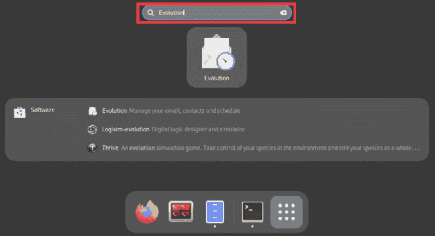
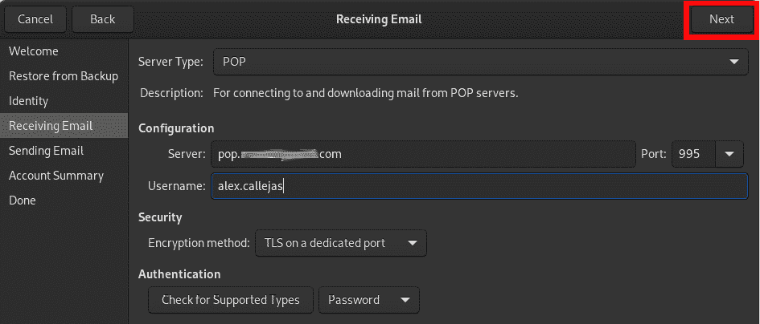
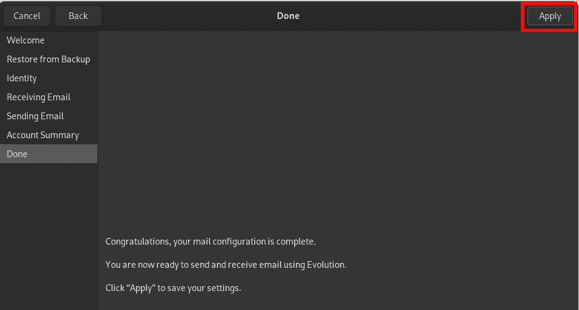
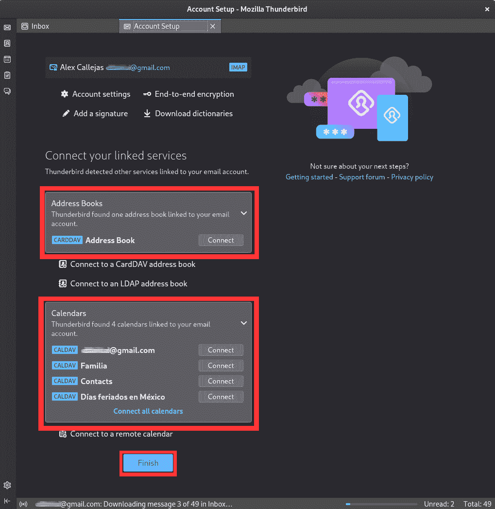
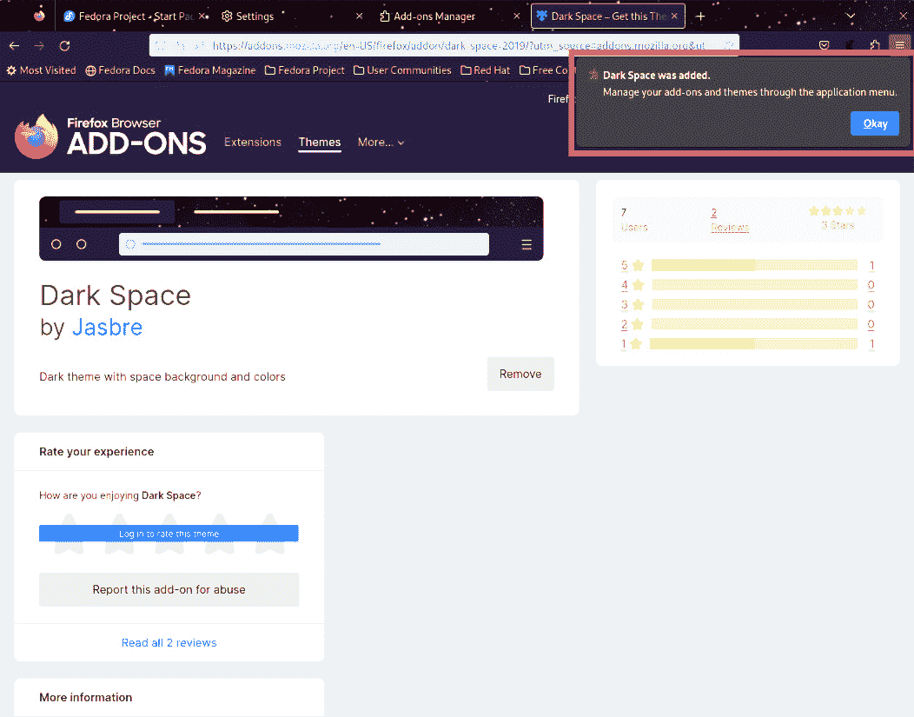

# 第十一章：邮件客户端和浏览器

互联网最初是作为 ARPAnet 出现的，这是一种由美国政府赞助的分组交换网络，始于 1969 年 9 月。*林纳斯·托瓦兹*（Linus Torvalds）直到同年 12 月才出生。1991 年，当 Linux 出现时，只有学者、研究人员和军方在使用互联网。对于大多数人来说，*上网*意味着使用 `Pine` 和 `Elm` 来收发电子邮件，使用命令行程序如 `ftp` 和 `Archie` 来搜索和共享文件。可用的最先进工具是 `Gopher`，类似于 Yahoo 的互联网资源指南。随后，*蒂姆·伯纳斯-李*（Tim Berners-Lee）发明了万维网，一切都改变了。

如今，互联网接入有了显著改善，速度也更快。这促使了许多不同工具的出现，用于阅读电子邮件和浏览网页。

在本章中，我们将讨论 Fedora Linux 中最常见的工具，涵盖以下主要内容：

+   使用 Evolution 收发邮件

+   使用 Thunderbird 收发邮件

+   忠实的老 Firefox

+   使用 Google Chrome 扩展浏览

# 技术要求

为了开展本章的主题，需要安装每个章节中所指示的软件包。Firefox 浏览器是 Fedora Linux 工作站版默认安装的唯一软件包。

在每个章节中，你会找到关于每个软件包不同安装类型的说明，按需要进行选择。

# 使用 Evolution 收发邮件

2000 年，Linux 发行版没有一款能够为企业用户提供所需功能和互操作性的电子邮件客户端。于是，*Ximian* 决定开发 **Evolution**。Evolution 1.0 版本于 2001 年 12 月发布。它为 Ximian 提供了一个 *专有插件*，使用户能够与 Microsoft Exchange 服务器连接。Evolution 从一开始就是开源软件，但 Ximian 的连接器作为专有软件出售。因此，Ximian 可以通过这一方式创收。当 Novell 在 2003 年 8 月收购 Ximian 后，Novell 决定从 2004 年 5 月起将 Exchange 插件作为开源软件整合进 **Evolution 2.0**。

Novell 在 2011 年被 **Attachmate Group** 收购。结果，Novell 的开发人员转移到了 **SUSE**。2012 年，SUSE 决定停止为 Evolution 的开发提供资金。

**红帽公司**继续开发 Evolution，这促使了 Evolution 的积极开发，并对 Microsoft Exchange 提供良好支持的电子邮件客户端的需求。

Evolution 作为大多数使用 GNOME 的 Linux 发行版中的默认个人信息管理器，尤其是在 Debian 和 Fedora Linux 中表现突出。

2018 年 12 月，Fedora 项目决定从工作站版的默认安装中移除 Evolution，从 Fedora Linux 30 开始。然而，Evolution 仍然可以在官方仓库中找到，你可以安装并使用它作为个人信息管理器。

现在，让我们来看一下如何在工作站上安装和配置 Evolution。按照以下步骤操作：

1.  要安装 Evolution，Fedora Linux 提供了几种选项。可以从 **软件** 应用程序中选择 **Evolution** 进行安装，选择你喜欢的源：

    +   **RPM**

    +   **Fedora Flatpak**

    +   **Flathub**


图 9.1 – 从软件应用程序安装 Evolution

1.  使用终端，使用 **dnf** 命令，你可以查看可用的包和插件。切换到 **root** 用户并运行以下命令：

    ```
    # dnf list *evolution*
    ```


图 9.2 – Evolution 和插件

使用你喜欢的方式安装 **Evolution**，然后我们将开始邮件客户端的配置。

1.  要打开 **Evolution**，从菜单中启动它。作为 *非 root 用户*，在左上角打开菜单并在搜索框中输入 **Evolution**：


图 9.3 – 从菜单启动 Evolution

在搜索框中输入 `evolution`：



图 9.4 – 从活动概览菜单启动 Evolution

1.  当 **Evolution** 第一次打开时，如果你愿意，可以将其设置为默认邮件客户端：


图 9.5 – 将 Evolution 配置为默认邮件客户端

1.  在 **欢迎** 屏幕中，它会提示你设置一个邮件账户。点击 **下一步** 按钮开始配置：


图 9.6 – Evolution 配置向导

1.  提供的第一个选项是恢复 Evolution 配置的备份，以设置邮件账户。


图 9.7 – 从备份恢复窗口

如果你有备份，请勾选 **从备份文件恢复** 选项框，然后点击 **浏览** 图标选择文件并恢复备份。

如果没有 Evolution 备份，请点击 **下一步** 按钮继续配置。

1.  在接下来的窗口中，填写所需的资料 – **全名** 和 **电子邮件地址**：


图 9.8 – 身份窗口

可以添加更多信息，例如 *组织名称* 或 *由账户管理的别名*。

完成后，点击 **下一步** 按钮继续配置。

1.  如果 Evolution 激活，它将搜索已输入账户的邮件服务信息。如果未找到，它会提供接收邮件的配置选项：


图 9.9 – 收取邮件选项

选项如下：

+   **Exchange Web Services**：连接到 **Microsoft Exchange** 服务器，进行电子邮件、日历和联系人信息的同步。

+   **IMAP**：在服务器上保持电子邮件，以便可以通过 IMAP 协议从多个系统访问电子邮件。**IMAP** 代表 **互联网消息访问协议**。

+   **POP**：作为一种选择，将电子邮件下载到硬盘进行永久存储，从而释放邮件服务器上的空间。**POP** 代表 **邮局协议**。

+   **USENET 新闻**：连接到新闻服务器并下载可用的新闻摘要列表。

+   **本地投递**：将邮件从卷中移动并存储在主目录中。

+   **MH 格式邮件目录**：使用 **mh**（**邮件处理系统**）或 *mh 风格* 程序下载电子邮件。**mh** 由几个不同的程序组成，旨在从命令行运行。与将许多邮件存储在一个文件中不同，每封邮件都有自己单独的文件，保存在一个特殊的目录中。

+   **Maildir 格式邮件目录**：使用 *Maildir 风格* 程序下载电子邮件。**Maildir** 邮件格式是一种常见的邮件存储方式。每封邮件都存储在一个独立的文件中，并且每个邮件文件夹都是一个文件系统目录。

+   **标准 Unix mbox 卷目录**：以 Unix 主机用于存储邮件消息的格式下载电子邮件。**mbox** 文件通常位于 *系统邮件卷* 中，以各种名称存储在用户的邮件目录下，并以 **mbox** 名称存储在用户的主目录中。

+   **标准 Unix mbox 卷文件**：与前一个选项相同，但 *邮件卷* 被创建为一个单独的文件。

注意

确认通用邮件访问数据，如 **服务器类型** 和 **安全性**，与相关部门的工作人员确认，以避免连接问题。

1.  选择接收邮件选项后，输入访问数据，如下图所示：



图 9.10 – 接收电子邮件窗口

点击 **下一步** 按钮继续配置。

1.  在以下窗口中，配置邮件接收选项，例如检查新邮件的时间间隔，或者是否将邮件副本保留在服务器上，以及启用或禁用功能：


图 9.11 – 接收选项窗口

点击 **下一步** 按钮继续配置。

1.  在以下窗口中，配置 **发送** **电子邮件** 选项：


图 9.12 – 发送电子邮件窗口

默认情况下，向导会将 **发送电子邮件** 字段填充为为邮件接收提供的登录信息。如果这些信息正确并足以发送电子邮件，请点击 **完成** 按钮结束配置。

如果你想查看所有提供的信息，请点击 **下一步** 按钮。

1.  以下窗口显示了为账户配置的数据摘要：


图 9.13 – 账户摘要窗口

如果需要更改任何信息，点击**返回**按钮返回到需要更改数据的窗口。

如果信息正确，点击**下一步**按钮。

1.  以下窗口确认邮件账户配置已完成：



图 9.14 – 完成的邮件配置窗口

1.  点击**应用**按钮以保存设置。

账户设置完成后，可以检查和发送电子邮件。

在 Evolution 的主窗口中，左上角有按钮可以发送/接收邮件以及创建新邮件。

要发送或接收邮件，点击**发送/接收**按钮：


图 9.15 – Evolution 主窗口

要创建电子邮件，点击**新建**按钮：


图 9.16 – 撰写邮件窗口

在*新邮件撰写*窗口中，填写收件人和邮件主题。此外，还可以选择邮件格式（*纯文本*、*富文本*或*HTML*），并使用右下角的按钮添加附件。

当电子邮件准备好发送时，点击**发送**按钮。

Evolution 目前是多个 Linux 发行版中的默认客户端。虽然有一些替代的邮件客户端，但它们没有 Evolution 那么多的选项。

作为 Evolution 的替代品，具有更多选项的客户端之一是 Mozilla Thunderbird。

现在让我们一起走进这个邮件客户端，看看它与 Evolution 的主要区别。

# 使用 Thunderbird 发送邮件

**Mozilla Thunderbird**是一个跨平台的、免费的开源电子邮件、新闻、RSS 和聊天客户端，由 Mozilla 基金会开发。它使用 XUL 界面语言。**XML 用户界面语言（XUL）**是 Mozilla 开发的一种基于 XML 的用户界面语言。XUL 作为一种 XML 方言，提供图形用户界面，如网页。XUL 不是公共标准。

2004 年 12 月 7 日，*1.0 版本*发布，并在发布后的前三天内获得了超过 50 万次下载，在 10 天内下载量达到 100 万次。

2012 年 7 月 6 日，Mozilla 宣布，由于扩大 Thunderbird 功能集的努力未能成功，公司将不再将 Thunderbird 开发作为优先事项。2015 年 12 月 1 日，Mozilla 的首席执行官宣布，Thunderbird 的开发应与 Firefox 分开。

最近，Thunderbird 在其官方博客上宣布，由同为 Mozilla 子公司的**MZLA Technologies Corporation**将继续该项目，提供新的更新、新的设计以及移动应用程序。

Thunderbird 在多个 Linux 发行版的桌面系统上默认安装。在 Fedora Linux 中，Thunderbird 不是默认安装的，但可以在官方仓库中找到。

让我们看看如何在我们的 Fedora Linux 工作站上安装和配置 Thunderbird。请按照以下步骤操作：

1.  要安装 Mozilla Thunderbird，Fedora Linux 提供了几种选择，但它仅作为 Flatpak 包提供。从软件应用程序中，要安装 Mozilla Thunderbird，选择你偏好的选项：

    +   **Fedora** **Linux**（Flatpak）

    +   **Flathub**


图 9.17 – 从软件应用程序安装 Thunderbird

1.  使用终端，使用 **dnf** 命令，你可以查看可用的软件包和插件。切换到 **root** 用户并运行以下命令：

    ```
    # dnf list *thunderbird*
    ```


图 9.18 – Thunderbird 和插件

按照你偏好的方法安装 Mozilla Thunderbird，然后我们将开始邮件客户端的配置。

1.  要打开 Mozilla Thunderbird，从菜单启动它。作为 *非 root 用户*，在左上角打开菜单并在搜索框中输入 **Thunderbird**：


图 9.19 – 从菜单启动 Thunderbird

Mozilla Thunderbird 还可以通过搜索框中的 `thunderbird` 访问：


图 9.20 – 从活动概览菜单启动 Thunderbird

1.  当 Mozilla Thunderbird 首次打开时，它会要求你设置一个电子邮件账户：


图 9.21 – 账户设置窗口

填写所需数据，然后点击 **继续** 按钮。

注意

在我的例子中，我输入了一个 Google 电子邮件账户。如果你的工作站连接到互联网，Mozilla Thunderbird 将尝试从邮件服务的服务器获取信息。它只会在服务器可访问时获取到这些信息。

以下窗口显示了已下载的可用配置数据。选择你偏好的配置，并点击 **完成** 按钮：


图 9.22 – 下载的可用配置

Mozilla Thunderbird 将提供连接账户中找到的服务，如通讯录或日历：



图 9.23 – 自动设置完成

要完成配置，点击 **完成** 按钮。

注意

如果 Mozilla Thunderbird 找不到服务配置信息，你需要手动配置邮件账户。

这结束了 *自动配置* 邮件账户。若要手动指定邮件账户设置，请按照以下步骤操作：

1.  在 **账户设置** 窗口中，点击 **手动配置** 链接：


图 9.24 – 账户设置窗口

注意

与相应区域的工作人员确认一般的邮件访问数据，如服务器类型、服务端口和安全设置，以避免连接问题。

Mozilla Thunderbird 支持通过 IMAP 或 POP3 协议或本地邮件连接到邮件服务器，如前一节所述。

1.  选择要使用的协议以及**接收**和**发送**邮件服务器的访问数据：


图 9.25 – 手动账户设置窗口

1.  如果需要更多配置选项，请点击**高级** **配置**链接。


图 9.26 – 高级账户设置窗口

这个窗口包含账户连接详细信息的细节设置。

配置完成后，点击**账户设置**标签中的**x**符号以关闭该标签。

1.  完成账户设置后，Mozilla Thunderbird 的主窗口会出现：


图 9.27 – Mozilla Thunderbird 主窗口

1.  从主窗口，可以配置更多的邮件、日历、通讯录、聊天、文件链接、订阅源或新闻组账户。它还可以从其他电子邮件客户端导入这些账户，并提供对支持资源的访问。要检索邮件消息，请点击**获取** **邮件**按钮：


图 9.28 – 检索邮件消息

现在，让我们来看看如何发送电子邮件：

1.  要创建新的电子邮件消息，请点击 Mozilla Thunderbird 工具栏上的**写邮件**按钮：


图 9.29 – Mozilla Thunderbird 主窗口

1.  在**写邮件**窗口中，填写收件人和主题。如果需要发送附件，请点击工具栏上的**附加**按钮：


图 9.30 – 写邮件窗口

1.  当电子邮件准备好发送时，**发送**按钮会被启用。点击**发送**按钮以发送电子邮件。

根据 [opensource.com](http://opensource.com)，这两个邮件客户端，**Evolution** 和 **Mozilla Thunderbird**，代表了企业环境中最常用的桌面邮件客户端。

然而，在 Linux 中，最常见的获取电子邮件的方法是通过网页浏览器。

现在，让我们来看一下在 Fedora Linux 中最常用的两个网页浏览器。

# 可靠的老 Firefox

1998 年 1 月，**网景通信公司**（**NSCP**）宣布计划在互联网上发布其**Netscape Communicator 软件**的源代码。公司在 1998 年第一季度发布了**Netscape Communicator 5.0**的第一个开发者版本的源代码。这一激进的举措使网景能够通过吸纳成千上万互联网程序员的创意力量，不断提升 Netscape 软件的未来版本。

这一公告促成了**Mozilla 项目**的创建。

**Phoenix 0.1**于*2002 年 9 月*发布。那是后来被称为**Firebird**，然后改名为**Firefox**的浏览器的第一个版本。**Firefox 1.0**于 2004 年发布，并取得了巨大成功。

2003 年 11 月，Red Hat 宣布发布**Fedora Core 1**，即 Fedora 项目的第一个软件版本。GNOME 是 Fedora Linux 的默认桌面。当时 Mozilla Suite 是首选的网页浏览器。Mozilla 尚未启动 Firefox 浏览器项目，因此该套件包括一个*电子邮件客户端*和一个*Usenet 新闻阅读器*。

**Fedora Core 3**于 2004 年发布，是第一款包含 Mozilla Firefox 网页浏览器的版本。

2019 年，Fedora Linux 31 工作站配备了 Firefox 后端，默认从`X11`迁移到`Wayland`，并引入了新的*显示服务器*。这是朝着全面过渡到`Wayland`的又一步。这只影响了 GNOME。

Firefox 作为默认 RPM 包与安装为 Flatpak 应用的 Firefox 一同预装在 Fedora Linux 工作站中，还有一个包可以让你在 Wayland 中运行 Firefox。

让我们来看一下这些安装选项之间的区别：

1.  从软件应用中，搜索**Firefox**，然后点击*已安装*选项：


图 9.31 – 软件应用中的 Firefox

1.  点击安装源后，找到 RPM 和 Fedora Flatpak 应用：


图 9.32 – Firefox 安装源

1.  在终端中，也可以使用**dnf**命令列出可用的 Firefox 包：

    ```
    # dnf list *firefox*
    ```


图 9.33 – 终端中的 Firefox 包

1.  默认情况下，要打开**Firefox**浏览器，启动器会出现在**活动****概览**窗口的收藏夹中：


图 9.34 – 活动概览中的 Firefox 启动器

从菜单中，你还可以在收藏夹中找到**Firefox**启动器：


图 9.35 – 菜单中的 Firefox 启动器

在*第三章*中，我提到过安装**Gnome Frippery 面板收藏扩展**（[`extensions.gnome.org/extension/4/panel-favorites/`](https://extensions.gnome.org/extension/4/panel-favorites/)）会将收藏夹添加到任务栏中，因此**Firefox**启动器会出现在桌面上：


图 9.36 – 桌面上的 Firefox 启动器

1.  打开 Firefox 时，显示**Fedora 项目**页面作为*主页*：


图 9.37 – Firefox 浏览器

1.  你可以选择更改主页，这可以通过 Firefox 设置来完成。为此，点击如下图所示的三条横线图标：


图 9.38 – Firefox 设置

1.  在下拉菜单中，选择**设置**以打开 Firefox 首选项窗口。此窗口也可以通过地址栏导航到**about:preferences**来打开：


图 9.39 – Firefox 首选项

1.  Firefox 设置分为多个部分，每个部分下还有若干小节：

    +   **常规**：常规配置选项，例如：

        +   **语言和外观**：更改网站的外观，包括自动、亮色或暗色主题、颜色、字体、缩放以及语言。它还会更改 Firefox 菜单、消息和通知的显示。

        +   **文件和应用程序**：更改文件的处理方式，例如下载，包括保存位置和使用的应用程序。

        +   **Firefox 更新**：验证浏览器版本。

        +   **性能**：更改或验证推荐的性能设置。

        +   **浏览**：更改或添加浏览行为的选项，例如滚动显示或媒体文件处理。它还控制扩展和功能。

        +   **网络设置**：配置 Firefox 如何连接互联网。

    +   **主页**：控制打开 Firefox 时的启动选项：

        +   **新窗口和标签页**：主页、新窗口和标签页的配置。

        +   **Firefox 主页内容**：主页内容的配置。

    +   **搜索**：搜索选项的配置，包括以下内容：

        +   **搜索框**：用于执行搜索的工具。

        +   **默认搜索引擎**：首选的搜索引擎（默认是 Google）。

        +   **搜索建议**：搜索中的建议行为。

        +   **搜索快捷方式**：替代搜索引擎。

    +   **隐私与安全**：隐私和安全设置，包括以下内容：

        +   **增强的跟踪保护**：一个用于阻止恶意跟踪器和脚本的工具。它允许不同级别的安全性。

        +   **Cookies 和网站数据**：Cookies 和保存的网站数据的管理。

        +   **登录和密码**：网站访问数据和密码的管理。

        +   **历史记录**：浏览历史记录的管理。

        +   **地址栏**：地址栏视图的自定义。

        +   **权限**：自定义对资源的访问权限，如位置、设备或通知。

        +   **Firefox 数据收集和使用**：管理 Firefox 收集的数据。

        +   **安全性**：浏览安全性的一般自定义。

    +   **同步**：同步选项的配置—书签、历史记录、标签、密码和附加组件。如果需要，请创建同步帐户。

    +   **来自 Mozilla 的更多内容**：让您尝试其他 Mozilla 产品：

        +   **Firefox 移动版**：用于手机的浏览器

        +   **Firefox Relay**：电子邮件屏蔽保护在线身份

    +   **扩展和主题**：Firefox 自定义选项。也可以通过在地址栏中输入**about:addons**来打开此窗口：

        +   **扩展**：扩展包括扩展 Firefox 功能的程序，如*弹出窗口阻止器*、*在线翻译*和*cookie 处理*。

        +   **主题**：更改浏览器的颜色方案或添加自定义背景

        +   **插件**：插件为浏览器添加功能，例如播放某些视频或图像格式。

    +   **Firefox 支持**：打开**Mozilla 支持**窗口（[`support.mozilla.org`](https://support.mozilla.org)）。也可以在**Firefox 选项、偏好设置和** **设置**部分访问此页面。

1.  在*图 9.38*所示的下拉菜单中，可以找到一些快捷方式，跳转到 Firefox 设置或偏好设置的各个部分。例如，要查看 Firefox 的版本，点击下拉菜单，选择**帮助**选项，然后点击**关于**：


图 9.40 – 关于 Mozilla Firefox

Firefox 在外观和手感方面最好的选项之一就是自定义浏览器主题。

让我们看看如何将主题添加到浏览器中。

## 自定义 Firefox

主题更改 Firefox 的外观，例如工具栏的颜色方案和背景图像。并非所有的 Firefox 主题都是*浅色*（背景），在某些情况下，它们*不兼容*。安装主题之前，请验证其兼容性和大小。

现在，让我们看看如何在工作站上安装 Firefox 主题。按照以下步骤操作：

1.  打开 Firefox 的**设置**窗口，然后点击**扩展和** **主题**部分：


图 9.41 – Firefox 扩展和主题

1.  Firefox 的**附加组件管理器**窗口显示一个子菜单，提供**推荐**、**扩展**、**主题**和**插件**的自定义选项。


图 9.42 – Firefox 附加组件

点击**主题**。

1.  在**主题**窗口中，浏览 Firefox 提供的主题推荐：


图 9.43 – Firefox 主题

也可以搜索主题。在名为`dark space`的搜索栏中搜索。

1.  Firefox 会显示一个窗口，展示主题搜索的结果：


图 9.44 – 搜索主题

点击第一个主题。

1.  要添加主题，请安装并启用它，然后点击**安装** **主题**按钮：


图 9.45 – 安装主题

1.  一个通知窗口将出现，确认附加组件已安装：


图 9.46 – 安装附加组件

点击**添加**按钮。

1.  Firefox 的外观将在*标签栏*和*工具栏*上发生变化：



图 9.47 – 添加主题

一个通知窗口将提醒您关于主题应用的情况。点击**确定**按钮以接受更改。

一旦完成了 Firefox 的个性化设置，它就可以通过网页访问我们的电子邮件了。

按照上一节中的示例，打开 Google 邮箱网址（[`mail.google.com`](https://mail.google.com)）：


图 9.48 – 通过网页访问邮件

输入您的电子邮件地址和密码。点击**下一步**按钮。Firefox 将打开电子邮件文件夹，以便您查看和发送邮件：


图 9.49 – 通过网页访问电子邮件

Firefox 是在 Linux 上最好的、最稳定的浏览器选项之一。

另一个最佳且最受欢迎的选项是使用谷歌的浏览器——**谷歌 Chrome**。让我们看看如何通过使用谷歌的 Chrome 浏览器，将浏览体验提升到一个新层次。

# 扩展浏览体验：使用谷歌 Chrome

**谷歌 Chrome** 是由谷歌开发的*专有*网页浏览器，尽管它源自*开源项目*。Chrome 建立在 Chromium 开源浏览器项目的基础上，使用了来自谷歌及其他第三方（如 Netscape）的不同代码库。Chrome 的版本发布来源于 Chromium。

尽管如此，谷歌 Chrome 仍然可以免费使用。

Google Chrome 于 2008 年发布，伴随发布的还有 Chromium 源代码的公开。这使得这套代码为开发其他浏览器提供了基础。该代码的初版包含了 Windows、macOS 和 Linux 的构建版本，且在开发的初期阶段功能不完全。**Chromium 1.0** 于 2008 年 12 月发布，使得 Windows 版本的 Chrome 结束了测试阶段。

2009 年 5 月，Chromium 的 Linux 版首个*alpha 版本*发布。到了 7 月，Chromium 为 Linux 引入了本地主题，使用 GTK+工具包，这使得它能够与 GNOME 桌面环境集成。

**Chromium 5.0** 于 2010 年 1 月发布。**谷歌 Chrome 5.0** 于 2010 年 5 月发布，并为所有平台提供了一个稳定的（*非测试版*）版本。

Chrome 包含额外的功能，例如支持*专有媒体文件*（如**H.264**或**AAC**）和播放*受版权保护的媒体*（Netflix 等）。Chrome 还包括对其他 Google 服务的支持，如浏览器同步和不受 Chromium 支持的定位服务。

Google Chrome 可通过第三方仓库在 Fedora Linux Workstation 上获取。启用该仓库后，可以通过软件应用程序或命令行安装 Chrome。

让我们验证一下在工作站上安装 Chrome 的选项：

1.  打开软件应用程序，在搜索选项中输入**Google Chrome**：


图 9.50 – 在软件应用程序中搜索 Chrome

1.  点击第一个结果并验证安装源：


图 9.51 – Google Chrome 源安装选项

1.  要启用 Google 的第三方仓库，返回软件应用程序的主窗口。点击关闭（**x**）按钮旁边的三个水平线折叠菜单图标：


图 9.52 – 软件应用程序中的软件仓库

1.  点击**软件仓库**。

1.  向下滚动，直到找到**google-chrome**仓库，并切换按钮以启用它：


图 9.53 – 软件仓库窗口

1.  再次运行搜索，并验证安装源是否为 RPM：


图 9.54 – Google Chrome 源安装选项

1.  打开终端，以**root**用户身份，使用**dnf**命令列出**google-chrome**浏览器软件包：

    ```
    # dnf list *google-chrome*
    ```


图 9.55 – Google Chrome 软件包

按照你偏好的方法安装 Google Chrome，然后我们将开始浏览器配置。

1.  要打开 Google Chrome，从菜单启动它。作为*非 root* 用户，打开左上角的菜单，并在搜索框中输入**Google Chrome**：


图 9.56 – 从菜单启动 Google Chrome

在搜索框中输入`Google Chrome`：


图 9.57 – 从活动概览菜单启动 Google Chrome

1.  如有需要，将**Chrome**添加到**收藏夹**标签。将**Chrome**图标从**活动概览**菜单拖放到**收藏夹**仪表盘。

    一个通知窗口会确认 Google Chrome 现在已被固定到**收藏夹**仪表盘：


图 9.58 – Google Chrome 固定到收藏夹

图标也可以放置在您首选位置的**收藏夹**面板中。从现在开始，它将作为**收藏夹**项目出现：


图 9.59 – 收藏夹面板

因此，Google Chrome 图标也出现在任务栏中，这是由先前安装的扩展程序启用的：


图 9.60 – 任务栏中的 Google Chrome

1.  当 Chrome 第一次打开时，您可以将其设置为默认浏览器：


图 9.61 – 将 Google Chrome 设置为默认浏览器

1.  如果您同意设置，请勾选复选框并点击**确定**按钮。否则，关闭窗口。

    要配置 Google Chrome，我们可以利用当前使用的邮箱账户是 Google Mail 的事实。

1.  当 Chrome 窗口打开时，点击**已经是 Chrome 用户？登录**链接，使用电子邮件账户并*同步* Chrome 设置。


图 9.62 – Google Chrome 欢迎界面

1.  在以下对话框中输入电子邮件地址，并点击**下一步**按钮：


图 9.63 – Google Chrome 访问界面

1.  在接下来的界面中，输入您的密码，并点击**下一步**按钮：


图 9.64 – Google Chrome 访问界面

1.  如果您在另一台设备上自定义了 Chrome 并启用了同步，Chrome 将自动进行配置。


图 9.65 – Google Chrome 同步界面

1.  点击**是的，我同意**按钮开始同步自定义设置。

    自动*应用您的主题*、*安装扩展和插件*，以及配置和下载您的*历史记录*和*书签*将开始运行：


图 9.66 – 正在运行 Google Chrome 同步

1.  同步完成后，Google Chrome 将显示已完成的自定义设置：


图 9.67 – Google Chrome 自定义完成

像 Firefox 一样，Google Chrome 提供了设备间的配置和同步功能。Chrome 利用 Google 服务进行配置同步。Chrome 的配置和自定义与 Firefox 非常相似。

要访问 Chrome 设置，请点击带有*三点*图标（即垂直省略号）的按钮，位于**x**按钮下方：


图 9.68 – Chrome 设置

Chrome 设置分为几个部分，每个部分下又有多个小节，包括以下内容：

+   **你和 Google**：配置访问帐户并与**Google**服务同步。在此，你可以自定义个人资料，并导入书签和设置。

+   **自动填充和密码**：管理密码管理器、支付方式和存储的地址及数据。

+   **隐私与安全**：包括一个安全检查选项，用于检测安全漏洞、恶意扩展等。同时也管理隐私和安全选项。

+   **性能**：为未使用的打开标签页添加内存节省选项，这是一种*省电模式*。

+   **外观**：配置浏览器的外观设置，例如主题、主页，以及如何显示书签栏或侧边面板。

+   **搜索引擎**：配置浏览器的搜索引擎（可能与**Google**不同）及其行为。

+   **默认浏览器**：检测系统默认浏览器。

+   **启动时**：配置浏览器启动时的行为。

+   **语言**：配置显示网站内容的首选语言，并在你在网站上输入时提供拼写检查功能。

+   **下载**：管理文件下载。

+   **辅助功能**：配置浏览器的辅助功能选项。

+   **系统**：配置浏览器在操作系统中的行为选项。

+   **重置设置**：将浏览器设置恢复到出厂默认值。

+   **扩展程序**：管理浏览器扩展和插件。

+   **关于 Chrome**：显示浏览器版本。

以下图显示了 Chrome 设置的各个部分：


图 9.69 – Chrome 设置部分

与 Firefox 类似，你可以在地址栏中访问`chrome://settings/help`：


图 9.70 – Chrome 版本

在这种特殊情况下，Chrome 使用了**Google 邮件检查器**扩展（[`chrome.google.com/webstore/detail/google-mail-checker/mihcahmgecmbnbcchbopgniflfhgnkff`](https://chrome.google.com/webstore/detail/google-mail-checker/mihcahmgecmbnbcchbopgniflfhgnkff)），该扩展为直接访问 Google Mail 添加了一个按钮：


图 9.71 – Google 邮件检查器扩展

要在 Chrome 中管理和添加扩展程序，请点击地址栏中的`chrome://extensions/`：


图 9.72 – Chrome 扩展

通过搜索栏，你可以一键找到并安装扩展程序。

这些应用程序是 Fedora Linux Workstation 中最常用于电子邮件和互联网浏览的工具。

使用这些应用程序，我们涵盖了所有基本工具，为标准化管理系统文档奠定了基础。

在接下来的章节中，我们将讨论生成基线的流程和最佳实践，以及如何进行标准化的系统管理。

# 总结

在这一章中，我们学习了如何安装、配置和使用最常见的 Linux 选项，用于电子邮件和网页浏览。

**Evolution**，由 Red Hat 和 GNOME 支持，在企业环境中是最常见的邮件客户端之一（根据 [opensource.com](http://opensource.com)）。这是因为它允许您连接到 Microsoft Exchange 邮件服务。

Mozilla 项目为我们提供了两种选择，用于这两项服务。**Thunderbird** 电子邮件客户端是电子邮件管理的一个很好的选择，而**Firefox**，最常用的网页浏览器，已包含在所有 Linux 发行版中。

**Google Chrome** 作为网页浏览器是一个动态的选择。基于开源项目，它结合了专有插件的优点。在 Google 提供的服务中使用邮件帐户可以在设备之间提供移动性，并在访问时提供灵活性。

在接下来的章节中，我们将深入探讨 Linux 系统管理的概念和流程基础，充分利用与兼容操作系统的工作站。

# 进一步阅读

要了解本章涵盖的主题，请访问以下链接：

+   *Fedora Magazine* – *Email clients* *in Fedora*:

    [`fedoramagazine.org/email-clients-fedora/`](https://fedoramagazine.org/email-clients-fedora/)

+   *Fedora docs* – *Mail Servers*:

    [`docs.fedoraproject.org/en-US/fedora/latest/system-administrators-guide/servers/Mail_Servers/`](https://docs.fedoraproject.org/en-US/fedora/latest/system-administrators-guide/servers/Mail_Servers/)

+   *GNOME Wiki* – *Evolution*:

    [`wiki.gnome.org/Apps/Evolution`](https://wiki.gnome.org/Apps/Evolution)

+   *Thunderbird*:

    [`www.thunderbird.net/en-US/`](https://www.thunderbird.net/en-US/)

+   *Fedora Wiki* – *Firefox*:

    [`fedoraproject.org/wiki/Firefox`](https://fedoraproject.org/wiki/Firefox)

+   *Fedora docs* – *Installing Chromium or Google* *Chrome browsers*:

    [`docs.fedoraproject.org/en-US/quick-docs/installing-chromium-or-google-chrome-browsers/`](https://docs.fedoraproject.org/en-US/quick-docs/installing-chromium-or-google-chrome-browsers/)
