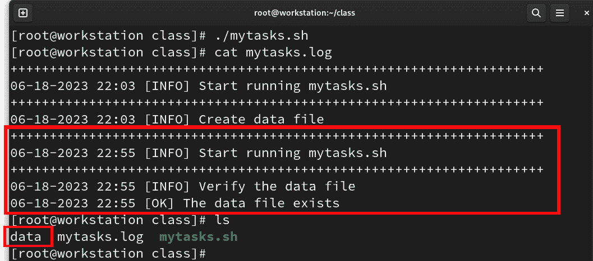
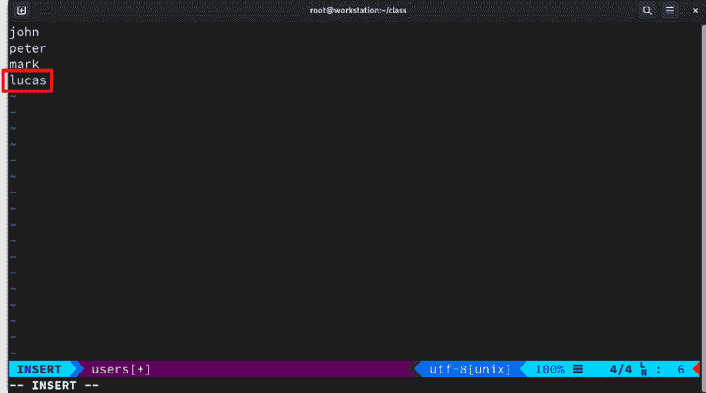
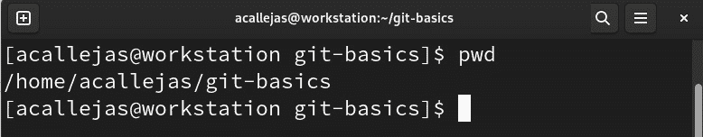
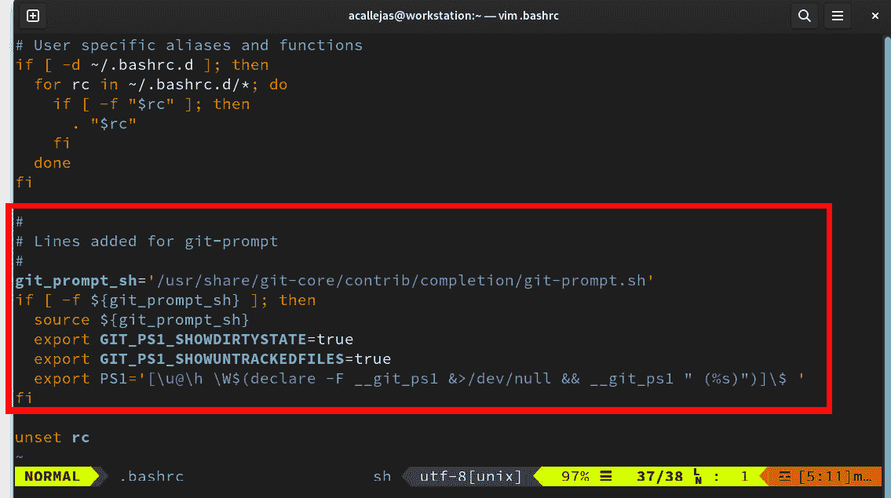
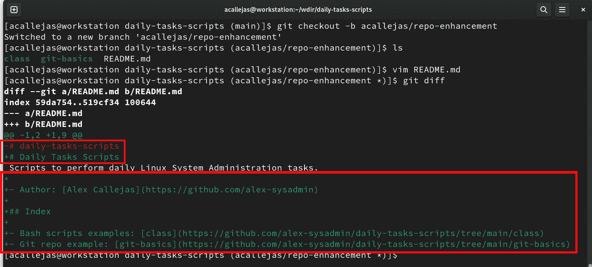

# 系统管理

与许多职业不同，成为一名系统管理员并没有单一的路径。许多**系统管理员**拥有不同领域的学位：**计算机科学**、**系统工程**、**信息技术**、**软件工程**、**机械工程**、**气象学**等等。

此外，鉴于系统管理的实践性质，以及开源服务器软件的可用性，许多系统管理员是自学成才的。通常，这需要一些管理预期系统的先前经验。在某些情况下，系统管理员候选人必须持有证书才能被考虑聘用。

如果你没有采取最佳实践的习惯，这项职业会变得更加困难。

但是你从哪里学到这些呢？它们在哪里写下来？

在本章中，我们打算解答这些疑惑，并帮助你成为一名**Linux** **系统管理员**。

我们将讨论以下主要主题：

+   系统管理员的三条法则

+   一点 Git 和编程

+   不要忘记备份

+   使用 Ansible 进行自动化

+   永无止境的学习

# 技术要求

为了完成本章中的主题，你需要安装每个部分中指示的软件包。在每个部分，你将找到有关你需要安装的不同类型软件包的说明。

本章的示例可以从本书的**GitHub**仓库下载：[`github.com/PacktPublishing/Fedora-Linux-System-Administration/tree/main/chapter10`](https://github.com/PacktPublishing/Fedora-Linux-System-Administration/tree/main/chapter10)。

# 系统管理员的三条法则

“*因为，如果你停下来思考，机器人学的三条法则是许多世界伦理系统的基本指导原则。 [...] 简而言之，如果拜尔利遵守了所有的机器人学法则，他可能是一个机器人，或者只是一个非常* *好的人*。”  

*来自* *艾萨克·阿西莫夫*的《证据》中，**苏珊·卡尔文博士**。

20 多年来，我一直是不同公司系统管理员。在那些年里，一些年轻人曾问我，最好的实践是什么，是否可以将它们应用于自己，认为自己是一个合格的系统管理员。在这些年里，我读过不同的文章，讨论了这些*最佳实践*：**系统管理员伦理规范**、**系统管理员的十诫**，甚至**计算机基本法则**。

成为平台系统管理员这项工作是艰巨的任务，如果我们没有养成应用最佳实践的习惯，它就会变得复杂。但是你从哪里学到这些呢？它们在哪里写下来？

根据我的经验，最好的哲学之一是遵循**KISS 原则**，并基于此将建议简化为有助于我们技能发展的基本原则。

让我们概述一下这个原则。

## KISS 原则

KISS 原则（*Keep It Simple, Stupid!* 的缩写）是美国海军于 1960 年提出的一项设计原则。它指出，大多数系统如果保持简单而不是复杂，工作效果会更好。因此，简洁性应当成为设计的关键目标，应避免不必要的复杂性。

一段归于*莱昂纳多·达·芬奇*的文字为我们概述了这一原则：

“*简洁就是* *终极的复杂性*。”

*一旦你体验过飞行，你将永远仰望天空行走在地球上，因为你曾经在那里，且总会渴望* *回到那里。*

“*学习永远不会耗尽* *思维*。”

– *莱昂纳多* *达·芬奇*

在大多数情况下，简单的解决方案更有效。多年来，我看到许多年轻的系统管理员在应用复杂的解决方案时，反而导致了更多的问题。

注意

想要了解更多关于如何在代码创建中应用 KISS 原则的信息，请参考*The Kiss Principle*，网址是[`people.apache.org/~fhanik/kiss.html`](https://people.apache.org/~fhanik/kiss.html)。

基于此，让我分享一下作为系统管理员，指导我工作的基本原则。

让我们看看这些基本原则是如何起源的，然后深入探讨它们。

## 了解基本任务

这是来自维基百科的内容（[`en.wikipedia.org/wiki/System_administrator`](https://en.wikipedia.org/wiki/System_administrator)）：

“*系统管理员是负责实施、配置、维护、监控、文档记录并确保计算机系统或其某一方面正常运行的人*。”

他们的目的是保证他们所管理的服务器的*正常运行时间*、*性能*、*资源使用*和*安全性*。

他们有不同的角色，比如*服务器管理员*、*数据库管理员*、*网络管理员*、*邮件服务器管理员*、*Web 服务器管理员*、*安全管理员*、*备份管理员*等。

根据角色的不同，任务会有所变化，但它们都集中于一些基本点。

让我们从最基本的一点开始，那就是*始终使用命令行界面*。正如在*第一章*中提到的，终端是操作系统管理的主要工具。它的使用扩展了系统管理和操作的能力。

根据我个人的经验，*任何生产系统终究会失败*，无论我们采取了多少预防措施或进行过多少维护。最佳解决方案是为那一天做好准备，确保有有效的备份。

如果我们不知道系统中哪些是关键内容，那么我们应该调查哪些是关键内容，并因此规划备份。我们如何知道备份在灾难发生时会起作用？以下是您在规划时应该提出的一些问题：

+   使用什么软件（或脚本）进行备份？

+   我们有多少空间用于备份（包括内部和外部，磁盘或磁带）？

+   我们应该多久轮换一次备份？

+   无论是完整备份（full backup），我们是否需要增量备份？

一旦我们清楚了如何进行备份，我们必须花时间来验证它。尽管我们有一个良好的备份计划，但这并不意味着备份不会遭到破坏。

备份以及我们备份的频率是所有类型的系统管理中*最基本和最通用的任务*。

大多数备份解决方案允许我们通过命令行来处理这个任务。得益于这一功能，任务可以像许多其他任务一样*自动化*。自动化任务使系统管理员的工作更加高效。

语句*懒惰的系统管理员是最好的系统管理员*广为人知。这意味着如果你足够积极地去自动化所有的流程，你将拥有大量的*自由时间*，并且被认为是懒惰的。最好的系统管理员看起来似乎总是不太忙，喜欢放松并让系统为他们工作。*更聪明地工作，* *而不是更努力地工作*。

但是我们从*自动化流程*中获得的自由时间应该被有效利用——也许可以通过学习一些我们还未掌握的新语言或新兴技术（如 Perl、Python、Kubernetes 等），或者优化某些脚本，将它们转变为*编排*。

下图展示了这些原则的演变：


图 10.1 – 基本原则

遵循这些基本原则帮助我提升了许多系统管理技能。尽管它们并没有涵盖系统管理的所有方面，但它们创造了良好的习惯，能够培养许多这项工作所需的技能。

这些原则构成了我的*有效管理的基本法则*——即我的三条系统管理员法则：

+   **备份**：系统管理员必须备份整个系统，并始终验证备份。

+   **自动化**：系统管理员应尽可能自动化所有工作，除非这与第一条法则相冲突。

+   **学习**：系统管理员必须有自由时间来学习，只要这段自由时间不与第一条或第二条法则冲突。

在我们深入探讨系统管理的每一条法则之前，先快速看一下实施这些法则所必需的几个工具。

首先，我们将探讨编程和版本管理。

# 一点点 Git 和编程

典型的系统管理任务涉及命令行工具。更复杂的任务通常需要将多个命令串联起来，并相互共享结果。Linux 命令可以组合使用，通过 Bash shell 环境和基本编程功能来解决重复性和复杂的任务。

作为命令解释器和一种独立的编程语言，Bash shell 环境不仅可以运行例程和使用表达式，还可以运行其他编程语言。

这些例程简化了命令列表，这些命令可以包含在一个名为*Bash 脚本*的文件中。

接下来，我们将学习如何创建 Bash 脚本。

## Bash 脚本

*Bash 脚本编写* 是使用命令作为程序指令的编程方式。此策略通过使用逻辑门、条件、循环等表达式，将重复性任务自动化，简化为一行代码。因此，它便于将多个长命令合并成一段*可执行代码*。

它提供了一个结构化、格式化和模块化的活动序列，并通过命令行参数使用动态值的命令。

在最简单的形式下，Bash 脚本由一个可执行文件组成，该文件包含一系列命令，并通过编程逻辑控制任务中的决策。掌握 Shell 脚本编写技巧对于在任何操作环境中管理系统至关重要。

关于如何编写 Bash 脚本的最佳方式，有大量的文献和参考资料。然而，按照本章开始时提到的简洁原则，可以总结如下：

```
#!/bin/bash  ← [1]
#
# IDENTIFICATION  ← [2]
#
# VARIABLES  ← [3]
# COMMANDS  ← [4]
```

让我们仔细看看：

+   [**1**] **she-bang** 或 **sh-bang**：脚本的第一行以 **#!** 符号开头。这是一个*两字节魔术数字*，表示解释性脚本。接下来的语法是运行此脚本所需的命令解释器的名称。

注意

要了解魔术数字如何指示 Linux 中的文件类型，请参考**file(1)**和**magic(5)**的手册页。

+   [**2**] **IDENTIFICATION**：脚本的标识部分至关重要且不可或缺。它是脚本的文档，包含了运行的常规操作的描述、版本信息，甚至是作者的详细信息和使用许可。

+   [**3**] **VARIABLES**：该部分声明了在脚本执行过程中使用的变量。变量存储系统内存中的信息。脚本使用局部变量，这些变量在短时间内存储信息。局部变量仅在脚本运行的 Shell 或会话中存在和有效。

+   [**4**] **COMMANDS**：该部分列出了要执行的常规操作和命令。它还包括用于在特定情况下指定*执行*命令的函数。

让我们看一个 Bash 脚本的例子。创建一个包含以下常规操作的脚本：

1.  将文件命名为**mytasks.sh**。

1.  创建一个名为**class**的*工作目录*。

1.  将以下文件连接为工作目录中的**data**文件：

    +   **/****etc/passwd**

    +   **/****etc/group**

    +   **/****etc/shadow**

1.  创建以下用户：

    +   **约翰**

    +   **彼得**

    +   **马克**

1.  将**data**文件复制到用户的主目录。

1.  生成一个*活动日志*。

这些常规操作很简单：创建一个*工作目录*可以让管理员集中管理工作文件，这样备份就变得更加容易。从系统文件中，我们创建了一个数据文件，这个文件必须存在于每个用户的主目录中——这些用户如果在系统中不存在，就必须先创建它们。所有 Bash 脚本执行的常规操作和活动都应记录在日志文件中，以备文档记录。

由于 Bash 脚本涉及创建用户，因此运行脚本的用户必须具备*适当的权限*。一个最好的选择是使用`sudo`命令。这样，你可以授予*非 root 用户*创建用户的权限，并为涉及的文件分配所需的权限。

为了简化这个示例，我们将使用`root`用户。切换到`root`用户，请使用`sudo`命令：

```
$ sudo -i
```

创建 Bash 脚本的步骤如下：

1.  创建并切换到**class**工作目录：

    ```
    # mkdir class
    # cd class
    ```

1.  使用你喜欢的文本编辑器来创建**mytasks.sh**脚本文件。在本例中，我们将使用**vim**编辑器：

    ```
    # vim mytasks.sh
    ```

1.  作为**she-bang**，添加**#!/****bin/bash**这一行：


图 10.2 – 创建 mytasks.sh 脚本

1.  填写**IDENTIFICATION**部分，描述脚本常规操作的信息，包括脚本的版本和作者：


图 10.3 – 脚本标识部分

1.  在**VARIABLES**部分，我们需要声明静态信息，这些信息不会改变：

    1.  **class** 工作目录的路径和名称：

    ```
    date command gets formatted as 2023-06-18 20:50.
    ```

    1.  **DATA_FILE**的路径和名称：

    ```
    DATA_FILE=$WDIR/data
    ```

1.  在命令部分，测试变量的使用，以及如何通过创建**数据**文件来记录和执行任务：

    1.  开始记录一个包含符号的头部，以便在**日志**中分隔活动：

    ```
    log levels (info, error, warn, and so on) allows you to distinguish the outputs of the activities.
    ```

注意

若要了解更多内核日志级别的相关信息，请参阅**syslog(2)**手册页。

1.  记录第一个活动——即创建数据文件：

```
echo "$TIMESTAMP [INFO] Create data file" >> $LOG
cat /etc/passwd >> $DATA_FILE
cat /etc/group >> $DATA_FILE
cat /etc/shadow >> $DATA_FILE
```

以下截图可以看到同样的第一个活动：


图 10.4 – mytasks.sh 的第一个版本

现在，让我们测试一下这个 Bash 脚本的第一个版本：

1.  设置*运行权限*到**mytasks.sh**脚本：

    ```
    # chmod +x mytasks.sh
    ```


图 10.5 – 设置 mytasks.sh 的运行权限

1.  运行**mytasks.sh**脚本：

    ```
    # ./mytasks.sh
    ```

1.  验证**数据**文件的创建：


图 10.6 – 验证数据文件

1.  验证活动是否记录在**日志**文件中：


图 10.7 – 验证日志文件

如我们所见，`data`文件已创建，并且活动已记录在`log`文件中。

下一步是创建用户。但是，请注意，每次运行 Bash 脚本时，都必须创建`data`文件。在继续之前，现在是添加验证的好时机：

+   如果**data**文件存在，则继续执行以下指令。

+   如果**data**文件不存在，则可以创建它。

1.  为了验证，使用`COMMANDS`部分，添加以下`if-else`语句：

    ```
    echo "$TIMESTAMP [INFO] Verify the data file" >> $LOG
    if [ -f $DATA_FILE ];
    then
      echo "$TIMESTAMP [OK] The data file exists" >> $LOG
    else
      echo "$TIMESTAMP [INFO] Create data file" >> $LOG
      cat /etc/passwd >> $DATA_FILE
      cat /etc/group >> $DATA_FILE
      cat /etc/shadow >> $DATA_FILE
    data file can be turned into a basic for loop:

    ```

    for i in passwd group shadow

    do

    cat /etc/$i >> $DATA_FILE

    Bash 中的**for**循环是一条允许代码反复运行的语句。`COMMANDS`部分如下所示：

    ```

    ```


图 10.8 – mytasks.sh 的 COMMANDS 部分

保存更改并进行测试。

1.  验证**log**文件记录中的运行：



图 10.9 – 验证日志文件的运行

1.  删除**data**文件并重新运行**mytasks.sh**脚本，以确认创建了**data**文件：

    ```
    # rm -rf data
    ```


图 10.10 – 验证数据文件的创建

由于此更改有效，Bash 脚本的版本可能会更改：

```
# Version: 0.2 → Add data file validation
```


图 10.11 – 修改 mytasks.sh 版本

让我们继续添加例程活动。

该例程包括创建用户并将`data`文件复制到他们的主目录。这里使用了语句和循环的组合，以便每次添加新用户时，脚本都能被重用：

1.  从记录活动开始，记录到**log**文件中：

    ```
    echo "$TIMESTAMP [INFO] Verify users" >> $LOG
    ```

1.  使用**for**循环确认用户和他们主目录中的**data**文件。不要将用户名添加到脚本中，而是指示循环读取**users**文件作为输入。因此，将**users**文件添加到**VARIABLES**部分：

    ```
    USER_FILE=$WDIR/users
    ```

1.  创建包含所需用户名的**users**文件：


图 10.12 – 用户文件

1.  将`data`文件复制到用户的主目录中。或者，您可以将`data`文件复制到其主目录，以防用户存在但`data`文件不存在。此语句采用*嵌套* *if 语句*的形式：


图 10.13 – 嵌套 if 语句

1.  运行**mytasks.sh**脚本并确认用户已创建，且**data**文件已复制到他们的主目录：


图 10.14 – 测试用户创建和数据文件复制

1.  重新运行测试，确认用户创建和数据文件复制的条件：


图 10.15 – 创建和复制条件确认

1.  将 **lucas** 用户添加到 **user** 文件，并运行 **mytasks.sh** 脚本以确认用户已创建并且 **data** 文件已复制：



图 10.16 – 添加 lucas 用户

1.  运行脚本并查看 **log** 文件：


图 10.17 – 审核用户创建并复制数据文件

1.  嵌套的 **if** 语句起作用，并导致脚本的版本发生变化。由于这是满足常规需求的工作版本，因此它成为了脚本的第一个版本：

    ```
    # Version: 1.0 → Add user creation and customization
    ```

注意

你可以在本书的 GitHub 仓库中找到 **mytasks.sh** 脚本，网址是 [`github.com/PacktPublishing/Fedora-Linux-System-Administration/tree/main/chapter10/`](https://github.com/PacktPublishing/Fedora-Linux-System-Administration/tree/main/chapter10/)。

这个小脚本展示了如何简化日常任务。如果你对某个常规操作是否可以用 Bash 脚本表示有所疑问，请记住系统管理员中最著名的语句之一：

“*如果你输入了两次，你应该只写一次脚本*。”

当你修改脚本并管理其版本时，问题就会出现。

当我们需要管理不同版本的脚本或配置文件时，一个可以帮助我们的工具是 Git。

让我们来了解一下这个工具。

## Git

**Git** 是由 *Linus Torvalds* 设计并于 2007 年发布的一种版本控制软件。它维护应用程序的版本，优先考虑 *效率*、*可靠性* 和 *兼容性*，并提供文件变更记录。它还协调多个人在共享代码库中的文件上所做的工作。

Git 在近年来支持了开源软件的增长，使全球程序员之间的协作变得更加容易。

版本控制允许你记录在一段时间内对文件或文件集所做的更改，以便以后可以检索到特定版本。

Git 是一个 *分布式版本控制系统*。除了中央仓库外，客户端还会复制整个仓库，包括其完整历史。因此，如果服务器发生故障，任何一个仓库客户端都可以将数据复制回服务器以恢复它。每个克隆都是所有数据的完整备份。

**GitLab** 和 **GitHub** 提供了最重要的 *基于 Git* 的 web 服务。它们都允许我们共享项目的代码库，无论是 *私有的* 还是 *公开的*。

要访问 GitHub，请使用你喜欢的浏览器并导航到 [`github.com/login`](https://github.com/login)。登录或按照页面上的说明创建账户：


图 10.18 – GitHub 登录页面

要访问 GitLab，请使用您喜欢的浏览器并导航到[`gitlab.com/users/login`](https://gitlab.com/users/login)。按照页面上的说明登录或注册以创建帐户。此外，您还可以考虑使用其他 Web 服务进行身份验证，例如**Google**、**GitHub**、**Twitter**、**Bitbucket**或**Salesforce**。每个服务都会询问您是否允许 GitLab 访问您的帐户：


图 10.19 – GitLab – 登录页面

现在，让我们学习如何使用 Git。我们使用本地仓库，但它也可以托管在专用服务器或 Web 服务平台上。

注意

以下示例展示了如何使用 Git，因此 Web 上的公共仓库可以使用这两种免费的服务之一。*明智选择*。

让我们从基础开始。

## 基础

Git 将文件视为迷你文件系统的一组快照。Git 中的大多数操作只需要本地文件和资源即可工作。Git 中的所有内容在存储之前都要经过验证。因此，它通过*校验和*（作为识别号）来标识。Git 通常会添加信息。

Git 有三种主要状态：*modified（已修改）*、*staged（已暂存）*和*committed（已提交）*：

+   **Modified（已修改）**意味着文件已更改，但更改尚未提交到数据库。

+   **Staged（已暂存）**意味着已修改的文件在当前版本中被标记为准备进入下一个提交实例。

+   **Committed（已提交）**意味着更改已存储在本地数据库中。

下图展示了 Git 中一个文件的状态变化：


图 10.20 – Git 中文件状态更改流程

在*第二章*中，我们在工作站上安装了 Git。现在让我们设置会话并创建一个示例仓库。请按照以下步骤操作：

1.  作为*非根用户*，设置用户名并将其与电子邮件地址关联。此数据将在进行更改时保存。使用**git** **config**命令：

    ```
    $ git config --global user.name "username"
    $ git config --global user.email user@your-mail.com
    ```

1.  创建一个目录并切换到该目录：

    ```
    $ mkdir git-basics ; cd git-basics
    ```

1.  初始化目录为**git**仓库：

    ```
    $ git init .
    Initialized empty Git repository in /home/username/git-basics/.git/
    ```

    `git-basics`目录现在是一个`git`仓库，因此它可能包含之前提到的某个状态：



图 10.21 – git-basics 目录

要查看仓库的状态，请在用户的配置文件中添加自定义配置。

1.  将以下行添加到用户的**.bashrc**文件中：

    ```
    #
    # Lines added for git-prompt
    #
    git_prompt_sh='/usr/share/git-core/contrib/completion/git-prompt.sh'
    if [ -f ${git_prompt_sh} ]; then
      source ${git_prompt_sh}
      export GIT_PS1_SHOWDIRTYSTATE=true
      export GIT_PS1_SHOWUNTRACKEDFILES=true
      export PS1='[\u@\h \W$(declare -F __git_ps1 &>/dev/null && __git_ps1 " (%s)")]\$ '
    fi
    ```



图 10.22 – 将 git-prompt 添加到.bashrc 文件

1.  保存此更改到**.bashrc**文件后，返回**git-basics**目录：


图 10.23 – git-basics

注意，提示符现在显示的是仓库的初始分支，名为`master`。

`master`是默认的初始分支名称。在开始添加文件之前，让我们先重命名分支。

1.  使用**git branch**命令将分支名称从**master**更改为**main**：

    ```
    $ git branch –m master main
    ```


图 10.24 – 重命名初始分支

现在，是时候将文件添加到仓库中。

1.  创建一个名为**my-script.py**的 Python 脚本，内容如下：

    ```
    name = input("What's your name? ")
    print(name + " Welcome!")
    ```

    运行此脚本后，你将被要求输入姓名，并看到欢迎信息。

1.  保存文件后，通过运行**git status**命令审查仓库的状态：

    ```
    $ git status
    ```


图 10.25 – 审查仓库状态

命令的输出显示仓库已经发生了变化。请注意，某些文件在状态发生变化之前是*未跟踪*的。

在*提示符*中，你现在应该能看到`%`符号，表示文件已被添加到仓库中。

让我们看看提示符中关于仓库状态的其他符号：

+   未暂存（*****）

+   已暂存（**+**）

注意

要了解更多关于**git-prompt**的信息，请参考**git-prompt.sh**脚本的文档，路径为**/usr/share/git-core/contrib/completion/git-prompt.sh**。

现在，让我们更改仓库的状态。

1.  使用**git add**命令将文件添加到仓库：

    ```
    $ git add my-script.py
    ```


图 10.26 – 更改仓库状态

现在，仓库的状态显示为`已暂存`，提示符显示相应的符号（`+`）。

在我们将更改存储到数据库之前，需要测试文件并审查是否不需要进行其他更改。

1.  运行**my-script.py**脚本并验证它是否正常工作：

    ```
    $ python my-script.py
    ```


图 10.27 – 测试 my-script.py 脚本

由于脚本成功运行，我们来提交将文件添加到仓库中。

1.  使用**git commit**命令将分支的状态更改为**已提交**，以便你可以应用对仓库所做的更改。此命令支持添加评论。该评论有助于通过简要描述更改，通知你仓库中所做的修改：

    ```
    $ git log command:

    ```

    $ git log

    ```

    ```


图 10.28 – 提交并审查仓库历史

注意

如果你对如何添加一个好的提交信息有疑问，请访问在线资源*Conventional Commits*：[`www.conventionalcommits.org/`](https://www.conventionalcommits.org/)。

通过这些简单的步骤，我们的脚本仓库拥有了*版本控制*，并由 Git 管理。

拥有一个包含日常任务脚本的仓库，除了充当备份之外，还可以将其转变为我们领域的协作资源。如果我们希望将其发布到网页平台，我们需要 *移除敏感数据*，以便将其转变为社区的宝贵资源。

现在，让我们学习如何将两个脚本目录发布到互联网上的公共仓库中。

注意

在这个示例中，我使用的是 GitHub 上的仓库，但可以在任何 *基于 Git 的网页平台* 上以相同方式创建。

要在任何网页平台上创建仓库，请按照以下步骤操作：

1.  登录到网页平台：


图 10.29 – 网页平台仪表板

点击加号（**+**）按钮，然后点击 **新建仓库**。

1.  **创建新仓库** 界面将出现：


图 10.30 – 创建新仓库界面

输入仓库的名称和简要描述其用途。将仓库设置为 **公开** 并选择 **添加 README 文件**。此文件提供欢迎消息或详细说明仓库的使用。

完成后，点击 **创建仓库**。

1.  仓库将被创建。点击 **Code** 按钮并复制仓库的 **HTTPS** 地址：


图 10.31 – 公共仓库

让我们将远程仓库复制为本地仓库。

1.  创建一个工作目录并切换到该目录。使用 **git clone** 命令下载仓库的副本：

    ```
    $ git clone https://github.com/alex-sysadmin/daily-tasks-scripts.git
    ```


图 10.32 – 克隆仓库

1.  切换到该仓库，验证 *主分支*，并检查其中包含的文件：


图 10.33 – 验证仓库

1.  将 Bash 脚本示例目录和前面的示例脚本复制到该目录中：


图 10.34 – daily-tasks-scripts 仓库

在使用 Git 添加文件之前，请注意 Bash 脚本中的 `class` 目录存在一些所有权问题。同时，注意 `log` 文件，它在脚本运行时会创建，但不需要包含在仓库中。`users` 文件包含有关已创建用户的 *敏感信息*。这两个文件必须保留，但其内容必须重置（这被称为 *清空*）。修复这些问题：


图 10.35 – 修复问题

前面的示例目录 `git-basics` 也是一个仓库。删除其中的隐藏 `.git` 目录，以防 Git 将其视为主仓库的 *子模块*。我们只需要备份我们的脚本：


图 10.36 – 删除 .git 目录

文件准备好后，让我们将它们添加到仓库中。

1.  使用**git add**命令将所有文件添加到仓库中：

    ```
    $ git add .
    ```

1.  通过添加相应的注释来提交更改到仓库。然后，运行**git commit**命令：


图 10.37 – 提交更改到仓库

1.  让我们将*本地更改*与*远程仓库*同步。将*原始仓库*设置为*上游仓库*以引用它。使用**git push**命令设置上游仓库：

    ```
    $ git push --set-upstream origin main
    ```


图 10.38 – 推送更改到仓库

注意

仓库的身份验证取决于所使用的网络平台。以 GitHub 为例，它会要求一个*令牌*。要生成令牌，请前往**设置** | **开发者设置** | **个人访问令牌** | **生成新令牌**并将其保存在安全的地方。

1.  修改后的文件将出现在网络平台上：


图 10.39 – GitHub 上的仓库

这样，我们就有了一个协作的脚本库，用于我们日常任务中的使用。

与此同时，仓库也作为我们脚本的备份。

让我们了解一下可能有助于我们进行备份的其他选择。

# 不要忘记备份

*备份：系统管理员必须备份整个系统，并始终验证* *备份。*

备份是最基本的任务。

好的实践始于良好的习惯。多年来，我养成的一个习惯是，在编辑文件之前先备份文件，无论是直接备份在文件路径中，还是通过创建备份目录：


图 10.40 – 修改前备份

表面上看，这似乎不是一项大任务。然而，如果你把这个步骤融入到你的任务中，那么你就拥有了一个简单的备份，保护你工作的文件。

除了复制文件进行更改，另一个好习惯是创建一个包含归档或压缩文件的包。

让我们看看这个是如何工作的。

## 归档与压缩

首先，请注意**归档**文件与**压缩**文件之间的区别：

+   **归档**文件由*文件和目录*存储在一个文件中。归档文件保持未压缩状态——它占用的磁盘空间与所有单独文件和目录的总和相同。

+   **压缩**文件同样由文件和目录组成，它们被存储在一个文件中。然而，它们的存储方式使得它们占用的磁盘空间比所有单独文件和目录的总和要少。

归档文件本身没有压缩，但压缩文件可能包含一个归档文件。

Linux 提供了多个用于压缩和解压缩文件的工具。下表显示了最常用的工具：

| **工具** | **语法** | **示例** |
| --- | --- | --- |
| `gzip` | `gzip <file>``gunzip <file>` | `$` `gzip test``$` `gunzip test.gz` |
| `bzip2` | `bzip2 <file>``bunzip2 <file>` | `$` `bzip2 test``$` `bunzip2 test.bz2` |
| `xz` | `xz <file>``xz -``d <file>` | `$` `xz test``$ xz -``d test.xz` |
| `zip` | `zip .``zip-file <file>``unzip <.zip-file>` | `$ zip` `test.zip test``$` `unzip test.zip` |

表 10.1 – 压缩和解压缩工具

让我们来看一下各压缩工具所使用的压缩算法的不同之处：

+   **gzip**工具通过**Lempel-Ziv**（**LZ77**）编码来压缩文件大小。每个文件会被替换成一个扩展名为**.gz**的文件。

+   **bzip2**使用*Burrows-Wheeler*块排序文本压缩算法和*哈夫曼编码*来压缩文件。每个文件都会被替换成另一个扩展名为**.bz2**的文件。

+   **xz**使用**Lempel-Ziv-Markov 链算法**（**LZMA**）进行压缩/解压缩。

+   **.zip**格式使用*32 位 CRC 算法*。它为每个条目包含两份元数据副本，以提供更好的防止数据丢失的保护。

注意

要了解更多压缩工具的使用，请参考**gzip**、**bzip2**、**xz**和**zip**的 man 手册。

在实际使用场景中，压缩工具的共同目标是：*减少文件的空间占用*。除了算法之外，还需要考虑文件减少的空间大小。这是因为便携性原因。以下示例实际展示了它们之间的差异。不过需要注意的是，更多的压缩或解压缩操作会消耗更多的资源（CPU 和内存）。

另一个最佳实践是*压缩*备份文件，以避免所占用的空间成为问题。如果我们压缩文件归档，这一做法还能进一步提高效果。

在 Linux 中，我们可以使用`tar`工具来创建、管理和提取归档文件。通过这个命令，许多存储在单一归档文件中的文件变得可以移植。一个`tar`归档是一个结构化的元数据和文件数据序列，并且带有索引。

在创建归档文件时，归档可能会被压缩，使用的是支持的某种压缩算法。除了创建归档文件外，`tar`命令还提供了其他选项，例如列出归档内容而不提取，或者从压缩和未压缩的归档中提取文件。

`tar`命令的选项为我们提供了*三种* *不同的风格*：

+   在*传统风格*中，第一个参数是一组选项字母，后面的参数为那些需要的选项提供对应的值。

+   在*UNIX 或简短选项风格*中，每个选项字母前面都会加上一个单一的连字符（**-**）。如果选项需要参数，参数紧跟在选项后面，可能是命令行中的独立词，也可能紧接在选项后面。

+   在*GNU 或长选项样式*中，每个选项以两个连字符（**--**）开头，并有一个有意义的名称，由小写字母和连字符组成。长选项可以缩写为其首字母。长选项的参数作为单独的单词出现在命令行中，紧接在选项后面，或通过等号（**=**）与选项分隔，中间没有空格。可选参数应始终使用后一种方法。

`tar`命令需要至少一个选项的操作。以下表格显示了最常用的操作和选项：

| **描述** | **传统样式** | **简短样式** | **长样式** |
| --- | --- | --- | --- |
| 创建归档文件 | `c` | `-c` | `--``create` |
| 列出归档文件的内容 | `t` | `-t` | `--``list` |
| 提取归档文件 | `x` | `-x` | `--``extract` |
| 显示当前归档或提取的文件 | `v` | `-v` | `--``verbose` |
| 使用此选项并指定文件名以创建或打开 | `f` | `-f` | `--``file` |
| 提取时保持文件的原始权限 | `p` | `-p` | `--``preserve-permissions` |
| 使用文件后缀来确定压缩时使用的算法 | `a` | `-a` | `--``auto-compress` |
| 使用`gzip`压缩算法 | `z` | `-z` | `--``gzip` |
| 使用`bzip2`压缩算法 | `j` | `-j` | `--``bzip2` |
| 使用`xz`压缩算法 | `J` | `-J` | `--``xz` |
| 使用 LZ 变体算法 | `Z` | `-Z` | `--``compress` |
| 启用扩展属性支持并存储文件扩展属性 | NA | NA | `--``xattrs` |
| 启用 SELinux 上下文支持并存储 SELinux 上下文 | NA | NA | `--``selinux` |

表 10.2 – 常见 tar 命令操作与选项

让我们分析一个例子，看看如何使用两种不同的压缩算法创建压缩文件归档，以便我们比较使用的空间。

作为非根用户，在我们的备份目录中，使用`tar`命令创建日常脚本仓库的归档文件。

按照以下步骤操作：

1.  首先，使用**gzip**压缩算法选项。运行以下**tar**命令：

    ```
    $ tar czvf daily-tasks-scripts.bkp.tar.gz ../wdir/daily-tasks-scripts
    ```


图 10.41 – 使用 tar 命令创建归档文件

1.  现在使用**bzip2**压缩算法，并通过运行以下**tar**命令从相同目录创建文件归档：

    ```
    $ tar cjvf daily-tasks-scripts.bkp.tar.bz2 ../wdir/daily-tasks-scripts
    ```


图 10.42 – 使用 bzip2 压缩算法与 tar 命令

1.  检查两个文件归档的大小，以比较压缩率：


图 10.43 – 比较文件大小

如我们所见，仓库目录的大小是`42272`字节：

```
$ du -sb ../wdir/daily-tasks-scripts
gzip algorithm, is 18947 bytes:

```

$ du -sb daily-tasks-scripts.bkp.tar.gz

bzip2 算法的文件大小为 18594 字节：

```
$ du -sb daily-tasks-scripts.bkp.tar.bz2
18594 daily-tasks-scripts.bkp.tar.bz2
```

让我们更详细地看看这意味着什么：

+   **gzip**压缩算法将仓库大小减少了 44.82%

+   **bzip2**压缩算法将仓库大小减少了 43.98%

区别很小，这些是最常用的备份格式。由你决定使用哪种格式 —— 只要记住：*不要忘记* *备份！*

注意

要了解更多关于归档文件的信息，请参考**tar**手册页。

如前一节所述，Git 仓库还帮助我们备份其中包含的信息。它还为我们提供了数据在获取时的快照。

所以，让我们学习如何使用 Git 进行版本管理。

使用 Git 进行版本管理

要了解 Git 如何处理版本控制，我们将使用上一节中的示例。作为*非根用户*，切换到`daily-tasks-scripts`仓库目录并按照以下步骤操作：

1.  作为一个好习惯，在开始之前确保本地仓库与远程仓库保持更新和同步。使用**git fetch**和**git pull**命令来完成：

    ```
    $ git fetch --all
    $ git pull --all
    ```


图 10.44 – 保持仓库更新和同步

`git fetch`命令从远程项目中提取所有本地不存在的数据。`git fetch`命令只将数据下载到本地仓库 —— 它不会合并数据或更改你当前正在处理的内容。必须手动合并这些更改。

`git pull`命令将远程仓库的更改合并到本地仓库的当前分支中。

作为另一个好习惯，Git 为你提供了分支仓库的选项。分支意味着偏离开发的主线并继续工作，而不改变主线。

要更改仓库而不改变其原始内容，让我们创建一个分支。

1.  创建**daily-tasks-scripts**仓库的增强分支。使用**git branch**命令和适当的分支名称：

    ```
    $ git branch acallejas/repo-enhancement
    ```

注意

将更改的作者包含在*分支名称*中是一个良好的实践。

`git branch`命令仅创建分支。要切换到该分支，请使用`git switch`命令并输入分支名称。

这两个命令可以组合使用来创建分支并切换到该分支。为此，使用`git switch`命令并加上`-c`选项：

```
$ README.md file that serves to document the use of the repository. Let’s update this file so that we can document our repository.

1.  Update the **README.md** file so that it documents the repository:


Figure 10.45 – Updating the README.md file
Note that the `README.md` file format uses the Markdown language. Markdown is a *markup language* that appears to human readers when it’s in its source code form.
Note
To learn more about the basic syntax of the Markdown language, refer to the *Markdown guide* at [`www.markdownguide.org/basic-syntax`](https://www.markdownguide.org/basic-syntax).
Save the changes and compare the differences between this branch and the main branch.

1.  Use the **git diff** command to display the differences between the branches:

    ```

    $ git diff

    ```



Figure 10.46 – Displaying the differences between the branches
The lines that begin with plus (`+`) signs state the differences in the `README.md` file between the versions of the branches.

1.  Add and commit the changes to the file to update the branch:

    ```

    $ git add README.md

    $ git commit –m "更新 README.md 文件"

    ```

     2.  Update the remote repository with the local enhancement branch. Use the **git push** command and the branch’s name to do so:

    ```

    $ git push –u origin acallejas/repo-enhancement

    ```


Figure 10.47 – Updating the remote repository

1.  For the local repository, use the **git branch** command to show the branches of the local repository. The **-r** option lists the remote branches while **-a** lists all branches:

    ```

    $ git branch

    $ git branch -r

    $ git branch -a

    ```


Figure 10.48 – Listing the branches

1.  The web platform also displays the branches. Navigate to the repository and click on the **Branches** link:


Figure 10.49 – Branches
The changes haven’t been applied to the *main branch* yet. To do this, we need to *merge* the branch with the enhancements. This should be done through a pull request.
Let’s integrate the enhancements into the *main branch*.

1.  In the **Branches** window, click on the **New pull** **request** button:


Figure 10.50 – The Branches window

1.  In the **Open a pull request** window, fill in the title and description fields of the change:


Figure 10.51 – The Open a pull request window

1.  In this window, at the bottom, find and verify the details of the change.
2.  In the right column, in the **Reviewers** section, select members of the team to *review the changes before merging them*, as good practice.
3.  Once the request is ready, click on the **Create pull** **request** button.
4.  The **Pull requests** window will appear, providing an overview of the change:


Figure 10.52 – The Pull requests screen
The **Commits** tab lists the changes committed, while the **Files changed** tab displays the difference between versions of the changed files.

1.  If you agree with the merger of the branches, click on the **Merge pull** **request** button.
2.  On confirming the merge, the repository on the web platform will display the changes that have been made:


Figure 10.53 – Remote repository updated
Let’s update the local repository.

1.  In the local repository, switch to the main branch and update it:


Figure 10.54 – Local repository updated
By using the branches of the repository, a backup of our script directory of day-to-day tasks becomes available.
By archiving files to Git repositories, a backup could exist. Of course, there are software solutions that ease this task, even IT areas in charge of it. But the best practice is, regardless of these solutions, as the first law of the SysAdmin says: *always back up*. These activities, like many others, can be run in an automated fashion using scripts and/or scheduled tasks.
Now, let’s look at a tool that might make it easier to automate tasks in Linux.
Automating with Ansible
*Automate: A SysAdmin should automate as much as possible, except if it conflicts with the* *first law.*
Previously, we discussed one of the most well-known statements among SysAdmins:
“*If you typed it twice, you should have scripted* *it once.*”
If a task gets scripted, it could be scheduled and, with this, automated. This means that the task must run without the SysAdmin’s intervention.
However, not all scheduled tasks might be automated. The easiest way to determine this is by applying the *principles* *of automation*:

*   The rule of **algorithmic thinking**

    *Everything is a system*. Algorithmic thinking is a way of getting to a solution through a clear definition of the steps needed – *nothing happens* *by magic*.

*   The rule of **bottlenecks**

    *Bad decisions propagate*. Every system, regardless of how well it works, has at least one constraint (*a bottleneck*) that limits performance.

*   The rule of **autonomy**

    *Humans always play a role*. This challenges the idea that automation means completely eliminating the human element. Using the rule of algorithmic thinking, humans are another layer of abstraction in the system.

Taking these principles into account and applying them allows us to define an ideal automation solution.
The **Ansible project** is an open source community sponsored by Red Hat, the developer of the automation tool. Ansible is available in the official Fedora Linux repositories.
**Ansible** is an automation tool that focuses on simplicity and ease of use as its primary goals. Ansible enables us to configure systems, manage packages, and, in an advanced way, orchestrate tasks that support the continuous delivery cycle.
Ansible works in two separate layers:

*   *Control plane* (in the cloud): Generate instances and manage their resources
*   *On instance*: Syart and stop services, push configuration files, install packages, and more

Through OpenSSH, an agentless service, Ansible manages systems and performs the tasks described previously.
Let’s start with the basics of Ansible.
The basics
The Ansible use cases approach deals with automating processes. Let’s look at some of the most common options:

*   Provisioning
*   Configuration management
*   Application deployment
*   Continuous delivery
*   Security and compliance
*   Orchestration

Ansible divides process automation into a variety of work unit levels:

*   **Tasks**: A task is the smallest unit of work. It could consist of an action such as *install a database*, *install a web server*, or *copy this configuration file to* *the server*.
*   **Plays**: A play consists of several tasks. For example, the play *Prepare a database for a web service* could consist of the following tasks:
    1.  Install the database package.
    2.  Set the password for the database administrator.
    3.  Create the database.
    4.  Define the access to the database.
*   **Playbook**: A playbook consists of several plays. For example, the playbook *Install a website with a database backend* could consist of the following tasks:
    1.  Configure the database server.
    2.  Configure the web server.

The task automation process within Ansible requires two types of nodes to be defined: *control* and *managed*. The control node is the machine from where Ansible is running and the managed nodes are the machines where the tasks take place:


Figure 10.55 – Ansible nodes
Let’s learn how to prepare our workstation as the Ansible control node.
First steps
So, let’s start with installing and configuring Ansible. Follow these steps:

1.  Ansible is available in the official Fedora Linux repositories. Install the **ansible** package using the **dnf** command:

    ```

    $ /etc/ansible/ansible.cfg 文件，但作为最佳实践，请创建一个自定义文件以更好地控制自动化任务。

    ```

     2.  Inside the working directory, create a directory named **ansible** and switch to it:

    ```

    $ mkdir ansible; cd ansible

    ```

     3.  Inside the **ansible** directory, create a configuration file called **ansible.cfg**. Only add the **defaults** section and set up the name of the **inventory** file, something like this:

    ```

    [defaults]

    inventory = inventory

    ```

    Ansible does not install an agent on the managed nodes. Instead, it bases its communication with them through **SSH keys**. So, let’s create a key that we’ll use to manage the nodes.

     4.  Create an **ssh** key pair and specify **rsa** with **2048** bits. Use the **ssh-keygen** command to do so:

    ```

    $ ssh-keygen -t rsa -b 2048

    ```


Figure 10.56 – Generating the ssh key pair
The `ssh-keygen` command will ask you to confirm the path where the key should be generated. Note that the path must not be the *default path* but inside the working directory in the `ansible` directory.
After this, the command prompts you to enter a passphrase instead of the user’s login password. As the connection must run *unattended*, leave this field empty and hit *Enter* twice to confirm the creation of the key pair.
Note
To learn more about creating SSH keys, refer to the **ssh-keygen** man page.
This command generates the SSH key pair, which consists of a *public key* and a *private key*.
Let’s test the communication with the key without using the user’s access password.

1.  To test communication with the SSH key, copy the key to the same workstation. Use the **ssh-copy-id** command to do so:

    ```

    $ ssh-copy-id -i id_rsa.pub localhost

    ```


Figure 10.57 – Copying the ssh public key
The `ssh-copy-id` command copies the public key to the machine where the trust relationship gets established. In our case, this is the workstation itself.
To copy the key, the command asks for the user’s one-time login password.
Once access is granted, the command copies the content of the public key to the `authorized_keys` file in the hidden `.ssh` directory inside the user’s home directory.

1.  To test the connection, use the **ssh** command to offer the private key:

    ```

    $ ssh -i id_rsa localhost

    ```


Figure 10.58 – Testing the trust relationship
The connection that uses the private key must allow access and run remote commands without requesting the user’s password.
Now, let’s configure and automate simple tasks with Ansible.

1.  Create the **inventory** file, adding **workstation** as a managed node, indicating the private key as a variable for the host. In the **inventory** file, add the following lines:

    ```

    [workstation]

    localhost

    [workstation:vars]

    ansible_ssh_private_key_file=/home/acallejas/wdir/ansible/id_rsa

    ```

    Let’s test the communication to the managed nodes using ad hoc commands. Ad hoc commands allow us to run basic tasks from the command line.

     2.  Use the **ansible** command, along with the **ping** module, to verify the connection to all managed nodes:

    ```

    $ ansible all -m ping

    ```


Figure 10.59 – Testing communication with all managed nodes
This ad hoc command allows us to run any operating system command by passing it as an argument using the `-a` or `--``args` option:

```

$ ansible workstation -a "hostname"

```

 

Figure 10.60 – Using ad hoc commands
Note
For more information, refer to the *Introduction to ad hoc commands* section of the Ansible documentation at [`docs.ansible.com/ansible/latest/command_guide/intro_adhoc.html`](https://docs.ansible.com/ansible/latest/command_guide/intro_adhoc.html).
As mentioned previously, the *tasks* and the set of them (*plays*) get grouped into a file. This file allows us to run them *sequentially or selectively*. These files are called *playbooks*.
*Playbooks* come written in `YAML` format. This format, due to its simplicity, is based on a tree structure, which makes it more human-readable than a `JSON` or `XML` file. This means that it maintains its ideal of being the simplest implementation tool.
Let’s analyze a *playbook* through a simple example. The following *playbook* runs the *tasks* to verify that a web server has the `httpd` package installed and running:

```

verify_webserver.yaml

```

 

Figure 10.61 – Ansible playbook
Let’s take a closer look:

*   **<1>** **Identification block**: This assigns a *name* to the play and the *hosts* in the inventory where the play applies.
*   **<2>** **Variables block**: This declares the *variables* used in the play.
*   **<3>** **Tasks block**: This declares the *tasks* to run in the play.

In the preceding example, the *play* consists of two *tasks*:

*   Verify that the **httpd** package has been installed as the latest version
*   Verify that the **httpd** service has been enabled and started

For each of these tasks, the play uses two modules: `ansible.builtin.package` and `ansible.builtin.service`.
The modules consist of small units of code that perform tasks using instructions from the operating system. In the preceding example, the `ansible.builtin.package` module uses the `dnf` command to determine the *installation status* of the package.
The `ansible.builtin.service` module uses the `systemctl` command to determine the *status of* *the service*.
Since the syntax of the playbooks uses the `YAML` file format, they are prone to indentation failures. Ansible provides a tool to check the syntax of playbooks – that is, the `ansible-playbook` command with the `--``syntax-check` option:

```

$ ansible-playbook --syntax-check verify_webserver.yaml

```

 

Figure 10.62 – Verifying the syntax of the playbook
The output of this command explains the syntax error. The error message shows where you can find the runtime error.
Note
Although the error message displays the error’s location, it could be a result of an error that wasn’t caused by the displayed location. As a best practice, confirm the correct indentation on the lines before the error message.
After editing the playbook and fixing the error, run the syntax check again:

```

$ ansible-playbook --syntax-check verify_webserver.yaml

```

 

Figure 10.63 – Running the syntax check on the playbook once more
This output indicates that our playbook has the correct syntax and is ready to run.
Another test tool provided by Ansible consists of running it in *dry-run mode*. Use the `ansible-playbook` command with the `--check` option to run in dry-run mode:

```

$ ansible-playbook --check verify_webserver.yaml

```

 

Figure 10.64 – Running the playbook in dry-run mode
Dry-run mode doesn’t send any error message, so it is considered positive. Note that no change occurred; the playbook only tested if the tasks could be run on the managed node.
Now that there are no errors in the tests, run the playbook:

```

$ ansible-playbook verify_webserver.yaml

```

 

Figure 10.65 – Running the playbook
The `failed=0` output indicates that the tasks were finished successfully.
As predicted, in dry-run mode, the playbook does not generate errors.
Confirm this by logging into the host and verifying that the tasks are running:


Figure 10.66 – Verifying tasks
Note
To learn more about Ansible, refer to the Ansible documentation at [`docs.ansible.com/index.html`](https://docs.ansible.com/index.html).
Automating with Ansible simplifies day-to-day tasks.
*Automate as much as possible, so long as that automation* *impacts backups.*
Automating enables us to get free time. Free time must be used to develop or learn new skills. *A SysAdmin never* *stops learning*.
Finally, let’s take a look at a few resources where we can learn about and develop new skills.
Never-ending study
*Study: A SysAdmin must have free time to study, so long this free time does not conflict with the first or* *second law.*
Infrastructure profiles have been evolving the most in recent years. It is not that it is going to disappear as a job role, but it is reinventing itself and new skills are emerging. Thus, professionals must gain new knowledge.
The best advice is to always go back to the basics – that is, to programming and coding. Knowing all sides of the system is what assures the *SysAdmin* that they can continue to play a fundamental role. Each new technology can mean better work in less time with greater control of the system.
When new technology comes along, it takes time to study and implement it while keeping the system active, all while increasing productive leisure time.
A SysAdmin needs commitment to continuous learning while keeping up to date with the latest technology trends and best practices.
In these same years, the boom of online education took place. Among the many resources available, there are several to take advantage of.
Let’s review those that could develop our skills as a SysAdmin:

*   A great place to develop **vim** editor skills is VimTricks. **VimTricks** ([`vimtricks.com/`](https://vimtricks.com/)) collects the necessary tricks, how-tos, guides, videos, links, and plugins and posts them on their social networks and as an e-newsletter. The site offers an extensive archive of published material, as well as a book and the possibility to register to receive the e-newsletter regularly:


Figure 10.67 – The VimTricks web page

*   Another recommendation is a page that brings together the tools and training needed to develop with the new **Red Hat** technologies – that is, [`developers.redhat.com/:`](https://developers.redhat.com/:)


Figure 10.68 – The Red Hat Developer web page
Red Hat Developer is a community that provides tools, training, and technical talks designed to help developers improve their skills and keep up-to-date on the technologies that are shaping the future.
Subscribers have access to weekly DevNation technical talks, technology deep dives, and open source tutorials.
The subscription is free – just sign up and you’ll also get access to other official Red Hat learning and reference sites.

*   As a form of support to help you get solid knowledge of Ansible and automate tasks with this tool, you can go to [`www.ansiblepilot.com/`](https://www.ansiblepilot.com/):


Figure 10.69 – The Ansible Pilot learning page
*Luca Berton*, Ansible automation expert and author of several books on automation, offers many examples, pieces of code, and videos of automating tasks of all kinds on his site. This is a great place to learn and practice task automation.

*   **Kubernetes** is the *new paradigm of technology*. It is an open source container orchestrator that manages scalable applications. A good place to start with this technology is [`kubebyexample.com/`](https://kubebyexample.com/):


Figure 10.70 – The Kube by Example web page
With Kube by Example, you can learn about Linux principles, the basics of Kubernetes, developing applications deployed on the platform, and applicable security best practices. It includes lots of downloadable code, practical examples, and videos so that learning can flow naturally.

*   At **Packt Publishing** we don’t lag behind. You can access free learning content at [`www.packtpub.com/free-learning`](https://www.packtpub.com/free-learning):


Figure 10.71 – Packt free learning
By registering, you will have unlimited access to thousands of learning materials such as e-books and video courses – free content forever! Don’t miss the opportunity and sign up for your free trial.
*Remember, a SysAdmin is always* *reinventing themselves.*
*It’s not magic. It’s talent* *and sweat.*
There is a lot of reference material that could guide you in your development as a *SysAdmin*. However, if you want to look at it from a simple point of view, these three principles should help you create good habits that generate good practices.
I hope you find them useful.
In the next chapter, we will discuss the use and practical application of operating system tuning.
Summary
In this chapter, we reviewed the path to becoming a SysAdsmin and proposed three basic rules for the acquisition of good habits.
First, we looked at *backing up* any information with which we have contact with the system. This backup will ensure that changes that are made can be returned safely in case they’re needed. It also provides a snapshot of the system at a certain point in time. Next, we looked at various task *automation* techniques to streamline our daily routine. This principle lightens your workload and allows SysAdmins to get free time that might be occupied with expanding their knowledge. The last point we considered was to *never stop learning*. Since technology is advancing faster and faster, this should be taken as a responsibility.
In the following chapters, we will make use of these principles and apply them to various particular aspects of *systems administration*. We will start by learning how to tune operating systems.

```

```

```
