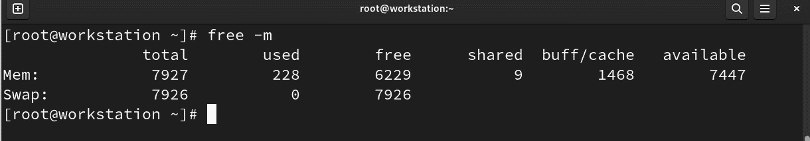
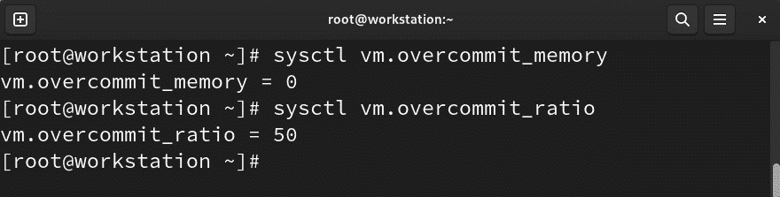

# 11

# 性能调优最佳实践

性能调优系统资源是任何系统管理员的主要（甚至最重要的）任务之一。性能调优是调整系统配置以提高计算资源使用、数据吞吐量或用户体验的过程。它需要深入理解系统的硬件和软件组件，以及它们之间的许多交互。

性能调优常常与故障排除混淆，但它们之间有显著区别。在故障排除过程中，主要目标是找出并解决问题，使系统正常运行。而在性能调优中，目标是让系统在其所处的资源和环境下以最佳性能运行。

本章将涵盖以下主要主题，帮助您在系统的关键方面获得最佳性能：

+   理解内核调优

+   主要调优 – CPU 和内存

+   不要忽视存储调优

+   通过网络调优提升性能

# 技术要求

为了完成本章中的主题，您需要安装每个部分中指示的软件包。在那里，您会找到每个需要安装的软件包的说明。

本章中创建的示例可以从本书的 GitHub 仓库下载：[`github.com/PacktPublishing/Fedora-Linux-System-Administration/tree/main/chapter11`](https://github.com/PacktPublishing/Fedora-Linux-System-Administration/tree/main/chapter11)。

# 理解内核调优

Linux 内核通过`/proc`目录暴露*用户空间可调配的信息和配置*。`/proc`文件系统充当了**内核**数据结构和运行时信息的接口。它提供了一种访问有关进程、系统配置、硬件等详细信息的方式，通过虚拟文件的层级结构公开这些数据。

`/proc`目录中的文件包含系统信息，如内存（`meminfo`）、CPU（`cpuinfo`）和可用的文件系统。

`/proc/sys`子目录包含可配置参数，用于调整内核行为和活动。`/proc/sys`中的大多数文件可以由`root`用户修改。修改`/proc/sys`中的文件会立即对运行中的系统产生影响。

注意

更改**/proc/sys**中的文件可以提高运行系统的性能，但也可能导致性能下降。在对这些文件进行任何更改时，请小心。记得在更改前进行备份。

在`/proc/sys`内，文件按可调内核类型组织成子目录树：

+   **/proc/sys/dev**：包含**系统设备**的可调参数

+   **/proc/sys/fs**：包含与**文件系统**相关的可调变量

+   **/proc/sys/kernel**：包含改变**内部** **内核操作**的调整

+   **/proc/sys/net**：包含改变**网络配置**的可调参数

+   **/proc/sys/vm**：包含更改**内核虚拟内存管理**的参数

注意

请记住，并非所有**/proc/sys**中的文件都是可写的。有些文件仅能由操作系统本身修改。

让我们看看如何更改这些内核可调项。

## 调整内核参数

以下图示说明了如何以不同方式更改内核参数：


图 11.1 – Linux 性能调优工具，Brendan Gregg 著（CC BY-SA 4.0）

作为系统管理员，最佳实践是通过命令行进行更改，如下所示：

+   使用文本编辑器更改**/proc/sys**文件

+   使用**echo**命令设置可调项中的简单值

+   使用**sysctl**命令按名称设置参数

+   在**/etc/sysctl.d**目录中创建包含所需参数的文件

注意

直接更改内核可调值并不会使其在重启时保持*持久性*。要实现这一点，必须使用**sysctl**命令，或者在**/etc/sysctl.d**目录中创建一个包含更改的文件。

让我们看看每种不同方法的示例。按照以下步骤操作：

1.  查看**/proc/sys/net/ipv4**目录中**icmp_echo_ignore_all**可调项的内容：

    ```
    # cat /proc/sys/net/ipv4/icmp_echo_ignore_all
    0
    ```

    这个值（`0`）表示存在`icmp`（`ping`）支持：


图 11.2 – 工作站支持 ping

让我们进行更改。

1.  使用**echo**命令将可调项的值从*false*（**0**）更改为*true*（**1**）：

    ```
    # echo "1" > /proc/sys/net/ipv4/icmp_echo_ignore_all
    ```

    确认可调项的更改：

    ```
    # cat /proc/sys/net/ipv4/icmp_echo_ignore_all
    1
    ```

    如你所见，操作系统不再允许*ping*：


图 11.3 – 操作系统不允许 ping

这个更改也可以通过`sysctl`命令进行。

让我们开始吧。

1.  可调项的路径可以通过将**/proc/sys**下的斜杠替换为点表示。在我们的示例中，可调项如下：

    ```
    sysctl command with the –w option to enable ping:

    ```

    # sysctl -w net.ipv4.icmp_echo_ignore_all="0"

    net.ipv4.icmp_echo_ignore_all = 0

    ```

    Confirm that `ping` support is already enabled:
    ```


图 11.4 – 允许 ping

然而，这个更改在重启时不会保持。

让我们看看如何做这个。

1.  在启动时，内核会从这些目录中的配置文件加载可调设置：

    +   `.conf`扩展名，且可调设置为`true`：

        ```
        # sysctl command with the -p option to apply the setting:

        ```

        # sysctl -p /etc/sysctl.d/ping.conf

        net.ipv4.icmp_echo_ignore_all = 1

        ```

        Confirm the `ping` behavior change:
        ```


图 11.5 – 不允许 ping

这些是更改内核可调项的不同方法。要获取内核可调项的列表，可以使用`sysctl`命令的`-a`选项：

```
# sysctl –a
```


图 11.6 – 内核可调列表

对内核可调参数所做的更改会修改操作系统的行为。现在，让我们看看操作系统主组件的某些特定方面的更改。

# 主要调优 - CPU 和内存

在前一节中，*图 11.1* 展示了帮助我们收集系统资源使用性能信息的不同工具。

工具显示系统信息，如空闲磁盘空间、CPU 温度以及其他重要组件，还包括网络信息，如系统的 IP 地址和当前上传下载速率。

监控运行系统的资源是系统管理员的主要任务之一。系统监控的目标是确定当前的性能是否符合指定的技术要求。

监控资源性能帮助我们了解需要改进的领域。

在更改 CPU 和内存使用配置之前，让我们简要了解一下 Fedora Linux 中包含的基本监控工具。

## 监控工具概述

监控工具提供每个进程的统计信息，并基于进程结构或来自内核的系统范围统计信息。监控工具通常对*普通用户*可用，但对于更精细的详细信息，则需要系统管理员权限。

`ps` 和 `top` 命令是提供进程统计信息的最常用命令，包括 CPU 和内存使用情况。

作为 `root` 用户，使用 `aux` 选项运行 `ps` 命令将按用户列出具有扩展详细信息的进程：

```
# ps aux
```


图 11.7 – `ps aux` 命令的输出

以下表格按列描述了`ps aux`命令的输出：

| **列** | **描述** |
| --- | --- |
| `USER` | 运行此进程的用户。 |
| `PID` | 此进程的进程 ID。 |
| `%``CPU` | 此进程使用的 CPU 时间（以百分比表示）。 |
| `%``MEM` | 此进程使用的物理内存（以百分比表示）。 |
| `VSZ` | 此进程使用的虚拟内存（以字节为单位）。 |
| `RSS` | 常驻内存集大小，*不可交换*的物理内存使用量（以 KiB 为单位）。 |
| `TTY` | 启动进程的终端。*问号*（`?`）表示该进程不是从终端启动的。 |
| `STAT` | 进程状态。 |
| `START` | 进程的启动时间和日期。 |
| `TIME` | 此进程使用的总 CPU 时间。 |
| `COMMAND` | 启动进程的命令及其所有参数。 |

表 11.1 – `ps aux` 命令输出描述（按列）

*更多详细信息将在以下部分提供。

注意

有关*进程状态代码*的更多信息，请参阅**ps**的手册页。使用**man ps**命令。

与 `ps` 命令不同，`ps` 输出是静态的，而 `top` 命令提供了进程活动的实时报告。它还提供了一个界面，用于筛选和操作监控数据：

```
# top
```


图 11.8 – top 命令的输出

命令输出的标题提供有关当前系统行为的一般信息：

+   第一行包括当前时间、系统运行时间、连接的用户数量，以及过去 1、5、15 分钟的平均负载

+   第二行显示任务数量及其状态：运行、睡眠、停止或僵尸

+   第三行显示不同的 CPU 使用值（在运行时）：

    +   **us**: **CPU** 在 *用户空间* 中运行进程所花费的时间

    +   **sy**: 花费时间运行 *系统内核* *空间* 进程

    +   **ni**: 花费时间运行具有手动设置 **nice** 值的进程

    +   **id**: **CPU** 空闲时间

    +   **wa**: **CPU** 花费时间等待 **I/O** 任务完成

    +   **hi**: 花费时间服务 *硬件中断*

    +   **si**: 花费时间服务 *软件中断*

    +   **st**: 由于运行虚拟机而丧失的时间（*steal time*）

+   第四行显示物理内存的总量（以 KiB 为单位），以及空闲、已用、已缓存或缓冲的内存量

+   第五行显示交换内存的总量（以 KiB 为单位），以及空闲、已用和可用的交换内存

以下表格逐列描述 `top` 命令的输出：

| **列** | **描述** |
| --- | --- |
| `PID` | 进程 ID |
| `USER` | 进程的用户拥有者 |
| `PR` | 进程优先级 |
| `NI` | 进程的 Nice 值 |
| `VIRT` | 进程使用的虚拟内存 |
| `RES` | 进程使用的常驻内存 |
| `SHR` | 进程使用的共享内存 |
| `S` | 进程状态 |
| `%``CPU` | 自上次更新以来，进程使用的 CPU 时间百分比 |
| `%``MEM` | 使用的物理 `内存` 的百分比 |
| `TIME+` | 任务使用的总 CPU 时间，以百分之一秒为单位 |
| `COMMAND` | 启动进程的命令及其所有参数 |

表 11.2 – top 命令输出的逐列说明

注意

有关进程状态代码的更多信息，请参阅 **top** 手册页面。使用 **man top** 命令进行查看。

关于 `memory`，`free` 命令列出了空闲和已用的 *物理* 内存和 *交换* `内存`。通过使用 `-b`、`-k`、`-m` 和 `-g` 选项，输出将分别以字节、KB、MB 和 GB 显示：

```
# free
```


图 11.9 – 运行 free 命令的不同选项后的输出

GNOME 桌面提供了一个图形工具用于资源监控。在主菜单中，选择 `系统监视器`：


图 11.10 – 来自活动概览的 GNOME 系统监视器

你也可以通过运行 `gnome-system-monitor` 命令从终端打开该工具：

```
$ gnome-system-monitor
```


图 11.11 – GNOME 系统监视器

Fedora Linux 通过其官方仓库提供一个集成多种监控工具的软件包。`sysstat` 软件包从内核计数器中获取 *原始数据*，并允许你显示和存储度量数据到历史 *进程* *运行* 数据库中。

以下工具包含在该软件包中：

+   **mpstat**：报告单个或合并的 **CPU** 相关统计信息

+   **iostat**：报告设备、分区和网络文件系统的**CPU**和 I/O 统计信息

+   **pidstat**：报告进程的统计信息，包括磁盘 **I/O**、**CPU** 和 **内存** 使用情况

+   **cifsiostat**：报告共享文件系统、打印机或网络串行端口的统计信息

+   **sar**：收集、报告并存储系统活动信息

要安装该软件包，请从终端运行以下命令：

```
# dnf install sysstat
```

所有这些工具都用于测量和存储系统资源使用信息。通过这些工具，我们可以确定资源的哪些方面存在改进空间。

让我们从 `CPU` 使用开始。

## 改善 CPU 使用情况

要找出 CPU 使用的改进点，首先要观察 CPU 的行为。让我们学习如何使用不同的监控工具检查 CPU 使用情况。请按照以下步骤操作：

1.  使用 **ps** 命令列出 CPU 使用率最高的进程：

    ```
    # ps ax --format pid,%cpu,cmd --sort -%cpu
    ```


图 11.12 – ps 命令输出列出最高 CPU 使用率的进程

`ps ax` 命令的此模式通过进程标识符（`pid`）、CPU 使用百分比和启动该进程的命令格式化输出，按 CPU 使用百分比进行排序。

输出显示，CPU 使用率最高的进程是 SSH，这对于管理任务来说应该是正常的。

在我们的系统中，正在运行一个 Web 服务器。让我们分析它的 CPU 使用情况。

1.  使用 **ps** 命令识别 **httpd** 进程及其 CPU 使用情况：

    ```
    # ps auxf | grep "[h]ttpd"
    # ps ax --format pid,%cpu,cmd --sort -%cpu | grep "[h]ttpd"
    ```


图 11.13 – 识别 httpd 进程及其 CPU 使用情况

注意

将进程的第一个字符括在方括号中，可以限制搜索范围，忽略输出中的 **grep** 命令本身。

请注意，显示的 CPU 使用情况并不显著，因此需要进一步研究，找到 CPU 使用的真实值。

1.  使用进程标识符（**pid**）通过 **top** 命令查找资源使用情况：

    ```
    # top -p 851,876,881,910
    ```


图 11.14 – 使用 top 命令监控资源使用情况

现在，让我们使用 `sysstat` 软件包中包含的工具，获取更多有关进程性能的信息。

1.  使用带有进程标识符（**pid**）的 **pidstat** 命令，在 *1 秒间隔* 下获取进程的 CPU 使用情况：

    ```
    # pidstat -p 851,876,881,910 1 1
    ```


图 11.15 – 进程 CPU 使用百分比

单个 CPU 一次只能运行 *一个进程*。为了让 Linux 系统同时运行多个进程，通过多任务处理，进程在 CPU 上交替运行。

内核使用 *进程调度器* 来决定在任何给定时刻应该运行哪个进程。进程调度器必须在多个选项之间进行平衡，基于某些标准，如决定哪个进程获得下一个执行机会，确保公平的 CPU 时间分配，同时允许高优先级进程获得更多的时间片，并抢占低优先级进程，或者在不同工作负载条件下具有可预测性和可扩展性。

调度器根据分配给每个线程或进程的调度优先级策略控制执行顺序。这些调度策略分为两组：**非实时策略**和**实时策略**。

注意

**实时计算** (**RTC**) 保证系统从事件到响应的时间满足规定的时间约束。*实时系统* 描述了一种控制环境的系统。它接收数据，处理数据，并迅速返回结果，足以在该时刻影响环境。

使用实时策略的进程优先级值在 `1` (*最低*) 和 `99` (*最高*) 之间，并且被称为 `0`。

进程的优先级在生命周期内可能会 *增加* 或 *减少*；这就是 `nice` 或 `renice` 命令的作用。

由于非实时进程的静态优先级被设置为 `0`，因此 nice 值决定了非实时进程的 *相对调度*。nice 值的范围从 `-20` (*最高*) 到 `19` (*最低*)。

Fedora Linux 提供了六种调度策略，分为两组：`实时` 和 `非实时` 调度类。以下表格列出了每个调度类中可用的策略：

| **类别** | **策略** | **定义** |
| --- | --- | --- |
| 实时调度器 | `SCHED_FIFO` | 使用 *先到先服务* 调度算法，无时间片。 |
| `SCHED_RR` | 使用 *轮转调度* 算法并带有时间片。 |
| **完全公平调度器** (**CFS**) | `SCHED_NORMAL` (*也称为* `SCHED_OTHER`) | 定义了 *轮转调度* 样式的时间共享计划。 |
| `SCHED_BATCH` | 适用于 *批处理型* 工作负载。 |
| `SCHED_IDLE` | 适用于运行低优先级的应用程序。 |
| 截止时间调度器 | `SCHED_DEADLINE` | 调度器保证在高负载条件下也能进行实时任务调度。它通过使用三个参数——`period`、`deadline` 和 `runtime`——以纳秒为单位定义任务。 |

表 11.3 – 调度策略

继续使用之前的 Web 服务器示例来分析其进程的优先级。按照以下步骤进行：

1.  使用 **ps** 命令列出进程的优先级：

    ```
    # ps axo pid,pri,rtprio,ni,cls,comm | grep -e "PID" -e "[h]ttpd"
    ```


图 11.16 – 查看进程优先级

在这里，`pri`列显示`19`，`rtprio`列显示实时优先级（`-`），`ni`列显示`0`，`cls`列显示`TS`表示**时间共享**。

以上输出表明该进程的运行优先级较低。让我们更改它。

1.  使用**chrt**命令显示 web 服务器进程的调度策略和优先级：

    ```
    # chrt -p [PID]
    ```


图 11.17 – 调度 web 服务器进程的策略和优先级

所有进程的调度优先级为`0`，其调度策略为`SCHED_NORMAL`（或`SCHED_OTHER`）。让我们优化进程运行。

1.  停止 web 服务器服务，并通过将调度策略更改为**SCHED_FIFO**，调度优先级设置为**38**来重新启动它。使用**chrt**命令和进程二进制文件：

    ```
    # systemctl stop httpd
    # chrt -f 38 /usr/sbin/httpd
    ```


图 11.18 – 更改调度策略和优先级

审查 web 服务器进程的调度策略和优先级。

注意

要了解更多有关**chrt**命令选项的信息，请通过运行**man** **chrt**命令参考手册页。

该更改是临时的。当进程重新启动时，调度策略和调度优先级应该再次生效。

要为每次启动时改进进程的性能设置调度策略和优先级，必须将其添加到服务的`unit`文件中。

让我们开始吧。

1.  为**httpd**服务创建一个调度配置文件，内容如下：

    ```
    # vim /etc/systemd/system/httpd.service.d/10-scheduler.conf
    [Service]
    CPUSchedulingPolicy=rr
    CPUSchedulingPriority=10
    ```


图 11.19 – 创建服务配置文件

单元配置策略设置为在启动过程中更改服务的优先级。[Service]部分的指令更改调度策略和优先级：

+   **CPUSchedulingPriority**（**Nice**）：设置服务的默认**nice**级别。*nice*级别设定为**-20**（*最高优先级*）和**19**（*最低优先级*）之间的数字。

+   **CPUSchedulingPolicy**：为服务设置**CPU**调度策略。策略的值可以是**other**、**batch**、**idle**、**fifo**和**rr**。

注意

在撰写本文时，**CPUSchedulingPolicy**变量不支持**SCHED_DEADLINE**策略设置。

在重新启动 web 服务器服务之前，重新加载由`systemd`加载的服务配置。使用`systemctl`命令：

```
# systemctl daemon-reload
```

重新启动服务以应用策略和优先级更改。

1.  使用**systemctl**命令重新启动 web 服务器服务：

    ```
    # systemctl restart httpd
    ```


图 11.20 – 重新启动 web 服务器服务

审查 web 服务器进程的调度策略和优先级。

优先级和调度策略的更改应在服务启动时生效。此更改可提高服务的性能。

我们在这里讲解的内容适用于处理的情况。接下来，让我们学习如何优化内存使用。

## 提升内存使用效率

`ps` 和 `top` 工具区分了两个统计值：`VIRT`（或 `VSZ`），即进程请求的虚拟内存总量；以及 `RES`（或 `RSS`），即进程当前映射到物理内存中的虚拟内存总量。`RSS` 是最关键的值。

使用前面的示例，使用 `ps` 命令查看映射到 Web 服务器进程的虚拟内存值：

```
# ps -o pid,vsz,rss,comm -C httpd
```


图 11.21 – 审查映射到 Web 服务器的虚拟内存

当进程请求内存时，虚拟内存地址会被保留，但内核并不会将其分配给物理页面框架。内核只有在进程开始使用 `memory` 时，才会将物理页面框架分配给它。

与处理的优先级和调度策略改变类似，应用程序所消耗的内存也可能发生变化。

按照此步骤调整 `sshd` 进程的 `MemoryLimit` 参数：

1.  使用 **sysctl** 命令，调整 **MemoryLimit** 参数：

    ```
    # systemctl set-property sshd.service MemoryLimit=1G
    ```

注意

内存大小可以使用 **K**、**M**、**G** 或 **T** 后缀分别表示千字节、兆字节、吉字节或太字节。

此命令修改服务的启动配置文件。

使用 `sysctl` 命令显示服务单元文件。过滤 `Memory` 参数：


图 11.22 – 审查 MemoryLimit 参数

在 *图 11.22* 中，我们发现内核为该服务分配了 10 MB 内存，并通过设置 `MemoryLimit` 参数，确保它只使用最多 1 GB 的内存。

控制分配给服务的资源使它们能够提高自身性能，并间接提升操作系统的性能。

在 Linux 中，管理未分配的内存是最需要密切监控的任务。内核将大部分未分配的内存作为缓存，用来存储从磁盘读取或写入的数据。下次当进程需要这些数据时，系统会从 RAM 中获取，而不是从磁盘中读取。缓存机制通常能提高性能，因为存储通常比物理内存慢得多。

除了缓存页面外，系统还使用匿名页面。匿名页面在磁盘上没有关联的数据。这些匿名页面代表了进程分配并用来存储工作数据的页面。

我们有不同的工具和实用程序帮助我们监控两者。

让我们简要概述一下这些工具和实用程序。

使用 `free` 和 `vmstat` 命令检查内存使用情况：

```
# free –m
```



图 11.23 – free 命令输出

在该系统中，有 8 GiB 的 RAM。缓存页面（`buff/cache` 列）消耗了 1 GiB。

让我们将其与 `vmstat` 命令的输出进行比较：

```
# vmstat --unit M 1
```


图 11.24 – vmstat 命令的输出

从 `vmstat` 命令的输出中注意到，页面缓存的大小是 `buff` 和 `cache` 列的总和。缓冲区是页面缓存的一部分。缓冲区存储的是直接从块设备读取的数据块，而不是从文件系统读取的数据。

匿名页在系统内存紧张时会被移到交换区。内核在恢复匿名页或页面缓存中的页面之间做出选择。交换空间的可用性增加了有效内存的数量。

从 `vmstat` 命令的输出（*图 11.24*）中，在 `swap` 部分，我们可以看到匿名页的值：

+   **si**: 每秒交换 *进出* 页数

+   **so**: 每秒交换 *移出* 页数

*交换区* 是多年来讨论的话题。计算交换区的方式在计算机时代初期，曾是当时系统管理员之间的一个神话。这些方法不仅被视为良好的实践，还是创建交换区时的必备项。这是因为，在那个时期，物理存储非常昂贵。

如今，随着新技术的发展，存储变得更加便宜和可承受。因此，创建交换区被视为根据使用案例标准来考虑。

Red Hat 提出了以下表格，作为在创建交换区时进行大小调整的使用案例基础：

| **RAM** | **交换空间** |
| --- | --- |
| 2 GiB 或更少 | *两倍* 的 RAM |
| 介于 2 GiB 和 8 GiB 之间 | 等于 RAM |
| 介于 8 GiB 和 64 GiB 之间 | 至少 4 GiB |
| 超过 64 GiB | 至少 4 GiB |

表 11.4 – 交换区大小的基本指导

请记住，当进程请求内存时，内核仅保留虚拟内存，并不消耗任何 RAM。由于内核只有在进程启动时才分配物理页面帧，这允许应用程序分配比系统实际可用内存更多的内存。这一功能被称为内存超分配。

系统的内存超分配策略可以通过 `sysctl` 变量 `vm.overcommit_memory` 调整。你可以将其设置为以下值之一：

+   **0**: 内核使用 *启发式超分配算法*。这是系统的默认配置。

+   **1**: 内核 *始终* 超分配内存。无论是否有足够的空闲内存，它总是会授予内存分配。

+   **2**: 内核严格控制内存超分配。它仅分配等于 *交换空间加上物理内存百分比* 的内存（默认是 50%）。这个百分比由 **vm.overcommit_ratio** 变量定义。

使用 `sysctl` 命令验证这两个变量：

```
# sysctl vm.overcommit_memory
# sysctl vm.overcommit_ratio
```



图 11.25 – 查看内存超分配变量

监控这些内存的基本方面有助于提高系统及其提供的服务的性能。

让我们看看如何对存储进行相同的操作。

# 不要忽视存储调优。

与其他系统资源不同，存储可以在确定其大小后优化性能。当分析其使用情况时，也可以进行调优。

为此，必须考虑正确的大小调整取决于区分存储分配过程中使用的度量单位。

一个非常常见的错误是使用错误的存储度量进行大小调整，导致存储空间未被充分利用或浪费。

关键点在于，硬盘制造商如何克服创建一个存在于两个世界中的设备的挑战。磁盘在创建文件系统之前是一个原始的物理设备，没有虚拟或数据结构。一个原始磁盘在格式化为文件系统后变成一个块设备结构。文件系统是二进制结构。

这意味着我们必须创建一个物理设备，按照现实世界的物理规则创建，并将其转换为数字世界中的数据结构。

`-` 为 *kilo-*，并添加字母`-` *bi* `-` 代表 *binary*。

错误点发生在值被混淆时。请注意以下对比表中的差异：

| **SI** **十进制前缀** |
| --- |
| **前缀** | **命名法** | **基数** | **字节数** |
| kilo- | k | 103 | 1,000 |
| mega- | M | 106 | 1,000,000 |
| giga- | G | 109 | 1,000,000,000 |
| tera- | T | 1012 | 1,000,000,000,000 |
| **IEC** **二进制前缀** |
| kibi- | Ki | 210 | 1,024 |
| mebi- | Mi | 220 | 1,048,576 |
| gibi- | Gi | 230 | 1,073,741,824 |
| tebi- | Ti | 240 | 1,099,511,627,776 |

表 11.5 – 前缀比较

那么，1 TB 磁盘上有多少字节？

1 TB 等于 1 x 1,012 字节 = 1,000,000,000,000。

如前所述，要在磁盘上创建文件系统，二进制结构使用默认的块大小为 4,096（4 KiB）。使用这种命名法，1 TB 等于 1,012 字节。

因此，一些操作系统工具可能报告为 TB，但实际上它们是以二进制的 tebibytes (TiB) 为单位进行度量的。

一个报告磁盘大小为 TB 的工具，但将 TB 作为 tebibytes 来度量，会报告一个 1 TB 的磁盘只有 0.91 TB 大（即 0.91 TiB），差异接近 10%。

因此，明确说明在系统报告中使用哪些单位来分析大小非常重要，否则分析中可能会发生重大错误。

现在，让我们学习如何分析存储空间使用情况。

## 改善存储空间使用

分析存储空间使用时的一个大问题是如何正确识别它。映射到文件系统的稳定标识符是其 **UUID**。这是一个十六进制数字，作为 **通用唯一标识符**。

UUID 是文件系统的一部分，只要文件系统没有重新生成，它就会保持不变。

列出块设备的工具是 `lsblk` 命令。

带有`-fp`选项的`lsblk`命令显示设备的完整路径，以及 UUID 和挂载点，还显示物理磁盘分区的文件系统类型：

```
# lsblk -fp
```


图 11.26 – lsblk 命令的输出

注意

如果文件系统未挂载，则挂载点会显示为空白。

获取文件系统总使用情况信息时最常用的工具是`df`命令。使用`-h`选项时，输出会以易于阅读的格式显示：

```
$ df –h
```


图 11.27 – df -h 命令的输出

通过安装之前提到的`sysstat`包，我们可以获得用于监控系统性能的工具。在存储方面，`iostat`命令显示每个磁盘的 I/O 统计信息，以及工作负载、使用率和饱和度指标。

运行没有参数的`iostat`命令将返回 CPU 使用情况和磁盘 I/O 指标：

```
# iostat
```


图 11.28 – iostat 命令的输出

通过结合使用`iostat`命令的不同选项，我们可以生成非常有用的使用统计信息。以下是一个示例：

```
# iostat -dyz  1 3
```


图 11.29 – iostat -dyz 命令的输出

让我们看看使用了哪些选项：

+   **-d**显示磁盘 I/O 使用报告

+   **-y**跳过自系统启动以来的第一次统计报告

+   **-z**跳过非活动设备

+   间隔是 1 秒

+   计数是每个间隔输出的三次报告

注意

关于**iostat**命令选项的更多信息，请参阅手册页。您可以通过运行**man** **iostat**命令来查找它们。

如前一节所述，拥有交换空间可以增加有效内存量。让我们学习如何在系统中创建有效大小的交换空间。

我们将使用在*第四章*中使用的`/dev/sdc`磁盘来使用 Stratis 创建文件系统。请按照上述章节中的说明，删除池并清除磁盘上的文件系统。

然后，按照以下步骤操作：

1.  使用**wipefs**命令：

    ```
    # wipefs /dev/sdc
    ```

注意

此命令会销毁设备的文件系统信息。请务必小心，并验证您希望擦除的设备是否正确。

现在，让我们为交换区创建分区。

1.  检查**/dev/sdc**磁盘，以确认没有创建任何分区。使用**parted**命令：

    ```
    # parted /dev/sdc print
    ```


图 11.30 – 列出/dev/sdc 磁盘分区

创建一个 512 MB 的分区。

1.  使用**parted**命令：

    ```
    # parted /dev/sdc
    ```


图 11.31 – 创建交换分区

使用没有子命令的`parted`命令将打开一个交互式的`parted`会话。

在交互式会话中，执行以下操作：

1.  运行**mkpart**子命令来创建分区。

1.  将分区名称设置为**swap1**。

1.  将文件系统类型设置为**linux-swap**。

1.  分区应该从 2,049 KB 开始，结束于 513 MB，这样大小为 512 MB。

注意

重要的是，分区要从底层存储的第一个块开始。以扇区**2048**开始是现代 Linux 的默认值，并且在所有存储类型上都存储此值。这被称为初始偏移或分区对齐。

通过运行`print`子命令来验证分区是否已创建。

输入`quit`以退出交互式`parted`会话。

注意

**parted**命令也可以以*二进制方式*显示输出。

运行`# parted /dev/sdc unit MiB` `print`命令：


图 11.32 – 在二进制基础上显示的`parted`命令输出

请求系统检测新分区并在`/dev`目录中创建相关的设备文件。

1.  运行**udevadm settle**命令以观察**udev**事件队列并更新它：

    ```
    # udevadm settle
    ```

    现在，格式化分区。

1.  使用**mkswap**命令：

    ```
    # mkswap /dev/sdc1
    ```


图 11.33 – 格式化分区

查看系统的交换区域。

1.  使用**free**命令：

    ```
    # free -m
    ```


图 11.34 – 查看交换内存

在系统中激活交换分区。

1.  使用**swapon**命令：

    ```
    # swapon /dev/sdc1
    ```


图 11.35 – 激活交换分区

现在，验证系统的交换区域。

新的交换区域分区已经激活并可供系统使用。为了使其持续激活，我们需要在`/etc/fstab`文件中创建一个条目。

1.  识别交换分区的 UUID 并在**/etc/fstab**文件中创建条目。使用**lsblk**命令执行此操作：

    ```
    # lsblk -fp
    ```


图 11.36 – 识别交换分区的 UUID

将以下行添加到`/etc/fstab`文件中：

```
UUID=6f53144d-fe12-4fc3-bb69-6469012592dc  swap  swap  defaults 0 0
```


图 11.37 – 将交换分区添加到`/etc/fstab`文件

通过这种方式，交换分区可以持续可用。这样，系统性能得以提高，因为物理内存变得可用。在此阶段，存储空间已优化为交换空间。

最后，我们来学习如何改善网络连接到系统的性能。

# 通过网络调优提升性能

网络是调整系统时涉及的最复杂和关键的元素之一。作为外部自组织的元素，一些网络元素可能会影响性能。为了识别并调整它们，需要了解数据包在系统发送和接收时的流向，以及可用于它们的调优选项。

数据包的传输和接收流程大致如下：

+   **传输**：

    1.  数据会被写入套接字（如文件等对象）并发送到传输缓冲区。

    1.  内核将数据封装为 **协议数据单元**（**PDU**）。

    1.  PDU 会进入设备的传输队列。

    1.  网络设备驱动程序将 PDU 从传输队列头部复制到 NIC。

    1.  NIC 在传输时发送数据并触发中断。

+   **接收**：

    1.  NIC 接收一个帧，并使用 DMA 将该帧复制到接收缓冲区。

    1.  NIC 触发一个硬中断。

    1.  内核处理硬中断，并调度软中断来处理数据包。

    1.  软中断处理并将数据包移至 IP 层。

    1.  如果数据包是为了本地传输，则 PDU 会被解封装并放入套接字接收缓冲区：

    1.  如果进程在此套接字中等待，它会处理接收缓冲区中的数据。

针对提高网络流量的调优参数包括缓冲区限制。内核会根据当前的网络使用情况调整这些缓冲区的大小，但会在内核调优参数规定的范围内。变量的默认值会在启动时根据可用内存的数量进行计算。

`sysctl` 命令执行时可能会改变的内核调优参数如下：

+   **net.ipv4.tcp_mem**：此项指定 TCP 系统内存限制。它包含三个字段：**min**，**max** 和 **pressure**（当 TCP/UDP 中使用的内存量超过此值时，页面会被调节，直到它们降回并恢复到 **min** 值）。这些值表示页面的数量，而非字节。

+   **Net.ipv4.udp_mem**：此项指定 UDP 系统内存限制。它包含三个字段：**min**，**max** 和 **pressure**。这些值表示页面的数量，而非字节。

+   **net.core.rmem_max**：最大网络核心套接字接收/发送（**读/写**）缓冲区。值以字节为单位。

+   **net.core.wmem_max**：最大网络核心套接字接收/发送（**读/写**）缓冲区。值以字节为单位。

+   **net.ipv4.tcp_rmem**：最大 TCP 套接字接收/发送（**读/写**）缓冲区。它包含三个字段：**min**，**default** 和 **max**。值以字节为单位。

+   **net.ipv4.tcp_wmem**：最大 TCP 套接字接收/发送（**读/写**）缓冲区。它包含三个字段：**min**，**default** 和 **max**。值以字节为单位。

注意

这些值的变化应在进行行为分析后进行。

通常，在分析完系统行为后，才应更改调优值。

为此目的，存在一些工具和实用程序，我们在本章中已使用它们。

现在，让我们看看一个与 `sysstat` 配合使用并提供收集指标的图形显示的工具。

## 分析指标

除了安装 `sysstat` 包以监控工具外，它也可以作为服务运行：

```
# systemctl enable --now sysstat
```


图 11.38 – 查看 sysstat 服务的状态

`sysstat` 服务收集、报告或保存有关系统活动的信息。它将操作系统计数器存储在 `/var/log/sa/sadd` 文件中。从收集到的数据中，可以获得大量关于系统的信息：

+   CPU 使用情况

+   内存分页和使用情况

+   网络 I/O 和传输统计

+   进程创建活动

+   所有块设备的活动

+   每秒中断数

我们可以使用 `sar` 命令获取收集的数据：

+   使用 **sar** 命令和 **-u** 选项来获取 CPU 使用报告：

    ```
    # sar –u 1 3
    ```


图 11.39 – sar –u 命令的输出

此命令也用于读取记录日常数据的历史文件。

+   使用 **sar** 命令读取 **/var/log/sa** 中的日志文件之一：

    ```
    # sar –q –f /var/log/sa17
    ```


图 11.40 – 日志文件的内容

注意

要了解 **sar** 命令选项的更多信息，请运行 **man** **sar** 命令查看手册页。

从这些文件中，可以生成图表并将其导出为图片或甚至 PDF 报告。最常用的工具是 `ksar`。

要获得 `ksar`，请从他们的网站下载：[`sourceforge.net/projects/ksar/`](https://sourceforge.net/projects/ksar/)：


图 11.41 – ksar 网站

注意

可以从其 GitHub 仓库下载 **ksar** 工具的更新版本：[`github.com/vlsi/ksar/releases`](https://github.com/vlsi/ksar/releases)。

`ksar` 工具作为 `jar` 文件提供，因此需要安装 `java-17-openjdk` 包：

```
# log files to analyze, either by period or by a known event. A copy of the file can be used to generate the performance graphs. Follow these steps:

1.  Use the **sar** command to redirect the contents of the log files to a text file:

    ```

    # LC_ALL=C sar -A > /tmp/sar.data.txt

    ```

     2.  Use the **java** command to open the **ksar** tool:

    ```

    $ java -jar kSar.jar

    ```


Figure 11.42 – The ksar tool’s main window
Load the `data` file created from the `log` files to generate the system performance graphs.

1.  From the **Data** menu, click on **Load from a** **text file…**:


Figure 11.43 – The Load from a text file… option
The file selection window will open.

1.  Navigate to the directory where the generated file resides:


Figure 11.44 – Selecting the sar file
Select the `sar` file and click **Open**.
The file will take some time to load, depending on its size and the amount of data to analyze.

1.  After loading finishes, the window will display the data column for filtering by resource:


Figure 11.45 – Data analyzed window
Navigate to **NIC** to review the network behavior.

1.  Click **Interfaces traffic** and then **eth0**:


Figure 11.46 – NIC performance graph
Note
On your system, the device may be different. Please confirm the device information that we will analyze.
This way, the behavior could be better visualized.
Let’s export these graphs.

1.  Click on the **Export** menu and then **Export** **to PDF…**:


Figure 11.47 – The Export menu
The window for selecting the data to export will open.

1.  Select the data to export and click the **OK** button:


Figure 11.48 – Selecting data to export
Name the file, as is best practice, with the system’s name, and save it in the directory of your choice.
Note
You can get the export report from our GitHub repository at [`github.com/PacktPublishing/Fedora-Linux-System-Administration/blob/main/chapter11/workstation.packt.lab.pdf`](https://github.com/PacktPublishing/Fedora-Linux-System-Administration/blob/main/chapter11/workstation.packt.lab.pdf).
This concludes the best practices for improving system performance. In the next chapter, we will talk about the security provided by Fedora Linux.
Summary
In this chapter, we provided an overview of best practices in system tuning. Beyond configurations, we looked at the tools that are available in Fedora Linux to analyze system behavior.
System tuning, in most cases, is performed after a failure incident. It is at this point that it gets confused with troubleshooting. System tuning is about more than resolving a failure – it is about collecting metrics and performing analysis using the right tools.
First, we learned how to change the kernel tunables using the `sysctl` command to understand their origin and the scope of these changes in their original configuration.
Then, we learned how to use the system tools and utilities, including the `ps`, `top`, and `free` commands. We also covered the suite of utilities provided by installing the `sysstat` package, including the `mpstat`, `iostat`, `pidstat`, and `sar` commands.
After that, we briefly reviewed the *units of measurement*, which cause failures when sizing resources, particularly in storage.
Finally, we touched on network tuning and discussed the limitations of the operating system. While doing so, we learned how to use `ksar`, a tool that helps us graph the metrics collected by `sysstat` when it’s running as a service.
In the next chapter, we will take a walk through the hardened security layer offered by Fedora Linux: SELinux. In most cases, this is not activated due to ignorance of how it works. We will clarify how it operates so that we can implement it in our systems.

```
