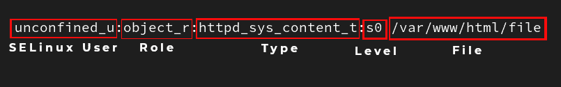
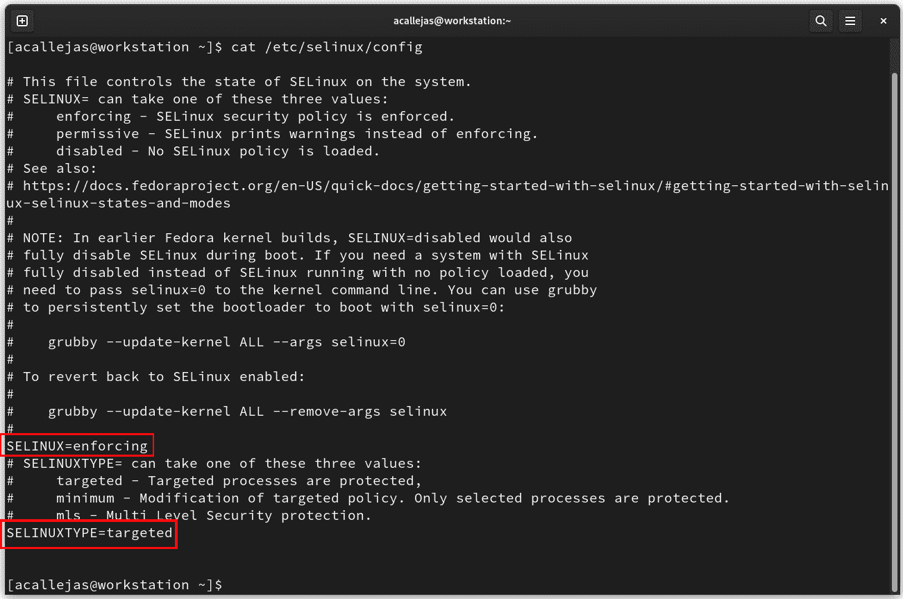
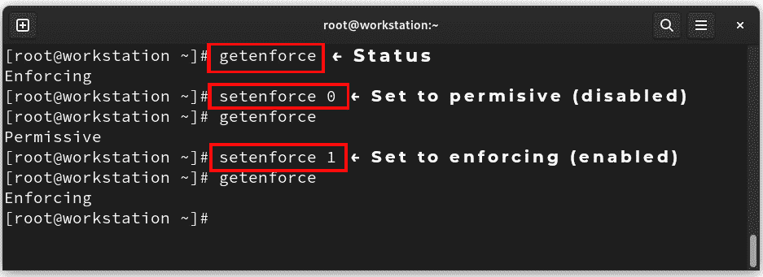
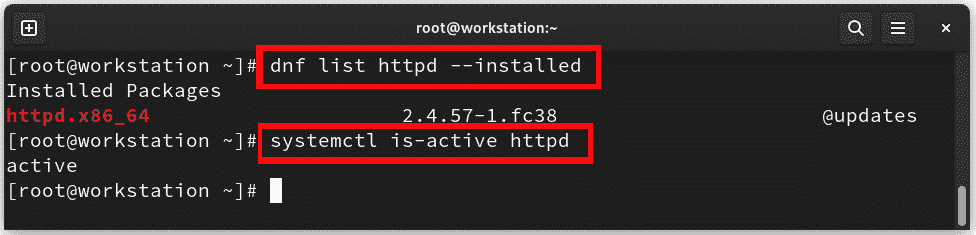
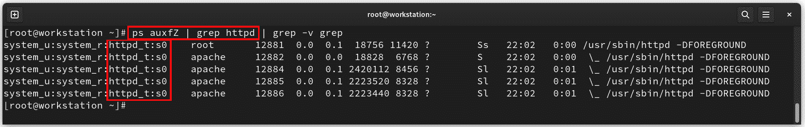
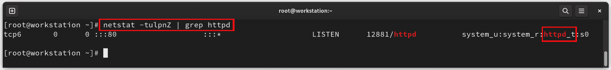
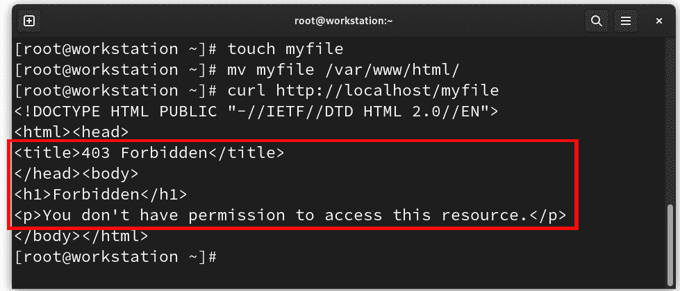
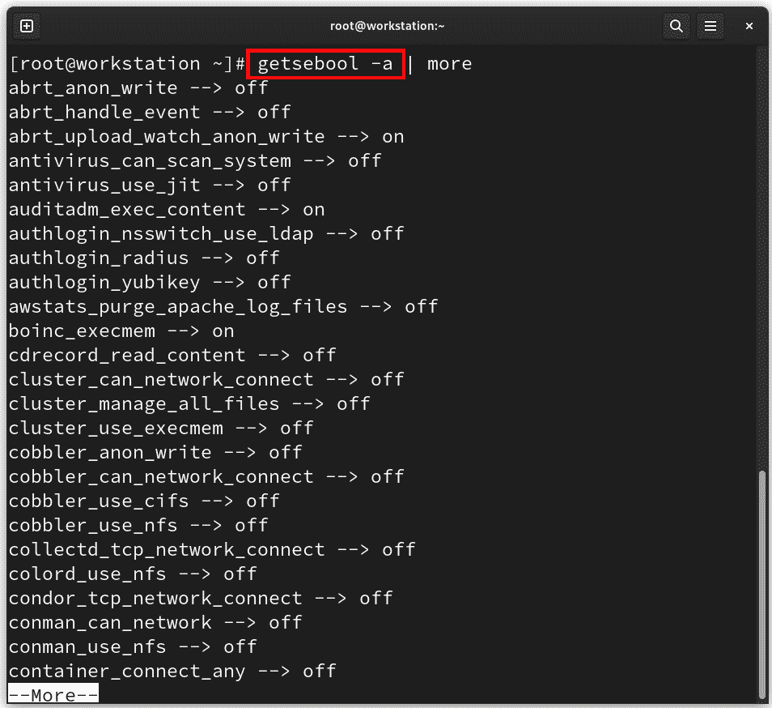
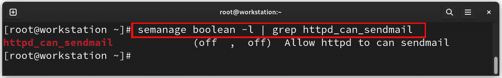

# 第十四章：用 SELinux 解开安全难题

*安全性*、*加固*、*合规性*和*策略*：这四者是系统管理员末日审判中的四骑士。一个重要的战斗是维护系统的安全性。除了日常任务，系统的安全性也是工作的一部分，即使是那些第三方提供商要求我们停用*增强安全性*的系统。在大多数情况下，通过分析就足以找到正确的故障排除方法或解决方法。

**增强安全 Linux**（**SELinux**）是一种运行在用户空间的代码，通过利用内核代码（**Linux 安全模块**）提供对系统资源的**强制访问控制**（**MAC**）。对系统对象和特性进行的访问基于每个域，并遵循*最小特权*原则。

在本章中，我们将学习如何利用 SELinux 的优势来保护管理系统，主要涵盖以下内容：

+   学习强制访问控制

+   标签和类型强制

+   如何故障排除 SELinux 问题

# 技术要求

为了发展本章的主题，需要安装每个部分中所指定的包。在每个部分，你会找到关于如何安装每种包的不同类型的说明。

# 学习强制访问控制

Linux 文件权限控制哪些用户或用户组可以访问特定的文件。但是，一个具有读或写访问权限的用户可以以任何方式使用该文件，即使这种使用方式并不是该文件应该被使用的方式。

Linux 的*标准文件权限*在文件由单一所有者和单一指定用户组使用时成功。

文件权限未能防止某些形式的不必要访问。它们的设计初衷并不是控制文件的使用方式，而是控制谁可以读取、写入或执行文件。

Linux 标准文件权限是基于所有权的，也称为**自由访问控制**（**DAC**）。

MAC 规则是基于*策略*，而非所有权。

MAC 有两种类型：

+   **多级安全系统**：MAC 的原始和最简单形式由垂直的保护和安全级别结构组成。信息仅在该区域内流动。每个用户也被分配一个保护级别，这样他们只能访问相同或较低级别的资源。

+   **多边安全系统**：这些系统更加复杂，并根据不同的区段分配访问权限。这些区段形成关联，进而由保护级别和密码组成。这形成了一个水平的安全系统，同时也包括垂直的保护级别。

SELinux 是 Linux 上 MAC 应用的一个例子。

SELinux 提供了一种基于 MAC 原则的特殊安全架构。SELinux 通过严格的访问控制方法和相应的安全措施来 *最小化访问* 操作系统进程和文件。该模块旨在确保数据的机密性和完整性。此外，通过 SELinux，操作系统和用户程序保持相互隔离。

SELinux 还依赖于另外两个实现：**类型强制**（**TE**）和 **基于角色的访问控制**（**RBAC**）。通过 RBAC，访问权限根据定义的角色模型映射。定义的用户角色抽象了组织的工作流程。在 MAC 模型中，TE 是通过基于 *主体-访问-对象集* 的 *规则* 来管理访问的概念。

SELinux 定义了安全措施，并设置了额外的属性，说明在什么条件和什么情况下，权利持有者可以访问某些操作系统进程或文件。如果这些条件或关系（即属性）没有得到满足，访问将被拒绝。

SELinux 由一组策略组成，声明了每个应用程序使用的对象所允许的 *操作和访问*。它也被称为 *定向策略*，因为该策略仅涵盖单个应用程序的活动。策略声明了适用于单个程序、文件和网络端口的预定义标签。

SELinux 强制执行一套访问规则，防止一个应用程序中的安全漏洞影响到其他应用程序或系统本身。SELinux 提供了额外的安全层，但它也增加了一个复杂度，可能让那些不熟悉的人感到困惑。

为了更好地理解它是如何工作的，我们来了解 SELinux 的基本概念。

# 标签和类型强制

SELinux 是一个 *标签系统*，这意味着系统中每个文件、目录或对象都有一个相应的标签。每个文件、进程、目录和端口都有一个 *特殊的安全标签*，称为 SELinux 上下文。**上下文**是 SELinux 策略使用的标签名称，用来判断一个进程是否可以访问文件、目录或端口。策略控制这些元素之间的交互。默认情况下，策略不允许任何交互，除非显式的规则授权访问。如果没有权限规则，访问将被拒绝。Linux 内核强制执行这些规则。

SELinux 上下文的格式中有不同的标签，以冒号分隔：*用户*、*角色*、*类型* 和 *敏感级别*。它们的构成方式如下：

```
user:role:type:level (optional)
```

注意

*敏感级别*是可选部分。

定向策略基于第三个上下文组件：*类型*上下文。类型上下文名称通常以 `_t` 结尾。

让我们来看以下示例：



图 12.1 – SELinux 标签示例

在前面的示例中，`/var/www/html/file` 文件具有以下上下文组件：`unconfined_u` 是 SELinux 用户，角色是 `object_r`，类型是 `httpd_sys_content_t`，敏感级别是 `s0`。因此，访问该文件的上下文依赖于 `httpd_sys_content_t`。

我们通过一个示范例子来学习 SELinux 策略是如何工作的。

## SELinux 的工作原理

在分析 SELinux 的运行情况之前，首先要确定 SELinux 在系统上的运行模式。

SELinux 有三种模式：

+   **强制模式**：SELinux 强制执行访问控制规则。这是 Fedora Linux 默认启用的模式。

+   **宽容模式**：SELinux 虽然启用，但不会强制执行访问控制规则，而是*记录违反规则的警告*。此模式用于测试和故障排除。

+   **禁用**：SELinux 完全*禁用*；没有任何 SELinux 违规行为会被拒绝或记录。*在任何情况下都不推荐使用此模式*。

要了解 SELinux 的运行状态，可以使用 `sestatus` 命令：

```
$ sestatus
SELinux status:                 enabled
SELinuxfs mount:                /sys/fs/selinux
SELinux root directory:         /etc/selinux
Loaded policy name:             targeted
Current mode:                   enforcing
Mode from config file:          enforcing
Policy MLS status:              enabled
Policy deny_unknown status:     allowed
Memory protection checking:     actual (secure)
Max kernel policy version:      33
```

SELinux 运行模式在 `/etc/selinux/config` 文件中配置：



图 12.2 – SELinux 配置文件

在执行过程中，测试时 SELinux 模式可能会发生变化。但在*重启*系统后，它将再次使用配置文件中设置的模式。使用 `getenforce` 命令查看 SELinux 正在运行的模式，并使用 `setenforce` 命令更改模式，前提是以 `root` 用户身份执行：



图 12.3 – 更改 SELinux 运行模式

现在，让我们来看一下 SELinux 是如何工作的。

### 那么，SELinux 是如何工作的呢？

Linux 在操作系统早期阶段诞生。它作为运行 web 服务器的主要操作系统。

Apache web 服务器（`httpd`）本身并不不安全，但其*访问范围*非常广泛，因此非常重要的是要对其进行安全保护。

接下来，我们通过这个示例来理解 SELinux 是如何工作的。按照以下步骤操作：

1.  验证 **httpd** 服务是否已安装并在系统中处于活动状态：



图 12.4 – httpd 服务状态

1.  如果没有，使用 **dnf** 和 **systemctl** 命令来执行此操作：

    ```
    # dnf install httpd
    # httpd service runs a binary file to start. This file launches from /usr/sbin/.
    ```

1.  Linux 内核在大多数命令中集成了一个选项，可以查看 SELinux 上下文类型。使用 **ls** 命令和 **-Z**（或 **–context**）选项来识别二进制文件的 SELinux 上下文类型：

    ```
    # ls -Z /usr/sbin/httpd
    system_u:object_r:httpd_exec_t.
    ```

1.  **httpd** 服务的配置文件位于 **/etc/httpd**。我们来看一下它们的上下文类型：

    ```
    # ls -dZ /etc/httpd/
    system_u:object_r:httpd_config_t.
    ```

1.  **httpd** 服务的日志位于 **/var/log/httpd**。使用以下命令查找其上下文类型：

    ```
    # ls -dZ /var/log/httpd
    system_u:object_r:httpd_log_t.
    ```

1.  **httpd** 服务的内容类型目录位于 **/var/www/html**。使用以下命令查找它们的上下文：

    ```
    # ls -dZ /var/www/html
    system_u:object_r:httpd_sys_content_t.
    ```

1.  **httpd** 服务启动的单元文件位于 **/usr/lib/systemd/system/**。使用以下命令查找其上下文类型：

    ```
    # ls -Z /usr/lib/systemd/system/httpd.service
    system_u:object_r:httpd_unit_file_t.
    ```

1.  使用**ps**命令来查找正在运行的**httpd**服务守护进程的上下文类型：

    ```
    # ps auxfZ | grep httpd
    ```



图 12.5 – 查找 httpd 守护进程的上下文

服务守护进程的上下文类型是`httpd_t`。

1.  使用**netstat**命令来查找正在运行的**httpd**服务端口的上下文类型：

    ```
    # netstat -tulpnZ | grep httpd
    ```



图 12.6 – 查找 httpd 端口的上下文

服务端口的上下文类型是`httpd_t`。

上述示例可以总结为以下表格：

| **类型** | **上下文类型** |
| --- | --- |
| 二进制文件 | `httpd_exec_t` |
| 配置文件 | `httpd_config_t` |
| 日志 | `httpd_log_t` |
| 内容目录 | `httpd_sys_content_t` |
| 单元文件 | `httpd_unit_file_t` |
| 进程 | `httpd_t` |
| 端口 | `httpd_t` 或 `http_port_t` |

表 12.1 – httpd 服务上下文

注意上下文的关系；所有都属于`httpd_t`域。

因此，类型强制是一个概念，按照这个概念，在`httpd_t`上下文中运行的进程与标记为`httpd_sys_content_t`的文件进行交互是有意义的。

让我们来看看`/etc/shadow`文件的上下文，用户密码存储的位置：

```
# ls -Z /etc/shadow
system_u:object_r:/etc/shadow file is shadow_t.
From a basic functional perspective, the web server (`httpd`) *reads and publishes* documents that live within it. Besides the file’s proprietary permissions, security could enhance this through the SELinux policy. With proper proprietary permissions, there would be nothing to prevent the `httpd` service from publishing the file with user passwords.
With SELinux policies enabled, no matter what permission level the file has, the policy would *prevent* it from doing so.
Files with the `httpd_t` context type can only interact with files *under the same context type*. The password file belongs to a different context type than `httpd_t`; its context is `shadow_t`, thus their *interaction* *is denied*.
This is the most basic way SELinux works, and the way the policy works. It is not free of issues, but these are also limited by its nature.
Let’s see how to determine SELinux errors.
How to troubleshoot SELinux issues
The popular belief is that it is very difficult to determine and fix SELinux issues. This stems from the fact that the *logs* get logged with the system audit. This log reading is not intuitive and, in fact, to the human eye is quite complex; but it isn’t.
Carrying on with the example of the `httpd` web server, consider the following sequence of commands:

1.  As the **root** user, create the **myfile** file:

    ```

    # touch myfile

    ```

     2.  Move the **myfile** file to the *web* *content directory*:

    ```

    # mv myfile /var/www/html/

    ```

     3.  Use the **curl** command to get the contents of the **myfile** file published by the web server:

    ```

    # curl http://localhost/myfile

    ```

     4.  Observe the output:



Figure 12.7 – Creating the myfile web file

1.  Use the **grep** command to search for the **myfile** string in the *system* *audit log*:

    ```

    # grep myfile /var/log/audit/audit.log

    ...

    type=AVC msg=audit(1689045662.823:264): avc:  denied  { getattr } for  pid=1035 comm="httpd" path="/var/www/html/myfile" dev="vda3" ino=769948 scontext=system_u:system_r:httpd_t:s0 tcontext=unconfined_u:object_r:admin_home_t:s0 tclass=file permissive=0

    ```

At first glance, it is not very easy to read, but let’s analyze it in parts:

*   **type=AVC**: **AVC Audit Events** generated by the *AVC subsystem* (**AVC** means **Access Vector Cache**) as a result of access denials, or where specific events have requested an **audit** message.
*   **msg=audit(1689045662.823:264)**: The *timestamp* of the message in **Unix format** (epoch); use the **date** command to determine the time:

    ```

    # date -d @1689045662.823

    2023 年 7 月 10 日，晚上 09:21:02 CST

    ```

     *   **avc:  denied  { getattr } for  pid=1035**: The result of the **avc** audit event called **denied for** **pid 1035**
*   **comm="httpd"**: The **httpd** command
*   **path="/var/www/html/myfile"**: The **var/www/html/myfile** file path
*   **dev="vda3"**: The **vda3** device
*   **ino=769948**: Inode identifier
*   **scontext=system_u:system_r:****httpd_t****:s0**: *Source* context
*   **tcontext=unconfined_u:object_r:****admin_home_t****:s0**: Target context
*   **tclass=file**: Target class is a file
*   **permissive=0**: SELinux permissive mode disabled

Then, the audit message reads as follows:
*At the described timestamp, an* AVC *event resulted as denied for pid* `1035` *of the* `httpd` *command on the* `/var/www/html/myfile` *file, located on the device and the described inode. The source context type is* `httpd_t` *and the target context type is* `admin_home_t`*. The permissive mode is set* *as disabled.*
This indicates that it is an error of the SELinux contexts since they do not correspond and cannot interact with each other. That is, the web server is not allowed to read that file, as indicated by the output of the `curl` command.
At first, it looked very complicated, but when analyzing the log, the error stands out at a glance.
This is the most common error with SELinux, about contexts that *cannot interact* and whose access is *denied*.
*What is SELinux trying to* *tell me?*
Let’s analyze each of them and their solutions or workarounds.
Labeling
As we observed, every process and object in the system has a *label* associated with it. If files are not labeled in the right context, access may be denied. Or, if *alternate or custom paths* get used for confined domains, SELinux needs to know about it.
Let’s use the following illustrative example.
`/srv/myweb` are not labeled correctly and the web server cannot access them.
In this particular case, a *custom path* to the web server’s content directory appears to be used. To assign the correct label, there are two ways:

*   If you know the correct label, use the **semanage** command to assign it to the policy:

    ```

    semanage 命令将`httpd_sys_content_t`标签应用于/srv/myweb 目录的整个内容，并将其继承到其中创建的新文件。这意味着命令末尾会出现`(/.*)?`字符。

    ```

     *   If you don’t know the correct label, but know a file with the correct label, use the **semanage** command to assign it:

    ```

    # `semanage`命令的-e 选项，将标签分配给参考另一个已知文件并具有正确标签的文件。

    ```

In both cases, to restore the context from the policy, use the `restorecon` command:

```

# restorecon -vR /srv/myweb

```

 Using the example from the previous section, let’s solve the issue.
**Labeling issue**: If a file moves, instead of copying it, it keeps its original context.
To fix this, use the `chcon` command to change the context:

*   Change the context to the correct label:

    ```

    # chcon -t httpd_system_content_t /var/www/html/myfile

    ```

     *   Change the context with a reference label:

    ```

    # chcon --reference /var/www/html/ /var/www/html/myfile

    ```

In the same way as before, for both cases, to restore the context from the policy, use the `restorecon` command:

```

# chcon 命令。这是解决问题的最简单方法。

如果有自定义路径，需要通知 SELinux 将使用与策略不同的目录。要更改策略，请使用`semanage`命令。

要将上下文更改保存到策略中，请使用`restorecon`命令。

当有自定义更改策略时，这属于 SELinux 故障的第二种情况。如果任务的标准使用发生变化，则必须通知 SELinux。

让我们来看一下这些情况。

SELinux 需要知道

根据 Web 服务器的配置，如果使用不同于标准端口（`80`）的端口——例如，`8585`——让我们首先找出*端口标签*。使用`semanage`命令查询策略中配置的标签：

```
# semanage port --list | grep -w 80
httpd port is httpd_port_t.
Then, use the `semanage` command to add the `8585` port to the `httpd` policy:

```

# semanage port -a -t http_port_t -p tcp 8585

```

 Besides these custom configurations, SELinux also offers to change pre-loaded configurations in the policy, turning them on and off.
These configurations, known as *Booleans*, allow parts of SELinux policies to get modified at runtime without the need to rewrite the policy.
For example, if we want to allow the web server to send mail with the `sendmail` service, *turn on* the Boolean with the `setsebool` command:

```

# 使用 -P 选项时，布尔值更改会在系统重启时持续生效。

要查看所有布尔值，请使用`getsebool`命令，并带上`-a`选项：

```
# getsebool -a
```



图 12.8 – SELinux 布尔值

要审查布尔描述，可以使用`semanage boolean`命令，并带上`-l`选项：

```
# semanage boolean -l
```



图 12.9 – 审查布尔描述

这两种情况，错误标签和自定义配置，是 SELinux 错误最常见的原因。

还有其他两种情况，虽然不常见，但有可能发生。

我们来看第一个案例。

策略 bug

在某些情况下，当行为未能达到预期时，策略可能不起作用，如以下几种情况：

+   配置

+   标准输出重定向

+   过滤的文件描述符

+   可执行内存

+   错误构建的库

+   代码中的不寻常路径

策略或应用程序很可能存在 bug。这些 bug 或行为缺陷应报告给开发人员以修复。

这是一个不寻常的情况，因为开发人员会密切关注 SELinux 策略，但也不能排除发生这种情况的可能性。

一个不太常见的情况是系统可能已经*被攻破*，并且策略的行为发生变化，允许信息泄露或入侵。

我们来看最后一种 SELinux 失败的情况。

黑客攻击

如果当前工具*不能有效区分*上下文，或者如果您发现*受限域*尝试执行以下操作，则存在黑客攻击的风险：

+   加载内核模块

+   关闭 SELinux 强制模式

+   写入**etc_t**/**shadow_t**

+   更改防火墙规则

如果发生这种情况，请小心，因为系统可能已经被攻破，您的信息可能处于危险之中。

黑客攻击并不常见，但可以放心的是，黑客知道如何使用 SELinux。不要轻信，跟随直觉。如果你发现*意外的行为*，并且与其他 SELinux 失败无关，那么你的系统可能已被黑客入侵。

*认真*对待，并*彻底*检查您的系统。

你永远不知道何时可能成为安全攻击的目标。

总结

在本章中，我们概述了 SELinux 的使用，并区分了两种访问控制类型：*自主*和*强制*。作为强制访问控制，SELinux 可以帮助我们增强系统的安全性。

SELinux 的使用被认为非常复杂，但我们提供了几个简化其工作原理的示例。SELinux 是一个*标签系统*。

我们学习了如何使用 SELinux 查看错误日志，并发现 SELinux 失败的情况只有*四种*，并查看了它们的解决方案。最常见的失败情况是标签问题或使用了自定义配置的服务。

同时，策略可能存在错误，应该报告给开发人员。

在一个较为罕见的案例中，我们分析了策略行为的变化可能是由于对我们系统的*攻击*。

在下一章中，我们将深入探讨如何虚拟化完整系统，或通过容器将它们缩小到最小的表达形式。

进一步阅读

要了解本章涉及的更多内容，您可以访问以下链接：

+   *系统管理员指南：42 个关于 SELinux 的重大* *问题的答案*：[`opensource.com/article/18/7/sysadmin-guide-selinux`](https://opensource.com/article/18/7/sysadmin-guide-selinux)

+   *系统管理员的实用备忘单* *关于 SELinux*：[`opensource.com/article/18/8/cheat-sheet-selinux`](https://opensource.com/article/18/8/cheat-sheet-selinux)

+   *SELinux 故障排除与* *常见陷阱*：[`www.redhat.com/sysadmin/selinux-troubleshooting`](https://www.redhat.com/sysadmin/selinux-troubleshooting)

```

```

```

```
