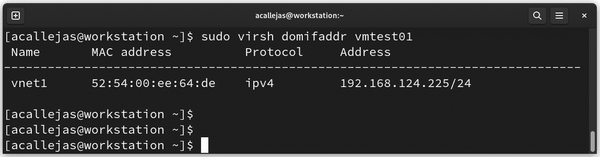

# 虚拟化与容器

回到 1990 年代，大多数公司使用来自单一供应商的物理服务器和 IT 堆栈，这些堆栈无法在其他供应商的硬件上运行*传统应用程序*。这导致了庞大的多服务服务器环境，非常复杂且难以管理。

随着公司通过更便宜的服务器、操作系统和来自多个供应商的应用程序升级其 IT 环境，他们开始低效使用物理硬件。每台服务器只能运行一个特定任务且仅来自一个供应商。

**虚拟化**是解决两个问题的自然方案：公司可以将服务器分区并在多种类型和版本的操作系统上运行传统应用程序，同时服务器的使用效率得到提高，从而减少了与购买、安装、冷却和维护相关的成本。

接下来的步骤是对这些服务进行容器化。**容器化**是一种虚拟化形式。虚拟化的目标是在单台服务器上运行多个操作系统实例，而容器化则运行一个操作系统实例，并通过多个用户空间将进程相互隔离，以提供服务。

在本章中，我们将简要介绍*虚拟化*和*容器化*，并涵盖以下主要内容：

+   使用 QEMU、KVM 和 **libvirt** 进行虚拟化

+   使用 GNOME Boxes

+   使用 Podman 发现 OCI 容器

# 技术要求

为了完成本章提到的主题，您必须安装每个部分中指示的包。在每个部分中，您将找到每个包所需的不同安装方式的说明。

# 使用 QEMU、KVM 和 libvirt 进行虚拟化

Fedora Linux 原生支持虚拟化扩展。该支持由**基于内核的虚拟机**（**KVM**）提供，并作为*内核模块*可用。**QEMU/KVM**与**Libvirt 管理工具包**结合是 Fedora Linux 中的标准虚拟化方法。

**快速仿真器**（**QEMU**）是一个完整的系统仿真器，它与 KVM 一起工作，允许您创建具有硬件和外设的虚拟机。

最后，`libvirt` 是 API 层，它允许您管理基础架构——也就是创建并运行虚拟机。它包括一个本地虚拟网络，支持虚拟客户系统之间以及与主机之间的安全通信。libvirt 的默认配置还允许对公共网络进行*NAT 访问*，这对于没有直接访问公共接口的虚拟机或容器非常有用。

下图展示了带有 `libvirt` 的 QEMU/KVM 架构：


图 13.1 – QEMU/KVM 架构

让我们简要了解一下管理工具。

## 管理工具

`libvirt` 是一个与 Fedora Linux 虚拟化功能交互的 C 工具包。主包包括 `libvirtd` 服务器，用于导出虚拟化支持。

基本管理工具如下：

+   **virsh**：这是管理 **virsh** 来宾域的主要接口。该程序可以*创建*、*暂停* 和 *关闭* 域。它还可以*列出*当前的域及其状态。

+   **Virt-manager**：这是一个用于管理虚拟机的桌面工具。它提供当前虚拟机的*生命周期控制*（启动/关机、暂停/恢复、挂起/恢复）、配置新的虚拟机和各种类型的存储、管理虚拟网络、访问虚拟机的图形控制台，并生成本地或远程的性能统计数据：


图 13.2 – 虚拟机管理器

+   **virt-viewer**：这是一个用于显示虚拟机图形控制台的简洁工具。它通过**VNC** 或 **SPICE** 协议访问控制台。可以根据虚拟机的*名称*、*ID* 或 *UUID* 进行访问。如果虚拟机尚未运行，查看器会等待它启动后再尝试连接控制台。查看器可以连接到远程主机以查找控制台信息，并通过相同的网络传输连接到远程控制台。

+   `virt-install` 获取启动安装过程所需的最小文件，允许来宾根据需要获取其余的操作系统分发版。也支持 PXE 引导和导入现有磁盘镜像（从而跳过安装阶段）。

    通过适当的命令行参数，`virt-install` 可以完全无人值守地运行，来宾系统“自我启动”。这使得来宾安装过程的自动化变得简单。

使用 `virt-install` 的功能可以简化虚拟机创建过程，最小化安装时间。让我们来学习如何执行这个过程。

## 简化虚拟机创建过程

QEMU 使用 `qcow` 文件格式存储磁盘镜像文件。它代表 *QEMU Copy On Write*。`qcow` 格式采用一种延迟分配存储的磁盘存储优化策略，直到需要时才分配存储。`qcow` 格式内的文件可以包含多种与特定来宾操作系统相关的磁盘镜像。该格式有三个版本：`qcow`、`qcow2` 和 `qcow3`。

截至撰写时，绝大多数发行版，包括 Fedora Linux，都提供*云端准备*的可下载版本。其中一个可选项是 `qcow2` 镜像磁盘格式。

**OpenStack**，一个*开放标准的云计算平台*，提供了一个网页，引用了许多发行版和操作系统的云镜像（您将在下一个示例中看到）。

使用`virt-customize`命令行工具，你可以修改下载的磁盘镜像，将其导入为*即用型*虚拟机。

按照以下步骤，使用这三种工具快速创建虚拟机：

1.  在开始之前，请验证你的工作站是否在**BIOS**/**UEFI**中启用了虚拟化功能。

注意

该过程依赖于工作站制造商，请参考制造商文档确认他们是否在 BIOS/UEFI 中启用了虚拟化能力。

1.  确认你的工作站的处理器是否支持虚拟化的标志：

    ```
    $ sudo grep -E 'svm|vmx' /proc/cpuinfo
    ```

1.  使用**sudo**命令安装虚拟化所需的软件包：

    +   **qemu-kvm**

    +   **virt-manager**

    +   **virt-viewer**

    +   **guestfs-tools**

    +   **virt-install**

    +   **genisoimage**：

        ```
        $ sudo dnf install qemu-kvm virt-manager virt-viewer guestfs-tools virt-install genisoimage
        ```

1.  使用浏览器访问[`docs.openstack.org/image-guide/obtain-images.html`](https://docs.openstack.org/image-guide/obtain-images.html)并下载所选发行版/操作系统的**qcow2**磁盘镜像：


图 13.3 – OpenStack – 获取镜像

1.  对于此示例，请下载 Fedora Linux 镜像。使用浏览器访问[`fedoraproject.org/cloud/download/`](https://fedoraproject.org/cloud/download/)：


图 13.4 – Fedora Cloud 下载页面

下载适用于`x86_64`架构的`qcow2`镜像。

注意

每个镜像大约需要 400 MB 的磁盘空间。确保你有足够的存储空间来存放它们，并且在使用过程中它们会不断增长。

1.  将下载的**qcow2**镜像移动到**KVM**工作目录**/var/lib/libvirt/images**中：

    ```
    $ sudo mv Fedora-Cloud-Base-38-1.6.x86_64.qcow2 /var/lib/libvirt/images/
    ```

注意

最佳实践是复制**qcow2**镜像并使用虚拟机名称，而不是移动它。可以重复使用原始下载的镜像来创建多个虚拟机：

**$ sudo cp** **Fedora-Cloud-Base-38-1.6.x86_64.qcow2 /var/lib/****libvirt/images/vmtest01.qcow2**

1.  使用**virt-customize**命令来修改下载的镜像：

    ```
    $ sudo virt-customize \
    -a /var/lib/libvirt/images/vmtest01.qcow2 \
    --hostname vmtest01.packt.lab \
    --root-password password:rootpw \
    --ssh-inject 'root:file:labkey.pub' \
    --uninstall cloud-init \
    ssh-keygen command:

    ```

    $ ssh-keygen -t ecdsa -b 521 -f labkey

    ```

    ```

注意

有关**ssh-keygen**命令的更多信息，请参考命令手册：**man ssh-keygen**。

+   **--uninstall**选项允许我们卸载下载镜像中默认包含的软件。

**cloud-init**是一个帮助初始化镜像以供 OpenStack 使用的工具集。在这种情况下，由于基本的功能性定制已能最佳工作，因此不需要使用它。

注意

如果**cloud-init**软件包没有被卸载，虚拟机启动时将会等待**cloud-init 脚本**的初始化参数，从而导致启动时间较长。

+   由于这是一个 Fedora Linux 镜像，必须使用**--selinux-relabel**选项对 SELinux 上下文进行*重新标签*，因为需要更改或删除多个文件：


图 13.5 – 自定义 qcow2 镜像

现在我们已经完成了定制，让我们将磁盘镜像导入为新的虚拟机。

1.  要将磁盘映像导入为新的虚拟机，请使用 **virt-install** 命令：

    ```
    $ sudo virt-install \
    --name vmtest01 \
    --memory 1024 \
    --vcpus 1 \
    --disk /var/lib/libvirt/images/vmtest01.qcow2 \
    --import \
    --osinfo fedora38 \
    --noautoconsole
    ```

    让我们详细看看我们使用的每个选项：

    +   **virt-install** 是一个用于创建新虚拟机的命令行工具。

    +   **--name** 设置新虚拟机实例的名称。名称必须在连接中超管所知道的所有虚拟机中保持*唯一*，包括那些当前不活跃的虚拟机。

    +   **--memory** 指定分配给虚拟机的内存（以 MiB 为单位）。

    +   **--vcpus** 指定为虚拟机配置的 **vcpus** 数量。

    +   **–disk** 指定用作虚拟机存储的设备。在此情况下，这是磁盘映像的路径。

    +   **--import** 表示将磁盘映像导入为新虚拟机，围绕此磁盘映像构建一个虚拟机。

    +   **--osinfo** 优化虚拟机配置，以适配特定的操作系统版本或发行版。在此案例中，指定的是 **fedora38**。

注意

要查找支持的操作系统名称值列表，请使用 **virt-install** 命令——即 **virt-install --****osinfo list**。

+   **--noautoconsole** 指定不自动连接到虚拟机控制台：


图 13.6 – 创建新虚拟机

1.  验证已创建虚拟机的状态：

    ```
    $ sudo virsh list
    ```

    以下是输出：


图 13.7 – 验证新虚拟机的状态

现在，让我们通过 SSH 连接到虚拟机。

1.  使用 **virsh** 命令查找由虚拟化 **DHCP** 服务分配的 IP 地址：

    ```
    $ sudo virsh domifaddr vmtest01
    ```

    以下是输出：



图 13.8 – 查找虚拟机的 IP 地址

1.  使用 **ssh** 命令和 SSH 密钥访问虚拟机：

    ```
    $ ssh –i labkey root@192.168.124.225
    ```

    你将得到以下输出：


图 13.9 – 访问虚拟机

通过这些步骤，你可以在短时间内启动一个正常工作的虚拟机。掌握这些命令可以加速这个过程。

在进入容器化（微型虚拟化形式）之前，让我们看看 GNOME 在其桌面套件中包含的工具。

# 使用 GNOME Boxes

**GNOME Boxes** 是 GNOME 桌面环境中的一个应用程序，用于访问远程或虚拟系统。Boxes 使用 QEMU、KVM 和 Libvirt 虚拟化技术。

除了前面章节中提到的虚拟化扩展外，Boxes 至少需要 *20 GB 存储空间* 和 *500 MB RAM* 分配给虚拟机。GNOME 建议工作站至少配备 8 GB 的 RAM 和 20 GB 存储空间，以高效运行 Boxes。Boxes 会根据厂商建议*自动*和*动态*分配资源给虚拟机。

让我们回顾一下使用 **Boxes** 创建虚拟机的过程：

1.  要访问 Boxes，请打开 *活动概览* 并输入 **Boxes**：


图 13.10 – 通过活动概览访问 GNOME Boxes

1.  主 Boxes 窗口将出现。要创建新虚拟机，点击左上角的*加号*（**+**）按钮：


图 13.11 – GNOME Boxes 主窗口

1.  Boxes 提供两种创建新虚拟机的选项：


图 13.12 – 使用 Boxes 创建新的虚拟机

它们如下所示：

+   **从文件安装**：使用此选项时，必须指定新虚拟机中要安装的操作系统的**ISO**镜像位置。

+   **下载操作系统**：此选项选择操作系统版本或发行版，并下载相应的镜像以安装到新虚拟机中：


图 13.13 – 选择操作系统镜像

对于这个例子，我们自己下载 ISO 镜像。

1.  使用浏览器访问 [`fedoraproject.org/workstation/download/`](https://fedoraproject.org/workstation/download/)：


图 13.14 – Fedora Workstation 下载页面

下载 `x86_64` 架构。

1.  在**Boxes**中，点击*加号*（**+**）并选择**从文件安装**选项。导航到下载的**ISO**镜像所在位置并点击**打开**按钮：


图 13.15 – 创建新的虚拟机

Boxes 将显示虚拟机创建选项。使用默认选项并点击**创建**按钮。

1.  下载的镜像（在本例中为 Fedora Workstation）的安装将在裸机上开始：


图 13.16 – Fedora Workstation 实时镜像

1.  在 Fedora Workstation 安装窗口中，点击**安装 Fedora**按钮并继续安装操作系统：


图 13.17 – Fedora Linux 安装窗口

1.  安装完成后，点击**完成安装**按钮并重启虚拟机：


图 13.18 – 完成虚拟机安装

在重启虚拟机后，它将出现在主**Boxes**窗口中：


图 13.19 – Boxes 主窗口

1.  点击虚拟机图标以访问它：


图 13.20 – 访问虚拟机

虚拟机窗口占据了主**Boxes**窗口的空间，并允许我们以图形方式使用它，就像远程会话一样：


图 13.21 – Fedora 工作站虚拟机

现在，使用虚拟机来执行分配给它的任务。

如果虚拟机关闭，它会出现在主窗口中，如下图所示：


图 13.22 – 盒子中的虚拟机关闭

1.  右键单击虚拟机图标以访问管理选项：


图 13.23 – 虚拟机管理选项

1.  要启动虚拟机，双击其图标。

GNOME Boxes 是一个简单的应用程序，用于访问和管理虚拟机。它不提供 `virsh` 的 *精细管理* 和 *自动化功能*，但它是一个很好的工具，可以帮助熟悉虚拟机的使用。

一种更精细的方法，创建时间更短，且主机资源优化更好，就是使用容器。

现在，让我们学习 Fedora Linux 如何实现开放容器的使用。

# 使用 Podman 发现 OCI 容器

粗略来说，Linux 容器的工作原理类似于虚拟化过程，我们导入操作系统的 *预构建镜像* 并从中创建虚拟机。在容器的情况下，镜像仅打包了应用程序操作所需的 *程序及其最小依赖项*。

容器是一组与系统其他部分隔离的一个或多个进程。

内核提供以下主要组件：

+   使用 **namespaces** 来确保进程隔离。

+   使用 **cgroups** 来控制系统资源。

+   使用 **SELinux** 确保主机与容器之间，以及容器与容器之间的隔离。

管理接口与内核组件交互，并提供用于 *构建和管理* 容器的工具。运行容器所需的所有文件来自于镜像。

容器镜像存储在一个名为 **registry** 的外部仓库中。要创建容器，需要下载注册表镜像并生成一个可在主机上运行的应用程序副本。这些过程需要运行时，并且镜像需要是特定格式才能运行。

Linux 基金会赞助 **开放容器倡议** (**OCI**) 项目，目的是围绕容器格式和运行时创建开放的行业标准。

目前 OCI 包含三个规范：

+   **运行时规范** (**runtime-spec**) 。该规范指定了如何运行解压缩到磁盘上的文件系统包。

+   **镜像规范** (**image-spec**) 。该规范提供了可互操作的工具，用于构建、传输和准备容器镜像以供运行。

+   **分发规范** (**distribution-spec**) 。该规范定义了一个 API 协议，用于简化和标准化内容分发。

一个 OCI 实现会下载一个 OCI 镜像，然后将该镜像解压到 OCI 运行时文件系统包中。

Fedora Linux 实现了**Podman**用于 OCI 容器管理。

Podman 依赖于*OCI 合规的容器运行时*（`runc`、`crun`、`runv` 等）与操作系统进行交互，并通过命令行创建运行中的容器：


图 13.24 – Podman 交互

使用 Podman 控制的容器可以由`root`或*非特权用户*运行。Podman 管理整个容器生态系统，包括 Pod、容器、容器镜像和容器卷，使用 `libpod` 库。

要以非 root 用户身份运行容器，必须考虑所使用的资源：

+   容器镜像将存储在用户的主目录（**$HOME/.local/share/containers/storage/**）中，而不是**/var/lib/containers**

+   由于没有**root**权限，必须遵循以下规则：

    +   无法访问低于**1024**的端口

    +   存储必须保存在本地文件系统中

让我们从安装实用程序开始。

安装 Podman 需要管理员权限。以 `root` 用户身份运行 `dnf` 命令：

```
# dnf install podman
```

现在，让我们创建一个示例容器，以展示作为*非 root 用户*时该实用程序的作用：

1.  验证无根配置：

    ```
    $ podman unshare cat /proc/self/uid_map
    ```

    你应该看到以下输出：


图 13.25 – Podman 无根配置

1.  创建一个基础容器。使用 **podman pull** 命令下载镜像：

    ```
    $ podman pull ubi9/ubi
    ```

注意

Red Hat **通用基础镜像**（**UBI**）使你能够构建、共享并与容器化应用进行协作。

以下是输出结果：


图 13.26 – 获取容器镜像

下载完成后，验证并检查镜像。

1.  使用 **podman images** 命令列出下载的镜像：

    ```
    $ podman images
    ```

    以下是输出结果：


图 13.27 – 列出容器镜像

使用 `镜像 ID` 来检查它。

1.  检查下载的镜像可以为我们提供有关镜像创建和使用的信息，以及可用的变量。使用**podman inspect**命令并指定镜像的名称或 ID：

    ```
    $ podman inspect 05936a40cfa4
    ```

    你将看到以下输出：


图 13.28 – 检查 UBI 镜像

现在，让我们从下载的镜像创建一个容器。

1.  运行 UBI 镜像的容器以显示操作系统版本：

    ```
    $ podman run ubi9/ubi cat /etc/os-release
    ```

    以下是输出结果：


图 13.29 – 运行容器

该容器是运行在 Fedora Linux 上的 RHEL9 基础镜像。

现在，让我们创建一个容器化服务的示例。按照以下步骤操作：

1.  使用浏览器访问[`registry.fedoraproject.org/`](https://registry.fedoraproject.org/)：


图 13.30 – Fedora 项目容器镜像注册表

1.  找到最新的*网页服务器镜像*（**httpd**）并复制其**pull**命令：

    ```
    docker pull registry.fedoraproject.org/f29/httpd
    ```

注意

修改**pull**命令，使其使用**podman**而非**docker**。

1.  下载容器镜像并验证：

    ```
    $ podman pull registry.fedoraproject.org/f29/httpd
    $ podman images
    ```

    你应该看到以下输出：


图 13.31 – 获取 httpd 镜像

1.  对**httpd**镜像进行容器的测试运行：

    ```
    $ podman run httpd
    ```

    这是输出内容：


图 13.32 – 运行 httpd 镜像容器

以这种方式运行`httpd`镜像容器会阻止使用终端。让我们用自定义名称并在后台运行它。

1.  以**myapache**作为名称，并在后台运行`httpd`镜像容器。使用**--name**和**-d**选项与**podman run**命令一起使用：

    ```
    $ podman run --name myapache -d httpd
    $ podman ps
    ```

    你应该看到以下输出：


图 13.33 – 运行容器并验证其状态

检查运行中的容器，找到你可以用来访问服务的信息。

1.  使用**podman** **inspect**命令：

    ```
    $ podman inspect myapache | grep IPAddress
    $ podman inspect myapache | grep expose-service
    ```

    你应该看到以下内容：


图 13.34 – 查找容器化服务的访问

容器化服务没有分配`IPAddress`，但打开了端口`8080`和`8443`。检查日志以获取更多信息。

1.  使用**podman logs**命令查看日志：

    ```
    $ podman logs myapache
    ```

    这是输出内容：


图 13.35 – 审查服务日志

在容器化服务的日志中，找到打开端口`8443`的 IP 地址。使用这些信息验证服务的访问情况。

1.  验证访问容器化服务。使用以下**curl**命令：

    ```
    $ curl 10.0.2.100:8443
    ```

    这是输出内容：


图 13.36 – 验证对网页服务的访问

服务未能在端口`8443`或`8080`上响应。

这是因为容器端口没有引用主机端口。删除容器并重新创建它，引用本地端口。

1.  移除容器。首先，使用**stop**选项中断容器运行，然后使用**rm**选项删除容器，命令为**podman**：

    ```
    $ podman stop myapache
    $ podman rm myapache
    ```

    你应该看到以下输出：


图 13.37 – 删除容器

验证`myapache`容器是否已经不再运行。使用`podman ps`命令进行验证。

1.  通过将容器的端口**8080**映射到本地端口**8080**，重新创建**myapache**容器。在我们在*第 4 步*中运行的**podman run**命令中添加**-p**选项：

    ```
    $ podman run --name myapache -d -p 8080:8080 httpd
    ```

    这是输出内容：


图 13.38 – 映射容器端口到本地端口

1.  使用 **podman ps** 命令确认端口是否正确映射。

1.  重新测试服务，但在本地端口**8080**上：

    ```
    $ curl localhost:8080
    ```

    你应该看到以下输出：


图 13.39 – 测试服务访问

现在服务可访问，显示了 Apache 测试页面。

一个始终在单个主机上运行的应用程序，通过访问本地磁盘存储来获取运行所需的信息。这些存储卷在*逻辑上*和*物理上*都保持持久性。容器化的动态和弹性部署将应用程序存储的逻辑状态和物理状态分开。

由于 OCI 技术固有的重新分配和扩展能力，容器化应用程序可能是*逻辑常驻但物理临时*的。

如果一个容器驻留在主机上，但该容器停止工作，容器管理器可以在另一台主机上启动一个新的实例。该应用程序可能需要在运行时访问一些数据，这被称为逻辑持久性。由于容器信息默认是临时的，因此存储在物理上是短暂的。

在容器化存储中，一般的趋势是尽可能将*持久存储*与*短暂容器*结合起来。

现在，让我们学习如何为我们的容器化服务添加持久存储。请按照以下步骤操作：

1.  停止并移除 **myapache** 容器：

    ```
    $ podman stop myapache
    $ podman rm myapache
    ```

1.  在用户的主目录中，为 **myapache** 容器创建持久存储的工作目录：

    ```
    $ mkdir –p ~/containers/myapache/var/www/html
    ```

    现在，让我们为我们的服务创建一个自定义主页。

1.  在我们为 **myapache** 容器创建的持久存储目录中创建 **index.html** 文件：

    ```
    $ echo "Hello from myapache container!" > ~/containers/myapache/var/www/html/index.html
    ```

1.  使用 **-v** 选项重新生成 **myapache** 容器，将持久存储作为 **myapache** 容器的卷添加。

1.  使用之前提到的挂载卷选项重新运行容器。与端口一样，本地目录必须映射到容器目录。在这种情况下，由于涉及文件操作，添加 **-Z** 选项，将 SELinux 策略从容器目录应用到本地目录：

    ```
    $ podman run --name myapache -d -p 8080:8080 -v ~/containers/myapache/var/www/html:/var/www/html:Z httpd
    ```

1.  验证容器是否正在运行，并确认你能访问该服务：


图 13.40 – 测试具有持久存储的容器

现在，我们的 web 服务具有持久存储。这个存储可以在本地管理，或独立于运行内容的容器实例进行管理。

该服务可以作为容器自行管理，并将此管理交给 `systemd` 作为系统的一部分。让我们学习如何设置自我管理。

使用之前示例中的相同 `myapache` 容器，按照以下步骤操作：

1.  停止并移除 **myapache** 容器：

    ```
    $ podman stop myapache
    $ podman rm myapache
    ```

1.  为了使**myapache**容器自主管理，添加一个命令来确定容器的健康状况。在我们的示例中，我们将使用之前示例中的**curl**命令。使用**--health-cmd**和**--health-interval**选项在容器中定义这些选项：

    ```
    $ podman run --name myapache -d -p 8080:8080 -v ~/containers/myapache/var/www/html:/var/www/html:Z --health-cmd="curl localhost:8080 || exit 1" --health-interval=0 httpd
    ```

    这是输出结果：


图 13.41 – 使容器自主管理

验证容器的创建情况。然后，使用`podman` `ps`命令。

1.  要检查容器的健康状况，运行**podman healthcheck** **run**命令：

    ```
    $ podman healthcheck run myapache
    ```

    这是输出结果：


图 13.42 – 审查容器健康状况

1.  上述命令的输出应该不返回任何内容。运行**echo**命令查看特殊变量**$?**的输出，以获取命令的结果：

    ```
    $ 0), the command ran *successfully*, which means that the health of the container is good.
    ```

因此，`myapache`容器能够指示其何时工作正常——也就是说，它是自主管理的。这种管理可以作为操作系统服务的一部分委托给操作系统。为此，必须设置`systemd`来支持从用户会话启动的服务。按照以下步骤进行：

1.  作为**root**，通过运行**loginctl**命令启用用户持久化：

    ```
    # loginctl enable-linger acallejas
    ```

1.  创建一个目录来托管容器化服务，并切换到该目录：

    ```
    $ mkdir -p ~/.config/systemd/containerized-services
    $ cd ~/.config/systemd/containerized-services
    ```

1.  使用**podman** **generate**命令构建**systemd**的配置文件：

    ```
    podman generate systemd --name myapache --files
    ```

    这是输出结果：


图 13.43 – 容器化服务配置文件

上述命令会创建`container-myapache.service`单元文件，并为`systemd`管理配置。

1.  通过运行以下**systemctl**命令重新加载用户的守护进程：

    ```
    $ systemctl --user daemon-reload
    ```

1.  通过运行以下**systemctl**命令启用用户的容器化服务：

    ```
    $ systemctl --user enable --now ~/.config/systemd/containerized-services/container-myapache.service
    ```

1.  通过运行以下**systemctl**命令验证容器化服务的状态：

    ```
    $ systemctl --user status container-myapache
    ```

    你应该能看到以下输出：


图 13.44 – 验证容器化服务

最后，验证容器化服务是否继续运行。使用我们之前使用过的`curl`命令。

通过这些内容，我们已经学习了如何使用 OCI 容器，从简单的使用到创建由操作系统管理的容器化服务。

Fedora Linux 实现了 OCI 容器的使用，以便简化服务管理。根据工作负载的不同，我们可以选择虚拟机，虚拟机可以使用基于云的镜像创建，或者使用传统的安装镜像创建。或者，如果我们只需要部署一个简单的服务，如`myapache`，我们也可以选择使用容器。

我希望这些选项能帮助你提高作为 Linux 系统管理员的日常工作效率。

# 总结

在本章中，我们简要概述了创建虚拟机的方法。在我看来，最简单和最快的方法是依赖于使用预构建的云镜像。通过几步操作，经过一定的练习，我们可以在几分钟内使其运行。

除此之外，我们还使用 Gnome Boxes 作为一种传统的方法，通过安装镜像来创建虚拟机。这种方法稍微慢一些，但允许我们定制来宾操作系统的安装。

接下来，我们研究了服务，在其中我们学习了如何使用 Fedora Linux 实现的 OCI 容器。这是一种简单的创建容器化服务的方式，因为它赋予了我们定制这些服务的能力，以满足我们的需求。例如，我们可以将它们用于持久化存储、自我管理，甚至将一个容器化服务委派为由`systemd`管理的系统服务。

所有这些工具构成了一个武器库，可以帮助缓解 Linux 系统管理员日常任务的执行。正如我们在*第十章*中提到的，“*一个优秀的系统管理员会在* *空闲时间* *进行备份、自动化和学习*。”

恭喜你读完了本书！希望你觉得它有用。

# 延伸阅读

要了解本章所涵盖的更多内容，您可以访问以下链接：

+   *通过三个简单的* *命令在 5 分钟内建立实验室*：[`www.redhat.com/sysadmin/build-lab-quickly`](https://www.redhat.com/sysadmin/build-lab-quickly)
