# 使用 Ansible 自动化你的 IT 基础设施

虽然在 Linux 上自动化任务有很多方法，但有一种技术在大规模自动化方面脱颖而出，那就是 Ansible。虽然完全可以通过 shell 脚本轻松地自动化某些任务，但这种方法有许多缺点，其中最重要的一点是，shell 脚本在大规模环境中的扩展性较差。应该指出，虽然还有其他自动化工具，但 Ansible 利用本地通信协议（例如，Linux 上的 SSH 和 Windows 上的 WinRM），因此它是完全无代理的！这使得将其部署到现有环境中变得简单。虽然 Ansible 的自动化是一个庞大且深入的主题，但本章旨在涵盖基础知识并快速启动，让你即使没有任何经验，也能够跟随本书中的自动化示例进行操作。事实上，这也是 Ansible 在过去几年内快速普及的原因之一——尽管它功能强大，但入门和自动化你的第一个任务非常简单。

在本章中，我们将介绍以下 Ansible 主题：

+   探索 Ansible 剧本结构

+   探索 Ansible 中的清单

+   了解 Ansible 中的角色

+   了解 Ansible 变量

+   了解 Ansible 模板

+   将 Ansible 与 SOE（标准操作环境）结合起来

# 技术要求

本章包含基于以下技术的示例：

+   Ubuntu Server 18.04 LTS

+   CentOS 7.6

+   Ansible 2.8

要运行这些示例，你需要访问一台运行本章列出的操作系统之一的服务器或虚拟机，并且还需要能够访问 Ansible。请注意，本章中给出的示例可能具有破坏性（例如，它们涉及安装文件和软件包），如果按原样运行，建议仅在隔离的测试环境中执行。

一旦确认你有一个安全的环境可以进行操作，我们就开始查看如何使用 Ansible 安装新软件包。

本章讨论的所有示例代码都可以从 GitHub 获取：[`github.com/PacktPublishing/Hands-On-Enterprise-Automation-on-Linux/tree/master/chapter02`](https://github.com/PacktPublishing/Hands-On-Enterprise-Automation-on-Linux/tree/master/chapter02)。

# 探索 Ansible 剧本结构

启动并运行 Ansible 是一个简单的过程，且大多数主要 Linux 发行版、FreeBSD 以及几乎所有支持 Python 的平台都有相应的安装包。如果你安装了支持 **Windows 子系统 Linux** (**WSL**) 的最新版本 Microsoft Windows，Ansible 甚至可以在这个环境中安装并运行。

请注意，在写作时没有本地的 Windows 包。

官方 Ansible 文档为所有主要平台提供了安装文档。请参考 [`docs.ansible.com/ansible/latest/installation_guide/intro_installation.html`](https://docs.ansible.com/ansible/latest/installation_guide/intro_installation.html)

本章中的示例将在 Ubuntu Server 18.04.2 上运行。尽管 Ansible 可以跨多个不同平台工作，但大多数示例也应该可以在其他操作系统上运行（或者最多只需做最小的适配）。

根据官方安装文档，执行以下命令以在我们的演示系统上安装 Ansible 的最新版本：

```
$ sudo apt-get update
$ sudo apt-get install software-properties-common
$ sudo apt-add-repository --yes --update ppa:ansible/ansible
$ sudo apt-get install ansible
```

如果一切顺利，您应该能够通过运行以下命令查询 Ansible 二进制文件的版本：

```
$ ansible --version
```

输出应该类似于以下内容：

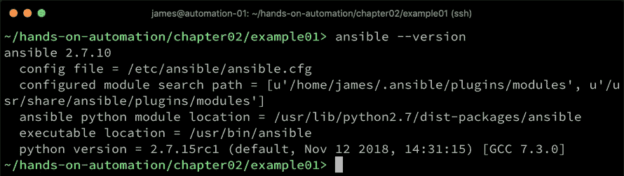

恭喜！现在 Ansible 已经安装完成，让我们来看看运行您的第一组 Ansible 任务的基本操作，这些任务被称为 **Playbook**。为了运行这些任务，您需要具备以下三个条件：

1.  一个配置文件

1.  一个清单

1.  Playbook 本身

当 Ansible 安装时，通常会在 `/etc/ansible/ansible.cfg` 路径下安装一个默认的配置文件。通过这个文件，您可以更改许多高级功能，并且可以通过多种方式覆盖该文件。对于本书，我们几乎将完全使用默认设置，这意味着现在只需了解这个文件的存在即可。

要了解更多关于 Ansible 配置文件的信息，可以参考这篇文档，这是一个很好的起点，链接地址为 [`docs.ansible.com/ansible/latest/installation_guide/intro_configuration.html`](https://docs.ansible.com/ansible/latest/installation_guide/intro_configuration.html)

没有清单，Ansible 是无法工作的。清单是一个文本文件（或脚本），为 Ansible 二进制文件提供要操作的主机名列表，即使只是本地主机。我们将在本章的下一部分详细介绍清单，因为它们在我们的自动化旅程中将变得非常重要。现在，您会发现，在大多数 Linux 平台上，作为 Ansible 安装的一部分，通常会在 `/etc/ansible/hosts` 路径下安装一个示例清单文件。当清单文件为空（或仅包含注释，例如示例文件中那样）时，Ansible 默认只操作本地主机。

最后，但绝对不容忽视的是，你必须有一个 playbook 来执行服务器（或多个服务器）。现在，让我们通过一个简单的例子来实现一个可以在 Ansible 中运行的 playbook。Ansible playbook 是用 YAML 编写的（YAML 是一个递归首字母缩略词，表示 **YAML Ain't Markup Language**），由于 YAML 易于阅读——事实上，这也是 Ansible 的核心优势之一——因此，playbook 可以很容易地被有最少 Ansible 技能的人理解，并且能够轻松地应用或修改。

如果你不习惯用 Python 或 YAML 编写代码，那么你需要了解的一点是：YAML 文件在编写 playbook 时非常讲究缩进。与许多高级语言使用括号或大括号来定义代码块，并用分号标识行结束不同，YAML 使用缩进级别本身来决定你在代码中的位置，以及它如何与周围的代码相关联。缩进总是通过空格来实现——绝对不要使用制表符（tab）。即使缩进在肉眼看起来是相同的，YAML 解析器也不会认为它们相同。

考虑以下这段代码块：

```
---
- name: Simple playbook
  hosts: localhost
  become: false
```

这是一份 Ansible playbook 的开头。Ansible 的 YAML 文件总是以三个短横线（`---`）开始，并且没有缩进。接下来，我们有一行定义了 play 的开始，用一个短横线（`-`）表示，也没有缩进。需要注意的是，Ansible 的 playbook 可以包含一个或多个 plays，每个 play 都是（从基础层面来看）要在一组给定主机上执行的任务集合。这个 playbook 中的这一行指定了 play 的 `name`。虽然 `name` 关键字在大多数情况下是可选的，可以省略，但强烈建议在所有 play 定义中都包含它（就像我们在这里做的一样），并且每个任务也应如此。这样做可以显著提高 playbook 的可读性，并帮助新手快速理解，从而提升效率并降低新手的入门门槛，正如我们在前一章所讨论的那样。

这段代码的第三行告诉 Ansible 应该在哪些 `hosts` 上执行任务。在这个例子中，我们只会在 `localhost` 上执行。第四行告诉 Ansible 不需要以超级用户（root）身份执行任务，因为该任务不需要管理员权限。有些任务，例如重启系统服务，必须以超级用户身份执行，在这种情况下，你会指定 `become: true`。请注意前两行缩进的两个空格——这告诉 YAML 解析器这些行属于第二行定义的 play。

现在，让我们在前一段代码的下面添加两项任务：

```
  tasks:
    - name: Show a message
      debug:
        msg: "Hello world!"

    - name: Touch a file
      file:
        path: /tmp/foo
        state: touch
```

`tasks`关键字定义了 play 的结束以及我们希望执行的实际任务的开始。注意，它仍然被缩进了两个空格，这告诉解析器它仍然是我们之前定义的 play 的一部分。然后，我们再次增加缩进，表示下一行是`tasks`块的一部分。

到现在，你会看到一个熟悉的模式开始形成。每当一行代码成为前一个语句的一部分时，我们会增加两个空格的缩进。每个新项都以一个破折号（`-`）开始，因此我们之前的代码块包含了两个任务。

第一个任务使用`name`关键字，值为`Show a message`，作为文档说明（可以类比其他编程语言中的注释），并使用一个叫做**Ansible** **模块**的东西。模块是 Ansible 用来执行特定任务的预定义代码块。这里包含的`debug`模块主要用于显示消息或变量内容，从而用于 playbook 调试。我们通过进一步缩进`msg`参数两格，将我们希望在运行 playbook 时打印的消息传递给`debug`模块。

第二个任务使用了`name`和`Touch a file`关键字，并使用`file`模块去触摸位于`/tmp/foo`的文件。当我们运行这个 playbook 时，输出应该类似于这样：

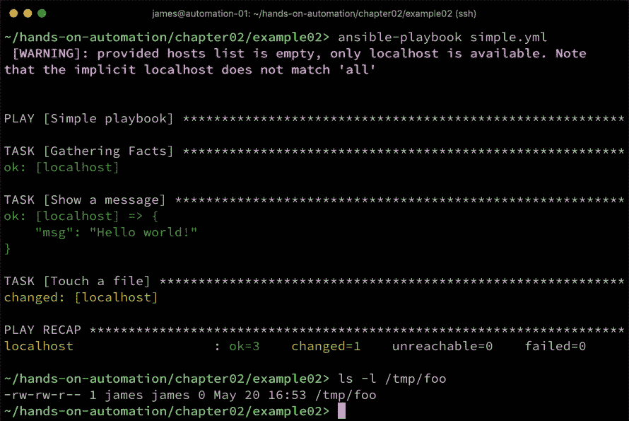

对于大多数简单的 playbook，任务是按顺序从上到下执行的，这使得执行顺序可预测且易于管理。这就是全部！你已经编写并执行了第一个 Ansible playbook。你会发现它非常简单，且将它与单一测试系统集成几乎不需要什么工作。现在，对于这样一个简单的示例，一个有效的问题是：*既然两行 shell 脚本就能实现同样的功能，为什么还要花那么大力气使用 Ansible？* 以下代码块展示了一个 shell 脚本的示例：

```
echo "Hello World!"
touch /tmp/foo
```

使用 Ansible 的第一个原因是，虽然这个例子非常简单且易于理解，但随着脚本所需任务的复杂化，它们变得更加难以阅读，并且需要懂得 shell 脚本的人来调试或修改它们。使用 Ansible playbook，你可以看到代码非常易于阅读，每一部分都有一个相关的 `name`。强制缩进也使得代码更易于阅读，虽然 shell 脚本中也支持注释和缩进，但它们没有强制要求，且常常被省略。除此之外，所有模块必须有文档才能被接受到核心的 Ansible 发布中——因此，你可以保证手头有高质量的文档用于你的 playbook。模块文档可以在官方的 Ansible 网站上找到，或者作为已安装的 Ansible 包的一部分。如果我们想学习如何使用我们之前用过的 `file` 模块，只需在系统的 shell 中输入以下命令：

```
$ ansible-doc file
```

当执行此命令时，它会提供文件模块的完整文档，而这些文档恰好与官方 Ansible 网站上的文档相同。因此，即使你工作的系统与互联网断开连接，你仍然能够随时访问 Ansible 模块文档。以下截图显示了我们刚刚运行的命令的输出页面：

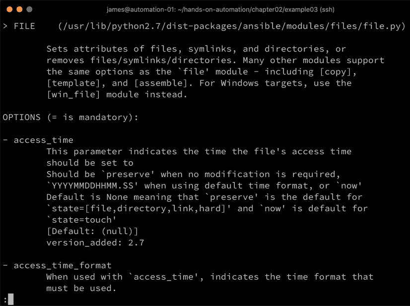

下一个原因是，Ansible 模块（大多数情况下）提供对幂等性更改的支持。这意味着，如果一个更改已经执行过，我们就不会再次执行。这对于一些可能具有破坏性的更改尤其重要。它还节省了时间和计算资源，甚至有助于审计系统。除此之外，Ansible 提供了流程控制和强大的错误处理，而在 shell 脚本中，即使发生错误，脚本也会继续执行，除非你集成自己的错误处理代码（可能会导致不可预测或不希望的结果），而 Ansible 会停止所有进一步的执行，要求你在重新运行 playbook 之前修复问题。

值得一提的是，虽然模块构成了 Ansible 强大功能的核心部分，但有时你可能会遇到需要的功能无法通过现有模块来处理的情况。Ansible 作为**开源软件**（**OSS**）的一个优点是，你可以编写并集成自己的模块。这超出了本书的范围，但随着你不断提升 Ansible 技能，它绝对值得深入探索。在现有模块无法满足需求，并且你没有时间或资源编写自己模块的情况下，Ansible 也可以向被自动化的系统发送原始 Shell 命令。事实上，有两个模块——`shell`和`command`——可以向远程系统发送原始命令。因此，如果有需要，你甚至可以将 Shell 脚本与 Ansible 结合使用，尽管在 resort 使用`shell`或`command`之前，你应该始终优先使用原生的 Ansible 模块。Ansible 在这方面非常灵活——内置的功能非常强大，但如果它无法满足需求，扩展功能也极其容易。

这些好处只是冰山一角，我们将在本章接下来的部分探讨其中的一些其他优点。如前所述，本章的目的并不是详尽无遗，而是作为 Ansible 的入门指南，帮助你入门并理解书中的示例。

在下一节中，我们将探讨使用 Ansible 而非简单 Shell 脚本的一个重要原因。

# 探索 Ansible 中的库存

正如我们之前提到的，Ansible 快速普及的一个关键原因是，它可以在不使用代理的情况下，集成到大多数主要操作系统中。例如，一个单一的 Ansible 主机可以通过 SSH 连接，自动执行几乎任何其他 Linux（或 BSD）主机上的命令。它甚至可以自动化启用了远程 WinRM 的 Windows 主机上的任务，正是在这里，我们开始揭示 Ansible 的真正强大之处。

在本章前面的部分，我们仅查看了 Ansible 在隐式 localhost 上的运行，而没有使用 SSH。Ansible 支持两种不同类型的库存：静态库存和动态库存。在本书中，我们将主要使用静态库存，因为它适合我们当前的示例。事实上，静态库存非常适合小型环境，在这些环境中，维护待自动化服务器列表（本质上就是 Ansible 库存的内容）的工作量很小。然而，随着库存的规模扩大，或库存虽然保持小但变化迅速（例如，云计算资源或 Docker 容器），保持 Ansible 库存文件更新所需的工作量会变得非常大，并且容易出错。

Ansible 提供了许多现成的动态清单解决方案，可以与流行的公共云平台（如 Microsoft Azure 和 Amazon Web Services）、本地计算平台（如 OpenStack 和 VMware）以及基础设施管理解决方案（如 Katello）集成。甚至可以编写自己的动态清单脚本，随着环境的扩展，你很可能会走上这条道路。

现在，让我们聚焦于静态清单。假设我们想要将之前章节中的示例剧本，运行到两个远程主机上，而不是本地主机。首先，让我们创建一个包含这两个主机名称/地址的清单文件。静态清单采用 INI 格式编写（与剧本中使用的 YAML 格式不同），在最简单的形式下，每一行包含一个主机。注意，主机可以通过 DNS 条目或 IP 地址指定。

这是我们演示环境的清单文件：

```
[test]
testhost1
testhost2
```

如你所见，文件非常简单。第一行带有方括号的是一个组的名称，下面的服务器被放置在这个组中。服务器可以属于多个组，这对日常管理服务器非常有帮助。例如，如果你有一个剧本是为了对所有 Linux 服务器应用安全更新，那么你可能会想要一个名为`[linux-servers]`的组，其中包含所有这类服务器的地址。如果你接下来有一个部署 Web 应用的剧本，你可能会想要将所有的 Web 服务器放入一个名为`[web-servers]`的组中。这使得在运行特定剧本时，能够轻松地选择正确的服务器集——还记得之前例子中的`hosts:`那一行吗？

组可以是其他组的子组。因此，如果你知道你的网络服务器都基于 Linux，你可以将`web-servers`组指定为`linux-servers`组的子组，从而将所有的网络服务器纳入安全补丁更新的范围，而无需在清单中进行重复。

我们需要对之前的剧本做一些小的修改。前四行现在应该包含如下内容：

```
---
- name: Simple playbook
  hosts: all
  become: false
```

如你所见，我们已经将`hosts`参数从`localhost`改为`all`（`all`是一个特殊的关键字，表示清单中的所有主机，不论其属于哪个组）。如果我们只想指定`test`组，我们可以写成`hosts: test`，或者甚至写成`hosts: testhost1`，让剧本仅在单个主机上运行。

现在，我们知道 Ansible 使用 SSH 连接到清单中的远程 Linux 主机，并且在此阶段我们还没有设置基于密钥的 SSH 身份验证。因此，我们需要告诉 Ansible 提示输入 SSH 密码（默认情况下，它不会提示，这意味着如果没有设置基于密钥的身份验证，它将失败）。类似于 SSH 命令行工具，除非你告诉 Ansible 其他要求，否则它会启动一个 SSH 连接到远程系统，使用本地机器当前会话用户的用户名。因此，在我的示例中，用户 `james` 存在于我的 Ansible 服务器和我的两个测试系统上，所有任务都是以该用户身份执行的。我可以运行以下命令，在我的两个远程系统上执行我的 playbook：

```
$ ansible-playbook -i hosts --ask-pass simple.yml
```

这次运行的效果与上次有所不同——请注意以下新的参数：

+   `-i hosts`：告诉 Ansible 使用当前工作目录下名为 `hosts` 的文件作为清单

+   `--ask-pass`：告诉 Ansible 停止并提示输入 SSH 密码，以便访问远程系统（假设所有系统的密码相同）

+   `simple.yml`：告诉 Ansible 要运行的 playbook 的名称

让我们看一下实际操作，如下所示：

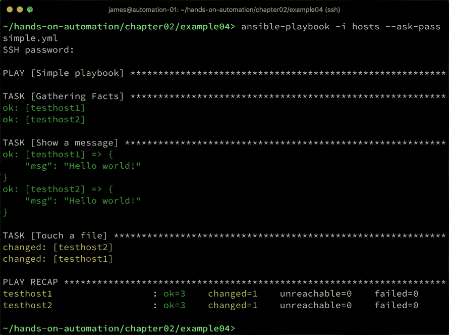

在这里，你可以看到我们在本章前面创建的两个任务已经运行——只不过这次它们是在一对远程系统上运行的，使用的是本地的 SSH 通信协议。由于 SSH 通常在大多数 Linux 服务器上启用，这立即为我们扩展自动化提供了巨大的空间——这个示例在仅包含两个主机的清单上执行，但它同样可以包含 200 个或更多的主机。

请注意，任务仍然是按顺序执行的——只不过这次，每个任务都会在所有清单中的主机上执行完毕后，再尝试下一个任务，这使得我们的 playbook 流程变得非常可预测且易于管理。

如果我们为远程主机设置了 SSH 密钥，那么 `--ask-pass` 参数就不再需要，playbook 会在没有用户交互的情况下运行，这在许多自动化场景中是最理想的：

SSH 密钥虽然比密码更安全，但也有其风险，特别是如果密钥没有用密码加密的话。在这种情况下，任何获得未加密私钥的人都可以在没有任何提示或挑战的情况下，利用匹配的公钥远程访问任何系统。如果你选择设置 SSH 密钥，一定要理解其安全隐患。

让我们通过一个简单的过程来生成 SSH 密钥，并在我们的测试系统上配置它，以便 Ansible 可以进行身份验证：

1.  为了在我们的测试主机上设置一个非常简单的基于 SSH 密钥的访问，我们可以从 Ansible 主机运行以下命令来创建密钥对（如果你已经有了密钥对，请不要执行此操作，因为你可能会覆盖它！）：

```
$ ssh-keygen -b 2048 -t rsa -f ~/.ssh/id_rsa -q -N ''
```

1.  该命令会静默地在 `~/.ssh/id_rsa` 文件中创建一个 2048 位的 RSA 密钥，且不设置密码（因此没有加密）。对应的公钥文件将创建为 `~/.ssh/id_rsa.pub`（即与 `-f` 指定的相同文件名和路径，并附加 `.pub` 后缀）。现在，使用以下命令将其复制到两个远程主机（你将在两次操作时被提示输入 SSH 密码）：

```
$ ssh-copy-id testhost1
$ ssh-copy-id testhost2
```

1.  最后，我们可以像之前一样运行我们的 playbook，但无需使用 `--ask-pass` 标志，以下截图展示了这一点：

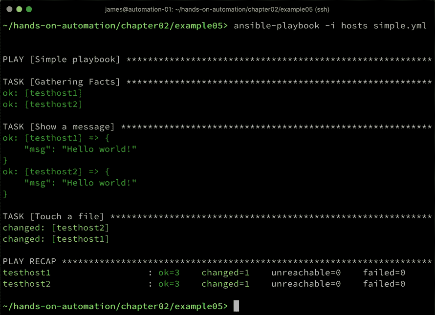

如你所见，这个区别虽小，但却非常重要——没有需要用户干预，这意味着我们的简单 playbook 突然间可以在几乎任何规模的环境中实现大规模扩展。

尽管在这里我们利用了 Ansible 会默认读取位于 `.ssh` 目录下的 SSH 私钥文件的这一事实，但是你并不局限于使用这些密钥。你可以通过在清单中使用 `ansible_ssh_private_key_file` 主机变量手动指定一个私钥文件，或者你也可以使用 `ssh-agent` 在当前的 shell 会话中为 Ansible 提供不同的私钥。

这一过程留给你作为练习来完成，官方 Ansible 文档中的以下页面将帮助你实现这一目标：

+   要了解如何将 `ssh-agent` 与 Ansible 一起使用，请参考 [`docs.ansible.com/ansible/latest/user_guide/connection_details.html`](https://docs.ansible.com/ansible/latest/user_guide/connection_details.html)。

+   要了解 Ansible 中可用的清单主机变量，包括 `ansible_ssh_private_key_file`，请参考 [`docs.ansible.com/ansible/latest/user_guide/intro_inventory.html`](https://docs.ansible.com/ansible/latest/user_guide/intro_inventory.html)。

当然，你不必以当前用户身份在远程系统上执行所有任务——你可以使用 `ansible-playbook` 命令中的 `--user`（或 `-u`）标志，指定一个将用于清单中所有主机的用户，或者你甚至可以在清单中使用 `ansible_user` 主机变量，按每个主机来指定用户帐户。显然，你应该尽量避免这种情况，因为它违背了我们在 第一章《在 Linux 上构建标准操作环境》一章中讨论的共性原则，但需要注意的重点是，Ansible 提供了巨大的灵活性和自定义机会。它在 SOE 中的扩展能力非常强，但如果有偏离的地方，也很容易让 Ansible 适应。

我们稍后将在本章中更详细地讨论变量，但此时值得提及的是，清单也可以包含变量。这些变量可以是用户创建的变量，也可以是一些特殊变量，例如前面提到的 `ansible_user`。扩展本章中的简单清单，如果我们想将 SSH 用户设置为 `bob` 并创建一个名为 `http_port` 的新用户定义变量，以便在剧本中稍后使用，我们的清单可能如下所示：

```
[test]
testhost1
testhost2

[test:vars]
ansible_user=bob
http_port=8080
```

这涵盖了你开始使用 Ansible 并继续阅读本书时需要了解的清单基础知识。希望你已经开始意识到 Ansible 为新用户提供的低门槛，这也是它如此受欢迎的原因之一。

# 理解 Ansible 中的角色

尽管 Ansible 非常容易上手，而且当剧本较短时也非常易读，但随着需求的增加，它确实变得更加复杂。此外，某些功能可能需要在不同的场景中反复使用。例如，你可能需要在环境中将 MariaDB 数据库服务器作为一个常见任务进行部署。一个名为 `apt` 的模块用于管理 Ubuntu 服务器上的软件包，因此，如果我们想在测试系统上安装 `mariadb-server` 包，执行此任务的剧本可能如下所示：

```
---
- name: Install MariaDB Server
  hosts: localhost
  become: true

  tasks:
    - name: Install mariadb-server package
      apt:
        name: mariadb-server
        update_cache: yes
```

请注意，这一次我们将 `become` 设置为 `true`，因为安装软件包需要 root 权限。当然，这是一个非常简单的例子，因为安装数据库服务器通常需要更多的配置工作，但它作为一个起点是足够的。我们可以在测试系统上运行这个剧本，并得到期望的结果，结果如下所示：

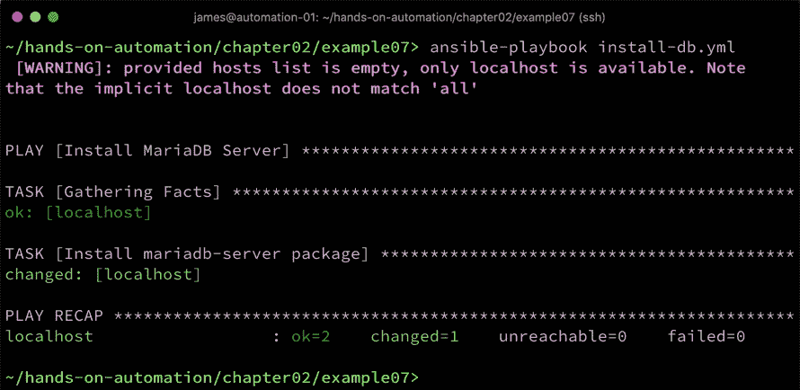

到目前为止，一切都很好。但是，如果你需要在不同的剧本中为不同的主机反复执行这些操作，你是否真的想一次又一次地编写（或者复制粘贴）这个任务块？此外，这个例子过于简化，实际上，数据库部署代码会复杂得多。如果有人对代码进行了修复或改进，你如何确保这个新的修订版本的代码能够传播到所有正确的位置？

这就是角色的作用，Ansible 角色本质上不过是一个结构化的目录集合和 YAML 文件，它使代码的高效复用成为可能。它还使初始的剧本更易于阅读，正如我们稍后所看到的那样。一旦角色创建完成，它们可以存储在一个中央位置，例如版本控制仓库（例如 GitHub），然后，只要需要安装 MariaDB 的剧本，始终可以访问到最新版本。

默认情况下，角色是从名为`roles/`的子目录运行的，与您的剧本文件在同一目录中。在本书中，我们将使用这种约定，尽管必须指出，Ansible 还会在`/etc/ansible/roles`和 Ansible 配置文件中指定的`roles_path`参数所指定的路径中搜索角色（默认情况下，可以在`/etc/ansible/ansible.cfg`中找到该文件，虽然有方法可以覆盖此设置）。然后，每个角色在此目录下都有其自己的子目录，并且该目录名称形成角色的名称。让我们通过一个简单的示例来探讨这一点，如下所示：

1.  我们将首先创建一个`roles/`目录，并在其下创建一个`install-mariadb/`目录，作为我们的第一个角色：

```
$ mkdir -p roles/install-mariadb
```

1.  每个角色都有其固定的目录结构；然而，在我们的简单示例中，我们只关心其中一个：`tasks/`。角色的`tasks/`子目录包含在调用角色时将运行的主要任务列表，存储在名为`main.yml`的文件中。现在让我们创建该目录，如下所示：

```
$ cd roles/install-mariadb
$ mkdir tasks
$ vi tasks/main.yml
```

1.  当然，你可以使用你喜欢的编辑器替代`vi`。在`main.yml`文件中，输入以下代码——请注意，这本质上是原始剧本中的任务块，但缩进级别现在已更改：

```
---
- name: Install mariadb-server package
  apt:
    name: mariadb-server
    update_cache: yes
```

1.  创建了这个文件后，我们接着编辑我们的原始`install-db.yml`剧本，使其如下所示：

```
---
- name: Install MariaDB Server
  hosts: localhost
  become: true

  roles:
    - install-mariadb
```

注意现在剧本的紧凑程度！它也更容易阅读，然而如果我们运行它，我们可以看到它执行了相同的功能。请注意上次运行时 MariaDB 服务器安装任务的状态是`changed`，但现在是`ok`。这意味着 Ansible 检测到`mariadb-server`包已经安装，因此不需要进一步操作。这是之前提到的幂等性变更的实际示例，如下截图所示：

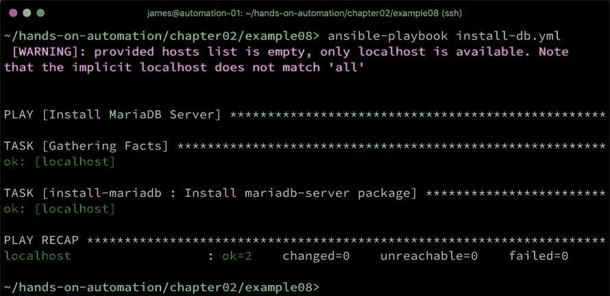

干得好！你已经创建并执行了你的第一个角色。如果你想进一步了解角色和所需的目录结构，请参阅[`docs.ansible.com/ansible/latest/user_guide/playbooks_reuse_roles.html`](https://docs.ansible.com/ansible/latest/user_guide/playbooks_reuse_roles.html)。

角色不仅仅是这样——它们不仅在结构化 playbook 和代码重用方面非常宝贵；还有一个用于社区贡献角色的中央仓库，叫做 **Ansible Galaxy**。如果你在 Ansible Galaxy 中搜索与 MariaDB 相关的角色，你会发现（截至目前）有 277 个不同的角色，所有这些角色都旨在执行各种数据库安装任务。这意味着你甚至不需要为常见任务编写自己的角色——你可以利用社区贡献的角色，或者将它们 fork 出来，按自己的需求修改。大多数常见的服务器自动化任务已经被 Ansible 社区在某个地方解决了，所以你很可能能找到完全符合你需求的角色。

现在我们来测试一下，如下所示：

1.  首先，从 Ansible Galaxy 安装一个在 Ubuntu 上安装 MariaDB 服务器的角色：

```
$ ansible-galaxy install -p roles/ mrlesmithjr.mariadb-mysql
```

1.  现在，我们将修改我们的 playbook 来引用这个角色：

```
---
- name: Install MariaDB Server
  hosts: localhost
  become: true

  roles:
    - mrlesmithjr.mariadb-mysql
```

1.  这就是所需的全部—如果我们运行它，我们可以看到这个 playbook 执行了比我们简单的 playbook 更多的任务，包括许多安装新数据库时的安全设置，这些设置是良好实践，正如以下截图所示：

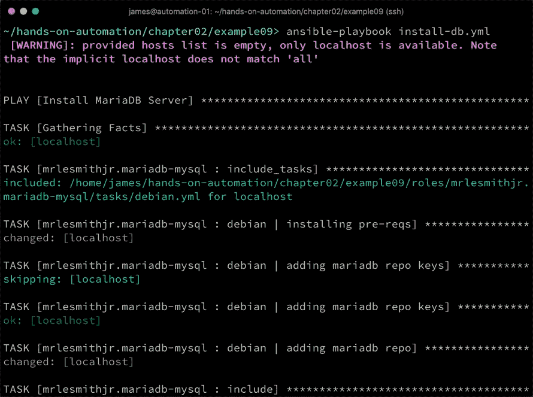

最终结果是，`mariadb-server` 包已经安装到我们的测试系统上——而这一次，我们几乎没有编写任何代码！当然，建议在盲目运行 Ansible Galaxy 中的角色之前，先检查它会做些什么，以防它做出你没有预料到（或不希望）的更改！尽管如此，角色结合 Ansible Galaxy，构成了 Ansible 提供的强大附加功能。

了解角色之后，在下一部分，我们将讨论一个重要的概念，帮助你通过使内容动态化，充分发挥 playbook 和角色的最大效用：Ansible 变量。

# 理解 Ansible 变量

到目前为止，我们看到的大多数示例都是静态的。这对于最简单的 playbook 示例是可以的，但在很多情况下，更希望能够存储或轻松在一个中央位置定义值，而不是在 playbook（及其角色树）中到处寻找某个硬编码的值。和其他语言一样，也希望能以某种方式捕获值，以便以后重用。

在 Ansible 中有许多不同类型的变量，并且需要注意它们有严格的优先级顺序。虽然在本书中我们不会遇到太多这个问题，但了解这一点是非常重要的，因为否则你可能会从变量中得到意想不到的结果。

变量优先级的更多细节可以参考 [`docs.ansible.com/ansible/latest/user_guide/playbooks_variables.html#variable-precedence-where-should-i-put-a-variable`](https://docs.ansible.com/ansible/latest/user_guide/playbooks_variables.html#variable-precedence-where-should-i-put-a-variable)

简而言之，变量可以在多个位置定义，特定场景下的正确位置将由剧本的目标驱动。例如，如果某个变量对一组服务器都通用，那么将其作为组变量定义在清单中是合乎逻辑的。如果它适用于每个特定剧本运行的主机，那么你几乎肯定会在剧本中定义它。让我们快速看一下，通过修改我们在本章前面使用的`simple.yml`剧本，在其中定义一个名为`message`的剧本变量，以便在剧本运行时通过`debug`语句显示，示例如下：

```
---
- name: Simple playbook
  hosts: localhost
  become: false

  vars:
    message: "Life is beautiful!"

  tasks:
    - name: Show a message
      debug:
        msg: "{{ message }}"
    - name: Touch a file
      file:
        path: /tmp/foo
        state: touch
```

请注意，我们现在在`tasks`部分之前定义了一个`vars`部分，并且通过将变量放在一对大括号中来访问它。运行此剧本会得到以下结果：

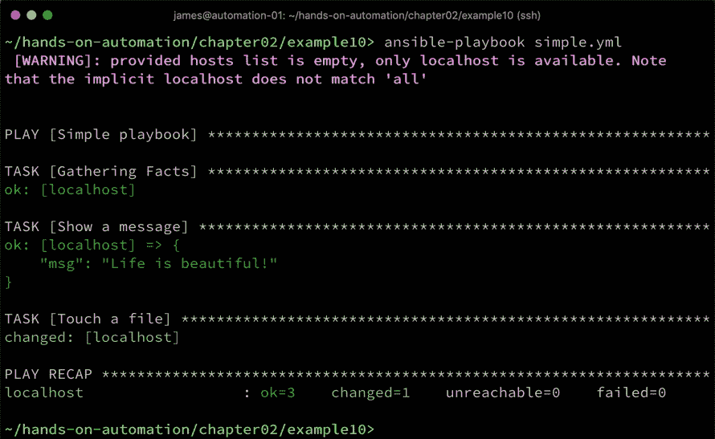

如果你参考变量优先级顺序列表，你会注意到传递给`ansible-playbook`命令行二进制文件的变量位于列表顶部，并且会覆盖所有其他变量。因此，如果我们希望在不编辑剧本的情况下覆盖消息变量的内容，我们可以如下操作：

```
$ ansible-playbook simple.yml -e "message=\"Hello from the CLI\""
```

注意处理变量内容中空格所需的特殊引用和转义，以及这对剧本操作的影响：

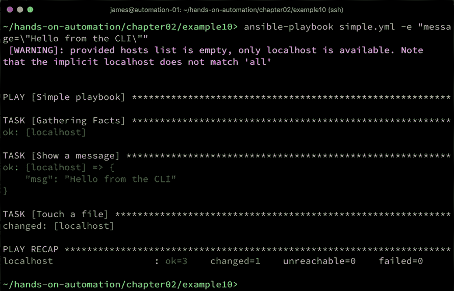

变量也可以传递给角色，这是创建通用角色的一种简单而强大的方式，这些角色可以在多种场景中使用，而无需使用相同的配置数据。例如，在前面的部分中，我们探讨了安装 MariaDB 服务器。虽然这是一个适合做成角色的好例子，但你肯定不希望在每个服务器上配置相同的 root 数据库密码。因此，定义一个密码变量，并将其从调用的剧本（或其他适当来源，如主机或组变量）传递给角色是很有意义的。

除了用户定义的变量，Ansible 还拥有一些内置变量，这些变量被称为特殊变量。可以在剧本的任何地方访问这些变量，它们对于获取与剧本状态相关的某些细节非常有用。

例如，如果你需要知道当前正在执行特定任务的主机名，可以通过`inventory_hostname`变量获取。有关这些变量的完整列表，请访问[`docs.ansible.com/ansible/latest/reference_appendices/special_variables.html`](https://docs.ansible.com/ansible/latest/reference_appendices/special_variables.html)

许多读者现在应该已经注意到，我们所有示例剧本的输出中都包含一行文字：“`Gathering Facts`”。虽然可以关闭这一功能，但它实际上非常有用，会填充许多包含有用系统数据的变量。为了了解在此阶段收集到的数据类型，请从命令行运行以下代码：

```
$ ansible -m setup localhost
```

这个命令并不是运行剧本，而是指示 Ansible 直接在`localhost`上运行`setup`模块——`setup`模块是在`Gathering Facts`阶段后台运行的模块。输出看起来像这样，并且会显示很多内容——这里只是前几行：

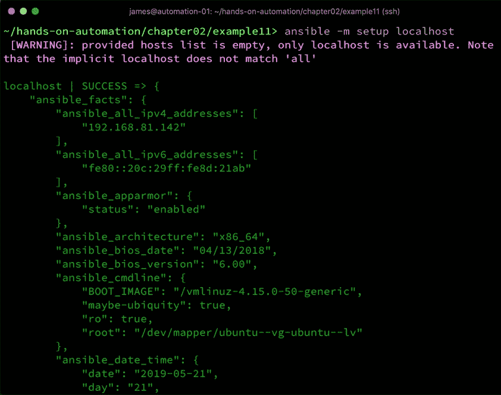

我们可以立即看到这里有一些非常有用的信息，例如主机的 IP 地址、根卷等等。记得我们在第一章中讨论过的共同点吗？*在 Linux 上构建标准操作环境*，以及检测你所运行的操作系统的难度？好了，Ansible 使得这一点变得简单，因为这些数据都可以在收集到的事实中轻松获取。我们只需通过指定相应的事实，便可以从上一条命令的输出中访问，修改我们的`debug`语句来显示我们所运行的 Linux 发行版，如下所示：

```
    - name: Show a message
      debug:
        msg: "{{ ansible_distribution }}"
```

现在，当我们运行剧本时，我们可以很容易地看出我们正在运行的是 Ubuntu，正如以下截图所示：

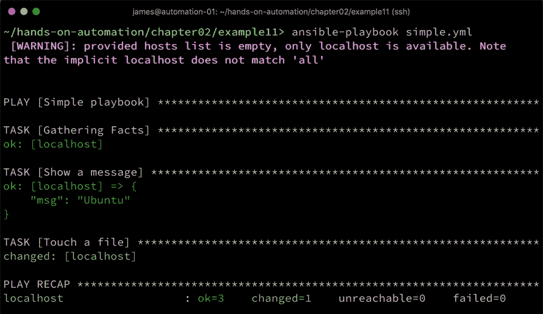

Ansible 使得你可以有条件地执行单个任务、角色，甚至整个任务块，因此，访问这些事实数据使得编写可以在多个平台上运行的健壮剧本变得非常容易，并且能在每个平台上执行正确的操作。

同样值得注意的是，变量不必存储在未加密的文本中。偶尔，可能需要将密码存储在变量中（如前所述——可能是我们的 MariaDB 服务器安装的 root 密码）。以明文格式存储这些细节存在很大的安全风险，但幸运的是，Ansible 包括了一种名为**Vault**的技术，能够使用 AES256 加密存储变量数据。这些加密的 Vault 可以被任何剧本引用，只要在运行剧本时提供 Vault 密码即可。Vault 的内容超出了本章的范围，但如果你想了解更多，可以查看[`docs.ansible.com/ansible/latest/user_guide/playbooks_vault.html`](https://docs.ansible.com/ansible/latest/user_guide/playbooks_vault.html)。在本书中，我们不会广泛使用 Vault，仅仅是为了保持示例代码简洁。然而，强烈建议在生产环境中，尽可能在需要存储剧本敏感数据的地方使用 Vault。

现在我们已经介绍了 Ansible 中变量的概念，以及各种类型的变量，让我们来看看 Ansible 中管理配置文件的重要方式——使用模板。

# 理解 Ansible 模板

一个常见的自动化需求是根据某些给定的参数在配置文件中设置值，或者甚至部署一个新的配置文件。Ansible 提供了可以执行类似于传统`sed`和`awk`工具功能的模块，当然，这些也是修改现有配置文件的有效方式。假设我们有一个小型的 Apache 虚拟主机配置文件，包含如下代码：

```
<VirtualHost *:80>
    DocumentRoot "/var/www/automation"
    ServerName www.example.com
</VirtualHost>
```

我们希望部署这个配置，但为每个主机定制`DocumentRoot`参数。当然，我们可以像以前那样将文件直接部署到每个主机，然后使用正则表达式，结合 Ansible 的`replace`模块，找到`DocumentRoot`所在的行并修改它（类似于使用`sed`命令行工具）。最终的 playbook 可能如下所示：

```
---
- name: Deploy and customize an Apache configuration
  hosts: localhost
  become: true

  vars:
    docroot: "/var/www/myexample"

  tasks:
    - name: Copy static configuration file to remote host
      copy:
        src: files/vhost.conf
        dest: /etc/apache2/sites-available/my-vhost.conf

    - name: Replace static DocumentRoot with variable contents
      replace:
        path: /etc/apache2/sites-available/my-vhost.conf
        regexp: '^(\s+DocumentRoot)\s+.*$'
        replace: '\1 {{ docroot }}'
```

如果我们创建一个名为`files/vhost.conf`的静态虚拟主机配置文件，内容如前所述，并运行这个 playbook，我们可以看到它工作正常，如下所示：

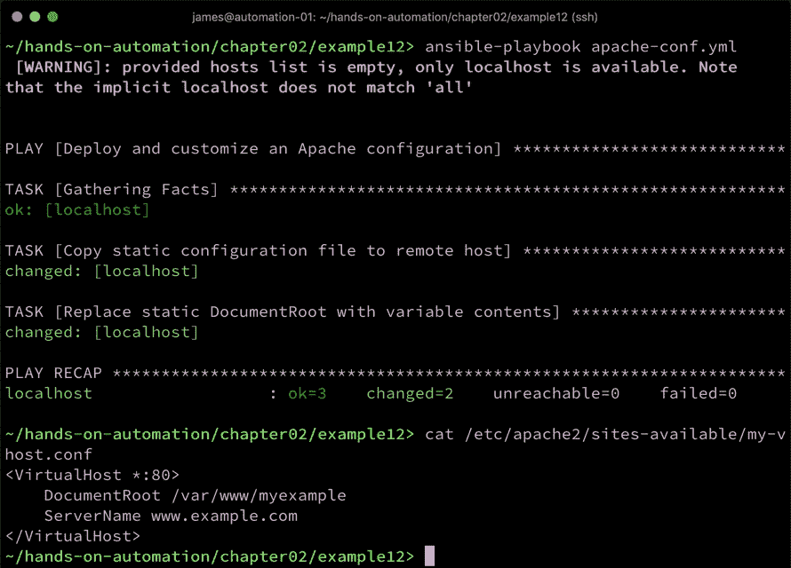

然而，这并不是一个优雅的解决方案。首先，我们使用了两个任务，如果还想定制`ServerName`，我们还需要更多的任务。其次，那些熟悉正则表达式的人会知道，简单的正则表达式很容易出错。编写用于这类任务的健壮的正则表达式本身就是一门艺术。

幸运的是，Ansible 继承了它所写的 Python 中的技术，叫做 **Jinja2 模板**。这对于像这样的场景（以及许多其他与部署相关的自动化场景）非常适用。我们现在不需要像之前那样的繁琐多步骤的方法，而是将我们的起始虚拟主机配置文件定义为`templates/vhost.conf.j2`模板，如下所示：

```
<VirtualHost *:80>
    DocumentRoot {{ docroot }}
    ServerName www.example.com
</VirtualHost>
```

如你所见，这几乎与我们原始的配置文件相同，唯一不同的是我们已经将其中一个静态值替换成了我们的变量，变量用一对大括号括起来，就像我们在 playbook 中做的一样。在继续这个例子之前，值得一提的是，Jinja2 是一个功能非常强大的模板系统，远远超出了简单的变量替换，它支持条件语句，如`if...else`和`for`循环，还包括许多可以用来处理内容的过滤器（例如，将字符串转换为大写，或者将列表中的成员连接起来形成一个字符串）。

话虽如此，本书并不是 Ansible 或 Jinja2 的完整语言参考——它更像是一本实用指南，向您展示如何使用 Ansible 构建 SOE。请参考本章末尾的*进一步阅读*部分，里面有一些参考资料，可以为您提供 Ansible 和 Jinja2 更全面的概述。

返回到我们的示例，我们将修改 playbook 来部署此示例，如下所示：

```
---
- name: Deploy and customize an Apache configuration
  hosts: localhost
  become: true

  vars:
    docroot: "/var/www/myexample"

  tasks:
    - name: Copy across and populate the template configuration
      template:
        src: templates/vhost.conf.j2
        dest: /etc/apache2/sites-available/my-vhost.conf
```

请注意，这个 playbook 更加简洁优雅——`template` 模块将配置模板复制到远程主机，就像在前面的示例中 `copy` 模块所做的那样，并且还填充了我们指定的任何变量。这是一种极其强大的方式，以可重复、通用的方式部署配置文件，并且强烈建议在可能的情况下采用这种方法。当人类编辑文件时，他们往往会以不一致的方式进行，这可能会成为自动化的敌人，因为您必须构建一个非常稳健的正则表达式，以确保捕捉所有可能的边界情况。通过 Ansible 从模板部署可以创建可重复、可靠的结果，且能够在生产环境中轻松验证。运行这个 playbook 会得到与我们之前更复杂示例相同的结果，如下所示：

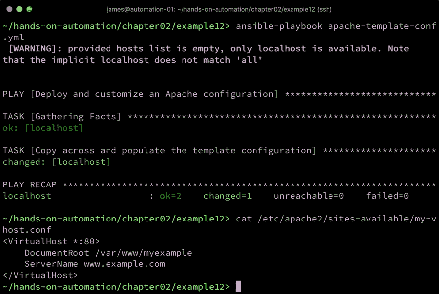

目前我们已经结束了对变量的讨论，也完成了 Ansible 的速成课程。在接下来的章节中，我们将把所学的内容整合起来，之后结束这一章。

# 将 Ansible 和 SOE 结合起来

我们已经通过 Ansible 完成了多个端到端的示例。虽然这些示例很简单，但它们展示了本书所基于的 Ansible 自动化的基本构建模块。在大规模 Linux 环境中实现自动化的一个重要部分是拥有良好的标准和稳健的流程。因此，您的操作环境不仅应当标准化，您的部署和配置流程也应当如此。

正如上一章所讨论的那样，尽管定义良好的 SOE 在部署时是统一的，但如果管理员可以随意更改，使用他们偏好的任何方法，这种一致性很快就会丧失。就像部署 SOE 是实现自动化成功的关键一样，尽可能将自动化作为您进行大多数（理想情况下是所有）管理任务的首选方法也是十分理想的。

理想情况下，playbook 应该有一个单一的真实来源（例如，中央 Git 仓库），清单也应有一个单一的真实来源（这可以是一个集中存储的静态清单，或者使用动态清单）。

任何编写良好的 Ansible playbook（或角色）的目标是确保运行它的结果是可重复且可预测的。例如，我们在上一节末尾运行的 playbook，我们通过该 playbook 部署了一个简单的 Apache `vhost.conf` 文件。每次你在任何服务器上运行此 playbook 时，`/etc/apache2/sites-available/my-vhost.conf` 的内容都会相同，因为该 playbook 使用模板部署此文件，并且如果目标文件存在，则会覆盖该文件。

当然，这只是标准操作环境的一个缩影，但这样的环境将由成百上千—如果不是更多—这样的微小构件块组成。毕竟，如果你无法确保你的 Apache 配置在整个基础设施中保持一致，那么你如何能确信它的其他部分也都符合你的标准呢？

编写良好的 playbook 的可重复性也很重要—仅仅因为你部署了一个一致的 Apache 配置，并不意味着它会保持一致。在你部署配置后的五分钟内，拥有相应权限的人可能会登录服务器并更改配置。因此，你的环境可能会几乎立即偏离你的 SOE 定义。实际上，反复运行你的 Ansible playbook 来管理基础设施是你持续过程中的一个重要部分，因为这些 playbook 的目的是将配置恢复到你原来的标准。因此，Ansible playbook 不仅在定义和部署 SOE 时至关重要，而且在持续执行标准方面也起着重要作用。

如果可能的话，不应手动部署任何修复措施。假设有人手动调整了 `/etc/apache2/sites-available/my-vhost.conf` 中的配置以解决某个问题。单独来看，这并不构成问题，但重要的是，这些更改必须被添加回 playbook、角色或模板中。如果通过 Ansible 部署或强制执行你的 SOE 以某种方式破坏了它，那么你的流程可能存在问题。

实际上，通过实施我们到目前为止讨论的，并将在本书中继续探索的过程，可以实现企业范围内的成功自动化。本章中简要介绍的 Ansible 自动化，虽然简短，却是这些建议流程的一部分。

关于 Ansible 还有很多内容需要学习，简而言之，我想提出一个大胆的观点：如果你能将其构思为服务器部署或配置任务，Ansible 都能提供帮助。得益于其开源特性，Ansible 非常具有扩展性，并且其广泛的应用意味着许多常见的自动化挑战已经得到解决，并且相关功能已经被包含在内。希望本章已经为你进入 Linux 自动化和 Ansible 打下了良好的基础。

# 总结

Ansible 是一款强大、可靠的开源工具，一旦你掌握了几个简单的概念，它就能帮助你在 Linux 环境中实现大规模的自动化。Ansible 无需代理，因此在 Linux 客户端机器上无需配置，你就可以开始自动化之旅，而且项目背后有一个强大的社区，这意味着你可以轻松找到解决你希望用 Ansible 解决的大多数问题的答案。

在本章中，你学习了 playbook 结构的基础知识以及运行简单 playbook 所需的一些关键文件。你了解了清单的重要性以及如何使用它们，如何通过角色（以及如何利用社区的代码来节省时间和精力）高效地重用代码。你学习了变量和 facts，以及如何在 playbook 中引用它们，如何使用 Jinja2 模板来帮助你的自动化旅程。在这一过程中，你构建并运行了多个完整的 playbook，展示了 Ansible 的使用。

在下一章中，你将发现如何简化基础设施管理，并进一步优化你的自动化流程，使用 AWX 来完善管理。

# 问题

1.  什么是 Ansible，它与运行简单的 shell 脚本有何不同？

1.  什么是 Ansible 清单？

1.  为什么将任务编写为角色而不是单个大型 playbook 通常是有益的？

1.  Ansible 使用哪种模板语言？

1.  你可以覆盖 Ansible 中的变量吗？

1.  为什么你会使用 Ansible 模板模块而不是简单的查找和替换操作？

1.  你如何利用 Ansible facts 来改善你的 playbook 流程？

# 深入阅读

+   欲深入理解 Ansible 和 Jinja2 模板，请参考 *Mastering Ansible, Third Edition—**James Freeman* 和 *Jesse Keating* ([`www.packtpub.com/gb/virtualization-and-cloud/mastering-ansible-third-edition`](https://www.packtpub.com/gb/virtualization-and-cloud/mastering-ansible-third-edition))。
