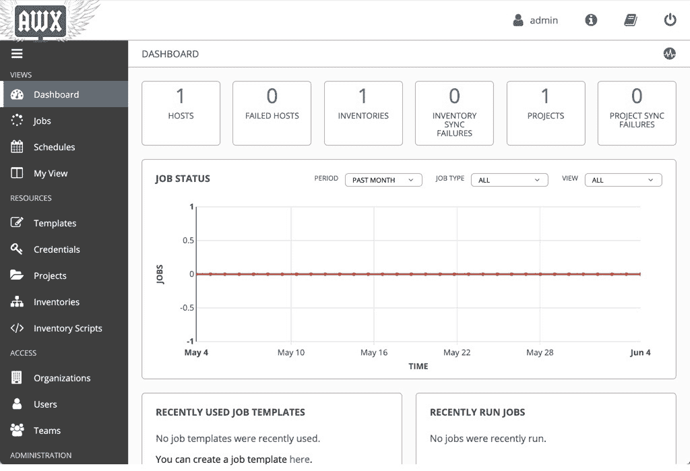

# 第三章：使用 AWX 简化基础设施管理

正如本书迄今为止所讨论的，Linux 上的有效企业自动化涉及几个关键要素，包括工具和技术的标准化，以及实现使环境管理更加高效的流程和工具。Ansible 是这条旅程的第一步，可以通过一种名为 AWX 的互补技术来进一步简化其应用。

AWX 简而言之是一个用于管理 Ansible 任务的图形界面驱动工具。它并不替代 Ansible 的功能，而是通过提供一个多用户图形界面的前端来补充 Ansible，从而简化了剧本的管理和编排。当管理像企业环境中那样的大型 Linux 环境时，AWX 是 Ansible 自动化的完美补充，是实现高效管理的重要一步。在本章中，我们将涵盖以下主题：

+   AWX 简介

+   安装 AWX

+   从 AWX 运行你的剧本

+   使用 AWX 自动化常规任务

# 技术要求

本章包括基于以下技术的示例：

+   Ubuntu Server 18.04 LTS

+   CentOS 7.6

+   Ansible 2.8

要运行这些示例，你需要访问运行上述操作系统之一和 Ansible 的服务器或虚拟机。请注意，本章给出的示例可能具有破坏性（例如，它们涉及在服务器上安装 Docker 并运行服务），如果按照原样运行，仅适合在隔离的测试环境中运行。

一旦确认你有一个安全的操作环境，我们就可以开始看看如何使用 Ansible 安装新的软件包。

本书中讨论的所有示例代码可从 GitHub 获取：[`github.com/PacktPublishing/Hands-On-Enterprise-Automation-on-Linux`](https://github.com/PacktPublishing/Hands-On-Enterprise-Automation-on-Linux)。

# AWX 简介

AWX 旨在解决在企业环境中使用 Ansible 自动化所面临的问题。为了保持我们的实践焦点，让我们考虑一下我们在第一章中讨论的有机增长场景，*在 Linux 上构建标准操作环境*。在一个已经实现了 Ansible 的小型环境中，可能只有一到两个人负责编写和运行剧本。在这个小型场景中，了解谁运行了哪些剧本以及最新版本是什么相对容易，而且 Ansible 的培训需求较低，因为只有少数关键人员负责使用它。

随着环境规模的扩大，Ansible 操作员的数量也会增加。如果所有负责运行 Ansible 的人都在自己的机器上安装了它，并且每个人都有本地的 playbook 副本，突然之间，管理这个环境就变成了一场噩梦！你如何确保每个人都在使用最新版本的 playbook？你怎么知道是谁运行了什么，结果是什么？如果需要在非工作时间执行某个变更怎么办？你能将 Ansible 作业交给 **网络运营中心**（**NOC**）团队吗？还是说不行，因为他们需要接受 Ansible 使用培训？

AWX 旨在解决所有这些挑战，正如我们接下来将看到的那样，从下一节开始，我们将讨论 AWX 如何帮助降低员工培训成本。

# AWX 降低了培训需求

Ansible 非常容易上手。不过，它仍然需要一些培训。例如，未接受过培训的 IT 管理员和操作员可能不习惯在命令行上运行 playbook。以下示例演示了这一点。虽然从 Ansible 的角度来看这个过程相当简单，但任何不熟悉这个工具的人都会发现，它并不十分友好：

```
$ ansible-playbook -i hosts --ask-pass simple.yml

```

尽管这不是一个复杂的命令，但那些不熟悉它的人可能会因为害怕对生产系统造成损害而不愿意执行，更不用说解读一个大型 playbook 可能产生的输出内容了。

为了缓解这一问题，AWX 提供了一个基于 Web GUI 的界面，字面意思就是点击即可使用。虽然熟悉该工具的用户可以使用许多高级功能，但通过鼠标点击几下就可以运行 playbook，结果将通过一个简单的 *交通信号灯* 系统展示（红色表示 playbook 运行失败，而绿色表示成功）。通过这种方式，AWX 提供了一个接口，使得即使是没有 Ansible 使用经验的人也能够启动 playbook，并将结果传递给其他团队进行分析。

AWX 也为安全团队和管理者提供了好处，通过记录所有执行的操作和作业的详细结果，下一节中我们将提供对此的概述。

# AWX 使审计变得可能

尽管 Ansible 命令行工具提供了日志选项，但这些选项默认是禁用的，因此，一旦终端会话关闭，playbook 的运行输出可能会丢失。在企业环境中，这并不理想，特别是在出现问题或故障时，进行根本原因分析是必需的。

AWX 通过两种方式解决了这个问题。首先，所有用户在执行任何操作之前必须登录 GUI。AWX 可以与集中式会计系统（如 LDAP 或 Active Directory）集成，或者用户可以在 AWX 主机上本地定义。然后，所有 UI 中的操作都会被跟踪，因此，可以将剧本运行追溯到特定用户，甚至配置更改。在企业环境中，这种级别的问责制和审计追踪是*必不可少*的。

此外，AWX 会捕获每次剧本运行的所有输出，以及一些关键信息，例如剧本运行的清单、传递给它的变量（如果有的话）以及运行的日期和时间。这意味着如果发生问题，AWX 可以提供完整的审计追踪，帮助你找出发生了什么以及发生的时间。

AWX 不仅可以帮助审计你的自动化，还可以帮助确保剧本的版本控制，我们将在下一节中详细讨论这一点。

# AWX 支持版本控制

在企业场景中，个人将剧本存储在本地可能会导致潜在的问题。例如，如果用户 A 更新了包含关键修复的剧本，如何确保用户 B 能够访问到该代码？理想情况下，代码应存储在版本控制系统中（例如，GitHub），并且每次运行时本地副本都会更新。

良好的流程是 Linux 企业自动化的重要组成部分，尽管用户 B 在运行剧本之前应更新本地剧本，但你无法强制执行这一点。同样，AWX 通过允许剧本从版本控制仓库中获取来解决这个问题，AWX 服务器上的本地剧本副本会自动更新。

尽管 AWX 可以帮助你，特别是在确保从仓库拉取最新版本的代码时，但它无法帮助解决其他错误行为，例如有人根本没有提交代码。然而，强制使用 AWX 来执行 Ansible 剧本的目的是：任何做出更改的人都必须提交这些更改，AWX 才能运行它们。应严格限制本地访问 AWX 服务器，以防止人们在本地文件系统上修改代码，通过这种方式，你可以确信每个人都在积极有效地使用版本控制系统。

这些更新可以是事件驱动的，例如，当从该存储库运行剧本时，本地剧本每次都会更新。它们也可以按照 AWX 管理员的决策，定期更新或手动更新。

AWX 还可以帮助你确保自动化的安全性。我们将在下一节中通过查看 AWX 中的凭证管理来探讨这一点。

# AWX 有助于凭证管理

为了让 Ansible 有效地管理企业 Linux 环境，它必须具有某种形式的凭证来访问它所管理的所有服务器。SSH 认证通常使用 SSH 密钥或密码进行保护，在一个大型的 Ansible 操作员团队中，这意味着每个人都可能访问这些密码和 SSH 私钥，因为它们是运行 Ansible 所必需的。不言而喻，这带来了安全风险！

如前所述，从安全角度来看，这种做法并不理想，因为别人可以轻易地复制并粘贴凭证，将其用于未经授权的方式。AWX 通过将所需的凭证存储在数据库中，并使用安装时选择的密码短语加密，来处理这个问题。GUI 使用可逆加密存储所有凭证，以便在稍后运行 playbook 时将它们传递给 Ansible。然而，GUI 不允许你查看任何以前输入的敏感数据（例如密码或 SSH 私钥）——也就是说，凭证可以输入和更改，但你无法在 GUI 中显示密码或 SSH 密钥，因此操作员无法轻松通过 AWX 前端获取凭证信息以供其他用途。通过这种方式，AWX 帮助企业将凭证锁定保管，并确保它们仅用于 Ansible 部署，避免泄露或被用于其他非预期目的。

Ansible Vault 是一个出色的工具，用于加密 playbook 操作时需要的任何敏感数据，无论是作为变量形式的 playbook 数据，还是存储服务器凭证本身，例如 SSH 私钥。尽管 Vault 非常安全，但如果你拥有 Vault 密码（在这里，你需要运行使用 Vault 的 playbook），仍然可以查看 Vault 内容。因此，AWX 提供了独特的功能，以补充 Ansible 并确保企业环境中的安全性。

通过这些方式，AWX 帮助解决企业在大规模环境中部署 Ansible 时面临的许多挑战。在我们完成本章的这一部分之前，我们将简要讨论 AWX 如何帮助你与其他服务进行集成。

# 将 AWX 与其他服务集成

AWX 可以与各种工具集成——例如，Red Hat 的 Satellite 6 和 CloudForms 产品（及其开源版本 Katello 和 ManageIQ）都提供与 AWX 和 Ansible Tower 的原生集成。这只是两个示例，而所有这些都可能实现，因为我们将在本章中探索的所有内容也可以通过 API 和命令行界面访问。

这使得 AWX 可以与各种服务进行集成，或者您甚至可以编写自己的服务，通过调用 API 来运行 AWX 的 playbook，从而响应某些其他操作。命令行界面（称为 `tower-cli`，来源于商业产品 Ansible Tower）也非常有用，尤其是在程序化地向 AWX 填充数据时。例如，如果您想将一个主机添加到静态清单中，您可以通过 Web 用户界面（稍后我们会演示）、API 或使用 CLI 来完成。后两种方法非常适合与其他服务集成——例如，**配置管理数据库**（**CMDB**）可以通过 API 将新主机推送到清单中，无需用户手动操作。

若要进一步探索这两个集成点，您可以参考以下官方文档来源：

+   AWX API 的文档可以在此查看：[`docs.ansible.com/ansible-tower/latest/html/towerapi/index.html`](https://docs.ansible.com/ansible-tower/latest/html/towerapi/index.html)。

+   `tower-cli` 命令的文档可以在此查看：[`tower-cli.readthedocs.io/en/latest/`](https://tower-cli.readthedocs.io/en/latest/)。

鉴于这类集成的广泛性和多样性，超出了本书的讨论范围——然而，提到这些集成点很重要，因为希望在阅读本章时，您会看到与其他服务集成的机会，从而能够进一步探索这一主题。本章的下一部分，我们将实际操作 AWX，并查看一个简单的部署。稍后本章将通过一些示例用例进行补充。

# 安装 AWX

一旦设置了正确的前提条件，安装 AWX 就非常简单。事实上，AWX 的一个前提条件是 Ansible，证明了这项技术的互补性。大多数 AWX 代码运行在一组 Docker 容器中，这使得它在大多数 Linux 环境中都能轻松部署。

使用 Docker 容器意味着可以在 OpenShift 或其他 Kubernetes 环境中运行 AWX——然而，为了简便起见，我们将在单一 Docker 主机上开始安装。在继续之前，您应该确保所选主机具备以下条件：

+   Docker，完全安装并正常工作

+   您版本的 Python 的 `docker-py` 模块

+   访问 Docker Hub（需要互联网访问）

+   Ansible 2.4 或更高版本

+   Git 1.8.4 或更高版本

+   Docker Compose

这些前提条件通常在大多数 Linux 系统中都可以轻松获得。现在，我们将执行以下步骤开始我们的安装：

1.  继续我们在上一章中使用的 Ubuntu 系统示例，我们将运行以下命令来安装 AWX 所需的依赖：

```
$ sudo apt-get install git docker.io python-docker docker-compose
```

1.  安装这些之后，接下来的任务是从 GitHub 上的仓库克隆 AWX 代码：

```
$ git clone https://github.com/ansible/awx.git 
```

Git 工具将忠实地克隆 AWX 源代码的最新版本—请注意，该项目正在积极开发中，最新发布版本可能存在错误。

如果您想克隆稳定的 AWX 发行版之一，请浏览存储库的 Releases 部分并检出所需版本：[https:/​/​github.​com/ansible/​awx/​releases](https://github.com/ansible/awx/releases).

1.  我们已经克隆了存储库，现在是时候为我们的 AWX 安装定义配置了，特别是安全细节如密码。要开始此过程，请切换到克隆存储库下的 `installer` 目录：

```
$ cd awx/installer 
```

希望在阅读前一章节后，您对此目录的内容已经感到熟悉。这里有一个 `inventory` 文件，一个我们要运行的 playbook 叫做 `install.yml`，还有一个 `roles/` 目录。但在运行 `install.yml` playbook 之前，请注意清单文件中还有一些变量需要设置。

如果您查看清单文件，您会看到其中有大量的配置可供设置。一些变量被注释掉，而其他变量则设置为默认值。在安装 AWX 之前，我建议您至少设置六个变量，具体如下：

| **变量名** | **推荐值** |
| --- | --- |
| `admin_password` |

这是管理员用户的默认密码—第一次登录时需要它，所以请务必将其设置为易于记忆且安全的内容！

|

| `pg_password` |
| --- |

这是后端 PostgreSQL 数据库的密码—请确保将其设置为独特且安全的内容。

|

| `postgres_data_dir` |
| --- |

这是本地文件系统上 PostgreSQL 容器存储其数据的目录—它默认位于 `/tmp` 下的一个目录，在大多数系统上会定期自动清理。这通常会销毁 PostgreSQL 数据库，因此请将其设置为 AWX 特定的目录（例如，`/var/lib/awx/pgdocker`）。

|

| `project_data_dir` |
| --- |

若要手动上传 Playbooks 到 AWX 而无需使用版本控制系统，则 Playbooks 必须位于文件系统的某个位置。为了避免复制到容器中，此变量将本地指定的文件夹映射到容器内所需的文件夹。在本书的示例中，我们将使用默认的 (`/var/lib/awx/projects` 文件夹)。

|

| `rabbitmq_password` |
| --- |

这是后端 RabbitMQ 服务的密码—请确保将其设置为独特且安全的内容。

|

| `secret_key` |
| --- |

这是用于加密 PostgreSQL 数据库凭据的秘钥。在 AWX 升级之间必须保持一致，所以请确保将其存储在安全的地方，因为将来需要在 AWX 的清单中设置它。请设置一个又长又安全的内容。

|

1.  你会发现，在这个清单文件中有大量的秘密信息以明文形式显示。虽然在安装过程中我们可以容忍这一点，但安装完成后，不应该把这个文件留在文件系统上，因为它可能为潜在攻击者提供获取系统详细信息的途径，进而轻易地破坏你的系统。安装阶段完成后，务必将此文件复制到某种密码管理器中，或者将单独的密码存储起来——无论哪种方式，都不要将文件以未加密形式存放！

1.  一旦清单被自定义，就可以开始执行安装过程——通过运行以下命令启动安装：

```
$ sudo ansible-playbook -i inventory install.yml
```

从我们在上一章关于 Ansible 的工作中，你会认识到这个命令——它使用`ansible-playbook`命令来运行`install.yml`剧本，同时也使用我们在*步骤 1*中编辑的名为`inventory`的清单文件。终端中将会输出很多内容，如果安装成功，你应该能看到类似这样的信息：


1.  安装完成后，Docker 容器需要几分钟才能启动，后台数据库也需要一些时间来创建。然而，一旦完成，你应该能够在浏览器中导航到所选 AWX 主机的 IP 地址，并看到登录页面，下面的截图展示了一个示例：


1.  使用你之前在清单文件中的`admin_password`变量设置的密码，以管理员身份登录。登录后，你将被带到 AWX 的仪表板页面：



就这样——你已经成功安装并登录到 AWX 了！当然，你可以定义更多的高级安装参数，而且在企业环境中，你也不应该只依赖单个 AWX 主机而没有备份（或高可用性）。

请注意，当你登录 AWX 时，连接没有使用 SSL 加密，这可能导致敏感数据（如机器凭证）以明文形式通过网络传输。

没有一种适合所有企业的现成高可用性和 SSL 解决方案，因此我们将实际解决方案留给你作为练习。例如，如果你有一个包含多个主机的 OpenShift 环境，那么在该环境中安装 AWX 可以确保即使运行 AWX 的主机发生故障，它也能继续运行。当然，也有方法可以在没有 OpenShift 的情况下实现高可用性。

将安全 HTTP 应用于 AWX 的解决方法会因不同的环境而异。大多数 Docker 环境前面会有某种负载均衡器来帮助处理其多主机特性，因此，SSL 加密可能会卸载到负载均衡器上。也可以通过安装能够进行反向代理的软件（例如 nginx）并配置它来处理 SSL 加密，从而保护单个 Docker 主机，例如我们在这里构建的那个。

总之，这并没有统一的解决方案，但建议你根据自己企业的需求采取最合适的方法。因此，我们在此不再进一步讨论它们，只建议你在为生产环境部署 AWX 时考虑这些问题。

现在你已经有了一个运行中的 AWX 实例，我们必须对其进行配置，以便我们能够成功地复现上一章中从命令行运行剧本的方式。例如，我们必须像之前那样定义一个库存，并确保我们已设置 SSH 身份验证，以便 Ansible 可以在远程计算机上执行自动化任务。在本章的下一部分，我们将演示运行第一个剧本所需的所有设置。

# 从 AWX 运行剧本

当我们从命令行运行示例剧本时，我们创建了库存文件，然后是剧本，并使用`ansible-playbook`命令运行它。所有这些，当然，假设我们已经通过交互式输入密码或设置 SSH 密钥的方式与远程系统建立了连接。

尽管 AWX 中的最终结果非常相似——剧本是针对库存运行的——但术语和命名方式却有很大不同。在本章的这一部分，我们将演示如何通过 AWX 启动并运行第一个剧本。虽然本书没有足够的篇幅详细介绍 AWX 的每个功能，但本节旨在让你具备足够的知识和信心，从 AWX 管理剧本，并进一步探索。

在你能够从 AWX 运行第一个剧本之前，必须完成几个前置设置步骤。在接下来的部分中，我们将完成其中的第一个——创建将用于通过 SSH 与目标机器进行身份验证的凭据。

# 在 AWX 中设置凭据

当你登录到 AWX 时，你会注意到屏幕左侧有一个菜单栏。为了定义一组新的凭据，我们将用它来让 Ansible 登录到我们的目标机器，执行以下步骤：

1.  点击左侧菜单栏中的 Credentials。

1.  点击绿色的 + 图标以创建新的凭据。

1.  给凭据起个名字，并从 CREDENTIAL TYPE 字段中选择 Machine。AWX 支持许多类型的凭据，可以与各种服务交互，但目前我们只关注这一类型。

1.  还有许多其他字段可以用于指定更高级的参数，但对于我们的演示来说，这些已经足够。

你的最终结果应类似于下面的截图。请注意，我已经为我的示范机器指定了登录密码，但你也可以在屏幕上的较大文本框中指定 SSH 私钥。你还会看到 Prompt on launch 复选框的存在—AWX 有许多选项，可以在运行 playbook 时提示用户，这能提供丰富的交互式用户体验。不过，在本示例中，我们不会使用这个选项，因为我们希望演示无需用户干预即可运行 playbook：


定义凭据后，下一步是定义库存来运行我们的 playbook。我们将在下一节中详细探讨。

# 在 AWX 中创建库存

就像在命令行一样，AWX 需要创建一个库存，才能执行 playbook。在这里，我们将使用一个官方的、公开可用的 Ansible 示例 playbook，它需要一个包含两个组的库存。在更大的设置中，我们会为每个组指定不同的服务器，但在这个小型示例中，我们可以重复使用同一台服务器作为两个角色。

相关代码用于在 RHEL 或 CentOS 7 机器上安装一个简单的 LAMP 堆栈，可以在这里查看：[`github.com/ansible/ansible-examples/tree/master/lamp_simple_rhel7`](https://github.com/ansible/ansible-examples/tree/master/lamp_simple_rhel7)。

要运行这个示例，你需要一台 CentOS 7 机器。我的示例主机叫做 `centos-testhost`，如果我在命令行定义一个库存文件，它看起来会是这样的：

```
[webservers]
centos-testhost

[dbservers]
centos-testhost
```

要在 AWX 图形界面中复制此操作，请按照以下步骤执行：

1.  在左侧菜单栏点击 Inventories。

1.  点击绿色的 + 图标来创建一个新的库存。

1.  从下拉菜单中选择 Inventory。

1.  给库存起个合适的名字，然后点击 SAVE。

完成此过程后，屏幕应显示如下所示：


完成后，我们可以创建第一个组，并将我们的测试主机加入其中。按照以下步骤操作：

1.  点击窗格顶部的 GROUPS 按钮。

1.  点击绿色的 + 图标来创建一个新的组。

1.  在 NAME 字段中输入名称 `webservers`。

1.  点击绿色的 SAVE 按钮。

1.  点击顶部的 HOSTS 按钮。

1.  点击绿色的 + 图标按钮来添加一个新主机。

    1.  从下拉列表中选择 New Host。

1.  在 HOST NAME 字段中输入名称 `centos-testhost`。

1.  点击绿色的 SAVE 按钮。

一旦你完成了这些步骤，屏幕应该像下面的截图一样：


重复这个过程来定义 `dbservers` 组。小心不要把这个组创建为 `webservers` 组的子组，这是很容易犯的错误。你会注意到前面截图顶部的面包屑路径——通过点击 `Hands on Inventory` （或你的名字，如果你选择了不同的名称），你可以用它来返回到新库存的顶级页面。

从这里开始，过程几乎相同，唯一的不同是，当你开始将主机添加到新创建的组时（从前面的步骤第*6 步*开始），选择 Existing Host，因为我们在这个示例中为两个组复用了同一台主机。你最终的屏幕应该像下面的截图一样：


完成这些步骤后，我们的库存和分组就已经在 AWX 中完成了，我们可以继续下一步，定义我们的配置——创建 AWX 项目。我们将在本章的下一节中详细介绍这部分内容。

# 在 AWX 中创建项目

如果你在命令行中使用 Ansible，可能不太会将所有的 playbook 和角色存储在一个目录下太长时间，因为这样会变得难以管理，并且很难判断哪个文件是哪个。这就是 AWX 中项目的目的——它简单来说就是 playbook 的逻辑分组，用来让组织变得更加简单和清晰。

尽管我们在本书中不会深入讨论 **基于角色的访问控制** (**RBAC**)，项目在这方面也起着重要作用。在迄今为止提供的截图中，你可能注意到在多个面板的顶部有一个 PERMISSIONS 按钮。这些按钮遍布整个 UI，用于定义哪些用户可以访问哪些配置项。例如，如果你有一个 **数据库管理员** (**DBA**) 团队，他们只需要有权运行与数据库服务器相关的 playbooks，你可以创建一个数据库服务器的库存，并仅允许 DBAs 访问它。同样，你可以将所有与 DBA 相关的 playbook 放入一个项目中，并且再次仅给该团队访问该项目的权限。通过这种方式，AWX 作为企业内部良好流程的一部分，既让 Ansible 更加易于访问，又确保了只有正确的人可以访问到正确的项目。

为了继续我们的简单示例，让我们创建一个新项目来引用我们的示例 Ansible 代码：

1.  点击左侧菜单栏中的 Projects。

1.  点击绿色的 + 图标 以创建一个新项目。

1.  给项目起一个合适的名称。

1.  从 SCM TYPE 下拉列表中选择 Git。

1.  在 SCM URL 字段中输入以下 URL： [`github.com/ansible/ansible-examples.git`](https://github.com/ansible/ansible-examples.git)。

1.  可选地，如果你只想在仓库中的特定提交或分支上工作，也可以填写 SCM BRANCH/TAG/COMMIT 字段。在这个简单的示例中，我们将使用最新的提交，即在 Git 中被称为**HEAD**。

1.  由于这是一个公开可用的 GitHub 示例，因此不需要其他凭据——然而，如果你使用的是受密码保护的仓库，你需要为我们在本章 *设置 AWX 中的凭据* 部分创建一个 SCM 凭据。

1.  勾选 UPDATE REVISION ON LAUNCH 复选框——这会导致 AWX 在每次运行该项目的 playbook 时，从我们的 SCM URL 拉取最新的代码版本。如果未勾选此选项，则必须在 AWX 看到最新版本之前手动更新本地代码副本。

1.  点击绿色的 SAVE 按钮。

完成后，结果页面应该类似于以下截图：


在我们进入配置 playbook 以进行首次运行的最后一步之前，我们需要手动从 GitHub 仓库拉取内容。为此，点击新创建项目右侧的两个半圆形箭头——这将强制从上游仓库手动同步项目。以下截图展示了这个操作，供你参考：


项目标题左侧的绿色圆点（如前面的截图所示）将在同步过程中闪烁。当同步成功完成时，它会变为静态绿色；如果出现问题，则会变为红色。假设一切正常，我们可以继续进行准备运行 playbook 的最后一步。

在 AWX 中定义好项目后，接下来的任务是创建模板，为从该项目运行我们的第一个 playbook 做准备，接下来我们将正好完成这一任务。

# 在 AWX 中创建模板

AWX 中的模板汇集了你目前已创建的所有其他配置项——本质上，模板是 AWX 对你在命令行中执行 `ansible-playbook` 命令时所指定的所有参数的定义。

让我们一步步走过创建模板的过程，以便能够运行我们的 playbook：

1.  在左侧菜单栏中点击 Templates。

1.  点击绿色的 + 图标创建一个新模板。

1.  从下拉列表中选择 Job Template。

1.  给模板起一个合适的名称。

1.  在 INVENTORY 字段中，选择我们在本章中创建的清单。

1.  在 PROJECT 字段中，选择我们之前创建的项目。

1.  在 PLAYBOOK 字段中，注意下拉列表已自动填充了我们在 PROJECT 定义中指定的 GitHub 仓库中所有可用的 playbook 列表。从中选择 `lamp_simple_rhel7/site.yml`。

1.  最后，在 CREDENTIAL 字段中选择我们之前定义的凭据。

1.  点击绿色的 SAVE 按钮。

最终结果应该像下图所示，展示了所有字段都已填写的情况：


完成这些步骤后，我们已经完成了运行第一个 AWX 作业所需的一切。因此，我们将在下一节继续执行这一操作并观察结果。

# 从 AWX 运行 playbook

当我们从 AWX 运行 playbook 时，实际上是在运行一个模板。因此，为了交互式操作，我们需要返回到模板屏幕，在这里可以看到可用模板的列表。请注意，当你使用基于角色的访问控制时，你只能看到你有权限查看的模板（以及清单和其他配置项）——如果你没有权限，它们将不可见。这有助于在不同团队间使用 AWX 时使其更加易于管理。

我们使用的是管理员账户，所以可以看到所有内容。要启动我们新创建的模板，请按照以下说明操作：

1.  点击模板名称右侧的火箭图标，如下图所示，展示了我们新创建的模板，并高亮显示了执行该模板的选项：


当你执行此操作时，屏幕会自动重新加载，并且你将看到运行的详细信息。不要担心如果你离开此页面——你始终可以稍后通过点击左侧菜单栏上的“Jobs”来再次找到它。由于我们已经定义了这个作业，第一次运行时它会失败。幸运的是，作业面板会显示你在命令行运行 Ansible 时看到的所有相同的详细信息和输出，只是在 AWX 中，这些信息被存档在数据库中，你可以随时回溯它，或者其他用户可以通过登录 AWX（假设他们有相应的权限）来分析它。

1.  从作业输出中，我们可以看到问题是某种权限问题，下面显示了一张截图，供您参考：


查看 GitHub 上的 playbook 源代码，我们可以看到原作者在此 playbook 中硬编码了使用 root 用户账户（请注意 `site.yml` 中的 `remote_user: root` 语句）。通常情况下，你不会这样做——更好的做法是让 Ansible 使用非特权账户登录，然后在需要时通过在 play 头部添加 `become: true` 语句来使用 `sudo`（稍后我们会在本书中看到这个操作）。

1.  为了绕过这个问题，目前我们将允许在 CentOS 7 服务器上通过 SSH 进行 root 登录，然后在 AWX 中修改凭证以使用 root 账户。请注意，你也可以定义一个新凭证并更改与模板相关联的凭证——这两种方案都可以接受。更改凭证后，再次运行模板——这次，输出应该看起来有所不同，正如我们在以下截图中看到的，这显示了 playbook 的成功运行：


正如我们从前面的截图中看到的，我们已经成功运行了 playbook，并且获得了所有相关的细节信息，包括哪个用户启动了它、使用了 GitHub 上的哪个修订版本、使用了哪些凭证、使用了哪个库存等等。向下滚动此面板可以看到我们在之前错误截图中看到的 `ansible-playbook` 输出；如果我们愿意，还可以进一步分析 playbook 的运行情况，查看是否有任何警告、哪些内容被更改等。因此，通过 AWX，我们真正实现了一个简洁的 Ansible 用户界面，集成了自动化 Linux 的企业环境中应该具备的所有最佳实践，如安全性、可审计性和 Ansible 的集中控制（通过源代码控制集成，甚至是 playbook 代码的集中控制）。

我们已经看到 AWX 如何帮助我们手动运行任务——但是如果我们想要真正的*无人干预*的任务自动化呢？我们将在本章的下一节探讨任务调度。

# 使用 AWX 自动化例行任务

虽然 AWX 具有许多方面需要更大的篇幅来讨论，但其中有一项特别突出——例行任务的自动化。Ansible 可以处理的例行任务可能包括服务器的打补丁、运行某种合规性检查或审计，或者执行安全策略。

例如，你可以编写一个 Ansible playbook，确保 SSH 守护进程不允许远程 root 登录，因为这是一个良好的安全实践。当然，任何具有 root 权限的系统管理员都可以登录并重新启用这一功能；然而，定期运行 Ansible playbook 来关闭这个功能，可以强制执行这一策略，并确保没有人（无论动机如何）会重新启用它。Ansible 的幂等性意味着，如果配置已经到位，Ansible 不会做任何更改，因此运行 playbook 是安全的，且对系统资源消耗小，不会中断系统。

如果你想在命令行中使用 Ansible 做到这一点，你需要创建一个 cron 任务，定期运行 `ansible-playbook` 命令，并且包含所有必需的参数。这意味着需要在处理自动化的服务器上安装 SSH 私钥，并且需要跟踪哪些服务器定期运行 Ansible。这对于一个以良好实践为自动化标杆并确保一切顺利运行的企业来说并不理想。

幸运的是，AWX 也能在这里帮上忙。为了简洁起见，我们将重用本章前面部分中的 LAMP 堆栈示例。在这种情况下，我们可能希望在安静时段安排一次性安装 LAMP 堆栈，而对于常规任务，则会选择持续性计划。

要为此模板设置计划，请按照以下步骤操作：

1.  点击左侧菜单栏中的 Templates。

1.  点击我们之前创建的模板。

1.  点击窗格顶部的 SCHEDULES 按钮。

1.  点击绿色的 + 图标 以添加一个新的计划。

1.  设置适当的开始日期和时间——为了演示，我将把时间设置为几分钟后。

1.  同时，设置适当的时区。

1.  最后，选择 REPEAT FREQUENCY——在这个例子中，我将选择 None（运行一次），但请注意，从下拉列表中还可以选择其他持续性的选项。

1.  点击绿色的 SAVE 按钮以激活该计划。

当你完成上述步骤时，生成的配置屏幕应该类似于以下内容：


现在，如果你观察作业窗格，你应该能看到模板在预定时间开始运行。当你分析已完成（或正在运行的）作业时，你应该会看到它是由你之前创建的计划名称启动的，而不是由像 admin 这样的用户帐户启动的（就像我们手动启动时看到的那样）。以下截图展示了一个已完成的作业示例，它是由我们在本节中创建的计划安装计划启动的：


如果你想查看所有即将到来的计划任务，可以点击左侧菜单栏中的 Schedules 菜单项，屏幕将加载并列出所有在 AWX 实例中配置的计划任务。如果你熟悉 Linux 管理，这类似于列出 cron 任务。以下截图展示了这样一个屏幕的示例：


这为你提供了一个简洁的概述，展示了你创建的所有计划，而无需进入各个配置项进行编辑。

通过这种方式，AWX 不仅支持交互式自动化 Linux 环境，还支持无人值守的定时自动化任务，从而增强了自动化解决方案的能力和灵活性。

希望这个概述能让你了解 AWX 或 Ansible Tower 这样的工具能为你的企业带来哪些好处，以及为什么将 Ansible 自动化与这些工具结合使用是有益的。

# 小结

Ansible 只需少量学习就能提供强大的功能，但当在企业中大规模部署时，管理所有内容变得更加困难，尤其是要追踪哪些用户拥有最新版本的 playbook 代码，谁在何时运行了什么 playbook。AWX 通过带来一些关键功能，如基于角色的访问控制、可审计性、playbook 代码的集成源代码管理、安全的凭据管理和作业调度，来补充 Ansible 在企业中的应用。它在提供易于使用的点选界面的同时，还进一步降低了所有负责 Linux 环境的员工的入门门槛。

在这一章中，你学习了 AWX 对企业 Linux 环境的重要性以及如何利用其一些关键功能。接着，你进行了单个 AWX 节点的实际安装，并完成了从 GitHub 直接运行 playbook 在 CentOS 7 服务器上安装 LAMP 堆栈的实践端到端示例。最后，你学习了作业调度，以便使用 Ansible 自动化日常维护任务。

在下一章，我们将探讨与企业 Linux 环境相关的不同部署方法，以及如何利用这些方法。

# 问题

1.  使用 AWX 存储凭据相较于命令行方法的一个关键优势是什么？

1.  为什么充分利用版本控制系统（如 Git）存储 playbooks 变得如此重要？

1.  在动态清单方面，AWX 相对于命令行的 Ansible 有哪些优势？

1.  AWX 中的项目是什么？

1.  AWX 中的模板在命令行上类似于什么？

1.  AWX 如何告诉你，playbook 运行时是对 Git 仓库的哪个提交进行的？

1.  为什么建议限制对托管 AWX 的服务器的访问，特别是对 shell 和本地文件系统的访问？

1.  如果你需要通过编程方式启动 playbook 运行，AWX 如何帮助你？

# 深入阅读

+   要深入了解 Ansible，包括 AWX，请参阅*《精通 Ansible，第 3 版》*，作者是*James Freeman* 和*Jesse Keating*（[`www.packtpub.com/gb/virtualization-and-cloud/mastering-ansible-third-edition`](https://www.packtpub.com/gb/virtualization-and-cloud/mastering-ansible-third-edition)）。

+   要深入了解 Git 版本控制及其使用的最佳实践，请参阅*《Git 最佳实践指南》*，作者是*Eric Pidoux*（[`www.packtpub.com/application-development/git-best-practices-guide`](https://www.packtpub.com/application-development/git-best-practices-guide)）。

+   要了解如何访问并使用 AWX API，请参考[`docs.ansible.com/ansible-tower/latest/html/towerapi/index.html`](https://docs.ansible.com/ansible-tower/latest/html/towerapi/index.html)。

+   如果你希望探索如何使用`tower-cli`工具控制 AWX，请参考官方文档：[`tower-cli.readthedocs.io/en/latest/`](https://tower-cli.readthedocs.io/en/latest/)。
