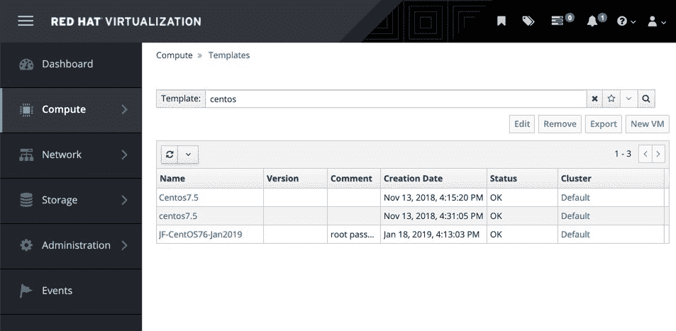
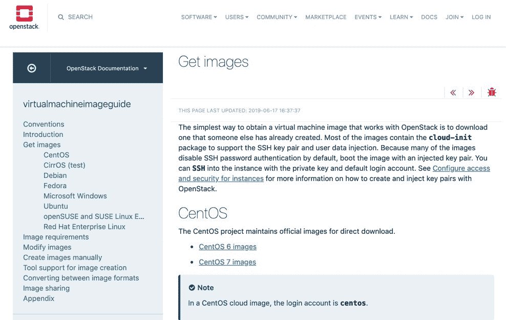
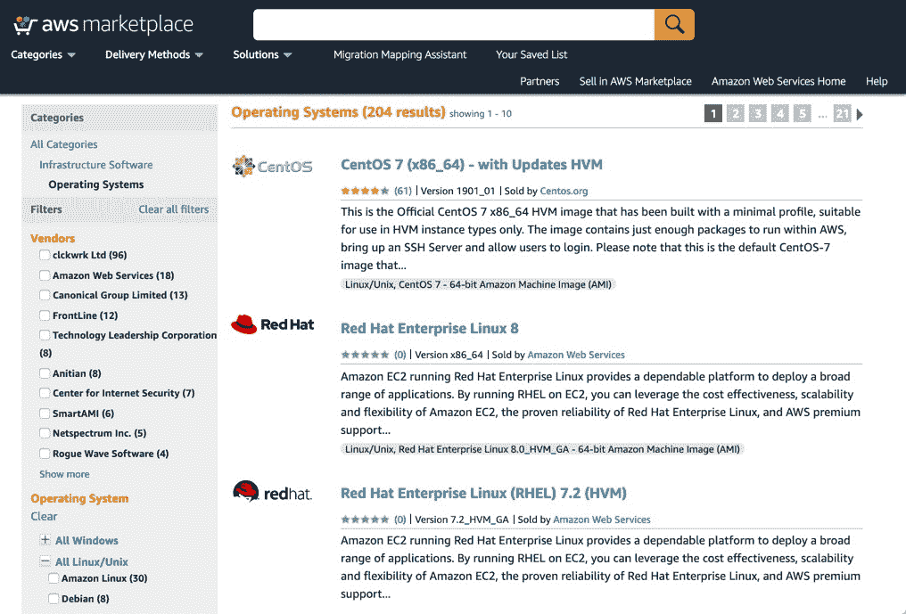

# 第四章：部署方法

到目前为止，在本书中，我们已经为您的企业 Linux 环境打下了一个稳定的基础。我们详细讨论了如何通过标准化确保您的 Linux 环境能够很好地支持自动化，以及如何利用 Ansible 和 AWX 来支持您的自动化之旅。在本章深入探讨更详细的技术工作之前，我们必须审视最后一个细节——您的部署方法。

我们已经确定了为您的环境建立少量一致的 Linux 构建的需求。现在，您需要通过一个决策过程——如何将这些构建部署到您的企业中。大多数企业有几种选择，从最简单的——下载公开可用的模板镜像——到构建自己的模板，再到可能最复杂的——使用预启动环境从零开始构建。或者，最好的方法可能是这些方法的某种混合。在本章中，我们将探索这些选项，并了解如何确保您选择最适合您的企业、支持您自动化之旅的高效且易于实施的方法。在后续章节中，我们将深入探讨每种方法的技术细节。

本章将涵盖以下主题：

+   了解您的环境

+   保持构建高效

+   确保 Linux 镜像的一致性

# 技术要求

本章假设您可以访问运行 Ubuntu 18.04 LTS 的虚拟化环境。一些示例也在 CentOS 7 上执行。在这两种情况下，示例可以在运行上述操作系统之一的物理机器（或笔记本电脑）上运行，该机器启用了虚拟化扩展，或者在启用了嵌套虚拟化的虚拟机上运行。

本章后面还将使用 Ansible 2.8，假设您已在正在使用的 Linux 主机上安装了该版本。

本书中讨论的所有示例代码都可以在 GitHub 上获取：[`github.com/PacktPublishing/Hands-On-Enterprise-Automation-on-Linux`](https://github.com/PacktPublishing/Hands-On-Enterprise-Automation-on-Linux)。

# 了解您的环境

没有两个企业环境是相同的。一些企业仍然在很大程度上依赖裸金属服务器，而其他企业则依赖于各种虚拟化或云服务提供商（无论是私有还是公有）。了解可用的环境是决策过程中的关键部分。

让我们探索各种环境以及每种环境的相关构建策略。

# 部署到裸金属环境

裸金属环境无疑是所有企业环境的“祖父”。在 21 世纪虚拟化和云技术革命之前，构建环境的唯一方式就是在裸金属上构建。

现在，找到一个完全运行在裸机上的环境已经不常见，但通常会发现某些关键组件运行在物理硬件上，特别是数据库或需要某些物理硬件辅助的计算任务（例如，GPU 加速或硬件随机数生成）。

在从裸机构建服务器时，大多数环境下适用两种基本方法。第一种是手动使用光盘或现在更常见的 USB 驱动器构建服务器。这是一个缓慢的交互式过程，无法在大规模上重复，因此不推荐用于除少数物理服务器之外的任何环境，在这些环境中，构建新机器的需求很小且不频繁。

构建大规模、以我们至今在本书中所提倡的一致且可重复的方式的另一个可行选项，是通过网络启动物理服务器，使用 **预执行环境**（**PXE**）。这涉及从网络服务器加载一个小型的启动环境，然后使用它加载 Linux 内核和相关数据。通过这种方式，可以在没有任何物理介质的情况下启动安装环境。一旦环境启动，我们将使用无人值守安装方法，使安装在无需用户干预的情况下完成。

本书稍后将详细介绍这些方法，以及一旦构建好服务器后配置服务器的可重复技术。与此同时，简而言之，对于在企业中构建物理 Linux 服务器，结合 PXE 启动和无人值守安装的方法是最容易自动化并且能产生最可重复结果的途径。

# 部署到传统的虚拟化环境

传统虚拟化环境是指早于我们今天所知的云环境的那些——也就是说，它们是运行操作系统的简单虚拟机监控程序。像 VMware 这样的商业实例很常见，还有像 Xen 和 KVM 这样的开源实例（以及基于这些的框架，如 oVirt）。

由于这些技术最初是为补充传统物理环境而构建的，因此它们为构建您的企业 Linux 系统提供了几种可能的选项。例如，这些平台大多数支持与裸机相同的网络启动功能，因此我们实际上可以假装它们是裸机，并继续使用网络启动方法。

然而，虚拟化环境引入了一些在物理环境中很难实现的功能，因为它们运行的裸金属设备之间存在硬件差异——模板。模板化虚拟机可以简单理解为一个可部署的预配置虚拟机快照。因此，你可以为企业构建完美的 CentOS 7 镜像，集成监控平台，执行所有所需的安全加固，然后使用虚拟化平台本身内置的工具将其转化为模板。以下是作者实验室环境中 CentOS 7 模板的截图：



这些模板都是完全配置好的 CentOS 7 基础镜像，准备好进行部署，并且所有部署前的工作（如删除 SSH 主机密钥）都已经完成。因此，管理员只需选择合适的模板并点击“新建虚拟机”按钮——在除 RHV 外的大多数平台上，这个过程都类似，因为大多数主流虚拟化解决方案都会提供类似的功能。

请注意，为了保持示例的可访问性，我使用了图形用户界面（GUI）作为创建新虚拟机的主要过程。几乎所有虚拟化和云平台都提供 API、命令行接口，甚至 Ansible 模块，可以用来部署虚拟机，而在企业环境中，这些方法比 GUI 更适合大规模应用。鉴于环境的多样性，这部分内容留给你自行探索。

这个过程本身相对简单，但需要一些细心和注意。例如，几乎所有的 Linux 服务器现在都启用了 SSH，每台服务器上的 SSH 守护进程都有一个唯一的主机标识密钥，用来防止（除其他之外）中间人攻击。如果你将一个预配置的操作系统模板化，你也将模板化这些密钥，这就意味着在环境中很可能会出现密钥重复的情况，这会显著降低安全性。因此，在将虚拟机转化为模板之前，执行一些准备步骤非常重要，而其中一个常见的步骤就是删除 SSH 主机密钥。

使用 PXE 方法创建的服务器不会遇到这个问题，因为它们都是从头开始安装的，因此没有历史日志需要清理，也没有重复的 SSH 密钥。

在第五章中，*使用 Ansible 构建虚拟机模板进行部署*，我们将详细讲解如何创建适合使用 Ansible 模板的虚拟机模板。尽管 PXE 启动和模板部署方法在虚拟化环境中都同样有效，大多数人认为模板化的方式更高效、更易于管理，因此我也推荐这种方法（例如，大多数 PXE 启动环境需要知道部署的物理或虚拟服务器所使用的网络接口的 MAC 地址——但在模板部署中，这不是必须的步骤）。

# 部署到云环境

最近对企业 Linux 架构的最新采用者（当然，容器是另一个完全不同的话题）是云资源配置环境。这可能通过一个*公共云*解决方案来实现，例如**Amazon Web Services**（**AWS**）、Microsoft Azure、**Google Cloud Platform**（**GCP**）或近年来涌现出的无数小型服务提供商。也可能是通过一个本地部署的解决方案，如 OpenStack 项目的某个变体或专有平台。

这些云环境彻底改变了 Linux 机器在企业中的生命周期。在裸机或传统虚拟化架构下，Linux 机器需要被照顾、培育和修复（如果它们发生故障），而云架构的前提是每台机器基本上都是可替代的，如果它失败了，只需要在其位置部署一台新的机器。

因此，PXE 部署方法在这样的环境中甚至不可行，它们依赖于预构建的操作系统镜像。这些本质上只是一个由第三方供应商创建的模板，或者由企业准备的模板。

无论你选择商业云提供商，还是搭建本地部署的 OpenStack 架构，你都会找到一个可供选择的操作系统镜像目录。通常，云服务提供商自己提供的镜像是值得信赖的，尽管根据你的安全需求，你也可能发现由外部方提供的镜像同样合适。

例如，下面是 OpenStack 可用的推荐操作系统镜像的截图：



正如你从目录中看到的，几乎所有主要的 Linux 发行版都在此列出，这立即为你节省了构建基本操作系统的任务。AWS 也是如此：



简而言之，如果你正在使用云环境，你将有很多基础操作系统镜像可供选择，以此开始工作。尽管如此，这种选择不太可能满足所有企业的需求。例如，使用预构建的云环境镜像并不意味着可以忽视企业安全标准、监控或日志转发代理集成等要求，以及许多其他对于企业至关重要的事项。在继续之前，值得注意的是，当然你可以为所选的云平台创建自己的镜像。然而，出于效率考虑，为什么要重新发明轮子？如果有人已经为你完成了这一步，你可以有效地将这项工作委托给别人。

尽管大多数现成的操作系统镜像是可信的，但在选择一个新镜像时你应该始终保持谨慎，特别是当它是由你不熟悉的作者创建时。我们无法确定该镜像具体包含了什么内容，因此在选择要使用的镜像时，你应该始终进行尽职调查。

假设你确实选择继续使用一个预制的云环境镜像，那么后安装配置工作可以通过 Ansible 整理完成。事实上，所需的步骤与构建传统虚拟化平台模板的步骤几乎相同，我们将在本书稍后的部分再次详细介绍这个过程。

# Docker 部署

Docker 部署在我们关于 Linux 环境的讨论中是一个特殊案例。从实际操作来看，它与云环境有很多共同点——Docker 镜像是基于现有的最小化操作系统镜像构建的，通常使用原生 Docker 工具链构建，尽管完全可以使用 Ansible 实现自动化。

由于 Docker 是一个特殊案例，我们不会在本书中深入探讨它，尽管值得注意的是，Docker 作为 Linux 在企业中最近的“新成员”，实际上是围绕本书中已经考虑的许多原则设计的。让我们简要地考虑用于创建官方 nginx 容器的 Dockerfile。

对于那些不熟悉 Docker 的人来说，Dockerfile 是一个纯文本文件，包含了构建容器镜像所需的所有指令和命令，用于部署。

截至写作时，该文件包含以下内容：

```
#
# Nginx Dockerfile
#
# https://github.com/dockerfile/nginx
#

# Pull base image.
FROM ubuntu:bionic

# Install Nginx.
RUN \
  add-apt-repository -y ppa:nginx/stable && \
  apt-get update && \
  apt-get install -y nginx && \
  rm -rf /var/lib/apt/lists/* && \
  echo -e "\ndaemon off;" >> /etc/nginx/nginx.conf && \
  chown -R www-data:www-data /var/lib/nginx
```

尽管不是基于 Ansible，我们可以在前面的代码块中看到以下内容：

1.  顶部的 `FROM` 行定义了一个最小的 Ubuntu 基础镜像，用于执行其余配置——这可以看作是我们在其他平台讨论的 SOE Linux 镜像。

1.  `RUN` 命令执行安装 `nginx` 包所需的步骤，并进行一些清理工作，以保持镜像的整洁和简洁（减少空间需求和杂乱）。

代码继续如下：

```
# Define mountable directories.
VOLUME ["/etc/nginx/sites-enabled", "/etc/nginx/certs", "/etc/nginx/conf.d", "/var/log/nginx", "/var/www/html"]

# Define working directory.
WORKDIR /etc/nginx

# Define default command.
CMD ["nginx"]

# Expose ports.
EXPOSE 80
EXPOSE 443
```

继续分析这个文件，我们可以看到以下内容：

1.  `VOLUME` 行定义了哪些来自主机文件系统的目录可以挂载到容器内。

1.  `WORKDIR` 指令告诉 Docker 容器在哪个目录下运行接下来的 `CMD` ——可以把它看作是启动时的配置。

1.  `CMD` 行定义了容器启动时要运行的命令——这与在完整的 Linux 系统镜像中定义在启动时哪些服务会启动的过程是一个缩影。

1.  最后，`EXPOSE` 行定义了容器应该向网络暴露的端口——这或许有点像防火墙可能允许某些端口通过。

简而言之，构建 Docker 容器的原生过程与我们为企业 Linux 环境定义的构建过程非常契合——因此，我们可以自信地继续这个过程。考虑到这一点，我们将探讨确保构建尽可能简洁高效的过程。

# 保持构建高效

如我们在上一节中讨论的，了解你 Linux 环境的基本知识对制定部署方法至关重要。尽管构建过程本身（尤其是传统的虚拟化环境与云环境之间）存在一些相似之处，但了解这些差异能帮助你在全企业范围内做出有关如何部署 Linux 的明智决策。

一旦你选择了最适合自己环境的方法，考虑一些原则以确保你的过程流畅高效是非常重要的（这也是企业 Linux 部署的关键要素）。我们将在这里介绍这些原则，以便在本书的后续部分深入探讨实际操作。让我们从构建简洁性的重要性开始。

# 保持构建简洁

让我们开始将之前讨论的 SOE（标准操作环境）对 Linux 构建过程的重要性应用到实际中。不论你选择哪条路径，环境如何，其中一个关键方面是确保你的构建标准尽可能简单明了。

每个企业环境都是独一无二的，因此每个企业的构建需求肯定也会不同。尽管如此，这里提供了一组常见的示例需求，以展示在构建过程中可能需要的内容：

+   监控代理

+   日志转发配置

+   安全加固

+   核心企业软件需求

+   用于时间同步的 NTP 配置

这个列表只是一个开始，每个企业的需求都不同，但它能让你了解构建过程中可能涉及的内容。不过，接下来我们将开始探讨一些构建过程中的边缘案例。可以公平地说，每个 Linux 服务器的构建都有其特定的目的，因此将运行某种形式的应用栈。

同样，应用栈在不同企业之间肯定会有所不同，但可能常见的应用示例如下：

+   一个 Web 服务器，如 Apache 或 nginx

+   用于 Java 工作负载的 OpenJDK 环境

+   一个 MariaDB 数据库服务器

+   一个 PostgreSQL 数据库服务器

+   NFS 文件共享工具和内核扩展

现在，在你的标准化过程中，当你最初定义 SOE 时，你可能甚至已经指定了使用（仅作为例子）OpenJDK 8 和 MariaDB 10.1。这是否意味着你应该在你的构建过程中实际包含它们？

答案几乎总是*不*。简单来说，添加这些应用程序会增加构建的复杂性以及后期配置和调试的复杂性。它还会降低安全性——稍后会详细解释这一点。

假设我们标准化使用 MariaDB 10.1，并将其包含在基础操作系统镜像中（因此每台部署的 Linux 机器都包含它），但我们知道，实际使用它的机器仅为一部分。

不将 MariaDB 包含在基础镜像中的原因有几个：

+   安装仅包含 MariaDB 10.1 服务器组件的大小大约为 120 MB，具体取决于操作系统和打包方式——还会有依赖包，但我们先从这个数字开始。虽然现在存储便宜且充足，如果你在环境中部署了 100 台服务器（对于大多数企业来说实际上是很少的），那么大约有 11.7 GB 的空间将被专门用于一个你不需要的包。实际数字会更高，因为还需要安装依赖包等。

+   这也可能对备份和所需的存储空间产生连锁反应，实际上，如果你在企业中使用虚拟机快照，也会有影响。

+   如果有应用程序要求使用 MariaDB 10.3（或者实际上，业务决定将其标准更新为 10.3），那么需要升级镜像，或者可能在安装 10.3 之前卸载版本 10.1。这会增加不必要的复杂性，因为一个最小的 Linux 镜像本来只需要接收更新后的 MariaDB 工作负载。

+   你需要确保当不需要时关闭 MariaDB 并对其进行防火墙隔离，以防止任何滥用——这是一个额外的审计和执行要求，而在许多不使用 MariaDB 的服务器上，这种要求是多余的。

还有其他的安全考虑，但这里的关键是，这样做会浪费资源和时间。当然，这不仅仅适用于 MariaDB 10.1——这只是一个例子，但它表明，一般来说，应用程序工作负载不应该包含在基础操作系统定义中。现在让我们更详细地看看构建的安全要求。

# 让你的构建更安全

我们已经提到过安全性以及不安装或运行不必要的软件包。任何正在运行的服务都为入侵者提供了潜在的攻击途径，尽管希望你永远不会在企业网络内遭遇此类入侵，但仍然最好以尽可能安全的方式构建环境。对于那些默认配置了密码的服务（有些情况下甚至没有配置密码——幸运的是，这种情况现在已经变得罕见），尤其如此。

这些原则同样适用于定义构建本身。例如，不要创建具有弱静态密码的构建。理想情况下，每个构建都应该配置为从外部来源获取初始凭证，尽管有许多方法可以实现这一点，但如果这是一个新概念，建议你查阅一下`cloud-init`。在某些情况下，尤其是在旧版环境中，可能需要一些初始凭证来允许访问新构建的服务器，但重用弱密码是危险的，这会让新建的服务器在配置之前被拦截，并可能被植入某种恶意软件。

简而言之，以下列表提供了一些确保安全构建的有力指导：

+   不要安装不需要的应用程序或服务。

+   确保所有构建中通用的服务（但需要部署后配置的服务）默认情况下是禁用的。

+   如果可能的话，不要重用密码，即使是用于初始访问和配置。

+   在过程尽早应用你的企业安全政策——如果可能的话，最好在镜像或服务器的构建过程中应用，但如果不行，也要在安装后尽早应用。

这些原则简单但至关重要，遵守它们非常重要。希望永远不会出现需要证明这些原则是否得到应用的情况，但如果发生了，这些原则可能会阻止或足够遏制对你基础设施的入侵或攻击。当然，这个话题值得单独写一本书，但希望这些提示以及第十三章《使用 CIS 基准》的示例，能为你指引正确的方向。现在，我们简要了解一下如何确保构建过程高效。

# 创建高效的流程

高效的流程主要依赖自动化，因为自动化可以确保最小化人为干预，并保证一致且可重复的最终结果。标准化也对此提供支持，因为它意味着大部分决策过程已经完成，因此所有参与的人都清楚自己在做什么以及该怎么做。

简而言之，遵循本书中概述的这些原则，你的构建流程自然会高效。即使是在选择唯一主机名（尽管这可以自动化）或用户请求一个 Linux 服务器时，某种程度的人工干预是不可避免的。然而，从此以后，你应该尽可能地进行自动化和标准化。我们将在本书中始终遵循这一理念。现在，我们先来看看构建过程中一致性的重要性。

# 确保 Linux 镜像的一致性

在第一章《在 Linux 上构建标准操作环境》中，我们讨论了 SOE 环境中共性的重要性。现在，我们实际上在查看构建过程本身，这一问题再次浮现，因为我们首次着眼于如何实际实现共性。假设 Ansible 是你首选的工具，考虑以下任务。我们正在为我们的镜像构建过程编写 playbook，并已决定我们的标准镜像需要与本地时间服务器同步时间。假设由于历史原因，我们选择的基础操作系统是 Ubuntu 16.04 LTS。

让我们创建一个简单的角色，以确保安装 NTP 并复制我们的公司标准 `ntp.conf`，其中包括我们内部时间服务器的地址。最后，我们需要重启 NTP 以应用这些更改。

本章中的示例纯粹是假设性的，目的是展示某个特定任务所需的 Ansible 代码。我们将在后续章节中详细扩展所执行的任务（如部署配置文件），并提供实际的示例供你尝试。

这个角色可能如下所示：

```
---
- name: Ensure ntpd and ntpdate is installed
  apt:
    name: "{{ item }}"
    update_cache: yes
  loop:
    - ntp
    - ntpdate
- name: Copy across enterprise ntpd configuration
  copy:
    src: files/ntp.conf
    dest: /etc/ntp.conf
    owner: root
    group: root
    mode: '0644'
- name: Restart the ntp service
  service:
    name: ntp
    state: restarted
    enabled: yes
```

这个角色简单、简洁且直截了当。它始终确保安装`ntp`包，并且确保我们复制相同版本的配置文件，确保每台服务器上的配置文件都是一致的。我们可以通过从版本控制系统中检出这个文件进一步改进，但这部分留给你作为练习。

立刻，你就能看到为这一个简单步骤编写 Ansible 角色的强大之处——通过在 playbook 中包含这个角色，可以实现很高的一致性，且如果你将这种方法推广到整个企业，那么所有配置的服务将会被一致地安装和配置。

然而，事情更好了。假设业务决定将标准操作系统基础重定为 Ubuntu 18.04 LTS，以利用更新的技术并延长环境的支持寿命。`ntp`包在 Ubuntu 18.04 中仍然可用，但默认情况下，`chrony`包已被安装。为了继续使用 NTP，该角色只需要做一些小的调整，确保首先删除（或如果你更喜欢，也可以禁用）`chrony`包——之后，它就完全相同了。例如，考虑以下角色代码，它确保了正确的包被删除或安装：

```
---
- name: Remove chrony
  apt:
    name: chrony
    state: absent
- name: Ensure ntpd and ntpdate is installed
  apt:
    name: "{{ item }}"
    update_cache: yes
  loop:
    - ntp
    - ntpdate
```

然后我们会继续添加两个任务，将配置复制过去并重新启动服务，确保它采纳新的配置：

```
- name: Copy across enterprise ntpd configuration
  copy:
    src: files/ntp.conf
    dest: /etc/ntp.conf
    owner: root
    group: root
    mode: '0644'
- name: Restart the ntp service
  service:
    name: ntp
    state: restarted
    enabled: yes
```

或者，我们也可以决定接受这个变化，并在新的基础镜像上使用`chrony`。因此，我们只需要创建一个新的`chrony.conf`，确保它与我们的企业 NTP 服务器通信，然后按照之前的步骤继续操作：

```
---
- name: Ensure chrony is installed
  apt:
    name: chrony
    update_cache: yes
- name: Copy across enterprise chrony configuration
  copy:
    src: files/chrony.conf
    dest: /etc/chrony.conf
    owner: root
    group: root
    mode: '0644'
- name: Restart the chrony service
  service:
    name: chrony
    state: restarted
    enabled: yes
```

注意这些角色有多么相似？即使支持底层操作系统或服务发生变化，也只需做出细微的调整。

尽管这三种角色在某些地方有所不同，但它们都执行相同的基本任务，具体如下：

1.  确保已安装正确的 NTP 服务。

1.  复制标准配置。

1.  确保该服务在启动时启用并已启动。

因此，我们可以确信，采用这种方法，我们能够保持一致性。

即使完全更换平台，高级方法仍然可以适用。假设企业现在使用了仅支持 CentOS 7 的应用程序。这意味着我们的 SOE 发生了一个接受的偏差，但是，即便是新的 CentOS 7 构建，也需要确保时间正确。由于 NTP 是一个标准，它仍然会使用相同的时间服务器。因此，我们可以编写一个角色来支持 CentOS 7：

```
---
- name: Ensure chrony is installed
  yum:
    name: chrony
    state: latest
- name: Copy across enterprise chrony configuration
  copy:
    src: files/chrony.conf
    dest: /etc/chrony.conf
    owner: root
    group: root
    mode: '0644'
- name: Restart the chrony service
  service:
    name: chronyd
    state: restarted
    enabled: yes
```

再次强调，这些变化非常微妙。这也是我们选择 Ansible 作为企业自动化工具的一个重要原因——我们能够轻松地构建并遵循标准，而且当我们更改 Linux 版本甚至整个发行版时，操作系统的构建仍然保持一致。

# 总结

在这一阶段，我们已经定义了标准化的要求，确定了在实现自动化过程中使用的工具，并且现在对企业可能部署操作系统的基本环境类型进行了实际的探讨。这为我们的自动化之旅奠定了基础，并为本书的其余部分提供了背景——通过动手实践，了解在企业中构建和维护 Linux 环境的过程。

在本章中，我们了解了 Linux 可能部署的不同类型的环境以及每种环境的不同构建策略。然后，我们查看了一些实际的示例，确保我们的构建符合高标准，并且能够高效且可重复地完成。最后，我们开始探讨自动化的好处，以及它如何确保即使我们更换整个底层 Linux 发行版，构建的一致性也能得到保证。

在下一章，我们将开始动手实践企业级 Linux 自动化和部署，探讨如何使用 Ansible 来构建虚拟机模板，无论是从云环境镜像还是从头开始构建。

# 问题

1.  构建 Docker 容器和 SOE 之间有什么相似之处？

1.  如果 MariaDB 仅在少数服务器上需要，为什么不将其包含在基础构建中？

1.  如何确保您的基础操作系统镜像尽可能小？

1.  为什么在基础操作系统镜像中嵌入密码时需要小心？

1.  如何确保所有 Linux 镜像将其日志发送到您的集中日志服务器？

1.  在什么情况下您不会使用云提供商提供的基础镜像，而是选择构建自己的镜像？

1.  如何使用 Ansible 安全配置您的 SSH 守护进程？

# 进一步阅读

+   若要深入理解 Ansible，请参考*Mastering Ansible, Third Edition*，作者*James Freeman*和*Jesse Keating*（[`www.packtpub.com/gb/virtualization-and-cloud/mastering-ansible-third-edition`](https://www.packtpub.com/gb/virtualization-and-cloud/mastering-ansible-third-edition)）。

+   要了解本章中的 Docker 代码和讨论，请参考*Mastering Docker, Third Edition*，作者*Russ McKendrick*和*Scott Gallagher*（[`www.packtpub.com/gb/virtualization-and-cloud/mastering-docker-third-edition`](https://www.packtpub.com/gb/virtualization-and-cloud/mastering-docker-third-edition)）。
