# 使用 Ansible 构建用于部署的虚拟机模板

到目前为止，在本书中，我们已详细介绍了其余部分的基础工作——也就是说，我们已经为接下来的操作奠定了理论基础，并且提供了关于我们选择的自动化工具 Ansible 的*速成课程*。从前一章中我们知道，在企业规模的环境中，部署 Linux 有两种基本方法，选择哪种方法取决于你环境中使用的技术以及你的目标。

在本章中，我们将详细介绍如何构建适用于大多数虚拟化和云平台的虚拟机镜像。这两个平台之间的差异微妙但明显，我们将在本章结束时了解到这一点，并且你将学会轻松处理这两种环境。我们将从讨论初始构建需求开始，然后继续配置并准备镜像以便在你选择的环境中使用。

本章将涵盖以下主题：

+   执行初始构建

+   使用 Ansible 构建和标准化模板

+   使用 Ansible 清理构建

# 技术要求

本章假设你可以访问运行 Ubuntu 18.04 LTS 的虚拟化环境。一些示例也会在 CentOS 7 上执行。在这两种情况下，示例可以在运行上述操作系统的物理机器（或笔记本电脑）上执行，只要该进程启用了虚拟化扩展，或者在启用了嵌套虚拟化的虚拟机上执行。

本章后续也会使用 Ansible 2.8，并假设你已经在所使用的 Linux 主机上安装了该版本。

本章中讨论的所有示例代码可以从 GitHub 获取：[`github.com/PacktPublishing/Hands-On-Enterprise-Automation-on-Linux/tree/master/chapter05`](https://github.com/PacktPublishing/Hands-On-Enterprise-Automation-on-Linux/tree/master/chapter05)。

# 执行初始构建

正如在第四章《部署方法》中讨论的那样，*部署方法*，无论你使用传统的虚拟化平台（如 oVirt 或 VMware）还是基于云的平台（如 OpenStack 或亚马逊的 EC2），你在任何 Linux 部署（以及随后的自动化）中的起点都会是一个模板镜像。

就我们在第一章中定义的 SOE 而言，*在 Linux 上构建标准操作环境*，模板化镜像就是这一环境的实际初步表现。它通常是一个小型虚拟机镜像，安装了足够的软件并完成了配置，能够在企业的几乎所有部署场景中发挥作用。只要镜像能干净地启动，并且具有唯一的主机名、SSH 主机密钥等，那么它几乎可以立即通过进一步的自动化进行定制，正如我们将在本书的第七章中通过*使用 Ansible 进行配置管理*了解到的那样。让我们通过采用一个现成的模板镜像（由第三方提供）作为起点来深入了解构建过程。

# 使用现成的模板镜像

对于大多数平台，有大量现成的镜像可以下载，正如我们在上一章中讨论的那样。对于许多企业来说，这些镜像已经足够。但如果你绝对需要完全控制镜像定义呢？也许你正在采用一个新的标准（在写作时，Red Hat Enterprise Linux 8 刚刚发布，而 CentOS 8 也将在适当时候发布），并且你希望尽早实现它以获得经验并测试工作负载。如果你在一个安全的环境中工作（可能符合支付卡行业标准），并且你必须对镜像的构建过程 100%有信心，不能有任何被妥协的风险，又该如何处理？

当然，这并不是说任何公开可用的图像都有被妥协的风险，甚至不太可能发生这种情况，但历史上确实出现过少数的*中间人*或*供应链*攻击，攻击者通过攻击常用的组件间接妥协了服务，而非直接攻击服务本身。

大多数公开可用的镜像都来自可信的来源，这些来源已经实施了各种检查和控制，以确保其完整性。只要你利用这些检查，并对下载的任何镜像进行尽职调查，大多数企业会发现几乎没有必要从零开始创建自己的镜像，因为像 Ansible 这样的自动化工具会处理所有部署后的配置。

让我们通过一个实际的例子来说明：假设在一组新的部署中，我们决定基于 Fedora 30 服务器镜像创建一个标准操作环境（SOE），并将在 OpenStack 基础设施上运行：

1.  我们将从 Fedora 项目官方网站下载云镜像—具体详情可以在这里找到，注意版本号会随着 Fedora 新版本的发布而变化，网址为：[`alt.fedoraproject.org/cloud/`](https://alt.fedoraproject.org/cloud/)。

在为我们的环境确定了正确的 Fedora 云镜像之后，我们可以通过如下命令下载所需的镜像：

```
$ wget https://download.fedoraproject.org/pub/fedora/linux/releases/30/Cloud/x86_64/images/Fedora-Cloud-Base-30-1.2.x86_64.qcow2
```

1.  很简单——现在，让我们进行验证。验证说明通常会随所有主要 Linux 发行版提供，无论是 ISOs 还是完整的镜像文件，我们的 Fedora 镜像下载的验证说明可以在 [`alt.fedoraproject.org/en/verify.html`](https://alt.fedoraproject.org/en/verify.html)找到。

让我们逐步执行过程并验证我们的镜像。首先，我们将导入官方的 Fedora GPG 密钥来验证校验和文件，以确保它没有被篡改：

```
$ curl https://getfedora.org/static/fedora.gpg | gpg --import
```

1.  现在我们将下载云基础镜像的校验和文件并进行验证：

```
$ wget https://alt.fedoraproject.org/en/static/checksums/Fedora-Cloud-30-1.2-x86_64-CHECKSUM
$ gpg --verify-files *-CHECKSUM
```

1.  虽然你可能会收到关于密钥未通过可信签名认证的警告（这是 GPG 密钥信任建立方式的一个方面），但重要的是文件的签名已被验证为有效——请参阅下面的截图，了解输出的示例：

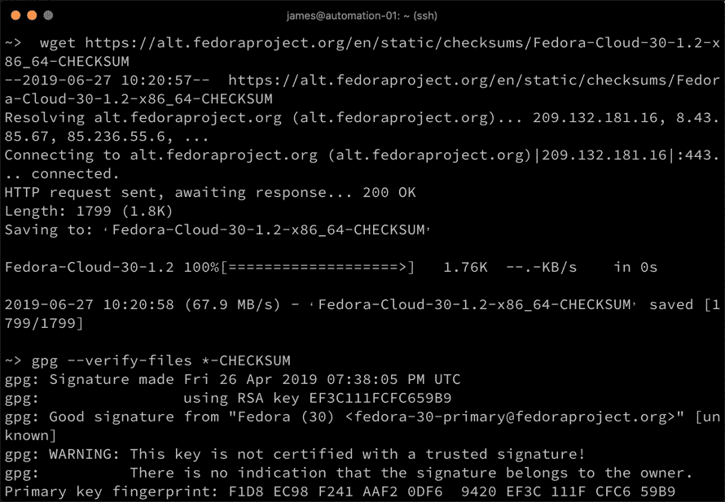

1.  只要签名验证成功，最后一步就是使用以下命令将实际镜像与校验和进行验证：

```
$ sha256sum -c *-CHECKSUM
```

对于任何你没有下载的 `*-CHECKSUM` 文件中的文件，你会收到错误。但正如下面截图所示，我们下载的镜像与文件中的校验和匹配，因此可以继续使用它：

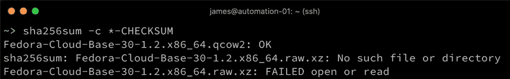

完成这些步骤后，我们可以继续在我们的 OpenStack 平台上使用下载的镜像。当然，部署后你可能想要定制这个镜像，后续我们会探讨如何进行定制。选择了一个*现成的*镜像并不意味着它必须保持原样。请注意，这些步骤在不同的 Linux 发行版中会有一些细微的差异，但整体流程应该是相同的。重要的是要验证所有下载的镜像。

使用公共操作系统镜像时，也有一个关于信任的问题。你怎么知道作者已经移除了所有冗余服务并正确地进行了 sysprep 操作？你怎么知道其中没有后门或其他漏洞？尽管有很多优秀的公共可用镜像，但你在下载任何镜像时应始终进行尽职调查，确保它们适合你的环境。

那么如果你必须生成自己的镜像呢？我们将在本章的下一部分进行探讨。

# 创建你自己的虚拟机镜像

前述过程适用于许多企业，但迟早会有需求，要求创建自己完全定制的虚拟机镜像。幸运的是，现代 Linux 发行版使得这一过程变得简单，你甚至不需要在与构建镜像相同的平台上操作。

让我们来看一下如何使用 Ubuntu 18.04 Server 主机构建 CentOS 7.6 虚拟机镜像：

1.  在我们开始之前，第一步是确保构建主机能够运行虚拟机——这通常是一组包含在大多数现代 x86 系统中的 CPU 扩展。也可以通过嵌套虚拟化来构建虚拟机镜像，即在另一个虚拟机内创建虚拟机。然而，要做到这一点，你必须在构建虚拟机中启用虚拟化支持。这个过程因虚拟化平台不同而异，因此我们在这里不进行详细介绍。

如果你使用 VMware 虚拟化平台来执行嵌套虚拟化，你还需要启用 **代码分析** 支持以及启用 **虚拟化应用程序**——否则，这一过程中的某些步骤将无法成功。

1.  一旦你的构建主机启动并运行，你需要安装 Linux **基于内核的虚拟机**（**KVM**）工具集——执行这些命令的方式会根据你的构建主机的 Linux 版本有所不同，但在我们的 Ubuntu 主机上，我们需要运行以下命令：

```
$ sudo apt-get install libvirt-bin libvirt-doc libvirt-clients virtinst libguestfs-tools libosinfo-bin
$ sudo gpasswd -a <your account> libvirt
$ sudo gpasswd -a <your account> kvm
$ logout
```

请注意，需要将你的用户帐户添加到两个与 KVM 相关的用户组——你还需要注销并重新登录，以使这些用户组变更生效。

1.  完成此操作后，你还需要下载你选择的 Linux 镜像的本地 ISO 副本。我使用以下命令下载 ISO 镜像，这对于我要创建的 CentOS 7.6 SOE 镜像来说已足够：

```
$ wget http://vault.centos.org/7.6.1810/isos/x86_64/CentOS-7-x86_64-Minimal-1810.iso
```

1.  将这些所有步骤准备好后，你现在将创建一个空的虚拟机磁盘镜像。最适合选择的格式是 **快速写时复制**（**QCOW2**）格式，这与 OpenStack 和大多数公共云平台兼容。因此，我们将尽量使这个镜像尽可能通用，以便支持尽可能广泛的环境。

要在当前目录中创建一个空白的 20 GB QCOW2 镜像，我们可以运行以下命令：

```
$ qemu-img create -f qcow2 centos76-soe.qcow2 20G
```

请注意，其他镜像格式也是可用的。例如，如果你只为 VMware 构建镜像，那么使用 VMDK 格式会更合适：

```
$ qemu-img create -f vmdk centos76-soe.vmdk 20G
```

请注意，这两个命令创建的是稀疏镜像——也就是说，它们的大小仅与其包含的数据和元数据大小相等。如果你愿意，它们以后可以通过你选择的虚拟化平台转换为预分配的镜像：

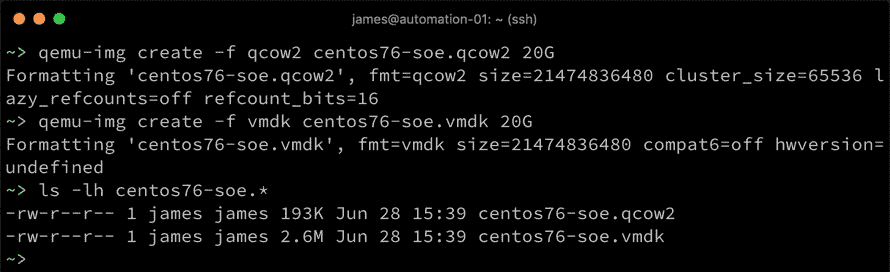

创建好空的磁盘镜像后，是时候安装虚拟机镜像了：

1.  我们将使用`virt-install`命令来实现这一点，该命令基本上会启动一个临时虚拟机来进行操作系统安装。不要担心像 CPU 和内存等参数——只要它们足够支持操作系统的安装，它们就没问题——这些不会影响已部署的虚拟机。

请注意`--graphics vnc,listen=0.0.0.0`选项中使用了 VNC——我们将使用它来远程控制虚拟机并完成安装。如果你喜欢，也可以选择其他图形选项，如 SPICE。

1.  以下命令是如何使用`virt-install`从我们之前下载的 ISO 创建 CentOS 7 镜像的示例，使用我们之前创建的 20 GB QCOW2 磁盘镜像：

```
$ virt-install --virt-type kvm \
--name centos-76-soe \
--ram 1024 \
--cdrom=CentOS-7-x86_64-Minimal-1810.iso \
--disk path=/home/james/centos76-soe.qcow2,size=20,format=qcow2 \
--network network=default \
--graphics vnc,listen=0.0.0.0 \
--noautoconsole \
--os-type=linux \
--os-variant=centos7.0 \
--wait=-1
```

这些参数大多数都是自解释的，但请特别注意你的环境。例如，如果你编辑或删除了`default`网络，前面的命令将会失败。类似地，确保所有引用文件的路径是正确的。

要查看支持的`--os-variant`参数列表，请运行`osinfo-query os`命令。

自然地，你需要根据所安装的操作系统、磁盘镜像名称等来调整这些参数。

1.  现在，我们运行这个命令——如果成功，它会提示你可以连接到虚拟机控制台以继续操作：

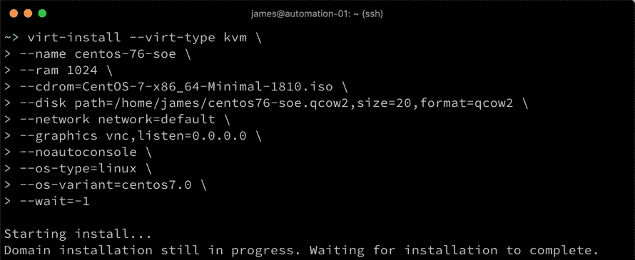

1.  我们现在将使用`virt-viewer`工具从另一个终端连接到它：

```
$ virt-viewer centos-76-soe
```

从这里开始，你将以正常方式安装操作系统。正如我们在第四章《部署方法论》中讨论过的，*尽量选择最小化安装*。不要太担心主机名等问题，因为这些应该在后续的部署过程中设置；请指定以下内容：

1.  选择与本地环境最相关的**键盘和语言支持**。

1.  选择适合你所在国家的**日期与时间**设置。

1.  确保**软件选择**为“最小化安装”（这是默认选项）。

1.  设置**安装目标**——使用前面的`virt-install`命令，只有一个虚拟硬盘附加到该虚拟机，因此只需选择它即可。

1.  根据需要启用或禁用 KDUMP。

1.  确保在**网络与主机名称**中启用网络。

结果应该是一个 CentOS 7 安装设置界面，类似于下面的截图：

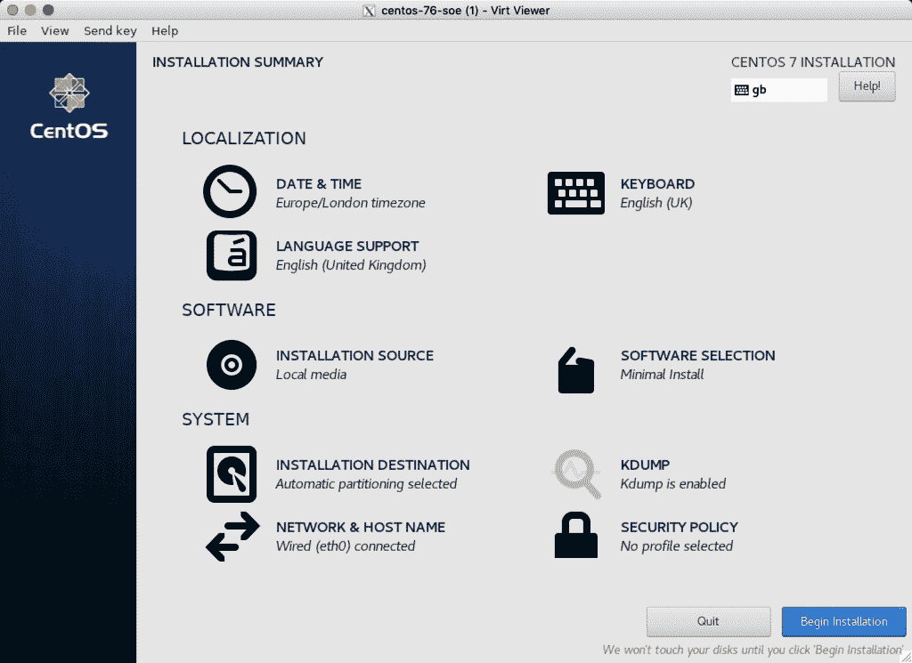

允许安装按正常流程完成，然后登录到你刚创建的虚拟机。一旦登录到运行中的虚拟机，你应该进行所有希望出现在最终虚拟机模板中的定制设置。在本章的下一节中，我们将介绍如何使用 Ansible 配置已部署的虚拟机，并且使用 Ansible 构建模板没有什么不同——因此，为了避免与后续章节的内容重叠，我们这里不会详细讲解 Ansible 配置工作。

当你的虚拟机在初始安装后重新启动时，你可能会发现它关闭了。如果发生这种情况，你需要使用`virsh`工具将其取消定义，然后使用我们之前的`virt-install`命令的轻微变种重新运行它，并告诉`virt-install`这次从硬盘镜像启动，而不是从光盘启动：

```
$ virsh undefine centos-76-soe
$ virt-install --virt-type kvm \
--name centos-76-soe \
--ram 1024 \
--disk path=/home/james/centos76-soe.qcow2,size=20,format=qcow2 \
--network network=default \
--graphics vnc,listen=0.0.0.0 \
--noautoconsole \
--os-type=linux \
--os-variant=centos7.0 \
--boot=hd
```

在这个阶段需要注意的是，大多数云平台，无论是 OpenStack、**Amazon Web Services**（**AWS**）还是其他平台，都使用 `cloud-init` 工具来执行虚拟机镜像部署并运行后的初始配置。因此，作为最低要求，我们将在关闭虚拟机之前将其安装到我们的虚拟机镜像中。以下是手动安装该工具所需的命令，接下来我们将把它转化为 Ansible 角色进行安装：

```
$ yum -y install epel-release
$ yum -y install cloud-init cloud-utils-growpart dracut-modules-growroot
```

当你成功执行这些命令后，你可能需要自定义 `/etc/cloud/cloud.cfg` 以配置 `cloud-init`，适配你将使用的环境，尽管默认配置已经适用于许多环境，并且可以作为良好的起点。

配置 `cloud-init` 作为练习留给你，因为云平台种类繁多。

最后，当你完成任何其他自定义配置后，你可以关闭虚拟机。确保干净地关闭虚拟机，而不是直接断电，因为这将成为一个模板，用于大规模部署。

一旦虚拟机关闭，接下来的步骤是对镜像执行 **系统准备**（**sysprep**），然后压缩稀疏镜像文件，使其尽可能小，以便分发和存档。

Sysprep 过程是为大规模部署准备镜像。因此，所有唯一可识别的参数将被清除，以生成一个干净的镜像用于大规模部署，具体包括以下内容：

+   SSH 主机密钥

+   历史文件

+   本地会话配置

+   日志文件

+   网络配置中的 MAC 地址引用

前面的列表并不是详尽无遗的——实际上还有很多需要清理的项目，才能确保镜像真正干净并准备好部署，解释这些内容将需要一个完整的章节。幸运的是，我们可以使用 KVM 工具集中的两个命令来执行这些任务：

```
$ sudo virt-sysprep -a centos76-soe.qcow2
$ sudo virt-sparsify --compress centos76-soe.qcow2 centos76-soe-final.qcow2
```

尽管第一个命令的输出太长，无法放在一张截图中，但它展示了作为 sysprep 过程的一部分，所需执行的各种任务。如果你发现自己手动或使用 Ansible 执行该过程，`virt-sysprep` 工具将为你提供有关应执行任务的良好指导：

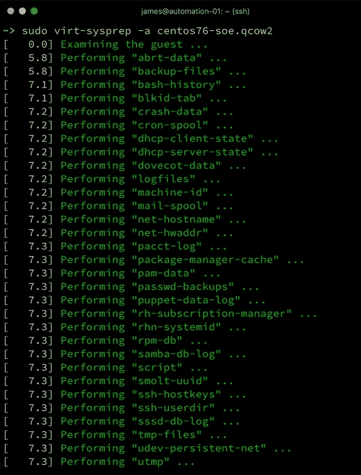

最后，我们再次将磁盘镜像稀疏化，实际上是压缩它，以便高效存储。请注意，如果在运行此工具时收到任何免费空间警告（默认情况下它需要在 `/tmp` 中大量空间——具体大小由虚拟磁盘镜像的大小决定），你通常不应忽略这些警告，因为工具可能会填满你的分区，从而导致构建主机无法正常工作：

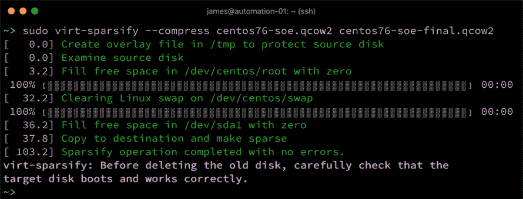

本章这一部分执行的步骤应该适用于几乎任何 Linux 发行版，并且可以在几乎任何 Linux 主机上构建。像往常一样，参考你首选的发行版文档，获取有关软件包名称的指导。然而，通过遵循这个过程，你现在已经成功构建了一个完全定制的云镜像，应该能够将其上传到许多流行的云平台和虚拟化平台。

从这里开始，我们将更加详细地了解如何使用 Ansible 自定义模板，而不是像本节中那样手动输入命令。

# 使用 Ansible 构建和标准化模板

到现在为止，你应该已经有了一个用于部署到企业中的基础 Linux 镜像。如果你选择下载一个现成的模板（或者实际上，使用公共云提供商提供的模板），那么你的镜像将非常类似于一个空白模板，准备好进行定制。如果你选择自己构建，那么你可能已经选择执行了一些小的定制，如我们之前安装的`cloud-init`。然而，你会注意到，我们是手动进行的，这与我们在本书早期部分所推崇的可扩展、可重复和可审计的过程有些不一致。随着我们继续本章的这一部分，我们将了解如何使用 Ansible 定制基础模板，无论它的来源如何。

没有一种适用于所有人的 Linux 镜像，因此，本章并不是一个终极指南。然而，我们将查看一些与定制部署镜像相关的常见任务，如下所示：

+   将文件传输到镜像中

+   安装软件包

+   编辑配置文件

+   验证镜像

通过这些示例的结合，大多数读者应该能够轻松地根据自己的要求定制自己的镜像。让我们开始更深入地探索，看看如何使用 Ansible 将文件传输到我们之前创建的虚拟机镜像中。

# 将文件传输到镜像中

在作者的经验中，*注入*文件到操作系统镜像中以确保其符合给定的要求是非常常见的做法。这些文件可能是一个简单的文本文件，例如企业标准的*每日信息*、现有软件包的配置文件，或者甚至是一个在软件包中没有的二进制文件。Ansible 可以轻松处理所有这些问题，因此让我们来看看一些具体的例子。由于将 Ansible 代码写成角色以支持重用性和可读性通常是一个好习惯，我们将在这里为我们的示例定义一个角色。在这个示例中，我做出以下假设：

+   我们已经按照本章前面的部分下载/构建了我们的 Linux 模板。

+   我们正在虚拟机中运行这个裸模板。

+   这个虚拟机的 IP 地址是`192.168.81.141`。

+   虚拟机已经配置了一个用户账户，凭证如下：

    +   用户名：`imagebuild`。

    +   密码：`password`。

    +   此账户启用了 sudo 权限。

自然地，我们不会分发一个包含启用了 sudo 权限且使用这种弱密码的账户的云镜像，因此我们假设在构建阶段只会使用此账户，之后将在清理阶段将其移除。Ansible 需要能够连接到远程主机以执行其任务，但它使用的账户可以是暂时性的，任务完成后可以删除。

1.  根据我们的示例，我们将创建一个清单文件，其内容如下——你创建的文件可能会有所不同，如何根据你的镜像和环境定制它将留给你作为练习：

```
[imagesetup]
192.168.81.141

[imagesetup:vars]
ansible_user=imagebuild
ansible_password=password
ansible_sudo_pass=password
```

这是一个非常简单的示例；从某种意义上说，当我们没有配置 SSH 密钥认证时，这是执行此过程所需的最基本步骤。通常，SSH 密钥是处理 SSH 认证的最佳方式，因为它们有多种优点，最重要的是任务可以在没有密码提示的情况下运行。

尽管这个清单文件的本意是暂时性的，但使用`ansible-vault`来存储密码仍然是最佳实践，本文建议使用此方法。为了简化本章内容并减少所需的步骤，我们将密码保持未加密（明文）。

1.  接下来，我们将为角色创建基本的目录结构：

```
$ mkdir -p roles/filecopyexample/tasks
$ mkdir -p roles/filecopyexample/files
```

1.  现在，让我们创建一些示例文件以便复制。首先，在`roles/filecopyexample/files/motd`中创建一个定制的消息，附加到每日消息中：

```
------------------------
Enteprise Linux Template
Created with Ansible
------------------------
```

1.  我们还将为`chrony`服务创建一个新的配置文件，以将时间同步到我们公司内部的时间服务器，文件路径为`roles/filecopyexample/files/chrony.conf`：

```
pool ntp.example.com iburst maxsources 4

keyfile /etc/chrony/chrony.keys

driftfile /var/lib/chrony/chrony.drift

logdir /var/log/chrony

maxupdateskew 100.0

rtcsync

makestep 1 3
```

我们打算将这两个文件复制到远程服务器。然而，Ansible 不仅限于从 Ansible 主机复制文件——它还可以直接从远程服务器下载文件到目标主机：

1.  假设你的构建需要`docker-compose`——我们可以从内部服务器下载它，或者如果你的镜像机器可以访问互联网，也可以直接从网上下载。假设我们想将`docker-compose` 1.18.0 安装到镜像中，我们可以指示 Ansible 直接从[`github.com/docker/compose/releases/download/1.18.0/docker-compose-Linux-x86_64`](https://github.com/docker/compose/releases/download/1.18.0/docker-compose-Linux-x86_64)下载它。

1.  现在，让我们创建一个角色，将这两个文件复制到目标主机，并将`docker-compose`下载到镜像中——这必须写在`roles/filecopyexample/tasks/main.yml`中。角色的第一部分如下所示，它负责复制我们之前讨论的两个配置文件：

```
---
- name: Copy new MOTD file, and backup any existing file if it             exists
  copy:
    src: files/motd
    dest: /etc/motd
    owner: root
    group: root
    mode: '0644'
    backup: yes
- name: Copy across new chrony configuration, and backup any existing file if it exists
  copy:
    src: files/chrony.conf
    dest: /etc/chrony.conf
    owner: root
    group: root
    mode: '0644'
    backup: yes
```

接下来，角色将继续执行在虚拟机镜像上安装`docker-compose`的任务：

```
- name: Install docker-compose 1.18.0
  get_url:
    url: https://github.com/docker/compose/releases/download/1.18.0/docker-compose-Linux-x86_64
    dest: /usr/local/bin/docker-compose
    mode: 0755
    owner: root
    group: root
```

因此，我们的角色现在已经完成，但请确保根据你的环境正确自定义它。例如，可能会有更新版本的`docker-compose`，这意味着要更改前面`get_url`模块中的`url`参数。

`chrony`配置文件的路径可能会根据你的操作系统而有所不同——在运行前面的播放剧本之前，请检查此路径。示例中显示的路径适用于像我们之前构建的 CentOS 7 系统。

1.  最后，我们将在顶层目录中创建一个名为`site.yml`的文件（该目录是之前创建`roles/`目录的地方），用来调用并运行这个角色。这个文件应包含以下内容：

```
---
- name: Run example roles
  hosts: all
  become: yes

  roles:
    - filecopyexample
```

1.  最后，让我们使用`ansible-playbook -i hosts site.yml`命令运行我们的示例，看看会发生什么：

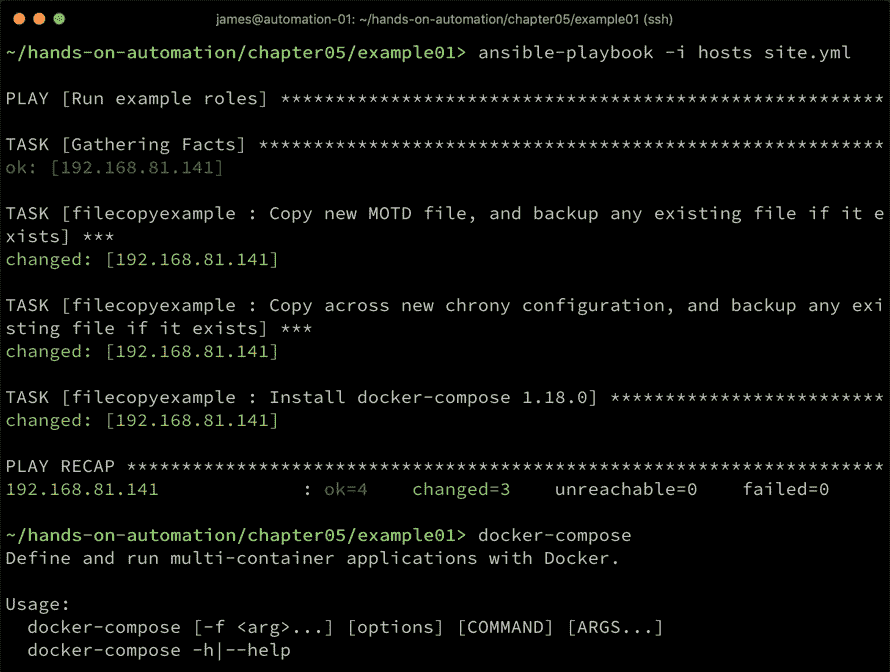

如我们所见，`changed`状态告诉我们，所有三个文件都已经成功传输或下载，作为示例，我们可以看到现在可以运行`docker-compose`，这个工具是在播放剧本执行期间安装的（虽然这需要 Docker 正确运行，而我们没有在这个示例中安装 Docker）。

很明显，这个例子做了一个基本假设——在我们示例镜像的构建阶段，已经安装了`chrony`包。尽管从我们之前讨论的原因来看，从一个最小化的操作系统镜像开始是有道理的，但几乎肯定会有需要在基础构建上安装一些额外软件包的要求，我们将在下一节探讨这一点。

# 安装软件包

我们在前一节中讨论了如何安装像`docker-compose`这样的独立二进制文件——但如果我们需要安装一些在基础镜像中没有安装的操作系统软件包怎么办？例如，`cloud-init`在大多数云环境中非常有用，但在我们之前进行的最小化 CentOS 7 安装中并没有包含。

在这里，Ansible 再次可以派上用场——这一次，我们将定义一个角色来安装所需的软件包。我们将重用上一节中的清单文件，并以我们之前的方式创建一个名为`packageinstall`的新角色：

1.  现在，前面的复制文件示例将适用于所有 Linux 发行版——你需要注意的唯一事情是目标文件可能的位置。例如，我们的 CentOS 7 虚拟机镜像将把`chrony`配置文件安装在`/etc/chrony.conf`，而 Ubuntu 18.04 LTS 服务器则会把它安装在`/etc/chrony/chrony.conf`。除了`copy`模块中`dest:`参数的这个小改动，代码保持不变。

不幸的是，软件包安装会变得更加复杂。

1.  假设我们想在 CentOS 7 示例镜像上安装`cloud-init`和`docker`——实现这一目标的角色可能如下所示：

```
---
- name: Install the epel-release package
  yum:
    name: epel-release
    state: present

- name: Install cloud-init and docker
  yum:
    name: "{{ item }}"
    state: present
  loop:
    - cloud-init
    - docker
```

1.  我们必须首先安装 EPEL 仓库，然后才能安装所需的包。当我们运行时，输出应该类似于以下内容：

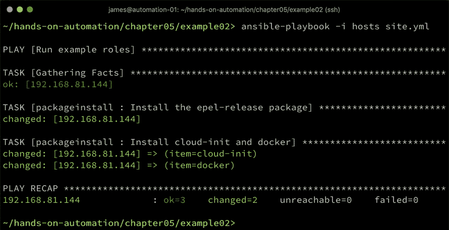

如果你使用的是其他 Linux 发行版，那么需要相应地更改包管理器。例如，在使用`apt`包管理器的 Debian 或 Ubuntu 等发行版中，相应的 Ansible 角色将类似于以下代码块：

```
---
- name: Install cloud-init and docker
  apt:
    name: "{{ item }}"
    state: present
  loop:
    - cloud-init
    - docker.io
```

请注意模块从`yum`变更为`apt`，以及用于 Docker 容器服务的不同包名。除此之外，剧本几乎是相同的。

我们可以进一步改进这一点——这会导致需要为两种不同的操作系统维护两个不同的角色——但如果我们能够智能地将它们合并为一个呢？幸运的是，Ansible 在首次运行时收集的信息可以用来识别操作系统，因此可以运行正确的代码。

我们将重用之前的示例代码，将这两项安装合并为一个 Ansible 角色：

1.  代码的第一部分与前面的示例几乎相同，唯一的不同是我们现在指定了`when`子句，确保它仅在 Debian 或 Ubuntu 基础的 Linux 发行版上运行：

```
---
- name: Install cloud-init and docker
  apt:
    name: "{{ item }}"
    state: present
  loop:
    - cloud-init
    - docker.io
  when: ansible_distribution == 'Debian' or ansible_distribution == 'Ubuntu'
```

1.  然后我们添加了两个额外的任务，执行在 CentOS 或 Red Hat Enterprise Linux 上安装 Docker 所需的步骤：

```
- name: Install the epel-release package
  yum:
    name: epel-release
    state: present
  when: ansible_distribution == 'CentOS' or ansible_distribution == 'Red Hat enterprise Linux'

- name: Install cloud-init and docker
  yum:
    name: "{{ item }}"
    state: present
  loop:
    - cloud-init
    - docker
  when: ansible_distribution == 'CentOS' or ansible_distribution == 'Red Hat enterprise Linux'
```

再次注意每个任务下的`when`子句——这些特定的示例用于根据 Ansible 在初次运行时收集的事实来判断任务是否应该执行。因此，如果我们现在在 Ubuntu 系统上运行此角色，我们会看到以下内容：

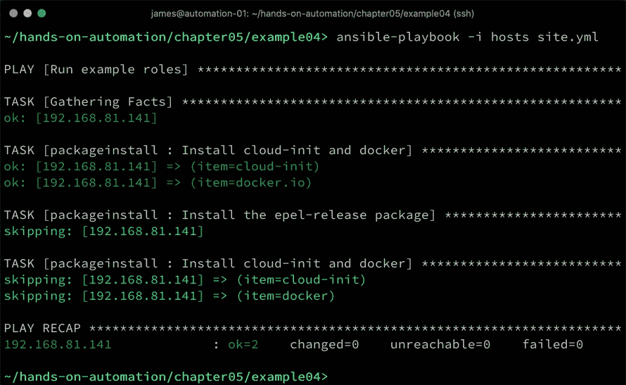

1.  如你所见，首先与`apt`相关的任务已运行，但随后基于`yum`的两个任务被跳过了，因为`when`子句的条件没有满足。现在，如果我们将其应用于 CentOS 7 目标，则会看到如下内容：

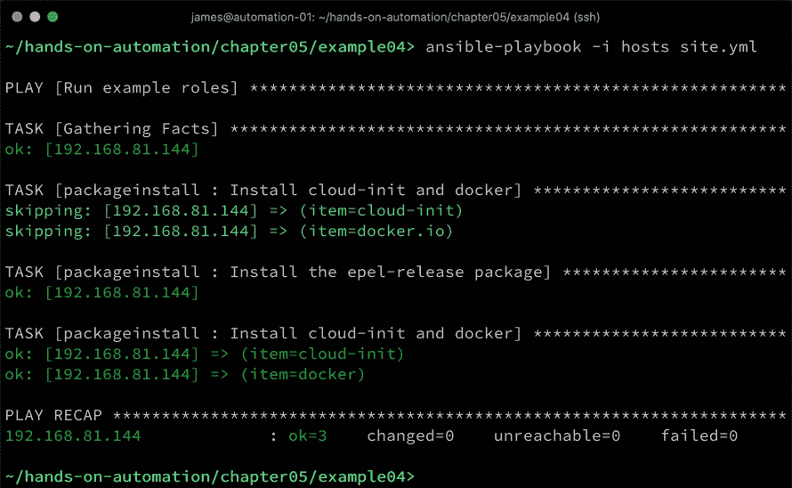

现在情况正好相反：`apt`任务被跳过，但与`yum`相关的两个任务被执行。通过这种方式，即使在处理几个不同的基础操作系统时，也可以维护一个安装通用软件包需求的单一角色。将`when`子句与 Ansible 收集的事实结合起来，是确保单一代码库在多种系统上正确运行的强大方式，因此，如果你的 SOE 涵盖了 Debian 和基于 Red Hat 的系统，你仍然可以轻松简便地维护代码。

一旦补充包安装完成，通常需要进行配置才能使其发挥作用。在接下来的部分，我们将探讨在编辑配置文件时如何使用 Ansible。

# 编辑配置文件

到目前为止，我们所做的所有配置工作都是非常简单明了的——我们要么在安装某些东西（无论是文件还是软件包），要么同样轻松地删除它（关于这一点将在清理部分进一步讲解）。但是，如果需要更为微妙的操作呢？在本章之前的*将文件传输到镜像中*部分，我们替换了整个`chrony.conf`文件，使用了我们自己的版本。然而，这种做法可能有点过于暴力——例如，我们可能只需要更改文件中的一行，而为了修改一行就替换整个文件，这种方式有些过重，特别是考虑到配置文件可能会在未来的软件包版本中更新。

让我们来看看另一个常见的操作系统镜像配置需求：SSH 守护进程的安全性。默认情况下，如我们之前创建的 CentOS 7 安装，允许使用 root 账户进行远程登录。出于安全原因，这并不可取。那么问题是，我们如何在不替换整个文件的情况下更新 SSH 守护进程配置呢？幸运的是，Ansible 就有用于这种任务的模块。

要执行此任务，`lineinfile`模块将派上用场。考虑以下角色，我们称之为`securesshd`：

```
---
- name: Disable root logins over SSH
  lineinfile:
    dest: /etc/ssh/sshd_config
    regexp: "^PermitRootLogin"
    line: "PermitRootLogin no"
    state: present
```

在这里，我们使用`lineinfile`模块处理`/etc/ssh/sshd_config`文件。我们指示它查找以`PermitRootLogin`开头的行（这可以防止我们不小心编辑被注释掉的行），然后将该行替换为`PermitRootLogin no`。

让我们在一个 CentOS 7 测试系统上尝试一下：

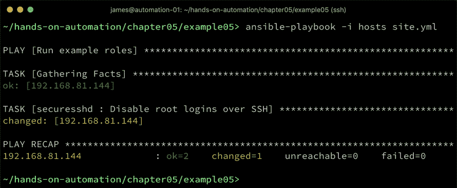

这正如预期的那样工作。然而，正则表达式需要非常小心。例如，SSH 守护进程会处理包含行首空格的配置行。然而，我们在前面代码中的简单正则表达式没有考虑空格，因此可能会错过其他有效的 SSH 配置指令。制定能够考虑所有可能情况和文件排列的正则表达式本身就是一门艺术，因此在创建和使用时必须非常小心。

请注意，在实际系统中，你还需要重启 SSH 服务才能使更改生效；但是，由于这是一个我们将清理并关闭以进行未来部署的镜像，所以在这里不需要这样做。

上传整个文件和编辑现有文件之间的一个中间方法是使用模板。Ansible Jinja2 模板非常强大，对于需要根据某些变量参数来变化内容的文件非常有用。

再次考虑我们之前提到的`chrony`配置示例——在这里，我们传输了一个包含硬编码 NTP 服务器地址的静态文件。如果你的企业依赖于一个静态 NTP 服务器（或一组服务器），这是可以的，但有些企业则可能会根据镜像要部署的位置而依赖不同的 NTP 服务器。

让我们通过一个名为`templatentp`的新角色来演示这一点。为此，我们将在`roles/templatentp/templates`中定义一个模板目录，并将一个名为`chrony.conf.j2`的文件放入其中，内容如下：

```
pool {{ ntpserver }} iburst maxsources 4

keyfile /etc/chrony/chrony.keys

driftfile /var/lib/chrony/chrony.drift

logdir /var/log/chrony

maxupdateskew 100.0

rtcsync

makestep 1 3
```

请注意，这个文件与前面的例子几乎完全相同，唯一的不同是我们在文件的第一行用一个 Ansible 变量名替代了静态的主机名。

让我们为这个角色创建`main.yml`文件，如下所示：

```
---
- name: Deploy chrony configuration template
  template:
    src: templates/chrony.conf.j2
    dest: /etc/chrony.conf
    owner: root
    group: root
    mode: '0644'
    backup: yes
```

请注意它与`copy`例子有多么相似。我们的`site.yml`文件也只有一点点不同——在其中，我们将定义带有 NTP 服务器主机名的变量。Ansible 中有很多地方可以定义这个变量，用户需要自己决定最适合的定义位置：

```
---
- name: Run example roles
  hosts: all
  become: yes

  vars:
    ntpserver: time.example.com

  roles:
    - templatentp
```

最后，我们可以运行剧本并查看结果：

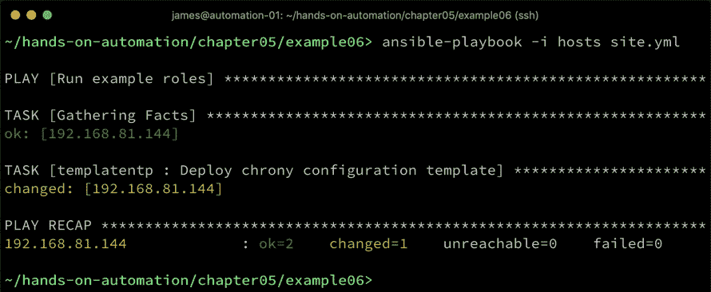

通过这种方式，Ansible 提供了强大的工具，不仅可以将整个配置复制或下载到目标环境中，还可以操作现有配置以适应你的环境。假设我们的镜像现在已经完成。我们可以凭信心认为它是好的，但良好的实践建议我们应始终测试任何构建过程的结果，尤其是自动化构建。幸运的是，Ansible 可以帮助我们根据要求验证我们创建的镜像，我们将在下一节中探讨这一点。

# 验证镜像构建

除了安装和配置你的镜像外，你可能还希望验证某些关键组件是否存在，并假设它们是存在的。特别是当你下载一个由别人创建的镜像时，这一点尤为重要。

在 Ansible 中执行此任务有多种方法——让我们以一个简单的例子为例。假设你有一个归档脚本，它使用了`bzip2`压缩工具来压缩文件。这个工具本身很小，但如果你依赖它完成某些任务，在没有它的情况下，脚本就会崩溃。它也是一个恰当的例子，因为我们之前执行的 CentOS 7 最小安装实际上并没有包含它！

Ansible 如何解决这个问题？我们可以采取两种方法。首先，根据我们之前对 Ansible 的了解，大多数模块是幂等的——也就是说，它们旨在使目标主机达到期望的状态，并且不会重复已执行的操作。

因此，我们可以非常容易地在我们的配置剧本中包含这样一个角色：

```
---
- name: Ensure bzip2 is installed
  yum:
    name: bzip2
    state: present
```

当运行这个角色时，如果`bzip2`没有安装，它将执行安装并返回结果`changed`。当它检测到`bzip2`已安装时，它将返回`ok`并且不执行任何进一步操作。但是，如果我们确实想检查某些东西，而不仅仅是执行某个动作，可能作为构建后的步骤呢？在本书后面，我们将探讨更详细的系统审计方法，但现在，我们先通过 Ansible 进一步了解这个例子。

如果你使用的是 shell 命令，你会通过两种方式之一来检查是否存在`bzip2`，即查询 RPM 数据库以查看`bzip2`包是否已安装，或者检查文件系统中是否存在`/bin/bzip2`。

1.  让我们来看一下 Ansible 中的后者示例。Ansible 的`stat`模块可以用来验证文件是否存在。请看以下代码，我们将在通常的方式下创建一个名为`checkbzip2`的角色：

```
---
- name: Check for the existence of bzip2
  stat:
    path: /bin/bzip2
  register: bzip2result
  failed_when: bzip2result.stat.exists == false

- name: Display a message if bzip2 exists
  debug:
    msg: bzip2 installed.
```

在这里，我们使用`stat`模块来检查`/bin/bzip2`文件是否存在。我们将模块执行的结果注册到名为`bzip2result`的变量中，然后我们为任务定义一个自定义的失败条件，若文件不存在，则导致任务失败（进而使整个 playbook 执行失败）。请注意，当遇到失败条件时，Ansible 会暂停整个 playbook 的执行，迫使你在继续之前解决问题。显然，这可能不是你希望的行为，但你可以轻松根据需要调整失败条件。

1.  让我们看看实际操作中的效果：

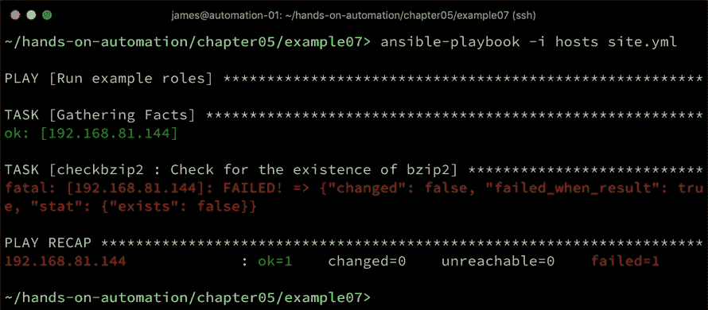

如你所见，调试语句未被执行，因为遇到了错误。因此，我们可以完全确信，当运行此角色时，我们的镜像中将会安装`bzip2`——如果没有安装，playbook 将会失败。

1.  一旦`bzip2`安装完成，运行结果会变得大不相同：

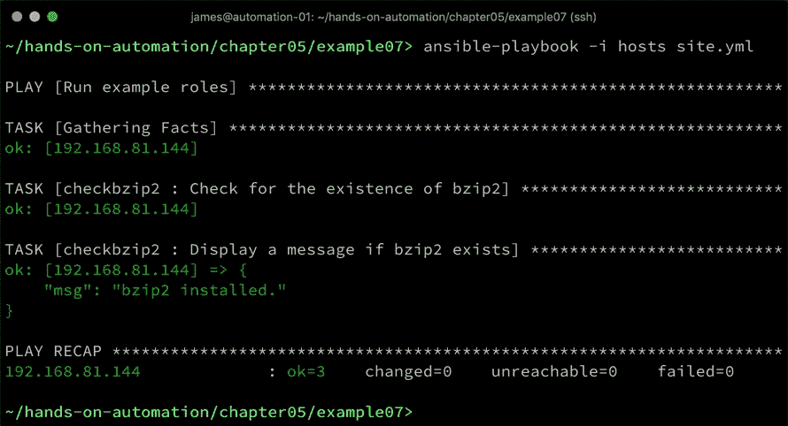

这种行为是非常明确的，正是我们所希望的。然而，Ansible 并不仅限于检查文件——我们还可以检查我们的`sshd_config`文件中是否有之前提到的`PermitRootLogin no`行：

1.  我们可以通过角色来实现这一点，代码如下：

```
---
- name: Check root login setting in sshd_config
  command: grep -e "^PermitRootLogin no" /etc/ssh/sshd_config
  register: grepresult
  failed_when: grepresult.rc != 0

- name: Display a message if root login is disabled
  debug:
    msg: root login disabled for SSH
```

1.  现在，当设置未生效时，再次运行会导致失败：

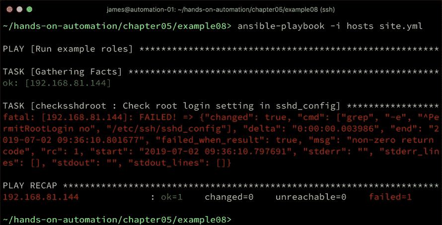

1.  然而，如果我们设置了这个条件，我们会看到以下结果：

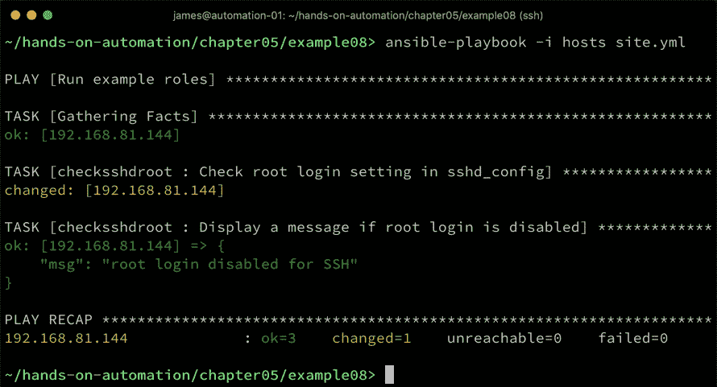

再次强调，它的行为非常明确。请注意前面输出中的`changed`状态——这是因为我们使用了`command`模块，它成功执行了`command`——因此，它总是返回`changed`。如果需要，我们可以通过在此任务中添加`changed_when`条件来改变这一行为。

通过这种方式，可以编写 Ansible playbook，不仅可以自定义构建过程，还可以验证最终结果。这在测试过程中尤其有用，尤其是在需要考虑安全性的场景中。

在完成本章之前，让我们在接下来的章节中看看，我们如何将迄今为止讨论的所有角色和代码片段组合起来，形成一个连贯的自动化解决方案。

# 将所有内容整合起来

在本章的这一部分中，你会注意到我们在所有示例中都使用了角色（roles）。自然地，当你最终构建你的镜像时，你不希望像我们在这里所做的那样单独运行多个 playbook。幸运的是，如果我们将所有内容合并起来，我们所需要做的就是将所有的角色放在`roles/`子目录中，然后在`site.yml` playbook 中引用它们。`roles`目录应该类似于以下内容：

```
~/hands-on-automation/chapter05/example09/roles> tree -d
.
├── checkbzip2
│   └── tasks
├── checksshdroot
│   └── tasks
├── filecopyexample
│   ├── files
│   └── tasks
├── installbzip2
│   └── tasks
├── packageinstall
│   └── tasks
├── securesshd
│   └── tasks
└── templatentp
    ├── tasks
    └── templates
```

然后，我们的`site.yml`文件应该是这样的：

```
---
- name: Run example roles
  hosts: all
  become: yes

  roles:
    - filecopyexample
    - packageinstall
    - templatentp
    - installbzip2
    - securesshd
    - checkbzip2
    - checksshdroot
```

运行这段代码的部分留给读者自行完成，因为我们已经在本章的早些部分运行了所有组件。然而，如果一切顺利，那么当所有角色执行完毕后，应该没有`failed`状态——只有`changed`和`ok`的混合状态。

如果你已经按照本章的详细说明完成了后期构建自定义，那么生成的镜像可能需要第二次清理。我们可以再次使用`virt-sysprep`命令，但 Ansible 也可以在这里帮助我们。在下一节中，我们将探讨如何使用 Ansible 来清理镜像以便进行大规模部署。

# 使用 Ansible 清理构建过程

到目前为止，你应该对如何构建或验证基础镜像，并使用 Ansible 进行自定义有了相当清晰的理解。在我们结束本章之前，值得回顾一下清理镜像以便部署的任务。无论你是从头构建镜像还是下载了现成的镜像，如果你已经启动并在其上运行了命令，无论是手动还是使用 Ansible，你可能会有很多你不希望在每次部署镜像时都出现的东西。例如，你真的希望每次部署的虚拟机上都有你执行的每个配置任务和初始启动的系统日志文件吗？如果你必须手动运行任何命令（即使是为了设置身份验证以允许 Ansible 运行），你是否希望这些命令出现在你运行它们的账户的`.bash_history`文件中，并在每次部署时都被记录？

这些问题的答案，当然是“否”。然后还有一些文件，如果被克隆可能会引起问题——例如，重复的 SSH 主机密钥或 MAC 地址特定的配置，如`udev`配置数据。在你认为镜像准备好分发之前，所有这些内容应该清理干净。

Ansible 也可以帮助完成此任务，尽管我们建议使用本章前面展示的`virt-sysprep`工具，因为它可以为您处理所有这些步骤。您可能有不想使用此工具的原因——例如，您的环境中没有访问权限，或者您的 Linux 发行版没有此工具的版本。在这种情况下，您可以使用 Ansible 执行最终的清理。Ansible 的优点是，您可以使用本章中展示的内置模块，但同样也可以使用原始的 shell 命令——这在需要跨文件系统执行通配符操作时尤其有用。

以下是一个角色的示例，该角色依赖原始的 shell 命令来清理镜像，为部署做准备。它没有`virt-sysprep`所执行的任务那么完整，但作为如何使用 Ansible 执行此操作的良好示例。请注意，此示例特定于 CentOS 7——如果使用不同的操作系统，则需要更改路径、软件包数据库清理命令等。因此，本剧本提供给读者的更多是一个实用示例，展示了如何在 Ansible 中执行清理操作，但读者可以根据自己的需求进一步完善。首先，我们清理软件包数据库，因为这些数据不需要在各个部署之间复制：

```
---
- name: Clean out yum cache
  shell: yum clean all
```

接着，我们继续清理日志——通过停止日志守护进程，强制日志轮换，然后递归删除包含日志的目录来实现：

```
- name: Stop syslog
  shell: service rsyslog stop

- name: Force log rotation
  shell: /sbin/logrotate -f /etc/logrotate.conf
  ignore_errors: yes

- name: Clean out logs
  shell: /bin/rm -f /var/log/*-???????? /var/log/*.gz /var/log/*.[0-9] /var/log/**/*.gz /var/log/**/*.[0-9]

- name: Truncate log files
  shell: truncate -s 0 /var/log/*.log

- name: Truncate more logs
  shell: truncate -s 0 /var/log/**/*.log

- name: Clear the audit log
  shell: /bin/cat /dev/null > /var/log/audit/audit.log

- name: Clear wtmp
  shell: /bin/cat /dev/null > /var/log/wtmp
```

然后，我们清理硬件和 MAC 地址特定的配置，这些配置在部署后的虚拟机镜像中无效：

```
- name: Remove the udev persistent device rules
  shell: /bin/rm -f /etc/udev/rules.d/70*

- name: Remove network related MAC addresses and UUID's
  shell: /bin/sed -i '/^\(HWADDR\|UUID\)=/d' /etc/sysconfig/network-scripts/ifcfg-*
```

接下来，我们清理`/tmp`目录，并移除用户主目录中的历史文件。以下示例不完整，但展示了一些相关的例子：

```
- name: Clear out /tmp
  shell: /bin/rm -rf /tmp/* /var/tmp/*

- name: Remove user history
  shell: /bin/rm -f ~root/.bash_history /home/**/.bash_history

- name: Remove any viminfo files
  shell: rm -f /root/.viminfo /home/**/.viminfo

- name: Remove .ssh directories
  shell: rm -rf ~root/.ssh m -rf /home/**/.ssh
```

最后，我们执行最终任务——在这种情况下，删除 SSH 主机密钥。请注意，在此之后，我们还关闭虚拟机——这是作为此命令的一部分执行的，以防止意外创建任何额外的历史或日志数据。还要注意`ignore_errors`子句，它可以防止在关闭虚拟机并断开 SSH 连接时剧本失败：

```
- name: Remove SSH keys and shut down the VM (this kills SSH connection)
  shell: /bin/rm -f /etc/ssh/*key* && shutdown -h now
  ignore_errors: yes
```

在 CentOS 7 虚拟机上运行此代码将生成一个相对干净的镜像，但这里没有涉及一些细节。例如，我们已经清理了所有 bash 历史记录，但如果使用了其他 shell，其数据将不会被清理。类似地，我们清理了 root 用户主目录中的 VIM 应用数据，但没有清理可能在镜像创建过程中使用过的其他应用数据。因此，您需要根据您的环境需求扩展此角色。

到这个阶段，你已经完整地了解了创建、定制和清理 Linux 操作系统的整个过程，用于我们的 SOE 提议。有效使用 Ansible 意味着整个过程可以自动化，因此使我们能够在企业中迈出自动化的坚实步伐。接下来，只需将我们创建的模板部署到你的环境中，从这里开始，你可以根据需要克隆并进一步构建它。

# 总结

我们已经看到几个实际示例，展示了如何获取或构建 Linux 虚拟机镜像，以便在各种场景和环境中使用。我们还看到 Ansible 如何帮助自动化这一过程，进而如何与镜像构建过程相结合，支持我们之前讨论过的企业自动化最佳实践，特别是 SOE（标准化操作环境）的创建与管理。

在本章中，你学习了如何构建用于模板的 Linux 镜像，并且了解了如何获取并验证现成的镜像。接着，你通过实际示例学习了如何使用 Ansible 自定义这些模板镜像，涉及的关键概念包括软件包安装和配置文件管理。最后，你学习了如何确保镜像构建干净整洁，不包含任何会浪费或有害的重复数据。

在本书的下一章，我们将探讨如何为裸金属服务器和某些传统虚拟化环境创建标准化镜像。

# 问题

1.  系统准备（sysprep）的目的是什么？

1.  你什么时候需要在角色中使用 Ansible facts？

1.  如何通过 Ansible 将新配置文件部署到虚拟机镜像中？

1.  使用哪个 Ansible 模块可以将文件直接从互联网下载到虚拟机镜像中？

1.  如何编写一个 Ansible 角色，能够在 Ubuntu 和 CentOS 上安装软件包？

1.  为什么你需要验证已下载的 ISO 镜像？

1.  在这一阶段使用 Ansible 角色会如何有利于环境的部署？

# 深入阅读

+   如需深入了解 Ansible，请参考 *Mastering Ansible*，*第三版*，由 *James Freeman* 和 *Jesse Keating* 编写，书籍可通过 [`www.packtpub.com/gb/virtualization-and-cloud/mastering-ansible-third-edition`](https://www.packtpub.com/gb/virtualization-and-cloud/mastering-ansible-third-edition) 获取。

+   关于在 Linux 上使用 KVM 进行虚拟化的更多细节，请参考 *Mastering KVM Virtualization*，由 *Prasad Mukhedkar*、*Anil Vettathu* 和 *Humble Devassy Chirammal* 编写，书籍可通过 [`www.packtpub.com/gb/networking-and-servers/mastering-kvm-virtualization`](https://www.packtpub.com/gb/networking-and-servers/mastering-kvm-virtualization) 获取。
