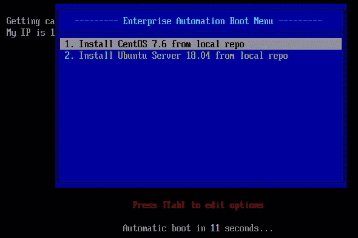
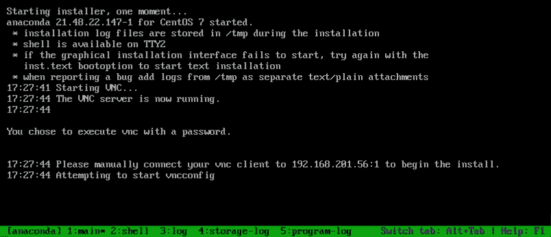
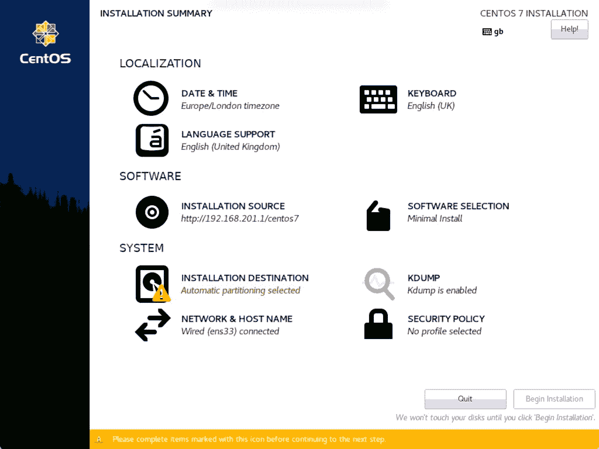
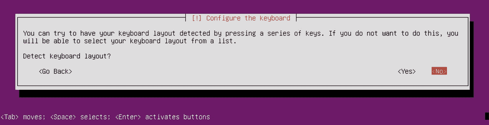
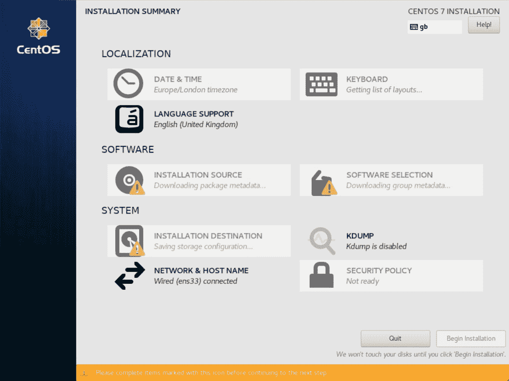
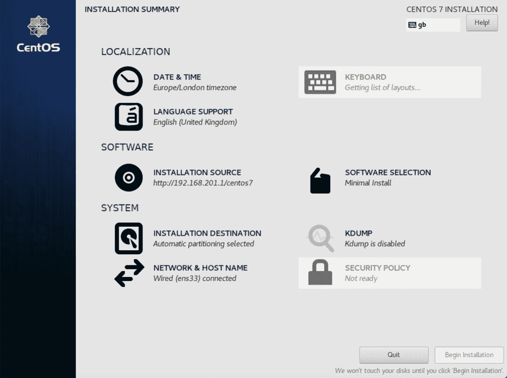
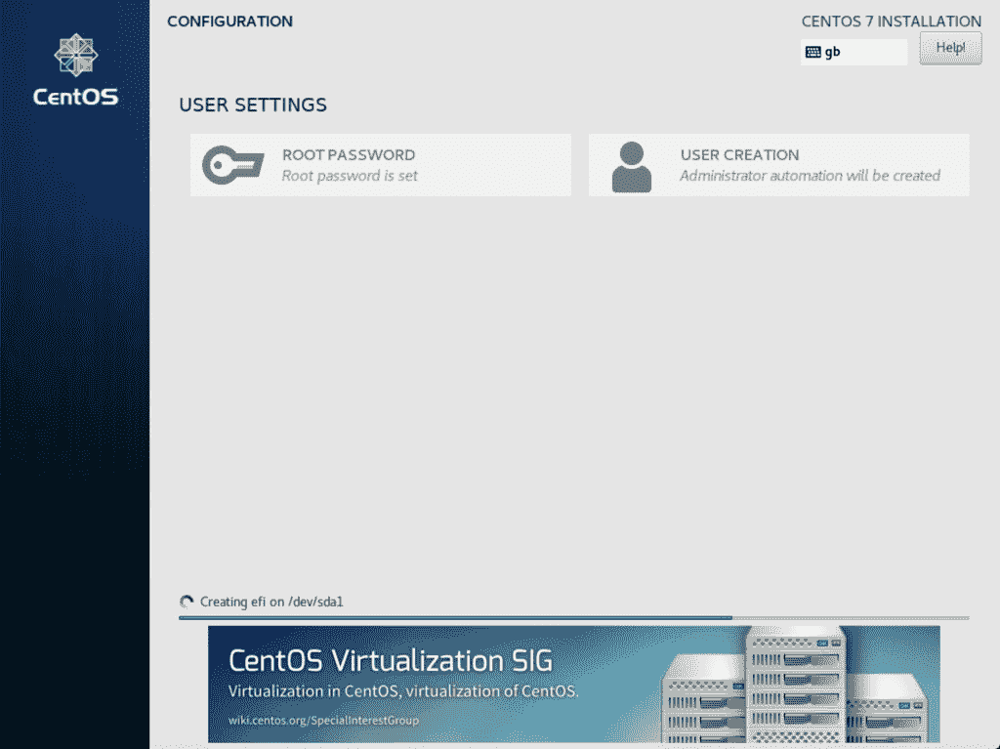
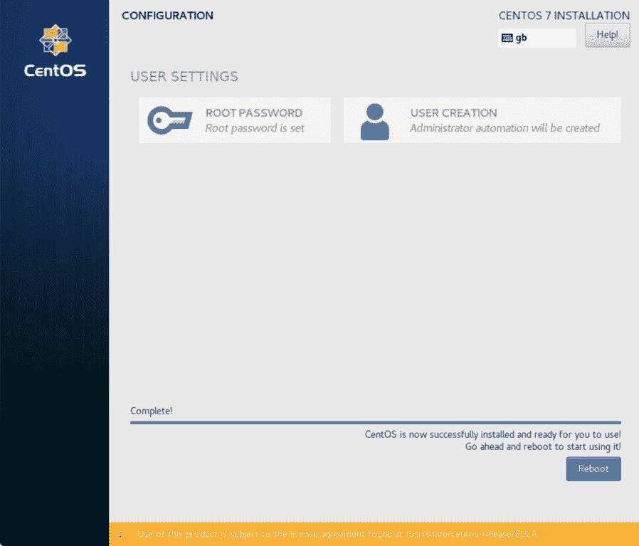
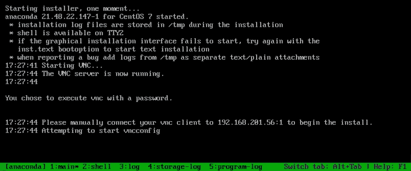

# 第六章：使用 PXE 启动进行自定义构建

在使用物理硬件时，并不能保证你可以简单地将虚拟机模板克隆到硬盘上并期待它能正常工作。当然，使用正确的工具，这完全是可能的，但它很棘手，而且无法保证结果系统能正常运行。

例如，云就绪镜像只会安装常见虚拟化网络适配器的内核模块，因此，当安装在现代硬件上时，可能无法运行（或无法连接网络）。

尽管如此，在物理硬件上仍然完全可以执行自动化、标准化的构建，本章提供了一个完整的实践方法。结合前一章，到本章结束时，你将获得标准化所有平台镜像的自动化构建过程的实际经验，无论它们是虚拟的、基于云的还是物理的。

本章将涵盖以下主题：

+   PXE 启动基础

+   执行无人值守构建

+   向无人值守启动配置中添加自定义脚本

# 技术要求

在本章中，我们将探讨 PXE 启动的过程，适用于物理和虚拟服务器。你需要两台在同一网络上的服务器，建议该网络是隔离的，因为本章执行的一些步骤可能会对实际运行的网络产生干扰甚至破坏。

你需要一台预先安装了你选择的 Linux 发行版的服务器（或虚拟机）——在我们的示例中，我们将使用 Ubuntu Server 18.04 LTS。另一台服务器（或虚拟机）应该是空白的，并且适合重新安装。

本章讨论的所有示例代码都可以从 GitHub 获取，地址是：[`github.com/PacktPublishing/Hands-On-Enterprise-Automation-on-Linux/tree/master/chapter06`](https://github.com/PacktPublishing/Hands-On-Enterprise-Automation-on-Linux/tree/master/chapter06)。

# PXE 启动基础

在虚拟化和云平台广泛采用之前，需要在物理服务器上生成标准化的操作系统构建，而无需访问数据中心并插入某种形式的安装介质。PXE 启动应运而生，作为满足这一需求的常见解决方案之一，其名称来源于**预执行**环境（可以理解为一个小型的、最简操作系统），它会加载，以便进行操作系统安装。

高层次来看，当我们谈论给定服务器的 PXE 构建时，以下过程正在发生：

1.  服务器必须配置为使用其一个（或所有）网络适配器进行网络启动。这通常是大多数新硬件的出厂默认设置。

1.  启动时，服务器启动网络接口，并依次尝试与 DHCP 服务器联系。

1.  DHCP 服务器会返回 IP 地址配置参数，并提供进一步的信息，说明预执行环境应从哪里加载。

1.  服务器然后检索预执行环境，通常使用 **简单文件传输协议**（**TFTP**）。

1.  PXE 环境启动后，会在 TFTP 服务器的已知且定义明确的位置查找配置数据。

1.  配置数据被加载，并指示 PXE 环境如何继续。通常，对于 Linux 来说，这涉及从 TFTP 服务器加载内核和初始 RAMDisk 镜像，其中包含足够的 Linux 系统来继续安装，并从另一个网络服务（通常是 HTTP）中提取更多的安装源。

尽管这一切听起来相当复杂，但实际上，当分解成一步一步的过程时，它相当简单。在本章中，我们将逐步完成构建一个 PXE 启动服务器的过程，该服务器能够执行 CentOS 7 或 Ubuntu 18.04 Server 的无人值守安装。这将作为一个很好的动手示例，并展示我们如何在物理硬件上编写构建过程脚本，因为在上一章中讨论的虚拟机模板过程在这里并不容易实现。

在 PXE 启动过程开始之前，我们必须先设置一些支持服务，提供所需的网络服务。在下一节中，我们将讨论如何设置和配置这些服务。

# 安装和配置 PXE 相关服务

与几乎所有的 Linux 设置一样，执行此操作的具体方法将取决于你进行安装的 Linux 发行版，以及你将使用的软件包。在这里，我们将使用 ISC DHCP 服务器、久负盛名的 TFTP 守护进程和 nginx。然而，你也可以同样使用 dnsmasq 和 Apache。

在许多企业中，这些决策可能已经做出——大多数企业已经有了某种形式的 DHCP 基础设施，许多使用 IP 电话系统的公司也会有 TFTP 服务器。因此，本章仅提供一个示例——实际的实施通常会遵循长期建立的公司标准。

没有安全机制来防止你在同一网络上运行两个 DHCP 服务器。DHCP 依赖于广播消息，因此，网络上的任何 DHCP 客户端都将接收到响应最快的服务器的回答。因此，通过设置第二个 DHCP 服务器，完全有可能使网络无法正常工作。如果你按照本章中概述的过程进行操作，请确保在一个隔离的网络中进行，以便进行测试。

对于此设置，我们假设我们有一个隔离的网络。我们的 PXE 服务器的 IP 地址为 `192.168.201.1`，子网掩码为 `255.255.255.0`。这些细节在设置 DHCP 服务器时非常重要。现在，让我们一步步完成服务器配置，以支持 PXE 启动：

1.  我们需要安装以下所需的软件包：

    +   DHCP 服务器

    +   TFTP 服务器

    +   Web 服务器

假设我们使用的是 Ubuntu 18.04 主机，如前所述，运行以下命令以安装本章所需的包：

```
$ apt-get install isc-dhcp-server tftpd-hpa nginx
```

1.  安装这些后，下一步是配置我们的 DHCP 服务器，通过 `/etc/dhcp/dhcpd.conf` 文件配置前述的软件包。下面代码块中的配置文件是一个适合我们 PXE 启动网络的良好（虽然基础）示例，当然，你需要编辑子网定义以匹配你自己的测试网络。文件的第一部分包含一些重要的全局指令和网络的子网定义：

```
allow bootp;
# https://www.syslinux.org/wiki/index.php?title=PXELINUX#UEFI
# This one line must be outside any bracketed scope
option architecture-type code 93 = unsigned integer 16;

subnet 192.168.201.0 netmask 255.255.255.0 {
  range 192.168.201.51 192.168.201.99;
  option broadcast-address 192.168.201.255;
  option routers 192.168.201.1;
  option domain-name-servers 192.168.201.1;
```

文件的下一部分包含配置指令，确保我们根据使用的系统类型加载正确的预执行二进制文件。编写时，常见的是同时存在 BIOS 和 UEFI 基于的系统，因此以下配置非常重要：

```
  class "pxeclients" {
     match if substring (option vendor-class-identifier, 0, 9) = "PXEClient";

     if option architecture-type = 00:00 {
         filename "BIOS/pxelinux.0";
     } else if option architecture-type = 00:09 {
         filename "EFIx64/syslinux.efi";
     } else if option architecture-type = 00:07 {
         filename "EFIx64/syslinux.efi";
     } else if option architecture-type = 00:06 {
         filename "EFIia32/syslinux.efi";
     } else {
         filename "BIOS/pxelinux.0";
     }
  }
}
```

如果你之前使用过 DHCP 服务器，大部分内容是自解释的。然而，标题为 `class "pxeclients"` 的文本块值得特别提及。几年前，服务器硬件依赖于 BIOS 启动，因此 PXE 启动配置非常简单，因为只需要加载一个预启动环境。现在，大多数新的服务器硬件配置了可以在 *Legacy BIOS* 或 *UEFI 模式* 中运行的固件，并且大多数默认启用 UEFI，除非另行配置。预执行二进制文件是不同的，具体取决于使用的固件类型，因此，这个块中的 `if` 语句利用了 DHCP `option`，当客户端发出 DHCP 请求时返回给服务器。

1.  配置完成后，启用 DHCP 服务器，并重新启动它，步骤如下：

```
$ systemctl enable isc-dhcp-server.service
$ systemctl restart isc-dhcp-server.service
```

1.  对于 TFTP 服务器，默认配置足以满足本示例的需求，因此，让我们启用此功能并确保它按如下方式运行：

```
$ systemctl enable tftpd-hpa.service
$ systemctl restart tftpd-hpa.service
```

1.  最后，我们将使用 nginx 的默认配置，并从 `/var/www/html` 提供我们需要的所有文件——显然，在企业环境中，你可能希望做一些更高级的配置，但在下面的实际示例中，这样的配置已经足够：

```
$ systemctl enable nginx.service
$ systemctl restart nginx.service
```

这就是我们的服务器基础设施配置完成，但还有一个最后的任务。我们需要为 TFTP 服务器准备预执行环境二进制文件，以发送给客户端。

尽管这些工具对于大多数 Linux 发行版来说都很容易获得（Ubuntu 18.04 也不例外），但这些软件包通常都比较旧（PXELINUX 的最后一个稳定版本发布于 2014 年），并且我遇到过一些已知的 bug，特别是在处理 UEFI 硬件时。虽然您可以尝试较新的快照版本，但作者在使用版本标签为 6.04-pre2 的版本时取得了最好的成功，因此我们将解释如何构建此版本并将文件复制到我们 TFTP 服务器的正确位置，如下所示：

1.  首先，下载并解压所需版本的 SYSLINUX（它包含 PXELINUX 代码），输入以下代码：

```
$ wget https://www.zytor.com/pub/syslinux/Testing/6.04/syslinux-6.04-pre2.tar.gz
$ tar -xzf syslinux-6.04-pre2.tar.gz
$ cd syslinux-6.04-pre2/
```

1.  接下来，我们需要安装一些构建工具，以便成功编译代码，如下所示：

```
$ sudo apt-get install nasm uuid-dev g++-multilib
```

1.  最后，我们将确保构建目录是干净的，然后构建代码，如下所示：

```
$ make spotless
$ make
```

当构建完成后，最后一步是将文件复制到正确的位置。回想我们之前的 DHCP 服务器配置，我们知道需要将与传统 BIOS 启动相关的文件与新发布的 UEFI 启动文件分开。在这里，我们将逐步介绍如何为 BIOS 和 UEFI 网络启动设置您的服务器：

1.  在 Ubuntu 18.04 上，TFTP 服务器的默认根目录是 `/var/lib/tftpboot`。在此路径下，我们将创建 DHCP 服务器配置中提到的两个目录，如下所示：

```
$ mkdir -p /var/lib/tftpboot/{EFIx64,BIOS}
```

1.  然后，我们将运行一组命令，将所有与 BIOS 相关的启动文件收集并复制到新创建的 `BIOS` 目录中：

```
$ cp bios/com32/libutil/libutil.c32 bios/com32/elflink/ldlinux/ldlinux.c32 bios/core/pxelinux.0 /var/lib/tftpboot/BIOS
$ mkdir /var/lib/tftpboot/BIOS/pxelinux.cfg
$ mkdir /var/lib/tftpboot/BIOS/isolinux
$ find bios -name *.c32 -exec cp {} /var/lib/tftpboot/BIOS/isolinux \;
```

1.  然后，我们重复此步骤，不过这次我们指定与 UEFI 相关的启动文件，如下所示：

```
$ cp efi64/com32/elflink/ldlinux/ldlinux.e64 efi64/com32/lib/libcom32.c32 efi64/com32/libutil/libutil.c32 efi64/efi/syslinux.efi /var/lib/tftpboot/EFIx64 
$ mkdir /var/lib/tftpboot/EFIx64/pxelinux.cfg 
$ mkdir /var/lib/tftpboot/EFIx64/isolinux
$ find efi64/ -name *.c32 -exec cp {} /var/lib/tftpboot/EFIx64/isolinux \;
```

完成这些步骤后，我们现在已经有了一个完整的、功能正常的 PXE 服务器。我们还没有下载任何操作系统镜像，因此启动过程不会进行得很远，但如果此时进行测试，您的服务器固件应该报告它已从 DHCP 服务器获取了 IP 地址，并应显示一些与启动相关的消息。然而，在本书中我们将在进一步测试之前继续完善这个过程，在下一节中，我们将介绍如何为您选择的 Linux 发行版获取正确的网络安装镜像。

# 获取网络安装镜像

在我们的 PXE 启动设置过程中，下一步是构建所需的镜像。幸运的是，获取启动镜像非常简单——内核和软件包通常包含在您选择的 Linux 发行版的 DVD ISO 镜像中。显然，这可能因发行版而异，因此您需要检查这一点。在本章中，我们将展示 Ubuntu Server 和 CentOS 7 的示例——这些原则也适用于许多 Debian 派生版、Fedora 和 Red Hat 企业 Linux。

所需的网络启动安装镜像以及所需的安装包通常可以在完整的 DVD 镜像中找到——*live* 镜像通常不够，因为它们缺少足够完整的安装包，无法完成安装，或者缺少支持网络启动的内核。

让我们从 CentOS 7 镜像开始，如下所示：

1.  首先，从最近的镜像站点下载最新的 DVD 镜像——例如，下面代码块中显示的镜像：

```
$ wget http://mirror.netweaver.uk/centos/7.6.1810/isos/x86_64/CentOS-7-x86_64-DVD-1810.iso
```

1.  下载后，将 ISO 镜像挂载到合适的位置，以便可以从中复制文件，如下所示：

```
$ mount -o loop CentOS-7-x86_64-DVD-1810.iso /mnt
```

1.  现在，支持网络启动的内核和初始 RAMDisk 镜像应该被复制到我们选择的位置，位于 TFTP 服务器根目录下。

请注意，在以下示例中，我们仅为 UEFI 启动进行此操作。要设置 **传统 BIOS 启动**，请完全按照相同的过程进行，但将所有由 TFTP 提供的文件放置在 `/var/lib/tftpboot/BIOS` 中。本章其余部分也适用这一点。

在我们的测试系统上实现这一点的命令如下：

```
$ mkdir /var/lib/tftpboot/EFIx64/centos7

$ cp /mnt/images/pxeboot/{initrd.img,vmlinuz} /var/lib/tftpboot/EFIx64/centos7/
```

1.  最后，我们需要之前安装的 web 服务器来提供安装程序所需的文件——一旦内核和初始 RAMDisk 环境加载，剩余的环境将通过 HTTP 提供，因为 HTTP 更适合进行大数据传输。我们将再次为 CentOS 内容创建一个合适的子目录，如下所示：

```
$ mkdir /var/www/html/centos7/

$ cp -r /mnt/* /var/www/html/centos7/

$ umount /mnt
```

就这样！一旦这些步骤完成，我们将对 Ubuntu 18.04 Server 启动镜像重复此过程，如下所示：

```
$ wget http://cdimage.ubuntu.com/releases/18.04/release/ubuntu-18.04.2-server-amd64.iso

$ mount -o loop ubuntu-18.04.2-server-amd64.iso /mnt

$ mkdir /var/lib/tftpboot/EFIx64/ubuntu1804

$ cp /mnt/install/netboot/ubuntu-installer/amd64/{linux,initrd.gz} /var/lib/tftpboot/EFIx64/ubuntu1804/

$ mkdir /var/www/html/ubuntu1804

$ cp -r /mnt/* /var/www/html/ubuntu1804/

$ umount /mnt
```

完成这些步骤后，我们只剩下一个配置阶段，然后就可以进行我们选择的操作系统的网络启动了。

这个过程几乎是相同的——唯一的区别是，支持网络启动的内核和 RAMDisk 是从 ISO 镜像中的另一个目录中获取的。

在接下来的部分中，我们将配置到目前为止构建的 PXE 启动服务器，以便从这些安装镜像启动。

# 执行第一次网络启动

到目前为止，我们已经配置了服务器，在启动时为客户端分配 IP 地址，并且还构建了两个安装树，这样我们就可以安装 CentOS 7 或 Ubuntu 18.04 Server，而无需任何物理介质。然而，当目标机器通过网络启动时，它是如何知道该启动什么的呢？

解决这一问题的方式是 PXELINUX 配置。这与大多数 Linux 安装使用的 **GRand Unified Bootloader**（**GRUB**）配置非常相似，用于定义从磁盘启动时的启动选项和参数。根据我们迄今为止构建的安装，这些配置文件应位于 `/var/lib/tftpboot/EFIx64/pxelinux.cfg`（或者对于传统 BIOS 机器，则位于 `/var/lib/tftpboot/BIOS/pxelinux.cfg`）。

现在，来谈谈文件命名。你可能希望所有通过网络接口启动的设备都执行网络启动。然而，想象一个服务器，它的本地磁盘上有一个有效的 Linux 安装，但由于某些错误（比如固件中的启动顺序配置错误，或者缺失的引导加载程序），它从网络接口启动，而不是从本地磁盘启动。如果你在 PXE 服务器上配置了一个完整的无人值守安装，这将会清除本地磁盘，可能导致灾难性的后果。

如果你希望所有服务器都执行网络启动，不管其他情况，你可以创建一个特殊的配置文件，名为`default`。

然而，如果你想更加有针对性地配置，可以根据 MAC 地址创建一个配置文件。假设我们有一台 MAC 地址为`DE:AD:BE:EF:01:23`的服务器，且我们的 DHCP 服务器将为它分配 IP 地址`192.168.10.101/24`（这很可能是通过静态 DHCP 映射来确保该服务器始终获得这个 IP 地址）。当这台服务器使用 UEFI 网络启动时，它会首先查找`/var/lib/tftpboot/EFIx64/pxelinux.cfg/01-de-ad-be-ef-01-23`。

如果这个文件不存在，它将查找一个以十六进制编码的 IP 地址命名的文件。如果该文件也不存在，它会依次去掉十六进制 IP 地址的每一位，直到找到一个匹配的文件。通过这种方式，我们的服务器会查找`/var/lib/tftpboot/EFIx64/pxelinux.cfg/C0A80A65`。如果没有找到，它会依次循环尝试更短的 IP 地址表示方式，直到没有更多选项。如果最终找不到合适命名的文件，它会回退到`default`文件，如果这个文件也不存在，客户端将报告启动失败。

因此，配置文件的完整搜索顺序如下：

1.  `/var/lib/tftpboot/EFIx64/pxelinux.cfg/01-de-ad-be-ef-01-23`

1.  `/var/lib/tftpboot/EFIx64/pxelinux.cfg/C0A80A65`

1.  `/var/lib/tftpboot/EFIx64/pxelinux.cfg/C0A80A6`

1.  `/var/lib/tftpboot/EFIx64/pxelinux.cfg/C0A80A`

1.  `/var/lib/tftpboot/EFIx64/pxelinux.cfg/C0A80`

1.  `/var/lib/tftpboot/EFIx64/pxelinux.cfg/C0A8`

1.  `/var/lib/tftpboot/EFIx64/pxelinux.cfg/C0A`

1.  `/var/lib/tftpboot/EFIx64/pxelinux.cfg/C0`

1.  `/var/lib/tftpboot/EFIx64/pxelinux.cfg/C`

1.  `/var/lib/tftpboot/EFIx64/pxelinux.cfg/default`

缩短 IP 地址文件名的目的是让你能够创建一个适用于整个子网的配置——例如，如果`192.168.10.0/24`子网中的所有机器都需要相同的启动配置，你可以创建一个名为`/var/lib/tftpboot/EFIx64/pxelinux.cfg/C0A80A`的文件。特别注意文件名中字母的大小写——基于 MAC 地址的文件名需要使用小写字母，而 IP 地址则需要使用大写字母。

这个配置文件的内容有许多配置组合，深入研究所有可能的配置将留给读者作为练习——PXELINUX 有充足的文档和示例可供参考。然而，考虑到我们特别要启动网络安装镜像，让我们来看以下文件。首先，我们定义菜单的头部，简单的标题和超时时间，如下所示：

```
default isolinux/menu.c32
prompt 0
timeout 120

menu title --------- Enterprise Automation Boot Menu ---------
```

接下来，我们定义了我们所构建的两个操作系统安装镜像的条目，如下所示：

```
label 1
menu label ¹\. Install CentOS 7.6 from local repo
kernel centos7/vmlinuz
append initrd=centos7/initrd.img method=http://192.168.201.1/centos7 devfs=nomount ip=dhcp inst.vnc inst.vncpassword=password

label 2
menu label ²\. Install Ubuntu Server 18.04 from local repo
kernel ubuntu1804/linux
append initrd=ubuntu1804/initrd.gz vga=normal locale=en_US.UTF-8 mirror/country=manual mirror/http/hostname=192.168.201.1 mirror/http/directory=/ubuntu1804 mirror/http/proxy="" live-installer/net-image=http://192.168.201.1/ubuntu1804/install/filesystem.squashfs 
```

与本书中的其他示例一样，这些是真实的、经过测试的示例，能够独立工作。然而，它们应该根据你的需求进行定制，并且你应该在生产环境中应用之前，阅读并理解这些代码。

在前面的示例中，`192.168.201.1` 是我在测试环境中 PXE 服务器的 IP 地址。确保将它替换为你 PXE 服务器的 IP 地址。

事实上，这是一个非常简单的示例——在这里，我们定义了一个简单的文本模式菜单，包含两个条目，每个条目对应一个操作系统。每个菜单条目都有一个 `label`，即菜单中显示的标题，然后是 `kernel` 和 `append` 行。`kernel` 行告诉客户端从哪里获取 TFTP 服务器上的内核，而 `append` 行用于指定 RAMDisk 映像的路径以及所有附加的启动参数。

如你所见，这些启动参数对于不同的 Linux 发行版差异很大，安装程序的功能也各不相同。例如，CentOS 7 安装程序是图形化的（虽然也有文本模式选项），并且支持 VNC 服务器，我们在第一个菜单项中配置了它，启用了使用 VNC 控制台的远程安装，使用了 `inst.vnc` 和 `inst.vncpassword=password` 参数。其他使用的参数如下：

+   `method=http://192.168.201.1/centos7`：设置我们 CentOS 7 仓库的地址

+   `devfs=nomount`：告诉内核不要挂载 devfs 文件系统

+   `ip=dhcp`：告诉预启动环境通过 DHCP 获取 IP 地址，以便能够访问 HTTP 服务器

相比之下，Ubuntu 安装程序通常以文本模式运行，因此不支持 VNC 服务器，因此需要不同的远程访问技术来执行交互式安装，例如 **Serial-Over-LAN**（**SOL**）。不过，这个菜单文件足够我们根据需要进行交互式安装，无论是选择哪个操作系统，并且作为模板提供给读者以供扩展和开发。使用的参数如下：

+   `vga=normal`：告诉安装程序使用标准 VGA 模式

+   `locale=en_US.UTF-8`：设置区域设置——根据你的环境调整此项

+   `mirror/country=manual`：告诉安装程序我们正在手动定义仓库镜像

+   `mirror/http/hostname=192.168.201.1`：设置我们之前创建的仓库镜像的主机名

+   `mirror/http/directory=/ubuntu1804`：设置仓库镜像主机上提供仓库内容的路径

+   `mirror/http/proxy=""`：告诉安装程序我们没有使用代理

+   `live-installer/net-image=http://192.168.201.1/ubuntu1804/install/filesystem.squashfs`：安装程序磁盘映像可以下载的 URL

当然，在无人值守启动的情况下，您不会希望服务器提供操作系统选择——您只希望它启动您要安装的操作系统。在这种情况下，只需删除不需要的菜单项。

让我们看看实际操作。在成功的网络启动测试机器后，我们应该会看到之前定义的菜单：



1.  如果我们选择 CentOS 镜像作为启动目标，您将看到内核和基础系统加载，然后最终会出现一个屏幕，提示您使用 VNC 客户端连接到安装程序，如下图所示：



1.  按照说明连接到 VNC 查看器，显示出熟悉的交互式 CentOS 7 图形安装程序，如下图所示：



1.  因此，完全远程安装是可能的，无需访问服务器位置，也无需连接键盘和鼠标！如果我们启动我们的 Ubuntu 服务器镜像，情况几乎也是一样的，只不过这次，控制台显示在主机屏幕上，而不是通过 VNC 提供，如下图所示：



这非常适合通过 SOL 实现或远程 KVM 选项来重定向控制台。这两者都不是特别方便，特别是本书的目标是自动化！

因此，在下一节中，我们将讨论执行自动化安装，使用*无人值守构建*的概念——也就是说，构建过程中不需要人工干预。

# 执行无人值守构建

该过程的最终目标是使服务器能够通过网络启动并完全配置，而无需人工干预。虽然这不是由 Ansible 控制的过程，但它仍然是我们**标准操作环境**（**SOE**）架构中的一个重要组件，以确保构建的一致性，并且构建标准可以很好地文档化和版本控制。

幸运的是，CentOS（基于 Red Hat）和 Ubuntu（基于 Debian）的安装程序都提供了以编程方式完成无人值守安装的能力。遗憾的是，这个过程没有统一的标准，正如你在本节中看到的，两个我们讨论的 Linux 类型在这一过程中的语言完全不同。然而，通过覆盖这两种技术，我们提供了一个良好的基础，使你能够在各种 Linux 系统上执行远程、无人值守的安装。

请注意，本章中的示例是完整并且可用的，因此它们作为实际操作的示例提供——然而，它们实际上仅仅触及了这些无人值守安装技术的皮毛。如何扩展这些示例并根据自己的需求构建它们，将留给你作为练习。

让我们开始吧，下一节将介绍如何在基于 Red Hat 的平台（如 CentOS）上使用 kickstart 文件执行无人值守构建。

# 使用 kickstart 文件执行无人值守构建

Red Hat 安装程序 Anaconda 使用一种名为**kickstart**的脚本语言来定义无人值守构建。这有很多文档，并且在互联网上有许多示例可以供你参考——事实上，当你手动安装一个 Red Hat 衍生版本如 CentOS 7 时，你会在`/root/anaconda-ks.cfg`中找到一个 kickstart 文件，这个文件可以用来自动化未来的构建！接下来，我们将构建一个简单的 kickstart 文件，基本上是基于 CentOS 7 交互式安装程序的最小安装。

1.  让我们开始构建本章中使用的示例 kickstart 文件。考虑以下这段代码：

```
auth --enableshadow --passalgo=sha512
url --url="http://192.168.201.1/centos7/"
graphical
firstboot --enable
ignoredisk --only-use=sda
keyboard --vckeymap=gb --xlayouts='gb'
lang en_GB.UTF-8 
reboot
```

大部分 kickstart 文件是非常易读的——在上面的代码块中，你可以看到以下内容：我们为密码哈希算法定义了`sha512`；我们的仓库服务器可通过`http://192.168.201.1/centos7/`访问；我们正在执行`图形化`安装，仅使用`/dev/sda`，并且设置了某些`GB`特定的地区设置。我们还告诉安装程序在安装成功完成后`自动重启`。

1.  然后我们在此基础上通过设置网络来继续（请注意，你必须在创建此文件之前知道网络设备名称，因此你可能会觉得启动到实时环境中先检查一下设备名称是有用的），通过运行以下代码：

```
network --bootproto=dhcp --device=ens33 --ipv6=auto --activate
network --hostname=ksautomation
```

这将把我们新建服务器的主机名设置为`ksautomation`，并启用名为`ens33`的网络设备上的 IPv6 和 IPv4 DHCP。

1.  然后我们定义根账户密码，并且—可选地—通过运行以下代码定义我们希望作为构建的一部分添加的任何额外账户：

```
rootpw --iscrypted $6$cUkXdOxB$o8uxoU6arUj0g9SXqMGnigBYDH4rCkkQt9z/qYPm.lUYNwaZChCz2epQMUlbHUg8IVzN9lei9i/rschw1HydU.
user --groups=wheel --name=automation --password=$6$eCIJyrjn$Vu30KX//UntsM0h..MLT6ik.m1GL8ayILBFWjbDrKSXowli5/hycMaiFzGI926YXEMfXXjAuwOFLIdANZ09/g1 --iscrypted --gecos="Automation User"
```

请注意，这个文件中必须使用密码哈希值——有许多方法可以生成这些哈希值。我使用了以下 Python 代码片段来为`password`字符串生成唯一的哈希值（显然你应该选择更安全的密码！）：

```
$ python -c "import random,string,crypt;
pwsalt = ''.join(random.sample(string.ascii_letters,8));
print crypt.crypt('password', '\$6\$%s\$' % pwsalt)"
```

在任何安装了 Python 的 Linux 服务器的 shell 中运行上述三行代码，将生成你需要的密码哈希值，可以将其复制并粘贴到你的安装中。

上述代码仅用于生成密码哈希值——不要将其包含在你的 kickstart 文件中！

1.  最后，我们设置合适的时区，并启用 `chrony` 时间同步服务。我们初始化选定启动设备 `sda` 的磁盘标签，并使用 Anaconda 的自动分区（由 `autopart` 指令指定）来设置磁盘。

请注意，`clearpart --none` 实际上并不会清除分区表——如果你按照这里定义的 kickstart 文件运行该示例，安装只有在目标磁盘上有足够空间安装 CentOS 7 时才能完成。若要让 kickstart 文件清除目标磁盘并执行 CentOS 7 的全新安装（这可能有助于避免在重用旧机器前手动清除数据），请对 kickstart 文件进行以下修改：

1.  在 `clearpart` 语句上方插入 `zerombr` 指令，以确保清除启动扇区。

1.  将 `clearpart` 行修改为 `clearpart --drives=sda --initlabel --all`——请确保在 `--drives=` 参数中只指定你希望清除的磁盘！

以下代码片段未包含这些更改，因为它们是破坏性的——不过，你可以在测试环境中自由尝试这些更改：

```
services --enabled="chronyd"
timezone Europe/London --isUtc

bootloader --location=mbr --boot-drive=sda
autopart --type=lvm
clearpart --none --initlabel
```

接着，我们定义默认安装的包。这里，我们安装了 `core` 包组、`minimal` 系统包集以及 `chrony` 包。我们还为测试服务器禁用了 `kdump`，如以下代码块所示：

```
%packages
@^minimal
@core
chrony

%end

%addon com_redhat_kdump --disable --reserve-mb='auto'

%end
```

最后，我们可以进行额外的自定义，例如设置强密码策略——以下几行实际上是交互式安装程序的默认设置，应该根据你的需求进行自定义：

```
%anaconda
pwpolicy root --minlen=6 --minquality=1 --notstrict --nochanges --notempty
pwpolicy user --minlen=6 --minquality=1 --notstrict --nochanges --emptyok
pwpolicy luks --minlen=6 --minquality=1 --notstrict --nochanges --notempty
%end
```

当你完成了整个 kickstart 文件的编写后，是时候测试启动过程了。还记得我们在上一节中使用的 PXELINUX 启动配置吗？实际上，它几乎完全被重复使用，只是这次我们需要告诉它从哪里找到 kickstart 文件。我将刚才创建的文件存储在 `/var/www/html/centos7-config/centos7unattended.cfg`，这样它可以像安装程序的包一样从我们的 HTTP 服务器下载。在这种情况下，我们的 PXELINUX 配置看起来是这样的：

```
default isolinux/menu.c32
prompt 0
timeout 120

menu title --------- Enterprise Automation Boot Menu ---------

label 1
menu label ¹\. Install CentOS 7.6 from local repo
kernel centos7/vmlinuz
append initrd=centos7/initrd.img method=http://192.168.201.1/centos7 devfs=nomount ip=dhcp inst.vnc inst.vncpassword=password inst.ks=http://192.168.201.1/centos7-config/centos7unattended.cfg
```

让我们执行安装过程，看看会发生什么。最初，过程看起来与我们在本章早些时候执行的交互式安装相同。

上述 PXE 启动配置与之前相同，唯一不同的是末尾的 `inst.ks` 参数，它告诉 Anaconda 从哪里下载我们的 kickstart 文件。

实际上，当你连接到正在构建中的机器的 VNC 控制台时，最初的界面将看起来一样——CentOS 7 的图形化安装程序会加载，如下图所示：



到目前为止，一切看起来像是一个普通的交互式安装。然而，一旦安装程序完成了列出的各项任务（例如，保存存储配置...），你会注意到你看到的是一个看似完成的界面，除了“开始安装”按钮被禁用（如下图所示）：



请注意这里的区别——安装源现在已经设置为我们为安装过程设置的 HTTP 服务器。所有通常需要手动完成的项目，例如磁盘选择，已经使用我们的 kickstart 脚本中的配置自动完成。事实上，如果我们再等一会儿，你会看到安装会自动开始，无需点击“开始安装”按钮，如下图所示：



安装现在正在进行，使用我们的 kickstart 文件中的参数。请注意，根密码和初始用户帐户的创建已经完成，使用的是 kickstart 脚本中的参数，因此这些按钮再次被禁用。简而言之，尽管安装过程看起来与普通的交互式安装非常相似，但用户无法以任何方式与安装过程进行交互。

用户将在以下两种情况下需要与 kickstart 安装交互：

1.  配置不完整或不正确——在这种情况下，安装程序将暂停，等待用户干预，并（如果可能）修复问题。

1.  如果在 kickstart 文件中没有指定`reboot`关键字。

在后一种情况下，安装将完成，但安装程序会等待点击“重启”按钮，如下图所示：



在 kickstart 安装结束时自动重启通常是可取的，因为这样可以省去连接控制台的步骤。然而，也有一些情况下这并不可取——或许你现在并不希望新建的服务器连接到网络，或者你正在为模板创建一个镜像，因此不希望第一次启动完成，因为那样会生成日志文件和其他需要清理的数据。

安装的确切路径由你决定——需要注意的是，你可以连接到 VNC 控制台，如前面的截图所示，准确查看安装过程。如果有任何错误或问题，你会收到警告。

测试一下，看看构建表现如何。如果遇到任何问题，安装程序会在物理服务器上启动多个控制台，这些控制台包含日志信息——你可以使用*Alt* + *Tab*，或*Alt* + *F<n>*（其中 *F<n>* 是功能键之一）在这些控制台之间切换——前六个控制台分别对应不同的控制台，包含有用的日志信息。你可以查询它们以调试可能出现的问题。实际上，说明会显示在文本模式控制台屏幕的底部——以下是一个示例截图：



在上面的截图中，我们可以看到我们处于控制台`1`，标题为`main`。控制台`2`用于调试，显示`shell`，控制台`3`到`5`显示与安装过程相关的`log`文件。

然而，如果一切顺利，你将看到安装程序在无需干预的情况下运行，接着，服务器将重启并呈现登录提示。从那里，你应该能够使用之前通过密码哈希定义的密码登录。

这就完成了通过网络使用 kickstart 文件构建 CentOS 7 服务器的过程。我们将在下一节中介绍如何使用预设文件进行 Ubuntu 及其他 Debian 派生系统的相同高层次操作。

# 使用预设文件进行无人值守构建

广义来说，Ubuntu Server 的构建（以及其他 Debian 派生操作系统的构建）完全相同。你指定一个脚本文件来告诉安装程序执行什么操作，代替人工选择选项。对于 Ubuntu Server，这被称为预设文件。让我们现在一起探讨并创建一个。

预设文件功能强大，且有很多文档可供参考——然而，它们有时看起来对肉眼来说更复杂。从以下几行代码开始，我们为服务器设置了适当的区域设置和键盘布局：

```
d-i debian-installer/locale string en_GB
d-i console-setup/ask_detect boolean false
d-i keyboard-configuration/xkb-keymap select gb
```

然后我们配置以下网络参数：

```
d-i netcfg/choose_interface select auto
d-i netcfg/get_hostname string unassigned-hostname
d-i netcfg/get_domain string unassigned-domain
d-i netcfg/hostname string automatedubuntu
d-i netcfg/wireless_wep string
```

在这里，你会注意到我们实际上不需要提前知道接口名称——我们可以让 Ubuntu 使用其自动检测算法来猜测它。我们将主机名设置为`automatedubuntu`；不过，请注意，其他参数用于防止安装程序提示用户输入主机名，这意味着安装并非完全无人值守。接下来，我们添加了一些有关安装程序从哪里下载软件包的细节，如下所示的代码块：

```
d-i mirror/country string manual
d-i mirror/http/hostname string 192.168.201.1
d-i mirror/http/directory string /ubuntu1804
d-i mirror/http/proxy string
```

这些应该根据你的网络、PXE 服务器上的 HTTP 服务器设置等自然调整。

其中许多也设置在内核参数中，正如我们之前在 PXELINUX 配置中看到的——我们只需要在这里确认其中一些。

然后我们设置根账户密码，以及任何其他用户账户，如下所示：

```
d-i passwd/root-password password password
d-i passwd/root-password-again password password
d-i passwd/user-fullname string Automation User
d-i passwd/username string automation
d-i passwd/user-password password insecure
d-i passwd/user-password-again password insecure
d-i user-setup/allow-password-weak boolean true
d-i user-setup/encrypt-home boolean false
```

在这里，请注意，我已将密码以明文形式指定，以突出显示在此处可以这样做的可能性—也可以指定其他参数来接受密码哈希，这在创建配置文件时更加安全。在这里，root 密码设置为`password`，并设置了一个名为`automation`的用户帐户，密码为`insecure`。像之前一样，我们的密码策略相当弱，可以在这里或稍后使用 Ansible 来增强。接着，我们根据需要设置时区，并开启 NTP 同步，如下所示：

```
d-i clock-setup/utc boolean true
d-i time/zone string Etc/UTC
d-i clock-setup/ntp boolean true
```

在我们这个简化的示例中，最复杂的一段代码是以下这段，用来分区和设置磁盘：

```
d-i partman-auto/disk string /dev/sda
d-i partman-auto/method string lvm
d-i partman-lvm/device_remove_lvm boolean true
d-i partman-md/device_remove_md boolean true
d-i partman-lvm/confirm boolean true
d-i partman-lvm/confirm_nooverwrite boolean true
d-i partman-auto-lvm/guided_size string max
d-i partman-auto/choose_recipe select atomic
d-i partman/default_filesystem string ext4
d-i partman-partitioning/confirm_write_new_label boolean true
d-i partman/choose_partition select finish
d-i partman/confirm boolean true
d-i partman/confirm_nooverwrite boolean true
d-i partman-md/confirm boolean true
d-i partman-partitioning/confirm_write_new_label boolean true
d-i partman/choose_partition select finish
d-i partman/confirm boolean true
d-i partman/confirm_nooverwrite boolean true
```

尽管内容较为冗长，但该文件的这一部分基本上是在说自动分区磁盘`/dev/sda`，设置 LVM，使用自动计算来确定文件系统布局，然后创建`ext4`文件系统。正如你所看到的，文件中有许多保护措施和确认提示，我们将其标记为`true`，否则安装程序会停止并等待用户输入以继续。如果发生这种情况，我们的安装过程将不会真正是无人值守的。接下来，我们指定要安装的软件包集，如下所示：

```
tasksel tasksel/first multiselect standard
d-i pkgsel/include string openssh-server build-essential
d-i pkgsel/update-policy select none
```

上述代码行基本上设置了一个包含`openssh-server`包和`build-essential`包的最小化服务器构建。自动更新策略配置为不自动更新。最后，为了完成文件的配置，我们告诉它安装启动加载程序的位置，并在成功完成后重启，如下所示：

```
d-i grub-installer/only_debian boolean true
d-i grub-installer/with_other_os boolean true
d-i finish-install/reboot_in_progress note
```

与我们的 CentOS 示例一样，我们将从我们的 Web 服务器提供这个文件，因此，PXELINUX 启动配置需要调整，以确保我们纳入这个文件—以下是一个适当的示例：

```
default isolinux/menu.c32
prompt 0
timeout 120

menu title --------- Enterprise Automation Boot Menu ---------

label 1
menu label ¹\. Install Ubuntu Server 18.04 from local repo
kernel ubuntu1804/linux
append initrd=ubuntu1804/initrd.gz url=http://192.168.201.1/ubuntu-config/ubuntu-unattended.txt vga=normal locale=en_US.UTF-8 console-setup/ask_detect=false console-setup/layoutcode=gb keyboard-configuration/layoutcode=gb mirror/country=manual mirror/http/hostname=192.168.201.1 mirror/http/directory=/ubuntu1804 mirror/http/proxy="" live-installer/net-image=http://192.168.201.1/ubuntu1804/install/filesystem.squashfs netcfg/get_hostname=unassigned-hostname
```

请注意，这次使用了以下新的选项：

+   `url`：告诉安装程序从哪里获取我们的预种子文件。

+   `console-setup/layoutcode`和`keyboard-configuration/layoutcode`：防止安装程序在第一次运行时询问键盘设置。

+   `netcfg/get_hostname`：尽管我们在预种子文件中已经设置了主机名，但我们仍需要在这里指定此参数，否则安装程序将停止，并提示用户输入主机名。

再次强调，如果你通过使用前述配置从网络启动服务器来进行测试，你应该会看到服务器构建完成。与 CentOS 7 的安装不同，你不会看到任何菜单选项—这些选项仅在你的预种子配置文件不正确或缺少某些重要细节时才会呈现给你。相反，你会看到一系列进度条快速闪过，表示安装的各个阶段正在完成。例如，以下截图显示了在分区和逻辑卷设置完成后，基础系统已安装到磁盘：


假设一切顺利，这个过程将继续，直到你看到一个最终的进度条，显示在服务器重启之前完成最后的整理工作。在下面的截图中，文件系统正在被卸载，为重启做准备：


当这个最终的进度条完成时，你的服务器将重启，并出现登录提示，你可以使用先前在 pre-seed 文件中指定的凭据登录，`d-i passwd`参数如前所示。请注意，如果你在构建过程中使用了不同的凭据，必须在此处使用这些凭据，而不是先前指定的凭据。

到此为止，你应该能够通过网络执行 CentOS 或 Ubuntu 服务器的无人值守构建，并进行基本更改，例如选择所需的软件包和设置凭据。在接下来的部分中，我们将探索超出原始操作系统的额外定制方法。

# 向无人值守启动配置中添加自定义脚本

正如你从本章中的示例所看到的，kickstart 和 pre-seed 文件在它们能做的事情上非常具有限制性。对于大多数目的，它们应该完全足够，允许你构建适合进一步使用 Ansible 进行自定义的机器。事实上，本书的其余部分主要讲解如何在按本章及前章中详细说明的方式构建的服务器群组上管理和自动化配置管理。

然而，如果你的企业有一个（或多个）任务必须在构建时执行——例如出于安全合规性的需要（我们将在第十三章中探讨，*使用 CIS 基准*）？幸运的是，我们在这里讨论的两种技术都提供了这样的选项。首先，让我们看看如何在 kickstart 无人值守安装中执行自定义命令。

# 使用 kickstart 进行自定义脚本编写

如前所述，建议大多数任务使用 Ansible 来执行构建后的配置。然而，让我们以一个简单的假设为例——假设出于安全原因，你需要在服务器构建后立即禁用 root SSH 登录，以满足安全合规性要求。kickstart 中没有可以执行此任务的指令，而在服务器等待 Ansible 运行期间仍然启用该功能，可能会被企业安全团队认为不可接受，因为潜在的攻击者可能会有机会利用这一点。幸运的是，在我们的 kickstart 文件的底部，我们可以放置一个`%post`块，来运行你放入其中的任何 Shell 代码。因此，我们可以在以下代码块中运行`sed`工具：

```
%post --log=/root/ks.log

/bin/sed -i 's/#PermitRootLogin yes/PermitRootLogin no/' /etc/ssh/sshd_config

%end
```

这段非常简单的代码块在安装过程完成后（但在重启之前）运行，并将其输出日志到`/root/ks.log`。您可以根据需要自定义此内容—然而，在此为了简单的示例，我们执行了对默认 SSH 守护进程配置的搜索和替换操作，以确保即使在第一次启动时，通过 SSH 的 root 登录也被禁用。

在下一节中，我们将看到如何在 Ubuntu 预种子文件中实现相同的操作。

# 使用预种子进行定制脚本

假设我们希望在 Ubuntu 中执行相同的自定义操作。Ubuntu 预先种子文件执行的是单行命令，而不是像 kickstart 中使用的代码块；因此，它们更适合简单任务，或者确实适合下载脚本以执行更复杂的操作。我们可以通过在文件末尾添加以下行，将`sed`命令嵌入到预种子文件中：

```
d-i preseed/late_command string in-target /bin/sed -i 's/#PermitRootLogin.*/PermitRootLogin no/' /etc/ssh/sshd_config
```

然而，假设我们有一个更复杂的脚本需要运行，并且将它写成一行会使得代码既难以阅读又难以管理——相反，我们可以修改前面的命令，从选定的位置下载脚本并运行它，如下所示：

```
d-i preseed/late_command string in-target wget -P /tmp/ http://192.168.201.1/ubuntu-config/run.sh; in-target chmod +x /tmp/run.sh; in-target sh -x /tmp/run.sh
```

请注意，我们在此使用`wget`（在构建过程中早些时候安装）从我们的 Web 服务器的`/ubuntu-config/`路径下载名为`run.sh`的文件。然后，我们将其设为可执行并运行。通过这种方式，构建过程结束时，在首次重启之前，可以运行更复杂的命令序列。

通过这种方式，可以远程安装非常复杂、定制化的操作系统构建，完全不需要人工干预。使用 kickstart 和预种子文件也意味着该过程是脚本化和可重复的，这是我们需要遵循的一个重要原则。

# 小结

即使在使用裸金属服务器（以及某些虚拟化平台）时，完全可以通过脚本化安装过程，确保所有构建的一致性，从而遵循我们在本书前面阐述的 SOE 原则。通过遵循本章中设定的过程，您将确保所有服务器都以一致的方式构建，无论它们运行在哪个平台上。

具体来说，您获得了使用 PXE 网络启动执行交互式 Linux 安装环境的经验。接着，您学习了如何使用 kickstart 和预种子脚本完全自动化构建过程，确保构建过程完全无人值守（因此，实现自动化）。最后，您学习了如何通过向构建定义中添加自定义脚本，进一步定制构建。

在下一章中，我们将继续探讨如何使用 Ansible 定制服务器，无论是在新建时，还是在后续的维护过程中。

# 问题

1.  PXE 代表什么？

1.  PXE 启动需要哪些基本服务？

1.  您将从哪里获取网络启动的安装源？

1.  什么是无人值守安装？

1.  kickstart 文件和 pre-seed 文件有什么区别？

1.  为什么在 kickstart 文件中需要使用 `%post` 块？

1.  在 TFTP 服务器根目录下，`BIOS` 和 `EFIx64` 目录的作用是什么？

1.  如何在 pre-seed 文件中为 `/home` 创建一个独立的分区？

# 进一步阅读

+   要查看所有可能的 pre-seed 文件选项，请访问 [`help.ubuntu.com/lts/installation-guide/example-preseed.txt`](https://help.ubuntu.com/lts/installation-guide/example-preseed.txt)。

+   要了解更多关于 kickstart 文件的信息（同样适用于 CentOS），请访问 [`access.redhat.com/documentation/en-us/red_hat_enterprise_linux/7/html/installation_guide/sect-kickstart-howto`](https://access.redhat.com/documentation/en-us/red_hat_enterprise_linux/7/html/installation_guide/sect-kickstart-howto)。

+   要查看 kickstart 文件命令的语法参考，请访问 [`access.redhat.com/documentation/en-us/red_hat_enterprise_linux/7/html/installation_guide/sect-kickstart-syntax#sect-kickstart-commands`](https://access.redhat.com/documentation/en-us/red_hat_enterprise_linux/7/html/installation_guide/sect-kickstart-syntax#sect-kickstart-commands)。
