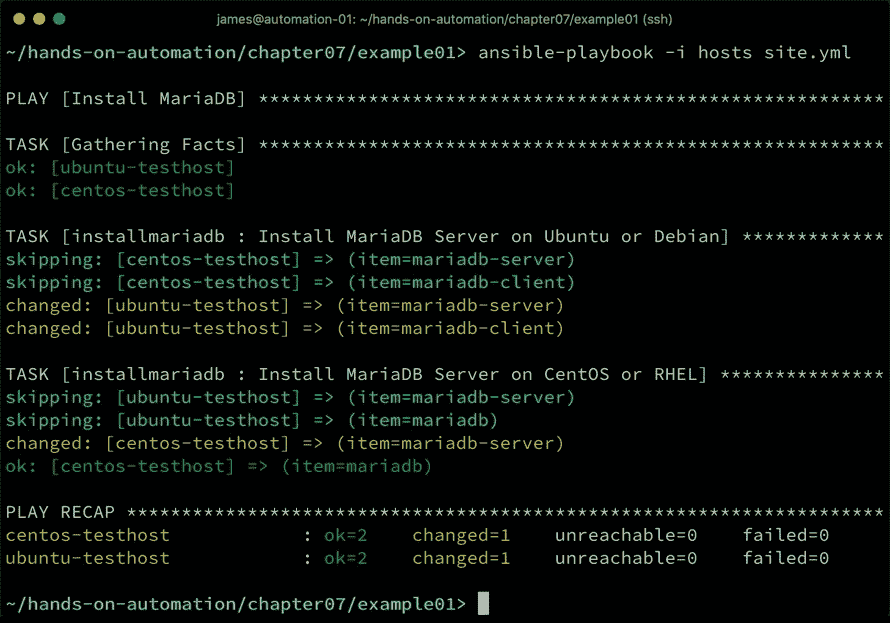
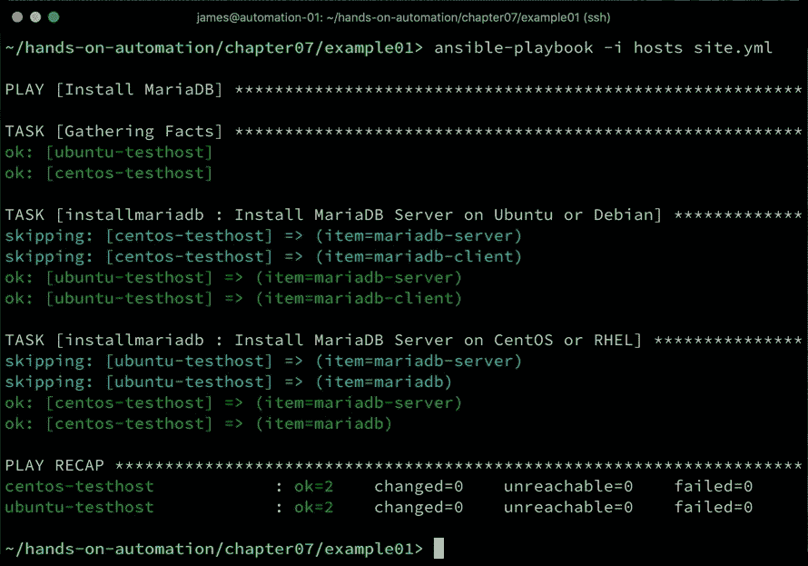
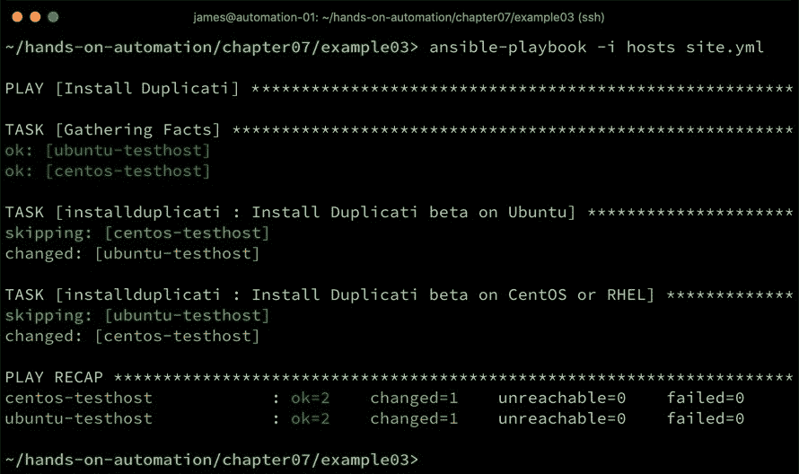
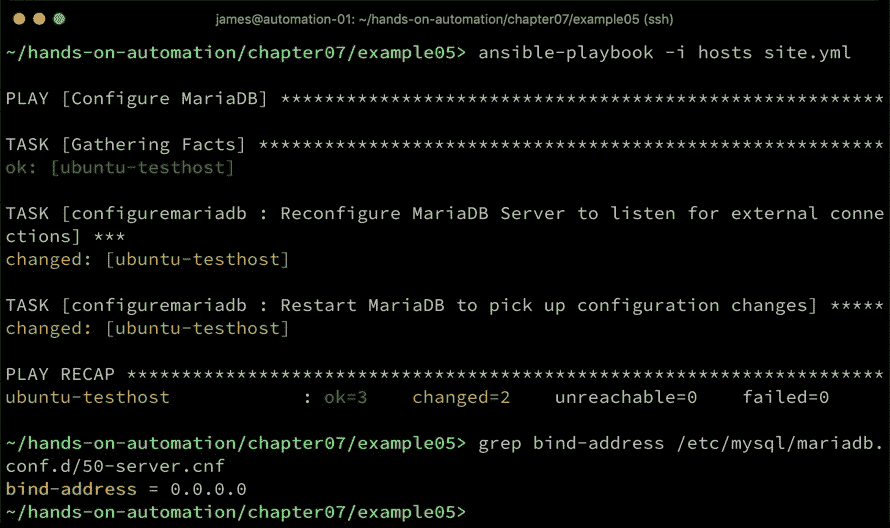
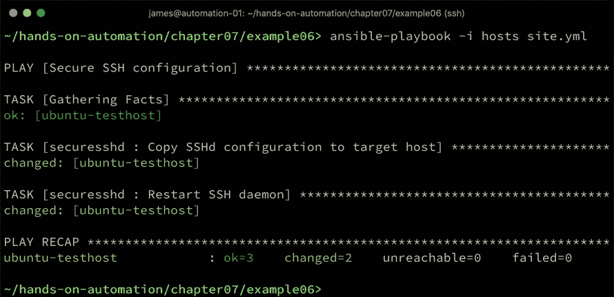
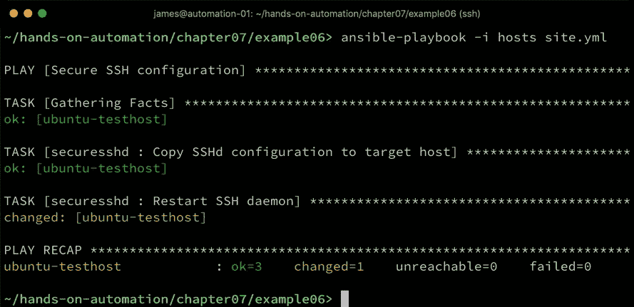
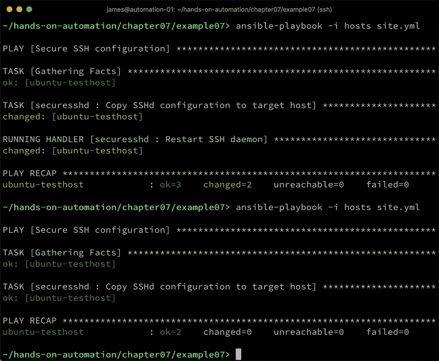
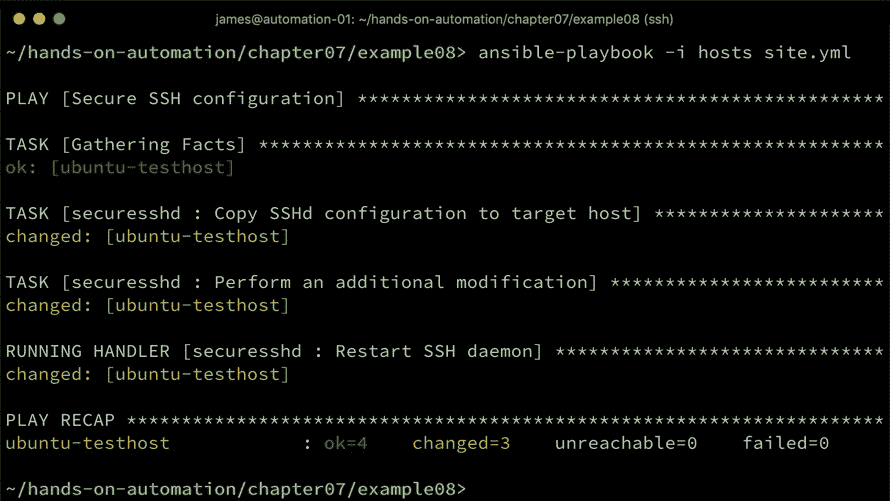
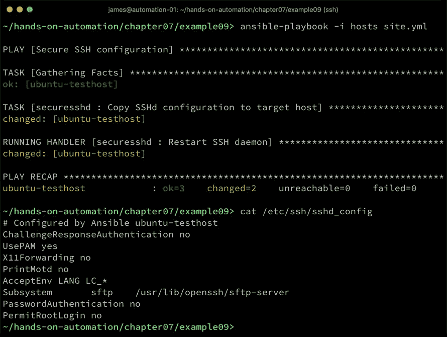
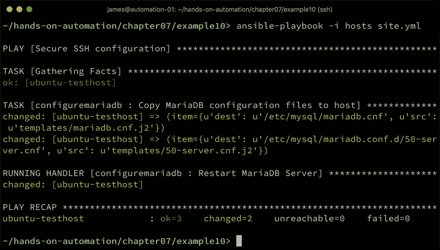

# 第七章：使用 Ansible 进行配置管理

到目前为止，在本书中，我们已经为我们的企业 Linux 基础设施建立了一个坚实的框架，这个框架非常适合企业中的大规模部署，并且可以在这种规模下使用 Ansible 进行自动化管理。在本章中，我们将深入探讨这一基础设施的自动化管理方面，从软件包的安装和配置开始。

几乎在每个企业中，几乎可以肯定在标准化 Linux 系统的生命周期内都会需要执行一项任务——服务的安装和配置。这可能仅仅涉及现有系统服务的配置，或者甚至可能是服务本身的安装，然后是后续的配置工作。

在本章中，我们将探讨以下主题，以深入了解 Ansible 配置管理：

+   安装新软件

+   使用 Ansible 进行配置更改

+   在企业规模上管理配置

# 技术要求

本章包括基于以下技术的示例：

+   Ubuntu Server 18.04 LTS

+   CentOS 7.6

+   Ansible 2.8

为了运行这些示例，你需要访问两台服务器或虚拟机，每台运行一个操作系统，并且需要安装 Ansible。请注意，本章给出的示例可能具有破坏性（例如，它们会安装和卸载软件包并修改服务器配置），如果按原样运行，这些示例仅适用于在隔离的测试环境中执行。

一旦你确信你拥有一个安全的操作环境，我们就开始学习如何使用 Ansible 安装新的软件包。

本章讨论的所有示例代码可以从 GitHub 获取，网址为：[`github.com/PacktPublishing/Hands-On-Enterprise-Automation-on-Linux/tree/master/chapter07`](https://github.com/PacktPublishing/Hands-On-Enterprise-Automation-on-Linux/tree/master/chapter07)。

# 安装新软件

根据你的需求，可能你的 SOE 操作系统构建已经安装了足够的软件，仅需要配置工作。然而，对于许多人来说，情况可能并非如此，因此我们将以软件安装部分开始本章内容。就像我们到目前为止做的所有工作一样，我们希望我们在这里做的任何事情都是可重复的，并且适合自动化，因此，即使需要新的软件，也希望我们不通过手动安装它。

让我们从最简单的情况开始——安装一个本地操作系统软件包。

# 从操作系统默认的仓库中安装软件包

假设你正在推出一个新服务，需要一个数据库服务器——例如 MariaDB。你不太可能在所有 SOE 镜像中都已安装并启用了 MariaDB，因此，在做任何其他事情之前，第一项任务将是安装该软件包。

本书中的两个示例操作系统（实际上，许多衍生版本也如此）都包含了 MariaDB 的本地包，因此我们可以轻松使用这些包。至于包安装，当然，需要了解我们的目标操作系统背后发生的事情。例如，在 Ubuntu 上，我们知道通常会通过 APT 包管理器来安装选定的软件。因此，如果我们想手动安装它，包括用于管理的匹配客户端，我们会发出以下命令：

```
# sudo apt install mariadb-server mariadb-client
```

当然，在 CentOS 上，情况完全不同——尽管 MariaDB 有可用的包，但安装它们的命令将是以下命令：

```
# sudo yum install mariadb mariadb-server
```

尽管 Ansible 可以自动化很多企业 Linux 的需求，但它不能抽象掉不同 Linux 操作系统之间的一些根本差异。然而，幸运的是，Ansible 使得其他一切都变得相当简单。考虑以下清单：

```
[servers]
ubuntu-testhost
centos-testhost
```

在本书中，我们一直倡导构建标准操作环境，因此这个清单在实际生活中不太可能出现——然而，它在这里作为一个很好的示例，因为我们可以展示如何在两个不同的平台上安装 MariaDB 服务器。像本书中的早期示例一样，我们将通过使用角色来完成这个任务。

基于我们在本书前面关于模板的工作，考虑以下角色：

```
---
- name: Install MariaDB Server on Ubuntu or Debian
  apt:
    name: "{{ item }}"
    state: present
  loop:
    - mariadb-server
    - mariadb-client
  when: ansible_distribution == 'Debian' or ansible_distribution == 'Ubuntu'

- name: Install MariaDB Server on CentOS or RHEL
  yum:
    name: "{{ item }}"
    state: present
  loop:
    - mariadb-server
    - mariadb
  when: ansible_distribution == 'CentOS' or ansible_distribution == 'Red Hat Enterprise Linux'
```

这个打包好的角色将在 Ubuntu 和 CentOS 上（如果需要，也可以在**Red Hat Enterprise Linux**（**RHEL**）和 Debian 上）正确运行，并考虑到了不同的包管理器和不同的包名称。当然，如果你幸运地拥有一个完全统一的环境（例如，只有基于 Ubuntu Server 的环境），那么代码可以进一步简化。

有一个名为`package`的 Ansible 模块，它会根据执行 Playbook 的操作系统尝试检测正确的包管理器。尽管这消除了之前我们使用的基于 yum 和 apt 的任务的需求，但你仍然需要考虑不同 Linux 操作系统之间包命名的差异，因此你可能仍然需要使用`when`条件。

我们将定义一个简单的 Playbook 来调用角色，如下所示：

```
---
- name: Install MariaDB
  hosts: all
  become: yes

  roles:
    - installmariadb
```

现在，我们可以运行 Playbook 并观察发生了什么，如下所示：



从前面的输出中，你可以看到与每个系统无关的任务被跳过，而我们想要的包成功安装后返回了`changed`状态。此外，注意到在我们 CentOS 测试系统上安装名为`mariadb`的 MariaDB 客户端包时，任务状态返回了`ok`。这是因为在我们的`role`中定义的`loop`会逐个遍历每个列出的包并安装它；在 CentOS 中，`mariadb`包是`mariadb-server`包的依赖，因此在执行该任务时，它也被安装了。

尽管手动指定这点看起来可能是多余的，但它对我们在角色中保留它没有坏处，因为它确保无论发生什么，客户端包都会存在。这也是一种自我文档化的方式——几年后，某人可能会回到这个 playbook 并理解无论如何，MariaDB 客户端和服务器包都是必需的，即使他们不知道 CentOS 7 操作系统的这一细节。

在继续构建这个示例之前，关于包移除的一点说明。正如我们之前讨论过的那样，Ansible 任务是幂等的。例如，如果我们第二次运行我们的 playbook，我们会看到返回的结果都是`ok`。在下面的例子中，Ansible 已检测到我们选择的包已经安装，并且不会尝试第二次安装：



然而，如果你需要整理一些东西呢？也许一个标准镜像中包含的包已经过时或者由于安全原因需要删除。在这种情况下，单纯删除 playbook 或角色并不足够。虽然我们示例中的角色确保了包的安装，但删除角色并不会撤销这个过程。简而言之，如果不再需要这些包，我们必须手动卸载或移除更改。撤销我们的安装将需要如下的角色：

```
---
- name: Uninstall MariaDB Server on Ubuntu or Debian
  apt:
    name: "{{ item }}"
    state: absent
  loop:
    - mariadb-server
    - mariadb-client
  when: ansible_distribution == 'Debian' or ansible_distribution == 'Ubuntu'

- name: Uninstall MariaDB Server on CentOS or RHEL
  yum:
    name: "{{ item }}"
    state: absent
  loop:
    - mariadb-server
    - mariadb
  when: ansible_distribution == 'CentOS' or ansible_distribution == 'Red Hat Enterprise Linux'
```

请注意，角色几乎完全相同，唯一的区别是我们现在使用的是`state: absent`而不是`state: present`。这在大多数你可能运行的 Ansible 任务中是常见的——如果你想定义一个过程来撤销或以其他方式恢复更改，你需要单独编写。现在，当我们通过适当的 playbook 调用上述角色时，我们可以看到包被干净地卸载，如下图所示：



当然，有时我们想要安装的包并不包含在默认的操作系统包仓库中。

在接下来的部分，我们将讨论如何根据我们目前设定的自动化原则来处理这个问题。

# 安装非原生包

幸运的是，使用 Ansible 安装非本地软件包并不比安装本地软件包更难。理想情况下，在企业环境中，所有所需的软件包都会通过内部仓库提供，实际上我们会在本书后面介绍这一点。在这个例子中，企业仓库将与 Ansible 角色一起使用，类似于前一节中提到的那些。

然而，偶尔这可能不可行或不希望如此。例如，考虑一个开发或测试系统，在这里正在评估一个新软件包——在这种情况下，你可能不希望将一个测试包上传到企业仓库服务器，特别是当尚不清楚是否会有持续使用该软件包的需求时。尽管如此，我们仍希望遵循自动化的原则，确保我们以可重复、自动文档化的方式进行测试。

假设你正在为企业评估 Duplicati 备份软件，并需要安装最新的测试版进行一些测试。显然，你可以从他们的发布页面手动下载这个版本，复制到目标服务器，然后手动安装。然而，这种方式效率低下，显然也不是可重复的过程。幸运的是，我们之前使用的 `apt` 和 `yum` 模块支持从本地路径和远程 URL 安装软件包。

因此，要测试 Duplicati 测试版 2.0.4.23 的安装，你可以编写如下角色：

```
---
- name: Install Duplicati beta on Ubuntu
  apt:
    deb: https://github.com/duplicati/duplicati/releases/download/v2.0.4.23-2.0.4.23_beta_2019-07-14/duplicati_2.0.4.23-1_all.deb
  when: ansible_distribution == 'Debian' or ansible_distribution == 'Ubuntu'

- name: Install Duplicati beta on CentOS or RHEL
  yum:
    name: https://github.com/duplicati/duplicati/releases/download/v2.0.4.23-2.0.4.23_beta_2019-07-14/duplicati-2.0.4.23-2.0.4.23_beta_20190714.noarch.rpm
    state: present
  when: ansible_distribution == 'CentOS' or ansible_distribution == 'Red Hat Enterprise Linux'
```

从这个角色可以看到，安装过程不需要先单独下载软件包，正如以下截图所示：



因此，无论是用于测试还是生产目的，你都可以安装在所选操作系统的默认软件包仓库中不可用的软件包，并保持自动化的好处。在接下来的部分中，我们将探讨 Ansible 如何安装完全没有打包且需要手动安装的软件。

# 安装未打包的软件

当然，有些软件没有 neatly 打包，需要更手动的安装方法。例如，考虑一下托管控制面板软件 **Virtualmin**。在写作本文时，通常需要用户下载一个 shell 脚本并执行它来完成安装。

幸运的是，再一次，Ansible 可以提供帮助——考虑以下角色：

```
---
- name: download virtualmin install script
  get_url:
   url: http://software.virtualmin.com/gpl/scripts/install.sh
   dest: /root/install.sh
   mode: 0755

- name: virtualmin install (takes around 10 mins) you can see progress using: tail -f /root/virtualmin-install.log
  shell: /root/install.sh --force --hostname {{ inventory_hostname }} --minimal --yes
  args:
    chdir: /root
```

在这里，我们使用了 Ansible 的 `get_url` 模块来下载安装脚本，然后使用 `shell` 模块来执行它。还请注意，我们可以将有用的说明添加到任务名称中——虽然这不能替代好的文档，但它非常有帮助，因为它告诉任何运行脚本的人如何使用 `tail` 命令查看安装进度。

注意，`shell` 模块在使用时需要小心——因为它无法知道你给它的 shell 任务是否已经运行过，所以每次运行 playbook 时，它都会执行该命令。因此，如果你第二次运行之前的角色，它会尝试重新安装 Virtualmin。你应该在 `shell` 任务下使用 `when` 子句，以确保它只在特定条件下运行——比如在之前的示例中，当 `/usr/sbin/virtualmin`（由 `install.sh` 安装）不存在时。

这种方法几乎可以扩展到任何你能想象的软件——你甚至可以下载一个源代码 tar 包，提取它并使用一系列 `shell` 模块调用在 Ansible 中构建代码。当然，这种情况不太可能发生，但这里的重点是 Ansible 可以帮助你创建可重复的安装，即使你没有访问 RPM 或 DEB 格式的预打包软件。

通过这种方式，几乎可以安装任何软件——毕竟，软件安装过程就是下载文件（或归档文件）、将其放入正确的位置并进行配置。从本质上讲，`yum` 和 `apt` 等包管理器在幕后做的正是这些工作，Ansible 也能像我们在这里演示的那样处理这类活动。在接下来的章节中，我们将探讨如何使用 Ansible 在已经构建和/或安装了软件的系统上进行配置更改。

# 使用 Ansible 进行配置更改

在配置新服务时，任务很少仅仅通过安装所需的软件就完成。几乎总是需要在安装后进行配置阶段。

让我们详细考虑一些可能需要的基础配置更改示例。

# 使用 Ansible 进行小规模配置更改

在进行配置更改时，`lineinfile` Ansible 模块通常是你的首选工具，能够处理许多可能需要的小规模更改。考虑一下我们在本章早些时候提到的部署 MariaDB 服务器的例子。尽管我们成功安装了软件包，但它们将会以默认配置安装，这不太适用于除最基本使用案例之外的所有情况。

例如，MariaDB 服务器的默认绑定地址是`127.0.0.1`，这意味着无法通过外部应用程序使用我们的 MariaDB 安装。我们已经明确了需要以可靠、可重复的方式进行更改，那么让我们来看看如何使用 Ansible 来更改这个配置。

为了更改这个配置，首先我们需要做的是确定默认配置的位置以及其内容。接下来，我们将定义一个 Ansible 任务来重写配置。

以我们的 Ubuntu 服务器为例，服务的 bind-address 配置在 `/etc/mysql/mariadb.conf.d/50-server.cnf` 文件中——默认指令如下所示：

```
bind-address       = 127.0.0.1
```

因此，为了更改这一点，我们可能会采用一个简单的角色，如下所示：

```
---
- name: Reconfigure MariaDB Server to listen for external connections
  lineinfile:
    path: /etc/mysql/mariadb.conf.d/50-server.cnf
    regexp: '^bind-address\s+='
    line: 'bind-address = 0.0.0.0'
    insertafter: '^\[mysqld\]'
    state: present

- name: Restart MariaDB to pick up configuration changes
  service:
    name: mariadb
    state: restarted
```

让我们详细分解 `lineinfile` 任务并逐步解析：

+   `path`：告诉模块要修改哪个配置文件。

+   `regexp`：用于定位现有的行进行修改，如果该行存在，以免我们最终会有两个冲突的 `bind-address` 指令。

+   `line`：要替换/插入到配置文件中的行。

+   `insertafter`：如果 `regexp` 未匹配（即，文件中没有该行），该指令确保 `lineinfile` 模块将在 `[mysqld]` 声明后插入新行，从而确保它位于文件的正确部分。

+   `state`：将其设置为 `present` 状态可确保该行出现在文件中，即使原始的 `regexp` 没有匹配——在这种情况下，会根据 `line` 的值将一行添加到文件中。

在进行此修改后，我们知道 MariaDB 服务器不会立即生效任何配置更改，除非我们重启它，因此在角色的最后，我们会进行重启。现在，如果我们运行此命令，可以看到它达到了预期效果，如下图所示：



对于像这样的简单配置调整，在少量系统上，这可以精确地实现我们所期望的结果。然而，这种方法也有一些需要解决的缺点，特别是在修改时机以及系统长期完整性方面。即使有最好的自动化策略，手动更改也可能会破坏一致性和标准化，而这些恰恰是良好自动化实践的核心。因此，必须确保未来的剧本运行仍然能够得到预期的最终结果。我们将在下一节中探讨这个问题。

# 保持配置的完整性

以这种方式进行更改的问题在于，它们不具有良好的可扩展性。为生产工作负载调优 MariaDB 服务器通常需要设置六个或更多的参数。因此，我们之前编写的简单角色可能会发展成一堆难以解读的正则表达式和指令，管理起来更是困难。

正则表达式本身并不是万无一失的，它们的效果取决于编写的质量。在我们之前的示例中，我们使用了以下这一行来查找 bind-address 指令，并计划修改它。正则表达式 `^bind-address\s+=` 意味着查找文件中符合以下条件的行：

+   在行首有 bind-address 字面字符串（由 `^` 表示）

+   在 `bind-address` 字面字符串后面留一个或多个空格

+   在这些空格后面加上一个 `=` 符号

这个正则表达式的目的是确保我们忽略如下的注释：

```
#bind-address = 0.0.0.0
```

然而，MariaDB 对其配置文件中的空白符相当宽容，我们在这里定义的正则表达式将无法匹配以下这些有效的排列形式：

```
bind-address=127.0.0.1
 bind-address = 127.0.0.1
```

在这些情况下，由于`regexp`参数没有匹配，我们的角色将会向配置文件中添加一行，内容是`bind-address = 0.0.0.0`指令。由于 MariaDB 将前面的例子视为有效的配置，最终我们会在文件中得到两个配置指令，这可能会导致意外的结果。不同的软件包也会以不同的方式处理这些情况，进一步增加了混淆。还有其他复杂性需要考虑。许多 Linux 服务具有高度复杂的配置，通常将配置拆分到多个文件中以便于管理。我们在测试的 Ubuntu 系统上使用的原生 MariaDB 服务器包的文档中指出了以下内容：

```
# The MariaDB/MySQL tools read configuration files in the following order:
# 1\. "/etc/mysql/mariadb.cnf" (this file) to set global defaults,
# 2\. "/etc/mysql/conf.d/*.cnf" to set global options.
# 3\. "/etc/mysql/mariadb.conf.d/*.cnf" to set MariaDB-only options.
# 4\. "~/.my.cnf" to set user-specific options.
```

然而，这个配置顺序是由`/etc/mysql/mariadb.cnf`文件决定的，该文件的底部有指令包括前面代码块中的第 2 和第 3 行所列的文件。完全有可能有人（无论是好心还是其他）简单地覆盖`/etc/mysql/mariadb.cnf`文件，使用一个新版本，这个新版本删除了这些子目录的包含语句，而是包含了以下内容：

```
[mysqld]
bind-address = 127.0.0.1
```

由于我们的角色使用`lineinfile`完全不知道这个文件，它将忠实地在`/etc/mysql/mariadb.conf.d/50-server.cnf`中设置该参数，而不理解这个配置文件已经不再被引用，结果在服务器上的表现——最多——是不可预测的。

虽然企业自动化的目标是所有系统的变更都应该通过类似 Ansible 的工具集中管理，但现实情况是，你不能总是保证这一点。有时，事情会出错，急于修复问题的人可能会被迫绕过流程以节省时间。同样，不熟悉系统的新员工可能会像我们在这里建议的那样进行更改。

或者，例如，参考我们在第五章《使用 Ansible 构建虚拟机模板以便部署》中提出的 SSH 守护进程配置。这里，我们提出了一个简单的角色（再次在以下代码块中展示，供参考），它将禁用通过 SSH 的 root 登录，这是为 SSH 守护进程推荐的多个安全参数之一：

```
---
- name: Disable root logins over SSH
  lineinfile:
    dest: /etc/ssh/sshd_config
    regexp: "^PermitRootLogin"
    line: "PermitRootLogin no"
    state: present
```

请注意，我们的`regexp`在处理空白字符时与我们的其他角色存在相同的弱点。当`sshd`在其配置文件中有两个重复的参数时，它会将第一个值视为正确的值。因此，如果我知道上面代码块中的角色正在对一个系统运行，我所需要做的就是将这些行放在`/etc/ssh/sshd_config`的*最上面*：

```
# Override Ansible roles
  PermitRootLogin yes
```

因此，我们的 Ansible 角色将忠实地在这台服务器上运行，并报告成功管理了 SSH 守护进程的配置，而实际上，我们已经覆盖了该配置并启用了 root 登录。

这些示例向我们展示了两件事。首先，在处理正则表达式时要非常小心。你越是彻底，特别是在处理空白字符时，效果越好。显然，在理想的世界里，这些工作是不必要的，但像这样的意外变化已经导致许多系统崩溃。为了防止前面提到的 SSH 守护进程示例成为可能，我们可以尝试以下正则表达式：

```
^\s*PermitRootLogin\s+
```

这将考虑`PermitRootLogin`关键字前的零个或多个空格，然后考虑后面一个或多个空格，同时考虑到`sshd`中内建的空白容忍度。然而，正则表达式非常字面化，我们还没有考虑制表符的情况！

最终，这将引导我们到第二个因素——通过这些示例展示的因素——即为了在企业规模上保持配置和系统完整性，并确保对自动化以及其所生成的系统具有高度信心，可能需要另一种配置管理方法。这正是我们在下一节中要探讨的内容——在大型企业规模下可靠地管理配置的技术。

# 在企业规模上管理配置

显然，从这些示例来看，在企业规模上管理配置需要采用另一种方法。在一个控制良好的环境中，对于做少量更改的情况，我们之前讨论的`lineinfile`方法没有问题，但让我们考虑一种更稳健的配置管理方法，更适合大型组织。

我们将从考虑用于简单静态配置更改（即所有服务器都相同的更改）的可扩展方法开始，下一节将详细讨论。

# 进行可扩展的静态配置更改

配置更改至关重要，它们必须是版本控制的、可重复的和可靠的——因此，让我们考虑一种能够实现这一目标的方法。让我们通过重新审视我们的 SSH 守护进程配置来开始一个简单的示例。在大多数服务器上，这可能是静态的，因为诸如限制远程 root 登录和禁用基于密码的登录等要求可能适用于整个系统。同样，SSH 守护进程通常通过一个中央文件配置——`/etc/ssh/sshd_config`。

在 Ubuntu 服务器上，默认配置非常简单，如果去除所有空白字符和注释，仅包含六行。我们来对这个文件做一些修改，禁止远程 root 登录，禁用 `X11Forwarding`，并只允许基于密钥的登录，如下所示：

```
ChallengeResponseAuthentication no
UsePAM yes
X11Forwarding no
PrintMotd no
AcceptEnv LANG LC_*
Subsystem sftp /usr/lib/openssh/sftp-server
PasswordAuthentication no
PermitRootLogin no
```

我们将把这个文件存储在 `roles/` 目录结构中，并通过以下角色任务部署它：

```
---
- name: Copy SSHd configuration to target host
  copy:
    src: files/sshd_config
    dest: /etc/ssh/sshd_config
    owner: root
    group: root
    mode: 0644

- name: Restart SSH daemon
  service:
    name: ssh
    state: restarted
```

在这里，我们使用 Ansible `copy` 模块将我们在角色中创建并存储的 `sshd_config` 文件复制到目标主机，并确保它具有适用于 SSH 守护进程的所有权和模式。最后，我们重启 SSH 守护进程以使更改生效（请注意，这个服务名称在 Ubuntu 服务器上有效，其他 Linux 发行版可能会有所不同）。因此，我们完成的 `roles` 目录结构如下所示：

```
roles/
└── securesshd
    ├── files
    │   └── sshd_config
    └── tasks
        └── main.yml
```

现在，我们可以运行以下命令将配置部署到我们的测试主机：



现在，通过这种方式部署配置相较于我们之前探索的其他方法，具有一些优势，如下所示：

+   该角色本身可以提交到版本控制系统中，从而隐式地将配置文件（位于角色的 `files/` 目录中）纳入版本控制。

+   我们的角色任务非常简单，别人很容易理解这段代码的功能，无需解读正则表达式。

+   无论我们的目标机器配置发生什么变化，尤其是在空白字符或配置格式方面，都不重要。由于我们在部署时直接覆盖文件，因此避免了前一节中讨论的所有陷阱。

+   所有机器的配置都是一致的，不仅在指令上，而且在顺序和格式上都保持一致，从而确保能够轻松审计企业中的配置。

因此，这个角色代表了企业级配置管理的一个重要进步。然而，让我们看看如果第二次对同一主机运行该角色时会发生什么。结果输出可以在以下截图中看到：


从前面的截图中，我们可以看到 Ansible 已确定 SSH 配置文件自上次运行以来没有被修改，因此返回了 `ok` 状态。然而，尽管如此，`Restart SSH daemon` 任务的 `changed` 状态表示 SSH 守护进程已经重启，尽管没有做配置更改。重启系统服务通常会带来中断，因此除非绝对必要，否则应避免重启。在这种情况下，我们希望只有在配置发生更改时才重启 SSH 守护进程。

处理这个问题的推荐方法是使用`handler`。`handler`是 Ansible 中的一种构造，类似于任务，但只有在进行更改时才会被调用。此外，当对配置进行多次更改时，处理程序可能会被多次通知（每次适用的更改一次），但 Ansible 引擎会将所有的处理程序调用批量执行，并且只有在所有任务完成后才会运行处理程序。这确保了在像本例中重启服务时，服务只会重启一次，并且仅在进行更改时重启。让我们现在进行测试，如下所示：

1.  首先，移除角色中的服务重启任务，并添加`notify`子句以通知处理程序（我们稍后将创建该处理程序）。最终的角色任务应如下所示：

```
---
- name: Copy SSHd configuration to target host
  copy:
    src: files/sshd_config
    dest: /etc/ssh/sshd_config
    owner: root
    group: root
    mode: 0644
  notify:
    - Restart SSH daemon
```

1.  现在，我们需要在角色中创建一个`handlers/`目录，并将之前删除的处理程序代码添加到其中，使其看起来如下所示：

```
---
- name: Restart SSH daemon
  service:
    name: ssh
    state: restarted
```

1.  结果，`roles`目录结构现在应如下所示：

```
roles/
└── securesshd
    ├── files
    │   └── sshd_config
    ├── handlers
    │   └── main.yml
    └── tasks
        └── main.yml
```

1.  现在，当我们在同一台服务器上运行剧本两次（并且最初将 SSH 配置恢复到原始配置后），我们看到 SSH 守护进程只有在实际更改配置时才会重新启动，如下图所示：



为了进一步演示处理程序，在我们继续之前，让我们考虑对角色任务的这一改进：

```
---
- name: Copy SSHd configuration to target host
  copy:
    src: files/sshd_config
    dest: /etc/ssh/sshd_config
    owner: root
    group: root
    mode: 0644
  notify:
    - Restart SSH daemon

- name: Perform an additional modification
  lineinfile:
    path: /etc/ssh/sshd_config
    regexp: '^\# Configured by Ansible'
    line: '# Configured by Ansible on {{ inventory_hostname }}'
    insertbefore: BOF
    state: present
  notify:
    - Restart SSH daemon
```

在这里，我们部署配置文件并进行额外的修改。我们在文件的开头添加了一个注释，注释中包括一个 Ansible 变量，包含目标主机的主机名。

这将导致我们的目标主机上有两个更改的状态，但是，如果我们恢复到默认的 SSH 守护进程配置，然后运行新的剧本，我们会看到如下结果：



仔细查看前面的输出和任务执行的顺序。你会注意到处理程序并不是按顺序执行的，实际上它只会在剧本结束时执行一次。

尽管我们的任务发生了变化，因此会通知处理程序两次，但处理程序仅在剧本运行结束时执行，从而最小化了重启次数，正如所要求的那样。

通过这种方式，我们可以在大规模（跨越数百甚至数千台机器）上对静态配置文件进行更改。在接下来的部分，我们将以此为基础，展示如何管理需要动态数据的配置——例如，可能会因主机或组的不同而变化的配置参数。

# 进行可扩展的动态配置更改

尽管前面的例子解决了在企业中大规模进行自动化配置更改的许多挑战，但我们的最后一个例子还是显得有些低效。我们部署了一个静态、版本控制的配置文件，并再次使用`lineinfile`模块对其进行更改。

这使我们能够将 Ansible 变量插入到文件中，在许多情况下，这非常有用，尤其是在配置更复杂的服务时。然而，这种做法——充其量——是不优雅的，因为它将这个更改分拆到两个任务中。此外，重新使用`lineinfile`模块会再次让我们暴露于我们之前讨论的风险，并且意味着我们需要为每个要插入到配置中的变量创建一个`lineinfile`任务。

幸运的是，Ansible 正是为了解决这个问题而设计的。在这种情况下，Jinja2 模板化的概念为我们提供了帮助。

Jinja2 是一种为 Python 设计的模板语言，非常强大且易于使用。由于 Ansible 几乎完全用 Python 编写，因此它非常适合使用 Jinja2 模板。那么，什么是 Jinja2 模板呢？从最基本的层面来看，它是一个静态配置文件，比如我们之前为 SSH 守护进程部署的文件，但可以进行变量替换。当然，Jinja2 比这更强大——本质上，它是一个独立的语言，拥有常见的语言构造，如`for`循环和`if...elif...else`结构，就像你在其他编程语言中看到的那样。这使得它非常强大和灵活，整个配置文件中的某些部分（例如）可以根据`if`语句的求值情况被省略。

正如你可以想象的那样，Jinja2 完全值得写一本书来详细讲解这个语言——然而，在这里，我们将提供一个实用的 Jinja2 模板化入门，以便在企业的配置管理自动化中使用。

让我们回到之前的 SSH 守护进程示例，假设我们希望将目标主机名放入文件头部的注释中。虽然这是一个人为的例子，但将其从`copy`/`lineinfile`示例推进到单个`template`任务，将展示模板化带来的好处。从这里，我们可以进一步扩展到更全面的示例。首先，让我们为`sshd_config`文件定义我们的 Jinja2 模板，如下所示：

```
# Configured by Ansible {{ inventory_hostname }}
ChallengeResponseAuthentication no
UsePAM yes
X11Forwarding no
PrintMotd no
AcceptEnv LANG LC_*
Subsystem sftp /usr/lib/openssh/sftp-server
PasswordAuthentication no
PermitRootLogin no
```

请注意，该文件与我们之前使用复制模块部署的文件完全相同，只不过现在，我们在文件头部包含了注释，并使用了 Ansible 变量构造（用一对大括号表示）来插入`inventory_hostname`变量。

现在，为了保持理智，我们将这个文件命名为`sshd_config.j2`，以确保我们能区分模板文件和普通的配置文件。模板通常被放置在角色（role）中的`templates/`子目录下，因此像 playbook、角色及任何相关的静态配置文件一样，它们也受到版本控制的管理。

现在，我们不再是先复制静态文件然后通过一个或多个`lineinfile`任务进行替换，而是可以使用 Ansible 的`template`模块来部署这个模板并解析所有 Jinja2 构造。

因此，我们现在的任务看起来是这样的：

```
---
- name: Copy SSHd configuration to target host
  template:
    src: templates/sshd_config.j2
    dest: /etc/ssh/sshd_config
    owner: root
    group: root
    mode: 0644
  notify:
    - Restart SSH daemon
```

请注意，这个任务几乎与我们之前的`copy`任务相同，并且我们如之前一样调用了处理程序。

完成的模块目录结构现在如下所示：

```
roles
└── securesshd
    ├── handlers
    │   └── main.yml
    ├── tasks
    │   └── main.yml
    └── templates
        └── sshd_config.j2
```

让我们运行这个并评估结果，结果可以在以下截图中看到：



如图所示，模板已经复制到目标主机，头部注释中的变量已被处理并替换为适当的值。

当我们的配置变得越来越复杂时，这将变得非常强大，因为无论模板多么庞大复杂，角色仍然只需要一个`template`任务。回到我们的 MariaDB 服务器，假设我们想要在每个服务器上设置一些参数，以适应我们正在部署的不同工作负载。也许我们想设置以下参数：

+   服务器绑定地址，由`bind-address`定义

+   最大二进制日志大小，由`max_binlog_size`定义

+   MariaDB 监听的 TCP 端口，由`port`定义

所有这些参数都在`/etc/mysql/mariadb.conf.d/50-server.cnf`中定义。然而，正如之前讨论的那样，我们还需要确保`/etc/mysql/mariadb.cnf`的完整性，以确保它包括此文件（以及其他文件），以减少有人覆盖我们配置的可能性。让我们开始构建我们的模板——首先是一个简化版的`50-server.cnf`文件，带有一些变量替换。该文件的第一部分如以下代码所示——请注意`port`和`bind-address`参数，现在使用 Ansible 变量定义，按惯例用成对的大括号表示：

```
[server]
[mysqld]
user = mysql
pid-file = /var/run/mysqld/mysqld.pid
socket = /var/run/mysqld/mysqld.sock
port = {{ mariadb_port }}
basedir = /usr
datadir = /var/lib/mysql
tmpdir = /tmp
lc-messages-dir = /usr/share/mysql
skip-external-locking
bind-address = {{ mariadb_bind_address }}
```

该文件的第二部分如下所示——在这里你将看到`mariadb_max_binlog_size`变量的存在，而所有其他参数保持静态：

```
key_buffer_size = 16M
max_allowed_packet = 16M
thread_stack = 192K
thread_cache_size = 8
myisam_recover_options = BACKUP
query_cache_limit = 1M
query_cache_size = 16M
log_error = /var/log/mysql/error.log
expire_logs_days = 10
max_binlog_size = {{ mariadb_max_binlog_size }}
character-set-server = utf8mb4
collation-server = utf8mb4_general_ci
[embedded]
[mariadb]
[mariadb-10.1]
```

现在，我们也来添加一个`/etc/mysql/mariadb.cnf`的模板版本，如下所示：

```
[client-server]
!includedir /etc/mysql/conf.d/
!includedir /etc/mysql/mariadb.conf.d/
```

这个文件可能很短，但它有一个非常重要的作用。它是 MariaDB 服务加载时读取的第一个文件，并引用其他要包含的文件或目录。如果我们没有通过 Ansible 来维护这个文件的控制，那么任何具有足够权限的人都可以登录并编辑文件，可能会包含完全不同的配置，完全绕过我们通过 Ansible 定义的配置。每当你通过 Ansible 部署配置时，考虑类似这样的因素非常重要，否则你的配置更改可能会被一个出于善意（或其他原因）的管理员绕过。

模板不一定要包含任何 Jinja2 构造——如果没有变量需要插入，如我们第二个示例中所示，文件将直接原样复制到目标机器。

显然，使用 copy 模块将这个静态配置文件发送到远程服务器会稍微更高效，但这需要两个任务，而我们可以通过一个循环来处理所有的模板，从而只使用一个任务。这样的示例展示在以下代码块中：

```
---
- name: Copy MariaDB configuration files to host
  template:
    src: {{ item.src }}
    dest: {{ item.dest }}
    owner: root
    group: root
    mode: 0644
  loop:
    - { src: 'templates/mariadb.cnf.j2', dest: '/etc/mysql/mariadb.cnf' }
    - { src: 'templates/50-server.cnf.j2', dest: '/etc/mysql/mariadb.conf.d/50-server.cnf' }
  notify:
    - Restart MariaDB Server
```

最后，我们定义一个处理程序来重新启动 MariaDB，如果配置发生了变化，如下所示：

```
---
- name: Restart MariaDB Server
  service:
    name: mariadb
    state: restarted
```

现在，在运行之前，先说一下变量的事。在 Ansible 中，变量可以在多个层次上定义。在这种情况下，由于我们正在为具有不同用途的不同主机应用不同的配置，因此在主机或主机组级别定义变量是有意义的。然而，如果有人忘记在清单中或其他适当的位置放置这些变量会怎样？幸运的是，我们可以利用 Ansible 的变量优先级顺序来让我们受益，并为我们的角色定义默认变量。这些变量的优先级是第二低的，因此几乎总是会被其他地方的设置覆盖，但它们提供了一张安全网，以防它们被意外遗漏。由于我们之前的模板是如此编写，如果变量没有在任何地方定义，配置文件将无效，MariaDB 服务器将拒绝启动——这是我们绝对希望避免的情况。

现在，让我们在我们的角色中定义这些变量的默认值，在`defaults/main.yml`中，如下所示：

```
---
mariadb_bind_address: "127.0.0.1"
mariadb_port: "3306"
mariadb_max_binlog_size: "100M"
```

完成这些后，我们的角色结构应如下所示：

```
roles/
└── configuremariadb
    ├── defaults
    │   └── main.yml
    ├── handlers
    │   └── main.yml
    ├── tasks
    │   └── main.yml
    └── templates
        ├── 50-server.conf.j2
        └── mariadb.cnf.j2
```

当然，我们希望覆盖默认值，因此我们将在我们的清单分组中定义这些变量——这是一个很好的使用清单组的案例。所有执行相同功能的 MariaDB 服务器都将放入一个清单组中，然后为它们分配一组共同的清单变量，从而使它们都接收相同的配置。然而，我们在角色中使用模板意味着我们可以在多种情况下重用这个角色，只需通过变量定义提供不同的配置。我们将为我们的测试主机创建一个看起来像这样的清单：

```
[dbservers]
ubuntu-testhost

[dbservers:vars]
mariadb_port=3307
mariadb_bind_address=0.0.0.0
mariadb_max_binlog_size=250M
```

完成这一切后，我们终于可以运行我们的剧本并观察发生了什么。结果显示在以下屏幕截图中：



在成功运行之后，我们展示了一个完整的端到端示例，演示了如何在企业规模上管理配置，同时避免常规表达式替代和多部分配置的陷阱。虽然这些示例很简单，但它们应作为任何精心设计的企业自动化策略的基础，在这种策略中需要进行配置。

# 总结

在企业级 Linux 环境中管理配置充满了陷阱，并且存在配置漂移的潜在风险。这可能是由于好心人造成的，即使是在*修复*场景中，迫切需要做出更改时也会发生。然而，这也可能是那些有恶意意图的人造成的，他们试图规避安全要求。良好的 Ansible 使用，尤其是模板化，能够构建易读、简洁的 playbook，确保配置管理是可靠、可重复、可审计和版本控制的——这也是我们在本书前面所提到的企业自动化实践的基本原则。

在本章中，你获得了通过为 Linux 机器扩展新软件包的实践经验。接着，你学习了如何对这些软件包应用简单的静态配置更改，以及相关的潜在陷阱。最后，你了解了使用 Ansible 管理企业级配置的最佳实践。在下一章中，我们将继续探讨 Pulp 的内部仓库管理。

# 问题

1.  常用的 Ansible 模块有哪些，用于更改配置文件？

1.  Ansible 中的模板化是如何工作的？

1.  在使用 Ansible 进行更改时，为什么必须考虑配置文件的结构？

1.  在进行文件修改时，使用正则表达式存在哪些陷阱？

1.  如果模板中没有变量，它会如何表现？

1.  如何在将配置模板部署到磁盘之前，检查其有效性？

1.  如何使用 Ansible 快速检查 100 台机器的配置，确保其符合已知模板？

# 进一步阅读

+   若要深入了解 Ansible，请参考 *Mastering Ansible, Third Edition*，作者为 *James Freeman* 和 *Jesse Keating*（[`www.packtpub.com/gb/virtualization-and-cloud/mastering-ansible-third-edition`](https://www.packtpub.com/gb/virtualization-and-cloud/mastering-ansible-third-edition)）。
