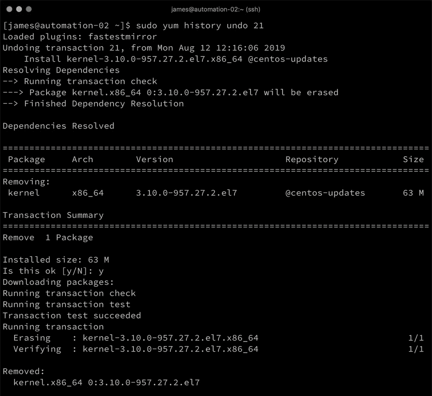

# 第八章：使用 Pulp 进行企业级仓库管理

到目前为止，本书已涵盖了与 Linux 服务器的构建和配置相关的多个任务，旨在用于企业环境中的部署。虽然我们完成的许多工作能够很好地扩展，适用于大多数场景，但必须指出的是，到目前为止，我们只从两种来源之一安装了软件包——要么是与我们使用的每个 Linux 发行版相对应的上游公共软件包仓库，要么是在我们的 PXE 启动章节中，来自我们下载的 ISO 镜像。

不用说，这带来了几个挑战，特别是在创建可重复、可管理的 Linux 构建时。我们将在名为*用于补丁管理的 Pulp 安装*的部分中更深入地探讨这些问题，但可以简单地说，使用公共可用的仓库意味着两次在不同工作日进行的构建可能是不同的！ISO 安装方法则呈现了另一端的情况，总是产生一致的构建，无论何时执行，但在这种情况下，无法接收安全（或其他）更新！需要的是这两者之间的折衷方案，幸运的是，**Pulp** 就是这种折衷方案。

本章将探讨 Pulp，具体内容包括：

+   用于补丁管理的 Pulp 安装

+   在 Pulp 中构建仓库

+   使用 Pulp 的补丁管理过程

# 技术要求

本章包括基于以下技术的示例：

+   Ubuntu Server 18.04 LTS

+   CentOS 7.6

+   Ansible 2.8

要完成这些示例，你将需要访问两台服务器或虚拟机，分别运行前面列出的操作系统之一，并安装 Ansible。请注意，本章提供的示例可能具有破坏性，且如果按原样运行，仅建议在隔离的测试环境中执行。

本章讨论的所有示例代码都可以在 GitHub 上获取，网址为：[`github.com/PacktPublishing/Hands-On-Enterprise-Automation-on-Linux/tree/master/chapter08`](https://github.com/PacktPublishing/Hands-On-Enterprise-Automation-on-Linux/tree/master/chapter08)。

# 用于补丁管理的 Pulp 安装

在我们深入探讨如何安装 Pulp 的实际操作之前，让我们更深入地了解一下为何要使用它。在整本书中，我们一直提倡构建一个标准化的 Linux 环境，并具备高重复性、可审计性和可预测性。这些不仅是自动化的基础，也是在企业中良好的实践。

假设你构建了一台服务器，并用 Ansible 部署了一个新的服务，正如我们在本书前面所描述的那样。到目前为止，一切顺利——Ansible playbook 提供了构建标准的文档，并确保构建在以后能够准确重复。然而，有一个问题。假设几个月后，你需要再创建一台服务器——也许是为了扩展应用程序或进行**灾难恢复**（**DR**）场景。根据你获取软件包的来源，可能会发生以下两种情况：

+   如果你从面向公共互联网的仓库中安装，那么这两个构建将包含在构建时日期安装的所有软件包的最新版本。这种差异可能非常显著，如果你已经投入时间在某个特定 Linux 构建版本上进行测试和验证，使用不同的软件包版本可能无法保证这一点。当然，一切都是最新的，你会得到所有最新的安全补丁和 bug 修复，但每次你在不同的日期执行这个构建时，可能会得到不同的软件包版本。这会导致可重复性问题，尤其是在确保在一个环境中测试过的代码能够在另一个环境中正常工作时。

+   另一端是我们在第六章《使用 PXE 启动进行自定义构建》中使用的 ISO 构建仓库。这些仓库从不变化（除非有人下载了更新的 ISO 并将其覆盖到旧的 ISO 上），因此它虽然生成完全已知数量的构建（从而支持我们的可重复性目标），但它们永远不会收到任何安全更新。这本身可能是一个问题。

妥协的地方，当然是要在这两者之间找到一个中间地带。如果能够创建我们自己的软件包仓库，并且这个仓库是某一时刻公共仓库的快照会怎样？这样，当我们需要它们时，它们保持静态（从而确保构建的一致性），而如果出现重要的安全修复，仍然可以按需更新。Pulp 项目正是为我们解决了这个问题，能够做正是这些事情。它也是一些更复杂的基础设施管理解决方案中的一个组件，例如 Katello，正如我们在下一章中将看到的那样。

然而，对于不需要**图形用户界面**（**GUI**）的安装，Pulp 完全满足我们的需求。让我们来看看如何安装它。

# 安装 Pulp

正如我们在第一章中讨论的*在 Linux 上构建标准操作环境*，在本书中，有时即使您可能已经围绕像 Ubuntu Server 这样的特定 Linux 发行版构建了标准化操作环境，您仍然需要创建一个例外情况。 Pulp 就是这样一个例子，尽管它可以管理`.rpm`和`.deb`软件包（因此可以处理各种 Linux 发行版的存储库要求），但它只针对 CentOS、Fedora 和基于 RHEL 的操作系统打包（因此安装起来最简单）。您仍然可以使用 Pulp 管理您的 Ubuntu Server 环境，只需在 CentOS（或您喜欢的 Red Hat 变体）上安装它。

Pulp 安装有几个方面。例如，Pulp 依赖于 MongoDB 安装，如果需要的话可以是外部的。同样，它还依赖于消息总线，可以根据需要使用 RabbitMQ 或 Qpid。大多数组织将对这些事物有自己的标准，因此你可以根据你企业的需求来定义最适合的架构。在本章中，我们将在单个服务器上执行一个非常简单的 Pulp 安装，以演示涉及的步骤。

鉴于安装 Pulp 的相对复杂性，建议您为 Pulp 安装创建一个 Ansible Playbook。但是，在本章中，我们将完成手动安装，以演示所涉及的工作量——因为没有适合所有情况的 Pulp 安装：

1.  在我们开始安装之前，我们必须构建一个虚拟（或物理）服务器来托管我们的 Pulp 存储库。在我们的示例中，我们将基于 CentOS 7.6 进行操作，这是撰写本文时 Pulp 支持的最新版本。另外，请注意以下文件系统要求：

    +   `/var/lib/mongodb`：我们将在同一主机上使用 MongoDB 构建我们的示例 Pulp 服务器。MongoDB 数据库的大小可以增长到超过 10 GB，并建议将此路径挂载在专用的 LVM 支持的文件系统上，以便在需要时可以轻松扩展，并且如果它真的填满了，不会使系统的其余部分停止工作。

    +   `/var/lib/pulp`：这个目录是 Pulp 存储库的所在地，同样应该在专用的 LVM 支持的文件系统上。其大小将由您希望创建的存储库决定——例如，如果您想要镜像一个 20 GB 的上游存储库，则`/var/lib/pulp`的最小大小应为 20 GB。此文件系统还必须基于 XFS——如果在`ext4`上创建，您可能会用尽索引节点。

1.  满足了这些要求后，我们必须安装 EPEL 存储库，因为 Pulp 安装将从这里获取软件包：

```
$ sudo yum install epel-release
```

1.  然后我们需要安装 Pulp 存储库文件：

```
$ sudo wget -O /etc/yum.repos.d/rhel-pulp.repo https://repos.fedorapeople.org/repos/pulp/pulp/rhel-pulp.repo
```

1.  接下来，我们设置 MongoDB 服务器——这必须在继续进行 Pulp 安装之前完成。预计大多数企业会有一些关于数据库服务器的内部标准，他们会遵循这些标准——在这里，我们将使用带有 SSL 加密的默认安装：

```
$ sudo yum install mongodb-server
```

1.  再次说，公平地讲，大多数企业会有自己的证书授权机构，无论是内部的还是其他的。对于我们的示例服务器，我们将使用以下命令生成一个简单的自签名证书：

```
$ sudo openssl req -x509 -nodes -newkey rsa:4096 -keyout /etc/ssl/mongodb-cert.key -out /etc/ssl/mongodb-cert.crt -days 3650 -subj "/C=GB/CN=pulp.example.com"
```

1.  然后我们需要将私钥和证书合并成一个文件，供 MongoDB 使用：

```
$ sudo cat /etc/ssl/mongodb-cert.key /etc/ssl/mongodb-cert.crt | sudo tee /etc/ssl/mongodb.pem > /dev/null
```

1.  完成此步骤后，我们必须重新配置 MongoDB 以使用新创建的证书文件并启用 SSL。编辑`/etc/mongod.conf`文件，并配置以下参数（文件中的其他参数可以保留默认值）：

```
# Use ssl on configured ports
sslOnNormalPorts = true

# PEM file for ssl
sslPEMKeyFile = /etc/ssl/mongodb.pem
```

1.  在此阶段，我们现在可以启用 MongoDB 服务，使其在启动时自动启动，并启动它：

```
$ sudo systemctl enable mongod.service
$ sudo systemctl restart mongod.service
```

1.  在我们的 Mongo 数据库服务器运行后，我们现在需要安装消息总线。同样，大多数企业会有关于这方面的公司标准，建议遵循这些标准（如果已定义）。以下示例是功能性演示所需的最低步骤——它不应被视为完全安全，但为了测试和评估 Pulp，它是可用的。在这里，我们仅安装所需的包，然后启用并启动服务：

```
$ sudo yum install qpid-cpp-server qpid-cpp-server-linearstore
$ sudo systemctl enable qpidd.service
$ sudo systemctl start qpidd.service
```

1.  完成底层基础设施后，我们现在可以安装 Pulp 本身。初步步骤是安装基础包：

```
$ sudo yum install pulp-server python-gofer-qpid python2-qpid qpid-tools
```

Pulp 采用基于插件的架构来托管它能够提供的各种仓库。写作时，Pulp 能够托管以下内容：

+   +   基于 RPM 的仓库（例如，CentOS、RHEL 和 Fedora）

    +   基于 DEB 的仓库（例如，Debian 和 Ubuntu）

    +   Python 模块（例如，用于镜像 PyPI 内容）

    +   Puppet 清单

    +   Docker 镜像

    +   OSTree 内容

不幸的是，本章没有空间让我们详细讲解所有这些模块——不过可以说，在高层次上，Pulp 在这些不同技术中的运作方式是相同的。无论是处理 Python 模块、Docker 镜像，还是 RPM 包，你都可以创建一个稳定的中央仓库，并且可以进行版本控制，以确保能够维持一个最新的环境，同时又不会失去对该环境中内容的控制。

由于我们的用例是使用 Pulp 提供 Linux 包，我们将安装基于 RPM 和 DEB 的插件：

```
$ sudo yum install pulp-deb-plugins pulp-rpm-plugins
```

1.  安装完 Pulp 后，我们必须配置核心服务。通过编辑`/etc/pulp/server.conf`来执行此操作——大多数默认设置对于我们这样的简单演示来说已经足够——然而，由于我们在 MongoDB 后端启用了 SSL 支持，我们必须告诉 Pulp 服务器我们已经这样做，并禁用 SSL 验证，因为我们使用的是自签名证书。上述文件的`[database]`部分应该如下所示：

```
[database]
ssl: true
verify_ssl: false
```

如果您查看此文件，您会看到可以进行大量配置，所有这些都有文档和注释。具体来说，您可以自定义以下部分：

+   +   `[email]`：默认情况下这是关闭的，但如果您希望 Pulp 服务器发送电子邮件报告，您可以在此进行配置。

    +   `[database]`：在这一部分，我们仅启用了 SSL 支持，但如果数据库在外部服务器上，或者需要更多高级参数，这些都将在此指定。

    +   `[messaging]`：用于不同 Pulp 组件之间的通信，默认的 Qpid 消息代理无需在此进一步配置，但如果您使用 RabbitMQ 和/或启用了身份验证/SSL 支持，则需要在此进行配置。

    +   `[tasks]`：Pulp 可以为不同组件之间的通信和异步任务使用独立的消息代理，后者的代理可以在此配置。由于我们为这两个功能使用了相同的 Qpid 实例，因此此示例中无需进一步配置。

    +   `[server]`：用于配置服务器的默认凭据、主机名等。

1.  配置完 Pulp 服务器后，我们必须使用以下两条命令生成 Pulp 的 RSA 密钥对和 CA 证书：

```
$ sudo pulp-gen-key-pair
$ sudo pulp-gen-ca-certificate
```

1.  Pulp 使用 Apache 来提供其 HTTP(S) 内容，因此我们必须进行配置。首先，我们通过运行以下命令初始化后台数据库（注意它是以`apache`用户身份运行的）：

```
$ sudo -u apache pulp-manage-db
```

1.  如果您打算在 Apache 中使用 SSL 传输，请确保根据您的企业要求进行配置。CentOS 默认为 Apache SSL 安装了自签名证书，但您可能想用企业 CA 签发的证书替换它。此外，务必禁用不安全的 SSL 协议——至少建议将以下两个设置添加到`/etc/httpd/conf.d/ssl.conf`中：

```
SSLProtocol all -SSLv2 -SSLv3

SSLCipherSuite HIGH:3DES:!aNULL:!MD5:!SEED:!IDEA
```

当然，这只是一个指南，大多数企业会有自己的安全标准，必须遵守这些标准。

随着新漏洞的发现，这些要求可能会发生变化。上述配置在写作时被认为是最佳实践，但可能会随时发生变化，恕不另行通知。您有责任检查您环境中的所有安全相关设置。

1.  配置完 Apache 后，设置它在启动时自动启动并启动它：

```
$ sudo systemctl enable httpd.service
$ sudo systemctl start httpd.service
```

1.  Pulp 还有其他一些后台服务，启动这些服务是其正常运行所必需的。每个服务都可以根据需要进行配置和调整，但再次说明，为了我们的示例服务器，依次启用并启动每个服务就足够了：

```
$ sudo systemctl enable pulp_workers.service
$ sudo systemctl start pulp_workers.service

$ sudo systemctl enable pulp_celerybeat.service
$ sudo systemctl start pulp_celerybeat.service

$ sudo systemctl enable pulp_resource_manager.service
$ sudo systemctl start pulp_resource_manager.service
```

1.  我们的最终任务是安装 Pulp 的管理组件，以便我们能够管理我们的服务器：

```
$ sudo yum install pulp-admin-client pulp-rpm-admin-extensions pulp-deb-admin-extensions
```

1.  对于我们的服务器，还有一个最后的任务需要完成。Pulp 设计为远程管理，因此它通过 SSL 进行通信，以确保所有交易的安全性。尽管我们创建了一个*一体化*主机，并且在本章中将从同一主机执行服务器管理，但我们需要告诉 Pulp 管理员客户端我们正在使用自签名证书——否则 SSL 验证将失败。为此，编辑`/etc/pulp/admin/admin.conf`，并在`[server]`部分定义以下参数：

```
verify_ssl: False
```

1.  最后，我们可以通过登录到 Pulp 服务器来测试它是否正常运行。虽然 Pulp 支持多个用户账户，甚至与 LDAP 后端的集成，但像我们这样简单的安装只提供一个管理员账户，其中用户名和密码均为`admin`。

如果一切顺利，你应该能看到类似于以下的输出，并能够查询服务器状态（请注意，输出已被截断以节省空间）：


现在，我们已经有了一个完全可操作的 Pulp 服务器，我们将展示如何使用我们新建的 Pulp 系统创建用于管理稳定更新和系统构建的仓库。

# 在 Pulp 中构建仓库

虽然在本章中我们只会使用 Pulp 中可用功能的一个子集，但我们希望展示一个可行的工作流，展示为什么你可能会选择 Pulp 来管理企业仓库，而不是自己开发解决方案（例如，像我们在第六章中所做的那样，*使用 PXE 启动进行自定义构建*）。

处理基于 RPM 的软件包仓库和基于 DEB 的软件包仓库的过程大致相似。

让我们从探索如何创建和管理基于 RPM 的仓库开始。

# 在 Pulp 中构建基于 RPM 的仓库

尽管安装 Pulp 的过程相当复杂，但一旦安装完成，管理仓库的过程就非常简单。不过，这确实需要了解你所选择的 Linux 发行版的仓库结构。让我们继续使用本书中一直作为示例的 CentOS 7 版本。

核心的 CentOS 7 仓库分为两部分——首先是 OS 仓库；它包含 CentOS 7 最新点版本的所有文件——截至写作时，最新版本是 7.6。该版本在 2018 年 11 月更新过一次，并将在 CentOS 7.7 发布之前保持静态状态。此版本的更新将包含在一个单独的仓库中，因此，要在我们的 Pulp 服务器上构建一个完整的 CentOS 7 镜像，我们需要镜像这两个路径。

让我们从创建基础操作系统的镜像开始：

1.  第一步是登录到`pulp-admin`客户端，正如我们在上一节的结尾所展示的。然后，在此基础上，我们运行以下命令来创建一个新的仓库：

```
$ pulp-admin rpm repo create --repo-id='centos76-os' --relative-url='centos76-os' --feed=http://mirror.centos.org/centos/7/os/x86_64/
```

让我们来拆解一下这个命令：

+   +   `rpm repo create`：这组关键字告诉 Pulp 服务器创建一个新的基于 RPM 的仓库定义。请注意，在此阶段并不会同步或发布任何内容——这只是为新仓库创建元数据。

    +   `--repo-id='centos76-os'`：这告诉 Pulp 我们的新仓库的 ID 是`centos76-os`——这类似于一个唯一的标识符，应当用来区分你的新仓库与其他仓库。

    +   `--relative-url='centos76-os'`：这指示 Pulp 将仓库发布到何处——基于 RPM 的仓库发布地址为`http(s)://pulp-server-address/pulp/repos/<relative-url>`。

    +   `--feed=http://mirror.centos.org/centos/7/os/x86_64/`：这是将同步 RPM 内容的上游位置。

1.  在创建好我们的仓库定义后，下一步是从上游服务器同步软件包。只需运行以下命令即可：

```
$ pulp-admin rpm repo sync run --repo-id='centos76-os'
```

1.  这将启动一个异步命令，在服务器后台运行——你可以随时使用以下命令检查状态：

```
$ pulp-admin rpm repo sync status --repo-id='centos76-os'
```

1.  最后，一旦同步完成，必须发布该仓库——这实际上是通过 Pulp 安装时配置的 Apache Web 服务器，使同步的内容可以访问：

```
$ pulp-admin rpm repo publish run --repo-id='centos76-os'
```

现在，完成此步骤后，你将拥有由`--feed`参数定义的上游 CentOS 7.6 操作系统仓库的内部快照，即使在 CentOS 7.7 发布时，这个快照也会在我们的 Pulp 服务器上保持不变。

现在，当然，我们还需要更新，以确保获取最新的安全补丁、错误修复等。仓库的更新频率将取决于你的补丁周期、内部安全政策等。因此，我们将定义第二个仓库来存放更新包。

我们将发出一组与之前几乎相同的命令来创建更新仓库，只是这次有两个关键的区别：

+   我们使用`/updates/`路径来获取源内容，而不是`/os/`。

+   我们在`repo-id`和`relative-url`中加入了日期戳——当然，你也可以采用自己的版本控制方案——然而，由于这个仓库将是 2019 年 8 月 7 日之前所有 CentOS 7 更新的快照，使用快照日期作为标识符是一个合理的做法：

```
$ pulp-admin rpm repo create --repo-id='centos7-07aug19' --relative-url='centos7-07aug19' --feed=http://mirror.centos.org/centos/7/updates/x86_64/
$ pulp-admin rpm repo sync run --repo-id='centos7-07aug19'
$ pulp-admin rpm repo publish run --repo-id centos7-07aug19
```

通过运行此命令，我们可以使用`pulp-admin`客户端来检查仓库并查看磁盘使用情况。目前，我们可以看到 Pulp 文件系统已经使用了 33GB 的空间，虽然并不是全部用于 CentOS，因为这个测试系统上还有其他仓库。稍后，这个使用情况将变得重要。

在企业环境中，一个好的做法是构建或更新一组测试用的 CentOS 7 系统到这次 8 月 7 日的快照，并在其上进行必要的测试，以确保对构建的信心。对于物理系统来说，这一点尤其重要，因为内核变更可能会引发问题。一旦建立了对这个构建的信心，它就成为所有 CentOS 7 系统的基准。对于企业场景来说，最棒的一点是，所有系统（只要它们使用 Pulp 仓库）将拥有所有软件包的相同版本。这与我们在本书中讨论的良好自动化实践结合，能为 Linux 环境带来几乎像 Docker 一样的稳定性和平台信心。

基于这个场景，假设过夜发布了一个关键的安全补丁，针对的是 CentOS 7。尽管及时应用这个补丁非常重要，但同样重要的是进行测试，确保它不会破坏任何现有服务。因此，我们不希望更新我们的 `centos7-07aug19` 仓库镜像，因为这是一个已知的稳定快照（换句话说，我们已经测试过它并且满意——它在我们的企业环境中是稳定的）。

如果我们只是使用上游的面向互联网的仓库，那么我们将无法控制这一点，我们的 CentOS 7 服务器会在下一次更新时盲目地获取这个补丁。同样，如果我们手动使用像 `reposync` 这样的工具来构建仓库镜像，我们将有两个选择。首先，我们可以更新现有的镜像，这样我们会节省一些磁盘空间，但这会带来与使用上游仓库相同的问题（即所有服务器在运行更新时都会立刻获取新的补丁）。另外，我们可以创建第二个快照进行测试。我估算，在 Pulp 服务器上镜像 CentOS 7 更新大约需要 16 GB 的磁盘空间，因此创建第二个快照需要大约 32 GB 的磁盘空间。随着时间的推移，更多的快照将需要越来越多的磁盘空间，这显然非常低效。

这正是 Pulp 真正出色的地方——它不仅能够高效地创建和管理基于 RPM 的仓库，而且还知道在同步操作中不下载已存在的包，并且在发布时不会重复包——因此，它在带宽和磁盘使用方面非常高效。基于此，我们可以执行以下命令集来创建一个新的 CentOS 7 更新快照，日期为 8 月 8 日：

```
$ pulp-admin rpm repo create --repo-id='centos7-08aug19' --relative-url='centos7-08aug19' --feed=http://mirror.centos.org/centos/7/updates/x86_64/
$ pulp-admin rpm repo sync run --repo-id='centos7-08aug19'
$ pulp-admin rpm repo publish run --repo-id centos7-08aug19
```

你会发现，这与我们在本节中早些时候运行的命令非常相似，用于创建 2019 年 8 月 7 日的快照——它们实际上是相同的，除了新的仓库 ID（`--repo-id`）和 URL（`--relative-url`），这些参数带有新的日期，用来与我们之前的快照区分开。这个过程将像以前一样运行，如下图所示——看起来所有包都被下载了，在此阶段，几乎没有任何线索说明后台发生了什么：


然而，现在让我们检查一下磁盘使用情况：


在这里，我们可以看到磁盘使用量已被精确到 34GB——如果我们使用更细粒度的测量，可能会发现使用量要少得多。通过这种方式，Pulp 使我们几乎可以根据需要创建快照，而不会消耗大量磁盘空间，同时保持旧的快照以保证稳定性，直到新的快照通过验证，此时可以删除多余的快照。

在这里值得一提的是，从 Pulp 中删除仓库不一定会释放磁盘空间。原因是后台的包去重操作必须小心，避免删除任何仍然需要的包。在我们的例子中，2019 年 8 月 7 日的快照中超过 99%的包也出现在 8 月 8 日的快照中，因此，如果我们删除其中之一，另一个必须保持完好。

在 Pulp 中，这个过程被称为孤立包恢复，它是寻找那些不再属于任何仓库（大概是因为仓库已被删除）并整理它们的过程。

完成我们当前的例子，假设我们测试了 2019 年 8 月 8 日的快照，并且其中更新的包在测试中导致了问题。由此，我们确定该快照不适合生产环境，因此我们将删除它，等待修复发布时创建一个新的快照：

1.  首先，我们必须删除该仓库本身：

```
$ pulp-admin rpm repo delete --repo-id='centos7-08aug19'
```

这将移除仓库定义和 Apache 服务器上的发布 URL，使其不再可用。

1.  要清理任何孤立的包，我们可以执行以下命令：

```
$ pulp-admin orphan remove --all
```

这个命令是一个通用的清理操作，会从整个 Pulp 服务器中移除所有孤立包，是一个很好的常规维护步骤。然而，该命令也可以接受更细粒度的控制，仅移除特定类型的孤立包（例如，你可以清除所有孤立的 RPM 包，但不清除 DEB 包）：


1.  完成此步骤后，我们将看到由新快照占用的额外磁盘空间已被回收：


在本节中，到目前为止，我们已经手动执行了所有 Pulp 命令和活动——这样做是为了让你充分了解设置 Pulp 和相应仓库所需的步骤。在常规服务中，最佳实践是通过 Ansible 来执行这些步骤，然而，目前并没有原生的 Ansible 模块来覆盖我们在本章中执行的所有任务。

例如，`pulp_repo`模块（在 Ansible 2.3 版本中引入）能够创建和删除仓库，就像我们在本章中使用`pulp-admin rpm repo create`所做的那样。然而，它不能执行孤儿清理，因此需要通过`shell`或`command` Ansible 模块来发出此命令。完整的自动化操作将留给你作为练习。

一旦我们的仓库设置完成，最后一步就是在我们的企业 Linux 服务器上使用它们，接下来我们将在本章的下一部分中介绍这一内容。

不过，在此之前，我们将对比管理 Pulp 中的 DEB 包与 RPM 管理之间的一些细节。

# 在 Pulp 中构建基于 DEB 的仓库

虽然 Pulp 的 RPM 仓库插件和 DEB 仓库插件之间在命令行结构上存在一些细微差异，但整体流程是相同的。如同之前一样，创建有效镜像需要一些先前的仓库结构知识。本书中，我们以 Ubuntu Server 18.04 LTS 为例，配置的默认仓库集如下：

+   `bionic`：这是 Ubuntu Server 18.04（代号 Bionic Beaver）发布的基础仓库，和 CentOS 7 的操作系统仓库一样，发布操作系统后不会发生变化。

+   `bionic-security`：这些是针对 bionic 操作系统的安全更新，发布后提供。

+   `bionic-updates`：这些是针对 bionic 操作系统版本的非安全更新。

还有其他仓库，如`backports`，除了`main`组件（我们在这里关注的组件）外，`restricted`、`universe`和`multiverse`组件中也有大量的可用包。深入了解 Ubuntu 仓库结构超出了本书的范围，但可以肯定的是，有大量的文档可供参考。以下链接是了解你可能想要镜像的不同 Ubuntu 仓库的一个好起点：[`wiki.ubuntu.com/SecurityTeam/FAQ#Repositories_and_Updates`](https://wiki.ubuntu.com/SecurityTeam/FAQ#Repositories_and_Updates)。

现在，假设我们正在更新一个最小化构建的 Ubuntu Server 18.04 LTS。在这种情况下，我们只关注`main`组件中的包，但我们确实需要在某个时刻的所有安全修复和更新的快照，就像我们在 CentOS 7 构建中所做的那样：

1.  首先，在确保我们像之前一样登录到`pulp-admin`客户端后，我们将在 Pulp 中为`main`组件和操作系统发布包创建一个仓库：

```
$ pulp-admin deb repo create --repo-id='bionic-amd64-08aug19' --relative-url='bionic-amd64-08aug19' --feed='http://de.archive.ubuntu.com/ubuntu' --releases=bionic --components=main --architectures='amd64' --serve-http=true
```

如你所见，前面的命令与我们的 RPM 仓库创建命令非常相似。我们以与之前相同的方式指定`repo-id`和`relative-url`，并指定上游的`feed` URL。不过，这次我们在命令行选项中指定了 Ubuntu 的`releases`、`components`和`architectures`，而在我们的 CentOS 7 示例中，这些选项是在我们镜像的 URL 中隐含的。除了这些 DEB 特有的配置参数外，我们现在还指定了`--serve-http`选项。默认情况下，Pulp 仅通过 HTTPS 提供所有仓库内容。然而，由于 Pulp 在处理 DEB 包的签名时存在一些限制（将在本章稍后讨论），我们必须启用通过普通 HTTP 提供仓库内容。

请注意，正如`--releases`选项的复数命名所示，这里可以指定多个发布版本。尽管这在仓库创建时有效，但在写作时，同步过程存在问题，因此必须为我们希望镜像的每个 Ubuntu 发布版本创建一个单独的 Pulp 仓库。预计这个问题将在未来某个时候修复。

完成此操作后，我们将为`security`和`updates`仓库创建另外两个仓库：

```
$ pulp-admin deb repo create --repo-id='bionic-security-amd64-08aug19' --relative-url='bionic-security-amd64-08aug19' --feed='http://de.archive.ubuntu.com/ubuntu' --releases=bionic-security --components=main --architectures='amd64' --serve-http=true

$ pulp-admin deb repo create --repo-id='bionic-updates-amd64-08aug19' --relative-url='bionic-updates-amd64-08aug19' --feed='http://de.archive.ubuntu.com/ubuntu' --releases=bionic-updates --components=main --architectures='amd64' --serve-http=true
```

1.  完成了我们的仓库创建后，我们可以像之前一样运行同步过程：

```
$ pulp-admin deb repo sync run --repo-id='bionic-amd64-08aug19'

$ pulp-admin deb repo sync run --repo-id='bionic-security-amd64-08aug19'

$ pulp-admin deb repo sync run --repo-id='bionic-updates-amd64-08aug19'
```

1.  最后，我们发布这些仓库：

```
$ pulp-admin deb repo publish run --repo-id='bionic-amd64-08aug19'

$ pulp-admin deb repo publish run --repo-id='bionic-security-amd64-08aug19'

$ pulp-admin deb repo publish run --repo-id='bionic-updates-amd64-08aug19'
```

值得注意的是，Ubuntu 仓库通常比 CentOS 仓库大，尤其是`updates`和`security`仓库。在同步过程中，软件包会暂时下载到`/var/cache/pulp`，然后再归档到`/var/lib/pulp`目录。如果`/var/cache/pulp`位于你的根文件系统上，存在根文件系统填满的重大风险，因此，最好为此创建一个新卷，并将其挂载到`/var/cache/pulp`，以防磁盘空间不足导致 Pulp 服务器停止运行。

Pulp 的 DEB 插件具有与其 RPM 对应插件相同的软件包去重功能，并且以相同的方式通过 HTTPS（并可选择 HTTP）发布软件包。通过对命令语法进行一些更改，我们可以有效地为大多数企业环境中常见的主要 Linux 发行版创建上游仓库的快照。

完成本节内容后，你已经学会了如何在 Pulp 中为基于 RPM 和 DEB 的内容创建自己的仓库镜像，这些镜像可以视为稳定且不变的，因此为企业中的补丁管理提供了一个优秀的基础。

在本章的下一节中，我们将学习如何将这些仓库部署到两种不同类型的 Linux 服务器上。

# 使用 Pulp 进行补丁处理

本节开始时值得提到的是，Pulp 支持两种主要的方法来分发从其中创建的仓库中的软件包。第一种是基于推送的分发方式，使用一种叫做 **Pulp Consumer** 的工具。

我们不会在本章中探讨这一点，原因如下：

+   Pulp Consumer 仅适用于基于 RPM 的仓库和发行版，目前没有适用于 Ubuntu 或 Debian 的等效客户端。这意味着我们的流程不能在整个企业中统一，在理想情况下，它们应该是统一的。

+   使用 Pulp Consumer 意味着我们将有两种重叠的自动化方式。使用消费者将软件包分发到节点是一个可以通过 Ansible 完成的任务，如果我们使用 Ansible 来执行这个任务，那么我们就有了一种跨平台通用的方法。这支持我们在本书早些时候所建立的企业自动化原则，旨在降低进入门槛、简化使用等。

因此，我们将为管理仓库和更新构建单独的基于 Ansible 的示例，使用前一部分中创建的仓库，名为 *在 Pulp 中构建仓库*。这些可以与所有其他 Ansible playbook 一起管理，并可以通过像 AWX 这样的平台运行，以确保尽可能在所有任务中使用统一的管理界面。

让我们开始吧，看看如何通过结合使用 Ansible 和 Pulp 来修补基于 RPM 的系统。

# 基于 RPM 的 Pulp 补丁

在本章的前一部分，我们为 CentOS 7 构建创建了两个仓库——一个用于操作系统版本，另一个用于存放更新。

从这些仓库更新 CentOS 7 构建的过程，从高层次来看，按照以下步骤进行：

1.  将 `/etc/yum.repos.d` 中的任何现有仓库定义移开，以确保只加载来自 Pulp 服务器的仓库。

1.  使用 Ansible 部署适当的配置。

1.  使用 Ansible 从 Pulp 服务器拉取更新（或任何所需的包），使用新配置进行操作。

在继续创建适当的 playbook 之前，先看看如果我们手动创建仓库定义文件，它在 CentOS 7 机器上的样子。理想情况下，我们希望它看起来像这样：

```
[centos-os]
name=CentOS-os
baseurl=https://pulp.example.com/pulp/repos/centos76-os
gpgcheck=1
gpgkey=file:///etc/pki/rpm-gpg/RPM-GPG-KEY-CentOS-7
sslverify=0

[centos-updates]
name=CentOS-updates
baseurl=https://pulp.example.com/pulp/repos/centos7-07aug19
gpgcheck=1
gpgkey=file:///etc/pki/rpm-gpg/RPM-GPG-KEY-CentOS-7
sslverify=0
```

这个配置没有什么特别之处——我们使用的是之前通过 `pulp-admin` 创建的仓库的 `relative-url`。我们使用 GPG 校验包完整性，并使用 CentOS 7 的 RPM GPG 密钥，我们知道它已经安装在 CentOS 7 机器上。我们唯一需要调整的地方是关闭 SSL 验证，因为我们的示范 Pulp 服务器使用了自签名证书。当然，如果我们使用企业级证书颁发机构，并且每台机器上都安装了 CA 证书，那么这个问题就不复存在。

由于 Ansible 的强大功能，我们可以在做这件事时更加灵活。当我们知道在某个时刻会更新仓库时（至少`baseurl`可能会变化），就没有必要创建和部署静态配置文件了。

我们从创建一个名为`pulpconfig`的角色开始，部署正确的配置——`tasks/main.yml`应该如下所示：

```
---
- name: Create a directory to back up any existing REPO configuration
  file:
    path: /etc/yum.repos.d/originalconfig
    state: directory

- name: Move aside any existing REPO configuration
  shell: mv /etc/yum.repos.d/*.repo /etc/yum.repos.d/originalconfig

- name: Copy across and populate Pulp templated config
  template:
    src: templates/centos-pulp.repo.j2
    dest: /etc/yum.repos.d/centos-pulp.repo
    owner: root
    group: wheel

- name: Clean out yum database
  shell: "yum clean all"
```

随附的`templates/centos-pulp.repo.j2`模板应该如下所示：

```
[centos-os]
name=CentOS-os
baseurl=https://pulp.example.com/pulp/repos/{{ centos_os_relurl }}
gpgcheck=1
gpgkey=file:///etc/pki/rpm-gpg/RPM-GPG-KEY-CentOS-7
sslverify=0

[centos-updates]
name=CentOS-updates
baseurl=https://pulp.example.com/pulp/repos/{{ centos_updates_relurl }}
gpgcheck=1
gpgkey=file:///etc/pki/rpm-gpg/RPM-GPG-KEY-CentOS-7
sslverify=0
```

注意每个`baseurl`行末尾的变量替换——这些替换使我们能够保持相同的模板（对于大多数用途应该是通用的），但随着时间的推移更改仓库 URL 以适应更新。

接下来，我们将定义一个专门用于更新内核的第二个角色——对于我们的示例来说，这将非常简单，`tasks/main.yml`将包含以下内容：

```
---
- name: Update the kernel
  yum:
    name: kernel
    state: latest
```

最后，我们将在剧本结构的顶层定义`site.yml`，将所有这些整合在一起。正如我们之前讨论的那样，我们可以在许多地方定义相对 URL 的变量，但为了本示例的方便，我们将它们放在`site.yml`剧本中：

```
---
- name: Install Pulp repos and update kernel
  hosts: all
  become: yes
  vars:
    centos_os_relurl: "centos76-os"
    centos_updates_relurl: "centos7-07aug19"

  roles:
    - pulpconfig
    - updatekernel
```

现在，如果我们以通常的方式运行它，我们将看到类似以下的输出：


到目前为止，一切顺利——前面的剧本中的`changed`状态告诉我们新配置已成功应用。

眼尖的读者可能已经注意到`清理 yum 数据库`任务中的警告——Ansible 检测到使用了与模块功能重叠的原始 shell 命令，并建议为了重复性和幂等性，最好使用模块。正如我们之前讨论的那样，然而，由于我们希望确保彻底清除任何早期的`yum`数据库（因为它们可能会造成问题），所以我采用了*暴力清理*的方法来清理旧的数据库。

现在，正如你肯定已经发现的，这种方法的一个优点是，如果我们想测试在上一节中创建的`08aug19`仓库快照，我们只需要修改`site.yml`中的`vars:`块，使其看起来像这样：

```
  vars:
    centos_os_relurl: "centos76-os"
    centos_updates_relurl: "centos7-08aug19"
```

因此，我们可以通过仅仅改变一个或两个变量值，在各种场景中重用相同的剧本、角色和模板。在像 AWX 这样的环境中，这些变量甚至可以通过图形界面（GUI）被覆盖，从而使整个过程更加简单。

通过这种方式，将 Ansible 与 Pulp 结合起来，为管理和分发（甚至测试）更新提供了一个非常稳定的企业框架。然而，在我们讨论 Ubuntu 上的这个过程之前，先说几句关于回滚的内容。在上一节中，我们假设了一个例子，其中我们的`08aug19`快照在测试中失败，因此必须删除。就 CentOS 7 服务器而言，回滚并不像简单地安装早期的仓库定义并执行更新那样直接，因为更新将检测到已安装的更新软件包，并不会执行任何操作。

当然，Pulp 仓库提供了一个稳定的基础，可以回滚到之前的版本——然而，回滚通常是一个相当手动的过程，因为你必须在`yum`数据库中找到要回滚的事务 ID，验证将要执行的操作，然后回滚到该版本。当然，如果你有可靠的方法来获取事务 ID，这一过程是可以自动化的。

以下截图展示了一个简单的例子，如何识别我们刚刚自动化的内核更新的事务 ID，并建立执行的更改的详细信息：


然后，如果我们愿意，可以使用以下截图中的命令来回滚事务：



使用这个简单的过程，以及这里提供的 playbook 作为指南，应该能够为任何基于 RPM 的 Linux 发行版建立一个稳固、稳定、自动化的更新平台。

在下一节中，我们将探讨如何使用相同的方法来执行一系列任务，除了像 Ubuntu 这样的基于 DEB 的系统。

# 基于 DEB 的补丁管理与 Pulp

从高层次来看，从我们的 Pulp 服务器上管理 Ubuntu 的更新过程与管理 CentOS 的 RPM 更新过程完全相同（只是我们没有选择使用 Pulp Consumer 的选项，必须使用 Ansible 进行更新过程）。

然而，使用 Pulp 与 Ubuntu 的 APT 仓库系统时，有几个限制：

+   在撰写本文时，存在一个问题，即 Pulp 同步过程无法从上游 Ubuntu 仓库镜像签名密钥。这意味着即使上游仓库中包含`Release.gpg`，它也不会在 Pulp 服务器上镜像。希望未来这个问题能够解决，但在本章中，我们将通过为软件包添加隐式信任来解决这个问题。

+   Ubuntu 上的 HTTPS 支持默认配置为不接受来自不可验证（即自签名）证书的更新。虽然我们可以像在 CentOS 上一样关闭 SSL 验证，但 Ubuntu 的 APT 包管理器随后会寻找一个`InRelease`文件（该文件应包含上述的 GPG 密钥）。正如我们在前面讨论的，Pulp DEB 插件不支持镜像仓库的签名，因此目前唯一的解决方法是使用未加密的 HTTP 流量。希望在未来的版本中，这两个问题能得到解决——然而，截至本文编写时，似乎没有公开的修复或解决方法。

了解了这两个限制后，我们可以为之前创建的仓库集定义我们的 APT 源文件。根据上一节的示例，我们的 `/etc/apt/sources.list` 文件可能如下所示：

```
deb [trusted=yes] http://pulp.example.com/pulp/deb/bionic-amd64-08aug19 bionic main
deb [trusted=yes] http://pulp.example.com/pulp/deb/bionic-security-amd64-08aug19 bionic-security main
deb [trusted=yes] http://pulp.example.com/pulp/deb/bionic-updates-amd64-08aug19 bionic-updates main
```

`[trusted=yes]` 字符串告诉 APT 包管理器忽略缺少包签名的情况。文件结构本身非常简单，因此与我们的 CentOS 示例一样，我们可以创建一个模板文件，以便使用变量填充相对 URL：

1.  首先，我们将创建一个名为 `pulpconfig` 的角色，并创建以下 `templates/sources.list.j2` 模板：

```
deb [trusted=yes] http://pulp.example.com/pulp/deb/{{ ubuntu_os_relurl }} bionic main
deb [trusted=yes] http://pulp.example.com/pulp/deb/{{ ubuntu_security_relurl }} bionic-security main
deb [trusted=yes] http://pulp.example.com/pulp/deb/{{ ubuntu_updates_relurl }} bionic-updates main
```

1.  然后，我们将创建一些任务，使用该角色来安装此模板，并移除任何旧的 APT 配置：

```
---
- name: Create a directory to back up any existing REPO configuration
  file:
    path: /etc/apt/originalconfig
    state: directory

- name: Move existing config into backup directory
  shell: mv /etc/apt/sources.list /etc/apt/originalconfig

- name: Copy across and populate Pulp templated config
  template:
    src: templates/sources.list.j2
    dest: /etc/apt/sources.list
    owner: root
    group: root

- name: Clean out dpkg database
  shell: "apt-get clean"
```

1.  最后，我们将定义一个角色来更新内核，但这次使用 APT：

```
---
- name: Update the kernel
  apt:
    name: linux-generic
    state: latest
```

1.  我们的 `site.yml` Ubuntu 系统的 playbook 现在如下所示——除了变量的不同，几乎与 CentOS 7 的版本完全相同，再次突显了使用 Ansible 作为自动化平台的价值：

```
---
- name: Install Pulp repos and update kernel
  hosts: all
  become: yes
  vars:
    ubuntu_os_relurl: "bionic-amd64-08aug19"
    ubuntu_security_relurl: "bionic-security-amd64-08aug19"
    ubuntu_updates_relurl: "bionic-updates-amd64-08aug19"

  roles:
    - pulpconfig
    - updatekernel
```

1.  现在，整理好这些内容并运行后，我们应该看到类似以下屏幕截图的输出：


摒除当前 Pulp Debian 支持中的安全限制，这为在企业基础设施中以可重复和适合自动化的方式管理 Ubuntu 更新提供了一个简洁且节省空间的解决方案。与我们之前基于 CentOS 的示例一样，通过简单地更改传递给角色的变量定义，测试新快照中的包将变得非常容易。

与 CentOS 一样，如果新的一组软件包不适合用于生产环境，Ansible 使得恢复之前的仓库配置变得简单。然而，在 Ubuntu（以及其他基于 Debian 的发行版）上回滚软件包比我们在上一节中看到的过程要手动得多。幸运的是，`/var/log/dpkg.log` 和 `/var/log/apt/history.log*` 中保存了大量关于软件包事务的历史记录，可以用来确定哪些软件包被安装和/或升级，以及何时进行的。然后，可以使用 `apt-get` 命令，通过 `apt-get install <packagename>=<version>` 语法安装特定版本的软件包。网络上有很多优雅的脚本化解决方案，因此这部分将留给你作为练习，自己决定哪种解决方案最适合你的需求和环境。

# 总结

在企业环境中管理软件包仓库可能会面临许多挑战，尤其是在高效存储、节省互联网带宽和确保构建一致性方面。幸运的是，Pulp 软件包为大多数常见的 Linux 发行版提供了一个优雅的解决方案，并且非常适合在企业环境中的有效管理。

在本章中，你学习了如何安装 Pulp 以开始修补企业 Linux 环境。接着，你通过实践示例学习了如何在 Pulp 中为基于 RPM 和 DEB 的 Linux 发行版构建仓库，并获得了使用 Ansible 部署适当的 Pulp 配置和更新软件包的实用知识。

在下一章中，我们将探索 Katello 软件工具如何在企业环境管理中与 Pulp 相辅相成。

# 问题

1.  为什么要使用 Pulp 创建一个仓库，而不是仅仅创建一个可以手动下载的文件镜像？

1.  在企业环境中构建和测试 Linux 补丁仓库时会遇到哪些问题？

1.  Pulp 需要哪些组件才能运行？

1.  指定成功安装 Pulp 所需的文件系统要求。

1.  如何从你之前创建的 Pulp 仓库修补一个基于 RPM 的系统？

1.  为什么使用 Ansible 从 Pulp 仓库部署补丁，而不是使用 Pulp Consumer？

1.  删除 Pulp 仓库是否释放磁盘空间？如果没有，如何执行此操作？

# 延伸阅读

+   欲了解更多关于 Pulp 项目及如何使用该工具的详细信息，请参考官方文档（[`pulpproject.org/`](https://pulpproject.org/)）。
