# 使用 Katello 进行补丁管理

在第八章，*使用 Pulp 进行企业级仓库管理*中，我们探讨了 Pulp 软件包及其如何用于企业环境中的自动化、可重复、可控的补丁管理。本章将基于此，介绍一个名为 **Katello** 的产品，它是 Pulp 的补充，不仅适用于补丁管理，还能进行完整的基础设施管理。

Katello 是一个以 GUI 驱动的工具，为企业基础设施管理提供先进的解决方案，在许多方面可以看作是许多人熟悉的经典产品 Spacewalk 的继任者。我们将探讨为什么选择 Katello 来进行此项工作，然后通过动手示例展示如何构建 Katello 服务器并进行补丁管理。

本章将具体讨论以下主题：

+   Katello 介绍

+   安装 Katello 服务器

+   使用 Katello 进行补丁管理

# 技术要求

完成本章实践练习的最低要求是一台 CentOS 7 服务器，至少分配 80 GB 硬盘空间，2 个 CPU 核心（虚拟或物理），以及 8 GB 内存。虽然本章仅会查看 Katello 功能的子集，但需要注意，特别是 Foreman（在 Katello 下安装）能够充当 DHCP 服务器、DNS 服务器和 PXE 启动主机，因此如果配置不当，部署到生产网络上可能会造成问题。

因此，建议所有练习在适合测试的隔离网络中进行。给出的 Ansible 代码已经在 Ansible 2.8 中开发并测试过。要进行来自 Katello 的补丁测试，您需要一台 CentOS 7 虚拟机。

本书中讨论的所有示例代码都可以从 GitHub 获取：[`github.com/PacktPublishing/Hands-On-Enterprise-Automation-on-Linux`](https://github.com/PacktPublishing/Hands-On-Enterprise-Automation-on-Linux)。

# Katello 介绍

Katello 并非一个孤立的单一产品，而是多个开源基础设施管理产品的集合，形成一个统一的基础设施管理解决方案。Pulp 专注于有效、可控地存储软件包（以及其他重要的基础设施管理内容），而 Katello 则将以下功能整合在一起：

+   **Foreman**：这是一个开源产品，旨在处理物理和虚拟服务器的配置和配置管理。Foreman 包括一个丰富的基于 Web 的 GUI，一个 RESTful API，以及一个名为 **Hammer** 的 CLI 工具，提供了多种多样的管理方式。它还与多个自动化工具进行集成，最初是 Puppet，最近也支持 Ansible。

+   **Katello**：Katello 实际上是 Foreman 的一个插件，提供了额外的功能，如内容的丰富版本控制（比单独使用 Pulp 更强大）和订阅管理。

+   **Candlepin**：提供软件订阅管理，特别是与**Red Hat 订阅管理**（**RHSM**）模型的集成。虽然在 Pulp 中镜像 Red Hat 的仓库是可行的，但这一过程繁琐，而且由于无法查看你所管理的系统数量或它们与 Red Hat 订阅的关系，存在违反许可条款的风险。

+   **Pulp**：这就是我们在上一章中探讨的 Pulp 软件，现在已整合为一个功能齐全的项目。

+   **Capsule**：一种代理服务，用于在地理位置分散的基础设施中分发内容并控制更新，同时保持单一管理控制台。

因此，使用 Katello 相较于仅使用 Pulp 有几个优势，即使你仅仅将其用于补丁管理（如我们将在本章中“*使用 Katello 进行补丁管理*”部分探讨的），其丰富的 Web GUI、CLI 和 API 使得它能够与企业系统集成。除此之外，Katello（更具体地说，支持它的 Foreman）还提供了许多其他好处，例如能够动态地通过 PXE 启动服务器，并控制容器和虚拟化系统，甚至可以作为你网络的 DNS 和 DHCP 服务器。实际上，可以说 Katello/Foreman 的组合被设计为坐落在你网络的核心，尽管它只会执行你要求的功能，因此已有 DNS 和 DHCP 基础设施的用户无需担心。

值得一提的是，Katello 还与 Puppet 自动化工具紧密集成。最初的项目由 Red Hat 赞助，并且在他们收购 Ansible 之前，Red Hat 与 Puppet 有战略联盟，这使得 Puppet 在 Katello 项目中占据了重要地位（该项目作为 Red Hat Satellite 6 商业化）。鉴于 Ansible 的收购，尽管 Puppet 集成仍然保留在 Katello 中，但通过 Ansible Tower/AWX 与 Ansible 的集成支持发展迅速，用户可以完全根据自己的需求选择使用的自动化工具。

在此阶段，值得一提的是久负盛名的**Spacewalk**软件工具。Spacewalk 是 Red Hat Satellite 5 的上游开源版本，仍在积极开发和维护中。在高级功能方面，这两个系统有很大的重叠；然而，Katello/Satellite 6 是对平台的从头重写，因此两者之间没有明确的升级路径。鉴于 Red Hat 在 Spacewalk 项目中的贡献可能会减少，尤其是在它们停用 Satellite 5 产品后，本书将重点关注 Katello。

事实上，可以公平地说，Katello 配得上一本自己的书，因为它的功能集非常丰富。我们在这一章的目标仅仅是提高对 Katello 平台的认识，并展示它如何在企业环境中进行补丁管理。许多额外的功能，如服务器的 PXE 启动，需要理解我们在本书中已经涵盖的概念，因此希望如果你决定将 Katello 或 Satellite 6 作为管理基础设施的平台，你能够在本书提供的基础上继续构建，并探索更多的资源，进一步深入。

让我们通过下一个部分实际看看如何安装一个简单的独立 Katello 服务器，以便我们能够更全面地探索这一点。

# 安装 Katello 服务器

这是一本实践书籍，因此不再多说，让我们开始动手设置自己的 Katello 服务器。除了之前讨论过的 Katello 优势外，还有一个优势是产品的打包。当我们设置 Pulp 服务器时，有很多独立的组件需要我们做出决策（例如，RabbitMQ 与 Qpid），然后还需要执行额外的设置（例如，为 MongoDB 配置 SSL 传输）。Katello 拥有比 Pulp 更多的*活动组件*（如果将 Pulp 视为 Katello 平台的一个组件的话），因此手动安装它将是一个庞大而复杂的任务。

幸运的是，Katello 提供了一个安装系统，只需几个命令就能让你开始运行，我们将在本章的下一部分进行探讨。

# 准备安装 Katello

Katello 与 Pulp 一样，目前仅支持安装在企业 Linux 7 版本上——因此在这里，我们将使用 CentOS 7 的最新稳定版本。随着产品的不断发展，Katello 的要求时有变化，因此在继续之前，自己查看安装文档总是值得的。撰写本文时，版本 3.12 是最新的稳定版本，安装文档可以在此找到：[`theforeman.org/plugins/katello/3.12/installation/index.html`](https://theforeman.org/plugins/katello/3.12/installation/index.html)。现在，让我们按照这些步骤进行操作：

1.  和以前一样，我们最大的关注点是确保我们分配了足够的磁盘空间，正如独立的 Pulp 安装一样，我们必须确保在`/var/lib/pulp`和`/var/lib/mongodb`中为所有可能希望镜像的 Linux 发行版分配足够的磁盘空间。同样，与 Pulp 一样，它们应该与根卷分开，以确保如果一个卷填满，整个服务器不会崩溃。

1.  文件系统设置好之后，我们的第一步是安装所需的仓库，以便下载所有安装所需的软件包——这需要设置几个外部仓库，这些仓库提供 CentOS 7 默认不包含的软件包。以下命令将为 Katello、Foreman、Puppet 6 和 EPEL 仓库设置仓库，随后才能安装 Foreman 版本包树：

```
$ yum -y localinstall https://fedorapeople.org/groups/katello/releases/yum/3.12/katello/el7/x86_64/katello-repos-latest.rpm
$ yum -y localinstall https://yum.theforeman.org/releases/1.22/el7/x86_64/foreman-release.rpm
$ yum -y localinstall https://yum.puppet.com/puppet6-release-el-7.noarch.rpm
$ yum -y localinstall https://dl.fedoraproject.org/pub/epel/epel-release-latest-7.noarch.rpm
$ yum -y install foreman-release-scl
```

1.  从这里开始，建议将基础系统完全更新：

```
$ yum -y update
```

1.  实际安装之前的最后一步是安装 Katello 包及其依赖项：

```
$ yum -y install katello
```

1.  从这里起，所有安装任务都使用`foreman-installer`命令执行——可以指定大量选项，且对于大多数选项，如果你需要更改决定，可以重新运行安装程序并使用不同的标志，它会在不丢失数据的情况下执行更改。要查看所有可能的选项，运行以下命令：

```
$ foreman-installer --scenario katello --help
```

1.  为了构建我们的演示服务器，默认设置大多数情况下已经足够——然而，如果你探索选项，你会发现许多选项在企业环境中需要特别指定。例如，可以在安装时指定 SSL 证书（而不是依赖于默认生成的自签名证书），可以设置底层传输的默认密钥等。强烈建议你在生产环境中安装时，查看前面命令的输出。现在，我们将发出以下安装命令以启动安装：

```
$ foreman-installer --scenario katello --foreman-initial-admin-password=password --foreman-initial-location='London' --foreman-initial-organization='HandsOn'
```

这可能是安装 Katello 服务器最简单的情况，并且完全适用于本书中的示例。然而，在`生产`环境中，我强烈建议你探索更高级的安装功能，以确保服务器能够满足你的需求，特别是在安全性和可用性方面。这部分留给你自己探索。

请注意，在此场景中，安装程序会检查几个前提条件，包括 Katello 服务器名称的正向和反向 DNS 查找是否能正确解析，以及机器是否有 8 GB 可用内存。如果未满足这些前提条件，安装程序将拒绝继续。

1.  只要满足所有前提条件，Katello 安装应该可以顺利完成，完成后，你应该看到一个类似于以下截图的界面，详细列出了登录信息以及其他相关信息，比如如何为另一个网络设置代理服务器（如果需要的话）：

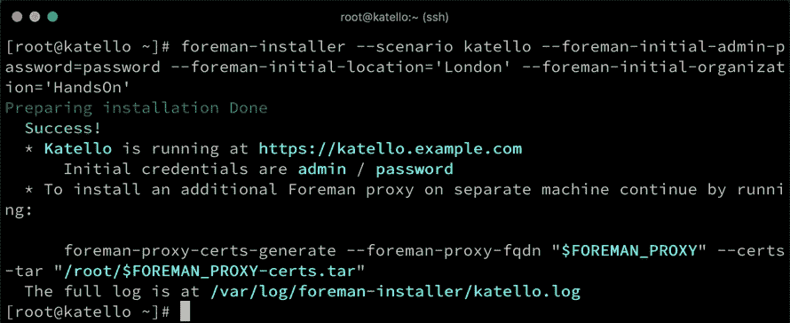

1.  安装程序唯一未完成的任务是设置 CentOS 7 机器上的本地防火墙。幸运的是，Katello 提供了一个包含防火墙服务定义的服务，该服务覆盖了所有可能需要的服务——它的名称来自商业版 Red Hat Satellite 6 产品，可以通过以 root 身份运行以下命令来启用：

```
$ firewall-cmd --permanent --zone=public --add-service=RH-Satellite-6
$ firewall-cmd --reload
```

1.  完成这些步骤后，就可以加载 Katello 的 Web 界面并使用显示的详细信息登录：

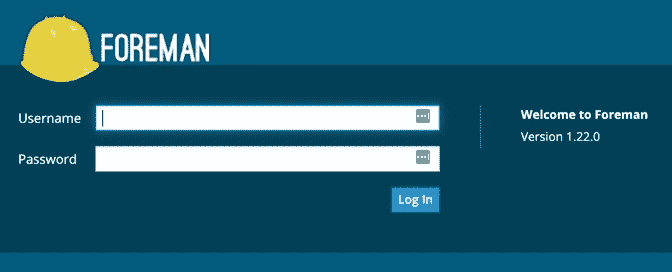

从技术角度讲，Katello 是一个位于 Foreman 之上的模块，提供一些重要功能，我们将在本章稍后查看——例如，它为 Pulp 仓库管理系统提供了一个 Web 界面，该系统也在后台安装。因此，Foreman 的品牌标识非常突出，您会频繁看到该名称。一旦登录，您应该会看到默认的仪表板页面，我们可以开始配置一些用于补丁管理的仓库，这将在下一节中进行。

# 使用 Katello 进行补丁管理

由于 Katello 构建在我们已经探索过的技术之上，例如 Pulp，它带有与我们已知的 DEB 包相关的相同限制。例如，尽管可以在 Katello 中轻松构建 DEB 包的仓库，甚至可以导入适当的 GPG 公钥，但最终发布的仓库不包含 `InRelease` 或 `Release.gpg` 文件，因此必须由所有使用这些仓库的主机隐式信任。类似地，尽管为基于 RPM 的主机提供了完整的订阅管理框架，包括 `subscription-manager` 工具和 Pulp Consumer 代理，但对于 DEB 主机而言，仍然没有类似的工具，因此这些主机必须手动配置。

虽然完全可以将基于 RPM 的主机配置为使用内置技术，但基于 DEB 的主机必须像使用 Pulp 一样通过 Ansible 配置，并且考虑到企业中各环境之间的通用性，建议以相同的方式配置所有服务器，而不是为两种不同的主机类型使用两种不同的解决方案。

Katello 相对于 Pulp 的优势之一，除了 Web 用户界面外，还在于生命周期环境的概念。这个功能承认大多数企业会为不同的用途设置独立的技术环境。例如，您的企业可能会有一个用于开发新软件和测试前沿包的 `Development` 环境，然后是一个用于测试发布的 `Testing` 环境，最后是一个包含最稳定构建并运行客户和客户服务的 `Production` 环境。

现在让我们通过一些实际的例子来探索如何在 Katello 中建立用于补丁管理的仓库。

# 使用 Katello 对基于 RPM 的系统进行补丁管理

让我们考虑使用 Katello 为我们的 CentOS 7 系统在多个生命周期环境中构建仓库。由于 Katello 支持基于密钥的 RPM 验证，我们的第一步是安装 RPM 的 GPG 公钥。该公钥可以从 CentOS 项目免费下载，并且可以在大多数 CentOS 7 系统中找到，路径为 `/etc/pki/rpm-gpg/RPM-GPG-KEY-CentOS-7`：

1.  要将此公钥添加到 Katello，请从菜单栏导航到 Content | Content Credentials。然后，点击 Create Content Credential：

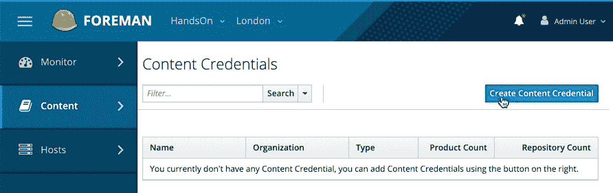

1.  给密钥取个合适的名字，并选择上传密钥文件或将其内容复制粘贴到屏幕上的文本框中。完成后点击 Save：

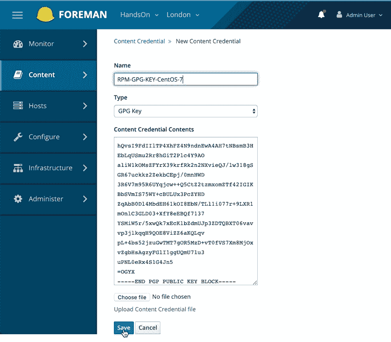

1.  接下来，我们将创建一个 product——在 Katello 中，product 是仓库的逻辑分组，这对于创建可管理的可扩展配置非常有用。对于我们的示例，我们只会镜像 CentOS 7 OS 仓库，但当你开始镜像更新和任何其他相关仓库时，将它们放在同一个产品下是有意义的。从菜单栏导航到 Content | Products，点击 Create Product 按钮：

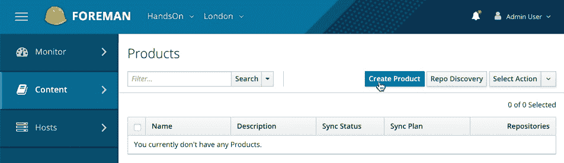

1.  现在，定义高级产品定义—对于一个简单的 CentOS 7 仓库镜像，我们只需创建 Name 和 Label 并关联之前上传的 GPG 密钥。各种 SSL 选项适用于具有双向 SSL 验证的上游仓库。还需注意，所有 products 都可以根据 Sync Plan （本质上是一个计划）进行同步—然而，在本示例中，我们将仅执行手动同步。完成后，屏幕应如下图所示：

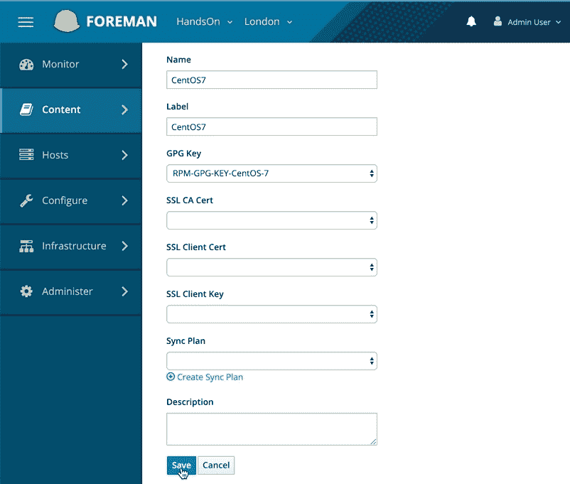

1.  完成高级 product 定义后，我们现在可以通过点击 New Repository 按钮在其下创建我们的 CentOS 7 仓库：

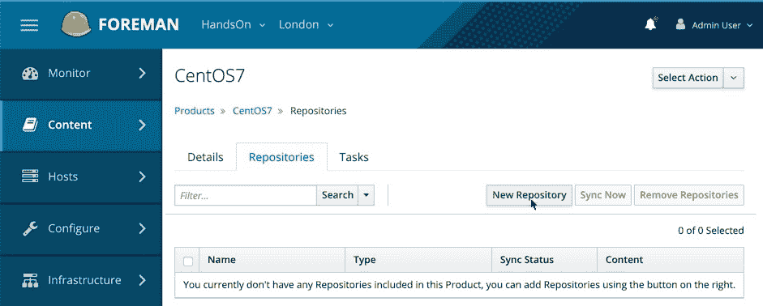

1.  在提供的屏幕上填写仓库详情。将 Type 字段设置为 `yum`，并在相应字段中输入上游仓库的 URL（这与使用命令行中的 Pulp 时的 `--feed` 参数相同）：


1.  向下滚动同一屏幕，确保选中“通过 HTTP 发布”并关联之前上传的 GPG 密钥，如下图所示：

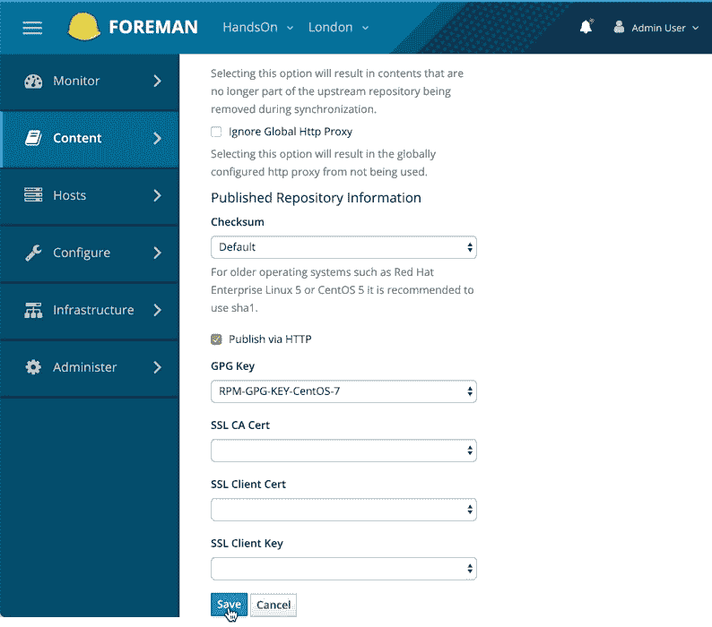

1.  在我们的示例中，我们将立即通过在仓库表格中对其打勾并点击 Sync Now 按钮来启动此仓库的同步，如下图所示：

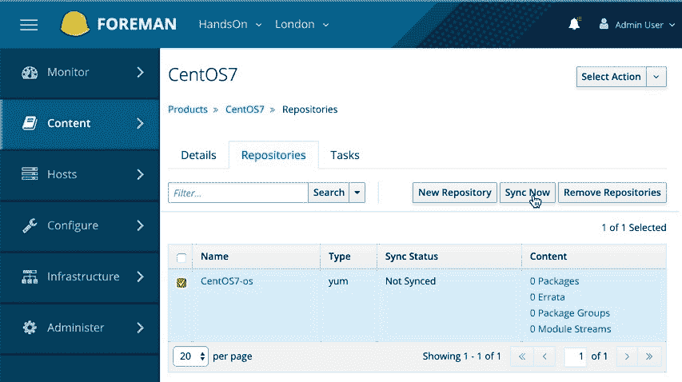

1.  同步会立即在后台开始—你可以随时通过导航到 Content | Sync Status 页面来查看其进度（并启动进一步的手动同步）：

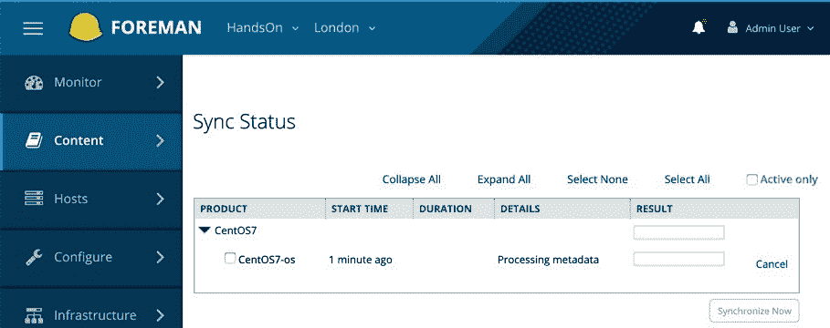

1.  在同步过程完成的同时，我们来创建一些生命周期环境。

请注意，尽管你可以在不同的产品中有独立的仓库，但生命周期环境是全局的，并适用于所有内容。在企业环境中，这很有意义，因为无论使用何种底层技术，你通常都会有`开发`、`测试`和`生产`环境。

从菜单栏中，导航至“内容 | 生命周期环境路径”，然后点击“创建环境路径”按钮：

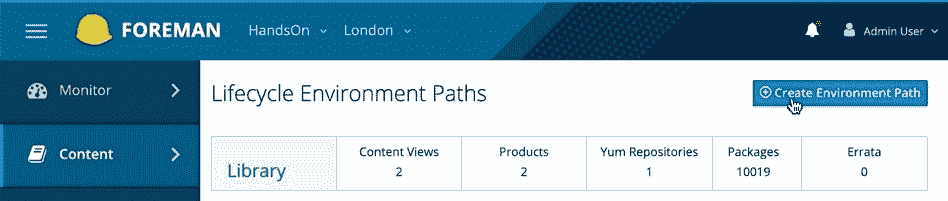

1.  按照屏幕上的指示创建一个名为`开发`的初始环境。你应该看到类似下图所示的界面：

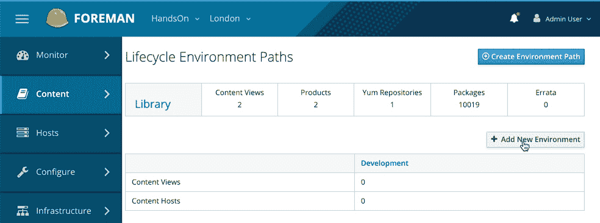

1.  现在，我们将添加`测试`和`生产`环境，使得我们的示例企业能够在这三个环境之间有一个逻辑的流转。点击“添加新环境”按钮，然后依次添加每个环境，确保它们设置了正确的“前置环境”，以保持正确的顺序。下图展示了从`测试`环境创建`生产`环境的一个示例：

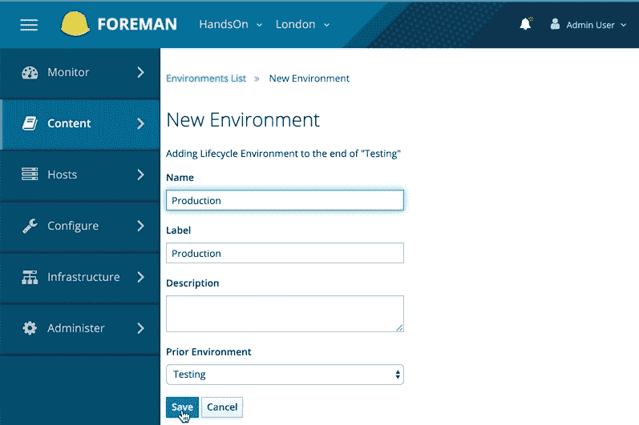

1.  最终配置应该类似下图所示的示例：

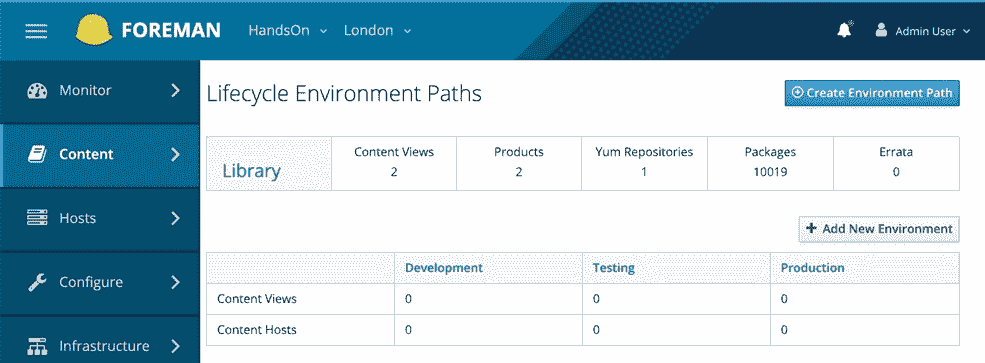

一旦我们的同步过程完成并且环境创建成功，我们就可以进入 RPM 仓库设置的最后部分——`内容视图`。在 Katello 中，内容视图是用户定义的多种内容形式的组合，这些内容可以被摄取、版本控制并分发到指定环境中。通过一个实际的例子来解释最为清晰。

当我们单独使用 Pulp 时，我们创建了一个名为`centos7-07aug19`的仓库。当我们想测试一个稍后发布的更新时，我们创建了一个名为`centos7-08aug19`的第二个仓库。虽然这样做是可行的，并且我们演示了 Pulp 如何去重包并节省磁盘空间，同时整洁地发布看似独立的仓库，但很快你就会看到这种内容管理机制如何在企业规模下变得笨拙，尤其是当有多个环境和管理几个月（或几年）快照时。

这时，`内容视图`派上用场了。尽管我们已经在这里镜像了 CentOS 7 的操作系统仓库，假设我们镜像的是更新仓库。通过使用`内容视图`，我们不需要为测试更新而创建新的产品或仓库。相反，整体工作流程大致如下：

1.  创建一个产品和相应的仓库并执行同步（例如，2019 年 8 月 7 日）。

1.  创建一个包含前一步骤中创建的仓库的内容视图。

1.  在 2019 年 8 月 7 日发布内容视图——这会在该日期为此仓库创建一个版本编号的快照（例如，版本`1.0`）。

1.  将内容视图推广到`Development`环境。进行测试，验证后，将其推广到测试环境。重复此循环，直到达到`Production`环境。所有这些操作都可以异步进行，不影响后续步骤。

1.  在 8 月 8 日，再次同步在*第 1 步*中创建的仓库（如果你通过`Sync Plan`进行自动同步，这将在 8 月 8 日早晨自动完成）。

1.  在 2019 年 8 月 8 日发布内容视图，并进行同步。这将为该日期创建一个`+1`版本的仓库（例如，版本 2.0）。

1.  到此为止，你已经拥有了 8 月 7 日和 8 月 8 日的 CentOS 7 通道的快照。但所有服务器仍然会接收来自 8 月 7 日通道的更新。

1.  将`Development`环境提升至版本 2.0。此时，`Development`环境中的机器会接收（无需额外配置）8 月 8 日的仓库快照。

1.  `Testing`和`Production`环境没有被提升至此版本，因此仍然接收来自 8 月 7 日快照的包。

通过这种方式，Katello 使得在不同环境中管理多个版本（快照）的仓库变得容易，而且每台主机上的仓库配置始终保持不变，从而避免了像我们在 Pulp 中那样通过 Ansible 推送新的仓库信息的需求。

让我们通过一个示例来逐步了解前述过程，演示我们在 Katello 环境中的操作：

1.  首先，为前述过程创建一个新的内容视图。

1.  导航至 Content | Content Views 并点击 Create New View 按钮：

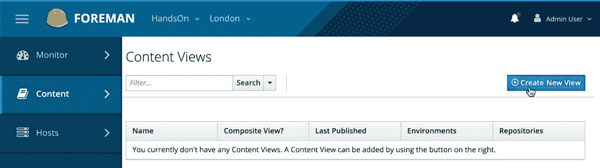

1.  对于我们的目的，新的内容视图只需要一个名称和一个标签，如下图所示：

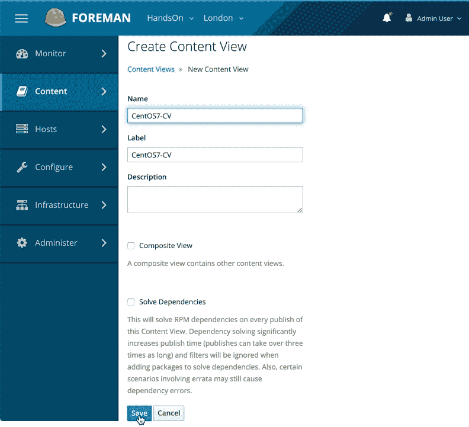

1.  单击保存按钮后，导航到新内容视图中的 Yum Content 标签，并确保选择了 Add 子标签。勾选你想要添加到内容视图的仓库（在我们的简单演示中，只有一个 CentOS 7 仓库，所以选择它），然后点击 Add Repositories 按钮：

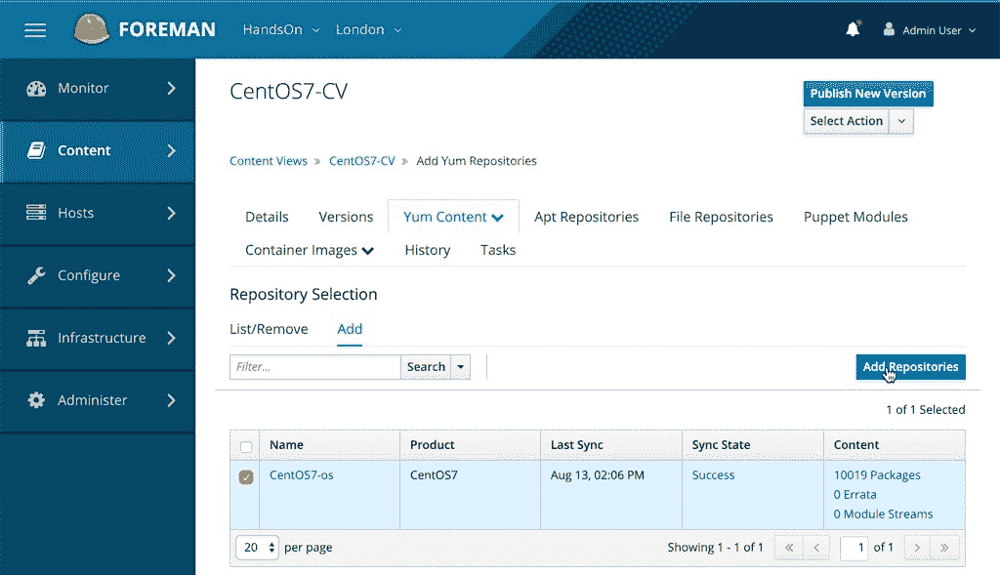

1.  现在，返回到 Versions 标签页并点击 Publish New Version 按钮。这将创建我们之前讨论过的假设 8 月 7 日版本。请注意，`Publish`和`Promote`操作会消耗大量磁盘 I/O，尤其是在慢速机械硬盘阵列上，速度会非常慢。虽然 Katello 和 Red Hat Satellite 6 对 I/O 性能没有发布要求，但它们在闪存存储上表现最佳，或者如果没有这种存储，最好使用快速的机械存储，并且该存储不与其他设备共享。下图展示了点击 Publish New Version 按钮的过程，针对 CentOS7-CV 内容视图：

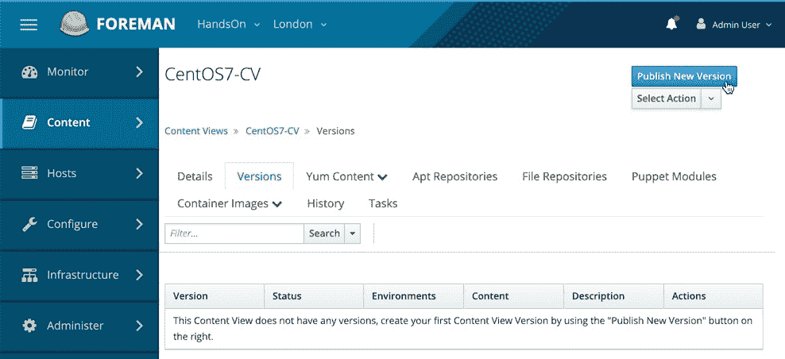

1.  `Publish`操作是异步进行的，你可以在此屏幕上看到它完成，尽管如果你离开，它仍然会继续完成。你会看到它自动编号为`Version 1.0`——这个编号在写作时是自动生成的，你无法选择自己的版本编号。不过，你可以为每个已发布版本添加备注，这对跟踪每个版本的内容以及它们为何被创建非常有用。强烈推荐这样做。下图展示了我们在`Version 1.0`环境中的提升过程：

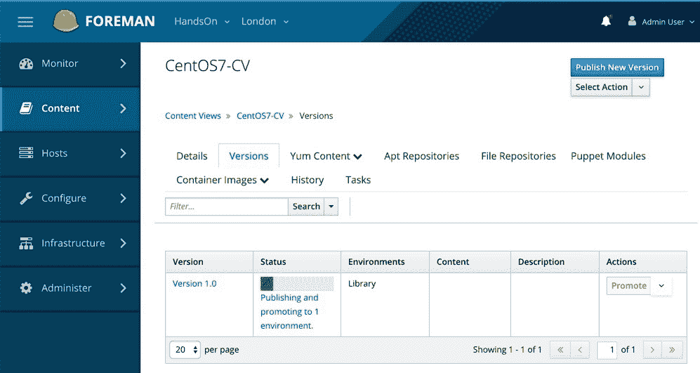

1.  一旦`Publish`操作完成，Promote 按钮（如上图所示为灰显状态）将变为可用。你会注意到，这个版本会自动发布到`Library`环境——任何内容视图的最新版本始终会自动提升到这个环境。

1.  为了模拟我们之前讨论过的 8 月 8 日快照，让我们对这个内容视图执行第二次发布操作。这将生成一个`Version 2.0`环境，然后可以通过点击 Promote 按钮并选择所需的环境，将其提升到`Development`环境。下图展示了我们两个版本的情况，其中`Version 1.0`仅对`Production`环境可用，而`Version 2.0`则对`Development`环境（以及内置的`Library`环境）可用。请注意，由于我们没有将`Testing`环境提升到任何版本，因此`Testing`环境中的机器没有任何包可用。你必须将其提升到所有需要包的环境——下图展示了我们发布的两个版本以及与之关联的环境：

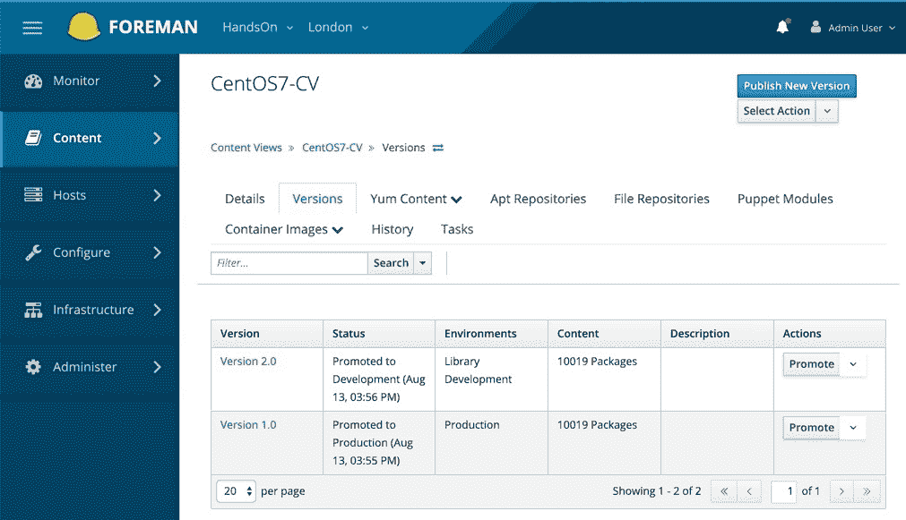

1.  在下图中，展示了提升过程供参考——这就是如何将`Production`环境提升到`Version 2.0`：

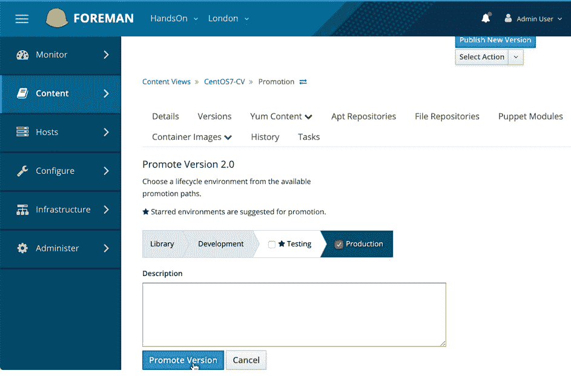

这里唯一剩下的问题是配置客户端以从 Katello 服务器接收软件包。在这里，我们将执行一个简单的手动集成，因为这种方法适用于 DEB 和 RPM 基础的软件包，因此支持在整个企业中的通用方法。从 Katello 使用`subscription-manager`工具和 Katello 代理分发 RPM 包的过程已经有详细文档说明，留作练习。

Katello 官方文档关于激活密钥的部分是一个很好的起点：[`theforeman.org/plugins/katello/3.12/user_guide/activation_keys/index.html`](https://theforeman.org/plugins/katello/3.12/user_guide/activation_keys/index.html)

为了利用我们在本示例中发布的内容，`Development`环境中的机器将有一个包含如下内容的仓库文件：

```
[centos-os]
name=CentOS-os
baseurl=http://katello.example.com/pulp/repos/HandsOn/Development/CentOS7-CV/custom/CentOS7/CentOS7-os/
gpgcheck=1
gpgkey=file:///etc/pki/rpm-gpg/RPM-GPG-KEY-CentOS-7
```

您的基础 URL 肯定会有所不同——至少您的 Katello 主机名会不同。在 Katello 中发布和推广的 RPM 基础仓库通常位于以下路径：

```
http://KATELLOHOSTNAME/pulp/repos/ORGNAME/LIFECYCLENAME/CONTENTVIEWNAME/custom/PRODUCT/REPO
```

这里，我们有以下内容：

+   `KATELLOHOSTNAME`：您的 Katello 服务器的主机名（如果使用了 Capsule/Proxy，则为它们的主机名）

+   `ORGNAME`：您的`Content View`所在的 Katello 组织名称——我们在安装过程中将其定义为`HandsOn`

+   `LIFECYCLENAME`：`Lifecycle Environment`的名称，例如`Development`

+   `CONTENTVIEWNAME`：您为您的`Content View`指定的名称

+   `PRODUCT`：您为您的`Product`指定的名称

+   `REPO`：您在`Product`内为仓库指定的名称

这使得 URLs 完全可预测，并且可以像我们在前一章中讨论 Pulp 时一样，使用 Ansible 轻松地部署到目标机器。请注意，通过 HTTPS 访问 Katello 的仓库需要安装 SSL 证书以进行信任验证，这超出了本章的范围——因此，我们将仅使用普通 HTTP。

由于生命周期环境名称始终保持不变，无论我们是同步、发布还是推广环境，前面所示的仓库 URL 始终保持不变，因此即使发布了新的包仓库快照，我们也无需执行客户端配置工作。这相较于 Pulp 有显著的优势，在 Pulp 中每次创建新版本时，我们都需要通过 Ansible 推送新的配置。

一旦如前所示构建了仓库配置，您就可以按照正常方式修补您的系统。可以按如下方式进行：

+   手动管理，使用类似`yum update`的命令在每台机器上执行

+   集中管理，使用 Ansible 剧本

+   如果`katello-agent`包已安装在目标机器上，可以通过 Katello 用户界面进行操作。

鉴于可用工具的多样性，本章不会深入讨论，但将其作为练习留给你。经验表明，使用 Ansible 进行集中部署是最稳健的方法，但你可以自由尝试并找到最适合你的方法。

这就是我们简要介绍基于 RPM 的修补过程与 Katello 配合使用的结束，尽管希望它已经向你展示了足够的信息，让你初步了解它在企业中可能的价值。在下一部分中，我们将讨论如何使用 Katello 修补基于 DEB 的系统。

# 使用 Katello 修补基于 DEB 的系统

通过 Katello 修补基于 DEB 的系统（如 Ubuntu）与基于 RPM 的过程大致相似，只是 GUI 中有一些变化，以及本章前面讨论的关于包签名的限制，详见 *使用 Katello 修补* 部分。现在，让我们简要了解一下 Ubuntu Server 18.04 的示例：

1.  首先，为我们的 Ubuntu 包仓库创建一个新的产品：

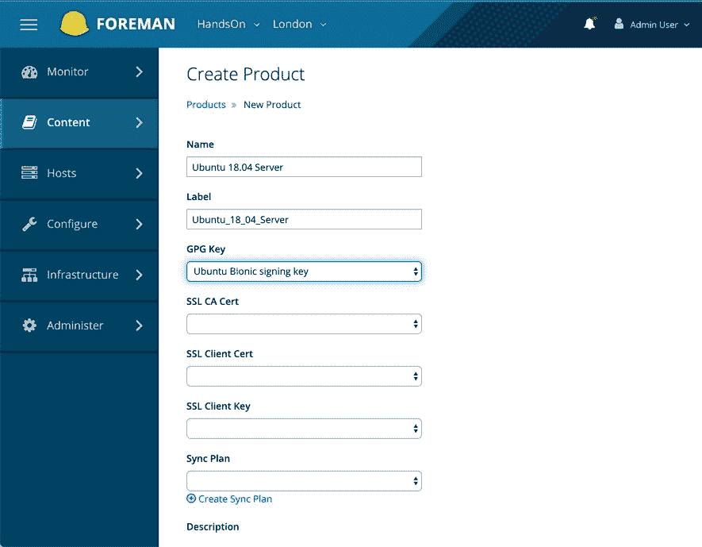

这里需要强调的是，导入 Ubuntu 签名公钥不会对已发布的仓库产生影响，因此可以根据需要指定或忽略。结果仓库将没有签名的 `Release` 文件，因此必须被视为隐式信任。

1.  保存该产品后，在其中创建一个新的仓库来包含包——创建包镜像需要与使用 Pulp 命令行时相同的参数，如下图所示：

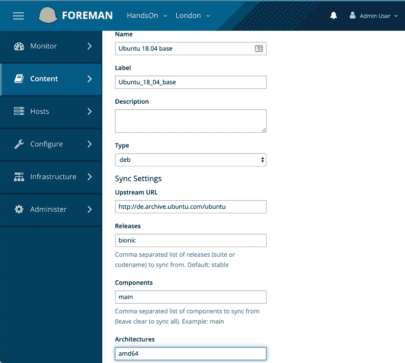

如前所述，同步新创建的仓库，并确保同步成功完成后，再继续进行内容视图的创建。

1.  一旦完成，创建一个单独的内容视图用于我们的 Ubuntu 内容——以下截图展示了内容视图创建的过程：

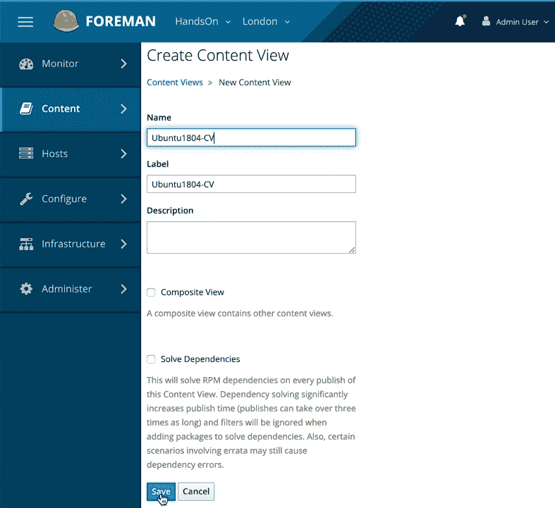

1.  这一次，导航到 Apt Repositories 选项卡，并选择适当的 Ubuntu 仓库——同样，在我们简单的示例中，我们只有一个仓库，以下截图显示了我们的唯一 `Ubuntu 18.04 base` 仓库被添加到 Ubuntu1804-CV 内容视图的过程：

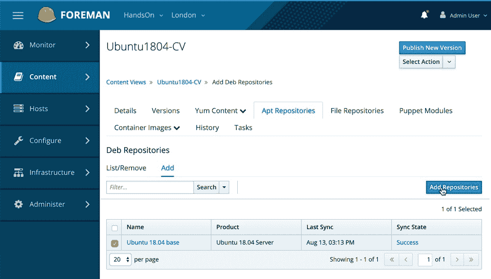

1.  从这里开始，我们的新内容视图将像基于 RPM 的视图一样被发布和推广。结果仓库再次可以通过可预测的 URL 访问，此时的 URL 格式如下：

```
http://KATELLOHOSTNAME/pulp/deb/ORGNAME/LIFECYCLENAME/CONTENTVIEWNAME/custom/PRODUCT/REPO
```

如图所示，这与基于 RPM 的示例几乎完全相同，唯一不同的是初始路径。为匹配我们在此示例中刚刚创建的内容视图，`/etc/apt/sources.list` 可能需要添加如下条目：

```
deb [trusted=yes] http://katello.example.com/pulp/deb/HandsOn/Development/Ubuntu1804-CV/custom/Ubuntu_18_04_Server/Ubuntu_18_04_base/ bionic main
```

与以往一样，无论何时同步、发布或推广此内容视图，此 URL 都保持不变，因此只需在目标系统上部署一次，以确保它们可以从 Katello 服务器接收软件包。同样，您可以通过在最终系统上手动执行 `apt update` 和 `apt upgrade` 命令或通过 Ansible 在中心化方式进行补丁操作。

请注意，在撰写时，Debian/Ubuntu 系统上没有 `katello-agent` 软件包。

在本章中，我们只是初步接触了 Katello 的功能，但仅凭这个例子就展示了它作为企业补丁管理工具的有效性。强烈建议您进一步探索，以确定它是否满足您更广泛的基础设施需求。

必须强调的是，在本章中，我们实际上只是初步介绍了 Katello 的功能——但希望到目前为止我们所做的工作足以让您对是否继续使用这个极其强大和多功能的平台作为您的 Linux 架构的一部分做出明智的决定。

# 摘要

实际上，Katello 是几个极其强大的开源基础设施管理工具的融合，包括我们已经探索过的 Pulp。在基础设施环境中进行补丁管理方面，它表现出色，提供了许多优势，远超单独安装 Pulp，并且可以从单一的界面处理大多数构建和维护任务——比我们现在所能涵盖的还要多！

在本章中，您了解到 Katello 项目的实际内容以及它所包含的组件。然后，您学习了如何为补丁目的执行独立安装的 Katello，并学习了如何构建适用于补丁的 RPM 和 DEB Linux 发行版的仓库，以及集成这两个操作系统与 Katello 内容视图的基础知识。

在下一章中，我们将探讨如何在企业中有效地使用 Ansible 进行用户管理。

# 问题

1.  为什么您要选择 Katello 而不是像 Pulp 这样的产品？

1.  在 Katello 术语中，产品是什么？

1.  Katello 中的内容视图是什么？

1.  Foreman（Katello 的基础）是否可以协助裸金属服务器进行 PXE 引导？

1.  您如何在 Katello 中使用生命周期环境？

1.  在内容视图上执行 `Publish` 和 `Promote` 操作之间有什么区别？

1.  什么时候您会想要在先前发布的内容视图上执行 `Promote` 操作？

# 进一步阅读

要更深入了解 Katello，请参阅官方的 Red Hat Satellite 6 文档，因为这是 Katello 的商业版本，所有文档通常都是为此平台编写的——但功能和菜单结构几乎完全相同（[`access.redhat.com/documentation/en-us/red_hat_satellite/`](https://access.redhat.com/documentation/en-us/red_hat_satellite/)）。
