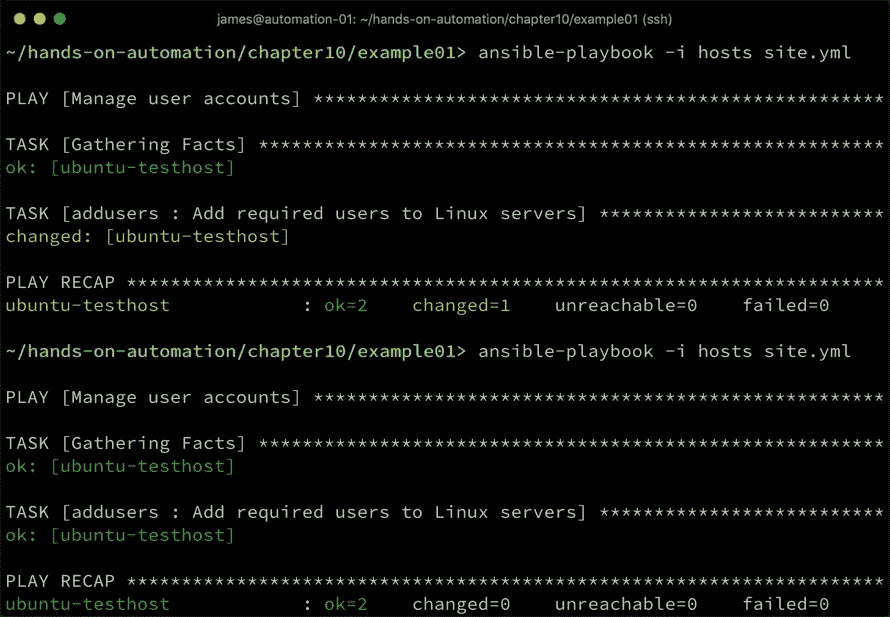
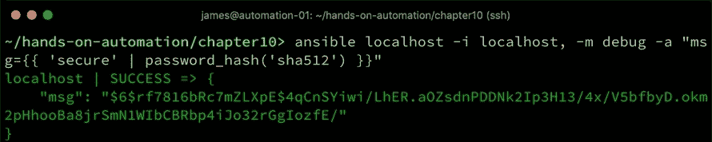
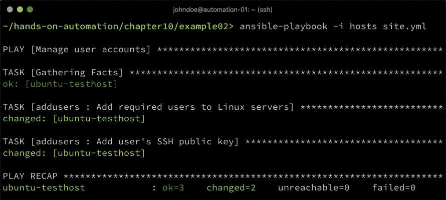
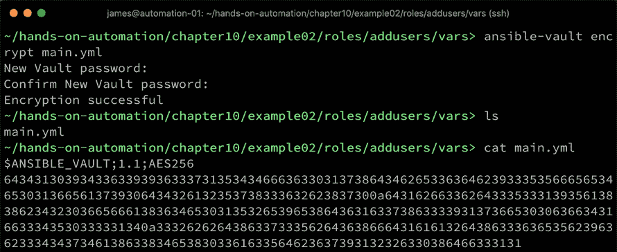
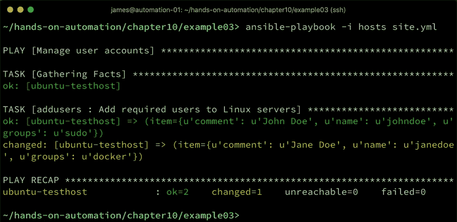
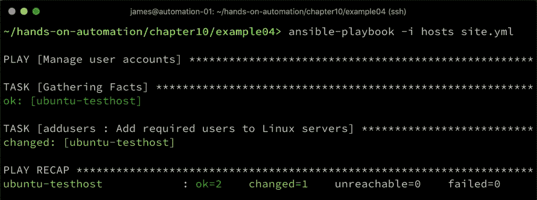
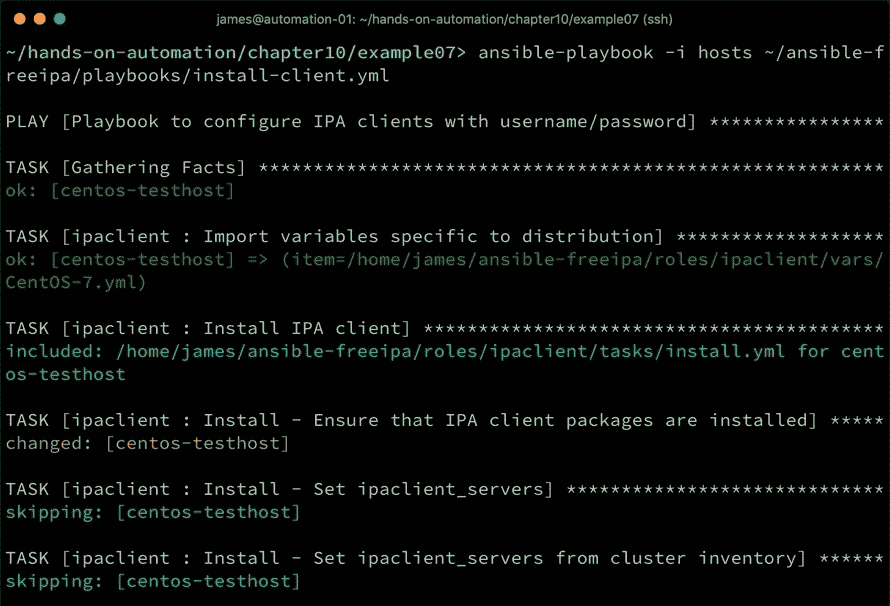
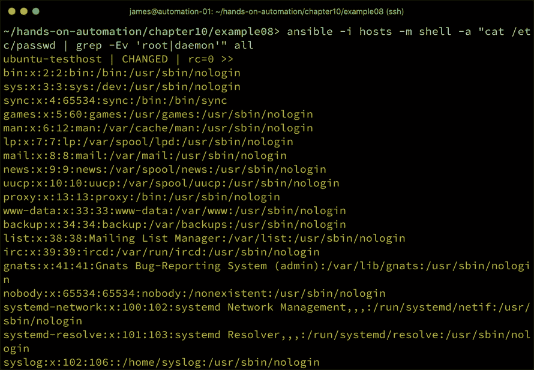

# 在 Linux 上管理用户

没有用户访问方法的 Linux 服务器是不完整的。无论是管理员还是终端用户，使用本地凭据还是集中式凭据，Linux 服务器都需要一种机制来让用户（甚至像 Ansible 这样的工具！）访问它们。

用户管理与所有良好的服务器配置和维护活动一样，是一项持续性的工作。为了确保系统的安全性和完整性，凭据需要定期更换。员工的进出意味着访问详情需要相应更新。实际上，在忙碌的组织中，访问管理可能本身就是一份全职工作！

在本章中，我们将通过实际示例探讨如何通过 Ansible 自动化用户和访问管理，并确保与我们的**标准操作环境**（**SOE**）模型一致。

本章将涵盖以下主题：

+   执行用户账户管理任务

+   使用**轻量级目录访问协议**（**LDAP**）集中管理用户账户

+   强制执行和审计配置

# 技术要求

本章包含基于以下技术的示例：

+   Ubuntu Server 18.04 LTS

+   CentOS 7.6

+   Ansible 2.8

为了完成这些示例，你需要访问两台服务器或虚拟机，分别运行上述列出的操作系统之一，并且需要安装 Ansible。请注意，本章中的示例可能会具有破坏性（例如，它们会添加或删除用户账户，并更改服务器配置），如果按照原样运行，建议仅在隔离的测试环境中执行。

一旦你确认自己有一个安全的环境来进行操作，我们就开始使用 Ansible 安装新软件包吧。

本章讨论的所有示例代码都可以从 GitHub 上获取，网址为：[`github.com/PacktPublishing/Hands-On-Enterprise-Automation-on-Linux/tree/master/chapter10`](https://github.com/PacktPublishing/Hands-On-Enterprise-Automation-on-Linux/tree/master/chapter10)。

# 执行用户账户管理任务

从最基本的层面来说，你环境中的每一台 Linux 服务器都需要为用户提供某种程度的访问权限。在一个可能有数百台甚至数千台服务器的企业环境中，像 LDAP 或 Active Directory 这样的集中式用户管理系统将是理想的解决方案。举个例子，当用户离职或更改密码时，他们只需在一个地方进行操作，系统就会自动应用到所有服务器上。我们将在下一节*使用 LDAP 集中管理用户账户*中探讨企业 Linux 管理和自动化的这一方面。

目前，让我们专注于本地账户管理——也就是说，在每台需要访问的 Linux 服务器上创建的账户。即使存在像 LDAP 这样的集中式解决方案，本地账户依然是必要的——至少它们作为紧急访问解决方案，在目录服务故障时仍然有其存在的价值。

请注意，正如本书中的所有 Ansible 示例一样，它们可以在 1 台、100 台甚至 1000 台服务器上同样运行。事实上，使用 Ansible 减少了对集中式用户管理系统的依赖，因为用户账户的更改可以轻松地推送到整个服务器集群。然而，也有充分的理由不完全依赖于此——例如，在 Ansible playbook 运行时，如果一台服务器因维护而停机，那么它将无法接收到正在进行的账户更改。在最坏的情况下，这台服务器重新投入使用时，可能会带来安全风险。

从下一节开始，我们将探讨 Ansible 如何帮助你进行本地账户管理。

# 使用 Ansible 添加和修改用户

无论你是在第一次配置新建的服务器，还是在新员工加入公司时进行更改，向服务器添加用户账户都是常见的任务。幸运的是，Ansible 有一个名为`user`的模块，专门用于执行用户账户管理任务，我们将继续使用这个模块。

在之前的示例中，我们非常小心地强调了 Ubuntu 和 CentOS 等平台之间的差异，用户账户管理在这里也需要一些考虑。

以以下 Shell 命令为例（我们稍后将在 Ansible 中进行自动化）：

```
$ useradd -c "John Doe" -s /bin/bash johndoe 
```

该命令可以在 CentOS 7 或 Ubuntu Server 18.04 上运行，并且会产生相同的结果，即：

+   用户账户`johndoe`将被分配下一个空闲的**用户标识号**（**UID**）。

+   账户注释将设置为`John Doe`。

+   Shell 将被设置为`/bin/bash`。

事实上，你几乎可以在任何 Linux 系统上运行这个命令，它都会正常工作。然而，当你考虑到组时，差异就开始显现了，尤其是内置组。例如，如果你希望该账户能够使用 sudo 进行 root 访问（即，`johndoe`是系统管理员），你会想要将该账户加入 CentOS 7 中的`wheel`组。然而，在 Ubuntu Server 中，并没有`wheel`组，尝试将用户加入这个组会导致错误。相反，在 Ubuntu 中，这个用户会加入`sudo`组。

正是这种细微的差别，可能会在自动化用户账户管理时，使你在不同的 Linux 发行版之间产生问题——然而，只要你注意到这些细节，就能轻松创建 Ansible playbook 或角色，轻松管理你的 Linux 用户。

让我们基于这个示例，改为在 Ansible 角色中创建`johndoe`用户，以便在所有 Linux 服务器上进行访问控制。以下是`roles/addusers/tasks/main.yml`中的代码，它实现了与前述命令外壳相同的功能：

```
---
- name: Add required users to Linux servers
  user:
    name: johndoe
    comment: John Doe
    shell: /bin/bash
```

如果我们以常规方式运行这个角色，我们可以看到用户账户在第一次运行时被创建，如果第二次运行 playbook 则不会采取任何行动。以下截图演示了前述角色运行两次的情况——`changed` 和 `ok` 状态分别表示添加用户账户时的操作，以及因为账户已存在而没有执行任何操作时的状态：



到目前为止，一切顺利——然而，这个示例有些简单——我们的用户没有设置密码、没有加入任何组，也没有授权的 SSH 密钥。我们之前演示过，可以多次运行包含用户模块的 Ansible 角色，并且只有在需要时才会进行更改，我们可以利用这一点来我们的优势。现在，让我们扩展我们的示例角色，加入这些内容。

在进入下一个示例之前，我们将演示如何使用 Ansible 生成一个密码哈希。在这里，我们将选择单词`secure123`。Ansible 的`user`模块能够设置和修改用户账户密码，但由于非常好的原因，它不允许您指定明文密码。相反，您必须创建一个密码哈希，并将其发送到被配置的机器中。在第六章《使用 PXE 引导的自定义构建》中，我们介绍了如何通过少量 Python 代码来完成此操作，您可以在这里重新使用该方法。但是，您也可以利用 Ansible 丰富的过滤器，直接从字符串生成密码哈希。请在 Shell 中运行以下命令：

```
$ ansible localhost -i localhost, -m debug -a "msg={{ 'secure123' | password_hash('sha512') }}"
```

运行此命令会生成一个密码哈希值，您可以将其复制并粘贴到您的角色中，如下图所示：



这本身非常有用——但是，让我们记住一件事：没有任何密码哈希是完全安全的。记住，曾经 MD5 哈希被认为是安全的，但现在不再安全。理想情况下，您不应将哈希值以明文形式存储，应该在每个系统上重新生成它，因为它包含一个唯一的盐值。幸运的是，我们可以直接在角色中使用`password_hash`过滤器来实现这一点。

在以下示例中，我们演示了如何将密码字符串存储在一个变量中，然后如何使用`password_hash`过滤器为远程系统生成哈希值。在实际使用中，您可以将明文变量文件替换为 Ansible vault 文件，这样在任何时候都不会存储未加密的原始密码或哈希值。

1.  首先，让我们创建`roles/addusers/vars/main.yml`文件，并将 John Doe 的密码存储在一个变量中，如下所示：

```
---
johndoepw: secure123
```

1.  接下来，我们在`roles/addusers/files/`目录下为此用户创建一对 SSH 密钥，方法是在该目录下运行以下命令：

```
$ ssh-keygen -b 2048 -t rsa -f ./johndoe_id_rsa -q -N ''
```

当然，在企业环境中，用户很可能会生成自己的密钥对，并将公钥提供给管理员以便分发到他们将使用的系统中——然而，在我们的例子中，使用新生成的密钥对更方便进行演示。

1.  最后，假设`johndoe`将负责管理 Ubuntu 系统，因此，他应该属于`sudo`组。我们最终的角色现在应该是这样的：

```
---
- name: Add required users to Linux servers
  user:
    name: johndoe
    comment: John Doe
    shell: /bin/bash
    groups: sudo
    append: yes
    password: "{{ johndoepw | password_hash('sha512') }}"

- name: Add user's SSH public key
  authorized_key:
    user: johndoe
    state: present
    key: "{{ lookup('file', 'files/johndoe_id_rsa.pub') }}"
```

1.  运行代码后，我们得到了`changed`的结果，正如我们预期的那样，以下截图显示了成功添加用户及其相应的 SSH 公钥：



请注意，我们已经成功修改了`johndoe`账户，因为我们之前在本节中创建了它——然而，我们也可以在账户创建之前运行最近的角色，最终结果将是一样的。这就是 Ansible 的魅力——你不需要为修改和添加编写不同的代码。`user`模块还有许多其他修改功能，它应该能够满足你大部分的需求。

简单回顾一下我们之前创建的`vars/main.yml`文件，为了简化本例，我们将其保留为明文文件。然而，我们可以非常轻松地加密现有文件，使用以下命令：

```
$ ansible-vault encrypt main.yml
```

以下截图展示了这个加密过程的实际操作：



数据现在已经加密存储！我们仍然可以在不解密的情况下运行剧本——只需在`ansible-playbook`命令中添加`--ask-vault-pass`参数，并在提示时输入你选择的 vault 密码。

在结束这一节之前，值得一提的是，我们还可以利用`loops`一次性创建多个账户。以下示例创建了两个新用户，它们具有不同的组成员身份，并且账户的用户名和备注不同。扩展此示例以处理初始密码和/或 SSH 密钥作为练习留给你，但你应该已经有足够的信息来扩展这个例子。代码如下所示：

```
---
- name: Add required users to Linux servers
  user:
    name: "{{ item.name }}"
    comment: "{{ item.comment }}"
    shell: /bin/bash
    groups: "{{ item.groups }}"
    append: yes
    state: present
  loop:
    - { name: 'johndoe', comment: 'John Doe', groups: 'sudo'}
    - { name: 'janedoe', comment: 'Jane Doe', groups: 'docker'}
```

注意到我们在本章早些时候创建了`johndoe`账户，我们可以看到，如果我们运行这个角色，只有`janedoe`账户会被创建，因为它之前并不存在——以下截图准确地展示了这一点。`janedoe`显示为`changed`状态，告知我们做出了更改——在这种情况下，账户被创建了。`johndoe`账户显示为`ok`状态，告诉我们没有执行任何操作，以下截图也展示了这一点：



通过这种方式，用户账户可以在大量 Linux 服务器上进行创建和管理。如前面的截图所示，Ansible 的工作方式是只对所需的更改进行修改，而不影响现有账户。虽然添加账户相对简单，但我们还必须考虑到员工会不时离开企业，因此在这种情况下，账户清理也是必需的。

在下一节中，我们将探讨 Ansible 如何帮助删除用户账户并清理相关内容。

# 使用 Ansible 删除用户

尽管我们已经展示了如何通过 Ansible 添加和修改用户账户，但我们必须将删除操作视为一个独立的案例。原因很简单——Ansible 假设，如果我们将 `user` 模块与 `loop` 一起使用，添加 `johndoe` 和 `janedoe`，它会在账户不存在时添加它们；否则，它将修改现有账户。当然，如果它们与角色或 playbook 描述的状态相匹配，那么它将什么都不做。

然而，Ansible 在运行之前并不假设任何状态。因此，如果我们从之前描述的循环中删除 `johndoe` 并重新运行 playbook，那么该账户将不会被删除。由于这个原因，我们必须单独处理账户删除的操作。

以下代码将删除该用户账户：

```
---
- name: Add required users to Linux servers
  user:
    name: johndoe
    state: absent
```

现在，如果我们运行这个命令，输出应类似于以下屏幕截图：



运行此角色相当于在 shell 中使用 `userdel` 命令——用户账户将被删除，所有组成员关系也会被移除。然而，`home` 目录将被保留。这通常是最安全的做法，因为用户可能在 `home` 目录中存储了重要的代码或其他数据，通常情况下，在删除该目录之前，由某人检查确认目录是否安全是最好的做法。如果你确定要删除该目录（这是最佳实践，出于安全原因以及释放磁盘空间的考虑），那么可以将以下代码添加到我们刚刚创建的角色中：

```
- name: Clean up user home directory
  file:
    path: /home/johndoe
    state: absent
```

这将递归删除指定的 `path`，请小心使用！

通过这些实际示例和一些文档中的附加细节，你应该能够很好地利用 Ansible 自动化本地账户任务。在下一节中，我们将探讨如何使用 LDAP 来集中管理用户账户。

# 使用 LDAP 集中管理用户账户

尽管 Ansible 在管理整个服务器群体的用户账户方面表现良好，但企业中最好的做法是使用集中式目录系统。集中式目录可以执行一些 Ansible 无法做到的任务——例如，强制执行密码安全标准，如密码长度和字符类型、密码过期以及在尝试多次错误密码时锁定账户。因此，强烈建议在企业中使用这样的系统。

事实上，许多企业已经有了这样的系统，其中两种常见的系统是 FreeIPA 和 Microsoft **Active Directory** (**AD**) 。在接下来的章节中，我们将探讨这两个系统与 Linux 服务器的集成。

# Microsoft AD

由于这是一本关于 Linux 自动化的书，关于 Microsoft AD 及其设置和配置的深入讨论超出了本书的范围。可以简要地说，在 Linux 环境下，AD 最适合用于集中式用户账户管理，尽管它的功能远不止如此。大多数需要 AD 服务器的组织已经设置了 AD，因此，我们的关注点不在于这一方面，而是如何使我们的 Linux 服务器与 AD 进行身份验证。

在大多数现代 Linux 发行版中，`realmd` 工具用于将目标 Linux 服务器加入到 AD 中。接下来，我们考虑一个将 CentOS 7 服务器加入 AD 的假设例子——然而，每个组织、他们的 AD 设置、组织单位等都会有所不同，因此，这里并没有一种通用的解决方案。

正如你现在无疑已经意识到的，在 Ubuntu 上执行此过程将非常相似，唯一不同的是你将使用 `apt` 模块来代替 `yum`，并且包的名称可能有所不同。一旦安装了 `realmd` 及其所需的包，整个过程就是相同的。

然而，希望下面提供的代码能为你提供一个良好的基础，帮助你开发自己的 Ansible 角色来加入 AD。

1.  在开始加入目录的过程之前，确保 Linux 服务器使用的是包含适当 **服务** (**SRV**) 记录的正确 DNS 服务器至关重要。这些 DNS 服务器通常是 AD 服务器本身，但这同样会因组织而异。

1.  必须安装 `realmd` 工具以及若干支持包。让我们创建一个名为 `realmd` 的角色，使用我们熟悉的 `roles` 目录结构。`roles/realmd/tasks/main.yml` 应以以下代码开始，以安装所需的包：

```
---  
- name: Install realmd packages
  yum:
    name: "{{ item }}"
    state: present
  loop:
    - realmd
    - oddjob
    - oddjob-mkhomedir
    - sssd
    - samba-common
    - samba-common-tools
    - adcli
    - krb5-workstation
    - openldap-clients
    - policycoreutils-python
```

其中一些包提供了支持功能——例如，`openldap-clients` 不是直接必须的，但在调试目录问题时非常有用。

1.  一旦安装了我们的前提软件包，接下来的任务是加入 Active Directory。在这里，我们假设`roles/realmd/vars/main.yml`文件中设置了`realm_join_password`、`realm_join_user`和`realm_domain`等变量。由于此文件可能包含具有足够权限的密码以加入 AD 域，建议使用`ansible-vault`加密此变量文件。运行以下代码：

```
- name: Join the domain
    shell: echo '{{ realm_join_password }}' | realm join --user={{ realm_join_user }} {{ realm_domain }}
    register: command_result
    ignore_errors: True
    notify:
      - Restart sssd
```

使用`shell`模块执行`realm join`时需要特别注意，因为运行此任务两次不会得到 Ansible 的正常清洁行为。实际上，当服务器已经是域成员时，再执行第二次`realm join`会导致错误。因此，我们设置`ignore_errors: True`，并`register`命令的结果，以便稍后评估它是否成功运行。我们还会通知一个稍后定义的处理程序，重新启动`sssd`服务。前述的`vars`文件应该类似如下：

```
---
realm_join_password: securepassword
realm_join_user: administrator@example.com
realm_domain: example.com
```

确保将变量值替换为适合你自己环境的值。

1.  我们紧接着这项任务进行检查，看看`realm join`是否成功。如果成功，我们应该得到`0`的返回码，或者一个错误，告知我们服务器已经`已加入此域`。如果没有得到这些预期的结果，我们将失败整个剧本，以确保问题能够得到解决，具体如下：

```
- name: Fail the play when the realm join fails
    fail: 
      msg="Realm join failed with this error: {{ command_result.stderr }}"
    when: "'Already joined to this domain' not in command_result.stderr and command_result.rc != 0"
```

1.  最后，我们在`roles/realmd/handlers/main.yml`中创建处理程序，重新启动`sssd`，如以下所示：

```
---
- name: Restart sssd
  service:
    name: sssd
    state: restarted
    enabled: yes
```

这些步骤足以完成将 Linux 服务器添加到 AD 域的基本操作。虽然示例以 CentOS 7 为例，但对于像 Ubuntu 这样的操作系统，过程应该大致相似，只要你考虑到不同的包管理器和包名即可。

当然，前述过程有大量可以改进的地方，大多数改进都可以通过`realm`命令来执行。遗憾的是，在写这篇文档时，Ansible 并没有`realm`模块，因此所有`realm`命令都必须通过`shell`模块执行——不过，这依然可以通过 Ansible 实现 Linux 服务器加入 AD 域的自动化部署。

你可以考虑对前述过程进行的可能改进（所有这些都可以通过扩展我们之前建议的示例剧本轻松自动化），具体如下：

+   指定当加入完成后，Linux 服务器应该进入的**组织单位**（**OU**）。如果未指定，它将进入默认的`Computers` OU。你可以通过在`realm join`命令中指定类似`--computer-ou=OU=Linux,OU=Servers,OU=example,DC=example,DC=com`的内容来更改此设置。确保 OU 已先行创建，并根据你的环境调整前面的参数。

+   默认情况下，所有有效的域用户帐户将能够登录 Linux 服务器。这可能并不理想，如果不希望如此，您需要首先拒绝所有访问，使用命令`realm deny --all`。然后，如果您希望允许`LinuxAdmins` AD 组中的所有用户，则需发出以下命令：`realm permit -g LinuxAdmins`。

+   在您的 AD 中不太可能有名为`wheel`或`sudo`的组，因此 AD 用户可能会发现自己无法执行特权命令。可以通过将适当的用户或组添加到`/etc/sudoers`或更好地说，添加到`/etc/sudoers.d`下 Ansible 可以管理的一个独立文件中来纠正这一问题。例如，创建以下内容的`/etc/sudoers.d/LinuxAdmins`文件将允许`LinuxAdmins` AD 组的所有成员在不重新输入密码的情况下执行 sudo 命令：

```
%LinuxAdmins ALL=(ALL) NOPASSWD: ALL
```

所有这些任务留给您自己去完成，尽管预期本章中提供的信息足以帮助您构建适合您的 AD 基础设施的 Playbook。

在下一节中，我们将介绍 FreeIPA 目录服务在 Linux 上的使用，以及如何通过 Ansible 将其集成到您的环境中。

# FreeIPA

FreeIPA 是一个免费的开源目录服务，安装和管理都很简单。它运行在 Linux 上，主要在 CentOS 或**Red Hat Enterprise Linux**（**RHEL**）上运行，尽管客户端支持也 readily available on Ubuntu 和其他 Linux 平台。甚至可以与 Windows AD 集成，尽管这并非必须。

如果您正在构建纯粹的 Linux 环境，那么看看 FreeIPA 是有意义的，而不是采用专有解决方案如 Microsoft AD。

FreeIPA 和 Microsoft AD 绝不是市场上目录服务的唯一两个选项，现在还有许多基于云的替代方案，包括 JumpCloud、AWS Directory Service 等。始终根据自己的独立判断做出关于最佳选择的决定，特别是在涉及基于云的目录服务时，领域正在快速发展。

与前文关于 Microsoft AD 的部分类似，设计和部署 FreeIPA 基础设施超出了本书的范围。目录服务是网络核心服务——想象一下如果您只建立了一个目录服务器，然后不得不将其关闭进行维护。即使是简单的重新启动也会导致用户在服务停止期间无法登录到所有连接到该服务器的计算机上。因此，设计目录服务基础设施以考虑冗余和灾难恢复是非常重要的。此外，在您的目录基础设施出现故障的情况下，正如本章前面讨论的，在*执行用户帐户管理任务*一节中，拥有良好安全的本地帐户也非常重要。

一旦为您的 FreeIPA 安装设计了适当的冗余基础设施，FreeIPA 团队在 GitHub 上提供了一系列 playbooks 和角色，用于安装您的服务器和客户端，您可以在此进一步探索：[`github.com/freeipa/ansible-freeipa`](https://github.com/freeipa/ansible-freeipa)

本书将 FreeIPA 基础设施的安装任务留给您——然而，让我们来看一下如何使用自由提供的 FreeIPA 角色，在您的基础设施上安装客户端。毕竟，这是开源软件的一个关键优势——共享知识、信息和代码。

1.  首先，我们将 `ansible-freeipa` 仓库克隆到本地机器，并进入该目录以便使用，如下所示：

```
$ cd ~
$ git clone https://github.com/freeipa/ansible-freeipa
$ cd ansible-freeipa
```

1.  接下来，创建指向我们刚刚克隆到本地 Ansible 环境中的 `roles` 和 `modules` 的符号链接，如下所示：

```
$ ln -s ~/ansible-freeipa/roles/ ~/.ansible/
$ mkdir ~/.ansible/plugins
$ ln -s ~/ansible-freeipa/plugins/modules ~/.ansible/plugins/
$ ln -s ~/ansible-freeipa/plugins/module_utils/ ~/.ansible/plugins/
```

1.  完成上述操作后，我们必须创建一个简单的清单文件，包含适当的变量，定义 FreeIPA 域和域名，以及 `admin` 用户的密码（这是将新服务器加入 IPA 域所必需的）。以下示例已展示，但请确保根据您的需求进行自定义：

```
[ipaclients]
centos-testhost

[ipaclients:vars]
ipaadmin_password=password
ipaserver_domain=example.com
ipaserver_realm=EXAMPLE.COM
```

1.  设置了适当的变量并编译了清单文件后，我们可以运行提供的 playbooks，并使用从 GitHub 下载的代码。以下展示了运行的 FreeIPA 客户端安装 playbook 示例：



上述输出是截断的，但展示了 FreeIPA 客户端安装的过程。与本书中的示例一贯简洁不同，这个过程也可以同样运行在 100 或甚至 1,000 台服务器上。

由于这些 playbooks 和角色是由官方 FreeIPA 项目提供的，它们是安装服务器和客户端的可靠来源，尽管强烈建议测试和审查任何下载的代码，但这些应该足以构建基于 FreeIPA 的基础设施。

在下一节中，我们将探讨 Ansible 如何帮助强制执行和审计用户账户和配置。

# 强制执行和审计配置

在用户账户管理方面，安全性至关重要。正如我们在《*通过 LDAP 中央化用户账户管理*》一节中讨论的那样，Ansible 并不是专门为执行或审计设计的——然而，它可以大大帮助我们。让我们考虑一些 Ansible 可以帮助缓解的用户管理相关的安全风险，从 `sudoers` 文件开始。

# 使用 Ansible 管理 sudoers

`/etc/sudoers` 文件是大多数 Linux 系统中最敏感的文件之一，因为它定义了哪些用户账户可以作为超级用户执行命令。无需多说，这个文件被篡改或未经授权的修改可能会对不仅仅是相关的 Linux 服务器，甚至整个网络带来巨大的安全风险。

幸运的是，Ansible 模板可以帮助我们有效地管理这个文件。像其他现代 Linux 配置一样，`sudoers`配置被分割成几个文件，以便更易于管理。这些文件通常如下所示：

+   `/etc/sudoers`：这是主文件，引用所有可能被考虑的其他文件。

+   `/etc/sudoers.d/*`：这些文件通常通过在`/etc/sudoers`文件中的引用被包含。

正如我们在标题为*使用 Ansible 进行配置管理*的章节中讨论的那样，某人可能会编辑`/etc/sudoers`并指示它包含一个完全不同的路径，除`/etc/sudoers.d/*`外，意味着我们必须通过模板部署这个文件。这可以确保我们控制哪些文件提供`sudo`配置。

我们不会重复关于模板及其在 Ansible 中的部署的讨论，因为在第七章中讨论的*使用 Ansible 进行配置管理*技术在这里同样适用。然而，我们会加一个重要的警告。如果你通过部署一个（例如）语法错误的文件来破坏`sudo`配置，你将有可能把所有用户从特权访问中锁定出去。这意味着解决问题的唯一方法是使用 root 账户登录到服务器，而如果此账户被禁用（像 Ubuntu 默认禁用一样，并且在许多环境中建议禁用），那么恢复路径将变得相当棘手。

就像许多情况一样，预防胜于治疗，而我们之前使用的`template`模块有一个窍门可以帮助我们解决这个问题。当你在 Linux 系统上使用`visudo`编辑`sudoers`文件时，所创建的文件在写入磁盘之前会自动进行检查。如果存在错误，你会收到警告，并有机会进行修复。Ansible 可以通过在`template`模块中添加`validate`参数来利用这个工具。因此，通过 Ansible 部署`sudoers`文件的新版本的一个非常简单的角色可能看起来像这样：

```
---
- name: Copy a new sudoers file on if visudo validation is passed
  template:
    src: templates/sudoers.j2
    dest: /etc/sudoers
    validate: /usr/sbin/visudo -cf %s
```

在前面的示例中，`template`模块通过`validate`参数中的命令传递`dest`指定的文件名——这就是`%s`的意义。如果验证通过，新的文件将被写入。如果验证失败，则新的文件不会被写入，旧的文件将保留。此外，当验证失败时，任务的状态为`failed`，因此该任务会结束并提醒用户修复问题。

这并不是`validate`参数可以完成的唯一任务——它可以用于检查任何模板操作的结果，只要你能定义一个能够对模板操作进行适当检查的 Shell 命令。这可能像使用`grep`检查文件中的一行，或者检查某个服务是否重新启动那样简单。

在下一节中，我们将看看 Ansible 如何帮助在大量服务器上强制执行和审计用户账户。

# 使用 Ansible 审计用户账户

假设你的企业有 1,000 台 Linux 服务器，所有的服务器都使用目录服务进行身份验证，正如我们之前讨论过的那样。现在，假设有一个不当用户，想要绕过这个权限管理，并在单个服务器上创建了一个名为`john`的本地账户。这种情况可能发生在临时授予权限用于变更请求，然后再撤销权限时——不道德的个人可以轻松创建自己的访问方式，从而绕过目录服务提供的安全性。

那么，如何发现这种情况呢？尽管 Ansible 本身并不是审计工具，但它有一个好处，就是可以在 1,000 台服务器上同时运行一个命令（或一组命令），并将结果返回给你进行处理。

因为所有的服务器构建都应该达到一定的标准（参见第一章，*在 Linux 上构建标准操作环境*），所以你应该知道每个 Linux 服务器上应该有哪些账户。可能会有一些差异——例如，如果你安装了 PostgreSQL 数据库服务器，这通常会创建一个名为`postgres`的本地用户账户。不过，这些情况是可以理解的，并且可以很快且轻松地过滤掉。

我们甚至不需要为 Ansible 写一个完整的剧本来帮助我们——一旦你有了包含 Linux 服务器的清单文件，你就可以运行所谓的临时命令。这只是一个单行命令，可以用来运行任何单个 Ansible 模块并带上一组参数——就像一个只有一个任务的剧本。

因此，要获取我所有服务器上的所有用户账户列表，我可以运行以下命令：

```
$ ansible -i hosts -m shell -a 'cat /etc/passwd' all
```

就是这么简单——Ansible 会忠实地连接到由`-i`参数指定的所有服务器清单，并将`/etc/passwd`文件的内容显示在屏幕上。你可以将输出通过管道保存到文件中，进行进一步处理和分析，而不必登录到每一台机器上。尽管 Ansible 本身并没有进行任何分析，但它为审计提供了一个非常强大且易于使用的数据收集工具，而且正如 Ansible 的魅力所在，远程机器上不需要安装任何代理。

以下截图展示了 Ansible 如何从我们的一个测试系统中获取本地用户账户，使用简单的`grep`命令过滤掉两个常见的账户。当然，你可以根据需要扩展这个示例，以改善数据处理，从而使任务变得更加轻松：



通过这种方式，你可以充分利用 Ansible 从大量系统中收集有用的信息，供进一步处理——由于结果直接返回到终端，便于将其管道传输到文件中，并用你喜欢的工具（例如 AWK）处理，检查是否有任何系统违反企业政策。虽然此示例是通过本地用户帐户列表执行的，但同样可以在远程系统的任何文本文件上有效执行。

正如你所看到的，这是一个非常简单的示例，但它是一个基础构件，你可以在此基础上构建其他剧本。以下是一些供你进一步探索的想法：

+   修改我们之前运行的临时命令，将其作为剧本运行。

+   在 AWX 中定期调度运行上述剧本。

+   修改剧本以检查特定的关键用户帐户。

然而，你对用户的审计能力并不仅限于此——尽管集中式日志记录应该（并且可能会）是你基础设施的一部分，你也可以使用 Ansible 查询日志文件。通过之前展示的临时命令结构，你可以在一组 Ubuntu 服务器上运行以下命令：

```
$ ansible -i hosts -m shell -a 'grep "authentication failure | cat" /var/log/auth.log' all
```

在 CentOS 上，这些日志消息将出现在 `/var/log/secure` 中，因此你需要根据这些系统修改路径。

`grep` 命令在找不到你指定的字符串时返回代码 `1`，Ansible 进而将其解读为失败，并报告任务失败。因此，我们将 `grep` 的输出传递给 `cat` 命令，`cat` 始终返回零，因此任务不会失败，即使我们搜索的字符串没有找到。

正如你现在可能已经意识到的，这些命令作为剧本运行会更好，且可以根据操作系统进行一些检测，并使用适当的路径——然而，本节的目标不是给你提供一个详尽的解决方案集合，而是激发你根据这些示例自行编写代码，帮助你使用 Ansible 审计你的基础设施。

由于 Ansible 可以执行多种命令，并且在你的基础设施中具有无代理访问权限，这意味着它可以成为你工具箱中的有效解决方案，用于配置 Linux 服务器、维护配置的完整性，甚至对其进行审计。

# 总结

用户帐户和访问管理是任何企业 Linux 环境中不可或缺的一部分，Ansible 可以作为配置和推广这一管理方法的关键组件，覆盖大量服务器。事实上，针对 FreeIPA，已经有免费提供的 Ansible 角色和剧本，不仅可以设置 Linux 客户端，甚至可以配置你的服务器架构。因此，自动化管理 Linux 基础设施中的所有关键组件是完全可以实现的。

在本章中，你学习了如何有效地通过 Ansible 管理大量 Linux 服务器上的用户帐户。接着，你学习了如何通过 Ansible 将登录集成到常见的目录服务器中，如 FreeIPA 和 Microsoft AD，最后，你学习了如何使用 Ansible 强制实施配置并审计其状态。

在下一章中，我们将探讨 Ansible 在数据库管理中的应用。

# 问题

1.  即使使用了目录服务，本地用户帐户的好处是什么？

1.  在 Ansible 中，哪个模块用于创建和操作用户帐户？

1.  如何仅使用 Ansible 生成加密的密码哈希？

1.  哪个软件包用于将 Linux 服务器与 AD 集成？

1.  如何使用 Ansible 对一组服务器的配置进行审计？

1.  从模板部署 `sudoers` 文件时，验证该文件的目的是什么？

1.  目录服务提供了哪些 Ansible 无法提供的额外好处，尽管 Ansible 可以在所有服务器上部署用户帐户？

1.  你会如何在 FreeIPA 和 AD 之间做出选择？

# 进一步阅读

+   要深入了解 Ansible，请参考 *Mastering Ansible, Third Edition—James Freeman* 和 *Jesse Keating* ([`www.packtpub.com/gb/virtualization-and-cloud/mastering-ansible-third-edition`](https://www.packtpub.com/gb/virtualization-and-cloud/mastering-ansible-third-edition))。

+   要更深入地了解 AD 的设置和使用，读者可以参考 *Mastering Active Directory, Second Edition—Dishan Francis* ([`www.packtpub.com/cloud-networking/mastering-active-directory-second-edition`](https://www.packtpub.com/cloud-networking/mastering-active-directory-second-edition))。
