# 数据库管理

没有数据的应用栈是不完整的，而数据通常存储在数据库中。对于 Linux 平台而言，数据库的选择众多，数据库管理和管理的整个主题通常需要专门的书籍来讨论——实际上，通常每种数据库技术都有一本书。尽管这个话题非常广泛，但了解一些 Ansible 知识对于数据库管理帮助巨大。

的确，无论是安装新的数据库服务器，还是对现有数据库服务器进行维护或管理，我们在第一章中讨论的原始原则，*在 Linux 上构建标准操作环境*，仍然适用。的确，你为什么要费力地去标准化你的 Linux 环境并确保所有变更都自动化处理，却还要坚持手动管理数据库层呢？这很可能导致缺乏标准化、审计能力，甚至追溯能力（例如，谁在什么时候做了哪些更改？）。Ansible 可以通过模块执行数据库操作和配置。它可能无法替代市场上更高级的数据库管理工具，但如果这些工具可以通过命令行操作，Ansible 可以代替你执行这些操作，并且可以自己处理许多任务。最终，你希望所有的更改都能被记录（或自我记录）并可审计，而 Ansible（结合 Ansible Tower 或 AWX）可以帮助你实现这一目标。本章将探讨一些帮助你实现这一目标的方法。

本章将涵盖以下主题：

+   使用 Ansible 安装数据库

+   导入和导出数据

+   执行常规维护

# 技术要求

本章包括基于以下技术的示例：

+   Ubuntu Server 18.04 LTS

+   CentOS 7.6

+   Ansible 2.8

要运行这些示例，你需要访问两台服务器或虚拟机，每台运行上述提到的操作系统，并且需要安装 Ansible。请注意，本章中的示例可能具有破坏性（例如，它们会添加和删除数据库及表，并更改数据库配置），如果按原样运行，它们仅应在隔离的测试环境中运行。确保你有一个安全的环境来执行这些操作后，我们就可以开始讨论如何使用 Ansible 安装新的软件包了。本章讨论的所有示例代码可以从 GitHub 获取，网址如下：[`github.com/PacktPublishing/Hands-On-Enterprise-Automation-on-Linux/tree/master/chapter11`](https://github.com/PacktPublishing/Hands-On-Enterprise-Automation-on-Linux/tree/master/chapter11)。

# 使用 Ansible 安装数据库

在第七章，*使用 Ansible 进行配置管理*，我们探讨了一些软件包安装的示例，并在其中使用了 MariaDB 服务器。当然，MariaDB 只是 Linux 上众多可用数据库中的一个，这里无法详细覆盖所有内容。尽管如此，Ansible 可以帮助您在 Linux 上安装几乎任何数据库服务器，在本章中，我们将通过一系列示例为您提供安装自己数据库服务器的工具和技术。

让我们在下一节开始，基于我们安装 MariaDB 的示例继续进行。

# 使用 Ansible 安装 MariaDB 服务器

虽然在本书的早些章节中，我们安装了随 CentOS 7 一起提供的本机`mariadb-server`软件包，但大多数需要 MariaDB 服务器的企业会选择直接从 MariaDB 标准化到特定版本。这通常比随特定 Linux 发布版本提供的版本更新，并因此提供了更新的功能和有时的性能改进。此外，标准化到直接从 MariaDB 获取的版本可以确保平台的一致性，这是我们在本书中始终坚持的原则。

让我们举一个简单的例子——假设您的基础架构正在运行**Red Hat Enterprise Linux**（**RHEL**）7。这个版本预装了 MariaDB 5.5.64。现在，假设您希望将基础架构标准化到新发布的 RHEL 8 上——如果您依赖 Red Hat 提供的软件包，那么这将立即升级您的 MariaDB 版本至 10.3.11，这意味着不仅仅是 Linux 基础架构的升级，还包括数据库的升级。

相反，最好是预先在 MariaDB 本身的发布上进行标准化。在撰写本文时，MariaDB 的最新稳定版本是 10.4——但假设您已经标准化到已知并在您的环境中成功测试过的 10.3 版本。

安装过程非常简单，并且在 MariaDB 网站上有很好的文档说明——请参阅[`mariadb.com/kb/en/library/yum/`](https://mariadb.com/kb/en/library/yum/)，获取针对 CentOS 和 Red Hat 的具体示例。然而，这些详细说明了手动安装过程，而我们希望使用 Ansible 进行自动化。现在让我们将其构建为一个真实且有效的 Ansible 示例。

在本示例中，我们将按照 MariaDB 的说明进行操作，包括从其存储库下载软件包。尽管出于简单起见，我们将继续按照这个示例进行操作，但您也可以将 MariaDB 软件包存储库镜像到 Pulp 或 Katello 中，详细内容请参见第八章，*使用 Pulp 进行企业存储库管理* 和 第九章，*使用 Katello 进行补丁管理*。

1.  首先，我们可以从安装文档中看到，我们需要创建一个 `.repo` 文件，以告诉 `yum` 从哪里下载软件包。我们可以使用模板来提供这个文件，以便 MariaDB 版本可以通过变量定义，从而在将来迁移到 10.4 版本（或其他任何未来版本）时能够进行更改。

因此，我们的模板文件，定义在 `roles/installmariadb/templates/mariadb.repo.j2` 中，将如下所示：

```
[mariadb]
name = MariaDB
baseurl = http://yum.mariadb.org/{{ mariadb_version }}/centos7-amd64
gpgkey=https://yum.mariadb.org/RPM-GPG-KEY-MariaDB
gpgcheck=1
```

1.  一旦我们创建了这个文件，我们还应该为这个变量创建一个默认值，以防在执行角色时未指定该变量而导致任何问题或错误——这个默认值将在 `roles/installmariadb/defaults/main.yml` 中定义。通常情况下，这个变量会在给定服务器或服务器组的库存文件中提供，或者通过 Ansible 支持的其他方法提供，但 `defaults` 文件提供了一种兜底方式，以防它被忽略。运行以下代码：

```
---
mariadb_version: "10.3"
```

1.  定义好之后，我们可以开始在 `roles/installmariadb/tasks/main.yml` 中构建任务，如下所示：

```
---
- name: Populate MariaDB yum template on target host
  template:
    src: templates/mariadb.repo.j2
    dest: /etc/yum.repos.d/mariadb.repo
    owner: root
    group: root
    mode: '0644'
```

这样可以确保正确的仓库文件被写入服务器，如果它被错误修改，也能恢复到原来的期望状态。

在 CentOS 或 RHEL 上，你还可以使用 `yum_repository` Ansible 模块来执行此任务——但是，这样做的缺点是无法修改现有的仓库定义，因此，如果将来我们需要更改仓库版本，最好使用模板。

1.  接下来，我们应该清理 `yum` 缓存——这在升级 MariaDB 到新版本时尤其重要，因为软件包名称相同，缓存的信息可能会导致安装出现问题。目前，清理 `yum` 缓存是通过使用 `shell` 模块运行 `yum clean all` 命令来实现的。然而，由于这是一个 shell 命令，它会始终运行，这可能被认为是低效的——尤其是当这个命令运行时，任何未来的包操作都需要再次更新 yum 缓存，即使我们没有修改 MariaDB 仓库定义。因此，我们希望仅在 `template` 模块任务结果为 changed 状态时才运行它。

为此，我们必须先在 `template` 任务中添加这一行，以存储任务的结果：

```
  register: mariadbtemplate
```

1.  现在，当我们定义我们的 shell 命令时，我们可以告诉 Ansible 仅在`template`任务结果为`changed`状态时才运行它，如下所示：

```
- name: Clean out yum cache only if template was changed
  shell: "yum clean all"
  when: mariadbtemplate.changed
```

1.  清理完缓存后，我们可以安装所需的 MariaDB 软件包——以下代码块中使用的列表来自前面本节引用的 MariaDB 文档，但你应该根据自己的具体需求进行调整：

```
- name: Install MariaDB packages
  yum:
    name:
      - MariaDB-server
      - galera
      - MariaDB-client
      - MariaDB-shared
      - MariaDB-backup
      - MariaDB-common
    state: latest
```

使用 `state: latest` 确保我们始终从由 `template` 任务创建的仓库文件中安装最新的包。因此，这个角色可以用于初始安装和升级到最新版本。然而，如果你不希望这种行为，可以将这个语句改为 `state: present`——这仅仅确保列出的包已安装在我们的目标主机上。如果已经安装，它不会将它们更新到最新版本——它只是返回一个 `ok` 状态并继续执行下一个任务，即使有更新可用。

1.  安装完包后，我们必须确保服务器服务在启动时自动启动。我们可能还想立即启动它，以便进行任何初步配置工作。因此，我们将在 `installmariadb` 角色的最后添加一个任务，任务内容如下所示：

```
- name: Ensure mariadb-server service starts on boot and is started now
  service:
    name: mariadb
    state: started
    enabled: yes
```

1.  此外，我们知道 CentOS 7 默认启用了防火墙——因此，我们必须更改防火墙规则，以确保我们新安装的 MariaDB 服务器可以被访问。执行此任务的操作看起来如下所示：

```
- name: Open firewall port for MariaDB server
  firewalld:
    service: mysql
    permanent: yes
    state: enabled
    immediate: yes
```

1.  现在让我们运行这个角色并看看它的实际效果——输出应该如下所示：

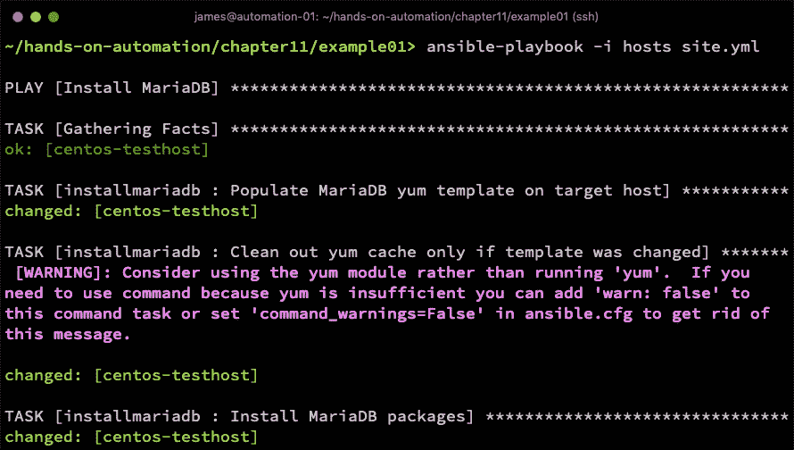

输出已被截断以节省空间，但清晰地显示了安装过程中的进展。请注意，该警告可以安全忽略——Ansible 引擎检测到了我们的 `yum clean all` 命令，并友好地建议我们使用 `yum` 模块——然而，在这个例子中，`yum` 模块并没有提供我们需要的功能，因此我们使用了 `shell` 模块。

安装并启动数据库后，我们接下来有以下三个高层任务要执行：

+   更新 MariaDB 配置。

+   确保 MariaDB 安装的安全性。

+   向数据库加载初始数据（或模式）。

在这些任务中，我们详细探讨了如何有效使用 Ansible 的 `template` 模块来管理 MariaDB 配置，详细内容请参见第七章，《使用 Ansible 进行配置管理》（参见*进行可扩展的动态配置更改*一节）。因此，我们在这里不会再详细讲解——不过，请检查你所选择版本的 MariaDB 配置文件结构，因为它可能与上述章节中显示的有所不同。

如果你在像 CentOS 这样的平台上安装了 MariaDB RPM 包，你可以通过在 root shell 中运行命令 `rpm -qc MariaDB-server` 来查找配置文件的位置。

因此，假设你已经掌握了数据库服务器的安装和配置，让我们继续确保它的安全性。最低要求是更改 `root` 密码，尽管良好的实践建议你还应该移除远程 root 访问、`test` 数据库以及默认 MariaDB 安装时创建的匿名用户账户。

MariaDB 附带了一个名为 `mysql_secure_installation` 的命令行工具，专门执行这些任务——然而，它是一个交互式工具，不适合与 Ansible 一起自动化运行。幸运的是，Ansible 提供了与数据库交互的模块，可以帮助我们精确地执行这些任务。

为了将这些任务与安装过程分开，我们将创建一个名为 `securemariadb` 的新角色。在定义任务之前，我们必须定义一个变量来存储 MariaDB 安装的 root 密码。请注意，通常情况下，您会以更安全的方式提供此信息——也许通过 Ansible Vault 文件，或使用 AWX 或 Ansible Tower 中的一些高级功能。为了简化示例，我们将在角色中定义一个变量文件（在 `roles/securemariadb/vars/main.yml` 中），如下所示：

```
---
mariadb_root_password: "securepw"
```

现在，让我们为角色构建任务。Ansible 提供了一些原生模块，可用于数据库管理，我们可以在这里利用它们，对 MariaDB 数据库进行所需的更改。

然而，请注意，某些模块有特定的 Python 要求，在我们的示例系统——CentOS 7 上的 MariaDB——的情况下，我们必须安装 `MySQL-python` 包。

了解这一点后，构建我们角色的第一步是安装必备的 Python 包，如下所示：

```
---
- name: Install the MariaDB Python module required by Ansible
  yum:
    name: MySQL-python
    state: latest
```

我们的首要任务，一旦安装完成，就是设置本地 root 账户的密码，并防止任何人未经身份验证登录。请运行以下代码：

```
- name: Set the local root password
  mysql_user:
    user: root
    password: "{{ mariadb_root_password }}"
    host: "localhost"
```

到目前为止，这还是一个教科书般的 `mysql_user` 模块使用示例——然而，从这里开始，我们的使用方式有些不同。前面的示例利用了没有设置 root 密码的事实——它隐式地以 `root` 身份操作数据库，原因是我们将在 `site.yml` 文件中设置 `become: yes`，因此，playbook 会以 `root` 身份运行。在此任务运行时，root 用户没有密码，因此，上述任务将顺利运行。

解决方法是为所有未来任务的模块添加 `login_user` 和 `login_password` 参数，以确保我们已经成功地通过身份验证与数据库进行交互，从而执行所需的任务。

这个角色只会在第一次运行时成功——在第二次运行时，root MariaDB 用户的密码将被设置，前面的任务将失败。然而，如果我们为上述任务指定了 `login_password`，且密码为空（如在初次运行时），任务也会失败。有多种方法可以解决这个问题，比如在另一个变量中设置旧密码，或者确实只运行一次此角色。您还可以在该任务下指定 `ignore_errors: yes`，这样，如果 root 密码已经设置，我们就可以继续执行后续任务，这些任务应该能够顺利运行。

在理解了这个条件之后，我们现在为该角色添加另一个任务，即移除远程根账户，如下所示：

```
- name: Delete root MariaDB user for remote logins
  mysql_user:
    user: root
    host: "{{ ansible_fqdn }}"
    state: absent
    login_user: root
    login_password: "{{ mariadb_root_password }}"
```

再次说明，这段代码自我解释性强——然而，也请注意，在第二次运行时会出现错误，因为第二次运行时，这些权限将不存在，因为我们在第一次运行时已将其删除。因此，这几乎肯定是一个只需运行一次的角色，或者在代码和错误处理逻辑中必须仔细考虑的地方。

现在我们添加一个任务来删除匿名用户账户，如下所示：

```
- name: Delete anonymous MariaDB user
  mysql_user:
    user: ""
    host: "{{ item }}"
    state: absent
    login_user: root
    login_password: "{{ mariadb_root_password }}"
  loop:
    - "{{ ansible_fqdn }}"
    - localhost
```

你会看到这里使用了`loop`——这是用来在一个任务中删除本地和远程的权限。最后，我们通过运行以下代码删除`test`数据库，这是大多数企业场景中多余的数据库：

```
- name: Delete the test database
  mysql_db:
    db: test
    state: absent
    login_user: root
    login_password: "{{ mariadb_root_password }}"
```

角色完全完成后，我们可以像往常一样运行它，并保护我们新安装的数据库。输出应该类似于这样：

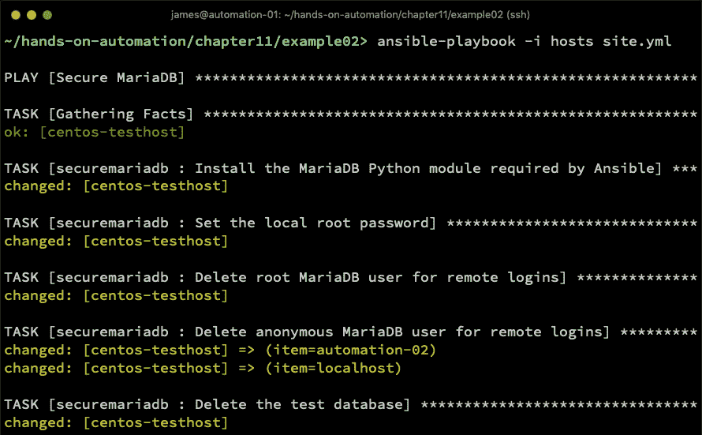

通过这两个角色和来自第七章《使用 Ansible 进行配置管理》的部分输入，我们成功地在 CentOS 上安装、配置并加固了 MariaDB 数据库。显然，这是一个非常具体的示例——然而，如果你在 Ubuntu 上执行这个过程，方法也非常相似。不同之处在于：

+   在所有任务中，将使用`apt`模块替代`yum`模块。

+   在 Ubuntu 上，软件包名称需要更改。

+   定义仓库源应在`/etc/apt`下进行，而不是在`/etc/yum.repos.d`，并相应调整文件格式。

+   Ubuntu 上 MariaDB 的配置路径可能会有所不同。

+   Ubuntu 通常使用`ufw`而不是`firewalld`——默认情况下，你可能会发现`ufw`被禁用，因此，这一步可以跳过。

考虑到这些变化，前面的过程可以非常快速地调整为适用于 Ubuntu（或者，实际上，任何其他平台，只要做出适当的更改）。一旦软件包安装和配置完成，由于诸如`mysql_user`和`mysql_db`等模块是跨平台的，它们将在所有支持的平台上正常工作。

到目前为止，在本书中，我们主要关注 MariaDB——这并非因为对这个数据库有任何固有偏好，也不应被解读为任何推荐。它只是作为一个相关的示例，在整本书中不断展开。在我们继续学习如何将数据或模式加载到新安装的数据库中之前，我们将在下一节简要回顾如何将我们目前学到的过程应用于另一个流行的 Linux 数据库——PostgreSQL。

# 使用 Ansible 安装 PostgreSQL Server

在本节中，我们将演示如何将我们到目前为止在 CentOS 上为 MariaDB 所学习的原则和高层流程应用到另一个平台。总体来看，这些流程可以应用于几乎任何数据库和 Linux 平台，只要注意细节。这里，我们将在 Ubuntu Server 上安装 PostgreSQL Server，然后通过设置 root 密码来确保其安全——本质上，这与我们在前一节中所执行的过程类似。

让我们开始吧，首先创建一个名为 `installpostgres` 的角色。在这个角色中，我们将再次定义一个来自官方 PostgreSQL 源的软件包下载模板，这次——当然——将其调整为我们使用的是 Ubuntu Server，而不是 CentOS。以下代码展示了模板文件——请注意，这对于 Ubuntu Server 18.04 LTS（代号 `bionic`）是特定的：

```
deb http://apt.postgresql.org/pub/repos/apt/ bionic-pgdg main
```

如前所述，一旦我们定义了软件包源，就可以开始创建将安装数据库的任务。在 Ubuntu 系统中，我们必须手动将软件包签名密钥添加到 `apt` 密钥环中，除此之外，还需要将前面的模板复制到合适的位置。因此，我们在角色中的任务开始如下：

```
---
- name: Populate PostgreSQL apt template on target host
  template:
    src: templates/pgdg.list.j2
    dest: /etc/apt/sources.list.d/pgdg.list
    owner: root
    group: root
    mode: '0644'
```

我们也可以在这里使用 `apt_repository`，但是为了与之前的 MariaDB 示例保持一致，我们使用了模板。两者都能达到相同的最终结果。

当 `template` 软件包到位后，我们接着需要将软件包签名密钥添加到 `apt` 的密钥环中，如下所示：

```
- name: Add key for PostgreSQL packages
  apt_key:
    url: https://www.postgresql.org/media/keys/ACCC4CF8.asc
    state: present
```

然后安装 `postgresql-11` 及其他支持包（参考文档 [`www.postgresql.org/download/linux/ubuntu/`](https://www.postgresql.org/download/linux/ubuntu/)），如下所示：

```
- name: Install PostgreSQL 11 packages
  apt:
    name:
      - postgresql-11
      - postgresql-client-11
    state: latest
    update_cache: yes
```

由于我们的默认 Ubuntu Server 安装没有运行防火墙，因此此剧本中的最后一项任务是启动服务，并确保它在启动时自动启动，如下所示：

```
- name: Ensure PostgreSQL service is installed and started at boot time
  service:
    name: postgresql
    state: started
    enabled: yes
```

运行此命令应该会产生类似以下的输出：

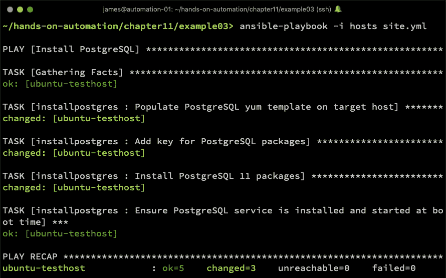

默认情况下，*开箱即用*的 PostgreSQL 安装比 MariaDB 更加安全。没有额外的配置时，远程登录完全不被允许，尽管超级用户账户没有设置密码，但它只能从本地机器上的 `postgres` 用户账户进行访问。同样，也没有测试数据库可供删除。

因此，尽管高层流程相同，但你必须注意所使用的数据库服务器和底层操作系统的细微差别。

作为示例并完成本节内容，我们创建一个名为 `production` 的数据库，并创建一个名为 `produser` 的关联用户，该用户将获得访问权限。虽然从技术上讲，这与下一节关于加载初始数据的内容有所重叠，但这里提供它是为了类比前一节关于 MariaDB 的内容，并展示如何使用 PostgreSQL 的本地 Ansible 模块。

1.  我们来创建一个名为`setuppostgres`的角色，并首先定义一个任务来安装支持 Ansible PostgreSQL 模块所需的 Ubuntu 软件包，如下所示：

```
---
- name: Install PostgreSQL Ansible support packages
  apt:
    name: python-psycopg2
    state: latest
```

1.  在此之后，我们添加一个任务来创建数据库（这是一个非常简单的示例—您需要根据您的具体需求进行调整），如下所示：

```
- name: Create production database
  postgresql_db:
    name: production
    state: present
  become_user: postgres
```

1.  请注意，我们如何利用目标机器上的本地`postgres`账户，通过`become_user`语句实现数据库超级用户访问。接下来，我们将添加用户，并赋予他们该数据库的权限，如下所示：

```
- name: Add produser account to database
  postgresql_user:
    db: production
    name: produser
    password: securepw
    priv: ALL
    state: present
  become_user: postgres
```

像往常一样，您不会像这样直接以明文形式指定密码—这里是为了简化而这么做的。通常，您应该为变量替换适当的数据，并且如果这些变量是敏感的，可以使用 Ansible Vault 加密它们，或者在剧本运行时提示用户输入。

1.  现在，为了让 PostgreSQL 监听来自该用户的远程连接，我们还需要执行两个动作。我们需要在`pg_hba.conf`中添加一行，告诉 PostgreSQL 允许我们刚创建的用户从适当的网络访问该数据库—以下示例已显示，但请确保根据您的网络和需求进行调整：

```
- name: Grant produser access to the production database over the local network
  postgresql_pg_hba:
    dest: /etc/postgresql/11/main/pg_hba.conf
    contype: host
    users: produser
    source: 192.168.81.0/24
    databases: production
    method: md5
```

1.  我们还必须更改`postgresql.conf`文件中的`listen_addresses`参数，该参数默认仅支持本地连接。此文件的具体位置会根据您的操作系统和 PostgreSQL 版本而有所不同—以下示例适用于我们在 Ubuntu Server 18.04 上安装的 PostgreSQL 11：

```
- name: Ensure PostgreSQL is listening for remote connections
  lineinfile:
    dest: /etc/postgresql/11/main/postgresql.conf
    regexp: '^listen_addresses ='
    line: listen_addresses = '*'
  notify: Restart PostgreSQL
```

1.  细心的读者会注意到这里也使用了处理程序—`postgresql`服务必须重启才能生效对该文件的任何更改。然而，这应仅在文件更改时执行，因此我们使用了处理程序。我们的`handlers/main.yml`文件将如下所示：

```
---
- name: Restart PostgreSQL
  service:
    name: postgresql
    state: restarted
```

1.  在我们组装完剧本后，现在可以运行它，输出应该类似于以下截图：

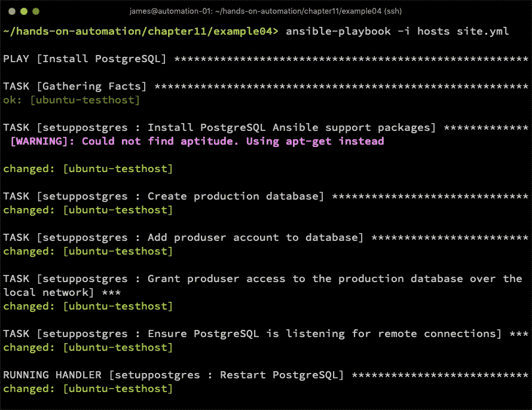

尽管这个示例与上一节中`mysql_secure_installation`工具的复制并不完全相同，但它展示了如何使用原生的 Ansible 模块配置和保护 PostgreSQL 数据库，并且展示了 Ansible 如何强力协助您设置和保护新的数据库服务器。这些原则可以应用于几乎任何与 Linux 兼容的数据库服务器，尽管每个数据库可用的模块可能不同。完整的模块列表可以在这里找到：[`docs.ansible.com/ansible/latest/modules/list_of_database_modules.html`](https://docs.ansible.com/ansible/latest/modules/list_of_database_modules.html)

现在我们已经看过了安装数据库服务器的过程，在接下来的部分中，我们将基于安装工作加载初始数据和模式。

# 导入和导出数据

安装软件并配置数据库并不足以使其完整——通常，存在一个非常重要的中间步骤，涉及加载初始数据集。这可能是来自以前数据库的备份、用于测试的清理数据集，或者只是一个模式，用于加载应用程序数据。

尽管 Ansible 有一些模块可以实现有限的数据库功能，但在数据库管理方面，其功能并不像其他自动化任务那样完整。Ansible 对数据库的最全面支持是 PostgreSQL——对于其他数据库的支持较少。通过巧妙使用`shell`模块，您可以将命令行上执行的任何手动任务转换为 Ansible 任务。具体如何处理错误或特殊情况（例如数据库已经存在）则取决于您如何为任务应用逻辑，我们将在下一节中看到此类示例。

在下一节中，我们将介绍如何使用 Ansible 自动化将示例数据库加载到 MariaDB 数据库中的任务。

# 使用 Ansible 自动化 MariaDB 数据加载

MariaDB 是本章的一个好选择，因为它提供了一个中等程度的数据库管理视角，尤其是在使用 Ansible 时。Ansible 提供了一些原生模块支持，但对于您可能需要执行的所有任务，它并不完全支持。因此，我们将开发以下示例，使用`shell` Ansible 模块自动加载示例数据集。然后，我们将扩展这个示例，展示如何使用`mysql_db`模块来完成此任务，以便为您提供这两种自动化技术的直接对比。

请注意，以下示例使用`shell`模块执行的操作可以适用于几乎任何可以通过命令行管理的数据库，因此希望这些示例能为您自动化数据库管理任务提供有价值的参考。

在示例数据库方面，我们将使用公开可用的**Employees**示例数据库，因为这是所有阅读本书的人都可以访问的。您当然可以选择您自己的数据集来使用——然而，正如往常一样，希望以下实践示例能教会您使用 Ansible 将数据加载到新安装的数据库中的技能：

1.  首先，让我们创建一个名为`loadmariadb`的角色。在`roles`目录结构中创建一个名为`files/`的目录，并克隆`employees`示例数据库。该数据库在 GitHub 上公开提供，在撰写本文时，可以通过以下命令克隆：

```
$ git clone https://github.com/datacharmer/test_db.git
```

1.  从这里开始，我们在角色目录中创建一个`tasks/`目录，并编写我们角色任务的代码。首先，我们需要通过运行以下代码，将数据库文件复制到我们的数据库服务器：

```
---
- name: Copy sample database to server
  copy:
    src: "{{ item }}"
    dest: /tmp/
  loop:
    - files/test_db/employees.sql
    - files/test_db/load_departments.dump
    - files/test_db/load_employees.dump
    - files/test_db/load_dept_emp.dump
    - files/test_db/load_dept_manager.dump
    - files/test_db/load_titles.dump
    - files/test_db/load_salaries1.dump
    - files/test_db/load_salaries2.dump
    - files/test_db/load_salaries3.dump
    - files/test_db/show_elapsed.sql
```

1.  一旦数据文件被复制到服务器，接下来只需要将其加载到数据库中。然而，由于没有用于此任务的模块，我们必须依赖 shell 命令来处理此操作，如下代码块所示：

```
- name: Load sample data into database
  shell: "mysql -u root --password={{ mariadb_root_password }} < /tmp/employees.sql"
  args:
    chdir: /tmp
```

1.  角色任务本身非常简单——然而，在我们运行剧本之前，我们需要设置 `mariadb_root_password` 变量，最好将其放在一个 vault 中，但为了简便起见，在本书中我们会将其放在角色中的纯文本 `vars` 文件中。`vars/main.yml` 文件应如下所示：

```
---
mariadb_root_password: "securepw"
```

正如你可能已经发现的，这个剧本假设你已经在之前的角色中安装并配置了 MariaDB——前面代码块中使用的密码是我们在安装 MariaDB 并使用 Ansible 安全配置时设置的密码。

1.  运行剧本后，应该得到如下结果：

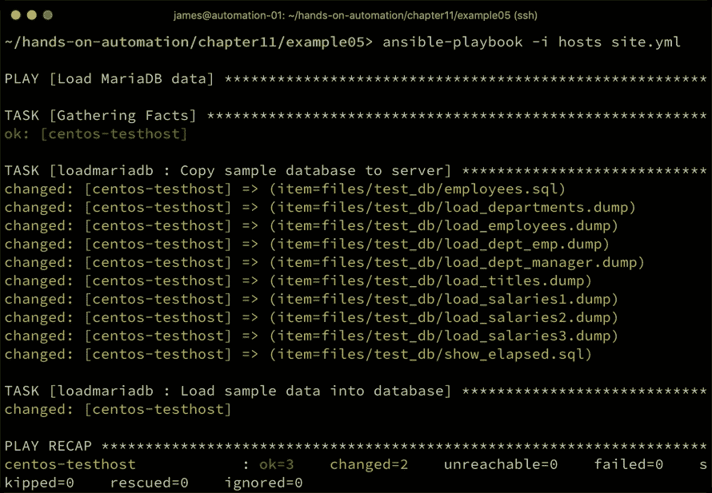

在这里，我们不仅加载了一个示例架构，还将示例数据加载到了数据库中。在你的企业中，你可以根据需要选择单独执行这两个任务中的任何一个。

你可能已经注意到，这个剧本是极其危险的。正如我们之前讨论的，使用 Ansible 剧本中的 `shell` 模块的问题在于，任务的结果会有所不同，因为无论是否需要运行，shell 命令都会被执行。因此，如果你在一个已有名为 `employees` 的数据库的服务器上运行此剧本，它将覆盖数据库中的所有数据，替换为示例数据！与此相比，`copy` 模块仅在目标位置不存在文件时才会复制文件。

鉴于写作时缺乏原生的数据库模块，我们需要设计一种更智能的方式来运行此命令。在这里，我们可以利用 Ansible 内置的一些巧妙的错误处理机制。

`shell` 模块假设它正在运行的命令如果返回退出码为零，则表示命令成功运行。这导致任务返回我们在此剧本运行中看到的 `changed` 状态。然而，如果退出码不为零，`shell` 模块将返回 `failed` 状态。

我们可以利用这个知识，并结合一个有用的 MariaDB 命令，若查询的数据库存在，则该命令返回零退出码，若不存在则返回非零退出码。请参见下面的截图示例：

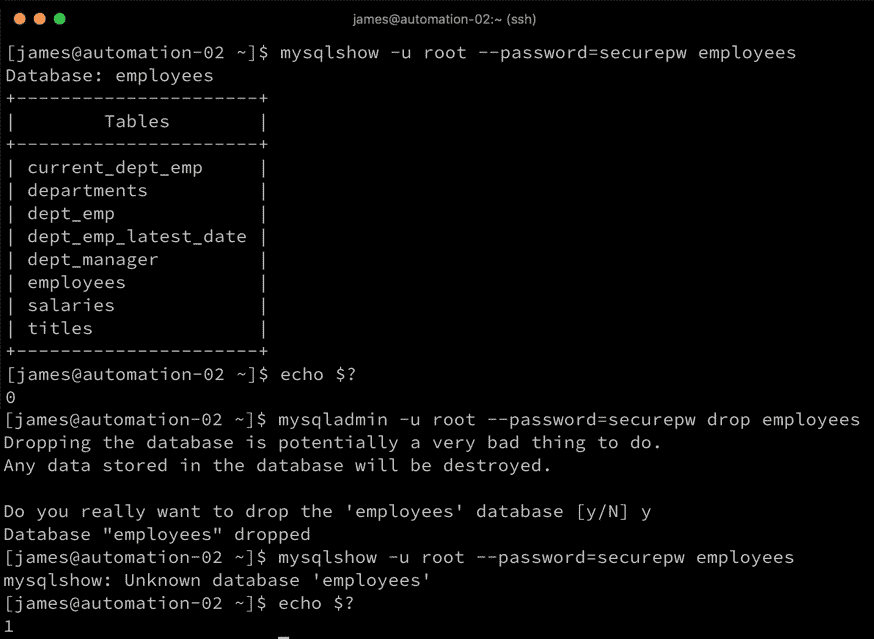

我们可以通过在加载数据的任务之前运行该命令来利用它。我们可以忽略该命令的任何错误，并将其注册到一个变量中。我们使用这个变量来有条件地运行数据加载，仅在出现错误时加载数据（即数据库不存在时，加载数据是安全的）。

`copy` 任务保持不变，但任务的尾部现在如下所示：

```
- name: Check to see if the database exists
  shell: "mysqlshow -u root --password={{ mariadb_root_password }} employees"
  ignore_errors: true
  register: dbexists

- name: Load sample data into database
  shell: "mysql -u root --password={{ mariadb_root_password }} < /tmp/employees.sql"
  args:
    chdir: /tmp
  when: dbexists.rc != 0
```

现在，我们只在数据库不存在的情况下加载数据。为了提供一个简单的示例，这段代码保持简洁，剩下的部分留给你来增强——例如，可以将文件名和数据库名放入变量中，这样角色在不同情况下就能重用（毕竟，编写可重用角色是编写角色的目标之一）。

如果我们现在运行这段代码，我们可以看到它按预期工作——第一次运行时，数据被加载，如下图所示：

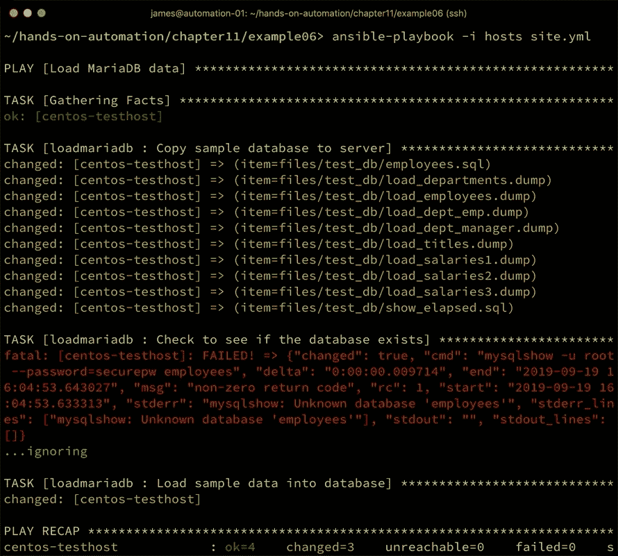

然而，在第二次运行时，它没有执行——以下截图显示了第二次运行的 playbook，以及由于数据库已存在，数据加载任务被跳过的情况：

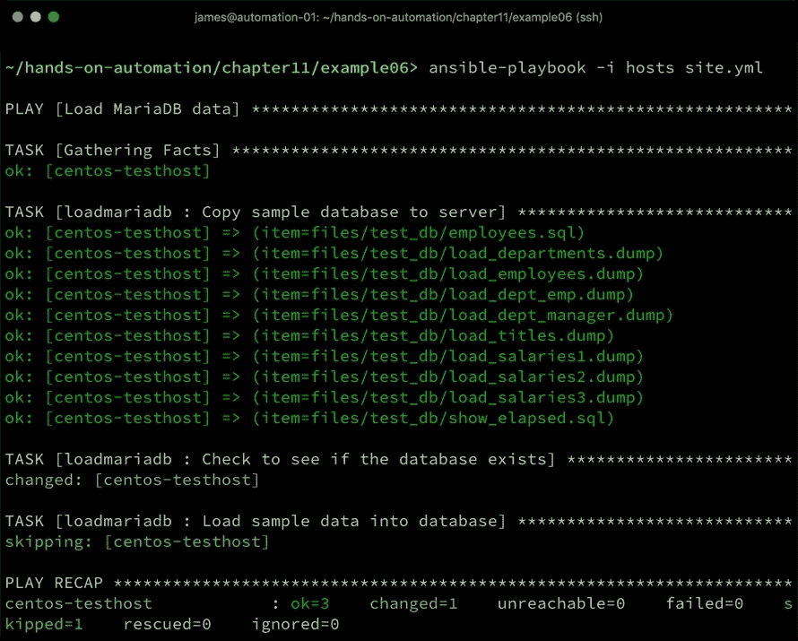

尽管这些示例特定于 MariaDB，但这里执行的高层次过程应该适用于几乎任何数据库。关键是使用`shell`模块来加载数据和/或架构，但以一种减少有效数据库被覆盖的方式，以防 playbook 被重复运行。你应该将这一逻辑扩展到你执行的任何其他任务——你的最终目标应该是，如果 playbook 被意外运行，那么不会对现有数据库造成损害。

完成这个示例后，值得注意的是，Ansible 确实提供了一个名为`mysql_db`的模块，可以原生处理诸如转储和导入数据库数据的任务。现在让我们开发一个使用原生`mysql_db`模块的示例：

1.  如果我们开发一个角色，执行与之前相同的任务，但使用这个原生模块，首先要做的是像之前一样检查数据库是否存在，并将结果注册到一个变量中，如下所示：

```
---
- name: Check to see if the database exists
  shell: "mysqlshow -u root --password={{ mariadb_root_password }} employees"
  ignore_errors: true
  register: dbexists
```

1.  然后我们在任务文件中创建一个`block`，因为如果数据库已经存在，那么在这一步之后运行任何任务都没有意义。`block`使用了我们之前使用的`when`条件语句，用于判断其中的任务是否需要执行，如下所示：

```
- name: Import new database only if it doesn't already exist
  block:

  when: dbexists.rc != 0
```

1.  在`block`内部，我们像之前一样将所有 SQL 文件复制过来进行导入，如下所示：

```
  - name: Copy sample database to server
    copy:
      src: "{{ item }}"
      dest: /tmp/
    loop:
      - files/test_db/employees.sql
      - files/test_db/load_departments.dump
      - files/test_db/load_employees.dump
      - files/test_db/load_dept_emp.dump
      - files/test_db/load_dept_manager.dump
      - files/test_db/load_titles.dump
      - files/test_db/load_salaries1.dump
      - files/test_db/load_salaries2.dump
      - files/test_db/load_salaries3.dump
      - files/test_db/show_elapsed.sql
```

1.  现在，使用`shell`模块和`mysql_db`模块之间有一个重要的区别。当使用`shell`模块时，我们使用了`chdir`参数将工作目录切换到`/tmp`，这是所有 SQL 文件被复制到的地方。而`mysql_db`模块没有`chdir`（或等效的）参数，因此在尝试加载通过`employees.sql`引入的`*.dump`文件时会失败。为了解决这个问题，我们使用 Ansible 的`replace`模块，将这些文件的完整路径添加到`employees.sql`中的相应行，如下所示：

```
  - name: Add full paths to employees.sql as mysql_db won't know where to load them from otherwise
    replace:
      path: /tmp/employees.sql
      regexp: '^source (.*)$'
      replace: 'source /tmp/\1'
```

1.  最后，我们使用`mysql_db`模块加载数据（这类似于我们之前示例中执行的 shell 命令），如下所示：

```
  - name: Load sample data into database
    mysql_db:
      name: all
      state: import
      target: /tmp/employees.sql
      login_user: root
      login_password: "{{ mariadb_root_password }}"
```

1.  当我们运行这段代码时，它达到了与我们之前使用`shell`模块的角色相同的最终结果，如下图所示：

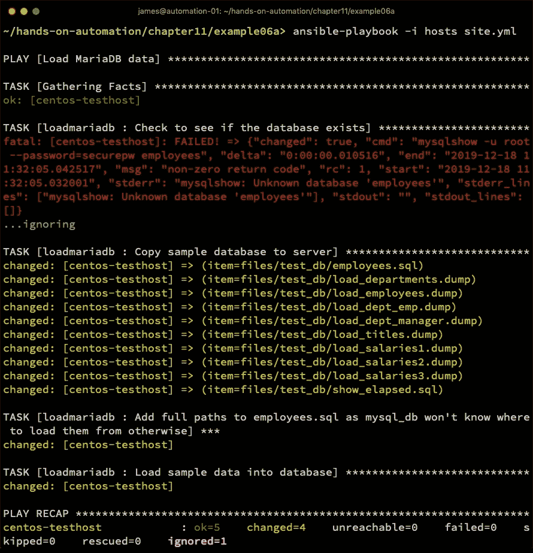

这个过程同样适用于数据库的备份。如果你使用`shell`模块，可以使用`mysqldump`命令来备份数据库，然后将备份的数据复制到你的 Ansible 主机（或其他主机）进行归档。以下是一段简单的示例代码来实现这一点：

1.  由于我们希望备份文件名是动态的，并包含有用的信息，例如当前日期和正在执行备份的主机名，我们使用`set_fact`模块，结合一些内部的 Ansible 变量，来定义备份数据的文件名，如下所示：

```
---
- name: Define a variable for the backup file name
  set_fact:
    db_filename: "/tmp/{{ inventory_hostname }}-backup-{{ ansible_date_time.date }}.sql"
```

1.  然后我们使用`shell`模块运行`mysqldump`，并传入适当的参数来创建备份——深入讨论这些参数超出了本书的范围，但以下示例将创建一个服务器上所有数据库的备份，并且在备份过程中不会锁定表：

```
- name: Back up the database
  shell: "mysqldump -u root --password={{ mariadb_root_password }} --all-databases --single-transaction --lock-tables=false --quick > {{ db_filename }}"
```

1.  `fetch`模块用于检索数据以进行归档——`fetch`的工作方式与我们在本节前面使用的`copy`模块相同，只是它以相反的方向复制数据（即从库存主机到 Ansible 服务器）。运行以下代码：

```
- name: Copy the backed up data for archival
  fetch:
    src: "{{ db_filename }}"
    dest: "/backup"
```

1.  按照常规方式运行会生成完整的数据库备份，备份文件将被复制到我们的 Ansible 服务器，以下截图展示了这一过程：

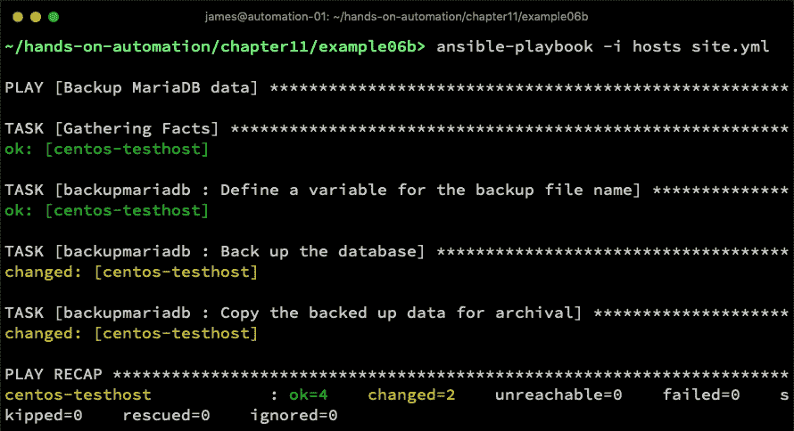

这个示例也可以使用`mysql_db`模块来实现，就像我们之前所做的那样——`set_fact`和`fetch`任务保持完全不变，而`shell`任务则替换为以下代码：

```
- name: Back up the database
  mysql_db:
    state: dump
    name: all
    target: "{{ db_filename }}"
    login_user: root
    login_password: "{{ mariadb_root_password }}"
```

因此，Ansible 不仅可以帮助你将数据加载到数据库中，还可以帮助你进行备份。正如我们之前讨论的那样，通常最好使用原生的 Ansible 模块（如`mysql_db`），但如果原生模块不存在或无法提供所需的功能，只要你应用正确的逻辑，`shell`模块也能为你提供帮助。

现在我们已经考虑了创建数据库并加载数据的过程，我们将在下一节展示如何在此基础上进行扩展，使用 Ansible 执行常规的数据库维护任务。

# 执行常规维护

加载架构和/或数据并不是你使用 Ansible 在数据库上执行的唯一任务。有时，数据库需要手动干预。例如，PostgreSQL 需要定期执行 VACUUM 操作，以释放数据库中未使用的空间。MariaDB 有一个名为`mysqlcheck`的维护工具，可以用来验证表的完整性并执行优化。每个平台都会有自己的特定工具来进行维护操作，你需要为你选择的平台建立最佳的数据库维护实践。此外，有时也需要对数据库进行一些简单的修改。例如，可能需要删除（或更新）表中的一行，以清除应用程序中出现的错误情况。

当然，所有这些操作都可以手动执行——然而，这样做（如同往常一样）会带来丢失操作记录的风险，包括谁执行了任务、如何执行的（例如，提供了哪些选项）。如果我们将这个例子放到 Ansible 和 AWX 的环境中，我们就会突然拥有完整的活动审计轨迹，且我们能准确知道执行了什么操作以及是如何执行的。此外，如果任务需要特定选项，这些选项将被存储在 playbook 中，因此 Ansible 提供的*自我文档化*功能在这里也能发挥作用。

由于到目前为止我们的例子非常以 MariaDB 为中心，让我们看看如何使用 Ansible 在 PostgreSQL 中对表执行完整的 vacuum 操作。

# 使用 Ansible 对 PostgreSQL 进行常规维护

在 Ansible 中，PostgreSQL 有些特殊，因为它拥有比大多数其他数据库更多的原生模块来支持数据库活动。让我们考虑一个示例：对公开的 AdventureWorks 样本数据库中的`销售.creditcard`表执行 vacuum 操作（可以在这里获取：[`github.com/lorint/AdventureWorks-for-Postgres`](https://github.com/lorint/AdventureWorks-for-Postgres)）。

Vacuum 是 PostgreSQL 特有的维护过程，你可能希望定期运行它，特别是当你的表有大量删除或修改时。虽然对此的完整讨论超出了本书的范围，但需要考虑到，受这些活动影响的表可能会变得臃肿，查询可能会随着时间变慢，而 vacuum 操作是一种释放未使用空间并加速查询的方法。

现在，要手动执行 vacuum 操作，你需要使用适当的凭证登录`psql`客户端工具，然后运行以下命令连接到数据库并执行任务：

```
postgres=# \c AdventureWorks
AdventureWorks=# vacuum full sales.creditcard;
```

在实际企业中，这将是一个涉及更多表格，甚至数据库的任务，但在这里，我们将再次保持示例简单，以演示所涉及的原则。将其扩展为大规模应用任务就留给你自己去做吧。让我们首先使用 Ansible 中的`shell`模块来自动化这一过程。这是一个有用的示例，因为该技术适用于大多数主要数据库——你只需确定特定维护操作所需的命令，然后运行它。

执行此任务的简单角色看起来如下：

```
---
- name: Perform a VACUUM on the sales.credit_card table
  shell: psql -c "VACUUM FULL sales.creditcard" AdventureWorks
  become: yes
  become_user: postgres
```

注意——与之前一样——我们非常简单地使用了`shell`模块并带有适当的命令，唯一不同的是，这次我们使用了`become_user`参数切换到`postgres`用户账户，该账户对我们连接的主机上的数据库具有超级用户权限。让我们看看运行时会发生什么，具体如下：

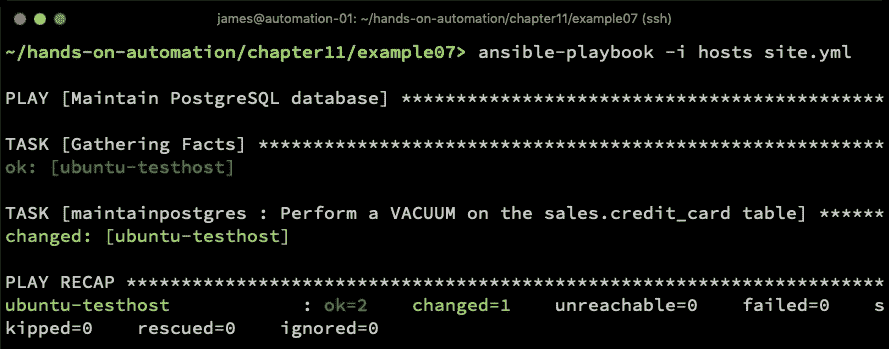

自然地，这可以扩展到几乎任何其他数据库——例如，你可以在 MariaDB 数据库上使用`mysql`客户端工具，甚至运行之前讨论过的`mysqlcheck`工具。真正的限制在于你为`shell`模块编写的脚本，而因为 Ansible 通过 SSH 在数据库服务器上运行命令，你无需担心开放数据库的网络访问——它可以保持紧密的安全限制。

除了使用`shell`模块，Ansible 还为我们提供了直接从名为`postgresql_query`的模块运行查询的选项。虽然这种支持是独特的，但如果有人愿意编写并提交模块，也可以为任何其他数据库添加类似支持。

不幸的是，对于 2.9 之前的 Ansible 版本，我们无法将 VACUUM 示例扩展到这个模块，因为`postgresql_query`模块会在事务块内运行事务，而无法在事务块内运行 VACUUM。如果你正在运行 2.9 或更高版本，现在可以使用示例代码运行 VACUUM，如下所示：

```
---
- name: Perform a VACUUM on the sales.credit_card table
  postgresql_query:
    db: AdventureWorks
    query: VACUUM sales.creditcard
    autocommit: yes
  become_user: postgres
  become: yes
```

通过另一个简单的示例，我们还可以使用`postgresql_query`模块直接操作数据库。

假设使用此数据库的应用程序出现了一个错误，操作员必须手动将信用卡号码插入数据库。执行此操作的 SQL 代码可能如下所示：

```
INSERT INTO sales.creditcard ( creditcardid, cardtype, cardnumber, expmonth, expyear ) VALUES ( 0, 'Visa', '0000000000000000', '11', '2019' );
```

我们可以通过使用如下的角色，在 Ansible 中实现相同的最终结果：

```
---
- name: Manually insert data into the creditcard table
  postgresql_query:
    db: AdventureWorks
    query: INSERT INTO sales.creditcard ( creditcardid, cardtype, cardnumber, expmonth, expyear ) VALUES ( 0, 'Visa', '0000000000000000', '11', '2019' );
  become_user: postgres
  become: yes
```

自然地，你会为数据值使用变量，像这样的敏感数据应始终存储在保险库中（或者，也可以在角色运行时手动输入）。

AWX 有一个叫做 **调查** 的功能，它在执行 playbook 之前会向用户提出一系列预定义的问题。用户对这些问题的回答将存储在 Ansible 变量中——因此，像前面提到的角色可以被参数化，并且从 AWX 运行时，所有的值都可以通过调查输入，避免使用 vault 以及担心敏感客户数据存储在 Ansible 中的问题。

正如你在这里看到的，当我们运行这个角色时，实际上在 `INSERT` 操作成功时会显示更改状态——这对于监控此类任务并确保它们按预期执行非常有用。以下截图显示了此角色的运行情况以及 `changed` 状态，表示数据成功插入到 `sales.creditcard` 表中：

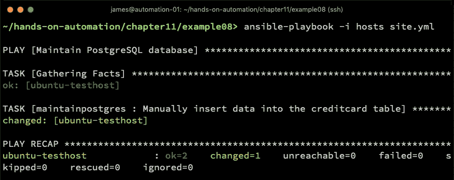

当涉及到使用 Ansible 进行数据库管理时，世界真的是你的舞台，无论需要什么任务，所有数据库任务都应以标准化、可重复和可审计的方式进行，就像您企业的其他 Linux 系统一样。希望本章能帮助您了解如何实现这一目标。

# 总结

数据库是大多数企业应用堆栈中的核心部分，Linux 平台上有多种数据库可供选择。尽管许多数据库有自己的管理工具，Ansible 非常适合协助执行各种数据库管理任务，从安装数据库服务、加载初始数据或架构（甚至从备份中恢复）到处理日常维护任务。结合 Ansible 的错误处理和安全自动化，几乎没有任何限制，您可以使用 Ansible 执行各种数据库管理任务。

本章中，您学习了如何使用 Ansible 一致且可重复地安装数据库服务器。然后，您学习了如何导入初始数据和架构，并扩展到自动化备份任务。最后，您获得了使用 Ansible 执行一些常规数据库维护任务的实践知识。

在下一章中，我们将探讨 Ansible 如何协助您执行 Linux 服务器的常规维护任务。

# 问题

1.  为什么使用 Ansible 安装和管理数据库平台是明智的选择？

1.  使用 Ansible 管理数据库配置文件的最佳实践是什么？

1.  Ansible 如何帮助您保持数据库在网络上的安全？

1.  在什么情况下，您会使用 Ansible 的 `shell` 模块而不是本地数据库模块？

1.  为什么要使用 Ansible 执行例行维护？

1.  如何使用 Ansible 执行 PostgreSQL 数据库备份？

1.  您会使用哪个模块来操作 MariaDB 数据库中的用户？

1.  目前 Ansible 中对 PostgreSQL 的支持有何独特之处？

# 进一步阅读

+   要深入了解 Ansible，读者请参考*《精通 Ansible，第 3 版》——詹姆斯·弗里曼*和*杰西·基廷*（[`www.packtpub.com/gb/virtualization-and-cloud/mastering-ansible-third-edition`](https://www.packtpub.com/gb/virtualization-and-cloud/mastering-ansible-third-edition)）。

+   要了解更多关于 PostgreSQL 数据库管理的具体内容，读者可以参考*《学习 PostgreSQL 11，第 3 版》——安德烈·沃尔科夫，萨拉赫丁·朱巴*（[`www.packtpub.com/gb/big-data-and-business-intelligence/learning-postgresql-11-third-edition`](https://www.packtpub.com/gb/big-data-and-business-intelligence/learning-postgresql-11-third-edition)）。

+   同样，要了解更多关于 MariaDB 数据库管理的内容，读者可以参考*《MariaDB Essentials》——费德里科·拉佐利，埃米连·肯勒*（[`www.packtpub.com/gb/application-development/mariadb-essentials`](https://www.packtpub.com/gb/application-development/mariadb-essentials)）。

+   要查看所有可用的 Ansible 模块，读者可以参考[`docs.ansible.com/ansible/latest/modules/list_of_database_modules.html.`](https://docs.ansible.com/ansible/latest/modules/list_of_database_modules.html)
