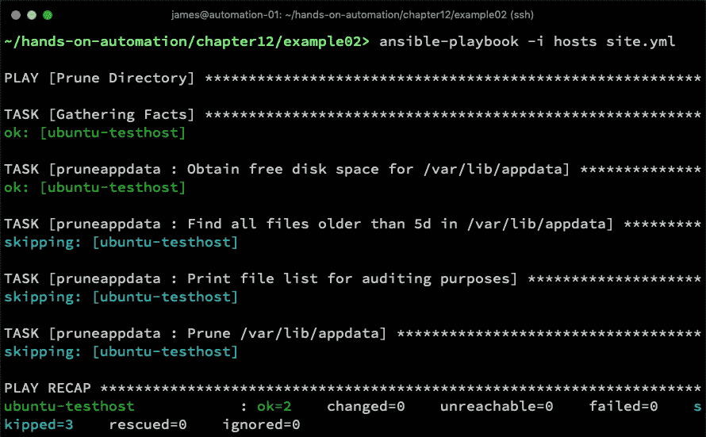

# 使用 Ansible 执行常规维护  

在您完成本书的学习后，您将已经完成了多个步骤，为您的企业定义并构建了一个支持自动化的 Linux 环境。然而，Ansible 对您的环境的帮助并未就此结束。即便是一个已经构建并在使用中的环境，也需要定期进行维护和干预。从前，这些干预通常由系统管理员手动执行，使用 shell 命令或脚本。  

正如我们在本书中多次提到的那样，手动执行的任务给企业带来了许多挑战——其中最重要的是，它们可能没有很好地文档化，因此新员工的学习曲线较陡。此外，我们的老朋友可审计性和可重复性也会出现——如果每个人都直接登录到 Linux 机器的 shell 并手动执行任务，您如何确保知道谁在什么时候做了什么？

在本章中，我们将探讨 Ansible 如何帮助企业管理 Linux 环境的日常工作，特别是在执行常规维护任务时。Ansible 功能强大，您进行常规维护的可能性不仅限于本章中的示例——这些示例旨在帮助您入门，并通过示范展示您可能能够自动化的任务种类。  

本章将具体介绍以下主题：  

+   清理磁盘空间  

+   监控配置漂移  

+   使用 Ansible 管理进程  

+   使用 Ansible 执行滚动更新  

# 技术要求  

本章包括以下技术的示例：  

+   Ubuntu Server 18.04 LTS  

+   CentOS 7.6  

+   Ansible 2.8  

要运行这些示例，您需要访问两台服务器或虚拟机，每台运行一个上述操作系统，同时安装 Ansible。请注意，本章中给出的示例可能具有破坏性（例如，它们会删除文件并更改服务器配置），如果按原样运行，它们仅适用于在隔离的测试环境中运行。  

一旦您确认已拥有一个安全的操作环境，就可以开始使用 Ansible 进行常规系统维护了。  

本章讨论的所有示例代码都可以在 GitHub 上找到，网址为：[`github.com/PacktPublishing/Hands-On-Enterprise-Automation-on-Linux/tree/master/chapter12`](https://github.com/PacktPublishing/Hands-On-Enterprise-Automation-on-Linux/tree/master/chapter12)。  

# 清理磁盘空间  

系统管理员需要定期完成的最常规、最琐碎（但却至关重要）任务之一就是清理磁盘空间。尽管理想情况下，系统应该是良好运作的——例如，日志文件应该进行轮换，临时文件应该被清理——但是在这个行业有经验的人都会知道，情况并不总是如此。本书的作者曾在一些环境中工作，在这些环境中，清理某个特定目录被视为常规任务——因此，它是自动化的最佳候选项。

当然，你不会随便从文件系统中删除文件。任何这样的任务都应该以精确的方式执行。让我们来看一个实际的例子——由于这是假设的，我们来创建一些测试文件。假设我们的虚构应用每天都会创建一个数据文件，并且从不清理其 `data` 目录。为了模拟这个情况，我们可能会创建一些数据文件，像这样：

```
$ sudo mkdir -p /var/lib/appdata
$ for i in $(seq 1 20); do DATE=$(date -d "-$i days" +%y%m%d%H%M); sudo touch -t $DATE /var/lib/appdata/$DATE; done
```

上面的命令创建了一个名为 `/var/lib/appdata` 的目录，并且为过去 20 天的每一天创建了一个（空的）文件。当然，我们也可以创建有数据的文件，但这对这个例子没有影响——我们并不想真正填满磁盘！

现在，假设我们的磁盘空间快满了，我们想清理这个目录，只保留最近 5 天的数据。如果我们手动执行此操作，可能会使用久经考验的 `find` 命令，列出符合条件的文件，并删除较旧的文件。这看起来可能是这样：

```
$ sudo find /var/lib/appdata -mtime +5 -exec rm -f '{}' \;
```

这是一个相当简单的命令，你可能会惊讶地发现，类似的命令在企业级的 Linux 服务器运行手册中非常常见。让我们用 Ansible 来改进这个过程。我们知道，如果我们在 Ansible 中实现它，以下情况将会发生：

+   Ansible 引擎将根据所采取的操作返回适当的状态——`ok`、`changed` 或 `failed`。前面的代码块中展示的 `find` 命令无论是否删除任何文件，都会返回相同的输出和退出代码。

+   我们编写的 Ansible 代码将具有自我文档化的特性——例如，它将以适当的 `name` 开始——可能是 `Prune /var/lib/appdata`。

+   Ansible 代码可以从 AWX 或 Ansible Tower 运行，确保这个常规任务可以委派给适当的团队，使用内置的基于角色的访问控制。

+   此外，任务可以在 AWX 中赋予一个用户友好的名称，这意味着操作员无需任何专业知识即可开始有效地协助管理 Linux 环境。

+   AWX 和 Ansible Tower 会忠实地记录任务执行的输出，确保将来能够审核这些清理任务。

当然，Ansible 的这些好处对我们来说并不新鲜——我们在整本书中经常提到它们。尽管如此，我还是希望强调企业中有效自动化的好处。让我们从定义一个角色开始，来执行这个具体的功能——使用 Ansible 修剪超过 5 天的文件目录：

1.  我们首先利用 Ansible 的`find`模块，它使我们能够构建一个文件系统对象的列表（如文件或目录），就像`find` shell 命令一样。我们将`find`模块的输出`register`到一个 Ansible 变量中，以便稍后使用，具体如下：

```
- name: Find all files older than {{ max_age }} in {{ target_dir }}
  find:
    paths: "{{ target_dir }}"
    age: "{{ max_age }}"
    recurse: yes
  register: prune_list
```

这里展示的代码片段应该比较容易理解—然而请注意，我们已经为`path`和`age`参数使用了变量；这是有充分理由的。角色的核心在于代码的复用，如果我们通过变量定义这些参数，就可以复用这个角色来修剪其他目录（例如，针对不同的应用），而无需修改角色代码本身。你还会发现，我们可以在任务的`name`中使用这些变量—当我们将来回头审计 Ansible 运行时，这非常有用且强大。

1.  `find`模块将构建一个我们需要删除的文件列表——然而，考虑到我们审计的目标，可能对我们来说有用的是在 Ansible 输出中打印这些文件名，以确保我们稍后可以回来并准确了解删除了哪些文件。请注意，我们不仅可以打印路径—也许捕获文件大小和时间戳信息会更有用？所有这些信息都可以在我们之前捕获的`prune_list`变量中找到，你可以自行探索这些内容。（提示：将`msg: "{{ item.path }}"`替换为`msg: "{{ item }}"`，查看`find`任务捕获的所有信息。）运行以下代码：

```
- name: Print file list for auditing purposes
  debug:
    msg: "{{ item.path }}"
  loop:
    "{{ prune_list.files }}"
  loop_control:
    label: "{{ item.path }}"
```

在这里，我们只是使用 Ansible 的循环，遍历`find`模块生成的数据——具体来说，从我们的变量中的`files`字典提取`path`字典项。`loop_control`选项防止 Ansible 在每个`debug`消息前打印整个字典结构，而是仅使用每个文件的`path`作为`label`。

1.  最后，我们使用`file`模块删除文件，依旧像之前那样遍历`prune_list`，具体如下：

```
- name: Prune {{ target_dir }}
  file:
    path: "{{ item.path }}"
    state: absent
  loop:
    "{{ prune_list.files }}"
  loop_control:
    label: "{{ item.path }}"
```

1.  在角色完成后，我们必须为我们的 play 定义变量—在本例中，我在引用我们新角色的`site.yml`剧本中定义了它们，具体如下：

```
---
- name: Prune Directory
  hosts: all
  become: yes
  vars:
    max_age: "5d"
    target_dir: "/var/lib/appdata"

  roles:
    - pruneappdata
```

使用本节之前生成的测试文件运行此代码，将会得到类似于下面这样的输出：


为了确保截图能适应屏幕，前面的测试文件集已经进行了缩减—但是你可以清楚地看到输出，以及哪些文件被删除了。

虽然良好的维护是服务器管理的关键部分，但有时我们只希望在绝对必要时采取行动（例如修剪目录）。假如我们决定这个角色只有在包含`/var/lib/appdata`的文件系统剩余磁盘空间少于 10%时才会运行，会怎么样呢？

以下过程演示了如何使用 Ansible 执行条件性维护，只有当磁盘使用率超过 90%时才会运行：

1.  我们首先修改现有的角色——首先，我们为角色添加了一个新任务，以获取`target`目录的磁盘使用率百分比，如下所示：

```
---
- name: Obtain free disk space for {{ target_dir }}
  shell: df -h "{{ target_dir }}" | tail -n 1 | awk {'print $5 '} | sed 's/%//g'
  register: dfresult
  changed_when: false
```

尽管 Ansible 有包含磁盘使用信息的事实数据，但我们在这里使用`df`命令，因为它可以直接查询我们的目录——如果我们想成功使用 Ansible 的事实数据，我们必须以某种方式追溯到它所在的挂载点。我们还使用`changed_when: false`，因为这个 shell 任务如果没有这个设置，会总是显示变化的结果，这可能会让输出变得令人困惑——这是一个只读查询，所以不应该有任何变化！

1.  将这些数据收集并注册在`dfresult`变量中后，我们将现有代码包装在一个代码块中。Ansible 中的代码块只是将一组任务封装在一起的方式——因此，与其在我们之前示例中的三个任务上分别加上`when`条件，我们直接将条件放在代码块上。代码块的开始可能是这样的：

```
- name: Run file pruning only if disk usage is greater than 90 percent
  block:

  - name: Find all files older than {{ max_age }} in {{ target_dir }}
    find:
```

注意之前的任务集现在被缩进了两个空格。这确保 Ansible 理解它是该代码块的一部分。缩进所有现有任务，并用以下代码结束该代码块：

```
    loop_control:
      label: "{{ item.path }}"
  when: dfresult.stdout|int > 90
```

在这里，我们使用标准输出捕获的`dfresult`变量，将其转换为整数，然后检查它是否为 90%或更高。因此，只有当文件系统超过 90%满时，我们才会运行修剪任务。当然，这只是一个条件——你可以收集任何需要的数据，以在其他多种情况下运行你的任务。在我的测试服务器上运行这个新角色，服务器的磁盘利用率远低于 90%，可以看到修剪任务被完全跳过，如下截图所示：



通过这种方式，我们可以轻松地在大型企业环境中执行常规的磁盘维护任务，并且——就像 Ansible 的使用方式一样——你能做的事情没有上限。希望本节中的示例能给你一些关于如何入手的启发。在接下来的部分中，我们将探讨如何使用 Ansible 有效地监控 Linux 环境中的配置漂移。

# 监控配置漂移

在第七章中，*使用 Ansible 进行配置管理*，我们探讨了 Ansible 如何在企业规模上部署配置并强制执行它。现在，让我们在此基础上，增加一个新的内容——监控配置漂移。

正如我们在第一章中讨论的，*在 Linux 上构建标准操作环境*，手动更改是自动化的敌人。除此之外，它们也是一个安全风险。让我们通过一个具体的例子来演示。如本书前面所建议的，建议通过 Ansible 管理**安全外壳（SSH）**服务器配置。SSH 是管理 Linux 服务器的标准协议，不仅可以用于管理，还可以用于文件传输。简而言之，它是人们访问你的服务器的关键机制之一，因此确保其安全至关重要。

然而，也常见多个人拥有 Linux 服务器的 root 访问权限。无论是开发人员在部署代码，还是系统管理员在执行日常（或修复）工作，很多人拥有服务器的 root 访问权限是完全正常的。如果每个人都*表现得很得体*，并积极支持企业中的自动化原则，那是没问题的。但是，如果有人做出未经授权的更改怎么办？

通过 SSH 配置，可能会启用远程 root 登录。也可能在你禁用了密码认证并改用基于密钥的认证时，重新启用基于密码的认证。许多时候，这些更改是为了支持懒惰——例如，作为 root 用户复制文件更容易。

无论意图和根本原因如何，某人手动更改你之前部署的 Linux 服务器配置都是一个问题。那么，如何检测这些更改呢？当然，你没有时间登录到每台服务器手动检查文件。然而，Ansible 可以提供帮助。

在第七章中，*使用 Ansible 进行配置管理*，我们提出了一个简单的 Ansible 示例，该示例从模板中部署 SSH 服务器配置，并在配置发生更改时使用处理程序重启 SSH 服务。

我们实际上可以将这段代码重新用于我们的配置漂移检查。即使不做任何代码更改，我们也可以在*检查*模式下使用 Ansible 运行剧本。检查模式不会对正在操作的系统做出任何更改——相反，它会尽力预测可能发生的任何更改。这些预测的可靠性在很大程度上取决于角色中使用的模块。例如，`template`模块能够可靠地预测更改，因为它知道写入的文件是否与现有文件不同。相反，`shell`模块永远无法知道`change`和`ok`结果之间的区别，因为它是一个通用模块（尽管它可以在合理的准确度范围内检测失败）。因此，我强烈建议在使用该模块时使用`changed_when`。

让我们看看如果重新运行之前的`securesshd`角色，这次使用检查模式会发生什么。结果可以在以下截图中看到：


在这里，我们可以看到确实有人更改了 SSH 服务器配置——如果它与我们提供的模板匹配，输出将会像这样：


到目前为止，一切顺利——你可以将其运行在一百台，甚至一千台服务器上，你会知道任何`changed`结果都来自那些 SSH 服务器配置不再与模板匹配的服务器。你甚至可以再次运行剧本来纠正这种情况，只是这次不在检查模式下运行（也就是说，命令行上没有`-C`标志）。

在像 AWX 或 Ansible Tower 这样的环境中，作业（即运行剧本）被分类为两种不同的状态——成功和失败。成功是指任何运行到完成的剧本，只产生`changed`或`ok`结果。然而，失败则是由于剧本运行返回一个或多个`failed`或`unreachable`状态。

因此，我们可以通过让剧本在配置文件与模板版本不同的情况下发出`failed`状态来增强它。角色的主体部分保持不变，但在我们的模板任务中，我们添加了以下子句：

```
  register: template_result
  failed_when: (template_result.changed and ansible_check_mode == True) or template_result.failed
```

这些对任务的操作产生了以下影响：

+   任务的结果会被注册到`template_result`变量中。

+   我们将这个任务的失败条件改为如下：

    +   模板任务的结果发生了变化，我们正在以检查模式运行它。

    +   或者，模板任务因其他原因失败——这是一个通用情况，确保我们仍然正确报告其他失败情况（例如，文件访问被拒绝）。

你将观察到`failed_when`子句中同时使用了逻辑`and`和`or`运算符——这是扩展 Ansible 操作的一种强大方式。现在，当我们在检查模式下运行剧本并且文件发生变化时，我们会看到以下结果：


现在，我们可以非常清楚地看到我们的主机上存在问题，并且它将在 AWX 和 Ansible Tower 中报告为失败。

当然，这对于纯文本文件非常有效。那么二进制文件呢？Ansible 当然不能完全替代像**高级入侵检测环境**（**AIDE**）或久负盛名的**Tripwire**这样的文件完整性监控工具——然而，它也可以帮助处理二进制文件。事实上，过程非常简单。假设你想确保`/bin/bash`的完整性——这是大多数系统默认使用的 Shell，因此该文件的完整性非常重要。如果你有空间在你的 Ansible 服务器上存储原始二进制文件的副本，那么你可以使用`copy`模块将其复制到目标主机。`copy`模块利用校验和来判断文件是否需要复制，因此，你可以确信，如果`copy`模块返回`changed`结果，那么目标文件与原始版本不同，完整性已被破坏。该角色的代码将与我们在此处的模板示例非常相似：

```
---
- name: Copy bash binary to target host
  copy:
    src: files/bash
    dest: /bin/bash
    owner: root
    group: root
    mode: 0755
  register: copy_result
  failed_when: (copy_result.changed and ansible_check_mode == True) or copy_result.failed
```

当然，将原始二进制文件存储在 Ansible 服务器上是低效的，而且还意味着你必须保持它们与服务器修补计划同步，这在需要检查大量文件时并不理想。幸运的是，Ansible 的`stat`模块可以生成校验和，并返回有关文件的其他有用数据，因此，我们可以非常容易地编写一个剧本，通过运行以下代码来检查我们的 Bash 二进制文件是否被篡改：

```
---
- name: Get sha256 sum of /bin/bash
  stat:
    path: /bin/bash
    checksum_algorithm: sha256
    get_checksum: yes
  register: binstat

- name: Verify checksum of /bin/bash
  fail:
    msg: "Integrity failure - /bin/bash may have been compromised!"
  when: binstat.stat.checksum != 'da85596376bf384c14525c50ca010e9ab96952cb811b4abe188c9ef1b75bff9a'
```

这是一个非常简单的示例，可以通过确保文件路径、名称和校验和是变量而不是静态值来显著增强。它还可以通过遍历一个包含文件及其相应校验和的字典来进行改进——这些任务留给你自己完成，这是完全可能的，使用我们在本书中介绍的技术。现在，如果我们运行这个剧本（无论是否在检查模式下），如果 Bash 的完整性没有得到保持，我们将看到失败的结果，否则将看到`ok`，如下所示：


校验和可以用来验证配置文件的完整性，因此，这个示例角色为你可能进行的任何文件完整性检查提供了良好的基础。

我们现在已经完成了对 Ansible 文件和完整性监控的探索，因此，也具备了检查配置漂移的能力。在本章的下一部分，我们将看看如何使用 Ansible 来管理企业 Linux 环境中的进程。

# 使用 Ansible 理解进程管理

迟早，你会需要在你的企业内部管理，甚至可能需要终止一个或多个 Linux 服务器上的进程。显然，这不是理想的场景，在日常操作中，大多数服务应该使用 Ansible 的`service`模块进行管理，在本书中我们已经看到过许多这样的示例。

但是，如果你需要真正终止一个挂起的服务呢？显然，系统管理员可以通过 SSH 进入故障服务器并发出如下命令：

```
$ ps -ef | grep <processname> | grep -v grep | awk '{print $2}'
$ kill <PID1> <PID2>
```

如果进程固执地拒绝终止，那么以下操作可能是必要的：

```
$ kill -9 <PID1> <PID2>
```

尽管这是一个相当标准的做法，大多数系统管理员都会熟悉（并且可能有自己喜欢的工具来处理，例如 `pkill`），但它与大多数服务器上的手动干预面临相同的问题——你如何追踪发生了什么，哪些进程受到了影响？如果使用了数字 **进程 ID** (**PID**)，即使访问了命令历史记录，也仍然无法确定哪个进程曾经占用过那个数字 PID。

我们在这里提出的是一种非传统的 Ansible 用法——如果通过像 AWX 或 Ansible Tower 这样的工具运行，它将使我们能够追踪所有执行过的操作，以及谁执行了这些操作的详细信息，如果我们将进程名称作为参数传递，还可以追踪目标是什么。这个功能在将来可能会非常有用，尤其是当我们需要分析问题的历史时，这样就可以轻松检查哪些服务器被操作过，哪些进程被目标化，并且还能得到精确的时间戳。

让我们构建一个角色来执行这套任务。本章最初是针对 Ansible 2.8 编写的，当时没有用于进程管理的模块，因此，以下示例使用原生的 Shell 命令来处理这种情况：

1.  我们首先运行我们之前在本节中提出的进程列表，但这次我们将 PID 列表注册到一个 Ansible 变量中，如下所示：

```
---
- name: Get PID's of running processes matching {{ procname }}
  shell: "ps -ef | grep -w {{ procname }} | grep -v grep | grep -v ansible | awk '{print $2\",\"$8}'"
  register: process_ids
```

熟悉 Shell 脚本的人应该能够理解这一行——我们在系统进程表中筛选出与 Ansible 变量 `procname` 完全匹配的项，并去除可能出现的任何多余进程名称（例如 `grep` 和 `ansible`），以免混淆输出。最后，我们使用 `awk` 将输出处理成一个逗号分隔的列表，其中第一列包含 PID，第二列则是进程名称。

1.  现在，我们必须开始对这个输出进行操作。我们将对之前填充的 `process_ids` 变量进行循环，并对输出的第一列（即数字 PID）执行 `kill` 命令，如下所示：

```
- name: Attempt to kill processes nicely
  shell: "kill {{ item.split(',')[0] }}"
  loop:
    "{{ process_ids.stdout_lines }}"
  loop_control:
    label: "{{ item }}"
```

你将观察到这里使用了 Jinja2 过滤器——我们可以使用内置的`split`函数来拆分我们在前一个代码块中创建的数据，仅取输出的第一列（数字 PID）。不过，我们使用`loop_control`标签来设置任务标签，包含 PID 和进程名称，在审计或调试场景中可能非常有用。

1.  任何有经验的系统管理员都知道，仅仅发出`kill`命令来终止进程是不够的——某些进程必须强制终止，因为它们可能挂起。并非所有进程都会立即退出，因此我们将使用 Ansible 的`wait_for`模块来检查`/proc`目录中的 PID——当它变为`absent`时，我们就知道该进程已退出。运行以下代码：

```
- name: Wait for processes to exit
  wait_for:
    path: "/proc/{{ item.split(',')[0] }}"
    timeout: 5
    state: absent
  loop:
    "{{ process_ids.stdout_lines }}"
  ignore_errors: yes
  register: exit_results
```

我们在这里将超时设置为 5 秒——然而，你应根据你的环境适当设置它。再次，我们将输出注册到一个变量中——我们需要知道哪些进程未能退出，因此尝试更强制地终止它们。注意，我们在这里设置了`ignore_errors`，因为`wait_for`模块如果未能在指定的`timeout`内使所需状态（即`/proc/PID`变为`absent`）发生时，会产生错误。对此我们不应视为错误，而应作为进一步处理的提示。

1.  现在，我们遍历`wait_for`任务的结果——这次，我们使用 Jinja2 的`selectattr`函数，仅选择那些已经断言为`failed`的字典项；我们不想强制终止不存在的 PID。运行以下代码：

```
- name: Forcefully kill stuck processes
  shell: "kill -9 {{ item.item.split(',')[0] }}"
  loop:
    "{{ exit_results.results | selectattr('failed') | list }}"
  loop_control:
    label: "{{ item.item }}"
```

现在，我们尝试使用`-9`标志终止卡住的进程——通常足以杀死大多数挂起的进程。再一次，注意 Jinja2 过滤器的使用和循环的整洁标签，以确保我们可以将此角色的输出用于审计和调试。

1.  现在，我们运行剧本，指定`procname`的值——没有默认的进程可供终止，我不建议为此变量设置默认值是安全的。因此，在下图中，我使用`-e`标志在调用`ansible-playbook`命令时设置它：


从前面的截图中，我们可以清楚地看到剧本终止了`mysqld`进程，且剧本的输出简洁明了，但包含了足够的调试信息，以备不时之需。

作为附加说明，如果你使用的是 Ansible 2.8 或更高版本，现在有一个原生的 Ansible 模块叫做`pids`，它将返回一个干净、整洁的 PID 列表，列出正在运行的指定进程名。如果我们要适应这个新功能，首先可以移除 shell 命令，并用`pids`模块替代，它更易于阅读，如下所示：

```
---
- name: Get PID's of running processes matching {{ procname }}
  pids:
    name: "{{ procname }}"
  register: process_ids
```

从这一点开始，角色几乎与之前相同，不同之处在于，我们不再使用从 shell 命令生成的逗号分隔列表，而是拥有一个简单的列表，仅包含与名称中的 procname 变量匹配的每个运行中进程的 PID。因此，在对变量执行命令时，我们不再需要使用 Jinja2 的 split 过滤器。运行以下代码：

```
- name: Attempt to kill processes nicely
  shell: "kill {{ item }}"
  loop:
    "{{ process_ids.pids }}"
  loop_control:
    label: "{{ item }}"

- name: Wait for processes to exit
  wait_for:
    path: "/proc/{{ item }}"
    timeout: 5
    state: absent
  loop:
    "{{ process_ids.pids }}"
  ignore_errors: yes
  register: exit_results

- name: Forcefully kill stuck processes
  shell: "kill -9 {{ item.item }}"
  loop:
    "{{ exit_results.results | selectattr('failed') | list }}"
  loop_control:
    label: "{{ item.item }}"
```

这段代码执行的功能与之前相同，只不过现在它更具可读性，因为我们减少了所需的 Jinja2 过滤器数量，并且我们去掉了一个 shell 命令，改用了 `pids` 模块。结合前面讨论的 `service` 模块，这些技术应能为你提供坚实的基础，满足你所有使用 Ansible 进行进程控制的需求。

在本章的下一部分也是最后一部分中，我们将看看如何在集群中有多个节点时使用 Ansible，并且你不希望一次性将它们全部停机。

# 使用 Ansible 进行滚动更新

关于常规维护的章节，如果没有涉及滚动更新，那么将是不完整的。到目前为止，在本书中，我们的示例保持简单，通常只有一个或两个主机，并假设所有示例都可以扩展以管理成百上千的服务器，使用相同的角色和 playbook。

总体而言，这种情况是成立的——然而，确实存在某些特殊情况，我们可能需要更深入地了解 Ansible 的操作。让我们构建一个假设的例子，其中有四个 Web 应用服务器位于负载均衡器后面。需要部署 Web 应用代码的新版本，且部署过程需要多个步骤（因此，需要多个 Ansible 任务）。在我们的简单示例中，部署过程将如下所示：

1.  将 Web 应用代码部署到服务器。

1.  重启 Web 服务器服务，以加载新代码。

在生产环境中，你几乎肯定会采取进一步的步骤来确保你的 Web 服务的完整性——例如，如果它位于负载均衡器后面，在代码部署期间，你需要将其下线，并确保在经过验证正常工作之前不会重新上线。预计并非所有读者都能接触到这样的环境，因此，示例保持简单，以确保每个人都能尝试。

我们可以轻松地编写一个简单的 Ansible 角色来执行这个任务——示例如下所示：

```
---
- name: Deploy new code
  template:
    src: templates/web.html.j2
    dest: /var/www/html/web.html

- name: Restart web server
  service:
    name: nginx
    state: restarted
```

这段代码按顺序执行我们的两个步骤，完全符合我们的需求。不过，让我们来看一下，当我们在 playbook 中运行这个角色时会发生什么。结果如下图所示：


注意 Ansible 如何执行这些任务。首先，新的代码在所有四台服务器上部署。然后，才重启它们。出于多种原因，这可能并不理想。例如，在第一个任务之后，服务器可能处于不一致的状态，而你可能不希望四台服务器同时处于不一致状态，因为任何使用 Web 应用程序的用户都会遇到错误。此外，如果 playbook 由于某种原因出错并进入失败状态，它将忠实地在所有四台服务器上失败，从而破坏整个 Web 应用程序并导致服务中断。

为了防止这种问题的发生，我们可以使用`serial`关键字，要求 Ansible 每次只对一定数量的服务器进行更新。例如，如果我们在调用此角色的`site.yml` playbook 中插入`serial: 2`这一行，行为将变得相当不同，正如下面的截图所示：


上面的输出为了节省空间被截断了，但清晰地显示了 playbook 现在每次只在两台服务器上运行—因此，在执行的初始阶段，只有`cluster1`和`cluster2`是异常的，而`cluster3`和`cluster4`保持一致且未受影响。只有在前两台服务器上的所有任务完成后，接下来的两台才会被处理。

故障处理同样重要，自动化的一个危险是，如果代码或 playbook 中存在问题，可能很容易破坏整个环境。例如，如果我们的`部署新代码`任务对所有服务器都失败了，那么每次只在两台服务器上运行 playbook 也无济于事。Ansible 仍会忠实地执行它被要求的操作——在这种情况下，就是将所有四台服务器都弄坏。

在这种情况下，将`max_fail_percentage`参数添加到 playbook 中是个好主意。例如，如果我们将其设置为`50`，那么当 50%的库存主机失败时，Ansible 将停止处理主机，正如下面的截图所示：


如我们所见，尽管我们的库存没有变化，Ansible 在处理完`cluster1`和`cluster2`后停止了，因为它们失败了，因此没有对`cluster3`和`cluster4`执行任何任务；因此，至少有两台主机保持正常工作，允许用户继续使用 Web 应用程序，尽管发生了故障。

在处理大型负载均衡环境时，使用这些 Ansible 功能非常重要，以确保故障不会传播到整个服务器群。以上就是我们对 Ansible 在日常服务器维护中使用的总结——如同往常一样，可能性是无穷无尽的，但希望本章能再次为你提供一些灵感和可供构建的示例。

# 总结

Ansible 是一个非常强大的工具，但不仅仅用于部署和配置管理。虽然这些是它的核心优势，但在日常管理任务中，它也能提供强大的帮助。正如以往一样，当它与 AWX 或 Ansible Tower 等企业管理工具结合使用时，它在管理你的 Linux 系统中变得非常重要，尤其是在审计和调试方面。

在这一章中，你学会了如何使用 Ansible 清理磁盘空间，并使其具备条件执行功能。你还学会了 Ansible 如何帮助监控配置漂移，甚至警报可能的二进制文件篡改。你了解了如何使用 Ansible 管理远程服务器上的进程，最后，你学会了如何在负载均衡的服务器池中，以优雅和受控的方式执行滚动更新。

在下一章中，我们将探讨如何通过 CIS 基准标准以标准化的方式保护你的 Linux 服务器。

# 问题

1.  为什么在检查磁盘空间时，你可能会使用 `df` 命令的输出，而不是 Ansible 事实？

1.  哪个 Ansible 模块用于根据给定的标准（例如，文件的年龄）定位文件？

1.  为什么监控配置漂移很重要？

1.  在 Ansible 中，有哪两种方式可以监控基于文本的配置文件的变化？

1.  如何使用 Ansible 管理远程服务器上的 `systemd` 服务？

1.  Ansible 中的内置过滤功能是什么，它可以帮助处理字符串输出（例如，拆分逗号分隔的列表）？

1.  如何在 Ansible 变量中拆分一个以逗号分隔的列表？

1.  在负载均衡环境中，为什么不希望所有任务都在所有服务器上同时执行？

1.  哪个 Ansible 功能可以防止你将失败的任务推送到所有服务器？

# 进一步阅读

+   要深入了解 Ansible，请参考 *Mastering Ansible, 第三版——James Freeman* 和 *Jesse Keating*（[`www.packtpub.com/gb/virtualization-and-cloud/mastering-ansible-third-edition`](https://www.packtpub.com/gb/virtualization-and-cloud/mastering-ansible-third-edition)）
