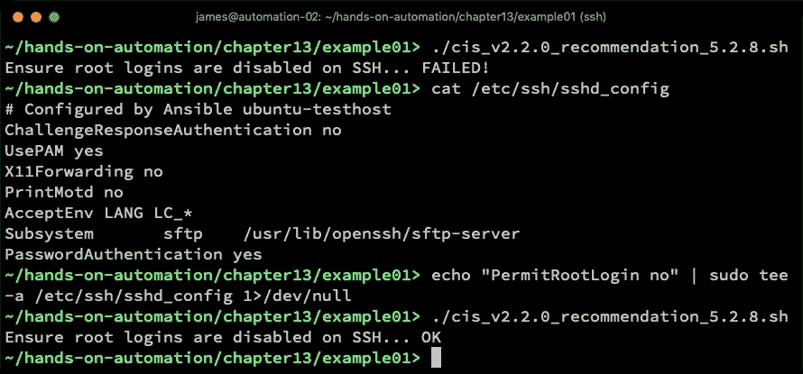
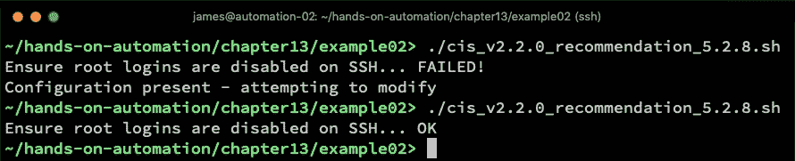
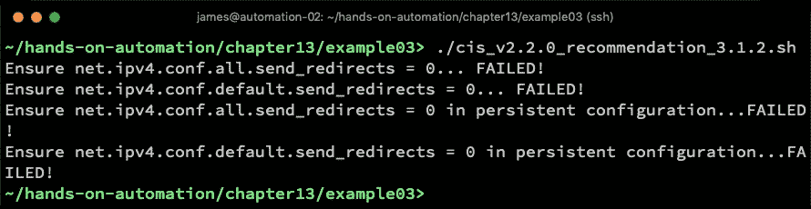
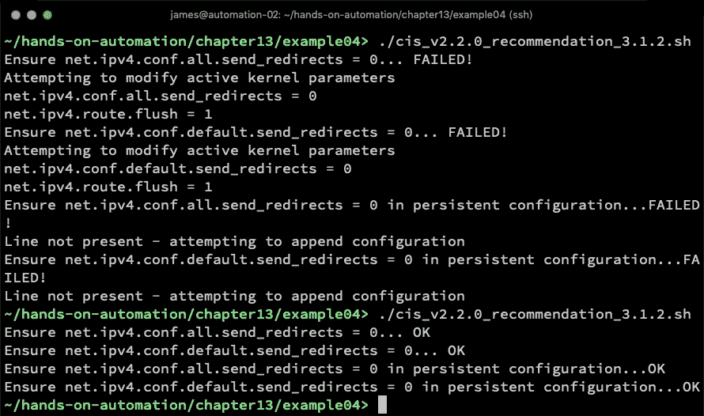
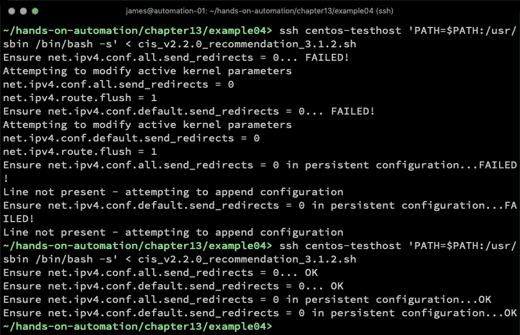

# 使用 CIS 基准

在企业中实施 Linux 时，安全性至关重要。没有一步可以达到真正安全环境的极乐境界 —— 而是一系列不同步骤的融合，共同构建尽可能安全的环境。事实上，这种说法带出了另一个重要观点 —— 安全性是一个移动的目标。举个例子，SSLv2 曾被认为是安全的，并用于保护互联网上的网站多年。然后在 2016 年发生了 DROWN 攻击，使其不安全。因此，2015 年为互联网流量（也许是前端 Web 服务器）保护的服务器，在当时被认为是安全的。然而，在 2017 年，它被认为是极易受攻击的。

Linux 本身一直被认为是安全的操作系统，尽管其高水平和日益增长的采用率导致攻击不断增加。在本书中，我们在设计 Linux 系统时，高层次上提倡良好的安全实践，例如，在基础操作系统镜像上不安装不必要的服务。尽管如此，我们可以做更多工作，使我们的 Linux 环境更安全，在本章中，我们将探讨已开发的标准以确保 Linux 环境的安全性。具体来说，我们将考虑使用 CIS 基准，并举一些实际示例来应用它们。

具体来说，本章将涵盖以下主题：

+   理解 CIS 基准

+   明智地应用安全策略

+   自动化部署服务器加固脚本

# 技术要求

本章包括基于以下技术的示例：

+   CentOS 7.6

+   Ansible 2.8

要运行这些示例，您需要访问两台运行前述操作系统的服务器或虚拟机，以及 Ansible。请注意，本章中给出的示例可能具有破坏性（例如，它们会删除文件并对服务器配置进行更改），如果按照示例运行，则仅应在隔离的测试环境中运行。

一旦您确信您有一个安全的操作环境可以操作，请开始使用 Ansible 进行日常系统维护。

本章中讨论的所有示例代码都可以从 GitHub 获取，网址如下：[`github.com/PacktPublishing/Hands-On-Enterprise-Automation-on-Linux/tree/master/chapter13`](https://github.com/PacktPublishing/Hands-On-Enterprise-Automation-on-Linux/tree/master/chapter13)。

# 理解 CIS 基准

在深入了解 CIS 基准实际包含什么之前，让我们看看它们为何存在，以及它们在概念上是什么。

# 什么是 CIS 基准？

无论操作系统如何，保护服务器都是一项重大任务。它要求随时跟踪发现的新攻击向量和漏洞（请参阅本章介绍中关于 DROWN 攻击和 SSLv2 的提及）。有些事情是众所周知并被认为是*正常*的。例如，在 Linux 上，作为 root 登录通常是不被认可的——相反，几乎普遍认为每个用户应该有自己的用户账户，并且应该使用`sudo`命令执行所有需要提升权限的命令。因此，一些 Linux 发行版如 Ubuntu 默认情况下禁用了远程 root 访问。而其他一些，如 CentOS，则没有。即使在企业中广泛使用的这两个关键发行版之间，您也知道，对于其中一个，您需要积极关闭远程 root SSH 访问，而对于另一个，则只需检查是否已关闭。

当然，定义安全策略远不止于是否允许通过 SSH 获取 root 访问权限。多年来，个人积累了关于什么有效的知识，也许是通过艰难的方式，了解了什么是无效的。然而，您的环境安全性不应由系统管理员的经验决定。相反，应该制定一些定义良好的标准，以最佳方式保护服务器，以防止大多数常见攻击，并确保在需要审计以查找事件根本原因时记录适当级别的信息。

这就是 CIS 基准概念的所在。许多人熟悉基准的概念作为性能测试（即速度）。然而，您的服务器是否安全可以通过查找特定标准进行测试，因此 CIS 基准存在。直接引用来自**互联网安全社区**（**CIS**简称）网站的内容：

"CIS 基准是通过一个由全球网络安全专业人士和主题专家组成的独特共识过程来开发的。"

因此，这些基准可以被视为行业专业人员最佳实践的综合。此外，它们定期更新，因此可以被工程师和管理员用来了解保护服务器的最佳实践。

当然，需要注意的是，存在比 CIS 基准更深入的其他安全标准，例如 FedRAMP 和 NSA 安全要求。在本书中，不可能详细讨论所有不同的配置文件，因此我们将重点放在 CIS 基准上，该基准是免费提供的（交换一些个人信息）并且也备受推崇。

本书专注于 CIS 基准规范，并不意味着您应该在服务器基础设施上实施这些规范以确保其安全。每位读者都有责任确保他们理解自己的安全需求，并相应地实施正确的安全措施。在本章中，我们通过 CIS 基准规范作为服务器硬化的工作示例来进行讨论。

还值得注意的是，CIS 基准规范是按技术分割的。例如，有适用于 Red Hat Enterprise Linux 7 和 Ubuntu Server 的 CIS 基准规范，您可以将其应用于您的企业 Linux 系统。然而，这些规范侧重于保护基本操作系统，如果在其上安装了应用层，则必须同样应用适当的安全策略。

CIS 基准规范涵盖了超过 140 种技术，包括常见的 Linux 服务，如 nginx、Apache 和 PostgreSQL。因此，如果您正在构建一个面向互联网的 Web 服务器，应用操作系统基准规范和所选 Web 服务器的适当规范是有意义的。

如果您有一个定制的应用层，或者只是在使用 CIS 网站未列出的技术，请不要绝望——请使用适当的基准规范保护底层操作系统，然后尽可能以最佳方式应用安全实践。互联网上通常会有很好的建议，但弄清楚这一点超出了本书的范围。

可在此处找到所有有关 CIS 基准规范的技术的完整列表：[`www.cisecurity.org/cis-benchmarks/`](https://www.cisecurity.org/cis-benchmarks/)。

一旦您获得了所选操作系统的安全基准规范，就该考虑其应用了。然而，在这一步之前，在本章的下一节中，我们将更详细地探讨 Linux 操作系统的 CIS 基准规范的内容。

# 深入探讨 CIS 基准规范

让我们通过查看 RHEL 7 的 CIS 基准规范来深入探讨 CIS 基准规范的实际示例。在撰写本文时，此版本为 2.2.0 版本，共有 386 页！因此，我们立即可以看出，实施此基准规范不太可能是一个简单的活动。

当你浏览文档时，你会发现我们最感兴趣的部分——*建议*部分——被划分为几个子部分。每个部分都专注于操作系统中的特定安全领域。写作时，*第一部分*完全是关于操作系统的初始设置；在构建时可能会应用的参数和配置。*第二部分*则完全是关于保护可能默认安装在 RHEL 7 服务器上的常见服务。*第三部分*处理网络配置，而*第四部分*详细讲解了日志记录和审计日志设置，确保你在日常使用中捕捉到足够的数据。这是为了确保你可以审计服务器，并在不幸遭遇安全漏洞或故障时查明发生了什么。*第五部分*考虑了对服务器的访问和认证（这里你会找到提到 SSH 服务器安全的内容——实际上，你会看到禁用远程 root 登录的示例在文档版本 2.2.0 的基准 5.2.8 中）。最后，*第六部分*标题为*系统维护*，旨在定期运行，而不是仅运行一次，以确保系统的完整性。

当然，我们在本书中之前讨论过，任何拥有 root 权限的人都可以更改核心系统配置，因此建议定期运行（或至少检查）所有基准，以确保符合原始政策。

我们将在本书接下来的两章中探讨这个话题；然而，目前让我们先回到对 CIS 基准本身的进一步理解。当你查看每个建议时，你会注意到每个建议都有一个关联的等级，并且它们要么是*已评分*，要么是*未评分*（这一点会在每个基准的标题中说明）。

这些基准旨在作为合规检查的一部分，贡献于系统的最终报告或评分——而已评分的建议实际上会影响最终得分。因此，如果你的系统符合检查要求，最终得分会提高——然而，如果未符合要求，最终得分则会下降。那些标记为*未评分*的建议对最终得分没有任何影响。换句话说，未实施它们不会导致扣分。

当然，这并不意味着它们在考虑时不重要。举个例子，考虑一下版本 2.2.0 RHEL 7 基准的 3.7 条，它的标题是*确保禁用无线接口*。每个基准的背后都有一个理由，这个基准的理由如下：

“如果无线不打算使用，可以禁用无线设备，以减少潜在的攻击面。”

这是一个逻辑上的方法 — 我们知道如果您的设备有无线接口，则应禁用它，除非在使用中。此外，无线安全协议在历史上一直存在漏洞，就像 SSLv2 一样，因此从长远来看，无线网络通信可能不被认为是真正安全的。尽管如此，在运行 RHEL 7 的企业笔记本电脑上，您不能保证它将连接到有线网络连接。无线网络可能是唯一的选择，在这种情况下，您需要将其保持打开。

当然，CIS Benchmark 不能替你做出这个决定 — 只有你才知道你的系统是否需要启用其无线网络适配器（如果有的话），因此这是一个非计分项目是合理的。

相比之下，我们的老朋友 Benchmark 5.2.8（禁用远程 root SSH 访问）被评分，因为在企业环境中启用此项没有合理理由。因此，如果不能达到这个 Benchmark，我们期望我们的系统评分会降低。

每个 Benchmark 都详细说明了如何测试所述条件或配置的存在，以及如何应用所需的配置。

此外，您还会注意到每个 Benchmark 都与一个级别相关联，可以是 1 或 2。在每种情况下，对于 RHEL 7，您将看到这些级别适用于两种不同的情景 — RHEL 7 作为服务器和工作站的使用。再次深入探讨这些级别的含义时，这是有道理的。

第一级别旨在成为您应用于环境中的合理安全基线，以减少攻击面。它不打算对您的 Linux 环境的日常业务使用产生广泛影响，因此第一级别的 Benchmarks 是较不侵入性的实施方式。

相比之下，第二级别的 Benchmarks 提供了更严格的安全级别，极有可能对您环境的日常使用产生影响。

如果我们再次看 Benchmark 3.7，我们会看到它被分类为服务器的第一级别和工作站的第二级别。这是有道理的 — 服务器不太可能有无线网络适配器，即使有，也很少使用，因此禁用它对服务器的日常使用几乎没有影响。然而，如果在 RHEL 7 笔记本电脑上实施 Benchmark 3.7，那么它的移动性就会大大降低，因此第二级别的分类提醒了我们这一点。想象一下拥有一台笔记本电脑却无法在无线网络上使用 — 对许多人来说，这在今天的时代是不可行的概念！

Benchmark 5.2.8 被认为是服务器和工作站的第一级别，因为通常情况下不建议在日常操作中使用 **root 账户** — 因此，在 SSH 上禁用对其的访问不应对日常运行产生任何影响。

在理想的情况下，你应该在应用基准之前阅读并理解所有基准，以免其影响你的操作方式 —— 例如，我仍然发现一些系统在脚本操作时使用 root 帐户进行 SSH 访问，虽然我的第一任务通常是纠正这一点，但如果我盲目地将 CIS 基准应用到这些系统上，我将破坏一个原本工作正常的设置。

然而，承认管理企业 Linux 环境的任何人都非常忙，你可能会原谅认为可以简单地将得分级别 1 的基准应用到你的系统上。确实，这会给你一个合理的安全基线，同时带来相对较低的风险 —— 但是彻底细致起见是无法替代的。在本章的下一节中，我们将更详细地探讨如何明智地选择基准，而不会在你的环境中引发问题！

# 明智地应用安全策略

正如我们在前一节中开始探讨的，每个 CIS 基准都有与之相关的级别和评分。级别对我们特别关注，因为虽然我们希望尽可能有效地保护我们的系统，但我们不希望破坏任何正在运行的系统。因此，强烈建议在隔离的测试环境中应用基准并测试你的应用程序，然后再将其部署到生产环境中。确实，如果应用某个基准导致某个系统出现故障，企业应执行以下流程来解决问题：

1.  确定哪个基准引起了问题。

1.  确定哪些内部系统受基准影响。

1.  决定是否可以修改内部系统以与基准配合工作（例如，使用 SSH 的非特权帐户而不是 root）。

1.  实施内部系统的更改，并普遍应用基准，或者（只有在有充分理由时）为该基准提出例外并记录下来。

CIS 基准甚至可能破坏你的 Ansible 自动化 —— 最简单的例子是，你正在使用 root 帐户执行你的自动化任务，并在 CIS 基准部署过程中禁用此帐户。在这种情况下，你会发现 Ansible 无法访问你的所有系统，甚至最糟糕的情况是，你将不得不手动修改每台服务器以恢复 Ansible 的访问。

虽然我们不能在本章逐个审查基准，但在以下小节中，我们将探讨一些相关示例以供注意。希望这能为你提供足够的信息，以审查适合你选择的 Linux 版本的基准，然后就你环境中安全策略的最佳利益做出知情决策。

我们将继续使用 RHEL 7 基准版本 2.2.0 的示例。然而，这里描述的大部分内容也适用于其他 Linux 平台。配置文件路径甚至日志文件路径可能会有所不同，但这些将在适合您操作系统的相关 CIS 基准中详细说明，请务必下载最适合您的基准。

现在我们已经考虑了安全策略应用的总体原则，我们将在下一节从 SELinux 策略的具体示例开始深入讨论。

# 应用 SELinux 安全策略

RHEL 7 基准的 1.6.1 节涉及 SELinux 的实施，并包括检查以确保 SELinux 处于强制模式，而不是在某个级别上被禁用。您将注意到，这些检查都是 2 级基准，这意味着它们可能会破坏现有系统。

在支持的操作系统上启用和应用 SELinux 是一个非常好的主意，但即使在撰写本文时，仍有许多 Linux 应用程序不支持它，并且其安装说明中指出必须禁用 SELinux 才能使应用程序正常工作。这显然并不理想，相反，您应该创建一个 SELinux 策略，允许您的应用堆栈在不需要禁用 SELinux 的情况下工作。

并非所有企业都有完成这项工作所需的技能和时间，因此对这一组基准需要仔细考虑 —— 简而言之，如果可能的话应用它，但可能需要做一些例外。

如果您使用的是 Ubuntu，则应该将相同的逻辑应用于默认情况下在 Ubuntu Server 上启用的 AppArmor。

在本章的下一节中，我们将看一下 CIS 基准如何影响 Linux 上文件系统的挂载方式。

# 文件系统的挂载

在 Linux 中，所有文件系统在使用之前必须被挂载 —— 这简单来说是将诸如磁盘分区之类的块设备映射到路径上。对于大多数用户来说，这是透明的，并且发生在启动时，但对于那些负责配置系统的人来说，这需要一些注意。例如，`/tmp` 文件系统通常对所有用户可写，因此不希望让人们在此目录中执行文件，因为他们可以将任意二进制文件放在那里，自己或他人都可以运行。因此，通常使用 `noexec` 标志挂载此文件系统来达到这个目的。

在已部署的机器上更改分区的挂载选项（甚至分区结构）可能会有问题。此外，许多云平台具有平坦的文件系统结构，因此 `/tmp` 的前述示例可能无法实现，因为它无法与 `root` 分区分开挂载。因此，建议您将此部分 CIS 基准纳入到您的服务器（或映像）构建过程中，并根据需要为公共云平台创建排除项。

CIS 基准测试中*第 1.1 节*（标题为*文件系统配置*）中的基准正是关注这些细节，且这些基准需要根据你的环境进行调整。例如，基准 1.1.1.8 建议禁用挂载 FAT 文件系统的能力，*第 1.1.5 节*则建议禁用在`/tmp`目录下执行二进制文件，如前所述。这些都是评分基准，目前，几乎不需要在`/tmp`目录下使用或挂载 FAT 卷或执行文件。然而，在某些遗留环境中，这仍然可能是必要的，因此在应用这些设置时需要小心。

同样，关于为重要路径（如`/tmp`和`/var`）设置独立的文件系统，以及特别的挂载选项，也有很多建议。这些方法在很多情况下是有效的，但再次强调，直接声明这些方法对所有环境都有效是过于冒险的，尤其是在已有环境中，因此这些方法应该在了解环境要求的基础上应用。

在了解 CIS 基准对文件系统挂载的影响之后，我们将继续讨论使用文件校验和进行入侵检测的建议。

# 安装高级入侵检测环境（AIDE）

基准 1.3.1 涉及安装**高级入侵检测环境**（**AIDE**）——这是一个现代化的替代工具，取代了久负盛名的**Tripwire**，可以扫描文件系统并校验所有文件，从而提供一种可靠的方法来检测文件系统的修改。

从表面上看，安装和使用 AIDE 是个非常好的主意——然而，如果你有一个包含 100 台机器的环境，并且对所有机器进行更新，你将收到 100 份报告，每份报告中都包含大量的文件变更细节。对此问题有其他解决方案，包括开源的 OSSEC 项目（[`www.ossec.net/`](https://www.ossec.net/)），但这并不是 CIS 基准测试的一部分，因此需要你决定哪种解决方案最适合你的企业。

当然，这并不是说 AIDE 不应该使用——恰恰相反。更准确地说，是如果你选择使用 AIDE，确保你有相应的流程来处理和理解报告，并确保你能区分误报（例如，由于软件包更新而导致的二进制文件校验和变化）与真正恶意且意外的修改（例如，即使没有进行软件包更新，`/bin/ls`却发生了变化）。

在查看 AIDE 是否适合安装在你的 Linux 基础设施上之后，我们将继续讨论 CIS 基准对服务启动时默认配置的影响。

# 理解 CIS 服务基准

基准的第 2.2 节详细列出了围绕需禁用服务的若干评分为 1 级的基准。再次强调，背后的理由是攻击面应该最小化，因此，例如，除非服务器是作为网站服务器使用的，否则`httpd`不应运行。

尽管这一点本身合乎逻辑，但回顾这一部分时，会发现许多服务可能对你的环境至关重要，包括`squid`、`httpd`和`snmpd`。对于所有这些基准，只有在有意义的情况下才能应用。你不会在网站服务器上关闭 Apache，也不会在代理服务器上禁用`squid`。

然而，关于这些基准，在应用时有很好的指导，特别是对于`snmpd`，如果你的环境依赖于此进行监控，甚至有关于如何保护该服务的指导。

# X Windows

基准 2.2.2 进一步确保 X Windows 服务器从你的系统中实际卸载。大多数服务器都是无头的，因此可以做到这一点——但是，你不会对工作站或执行远程桌面功能的系统进行此操作。

一定要将这个基准应用到你的服务器上，但只有在你确认应用它是安全的情况下才进行。

# 按网络允许主机

基准 3.4.2 和 3.4.3 确保`/etc/hosts.allow`和`/etc/hosts.deny`已正确配置——这意味着，对于所有处理这两个文件的服务，只有来自允许网络的连接会被处理。

这通常是个好主意——然而，许多组织拥有良好的防火墙，甚至有些组织的政策是不允许在服务器上使用本地防火墙，因为这会使调试过程更加复杂。如果连接被拒绝，防火墙越多，你就越需要检查，才能找出被拒绝的地方。

因此，建议你根据公司的安全政策来应用这两个基准。

# 本地防火墙

对于第 3.6 节中有关安装和配置 iptables 的基准也适用同样的原则。尽管这个本地防火墙增加了服务器的安全性，但它与许多公司安全政策相冲突，后者倾向于使用更少、更集中化的防火墙，而不是多个本地防火墙。请根据公司政策应用这些基准。

# 评分的总体指导

你会注意到，我建议你在应用时要小心的许多基准实际上都有评分。这引出了关于评分的更广泛的观点——应用 CIS 基准的目的不是为了获得 100%的分数。相反，它是为了获得最适合你环境的最高分数，从而使你的企业能够正常运行。

评分应当用来建立你自己的基准——一旦你按照本章讨论的方式完成了所有基准的工作，你将知道哪些适合你的企业，从而确定你的目标分数。

通过对基准反复应用的结果进行审计，可以进行多次评分练习，以跟踪环境的整体合规性和随时间推移的偏离情况。例如，如果反复审计显示分数逐渐下降，那么你就知道在合规性方面存在问题，必须找出根本原因——无论是用户对系统进行未经授权的更改，还是推出了未正确加固的新服务器。

无论哪种方式，你的 CIS 基准分数将成为监控你的 Linux 系统与安全策略合规性的重要工具。在本章的下一部分，我们将探讨如何使用脚本化的方法来应用和确保 CIS 基准的合规性。

# 服务器加固的脚本化部署

我们花了一些时间探索 CIS 基准及其预期的工作方式。现在，让我们将注意力转向更实际的问题——如何审计它们以及如何实施它们。在本书中，我们重点关注 Ansible 作为自动化这些任务的工具，事实上，Ansible 是一个非常适合这个目的的优秀解决方案。话虽如此，当然你已经注意到，CIS 基准文档中的示例通常是 shell 命令，或者在某些情况下，仅仅是关于应当存在（或不存在）于某个文件中的配置行的说明。

为了清晰地解释如何在 Linux 系统上审计和实施 CIS 基准，我将示例分为两部分。在本章的这一部分，我们将开发传统的 shell 脚本，用于检查是否符合 CIS 基准，并在需要时实施相关建议。这将与 CIS 基准文档本身非常相似，从而有助于我们理解如何实施它们。接下来，在下一章，我们将把这些基于 shell 脚本的示例发展成 Ansible 角色，以便我们可以使用自己喜欢的自动化工具来管理 CIS 基准的合规性。

让我们通过一些示例来演示如何开发这些脚本，从我们的 SSH 根登录示例开始。

# 确保禁用 SSH 根登录

RHEL 7 基准版本 2.2.0 中的 CIS 建议 5.2.8 指出，我们应当禁用远程 root 登录。我们在其他情境中已经讨论过这个例子，下面我们将特别查看 CIS 基准文档中的建议，以帮助我们理解应该如何实施这一建议。

文档中指出，为了审计这一要求（并因此对这一项进行评分），应观察以下测试结果：

```
# grep "^PermitRootLogin" /etc/ssh/sshd_config 
PermitRootLogin no
```

请注意，命令是供人类解释其输出的——该命令将返回该文件中的`PermitRootLogin`行，无论它是启用还是禁用。文本显示了所需的输出，但假设运行测试的人会读取输出并检查是否启用——这种方式在小规模上是可行的，但不适合自动化使用。建议的修复方法是编辑`/etc/ssh/sshd_config`，设置以下参数：

```
PermitRootLogin no
```

到目前为止，一切顺利——CIS 基准文档描述得相当清晰，甚至为我们的编码提供了一个良好的开端。然而，正如之前所述，这些代码片段实际上并没有帮助我们以自动化的方式检查或实施该推荐。

假设我们想使用 shell 脚本进行此条件的审核。在这种情况下，我们需要运行基准文档中提到的`grep`命令，但使用更精确的模式，以确保我们仅在`PermitRootLogin`行被设置为`no`时才匹配该行。然后我们会检查所需的输出，并根据检查结果通过`echo`输出适当的消息到控制台。这个脚本可能看起来是这样的（请注意，在 shell 脚本中有多种方式可以实现相同的最终结果！）：

```
#!/bin/sh
#
# This file implements CIS Red Hat Enterprise Linux 7 Benchmark
# Recommendation 5.2.8 from version 2.2.0
echo -n "Ensure root logins are disabled on SSH... "
OUTPUT=$(grep "^PermitRootLogin no" /etc/ssh/sshd_config)
if [ "x$OUTPUT" == "x" ]; then
  echo FAILED!
else
  echo OK
fi
```

对于熟悉 shell 脚本的人来说，脚本相当简单，但简而言之，步骤如下：

1.  我们在文件顶部加入了一些有用的文档注释，以便我们知道正在测试哪个推荐。请注意，推荐编号可能会在文档版本之间发生变化，因此记录这两个编号非常重要。

1.  我们通过`echo`输出一行关于正在运行的测试的说明文本。

1.  然后，运行 CIS 基准中建议的审核命令，不过这次我们要检查是否存在`PermitRootLogin no`行。输出将被捕获到`OUTPUT`变量中。

1.  如果`OUTPUT`的内容为空，则说明我们检查的行在文件中不存在，测试被认为是失败的。我们可以放心地假设这一点，因为默认情况下 OpenSSH 服务器启用了 root 登录，因此如果配置文件中缺少此行，且假设我们的`grep`模式没有问题，那么 root 登录已启用。我们会将这个信息通过`echo`输出到终端，让用户知道需要采取行动。

1.  `OUTPUT`变量应该包含文本的唯一条件是`grep`命令找到了所需的模式。如果满足这一条件，那么我们会输出一条不同的消息，告知用户测试通过，并且不需要进一步的操作。

让我们看看这个脚本的实际操作，以及手动尝试修复问题：



在这里，我们可以看到一个典型的手动过程，许多系统管理员和工程师在管理其系统时都会遇到这个过程。我们运行了之前定义的检查脚本，结果返回了`FAILED!`。因此，我们的第一步是查看配置文件，看看为什么测试失败。造成这种结果的原因可能有两种——要么是包含`PermitRootLogin`的行根本不存在，要么是该行被注释掉了。在这种情况下，前者被证明是正确的。

如果该行已经存在，但被注释掉了，我们可以使用`sed`（或其他内联编辑工具）取消注释该行，并将参数设置为`no`。然而，由于该行并不存在，我们需要将该行添加到文件中，这在前一个截图中已经使用`tee -a`命令完成。请注意，这需要与`sudo`一起使用，因为只有`root`用户才能写入此文件。然后我们再次运行测试，测试通过了。当然，你会注意到，也完全可以直接用`vim`（或你喜欢的编辑器）打开这个文件，手动修复问题；然而，前面的示例可以为脚本化解决方案提供支持。

从前面的例子来看，这是一个极其缓慢且手动的过程。如果在单一服务器（例如模板镜像）上执行这个过程已经够糟糕了，想象一下要在整个 Linux 服务器系统中扩展这个过程，再加上所有 CIS 基准文档中的推荐项。这项任务将成为某个人的全职（且非常繁琐）的工作。

更好的做法是自动化这个过程，你会注意到，在 CIS 基准文档中，不仅有审计服务器上推荐设置的测试用例，还有推荐的修改内容。在大多数情况下，这只是说明在给定的配置文件中应该存在哪些行。 在这种情况下，我们要确保以下内容：

```
PermitRootLogin no
```

如果我们尝试通过进一步开发 Shell 脚本来解决这个问题，当测试结果为`FAILED!`时，我们需要执行以下步骤（对于`OK`结果，不需要进一步操作）：

1.  由于我们未能在文件中匹配到所需的模式，我们知道该行要么存在，但设置错误，要么根本不存在（可能是缺失或被注释掉）。我们可以忽略后两种可能性之间的区别，因为保留被注释掉的行并添加正确的行是不会造成任何问题的。因此，我们的第一项任务是测试`PermitRootLogin`行是否存在，无论它的设置是什么：

```
  OPTPRESENT=$(grep -e "^PermitRootLogin.*" /etc/ssh/sshd_config)
  if [ "x$OPTPRESENT" == "x" ]; then
  ...
  else
  ...
  fi
```

1.  在前一个截图中，我们正在寻找配置文件中以`PermitRootLogin`开头的任何一行。如果没有返回任何内容（我们的正面测试案例），那么我们就知道必须通过在`if`语句下方直接添加以下内容来将该行添加到文件中：

```
    echo "Configuration not present - attempting to add"
    echo "PermitRootLogin no" | sudo tee -a /etc/ssh/sshd_config 1>/dev/null
```

1.  到目前为止，一切顺利。然而，如果我们的`grep`命令确实返回了一些输出，我们就知道该行存在且值不正确，因此我们可以使用像`sed`这样的工具来就地修改该行：

```
    echo "Configuration present - attempting to modify"
    sudo sed -i 's/^PermitRootLogin.*/PermitRootLogin no/g' /etc/ssh/sshd_config
```

1.  当我们修改了文件（无论采用哪种方式）后，我们知道必须重启`sshd`才能使更改生效。因此，在内层`if`结构的`fi`语句结束处，我们添加如下内容：

```
  sudo systemctl restart sshd
```

1.  当我们在 SSH 配置中运行此命令且该设置不存在时，我们会看到以下行为——请注意，第二次运行脚本时，显示修改已成功：


1.  类似地，如果我们运行它，且该行存在但不符合 CIS 基准，我们会看到以下情况：



这非常棒——我们刚刚使用了 shell 脚本来自动化 CIS 基准文档中的一项建议。然而，你会注意到我们开发的 shell 脚本包含了很多重复的部分，其他人要理解起来会有一定难度。

此外，这项建议是比较简单的——在这种情况下，只有一个文件中的一行需要修改。如果建议内容更为复杂呢？我们在下一节中看看这个问题。

# 确保禁用数据包重定向发送

版本 2.2.0 的 RHEL 基准中的推荐 3.1.2 稍微详细一些——这是一个评分为级别 1 的基准，确保你的服务器不会向其他主机发送路由信息。除非它们被配置为路由器，否则没有合理的理由这么做。

从文档本身可以看到，推荐的审计命令（及其结果）如下：

```
$ sysctl net.ipv4.conf.all.send_redirects 
net.ipv4.conf.all.send_redirects = 0
$ sysctl net.ipv4.conf.default.send_redirects 
net.ipv4.conf.default.send_redirects = 0
$ grep "net\.ipv4\.conf\.all\.send_redirects" /etc/sysctl.conf /etc/sysctl.d/*
net.ipv4.conf.all.send_redirects = 0
$ grep "net\.ipv4\.conf\.default\.send_redirects" /etc/sysctl.conf /etc/sysctl.d/*
net.ipv4.conf.default.send_redirects= 0
```

要运行的命令以`$`字符开始，而期望的结果显示在下一行。我们已经可以看到，将其开发成一个 shell 脚本需要一些工作——我们需要验证两个`sysctl`命令的输出，然后还需要检查配置文件，以确保这些参数在重启和内核参数重新加载时能保持不变。

我们可以通过一些 shell 代码轻松检查当前的内核参数设置，例如：

```
echo -n "Ensure net.ipv4.conf.all.send_redirects = 0... "
OUTPUT=$(sysctl net.ipv4.conf.all.send_redirects | grep "net.ipv4.conf.all.send_redirects = 0" 2> /dev/null)
if [ "x$OUTPUT" == "x" ]; then
    echo FAILED!
  else
    echo OK
fi
```

你会注意到，代码结构几乎与我们用于检查 SSH 中`PermitRootLogin`参数的代码相同——因此，尽管自动化审计过程的代码变得更容易，但它也变得高度重复且低效。类似的代码块将用于检查`net.ipv4.conf.default.send_redirects`参数的值。

我们还可以检查这些参数的持久性配置，同样通过将 CIS 基准文档中的审计命令构建成类似我们之前做的条件结构：

```
echo -n "Ensure net.ipv4.conf.all.send_redirects = 0 in persistent configuration..."
OUTPUT=$(grep -e "^net\.ipv4\.conf\.all\.send_redirects = 0" /etc/sysctl.conf /etc/sysctl.d/*)
if [ "x$OUTPUT" == "x" ]; then
    echo FAILED!
  else
    echo OK
fi
```

我们将再次复制这个代码块来处理`net.ipv4.conf.default.send_redirects`参数。再次，我们成功构建了一个脚本来审计这个基准——在我们的系统上运行它大致是这样的：



这是一段 35 行的 shell 脚本（虽然文件顶部有一些注释），其中许多部分是重复的，所有这些只是为了确认我们完全未能满足这个要求！再一次，如果我们要扩展这个示例以解决问题，我们需要扩展我们的脚本。

设置活动内核参数相对简单——我们只需要将一系列命令，例如以下命令，添加到第一个`if`语句的`FAILED!`分支中：

```
    echo "Attempting to modify active kernel parameters"
    sudo sysctl -w net.ipv4.conf.all.send_redirects=0
    sudo sysctl -w net.ipv4.route.flush=1
```

我们可以在适当的地方为`net.ipv4.conf.default.send_redirects`添加类似的内容。

然而，对于我们的持久化参数，事情变得有些复杂——我们需要处理两种可能的配置文件情景，类似于`PermitRootLogin`示例，但现在我们有了一个由多个文件组成的配置，我们必须选择哪个文件进行修改，如果该参数不存在的话。

因此，再一次，我们必须构建一块代码来处理这两种不同的情况：

```
    OPTPRESENT=$(grep -e "^net\.ipv4\.conf\.all\.send_redirects" /etc/sysctl.conf /etc/sysctl.d/*)
    if [ "x$OPTPRESENT" == "x" ] ; then
      echo "Line not present - attempting to append configuration"
      echo "net.ipv4.conf.all.send_redirects = 0" | sudo tee -a /etc/sysctl.conf 1>/dev/null
    else
      echo "Line present - attempting to modify"
      sudo sed -i -r 's/^net\.ipv4\.conf\.all\.send_redirects.*/net.ipv4.conf.all.send_redirects = 0/g' /etc/sysctl.conf /etc/sysctl.d/*
    fi
```

这是一段相当丑陋且难以阅读的代码。它的作用如下：

1.  它会针对已知的配置文件运行第二次`grep`，查看该参数是否存在，无论它的值是什么。

1.  如果参数未设置，那么我们选择将其附加到`/etc/sysctl.conf`文件中。

1.  如果参数已设置，我们改用`sed`来修改该参数，强制其值为`0`。

现在，当我们像之前一样运行这个脚本时，我们得到如下结果：



如我们所见，这个方法运行得很好；然而，我们现在已经有了 57 行 shell 代码，其中许多部分开始变得相当难以阅读。所有这些代码只是为了设置两个内核参数，尽管我们已经构建了一个相当稳固的代码库来执行 CIS 基准（以及它们推荐的审计和修复步骤），但它的可扩展性很差。

此外，在前面的示例中，这些脚本都是本地运行的——如果我们想从中央位置运行它们呢？在下一节中，我们将详细讨论这一点。

# 从远程位置运行 CIS 基准脚本

shell 脚本的挑战在于，虽然它在脚本所在的机器上运行很容易，但在远程机器上运行却稍显困难。

我们之前开发的脚本是设计为从非特权账户运行的——因此，我们在需要 root 权限执行的步骤上使用了`sudo`。当你设置了无密码 sudo 访问时，这没问题，但当使用`sudo`时需要密码来提升权限，这就进一步增加了远程运行脚本的难度。

当然，整个脚本也可以作为 root 用户运行，根据你的使用场景和安全需求，这可能是可取的，也可能不是。让我们看看如何在名为`centos-testhost`的远程系统上运行我们的重定向发送示例。为此，我们需要做以下几步：

1.  通过 SSH 登录远程系统并进行身份验证——这可以通过密码或先前设置的 SSH 密钥来完成。

1.  调用执行我们开发的脚本所需的 shell——在我们的示例中，这是`/bin/bash`。

1.  我们向`bash`命令添加了`-s`标志——这会导致 shell 从标准输入读取其命令（即，命令可以通过管道传输给它）。

1.  最后，我们将脚本传输给`bash`。

这种方法还有一个附加的警告——在我们的脚本中，我们大胆地假设我们依赖的命令（如`sysctl`）存在于 PATH 变量定义的某个目录中。有人可能会认为这种做法有缺陷——然而，这也可以使脚本开发更加便捷，特别是当编写的脚本可能在跨平台环境中使用时。

例如，尽管我们在本章中一直专注于 RHEL 7 CIS 基准，但可以合理推测，Ubuntu Server 也希望禁用 SSH 根登录，并且除非显式配置为路由器，否则不会发送数据包重定向信息。因此，我们可以合理地期望到目前为止开发的脚本能够在这两种系统上运行，并为我们节省一些开发工作。

然而，在 RHEL 7（和 CentOS 7）中，`sysctl`命令位于`/usr/sbin/sysctl`，而在 Ubuntu 中则位于`/sbin/sysctl`。这种差异本身可以通过在脚本顶部定义`sysctl`的路径变量来处理，然后通过此变量调用它——但是，即便如此，这也意味着需要修改许多与 CIS 强化相关的脚本，像这样：

```
# RHEL 7 systems
SYSCTL=/usr/sbin/sysctl
$SYSCTL -w net.ipv4.conf.all.send_redirects=0

# Ubuntu systems
SYSCTL=/sbin/sysctl
$SYSCTL -w net.ipv4.conf.all.send_redirects=0
```

简而言之，这比我们最初的方法更好，但仍然非常手动且杂乱。回到远程运行现有脚本的任务，结合我们所有的需求，我们可能会使用以下命令来运行它：

```
$ ssh centos-testhost 'PATH=$PATH:/usr/sbin /bin/bash -s' < cis_v2.2.0_recommendation_3.1.2.sh
```

上述命令假设我们以当前用户身份在本地系统上运行脚本——我们可以通过在主机名之前明确指定用户来实现：

```
$ ssh james@centos-testhost 'PATH=$PATH:/usr/sbin /bin/bash -s' < cis_v2.2.0_recommendation_3.1.2.sh
```

在我们的远程系统上运行此命令（包括第二次运行以确保修改生效）看起来可能像这样：



我们可以看到，这对我们的远程系统有效，并且无需对原始脚本进行修改。尽管这一方法非常有效，但与我们使用 Ansible 的经验相比，它显得有些低效和繁琐。事实上，可以公平地说，这些示例展示了 Ansible 在自动化基本系统管理任务中的价值。为了进一步发展这一点，在下一章中，我们将通过开发 Ansible playbook 来执行所需的任务，从而在 CIS 基准的基础上构建。

# 总结

在今天这个高度互联的世界中，系统安全至关重要，尽管 Linux 长期以来被认为是一个安全的操作系统，但仍有许多方法可以进一步增强其安全性。CIS 基准提供了这样一种标准化的方法，通过汇集技术行业中的安全最佳实践共识，来提升系统安全性。然而，CIS 基准非常庞大，如果手动应用，工程师在单一系统上实施时可能需要花费数小时。因此，自动化其部署变得至关重要。

在本章中，你已经学习了 CIS 基准，了解了它们的用途及带来的好处。接着，你学习了安全与应用支持之间的平衡，以及在应用服务器强化策略时如何做出明智决策。你还学习了如何利用 Shell 脚本在 Linux 服务器上应用一些示例安全策略。

在下一章，我们将进一步发展这一概念，通过展示使用 Ansible 自动化部署 CIS 基准推荐的方法。

# 问题

1.  为什么 CIS 基准对于确保 Linux 服务器安全性至关重要？

1.  如果你使用适当的基准来保护 Ubuntu Server，然后在该服务器上安装 nginx，是否还需要对 nginx 进行强化？

1.  Level 1 和 Level 2 基准之间有什么区别？

1.  为什么有些基准有评分，而有些没有？

1.  如何使用 Shell 脚本检查是否满足特定的审计要求？

1.  列举三种可能与使用 Shell 脚本自动修改配置文件相关的问题。

1.  为什么 Shell 脚本不适合用于 CIS 基准的自动化部署？

1.  如何通过 SSH 在远程服务器上运行 CIS 基准 Shell 脚本？

1.  为什么要使用变量来指定用于执行 CIS 推荐的二进制文件的路径？

1.  为什么你会在脚本中对单个命令使用 sudo，而不是让整个脚本以 root 用户身份运行？

# 进一步阅读

+   若要查看有关 CIS 基准的常见问题，请参阅[`www.cisecurity.org/cis-benchmarks/cis-benchmarks-faq/`](https://www.cisecurity.org/cis-benchmarks/cis-benchmarks-faq/)。

+   CIS 基准的完整列表可以在[`www.cisecurity.org/cis-benchmarks/`](https://www.cisecurity.org/cis-benchmarks/)找到。

+   要深入了解 Linux Shell 脚本编程，请参考 *Mastering Linux Shell Scripting, Second Edition, Andrew Mallett* 和 *Mokhtar Ebrahim* ([`www.packtpub.com/gb/virtualization-and-cloud/mastering-linux-shell-scripting-second-edition`](https://www.packtpub.com/gb/virtualization-and-cloud/mastering-linux-shell-scripting-second-edition))。

+   要了解更多关于 SELinux 及如何创建自定义策略的内容，请参考 *SELinux System Administration, Second Edition, Sven Vermeulen* ([`www.packtpub.com/gb/networking-and-servers/selinux-system-administration-second-edition`](https://www.packtpub.com/gb/networking-and-servers/selinux-system-administration-second-edition))。
