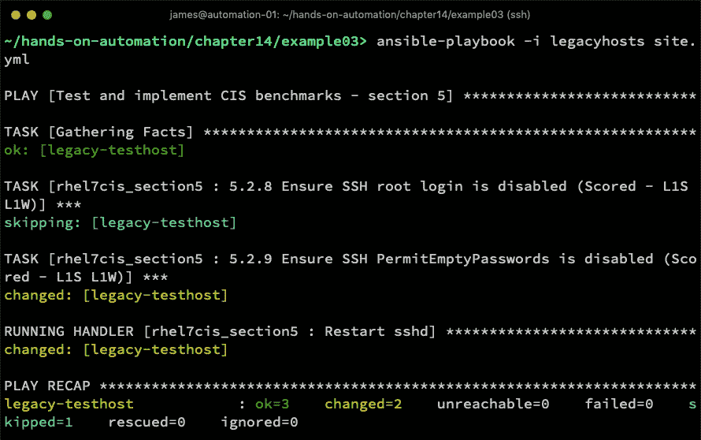

# 使用 Ansible 进行 CIS 加固

在第十三章中，*使用 CIS 基准*，我们详细探讨了 CIS 基准的概念，它们如何在企业中提升 Linux 安全性，以及如何应用它们。我们还详细审查了 CIS 加固基准的一个示例，即 Red Hat Enterprise Linux（和 CentOS）7 的基准。尽管我们得出结论，基准文档提供了大量关于验证检查的详细信息，甚至包括如何实施基准，但我们也看到整个过程极其手动。此外，对于单一操作系统基准，近 400 页的详细内容，我们认为工程师在仅为一台服务器实施该基准时，所需的工作量将是巨大的。

在本章中，我们将再次考虑 Ansible。我们已经确认 Ansible 非常适合在企业规模上实现自动化，实施 CIS 基准也不例外。在本章中，我们将学习如何用 Ansible 重写 CIS 基准，然后如何在企业规模上应用它们，甚至如何持续监督 Linux 服务器对这些基准的合规性。通过这样做，我们将开发一种高度可扩展、可重复的方法，在企业中以可管理、可重复、可靠且安全的方式实现安全基准——这正是企业自动化有效性的标志。

本章将涵盖以下主题：

+   编写 Ansible 安全策略

+   使用 Ansible 应用企业范围的策略

+   使用 Ansible 测试安全策略

# 技术要求

本章包含基于以下技术的示例：

+   CentOS 7.6

+   Ansible 2.8

要运行这些示例，您需要访问一台运行前述操作系统和 Ansible 的服务器或虚拟机。请注意，本章中的示例可能具有破坏性（例如，它们会删除文件并修改服务器配置），如果按示例运行，只应在隔离的测试环境中执行。

一旦您确认您拥有一个安全的操作环境，就可以开始使用 Ansible 进行常规系统维护。

本章中讨论的所有示例代码都可以在 GitHub 上找到，网址为：[`github.com/PacktPublishing/Hands-On-Enterprise-Automation-on-Linux/tree/master/chapter14`](https://github.com/PacktPublishing/Hands-On-Enterprise-Automation-on-Linux/tree/master/chapter14)。

# 编写 Ansible 安全策略

在第十三章《使用 CIS 基准》中，我们探索了 Red Hat Enterprise Linux 7（版本 2.2.0）的 CIS 基准，并详细查看了文档和实现技术。虽然在本书中我们重点关注了企业中常见的两种操作系统——Ubuntu Server LTS 和 RHEL/CentOS 7，但在上一章中，我们仅专注于 RHEL 7 的 CIS 基准。这是出于简化考虑，因为许多适用于 RHEL 7 的良好安全实践同样适用于 Ubuntu Server LTS。例如，两个系统都不应启用 root SSH 登录，且除非它们的角色核心需要，否则也不应启用数据包重定向发送。

在本章中，我们将继续开发基于 RHEL 7 的示例。请注意，本章中用于通过 Ansible 自动化实现此基准的大多数技术，同样适用于 Ubuntu Server LTS，因此希望您从本章中获得的知识能帮助您在实施安全基准时，特别是在 Ubuntu 或其他适用的 Linux 服务器上应用这些技术。

让我们直接进入一些实际操作的示例，开发 CIS 基准实现，这一次我们将使用 Ansible 而不是基于 CIS 基准文档中的示例代码的 shell 脚本。

让我们从考虑我们老朋友——远程 root 登录开始。

# 确保禁用远程 root 登录

在上一章中，我们编写了以下 shell 脚本，以测试 CIS 基准建议 5.2.8（RHEL 7，基准版本 2.2.0）中描述的条件，并在条件不满足时实现该条件。它在这里被包含进来，以便与我们即将创建的 Ansible 解决方案进行对比：

```
#!/bin/bash
#
# This file implements CIS Red Hat Enterprise Linux 7 Benchmark 
# Recommendation 5.2.8 from version 2.2.0
echo -n "Ensure root logins are disabled on SSH... "
OUTPUT=$(grep -e "^PermitRootLogin no" /etc/ssh/sshd_config)
if [ "x$OUTPUT" == "x" ]; then
  echo FAILED!
  OPTPRESENT=$(grep -e "^PermitRootLogin.*" /etc/ssh/sshd_config)
  if [ "x$OPTPRESENT" == "x" ]; then
    echo "Configuration not present - attempting to add"
    echo "PermitRootLogin no" | sudo tee -a /etc/ssh/sshd_config 1>/dev/null
  else
    echo "Configuration present - attempting to modify"
    sudo sed -i 's/^PermitRootLogin.*/PermitRootLogin no/g' /etc/ssh/sshd_config
  fi
  sudo systemctl restart sshd
else
  echo OK
fi
```

这个 shell 脚本仅适用于众多基准中的一个，虽然它确实能够工作，但它相当脆弱，且无法跨多个系统扩展。此外，该脚本完全不易于阅读，想象一下如果要实现所有 CIS 基准建议，所需要的脚本规模会有多大！

让我们考虑如何将此功能改写为 Ansible 角色。首先，我们知道我们正在测试单个文件中的特定配置行。如果该行不存在，我们就知道该配置（无论是隐式的还是其他）允许远程 root 登录。在这种情况下，我们执行两个操作：首先，我们修改配置文件，插入正确的行（如果该行已存在但配置值错误，则修改现有行）。然后，如果配置文件已更改，我们将重启 SSH 守护进程。

我们在使用 Ansible 的经验表明，`lineinfile`模块几乎可以处理与检查配置文件和修改配置文件（如果未正确配置必需的行）相关的所有工作。我们还学到了`service`模块可以轻松地重新启动 SSH 守护程序，并且这个模块将从一个`handler`而不是在主任务流中运行，以确保只有在实际修改配置时才重新启动守护程序。

因此，我们可以定义一个角色，其中包含一个单独的任务，如在名为`rhel7cis_recommendation528`的角色中所示：

```
---
- name: 5.2.8 Ensure SSH root login is disabled (Scored - L1S L1W)
  lineinfile:
    state: present
    dest: /etc/ssh/sshd_config
    regexp: '^PermitRootLogin'
    line: 'PermitRootLogin no'
  notify: Restart sshd
```

请注意，我们已经为任务赋予了一个有意义的名称– 实际上直接来自 CIS 基准文档本身。因此，我们完全知道这是哪个基准，它的用途以及是否计分。我们还在标题中插入了级别信息，因此这样可以避免在后面交叉参考原始的 CIS 基准文档。

除了我们的角色任务外，我们还希望创建一个处理程序，在修改配置文件后重新启动 SSH 守护程序（如果不这样做，它将无法获取更改）– 这个处理程序的示例代码如下：

```
---
- name: Restart sshd
  service:
    name: sshd
    state: restarted
```

我们已经可以看到，这个 playbook 比我们最初的 shell 脚本要容易阅读得多– 当我们在 shell 脚本中实现这个基准时，我们发现没有任何代码重复，并且`lineinfile`模块非常强大，可以将我们所有的各种检查都包装成一个单一的 Ansible 任务。

运行该角色应该会产生类似于在启用了远程 root 登录的系统上显示的以下屏幕截图的输出：


相比之下，如果建议已经实施，则输出将如以下屏幕截图所示：


正如您所见，如果条件得到满足，`lineinfile`模块将不会进行任何更改（导致在前面截图中看到的`ok`状态），而处理程序根本不会运行。

这本身就非常强大，并且在可管理性和编码工作方面明显优于我们的 shell 脚本。尽管如此，RHEL 7 CIS 基准包含了几乎 400 个建议，您不希望在 playbook 运行中创建和包含 400 个角色，因为这会削弱我们 Ansible 自动化的可管理性。

在本章的下一节中，我们将查看如何通过添加 CIS 基准*第五部分*中的另一个建议来扩展我们当前的 playbook，从而以可扩展和可管理的方式构建我们的 playbook 代码。

# 在 Ansible 中构建安全策略

如果我们按之前的方式进行，那么当涉及到 RHEL 7 CIS 基准版本 2.2.0 的*第 5.2.9 节*（确保禁用 SSH `PermitEmptyPasswords`）时，我们会创建一个新的角色，名为`rhel7cis_recommendation529`，并将相关的任务和处理程序放入其中。

我相信你会发现，这种方式并不具备良好的扩展性——创建一个新角色意味着我们需要在顶级剧本中指定它，可能会像下面这样：

```
---
- name: Test and implement CIS benchmark
  hosts: all
  become: yes

  roles:
    - rhel7cis_recommendation528
    - rhel7cis_recommendation529
```

如果每行一个角色，且几乎需要包含 400 个角色，这会很快变得繁琐，从而削弱我们 Ansible 代码的高可管理性。

你如何将 Ansible 任务划分为角色完全取决于你自己，你应该采用你认为最易于管理的方法。然而，作为建议，通过查看我们示例 CIS 基准的目录结构，我们可以看到建议被分为六个部分。*第五部分*特别涉及*访问、认证*和*授权*，因此，我们完全可以将所有这些建议集中到一个角色中，可能称为`rhel7cis_section5`。

在决定了剧本结构后，我们现在可以继续将建议 5.2.8 和 5.2.9 的检查构建到同一个角色中。它们也可以共享相同的处理程序，因为它们都与 SSH 守护进程配置相关。因此，我们新角色的任务可能如下所示：

```
---
- name: 5.2.8 Ensure SSH root login is disabled (Scored - L1S L1W)
  lineinfile:
    state: present
    dest: /etc/ssh/sshd_config
    regexp: '^PermitRootLogin'
    line: 'PermitRootLogin no'
  notify: Restart sshd

- name: 5.2.9 Ensure SSH PermitEmptyPasswords is disabled (Scored - L1S L1W)
  lineinfile:
    state: present
    dest: /etc/ssh/sshd_config
    regexp: '^PermitEmptyPasswords'
    line: 'PermitEmptyPasswords no'
  notify: Restart sshd
```

结果代码仍然具有很高的可读性，并被分解为可管理的块，但现在的粒度不再细致到难以维护顶级剧本。

我们的处理程序代码保持不变，现在当我们在一个不符合这些建议的系统上运行角色时，输出应该类似于下面的截图：


这非常简洁整洁，希望你能看到，如果你选择实施 CIS 基准中的近 400 个建议时，这种方法能够很好地扩展。然而，这也引出了一个重要的考虑：在理想的情况下，所有 CIS 建议都会应用于每一台机器，但在现实中，这并不总是可能的。在第十三章的*明智地应用安全策略*部分中，*使用 CIS 基准*，我们讨论了在实施时需要谨慎对待的各种建议。此外，尽管永远避免使用 root 账户通过 SSH 进行远程登录是理想的，但我遇到过一些系统，实际上需要这样做，以支持某种遗留系统，直到它能够更新。

简而言之，在政策执行的过程中，始终会有例外的需求。重要的是要以优雅的方式处理这一点。假设你有 100 台 Linux 机器需要应用我们新编写的小型安全策略，但其中有两台需要启用远程 root 登录。

在这个实例中，我们有两个选择：

+   为需要例外的两台服务器维护一组独立的 playbook

+   找到一种方法，在不修改角色的情况下选择性地运行任务

在这些选择中，第二种显然是更好的选择，因为它帮助我们维护一个单一的 playbook。但我们该如何实现呢？

Ansible 为我们提供了两种方法来处理这个问题。第一种是我们在本书中已经多次提到的`when`子句。到目前为止，我们只是查看了这个子句来编程地评估条件（例如，在磁盘的空闲空间低于某个值时执行磁盘清理）。在这个实例中，我们使用了一个更简单的实现——只需要评估布尔值是否为真。

假设我们在任务下方添加以下代码来实现推荐 5.2.8：

```
  when: 
    - recommendation_528|default(true)|bool
```

这两行代码评估一个名为`recommendation_528`的变量，并应用两个 Jinja2 过滤器，确保即使该变量未定义，也能正确处理：

+   `default`过滤器将变量默认设置为`true`，因为如果 Ansible 遇到任何未定义的变量，都会导致 play 失败并报错。这就避免了我们必须事先定义这些变量——我们的角色只是默认将它们设置为`true`，除非我们另行设置。

+   第二个过滤器将其转换为`bool`类型，以确保可靠地评估条件。

请记住，`true`可以是字符串类型或布尔值，取决于你如何解释它。使用`|bool`过滤器确保 Ansible 将其在布尔上下文中进行评估。

类似地，对于第二个任务，我们将在`notify`子句下方立即添加以下内容：

```
  when: 
    - recommendation_529|default(true)|bool
```

现在，如果我们在没有做任何其他修改的情况下，针对一个不符合要求的系统运行 playbook，它将像之前一样运行，如下图所示：


当我们希望在系统上运行时，跳过这些推荐之一或两个时，魔法就发生了。假设我们的主机`legacy-testhost`是一个遗留系统，仍然要求启用远程 root 登录。为了在这个系统上使用这个角色，我们知道必须将`recommendation_528`设置为`false`。这可以在不同的级别进行，并且在清单中定义它可能是最合适的地方，因为它可以防止有人在未来意外运行 playbook 时没有定义这一点，从而破坏我们的遗留代码并拒绝远程 root 登录。我们可以为这个系统创建一个新的清单，可能看起来像这样：

```
[legacyservers]
legacy-testhost

[legacyservers:vars]
recommendation_528=false
```

将我们想要跳过的推荐变量设置为`false`后，我们可以使用这个新的清单运行角色，结果应该类似于以下截图所示：



这正是我们所期望的——推荐 5.2.8 在我们的旧系统中被跳过，我们所需要做的就是在清单中定义一个变量——来自所有其他服务器的角色代码被复用。

使用`when`条件和简单的布尔变量对于像这样的简单决策效果很好，但如果你有多个标准需要评估呢？尽管`when`条件可以评估逻辑上的`and`和`or`构造，但随着复杂性增加，这可能变得有些难以管理。

Ansible 标签是我们在这里的第二个工具，它们是一个特殊功能，专门设计用于允许你只运行所需的部分角色或剧本，而不需要从头到尾运行整个内容。假设我们在实现推荐 5.2.8 的任务下方添加以下标签：

```
  tags:
    - notlegacy
    - allservers
```

在推荐 5.2.9 的任务下，我们可能会添加以下内容：

```
  tags:
    - allservers
```

这些标签的行为最好通过示例来解释，既然这是一本实践手册，我们将准确地做到这一点。首先需要注意的是，向剧本（或剧本中的角色）添加标签，除非你指定要运行或跳过哪些标签，否则完全没有任何作用。因此，如果我们以当前形式运行剧本，它的行为将和以往一样，尽管添加了标签，正如以下截图所示：


魔力就在于当我们指定要运行的标签时。让我们重复前面的命令，但这次添加`--skip-tags=notlegacy`。这个开关正如其名所示——所有带有`notlegacy`标签的任务都会被忽略。以下截图显示了运行该剧本后的输出：


在这里，我们看到与`when`条件的使用有明显不同——之前我们观察到推荐 5.2.8 的任务被评估后跳过，但它甚至没有出现在之前的剧本输出中——简而言之，整个任务被当做不存在。

如果我们使用`--tags=allservers`选项运行剧本，我们会看到两个任务都在运行，因为它们都带有这个标签。

这对于我们这里的示例非常有用，也适用于考虑更广泛的基准文档。例如，我们已经讨论过，所有的推荐都分为 1 级或 2 级。同样，我们知道有些是有评分的，而有些则没有。

知道级别 1 基准不太可能干扰 Linux 服务器的日常运行，我们可以在 playbook 中实施所有建议，并将级别作为每个建议的标签之一。然后，如果我们使用 `--tag=level1` 运行 playbook，那么只有级别 1 的建议将被实施。以此例子为基础，我们为建议 5.2.8 的任务的标签可能如下所示：

```
  tags:
    - notlegacy
    - allservers
    - level1
    - scored
```

在构建角色和 playbooks 来实施安全基准时，无论操作系统或安全标准如何，建议您充分利用 when 子句和标签。请记住，在企业规模自动化时，您最不希望管理许多碎片化的代码片段，它们都相似但功能稍有不同。您可以标准化的部分越多，您的企业管理就会越容易，合理使用这些功能将有助于确保您可以维护单一的 Ansible 代码库，并在运行时调整其操作以处理服务器群中的异常情况。

由于我们一直在考虑适合我们安全基准的适当 playbook 和 role 结构，因此我们在本节中故意保持了我们的例子简单。在下一节中，我们将重新审视我们在 第十三章 中突出显示的一些更复杂的例子，并演示 Ansible 如何使它们更容易编码和理解。

# 在 Ansible 中实施更复杂的安全基准

在 第十三章 中我们详细考虑的一个例子是 *使用 CIS 基准*，建议 3.1.2，这关注的是禁用数据包重定向发送。这在任何不应充当路由器的机器上都被认为是重要的（尽管在路由器上不应实施它，因为这会导致路由器功能异常）。

表面上看，这个建议看起来非常简单 – 我们只需设置这两个内核参数，如下所示：

```
net.ipv4.conf.all.send_redirects = 0
net.ipv4.conf.default.send_redirects = 0
```

尽管表面上看起来很简单，但我们最终开发了将近 60 行的 Shell 脚本来实施这个检查，因为我们需要检查当前活动的内核参数和持久配置文件的值，并在这些值未按预期设置时执行适当的更改。

在这里，再次，Ansible 来到我们的救援。Ansible 中的 `sysctl` 模块封装了我们在 Shell 脚本中构建的许多测试和配置工作。此外，我们可以使用循环使得相同的任务代码可以运行两次 – 一次针对上述每个内核参数。

在为此开发角色时，我们可以定义一个类似以下的单个任务：

```
---
- name: 3.1.2 Ensure packet redirect sending is disabled (Scored - L1S L1W)
  sysctl:
    name: "{{ item.paramname }}"
    value: "{{ item.paramvalue }}"
    reload: yes
    ignoreerrors: yes
    sysctl_set: yes
    state: present
  loop:
    - { paramname: net.ipv4.conf.all.send_redirects, paramvalue: 0 }
    - { paramname: net.ipv4.conf.default.send_redirects, paramvalue: 0 }
  notify:
    - Flush IPv4 routes
```

基准推荐还指出，如果我们实施这些更改，我们还应该刷新系统上的 IPv4 路由。这也是通过 `sysctl` 参数来实现的，因此我们只需再次使用 `sysctl` 模块，不过这次是在 `handler` 中使用：

```
- name: Flush IPv4 routes
  sysctl:
    name: net.ipv4.route.flush
    value: "1"
    sysctl_set: yes
```

在测试系统上运行此命令可能会产生类似于以下截图的输出：


从上面的截图可以看到，这段代码已经成功运行，并应用了基准推荐的设置，作为此更改的直接结果，处理程序已被触发并刷新了 IPv4 路由。最终结果是，原本需要 57 行难以阅读的 shell 脚本，现在可以通过 14 行更加可读的 YAML 完成。

到目前为止，我们已经清楚地了解了 Ansible 如何使 CIS 推荐的设计和实施变得简单，特别是与诸如 shell 脚本等替代方案相比。我们注意到，原生的 Ansible 模块，如 `sysctl` 和 `lineinfile`，可以优雅地封装许多原本由 shell 脚本执行的步骤。然而，作为剧本作者的你，有时必须为你的剧本做出一些重要决策，接下来的章节将更详细地探讨这一点。

# 在剧本设计中做出合适的决策

在你构建角色和剧本来实现安全基准时，你会发现有些实现是非常明确的（例如，你几乎肯定会知道是否希望允许 root 用户通过 SSH 登录），而对于其他方面则需要做出决策。时间同步就是一个例子，在本节中，我们将更详细地探讨这个问题，以展示在设计角色时可能需要做出的决策，以及如何以建设性的方式解决它们。

如果你查看 RHEL 7 CIS 基准（版本 2.2.0）中的 *2.2.1 节*，你会看到它完全关注时间同步。事实上，这是几乎所有企业 Linux 基础设施中的重要功能，服务器时钟之间的差异可能会导致如证书有效性和 Kerberos 票据等问题。

尽管几乎所有人都一致认为时间同步至关重要，但对于如何实现这一目标却意见不一。例如，大多数主流 Linux 发行版有两种主要的时间同步服务：

+   `chrony`

+   `ntpd`

尽管在 RHEL 7 上 `chrony` 现在是标准工具，这并不意味着老牌的 `ntpd` 服务将不再工作——实际上，一些企业仍然选择实施它，因为他们在这方面有着丰富的经验。

完全有可能让 Ansible 检测到给定 Linux 服务器正在使用这两项服务中的哪一项——从高层次来看，我们可以让 Ansible 做如下操作：

1.  查询 RPM 软件包数据库，查看是否安装了 `ntpd`、`chrony` 或两者。

1.  如果安装了一个或两个服务，请检测哪一个是活跃的：

a. 如果两者都未活跃，则需要纠正，因为我们已经确认需要时间同步。

b. 如果两者都活跃，则服务将发生冲突，应禁用其中一个。

正如我相信您会看到的，前述过程中会有一个干预点 – 如果两个服务都未启动，我们需要选择一个来启动。如果两者都活跃，我们需要禁用一个。这是 Ansible 的帮助能力止步的地方 – 它无法为您的特定企业决定这两个完全有效的服务中哪一个最适合您的用例。

因此，重要的是提前做出关于使用哪种时间同步服务的决定。有了这个决定，playbook 可以专门编码以执行适当的检查，并按需要执行适当的补救步骤。此外，从我们在 第一章 中的讨论中知道，*在 Linux 上构建标准操作环境*，企业规模的自动化受到共同性和标准的支持 – 因此，我们知道根据这些原则，我们应选择一个标准的时间同步服务，并坚持使用，除非有很好的业务理由提出例外。

为了推进这个例子，让我们看看建议 2.2.1.1\. 这项建议指出我们应确保正在使用时间同步服务 – 尽管它对于哪一个是不可知的。如果我们已经提前决定了哪个服务是相关的，我们的 playbook 开发就很容易。假设我们选择了 `chrony`（RHEL 7 的默认选择）；我们为这个建议的角色可能如下所示：

```
---
- name: 2.2.1.1 Ensure time synchronization is in use (Not Scored - L1S L1W)
  yum:
    name: chrony
    state: present

- name: 2.2.1.1 Ensure time synchronization is in use (Not Scored - L1S L1W)
  service:
    name: chronyd
    state: started
```

这段简单的代码确保我们检查并满足建议 2.2.1.1，而无需检测正在使用哪个时间服务的任何逻辑。当然，我们可以选择更彻底地检查 `ntpd` 是否未启动，但这留给您作为一个练习。

当然，我们无法将大约 400 个建议中所需的所有 Ansible 代码都放入这本书中 – 这本身就值得一本书！此外，这个例子仅适用于一个基准 – 如果您的企业引入了新的操作系统，如 RHEL 8，您可以肯定会有一个单独的适用于该操作系统的 CIS 基准需要实施。但希望这些来自 RHEL 7 CIS 基准的示例足以让您设计和构建自己的策略。因此，在本章的下一部分，我们将探讨在企业规模下管理此任务的技术。

# 使用 Ansible 应用企业范围的策略

尽管我们已经看到 Ansible 在实施 CIS 基准方面带来的显著好处，但我相信现在你应该能够看出，开发和维护这些策略可能会变成一份全职工作，尤其是当需要在基础设施上运行它们，并管理每次运行的结果时。

幸运的是，开源开发精神为这一难题带来了一个解决方案。试想，如果有人已经花费大量时间和精力开发出了一套高质量的 Ansible 角色，用于实施 CIS 基准，而且这些角色以开源代码的形式提供，这样你就可以审计它，确保它适合你的环境，并在需要时轻松调整。此外，假设他们已经投入了大量时间和精力，为每个任务添加标签，并且加入了适当的变量结构，以便你能够轻松指定你的选择，比如你的企业使用的时间同步服务。

幸运的是，这项工作已经由 MindPoint Group 完成，他们的代码已经免费提供在 GitHub 上，网址是 [`github.com/MindPointGroup/RHEL7-CIS`](https://github.com/MindPointGroup/RHEL7-CIS)。

在本文写作时，适用于 EL7 系统的最新 CIS 基准版本是 2.2.0，而前面提到的 playbook 是针对基准版本 2.1.1 编写的。你需要确保了解你正在实施的基准版本，并注意如果使用稍旧版本可能带来的安全隐患。

除此之外，正如 Ubuntu 的用户可以选择付费支持或使用免费的开源操作系统一样，EL7 用户也可以选择 Red Hat Enterprise Linux 7 或 CentOS 7，MindPoint Group 也提供了他们的 Ansible 加固代码的商业支持版本，网址为 [`www.lockdownenterprise.com/`](https://www.lockdownenterprise.com/)。因此，他们在整个领域提供了支持，尊重一些企业绝对需要企业支持合同，而另一些企业则更倾向于使用免费的开源软件。

让我们探索一下如何在我们的 CentOS 7 服务器上使用开源代码：

1.  首先，我们需要克隆 GitHub 仓库：

```
$ cd roles
$ git clone https://github.com/MindPointGroup/RHEL7-CIS.git
$ cd ..
```

1.  一旦完成这些工作，我们就可以像使用任何其他角色一样使用这段代码。在适当的地方，我们应该设置变量，这些变量可以在清单中或在主 playbook 中设置（稍后会详细说明）。

因此，一旦从 GitHub 克隆了角色，使用 MindPoint Group 的 CIS 基准在 Ansible 中的最纯粹、最简单的实现就是一个像下面这样的 playbook：

```
---
- name: Implement EL7 CIS benchmark
  hosts: all
  become: yes

  roles:
    - RHEL7-CIS
```

1.  完成这些步骤后，你实际上可以在几分钟内开始在 Linux 服务器上实现 EL7 基准及其近 400 项推荐——playbook 按照正常方式运行，并且在执行所有检查和实现推荐时（如需要）会生成许多页面的输出。以下截图展示了 playbook 的运行情况和初始输出页面：


现在，关于变量的一点说明。正如我们在上一节中所提到的（*编写 Ansible 安全策略*），会有一些情况下你需要改变 playbook 的运行方式。变量和标签都在我们之前克隆的 GitHub 仓库中附带的 `README.md` 文件中有详细说明，为了说明问题，我们来看几个例子。

首先，假设我们只想实施第一级推荐（那些对日常操作风险较小的）。可以通过运行 playbook 并使用 `level1` 标签来实现：

```
$ ansible-playbook -i hosts site.yml --tags=level1
```

或者，你可能在对一组作为路由器的服务器运行加固 playbooks。在这种情况下，我们需要将`rhel7cis_is_router`变量设置为`false`，以确保不会设置那些禁用路由器功能的内核参数。

这可以通过如下命令在命令行上完成：

```
$ ansible-playbook -i hosts site.yml -e rhel7cis_is_router=true
```

然而，这非常手动化，如果有人不小心在没有设置此变量的情况下运行了 playbook，可能会导致路由器被突然禁用。

最好是在清单级别设置这个变量，从而确保每次运行 playbook 时它都能正确设置。因此，我们可以创建一个这样的清单：

```
[routers]
router-testhost

[routers:vars]
rhel7cis_is_router=true
```

在这个清单就位后，使用如下命令来执行 playbook 并对路由器进行操作：

```
$ ansible-playbook -i routers site.yml
```

只要使用这个清单文件，就不会有人忘记将`rhel7cis_is_router`变量设置为`true`。

当然，这段讨论并不是说你必须下载并使用这些 playbooks——完全可以根据自己的需求开发和维护属于自己的 playbooks。实际上，在某些情况下，这种策略可能是更好的选择。

重要的是，你要选择最适合你企业的策略。在选择大规模实施安全策略时，你应考虑以下因素：

+   无论你是否希望拥有自己的代码（以及由此带来的所有优缺点）

+   无论你是否希望今后继续负责维护你的代码库

+   你应该尽可能地标准化一个代码库，以确保代码结构保持可维护

+   无论你是否需要第三方支持来实现这些基准，还是你自信自己拥有足够的技能和资源来内部完成

一旦完成评估，你将能够很好地定义前进的道路，通过创建 Ansible playbook 来实现你选择的安全标准。本章迄今为止提供的信息足以支持你选择任何路径。虽然本章重点讨论的是 EL7（Red Hat Enterprise Linux 7 和 CentOS 7），但我们讨论的内容同样适用于其他有安全基准的操作系统（例如，Ubuntu Server 18.04）。实际上，如果你使用 Ubuntu Server 18.04 的 CIS 基准，按照本章讨论的流程操作，你会发现能够实现很大的相似性。

到目前为止，我们几乎专注于实现 CIS 基准。然而，本章如果没有提供在不进行更改的情况下检查执行级别的方法，就不完整。毕竟，审计是大多数企业政策中重要的一部分，尤其是涉及安全时，而更改必须在授权的变更请求窗口内进行。

# 使用 Ansible 测试安全策略

如我们所讨论的那样，确保不仅能够高效且可重复地实施安全政策，而且还应该能够进行审计，这一点非常重要。为此任务提供了多种工具，包括闭源和开源工具。在考虑其他工具之前，值得先看看 Ansible 本身如何帮助完成这一任务。

让我们回到最初的一个例子，我们在其中实施了 CIS 基准 *第五部分* 的两个建议。

之前，我们使用以下命令运行了这个：

```
$ ansible-playbook -i hosts site.yml
```

这通过了两个检查，如果系统未符合安全建议，它会实施相应的更改。然而，Ansible 还有一个叫做检查模式的操作模式。在此模式下，Ansible 不会对远程系统进行任何更改——而是尝试预测可能对系统进行的所有更改。

不是所有模块都与检查模式兼容，因此在使用此模式时需要小心。例如，Ansible 无法预知运行特定 shell 命令时的输出，因为命令的组合可能有很多种。此外，运行 shell 命令可能具有破坏性或导致系统发生变化，因此，在检查运行期间，任何使用 `shell` 模块的任务都会被跳过。

然而，我们已经使用过的许多核心模块，如 `yum`、`lineinfile` 和 `sysctl`，都支持检查模式，因此可以在此模式下有效使用。

因此，如果我们再次运行我们的示例 playbook，只是这次在检查模式下运行，我们将看到类似于以下屏幕截图的输出：


你会注意到，这看起来与其他任何剧本的运行完全相同——实际上，唯一表明它正在运行检查模式的线索是命令行中调用此运行的 `-C` 标志。然而，如果你检查目标系统，你会发现没有进行任何更改。

上述输出对于审计过程非常有用——它向我们展示了目标系统不符合基准 *第 5.2.8 节* 或 *第 5.2.9 节* 的建议——如果这些建议已满足，结果应该是 `ok`。同样，我们知道处理程序只在需要对远程系统进行更改时才会触发，再次表明该系统在某些方面不符合要求。

可以接受输出需要一定解释——然而，通过在编写角色时运用良好的设计实践（特别是在任务名称中加入基准章节号和标题），你可以非常迅速地开始解读输出，了解哪些系统不符合要求，进一步了解它们具体在哪些建议上没有达标。

此外，我们设立的变量结构用来确定哪些任务在何时运行，仍然适用于检查模式，因此，如果我们在需要启用远程 root 登录的旧主机上运行此剧本（但这次在检查模式下），我们可以看到该任务被跳过，确保我们在审计过程中不会得到假阳性。以下截图显示了此操作：


通过这种方式（结合良好的剧本设计），Ansible 代码不仅可以用于实现目的，还可以用于审计目的。

希望本章内容能为你提供足够的知识，使你在实施企业级 Linux 服务器安全加固时充满信心，甚至能够将其作为持续过程的一部分进行审计。

# 摘要

Ansible 是一个功能强大的工具，非常适合用于实施和审计安全基准，如 CIS 安全基准。我们通过实践示例展示了它如何将一个接近 60 行的 shell 脚本简化为不到 20 行，并且如何将相同的代码轻松地在多种场景中复用，甚至可以用于在整个企业范围内审计安全政策。

在本章中，你学习了如何编写 Ansible 剧本来应用服务器加固基准，如 CIS。然后你获得了在整个企业范围内使用 Ansible 应用服务器加固政策的实操知识，并了解了如何利用公开的开源角色来帮助你实现这一目标。最后，你了解了 Ansible 如何支持测试和审计成功的政策应用。

在下一章中，我们将介绍一个名为 **OpenSCAP** 的开源工具，它可以用于有效地审计整个企业范围内的安全政策。

# 问题

1.  像 `lineinfile` 这样的 Ansible 模块是如何让安全基准实现代码比 Shell 脚本更高效的？

1.  如何为特定的服务器或服务器组设置条件性 Ansible 任务？

1.  在编写 Ansible 任务以实现 CIS 基准时，命名任务时有哪些最佳实践？

1.  如何修改 playbook，使得你能够轻松运行 CIS 1 级基准，而不评估任何 2 级基准？

1.  运行 Ansible playbook 时，`--tags` 和 `--skip-tags` 选项有什么区别？

1.  为什么你会想利用公开的开源代码来实现 CIS 基准？

1.  使用 `ansible-playbook` 命令时，`-C` 标志对 playbook 运行有什么影响？

1.  `shell` 模块是否支持检查模式（check mode）？

# 进一步阅读

+   若要查看关于 CIS 基准的常见问题，请参阅[`www.cisecurity.org/cis-benchmarks/cis-benchmarks-faq/`](https://www.cisecurity.org/cis-benchmarks/cis-benchmarks-faq/)。

+   CIS 基准的完整列表可以在[`www.cisecurity.org/cis-benchmarks/`](https://www.cisecurity.org/cis-benchmarks/)上查看。

+   要深入了解 Ansible，请参考 *James Freeman* 和 *Jesse Keating* 所著的《Mastering Ansible, Third Edition》([`www.packtpub.com/gb/virtualization-and-cloud/mastering-ansible-third-edition`](https://www.packtpub.com/gb/virtualization-and-cloud/mastering-ansible-third-edition))。
