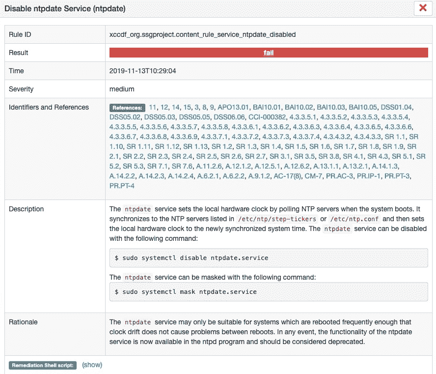

# 第十五章：使用 OpenSCAP 审计安全策略

在前两章中，我们已经阐明了将安全策略（如 CIS 基准）应用于企业 Linux 基础设施的价值。我们讨论了多种方法来应用该策略，并确保其持续执行；尤其是在有大量人员拥有 Linux 服务器超级用户权限的基础设施中，确保策略持续执行显得尤为重要。虽然我们已经确定了 Shell 脚本和 Ansible 在审计基础设施是否符合所选安全策略方面的作用，但我们也指出，这两者都不太适合提供易读且具有可操作性的报告，尤其是当基础设施规模较大时。例如，基础设施安全团队可能需要一个易读的报告，展示基础设施与安全策略的符合情况，而 Shell 脚本和 Ansible 并不立即适合这个任务。

尽管市场上有多种基础设施扫描工具可供选择，但大多数是商业工具，本书的重点是那些任何企业都能使用的开源解决方案，无论其预算如何。因此，在本章中，我们将介绍免费的 OpenSCAP 工具。**SCAP**代表**安全内容自动化协议**，它是一个标准化的解决方案，用于检查 Linux 基础设施是否符合给定的安全策略（在我们的案例中是 CIS）。OpenSCAP 因此是 SCAP 的一个开源实现，已被包括 Red Hat 在内的多个企业 Linux 厂商广泛采用。因此，我们将探讨如何设置自己的 OpenSCAP 基础设施，以便进行合规扫描和报告。这将使所有关心基础设施安全的团队能够监督合规性水平。

本章将具体涵盖以下主题：

+   安装你的 OpenSCAP 服务器

+   评估和选择策略

+   使用 OpenSCAP 扫描企业

+   解释结果

# 技术要求

本章包括基于以下技术的示例：

+   Ubuntu Server 18.04 LTS

+   CentOS 7.6

+   Ansible 2.8

要运行这些示例，您需要访问两台服务器或虚拟机，每台运行前面列出的操作系统之一，以及 Ansible。

本书中讨论的所有示例代码均可从 GitHub 获取：[`github.com/PacktPublishing/Hands-On-Enterprise-Automation-on-Linux`](https://github.com/PacktPublishing/Hands-On-Enterprise-Automation-on-Linux)。

# 安装你的 OpenSCAP 服务器

在扫描您的基础设施时，我们需要做出一些决策，因为 OpenSCAP 项目提供了一些功能重叠的工具。原因是它们面向不同的用户群体——有些工具纯粹是命令行驱动，因此非常适合定时、脚本化的任务，比如每月的合规性报告。到目前为止，共有五个 OpenSCAP 工具可用，我们将在接下来的章节中详细介绍每个工具，帮助您做出明智的决策，选择适合您企业的工具（或工具组合）。

在以下小节中，我们将从最基本的工具——OpenSCAP Base 开始。

# 运行 OpenSCAP Base

OpenSCAP Base 工具提供了扫描单台 Linux 机器并报告其是否符合给定政策所需的基本功能。它实际上由两个组件组成，因此是我们在接下来的子章节中将要介绍的其他工具的前提要求。

该工具的第一个组件是一个名为`oscap`的命令行工具。这个工具可以在本地机器上使用适当的安全政策和配置文件运行，以生成合规性报告。报告生成时采用 HTML 格式，因此尽管报告创建过程相当手动，但最终报告非常易于阅读，非常适合发送给安全或合规团队进行审计或评估。

OpenSCAP Base 的第二个组件包括一个库，它作为构建其他 OpenSCAP 服务的基础，比如 SCAP Workbench 和 OpenSCAP Daemon——我们将在本节稍后的部分详细介绍这些内容。

本书中，我们只会在使用其他 OpenSCAP 工具时利用这个库。我们将在本章名为*使用 OpenSCAP 扫描企业*的部分看到这些工具的实际应用。不过，目前我们先关注 OpenSCAP Base 的安装。

在单台机器上手动安装 OpenSCAP Base 非常简单——它已经为本书中讨论的两大主要 Linux 发行版预打包——Ubuntu Server 和 CentOS（因此，间接适用于 Red Hat Enterprise Linux）。要在 CentOS 7 或 RHEL 7 上安装它，您只需运行以下命令：

```
$ sudo yum -y install openscap-scanner
```

同样，在 Ubuntu Server 18.04 LTS 上，您可以运行以下命令：

```
$ sudo apt -y install libopenscap8
```

需要记住的是，这些包不仅包括`oscap`命令行工具，还包括本节前面提到的库。因此，即使您从不打算使用`oscap`命令行工具运行 OpenSCAP，这些包所包含的库仍可能是您某些用例所需要的（例如，使用 SCAP Workbench 进行远程扫描）。

因此，考虑使用 Ansible 部署这些包非常重要，甚至可能希望将它们包含在你的标准构建镜像中，这样你就能确保可以远程扫描任何给定的 Linux 服务器以检查合规性，而无需执行任何前提步骤。我们将在后续部分*使用 OpenSCAP 扫描企业*中介绍如何使用`oscap`工具运行扫描——不过现在，理解这个包是什么以及为什么可能需要它就足够了。

在下一节中，我们将介绍如何安装 OpenSCAP 守护进程，这是 OpenSCAP 工具集的另一个组成部分。

# 安装 OpenSCAP 守护进程

安全审计并非一次性的任务——在 Linux 环境中，拥有管理员级别（即 root）访问权限的人，随时可能故意或通过良好的意图改变，使得 Linux 服务器变得不合规。因此，安全扫描的结果实际上只能保证被扫描的服务器在扫描时是否合规（或不合规）。

因此，定期扫描环境至关重要。实现这一目标有许多方法，你甚至可以使用调度程序（如`cron`）运行`oscap`命令行工具，或者通过 AWX 或 Ansible Tower 中的计划 Ansible playbook 来实现。然而，OpenSCAP 守护进程是作为 OpenSCAP 工具套件的一部分提供的原生工具。它的作用是在后台运行并对指定的目标或目标集进行定期扫描。这些目标可能是运行守护进程的本地机器，或者是一组通过 SSH 访问的远程机器。

安装过程同样非常简单——如果你手动执行此操作，在 EL7 系统（例如 RHEL7 或 CentOS 7）上，你需要运行以下命令：

```
$ sudo yum -y install openscap-daemon
```

在 Ubuntu 系统上，包名相同，你可以运行以下命令进行安装：

```
$ sudo apt -y install openscap-daemon
```

尽管你可以在每台机器上设置这个守护进程，并为每台机器配置一个任务定期扫描自身，但这种方式容易被滥用，因为拥有 root 权限的人很容易禁用或篡改扫描。因此，我们建议你考虑设置一个集中式扫描架构，通过一台中央安全服务器在你的网络中执行远程扫描。

你需要在这样的服务器上安装 OpenSCAP 守护进程，安装完成后，可以使用`oscapd-cli`工具来配置定期扫描。我们将在本章稍后的*使用 OpenSCAP 扫描企业*部分中详细介绍这一过程。

尽管我们到目前为止考虑的两个工具都非常强大，可以满足你的所有审计需求，但它们完全基于命令行，因此可能不适合那些不习惯在 shell 环境中操作的用户，或者那些负责审计扫描结果但不一定运行它们的用户。这个需求可以通过 OpenSCAP 工具库中的另一个工具——**SCAP Workbench**来满足。我们将在下一节中讨论如何安装它。

# 运行 SCAP Workbench

SCAP Workbench 是 SCAP 工具集的图形用户界面，旨在为用户提供一种简单、直观的方式来执行常见的扫描任务。因此，它非常适合技术要求较低的用户或那些更习惯于图形环境的用户。

需要考虑的一点是，SCAP Workbench 是一个图形工具，在许多环境中，Linux 服务器都是无头运行的，并且没有安装图形 X 环境。因此，如果你在没有图形环境的普通 Linux 服务器上安装它，你将看到类似下面截图中显示的错误：


幸运的是，有几种方法可以运行 SCAP Workbench。首先，值得注意的是，它是一个真正的跨平台应用程序，提供适用于 Windows、macOS 和大多数常见 Linux 平台的下载，因此，对于大多数用户来说，最简单的路径是直接在他们的本地操作系统中运行它。

如果为了保持一致性，你希望在 Linux 上运行 SCAP Workbench，你需要设置一个远程 X11 会话，或者设置一个包含图形桌面环境的专用扫描主机。这里没有对错之分——真正的关键是你决定哪种路径最适合你的环境和工作模式。

如果你选择在 Linux 上运行，安装 SCAP Workbench 和我们考虑的其他 OpenSCAP 工具一样并不难：

1. 要在 RHEL7/CentOS 7 上安装它，你需要运行以下命令：

```
$ sudo yum -y install scap-workbench
```

在 Ubuntu Server 上，你需要运行以下命令：

```
$ sudo apt -y install scap-workbench
```

1.  一旦完成，你就可以使用适合你选择的操作系统的方法打开 SCAP Workbench。如果你是在使用远程 X 会话的 Linux 服务器上运行它，只需运行以下命令：

```
$ scap-workbench &
```

我们将在本章的《使用 OpenSCAP 扫描企业》一节中探讨如何在这个图形环境中设置并运行扫描。不过，在完成本章这一部分之前，我们将讨论 OpenSCAP 项目提供的另外两个工具——SCAPTimony 和 Anaconda Addon。

# 考虑其他 OpenSCAP 工具

到目前为止，我们已经考虑了各种用于扫描和审计基础设施的 OpenSCAP 工具。然而，还有两个工具我们尚未考虑，尽管它们并不像我们之前提到的那些工具那样是交互式工具，因此不在本书的范围内。尽管如此，它们值得一提，因为你可能会选择将它们集成到未来的环境中。

其中一个工具叫做**SCAPTimony**。它不同于 SCAP Workbench 或`oscap`这样的最终用户应用程序，而是一个中间件、基于 Ruby-on-Rails 的引擎，旨在供你集成到自己的 Rails 应用程序中。SCAPTimony 的优势在于，它提供了一个数据库和存储平台，用于存储你的 SCAP 扫描结果。因此，如果你决定编写自己的 Rails 应用程序来处理 OpenSCAP 扫描，它可以为你提供集中报告 OpenSCAP 扫描的功能。它还使你的 Rails 应用程序能够操作和汇总收集的数据，因此在管理扫描数据方面是一个非常强大的工具。

虽然开发一个 Rails 应用程序以使用 SCAPTimony 超出了本书的范围，但值得注意的是，Katello 项目（因此包括 Red Hat Satellite 6）已经在使用 SCAPTimony，因此你可以在不需要自己创建应用程序的情况下，利用这个工具。

在撰写本书时，最后一个可用的工具是 OSCAP Anaconda Addon。对于不熟悉的人来说，Anaconda 是 CentOS 和 Red Hat Enterprise Linux 等 Linux 发行版使用的安装环境。虽然这个插件无法帮助我们处理基于 Ubuntu 的服务器，但它提供了一种方法，可以在安装时构建符合要求的基于 Red Hat 的服务器。

正如我们已经讨论过如何使用 Ansible 应用安全策略（参见第十四章，*使用 Ansible 进行 CIS 硬化*），并且我们强烈推荐为你的 Linux 环境使用标准镜像，这些镜像我们在第五章，*使用 Ansible 构建虚拟机模板进行部署*，以及第六章，*使用 PXE 启动进行自定义构建*中创建过，因此我们不会探讨这个插件，因为它与我们已经提供的跨平台解决方案功能重复。

到目前为止，你应该已经对 OpenSCAP 工具有了较好的了解，并且知道哪些工具可能最适合你的环境。然而，在我们进行第一次扫描之前，我们需要一个 OpenSCAP 安全策略来使用。在下一节中，我们将讨论在哪里下载这些策略以及如何选择适合你环境的策略。

# 评估和选择策略

OpenSCAP 及其相关工具本身是引擎——没有安全策略作为扫描标准，它们无法实际帮助你审计环境。正如我们在第十三章中探讨的，*使用 CIS 基准*，Linux 有许多安全标准，在本书中，我们深入讨论了 CIS 基准。不幸的是，目前这个标准不能通过 OpenSCAP 进行审计，尽管许多其他安全策略可以用于保护你的基础设施。此外，由于 OpenSCAP 及其策略完全是开源的，完全没有障碍阻止你根据自己的需求创建自己的安全策略。

有许多安全标准可以供你自由下载，并用于审计你的基础设施，接下来的章节我们将讨论你最有可能考虑的主要标准——SCAP 安全指南。

# 安装 SCAP 安全指南

一些最全面、现成的安全策略可以在**SCAP 安全指南**（**SSG**）项目中找到，你会经常看到`ssg`缩写出现在目录中，有时甚至出现在包名中。这些策略就像我们之前探讨的 CIS 基准一样，涵盖了 Linux 安全的许多方面，并提供了修复步骤。因此，OpenSCAP 不仅可以用于审计，还可以用于执行安全策略。然而，必须指出的是，鉴于其性质，我认为 Ansible 最适合执行此任务，值得注意的是，在 SCAP 安全指南的最近的上游版本中，Ansible 剧本与 XML 格式的 SCAP 策略一起提供。

OpenSCAP 策略与任何安全定义一样，随着新漏洞和攻击的发现会不断演变和变化。因此，在考虑使用哪个版本的 SSG 时，你需要考虑所使用版本的更新程度，以及它是否符合你的需求。虽然看似显而易见的说法是你应该始终使用最新版本，但正如我们稍后会看到的，还是有一些例外情况。

这个决定需要仔细考虑，正如最初看起来可能并不明显的那样，*仅仅去下载最新的版本*并不是最好的做法。尽管大多数主要 Linux 发行版中包含的版本通常落后于 SSG 项目 GitHub 页面上的版本（见[`github.com/ComplianceAsCode/content/releases`](https://github.com/ComplianceAsCode/content/releases)），但在某些情况下（尤其是在 Red Hat Enterprise Linux 上），它们经过测试并已知在提供的 Linux 发行版中有效。

然而，在其他发行版上，结果可能有所不同。例如，在写作时，SSG 策略的最新公开版本是 0.1.47，而 Ubuntu Server 18.04.3 中包含的版本是 0.1.31。此版本的 SSG 甚至不支持 Ubuntu 18.04，如果您尝试使用 Ubuntu 16.04 策略对 Ubuntu Server 18.04 进行扫描，所有扫描结果将显示为`notapplicable`。所有扫描都会验证运行扫描的主机，并确保其与原定要扫描的主机匹配，因此，如果检测到不匹配，它们将报告`notapplicable`，而不是应用测试。

在 Ubuntu 18.04 的`libopenscap8`包中也存在一个错误，导致关于`/usr/share/openscap/cpe/openscap-cpe-dict.xml`文件缺失的错误。希望 Ubuntu 的 OpenSCAP 软件包能够在适当的时候更新并修复，以便能够可靠使用。

使用 Red Hat Enterprise Linux 的用户需要注意，Red Hat 仅支持使用 RHEL 附带的 SSG 策略进行 OpenSCAP 扫描的用户，因此在这种情况下，更加需要使用供应商提供的策略文件。

就像任何开源环境一样，关键在于选择权在于您——如果您希望评估可用的更新策略，您可以自由选择这样做，而对于 Ubuntu 18.04，您必须这样做，否则扫描将无法正常工作！不过，如果您希望利用商业支持的环境，那么 RHEL 就是一个不错的选择。

要在 CentOS 7 或 RHEL 7 上安装供应商提供的 SSG 软件包，您需要运行以下命令：

```
$ sudo yum -y install scap-security-guide
```

此软件包包含了所有由 Red Hat 直接支持的操作系统和应用程序的 SSG 策略（请注意，CentOS 是基于 RHEL 的）。因此，您在安装此软件包时，只会找到 RHEL 6 和 7、CentOS 6 和 7、**Java 运行时环境**（**JRE**）以及 Firefox 的策略。写作时，此软件包安装了 SSG 版本 0.1.43。

在 Ubuntu Server 上，SSG 分布在多个软件包中，但提供跨平台支持。要在 Ubuntu Server 18.04 上安装完整的 SSG 软件包，您需要运行以下命令：

```
$ sudo apt -y install ssg-base ssg-debderived ssg-debian ssg-nondebian ssg-applications
```

这些软件包提供以下系统的策略：

| `ssg-base` | SSG 基础内容和文档文件 |
| --- | --- |
| `ssg-debderived` | 针对 Debian 衍生操作系统（如 Ubuntu Server）的 SSG 策略 |
| `ssg-debian` | 针对 Debian 操作系统的 SSG 策略 |
| `ssg-nondebian` | 针对其他 Linux 操作系统（如 RHEL 和 SuSE 企业版 Linux）的 SSG 策略 |
| `ssg-applications` | 用于保护应用程序的 SSG 策略，如**Java 运行时环境**（**JRE**）、Firefox 和 Webmin |

因此，可以公平地说，在写作时，尽管 Ubuntu Server 发布了一个较旧的包版本（0.1.13），但它支持更多的操作平台。

你选择安装哪种 SSG 是由你决定的，或者如果你敢于尝试，你甚至可以选择编写自己的 SSG！最重要的是，你要做出明智的选择，并在需要时获得操作系统供应商的支持。我们在继续探索你可能下载的其他策略之前，值得详细了解一下你在搜索和实现 OpenSCAP 审计架构时可能遇到的两种安全策略文件格式。我们将在下一节进行详细讲解。

# 理解 XCCDF 和 OVAL 策略的目的

当你下载策略时，你经常会看到**开放漏洞评估语言**（**OVAL**）和**可扩展配置检查表描述格式**（**XCCDF**）这两个术语。你遇到的一些安全策略只有在 OVAL 格式下才可用。因此，我们需要花点时间来考虑这些不同的文件类型。

首先，重要的是要声明它们不是可以互换的——相反，它们应该被视为具有层级性质。在层级结构的较低层次是 OVAL 文件，本质上描述了 OpenSCAP 扫描引擎应该执行的所有系统级检查。例如，这可能包括检查某个给定的包是否比某个版本更新，因为旧版本中可能存在已知漏洞。或者，它可能是一个检查，确保像`/etc/passwd`这样的关键系统文件的所有者是 root。

这些检查在审计系统是否符合你的安全策略时非常有价值，但它们可能对于经理或安全团队来说不太易读。他们可能更感兴趣的是高级别的安全策略，例如*验证重要文件和目录的权限*。实际上，这个检查几乎肯定会包括对`/etc/passwd`的所有权检查，以及一整套其他关键系统文件，例如`/etc/group`和`/etc/shadow`。

这就是 XCCDF 格式变得相关的地方——它可以被看作是层级结构中的下一级，因为它提供了一组可供人类阅读的安全策略（以及有价值的文档和参考资料），这对于经理或信息安全团队这样的观众来说会非常有用。这些策略描述了系统的状态，参考了 OVAL 定义执行的检查。XCCDF 文件不包含扫描引擎的任何检查定义（例如`oscap`），而是引用了在 OVAL 文件中编写的检查，因此可以被看作位于 OVAL 文件之上的一层。

因此，OVAL 文件可以单独用于审计目的，但除非相应的 OVAL 文件存在，否则无法使用 XCCDF 文件。

XCCDF 文件还包含一系列扫描配置文件，这些文件告诉扫描引擎你的策略是什么，因此它应该扫描哪些内容。这几乎肯定意味着只扫描 OVAL 文件中存在的检查项的子集。

可用的配置文件可以通过图形 SCAP Workbench 工具轻松列出，或者通过使用 `oscap info` 命令在命令行中列出。以下截图展示了运行该命令查询 CentOS 7 的 SSG 示例：


尽管为了节省空间输出被截断，但你可以清楚地看到可供 CentOS 7 使用的各种安全配置文件。在截图中，你会注意到（例如）对于运行图形用户界面的 CentOS 7 服务器和不运行图形界面的服务器，有不同的配置文件。这是因为图形系统需要额外的安全措施来确保 X Windows 子系统的安全性。还有适用于**支付卡行业**（**PCI**）环境的配置文件，以及位于顶部的最基本配置文件，它应该是适用于几乎任何 CentOS 7 服务器的最小可行安全策略。

一旦你知道了从 XCCDF 策略文件中想要使用的配置文件，你可以在运行扫描时指定它，稍后的章节《*使用 OpenSCAP 扫描企业*》中将详细探讨这一点。

在我们结束本节内容之前，需要特别说明的是，OVAL 文件没有配置文件，如果你运行 OVAL 扫描，系统将自动运行 OVAL 文件中定义的所有测试，而不考虑其目的。这可能会导致问题，因为以 CentOS 7 SSG OVAL 文件为例，它包含了针对 X Windows 图形子系统安全性的测试。这些测试将在没有安装 GUI 的系统上失败，因此可能会在扫描结果中产生假阳性。

需要注意的是，SCAP Workbench 只支持使用 XCCDF 策略进行扫描，因此如果你使用的配置文件仅包含 OVAL 文件，则需要使用不同的扫描工具。

现在我们对可能下载的各种安全策略的文件格式有了更多了解，让我们来看一下你可能希望下载的一些其他安全配置文件。

# 安装其他 OpenSCAP 策略

SSG 安全策略很可能会成为你使用 OpenSCAP 进行审计框架的核心——然而，鉴于 OpenSCAP 的开源性质，任何人，包括你，都完全可以编写策略文件。

你最有可能希望将 SSG 策略补充的策略是那些可以检查服务器补丁级别的策略。考虑到 Linux 操作系统补丁发布的频繁性，将这些策略与 SSG 集成会给维护人员带来麻烦，因此通常将它们分开。

例如，在您的 CentOS 7 服务器上，您可以下载以下安全策略（请注意，它仅提供 OVAL 格式）：

```
$ wget https://www.redhat.com/security/data/oval/com.redhat.rhsa-RHEL7.xml.bz2
$ bunzip2 com.redhat.rhsa-RHEL7.xml.bz2
```

这包含了迄今为止在 CentOS 7（以及 RHEL 7）上发现的所有软件包漏洞，并检查已安装的版本，以确保它们比已知漏洞存在的版本更为新颖。因此，这可以轻松生成报告，向您展示是否需要紧急修补您的 CentOS 7 或 RHEL 7 系统。

Canonical 也提供了一个类似的列表，适用于 Ubuntu Server 18.04，可以通过以下方式下载：

```
$ wget https://people.canonical.com/~ubuntu-security/oval/com.ubuntu.bionic.cve.oval.xml.bz2
$ bunzip2 com.ubuntu.bionic.cve.oval.xml.bz2
```

再次说明，这包含了在 Ubuntu Server 18.04 上发现的所有软件包漏洞，并再次检查以确保安装在系统上的软件包版本比有漏洞的版本更新。对于这两个安全策略，所有检查每次都会执行，因为它们是 OVAL 格式的—然而，测试只有在软件包安装且版本低于包含修复该漏洞版本的情况时才会报告失败。因此，您不应该收到任何由此扫描所产生的误报。

与 SSG 策略不同，这些策略会定期更新—在撰写本文时，我们使用前面的命令下载的 Ubuntu 包漏洞扫描配置文件仅有一个小时的历史！因此，您的审计过程的一部分必须涉及下载最新的包漏洞 OVAL 策略并对其进行扫描—这可能是 Ansible 的好工作（尽管这部分留给您自己练习）。

到现在为止，您应该已经对可以下载的策略类型、可能遇到的格式以及它们的预期用途有了充分的理解。因此，在下一节中，我们将展示如何使用它们来扫描您的 Linux 主机，并根据所选的安全策略审计合规性。

# 使用 OpenSCAP 扫描企业环境

到目前为止，我们已经介绍了 OpenSCAP 项目提供的各种工具以及您可能希望使用的安全策略，用于扫描您的企业 Linux 环境。现在，既然我们已经完成了这些基础工作，接下来就该看看如何实际利用这些工具扫描您的基础设施。正如我们之前讨论的，您可以使用三种关键工具来扫描您的基础设施。我们将从下一节开始，探索 `oscap` 命令行工具的使用。

# 使用 OSCAP 扫描 Linux 基础设施

正如本章前面讨论的，`oscap` 工具是一个命令行实用程序，旨在扫描其安装所在的本地机器。您希望审计主机的安全策略必须也位于该主机的文件系统中。如果您已经完成了*评估和选择策略*一节中的步骤，那么您应该已经具备了所需的一切。

话虽如此，如果使用 `oscap` 工具扫描你的基础设施将是你未来的方向，你可能会考虑使用 Ansible 来安装它并在扫描完成时收集结果。

在我们深入之前，先来看一下如何扫描单个主机：

1.  假设我们正在处理 Ubuntu 18.04 服务器，并且已经将最新的上游 SSG 解压到当前工作目录中，以便我们拥有所需的 Ubuntu 18.04 支持，我们将使用 `oscap info` 命令查询 XCCDF 策略文件，以查看哪些策略可用：

```
$ oscap info scap-security-guide-0.1.47/ssg-ubuntu1804-ds.xml
```

`info` 命令的输出将类似于以下截图所示：


1.  在此，我们将选择你希望进行审核的配置文件（或多个配置文件——毕竟，你始终可以运行多个扫描）。在我们的案例中，我们正在运行一台通用服务器，因此我们将选择 `Id: xccdf_org.ssgproject.content_profile_standard` 的配置文件。

1.  要运行此扫描并将输出保存为人类可读的 HTML 报告，你需要运行如下命令：

```
$ sudo oscap xccdf eval --profile xccdf_org.ssgproject.content_profile_standard --report /var/www/html/report.html ./scap-security-guide-0.1.47/ssg-ubuntu1804-ds.xml
```

我们必须使用 `sudo` 运行此命令，因为它需要访问一些核心系统文件，否则无法访问。扫描运行并在屏幕上生成一个清晰的人类可读的输出，以下截图展示了其中的一个示例：


如你所见，XCCDF 策略生成了一个高度可读的输出，清晰地显示了每个测试的通过/失败结果。因此，即便在这些输出的前几行中，你也可以看到我们的测试系统在多个方面不符合要求。

此外，`oscap` 命令还生成了一个漂亮的 HTML 报告，我们已将其放入此服务器的 Web 根目录。当然，你不会在生产环境中这样做——你最不希望的事情就是公开你服务器的任何安全问题！然而，你可以将此报告发送给你的 IT 安全团队，如果你是使用 Ansible playbook 运行 OSCAP，Ansible 可以将报告从远程服务器复制到一个已知位置，便于收集报告。

下面的截图展示了这份 HTML 报告的一部分——你可以看到它的可读性如何。此外，即使是快速浏览，非技术人员也可以看到该系统未通过合规性测试，并且需要采取补救措施：


突然间，你会意识到这个工具是多么强大，以及为什么你希望使用它来扫描你的基础设施！除了这个报告，我们还可以使用我们在《*安装其他 OpenSCAP 策略*》一节中下载的`com.ubuntu.bionic.cve.oval.xml`策略来检查我们的测试系统的补丁状态。正如我们讨论的，OVAL 策略生成的报告不如 XCCDF 报告那样易于阅读，但它们仍然非常有价值。要扫描我们的 Ubuntu 系统，查看是否缺少任何关键的安全补丁，你可以运行以下命令：

```
$ sudo oscap oval eval --report /var/www/html/report-patching.html com.ubuntu.bionic.cve.oval.xml
```

如下图所示，输出不如 XCCDF 输出那样易于阅读，需要更多的解释。简而言之，`false`结果意味着被扫描的机器未通过合规性测试，因此推测所需的补丁已经应用，而`true`则表示系统缺少补丁：


然而，再一次，HTML 报告来拯救了我们—首先，它在顶部有一个总结部分，显示我们的系统总共有 432 个检测到的包漏洞，同时还有 8,468 次测试通过。因此，正如我们通过运行的策略文件理解的那样，我们迫切需要应用补丁来修复已知的安全漏洞：


当然，定期下载这个策略的更新版本是非常重要的，以确保它是最新的。如果你深入报告，你会看到每个检查项都有一个交叉引用的 CVE 漏洞报告，这样你就可以查找系统存在的漏洞：


通过这些简单的示例，我相信你可以看到这些报告是多么有价值，以及它们是如何被 IT 安全团队在没有任何特定 Linux 命令行知识的情况下轻松审查的：

在 CentOS 或 RHEL 上运行 OSCAP 扫描的过程大致相似：

1.  假设你正在使用操作系统供应商提供并随操作系统一起打包的 SSG 策略，你需要查询 XCCDF 配置文件，以便了解应该运行哪一个：

```
$ oscap info /usr/share/xml/scap/ssg/content/ssg-centos7-xccdf.xml
```

1.  然后，你可以像我们在 Ubuntu 上做的那样，运行基于 XCCDF 的扫描—在这里，我们选择标准配置文件来扫描我们的系统：

```
$ sudo oscap xccdf eval --fetch-remote-resources --report /var/www/html/report.html --profile standard /usr/share/xml/scap/ssg/content/ssg-centos7-xccdf.xml
```

你会看到这里也有`--fetch-remote-resources`标志—这是因为 CentOS 7 策略需要一些额外的内容，它会直接从 Red Hat 下载，以确保始终使用最新的版本。扫描过程与之前相似，生成相同的可读报告。你会看到，扫描运行时，许多测试结果返回`notapplicable`—不幸的是，CentOS 7 的安全策略仍在不断完善中，目前随 CentOS 7 附带的版本并没有完全支持该操作系统。这展示了 OpenSCAP 策略的严苛性——大多数 CentOS 7 的安全要求也适用于 RHEL 7，反之亦然，但这些策略被编码为非常特定地与某些操作系统配合使用。以下截图展示了正在进行的扫描以及前述的`notapplicable`测试结果：


尽管如此，审计仍然揭示了一些有价值的见解——例如，正如我们从以下 HTML 报告截图中看到的那样，我们不小心允许了密码为空的账户登录：


如果你正在使用 CentOS 7，你将不会从 Red Hat 获得供应商支持，因此尝试使用上游 SSG 策略是值得的，因为 CentOS 和 Ubuntu 等操作系统的支持在不断改善（正如我们在本节早些时候审计 Ubuntu Server 18.04 主机时看到的那样）。重新运行完全相同的扫描，但使用 SSG 0.1.47 后，我们的扫描结果看起来非常不同：


这突出了理解你所使用的策略的重要性，并确保你下载适合你情况的正确版本。如果你使用的是 RHEL 7，建议使用 Red Hat 提供的包，而对于 CentOS 7 和 Ubuntu Server 18.04，则最好尝试使用来自上游 GitHub 仓库的最新版本。实际上，以下截图显示了在我们的 CentOS 7 测试系统上，使用版本 0.1.47 SSG 进行的完全相同扫描的结果，我们可以看到这次我们总共运行了 958 个测试，并且对服务器的安全性有了更清晰的了解：


在 CentOS 7 上，你也可以像在 Ubuntu Server 上一样运行 OVAL 扫描来检查包漏洞，不过这次需要使用我们之前下载的`com.redhat.rhsa-RHEL7.xml`文件。就像我们在 Ubuntu Server 上做的那样，我们将使用以下命令运行此扫描：

```
$ sudo oscap oval eval --report /var/www/html/report-patching.html com.redhat.rhsa-RHEL7.xml
```

报告的解读与在 Ubuntu 上完全相同，如果我们直接参考 HTML 报告，可以看到此系统目前已经完全修补了已知的包漏洞：


这部分总结了我们对`oscap`命令行工具的探讨，但现在你应该已经拥有了所有必要的信息，能够定期运行自己的扫描。自动化这个过程作为练习留给你，但以下是我认为一个不错的 Ansible 解决方案的几点建议：

+   在执行任何其他任务之前，使用`yum`或`apt`模块安装所需的 OpenSCAP 软件包。

+   使用`get_url`模块下载 SSG 文件和/或包漏洞 OVAL 定义文件，以确保你拥有最新的副本（在 RHEL 7 上除外，此时你应使用由 Red Hat 提供的版本）。使用`unarchive`模块解压下载的文件。

+   使用`shell`模块运行 OSCAP 扫描。

+   使用`fetch`模块获取 HTML 报告的副本，以便分发和分析。

在接下来的部分中，我们将介绍如何使用 OpenSCAP 守护进程运行定期调度的扫描。

# 使用 OpenSCAP 守护进程运行定期扫描

现在你已经了解了使用`oscap`命令行工具进行扫描的基础，设置定期扫描 OpenSCAP 守护进程将变得非常简单，因为所涉及的技术是相同的。假设你已经安装了守护进程，正如我们之前讨论的那样，创建自动化扫描相对容易，尽管在撰写本文时，OpenSCAP 守护进程并不支持在 Ubuntu Server 18.04 上运行。这是由于缺失的 CPE 文件，到目前为止尚未修复，虽然这并未影响我们使用`oscap`命令行工具（尽管细心的人可能会注意到扫描结束时与该文件相关的错误），但它确实阻止了 OpenSCAP 守护进程的启动。

因此，本节中的示例将仅基于 CentOS 7，然而，当 OpenSCAP 软件包修复后，在 Ubuntu Server 18.04 上的过程会大致相似。事实上，根据`ComplianceAsCode` GitHub 项目，2017 年 10 月首次报告的这个问题似乎已经存在较长时间，因此，这是一个很好的理由，可以结合使用 Ansible 和`oscap`工具进行扫描需求。

当与 Ubuntu 相关的问题修复后，你将能够从一个中央扫描主机调度 CentOS 和 Ubuntu 主机的扫描，方法与本章所述的相同。请注意，所有主机的 SSG 文件（无论是 CentOS、RHEL 还是 Ubuntu）必须与 OpenSCAP 守护进程存放在同一主机上——它们会在每次扫描时被复制到待扫描的每个主机，因此不需要在每台主机上都部署。

尽管如此，如果你想设置一个使用 OpenSCAP 守护进程的定期扫描，最简单的方法是通过在交互模式下使用`oscapd-cli`工具：

1.  这是通过使用以下参数调用`oscapd-cli`来实现的：

```
$ sudo oscapd-cli task-create -i
```

1.  这将启动一个基于文本的引导配置，您可以轻松完成。下面的截图展示了我如何设置守护程序，在我的 CentOS 7 测试系统上运行每日扫描的示例：


大多数交互式设置步骤应该是不言自明的——然而，您会注意到一个询问`在线修复`的步骤。OpenSCAP 配置文件包括自动纠正任何发现的合规问题的功能。您可以自行决定是否启用此功能，这取决于您是否愿意让自动化流程对系统进行更改，即使是出于安全目的。您可能希望将审计任务与策略执行任务分开，这种情况下，您将使用 Ansible 进行修复步骤。

如果您启用了修复功能，请务必首先在隔离环境中进行测试，以确保修复步骤不会破坏任何现有应用程序。这种测试不仅在应用程序代码更改时需要执行，还需要在下载新版本的 SSG 时进行，因为每个新版本可能包含新的修复步骤。这与我们在 第十三章 中探讨的指导原则相同，*使用 CIS 基准*，只是现在应用于 OpenSCAP SSG。

1.  一旦您启用了扫描，您将发现在预定的时间，它会将扫描结果存储在 `/var/lib/oscapd/results` 下。在此目录下，您会找到一个以您创建任务时获得的任务 ID（在上述截图中为 `1`）命名的编号子目录，然后在另一个编号目录下，即扫描编号。因此，任务 ID 为 `1` 的第一次扫描的结果将在 `/var/lib/oscapd/results/1/1` 中找到。

1.  当您检查此目录的内容时，您会注意到结果仅以 XML 文件存储，虽然适合进一步处理，但不太易读。幸运的是，我们之前看过的 `oscap` 工具可以轻松将扫描结果转换为人类可读的 HTML——对于这个结果，我们将运行以下命令：

```
$ sudo oscap xccdf generate report --output /var/www/html/report-oscapd.html /var/lib/oscapd/results/1/1/results.xml
```

一旦此命令运行完成，您可以像我们在本章早些时候所做的那样，在 Web 浏览器中查看 HTML 报告。当然，如果您在此机器上没有运行 Web 服务器，您可以将 HTML 报告简单地复制到具有 Web 服务器的主机上（甚至在您的计算机上本地打开）。

设置 OpenSCAP 守护程序的美妙之处在于，与 `oscap` 工具不同，它可以扫描远程主机以及本地主机。此扫描通过 SSH 执行，并且您必须确保已经从运行 OpenSCAP 守护程序的服务器设置了无密码 SSH 访问到远程主机。如果您使用非特权帐户登录，您还应确保该帐户具有 sudo 访问权限，同样不需要密码。对于任何有经验的系统管理员来说，这应该是相当容易设置的。

在 CentOS 7 上，默认的 SELinux 策略阻止了远程扫描在我的测试系统上运行。我不得不暂时禁用 SELinux，以便远程扫描能够运行。显然，这不是一个理想的解决方案——如果你遇到这个问题，最好构建一个允许远程扫描运行的 SELinux 策略。

一旦你设置了远程访问，按照交互式任务创建过程配置 OpenSCAP 守护进程与本地机器配置并无不同——这次唯一的区别是你需要按以下格式指定远程连接：

```
ssh+sudo://<username>@<hostname>
```

如果你直接以`root`身份登录（不推荐），你可以省略前面字符串中的`+sudo`部分。因此，为了从我的测试服务器设置另一个远程扫描，我执行了以下截图中显示的命令：


如你所见，这为此目的创建了任务编号`2`。这种设置的优点是，一旦你设置了 SSH 和 sudo 访问权限，你可以指定一个主机负责扫描你所有的 Linux 服务器。并且，正在扫描的主机只需要存在 OpenSCAP 库——它们不需要 OpenSCAP 守护进程或安全策略文件——这些都会在远程扫描过程中自动传输到主机。

定时扫描的结果仍然以 XML 格式存储在`/var/lib/oscapd/results`目录中，和之前一样，可以根据需要进行分析或转换为 HTML。

OpenSCAP 守护进程几乎肯定是你扫描基础设施的最快和最简便的途径，并且它将所有结果本地收集并存储，同时使用存储在自己文件系统上的安全策略，这意味着它相对抗篡改。对于基于 SCAP 的自动化、持续扫描环境，OpenSCAP 守护进程几乎肯定是你最好的选择，你还可以创建一个`cron`任务，自动将 XML 结果转换为 HTML 并将其放入你的 Web 服务器根目录，以便查看。

最后但同样重要的是，在下一节中，我们将介绍 SCAP Workbench 工具，看看它如何帮助你进行安全审计。

# 使用 SCAP Workbench 进行扫描

SCAP Workbench 工具是一个交互式的、基于图形界面的工具，用于运行 SCAP 扫描。它几乎具备与`oscap`命令行工具相同的功能，只是它可以通过 SSH 扫描远程主机（类似于 OpenSCAP 守护进程）。使用 SCAP Workbench 的高层次流程与使用`oscap`相同——你从下载的策略中选择你的策略文件，选择其中的配置文件，然后运行扫描。

然而，这次结果在图形界面中显示，并且不需要生成 HTML 报告并在浏览器中加载就能轻松解释。以下截图显示了在命令行上运行以下命令与`oscap`的等效操作：

```
$ sudo oscap xccdf eval --profile xccdf_org.ssgproject.content_profile_standard ./scap-security-guide-0.1.47/ssg-ubuntu1804-ds.xml
```

需要明确指出的是，扫描不会生成报告文件，但你可以通过点击屏幕底部的“保存结果”按钮，生成 HTML 或 XML 格式的报告：


如你所见，如果你需要对系统进行交互式和即时扫描，SCAP Workbench 是最简单的方法。唯一的限制是它只能处理 XCCDF 文件，因此用于检查你是否存在包漏洞的 OVAL 文件不能在此处使用。

在本节中，我们探讨了你可以使用各种 OpenSCAP 工具来扫描你的基础设施的方式。我们还展示了各种扫描，其输出通常非常易于理解。然而，在下一节中，我们将更深入地探讨这些内容，然后完成关于 OpenSCAP 的工作。

# 解释结果

到目前为止，我们已经看到 OpenSCAP 扫描，特别是基于 XCCDF 的扫描，生成了易于阅读的报告，你可以很轻松地采取行动。然而，如果报告对你来说不清晰，那么你就无法知道需要修复什么，以弥补不合规的地方。

幸运的是，我们之前用于检查漏洞包的 OVAL 策略和基于 XCCDF 的报告包含了足够的信息，可以让你做两件事。

让我们以之前使用 SSG 版本 0.1.47 扫描 CentOS 7 服务器的示例为例。在此过程中，我们未通过一个叫做`Disable ntpdate Service (ntpdate)`的检查，此外还有其他未通过的检查。假设这个结果对你来说并不明显，你不确定底层的问题是什么，也不明白为什么它会成为一个问题。幸运的是，在这个扫描生成的 HTML 报告中，你可以点击检查标题。屏幕上应该会弹出一个窗口，类似于下面的截图：



在这里，你可以看到所有你可能需要的详细信息——从扫描的细节到各种安全标准所引用的参考文献和标识符，这些标准提出了这个建议，甚至包括可以用来纠正问题的手动命令，以便系统在下一次扫描时符合要求。

更好的是，如果你向下滚动这个屏幕，你会发现许多最新版本的 SSG（包括版本 0.1.47）实际上包含了大量的 Ansible 代码，可以应用于解决这种情况，如下图所示：


因此，通过一些探索，你实际上可以利用这些扫描结果，不仅找出为什么你的基础设施不符合要求，还可以生成你需要的准确修复措施。

OpenSCAP 还可以修复（即解决）在扫描过程中发现的问题，帮助你进行审计并保持合规性。然而，我们在这里没有探索这个内容，因为在尝试自动修复之前，你必须了解扫描的内容以及它们会做什么。因此，这留给你作为练习——不过，你会看到在 OpenSCAP 守护进程和 SCAP 工作台中，都有一个简单的选项可以启用，它不仅会执行扫描，还会尝试修复。

尽管我们已经确认 XCCDF 配置文件是多么强大和用户友好，但我们也看到 OVAL 配置文件生成的报告可读性稍差。幸运的是，如果你查看下面的截图，你会注意到，识别出的漏洞的 CVE 编号实际上是超链接：


点击这些链接会将你带到操作系统供应商的官网，直接进入一个详细说明漏洞、受影响的包以及修复实施时间的页面。因此，你可以准确找出需要更新哪些包来解决该问题。

这就是我们审计 Linux 环境与 OpenSCAP 的全部内容——希望你觉得这有用，并且能够将其应用到你的环境中，以提升你的安全性和审计流程。

# 总结

关注 Linux 基础设施的安全合规性变得越来越重要，考虑到大量的安全建议，加上现代企业中可能存在的大量 Linux 服务器，显然需要一个能够进行合规性审计的工具。OpenSCAP 提供了正是这样一个框架，只要稍加注意和关心（并应用正确的安全配置文件），就能轻松审计整个 Linux 环境，并为你提供有价值、易于阅读和解读的合规性报告。

在本章中，你亲自体验了安装 OpenSCAP 工具进行服务器审计，了解了可用的政策以及如何在 OpenSCAP 中有效使用它们。接着，你学习了如何使用各种 OpenSCAP 工具审计 Linux 服务器，并最终探索了如何解读扫描报告，以便采取适当的措施。

在本书的下一章，也是最后一章中，我们将介绍一些技巧和窍门，帮助你简化自动化任务。

# 问题

1.  SCAP 代表什么？

1.  为什么 SCAP 政策在审计你的 Linux 基础设施时是一个宝贵的工具？

1.  你会使用哪个 OpenSCAP 工具来定期集中扫描多个 Linux 主机？

1.  XCCDF 文件和 OVAL 文件之间有什么区别？

1.  在什么情况下，即使供应商提供的 SSG 政策比当前可用的政策要旧，你也会使用这些政策？

1.  为什么使用 RHEL 7 政策文件扫描 CentOS 7 主机时，扫描结果会显示为 `notapplicable`？

1.  你能从 OpenSCAP 守护进程生成的 XML 结果中生成 HTML 报告吗？

1.  SCAP Workbench 或 OpenSCAP Daemon 执行远程 SSH 扫描需要满足什么要求？

# 进一步阅读

+   *学习 Ansible* 由 *Russ McKendrick* 编写: [`www.packtpub.com/gb/virtualization-and-cloud/learn-ansible`](https://www.packtpub.com/gb/virtualization-and-cloud/learn-ansible)

+   OpenSCAP 网站: [`www.open-scap.org/`](https://www.open-scap.org/)
