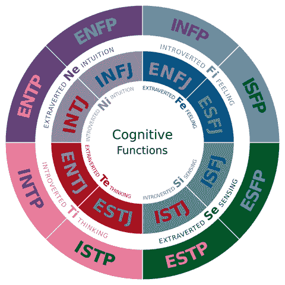
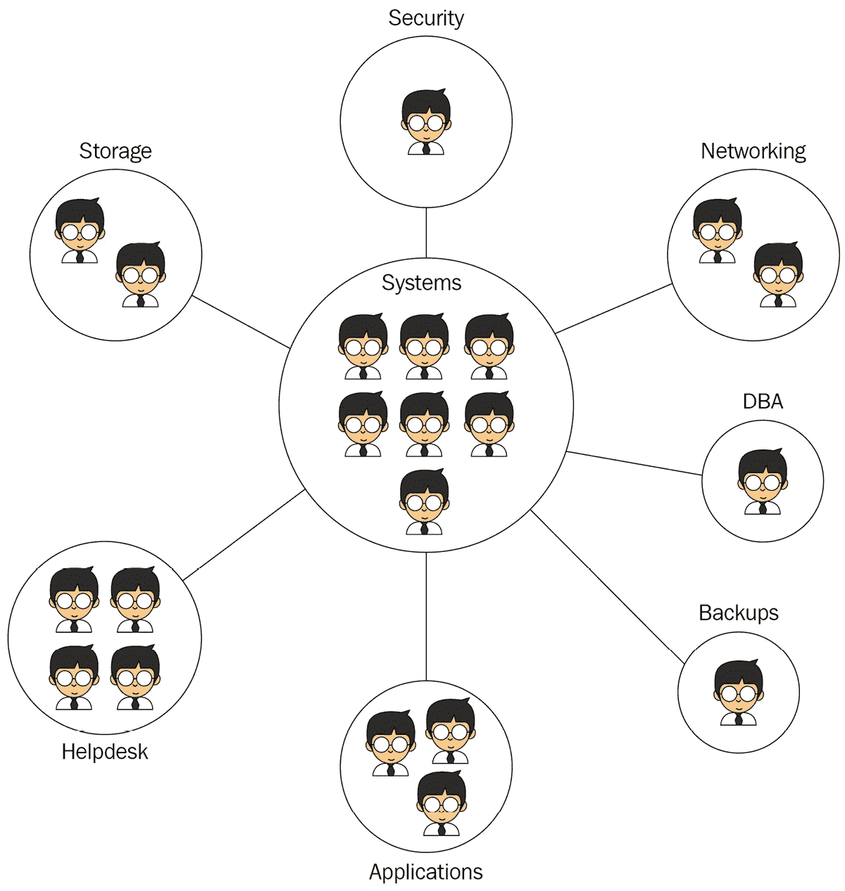

# *第一章*：系统管理员的角色是什么？

在我们的行业中，很少有事情听起来比这个更简单，更容易回答的问题：*什么是系统管理员*？然而，询问任何人，你会得到很多不同的意见。似乎每个人对**系统管理员**这个头衔或角色都有自己的看法，包括那些为自己使用此头衔或从公司颁发此头衔的人，可能是最多变的人！

欢迎来到系统管理，特别是**Linux 管理的最佳实践**。在本章中，我们将深入了解一个真正的系统管理员的*工作*、*角色*和*职能*，并尝试理解我们在这一角色中如何适应组织中的位置。

处理这本书时，对我来说，写作中的一个清晰的过程是必要的，但对你来说，理解这本书是否适合你，或者掌握我试图涵盖的范围，清晰地定义什么是**系统管理员**对我来说也是必要的。

准确理解一个真正的系统管理员应该具备的能力将成为将该角色定义应用于适用于系统管理和特别适用于**Linux 管理**的最佳实践的基础。

在本章中，我们将涵盖以下主要主题：

+   现实世界中的系统管理员在哪里

+   戴上管理员和工程师的帽子

+   在商业生态系统中理解系统

+   学习系统管理

+   介绍 IT 专业人员

# 现实世界中的系统管理员在哪里？

我认为尝试理解系统管理员是什么的最具挑战性的事情之一，源于*系统管理员*这个称号经常被公司随意颁发，几乎没有理解**信息技术**（**IT**）、系统或管理，并将其视为 IT 角色的通用填充物，他们不理解或不知道如何命名。它还很容易在没有给予薪资加薪或晋升的情况下，以此激励初级员工留在一个其他方面无法奖励的工作中，希望一个令人印象深刻的头衔将帮助他们在以后的职业生涯中。因此，实际上，作为系统管理员工作的人数与拥有这一头衔的人数相比非常少。事实上，可以毫不夸张地猜测，拥有系统管理员头衔的普通人从未思考过这一头衔的含义，也许对这一角色的预期有很少的了解。

如果单从职位来看，系统管理员无处不在。但他们大多存在于那些规模小到根本没有系统管理员的公司里。系统管理作为一项专职工作几乎仅限于大公司。大多数公司需要有人来做系统管理的工作，但通常只是作为其整体职责的一部分，而且往往只是其中很小的一部分。IT 的特点是，在小型和中型公司中，通常有一些通才*身兼多职*，做着各种必要的 IT 工作，而几乎没有时间专注于某一具体职能。相反，在大型企业中，你通常会看到专注的角色，通常被划分到专门的部门，只做一项 IT 工作：比如系统管理员。但即使在一些企业中，你也会发现部门像是独立的小型企业，仍然有通才负责许多不同的任务，而不是将职责分配给多个专门的人。

当然，这没有什么不对。完全可以预期。这就像是，作为一个房主，你常常会自己做很多房子的工作，或者你可能会雇一个修理工，他几乎可以做任何需要做的事情。你可能需要做一些水管工作、油漆、木工、电线安装等。不论是你自己做，还是你雇的修理工做，你都不会称自己或他为水管工、油漆工、木工等。你只是一个万能修理工，或者你雇佣的那个人是。你依然能意识到，专职、全职并专注于某一领域的水管工、油漆工、木工或电工是一个专业化的角色。你偶尔会做这些工作，甚至可能做得很好，但这并不等于这是你的全职职业。如果你声称自己是这些角色，朋友们很快就会指出你显然不是这些专业人士。

系统管理员就像水管工。每个拥有房屋的人至少会做一点水管工作。一个专门从事*家居维护*的修理工可能会做相当多的水管工作。但他们都不是水管工。一个非常大的住宅开发项目，或者一个建筑队可能会雇佣专职水管工。甚至可能不止一个。而几乎每个房主都需要时不时地聘请一个水管工。如果你像我一样，可能还需要经常找。大多数水管工要么为需要持续水管服务的大公司工作，要么为水管承包公司工作，享受同行和导师的帮助，帮助他们提升自己的专业知识。

几乎每个企业，无论规模大小，都需要完成系统管理任务。对于非常小的企业来说，这些任务通常每年不超过几个小时，并且在需要时，任务安排通常是不可预测的，很多时候一次性需要大量时间，而在其他时间可能什么也不需要。对于大型企业来说，可能每周需要数万小时的系统管理任务，并且需要整个部门的专职专家。因此，像水管工一样，小企业通常雇佣 IT 通才（类似于房主的杂工）或将系统管理任务外包给外部公司，如**托管服务提供商**（通常称为**MSP**），或者保留顾问；而大型公司则通常雇佣全职专门的系统管理员，专门从事这一工作，只为该公司服务。

系统管理任务存在于每个企业、每个行业，并构成了我认为是 IT 领域中最具回报性的角色之一的基础。通过掌握系统管理技能，你可以自主规划进入大型公司、成为顾问、加入服务提供商，或者通过提升其他技能成为更好、更高级的专家。如果没有坚实的系统管理基础，通才将缺乏最核心的技能，甚至在通才的行列中也难以晋升。而在通才领域的顶端，真正的 CIO 角色主要从那些具备广泛系统管理理解的人中选拔。

到目前为止，我们已经了解了系统管理员是什么，在哪些行业和企业中可以找到他们，以及为什么你可能希望将系统管理作为职业方向，或者作为拓展通才职业的一项技能。现在我们可以深入了解系统管理员到底做些什么！

# 戴上管理员和工程师的帽子

在本节中，我们将探讨两个部分：

+   管理和工程有什么不同。

+   如何识别你正在执行的角色。

*系统管理员*这个名字本身应该能给我们提示，说明这个角色应该包括哪些内容。这个职称并不是为了混淆或掩盖真正的职责。然而，许多人认为它是一种技巧。如果你在小型企业环境中工作足够长的时间，你可能甚至会发现许多专业的 IT 人员都不相信真正的系统管理员存在！

**系统**是指**操作系统**，并指明了该角色的范围：管理应用程序运行的平台。这将系统管理员的角色与例如数据库管理员（通常称为**DBA**）区分开来，后者管理的是数据库本身（运行在操作系统之上），或者应用程序管理员（管理操作系统之上的特定应用程序），或者平台管理员（管理操作系统运行的虚拟化平台），或者网络管理员（管理网络本身）。被称为*系统*管理员应该意味着该人的主要工作重点几乎完全围绕操作系统的维护与管理。如果你的一天并不完全围绕操作系统展开，那么你就不是真正的系统管理员。也许系统管理是你职责的一部分，但如果你以系统管理员为职称，那可能不太准确。

**管理员**这个词告诉我们，这个角色是负责管理某物的。管理员的直接对立面是**工程师**。工程师规划和设计某物；管理员运行和维护某物。我常常将这些角色称为**A&E**角色，通常这些职称被根据说话者的感觉随意使用，意义不大。但当准确使用时，它们有非常明确的含义，在 IT 领域的每个领域（*系统*、*平台*、*网络*、*数据库*、*应用程序*等）中，你都会看到它们相辅相成地工作。当然，在一个组织内，通常会有一个人既充当工程师又充当管理员，这两个角色的技能和知识有着广泛的重叠，并且必须密切合作才能有效地完成工作。

## 管理员角色和工程师角色之间的区别

然而，这两种角色之间有一个关键的区别，影响着组织和从业者的方式，这个区别非常重要，值得讨论，因为否则我们可能会觉得将这两种角色区分开来不过是装腔作势或是语义上的游戏。这个区别在于我们如何衡量绩效或成功。

工程角色通过吞吐量或完成的工作总量来衡量。它关注的是生产力——工程团队在给定时间内可以设计或构建多少系统。

在这种情况下，管理员角色是没有意义的。管理员管理的是已经运行的系统，而不是实现新的系统。管理员是通过可用性而不是生产力来衡量的。听起来可能有些奇怪，但这主要是因为大多数组织对管理工作理解不多，从未考虑过如何衡量一个管理部门的有效性。

## 角色定位

我花了很多时间谈论“帽子”。理解“帽子”很重要。

这里所说的“帽子”，指的是我们承担的不同工作角色，并理解何时我们正在执行某个角色的任务——即所谓的*戴上某顶帽子*。例如，如果我在餐馆工作，有一天我可能担任服务员，这时我们就会说我戴上了服务员的帽子。第二天，我可能在厨房做沙拉，这时我就戴上了短时间厨师的帽子。

这听起来可能有点傻，但它很重要。*帽子*这一术语有助于我们更好地理解*作为某个角色*和*执行与该角色相关的任务*之间的区别。我们都知道，*做一名水管工*需要什么，但大多数水管工都会开车去工作现场。这是否意味着他们是卡车司机？开卡车的技能是否是水管工技能的一部分？不，它不是。但这无疑是一个有用的辅助技能。然而，一家大型的水管公司可能会考虑聘请专业司机，专门负责将水管工从一个工作地点送到另一个工作地点，以保持每个人专注于他们的专业工作，降低保险成本，增加水管工作的计费小时，甚至允许聘用那些可能根本没有驾驶执照的优秀水管工！

在 IT 行业，常常会被要求承担许多不同角色和职能的职责，以至于我们常常忘记自己在做这些事情。IT 专业人员通常被视为全能型人才，能够做各种事情，通常这也成了事实，因为人们最初进入 IT 行业的原因往往是多才多艺。但当我们区分我们的预定角色、专长、培训以及我们因何获得薪水时，这对于理解我们是如何在做事情非常有帮助——而不是仅仅因为我们具备技能、灵活性或愿意帮助别人而做其他领域的工作。

随着我们深入探索**Linux 系统管理**，帽子概念以及深入挖掘工作角色和职能将变得越来越清晰。将我们的职能视为在特定时间佩戴特定的帽子，是理解的有力工具，更重要的是，它有助于我们向他人以及最终向我们自己传达我们的角色、需求、能力、期望和责任。在现实世界中，几乎没有公司或角色能够真正将系统的工程和管理方面分开。这有其好处，也有其后果。但值得一提的是，许多大型公司确实将这两种角色分开——有时甚至将它们安排在不同的部门，并拥有独立的管理团队。将这两者分开有许多好处，主要是因为系统的两个方面所需的软技能通常是对立的。

工程师受益于强大的软技能——优秀的规划能力。工程学几乎完全是关于规划的。你可以花时间思考系统将如何使用，并围绕这种未来需求进行设计。你的工作是防止紧急情况发生，而不是应对它们。

管理员受益于强大的软技能——优秀的感知能力，也就是实时响应事件，而不是提前规划。管理员的任务是管理实时运行的系统，这意味着他们的主要挑战是实时呈现的，能够进行急诊处理、优先排序并在压力下工作至关重要。

擅长工程的人很少同时擅长管理，反之亦然。尽管技术技能几乎完全重叠，但人际技能却截然相反，只有极少数人能在规划和急诊处理中都能做到得心应手。那些在管理方面非常有技能的人，通常也会自然地将工程工作放在次要位置，因为他们知道即使计划不充分，他们也能有效地应对。

这里还有其他语言可以为我们提供指导。工程师通常在一个以项目为导向的世界里工作。每个项目都有一个目标，一个工作交给管理员时的终点。管理则是在一个稳定、持续支持的世界中工作，几乎没有明确的起点或终点，*项目*这个词对他们来说是没有意义的。他们管理的是公司所需的系统，直到这些系统被替换，通常是由管理员以相同的方式管理一个新的工作负载。管理员可能需要向项目经理提供意见，因为项目可能需要报告其长期管理影响，或者获得管理部门的支持，确认他们愿意在项目交接后接手结果。但项目本身，按照定义，始终是由工程角色完成的。

知道自己何时戴上工程师的帽子，何时戴上管理员的帽子，能帮助我们有效地理解如何发挥作用，以及如何向组织的其他成员传达我们的需求和能力。大多数组织对这些工作角色的心理和表现后果视而不见，需要我们主动提供这种理解。我们越能准确识别自己的角色和需求，就越能做好准备，尝试将这些传达给管理层。

强求 IT 人员同时扮演工程师和管理员角色，常常会导致职业倦怠。作为管理员，通常意味着忙于处理请求，且总是当问题发生时第一个被召唤：系统运行缓慢、电脑崩溃、发现新的 bug、需要修补程序等。管理员不仅倾向于长时间工作，而且还需频繁待命。能够在可用的时间中休息是他们能否长期保持在这个角色中的关键。

工程师不需要待命，也不是在紧急情况或问题发生时负责的角色。然而，工程师不被期望需要特别的休息时间来弥补他们日程和时间的极大需求。他们不会被打断，不需要随身携带寻呼机（尽管如今几乎没人还携带寻呼机了），他们也不必错过孩子的学校剧，或者在登机前的几秒钟内回答问题，或在家庭聚餐时匆忙离开去远程指导别人解决问题。他们的生活是可以按计划进行的，可以像普通工作一样休息。那种 IT 人员疲惫不堪、永无休止地被要求为公司牺牲一切、生活在承诺中（这些承诺往往从未实现过，承诺他们未来能有休息的机会）的形象，几乎是所有系统管理员的共同写照。没有任何其他角色在最关键时刻承担如此多的责任。

将这两个角色结合在一起意味着，不仅一个身兼两职的人可能会面临随时待命、全天候处理问题的风险，还需要在每一个可能剩余的时间里，填充工程角色的项目工作，而这个角色又要求他们有足够的时间去做这些工作。试图在有截止日期的项目中保持生产力，同时还要应对每个问题、工单或故障，最终可能导致职业倦怠，甚至更糟。

如果我们能够向管理层传达管理职能与工程职能之间的区别，我们就可以开始对话，探讨如何使我们的工作更加可持续，这最终会让双方的情况变得更好。过度施压会导致生产力下降、错误、疏忽和员工流失。

### 十五分钟规则

在软件开发领域，所有的工作都是工程性任务，没有行政管理。一个标准的经验法则是，任何需要工程师集中注意力的中断，都会让工程师浪费掉中断的时间，再加上额外十五分钟的时间来重新恢复到中断前的工作状态。很容易看出，若一天中有几个中断，工程师的有效工作时间几乎会归零。他们可能整天都在努力工作，坐在办公桌前试图集中精力完成任务，消耗着有限的时间，但如果不断受到中断，他们只会原地踏步，感到越来越疲惫和沮丧，因为他们既无法休息，也无法有效工作，无法看到努力带来的成果。

*这个十五分钟法则被称为任务切换开销。*

管理员的角色几乎是充满了中断。需要监控系统，看是否出现故障，警惕新的补丁需要他们关注，回应其他团队的工单或问题等等。管理员当然也会受到十五分钟法则的影响，和工程师一样。但与工程师不同的是，管理员通常在解决一个问题或请求，而最糟糕的情况是一个小的、原子化的任务，在下一次中断之前完成。当一个任务完成，或者故障解决后，接下来要处理的任务会是不同的，无论它是否已经排好队，或者稍后才会到来。管理员无论如何都必须在每个问题之间进行任务切换，因此这种开销是不可避免的。

任务切换开销不仅帮助我们解释和理解为什么管理员和工程师需要分开工作，或者需要极端的支持，而且还帮助我们解释了为什么所有员工都需要安静、有效的工作环境这一更广泛的需求。中断不仅来自系统紧急情况，还可能来自会议、水冷机旁的闲聊、随便走过来的同事、办公室噪音、消防演习，等等。

### 用于衡量管理员或工程师技能的工具

如果我们处于一个较大的组织，能够将这些角色区分开来，我们就能展示出通过各自的独特利益来衡量每个部门，如何使每个部门变得更好。如果我们处于一个较小的组织，且不得不从一个角色切换到另一个角色，我们需要能够与组织有效协作，展示我们的需求，并与管理层合作，制定工作计划或额外资源，以提高我们的工作效率。

我见过的一个最好的工具，用于理解管理员与工程师之间的软技能差异，就是*迈尔斯·布里格斯类型指标*中的*判断*和*感知*。迈尔斯·布里格斯是一个行业标准的心理学考试，我认为如果处理得当，它对于帮助我们理解自己的自然优势和劣势非常有帮助。

以下是根据迈尔斯·布里格斯（Myers-Briggs）模型，不同人格类型及其认知功能的概述：

图 1.1 – 迈尔斯·布里格斯人格类型的认知功能

工程师通常需要较强的判断型特征，而管理员则需要较强的感知型特征。判断在此有效等同于*规划*，而感知大致等同于反应或执行初步处理的能力。几乎没有人能同时擅长规划和响应。了解自己的优势让你能专注于能让你快乐并表现出色的工作，而了解自己的劣势则能让你（和你的组织）相应地做出调整。

## 职责的奇妙多样性

这本书的一大挑战在于，系统管理员的角色，即使我们对系统管理员的定义达成一致，其职责差异之大，使得在一家公司的角色与在另一家公司执行相同角色时，可能看起来像是完全不同的职业道路！我们很容易找到那些几乎整天都在手动部署软件的系统管理员，他们从不进行性能调优；另一些系统管理员可能除了做性能调优几乎什么都不做；还有些人可能专注于管理系统应用或数据库；有些人会管理大量打印机，但大多数管理员永远不会管理一台打印机；另一些人负责管理用户及其存储问题，而大多数人根本不会管理用户。这些系统管理员可能永远不会遇到另一个做着类似工作负载的系统管理员，也很少有人会在同一领域找到第二份工作，要求他们再做一次相同的任务。每个系统管理员的职位实际上都是独一无二的，几乎可以说是荒谬的。

更为极端的是，很多人仅把系统管理视为服务器管理，当然，这个称谓通常也只用于服务器，但实际上在桌面、设备乃至物联网领域也有相关职业。Linux 在桌面和笔记本电脑领域可能仍然是一个相对小的角色，但各类公司在生产环境中部署它，并需要理解操作系统与终端设备相关方面的系统管理员。不要轻视桌面管理这一系统子集，它其实并没有那么不同。虽然桌面管理通常不像服务器管理那样压力大或至关重要，但它通常更为多样和复杂，且经常面临一些独特且极端的技术挑战。

在本书中，我会尽量从高层次来看待系统管理，并提供适用于几乎所有人的洞察和指导——无论你是全职系统管理员、希望有一天成为系统管理员的学生，还是将系统管理作为日常任务的一部分的 IT 通才。我觉得，太多的系统管理指南都采取了目光短浅的方法，试图仅从一两个方面来看待这个领域，完全忽略了大部分人根本不会遇到他们所学的大部分内容。

这里有一张图片，带给你关于“万事通”和“一专多能”的趣味：

图 1.2 – 通才与专家

系统管理方面有三种基本类型的书籍，具体如下：

+   第一种类型采用较高的层次，并试图展示行政管理的*领域*。

+   第二种类型深入探讨详细且高度具体的任务。

+   第三种类型侧重于教授认证考试所需的技能。

这三种风格的书籍或资源都非常有价值。在本书中，我们将着重于第一种类型，至于详细的命令、语法、工具和其他*深入细节*的实现问题，我们会留给那些已经专注于这些内容的优秀书籍。我也会尽量保持建议不偏向特定发行版。Linux 几乎是独一无二的，它是一个庞大而多样的生态系统，而不是单一的产品。谈到最佳实践时，我们可以自然地避开深入探讨某个特定的基于 Linux 的操作系统，但仍然有很大诱惑力去过度依赖某一两个流行的实现版本。

另外，区分 Linux 本身、基于 Linux 构建的操作系统（稍后会详细说明）、系统管理与单纯的惯例或假设之间的区别也很重要。在阅读本书时，我们可以朝着多个方向去探讨，并且我会尽量澄清什么时候是单纯的惯例，什么时候才是真正必须这样做的。

很好，现在我们知道了成功进行系统管理所需的能力和心理素质，也了解了这个角色有多么令人激动。我们正在清晰地勾画出系统管理员的目的。接下来，我们需要了解这个角色如何适应 IT 部门和整个业务。

# 理解商业生态系统中的系统

**系统**，即 IT 基础设施中的操作系统层，在 IT 和业务中扮演着至关重要的角色。在大多数企业中，IT 功能的最关键方面通常由系统角色来监督。系统管理员通常肩负着处理安全性、性能、数据完整性、存储、规划、访问控制、备份、创新、设计、咨询等许多任务的责任。没有其他角色需要像他们一样承担所有这些职能。

出于多种原因，系统管理员通常是 IT 部门基础设施的支柱。操作系统由于与存储和网络的深度关联，以及与数据和应用程序的紧密联系，处于在整个 IT 组织中具有最大控制和可见性的位置。系统管理员可能与终端用户的直接接触很少，但他们通常是几乎所有基础设施和支持部门集中关注和依赖的核心。

系统管理通常被认为是集中在技术角色范围内的最大一群 IT 专业人员，至少在纯技术角色的范围内是如此。像帮助台或桌面支持这样的终端用户接触职位可能涉及更多的人员，但这些职位中的许多工作通常涉及客户服务或终端用户培训，占用了他们大部分的日常时间。在网络、存储、应用程序、数据库等技术领域中，系统很可能代表着你团队中的最大部分，并涵盖最广泛的技能。

由于其如此核心、重要且通常规模庞大，你可以把系统看作是 IT 部门的“粘合剂”，或者把系统看作是所有其他 IT 学科都趋向于连接的中心枢纽。下图展示了这一点：

图 1.3 - 系统在 IT 生态系统中的核心位置

与网络专业人员可能对系统一无所知不同，系统专业人员不能不熟悉网络概念，甚至是非常详细的概念。再比如，数据库管理员通常可以假设其他人会妥善处理备份，而系统管理员通常是与所有通讯的综合点，必须了解数据库是如何与存储通信的，存储是如何冻结数据的，备份是如何与系统解耦的。正如操作系统本质上是工作负载的通讯枢纽，系统管理员自然也成为了对工作负载的整体理解和管理的核心。

根据我的经验，系统管理往往被期望作为一个完全的咨询同行与其他团队合作。我见过应用程序、数据库和网络团队都在寻求更广泛的经验时转向系统部门。系统管理员不仅需要深入了解自己的领域，还要深入了解所有相邻领域，这种特性使得他们能够像 IT 为整个业务提供咨询一样，为其他部门提供咨询。

自然地，从 IT 角度来看，系统管理能获得对企业整体运作的最全面理解，因为它涉及到业务的几乎每个方面，这使得它通常是对一个组织的最重要视角之一。这也使得系统管理员在组织内扮演关键角色，向业务领导汇报并可能提供建议，讨论问题和机会。在 IT 的所有专业角色中，系统管理员最有可能大规模地与业务进行互动。

现在我们已经对我们的角色如何融入 IT 部门和业务有了一个较为清晰的认识。接下来，我们将学习如何从头开始学习这个角色。

# 学习系统管理

如果你还没有担任系统管理员的职位，可能会觉得获得必要的经验和培训以成为一名系统管理员会很困难。事实上，情况并非如此。事实上，比起几乎任何其他 IT 领域，你可以在家庭实验室中以非常低的成本，几乎实践系统管理的每一个方面。系统管理虽然有许多方面，并且偏向于那些具有深厚知识的人，但最终它也是对那些愿意付出努力的人可及的。

在接下来的章节中，我将描述一些你可以开始学习如何成为系统管理员的方法。

## 构建家庭实验室

很少有人像我一样，坚定支持建立家庭实验室。我个人的家庭实验室经验是我职业生涯中最宝贵的经历之一。作为一名招聘经理，无论某人有多少办公室经验，我总是想知道他们在自己的时间里做些什么。家庭实验室展示了专注、兴趣、热情，并提供了独特的机会，真正从头到尾学习一个过程。在我几十年的系统管理经验中，我发现实际上很少有管理员能够真正积累从头到尾运行一个系统的经验，并理解一个系统和工作负载的生命周期是什么样的。即使这段经验仅仅是在家里获得，它也能成为面试或工作中的一个重要差异化点。它很可能是让你脱颖而出的关键因素。

**虚拟化**技术使得家庭实验室的成本和复杂度，从上世纪 90 年代末的沉重负担，转变为 2020 年代几乎不值一提的轻松选项。实验室的资源需求通常非常小，而大多数计算机的空闲资源相对来说则非常充足。更何况我们还没有考虑到云计算和如今可以按需使用云资源进行实验室工作的能力。尽管云计算并非完全免费，但作为家庭实验室可以部署的另一种资源，云计算通常是非常经济实惠的，可以进一步扩展学生的实践经验。充分利用这两者，你的简历和面试时可以谈论的内容将更多。

当然，为了让这个体验更有价值，你必须真正投入大量的努力——这与在付费工作中处理生产系统时所需的投入是一样多，甚至更多。花时间去自动化、保护、监控、更新和维护实际工作负载，即使你只是把它们用于家中。无论是网页服务器、家庭 VoIP 电话 PBX、电子邮件、即时消息、数据库、媒体服务器、远程访问服务器、DNS 过滤器等等，你可以在自己的实验室中运行许多类似，甚至相同，或者更好，甚至超越常见商业环境中的工作负载。不要害怕利用你的实验室为家人和朋友做一些有趣和有创意的项目。

## 让家人和朋友参与其中

只为自己建立家庭实验室可能具有挑战性，因为你永远看不到自己的环境被实际使用。若有可能，我强烈建议招募朋友和家人一起参与。这让你能够获得最终用户的反馈，并体验到更接近实际使用的系统。仅仅为自己运行系统，远远无法获得与商业环境中实际操作相匹配的经验。

当我第一次运行自己的家庭实验室进行系统管理时，我运行了一个家庭网站，一个电子邮件服务器，可能最有趣的是一个完整的 PBX。家庭的**VoIP PBX**（或**语音 IP 专用分支交换机**）非常好，因为与大多数家庭风格的工作量相比，它倾向于更为复杂，可以完全真实地作为您家庭通信平台的有价值部分，并且很少有经验丰富的 IT 专业人员自己使用过它们。

在 PBX 的例子中，您可以通过在多个房间设置分机并向家庭成员提供分机来进行接近。利用 PBX 为家庭建立一个免费通话机制，以便轻松保持家庭成员之间的联系，可以在提供 IT 经验之外真正实用。构建能够提供真实价值并得到真正使用的东西不仅会使您的项目更加愉快，还会使教育经验更像真实世界。

利用家庭实验室经验的秘诀之一不仅是像在最好的企业中那样做*每件事情*，还要准备好详细讨论和解释你所做的事情以及如何满足甚至超越了从更典型的工作环境中获得的经验。突出最佳实践、整体管理、实验和有机会使用最新技术的机会，可以使面试者对家庭经验的忽视变得不重要，因为他们可能觉得自己的员工可能因为你更广泛的经验基础和更为更新的知识库而无法胜任面试！

## 从通才开始，逐步成为系统管理员领域的专家

超越你的家庭实验室，还有其他方法可以在尝试跳入大企业世界之前积累经验，在那里系统管理员最有可能被发现。当然，一个常见的路径是在小公司中作为通才工作，其中系统管理是工作的一部分。这种方法确实有效，但通常情况下不如预期的那样有效。从小企业通才到大企业专家的跃升几乎和一次性从学生跃升到大企业专家一样具有挑战性。因此，我们需要探讨一些直接到达目标或帮助过渡的方式。

## 为非营利组织或非商业组织做义工

另一个选择是志愿服务。非营利组织和其他非商业性组织通常需要资源，而他们无法找到、吸引或支付。在这些类型的组织中做志愿者是获得生产经验和展示您对专业的执着的好方法。他们很少能提供任何形式的指导或指导，这是一个重要的负面因素，但他们也通常不提供多少监督或结构，并且会赞赏您的努力，给予您更多自由选择有利于您个人经验的方法。作为志愿者，您会很容易发现，您可以花更多时间专注于为组织找到真正的解决方案，而不需要“玩政治”或试图取悦经理，因为您是无偿工作，没有工作需要捍卫或晋升需要争取。

在我系统管理职业生涯的早期，做出的一个较好决定是利用业余时间，在一所 K-12 学校作为唯一的 Linux 环境系统管理员志愿者工作了几年。学校几乎没有现有的计算机设备，当然也没有网络或互联网接入，我能够发挥工程师的能力，设计整个环境，包括桌面、服务器、电话、网络、打印等。一旦实施完成，我又能够转换为管理员的角色，独自管理从 Linux 系统搭建起来的整个桌面、服务器、电话和存储环境。我能够全权处理所有事务，并且独立完成所有工作。作为工程师的疏忽让我作为管理员付出了代价。我看到了最初的成本和设计考虑以及它们如何影响最终用户。我处理从采购初始硬件、安装软件、配置、部署、培训到支持的工作负载。这种经历不仅在短期内推动了我的职业发展，甚至在我职业生涯晚期，成为高级企业 CIO 级别面试的重要话题。

在财富 100 强企业的面试中展示这种经验非常容易。展示我理解决策的过程和后果是很棒的。能够展示从服务器安装到系统生产支持的每个步骤的能力是独特的。在企业中，这些技能很少存在，因为通常不同的团队经常处理流程的不同部分。能够展示对整个过程的整体监督为我带来了很多优势。这种广泛和多样的经验是其他候选人所没有的，极大地改变了我的职业发展轨迹。

不要忽视为朋友和家人提供一些小型技术支持。几乎每个人都认识需要家庭技术支持的人，而人们在家里最需要的恰恰是系统管理支持！这不言而喻，这主要是桌面支持，而非服务器支持。现实世界中的桌面支持经验无疑比没有经验要好。积累多种不同类型的经验是展示最全面的个人能力组合的最佳方式。

## 自学

学习系统管理的好处之一是市场上有许多优质资源可供利用，从书籍、认证到在线社区和视频应有尽有。无论是结构化材料还是非结构化材料都非常丰富，成千上万的热情专业人士时刻在线，愿意在社区中回答问题并帮助他人。

寻找课程或如今流行的训练营来学习 IT 技能，尤其是系统管理，的确是很有吸引力的选择，但在大多数情况下，我会建议避免这种做法。尤其是训练营，它们的目的是教你一些非常具体的技能，帮助你迅速入门并通过特定流程的面试，但无法花足够的时间深入教授相关主题。这是危险的，并且常常导致长期的职业失败。更加正式的传统课堂教育可能会更好，有些人尤其通过这种方式学得更好，但也有一些需要注意的事项。

通常，课堂学习的进度非常缓慢，而且不够灵活，无法适应你的时间表。虽然这并不是一个很大的问题，但你会失去在最短时间内专注于最重要内容的机会。很少能找到既及时又相关的课堂教育。虽然有可能，但几乎没有听说过，而且很少有有效的检查和监督机制来验证所教授内容的实用性或准确性。最重要的是，课堂学习不是一种可持续的方法。一旦你开始在职场工作，你将没有时间持续上课以保持知识更新，也很难找到能满足下一个项目或挑战需求的课程。课堂学习本质上只是一个特殊的情况，仅适用于职业生涯前的阶段。在持续发展的过程中，它并不是一个有效的方法。因此，课堂学习并不能展示适用于职场的实际技能。

相反，通过书籍、文章、实验、在线社区和其他自主学习的方式教授自己，表明你能够在没有他人帮助的情况下学习是至关重要的，因为几乎永远不会有人在你之前知道你需要知道的一切，并准备好教给你，并且因为你将在整个职业生涯中不断需要保持更新和学习新技术和技巧。任何严肃的专业都涉及终身学习，但几乎没有一个像 IT 行业那样需要。展示出能够自学所需的一切对潜在雇主来说非常重要。

学会自学能让你拥有更广泛的学习机会，更灵活地选择学习时间和方式，有可能随时开始学习，并能够以最快的速度前进。当然，作为本书的读者，你已经至少迈出了这一步，寻求正式、自主学习。

## 年龄并不重要

也许你会想知道何时考虑开始学习系统管理的初步研究。这是你在大学开始的事情吗？在转移到系统之前，你是否需要在网络或帮助台工作几年？你是否需要先运行桌面支持，然后才能切换到服务器？

很好的问题，我很高兴你问。答案实际上是：*你可以在任何年龄开始！* 是真的，我是认真的。虽然 landing a big corporate job 对于几乎任何高中生来说可能是不可及的，但获得实际经验和系统教育却不然。高中生在书籍、在线视频、文章、家庭实验室、志愿机会，有时甚至是与较小公司的实际薪酬工作之间，有着许多潜在途径来建立简历、面试并把脚搁在象征性的门上，以至于任何人开始学习成为系统管理员的最佳时机总是*今天*。

与大多数其他领域相比，IT 的一个重要优势是我们拥有许多行业认可的证书，这些证书可以在职业生涯的早期阶段为简历建设做出很大贡献，几乎没有一个需要先前行业经验或特定年龄或学位的。事实上，许多高中行业项目专门旨在帮助学生在高中获得他们的第一个行业认证。一个积极进取的学生可以远远超越任何普通学校项目所能提供的，并很快地建立起经验和证书的简历。

获得一份好工作可能需要等到十八岁，才能真正开始申请，但有可能一个高中生可以利用自己的学业年限积累一个令人印象深刻的学术背景，并几乎立即进入一个好的起始岗位，并迅速晋升。如果一个学生从中学开始就朝着 IT 职业发展，并且坚持了四到六年，获得的实际经验可能比许多中年职场人士还要多。并不是每个公司都会热衷于聘用这么年轻的人，不管他们能为公司带来什么，但我们并不需要*每个职位*，我们要的是那个*特定的职位*，而一个真正重视 IT 的公司可能会把这样的候选人视为最具竞争力的人选。

## 实习

在传统的行业环境中，获得经验的标准方式是通过实习。今天这种方式变得不那么普遍，但它仍然存在。大多数实习都是无薪的。实习可能非常有价值，尤其是对于年轻学习者，通常是高中或大学年龄的学生，因为它们可以提供进入传统企业的机会，而非非营利组织或慈善机构，并且通常会有导师来指导你学习。即使是有薪实习，也被认为薪水非常低，因此通常很难让学生以外的成年人考虑。

在接触公司讨论实习时要保持警惕。大多数提供实习机会的公司认为他们在获取低成本劳动力，而实习的目的应该是回馈行业和社区。在这种情况下，我们经常看到没有导师或指导。实习生只是被用来做一些不需要技能的工作，并没有学到任何东西。在那些至少试图妥善对待实习的公司中，通常会发现公司缺乏技能或资源来指导实习生，最终无法提供有效的指导。最糟糕的结果可能是被一个没有接受过良好培训的导师指导，实习生学到的东西完全不正确，结果比入职时还要缺乏技能！

不要因此而放弃寻找实习的机会。实习经历在简历上非常有分量，哪怕是糟糕的经历，也可以用来在面试中作为很好的谈资。如果你被教错了所有的东西，也许你可以通过示例呈现一个*不该做的事*！只要保持警惕，不要认为所有的实习都会很糟糕，或者需要做低级劳务工作，或者没有导师指导。真正的实习是通过导师提供教育，导师能够向你展示如何在现实世界中完成工作。这不是为了获得廉价劳动力的借口。并不意味着在实习期间你就不会做任何工作。你很可能会做一些工作，而且在真实环境中动手实践是实习的一个重要目标。但真正的实习生是来学习的，而不是单纯地工作*本身*。

现在我们已经有了一个很好的思路，了解如何将自己定位为系统管理角色，并如何解决持续终身学习的问题。现在我们可以在整个业务的背景下，来看 IT 专业人员的角色。

# 介绍 IT 专业人员

如果我不稍微停顿一下，讨论一下**IT 专业人员**在更广泛意义上的角色，我将感到有些遗憾。在谈论 IT 中的系统管理时，太容易就假设你拿起这本书是因为你是一个经验丰富的 IT 专业人员，想要磨练自己的技术，调整自己的技能，或者可能是希望进入**Linux 管理**路径，很多人可能正是这样做的。但也有一些人可能是该领域的新手，想要知道是否特别是 Linux 管理，或者更广义的系统管理，才是你希望专注的方向。

首先，我必须说，在这个领域工作超过三十年后，很少有其他行业能像 IT 一样带来如此广泛的回报。IT 不仅是一个拥有无数机会的巨大领域，而且它还提供地理上的机会，能让你探索任何业务市场（金融、制造、保险、医疗保健、兽医、酒店业、研究、政府、军队、新闻媒体、软件、旅游、营销等等），并在这个领域内有无数不同的角色。每个人的 IT 之旅都是独一无二的，IT 行业为你的职业提供了比几乎任何其他行业都更高的回报和激动人心的机会。IT 不仅是一个技术领域，也是一个客户服务领域，但最重要的是，它是*核心业务功能*。IT 建立和维护业务基础设施。因此，我们在每个企业的内部方面都是关键参与者，甚至在考虑到我们参与所有企业之前！

正如我们之前提到的，系统管理员在某些方面是*IT 中的 IT*，是 IT 部门中最核心、最广泛涉及的角色，类似于*元 IT*角色，通常结合或连接其他所有角色。

然而，IT 领域中我认为值得特别提及的一个话题是*信息技术*和*IT 专业人员*的通用职称。让我们仔细看看这两者：

+   首先是信息技术。毫无疑问，这就是*IT*的含义，但实际上，IT 并不仅仅是技术。它关乎信息、通信、存储、安全和业务的效率——即业务基础设施。因此，技术自然而然地被认为是其中的一部分，但有时 IT 也可能是关于白板、便签以及为组织带来良好的决策和常识。我常常将 IT 与法律和会计部门进行比较：每个部门都有自己的重点，但它们也只是*业务的一部分*。

+   第二，我们自称为专业人士，因为，坦率地说，这听起来很棒。每个人都希望被称为专业人士。这让我们与医生、律师、土木工程师等职业相联系。但事实上，这些职业并不是我们在 IT 行业中所做工作的良好类比。所有这些领域都有严格的认证要求，遵循精确的规则，如果把它们的方法应用到 IT 行业，结果*只是按部就班*。IT 认证几乎专注于产品而非角色，正是因为概念上给 IT 角色认证并不太合理。这是为什么呢？

IT 角色无法以有意义的方式进行认证，因为如果你能将 IT 编码化，你就可以自动化 IT，但实际上做不到。IT 主要是创造性的，并且作为业务功能的角色更像是 CEO，而非其他任何部门。IT 的工作是通过改善和良好的业务基础设施决策来最大化企业的利润，这是一项极其广泛的任务。CEO 也有相同的任务，只不过他们的任务不局限于基础设施。你永远不会认证某人作为*CEO 专业人士*，那太疯狂了。CEO 完全是创造性的、狂野的、独特的。IT 也是如此，或者应该是如此。我们永远不会接受一个只是按别人做的 CEO，因为这样的人不会带来任何价值。像 CEO 或 IT 部门这样的商业专业人士需要处理大量信息和培训，加入常识、经验和创造力，然后将这些全部应用到一个独特的商业环境中，结合它的客户、市场、法规和竞争。几乎在这些角色中，没有什么是可以大规模复制的。

毕竟，无论是只有一个人，还是十万人，IT 部门的唯一功能就是帮助公司最大化利润。为了实现这一目标，我们必须全面了解业务，理解商业的总体概念、技术、决策、风险与回报等等。如果你受到与*专业人士*相关的限制，你就无法做出这种类型的商业决策，也无法承担这种类型的利润风险。

以医生为例，他们需要遵循很多严格的规则，所有的核心都围绕着他们的*认证*过程，他们的总体关注点是*避免错误*。医生会优先考虑通过不作为而导致的任何死亡，而不是亲自造成死亡。*专业*的做法是在战术层面避免错误，同时避免战略层面的考虑。

IT，像任何业务职能一样，应该采取相反的思路。我们必须进行全面的风险评估，计算潜在的回报，并做出在数学上对业务利润有意义的决策。作为 IT 的*专业人员*，偶尔*失去一个患者*并非不可接受，但如果我们从不失去一个患者，那么很可能我们过于规避风险，无法做出好的决策。IT 永远不应该是避免任何失败的代价（甚至是非理性的代价），而是根据情况的数学和逻辑，选择一个明智的风险水平。因此，我常常称我们领域的人为 IT 从业者，因为这个称呼更能反映我们在公司中代表 IT 部门时应具备的正确心态（而且，间接地，意味着公司重视自身）。

## 成功无论代价的谬误

我从一些企业中听到的一个观点，应该立刻在每个高管和经理的脑海中引起警觉，那就是类似于*我们不能容忍服务器停机，绝不允许停机*的概念。这通常出现在风险评估和发现的过程中。系统工程师询问一个系统的价值，以便衡量风险缓解的需求，结果常常得到类似于*停机不是选择*或者*我们必须保持百分之百的运行时间，不惜一切代价*的回答。

当然，如果我们真正花时间思考，就会发现他们只是在通过说些荒谬的话来回避问题。这样我们就无从着手，也不知道该如何接近系统设计。没有任何系统能够做到零故障，这是不可能的。说我们必须以*任何代价*防范所有可能的故障，意味着为了满足这一需求，我们必须将组织可以提供的所有资源完全用于风险缓解。任何 IT 部门如果真诚地执行这一指令，最终都会让公司破产。显而易见，在任何情况下，没有任何工作负载值得如此代价。然而，令人惊讶的是，公司管理层往往期望 IT 在缺乏其他指引的情况下，决定哪些工作负载该获得何种程度的保护。

了解业务、财务以及 IT 在业务中的位置，是当 IT 必须迫使企业采取理性有效行动时必不可少的。

不要感到惊讶，在你作为 IT 从业者的角色中，尤其是在系统管理领域，你将扮演着在许多不同的商业职能中引导和建议公司的重要角色。虽然我们希望其他角色，如 CEO 和 CFO 能够在商业实践方面接受更广泛的培训，但商业的严酷现实是，成为这些角色往往比没有商业培训的有效系统管理员更容易。处于决策或影响层面的 IT 角色需要大量的商业知识和实际商业思维，才能在一定程度上成功地完成工作，因此我们常常必须充当整个业务层级的顾问，因为在组织的其他地方往往缺乏商业经验。

# 总结

希望到此为止，你已经对“系统管理员”和“Linux 管理员”这两个概念有了坚实的理解，并且知道这些角色如何潜在地融入组织。我们将把本书的剩余部分视为在系统领域内同时处理管理和工程，并着眼于 Linux 作为我们选择的系统家族所独特的需求。

我们已经了解了什么是系统，以及它们如何融入 IT 部门的服务中。我们看过了角色的工程和管理方面。我们分析了一个角色如何是专职的，或只是专业人士戴上的许多“帽子”之一。我们甚至深入了解了 IT 作为一个通用领域的更多内容，以及我们如何去获得教育，让我们能够转行进入 IT 职业。

此时，我认为我们已经准备好开始解决 Linux 管理的具体最佳实践了！

在下一章，我们将从审视*系统管理员*的含义转移，按照相同的方式关注*Linux 操作系统*的含义，并探讨 Linux 如何融入技术生态系统，谁是关键参与者，以及我们如何为我们的工作负载选择 Linux。
