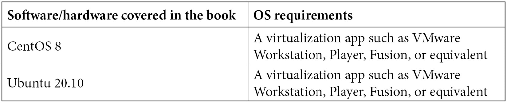

# 前言

*Linux 命令行与 Shell 脚本技术* 是一本帮助你学习如何使用 **命令行界面** (**CLI**) 并进一步扩展你的 CLI 知识，掌握脚本编写能力的书籍。它涵盖了大量的 CLI 命令，Shell 脚本基础（循环、变量、函数）和高级脚本主题——例如故障排除。它还包括两个带有脚本示例的章节，这些示例将帮助你加深对脚本的理解，并深入了解 Shell 脚本的工作过程。

# 本书适用对象

本书适合初学者和专业人士，因为它不一定需要大量的 Linux 基础知识。这部分正是本书的目的——帮助你掌握命令行的使用，并将这一使用模式扩展到 Shell 脚本编写。对于更高级的用户，本书还包含大量关于 Shell 脚本和相关示例的内容，帮助你组织和提高对 Shell 脚本的理解。

# 本书所涉及内容

*第一章*，*Shell 和文本终端基础*，讨论了 Shell 和文本终端的概念、Bash Shell 的配置、一些基础的 Shell 命令的使用，以及如何使用屏幕来访问多个文本模式的虚拟终端。

*第二章*，*使用文本编辑器*，带我们进入了文本编辑器的高度主观世界，在过去的 30 到 40 年里，关于*最佳编辑器*的话题一直在讨论。本章的一部分，我们将使用 vi(m)、nano，以及一些更高级的 vi(m) 设置。

*第三章*，*使用命令和服务进行进程管理*，讲述了如何使用文件、文件夹和服务，具体来说，如何管理它们，如何保护它们（文件和文件夹），以及如何管理它们（服务）。本章的重点之一是关于 ACLs 和 systemctl，它们是系统管理员必备的工具。

*第四章*，*使用 Shell 配置和排除网络故障*，主要讲述如何使用文件、文件夹和服务——处理权限、操作文件内容、归档和压缩文件、以及管理服务。在这一章中，我们将使用许多简单命令，这些命令在后续的脚本编写过程中也会用到。

*第五章*，*使用命令进行文件、目录和服务管理*，讲解了我们如何确保掌握基本的网络配置知识——nmcli 和 netplan，FirewallD 和 ufw，DNS 解析和诊断。这些是我们在部署后最常重新配置的设置，因此对它们的深刻理解是必不可少的。

*第六章*，*基于 Shell 的软件管理*，带我们了解两种最常用的打包系统（`dnf/yum` 和 `apt`），以及一些更高级的概念，比如使用额外的仓库、流和配置文件，创建自定义仓库和第三方软件。每一个 Linux 部署都需要我们了解包管理，因此本章内容就是围绕这一点展开的。

*第七章*，*基于网络的文件同步*，讲解了我们最常用的工具，帮助我们通过网络发送和接收文件以及连接到远程目的地 —— `ssh 和 scp, rsync, 以及 vsftpd`。无论是托管 Linux 发行版镜像，还是同步文件和备份，这都是必备的知识。

*第八章*，*使用命令行查找、提取和操作文本内容*，介绍了如何使用基础和更高级的方式来操作文本文件和内容。我们从做一些简单的操作开始，例如 `paste 和 dos2unix`，然后逐步过渡到 IT 领域最常用的命令 —— `cut,` (`e`)`grep, 和 sed`。

*第九章*，*Shell 脚本入门*，是本书第二部分的起点，主要介绍 Shell 脚本编写，并利用之前提到的工具和命令来创建 Shell 脚本。本章将讲解 Shell 脚本的基础知识，并探讨一些通用概念，比如输入、输出、错误和脚本的清洁性。

*第十章*，*使用循环*，深入讲解了循环的概念。我们将在本章讨论所有最常用的循环 —— `for` 循环、`break` 和 `continue`、`while` 循环、test-if 循环、`case` 循环，以及带有条件（如 `and`、`or` 和 `not`）的逻辑循环。这将进一步增强我们在 Shell 脚本中做更多事情的能力。

*第十一章*，*变量使用*，介绍了如何在 Shell 脚本代码中使用变量 —— Shell 变量、变量值中的引号和特殊字符、通过命令赋值外部变量，以及一些关于变量的逻辑操作。变量是 Shell 脚本的核心，所有的永久和临时数据都存储在变量中，因此，无论我们开发什么目的的 Shell 脚本，变量都是必不可少的。

*第十二章*，*使用参数和函数*，进一步定制和模块化我们的 Shell 脚本代码，因为我们可以使用函数来实现这一点。为此，我们将使用外部和 Shell 参数，摆脱大多数之前 Shell 脚本示例中的静态特性。

*第十三章*，*使用数组*，讲述了如何使用数组存储和操作数据。数组只是其中一种数据结构——我们需要它们，虽然不一定喜欢它们，但在很多情况下却离不开它们，特别是在我们开始接触它们的多种不同功能时，比如索引、添加和移除成员，以及将文件作为事实上的数组源来使用。

*第十四章*，*与 Shell 脚本的交互*，讲述了从将 Shell 脚本代码视为纯文本驱动的原则，转向相反的方向——创建一个基于 TUI 的界面来与脚本进行交互。我们还将尝试`expect`脚本，它使我们能够更轻松地创建一个等待特定输出并基于该输出执行某些操作的脚本，这在配置第三方系统时有时非常有用。

*第十五章*，*Shell 脚本故障排除*，处理 Shell 脚本故障排除——常见错误、通过在脚本执行期间输出值进行调试、Bash `-xv`选项及其他概念。这是我们开始处理许多脚本示例的最后一章，这些示例将作为学习工具供您使用，也可以在生产环境中使用，如果您愿意的话。

*第十六章*，*用于服务器管理、网络配置和备份的 Shell 脚本示例*，带领我们进入简单 Shell 脚本的世界——具体来说是九个不同的示例。主题涵盖了从可以在任何 Shell 脚本中实现的简单、模块化代码（例如，如何检查我们是否以 root 身份执行脚本），到更复杂的示例，如处理日期和时间、交互式配置网络设置和防火墙，以及一些备份脚本示例。

*第十七章*，*高级 Shell 脚本示例*，介绍了更复杂的示例，如修改 Web 服务器和安全设置的脚本、大量创建具有随机密码的用户和组的脚本、脚本化的 KVM 虚拟机安装以及脚本化的 KVM 虚拟机管理（启动、停止、获取信息、操作快照等）。这些是我们在日常生活中使用的示例，旨在强调 Shell 脚本的核心理念——即自动化枯燥、重复的任务，并将其委托给可以为我们完成这些工作的脚本。

# 如何充分利用本书



# 下载彩色图片

我们还提供了一个 PDF 文件，其中包含本书中使用的截图/图表的彩色图像。您可以在此下载：`static.packt-cdn.com/downloads/9781800205192_ColorImages.pdf`。

# 使用的约定

本书中使用了若干文本约定。

`文中的代码`：表示文中的代码词汇、数据库表名、文件夹名称、文件名、文件扩展名、路径名、虚拟网址、用户输入及 Twitter 账号。例如：*要配置网络的主机端，您需要从用户模式 Linux（UML）项目中获取 tunctl 命令*。

一段代码块的格式如下：

```
#include <stdio.h>
#include <stdlib.h>
int main (int argc, char *argv[])
{
    printf ("Hello, world!\n");
    return 0;
}
```

任何命令行输入或输出按如下格式书写：

```
$ sudo tunctl -u $(whoami) -t tap0
```

**粗体**：表示一个新术语、重要词汇或屏幕上看到的词汇。例如，菜单或对话框中的词语在文本中通常会显示为这样的样式。举个例子：*点击* **Flash** *从 Etcher 写入镜像*。

提示或重要说明

如此显示。

# 与我们联系

我们始终欢迎读者的反馈。

**一般反馈**：如果您对本书的任何部分有疑问，请在邮件主题中提到书名，并通过客户关怀邮箱与我们联系。

**勘误**：尽管我们已尽最大努力确保内容的准确性，但错误仍然可能发生。如果您在本书中发现了错误，请您向我们报告。请访问[www.packtpub.com/support/errata](https://www.packtpub.com/support/errata)，选择您的书籍，点击勘误提交表单链接，并填写相关详情。

**盗版**：如果您在互联网上遇到任何我们作品的非法复制品，我们将非常感激您能提供相关的网址或网站名称。请通过版权邮箱与我们联系，并附上该素材的链接。

**如果您有兴趣成为作者**：如果您在某个领域有专长，且有兴趣写作或参与书籍编写，请访问[authors.packtpub.com](https://authors.packtpub.com)。

# 分享您的想法

一旦您读完了*Linux 命令行与 Shell 脚本秘籍*，我们很期待听到您的想法！[请点击这里直接跳转到该书的亚马逊评论页面](https://packt.link/r/1-800-20519-8)并分享您的反馈。

您的评价对我们和技术社区都非常重要，它将帮助我们确保提供优质的内容。
