# *第一章*：Shell 和文本终端基础

一句古老的中国谚语说：“*千里之行，始于足下*”。本章将是我们迈向精通 Linux **命令行界面**（**CLI**）和**Shell 脚本**的第一步。具体来说，我们将学习如何使用终端、Shell，一些基本命令以及一个非常实用的工具——`screen`，来一次处理多个任务。

随着你深入阅读本书，你会注意到我们将频繁使用这些概念，因为它们是后续章节的基础。在进行系统管理时，我们通常在某种命令行界面（CLI）中能做的更多，而不仅仅是在任何一种**图形用户界面**（**GUI**）中。这源自于*CLI*的可编程性与大多数 IT 图形界面*静态*性质之间的对比。此外，像`screen`这样的工具将使我们的 CLI 操作更加轻松，因为我们可以同时处理多个虚拟屏幕，从而提高工作效率。

简而言之，我们将处理以下几个主题：

+   访问 Shell

+   设置用户 Shell

+   设置 Bash Shell

+   使用最常见的 Shell 命令

+   使用`screen`

# 技术要求

对于这些主题，我们将使用两台 Linux 机器——在我们的案例中，它们是两台运行*Ubuntu*（*20.04 Focal Fossa*）的 VMware 虚拟机。我们称它们为`cli1`和`gui1`，随着书籍的推进，我们将增加更多机器，随着主题的复杂性增加，所以，总的来说，我们需要以下内容：

+   VMware Player、Workstation、Fusion 或 ESXi

+   Ubuntu 20.04 Focal Fossa 安装 ISO 文件

+   安装这两台没有图形界面的虚拟机（`cli1`机器）和带图形界面的虚拟机（`gui1`机器）需要一些时间。

安装过程完成后，我们将开始学习 Shell 基础——这是我们下一个要讨论的主题。

# 访问 Shell

首先，我们简要讨论各种**Shell**访问方法。它可以简单到只安装一个运行文本模式的 Linux 虚拟机，但也可以是一个带有图形界面的虚拟机。那样我们就需要做一些工作来访问文本模式；所以，让我们学习这些不同的 Shell 访问方式。

理解*为什么*访问 Shell 如此重要也很关键。其背后的理由很简单，因为我们在 Shell 中能做的事情远比在 GUI 中做的多。在本书的第二部分，我们将深入探讨 Shell 脚本的概念，那时你会发现，为什么我们在 Shell 中能够做更多的事情，这一点会更加显而易见。

## 准备工作

首先，我们需要部署我们的两个虚拟机。我们实际上可以将这两台机器安装为文本模式机器，并启用 OpenSSH 服务器（安装过程中的某个步骤会询问 OpenSSH）。然后，我们可以为 `gui1` 机器添加图形界面，以便我们也可以使用它。我们通过在以 `student` 用户登录后，在 `gui1` 机器上输入几个命令来完成此操作（`student` 是我们为本示例设置的用户名）：

```
sudo apt-get -y install tasksel
tasksel
```

`sudo` 将要求我们输入 `student` 用户的密码（这可以是你在安装过程中创建的任何用户；`student` 只是我们在示例中使用的用户名）。当 **tasksel TUI** 界面启动时，我们将选择 **Ubuntu 桌面** 软件包集，如下图所示：

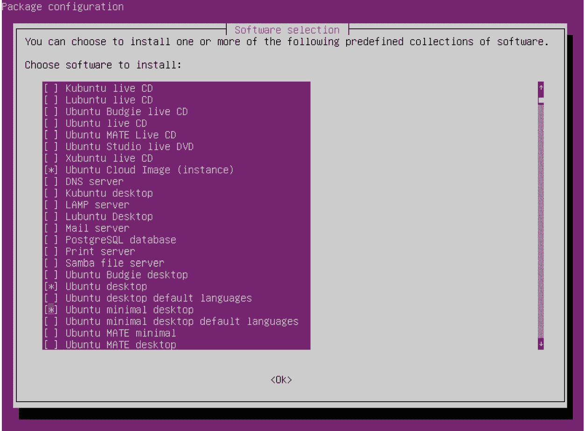

图 1.1 – Ubuntu 桌面软件包

正如 *图 1.1* 所示，你需要使用箭头键选择 **Ubuntu 桌面**，并按空格键从菜单中进行选择，然后使用 *Tab* 或箭头键选择 **Ok** 并按 *Enter*。

现在让我们讨论如何访问 shell。

## 如何操作…

如果我们使用默认选项部署了 Ubuntu 机器，默认情况下我们将看到文本模式。为了访问 shell 并能够对 Linux 虚拟机进行操作，我们需要输入我们在安装过程中设置的 *用户名* 和 *密码*。必须是我们在安装过程中输入的用户名或密码。在我们的虚拟机中，创建了名为 `student` 的用户，密码为预设的 `student` 密码。当我们成功登录后，将看到常规的文本模式和关联的 shell，如下图所示：

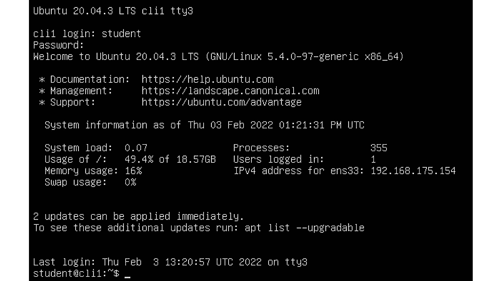

图 1.2 – 登录后从文本模式访问 CLI

然而，如果我们进行了图形界面安装，访问 shell 有三种不同的方法：

1.  我们可以在 **GNOME**（**GNOME 终端**）中启动文本终端并使用其中的 shell。优点是它为我们提供了类似图形用户界面的外观和感觉，对许多人来说可能更友好。缺点是，我们很少在生产环境中的 Linux 服务器上找到图形界面，因此这可能会导致 *养成不良习惯*。要启动 GNOME 终端，我们可以使用内置的 GNOME 搜索功能（按 *WIN* 键）或直接右键点击桌面并打开 **终端**。结果如下所示：


图 1.3 – 在 GNOME 图形用户界面中使用 WIN 键搜索“Terminal”关键词来查找终端

1.  我们可以直接切换到基于文本的控制台，因为 Linux 在部署 GUI 时并不阻止我们使用文本控制台。为此，我们需要按下一个专门的键盘组合，才能进入其中一个文本控制台。例如，我们可以按下 *Ctrl* + *Alt* + *F3* 键组合。这样，我们将进入文本模式，具体来说，进入文本控制台编号。

在那里，我们可以登录并开始输入我们的命令。结果将如下所示：

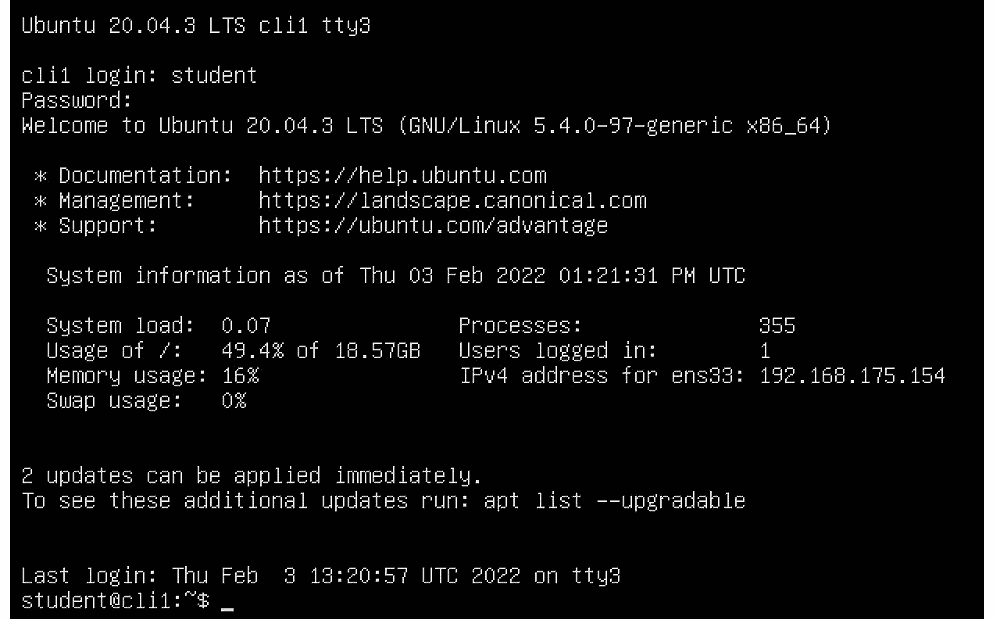

图 1.4 – 从 GUI 切换到文本终端

我们又回到 shell 了。现在我们可以开始使用任何我们想要的命令。

1.  我们可以使用 `systemctl` 命令将当前会话的默认模式切换为文本模式（直到下次重启）。我们甚至可以使用它将文本模式设置为永久模式，尽管我们已经安装了完整的 GUI。为了实现这一点，在我们的 GUI 中，我们需要登录，然后在 GNOME 终端中输入以下一系列命令：

```
systemctl set-default multi-user.target
systemctl isolate multi-user.target
```

如果我们想要将 Linux 虚拟机设置为 *默认* 启动到文本模式，可以使用第一条命令。如果我们想立即将 Linux 机器重新配置为切换到文本模式，可以使用第二条命令。

## 它是如何工作的…

在前一个示例中，我们使用了几组命令，接下来让我们解释这些命令的作用，以便我们能够清楚地了解我们所做的事情。

第一组命令如下：

```
sudo -i
apt-get -y install tasksel
tasksel
```

这三条命令将执行以下操作：

+   `sudo -i` 将要求我们输入当前用户的密码。如果该用户已经被添加到 `sudoers` 系统中（`/etc/sudoers`），这意味着我们可以使用当前用户的密码以 root 身份登录并使用管理员权限。

+   `apt-get -y install tasksel` 将安装 `tasksel` 应用程序。该应用程序的主要目的是简化包的部署。具体来说，我们将在下一步中使用它来部署一组 *Ubuntu 桌面* 包（多个成百上千个包）。想象一下，如果手动输入所有的 `apt-get` 命令来完成这一部署过程会是什么样子！

+   `tasksel` 命令将启动 tasksel 应用程序，该程序将用于部署所需的包。

第二组命令执行以下操作：

+   `systemctl set-default multi-user.target` 将设置文本模式为默认启动目标。其含义是，我们的 Linux 机器将在下次重启后默认以文本模式启动。

+   `systemctl isolate multi-user.target` 将立即将我们切换到文本模式。与 `set-default` 程序完全不同，因为它与重启后的 Linux 机器状态无关。

## 另请参见

如果你需要更多关于 `apt-get`、`tasksel` 或 `systemctl` 的信息，我们建议你访问以下链接：

+   `apt-get`: [`help.ubuntu.com/community/AptGet/Howto`](https://help.ubuntu.com/community/AptGet/Howto)

+   `tasksel`: [`help.ubuntu.com/community/Tasksel`](https://help.ubuntu.com/community/Tasksel)

+   `systemctl`: [`www.liquidweb.com/kb/what-is-systemctl-an-in-depth-overview/`](https://www.liquidweb.com/kb/what-is-systemctl-an-in-depth-overview/)

# 设置用户的 shell

现在我们已经了解了如何访问 shell，让我们将其配置为便于使用。我们将看到几个例子，以便理解 Linux shell 的自定义性。具体来说，我们将自定义提示符的外观和感觉。

## 准备就绪

我们只需要保持虚拟机的运行。

## 如何操作…

我们将编辑一个名为`/home/student/.bashrc`的文件。在此之前，让我们创建`.bashrc`文件的备份副本，以防我们犯错：

```
cp /home/student/.bashrc /home/student/.bashrc.tmp
```

在编辑这个文件之前，确保你记下当前提示符的样子。如果你以`student`身份登录到`cli1`机器，提示符应该是这样的：

```
student@cli1:~$
```

让我们使用`nano`编辑`.bashrc`文件。输入以下命令：

```
nano /home/student/.bashrc
```

当我们输入这个命令时，我们将会在 nano 编辑器中打开`.bashrc`。让我们滚动到文件的末尾，应该像这样：

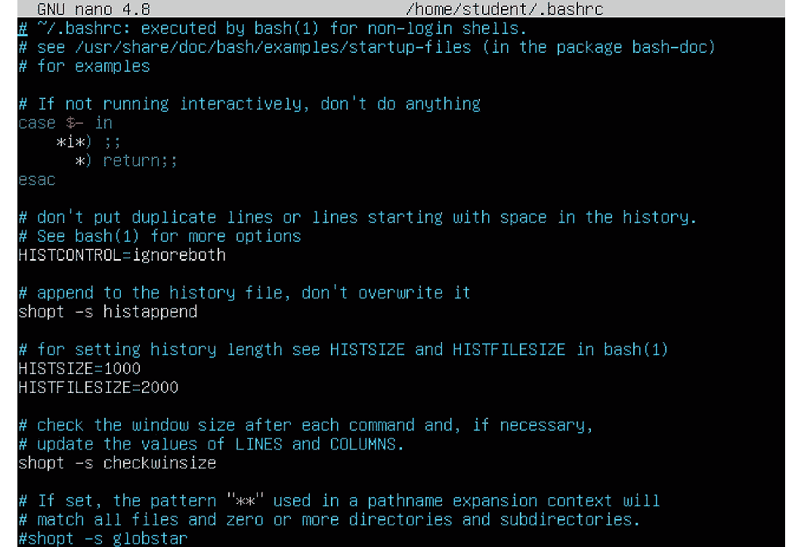

图 1.5 – .bashrc 默认内容

我们需要继续到最后一个`fi`的位置，并添加以下语句：

```
PS1="MyCustomPrompt> "
```

接下来，使用*Ctrl* + *X*保存文件。然后，当我们回到 shell 时，输入以下命令：

```
source .bashrc
```

如果我们一切都做对了，我们的提示符现在应该是这样的：

```
MyCustomPrompt> 
```

这可以通过使用 PS1 参数进一步自定义。让我们定位以下内容：

```
PS1="MyCustomPrompt> "
```

我们将其更改为以下内容：

```
PS1="\u@\H> \A "
```

`\u@\H`部分表示提示符中的`username@host`部分。`\A`部分表示 24 小时制的时间。所以，当我们执行以下操作时：

```
source .bashrc
```

再次，我们应该看到提示符的以下状态：

```
[student@cli1> 19:30]
```

`19:30`表示时间。我们还可以自定义其他内容，比如字体类型（下划线、正常、暗淡、粗体）和颜色（黑色、红色、绿色等）。现在就让我们来做这个。比如，我们再次编辑`.bashrc`文件，将`PS1`设置如下：

```
PS1="\e[0;31m[\u@\H \A] \e[0m"
```

现在我们的提示符应该是这样的：

```
[student@cli1 19:39]
```

在这个具体的例子中，`\e[`告诉`PS1`变量我们想要更改提示符的颜色。`0;31m`表示红色（`30`是黑色，`34`是蓝色，以此类推）。`[]`括起来的部分是我们之前讨论的常规提示符。最后的部分，`\e0m`，告诉`PS1`变量我们已完成对`PS1`输出的颜色修改。

如我们所见，修改一个 shell 变量（`PS1`）就能大幅改变我们在 Linux 虚拟机中的文本模式体验。

## 它是如何工作的……

作为一个 Shell 变量，`PS1`可以用来定制 Shell 的外观和感觉。可以把它理解为大多数用户自定义 GUI 时，使用不同的壁纸、文本大小、颜色等方式，它是我们喜欢的东西，因此这是一个很自然的做法。`PS1`通常被称为**主提示显示变量**，如前面章节所述。

我们使用的`source`命令*执行*了`.bashrc`，意味着它将应用来自`.bashrc`的设置。因此，我们无需注销再重新登录，因为那样浪费时间，`source`命令可以帮助我们解决这个问题。

现在，让我们在`.bashrc`文件中添加更多设置，因为还有很多内容可以自定义。

# 设置 Bash shell。

我们调整了`PS1`变量并将其配置为更符合我们的喜好。现在，让我们使用更多的`.bashrc`设置，进一步配置我们的 Bash shell。

## 准备开始。

我们需要保持虚拟机处于运行状态。如果它们没有开机，我们需要重新开机。

## 如何做到这一点……

让我们讨论如何更改以下 Shell 参数：

1.  添加一些自定义别名。

如果我们再次打开`.bashrc`文件，可以对它进行一些额外的设置。首先，添加几个别名。在`.bashrc`文件的末尾附近，有一部分包含了一些别名（`ll`、`la`和`l`）。我们可以在该部分添加以下行：

```
alias proc="ps auwwx"
alias pfilter="ps auwwx | grep "
alias start="systemctl start "
alias stop="systemctl stop "
alias ena="systemctl enable "
```

这段代码将引入五个新别名：

+   查看进程列表

+   按照`pfilter`后面要输入的关键字过滤进程。

+   启动服务；服务名称应在`start`后面输入。

+   停止服务；服务名称应在`stop`后面输入。

+   启用服务；服务名称应在`ena`后面输入。

如我们所见，使用别名可以让我们的输入更简短，且使管理过程更简单。

1.  调整 Bash 历史记录的大小。

在`.bashrc`文件的顶部，有一个类似这样的部分：

```
HISTSIZE = 1000
HISTFILESIZE = 1000
```

如果我们希望 Bash shell 记住当前会话中输入的超过 1,000 条命令（`HISTSIZE`），并且将超过 1,000 条命令保存在历史文件（`.bash_history`）中，我们可以更改这些变量的值，例如设置为`2000`和`2000`。

1.  调整`PATH`变量。

假设我们想向现有的`PATH`变量中添加一个自定义路径。例如，我们将自定义应用程序安装在`/opt/bin`目录中，而且我们不想每次都通过完整路径来调用该应用程序。

我们需要编辑`.profile`文件，因为当前用户的`PATH`变量是在那里设置的。因此，打开`.profile`文件并将以下行添加到文件的末尾：

```
PATH=$PATH:/opt/bin
```

1.  设置我们的默认编辑器。

让我们将以下两行添加到`.bashrc`文件中，位于文件末尾：

```
export VISUAL=nano
export EDITOR=nano
```

这将把 nano 设置为我们首选的默认编辑器。

## 它是如何工作的……

Bash shell 具有一组保留变量，我们只能用于 Bash 目的。其中一些保留变量包括以下内容：

+   `PS1`、`PS2`、`PS3` 和 `PS4`

+   `HISTFILESIZE` 和 `HISTSIZE`

+   `VISUAL` 和 `EDITOR`

+   `OLDPWD`

+   `PWD`

这些名称是为特定 Bash 函数保留的，因此我们不应该用这些名称创建自定义变量。您可以从*还有更多…*部分提供的链接了解更多关于这些保留变量的信息。

就 PS 变量而言，我们可以认为它们是我们自定义 Bash shell 的入口。特别是对于 PS1 变量来说，因为它是最常用的变量。我们可以使用所有这些变量来设置 Bash，以适应我们自己的需求，因为我们不必只使用预定义的全局配置。随着时间的推移，越来越多的 Linux 系统管理员为 Bash 创建自己的定制配置，因为这增加了使用 Bash shell 的便利性和他们自己的生产力。

## 还有更多…

如果我们需要了解更多关于 Bash 保留变量和 PS 变量的信息，我们可以查看以下链接：

+   `https://tldp.org/LDP/Bash-Beginners-Guide/html/sect_03_02.html`

+   `https://access.redhat.com/solutions/505983`

# 使用最常见的 shell 命令

现在让我们转向学习一组基本的**Linux shell 命令**。我们将讨论用于操作文件和文件夹、进程、归档和链接的命令。我们将通过一个涉及多个步骤的场景来实现这一点。

## 准备工作

我们仍然需要与之前的配方相同的虚拟机。

## 如何做…

为了能够使用 shell 命令，我们必须启动 shell。如果我们使用 CLI，我们只需登录并进入 shell 会话。如果我们使用 GUI 方法，我们必须在应用程序菜单中找到一个 GUI 终端。之后，我们可以开始输入命令：

1.  首先，让我们使用一组基本的命令来处理文件和目录。

让我们列出当前目录的内容：

```
ls -al
```

输出将类似于这样：

![图 1.6 – `ls -al` 命令的标准输出，包含所有相关信息


图 1.6 – `ls -al` 命令的标准输出，包含所有相关信息

1.  现在，让我们创建一个名为`directory1`的目录和一个名为`test1`到`test5`的五个文件的堆栈。`touch`命令会创建空文件。接着，让我们把这些文件复制到该目录：

    ```
    mkdir directory1
    touch test1
    touch test2
    touch test3
    touch test4
    touch test5
    cp test* directory1
    ```

1.  之后，让我们创建一个名为`directory2`的目录，并将文件 1 到 5 移动到`directory2`：

    ```
    mkdir directory2
    mv test* directory2
    ```

1.  让我们检查`directory1`和`directory2`中已使用的磁盘空间量：

    ```
    [student@cli1 21:47] du directory1
    4       directory1
    [student@cli1 21:47] du -hs directory2
    4.0K    directory2
    [student@cli1 21:48]
    ```

1.  让我们检查当前磁盘的容量（`-h`开关为我们提供了一个友好的、易读的输出）：

    ```
    df -h .
    Filesystem                         Size  Used Avail Use% Mounted on
    /dev/mapper/ubuntu--vg-ubuntu--lv   19G  4.5G   14G  26% /
    ```

接下来的一组命令与硬链接和软链接相关。

1.  为了创建硬链接和软链接，让我们登录到`cli1`虚拟机，并以`root`身份登录。硬链接和软链接的整体概念将在本章稍后解释。因此，创建一个临时目录并使用一些文件。我们将使用一个现有的文件，因为它足以满足这个场景（`.bashrc`文件）：

    ```
    mkdir links
    cd links
    cp /root/.bashrc content.cfg
    ln content.cfg hardlink.cfg
    ln -s content.cfg softlink.cfg
    ls -al
    cd /root
    ln -s links links2
    ln links links3
    ln: links: hard link not allowed for directory
    cp .bashrc /tmp
    cd /tmp
    ln .bashrc /root/notworking
    ln: failed to create hard link '/root/notworking' => '.bashrc': invalid cross-device link
    ln -s .bashrc /root/working.cfg
    ls /root/working.cfg
    /root/working.cfg
    ```

1.  现在让我们检查其中一个文件的开始和结尾。例如，我们使用`/tmp/.bashrc`：

    ```
    head /tmp/.bashrc
    [student@cli1 22:28] head /tmp/.bashrc
    # ~/.bashrc: executed by bash(1) for non-login shells.
    # see /usr/share/doc/bash/examples/startup-files (in the package bash-doc)
    # for examples
    # If not running interactively, don't do anything
    case $- in
     *i*) ;;
     *) return;;
    esac
    ```

现在让我们检查同一个文件的尾部：

```
[student@cli1 22:29] tail /tmp/.bashrc
 if [ -f /usr/share/bash-completion/bash_completion ]; then
 . /usr/share/bash-completion/bash_completion
 elif [ -f /etc/bash_completion ]; then
 . /etc/bash_completion
 fi
fi
PS1="\e[0;31m[\u@\H \A] \e[0m"
export VISUAL=nano
export EDITOR=nano
```

1.  下一步将涉及检查运行的进程和系统状态。

现在让我们使用命令检查系统当前的负载，找到一些进程，并杀掉其中的一些进程来娱乐一下。

首先，让我们检查负载（使用`uptime`命令），并找到消耗时间最多的前 20 个进程（`ps`命令）：

```
uptime
22:35:48 up  3:16,  2 users,  load average: 0.00, 0.00, 0.00
ps  auwwx | head -20
[student@cli1 22:35] ps auwwx | head -20
USER         PID %CPU %MEM    VSZ   RSS TTY      STAT START   TIME COMMAND
root           1  0.0  0.5 103252 11844 ?        Ss   19:18   0:02 /sbin/init
root           2  0.0  0.0      0     0 ?        S    19:18   0:00 [kthreadd]
root           3  0.0  0.0      0     0 ?        I<   19:18   0:00 [rcu_gp]
root           4  0.0  0.0      0     0 ?        I<   19:18   0:00 [rcu_par_gp]
root           6  0.0  0.0      0     0 ?        I<   19:18   0:00 [kworker/0:0H-kblockd]
root           9  0.0  0.0      0     0 ?        I<   19:18   0:00 [mm_percpu_wq]
root          10  0.0  0.0      0     0 ?        S    19:18   0:00 [ksoftirqd/0]
root          11  0.0  0.0      0     0 ?        I    19:18   0:04 [rcu_sched]
root          12  0.0  0.0      0     0 ?        S    19:18   0:00 [migration/0]
```

接下来，让我们根据进程名称找到特定的进程并杀掉它：

```
student@gui1:~$ ps auwwx | grep -i firefox
student    47198 22.1 21.3 2825436 426736 ?      Rl   22:38   0:12 /usr/lib/firefox/firefox -new-window
student    47253  1.5  6.8 2427560 137988 ?      Sl   22:38   0:00 /usr/lib/firefox/firefox -contentproc -childID 1 -isForBrowser -prefsLen 1 -prefMapSize 223938 -parentBuildID 20210222142601 -appdir /usr/lib/firefox/browser 47198 true tab
student    47266  1.0  5.5 2402216 110116 ?      Sl   22:38   0:00 /usr/lib/firefox/firefox -contentproc -childID 2 -isForBrowser -prefsLen 85 -prefMapSize 223938 -parentBuildID 20210222142601 -appdir /usr/lib/firefox/browser 47198 true tab
student    47304  1.3  6.6 2468136 133340 ?      Sl   22:38   0:00 /usr/lib/firefox/firefox -contentproc -childID 3 -isForBrowser -prefsLen 1246 -prefMapSize 223938 -parentBuildID 20210222142601 -appdir /usr/lib/firefox/browser 47198 true tab
student    47363  0.6  4.1 2386184 83588 ?       Sl   22:38   0:00 /usr/lib/firefox/firefox -contentproc -childID 4 -isForBrowser -prefsLen 10270 -prefMapSize 223938 -parentBuildID 20210222142601 -appdir /usr/lib/firefox/browser 47198 true tab
student    48047  0.0  0.0   5168   880 pts/1    S+   22:39   0:00 grep --color=auto -i firefox
student@gui1:~$ killall firefox
student@gui1:~$ ps auwwx | grep -i firefox
student    48323  0.0  0.0   5168   884 pts/1    S+   22:40   0:00 grep --color=auto -i firefox
```

我们已经完成了这部分的内容。接下来，让我们讨论本配方的下一部分，关于用户和组的管理。

1.  使用命令行管理用户和组，首先让我们浏览一下本配方中要使用的命令列表：

    +   `useradd`：用于*创建*本地用户账户的命令。

    +   `usermod`：用于*修改*本地用户账户的命令。

    +   `userdel`：用于*删除*本地用户账户的命令。

    +   `groupadd`：用于*创建*本地组的命令。

    +   `groupmod`：用于*修改*本地组的命令。

    +   `groupdel`：用于*删除*本地组的命令。

    +   `passwd`：最常用于为用户账户分配密码的命令，但也可以用于其他场景（例如，锁定用户账户）。

    +   `chage`：用于管理用户密码过期的命令。

那么，让我们通过使用`useradd`和`groupadd`命令来创建我们的第一个用户和组，配合一个场景。假设我们的任务如下：

+   创建四个用户，分别为`jack`、`joe`、`jill`和`sarah`。

+   创建两个用户组，分别为`profs`和`pupils`。

+   重新配置`jack`和`jill`用户账户，使其成为`profs`组的成员。

+   重新配置`joe`和`sarah`用户账户，使其成为`pupils`组的成员。

+   为所有账户分配一个标准密码（我们将使用`P@ckT2021`作为这个目的）。

+   配置用户账户，使其在下次登录时必须更改密码。

+   为`profs`用户组设置特定的过期日期——密码更改前的最小天数设置为`15`，强制密码更改前的最大天数设置为`30`，密码更改的警告在密码到期前一周开始，并将账户的过期日期设置为 2022/01/01（2022 年 1 月 1 日）。

+   为`pupils`用户组设置具体的过期日期——密码更改的最小天数设为`7`天，强制密码更改的最大天数设为`30`天，密码更改的提醒需要在密码过期前 10 天开始，并且设置账户的过期日期为 2021/09/01（2021 年 9 月 1 日）。

+   将`profs`组修改为`professors`，并将`pupils`组修改为`students`。

1.  第一个任务是创建用户账户：

    ```
    useradd jack
    useradd joe
    useradd jill
    useradd sarah
    ```

这将在`/etc/passwd`文件中为这四个用户创建条目（该文件存储了大多数用户的信息——用户名、用户 ID、组 ID、默认主目录和默认 shell），并在`/etc/shadow`文件中创建条目（该文件存储了用户的密码和密码过期信息）。

1.  接下来，我们需要创建这些组：

    ```
    groupadd profs
    groupadd pupils
    ```

这将为这些组在`/etc/group`文件中创建条目，该文件是系统存储所有系统组的地方。

1.  下一步是管理`professors`和`students`用户组的成员资格。

在我们开始之前，需要了解一个事实。存在两种不同的本地用户组类型，**主组**和**附加组**。主组在创建新文件和目录时非常重要，因为创建文件时会默认使用用户的主组（当然也有例外，我们将在本章的*设置 Bash shell*部分提到关于 umask、权限和 ACL 的内容）。附加组在共享文件和文件夹及相关场景中很重要，通常用于一些附加设置，以应对更复杂的场景。这些场景将在本章提到的*设置 Bash shell*部分中解释，也会在《第九章》*和《Shell 脚本简介》*的配方中进一步讲解。

主组和附加组存储在`/etc/group`文件中。

1.  现在我们已经完成了这部分内容，接下来让我们修改用户的设置，使他们属于*附加*组，这些组是根据场景指定的：

    ```
    usermod -G profs jack
    usermod -G profs jill
    usermod -G pupils joe
    usermod -G pupils sarah
    ```

现在我们来检查一下这如何改变`/etc/group`文件：

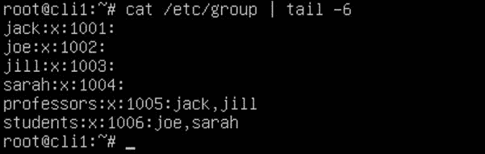

图 1.7 – /etc/group 文件中的条目

`/etc/group`文件中的前四个条目实际上是在我们使用`useradd`命令创建这些用户账户时创建的。接下来的两个条目（冒号后面的部分除外）是由`groupadd`命令创建的。冒号后面的条目是通过`usermod`命令创建的。

1.  现在让我们设置他们的初始密码，并在下次登录时强制更改密码。我们可以通过几种不同的方式来实现这一点，但让我们学习更*程序化*的做法，通过回显字符串并将其作为用户账户的明文密码：

    ```
    echo "jack:P@ckT2021" | chpasswd
    echo "joe:P@ckT2021" | chpasswd
    echo "jill:P@ckT2021" | chpasswd
    echo "sarah:P@ckT2021" | chpasswd
    ```

仅仅是回显部分，没有其他命令的情况下，意味着在终端中输入`P@ckT2021`，像这样：

```
echo "P@ckT2021"
P@ckT2021
```

在 CentOS 和类似的发行版中，我们可以使用带有`--stdin`参数的`passwd`命令，这意味着我们希望通过标准输入（键盘、变量等）为用户帐户添加密码。在 Ubuntu 中，这个功能不可用。因此，我们可以将`username:P@ckT2021`字符串回显到 shell 并通过管道传输给`chpasswd`命令，这样就能达到同样的目的；`chpasswd`命令不会将该字符串输出到终端，而是将其作为标准输入处理。

1.  让我们为教授和学生设置到期日期。为此，我们需要学习如何使用`chage`命令及其一些参数（`-m`、`-M`、`-W`和`-E`）。简而言之，它们的含义如下：

    +   如果我们使用`-m`参数，这意味着我们想要设置密码更改前允许的最小天数。

    +   如果我们使用`-M`参数，这意味着我们想要设置密码更改前强制执行的最大天数。

    +   如果我们使用`-W`参数，这意味着我们希望设置密码过期前的警告天数，这意味着 shell 会开始向我们抛出关于需要在密码过期前更改密码的消息。

    +   如果我们使用`-E`参数，这意味着我们想要将帐户过期设置为某个特定日期（YYYY-MM-DD 格式）。

现在让我们将其转换为命令：

```
chage -m 15 -M 30 -W 7 -E 2022-01-01 jack
chage -m 15 -M 30 -W 7 -E 2022-01-01 jill
chage -m 7 -M 30 -W 10 -E 2021-09-01 joe
chage -m 7 -M 30 -W 10 -E 2021-09-01 sarah
```

1.  最后，让我们将组修改为最终设置：

    ```
    groupmod -n professors profs
    groupmod -n students pupils
    ```

这些命令只会更改组名，而不会更改其他数据（如组 ID），这些更改也会反映在我们的用户信息中：

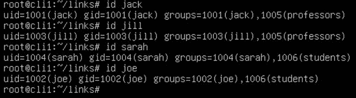

图 1.8 – 检查已创建用户的设置

如我们所见，`jack`和`jill`是现在叫做`professors`的组的成员，而`joe`和`sarah`是现在叫做`students`的组的成员。

我们故意把`userdel`和`groupdel`命令放到最后，因为这些命令有一些注意事项，不应轻易使用。让我们创建一个名为`temp`的用户和一个名为`temporary`的组，然后删除它们：

```
useradd temp
groupadd temporary
userdel temp
groupdel temporary
```

这样就可以正常工作。问题是，由于我们在没有任何参数的情况下使用了`userdel`命令，它将保留用户的主目录不变。由于用户的主目录通常存储在`/home`目录中，默认情况下，这意味着`/home/temp`目录仍然会存在。在删除用户时，我们有时希望删除用户但保留其文件。如果你特别希望删除用户帐户及其所有数据，请使用`userdel -r username`命令。但在执行之前请三思而后行！

## 它是如何工作的……

现在让我们讨论一下之前配方中较复杂的部分，即**符号链接**和**硬链接**。

使用`ln`命令而不带额外参数时，会尝试创建硬链接。使用`ln`并加上`-s`参数时，会尝试创建软链接。我们可以明显看到食谱中有一些错误。现在，让我们从头开始讨论这些问题。

当我们输入完食谱中的前六个命令（以`ls -al`结束），这些命令用于列出文件夹内容时，最终结果应该类似于以下内容：

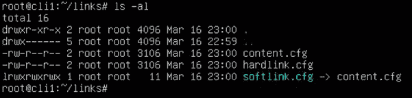

图 1.9 – 原始文件、硬链接和软链接

从之前的截图中，我们可以得出一些结论：

+   `content`文件和`hardlink`文件的大小相同（在我们的例子中是 1,349 字节）。

+   `content`文件和`softlink`文件的文件大小不同（分别为 1,349 字节与 11 字节）。

+   软链接通常会以不同的方式标记（通常在终端中显示为不同的颜色）。

现在，为了进一步说明这个问题，我们来删除原始的`content`文件：

```
r m content.cfg
```

最终结果将如下所示：

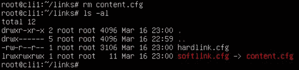

图 1.10 – 删除原始文件后产生的有趣后果

我们可以看到，原始文件已被删除，而硬链接仍然存在并保持相同的大小。另一方面，软链接的颜色发生了变化（从绿色变为红色），这表明出现了某种问题。很有趣，不是吗？

如果我们在**vi 编辑器**中打开`hardlink.cfg`文件，内容是确实存在的：

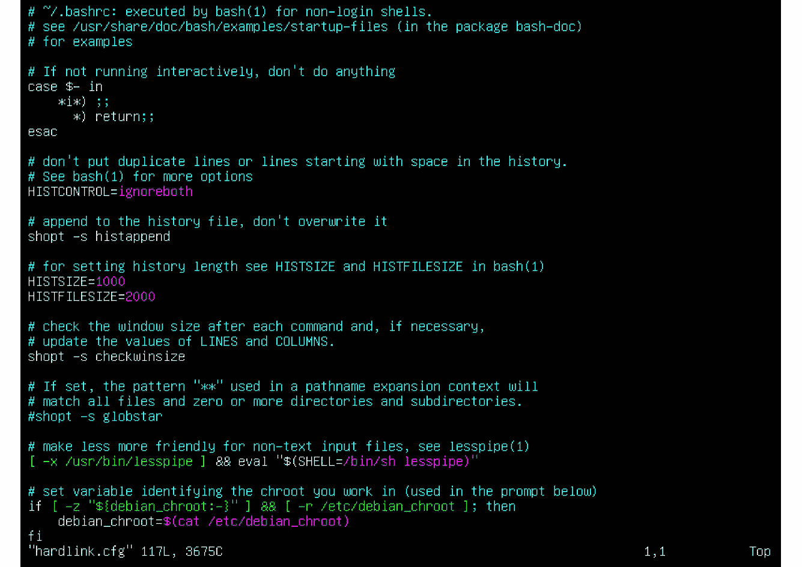

图 1.11 – hardlink.cfg 文件仍然包含原始内容

之所以会发生这种情况，源于文件系统的工作方式。当我们删除一个文件时，我们并不会删除文件的内容，而只是删除文件系统表中的一个条目（文件名），该条目指向文件内容。这是因为删除文件内容涉及到速度和便捷性。如果操作系统实际删除文件内容，它将需要释放块并将零写入这些块，这会非常耗时。而且，这会使得文件恢复变得复杂。

这就是硬链接和软链接发挥作用的地方。它们之间的主要区别可以通过这个场景轻松推断出来。硬链接指向实际的文件内容，而软链接指向原始的文件名。这也解释了文件大小的不同。硬链接必须与原始文件大小相同（因为原始文件和硬链接都指向相同的内容，因此大小相同）。而`softlink.cfg`仅占用 11 字节的空间，原因很简单；`content.cfg`字符串在文件系统表中保存时需要 11 字节。

这也是硬链接和软链接之间存在的另外两个主要区别的原因：

+   硬链接不能指向目录，必须指向文件。

+   硬链接不能跨越分区。如果我们从第二个分区的角度来看，我们无法引用/查看第一个挂载分区的数据。第二个分区有自己独立的文件系统表（其中包含指向该分区上实际内容的条目），与第一个分区的文件系统表完全独立。

回到我们的教程，值得注意的是，我们可以轻松恢复原始文件。如果我们回到 `/root/links` 目录，我们只需要将 `hardlink.cfg` 文件复制为 `content.cfg`，那么我们的原始文件和相应的符号链接就恢复了：

```
cd /root/links
cp hardlink.cfg content.cfg
```

最终结果就像之前一样，当我们创建 `content.cfg` 文件以及指向它的硬链接和软链接时：

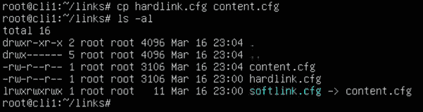

图 1.12 – 我们的原始文件和软链接已恢复

本书中我们将使用这些命令，因此我们需要确保在进入下一章之前掌握它们。但目前为止，我们只会将其中一个命令添加到命令栈中。它就是我们下一个教程的主题，叫做 **screen**。

# 使用 screen

**screen** 是一种曾在 1990 年代和 2000 年代非常流行的文本工具，虽然其流行度在之后有所下降。系统管理员通常需要在同一台机器上打开多个控制台，或者使用这些控制台连接到外部机器。让我们来看一下 screen 如何适应这种场景。

## 准备工作

在开始使用这个教程之前，我们需要确保我们的 Linux 机器上安装了 screen。为了做到这一点，我们需要使用以下命令：

```
apt-get -y install screen
```

之后，我们就可以准备按照我们的教程继续操作了。

## 如何操作…

我们需要启动一个常规的文本终端（这也可以通过图形界面完成，但从屏幕空间的利用效率来看，这可能被认为是一种不太有效的方式）。然后，我们只需要输入以下命令：

```
screen
```

当我们启动 screen 时，它会展示一长段关于许可和其他不太有趣的内容的文本，屏幕底部会有几个重要的信息。它看起来会类似于这样：

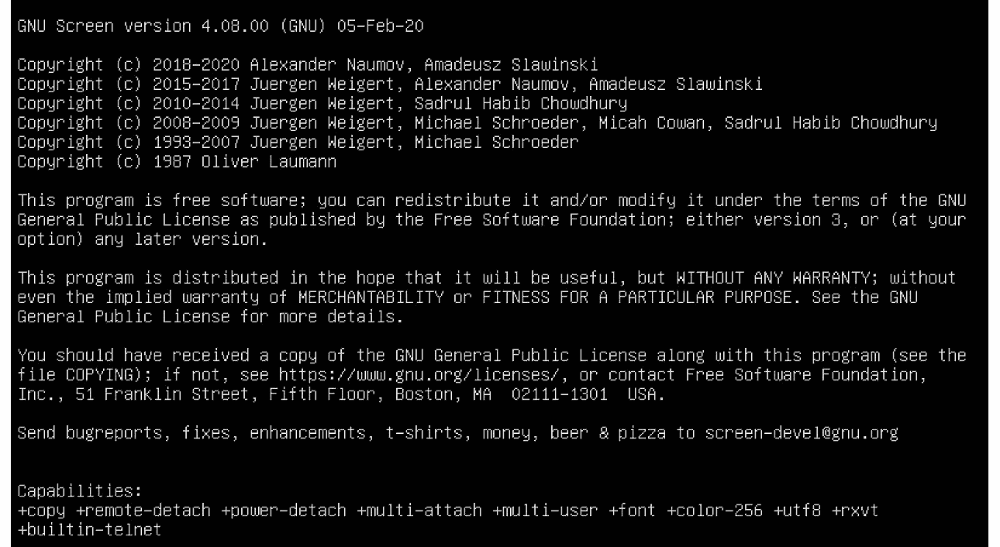

图 1.13 – 基本的 screen 信息

我们最感兴趣的这个输出部分是**功能**。它告诉我们，通过使用 screen，我们可以做一些很酷的事情，比如复制、分离以及处理字体。但即使没有大多数这些高级功能，screen 也能让我们在一个文本终端的限制内打开多个虚拟文本终端。然后，它让我们可以分离（就像把 screen 进程放到后台一样）、注销、稍后重新登录，重新连接会话到 screen。这样可以实现一些很酷的功能，比如为最常用的、最常见的使用场景保留一组永久的虚拟文本控制台。

在我们按下屏幕中前面截图显示的*Enter*键后，我们将再次进入文本模式。这是 screen 的第一个虚拟文本控制台。如果我们想使用更多的虚拟文本控制台，可以通过按下 *Ctrl* + *A* + *C* 组合键来创建它们。每一个虚拟文本控制台从 0 开始编号。如果我们在 screen 中创建了五个虚拟文本控制台（编号从 0 到 4），并且我们在 screen 4 上，想跳到 screen 0，我们可以通过两种方式轻松做到这一点。第一种方法是使用*绝对*地址，也就是说，我们可以告诉 screen 我们想特别跳到 screen 0（使用 *Ctrl* + *A* + *0*）。第二种方法是使用*循环*的方式。当我们使用 *Ctrl* + *A* + 空格键组合时，我们会按顺序循环通过各个屏幕——0，然后是 1，然后是 2，以此类推。如果我们在 screen 4 上，想跳到 0，因为没有 screen 5，我们只需通过 *Ctrl* + *A* + 空格键就能从 4 循环到 0。

如果我们需要注销，可以分离我们的 screen。其组合键是 *Ctrl* + *A* + *D*（分离 screen）。如果稍后我们想返回我们的屏幕，我们需要输入以下命令：

```
screen -R
```

我们也可以在 screen 中使用 *Ctrl* + *A* + *]* 键组合来进行复制粘贴，然后滚动并找到我们想要开始复制的文本部分，使用空格键开始复制，并结束复制过程，然后如果我们想把文本粘贴到某个地方，再次使用 *Ctrl* + *A* + *]* 组合键。它需要一点练习，但也非常好用。*试想一下在 1996 年做这些事情！*

重要提示

在使用 screen 时，我们建议你首先按下*Ctrl* + *A*，松开这两个键，然后按下你需要的任何键，去到你想要在屏幕上去的地方。

## 它是如何工作的…

screen 通过创建多个可分离的虚拟文本控制台来工作。这些控制台会保持活跃，直到有进程终止了 screen，或者直到系统重启。考虑到大多数基于 Linux 服务器的生产环境没有 GUI，能够一次连接到服务器并打开多个 screen 是非常方便的。

## 还有更多…

screen 需要一些试验和错误，需要一段时间适应。我们建议你查看以下链接以了解更多内容：

`https://www.howtogeek.com/662422/how-to-use-linuxs-screen-command/`
