# *第二章*：使用文本编辑器

本章的主题是无法绕开的，因为系统管理员会编辑 `gedit`，尽管我们不会在这里介绍该编辑器，因为它几乎与在 Microsoft Windows 上使用记事本一样。选择这些 **编辑器** 的原因有很多，但最重要的是，它们几乎都预装在所有 Linux 发行版中，因此它们是最常见的预安装编辑器。有些情况下无法安装额外的软件，比如 *隔离* 环境。

本章将覆盖以下食谱：

+   学习 Vi(m) 编辑器的基础

+   学习 nano 编辑器的基础

+   浏览高级 Vi(m) 设置

# 技术要求

对于这些食谱，我们将使用一台 Linux 机器。我们可以使用之前食谱中的任何虚拟机。例如，假设我们将使用 `cli1` 虚拟机，因为它最方便使用，毕竟它只是一个命令行界面（CLI）机器。所以，总的来说，我们需要以下内容：

+   安装了任何 Linux 发行版的虚拟机（在我们的例子中，它将是 *Ubuntu 20.10*）。

+   花些时间消化使用 Vi(m) 编辑器的复杂性。相比之下，nano 更简单，因此学习它会更容易一些。

那么，启动你的虚拟机，让我们开始吧！

# 学习 Vi(m) 编辑器的基础

Vi 和 Vim 是许多系统管理员和工程师的 *首选文本编辑器*。简而言之，它们的区别在于，**vim**（**vi 改进版**）拥有比原始的 vi（可视化编辑器）更多的功能。你可以在任何地方找到这些编辑器——从所有的 Unix 和 Linux 到当今的商业 Linux 或 Unix 基础软件。例如，VMware 的 *vSphere Hypervisor* 就内置了 vi 编辑器的一个版本。这样做的理由很简单——你需要有某种 *标准化编辑器*，可以用来编辑文件系统上各种文本文件。多年来，你肯定会在各种网络设备上找到简化版的 vi 或 Vim，比如交换机、路由器，甚至是更复杂的设备如防火墙。就是这样。如果某个东西是基于 Unix 或 Linux 的，那么它很可能会使用文本配置文件，而文本配置文件需要一个文本编辑器。这是非常直接的逻辑，不是吗？

以一个例子来说——Vim 编辑器有许多衍生版本，可以用不同的方式使用，包括 **vim-athena**（支持 *Athena GUI*）、**vim-gtk** 和 **vim-gtk3**（支持 *GTK/GTK3*）、**vim-tiny**（精简版的 Vim）、以及 **vim-nox**。不过，仍然大多数我们所知道的人更喜欢在命令行界面（CLI）中使用传统的 vi 或 Vim。

在我们食谱的第一部分，我们将解释 vi 和 Vim 的工作方式，并用它们完成一些常见的操作，比如以下几项：

+   三种 `vi(m)` 模式——`插入`、`命令` 和 `ex` 模式

+   在我们想要编辑的文本文件中移动光标

+   删除文本（我们可以称之为 *剪切* 和 *删除* 同时进行）

+   向文本文件中插入附加内容

+   在 vi(m) 编辑器中保存并退出

+   在文本文件中查找内容

+   复制和粘贴文本（vi 和 Vim 称之为 *yank* 和 *paste*）

这对第一个示例来说已经足够了。我们将在本章最后一个食谱中回到 **高级 vim 功能**，深入研究 Vim，学习如何使用更高级的概念，如正则表达式、行标记、缓冲区和排序。

## 准备就绪

我们只需要检查一下 vi 和 Vim 是否已经安装在系统中。最简单的方法就是直接执行以下命令：

```
sudo apt-get -y install Vim-tiny busybox Vim dictionaries-common wamerican
```

默认情况下，Ubuntu 并不自带或使用 vi 编辑器，所以我们可以安装 `Vim-tiny` 包来模拟类似的功能。另一种在 Ubuntu 中使用 vi 编辑器的方法是使用以下命令：

```
busybox vi
```

`busybox` 是一款将多个 Linux 命令行工具 *嵌入* 到一个工具中的命令行工具，因此这个命令是我们需要关注的内容。同时，我们还需要记住，`busybox` 的目的是将多个流行的 CLI 工具嵌入一个工具中，这意味着这些工具都与它们的独立版本有所不同。

安装完成后（如果需要安装的话），我们将开始使用 Vim，并通过示例学习如何使用它。作为 `root` 用户，让我们执行以下命令：

```
cp /etc/passwd /root
cp /usr/share/dict/words /root
```

请注意，在 `cp`、`/etc/passwd` 和 `/root` 之间（第二个命令中的 `cp`、`/usr/share/dict/words` 和 `/root` 也适用），我们需要按下 *空格键*。我们实际上是在将 `passwd` 和 `words` 文件复制到 `/root` 目录，以便获得一些源文件进行操作。

当我们成功复制了这些文件后，我们将启动 Vim 编辑器并开始编辑。首先，我们将使用 `passwd` 文件。输入以下内容：

```
Vim /root/passwd
```

开始学习吧！

## 如何做到这一点…

现在，我们已经在 Vim 编辑器中打开了 `/root/passwd` 文件，让我们试着在其中进行操作。在普通模式下，移动光标很简单。我们可以通过键盘上的箭头键向上、向下、向左或向右移动。完成后，让我们通过按 *gg*（两次按 *g* 键）跳到文件的顶部。

首先，我们将删除第一行。Vi(m) 编辑器默认启动在 *普通* 模式，如果我们按两次 *d* 键，就会删除第一行。让我们查看一下删除前的状态：

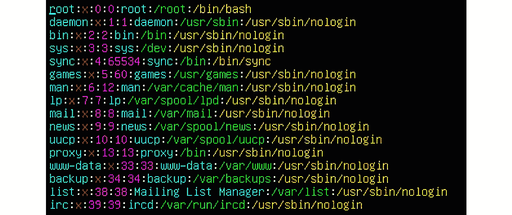

图 2.1 – /root/passwd 文件的顶部部分

现在，在我们按下 *d* 键两次后，应该是这样的效果（如果我们仍然处于第一行，即 `root` 行）：

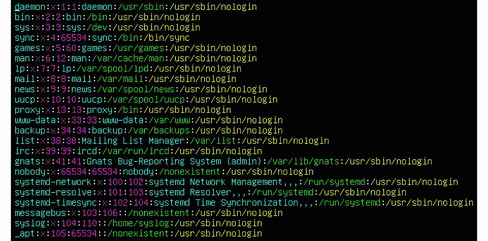

图 2.2 – 按下 d 键两次后，第一行已被删除

现在，让我们通过按下（仅作为示例）*5dd* 键序列进一步扩展这个用例。结果应该是这样的：

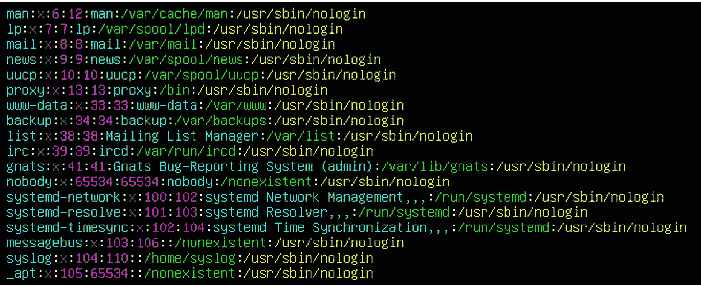

图 2.3 – 执行 5dd 操作（删除五行）后，光标后的五行被删除

如我们所见，光标后的前五行（以 `daemon`、`bin`、`sys`、`sync` 和 `games` 开头的行）已经消失。

现在让我们跳到 `/root/passwd` 文件的最后一行，并将其复制粘贴到最后一行后面。首先，我们需要跳到文件的末尾，可以通过使用 *Shift* + *g* 键序列（即大写字母 *G*）来实现。接下来，如果我们想复制光标后的这一行（实际上是完成文件的最后一行），我们需要先 yank（复制）它，然后粘贴到正确的位置。yank 可以通过使用 *yy* 键序列（按两次 *y* 键）来实现。这样，光标后的这一行就会放入复制和粘贴缓冲区。如果我们想把它粘贴到最后一行后面，我们需要按下 *p* 键。我们复制的行将会自动粘贴到最后一行后面。如果我们使用的是和 *第一章**，Shell 和文本终端基础* 中相同的虚拟机，最终结果应该是这样的：

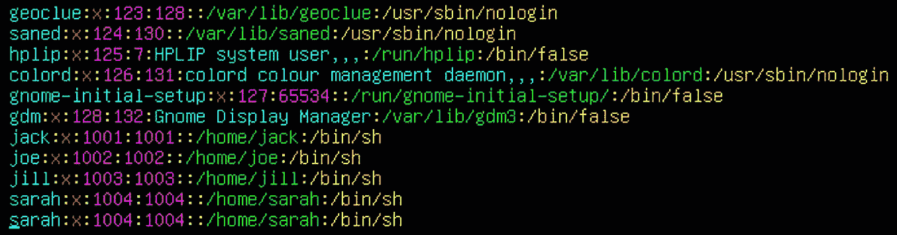

图 2.4 – 一行的 yank 和 paste

现在，让我们选择三行以 `sshd` 开头的行（即 `sshd`、`systemd-coredump` 和 `student` 行），并将它们复制粘贴到以 `joe` 开头的行后面。首先，我们使用光标键将光标定位到 `sshd` 行的开头。然后，我们输入 *y3y* 键序列。这将开始 yank（复制）从光标所在位置开始的三行，将它们复制到复制和粘贴缓冲区中，然后结束 yank。如果我们成功执行了这一步，Vim 会在屏幕底部给我们提示，显示 `3 lines yanked`。

在我们将这些行放入复制和粘贴缓冲区后，我们需要粘贴它们。让我们使用光标键移动到以 `joe` 开头的行，然后按下 *p* 键。结果应该是这样的：

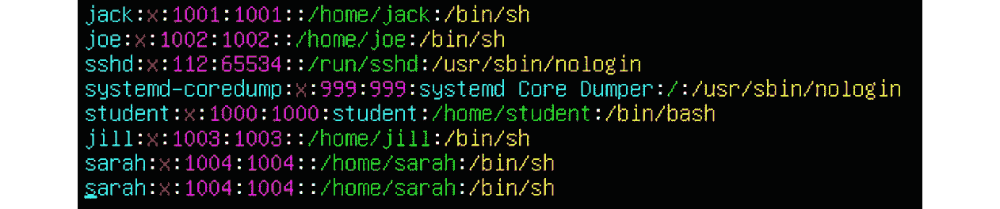

图 2.5 – Yank 和 paste，以及多行文本

现在我们已经玩过了 yank、paste 和 delete，接下来是时候往这个文件中添加一些内容了。为了做到这一点，我们需要进入 **插入模式**。可以通过按下 *i* 键来实现。现在，让我们在光标后添加一些文本——按下 *i* 键并开始输入。我们来添加以下内容：

`something:x:1400:1400::/home/something:/bin/bash`

完成插入后，按下*Esc*键（返回到**普通模式**）。最终的效果应该如下所示：

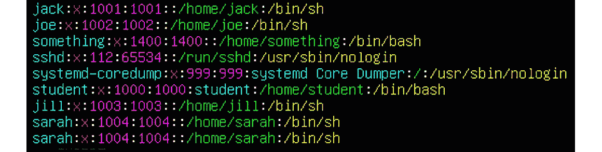

图 2.6 – 使用插入模式插入额外文本

现在我们已经成功完成了这些操作，接下来的步骤是，如果我们对文件内容满意，就保存文件。假设我们满意并准备保存文件。为了保存文件，我们需要进入 **ex 模式** 并告诉 Vim 我们想退出并保存文件。可以使用几个不同的按键组合来完成这个操作，第一个是 *:wq!*（写入并退出 – 不要求确认），第二个是 *:x*。还有其他方法，比如使用 *ZZ* 键组合，但我们先使用更常见的方法（*wq* 和 *x*）。我们需要确保在输入这些按键组合时加上冒号符号（*:*）。正如我们稍后会解释的，使用冒号符号意味着我们想进入 ex 模式并对编辑过的文件进行最终操作。如果我们成功使用这个按键组合，我们应该会回到 shell，文件已经保存并包含我们所做的所有更改。

事实上，Vim 有大量的按键组合可以用于对文本文件执行各种操作。你可以根据自己的看法将 *spectacular* 翻译为好或坏，因为这是主观的——有些人喜欢它，有些人会讨厌它。以下是一些常用的按键组合：

+   *dw* – 删除一个单词

+   *2dw* – 删除两个单词

+   *yw* – 复制一个单词

+   *u* – 撤销上一次更改

+   *U* – 撤销当前行的更改

+   *a* – 在光标后追加文本

+   *A* – 将文本追加到当前行的末尾

+   *Ctrl* + *f* – 向前滚动文件一页

+   *n Ctrl* + *f* – 向前滚动文件 *n* 页

+   *Shift* + *m* – 将光标移动到页面的中间

+   *:50* – 将光标移动到当前文件的第 50 行

+   *$* – 将光标移动到行尾

+   *x* – 删除光标处的字符

+   *X* – 删除光标前的字符

+   *^* – 跳转到行首

+   *o* – 在当前行后插入一行

+   *Ctrl* + *g* – 打印文件信息

还有成百上千个其他命令，我们特意选择了一些我们认为有用且常用的命令。现在，让我们通过使用一个内建的 Vim 教学工具 **Vimtutor** 来做一些更复杂的操作。在命令行中，通过输入以下内容启动 Vimtutor：

```
Vimtutor
```

在此之后，Vimtutor 会询问我们练习的目标输出文件，我们可以直接按下 *Enter* 键。此时，屏幕上应该显示以下内容：

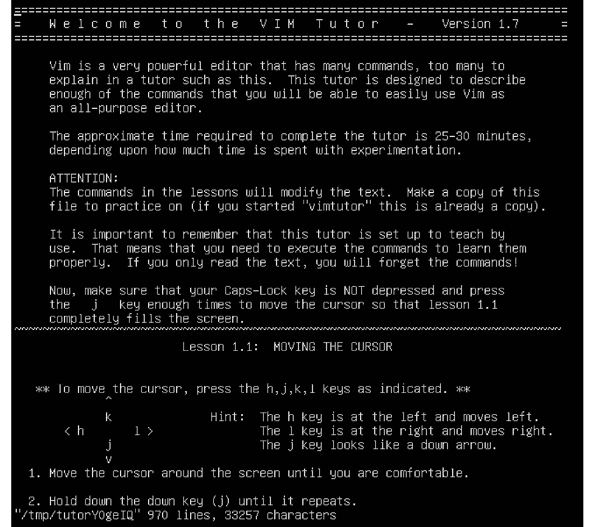

图 2.7 – Vimtutor 启动页

现在，让我们用这个文件进行一些练习。我们要做的第一件事是复制第一段（从 **Vim** 开始，到 **editor.** 结束），然后粘贴到以 **The approximate time** 开头的段落之前。

让我们使用箭头键将光标定位到 Vim 行的开头。做完后，我们需要使用 *y}* 键序列指示 Vim **剪切** 从光标开始的段落。然后，使用光标键移动到第一段和第二段之间的空行，按 *p* 键将剪切的段落粘贴到光标之后。操作结果应该是这样的：

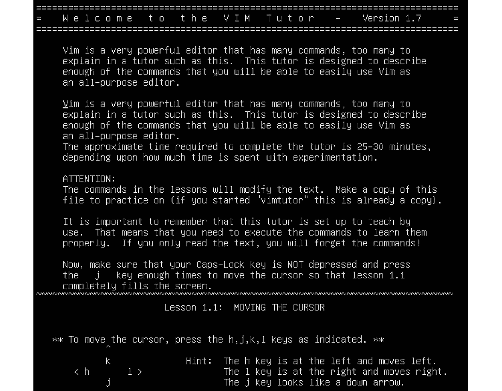

](img/Figure_2.8_B16269.jpg)

图 2.8 – 剪切和粘贴文本段落

假设我们想将整个文件转换为小写字符。当然，这个操作涉及到其他几个步骤：

+   我们需要移动到文件的开头（*gg*）。

+   我们需要开启 **视觉模式**（稍后会详细讲解），可以通过按下 *Shift* + *v* 键组合（大写 *V*）来实现。

+   我们需要标记文本直到文件的末尾，可以通过按下 *Shift* + *g* 键组合（大写 *G*）来实现。

+   我们需要将文本转换为小写，可以通过按 *u* 键来实现。

所以，我们要找的键序列是 *ggVGu*。我们的操作结果应该是这样的：

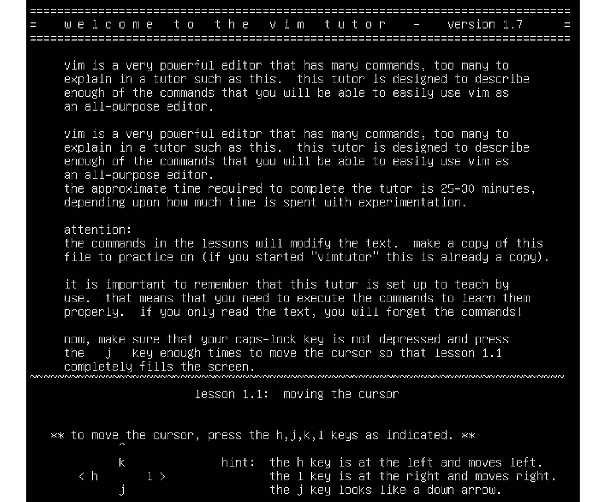

](img/Figure_2.9_B16269.jpg)

图 2.9 – 我们的 Vimtutor 文件，所有字符为小写

如果我们想做相反的操作（将所有字符转换为大写），我们将使用 *ggVGU* 键序列（*U* 表示大写，*u* 表示小写）。

我们将稍微停一下，暂时不讨论这些键序列，来解释一下 Vim 的工作原理——具体来说，我们将专注于常用的几种模式，并简要提及一些不太常用的模式。我们先从 **普通模式** 开始，然后逐步讲解到视觉模式和 **替换模式**。

## 它是如何工作的……

Vim 编辑器有超过 10 种不同的模式，基本上是它工作方式的不同表现。最常用的模式如下：

+   普通模式

+   插入模式

+   Ex 模式

+   视觉模式

+   替换模式

当我们启动 Vim 时，默认处于普通模式；我们可以在其中使用光标进行浏览，也可以进行一些剪切和粘贴操作，还能删除文本。因此，它主要用于诸如在编辑的文件中导航、简单的编辑等常规操作。

如果我们想要在文本文件中添加额外的内容，通常会使用 *i* 键切换到插入模式。在插入模式下，我们可以轻松地在光标后添加文本并在编辑文件中移动。当我们准备好返回正常模式时，可以按 *Esc* 键。如果我们完成文件编辑并只想保存文件并退出，则需要进入正常模式，然后进入 ex 模式。这可以通过按 *Esc* 键，然后输入冒号 (*:*) 来实现。这样我们就进入了 ex 模式，然后可以继续执行 *wq!*、*x* 或 *ZZ*。

可视模式和替换模式有很大不同。可视模式有子模式（**字符**、**行**和**块**），可以用来选择（高亮）我们想要处理和操作的文本部分。例如，行模式和块模式在使用 Ansible 修改 YAML 文件时非常有用。字符模式可以用来高亮代码的一部分。由于 YAML 语法对缩进非常敏感，因此通过使用行模式，我们可以高亮显示剧本中的部分内容并调整其缩进（使用 *>* 和 *<* 键），这样就不必手动进行调整。块模式则可以高效地检查通过行模式创建的缩进。这些模式可以通过使用 *Shift* + *V*（行模式）和 *Ctrl* + *v*（块模式）进入。字符模式可以通过使用 *v* 键进入。

替换模式允许我们在现有内容上输入文本。我们可以使用 *R* 键进入替换模式（从正常模式）。

## 另见

如果你需要更多关于 Vim 基础的信息，我们建议你查看以下内容：

+   Vim：[`www.Vim.org/`](https://www.Vim.org/)

+   *精通 Vim*：[`www.amazon.com/exec/obidos/ASIN/1789341094/stichtingiccfhol`](https://www.amazon.com/exec/obidos/ASIN/1789341094/stichtingiccfhol)

+   交互式 Vim 教程：[`www.openVim.com/`](https://www.openVim.com/)

# 学习 nano 编辑器的基础

如果你觉得 Vim 编辑器对你来说太复杂了，我们能理解你的感受。正因如此，选择你将要使用的编辑器是一个主观的选择。我们想为你提供一个更简单的编辑器，叫做 **nano**。

## 准备工作

保持 CLI1 虚拟机处于开机状态，让我们继续编辑文件。

## 如何操作…

我们将编辑在之前的步骤中复制的 `words` 文件。在此之前，让我们先通过输入以下命令来确认是否已安装 nano：

```
sudo apt-get -y install nano
```

现在让我们通过输入以下命令打开 `root` 目录下的 `words` 文件：

```
nano /root/words
```

我们的文件应已在 nano 编辑器中打开，如下图所示：

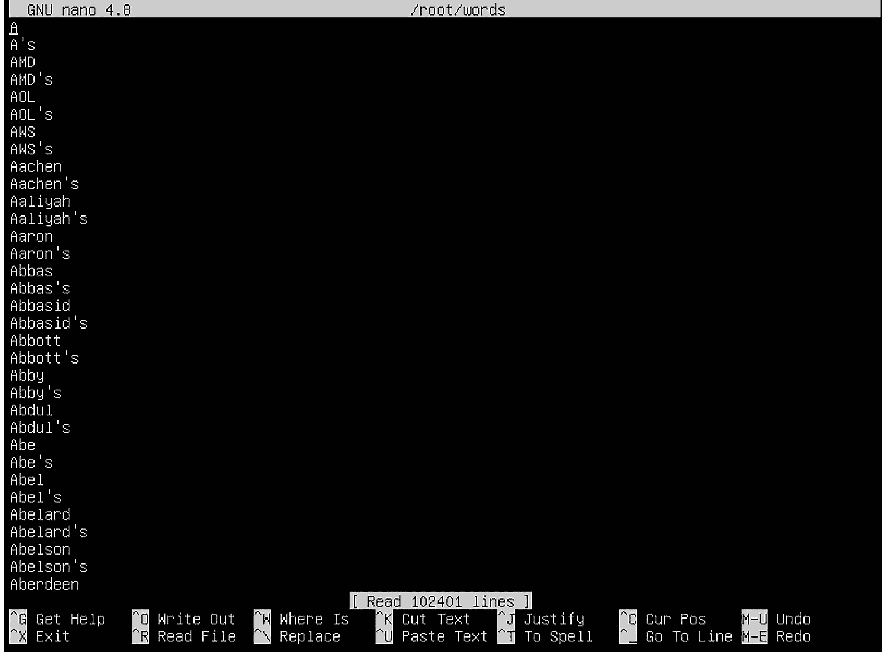

图 2.10 – 使用 nano 编辑器开始编辑

对于那些更习惯使用记事本或 Wordpad 等文本编辑器的人来说，nano 应该是一个更熟悉的领域。它没有 Vim 那样的广泛功能或高级功能，但大多数情况下，这可能并不那么重要，至少对于大多数文本文件编辑操作而言。或者，真的这么简单吗？让我们来检查一下。

在 nano 中的编辑方式与其他*常规*编辑器类似——我们只需要解释截图下半部分（我们可以看到 `Help`、`Exit` 等部分）。在 nano 中，如果我们需要帮助，需要按 *Ctrl* + *g*。这是我们会得到的结果：

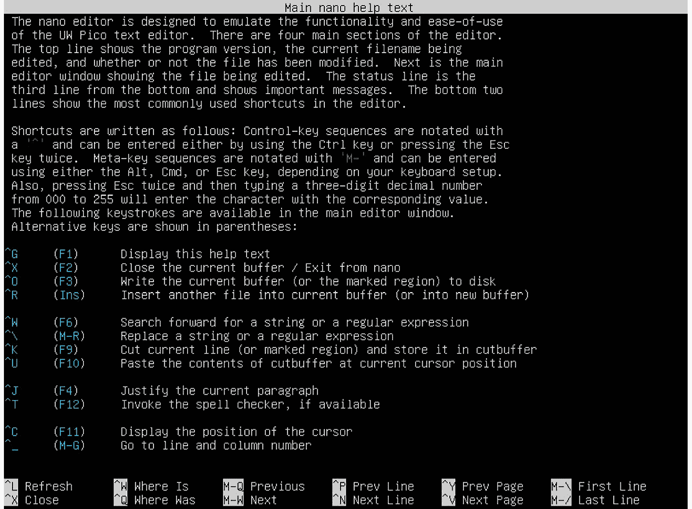

图 2.11 – nano 帮助

如果我们愿意，可以花时间滚动浏览这个帮助窗口。但是，首先我们可以说，这个 `^` 字符表示 *按下 Ctrl 键*。

所以，在我们第一个 nano 截图中，`^G` 表示 *Ctrl* + *G*，`^X` 表示 *Ctrl* + *X*，以此类推。它仍然不像很多人在微软 Windows 上使用的一些文本编辑器那么简单，但比 Vim 更加用户友好。如果没有其他的话，某些常用命令就在我们屏幕的底部，这样我们就不需要记住所有的键盘序列或在使用编辑器之前在网上查找它们。

如果我们想关闭第二个 nano 截图中的帮助窗口，只需要按 *Ctrl* + *X*。这样我们就会回到第一个 nano 截图所示的状态。

如果我们想删除一行，我们需要使用 *Ctrl* + *K*。如果我们需要删除多行，事情就开始变得有些复杂。我们首先需要选择要删除的内容（*Ctrl* + *Shift* + *6*），使用光标移动到我们要删除的地方，然后按 *Ctrl* + *K*。假设我们要删除五行。那么，选择要删除的内容就像这样：

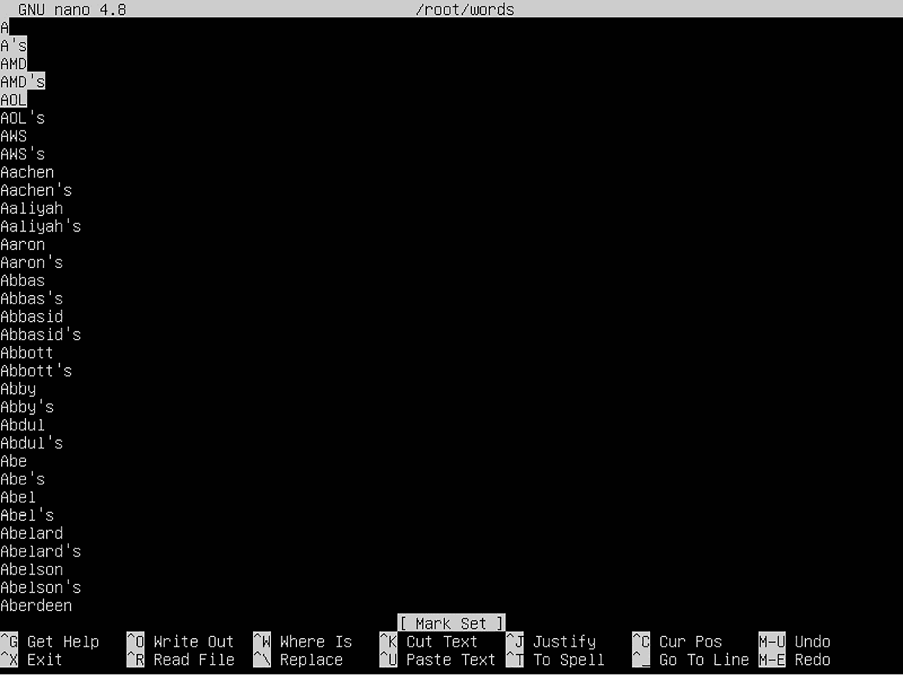

图 2.12 – 按下 Ctrl + Shift + 6，并使用光标键向下滚动五行后，我们准备好按 Ctrl + K 了

在我们选择了正确的文本之后，我们只需要按 *Ctrl* + *K* 来删除它。结果将如下所示：

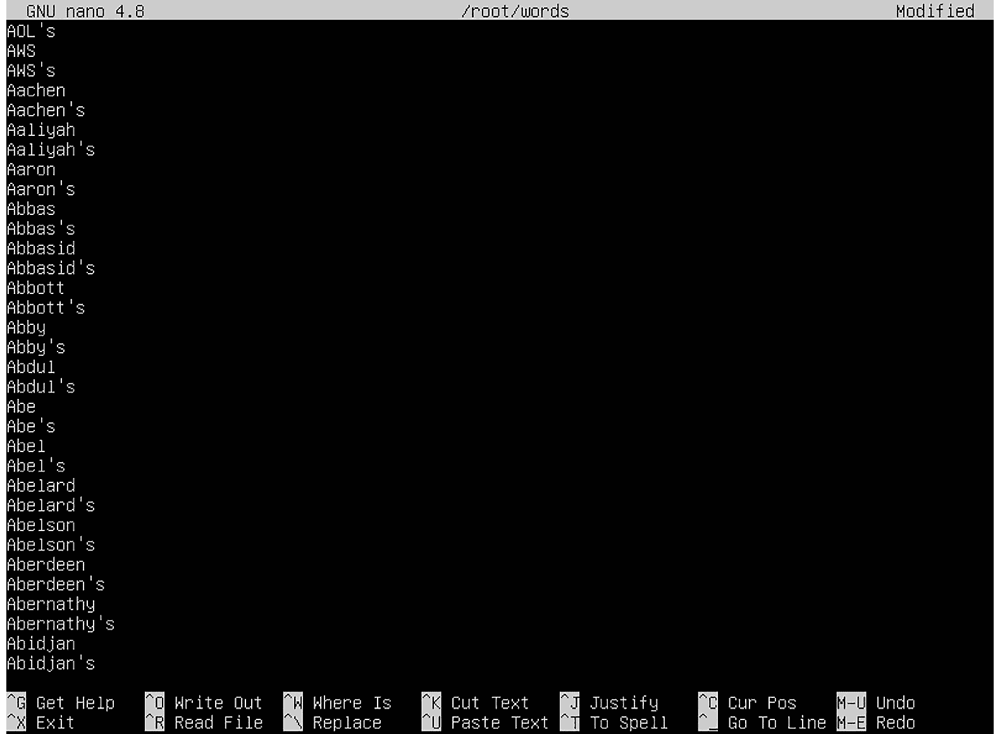

图 2.13 – 五行成功删除 – 结果！

同样的思路适用于对段落进行复制和粘贴操作。我们需要使用 *Ctrl* + *Shift* + *6* 和光标标记文本，*Alt* + *6* 将复制的文本放入复制粘贴缓冲区，然后使用 *Ctrl* + *U* 将其粘贴到 nano 中需要粘贴的地方。保存文件相当于使用 *Ctrl* + *X* 退出，然后确认我们希望将更改保存到文件中。

## 还有更多…

如果你想了解更多关于 nano 的信息，可以查看以下链接：

+   nano 编辑器备忘单：[`www.nano-editor.org/dist/latest/cheatsheet.html`](https://www.nano-editor.org/dist/latest/cheatsheet.html)

+   如何使用 nano：[`linuxize.com/post/how-to-use-nano-text-editor/`](https://linuxize.com/post/how-to-use-nano-text-editor/)

# 通过高级 Vi(m) 设置

在本章的第一部分，我们学习了一些基本的 Vim 操作，包括移动、复制粘贴、保存和退出。接下来，让我们处理一些**高级操作**，比如查找和替换、正则表达式以及类似的概念。

## 准备就绪

我们需要保持 CLI 虚拟机运行。如果它没有开机，我们需要重新开机。

## 如何做到这一点…

在 Vim 中查找内容是一个多步骤的过程，取决于几个因素。首先，它取决于我们想要的*方向*，是*向前*还是*向后*，因为这两种操作有不同的快捷键序列。让我们再次打开`/root/words`文件，查找一些文本：

```
Vim /root/words
```

让我们从查找单词 `fast` 开始。为此，我们需要从正常模式使用`/`字符，因为它告诉 Vim 我们即将使用`搜索`功能。所以，`/fast`将从当前光标位置搜索单词 `fast forward`。这是预期的结果：


图 2.14 – 在 Vim 中查找单词

如果我们现在按下*Enter*键，然后按下*n*键，我们将搜索单词 `fast` 的下一个出现位置。预期的结果是：

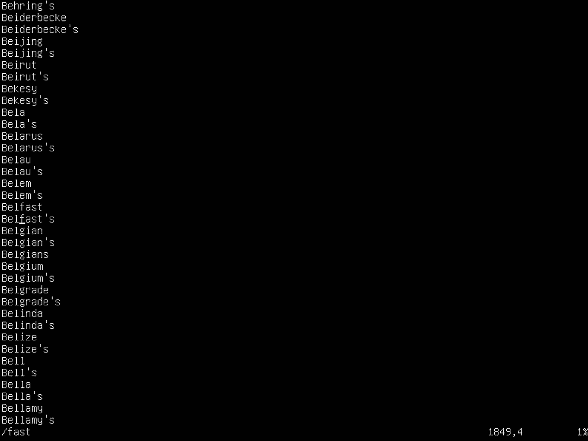

图 2.15 – 查找单词 fast 的下一个出现位置

然而，如果我们想查找单词 `fast` 的第 10 次出现，我们需要按下正确的快捷键序列或使用正则表达式。让我们先从快捷键序列开始，它是（再次从正常模式）`10/fast`。这是预期的结果：


图 2.16 – 查找单词的第 n 次出现

如果我们想查找单词的上一个出现位置（基本上是向后搜索），我们需要按下*N*键（大写 *N*）。这是预期的结果：

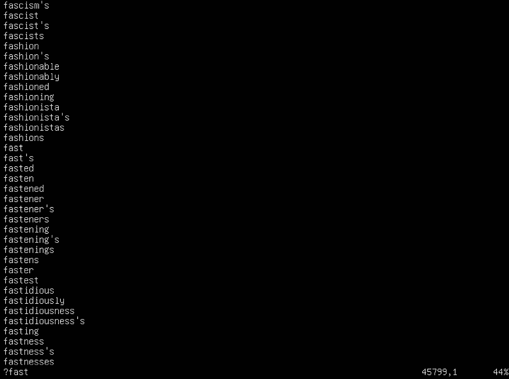

图 2.17 – 从上一个光标位置向后查找单词

现在我们来做一些搜索和替换。假设我们想要查找单词 `airplane` 的所有出现，并将它们替换为 `metro`，从文件的开头开始。为此，使用的快捷键序列是*gg*（返回文件开头），然后是 `:%s/airplane/metro/g`，接着按下*Enter*键。预期的结果是：

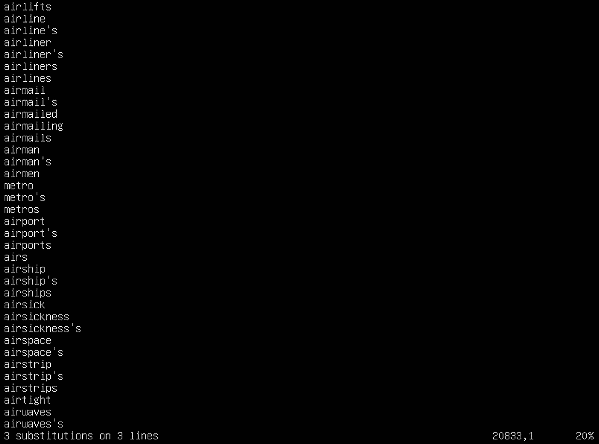

图 2.18 – 用另一个单词替换单词的所有出现

该语法假设自动替换文件中所有出现的单词 `airplane` 为 `metro`。如果我们只想替换某一行中字符串的第一次出现，我们需要先使用 `/word` 键序列找到那个单词。然后，我们需要使用 `:s/word1/word2/` 键序列来仅替换 `word1` 的第一次出现为 `word2`。我们可以用单词 `airship` 做这个示例，并将其替换为 `ship`。如果我们输入 `/airship` 并按*Enter*键，Vim 会将我们定位到下一个 `airship` 的位置。如果接着使用 `:s/airship/ship/` 键序列并按*Enter*键，我们应该得到如下结果：

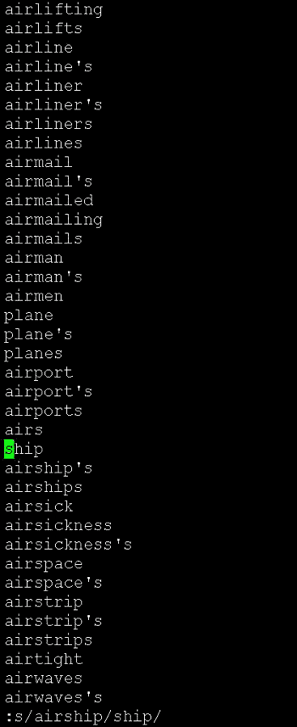

图 2.19 – 在特定行中将单词的一个出现替换为另一个单词

这是一个微妙的区别，但却是一个重要的区别。

我们还可以在 vi 中使用更多的命令——例如，使用点号（`.`）。这可以用来重复在普通模式下进行的最后一次更改，您可能会发现这也非常有用。

我们将在这里暂停，因为我们将在*第七章*，*基于网络的文件同步*中介绍更多高级的文本查找模式，利用正则表达式。

## 它是如何工作的…

`sed`，一个**流编辑器**。这个命令被全球的系统工程师广泛使用，用来快速替换任何给定文件（或多个文件）中的简单或复杂文本模式到另一个复杂的文本模式。它以正则表达式为基础（在*第七章*，*基于网络的文件同步*中有解释），这意味着默认情况下，在 Vim 中进行查找和替换是相当强大的，尽管有点复杂，因为我们需要学习 sed 的细节以及 Vim 如何将其作为*插件*来处理。

话虽如此，我们大多数人关注的是最后一段中的*相当强大的*部分，因为使用 Vim/sed 组合可以快速替换复杂的文本模式，从而得到快速而精确的结果——当然前提是我们知道自己在做什么。

## 还有更多…

使用这些概念需要一些额外的阅读。因此，我们需要确保检查以下附加链接：

+   Vim 提示 Wiki – 查找和替换: [`Vim.fandom.com/wiki/Search_and_replace`](https://Vim.fandom.com/wiki/Search_and_replace)

+   *Vim 提示：查找和替换的基础知识*：[`www.linux.com/training-tutorials/Vim-tips-basics-search-and-replace/`](https://www.linux.com/training-tutorials/Vim-tips-basics-search-and-replace/)
