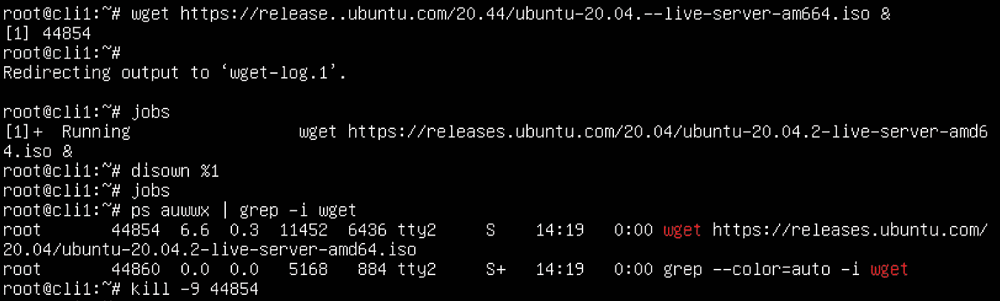

# *第三章*：使用命令和服务进行进程管理

管理进程是 Linux 系统管理员的一项重要工作。原因有很多——也许某些进程卡住了，我们需要结束它们，或者我们希望将某些进程设置为后台运行，甚至是定期或在稍后的日期启动。不管是什么情况，了解如何管理进程并使它们有效地完成需要做的工作，同时考虑到系统上其他进程的运行，都是非常重要的。

在本章中，我们将学习以下内容：

+   进程管理工具

+   管理后台任务

+   管理进程优先级

+   配置 `crond`

# 技术要求

对于这些操作，我们将使用一台 Linux 机器——我们可以使用之前教程中任何虚拟机。再次提醒，我们可以继续使用前一章中使用的`cli1`机器。那么，总结来说，我们需要以下内容：

+   一台安装了 Linux 的虚拟机，任何发行版（在我们的例子中，将使用 Ubuntu 20.10）

所以，启动你的虚拟机，开始吧！

# 进程管理工具

管理进程意味着了解进程的工作方式以及我们可以用来管理它们的特定文本模式工具。我们将从介绍一些简单的概念开始——解释什么是进程以及它们可能处于哪些状态——然后我们将继续讲解命令以及如何从管理的角度使用这些命令来管理进程。这意味着我们将学习 10 个以上的新命令/概念，这些是理解这一切如何运作所必需的。

## 准备工作

在本教程中，我们将使用的大多数命令和工具都预先安装在我们的 Linux 发行版中。话虽如此，还有一些很棒的额外工具，我们可以用来进一步加深对进程管理和系统资源管理的理解。所以，让我们安装另一个工具，它能够作为监控系统资源的工具，并且能够处理低级任务，例如处理进程。它叫做 `glances`；我们可以通过输入以下命令来安装它：

```
apt-get -y install glances
```

这些应该覆盖了我们在本教程中需要的所有内容，现在开始吧！

## 如何操作…

我们必须先讲解的前两个命令是 `ps` 和 `top`。这些命令是 Linux 系统管理员每天都会使用几十次的命令，尤其是在管理 Linux 服务器时。这两个命令都非常有价值，因为如果我们知道如何正确使用它们，我们可以获得大量关于系统的信息，特别是 `ps` 命令。

所以，首先我们使用没有任何附加选项的 `ps` 命令（选项有很多）：


图 3.1 – 默认 ps 命令输出

默认情况下，`ps`会给我们当前正在运行的进程报告。我们可以在没有任何附加选项的情况下启动它，从而获取当前 shell 中正在运行的进程列表。在这个输出中，我们已经可以看到一些有趣的信息。首先，我们可以看到五个进程及其 ID（左侧的`PID`字段）。接着，我们可以看到它们的运行位置，这就是`TTY`字段的含义。`TIME`字段告诉我们进程到目前为止使用了多少累计的 CPU 时间。最右侧是`CMD`字段，显示了启动的实际进程名称。

要充分理解`ps`命令的强大功能，我们需要查看它的手册页面。里面有一个非常好的`EXAMPLES`部分。以下是该部分的摘录：


图 3.2 – 使用 ps 命令的示例

让我们使用这些示例中的一个极端派生。我们来输入以下命令：

```
ps auwwx | less
```

我们使用了`| less`部分来仅输出`ps`命令输出的第一页。输出应该类似于这样：


图 3.3 – ps auwwx 命令输出（更加冗长）

正如我们清楚看到的，这个输出比之前按`PID`排序的输出包含了更多的细节。一些新增的字段包括：

+   `USER`：此字段告诉我们启动进程的用户的名字。

+   `%CPU`：此字段告诉我们进程使用了多少 CPU 时间。

+   `%MEM`：此字段告诉我们进程使用了多少内存。

+   `VSZ`：此字段告诉我们进程使用了多少虚拟内存。

+   `RSS`：常驻集大小，进程使用的非交换内存量。

+   `STAT`：进程状态代码。

+   `START`：进程启动的时间。

作为一个示例，许多系统管理员使用`%CPU`和`%MEM`字段来查找使用过多 CPU 或内存的进程。

假设我们需要通过进程名称来查找一个进程。有多种方法可以实现这一点，其中最常见的两种方法是使用`ps`命令或`pgrep`命令。让我们看看它们是如何工作的：


图 3.4 – 使用 pgrep 或 ps 按名称查找进程

作为一种命令，我们通常使用`grep`来创建一个过滤器，查找文本输出中的特定文本。我们可以看到这两个命令都给出了我们需要的结果——它们只是以不同的格式和不同的详细程度显示结果。我们还可以使用`pidof`命令来查找任何给定进程的 PID，类似于`pgrep`：


图 3.5 – 使用 pidof 命令

现在我们来解释一下`top`命令的概念。在启动`top`命令后，我们应该会看到类似这样的内容：


图 3.6 – 使用 `top` 命令

在这个交互式输出中，多个操作正在同时发生：

1.  `top` 行实际上是来自 `uptime` 命令的输出。如果我们添加接下来的四行（从 `Tasks`、`%Cpu(s)`、`Mib Mem` 和 `MiB Swap` 开始），这就是我们所说的顶部 *摘要区域*。

1.  之后，我们可以清楚地看到，`top` 作为 `ps` 命令的前端，但以交互方式实现。

`top` 命令的交互式部分源于它定期刷新——默认情况下是每 3 秒刷新一次。我们可以通过按 *S* 键来更改默认刷新间隔，这时 `top` 会提示我们将延迟从 `3.0` 更改为任何数字。如果我们想将刷新间隔更改为 `1` 秒，只需按下 `1` 并按 *Enter*。

我们可以让 `top` 显示某个特定用户的进程（按 *U* 键并输入该用户的登录名），并终止进程（按 *K* 键并输入 PID 和要发送的信号）。我们还可以调整进程优先级，这将在本章的 *第三个* 配方中讲解。总的来说，`top` 是一个非常有用且常用的进程管理命令。它作为许多不同命令的前端，例如 `nice`、`renice` 和 `kill`。

接下来我们需要学习的命令是 `kill` 和 `killall`。我们不应该通过字面翻译来试图直观理解这些工具的作用，因为我们会发现这种翻译并不适用。具体来说，`kill` 命令是用于通过进程对应的 PID 来终止一个进程。相比之下，`killall` 用于通过进程名称来终止进程。当然，这两者都有各自的有效使用场景。为了展示这两个命令的例子，我们将使用以下的 `top` 输出：


图 3.7 – 顶部输出 – 注意到学生用户启动了两次 `top` 命令

让我们在另一个 shell 中终止这两个 `top` 进程。如果我们想通过 `kill` 命令终止第一个进程，我们需要输入以下内容：

```
kill 41246
```

如果我们想通过进程名称终止所有已启动的 `top` 命令，可以输入以下内容：

```
killall top
```

当使用 `kill` 命令时，我们是在终止一个特定的 PID。当使用 `killall` 命令时，我们是在终止所有启动的 `top` 进程。当然，为了能够使用这两个命令中的任意一个来终止进程，我们必须以 root 用户或 `student` 用户身份登录。只有启动了进程的用户和 root 用户才能终止用户进程。我们需要记住，这两个命令的默认信号是 `SIGTERM` 信号（信号编号 `15`）。如果我们想通过自定义信号来终止进程，可以通过在这两个命令中添加信号编号，并在前面加上减号来实现。下面是一个例子：

```
kill -9 41246
```

这将向进程发送 `SIGKILL` 信号。这两个信号在本食谱的 *它是如何工作的…* 部分有解释。

另外需要注意的是，有时我们需要找到当前正在运行的 shell 的 PID 或父进程 PID。我们可以通过以下两个命令来实现：


图 3.8 – 当前 shell 进程的 PID，父进程的 PID

现在让我们检查一下 `glances` 如何帮助我们查看系统中发生了什么。如果我们只启动命令，系统会输出以下内容：


图 3.9 – glances 默认输出

很容易看到 `glances` 使用的详细信息级别，以及不同的格式。此外，我们也很欣赏它默认使用颜色输出，这使得信息稍微容易阅读。我们可以使用不同的方法来显示数据。例如，我们可以输入 `1` 来在每个 CPU 核心的统计数据与汇总统计数据之间切换。我们还可以以服务器模式使用它（通过添加 `-s` 参数启动），这样就可以监控远程主机。因此，从服务器的角度来看，我们会用以下命令启动：

```
glances -s
```

从客户端的角度，我们将使用以下命令启动 `glances`：

```
glances -c @servermachine
```

`glances` 是跨平台的（它基于 Python），支持 Linux、OS X、Windows 和 FreeBSD。它还内置了一个 Web UI，可以通过 Web 浏览器使用，如果我们更喜欢使用图形界面而不是命令行界面。但它最方便的功能之一是能够以各种不同的格式导出数据——CSV、Elasticsearch、RabbitMQ、Cassandra 等等。

## 它是如何工作的…

进程是操作系统初始化的命令执行单元，操作系统和系统管理员都可以管理它。这意味着进程就像是任何给定程序的一个实例，并且它具有一些共同的属性（状态、PID 等，以及我们将在本章中描述的许多其他属性），同时也需要执行一些任务。例如，在我们启动一个命令（`进程`）之后，命令可以打开并读取文件、用户输入或其他程序的数据，处理这些输入，然后在工作完成后终止。

需要注意的是，如果我们重启计算机，进程不会被*暂停*——它们会被停止，然后在 Linux 机器启动时重新启动，或者我们在重启后手动启动它们。因此，*重启后进程不会保持持续性*。大多数情况下（除去操作系统启动过程中涉及的进程），它们甚至不会在重启后保持相同的 PID。

在进程类型方面，我们有五种不同的类型：

+   **父进程与子进程**：简单来说，父进程是创建其他进程的进程，这些被创建的进程我们称为子进程。子进程会在父进程退出时退出，而父进程在子进程退出时并不会退出。

+   **僵尸进程与孤儿进程**：有时父进程在子进程退出之前被杀死，剩余的子进程称为孤儿进程。另一方面，僵尸进程指的是一个已经被终止，但仍然存在于进程表中的进程。

+   **守护进程**：守护进程通常与一些系统任务相关，这些任务通常涉及与其他进程的交互并为其提供服务。守护进程也不会使用终端，因为它们在后台运行。

从状态的角度来看，我们有以下几种：

+   **运行/可运行**：运行状态是指进程正在被 CPU 执行的状态。而可运行状态则意味着进程已经准备好被执行，但当前并未消耗 CPU，或者正在等待 CPU 执行。

+   **可中断/不可中断睡眠**：在可中断睡眠状态下，进程可以被唤醒，并且可以接受针对它的**信号**。在不可中断睡眠状态下，进程不会被唤醒，且会保持睡眠状态。这个情况通常涉及到一个**系统调用**——进程在完成任务之前无法执行系统调用，也不能被暂停或终止。

+   **停止**：当进程收到信号或者我们正在调试一个进程时，进程通常会被停止。

+   **僵尸进程**：一个已经终止但仍然存在于进程表中的进程处于僵尸状态。

从操作系统的角度来看，进程是程序或服务的执行单元。进程由操作系统调度，这意味着为它们分配资源，使它们能够从程序的角度（上下文）运行，并且分配一些基本的属性，便于从系统管理的角度进行管理。这包括在进程表中创建一个条目，并分配 PID（进程号）以及其他属性数据。我们将在本章稍后的部分解释这些属性，并讨论如何通过使用像 `top` 和 `ps` 这样的命令来观察进程的状态。

我们提到了信号的概念。在讨论内核与用户空间程序之间建立通信的不同方式时，通常有两种方式——通过系统调用或信号。通常，如果我们想要通过命令发送一个信号给进程，可以使用 `kill` 或 `killall` 命令，并通过信号号或名称来指定信号。让我们来看一下信号列表的一个摘录：


图 3.10 – 来自 signal 手册页的摘录

正如我们所见，信号有很多，约有 30 个信号已经由 Linux 内核实现。此外，从进程的角度来看，信号有两种类型：

+   `SIGHUP` 信号（编号 1）

+   `SIGKILL` 信号（编号 9）

这里使用的“*handled*”一词是以编程意义上的方式出现的——处理某个信号意味着使用某种*处理程序*编写代码，该代码将拦截信号消息并将其重定向到某个地方，例如函数或子程序。

这两种类型之间有很大的区别。我们以守护进程为例，例如 *Apache 网络服务器*。如果守护进程接收到 `SIGHUP` 信号并且支持该信号（即它的源代码中有处理 `SIGHUP` 信号的例程，像 Apache 一样），它在接收到 `SIGHUP` 后最常做的事情就是通过重新读取配置来刷新其状态。引用 Apache 手册：

*向父进程发送 HUP 或重启信号会导致它像 TERM 信号一样杀死其子进程，但父进程本身不会退出。它会重新读取配置文件，并重新打开日志文件。然后，它会生成一组新的子进程，并继续提供服务*。

与此场景不同，当你向 Apache 发送 `SIGKILL` 信号时，它会被终止，而不会考虑刷新其配置、内容或类似操作。我们无法为此信号编写处理程序，将其重定向到除被终止进程之外的任何地方。我们可以把它理解为一种*内核吸取进程生命*的情境，因为进程无法访问运行所需的资源，并且被系统（内核）有效地消除。

第三种常用信号是 `SIGTERM`（编号 15）。它也用于终止进程（如 `SIGKILL`），但它的方式是优雅的。我们可以把它理解为来自内核的*你好，进程先生，请优雅地终止自己，好吗？非常感谢！*的消息。然后进程会做它需要做的事情并自己关闭。

现在我们简要了解了进程和信号的工作原理，让我们继续探索有关进程管理的知识，学习后台进程的管理。既然我们已经解释了后台进程的基础，应该不会是难事。

## 另见：

如果你需要更多关于进程、信号以及类似概念的信息，确保查看以下内容：

+   **Linux 进程基础**：[`www.science.unitn.it/~fiorella/guidelinux/tlk/node45.html`](http://www.science.unitn.it/~fiorella/guidelinux/tlk/node45.html%0D)

+   **Linux 命令基础**——七个进程管理命令：[`www.redhat.com/sysadmin/linux-command-basics-7-commands-process-management`](https://www.redhat.com/sysadmin/linux-command-basics-7-commands-process-management%0D)

+   **信号手册页**：[`man7.org/linux/man-pages/man7/signal.7.html`](https://man7.org/linux/man-pages/man7/signal.7.html%0D)

+   **Glances 基础**：[`www.tecmint.com/glances-an-advanced-real-time-system-monitoring-tool-for-linux/`](https://www.tecmint.com/glances-an-advanced-real-time-system-monitoring-tool-for-linux/%0D)

+   **TLDP 第四章：进程**：[`tldp.org/LDP/tlk/kernel/processes.html`](https://tldp.org/LDP/tlk/kernel/processes.html%0D)

# 管理后台任务

有多种情况我们希望启动一个进程并将其放到后台运行。例如，假设我们希望启动一个进程，退出登录，然后等到第二天再检查该进程的结果。让我们通过一个例子来学习它是如何工作的。

## 准备就绪

保持`cli1`虚拟机开机，让我们使用 shell 来解释后台进程是如何工作的，与前台进程的不同之处。我们还会确保在*它是如何工作的…*这一部分中进行解释。

## 如何做到这一点……

假设我们想通过使用 shell 工具下载一个大文件。在 Linux 中，*常见工具*是一个叫做`wget`的程序。我们想要启动一个`wget`会话（`wget`是一个`shell`命令，可以让我们从`http`和`ftp`的 URI 下载文件）来下载一个大 ISO 文件，但我们希望在下载进行的同时退出（或做其他事情）。这可以通过将`wget`进程放到后台来实现。这只是利用后台进程的一种常见例子。

首先，我们需要安装`wget`。我们可以通过以下命令来安装：

```
apt-get -y install wget
```

`wget`是一个常用的工具，通常默认安装。无论如何，通过使用这个命令，我们可以确保它已安装。

让我们使用`Ubuntu 20.04 ISO`文件作为我们想要下载的文件，使用两个例子来展示。第一个例子是将`wget`作为*前台*进程运行，第二个例子是将`wget`作为*后台*进程运行。第二个例子实际上可以通过两种不同的方式完成，因为`wget`有一个内置选项可以将其放到后台。当然，既然我们要解释的是*系统级*的概念，而非某个特定工具，那么我们一定会确保两种方式都进行讲解。

在撰写时，`Ubuntu 20.04 ISO` 文件可以在这里找到：

[`releases.ubuntu.com/20.04/ubuntu-20.04.3-live-server-amd64.iso`](https://releases.ubuntu.com/20.04/ubuntu-20.04.3-live-server-amd64.iso%0D)

让我们通过输入以下命令，使用`wget`以前台进程的方式下载文件：

```
wget https://releases.ubuntu.com/20.04/ubuntu-20.04.3-live-server-amd64.iso
```

结果应该类似于这样：


](img/Figure_3.11_B16269.jpg)

图 3.11 – 前台进程 – 独占锁定 shell 访问

正如我们清楚看到的，下载正在进行，但问题是，在接下来的 12 分钟以上，我们无法在这个 shell 中做任何事，因为底层的 shell 会话完全被 `wget` 占用。我们无法输入命令，也无法获取命令结果——什么都做不了。唯一能做的事是使用 *Ctrl* + *C* 组合键退出下载并返回到 shell。但这不是我们想做的。我们想做的是：

1.  启动下载。

1.  被抛回到 shell 中，并且下载仍在进行。

这是一个运行后台任务非常有帮助的情况。那么，让我们在之前的命令中添加一个额外的参数：

```
wget https://releases.ubuntu.com/20.04/ubuntu-20.04.2-live-server-amd64.iso&
```

这条命令末尾的 `&` 符号告诉内核将该进程放入后台。让我们看看最终结果：


图 3.12 – 在后台启动进程

我们可以清楚地看到，我们已经被抛回到 shell（`root@cli1` 提示符），并且我们可以继续输入其他命令。我们还可以看到一个 `wget` 进程已启动，PID 为 `43787`，如果我们愿意，可以使用 `kill` 命令终止它。

显然，我们可以在命令末尾使用 `&` 来发出多个命令，然后我们就会有多个进程在后台运行。这时，之前输出中的 `[1]` 部分就派上用场了。这个数字表示分配给后台进程的索引号。换句话说，我们开始的 `wget` 进程，PID 为 `43787`，是第一个后台进程。如果我们启动多个后台进程，每个新的后台进程将会得到下一个数字——`2`、`3`，依此类推。

显然，我们需要学习如何管理多个后台任务。这正是 `jobs` 命令的作用。让我们看看它是如何工作的。首先，我们将启动多个后台任务：


图 3.13 – 启动多个后台进程

然后，使用 `jobs` 和 `kill` 命令来查找我们有哪些后台任务，并通过索引（而不是通过 PID）来终止它们。操作方法如下：


图 3.14 – 检查并终止多个后台进程

通过使用`kill %index_number`语法，我们能够通过索引号终止后台作业，而不是通过它们的 PID。这个语法更简洁，在日常生活中不应忽视，因为它让许多事情变得更简单——只要我们不登出。如果我们登出，情况就有所变化，因为我们无法通过索引号访问这些进程，但我们仍然可以通过 PID 来管理它们。所以，假设我们启动了两个`wget`会话作为后台进程，然后登出并重新登录。让我们试着将这些进程列为后台进程，然后作为普通的、一般的进程，并通过 PID 终止它们。这是接下来发生的事情：


图 3.15 – jobs 没有输出，但 ps 命令有输出

我们清楚地看到，`jobs`命令没有任何输出（找不到后台作业的索引号），但我们的进程仍然在运行。为什么？好吧，我们启动的后台进程是在一个已经不再活跃的 shell 中创建的。在我们登出后，我们启动了一个新的 shell，并且由于`jobs`命令的工作方式，我们无法再看到这些后台作业了。但我们绝对可以将它们视为在系统上运行的进程，并且，如果需要，我们可以通过 PID 成功终止它们，正如我们使用`kill`命令所做的那样。我们在这里使用了`ps`命令，并通过使用`grep`过滤了它的输出——`grep`是一个可以从基于文本的输出中搜索特定文本的命令（在我们的案例中，我们通过使用`ps auwwx`命令搜索整个进程表，创建了一个管道并使用管道符号（`|`），然后将`ps`命令的输出传递给`grep`命令）。

我们提到过，`wget`命令有能力通过使用命令行选项（`-b`）在后台启动自身。这并不常见，但绝对有用。所以，假设我们使用以下命令：

```
wget -b https://releases.ubuntu.com/20.04/ubuntu-20.04.2-live-server-amd64.iso
```

这应该是最终结果：


图 3.16 – 可以通过使用`-b`开关在后台启动 wget

这个过程真正有趣的地方在于：

+   `wget`清楚地表明它会在后台启动，但它没有给我们一个索引编号。

+   如果我们使用`jobs`命令，我们无法看到它作为后台进程的状态。

+   我们可以通过常规方式使用`kill`命令来终止它。

这是一个稍微不同的概念，因为`wget`通过创建一个`wget`子进程并终止父进程，实际上实现了这种`jobs` *命令隐形*的效果。由于父进程不再存在，它不再与特定的 Shell 关联，因此不再被索引。结果是它在当前 Shell 的作业表中不可见。我们可以通过使用`disown`命令实现类似的效果。让我们在当前 Shell 中启动一个进程，然后做`wget`基本上做的事情：



图 3.17 – 解除后台进程的关联

还有其他方法可以确保进程进入后台。最常见的情况是我们希望将进程放入后台，但忘记在命令末尾加上`&`符号，结果进程被困在前台。那么该怎么办呢？

答案很简单 – 我们按下*Ctrl* + *Z*（将进程置于挂起状态），然后输入`bg`命令。这样会将进程放入后台，就像我们一开始用`&`符号启动它一样。将这些与`jobs`、`disown`和`kill`结合起来，会是这样的：


图 3.18 – 使用 Ctrl + Z 和 bg 将进程放入后台

我们在前台启动了`wget`，然后通过按*Ctrl* + *Z*将其置于挂起状态。接着，我们使用`bg`命令将该进程移至后台。由于它在我们的 Shell 中是作业号`1`，我们解除它的关联，使用`ps`查找其 PID，并将其终止。

如果由于某种原因，我们想要将一个进程从后台恢复到前台（前提是该进程有索引号并且是在当前 Shell 中启动的），我们可以使用`fg`命令来实现。因此，如果我们使用之前的操作步骤作为示例，它将是这样的：


图 3.19 – 使用 Ctrl + Z、bg 和 fg 将一个进程从后台移动到前台再返回后台

我们可以清楚地看到，`wget`进程先是进入了后台（*Ctrl* + *Z* 和 `bg` 命令），然后又回到了前台（`fg` 命令），最后通过使用*Ctrl* + *C*将其终止。如果我们当前的 Shell 中有多个后台进程，我们还可以使用索引来操作前台命令（`fg 索引号`）。

## 它是如何工作的……

进程可以以两种不同的方式运行：

+   **前台**：如果我们从 shell 启动一个进程，该进程将占用当前的 shell，并且不允许我们输入其他命令。对此规则的一个例外情况是，启动的进程需要额外的用户输入，但这些输入需要嵌入到我们正在执行的进程核心中（程序代码的一部分）。在这种情况下，shell 完全被启动的进程占用，直到进程完成、我们将其置于后台，或者它被其他外部因素（如其他进程或内核，或因某种原因崩溃）终止。

+   **后台**：如果我们在后台启动一个进程，它会运行并释放我们的 shell，这样我们可以继续用它输入其他命令。

当一个进程在当前 shell 中转入后台时，它会获得一个索引号，这样我们就可以通过该索引号来管理它。我们可以使用 `fg`、`kill` 等命令来操作这个索引号（例如，`kill %1` 会终止作业索引表中的第一个作业）。

正如我们在实际演示中看到的，有多种方法可以确保进程在后台启动——无论是启动时还是启动后。这一概念之所以成立，是因为我们可以轻松地将进程放入后台，由操作系统处理，当我们不在时，这有时意味着节省我们的宝贵时间。

## 还有更多内容……

如果我们需要了解更多关于前台和后台进程的内容，可以查看以下链接：

+   `jobs`、`bg` 和 `fg`：[`www.redhat.com/sysadmin/jobs-bg-fg`](https://www.redhat.com/sysadmin/jobs-bg-fg%0D)

+   **Linux 命令基础** – 管理进程的七个命令：[`www.redhat.com/sysadmin/linux-command-basics-7-commands-process-management`](https://www.redhat.com/sysadmin/linux-command-basics-7-commands-process-management)

# 管理进程优先级

当我们解释如何使用 `top` 命令时，我们有意省略了一些细节，留待在本章稍后讨论。我们将在这里讨论其中一个细节：`top` 输出中 `PR` 和 `NI` 字段的区别。现在我们来讨论这个。

## 准备工作

保持 `cli1` 虚拟机开启，让我们继续使用我们的 shell。

## 如何操作……

我们将学习如何使用 `top`、`nice` 和 `renice` 命令，根据我们的需求来管理进程调度。首先，我们来使用 `top` 命令。我们将 `renice` 一个正在运行的进程，使其优先级变为更负的值和更正的值。我们将使用以下 `top` 输出进行演示：

![图 3.20 – 起点 – 学生用户启动的进程]

](img/Figure_3.20_B16269.jpg)

图 3.20 – 起点 – 学生用户启动的进程

现在让我们改变 PID 为 `47160`（`top`）的进程的优先级。按下 *R* 键，`top` 输出将会变化为如下所示：


图 3.21 – 让我们重新调整一个 PID 的优先级

然后，再次输入数字 `47160`，按 *Enter* 键，并输入 nice 值——假设为 `-10`。我们应该会看到类似如下的结果：


图 3.22 – 结果 – 更负的 nice 值，更高的优先级

我们可以清楚地看到，我们的 PID 的 `NI` 字段从 `0` 改变为 `-10`。由于我们赋予了更负的 nice 值，这意味着更高的优先级。

这个示例解释了如何 `renice` 一个已经在运行的进程。但显然，我们不能用它在启动进程之前设置 nice 值。这就是为什么我们有 `nice` 命令的原因。下面是使用 `nice` 命令的一个示例：

```
nice -n -10 top
```

如果我们以 root 用户身份启动该命令并查看输出，给它一点时间后，我们应该会看到类似这样的内容：


图 3.23 – 使用 nice 在进程启动时预设优先级

显然，这里有一个警告——如果我们尝试以普通用户身份启动这个命令，是无法成功的。普通用户没有使用 `nice` 命令的权限——想象一下，如果普通用户拥有这个权限，他们可能会有多少种滥用系统或崩溃系统的方式。若我们希望授予某些用户使用 `nice` 命令的权限，可以通过 PAM 模块或 `sudo` 系统来实现。但目前为止，我们可以一致认为这只是一个例外，不需要像 *urbi et orbi* 那样普遍适用。

现在让我们解释一下这些概念是如何工作的。

## 它是如何工作的……

我们先执行 `top` 命令并查看其输出中的重要部分：


图 3.24 – top 输出与进程优先级相关

简要解释一下这两个领域的区别：

+   `PR`（优先级字段）：当前查看时的实际内核调度优先级，由内核分配。`rt` 标记表示实时；其值范围在 `0` 到 `139` 之间，尽管对于实时进程，它可以有负的静态值。

+   `NI`（nice 值字段）：进程应该具有的优先级，默认情况下由用户空间（而非内核空间）分配，或者通过额外的命令（`nice` 和 `renice`）进行调整。数字越低，优先级越高，范围从 `-20` 到 `+19`。

显然，这两个数字之间有很大的差异，因为其中一个是*真实的*（`PR`），另一个则像是*建议*（`NI`）。理论上解释进程优先级相对容易，但由于一些架构原因，将其应用到实际中会变得更具挑战性。因此，我们将尝试用一个曾经可以实现但现在不再适用的例子来解释这一点，因为现代 CPU 和内存的速度已经远远超过了 10 年前的水平。所以，先讨论理论概念，然后再用一个例子来说明。

从理论上讲，当我们使用`nice`和`renice`命令时，我们所做的是为进程分配一定的 CPU 上下文——一个正在运行的进程（`renice`）或一个即将运行的进程（`nice`）。我们在这里使用“上下文”一词，是从 CPU 的角度在编程中使用的。翻译过来——如果我们想运行一个进程，内核需要为它分配一些 CPU 资源。如果我们有一个正在运行的进程，并且将其`renice`为一个更负的值，这将告诉内核及其调度器更多地关注这个特定的进程，从而给它更多的 CPU 访问权限。如果我们将其`renice`为一个更正的值，这将告诉内核减少分配 CPU 资源给该进程。通过给进程分配更多的 CPU，进程可能会变得更快并更快地完成工作。

显然，这有点过于简化，因为这里涉及到其他因素。例如，每个进程都需要一些内存来运行，而内存越是被其他进程占用，进程访问内存内容的速度就越慢，从而降低了内存带宽并增加了内存访问的延迟。因此，给进程分配一个更负的优先级值并不总是能直接提高进程的性能。此外，如果进程当前处于空闲状态，什么也不做，且不需要更多的 CPU 呢？这里可能还有很多其他因素——**非统一内存访问**（**NUMA**）操作系统/应用程序兼容性、多线程/核心的有效使用、锁机制等。因此，这更多的是一种通用的学术讨论，可能会有各种原因导致的例外，系统状态是其中最常见的原因之一。

现在我们已经处理了理论背景，来看看一个以前很容易展示的例子，因为很多人过去都有类似的经历，当时的 CPU 和内存远远不如今天这么强大。

10 年前，如果我们使用当时的一台普通电脑观看来自 YouTube 的高分辨率 Flash 视频，就会遇到一个问题。CPU 的性能大致够用，但勉强够。所以，为了能通过 Linux 使用网页浏览器（例如 Firefox）观看这些视频，我们不得不对系统进行调优。于是我们打开了网页浏览器，找到了想看的视频，点击了 *播放* 按钮，视频会播放几秒钟，然后卡顿。接着，它又会播放一段时间，再次卡顿。这是一个令人沮丧的体验。那时候，我们还没有 Flash 的 GPU 加速功能，所以 CPU 是唯一能在这种情况下提供帮助的设备。

但如果我们知道如何设置进程优先级，在大多数情况下，我们可以通过这种方式解决问题，这取决于 CPU 的速度。我们可以进入命令行，找到 Firefox 进程的 PID，并将其 `renice` 为一个更负的值。突然间，内核会指示其调度器更加关注 Firefox 这个进程，结果就会发生——视频不再卡顿。为什么？因为通过我们使用 `renice` 命令，内核意识到我们希望赋予这个进程更高的优先级，因此命令 CPU 调度器去执行这一操作。

调优 CPU 性能还有许多其他方面。随着 Linux 内核在处理 CPU 调度时变得越来越程序化，现代 Linux 发行版提供了很多相关选项。因此，各个 Linux 发行版引入了像 **tuned** 这样的概念，这是一个基于预设或手动创建的配置文件来调节系统性能的系统，另外还有 **tuna**，这是一款能够进行深度应用特定调优的工具。我们始终需要具备深入调优的能力，以便让系统能够针对特定的使用场景获得最佳性能。

## 还有更多…

如果我们需要了解更多关于这些概念的信息，可以查看以下链接：

+   **Linux top 命令指南**: [`www.booleanworld.com/guide-linux-top-command/`](https://www.booleanworld.com/guide-linux-top-command/)

+   **CPU 调度**: [`access.redhat.com/documentation/en-us/red_hat_enterprise_linux/6/html/performance_tuning_guide/s-cpu-scheduler`](https://access.redhat.com/documentation/en-us/red_hat_enterprise_linux/6/html/performance_tuning_guide/s-cpu-scheduler)

+   **top 手册页**: [`man7.org/linux/man-pages/man1/top.1.html`](https://man7.org/linux/man-pages/man1/top.1.html)

+   **nice 手册页**: [`man7.org/linux/man-pages/man1/nice.1.html`](https://man7.org/linux/man-pages/man1/nice.1.html)

+   **renice 手册页**: [`man7.org/linux/man-pages/man1/renice.1.html`](https://man7.org/linux/man-pages/man1/renice.1.html)

+   **开始使用 tuned**：[`access.redhat.com/documentation/en-us/red_hat_enterprise_linux/8/html/monitoring_and_managing_system_status_and_performance/getting-started-with-tuned_monitoring-and-managing-system-status-and-performance`](https://access.redhat.com/documentation/en-us/red_hat_enterprise_linux/8/html/monitoring_and_managing_system_status_and_performance/getting-started-with-tuned_monitoring-and-managing-system-status-and-performance)

+   **使用 tuna 界面审查系统**：[`access.redhat.com/documentation/en-us/red_hat_enterprise_linux/8/html/monitoring_and_managing_system_status_and_performance/reviewing-a-system-using-tuna-interface_monitoring-and-managing-system-status-and-performance`](https://access.redhat.com/documentation/en-us/red_hat_enterprise_linux/8/html/monitoring_and_managing_system_status_and_performance/reviewing-a-system-using-tuna-interface_monitoring-and-managing-system-status-and-performance)

# 配置 crond

拥有按计划运行任务的能力对于日常系统管理非常重要。我们安排备份、执行清理操作、发送报告、做杀毒检查以及其他业务流程需要的任务。通过调度这些任务，我们实现了一定程度的自动化，摆脱了手动操作，这样我们就可以有更多时间专注于更重要的任务。一般来说，我们使用命令或脚本来执行这些计划任务，而要执行它们，我们使用 `cron daemon`（`crond`）。让我们学习如何使用 `crond` 根据我们的需求调度任务。

## 准备开始

保持 `cli1` 虚拟机开机，让我们通过 `crond` 创建一些计划任务。

## 如何操作…

让我们从使用 root 创建一个 cron 任务开始。我们将通过以 root 身份输入以下命令来实现：

```
crontab -e
```

在 Ubuntu 中，我们将被要求选择想要使用的编辑器。为了保持一致性，假设我们选择了 vi 编辑器（`vi.basic`）。让我们在我们正在编辑的 vi 文件末尾添加以下内容：

```
* * * * * ls -al /root > /tmp/root.txt
```

如果我们按原样保存文件，我们就创建了第一个根 cron 任务——它将在每分钟执行一次。`*` 符号实际上是这些 crontab 文件中的 *频率字段*。请看下面的例子：

```
man 5 crontab
```

现在稍微向下滚动一下 man 页面，我们将找到以下示例：


](img/Figure_3.25_B16269.jpg)

图 3.25 – man 5 crontab 页面摘录

第一部分解释了这些字段，因为总共有六个。前五个字段与执行频率有关。我们可以使用空格或 *Tab* 作为这些字段之间的分隔符。

前五个字段如下：

+   `minute` 字段：任务应在哪一分钟执行

+   `hour` 字段：任务应在哪一小时执行

+   `day of month` 字段：任务应在每月的哪一天执行

+   `month` 字段：任务应在哪个月执行

+   `day of week` 字段：指定任务应该在一周中的哪一天执行

所有这些字段都支持各种类型的语法：

+   `75` 在 `minute` 字段中没有意义，因为 `minute` 字段中的单个数字范围是 `0` 到 `59`。

+   `3-47` 在 `hour` 字段中是无效的，因为小时的范围是 `0-23`。

+   第一个字段中的 `0-10/2`，`cron` 会将其解释为*从第 0 分钟到第 10 分钟，每隔第二分钟*。

+   `0`,`2`,`4`,`6`,`8`,`10`。

+   **组合**：任何之前提到的语法组合。

所有这些语法给我们提供了许多不同的选项来配置我们希望执行哪些任务以及何时执行，甚至可以精确到分钟级别。我们还需要记住，`cron` 不允许小于一分钟的频率。如果我们需要做类似的事情，我们需要*绕过*这个限制（使用 `sleep` 函数、`at` 命令等）。

如果我们以 root 用户登录，这也让我们能够管理用户的 cron 任务。例如，假设我们输入以下命令：

```
crontab -e -u student
```

我们将要编辑 `student` 用户的 `crontab`。

此外，如果我们想删除 `student` 用户的 cron 任务，可以这样做：

```
crontab -r -u student
```

如果我们只需要列出 `student` 用户的 cron 任务，可以使用以下命令：

```
crontab -l -u student
```

让我们回到系统 cron 任务，这是第二常见的 cron 任务类型。这些任务在 `/etc` 目录下的系统文件夹中配置，如 `/etc/cron.daily` 和 `/etc/cron.hourly`。目录名中的 `cron.` 关键字后跟的内容告诉我们该文件夹中所有任务的执行频率。例如，来看一下 `cron.daily` 文件夹：


图 3.26 – 系统的日常 cron 任务

其中一些文件名可能听起来很熟悉。`logrotate` 用于日志轮转，`mlocate` 任务更新 `updatedb` 命令使用的文件/文件夹数据库，等等。在任何给定时刻，这些系统范围的 cron 任务可能在这些目录中有数十个，具体取决于我们在 Linux 服务器上安装了哪些软件包，以及我们自己创建了多少额外的系统任务。让我们以 `logrotate` 文件为例：


图 3.27 – logrotate cron.daily 任务，它实际上执行一个简单的 shell 脚本

如我们所见，这个 cron 任务实际上执行的是一个 shell 脚本，而且其配置与我们在用户 cron 任务中看到的截然不同，后者的 `crontab` 文件具有严格的语法要求。而这里，我们拥有更多的自由，能够在这些文件中直接写 shell 脚本代码，这让我们的工作更加轻松。关于 shell 脚本的更多内容将在本书后面详细介绍，从 *第九章*，*Shell 脚本入门*，一直到本书的结尾。所以，关于这些内容的讨论可以稍后再进行，等到我们介绍完所有必要的概念——变量、循环、函数、数组等。到时一定会非常有趣。

## 它是如何工作的…

`crond` 是一种排队类型的服务——它会创建任务队列，然后根据指定的标准执行这些任务。在大型企业中，我们可能会将 `crond` 的标准视为更大图景的一部分，这通常被称为策略。企业依赖于与 IT 相关的策略来实施标准和服务水平，从这个角度看，IT 策略不过是描述某种需求的对象。比如，需要进行定期的每日备份，需要通过 `crond` 执行定期的安全检查，它就是实现这些策略的关键工具之一。

`crond` 负责处理不同类型的计划任务：

+   **与系统相关的计划任务**：每日、每小时、每周及其他任务，这些任务的执行是为了确保系统正常工作。

+   `crond` 用于确保如果我们安装了 `anacron` 包，它能在稍后的时间执行任务，`anacron` 处理一些情境，如持续的服务器关机，这会导致周期性任务无法定期执行。

+   **基于用户的 crond 任务**：这些是每个用户可以创建的任务，普通系统用户可以根据需要在特定时间执行任务。

首先，我们需要了解基于用户的 cron 任务如何工作，因为这些任务是多用户服务器上最常见的任务。

当我们使用 `crontab -e` 命令为某个用户设置定时任务时，系统会在某个 `crond` 目录下创建一个 `crontab` 文件。这些文件在复杂性上并不特别——虽然其中涉及一些语法，但即使从零开始，文档也非常完善，绝大多数用户不会遇到理解上的问题。在 Ubuntu 中，`crontab` 文件会被创建在 `/var/spool/cron/crontabs` 目录下，在这里，每个用户的 cron 任务都会作为一个文本文件保存在系统中。如果该目录中的某个文件名为 root，说明 root 用户有一个定时任务。如果有一个名为 `student` 的文件，说明名为 `student` 的用户有一个定时任务。这使得调试过程变得更简单。如果遇到问题，我们还需要注意，某些人可能更喜欢直接编辑这些文件，而不是使用 `crontab` 命令。归根结底，无论我们使用什么方式来解决 IT 问题，只要能正常工作，就都没有问题。接下来让我们看一下其中一个文件——这里我们将展示 root 用户的 `crontab` 文件的一段内容：


图 3.28 – Root 的 crontab 文件

我们可以清楚地看到，root 用户在这里安排了一个每分钟执行的任务。该任务列出了 `/root` 目录的内容，并将其保存到 `/tmp` 目录下名为 `root.txt` 的文件中。这个例子虽然简单，但清晰地展示了 `crontab` 配置文件的创建方式。

`crond` 会定期检查这些文件，并在预定时间执行文件中存储的配置。这也是我们需要小心处理这些文件内容的重要原因。我们真的不应该在 `crontab` 文件中存储明文密码、登录信息或类似的敏感内容。通过使用用户 `crontab` 文件中的前五个字段，`crond` 会确定任何给定定时任务的执行频率。它逐行解析这些文件，这意味着我们可以轻松地为每个用户安排多个 cron 任务，而不会遇到任何问题。

如果我们遇到用户安排过多 cron 任务导致服务器性能下降的问题，我们可以随时禁止他们使用 `crontab`。例如，如果我们想禁止 `student` 用户创建定时任务，只需编辑 `/etc/cron.deny` 文件，并逐行添加用户名，如下所示：

```
student
```

如果我们这样做，并且名为 `student` 的用户尝试使用 `crontab -e` 创建一个定时任务，预期的结果是：


图 3.29 – 使用 cron.deny 禁用用户使用 crontab 的权限

本章就到此为止。下一章将讲解如何使用 shell 配置网络设置，包括网络接口和防火墙。敬请期待！

## 还有更多内容……

如果我们需要了解更多这些概念，我们可以查看以下链接：

+   **自动化系统任务**：[`access.redhat.com/documentation/en-us/red_hat_enterprise_linux/7/html/system_administrators_guide/ch-automating_system_tasks`](https://access.redhat.com/documentation/en-us/red_hat_enterprise_linux/7/html/system_administrators_guide/ch-automating_system_tasks)

+   **Crontab 手册页，第五章**：[`man7.org/linux/man-pages/man5/crontab.5.html`](https://man7.org/linux/man-pages/man5/crontab.5.html)

+   **我在 Linux 中使用 cron 的方式**：[`opensource.com/article/17/11/how-use-cron-linux`](https://opensource.com/article/17/11/how-use-cron-linux)

+   **使用 anacron 以优化 crontab**：[`opensource.com/article/21/2/linux-automation`](https://opensource.com/article/21/2/linux-automation)
