# 第四章: 使用 Shell 配置和排除网络故障

管理进程是 Linux 系统管理员的重要工作。这有多种原因——可能是某些进程卡住了，我们需要结束它们，或者我们希望将某些进程放到后台运行，甚至定期启动或在稍后时间启动。无论是哪种情况，了解如何管理进程并高效地完成需要的工作，同时考虑到系统中其他进程的运行，都非常重要。

在本章中，我们将学习以下食谱：

+   使用`nmcli`和`netplan`

+   使用`firewall-cmd`和`ufw`

+   处理开放端口和连接

+   配置`/etc/hosts`和 DNS 解析

+   使用网络诊断工具

# 技术要求

对于这些食谱，我们将使用两台 Linux 机器。我们可以使用之前食谱中的 client1 虚拟机。同时我们还将使用另一台运行`nmcli`和`firewall-cmd`的虚拟机。我们称它们为`server1`和 client2。总的来说，我们需要以下设备：

+   一台运行 Ubuntu 20.10 的虚拟机

+   两台运行 CentOS 8 2105 的虚拟机

那么，让我们启动虚拟机，开始吧！

# 使用 nmcli 和 netplan

在过去的几个版本中，网络配置发生了显著变化——适用于所有 Linux 发行版。无论是讨论 Red Hat 及其衍生版，还是 Debian 及其衍生版，这些变化都发生在所有这些系统中。例如，Red Hat 及其衍生版从网络服务过渡到混合网络和 NetworkManager 服务，最终过渡到完全基于 NetworkManager 的配置。Ubuntu 曾经使用网络服务，直到最近才切换到 netplan。让我们解释这些概念，以便我们能全面了解这些配置方法，并涵盖任何可能遇到的情况。我们还将介绍一个场景，其中有人可能想要关闭 netplan 并回到在 Ubuntu 上使用网络服务。

## 准备工作

我们只需要一台 Ubuntu 和一台 CentOS 机器来完成这个食谱。假设我们将使用`server1`和 client1 来掌握`nmcli`和`netplan`。此外，在 CentOS 上，我们需要部署`net-tools`包以访问本食谱中使用的某些命令（例如，`ifconfig`命令）。我们可以使用以下命令来完成：

```
dnf install net-tools
```

之后，我们准备好开始了。

## 如何操作

我们先处理两种最常见的 CentOS 场景——通过`nmcli`实现网络配置，分别为`ens39`创建一个名为`static`的网络连接（例如，静态 IP 地址`192.168.2.2/24`，网关`192.168.2.254`，DNS 服务器`8.8.8.8`和`8.8.4.4`），稍后创建一个名为`dynamic`的网络连接（用于 DHCP 配置）。对于每个场景，我们只需要以 root 身份运行几个命令：

```
nmcli connection add con-name static ifname ens39 type ethernet ipv4.address 192.168.2.2/24 ipv4.gateway 192.168.2.254 ipv4.dns 8.8.8.8,8.8.4.4
nmcli connection reload
systemctl restart NetworkManager
```

预期结果应该如下所示：

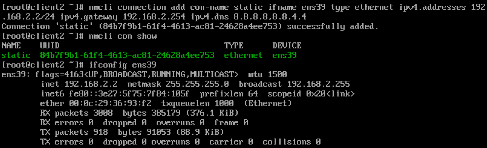

图 4.1 – 通过 nmcli 添加静态 IP 配置

现在让我们移除该连接并定义一个基于 DHCP 的配置。为此，我们需要在网络中有一个 DHCP 服务器，以便它能够为 client2 分配所需的网络配置信息（IP 地址、子网掩码、网关、DNS 服务器地址等）。我们需要输入以下命令：

```
nmcli connection delete static
nmcli connection add con-name dynamic ifname ens39 type ethernet
nmcli connection reload
systemctl restart NetworkManager
```

这是我们的预期结果：

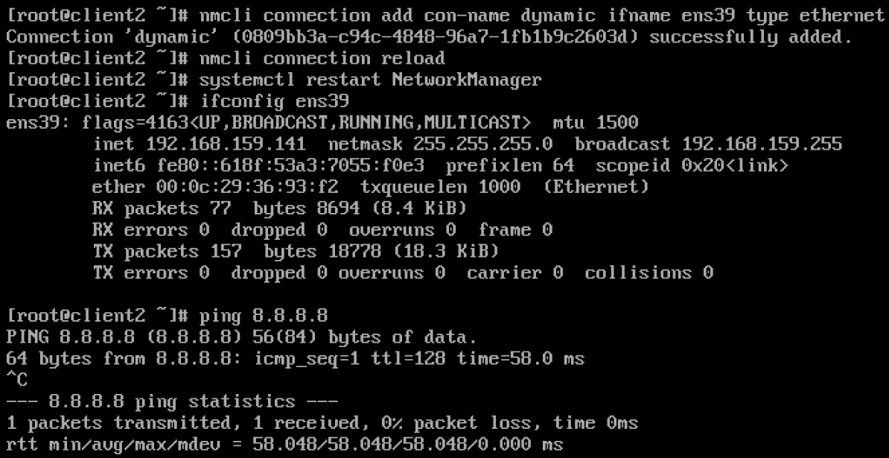

图 4.2 – 通过 nmcli 添加 DHCP 配置

如果我们的网络配置正确，我们应该已经获得了 IP 地址和其他网络信息，并且能够访问互联网。

在 Ubuntu 中，`netplan` 的这种配置方式更符合当前流行的 *基础设施即代码* 思维方式，因此它完全依赖于配置文件。因此，我们将再次实现两种最常见的场景——静态 IP 地址和 DHCP，但我们还将涵盖一个包含多个网络接口的场景，以便我们可以看到语法的样子。

首先，让我们从 `netplan` 静态网络配置开始。假设我们需要为网络接口 `ens33` 分配 IP 地址 `192.168.1.1/24`，默认网关为 `192.168.1.254`，DNS 服务器为 `8.8.8.8` 和 `8.8.4.4`。我们可以直接修改现有的 YAML 配置文件，即 `00-installer-config.yaml`：

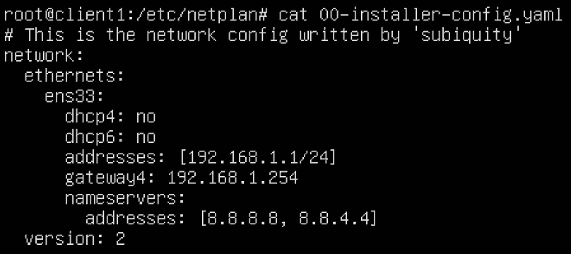

图 4.3 – 通过 netplan 添加静态配置

这涵盖了我们的静态 IP 地址场景。关于 `netplan` DHCP 场景，我们需要做的事情是显而易见的，因此该配置文件在特定场景下应如下所示：

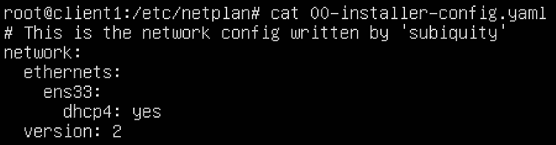

图 4.4 – 通过 netplan 添加动态配置

我们配方的最后部分，如我们所提到的，涉及到多个网络接口的配置。假设我们有一个名为 `ens33` 的网络接口需要进行 DHCP 配置，另一个名为 `ens38` 的接口需要分配一个 IP 地址 `192.168.1.1/24`，并且网关和 DNS 服务器配置与之前相同。配置文件应如下所示：

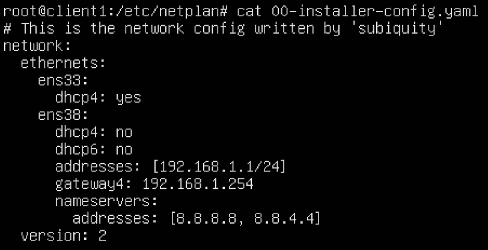

图 4.5 – 通过 netplan 配置多个网络接口

对于某些最新版本的 Ubuntu，此 `yes`/`no` 配置将更改为 `true`/`false`，因此如果您遇到错误，只需要做出相应的更改。基本上，它看起来像是前两个文件的合并，去掉了一些重复的行，以免出现不必要的重复。

现在让我们看看这两个概念是如何工作的。它足够简单，但仍然需要一些背景知识，因此让我们深入了解一下。

## 工作原理

现在我们已经简要介绍了进程和信号的工作原理，让我们继续探索关于进程的知识，学习如何管理后台进程。由于我们已经解释了后台进程的基础知识，这不应该是一个困难的任务。

就 NetworkManager 及其命令行配置接口（`nmcli`）而言，NetworkManager 通过`/etc/sysconfig/network-scripts`目录中的配置文件进行配置。让我们通过之前 CentOS 会话中的一个例子来展示——我们创建了一个名为`dynamic`的接口。在该目录中，有一个名为`ifcfg-dynamic`的文件，内容如下：

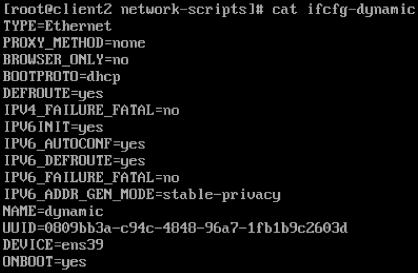

图 4.6 – 常规 NetworkManager 配置文件

对于一个简单的配置文件来说，这是一个相当大的配置文件。实际上，如果我们稍微优化一下这个文件，我们可以将其缩短至少三分之二，并且仍然能够正常工作，例如像这样：

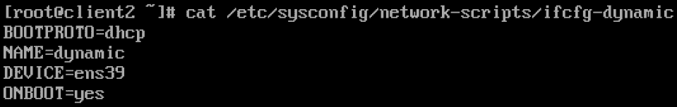

图 4.7 – 简化的配置文件

这些配置选项并不难理解，还有一些其他配置选项是静态 IP 配置所必需的（`IPADDR`、`PREFIX`或`NETMASK`、`GATEWAY` —— 这些选项都非常直观）。但事实仍然是——至少部分原因——NetworkManager 依然使用这种冗长的语法，这是历史遗留问题，我们已经使用`/etc/sysconfig/network-scripts`目录及其中的文件来配置网络接口多年了。

与 netplan 相比，我们可以清楚地看到，netplan 更注重声明式语法，所有结构化的代码和缩进都是必需的，而这正是 YAML 所擅长的。刚开始使用时，它会让你感到有些沮丧，至少在你学会如何使用 vim 编辑器编辑 YAML 文件之前，因为那时它会变得容易得多。请查看*更多内容*部分中的链接，了解如何设置 vim 来帮助你编写 YAML 语法。

这两个服务——当系统启动时——会读取上述配置文件，并根据其中的设置配置网络接口。这个过程相当直接，只要我们理解语法。但我们仍然建议使用`nmcli`进行 NetworkManager 配置，因为它的语法很容易掌握。

下一步是使用`firewalld`和`ufw`进行防火墙设置。

## 更多内容

如果你需要更多关于 CentOS 和 Ubuntu 网络的资料，确保你查看以下内容：

+   配置和管理网络： [`access.redhat.com/documentation/en-us/red_hat_enterprise_linux/8/html-single/configuring_and_managing_networking/index`](https://access.redhat.com/documentation/en-us/red_hat_enterprise_linux/8/html-single/configuring_and_managing_networking/index%0D)

+   Netplan 参考：[`netplan.io/reference/`](https://netplan.io/reference/%0D)

+   `nmcli`：[`developer-old.gnome.org/NetworkManager/stable/nmcli.html`](https://developer-old.gnome.org/NetworkManager/stable/nmcli.html%0D)

+   设置 vim 以编辑 YAML：[`www.arthurkoziel.com/setting-up-vim-for-yaml/`](https://www.arthurkoziel.com/setting-up-vim-for-yaml/%0D)

# 使用 firewall-cmd 和 ufw

在 Linux 中，使用内置防火墙已经成为事实上的标准，超过二十年。自从`ipfwadm`（内核 v2.0）*发明*以来，Linux 内核开发者不断增加功能，防火墙就是其中之一。`ipfwadm`之后是`ipchains`（内核 v2.2），然后是`iptables`（内核 v2.4），如今则是`firewalld`（CentOS）和`ufw`（Ubuntu）。让我们了解这两种概念，以便无论我们使用什么 Linux 发行版，都能在需要时使用它们。

## 准备就绪

作为这个教程的一部分，我们将通过几十种不同场景的列表，涵盖`firewalld`和`ufw`。换句话说，我们将介绍必要的命令，以便对一些最常用的场景进行配置更改。首先，让我们为 CentOS（在我们的 client2 机器上）和 Ubuntu（client1 机器上）安装必要的包。所以，对于 CentOS，我们需要输入以下命令：

```
yum -y install firewalld
```

此外，对于 Ubuntu，使用以下命令：

```
apt-get -y install ufw
```

在服务方面，对于 CentOS，我们有这些——以防我们之前使用过`iptables`，因为 CentOS 8 支持`iptables`防火墙：

```
systemctl stop iptables
systemctl disable iptables
systemctl mask iptables
systemctl enable firewalld
systemctl start firewalld
```

对于 Ubuntu，思路是一样的：

```
systemctl stop iptables
systemctl disable iptables
systemctl mask iptables
systemctl enable ufw
systemctl start ufw
ufw enable
```

现在服务已经配置完成，让我们开始吧！

## 如何操作

对于`firewalld`，我们将使用其默认命令，即`firewall-cmd`。对于`ufw`，命令相同——`ufw`。首先，让我们处理一些基本命令。首先列出所有规则：

```
firewall-cmd --list-all
```

根据我们之前添加的规则数量，应该会得到类似这样的输出：

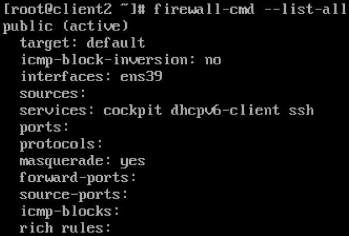

图 4.8 – firewall-cmd --list-all 输出

现在让我们添加和删除一些规则。这是我们要做的：

+   添加一条规则，允许`192.168.2.254/24`访问我们`client2`机器上的所有内容。

+   添加一条规则，允许网络子网`192.168.1.0/24`访问我们`client2`机器上的`SSH`服务。

+   阻止`192.168.3.0/24`网络访问 HTTP/HTTPS 服务。

+   允许同一子网访问 DNS 服务。

+   将端口`900`转发到端口`9090`。

+   配置`masquerade`，使`client1`可以作为路由器/网关使用。

作为最后一步，我们将一条一条地删除所有这些规则。

既然我们已经清楚了要做的事情，接下来让我们输入所有必要的命令来实现这个目标。首先，我们从使用默认配置和默认区域开始，这意味着我们需要检查当前是哪个区域。我们可以在之前的截图中看到公共区域是激活的，所以——暂时——我们将所有规则添加到该区域，稍后我们会解释区域和富规则：

```
firewall-cmd --permanent --zone=public --add-source=192.168.2.254/32
firewall-cmd --permanent --zone=public --add-rich-rule='rule family="ipv4" source address="192.168.1.0/24" port protocol="tcp" port="22" accept'
firewall-cmd --permanent --zone=public --add-rich-rule='rule family="ipv4" source address="192.168.3.0/24" port protocol="tcp" port="80" reject' 
firewall-cmd --permanent --zone=public --add-rich-rule='rule family="ipv4" source address="192.168.3.0/24" port protocol="tcp" port="443" reject'
firewall-cmd --permanent --zone=public --add-rich-rule='rule family="ipv4" source address="192.168.3.0/24" port protocol="udp" port="53" accept' 
firewall-cmd --permanent --zone=public --add-forward-port=port=900:proto=tcp:toport=9090
firewall-cmd --permanent --zone=public --add-masquerade
echo "1" > /proc/sys/net/ipv4/ip_forward
echo "net.ipv4.ip_forward = 1" > /etc/sysctl.d/50-forward.conf
firewall-cmd --reload
```

Echo 命令用于现在启用 IP 转发（第一个 echo），并通过使用一个`sysctl`配置文件使其在系统启动时永久启用（第二个 echo）。最后一条命令是将这些设置应用到当前运行的`firewalld`状态。当我们现在输入`firewall-cmd --list-all`命令时，应该会得到如下输出：

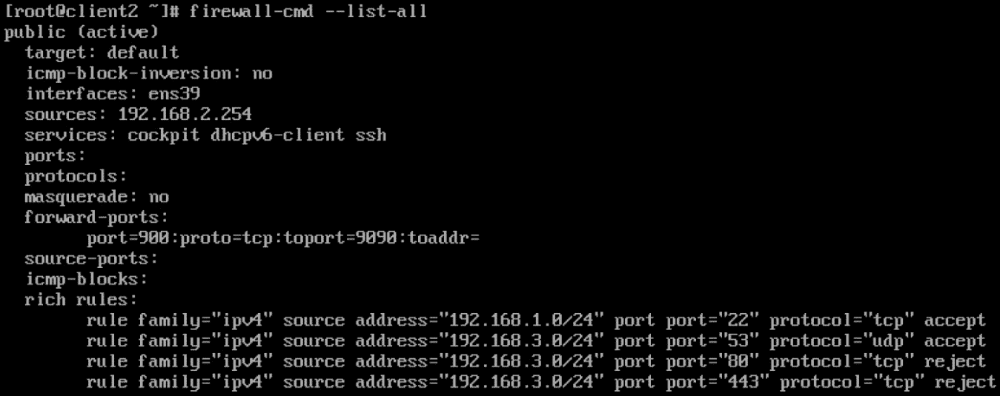

图 4.9 – 我们在 firewalld 中配置的最终结果

学会如何移除这些规则也非常重要。所以，接下来让我们一条一条地反向删除这些规则：

```
firewall-cmd --permanent --zone=public --remove-masquerade
firewall-cmd --permanent --zone=public --remove-forward-port=port=900:proto=tcp:toport=9090
firewall-cmd --permanent --zone=public --remove-rich-rule='rule family="ipv4" source address="192.168.1.0/24" port protocol="tcp" port="22" accept'
firewall-cmd --permanent --zone=public --remove-rich-rule='rule family="ipv4" source address="192.168.3.0/24" port protocol="udp" port="53" accept' 
firewall-cmd --permanent --zone=public --remove-rich-rule='rule family="ipv4" source address="192.168.3.0/24" port protocol="tcp" port="443" reject'
firewall-cmd --permanent --zone=public --add-rich-rule='rule family="ipv4" source address="192.168.3.0/24" port protocol="tcp" port="80" reject'
firewall-cmd --permanent --zone=public --remove-source=192.168.2.254/24
firewall-cmd --reload
```

这应该移除所有规则并将起始状态应用为当前状态。让我们检查一下：

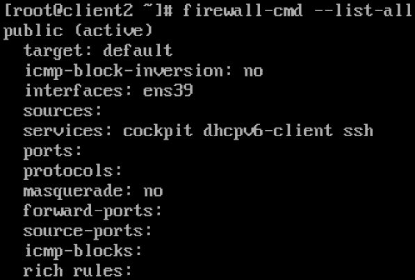

图 4.10 – 移除规则后的 firewalld 规则集

一切已恢复到原始状态，所以我们可以认为这是成功的。现在让我们使用`ufw`将相同的规则集应用到名为 client1 的 Ubuntu 虚拟机上。首先，我们通过使用`ufw status verbose`命令来检查状态。我们应该得到如下结果：

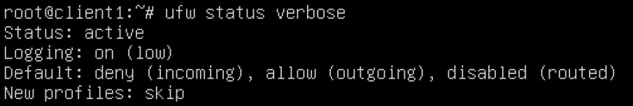

图 4.11 – ufw 配置的起始点

现在让我们添加与在`firewalld`中添加的规则相同的规则，看看如何通过`ufw`来实现，并且检查语法差异：

```
ufw allow from 192.168.2.254/32
ufw allow from 192.168.1.0/24 proto tcp to any port 22
ufw deny from 192.168.3.0/24 proto tcp to any port 80
ufw deny from 192.168.3.0/24 proto tcp to any port 443
ufw allow from 192.168.3.0/24 proto udp to any port 53
```

对于端口转发，我们需要编辑`/etc/ufw/before.rules`文件，并在`*filter`部分之前添加以下配置选项：

```
*nat
:PREROUTING ACCEPT [0:0]
-A PREROUTING -p tcp --dport 900 -j REDIRECT --to-port 9090
COMMIT
```

现在我们可以通过使用`ufw`和`iptables`命令来检查我们的工作状态：

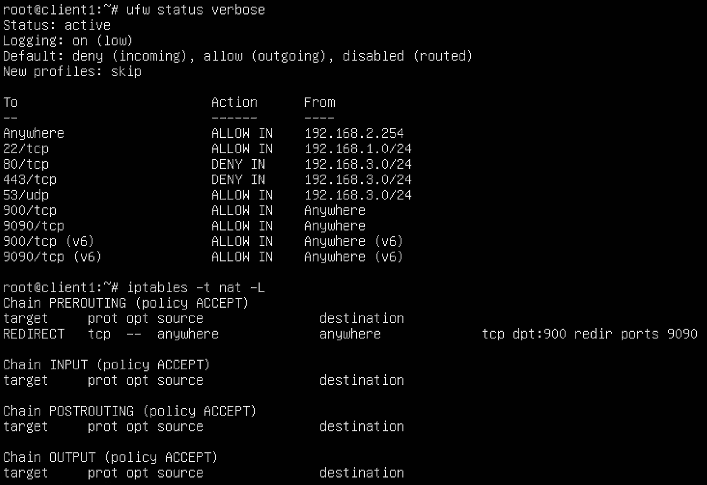

图 4.12 – 添加所有规则后的 ufw 状态详细信息

我们需要向`ufw`配置中添加两个配置选项，才能使伪装工作。首先，我们需要在`/etc/default/ufw`文件中更改转发的默认策略。默认设置为`DROP`，我们只需将其更改为`ACCEPT`。该设置位于文件的开头，所以最终结果应该是这样的：

```
DEFAULT_FORWARD_POLICY="ACCEPT"
```

这样看起来比较合适：

```
DEFAULT_FORWARD_POLICY="DROP"
```

下一个配置选项实际上就在我们之前编辑过的同一个文件中，即 `/etc/ufw/before.rules`。我们需要在 `*nat` 部分添加一个名为 `POSTROUTING` 的子部分，添加到之前使用过的地方。所以，类似于之前的示例，我们需要再次在 `*filter` 部分之前添加以下配置选项：

```
*nat
:POSTROUTING ACCEPT [0:0]
-A POSTROUTING -o ens33 -j MASQUERADE
COMMIT
```

`ufw` 配置的最后一部分是确保内核知道需要启用 `ip` 转发。为了实现这一点，我们需要编辑一个名为 `/etc/ufw/sysctl.conf` 的文件，并取消注释以下配置选项，方法是去掉前面的注释标记（`#`）：

```
net/ipv4/ip_forward=1
```

这会在 `/proc` 文件系统中更改一个值，文件名为 `/proc/sys/net/ipv4/ip_forward`。如果我们想确保即使不重启机器它也能生效，我们还需要执行以下命令：

```
echo "1" > /proc/sys/net/ipv4/ip_forward
```

这将启用内核级别的 IP 转发，并使我们能够在 `ufw` 中使用地址转换。现在让我们检查最终结果：

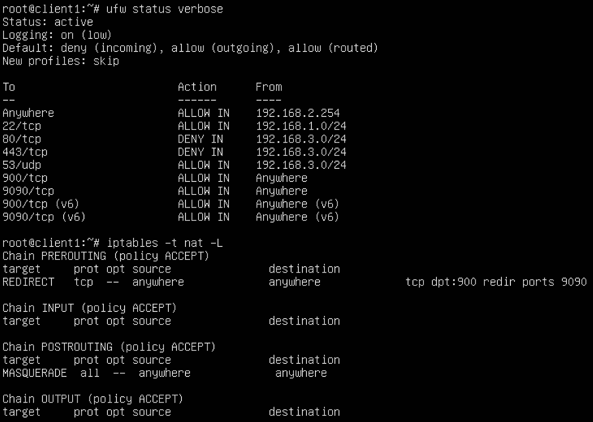

图 4.13 – 配置地址转换后的 ufw 规则集

如果需要删除这些配置选项，则需要分两部分进行操作：

+   通过编辑器直接添加到文件中的配置选项需要通过编辑器删除。

+   使用 `ufw` 命令添加的配置选项可以通过 `ufw` 的规则索引轻松撤销。

让我们输入命令 `ufw status numbered`。这是预期的结果：

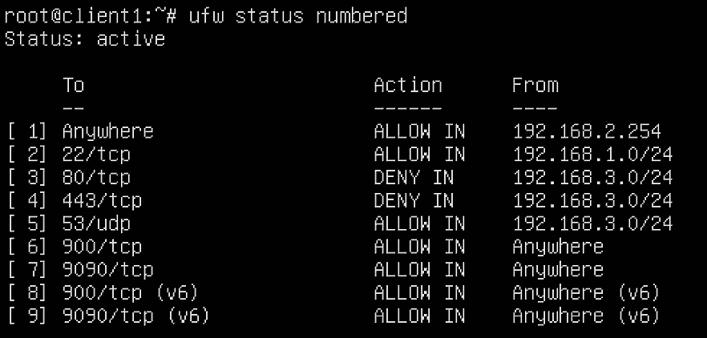

图 4.14 – 按编号索引的 ufw 规则集

我们可以看到，每个我们添加的规则都有一个编号。规则 8 和 9 是为端口 `900` 和 `9090` 自动添加的规则，适用于 IPv4 和 IPv6 栈。我们可以通过使用附加的编号轻松删除所有这些规则。问题是，`ufw` 并没有删除多个规则的机制，所以我们需要逐个删除它们，像这样：

```
ufw delete 9 
<confirm by pressing y>
ufw delete 8 
<confirm by pressing y>
....
ufw delete 1
<confirm by pressing y>
```

是的，我们本可以用 `for` 循环简化这个过程，像这样：

```
for i in {9..1};do yes|ufw delete $i;done
```

但是，本书后面会介绍 shell 脚本和使用循环，所以...我们先把这当作一个 *提前示例*。

现在让我们解释一下这一切是如何工作的——firewalld 区域、富规则、`ufw` 语法——以便我们理解实现这一功能的后台服务和能力。

注意

`Firewalld` 也可以在 Ubuntu 上使用。只需要安装、启用、启动并配置它，同时对 `ufw` 进行相反的操作。如果你更倾向于使用 `firewalld`，我们建议你试试这个方法，它很简单，不会浪费你太多时间。

## 工作原理

`ufw` 和 `firewalld` 之间有一个根本性的区别，`ufw` 基本上只是 `iptables` 的前端，而 `firewalld` 则更加动态，具有与区域（zones）配合使用的能力，我们可以为这些区域分配不同的信任级别。它们的语法也不同，`ufw` 更加基于命名空间，而 `firewalld` 在规则编写上则需要更多的努力。但与此同时，`firewalld` 具有 D-Bus 接口，这使得在应用程序、服务和用户进行配置更改时，配置变得更加容易，此外，我们无需在每次更改后重新启动防火墙以使其生效。它还与 NetworkManager 和 `nmcli`、`libvirt`、Docker、Podman 等工具良好配合，甚至与 fail2ban 兼容（尽管 fail2ban 同样能与 `iptables` 一起工作）。有时候这取决于个人偏好；有时候是习惯。一般来说，如果你是 Ubuntu/Debian 用户，你可能会更倾向于使用 `ufw`。同样，如果你是 CentOS/Red Hat/Fedora/*SuSe 用户，你肯定更倾向于使用 `firewalld`。

`firewalld` 使用区域的概念，我们可以将网络接口或 IP 地址分配给这些区域，这无疑非常有用，因为它给了我们更多的配置自由度。如果我们输入 `firewall-cmd --get-zones` 命令，我们会看到当前时刻可用的区域列表：

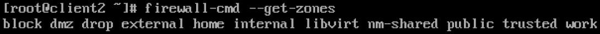

图 4.15 – 默认的 firewalld 区域

默认情况下，`firewalld` 的配置是 *拒绝所有，添加例外* 的方式，这也是为了方便使用。我们可以根据端口、IP 地址、子网和服务来允许或拒绝连接，这使得我们能够完成主机防火墙功能所需的一切。它还引入了一个叫做丰富规则（rich rules）的概念（如本食谱中的示例所示），这使得我们能够创建复杂的规则，并具有细致的粒度控制。这些规则可以基于源地址、目的地址、端口、协议、服务、端口转发和每个子网的伪装。它们可以用于速率限制，允许我们设置每分钟接受的 SSH 连接数为 5 或 10，从而使得对我们的 Linux 服务器进行 SSH 暴力破解攻击变得更加困难。总的来说，这是一个经过深思熟虑、功能丰富的防火墙，并且是免费的。我们只需要进行配置。

`ufw` 作为 `iptables` 的前端——或者像人们常说的，`iptables` 的命令行接口——虽然功能相对较少，但绝对更容易配置，至少对于最常见的场景来说是如此。它的命令行接口更具可读性（更简单），也更容易学习。既然它只是 `iptables` 的前端，本质上是一个用户空间的工具，用来管理由 netfilter 模块堆栈提供的 Linux 内核过滤规则。

现在我们已经讨论了 Linux 防火墙的一些关键概念，是时候进入下一个操作步骤，学习如何检查开放的端口和连接。让我们看看具体内容。

## 还有更多

如果你需要了解更多关于`firewalld`和`ufw`的内容，建议查看以下链接：

+   `firewall-cmd`: [`firewalld.org/documentation/man-pages/firewall-cmd.html`](https://firewalld.org/documentation/man-pages/firewall-cmd.html%0D)

+   Linux 中`firewalld`的新手指南：[`www.redhat.com/sysadmin/beginners-guide-firewalld`](https://www.redhat.com/sysadmin/beginners-guide-firewalld%0D)

+   `firewalld`丰富语言：[`firewalld.org/documentation/man-pages/firewalld.richlanguage.html`](https://firewalld.org/documentation/man-pages/firewalld.richlanguage.html%0D)

+   `ufw`: [`help.ubuntu.com/community/UFW`](https://help.ubuntu.com/community/UFW%0D)

# 使用开放端口和连接

检查本地和/或远程机器的开放端口通常是安全性和配置审计过程的一部分。这是我们用来检查是否能够连接到某些远程端口，验证服务是否正常工作，防火墙是否配置正确，或路由是否正常工作的操作——就是常规的日常任务。当然，它也可能是一些黑客攻击过程的一部分，这些过程通常开始于使用`nmap`和类似工具检查开放端口和操作系统指纹。但让我们看看如何使用`netstat`、`lsof`、`ss`和`nmap`等工具来为我们的网络和安全带来益处。

## 准备工作

保持 client1 虚拟机开机，继续使用我们的 Shell。一般来说，如果我们在 Ubuntu 上进行操作，我们需要使用`apt-get`安装一些软件包，如`traceroute`和`nmap`：

```
apt-get -y install traceroute nmap
```

然而，如果我们使用的是 CentOS，我们需要使用`yum`或`dnf`：

```
yum -y install traceroute nmap
```

之后，我们就可以开始我们的操作步骤了。

## 如何操作

首先，让我们了解一下检查本地 Linux 机器上哪些端口和套接字已打开的常用方法，从`netstat`命令开始。是的，使用`netstat`（`netstat -rn`命令）检查路由表是常见的操作，但通过以不同的方式使用它，我们还可以了解更多有关本地 Linux 机器的有趣细节。首先，使用`netstat -a`命令检查所有打开的连接和端口：

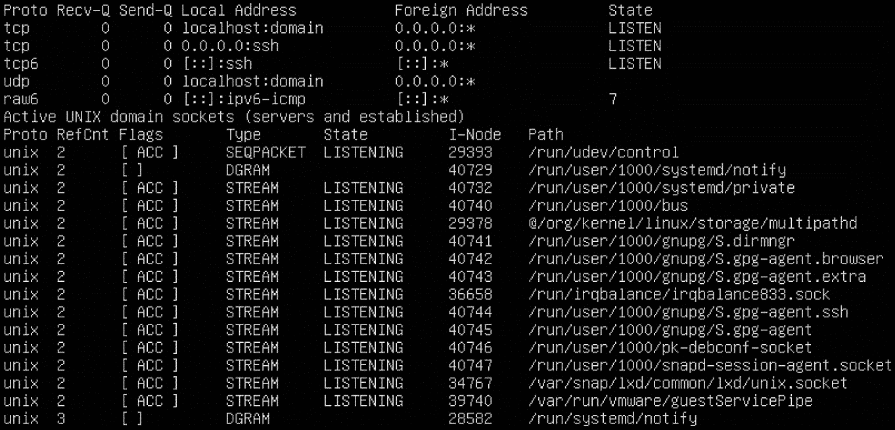

图 4.16 – netstat -a 输出的一部分 – 由于结果非常长，我们为了格式化的原因略作简化

这里有很多细节。让我们看看能否将其格式化得更好一些。首先，使用`netstat -atp`命令显示所有打开的 TCP 端口：

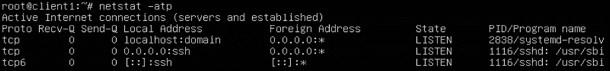

图 4.17 – netstat 显示 TCP 端口列表

然后，使用`netstat -aup`命令显示相同内容，但针对打开的 UDP 端口：

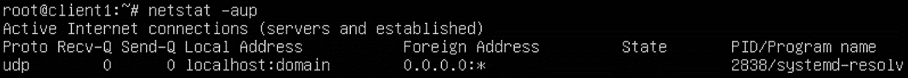

图 4.18 – 使用 netstat 查看 UDP 端口列表

我们还可以按监听端口（一个应用程序或进程正在监听的端口）来显示上述信息的子集。这就是 `netstat -l` 命令的作用：

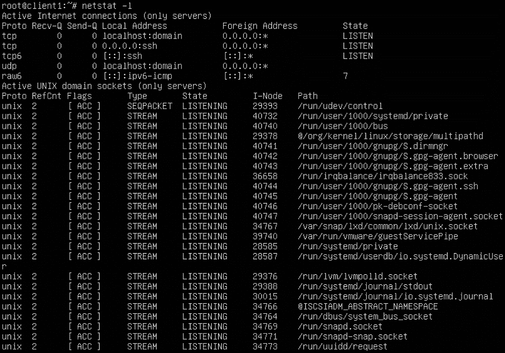

图 4.19 – 使用 netstat 查看监听端口

我们可以使用 `ss` 和 `lsof` 做类似的操作。让我们首先使用 `ss`：

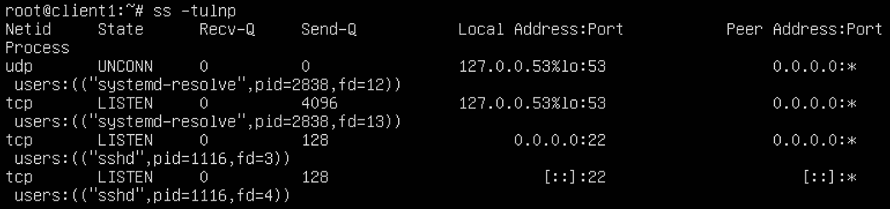

图 4.20 – 使用 ss 查看活动连接

接下来我们要讨论的是 `lsof`，一个可以用来确定哪些文件正被相应进程打开的命令：

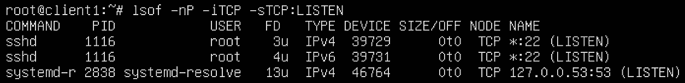

图 4.21 – 与 ss 相同的思路，但提供了更多关于实际命令/服务使用端口的详细信息

我们使用的选项如下：

+   `-n` 用来使用端口号，而不是端口名称

+   `-P` 用于使用数值地址，而不进行 DNS 解析

+   `-iTCP` `-sTCP:LISTEN` 用来仅显示处于 `LISTEN` 状态的打开端口的文件

然后，如果我们想将其缩小到特定的 TCP 端口——例如端口 `22`——我们可以使用类似 `lsof -nP -iTCP:22 -sTCP:LISTEN` 的命令：

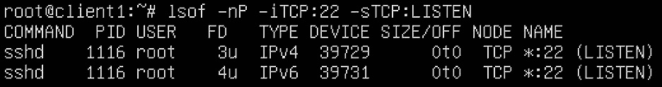

图 4.22 – 将 lsof 输出缩小到仅显示 TCP 端口 22

如果我们需要检查由端口范围指定的开放端口，`lsof` 可以通过使用 `lsof -i` 选项来实现。例如，我们可以对 `22` 到 `1000` 端口范围使用这个选项：

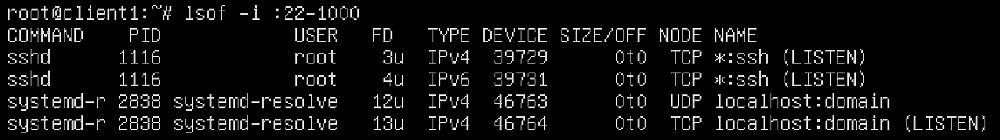

图 4.23 – 按端口范围使用 lsof

现在我们已经在本地机器上使用了一些命令，接下来让我们关注远程机器，并讨论如何在它们上查找开放端口以及其他可能需要的信息。为此，我们将使用 `nmap` 命令。首先让我们使用客户端 1（IP 地址 `192.168.1.1`）扫描 `server1`（IP 地址 `192.168.1.254`）。`server1` 只是一个普通的 CentOS 8 安装，如本章最后一节所解释的。

首先，让我们进行一次常规扫描，使用 `nmap 192.168.1.254` 命令：

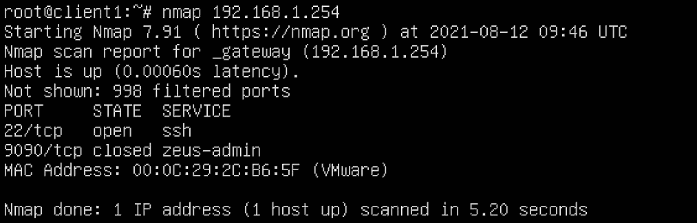

图 4.24 – 对单个 IP 地址使用 nmap

如果我们希望输出更多的信息，可以在 IP 地址前后加上 `-v` 选项。不过，我们仍然可以看到远程 IP 地址有几个开放的 TCP 端口。接下来我们可以尝试通过使用 `-A` 选项启动 `nmap`（操作系统信息扫描）来获取更多信息：

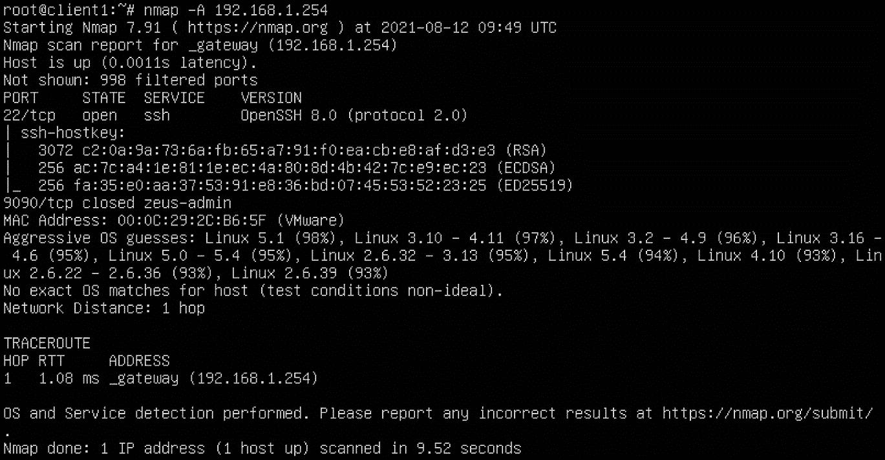

图 4.25 – 上一次 nmap 会话的更详细版本

我们可以看到更多关于输出的细节。如果我们仅想进行操作系统指纹识别，我们可以使用 `-O` 选项：

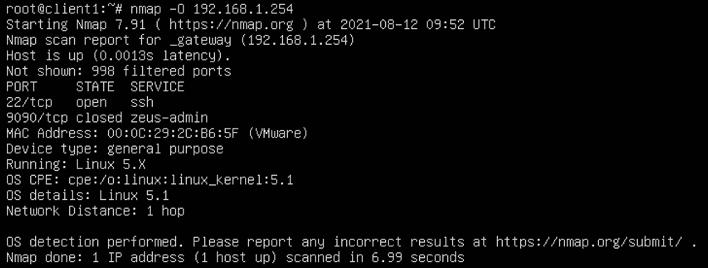

图 4.26 – nmap 操作系统指纹识别

我们还可以扫描其他一些内容，例如以下内容：

+   特定 TCP 端口 – `nmap -p T:9090,22 192.168.1.254`

+   特定 UDP 端口 – `nmap -sU 53 192.168.1.254`

+   扫描端口范围 – `nmap -p 22-2000 192.168.1.254`

+   查找远程主机服务版本 – `nmap -sV 192.168.1.254`

+   扫描子网 – `nmap 192.168.1.*`

+   扫描多个主机 – `nmap 192.168.1.252,253,254`

+   扫描完整的 IP 范围 – `nmap 192.168.1.1-254`

现在让我们讨论这四个工具如何工作，并总结这个操作方法。

## 工作原理

`netstat`、`ss` 和 `lsof` 是类似的工具，但它们也各有不同。人们通常使用 `netstat` 来查看其路由表。但需要指出的是，默认情况下，`netstat` 是一个可以列出网络层上已打开的 TCP 套接字/UDP 连接的工具。另一方面，`lsof` 列出了已打开的文件（内核级功能），但它还能够确定哪些进程正在使用这些已打开的文件。请记住，在 Unix 操作系统中，几乎一切都是文件，其中也包括网络套接字等对象。因此，`lsof` 经常用于处理 Linux 系统的安全相关事项，因为与 `netstat` 相比，它显然能提供更多的技术细节。

`ss`，作为 `netstat` 的替代，可以用于处理网络信息和统计数据，这使得它与 `netstat` 有些相似。它可以用于获取有关网络连接、套接字、统计数据、TCP 状态过滤、与特定 IP 地址的连接等详细信息。而且，不容忽视的是，`ss` 使用起来要简单得多，比较 `netstat` 和 `ss` 的 man 页，你也能看到它们之间的差异。

`nmap` 与所有这些命令完全不同。它是一个功能更加广泛的工具——它可以扫描本地和远程主机、域名、IP 范围和端口。它是一个常规的网络扫描器，既有优点也有缺点，人们既喜欢使用它，也不喜欢成为它的目标。它通过与远程 IP 地址和端口建立连接，向其发送信息并收集输出信息来获取数据。因此，它是进行安全扫描和审计的完美工具，因为它能够发现开放的端口并报告这些开放端口的事实。它也被广泛用于寻找某些安全问题。

## 还有更多

如果你需要了解更多关于 `netstat`、`lsof`、`ss` 和 `nmap` 的信息，请确保查看以下链接：

+   `nmap` 文档：[`nmap.org/docs.html`](https://nmap.org/docs.html%0D)

+   `netstat`手册页：[`man7.org/linux/man-pages/man8/netstat.8.html`](https://man7.org/linux/man-pages/man8/netstat.8.html%0D)

+   `lsof`手册页：[`man7.org/linux/man-pages/man8/lsof.8.html`](https://man7.org/linux/man-pages/man8/lsof.8.html%0D)

+   `ss`手册页：[`man7.org/linux/man-pages/man8/ss.8.html`](https://man7.org/linux/man-pages/man8/ss.8.html%0D)

# 配置`/etc/hosts`和 DNS 解析

名称解析是任何操作系统，特别是其网络堆栈中的一个重要部分。一般来说，操作系统有多种不同的方式来执行 DNS 查询——通常，这涉及到某种类型的`hosts`文件、缓存，以及——当然——网络接口配置。让我们看看`/etc/hosts`的配置能力，了解它如何融入名称解析的整体方案。

## 准备就绪

保持 CLI1 虚拟机开机，我们来讨论如何处理名称解析的问题，使用`/etc/hosts`（一个可以填充主机名和 IP 地址以进行本地解析的文件）和`/etc/resolv.conf`（一个决定使用哪个 DNS 服务器进行网络解析、以及 Linux 服务器属于哪个域的文件），它们是这个过程的核心部分。当编辑`/etc/hosts`或`/etc/resolv.conf`时，我们必须以 root 身份登录或使用`sudo`，因为这是一个系统范围的操作，只有管理员用户才能执行。名称解析过程的工作方式在多年前发生了变化，当时`systemd`取代了`init`和`upstart`，并引入了名为`systemd-resolved`的服务。除此之外，Ubuntu 和 CentOS 的配置方式也不同。那么，让我们深入探讨这些内容，解释一下发生了什么。

## 如何操作

让我们先处理 Ubuntu 的情况，然后再切换到 CentOS。这是我们 Ubuntu CLI1 机器上的默认`/etc/resolv.conf`文件：


图 4.27 – 默认的`/etc/resolv.conf`文件

如我们所见，这个文件大部分被注释掉了（配置文件中的`#`符号表示 Unix Shell 风格的注释，因此这些行在配置中被省略）。我们只有两行配置，这是运行 systemd-resolved 服务（一个本地服务，提供 DNS 解析、DNS over TLS、DNSSEC、mDNS 等功能）以及默认使用 netplan 服务时的副产品：

```
nameserver 127.0.0.53
options edns0 trust-ad
```

有两种方法可以配置`resolv.conf`：

+   我们说过，我们希望坚持使用 systemd-resolved，并以这种方式配置我们的系统（而`127.0.0.53`实际上是 systemd-resolved 绑定的回环 IP 地址）。

+   我们说我们不想使用 systemd-resolved，想回到*旧方式*来配置系统，这意味着安装一个名为 `resolvconf` 的包。这样我们就可以像过去一样配置 `/etc/resolv.conf` 和 `/etc/hosts`，而不依赖 systemd-resolved 动态更改 `/etc/resolv.conf`（大多数情况下我们并不希望这样做）。

我们先从第一种方法开始，然后再转到第二种方法，因为我们很多 Linux 管理员更倾向于使用传统的方式，觉得按 Unix 时代开始时的配置方式进行配置更加容易。

如果我们使用 systemd-resolved，我们需要提到几个文件。我们首先需要提到的文件是 `/run/systemd/resolve/stub-resolv.conf` —— 这是一个实际与 `/etc/resolv.conf` 链接的文件，当使用 systemd-resolved 时。该文件用于保持与旧版 Linux 程序的兼容性，这些程序仅使用旧方法（`/etc/resolv.conf`，`/etc/hosts`）来访问名称解析信息。如果我们想永久设置 DNS 服务器，必须通过 `systemd` 来实现。那么，我们来看一下第二个文件，它位于 `/etc/systemd` 目录下，名为 `resolved.conf`。在该文件的开头，有一个完全被注释掉的 `[Resolve]` 部分。让我们将其修改为如下：

```
[Resolve]
DNS = 8.8.8.8 8.8.4.4
FallBackDNS = 1.1.1.1
Domains =domain.local
```

第一行和第二行设置了主要的和备用的 DNS 地址，而第三行设置了我们查询的默认域名。

在做出这些更改后，我们需要重启 `systemd-resolved` 服务，可以通过以下命令完成：

```
systemctl restart systemd-resolved
```

我们可以通过使用 `systemd-resolve --status` 来检查我们的更改是否已应用，根据我们的更改，应该会显示类似以下内容的输出：

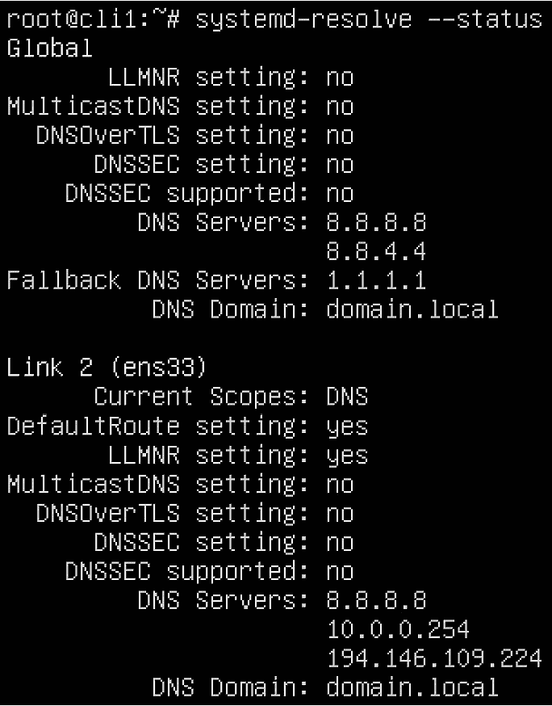

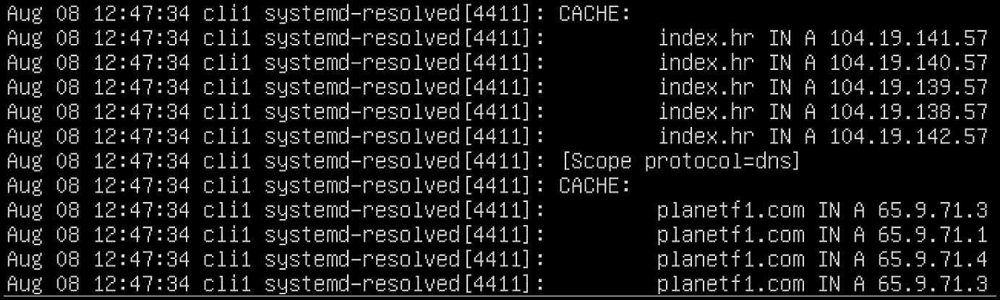

图 4.28 – 检查 systemd-resolved 状态

现在我们检查 DNS 缓存的工作原理——例如，我们输入以下命令：

```
nslookup index.hr
nslookup planetf1.com
```

我们这样做是为了检查 DNS 缓存，因为 DNS 缓存至少需要先填充一些数据。如果我们想检查 `systemd-resolved` 缓存的状态，可以使用两个命令：

```
killall -USR1 systemd-resolved
journalctl -u systemd-resolved > cache.txt
```

第一个命令不会终止 `systemd-resolved`，而是告诉它将可用条目写入 DNS 缓存。第二个命令将条目导出到名为 `cache.txt` 的文件中（我们可以任意命名）。当我们检查该文件中包含 `CACHE` 字符串的内容时，我们会看到类似于以下的条目：


图 4.29 – 检查 DNS 缓存

这是正确的——在我们的测试系统中，这两条是我们通过 `nslookup` 查询的条目。如果我们想刷新 DNS 缓存，可以使用以下命令：

```
resolvectl flush-caches
```

如果你注意到文件中有 DNS 违规错误，说明在系统安装或升级过程中出现了问题——没有正确设置 `resolv.conf` 的符号链接。由于这个问题，符号链接被创建到了错误的文件（`stub-resolv.conf`），而不是实际的文件（`/run/systemd/resolve/resolv.conf`）。我们可以通过以下命令来缓解这个问题：

```
mv /etc/resolv.conf /etc/resolv.conf.old
ln -s /run/systemd/resolve/resolv.conf /etc/resolv.conf
systemctl restart systemd-resolved
```

现在，让我们尝试第二种方法，这种方法要简单得多。所以，如果我们想摆脱所有这些 `systemd-resolved` 配置，只通过传统的 `resolv.conf` 管理流程，而不涉及这些额外的麻烦，我们完全可以轻松做到。首先，让我们安装必要的包：

```
apt-get -y install resolvconf
systemctl stop systemd-resolved
systemctl disable systemd-resolved
systemctl mask systemd-resolved
```

接下来，我们进行一些配置。我们打开 `/etc/resolv.conf` 文件，并将其配置如下（注释部分不重要，从 `nameserver` 部分开始）：

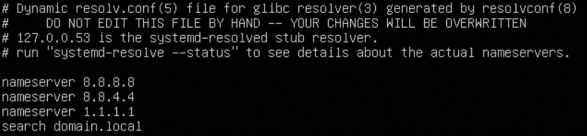

图 4.30 – resolv.conf 配置

让我们检查一下这个配置是否有效：

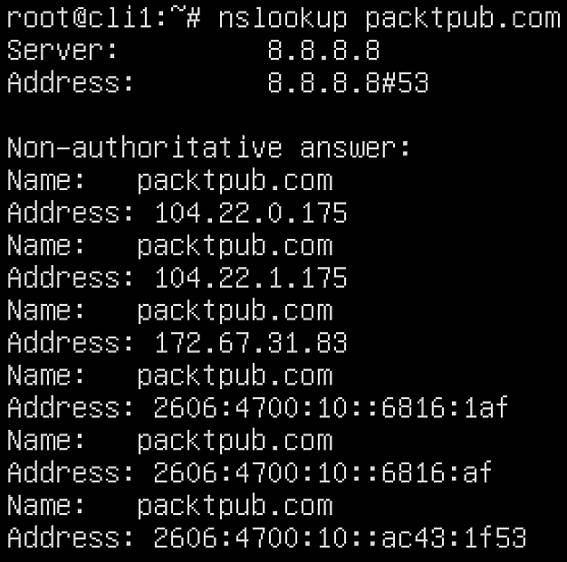

图 4.31 – 检查 DNS 解析是否有效

完全没有问题，对吧？当然，我们在这里使用了 `8.8.8.8`、`8.8.4.4` 和 `1.1.1.1` 作为 DNS 服务器的示例——这些需要根据我们 Linux 服务器实际运行的环境进行配置。

与 DNS 缓存打交道需要额外的努力。首先，我们需要部署两个额外的包——`nscd`（负责缓存的服务）和 `binutils`（这个包包含了一个叫做 `strings` 的命令，我们将用它来检查二进制文件中的字符串内容）：

```
apt-get -y install nscd binutils
strings /var/cache/nscd/hosts
```

第二个命令的输出应该类似于以下内容：

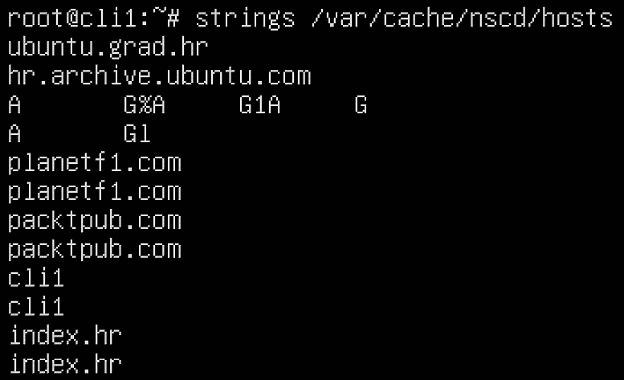

图 4.32 – 检查 nscd 缓存

如果我们需要清除 `nscd` `hosts` 缓存，可以使用以下命令：

```
nscd -i hosts
```

或者

```
systemctl restart nscd
```

第一个命令只是清空 hosts 表，而第二个命令则重启 `nscd` 服务，并在此过程中清空 `hosts` 表。

这就引出了 hosts 表，而且——幸运的是——在所有 Linux 发行版上都是一样的。如果我们只需要添加一些解析功能，而不打算通过 `BIND`、`dnsmasq` 或类似工具构建一个 DNS 服务器，使用 `hosts` 表似乎是一个相对简单的选择。假设我们需要为以下两个主机进行临时解析：

`server1.domain.local`

`server2.domain.local`

假设这两个服务器的 IP 地址分别是 `192.168.0.101` 和 `192.168.0.102`。我们通过编辑 `/etc/hosts` 文件并将这些条目添加到文件底部来进行配置：

`192.168.0.101 server1.domain.local`

`192.168.0.102 server2.domain.local`

所以，我们的 `/etc/hosts` 文件应该像这样：

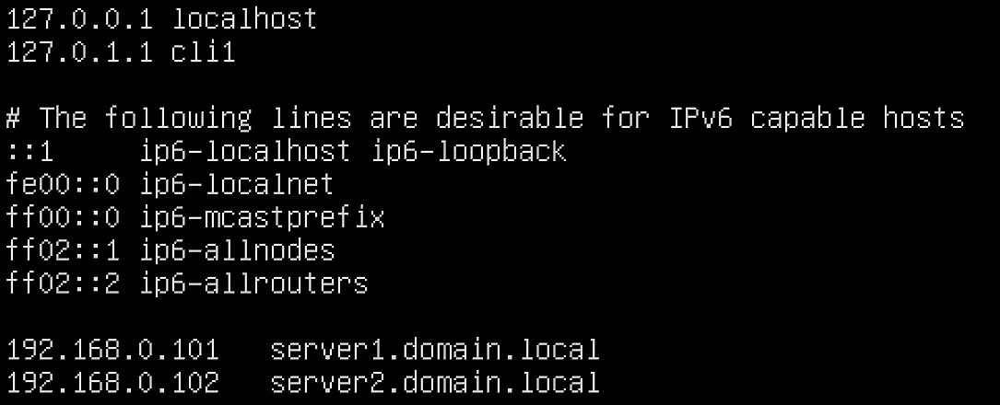

图 4.33 – /etc/hosts 文件和新增内容

如果我们现在使用类似 `ping` 的命令来检查这些主机是否可用，我们将得到如下结果：

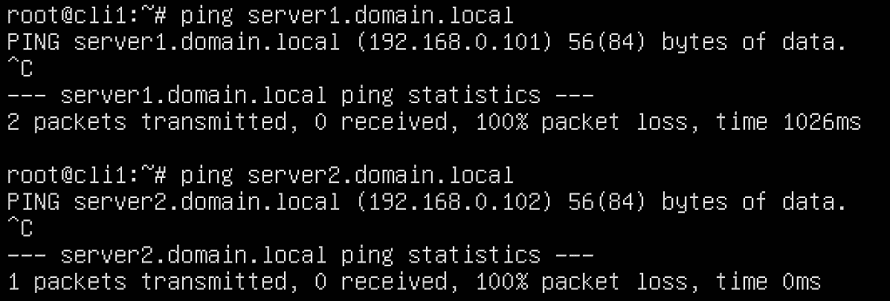

图 4.34 – ping 无法工作

在这个输出中可见的 `^C` 字符是因为我们使用了 *Ctrl* + *C* 来停止 ping 进程，因为这些主机实际上并不存在于我们的网络中。但这不是重点——重点是测试名称解析是否有效。换句话说，`server1` 和 `server2.domain.local` 的解析是否有效？答案是有效的——我们可以清楚地看到 `ping` 命令正在尝试 ping 它们的 IP 地址。

我们需要简要讨论 CentOS 是如何做这些事情的，因为它与 Ubuntu 的做法有些不同。默认情况下，CentOS 的最新几代使用 NetworkManager 作为默认服务来配置网络。因此，`/etc/resolv.conf` 默认由 NetworkManager 配置，这一点非常重要，尤其是在最常见的使用场景中——当我们的 CentOS 机器从 DHCP 服务器获取 IP 地址时。如果我们需要配置自定义 DNS 服务器，而又不想使用从 DHCP 服务器获得的 DNS 服务器，应该怎么办呢？

在 CentOS 中，确保一切配置正确有两种基本方式：

+   通过接口文件配置一切

+   通过 `nmcli` 命令配置一切

使用配置文件在这里是很麻烦的，所以我们直接做第二种方法——通过 `nmcli` 命令配置我们的 DNS 记录。假设我们想为 CentOS 服务器分配 `8.8.8.8`、`8.8.4.4` 和 `1.1.1.1` 作为 DNS 服务器。首先，让我们检查一下网络接口名称：

```
nmcli con show
```

我们的系统告诉我们正在使用 `ens33` 网络接口。让我们通过输入以下命令来修改它的设置：

```
nmcli con mod ens33 ipv4.ignore-auto-dns yes
nmcli con mod ens33 ipv4.dns "8.8.8.8 8.8.4.4 1.1.1.1"
systemctl restart NetworkManager
```

这个配置的关键在于第一行——我们基本上是在告诉 NetworkManager 停止自动使用从 DHCP 服务器获取的 DNS 服务器。如果我们不想这样做，可以省略这一行。

如果我们检查 `/etc/resolv.conf` 文件的内容，它现在应该是这样的：

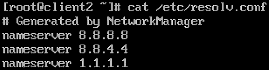

图 4.35 – /etc/resolv.conf 配置正确

配置工作已经完成——无论是在 Ubuntu 还是 CentOS 上。接下来我们来关注一下这一切是如何在 *幕后* 工作的。

## 工作原理

我们需要深入理解并解释两个概念。我们需要了解 `systemd-resolved` 是如何工作的，当然，反过来也需要了解——当我们将 `systemd-resolved` 从管理方程中去除时，所有的工作是如何进行的。考虑到在 systemd 和 `systemd-resolved` 之前就有 Linux 和名称解析，首先我们来解释一下 *旧方法*（即在 systemd-resolved 之前的做法）是如何工作的。

核心概念包括 `/etc/passwd`、`/etc/shadow` 和 `/etc/group`、网络配置，以及当然还有服务，比如名称解析（`/etc/hosts` 等）。我们的重点将仅放在名称解析上，这也是我们需要讨论配置文件 `/etc/nsswitch.conf` 的原因。具体来说，我们将忽略该文件中的所有配置选项，专注于一行配置，这行通常像这样：

```
hosts:      files dns
```

这一配置行告诉我们的名称解析系统 *如何* 执行其工作。`files` 选项意味着 *检查文件 /etc/hosts*，而 `dns` 选项意味着就如其字面意思——使用其他网络名称解析方法。但这行的关键在于 *顺序*，它清晰地表示 *文件优先，dns 次之*。这也是为什么在默认情况下，Linux 会首先检查 `/etc/hosts` 文件的内容，然后才开始发出网络名称解析请求（例如，`nslookup`），以获取我们要连接的服务器的 IP 地址。我们还可以将这些条目存储在数据库中，并强制 NSS 访问它以读取必要的数据。例如，20 年前，当 Active Directory 和其他基于 LDAP 的目录尚未普及时，我们通常使用 NIS/NIS+ 来存储用户和类似的数据。我们还可以在 NIS/NIS+ 数据库中存储主机数据（`hosts.byname` 和 `hosts.byaddr`）。这些映射基本上是存储在外部服务中的正向和反向 DNS 表。正因如此，我们可以在 `nsswitch.conf` 中使用配置选项 `db`，尽管现在几乎没有人使用这个选项了。

当 `systemd` 接管了名称解析（`systemd-resolved`）后，情况发生了变化，正如我们在上一篇教程中所描述的那样。`systemd-resolved` 的核心目的是能够更好地与 `systemd` 集成，并为一些在没有它的情况下实际复杂的使用场景提供支持。例如，VPN 连接，特别是企业级的 VPN，在使用旧式配置时总是会出现问题。`systemd-resolved` 试图通过引入分割 DNS 功能来解决这堆问题（以及其他问题），这一功能是通过使用 DNS 路由域来确定我们实际发出的 DNS 请求。请不要把这与基于 IP 的子网路由、VLAN 路由或类似的概念混淆——那些是完全不同的概念，基于完全不同的思路。我们这里特别讨论的是 DNS 路由域，它只是一个术语，意思是 *让我们确定应该联系哪个 DNS 服务器，以获取关于你的 DNS 查询的正确信息*。这与 IP 方面无关，IP 部分是通过使用标准的路由方法来处理的。

拥有分割 DNS 并不是什么新鲜事——我们中的很多人已经使用了十多年。简而言之，分割 DNS 意味着将一些 DNS 服务器分配给内部连接，而将其他 DNS 服务器分配给外部连接。从企业的角度来看，如果我们通过 VPN 连接到工作场所，我们的一部分 DNS 查询是针对内部基础设施的，而另一部分则应该指向互联网上托管的外部 DNS 服务器。在 Linux 中实现这一场景也不是什么新事物——我们早在十多年前就可以轻松使用 `BIND` 来实现。但一种更紧密集成、尽可能自动化的方式，特别是在客户端这一侧——这正是 `systemd-resolved` 所做的——其实是全新的。

让我们假设一下，我们有一台 Linux VPN 服务器，我们通过一台 Linux 机器作为 VPN 客户端来连接它。假设这两个系统都在不同子网中有多个网络接口（VPN 客户端有几张物理网卡和一个无线网络适配器）。当我们从 VPN 客户端连接到 VPN 服务器时，VPN 客户端将如何决定将 DNS 查询发送到哪里？是的，它会使用 `resolv.conf`，但仍然需要正确配置 `resolv.conf` 和 `systemd-resolved`，这样名称解析请求才能发送到正确的 DNS 服务器。如果我们有多个子网和多个域（例如，大型企业），事情会很快变得混乱。这个问题通过 NetworkManager/netplan 与 `systemd-resolved` 的互动来解决。通过这种互动，我们可以将不同的 DNS 服务器分配给不同的网络接口，并为多个不同的域分配不同的 DNS 服务器。这是一种非常聪明的方式来处理潜在的 VPN 客户端问题。

## 还有更多内容

如果我们需要了解更多关于网络名称解析的信息，可以查看以下链接：

+   什么是 DNS?: [`www.cloudflare.com/learning/dns/what-is-dns/`](https://www.cloudflare.com/learning/dns/what-is-dns/%0D)

+   什么是 DNS?: [`aws.amazon.com/route53/what-is-dns/`](https://aws.amazon.com/route53/what-is-dns/%0D)

+   NSCD 手册页，第八章: [`linux.die.net/man/8/nscd`](https://linux.die.net/man/8/nscd%0D)

+   `systemd-resolved` 手册页: [`manpages.ubuntu.com/manpages/bionic/man8/systemd-resolved.service.8.html`](http://manpages.ubuntu.com/manpages/bionic/man8/systemd-resolved.service.8.html%0D)

+   `resolved.conf` 手册页: [`www.freedesktop.org/software/systemd/man/resolved.conf.html`](https://www.freedesktop.org/software/systemd/man/resolved.conf.html%0D)

# 使用网络诊断工具

诊断网络连接问题是资深系统工程师的日常工作。这并不一定是因为我们自己的网络出现问题，也可能是其他因素。例如，有时我们的本地网络工作正常，但互联网连接却无法使用。更糟糕的是，客户反映有些客户能够访问互联网，而有些却无法访问。我们应该如何应对这些情况，使用哪些工具呢？这正是我们将在本节中讨论的内容。所以，准备好讨论`ping`、`route`、`netstat`、`tracepath`等命令吧——它们就是为了解决这些问题而存在的！

## 准备工作

让我们安装一台名为`server1`的 CentOS 虚拟机，并使用我们现有的客户端（分别为一台名为 client1 的 Ubuntu 虚拟机和一台名为 client2 的 CentOS 虚拟机）来操作本节内容。我们将使用 client1 模拟一个情境，即本地网络中的服务器希望通过将`server1`设置为默认网关来访问内部资源和/或互联网。我们将使用 client2 模拟另一种情境，即本地客户端或无线客户端希望通过将`server1`设置为默认网关来访问内部资源和/或互联网。为了实现这一点，我们将临时为 client2 添加另一个网络接口，这样我们就可以在两个不同的子网中拥有两个网络接口，模拟场景中的问题。`server1`虚拟机将是一个标准的 CentOS 安装，但带有四个网络接口。在我们的场景中，`server1`的`ens33`网络接口将作为外部网络接口，而`ens37`、`ens38`和`ens39`网络接口将作为内部网络接口。

## 如何操作

让我们创建一个场景，完整地演示整个过程。例如，我们公司的一些同事报告说，他们在访问内部资源（公司网络）和外部资源（互联网）时遇到问题。我们讨论的这家公司有多个网络子网：

+   `192.168.1.0/24` – 这个子网用于所有服务器机器；我们在通过`nmcli`配置时将其称为`network1`。

+   `192.168.2.0/24` – 这个子网用于所有客户端机器；我们在通过`nmcli`配置时将其称为`network2`。

+   `192.168.3.0/24` – 这个子网用于公司无线网络；我们在通过`nmcli`配置时将其称为`network3`。

我们机器的第四个网络接口将作为我们的互联网连接。正如我们在本章的第二节中提到的（*使用 firewalld 和 ufw*），让我们配置这台虚拟机，使其允许所有三个子网连接到互联网并正常工作。

第一步显然是允许这三个子网访问互联网。我们将采用最简单的方式，通过使用 `firewalld` 来实现。具体来说，我们将通过将这些接口添加到公共区域来实现这一点。因此，我们需要在 `server1` 上执行一些标准命令和配置步骤：

```
echo "1" > /proc/sys/net/ipv4/ip_forward
nmcli connection add con-name network1 ifname ens37 type ethernet ip4 192.168.1.254/24
nmcli connection add con-name network2 ifname ens38 type ethernet ip4 192.168.2.254/24
nmcli connection add con-name network3 ifname ens39 type ethernet ip4 192.168.3.254/24 
```

如果我们的配置正确，当我们输入 `nmcli con show` 命令时，应该会看到类似这样的输出（具体取决于我们如何在 `ens33` 上配置外部网络，在我们的虚拟机中，它使用的是 `192.168.159.0/24` 网络）：

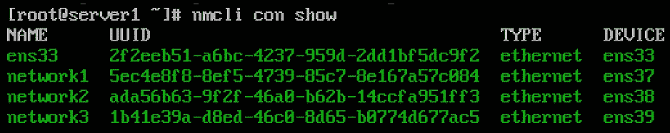

图 4.36 – 检查我们的 NM 连接设置

此外，如果我们通过 `ip route` 命令检查路由信息，应该会得到类似这样的输出：

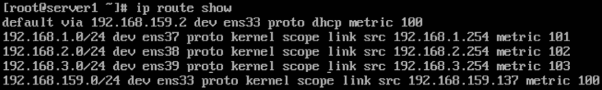

图 4.37 – 检查我们的路由

因此，我们有了三个子网，路由已相应配置，现在我们需要配置 `server1` 作为路由器。输入以下命令，将我们的接口设置到特定的区域：

```
nmcli connection modify ens33 connection.zone public
nmcli connection modify network1 connection.zone public
nmcli connection modify network2 connection.zone public
nmcli connection modify network3 connection.zone public
firewall-cmd --zone=public --add-masquerade --permanent
firewall-cmd --reload
firewall-cmd --list-all
```

当我们输入最后一个命令时，应该会看到类似这样的输出：

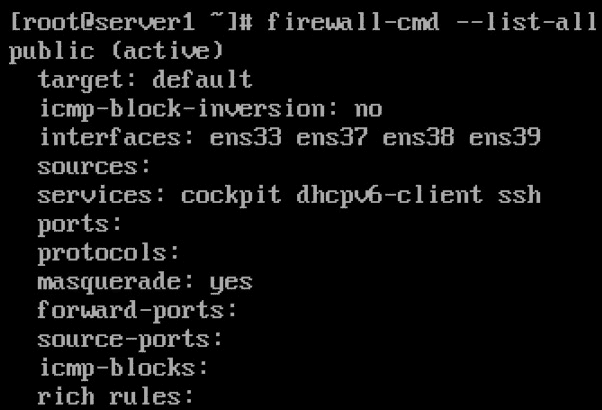

图 4.38 – firewall-cmd --list-all 输出

在 client1 上，我们还需要进行一些重新配置，因为它最初是设置为使用 DHCP 获取 IP 地址的。首先，输入以下命令安装 `traceroute` 包：

```
apt-get -y install traceroute
```

然后，让我们配置这台 Linux 虚拟机，使其 IP 地址为 `192.168.1.1/24` 并应用该配置。首先，我们需要编辑 netplan 配置文件。为了简便起见，我们就使用默认的配置文件 `/etc/netplan/00-installer-config.yaml`。它需要通过 `netplan apply` 命令应用以下内容：

``

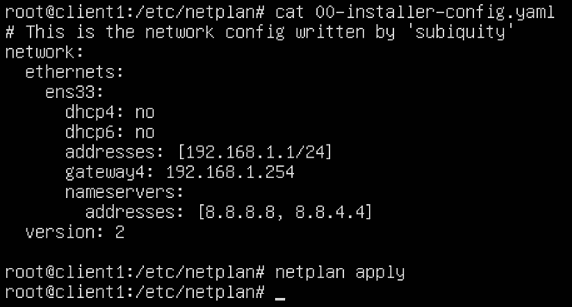

图 4.39 – netplan 配置文件

现在让我们测试一下从这台机器能否访问互联网。如前所述，我们使用 `server1` 作为默认网关（`192.168.1.254`）：

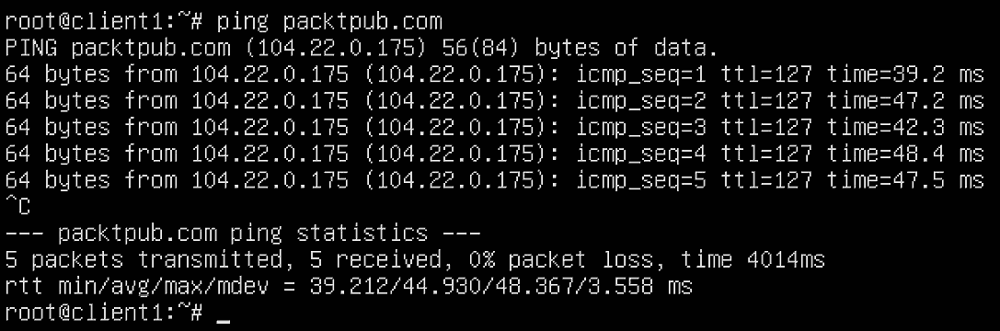

图 4.40 – 检查配置是否正常

所以，连接正常。现在让我们配置 client2。我们的 CentOS 虚拟机 `client2` 有一个网络接口叫做 `ens39`。我们将它设置为 `network2` 子网的一部分（我们在 `server1` 上定义了该子网）。假设 client2 将临时使用 `192.168.2.2/24` 作为它的 IP 地址：

```
nmcli connection add con-name network2 ifname ens39 type ethernet ipv4.address 192.168.2.2/24 gateway 192.168.2.254 ipv4.dns 8.8.8.8,8.8.4.4
nmcli con reload network2
```

我们之前已经将 `server1` 配置为默认网关，因此 `client1` 和 `client2` 可以愉快地将其作为默认网关并访问外部网络。我们可以通过 `ping` 命令轻松测试这一点。我们以 `client2` 为例：

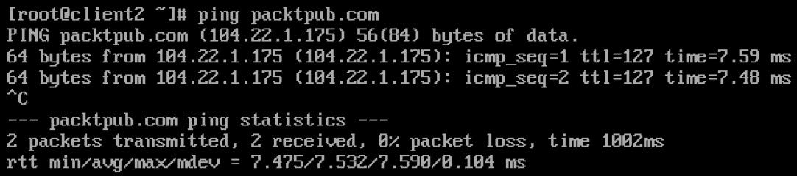

图 4.41 – 配置更改后检查配置是否正常工作

现在我们已经验证了所有配置都正确，让我们现在检查一些可能需要额外网络故障排除的不同场景：

+   `ping`到外部主机不工作，但外部网络访问正常。

+   外部网络访问不正常。

+   无法在两个子网之间路由。

+   名称解析未正常工作。

让我们从第一个场景开始。通常，这是防火墙配置设置（我们特意不称其为问题）。让我们首先 ping 一下我们想要访问的网站：

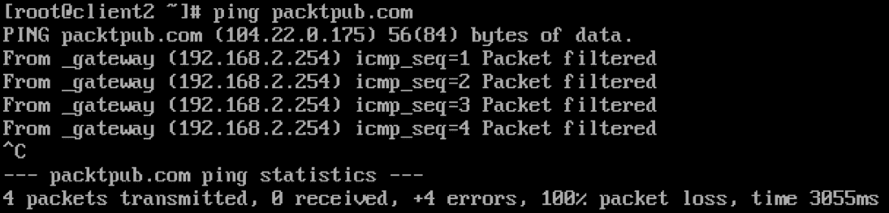

图 4.42 – 场景开始 – ping 不工作

同时，如果我们尝试从浏览器访问`packtpub.com`，则没有任何问题：


图 4.43 – 浏览器中可以工作

这种类型的问题很常见 – 从`ping`的输出中，我们可以看到，从我们的 client2 到`packtpub.com`的路径上经过的防火墙在过滤`ping`（**ICMP**，或**Internet Control Message Protocol**）流量。这没有什么好担心的，尽管可能会有些困惑。我们需要记住，ping/ICMP 流量与 HTTP(S)/TCP 流量无关，这些协议可以分别进行过滤。这正是这里所做的 – 过滤了 ping/ICMP 流量，而 HTTP(S)/TCP 流量则没有被过滤。

现在让我们增加一些复杂性，通过一个外部网络访问不可用的场景来进行一些检测，让我们尝试从 client2 和`server1` ping Google 的 DNS 之一，只是为了看看症状：

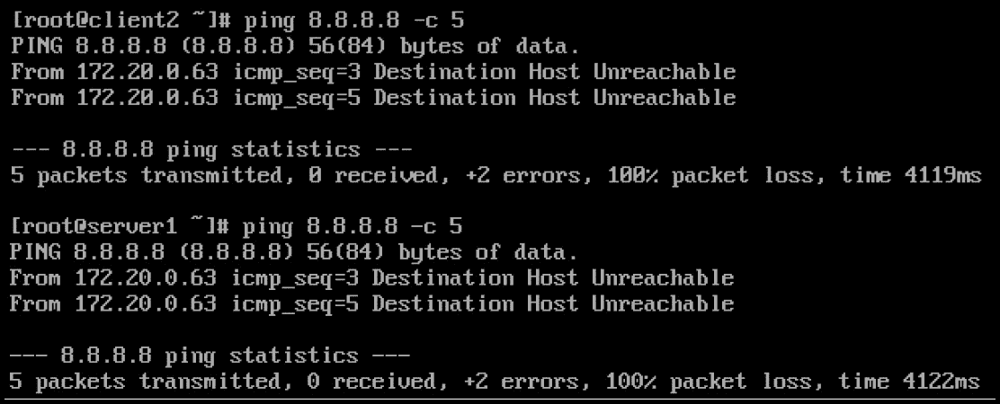

图 4.44 – 外部网络访问不工作

如果网络客户端（client2）无法访问外部网络，那是一回事。如果默认网关（在我们这里是`server1`）无法访问外部网络，那就完全不同了。这指向了一个更大的问题，如果我们没有触及防火墙配置和其他网络设备，那可能是与**互联网服务提供商**（**ISP**）的连接或 ISP 端的某些问题。

我们可以通过使用额外的工具，如**traceroute**或**tracepath**，进行更多的侦探工作：

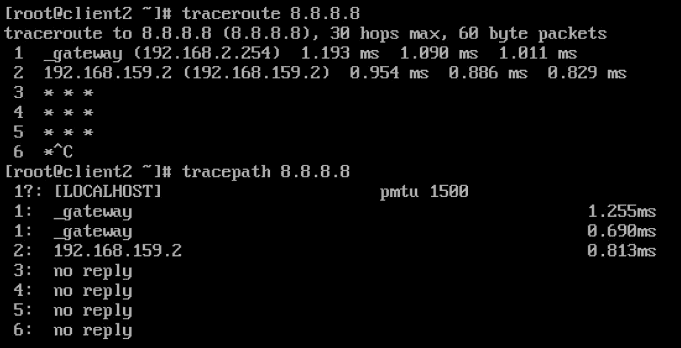

图 4.45 – 进一步验证外部网络访问不工作

如果我们使用外部 DNS 服务器，甚至可以使用`nslookup`、`host`或`dig`命令几乎可以确定问题在于互联网访问，而非我们的客户端或服务器：


图 4.46 – resolv.conf 配置正确；DNS 名称解析不工作

假设问题出在连接 `server1` 和 ISP 路由器的那根电缆断了。当我们更换那根电缆时，`ping` 应该能够正常工作，如下所示：

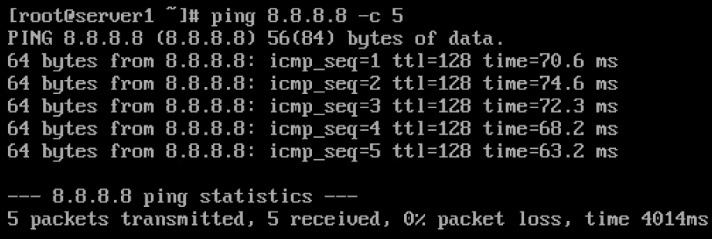

图 4.47 – 连接再次正常工作

现在，让我们检查一个无法从一个子网到另一个子网的场景。我们将以 network1 和 network2 为例 —— 所以，我们将使用 client2（`192.168.2.2/24`）来尝试访问 client1（`192.168.1.1/24`）。由于这两个主机*不*属于同一个第二层网络，我们必须有某种机制来*路由*它们之间的流量。让我们检查一下路由配置是否正常：


图 4.48 – 跨子网的路由工作正常

如之前所配置，我们允许在 `server1` 上转发所有网络之间的流量。我们通过允许伪装（masquerading）并将所有接口放入公共 `firewalld` 区域来实现这一点。有时候，当我们配置路由设备时，会犯一些错误。我们的错误可能导致两个网络之间无法再进行通信（通常是两个 VLAN，因为我们在这里讨论的是内部网络的场景）。让我们看看症状：

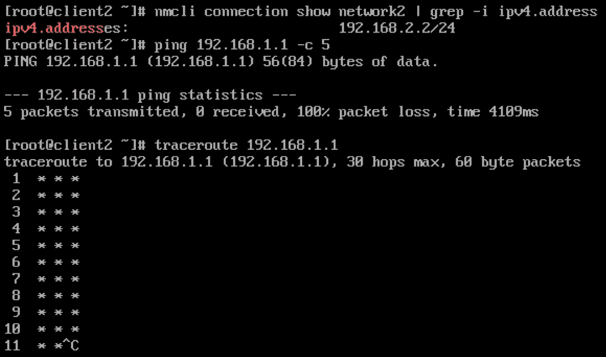

图 4.49 – 路由不再工作

如果我们通过使用 `netstat -rn` 命令检查路由表，我们可以看到以下信息：

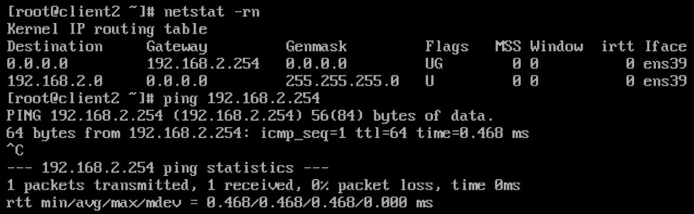

图 4.50 – 检查我们的 Linux 机器上的路由是否设置正确，确实设置正确

所以，我们的网关是正常工作的（我们可以 ping 通它），但它没有正确地将我们转发到 `192.168.1.0/24` 网络。看到我们将 `192.168.1.0/24` 网络配置为 `server1` 的本地网络，很明显我们在这里遇到了一些路由问题。可能是 `firewalld` 配置错误，导致 `firewalld` 服务被停止，或者是路由表配置错误，亦或是有人修改了 `/proc` 文件系统并将 `ip_forward` 标志重置为 `0`。无论是哪种情况，问题的根源在于我们的默认网关。在大型企业中，通常有网络团队负责这些事情，因此将 `ping`、`traceroute` 和 `netstat` 的输出提供给他们，应该能帮助他们找到问题所在（在他们的责任范围内）。我们通常会告诉他们，在 VLAN X（子网 1）和 VLAN Y（子网 2）之间存在 VLAN 路由问题，发送这些命令的输出给他们，让他们从那里着手解决。

最后，我们将通过讨论一些名称解析问题来结束这个教程。这些问题可能由于服务配置错误（例如 `systemd-resolved`）、错误的 `/etc/resolv.conf` 配置，甚至是我们自己配置的 `/etc/hosts` 文件而发生。让我们来看看一些常见问题。

首先，我们将编辑 client1 上的 `/etc/resolv.conf` 并添加一些自定义的 DNS 服务器。然后，我们将重启 client1 的 Linux 虚拟机，查看在检查 `/etc/resolv.conf` 内容时会发生什么。这是重启前的截图（我们添加了两个名称服务器，`8.8.8.8` 和 `8.8.4.4`）：


图 4.51 – 手动编辑 /etc/resolv.conf

下面的截图是重启后的结果。我们可以清楚地看到，这个文件的内容已经被更改：


图 4.52 – 重启后的 /etc/resolv.conf

这是预期的结果——正如我们在之前的教程中描述的那样，在运行 `systemd-resolved` 的 Linux 机器上更改 `/etc/resolv.conf` 总是会以这种方式结束。如果我们想要更改 DNS 设置，我们需要正确操作。这意味着在 CentOS 中使用 `nmcli`，在 Ubuntu 中使用 netplan 配置。这个问题可能只是*本地*问题，但在涉及 `split-dns` 的各种场景中，它仍然可能会产生很大影响。

接下来的问题将是相反的——假设我们在 Ubuntu 机器上安装了 `resolvconf` 包，禁用了 `systemd-resolved`，并像这样配置了 `/etc/resolv.conf`：


图 4.53 – 在 /etc/resolv.conf 中放入错误的配置选项

当我们尝试使用 `nslookup`、`host` 或 `dig` 命令解析某些内容时，虽然我们的互联网连接正常（如通过在 `nslookup` 中手动配置 DNS 服务器所示），但最终什么也解析不出来：

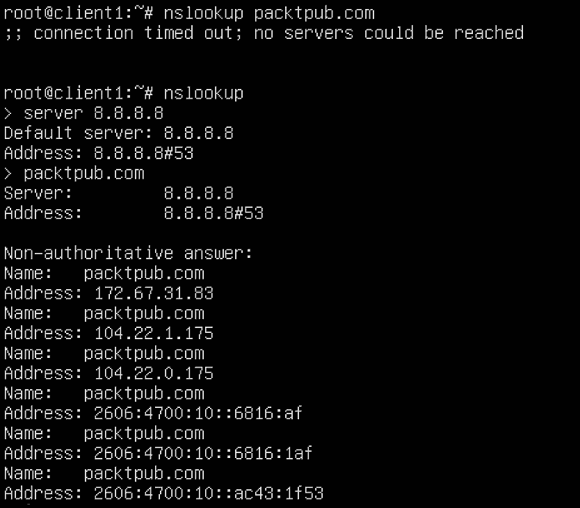

图 4.54 – 网络显然工作正常，但 DNS 名称解析不行，这指引我们走向正确的方向

这显然指向了错误的 DNS 服务器配置，因为虽然互联网连接正常，但我们无法解析主机。很明显我们使用的选项（`namserver`）是错误的——应该是`nameserver`。这让我们意识到：我们必须始终确保配置文件的语法正确——在这个案例中是`resolv.conf`。如果我们通过文本编辑器进行更改，错误很容易发生，尤其是当我们忽视了例如在 vi 中标记为红色的高亮字段时。如果我们使用命令来配置并在语法上犯错（例如使用`nmcli`或`netplan`），我们会在某个地方遇到错误，并且这个错误很容易调试。

我们要处理的最后一种情况是，对于那些从一个提供商迁移公共网站到另一个提供商，从而更改公共 IP 地址的人来说，这是一个常见的情况。在配置这些场景时，我们通常需要在测试新网站时保持旧网站的运行。我们可以在公共 DNS 服务器中有两个 IP 地址条目，指向两个不同的 Web 服务器，但这永远不是我们想要的。这样会让我们的访问者和我们自己都感到困惑。因此，我们希望能有一种快速的方式来测试新网站，直到它完全调试完毕，同时允许公众访问旧网站。

显然，最简单的做法是向`/etc/hosts`添加一个条目，指向新网站。然后，在我们进行该更改的同一台机器上，我们可以根据需要调试新网站——公共 DNS 记录仍然指向旧网站，而我们的本地机器则访问新网站。

调试过程完成后，我们需要进行切换——我们需要更改公共 DNS 记录并删除调试机器上的`/etc/hosts`条目。这是一个理想的场景，我们可以在其中犯一些错误。于是，我们去公共 DNS 提供商处，更改我们网站的 IP 地址，使其指向新的 IP 地址，并保存配置。接着，我们到本地调试机器上，删除指向新网站的`/etc/hosts`条目，启动一个 Web 浏览器，访问我们网站的 URL——然后，奇迹般地——我们仍然看到的是旧网站。这是怎么回事？

一个简单的事实是，公共 DNS 记录需要一些时间才能生效。这可能是一分钟、十五分钟、一小时、一天——取决于配置方式，但无论如何，它需要时间。此外，从世界各地的不同地方——如果我们的网站面向国际受众——同步所需的时间可能不同，这也是我们在处理类似情况时需要保持耐心的原因，因为我们可能会收到一些关于此情况的邮件。我们只需要在周末进行这些类型的配置更改，那时网站访问量最低，然后等待所有 DNS 记录同步。从我们更改 DNS 记录的时刻起，直到一切正常工作，这个过程超出了我们的控制范围。这就是它的工作方式。

从这些例子中，您可以清楚地看到，作为 Linux 服务器、客户端和网络的管理员，可能会遇到许多不同的场景。

## 它是如何工作的

我们在本节中讲解的所有命令都基于同一个理念——我们有一个网络栈，它要么配置正确，要么配置错误。如果配置正确，我们通常不需要使用这些命令，但如果某些配置错误和/或无法正常工作，可能是由于各种外部原因导致的，那么我们就需要了解这些命令是如何工作的。

如果我们一般讨论网络，有几个广为人知的概念：配置的 IP 地址、子网掩码、网关、DNS 服务器，以及任何给定 Linux 服务器的完全合格域名。记住，网络被隔离成多个子网，而 DNS 是一个层次结构，如果这些概念中的任何一个配置不正确，我们就会遇到网络通信问题。这就是为什么我们大多数系统工程师特别小心地配置所有这些设置，因为它们是避免我们永远头疼的基础。

当我们使用`ping`、`traceroute`和`tracepath`时，我们生成的所有流量要么到达本地网络，要么到达非本地网络，而后者需要路由。在路由之上，防火墙可能会成为障碍——有时人们会配置防火墙，拒绝 ICMP 流量。

然后，即使这些都按预期工作，DNS 就像一个绝地大师坐在其上，试图平衡“原力”。有时，它似乎有点邪恶，仿佛没有任何原因就来烦我们。这时，像`nslookup`、`host`和`dig`这样的工具就派上用场了——它们可以帮助我们弄清楚问题是出在网络堆栈中的*较低*层，还是出在 DNS。正如我们在前面的教程中讨论的，使用`systemd-resolved`改变了 DNS 配置的许多方面。当我们使用它时，我们必须格外小心配置，否则使用`nmcli`和 netplan 的配置文件时，我们不应随意去编辑文件。否则只会制造更多问题。

话虽如此，当我们正确配置一切，而网络上的其他设备（无论是我们的网络还是外部网络）出现故障时，问题可能会迅速变得复杂。如果执行网络路由的设备（如交换机、路由器、Linux 服务器、防火墙等）配置不正确，我们将无法在多个子网之间进行通信。试想一下，如果你不知道路从巴黎到巴塞罗那的路线，如何前往那座城市。就像我们在路由中有许多不同的路径，从巴黎到巴塞罗那有很多可能的路线，我们无法知道选择哪一条。通常，我们的故障排除过程是先通过 ping 测试网络上的某些地址（检查本地网络是否正常工作），然后检查默认网关，最后确认 DNS 是否作为服务可用。从个人角度来说，多年来我看到学生和课程参与者越来越清楚地意识到，DNS 作为一个系统有多复杂，尤其是在大规模部署时。我们学校有一句话，学生们总是反复说——*总是 DNS*。因此，我们需要确保我们在 DNS 知识和理解路由工作原理方面有坚实的基础。这样，一切就变得简单多了，因为将这两个概念结合起来可能会变得极其复杂，尤其是在涉及到动态路由协议，如 BGP、EIGRP 和 OSPF，同时又有分割 DNS 和多个位置的情况下。

本章到此结束。下一章将全部介绍如何使用 shell 来管理我们 Linux 系统上的软件包。我们将讨论如何使用`apt`和`apt-get`、`yum`以及`dnf`，软件仓库，以及与软件管理相关的其他主题。在那之前，我们向你告别！

## 还有更多

如果你需要学习更多关于网络故障排除的知识，可以查看以下链接：

+   Linux 网络故障排除初学者指南：[`www.redhat.com/sysadmin/beginners-guide-network-troubleshooting-linux`](https://www.redhat.com/sysadmin/beginners-guide-network-troubleshooting-linux%0D)

+   五个 Linux 网络故障排除命令：[`www.redhat.com/sysadmin/five-network-commands`](https://www.redhat.com/sysadmin/five-network-commands%0D)
