# *第五章*：使用命令进行文件、目录和服务管理

在处理文件和文件夹时，使用`systemctl`命令。这正是我们将在本章中覆盖的内容，通过以下操作步骤：

+   基本的文件和目录命令

+   用于操作文件/目录安全性方面的附加命令

+   查找文件和文件夹

+   使用命令操作文本文件

+   归档和压缩文件及文件夹

+   管理服务和目标

# 技术要求

对于这些操作，我们将使用一台 Linux 机器——在我们的例子中，使用`cli1`。我们只需要确保它已开机。

# 基本的文件和目录命令

让我们讨论一些常用的 shell 命令，用于操作文件和目录。简而言之，我们关注的命令有：

+   `ls`——用于列出文件夹内容

+   `touch`——用于创建一个空的文本文件

+   `cd`——用于切换目录，可以使用绝对路径或相对路径

+   `pwd`——用于显示当前目录

+   `mkdir`和`rm`——用于创建和删除文件或目录

+   `cp`和`mv`——用于复制或移动文件或目录

+   `ln`——用于操作软链接和硬链接

这些命令是系统管理员/工程师日常工作中最常用的命令之一。让我们看看它们的具体用法。

## 做好准备

我们需要通过这些命令来真正理解它们在执行时对文件系统的影响。所以，确保我们的`cli1`机器正在运行，让我们开始吧！

## 如何执行……

从最简单的命令`ls`开始，它的作用是查看文件夹内容。因此，如果我们希望以清晰易读的格式查看某个目录的内容，可以这样操作：

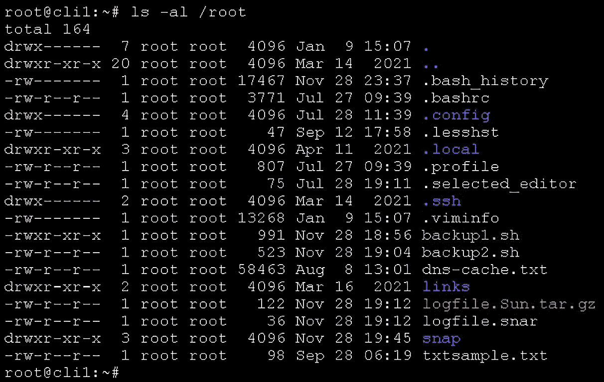

图 5.1 – 使用最常见选项的 ls

*清晰易读*的效果是通过使用`-la`选项实现的，其中`l`选项代表*长格式列出*，`a`选项代表*所有文件（包括以点开头的文件）*。我们还可以看到，默认情况下，`ls`命令会对输出内容进行颜色标记。例如，文件夹以蓝色显示，而以红色标记的文件是归档文件（在此案例中为`tar.gz`文件）。稍后，当我们开始处理归档和压缩文件及文件夹时，我们将深入探讨归档文件。`ls`命令在默认输出中使用了其他颜色。以下是一些示例：

+   绿色——可执行文件

+   青色——符号链接

+   黑底红字——损坏的链接

`ls`命令可以用于`/etc/network`，并且可以使用其递归选项（大写字母`R`）：

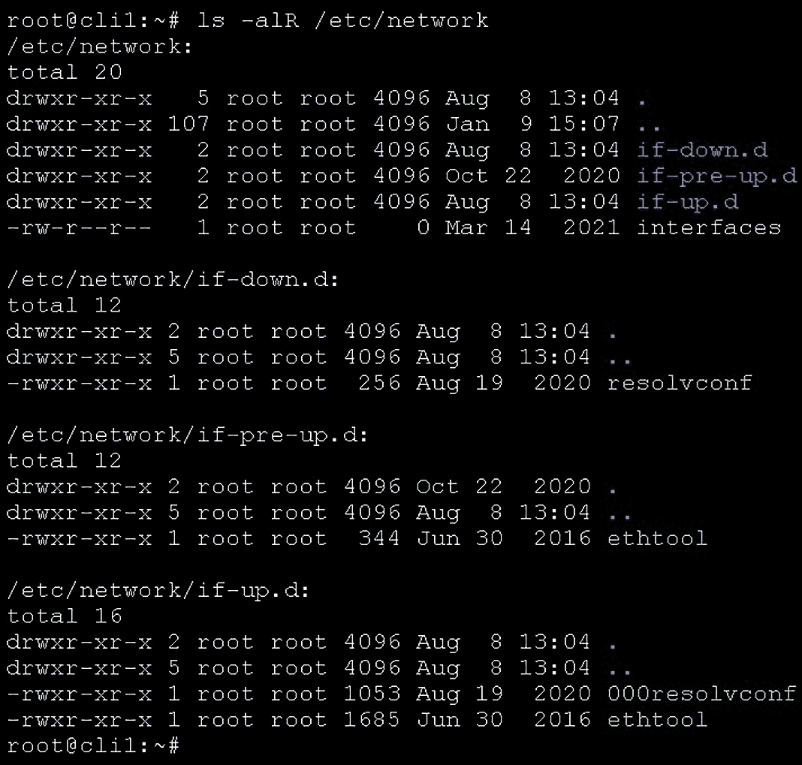

图 5.2 – 在递归模式下使用 ls

通过使用`R`选项，我们指示`ls`命令在递归模式下执行。

我们还可以使用`ls`来显示文件夹内容，并通过最后修改时间对输出进行排序：


图 5.3 – 按最后修改时间对`ls`输出进行排序

我们接下来要介绍的命令是`touch`，这是一个简单的命令。我们使用`touch`命令来创建一个空文件，如下所示：


图 5.4 – 在 Linux 中使用`touch`创建空文件

接下来，我们要解释两个紧密相关的命令——`cd`和`pwd`。`cd`，即*更改目录*命令，帮助我们离开一个目录并进入另一个目录。而`pwd`命令则告诉我们当前所在的目录。让我们用`/etc/network`作为示例，来实际操作一下：


图 5.5 – 使用`cd`和`pwd`来定位我们的目录

接下来我们要处理的两个命令是`mkdir`和`rm`。我们使用`mkdir`来创建目录，而`rm`命令用来删除文件或文件夹。接下来，我们通过一个示例来演示这两个命令的使用。首先，我们将创建一个名为`temporary`的目录。然后，在该目录中创建两个文件，分别命名为`tempfile`和`tempfile2`。之后，我们将删除`tempfile2`，然后递归地删除整个`temporary`目录及其所有内容。让我们现在来做这个操作：


图 5.6 – 使用`mkdir`和`rm`命令

我们接下来要讨论的话题是`cp`和`mv`命令——它们使我们能够在想要的地方复制或移动文件和/或文件夹。接下来，我们将复制一个文件和一个文件夹（递归地），然后将它们移动到其他地方。我们将使用与`mkdir`和`rm`相同的示例，但会稍作调整以适应本次操作。具体来说，我们将创建一个包含两个文件的目录，但这次这些文件将位于一个子目录中。然后，我们将向第一个文件夹添加更多文件，之后将单个文件复制并移动到新位置，再将整个文件夹移动到另一个位置。让我们看看如何实现：

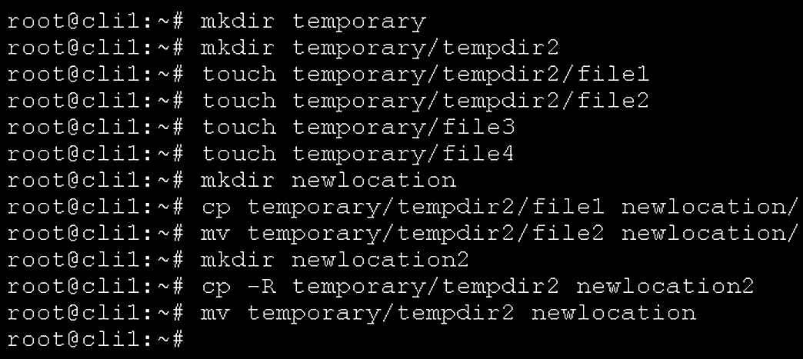

图 5.7 – 复制和移动文件与文件夹

前两个命令可以通过执行`mkdir -p temporary/tempdir2`合并成一个命令。

这将通过一个命令创建这两个目录。

最后，我们来讨论一下 `ln` 命令，它可以用来创建硬链接（指向文件内容的指针）和软链接（指向文件/文件夹名称的指针，通常被称为快捷方式）。对于硬链接，我们只需使用不带任何附加选项的 `ln` 命令，而软链接则需要使用带有 `-s` 选项的 `ln` 命令。让我们创建一个示例来解释这个概念，完成这个示例后，我们将解释它是如何工作的。这个场景将包括以下内容：

+   将一个有一些内容的文件复制到新位置，这样我们就有了一个源文件，用于创建硬链接和软链接

+   创建硬链接

+   创建软链接

+   删除原始文件，然后检查软链接和硬链接发生了什么变化

+   复制原始文件的硬链接，然后检查软链接和硬链接发生了什么变化

操作步骤如下：

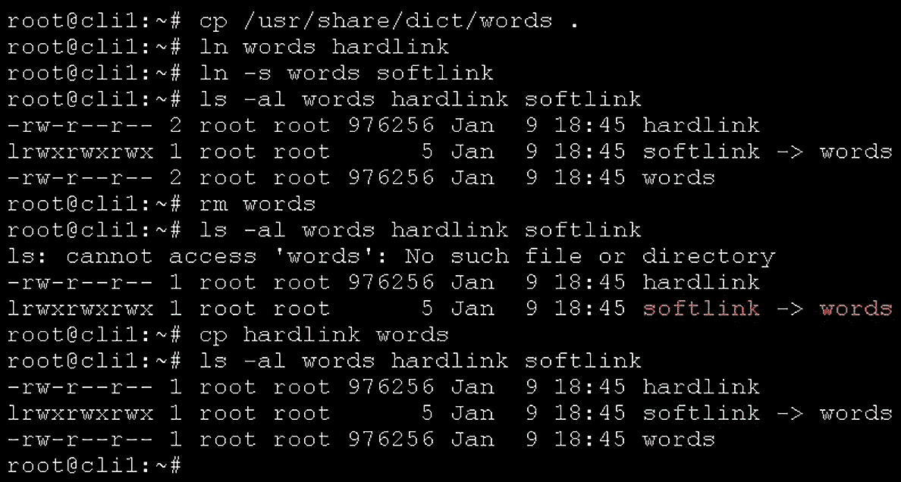

](img/Figure_5.8_B16269.jpg)

图 5.8 – 硬链接和软链接操作

现在我们已经经历了所有预定的场景，接下来让我们解释这些命令背后的一些概念，以便理解在执行它们时文件系统发生了什么。

## 它是如何工作的…

这些命令中有些非常直接，不一定需要进一步解释，比如 `ls`、`touch`、`cd`、`mkdir` 和 `pwd`。但其他一些命令则需要一点背景和技术解释，特别是 `ln`。因此，让我们以此为基础，逐步讲解 `rm`、`cp`、`mv` 和 `ln` 是如何工作的。

首先，介绍我们最常用的一些基本文件操作命令——`rm`、`cp` 和 `mv`。这些命令非常直接，我们用它们来删除文件或文件夹（`rm`）、复制文件或文件夹（`cp`）或移动文件或文件夹（`mv`）。请注意，我们在描述 `rm` 和 `mv` 时使用了*删除*和*移动*这两个词，因为它们是不同的——删除指的是删除文件，而移动指的是将文件放到其他地方。虽然这有时会让新手用户感到困惑，但其实不应该这样。

然而，从技术上讲，最具挑战性的命令是 `ln`，它要求我们先解释什么是软链接，什么是硬链接。所以，让我们先从这部分开始。

软链接通常指我们在 Windows 中所说的*快捷方式*，也就是说我们可以为文件或文件夹创建一个快捷方式。正如我们场景中的图片所示，当我们删除原始文件时，软链接停止工作。原因很简单——软链接指向的是*文件或文件夹的名称*。如果我们删除一个软链接指向的文件或文件夹，这就意味着软链接指向了不存在的内容。这就是为什么在我们的场景中，软链接会变成红色的原因。

硬链接是一个完全不同的概念。它们不指向文件名 – 它们指向*文件内容*。当使用硬链接时，试着将它们看作是指向相同内容的两个文件。如果我们删除了原始文件，文件内容仍然存在，因为这是现代文件系统的工作方式 – 它们不会浪费时间删除内容，特别是如果另一个文件仍然指向相同的内容。因此，文件删除操作只是从文件系统表中删除指针（文件名）到文件内容。文件系统会处理剩下的事情 – 当时间到来时，如果那个文件内容不再被使用，文件系统会用新内容覆盖它。

通过检查原始情景，我们可以得出这么多结论，我们可以清楚地看到软链接和硬链接之间的*大小差异* – 软链接指向文件名，因此与文件名的大小有关（文件名中字符的数量）。正如我们所解释的，硬链接指向文件内容，这就是为什么硬链接的大小与其指向的文件相同的原因。

这两个概念之间有两个基本差异。考虑到硬链接指向*文件内容*，它们不能指向目录（只能指向文件），并且不能跨分区。因此，如果我们将一个磁盘分区挂载到`/directory`，另一个磁盘分区挂载到`/home directory`。我们不能去`/home directory`并创建一个指向位于`/partition`中的文件的硬链接。一个分区无法看到另一个分区的内容，这是一个重要的安全概念。这也排除了跨分区的硬链接能够正常工作的可能性。

下一个示例将更深入地探讨文件目录安全概念，我们将讨论权限、特殊权限以及**访问控制列表**（**ACLs**）。这些概念是 IT 安全的核心概念，也是我们日常处理的内容。所以，让我们接下来通过一个相关的场景来了解一下。

## 另见

如果您需要更多关于这些命令的信息，建议您访问这些链接：

+   `ls` 手册页面：`https://man7.org/linux/man-pages/man1/ls.1.html`

+   `touch` 手册页面：`https://man7.org/linux/man-pages/man1/touch.1.html`

+   `cd` 手册页面：`https://linuxcommand.org/lc3_man_pages/cdh.html`

+   `pwd` 手册页面：`https://man7.org/linux/man-pages/man1/pwd.1.html`

+   `mkdir` 手册页面：`https://man7.org/linux/man-pages/man1/mkdir.1.html`

+   `rm` 手册页面：`https://man7.org/linux/man-pages/man1/rm.1.html`

+   `cp` 手册页面：`https://man7.org/linux/man-pages/man1/cp.1.html`

+   `mv` 手册页面：`https://linux.die.net/man/1/mv`

+   `ln` 手册页面：`https://man7.org/linux/man-pages/man1/ln.1.html`

# 附加命令以操作文件/目录安全方面

在这个例子中，我们将使用我们的用户——Jack、Joe、Jill 和 Sarah——来创建一个特定的场景，解释权限、ACL 和 umask 的使用。以下是这些概念的简要解释：权限用于控制对文件和文件夹的访问，包括读取、写入和执行模式。由于权限的粒度有限，开发了 ACL 概念，以便能够在更细粒度的级别上管理权限。Umask 是一个变量，预先决定了将分配给新创建的文件或目录的权限。

该方案将如下进行：

+   我们需要为我们的学生创建一个共享目录，位于`/share/students`

+   我们需要为我们的教授创建一个共享目录，位于`/share/professors`

+   学生组的成员需要能够访问`/share/students`文件夹，以便共同协作项目文件

+   学生组的成员可以在`/share/students`文件夹中创建新的文件，这些文件需要由学生组拥有

+   学生组的一个成员不能使用`rm`命令删除`/share/students`文件夹中其他成员的文件

+   学生组的一个成员必须有权限编辑`/share/students`文件夹中其他成员的文件

+   教授需要对所有学生文件以及所有新创建的学生文件具有读写权限

+   只有教授才能访问他们的共享文件夹`/share/professors`，在该文件夹中，他们可以删除彼此的文件、读取文件并编辑文件。

让我们开始这个实例吧。

## 准备工作

我们将使用`cli2`机器（CentOS）进行本例，因此请确保该机器已开启。

## 如何操作…

我们将首先通过使用`useradd`和`groupadd`命令来创建用户和组，基于一个场景。假设我们的任务如下：

+   创建四个用户，分别为`jack`、`joe`、`jill`和`sarah`

+   创建两个用户组，分别为`profs`和`pupils`

+   重新配置`jack`和`jill`用户账户，使其成为`profs`组的成员

+   重新配置`joe`和`sarah`用户账户，使其成为`students`组的成员

+   为所有账户分配一个标准密码（我们将使用`P@ckT2021`作为密码）

+   配置用户账户，以便他们在下次登录时必须更改密码

+   为教授用户组设置特定的过期数据——密码更改前的最短天数应设置为`15`，强制密码更改前的最大天数应设置为`30`，密码更改警告需要在密码过期前一周开始，账户的过期日期应设置为 2023 年 1 月 1 日（2023/01/01）

+   为学生用户组设置特定的过期数据——密码更改前的最短天数应设置为`7`，强制密码更改前的最大天数应设置为`30`，密码更改警告需要在密码过期前 10 天开始，账户的过期日期应设置为 2022 年 9 月 1 日（2022/09/01）

+   将`profs`组修改为`professors`，并将`pupils`组修改为`students`。

    注意

    这篇食谱中有很多命令，所以确保参考食谱中的*如何工作…*部分，以了解我们之前没有使用过的命令的相关内容。

第一个任务是创建用户账户，为其分配唯一的主目录，并将 Bash shell 设置为默认 Shell：

```
useradd -m -s /bin/bash jack
useradd -m -s /bin/bash joe
useradd -m -s /bin/bash jill
useradd -m -s /bin/bash sarah
```

这将为这四个用户在`/etc/passwd`文件中创建条目（该文件存储了大多数用户信息——用户名、用户 ID、组 ID、默认主目录和默认 Shell），以及在`/etc/shadow`文件中创建条目（该文件存储了用户的密码和过期信息）。

然后，我们需要创建组：

```
groupadd profs
groupadd pupils
```

这将为这些组在`/etc/group`文件中创建条目，系统会在该文件中保留所有的系统组。

下一步是管理用户组的成员资格，包括教授组和学生组。在我们开始之前，需要了解一个事实。存在两种不同的本地组类型——*主组*和*附加组*。*主组*在创建新文件和目录时至关重要，因为默认情况下，用户的主组将用于这些操作（当然也有例外，我们将在本章的食谱 #4 中提到，关于 umask、权限和 ACLs 的内容）。

*附加组*在处理文件和文件夹共享以及相关的场景和异常时非常重要。这通常用于一些更高级场景的附加设置。将在本章前面提到的食谱 #4 中部分解释这些场景，以及在*第九章*《Shell 脚本介绍》中的 NFS 和 Samba 相关食谱中进一步说明。

主组和附加组存储在`/etc/group`文件中。

既然我们已经搞定了这一点，让我们修改用户的设置，使其属于场景中指定的*附加组*：

```
usermod -G profs jack
usermod -G profs jill
usermod -G pupils joe
usermod -G pupils sarah
```

现在让我们检查一下这如何改变`/etc/group`文件：


图 5.9 – `/etc/group` 文件中的条目

`/etc/group` 文件中的前四个条目实际上是在我们使用`useradd`命令创建这些用户账户时生成的。接下来的两个条目（除了`:`符号后面的部分）是由`groupadd`命令创建的，而`:`符号后的条目是在`usermod`命令之后创建的。

现在让我们设置他们的初始密码，并在下次登录时强制要求更改密码。我们可以通过几种不同的方式来做到这一点，但我们先通过回显一个字符串并将其作为用户账户的明文密码来学习一种更*程序化*的方式：

```
echo "jack:P@ckT2021" | chpasswd
echo "joe:P@ckT2021" | chpasswd
echo "jill:P@ckT2021" | chpasswd
echo "sarah:P@ckT2021" | chpasswd
```

这不一定是我们推荐的做法，因为它会将这些命令留在命令历史记录中。我们只是将其作为一个示例。

`echo`部分——没有其他命令——只会将`P@ckT2021`输入到终端中，如下所示：

```
echo "P@ckT2021"
P@ckT2021
```

在 CentOS 和类似的发行版中，我们可以使用带有`--stdin`参数的`passwd`命令，这意味着我们希望通过标准输入（键盘、变量等）为用户账户添加密码。而在 Ubuntu 中，这个功能不可用。因此，我们可以将`username:P@ckT2021`字符串回显到`shell`，并通过管道传递给`chpasswd`命令，这样就能达到目的——`chpasswd`命令不会将该字符串输出到终端，而是将其作为标准输入处理。

现在让我们设置教授和学生的过期日期。为此，我们需要学习如何使用`chage`命令以及它的一些参数（`-m`、`-M`、`-W`、`-E`）：

+   如果我们使用`-m`参数，这意味着我们希望指定密码更改前的最小天数。

+   如果我们使用`-M`参数，这意味着我们希望在强制密码更改之前指定最大天数。

+   如果我们使用`-W`参数，这意味着我们希望设置密码过期前的警告天数，这反过来意味着 shell 将开始向我们抛出关于密码即将过期的消息，提醒我们需要更改密码。

+   如果我们使用`-E`参数，这意味着我们希望将账户过期设置为某个特定日期（格式为 YYYY-MM-DD）。

现在让我们将其转换为命令：

```
chage -m 15 -M 30 -W 7 -E 2023-01-01 jack
chage -m 15 -M 30 -W 7 -E 2023-01-01 jill
chage -m 7 -M 30 -W 10 -E 2022-09-01 joe
chage -m 7 -M 30 -W 10 -E 2022-09-01 sarah
```

最后，让我们通过将组名从`professors`修改为`profs`，并将`students`修改为`pupils`，来调整组的最终设置：

```
groupmod -n professors profs
groupmod -n students pupils
```

这些命令只会更改组名，而不会更改其他数据（如组 ID），这也会反映在我们的用户信息中：

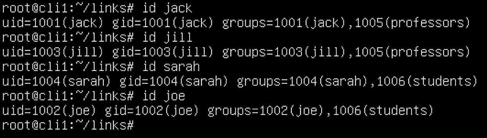

图 5.10 – 检查已创建用户的设置

如我们所见，`jack`和`jill`是现在被称为`professors`的组的成员，而`joe`和`sarah`现在是`students`组的成员。

我们故意将`userdel`和`groupdel`命令放在最后，因为它们有一些注意事项，不应该轻易使用。让我们创建一个名为`temp`的用户和一个名为`temporary`的组，然后删除它们：

```
useradd temp
groupadd temporary
userdel temp
groupdel temporary
```

这样是完全可行的。问题是，由于我们使用了没有任何参数的`userdel`命令，它将保留用户的主目录不变。由于用户的主目录通常存储在`/home`目录中，默认情况下，这意味着`/home/temp`目录仍然存在。当删除用户时，有时我们希望这样做——删除用户，但不删除他们的文件。如果你特别想删除用户账户以及该用户账户的所有数据，请使用`userdel -r username`命令。但在这样做之前请三思！

此外，我们显然需要创建一堆目录和文件，并且更改一大堆权限和访问控制列表（ACL）。作为一般说明，`chmod`命令用来更改权限，而`setfacl`命令则用来修改 ACL。这是正确的操作方法：

```
mkdir -p /share/students
mkdir /share/professors
chgrp students /share/students
chmod 3775 /share/students
setfacl -m g:professors:rwx /share/students
chgrp professors /share/professors
chmod 2770 /share/professors/
setfacl -m d:g:professors:rwx /share/students/
```

现在让我们来测试一下是否有效。首先，我们将以两名学生账户（`joe`和`sarah`）登录并创建一些文件。然后我们将使用 Joe 的账户尝试删除 Sarah 的文件，反之亦然，所以我们首先应该使用`su`命令登录为`joe`，`su - joe`，并输入 root 密码。

让我们看看这个如何工作：

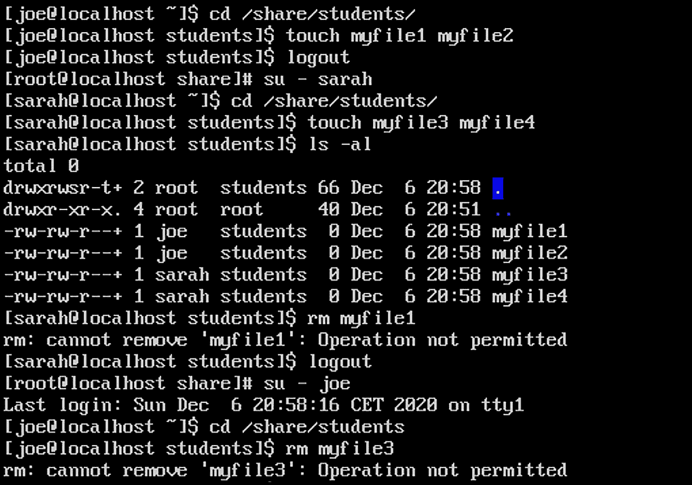

Figure 5.11 – 从学生的角度来看，场景完美无缺

我们的场景要求我们能够编辑彼此的文件，同时又不能完全删除它们。现在让我们来测试一下：

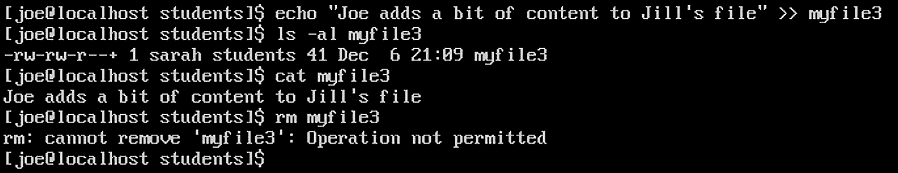

Figure 5.12 – 修改文件内容有效，而删除文件无效

我们之所以选择这种场景，是有原因的——这是文件服务器管理员常常遇到的现实场景。它基本上是“两个世界的最佳结合”——协作有效，但用户不能意外删除彼此的文件。因此，这个方案涵盖了文件服务器上最常见的一些问题，例如某个用户不小心删除了另一个用户的文件（这里的关键点是*没有删除文件的意图*）。这种情况我们每个人都遇到过。另一方面，改变文件的内容是我们只能*有意*、*自觉*地做到的。这也是我们可以通过文件系统审计和文件属性轻松跟踪的事情，前提是我们设置了这样的系统。

现在让我们从教授的角度来回顾一下。我们将使用`jill`账户来进行此操作：

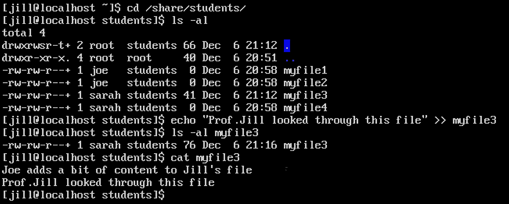

Figure 5.13 – 检查我们的配置是否对 Jill 有效

我们还需要检查教授的共享文件夹是否正常工作。让我们来测试一下：

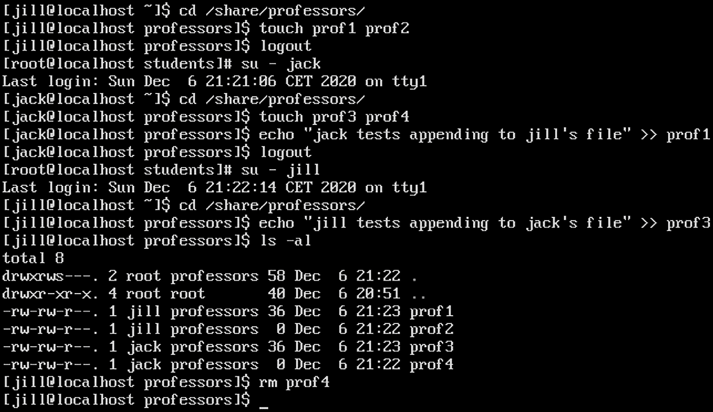

Figure 5.14 – 从教授的角度来看，他们的共享文件夹按预期工作

让我们尝试使用学生账户访问教授的共享文件夹：

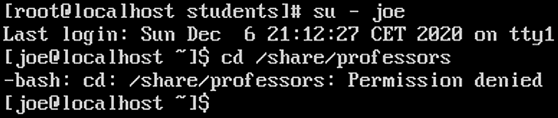

Figure 5.15 – 一名学生尝试访问教授的共享文件夹，但被拒绝访问

我们还可以看到，用户创建的这些文件得到了`664`的默认权限。这就是 umask 的作用。请查看本方案的*它是如何工作的……*部分，了解 umask 的工作原理。

所以，整个场景是有效的，但它到底是怎么工作的呢？让我们来查看一下。

## 它是如何工作的……

在详细解释这些命令之前，我们先了解一些基础知识，并描述我们已使用过的命令：

+   `useradd` – 用于创建本地用户账户的命令

+   `usermod` – 用于修改本地用户账户的命令

+   `userdel` – 用于删除本地用户账户的命令

+   `groupadd` – 用于创建本地用户组的命令

+   `groupmod` – 用于修改本地用户组的命令

+   `groupdel` – 用于删除本地用户组的命令

+   `passwd` – 最常用来为用户账户分配密码的命令，但它也可以用于其他一些场景（例如，锁定用户账户）

+   `chage` – 用于管理用户密码过期的命令

+   `chgrp` – 用于更改文件或文件夹的组所有权的命令

+   `chmod` – 改变文件或文件夹权限的命令

+   `setfacl` – 改变文件或文件夹 ACL 的命令

现在我们已经讨论过这些命令，让我们来解释一些细节。

Linux 文件系统中的每个文件或目录都有一组属性：

+   权限

+   所有权

+   文件大小

+   创建日期

+   文件/目录名称

在这个教程中，我们将重点讨论权限和所有权，因为这是本教程的核心内容。当我们在`/share/students`目录下执行命令`ls -al`时，得到的结果如下：

```
[root@localhost students]# ls -al
total 4
drwxrwsr-t+ 2 root  students 66 Dec  6 21:12 .
drwxr-xr-x. 4 root  root     40 Dec  6 20:51 ..
-rw-rw-r--+ 1 joe   students  0 Dec  6 20:58 myfile1
-rw-rw-r--+ 1 joe   students  0 Dec  6 20:58 myfile2
-rw-rw-r--+ 1 sarah students 76 Dec  6 21:16 myfile3
-rw-rw-r--+ 1 sarah students  0 Dec  6 20:58 myfile4
```

现在我们以`myfile1`的输出作为例子。从左到右读取，`-rw-rw-r--+`部分与该文件的权限相关。第二部分（`joe`，后接`students`）与该文件的所有权相关。

让我们先从权限部分开始解析一下：

+   第一个`-`表示这是一个文件——这个字段用于表示内容的类型。

+   第一个`rw-`表示文件所有者（`joe`）对该文件具有读写权限——我们称之为用户类（u）。

+   第二个`rw-`表示我们对组所有者（`students`）具有读写权限——我们称之为组类（g）。

+   `R—`表示其他用户只有读权限——我们称之为`others`（o）类。

+   末尾的`+`表示该文件上有一个活跃的 ACL（稍后将在此解释）。

我们可以给这些权限分配数字值（权重）。读权限的权重是 4（22），写权限的权重是 2（21），执行权限的权重是 1（20）。

所以，如果我们想给所有用户类（用户所有者、组所有者、其他用户）分配所有权限，我们会使用如下命令：

```
chmod 777 file_name
```

为什么？因为如果我们加上 4+2+1，结果是 7。那意味着读+写+执行。而我们可以将这个值应用于所有三类用户——u、g 和 o——所以这给我们带来了 777。第一个`7`代表`u`（用户所有者），第二个代表`g`（组所有者），第三个代表其他用户（others）。这大大简化了权限管理。

如果我们谈论的是文件，这些权限的含义是直接的——读取意味着读取，写入意味着写入、删除和修改，执行意味着能够启动文件。

对于目录来说，情况变得有些复杂。为了能够读取目录内容并通过目录（目录遍历），我们需要的默认权限是读取权限和执行权限。对目录进行写权限和读取权限是列出目录内容所需要的，而执行权限是用于遍历目录（能够进入该目录的子文件夹）。写权限意味着在文件夹层级上对该文件夹中的文件进行写入、删除和修改（除非有明确的拒绝设置，例如，通过 ACL 设置）。

如你在命令输出中清晰看到，文件有两种所有权类型：

+   `joe`

+   `students`

那这意味着什么？

它意味着一个名为 *Joe* 的用户拥有该文件。同时，它也意味着一个名为 *students* 的组从组的角度拥有该文件。

现在让我们继续讨论输出的第二行，具体来说：

```
drwxrwsr-t+ 2 root  students 66 Dec  6 21:12 .
```

相同的原则适用，只不过我们需要讨论一些新的设置。我们可以清楚地看到一些我们之前没有提到的字母——组所有权类中的 `s`，以及其他类中的 `t`。这是什么意思？

问题是，在读取（r）、写入（w）和执行（x）之外，还有一些额外的特殊权限。这些是用于特殊用例的：

+   `粘性位` – 我们在文件夹级别设置这个特殊权限。当在文件夹级别启用时，它可以防止我们场景中的文件被意外删除。例如，`myfile1` 是由用户 `joe` 所拥有的。尽管 `sarah` 是同一组（学生组）的成员，并且该组拥有文件，但她仍然无法删除该文件。这就是粘性位的作用。

+   `setgid` – 我们也在文件夹级别设置这个特殊权限。当在文件夹级别设置时，这个特殊权限意味着所有新创建的文件（在设置了 `setgid` 后）将继承父文件夹的组所有权。在我们的场景中，这意味着所有新创建的文件将由学生组作为组所有者，这符合场景的要求。这就是为什么我们在文件夹级别使用 `chgrp` 命令来将文件夹所有权设置为学生组。

+   `setuid` – 现在几乎不再使用，因为它是一个安全隐患。它曾经在文件上使用，特别是为了让当文件由非拥有者用户启动时，看起来是拥有该文件的用户启动的（类似于 Windows 中的“以管理员身份运行”功能）。

这些权限也是通过 `chmod` 命令设置的，像第一个数字一样。这就是为什么我们的 `chmod` 命令有四个数字而不是三个——第一个数字完全是关于特殊权限的。一般来说，当我们使用三位数与 `chmod` 时，它会自动扩展，将左侧补充为零。

回到我们的案例，我们执行了以下命令：

```
chmod 3775 /share/students
```

这意味着我们使用`chmod`设置了粘滞位和`setgid`（首位数字 1+2 等于 3），以及为用户和组所有者设置了`rwx`（77）权限，为其他用户设置了`rx`（5）权限。

接下来，更复杂的部分涉及 ACL。ACL 通常用于处理*例外情况*（常规 ACL）或*权限继承*（默认 ACL）。让我们更详细地描述它们。我们使用了以下命令：

```
setfacl -m g:professors:rwx /share/students
```

这意味着我们要修改（`-m`参数）名为`/share/students`的目录上的 ACL。我们希望修改它，使得名为`professors`的组对该目录获得`rwx`（读-写-执行）权限。您可以清楚地看到，为什么我们说 ACL 通常用于处理例外情况。我们的场景要求`/share/students`文件夹具有学生组的所有权。我们不能将两个用户设置为目录的所有者（根据电影《独闯天涯》，只能有一个所有者）。因此，我们无法直接做到这一点，这意味着我们必须使用其他方法来创建一个例外。这就是 ACL 的作用所在。

我们本可以以不同的方式做到这一点（并不是说我们应该这样做）。我们本可以为我们教授组中的两个成员发布两个基于用户的 ACL。这两个命令如下：

```
setfacl -m u:jack:rwx /share/students
setfacl -m u:jill:rwx /share/students
```

这个方法的问题其实很容易理解。假设我们向系统中添加了五个教授。然后我们需要发布五个`setfacl`命令，为他们设置相同的 ACL。使用组并将用户添加到组中显然更简单。这是一个众所周知的概念，所有操作系统今天都在使用。

如果我们想要为`others`设置显式拒绝的 ACL，我们可以使用以下命令：

```
setfacl -m o:--- /share/students
```

这样，我们确保所有属于`others`类的成员都无法访问该文件夹。

我们使用的第二个`setfacl`命令如下：

```
setfacl -m d:g:professors:rwx /share/students/
```

这个命令设置了一个*默认 ACL*，这是与我们刚才描述的常规 ACL 完全不同的概念。默认 ACL 用于确保每个新创建的文件或文件夹在目录下（在本例中是`/share/students`）自动继承父文件夹的权限，这些权限是由默认 ACL 设置的。在我们的场景中，这个命令意味着每个在我们设置默认 ACL 之后创建的文件或文件夹都会被设置为`g:professors:rwx`的 ACL。

很明显，您可以看到 ACL 和默认 ACL 是如何有用的，因为没有它们，我们就无法配置更多更复杂、更细粒度的数据访问场景。

现在让我们讨论这个场景中的最后一个重要方面——默认文件权限。我们在教程中提到，我们需要讨论`umask`的问题。现在我们来讲解这个。

如果我们检查其中一个之前截图的输出，我们可以看到：

```
-rw-rw-r--. 1 jill professors  0 Dec  6 21:22 prof2
-rw-rw-r--. 1 jack professors 36 Dec  6 21:23 prof3
```

问题是，为什么默认权限是`rw-rw-r--`？

这个问题的答案叫做`umask`（用户掩码）。

`umask`作为一个概念，专门用于此——设置新创建的文件和目录的默认权限。它可以通过 Shell 配置文件、用户配置文件或命令进行设置。让我们使用`umask`命令来解释它是如何实现这一点的：

```
[jill@localhost professors]$ umask
0002
[jill@localhost professors]$ touch prof4
[jill@localhost professors]$ umask 0022
[jill@localhost professors]$ touch prof5
[jill@localhost professors]$ umask 0222
[jill@localhost professors]$ touch prof6
[jill@localhost professors]$ ls -al
total 8
drwxrws---. 2 root professors 84 Dec  6 22:32 .
drwxr-xr-x. 4 root root       40 Dec  6 20:51 ..
-rw-rw-r--. 1 jill professors 36 Dec  6 21:23 prof1
-rw-rw-r--. 1 jill professors  0 Dec  6 21:22 prof2
-rw-rw-r--. 1 jack professors 36 Dec  6 21:23 prof3
-rw-rw-r--. 1 jill professors  0 Dec  6 22:32 prof4
-rw-r--r--. 1 jill professors  0 Dec  6 22:32 prof5
-r--r--r--. 1 jill professors  0 Dec  6 22:32 prof6
```

你可以清楚地看到，当我们为用户更改`umask`变量时，新创建的文件的默认权限会发生变化。当我们使用`umask`值为`0002`时，`prof4`文件的权限被设置为`664`。当我们使用`umask`值为`0022`时，`prof5`文件的权限被设置为`644`。最后，当我们使用`umask`值为`0222`时，`prof6`文件的权限被设置为`444`。我们还可以按照与`chmod`命令相同的原则，在设置`umask`时忽略前导零。

文件的掩码设置为`666`，目录的掩码设置为`777`。因此，如果我们想计算新创建的文件或文件夹的默认权限，只需从这些值（`666`或`777`）中减去`umask`值，就能得到文件（或文件夹）的默认权限。

如果不手动配置，所有用户的`umask`值由`/etc/profile`文件设置，默认情况下在用户登录时加载该文件。该文件中有一个`if`语句，类似于这样：

```
if [ $UID -gt 199 ] && [ "'/usr/bin/id -gn'" = "'/usr/bin/id -un'" ]; then
    umask 002
else
    umask 022
fi
```

基本上，这个`if`-`then`-`else`结构的作用是，对于所有大于`199`的 UID，`umask`被设置为`002`，否则，`umask`被设置为`022`。这就是为什么普通用户的`umask`是`002`，而 root 用户的`umask`是`022`（root 的 UID 是 0）。

现在让我们进入下一个示例，这一部分完全是关于使用命令操作文本文件——包括`cat`、`cut`、`more`、`less`、`head`和`tail`等命令。

## 另见

如果你需要更多关于文件权限、特殊权限或 ACL 的信息，我们建议你访问以下链接：

+   管理文件权限：`https://access.redhat.com/documentation/en-us/red_hat_enterprise_linux/8/html/configuring_basic_system_settings/assembly_managing-file-permissions_configuring-basic-system-settings`

+   Linux 权限 – SUID、SGID 和粘滞位：`https://www.redhat.com/sysadmin/suid-sgid-sticky-bit`

+   Linux ACLs 介绍：`https://www.redhat.com/sysadmin/linux-access-control-lists`

# 使用命令操作文本文件

现在让我们将注意力转向学习操作文本文件的命令——仅为了输出的原因，包括`head`、`tail`、`more`、`less`、`cat`。一些与这些概念相关的其他命令将在后续章节中介绍，例如*第八章*，*使用命令行查找、提取和操作文本内容*，在该章节中我们将讨论与文本文件相关的更高级的场景，如合并、切割，并使用`grep`和`sed`等工具的正则表达式来操作文本内容。

## 准备工作

我们仍然需要和之前的示例一样的虚拟机。

## 如何操作…

我们从使用`head`和`tail`命令开始，这些命令可以用来显示文本文件的开头和结尾。例如，我们可以使用`/root/.bashrc`文件：

```
[student@cli1 22:28] head /root/.bashrc
# ~/.bashrc: executed by bash(1) for non-login shells.
# see /usr/share/doc/bash/examples/startup-files (in the package bash-doc)
# for examples
# If not running interactively, don't do anything
case $- in
    *i*) ;;
      *) return;;
esac
```

现在，让我们检查同一个文件的尾部：

```
[student@cli1 22:29] tail /root/.bashrc
  if [ -f /usr/share/bash-completion/bash_completion ]; then
    . /usr/share/bash-completion/bash_completion
  elif [ -f /etc/bash_completion ]; then
    . /etc/bash_completion
  fi
fi
PS1="\e[0;31m[\u@\H \A] \e0m"
export VISUAL=nano
export EDITOR=nano
```

与`that`不同，`more`和`less`仅用于显示输出，但以按页面格式化的方式显示，使得长输出更容易被人类阅读。因此，当我们执行以下命令时：

```
less /root/.bashrc
```

或者我们可以执行以下命令：

```
more /root/.bashrc
```

这些命令的预期输出类似于以下内容：

![图 5.16 – 使用 more 和 less 命令看起来非常相似与此类似 – 按页面逐页查看文本内容图 5.16 – 使用 more 和 less 命令看起来非常相似 – 按页面逐页查看文本内容`Cat`（命令，而不是猫）与`more`或`less`的*规范*完全相反——它会直接显示整个文件内容，没有任何停顿。当文本文件较短时，这种方式很酷，但如果文件较长，它基本上是无用的，这也是我们使用`more`或`less`命令的最常见原因之一。所以，让我们选择一个短文件并使用`cat`，例如`/root/.profile`文件：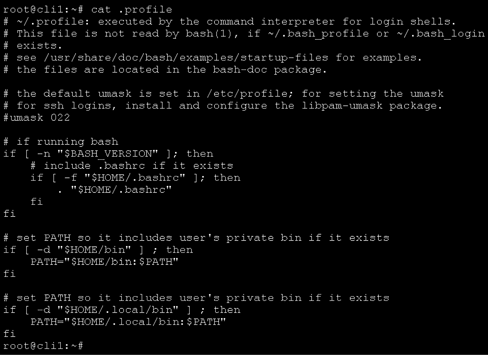

图 5.17 – 在合适的文件上使用 cat 命令 – 一个足够小的文本文件，能够适应一个终端页面

`Cat`还可以用来做一件事，那就是将多个文本文件合并为一个。这个操作通常在将多个日志文件合并为一个文件时使用。我们将在本书后面讨论这一场景，位于*第八章*，*使用命令行查找、提取和操作文本内容*。

## 它是如何工作的……

`more`和`less`是页面查看器——它们使我们能够按页显示内容。正如我们在示例的最后一行看到的，使用这些命令时并没有*完成*——命令在显示完一页文件内容后停止显示文件内容。现在它会交互式地等待我们继续按页显示文件内容、做其他事情（例如，通过使用`/`符号搜索）或按`q`键退出。

`head`和`tail`命令的命名非常贴切——它们显示文本文件的开头（头部）和结尾（尾部）。它们也可以与各种选项一起使用，以进一步参数化我们想要的输出。例如，如果我们执行以下命令：

```
tail -n 15 /root/.bashrc
```

我们将获取该文件的最后 15 行。使用`head`命令也可以做到这一点。

我们接下来的讨论话题是使用`find`命令查找文件和文件夹。我们先处理这个问题，然后再继续讨论其他的操作，包括归档、压缩以及通过`systemctl`处理服务。

## 还有更多……

如果我们需要了解更多关于这些命令的信息，我们可以查看以下链接：

+   `head` 手册页: [`man7.org/linux/man-pages/man1/head.1.html`](https://man7.org/linux/man-pages/man1/head.1.html)

+   `tail` 手册页: [`man7.org/linux/man-pages/man1/tail.1.html`](https://man7.org/linux/man-pages/man1/tail.1.html)

+   `more` 手册页: [`man7.org/linux/man-pages/man1/more.1.html`](https://man7.org/linux/man-pages/man1/more.1.html)

+   `less` 手册页: [`man7.org/linux/man-pages/man1/less.1.html`](https://man7.org/linux/man-pages/man1/less.1.html)

+   `cat` 手册页: [`man7.org/linux/man-pages/man1/cat.1.html`](https://man7.org/linux/man-pages/man1/cat.1.html)

# 查找文件和文件夹

我们今天的下一个主题是学习使用`find`命令，它是一个非常有用的命令。它可以以多种方式使用——根据特定的标准（如权限、所有权、修改日期等）查找文件和文件夹，还可以*准备数据*，以便在`find`命令后进一步操作。在这个教程中，我们将介绍这两种原则的示例。

## 准备工作

我们需要让`cli1`虚拟机保持运行。如果它没有开启，我们需要重新启动它。

## 如何操作…

让我们通过几个例子来解释`find`命令是如何工作的。以下是我们将使用的一些例子：

+   查找`/`目录中权限为`2755`的文件

+   查找`/`目录中属于用户`jill`的文件

+   查找`/`目录中属于学生组的文件

+   查找`/`目录中具有特定名称的文件（例如，`network`）

+   查找特定类型的文件（例如，所有具有`php`扩展名的文件）

+   查找所有空目录

+   查找过去两小时内修改过的文件（120 分钟）

+   查找大小在 100-200 MB 之间的文件

让我们让这些场景发生：

```
find / -type f -perm 2755
find / -type f -user jill
find / -type f -group student
find / -type f -name network
find / -type f -name "*.php"
find / -type d -empty
find / -mmin -120
find / -size +100M -size -200M
```

为了更好地强调此命令的重要性，正如我们之前提到的，让我们用它来*准备*数据，以便在找到必要的内容后进行后续操作。例如，让我们在整个文件系统中查找所有`.avi`扩展名的文件，并删除它们：

```
find / -type f -name "*.avi" -exec rm -f {} \;
```

该命令会查找所有`.avi`扩展名的文件，将它们放入数组中，然后使用`rm -f`命令逐个删除。这对于有用户滥用公司资源存储不必要内容的情况非常有用。

## 它是如何工作的…

按名称查找文件和文件夹是我们经常做的事情。例如，假设我们有一个初步的 shell 脚本，它执行备份，并使用特定标准创建一个文件列表，这些文件将被复制到预定的备份文件夹。如果我们在有数百个用户的大型生产服务器上执行这种操作，那么每天可能都会有很多新文件。使用`find`命令在这种情况下非常有意义。

最常见的情况是，我们使用`find`命令来查找文件（`-type f`选项）或文件夹（`-type d`选项），然后通过使用更多的标准来进一步缩小搜索范围。标准包括修改日期、用户或组所有权、权限——有很多可用的选项。如果我们查看`find`命令的手册页面，我们会迅速意识到使用`find`命令时可以覆盖的选项和高级场景有多少。这就是为什么使用`find`有一个常见的方法——通常从文件类型或扩展名开始，然后通过使用我们提到的其他选项进一步缩小范围。如果我们从这一点开始，我们就能快速得到结果。

我们盘子上的下一个配方与归档和压缩文件及文件夹相关。所以，让我们来学习如何使用`tar`及其助手工具`gzip`、`bzip`、`xzip`以及类似命令。

## 还有更多…

如果你需要了解更多关于 Bash 保留变量和 PS 变量的信息，请参考`Find`命令的手册页面：[`man7.org/linux/man-pages/man1/find.1.html`](https://man7.org/linux/man-pages/man1/find.1.html)。

# 归档和压缩文件及文件夹

高效使用磁盘空间并不是什么新鲜事——这一直都是存在的。是的，我们正处在一个硬盘和其他存储介质容量巨大的时代，但这并不意味着我们可以对它掉以轻心。这也是我们使用归档和压缩几十年来一直在做的事情，今天我们也将继续讨论这个话题。

## 准备工作

我们需要确保我们的`cli1`机器已经准备好使用，这将使我们在这个配方中的工作变得更加轻松。

## 如何操作…

让我们通过另一个基于场景的示例，涵盖所有必要的主题。我们将在配方的第一部分做以下操作：

+   使用当前文件夹内容创建`tar`归档文件

+   使用当前文件夹内容创建`tar.gz`压缩归档文件

+   使用当前文件夹内容创建`tar.bz2`压缩归档文件

+   使用当前文件夹内容创建`tar.xz`压缩归档文件

在我们配方的第二部分，我们将提取这些归档文件：

+   提取`tar`、`tar.gz`、`tar.bz2`或`tar.xz`归档文件

+   将`tar`、`tar.gz`、`tar.bz2`或`tar.xz`归档文件提取到指定文件夹（假设是`/tmp/extract`）

假设我们位于`/root`目录，并且希望将所有归档文件保存到`/tmp`目录。这就是我们如何做场景的第一部分：

```
cd /root
tar cfp /tmp/root.tar .
```

如果我们要创建`tar.gz`归档文件，应该这样做：

```
tar cfpz /tmp/root.tar.gz .
```

如果我们要创建`tar.bz2`归档文件，应该这样做：

```
tar cfpj /tmp/root.tar.bz2 .
```

如果我们要创建`tar.xz`归档文件，应该这样做：

```
tar cfpJ /tmp/root.tar.xz .
```

我们场景的第二部分是通过打开一个归档文件开始的。与场景中第一个例子相比，我们只需要改变一个`tar`参数，并去掉命令的最后部分（即当前目录的`.`）。所以，我们需要这样做（在实际操作中不要这样做；这仅用于演示目的）：

```
tar fpx /tmp/root.tar
```

或者，我们可能需要这样做：

```
tar zfpx /tmp/root.tar.gz
```

或者我们可以这样做：

```
tar jfpx /tmp/root.tar.bz2
```

或者我们可以这样做：

```
tar Jfpx /tmp/root.tar.xz
```

这个问题在于输出的位置——提取过程的输出将去哪里？因此，正确的做法如下：

```
cd /tmp
mkdir /tmp/extract
tar fpx /tmp/root.tar -C /tmp/extract
```

或者，我们可以这样做：

```
tar zfpx /tmp/root.tar.gz -C /tmp/extract
```

或者我们可以这样做：

```
tar jfpx /tmp/root.tar.bz2 -C /tmp/extract
```

或者我们可以这样做：

```
tar Jfpx /tmp/root.tar.xz -C /tmp/extract
```

这再次取决于归档类型。

`Tar`有许多其他可用的选项，例如，用于操作 ACL 和 SELinux 上下文的选项，如下所示：

+   `--acls` – 在创建归档时使用 ACL

+   `--no-acls` – 在创建归档时忽略 ACL

+   `--selinux` – 在创建归档时使用 SELinux 上下文

+   `--noselinux` – 在创建归档时忽略 SELinux 上下文

如果我们正在寻找某个特定的内容，检查相应的手册页是非常重要的。我们必须确保这样做。

## 它是如何工作的…

`tar`，或称为磁带归档器（Tape ARchiver），已经存在几十年了。它最初的用途是将内容归档到磁带上，这也是它名字的由来。归档，正如手册中所述，就是将多个文件存储到一个单一的文件中。我们使用的所有其他选项都是在过去 40 多年里添加的，因为它是在 1979 年推出的。

就我们示例中使用的参数而言，我们有以下内容：

+   `c` – 创建归档文件

+   `x` – 提取归档文件

+   `f` – 或`--file`，选择输出归档文件名

+   `p` – 保留权限的选项

+   `C` – 选择输出文件夹

+   `z` – 使用`gzip`压缩`tar`归档文件

+   `j` – 使用`bzip2`压缩`tar`归档文件

+   `J` – 使用`xzip`压缩`tar`归档文件

这些是最常用的`tar`参数，因此我们特别选择了它们来进行本食谱。

本次`tar`食谱到此结束，我们准备进入本章的最后一个食谱，内容是通过使用`systemctl`命令来管理服务。我们来进行一会儿的学习吧。

## 还有更多…

如果你想了解更多关于`tar`命令的信息，确保参考`tar`命令的手册页：[`man7.org/linux/man-pages/man1/tar.1.html`](https://man7.org/linux/man-pages/man1/tar.1.html)。

# 管理服务和目标

管理服务通常是我们需要做的事情之一。例如，当我们安装一个捆绑为服务的新软件时，我们需要能够管理它，以确保它能正常工作。这就是我们在本食谱中要做的工作。我们还将简要描述`systemctl`配置文件的工作原理，但不会进行长篇大论的讨论，因为重点是食谱本身。不过，我们会确保提供额外的链接，供你深入了解`systemd`，因为它是一个重要且广泛的话题。

## 准备工作

我们将使用`cli2` CentOS 进行本食谱，以免它觉得被冷落。

## 如何做到这一点…

管理服务的基本思想是，在我们希望它们启动的时刻启动服务，或者在我们启动 Linux 服务器后使它们可用。

在过去的几个 Linux 发行版更新中，服务和目标的管理变得更加简单。如果你使用 CentOS 已有一段时间，你可能还记得 upstart、init 以及那些已经深深埋藏在我们不太愉快记忆中的东西。在服务管理方面，无论是从管理者还是 *开发* 的角度（稍后我们会谈到），CentOS 7 使得这件事变得更简单。CentOS 8 也遵循了相同的路径。关于 `systemd` 的整体想法，总是会有不同的意见，但这不是我们讨论的主题。所以，让我们集中讨论服务和目标。首先，我们以 root 用户登录并输入一些命令，从以下命令开始：

```
systemctl set-default multi-user.target
```

这将把我们默认的启动目标切换为多用户模式，这意味着我们的 CentOS 机器将默认以文本模式启动。所以，在重启机器后，它将以文本模式启动。然后，我们将立即切换到使用文本模式：

```
systemctl isolate multi-user.target
```

这将结束所有 GUI 进程，检查 `graphical.target` 和 `multi-user.target` 之间的服务差异，并执行其魔法操作。

接下来我们要做的是，选择一个服务（例如 `sshd`），并使用 `systemctl` 命令来管理它——既可以暂时管理（在命令执行时管理其状态），也可以永久管理（管理 `sshd` 服务在系统启动时的行为）。我们来输入以下命令：

```
systemctl stop sshd.service
systemctl status sshd.service
```

这两条命令的结果如下：

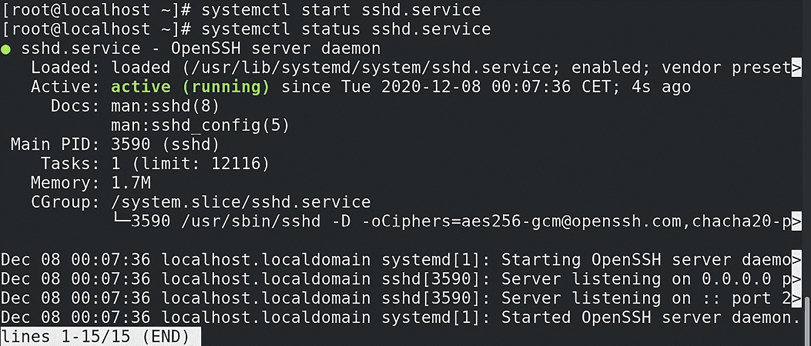

](img/Figure_5.18_B16269.jpg)

图 5.18 – 使用 systemctl 管理服务 – 以 SSH 服务为例

它告诉我们 `sshd.service` 已禁用——活动状态：不活动（死）。我们将启用它并通过输入以下命令检查其状态：

```
systemctl start sshd.service
systemctl status sshd.service
```

让我们检查这两条命令的结果：

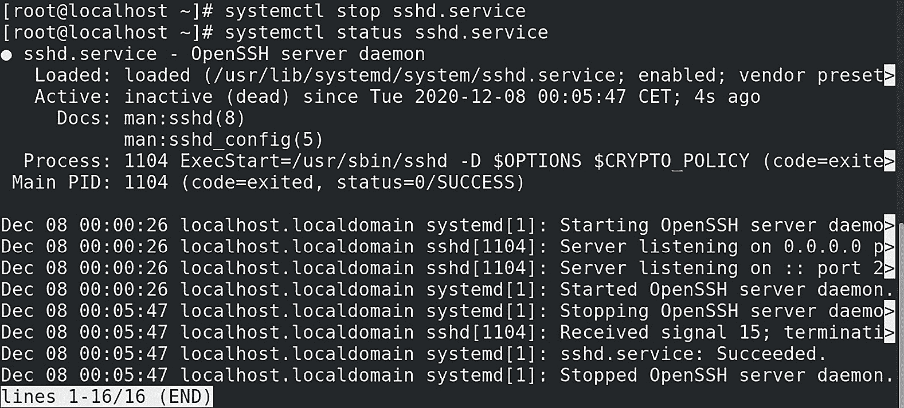

](img/Figure_5.19_B16269.jpg)

图 5.19 – 检查配置更改后 SSH 服务的状态

我们可以看到，`sshd.service` 现在是活动状态，并且准备好接受网络连接。

另一个方面是配置服务，以便它在系统启动时启用。如果我们以 `sshd.service` 为例：

```
systemctl enable sshd.service
```

此外，如果我们不希望 `sshd.service` 在系统启动时启用，我们可以执行相反的操作：

```
systemctl disable sshd.service
```

当我们部署一个新服务时，我们可以同时启动并启用它。例如，假设我们刚刚从一个包中安装了 `sshd` 服务。我们可以通过一个命令来启用并启动它：

```
systemctl enable --now sshd.service
```

当然，这预设了我们知道任何给定服务的名称，但这并不总是能做到的。在总结表格使事情更容易之前，让我们学习如何通过文本模式解决这个问题。

如果我们想列出所有可用的服务，可以使用以下命令，因为 `systemd` 和 `systemctl` *知道* 的对象不仅仅是服务（这不是本场景的主题）：

```
systemctl list-units --type=service
-----
.......
.... part of the output ommited ....
systemd-journal-flush.service loaded active exited  Flush Journal to Persistent Storage
systemd-journald.service      loaded active running Journal Service
systemd-logind.service        loaded active running Login Service
systemd-machined.service      loaded active running Virtual Machine and Container Registration Service
systemd-modules-load.service  loaded active exited  Load Kernel Modules
systemd-random-seed.service   loaded active exited  Load/Save Random Seed
systemd-remount-fs.service    loaded active exited  Remount Root and Kernel File Systems
systemd-sysctl.service        loaded active exited  Apply Kernel Variables
systemd-sysusers.service      loaded active exited  Create System Users
systemd-tmpfiles-setup-dev.service    loaded active exited  Create Static Device Nodes in /dev
systemd-tmpfiles-setup.service        loaded active exited  Create Volatile Files and Directories
systemd-udev-settle.service   loaded active exited  udev Wait for Complete Device Initialization
systemd-udev-trigger.service  loaded active exited  udev Coldplug all Devices
systemd-udevd.service         loaded active running udev Kernel Device Manager
systemd-update-done.service   loaded active exited  Update is Completed
systemd-update-utmp.service   loaded active exited  Update UTMP about System Boot/Shutdown
systemd-user-sessions.service loaded active exited  Permit User Sessions
tuned.service                 loaded active running Dynamic System Tuning Daemon
udisks2.service               loaded active running Disk Manager
upower.service                loaded active running Daemon for power management
user-runtime-dir@0.service    loaded active exited  /run/user/0 mount wrapper
user-runtime-dir@42.service   loaded active exited  /run/user/42 mount wrapper
user@0.service                loaded active running User Manager for UID 0
user@42.service               loaded active running User Manager for UID 42
vdo.service                   loaded active exited  VDO volume services
vgauthd.service               loaded active running VGAuth Service for open-vm-tools
vmtoolsd.service              loaded active running Service for virtual machines hosted on VMware
wpa_supplicant.service        loaded active running WPA supplicant
```

在我们讨论之前的某个食谱时，我们提到了 `vdo`。我们可以清楚地看到这里列出了 `vdo` 服务。记得我们是通过使用 `systemctl` 命令启动它的吗？

如果我们想查看所有启用的服务列表，可以使用以下命令：

```
systemctl list-units --type=service --state=enabled
```

如果我们需要查看当前运行的服务列表，可以执行以下命令：

```
systemctl list-units --type=service --state=running
```

由于 `systemctl` 命令的工作方式及其相关的配置文件（稍后在 *它是如何工作的…* 部分中会涉及），它还可以列出服务的依赖关系。例如，`sshd` 服务需要启动一些其他服务才能正常工作。让我们列出 `sshd` 的依赖关系：

```
systemctl list-dependencies sshd
```

因此，让我们创建一个包含一些常见服务名称的表格，以便我们能够更高效地管理这个问题：

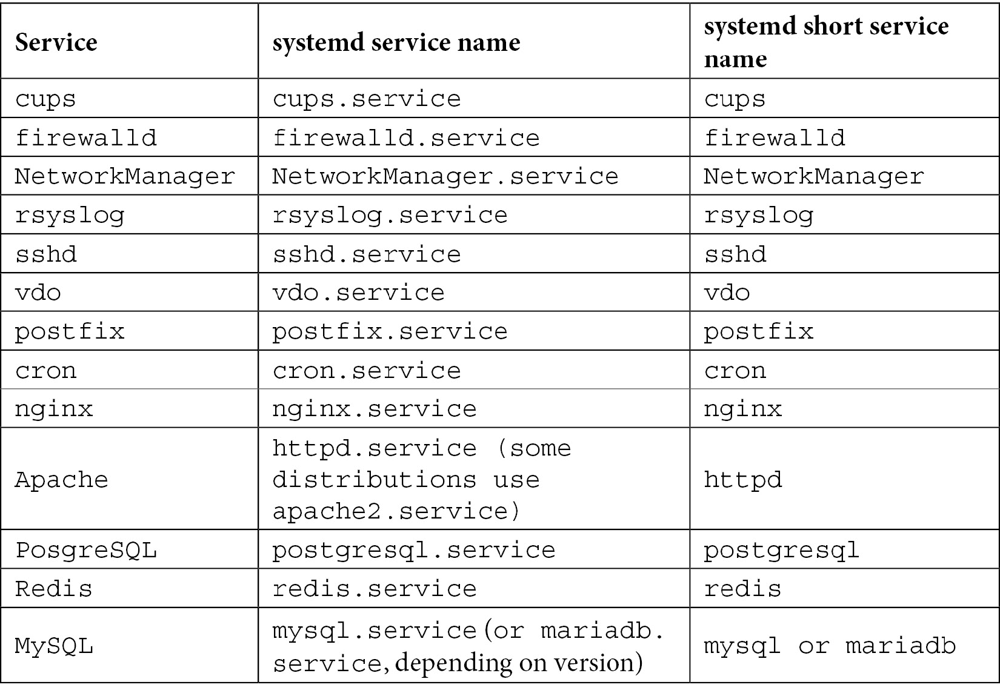

表 5.1 – 关于服务和 systemd 服务名称的详细表格

我们可以使用这些服务的短名称（不带 `.service`）以及 *Tab* 键，通过 Bash shell 补全功能来浏览 `systemctl` 中的选项和服务名称。我们还可以屏蔽 `systemd` 服务，从而通过将它们从服务启动的角度链接到 `/dev/null` 来使它们对系统不可见：

```
systemctl mask cups.service
Created symlink /etc/systemd/system/cups.service → /dev/null.
```

在这里，我们可以了解所有这些是如何工作的。显然，`systemctl` 命令使用了一些配置文件来完成它的工作。现在，让我们讨论一下是如何做的，以及做了什么。

我们可以写关于 `systemd` 的书，但考虑到这一特定场景，我们需要专注于当前的任务。我们使用 `systemctl` 命令来管理服务——现在（启动/停止/重启），以及永久（启用/禁用）。

## 它是如何工作的……

从纯粹管理服务的角度来看，`systemctl` 命令通过检查其配置文件来执行工作。那么，让我们再次以 `sshd` 为例，来查看 `systemd` 服务文件的结构：

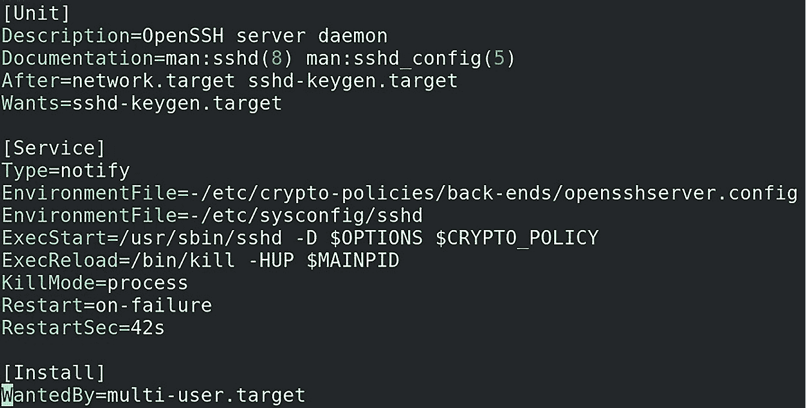

图 5.20 – Systemd 配置文件 – 以此示例为例，SSHD

它几乎可以在没有过多解释的情况下阅读，这是这些服务文件与过去使用的文件之间的一个重大区别。

第一部分，从 `[Unit]` 部分开始，涉及服务的一般设置——描述和手册页文档是其中的第一部分。然后是一个语句告诉我们启动顺序；也就是说，应该在这些服务之后启动此特定服务。`Wants` 与依赖关系相关——在这种情况下，哪些目标需要启用才能成功启动此服务。

`[Service]` 部分稍微复杂一些，它告诉我们一些基本的配置细节和启动选项（如 `EnvironmentFile` 选项），应该使用哪些命令来启动和重新加载服务，如何杀死服务，以及与重启相关的细节。重启是用来选择服务在超时、杀死或退出进程服务时是否会重启的选项。`RestartSec` 指定服务重启前的等待时间。

`[Install]` 部分更为全局，涉及 `systemd` 如何与该单元协同工作。`WantedBy` 用于创建此特定服务与其他服务之间的额外依赖关系，与 `[Unit]` 语句的作用完全相反。

这就是为什么当我们更改或创建新的 systemd 单元/服务/任意文件时，我们必须使用 `systemctl daemon-reload` 命令。该命令指定 `systemctl` 会遍历所有配置文件，并将它们视为 *是的，管理员可能已更改其中的某些文件，但这是故意的，没问题*。

## 还有更多内容……

鉴于 systemd 及其内部机制的重要性，如承诺的那样，接下来我们为读者提供一些与 systemd 相关的附加内容：

+   systemd 入门: `https://access.redhat.com/documentation/en-us/red_hat_enterprise_linux/8/html/configuring_basic_system_settings/introduction-to-systemd_configuring-basic-system-settings`

+   使用 systemctl 管理系统服务: `https://access.redhat.com/documentation/en-us/red_hat_enterprise_linux/8/html/configuring_basic_system_settings/managing-system-services-with-systemctl_configuring-basic-system-settings`

+   使用 systemd 目标: `https://access.redhat.com/documentation/en-us/red_hat_enterprise_linux/8/html/configuring_basic_system_settings/working-with-systemd-targets_configuring-basic-system-settings`

+   使用 systemd 单元文件: `https://access.redhat.com/documentation/en-us/red_hat_enterprise_linux/8/html/configuring_basic_system_settings/assembly_working-with-systemd-unit-files_configuring-basic-system-settings`

+   优化 systemd 以缩短启动时间: `https://access.redhat.com/documentation/en-us/red_hat_enterprise_linux/8/html/configuring_basic_system_settings/optimizing-systemd-to-shorten-the-boot-time_configuring-basic-system-settings`

+   揭开 systemd 的神秘面纱: `https://www.youtube.com/watch?v=tY9GYsoxeLg`
