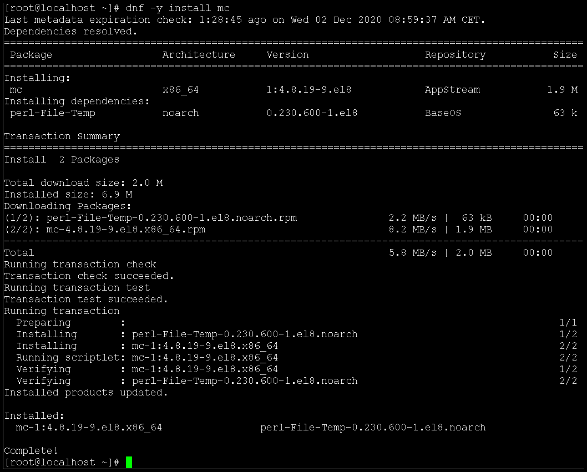
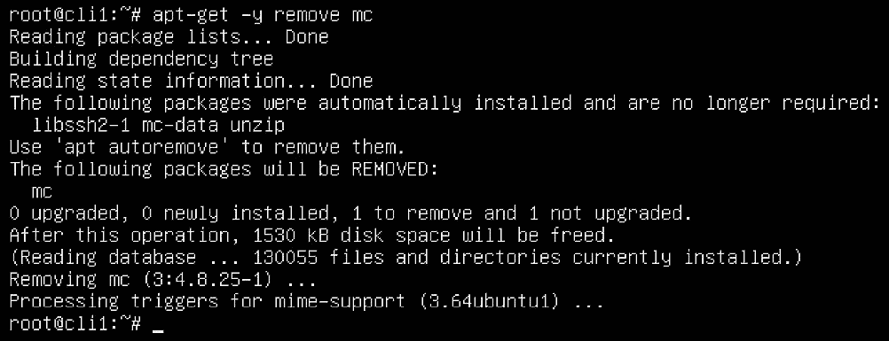
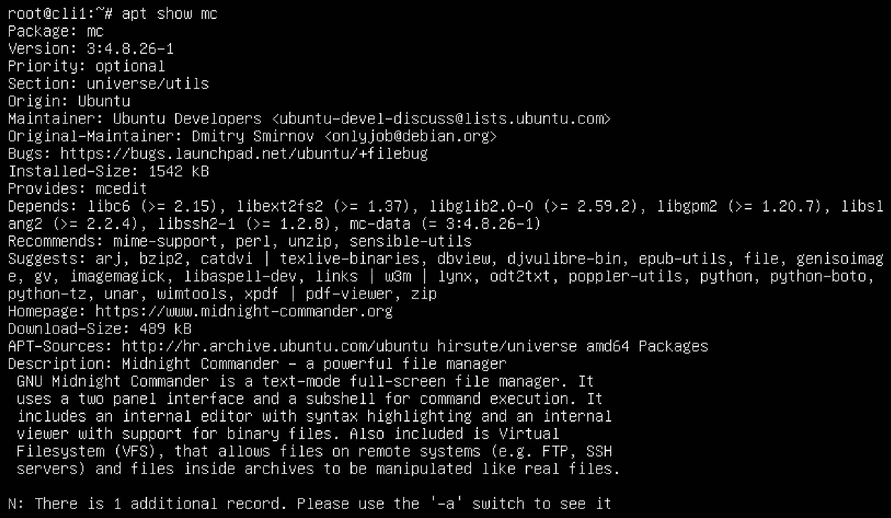

# *第六章*：基于 Shell 的软件管理

通过网络复制内容通常是一个手动过程——例如，我们可以使用 `scp` 或 `FTP` 传输文件，仅此而已。但如果我们需要将此过程变为常规操作呢？我们就需要找到一种方法来执行文件/目录同步，这正是 `rsync` 的作用。话虽如此，考虑到过去 5 年以上的安全事件，实施某种加密始终是一个好主意，所以使用 `ssh` 和 `scp` 看起来是合理的做法。这正是我们接下来要做的。

在本章中，我们将学习以下主题：

+   使用 `dnf` 和 `apt` 进行包管理

+   使用额外的仓库、流和配置文件

+   创建自定义仓库

+   编译第三方软件

# 技术要求

对于这些教程，我们将使用两台 Linux 机器——可以使用我们之前教程中的`cli1`和`cli2`虚拟机。这些教程在 CentOS 和/或 Ubuntu 上都能进行，因此没有必要为这些场景使用不同的虚拟机。

那么，让我们启动虚拟机，开始吧！

# 使用 dnf 和 apt 进行包管理

包和包组是两种不同的软件部署方式，用于将软件安装到我们的 CentOS 和 Ubuntu 虚拟机上。一个包就是一堆可以自动化安装到我们机器上的文件，无需人工干预。包组更多是 RedHat/CentOS 的概念。顾名思义，它们是将多个包分组的一种方式，方便我们一次性安装多个包，而不需要手动指定每一个包。让我们学习如何利用它们来达到我们的目的，特别是在部署方面。

## 准备就绪

我们将继续使用 `cli1` 和 `cli2` 机器进行本教程，请确保它们已经开机并准备就绪。我们将使用 `cli1` 进行 `apt` 部分的操作，使用 `cli2` 进行 `yum/dnf` 部分的操作，因为 `cli1` 基于 Ubuntu，而 `cli2` 基于 CentOS。

## 如何操作……

让我们从 `yum` 和 `dnf` 在 cli2 上的基本操作开始。首先，我们列出系统上所有可用的包：

```
yum list
```

输出应如下所示（已简化）：


图 6.1 – 简化的 yum 列表输出

我们已经在 *图 6.1* 中简化了此截图，因为它包含了成千上万的包。这个输出中有三列。按照从左到右的顺序，第一列是包的名称，第二列是包的版本，第三列是该包所在的包仓库。

如果我们想了解更多有关某个包的详细信息，可以使用 `yum info`（或 `dnf info`），例如：


图 6.2 – 获取包信息

通过使用此命令，我们可以获取更多关于该软件包的信息。另外，请注意，我们没有在软件包名称中使用`x86_64`，因为它不是必须的。考虑到我们使用的是 64 位发行版，可以理解在软件包名称中使用*架构*几乎总是不必要的。

现在让我们安装一个软件包，例如`mc`（Midnight Commander）：



](img/Figure_6.3_B16269.jpg)

图 6.3 – 安装软件包

Linux 软件包系统的美妙之处在于此处显现出来。它不仅仅是关于软件包可以毫不费力地安装——依赖项也会默认安装，这非常有用。在过去，当我们只能使用`rpm`命令在 CentOS 中安装软件包时，解决依赖关系要困难得多。我们必须先部署它们，然后再部署我们想要部署的软件包，而且必须按特定顺序，这使得部署过程更加复杂。

我们可以使用以下命令来删除该软件包：

```
dnf -y remove mc
```

如果我们想查找哪个软件包安装了特定文件，可以使用`yum provides`或`dnf provides`命令：


](img/Figure_6.4_B16269.jpg)

图 6.4 – 检查哪个软件包安装了特定文件

如果我们需要查找软件包依赖关系（哪个软件包依赖于哪个软件包），可以使用以下命令：


](img/Figure_6.5_B16269.jpg)

图 6.5 – 检查软件包依赖关系

我们在这个示例中使用了`bash`，但我们可以使用任何软件包名称来进行查询。

我们还可以使用`dnf`和`yum`来本地下载和安装软件包。假设我们想要在本地下载并安装`joe`编辑器，我们可以这样操作：


](img/Figure_6.6_B16269.jpg)

图 6.6 – 从本地磁盘手动下载并安装软件包

我们当然可以使用`yum search`或`dnf search`命令来搜索软件包：


](img/Figure_6.7_B16269.jpg)

图 6.7 – 使用 yum/dnf 搜索命令

有时，这些软件包的列表可能会非常长，因此可能需要额外的筛选。

现在让我们谈谈软件包组，从`dnf grouplist`命令开始：


](img/Figure_6.8_B16269.jpg)

图 6.8 – 使用 dnf group list 命令可以得到软件包组列表

该命令的输出将显示我们可以用于更*大规模*软件包部署的**软件包组**名称。例如，让我们检查如果我们安装**开发工具**软件包组，执行以下命令时会发生什么：

```
dnf groupinstall "Development Tools"
```

此命令将询问我们是否要下载并部署超过 100 个软件包。如果我们回答*是*，那么这正是即将发生的事情（截图故意渲染得较小，仅显示命令输出的结尾）：


图 6.9 – 安装软件包组

如我们所见，能够部署软件包组大大提高了包的部署速度。

我们过程中的下一步是覆盖我们在这个配方中涉及的所有内容，但将其应用于 Ubuntu。所以，让我们切换到我们的 `cli1` 机器并从头开始。首先，我们来描述几个我们感兴趣的命令：

+   `apt-get` 或 `apt`：用于安装、移除、升级和更新包的命令

+   `apt-cache`：主要用于搜索和查找有关包的信息

现在让我们学习如何使用它们。首先，我们将讨论常规操作——安装、移除、清除、更新和升级。我们来安装一个包，例如 `mc`：


图 6.10 – 使用 apt-get 安装包

现在，让我们移除它：



图 6.11 – 使用 apt-get 移除包

我们可以看到，我们处于标准情况——包*已*移除，但它的一些依赖项没有被移除。我们也可以使用 `apt-get autoremove` 命令来完成这项工作：


图 6.12 – 移除不再需要的包

这非常有用，因为我们通过删除不必要的软件包来减少服务器的攻击面（防止安全漏洞）。

现在让我们检查一下使用 `update` 选项时会发生什么：


图 6.13 – 更新仓库和软件包信息

如我们所见，`apt` 在升级过程之前刷新了软件包列表——这些步骤大多数是顺序执行的——`update` 后接 `upgrade`：


图 6.14 – 升级可用的包 – 这次不需要升级

有趣的是，没有包被安装，这种情况其实非常罕见。通常，我们至少会有一些包需要升级。

注意

在我们进入 dist-upgrade 主题之前，我们绝对*不*推荐在生产服务器上使用此操作。使用 `dist-upgrade` 和 `do-release-upgrade` 是我们*可以*做的，但不应该做。迁移总是一个更好的选择，无论它花费多少时间。

现在让我们通过尝试做`dist-upgrade`，然后再做`do-release-upgrade`来将这种情况推向极限。`dist-upgrade apt`选项的作用理论上很简单——它尝试准备当前的发行版，使其能够升级到分支中的最新版本。起初，它可能只会获取几个新的软件包。通常，这些软件包包含新的仓库和位置信息，`apt`将从这些位置升级我们的发行版到最新版本。以下是一个例子：


图 6.15 – 使用 dist-upgrade 获取新发行版版本信息

接下来的步骤是使用`do-release-upgrade`，这是一个独立的命令，不是`apt`的子命令。我们需要记住，这不是`apt`选项（没有`apt do-release-upgrade`，它只是`do-release-upgrade`）。执行后，系统会询问我们是否继续进行发行版升级：


图 6.16 – 使用 do-release-upgrade，不建议在生产环境中使用

如果我们确认，过程就会开始，并且会持续一段时间。最终结果应该是一个完全更新到最新版本的 Ubuntu 系统，所有的包都更新到最新版本。记住，我们特别提到过，这不应该在生产环境中进行——这只是一个使用`apt`能力进行系统范围包升级的极端例子。如果我们这样做，可能会更新数百甚至数千个软件包，而且这个过程不可逆转，因此风险很大。最好在一些测试虚拟机上练习一下。如果成功，这个过程将升级到最新的 Ubuntu 版本。写作时，最终结果看起来是这样的：


图 6.17 – do-release-upgrade 的最终结果，在我们的经验中，这次我们运气不错！

注意，我们的 Ubuntu 系统已经升级到最新的（21.04）版本。

还有一些重要的`apt`命令——例如，进行包搜索时，我们可以使用`apt-cache showpkg package_name`命令。让我们举个例子，使用它来查看我们之前安装的`mc`包：


图 6.18 – 使用 apt-get 获取包信息

如果我们使用`apt`命令，有一个稍短的版本来完成相同的事情：



图 6.19 – 使用 apt 获取包信息 – 略短且更简洁

如果我们需要添加仓库，可以使用 `add-apt-repository` 命令。假设我们想要添加一个非官方仓库，如 **个人软件包档案**（**PPA**），它托管在 Launchpad 上。一般来说，我们应该只添加 *有信誉的* 仓库，而不是因为某个仓库中有我们需要的包就随便添加。我们在这里用一个例子 – 假设我们需要在 Ubuntu 机器上安装最新的 PHP 7.4 版本。我们可以这样做：

```
apt-get install software-properties-common
add-apt-repository ppa:ondrej/php
apt-get update
apt-get install -y php7.4
```

如果我们从 shell 启动`php`，应该会得到以下结果：


图 6.20 – 使用 ppa 仓库部署最新 PHP 7.4 版本的最终结果

这涵盖了我们在 Ubuntu 和 CentOS 中需要的所有命令。现在让我们解释一些背景信息，关于一些更重要信息的存储位置 – 适用于 CentOS（`dnf`/`yum`）和 Ubuntu（`apt`/`apt-get`）。

## 它是如何工作的…

`yum` 和 `dnf` 与位于 `/etc/yum.repos.d` 仓库文件和 `/etc/yum.conf` 配置文件的文件协同工作。我们已经涵盖了仓库文件，现在让我们来讨论 `/etc/yum.conf` 以及我们可以从中使用的几个重要配置选项。这是 `dnf` 和 `yum` 命令的全局配置文件。

在这个配置文件中，我们可以管理一些非常有用的配置项。让我们通过两个常用的例子来说明这一点。让我们向其中添加这两个选项：

```
exclude: kernel* open-vm*
gpgcheck=0
```

通过这两个命令，我们指示 `yum`/`dnf` 在任何操作中（如 `yum` 更新，它会更新机器上的所有包）排除所有 `kernel` 和 `open-vm` 包（按名称）。`gpgcheck=0` 设置了一个全局策略，告诉 `yum` 和 `dnf` 在处理包时 *不* 使用 GPG 密钥检查。这也可以在 `/etc/yum.repos.d` 中进行管理，正如我们在本配方中所讨论的。

Ubuntu 有一个非常相似的原理；只是目录结构和文件结构有所不同。关于软件仓库位置的最重要信息保存在 `/`etc/apt` 目录下，具体来说，是在 `/etc/apt/sources.list` 文件中。以下是摘录：


图 6.21 – 主要的 apt 配置文件，名为 sources.list

一般结构足够简单。我们 `apt` 命令的第二部分位于 `/etc/apt/sources.list.d` 目录下。几步前，我们添加了 PPA 仓库，果不其然，我们在这里有一个用于该仓库配置文件的配置文件，叫做 `ondrej-ubuntu-php-groovy.list`：


图 6.22 – 额外的 apt 配置文件位于 /etc/apt/sources.list.d

这涵盖了我们的软件包和软件包组的配方。接下来让我们进入下一个配方，关于使用模块和模块流。

## 还有更多……

如果你需要更多关于 CentOS 和 Ubuntu 网络的资料，确保查阅以下资源：

+   `https://access.redhat.com/sites/default/files/attachments/rh_yum_cheatsheet_1214_jcs_print-1.pdf`

+   `https://fedoraproject.org/wiki/Yum_to_DNF_Cheatsheet`

+   `https://packagecloud.io/blog/apt-cheat-sheet/`

# 使用额外的仓库、流和配置文件

仓库是最重要的对象/位置，因为它们为我们提供了可以在 CentOS 机器上安装的软件包和软件包组。现在让我们学习如何通过使用`yum-config-manager`和`dnf`来管理仓库。同时，让我们了解一些对这个过程至关重要的配置文件。

在软件包组的基础上，`dnf` 引入了附加模块化的概念。这一切都是关于软件包的组织——我们希望有简单的方式来部署软件——运行时、应用程序、软件的零件。这些概念还使我们能够控制*我们想安装的软件的版本*，这非常方便。例如，假设你需要在机器上部署 PHP 7.2 和 7.3。手动操作可不会有多么愉快。正如我们通过示例展示的那样，如果使用模块流，这将变得更加简单。

配置文件作为准仓库存在，实际上并不是仓库，`httpd`模块中有几个配置文件（`minimal`，`devel`，`common`）。minimal 配置文件意味着只安装运行`httpd`所需的最小软件包。与之不同的是，common 是一个默认配置文件，已准备好生产使用，并且在安全性方面有额外的处理（加固）。

## 准备工作

启动在前面的示例中创建的`cli2`虚拟机。我们将用它来在 CentOS 机器上操作流和配置文件。

## 如何做……

为了管理仓库，我们需要学习使用两个命令——`yum-config-manager`和`dnf`。此外，我们还需要查看`/etc/yum.conf`文件，以及`/etc/yum.repos.d`目录。`yum.conf`提供了全局的`yum`命令配置选项，而`/etc/yum.repos.d`目录包含了仓库位置的配置文件。

## 它是如何工作的……

让我们先来看一下`yum-config-manager`。这个命令是在 Red Hat Enterprise Linux/CentOS 7 中引入的，用来方便地将额外的仓库添加到你的 Red Hat Enterprise Linux 或 CentOS 机器上。它的功能就是让我们跳过繁琐的手动仓库配置，直接开始工作。如果没有这个命令，我们就需要学习`/etc/yum.repos.d`目录文件的配置选项。

如果我们访问第一个安装的虚拟机（源），并列出`/etc/yum.repos.d`目录的内容，这就是我们将看到的内容：


](img/Figure_6.23_B16269.jpg)

图 6.23 – /etc/yum.repos.d 目录内容

假设我们想要将一个自定义仓库 `url` 添加到我们的机器中。我们可以通过三种不同的方式来完成这项操作。第一种方法是使用 `yum-package-manager`，该工具需要 `yum-utils` 包（`url` 是我们想要使用的仓库地址）：

```
yum -y install yum-utils
yum-config-manager --add-repo url 
yum-config-manager --enable repo
```

我们还可以使用以下命令检查当前已配置的仓库列表：

```
yum repolist all
```

如果我们需要查找当前被禁用（未使用）仓库的列表，可以使用以下命令：

```
yum repolist enabled
```

如果我们需要启用一个已禁用的仓库，可以使用以下命令（`repository_id` 是你可以从 `yum repolist all` 命令中获取的参数）：

```
yum-config-manager --enable repository_id
```

使用 `yum-config-manager` 时最明显的问题是，某些参数无法通过该命令本身分配。这时，手动编辑 `/etc/yum.repos.d` 配置文件就显得非常有用。

这个命令正在逐步淘汰，并重定向到新的 `dnf` 命令（`dnf config-manager`），就像 `yum` 和 `dnf` 命令是并行使用的。如果我们想使用 `dnf` 工具完成相同的工作，可以这样做：

```
dnf config-manager --add-repo url
```

这将会在 `/etc/yum.repos.d` 目录下创建一个新的配置文件，并默认启用该仓库。

接下来的步骤是了解这些配置文件，它们其实并不难理解。我们可以用一个仓库配置文件来解释它们的概念，例如 `/etc/yum.repos.d/CentOS-Sources.repo`：


](img/Figure_6.24_B16269.jpg)

图 6.24 – /etc/yum.repos.d/CentOS-Sources.repo 文件的一部分

让我们解释这些配置参数：

+   `[BaseOS-Source]` 是仓库 ID。我们在 `yum-config-manager` 或 `dnf` 中使用它来引用仓库。

+   `name` 参数是该仓库的描述。

+   `baseurl` 参数描述了*这个*仓库的地址，它可以使用多种不同的协议：`http`、`https`、`ftp` 或 `file`。如果我们创建一个*本地*仓库（将其挂载到 CentOS 机器上的某个位置），则将使用 `file` 协议来访问它。

+   `gpgcheck` 参数告诉 `yum/dnf` 是否检查 `gpg` 密钥与软件包签名的一致性。如果它是 `1`，则表示检查是强制性的。

+   `enabled` 参数告诉 `yum/dnf` 这个仓库是否启用，这意味着 `dnf/yum` 是否可以使用它来获取软件包。我们也可以通过 `yum --enablerepo` 启用某个定义的仓库，或者通过 `yum --disablerepo` 禁用它。

+   `gpgkey` 参数告诉 `yum/dnf` `gpgcheck` 的 `gpg` 密钥存放位置。

现在让我们继续讨论流和配置文件的概念，这是我们操作的逻辑下一步。

在登录到源机器后，让我们通过一个示例来描述流和配置文件到底是什么。因此，让我们使用一个模块流和配置文件来删除并重新部署 `httpd`。第一步，我们将使用以下命令：

```
dnf -y remove @httpd
```

过程完成后，让我们做相反的操作：

```
dnf -y install @httpd
```

现在让我们检查第二个命令的输出：


图 6.25 – 使用流和配置文件

我们可以看到，部署过程自动默认使用了 `httpd/common` 配置文件和默认流 (**AppStream**) 仓库。

让我们做另一个示例。我们可以使用以下命令查看所有可用模块的列表：

```
dnf module list
```

这将为我们提供以下结果：


图 6.26 – dnf 模块列表，包含版本和配置文件；简化输出

假设我们想安装 `container-tools` 版本 2.0。我们可以这样做：


图 6.27 – 使用 dnf 命令部署特定模块版本

如您所见，这个操作的结果将非常庞大。有时，当我们从模块和流中部署一组包时，我们的机器将部署数百个包。因此，准备好等待一段时间，看是否会发生这种情况。

在我们的一个示例中，我们使用默认的配置文件和流部署了 `httpd` 包。每个流都可以有多个配置文件，供我们方便使用。如果一个流有多个配置文件，可以将其中一个设置为默认配置文件（并标记为默认）。这不是强制性的，但这是一个好习惯。

在模块方面，已有超过 60 个模块可用，其中包括 Python、PHP、PostgreSQL、nginx 等多个版本，可以列举一些常用服务。我们可以使用该列表中的模块进行部署。此外，命令的输出还会提供有关配置文件的详细信息，我们可以根据这些信息部署特定的模块配置文件。

通过使用这些功能，我们可以将部署特定包的方式模块化。通过流和配置文件进行模块化的总体思路是不错的，尽管在升级方面有些笨拙且未完成。话虽如此，它仍然是未来会存在的一种方法，因此学习它是值得的。

我们暂时完成了高级仓库管理的部分。接下来我们学习如何创建自定义仓库。

# 创建自定义仓库

有时，创建自己的私有包仓库是必要的。不管是什么原因——没有网络访问、低部署速度——这都是一种完全正常的使用模式，全球范围内都经常使用。我们将为 CentOS 和 Ubuntu 提供示例，以涵盖大多数 Linux 管理员所需的一切。让我们挽起袖子，开始吧！

## 做好准备

保持`cli1`虚拟机开机，让我们继续使用我们的终端。通过标准命令确保所需的包已安装。于是，让我们使用以下命令：

```
dnf -y install vsftpd createrepo lftp
```

这应该是所有的准备工作，所以让我们开始吧。

## 如何操作……

设置一个自定义 CentOS 仓库其实是相当简单的。第一步是下载一些包。我们将下载一些包，并将它们放在同一个目录中。然后，我们将通过`vsftpd`使该目录在网络上可用。关于`vsftpd`的更详细说明，可以在本书的下一章中找到，下一章讲解的是基于网络的文件同步。在这里，我们将通过`vsftpd`进行一个*一级方程式*资格赛圈，以创建仓库。

假设我们想要创建一个本地仓库（托管在我们的`cli2`机器上），其中将包含两个包——`joe`编辑器和`desktop-backgrounds-basic`。我们需要将它们放入一个目录`/var/ftp/pub/repository`，这样它们就能方便地存放在`vsftpd`文件夹结构中。我们可以这样做：


图 6.28 – 下载一些包并为仓库配置做准备

由于我们在本章的介绍中已经安装了`createrepo`包，我们只需使用`createrepo`命令来创建必要的清单信息：


图 6.29 – 从包含 RPM 包的目录创建仓库

下一步是允许通过`vsftpd`使用此目录。再一次，我们已经安装了`vsftpd`，并且默认情况下，我们只需要在其配置文件中更改一个选项来允许匿名 FTP。让我们打开配置文件`/etc/vsftpd/vsftpd.conf`，并找到需要修改的选项：

```
anonymous_enable=NO
```

并将其更改为以下内容：

```
anonymous_enable=YES
```

现在，我们可以启动并启用该服务：

```
systemctl restart vsftpd
systemctl enable vsftpd
```

接下来，我们尝试登录以验证一切是否就绪：


图 6.30 – 检查 vsftpd 配置是否有效

从服务角度来看，一切现在都已准备就绪。接下来，我们只需要告诉`yum/dnf`它们需要使用这个仓库。于是，让我们进入`/etc/yum.repos.d`目录，并在其中创建一个仓库配置文件。假设我们将其命名为`localrepo.repo`。名称无关紧要，关键是它必须以`.repo`结尾。接下来，我们添加以下选项并保存：

```
[MyLocalRepo]
name=My Local Package Repository
baseurl=ftp://localhost/pub/repository
enabled=yes
gpgcheck=no
```

让我们验证一下这个仓库定义是否现在有效。我们需要使用`yum`或`dnf`来验证，使用`repolist`关键字：


](img/Figure_6.31_B16269.jpg)

图 6.31 – 通过仓库配置文件检查我们的仓库是否已正确配置

正如我们所看到的，`MyLocalRepo`已定义并准备好使用。让我们通过尝试安装`desktop-backgrounds-basic`软件包来进行测试：

```
yum -y install desktop-backgrounds-basic
```

这应该是最终结果：


](img/Figure_6.32_B16269.jpg)

图 6.32 – 从我们的自定义仓库安装软件包

我们可以清楚地看到相关信息——所使用的仓库名为`MyLocalRepo`，因此`vsftpd`和我们的仓库配置文件都能正常工作。

注释

Ubuntu 在自定义仓库方面通常更为丰富，例如，托管在 launchpad.net 上的仓库等。它还比 CentOS 更依赖互联网，但话虽如此，在这两个发行版上创建仓库都很容易。

让我们简要解释一下这一切在 CentOS 中是如何工作的，然后是时候进行另一个方法的学习了！

## 它是如何工作的……

这个方法有两个方面：

+   理解创建仓库的工作原理

+   从服务和`yum/dnf`的角度理解使用*自定义创建*仓库的工作原理

和往常一样，我们需要理解这两个概念，以便让它们为我们工作。让我们从仓库创建部分开始。

显然，在创建仓库时，我们必须有一些包用于该仓库。所以，一个合乎逻辑的第一步通常是创建一些包或下载它们。这里有一个关键点——如果你在*没有*下载其依赖项的情况下下载一些包，可能会遇到问题。我们故意选择了两个没有依赖项的软件包，这样我们就有一些东西可以开始工作。这个问题可以通过以下两种方式解决：

+   我们下载所有必要的依赖项，以便为我们正在创建仓库的软件包使用。

+   我们设置了仓库，以便某个其他仓库包含我们为其创建仓库的软件包所需的所有依赖项。

一般来说，通过仅启用适用于我们 CentOS 版本的 EPEL 仓库，我们就可以大大简化解决这个问题的过程。因此，我们通常应该安装 EPEL `rpm`，因为它能帮助我们处理几乎所有依赖关系：

```
yum -y install epel-release
```

接下来，所有的工作就变成了创建一个目录，将软件包放进去，然后使用 `createrepo` 来生成必要的 XML 文件，这样带有软件包的目录就能作为一个仓库使用。如果没有 `createrepo`，我们会遇到错误，因此我们应该在使用自定义仓库之前，始终先安装并使用它。

第二个方面涉及到更广泛的图景——也就是说，如何使该仓库对网络上的其他机器可用，并如何配置这些机器以使用它。这就是为什么我们战略性地选择了 `vsftpd` 作为传输服务，因为它在这种场景下的配置非常简单。我们本来也可以使用 Apache Web 服务器，但考虑到我们下一章的内容与 `vsftpd` 相关，我们觉得通过实践操作 `vsftpd` 来作为对它的入门介绍会很有趣。

这个过程的一部分是从仓库客户端的角度来操作 `repo` 文件——也就是所有将要使用我们自定义仓库的机器。这些文件只需要配置几行，涵盖仓库的唯一名称和描述、位置以及一些通用设置，例如是否启用该仓库，以及我们是否使用签名包并验证其签名。通常，人们往往忽视这一部分，尽管它非常重要。如果我们启用了 `gpgcheck` 选项，我们还需要安装一个仓库用来签署其包的 `gpg` 密钥。我们可以通过下载 `gpg` 文件后，使用 `gpg --import file_name.gpg` 命令来完成此操作。

现在，让我们准备进入本章的最后部分，这部分内容完全是关于如何从源代码编译软件。我们将使用一些熟悉的、常见的工具来完成这项任务，并在过程中学习如何操作。

## 还有更多内容……

如果我们需要了解更多关于 `vsftpd` 的内容，确保查看以下链接：

+   **yum:** [`access.redhat.com/documentation/en-us/red_hat_enterprise_linux/6/html/deployment_guide/ch-yum`](https://access.redhat.com/documentation/en-us/red_hat_enterprise_linux/6/html/deployment_guide/ch-yum%0D)

+   **在 CentOS 8 上安装匿名 FTP 服务器**：[`www.centlinux.com/2020/02/install-anonymous-ftp-server-on-centos-8.html`](https://www.centlinux.com/2020/02/install-anonymous-ftp-server-on-centos-8.html%0D)

+   **创建本地仓库**：[`wiki.centos.org/HowTos/CreateLocalRepos`](https://wiki.centos.org/HowTos/CreateLocalRepos%0D)

+   **配置 yum 和 yum 仓库**: [`access.redhat.com/documentation/en-us/red_hat_enterprise_linux/6/html/deployment_guide/sec-configuring_yum_and_yum_repositories`](https://access.redhat.com/documentation/en-us/red_hat_enterprise_linux/6/html/deployment_guide/sec-configuring_yum_and_yum_repositories%0D)

# 编译第三方软件

有时候，某个应用程序的包根本不可用——要么是没有人愿意创建它，要么是该应用程序太旧，已经过时且没有人愿意再做。无论哪种情况，如果某个应用程序对我们有用，我们完全可以去尝试找到它的源代码并进行编译。

从源代码编译软件有时就像黑魔法一样，而我们很快就会给出一个很好的例子。有时候它可以毫不费力地工作，我们也将展示这样的一个例子。两种情况之间的主要区别似乎在于至关重要的依赖项及其版本。另外，很多 Linux 软件需要按照特定顺序进行编译。一个典型的例子就是 LAMP 堆栈。安装 Linux 后，如果你想编译 Apache、MySQL 和 PHP，最好按正确的顺序进行。否则，你的键盘可能比你计划的更早送进垃圾桶。让我们看看如何避免这种情况发生。

## 准备就绪

我们可以使用任何机器来执行这个过程，但最常见的情况是默认安装了某个 Linux 发行版，且缺少许多软件包。所以，让我们安装一台全新的 Ubuntu 机器，并给它取个名字`compile1`，纯粹为了好玩。这台机器将仅仅是一个原生的 Ubuntu 安装，需要进行所有配置才能完成编译过程。

## 如何操作…

我们从一个简单的例子开始，这是一个非常容易编译的包，不会让我们头疼。我们将编译`joe`编辑器，并展示我们所说的内容。我们从常规程序开始：

```
apt-get -y update
apt-get -y upgrade
```

为了保险起见，为了让我们的机器准备好进行编译过程，让我们使用这个命令安装大量的软件包：

```
apt-get -y install autoconf g++ subversion linux-source linux-headers-'uname -r' build-essential tofrodos git-core subversion dos2unix make gcc automake cmake checkinstall git-core dpkg-dev fakeroot pbuilder dh-make debhelper devscripts patchutils quilt git-buildpackage pristine-tar git yasm checkinstall cvs mercurial
```

结果是，我们的 Ubuntu 机器现在应该已经准备好进行任何编译工作。接下来让我们下载`joe`源代码：

```
wget https://kumisystems.dl.sourceforge.net/project/joe-editor/JOE%20sources/joe-4.6/joe-4.6.tar.gz
```

我们喜欢保持根目录下的文件整洁，所以让我们创建一个用于编译的文件夹。我们叫它`source`，然后将`joe`源代码移到那里，再打开它的`tar.gz`文件以查看源代码：

```
mkdir source
mv joe-4.6.tar.gz source
cd source
tar zfpx joe-4.6.tar.gz 
```

最后一个命令（`tar`）将会打开另一个子文件夹（`joe-4.6`），其中包含所有必要的编译文件。现在，让我们切换到 `joe-4.6` 目录并开始配置过程：

```
cd joe-4.6
./configure
```

如果一切顺利，我们应该得到如下结果（由于格式原因，已简化）：


图 6.33 – 配置步骤成功完成

配置过程已经成功完成。现在，让我们继续实际的编译过程，我们需要使用`make`命令（这也是我们安装所有这些包的原因之一，`make`就是其中之一），并且我们可以使用一些额外的选项来加速这个过程。我的 Ubuntu 机器有四个处理器，因此我们可以使用`make -j4`来加速进程（这样编译过程将使用所有可用的核心，而不仅仅是一个核心）。几秒钟后，编译过程应该会类似于这样完成：


图 6.34 – 编译过程也成功结束

这个过程的最后一步是安装我们编译的应用程序。我们可以通过使用以下命令来完成：

```
make install
```

在该命令完成并将`joe`系统范围安装后，我们应该能够从命令行启动`joe`并编辑我们的文件。我们还可以使用`checkinstall`包创建一个`deb`安装包。当我们运行它时，它会要求我们输入包描述。我们可以输入类似`Joe editor v4.6`的描述，然后完成安装。经过这个过程，我们将获得一个`deb`包，其中包含在其他 Ubuntu 服务器上部署`joe`所需的安装文件。

这还不算太糟糕，是吧？是的，我们做了几个步骤，但总体来说，这还是一个非常简单的过程。

现在让我们做一个与我们所说的*非常简单的过程*完全相反的例子。我们来尝试编译 Apache 网络服务器。我们将使用写作时的最新版本（2.4.49），该版本位于`https://dlcdn.apache.org//httpd/httpd-2.4.49.tar.gz`，并按照相同的程序操作——将源代码下载到我们的源代码目录，打开源代码归档文件，然后开始配置过程。让我们看看会发生什么：


图 6.35 – 配置脚本执行过程 – 缺失依赖 – 示例 1

哎呀！这不可能实现。那么，我们去问问谷歌，看看当收到*找不到 APR*的消息时该怎么做。最终我们会找到一些文章，说明我们需要安装一些额外的包，因此我们来安装它们：

```
apt-get -y install libapr1-dev libaprutil1-dev
```

尝试重新运行`configure`脚本，并检查结果：


图 6.36 – 配置脚本执行过程 – 缺失依赖 – 示例 2

另一个包似乎也缺失了。当我们——仅举个例子——尝试在`apt`缓存中查找`libpcre`包时，我们会得到如下结果：


图 6.37 – 试图找出缺失的包

现在的问题是如何知道从这个列表中安装哪些软件包？通常情况下，人们会失去耐心，写下这样的命令：

```
apt-get -y install *pcre* 
```

这将在我们的机器上安装超过 200 个软件包。如果我们关注安全性，这并不是一个好方法。对于像我们这样做过无数次的人来说，这很容易，但对于普通人来说，这会非常令人沮丧。所以，现在让我们安装所需的软件包及其依赖项：

```
apt-get -y install libpcre3-dev
```

在我们进行实际的配置/编译之前，我们必须提一点。如今，许多应用程序代码是通过 Git 等概念共享的。大多数这些存储库都是由应用程序编码者托管的，并且通常具有有关依赖项和如何部署它们的额外说明。然而，如果我们从非 Git 类资源下载源代码，通常在我们解压缩源代码后，可以在诸如`INSTALL`文件中获取更多有关编译该源代码的信息。因此，在尝试编译应用程序之前，我们需要确保检查这些资源。

依序运行我们的其余步骤：

```
./configure; make; make install
```

幸运的是，不会再有更多问题，因为我们可以在下面的截图中看到：

![Figure 6.38 – Compilation and installation completed successfully

![Figure 6.38 – Compilation and installation completed successfully

Figure 6.38 – 编译和安装成功完成

我们特意选择了一个*稍微*烦人的软件包，但不至于*过分*烦人。市面上有一些应用程序会让我们花费数小时来解决所有依赖关系，以便编译一个单独的软件包。

## 工作原理...

现在我们已经完成了逐步流程，让我们讨论具体的工作原理及其如何协调和完美结合。很明显，这个过程包含多个步骤，每一个步骤都非常重要。而且这些步骤是紧密联系的，一个都不能少。所以，现在让我们讨论一下我们使用的所有命令，并描述它们的工作原理。

编译过程中的第一个阶段始于`./configure`命令。它实际上不是一个具体的命令；它是一个`shell`脚本，几乎所有的源代码包都会有这个脚本。这个脚本的作用是确保环境准备就绪，用于编译过程 - 检查包含的文件、库、依赖项，以及编译源代码过程所需的一切。它检查必要的编译器及其库，确保为后续过程做好准备。它还会写入一些配置文件，这些文件将在构建过程启动时由`make`使用。

过程的下一部分涉及使用`make`命令。通过使用`configure`脚本创建的配置文件和其他文件，它开始编译源代码。其中一个文件叫做`Makefile`，它包含了许多关于`make`需要执行的任务的信息——需要编译哪些文件，如何编译，使用哪些编译器标志，如何将所有编译后的代码链接成最终的二进制文件，等等。

过程的最后部分不是编译源代码*本身*——而是将编译后的代码安装到我们的 Linux 机器上。通过使用配置文件中的相关信息，`make install`会安装所有使得我们的命令能够正常运行的文件——库文件、二进制文件、手册页、文档等等。如果前一部分的编译过程成功结束，安装过程就是确保编译好的应用程序能够被使用。

这是本章的最后一个示例。下一章将讨论基于网络的文件同步，在这些示例中，我们将深入探讨`vsftpd`的内部工作原理，而在本章中我们只是稍微提到了一下，并没有给它太多的时间或篇幅。此外，我们还将讨论`ssh`和`scp`，它们是两种安全连接到服务器并在服务器之间传输文件的方法，以及`rsync`，一种文件同步方法。敬请期待下一章。

## 还有更多内容…

如果你需要了解更多关于`vsftpd`的信息，确保你查看以下链接：

+   **如何在 Linux 中编译和运行 C/C++代码**：[`www.cyberciti.biz/faq/howto-compile-and-run-c-cplusplus-code-in-linux/`](https://www.cyberciti.biz/faq/howto-compile-and-run-c-cplusplus-code-in-linux/%0D)

+   **在 Ubuntu 上轻松编译程序**：[`help.ubuntu.com/community/CompilingEasyHowTo`](https://help.ubuntu.com/community/CompilingEasyHowTo%0D)
