# *第七章*：基于网络的文件同步

通过网络复制内容通常是手动进行的。例如，我们只是使用 SCP 或 FTP 来传输文件，仅此而已。但是，如果我们需要使这个过程变成一个永久性的操作该怎么办呢？这时我们就需要找到一种方法来实现文件/目录同步，这正是 `rsync` 的用途。话虽如此，考虑到过去几年中的安全相关事件，实施某种加密措施总是明智的做法，因此使用 `SSH` 和 `SCP` 似乎是一个合理的选择，这正是我们接下来要做的。

在本章中，我们将涵盖以下主题：

+   学习如何使用 SSH 和 SCP

+   学习如何使用`rsync`

+   使用 `vsftpd`

# 技术要求

对于这些操作，我们将使用两台 Linux 机器——可以使用我们之前章节中的 `client1` 和 `gui1` 虚拟机。这些操作适用于 CentOS 和 Ubuntu，因此没有必要为这些场景使用不同的虚拟机。

所以，让我们启动虚拟机并开始吧！

# 学习如何使用 SSH 和 SCP

在 1990 年代，使用 `Telnet`、`rlogin` 和 FTP 协议是非常自然的事情。想一想，使用（匿名）FTP 到现在仍然是很常见的。考虑到 1990 年代大多数局域网都是基于网络集线器（而非交换机），以及这些协议都是明文协议，容易通过网络嗅探器进行窃听，实际上我们现在不再频繁使用这些设备和/或协议也并不奇怪。作为书籍作者，我们从 1990 年代末期就没听说过有人在使用 rlogin，尽管 Telnet 仍然广泛用于配置网络设备（主要是交换机和路由器）。这就是 SSH 开发的原因（作为 Telnet/rlogin 的替代品），并且随之而来的是 SCP 的开发（作为 FTP 的替代品）。为了让大家有个大致了解，第一版 SSH 是在 1990 年代中期发布的。让我们来看看它是如何工作的。

## 准备工作

我们只需要一台 Ubuntu 机器和一台 CentOS 机器来进行这次操作。假设我们将使用 `cli1` 和 `cli2` 来掌握这些命令。

## 如何操作…

我们的第一个场景将是通过使用 `SSH` 从一台机器连接到另一台机器。我们假设我们没有安装所有必要的软件包——仅安装了足够的基础包。我们知道很多 IT 人员会尽量减少服务器/容器上安装的软件包数量，因此这些额外的步骤应该不会成为大问题。

在基于 Ubuntu 的机器上，我们可以这样做：

```
apt-get -y install libssh-4 openssh-client openssh-server openssh-sftp-server ssh-import-id
```

在 CentOS 机器上，我们可以这样做：

```
dnf install openssh-server
```

对于这两种情况，如果我们希望永久使用该服务，需要启动服务并启用它：

```
systemctl start sshd
systemctl enable sshd
```

作为不安全技术（如 Telnet、rlogin 和 FTP）的替代方案，SSH 使用起来非常简单。我们只需要学习基本的语法。假设我们想从 Linux 主机 `cli1` 上的 `student` 用户登录到 Linux 主机 `cli2` 上的 `student` 用户。由于我们是从名为 `student` 的用户登录到同样是名为 `student` 的用户，因此有两种方法可以实现。这里是第一种方法：

```
student@cli1:~$ ssh student@cli2
```

这是第二种方法：

```
student@cli1:~$ ssh cli2
```

原因很简单：如果我们登录的是与源 Linux 机器上的用户相同的用户，就不需要明确指定登录的账户。

但是，如果我们想从 `cli1` 上的 `student` 用户登录到 `cli2` 上的其他用户，则必须使用远程用户名作为参数。我们可以用两种方式来实现。这里是第一种方法：

```
student@cli1:~$ ssh remoteuser@cli2
```

这是第二个方法：

```
student@cli1:~$ ssh -l remoteuser cli2
```

我们可以将这个命令进行一般化，适用于任何远程用户和远程机器。该场景下的命令如下：

```
ssh remoteuser@remotemachine
```

或者是这样：

```
ssh -l remoteuser remotemachine
```

SSH 堆栈的另一个部分是一个名为 `SCP` 的命令。我们使用 SCP 通过 SSH 后端（安全拷贝）将文件从一台机器复制到另一台机器。假设我们想将 `cli1` 上 `student` 用户的主目录中的文件 `source.txt` 复制到 `cli2` 上 `student` 用户的主目录。我们可以使用以下命令来实现：

```
scp /home/student/source.txt student@cli2:/home/student 
```

或者，如果我们已经在源机器上的 `/home/student` 目录中，我们可以使用以下命令：

```
scp source.txt student@cli2:/home/student
```

一般来说，`SCP` 语法很简单：

```
scp source destination
```

只是源和目标可能有很多字母需要输入。我们可以通过另一个有趣的 SCP 使用案例来解释这一点。我们还可以使用 SCP 将文件从远程机器下载到本地机器。语法类似，但在我们第一次使用时可能会有些困惑。所以，假设我们想将 `cli2` 上 `student` 用户的主目录中的文件 `source.txt` 复制到 `cli1` 上 `/tmp` 目录中（已登录为 `cli1` 上的 `student` 用户）。我们可以使用以下命令来实现：

```
scp cli2:/home/student/source.txt /tmp
```

语法遵循相同的规则（`scp` 源 目标），只是源现在是远程文件，目标是本地目录。当我们考虑到这一点时，这一逻辑就显得合理了。

我们过程中的下一步是安装安全的 Shell 密钥。这意味着——在我们的示例中——我们将启用从一台服务器到另一台服务器的 `无密码登录`。我们可以避免这样做，但暂时先不讨论这个问题；我们会在接下来讨论它，因为我们现在并不讨论安全问题。我们只是在为从本地用户（假设为 `student`）到远程用户（假设为 `student`）的 SSH 和 SCP 环境做好准备。现在，让我们开始吧：

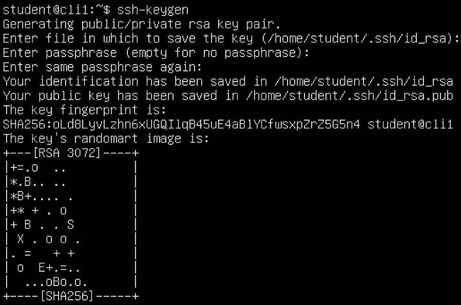

](img/Figure_7.1_B16269.jpg)

图 7.1 – 创建一个空的私钥的 SSH 密钥

现在，让我们将此密钥复制到远程机器（`cli2`）并通过尝试以该用户身份登录来测试 `SSH` 密钥复制过程是否有效。对于第一部分，我们将使用名为 `ssh-copy-id` 的命令（将密钥复制到远程机器），然后使用 SSH 尝试登录以测试 `SSH` 密钥是否正确复制：

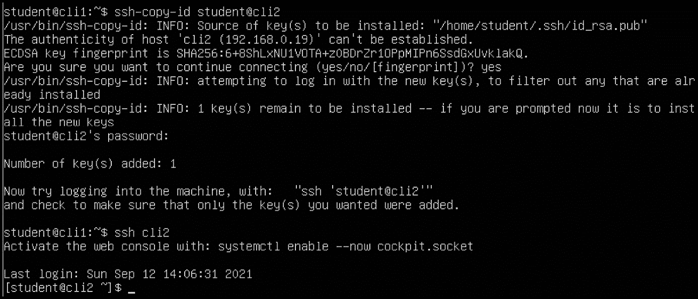

图 7.2 – 将 SSH 密钥复制到远程机器并测试其是否有效

如我们所见，`cli1` 到 `cli2` 一切正常。现在让我们反方向重复相同的过程，因为稍后我们需要它来完成本食谱的另一部分。首先，让我们创建一个 `SSH` 密钥：

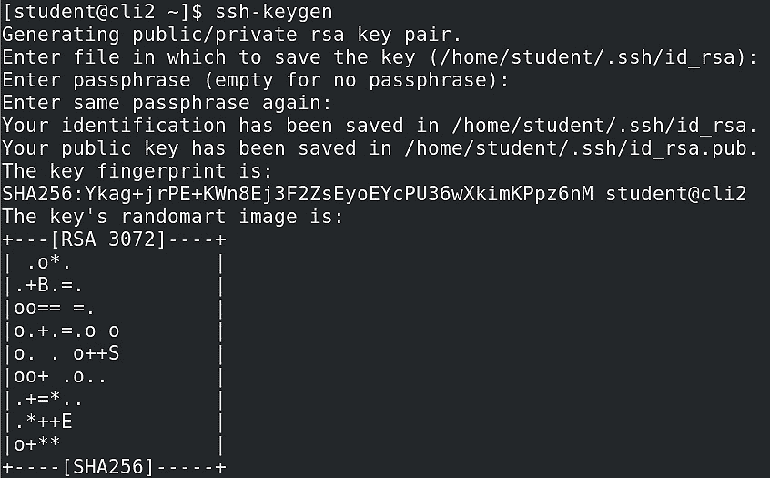

图 7.3 – 为 student@cli2 创建 SSH 密钥

然后，让我们将其复制到远程服务器：

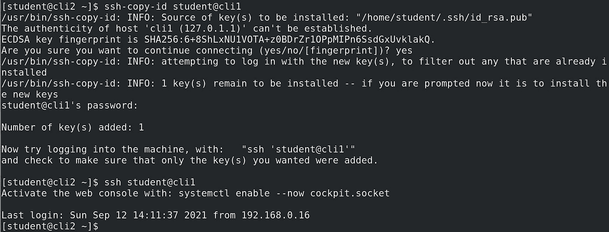

图 7.4 – 将 SSH 密钥从 cli2 复制到 cli1 并测试其是否有效

我们可以看到，在这两个示例中，连接到的远程服务器并没有要求我们输入密码。原因很简单：当我们创建 `SSH` 密钥时，`ssh-keygen` 给了我们两个非常重要的输入内容：

```
Enter passphrase (empty for no passphrase) :
Enter same passphrase again:
```

如果我们在第一个问题上按下 *Enter* 键，并在第二个问题上再次按 *Enter* 键确认，那就意味着我们创建了一个没有私钥的 `SSH` 密钥。正如我们在示例中所做的那样，我们没有选择任何特定的密码短语，因此将其留空。如果我们想使用自定义私钥，我们只需要在这两步中输入它。

## 它是如何工作的…

作为一种协议，SSH 是对 Telnet、`rlogin` 和 FTP 这些不存在安全性的协议的加密回应。这三种纯文本协议很容易被黑客攻击，特别是在我们开始使用网络交换机之前的那个“好日子”（那时我们大多使用的是网络集线器）。它的第一次实现可以追溯到 1995 年。它还可以作为隧道协议使用，过去曾广泛用于此——例如，用于代理 FTP 和 HTTP 流量。如今，它更多用于为远程 X 应用程序（XDMCP）或甚至 SSH 连接到通过基于 SSH 的隧道主机连接的服务器提供隧道服务。

简单来说，SSH 的工作方式如下：

1.  SSH 客户端连接到 SSH 服务器，从而启动连接。

1.  服务器响应并将其公钥提供给客户端。

1.  然后，服务器和客户端尝试协商必要的加密参数，接着在服务器和客户端之间打开安全通道。

1.  应用程序或用户登录到服务器。

对于熟悉 SSL/TLS 的朋友来说，它有点类似这两种协议，因为这些协议都是基于 TCP 的；它们有协商机制，并且通常用于安全目的。是的，它们以略有不同的方式工作，使用场景也略有不同，但这并不意味着它们在总体原理上有很大差异。

我们旅程中的下一站是`rsync`，并且我们将明确地使用`SSH`作为`rsync`的后端。这就是我们制作`SSH`密钥的原因，尤其是那些没有额外私钥（密码短语）的密钥。现在，让我们学习如何使用`rsync`。

## 还有更多…

如果你需要更多关于 CentOS 和 Ubuntu 网络的资料，请确保查看以下内容：

+   SSH 是如何工作的：[`www.hostinger.com/tutorials/ssh-tutorial-how-does-ssh-work`](https://www.hostinger.com/tutorials/ssh-tutorial-how-does-ssh-work)

+   **安全外壳协议** (**SSH**) 是什么：[`www.sdxcentral.com/security/definitions/what-is-the-secure-shell-ssh-protocol/`](https://www.sdxcentral.com/security/definitions/what-is-the-secure-shell-ssh-protocol/)

# 学习如何使用 rsync

在我们之前的示例中，我们从客户端的角度使用了 SSH。我们使用 SSH 和`SCP`同时登录并将文件从源复制到目标。我们讨论了如何使用用户名/密码组合登录远程系统，以及如何使用基于 SSH 密钥的身份验证。如果我们稍微集中讨论 SCP，有一件事情我们没有讨论，那就是如何*同步*本地源到本地目标，或者更好的是，如何在两个 Linux 服务器之间创建一个同步本地源到远程目标，反之亦然的场景。这时使用`rsync`，一个专门用于完成这一任务的工具，是最好的选择。让我们开始吧。

## 准备工作

我们将继续使用我们的`cli1`和`cli2`机器，分别运行 Ubuntu 和 CentOS。让我们先确保安装了必要的软件包。我们需要使用以下命令来操作 Ubuntu：

```
apt -y install rsync
```

我们使用以下命令来操作 CentOS：

```
dnf -y install rsync
```

完成后，我们准备开始。

## 如何操作…

我们将讨论几个场景：

+   本地源和本地目标之间的同步

+   本地源和远程目标之间的同步，或反之亦然

可能还会有许多其他子场景，例如处理单向同步和删除源上的文件，`rsync`只是一个子目录等等。我们将详细处理这两个场景，然后从这些子场景中补充一些细节。

让我们先处理一个简单的场景：如何将一个本地文件夹同步到另一个本地文件夹。假设我们要同步（基本上是创建一个备份）`/etc` 文件夹，并且我们想将它同步到 `/root/etc` 文件夹。我们可以通过以下命令作为 `root` 用户来实现（以 `cli1` 机器为例）：

```
rsync -av /etc /root 
```

使用的两个选项，`a` 和 `v`，分别是为了启用归档模式（保留权限和所有权）和详细模式，以便我们能够看到每次复制操作的输出。我们不需要提前在 `/root` 目录中创建 `/etc` 文件夹或将 `/root/etc` 作为目标文件夹，因为在执行命令时，名为 `etc` 的文件夹会自动在 `/root` 中创建。

如果我们想排除某些文件不进行复制（例如，所有以 `.conf` 扩展名结尾的文件），我们可以这样做：

```
rsync -av --exclude="*.conf" /etc /root 
```

在 `rsync` 中，还有一些其他很酷的选项可以使某些场景成为可能。假设我们想要复制最大为 5 MB，或最小为 3 MB 的文件。我们可以通过以下语法来实现：

```
rsync -av --max-size=5M source destination
rsync -av --min-size=3M source destination
```

例如，如果源目录在第二个示例中有很多大文件（最小大小），我们可能想要为 `rsync` 命令添加一个 `--progress` 选项，这样我们就能通过交互式输出看到进度。

现在，让我们处理从远程到本地目标的单向同步。相反的方向几乎是一样的，我们只需要在 `rsync` 中交换源和目标字段。所以，假设我们在 `cli2` 上有一个名为 `/home/student/source` 的源目录。该目录包含文件和子文件夹，它有一个文件和文件夹的层次结构。我们希望将这些内容同步到 `cli1`，具体来说，同步到 `/tmp` 目录。下面是我们的源目录内容：

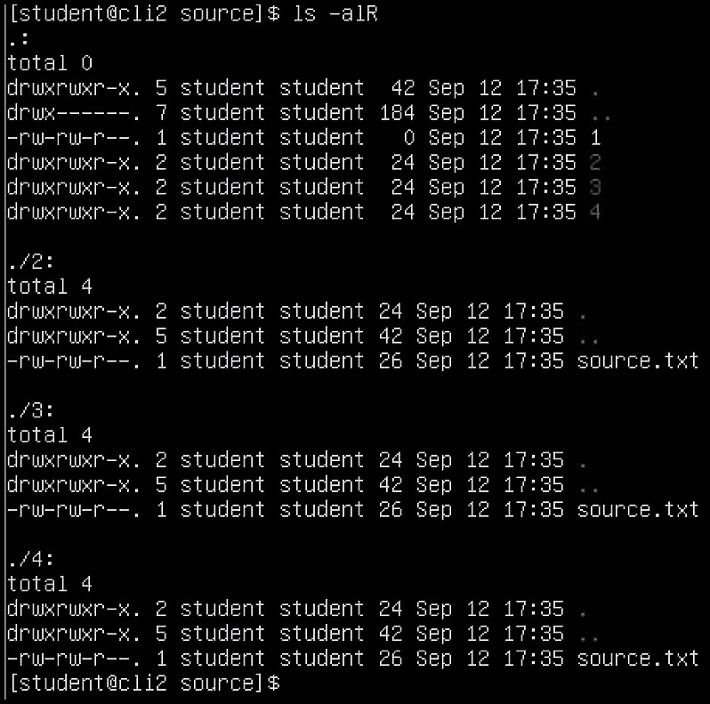

图 7.5 – 位于 /home/student/source 的 cli2 上的源目录

这是我们应该做的，前提是我们已经准备好了源文件：

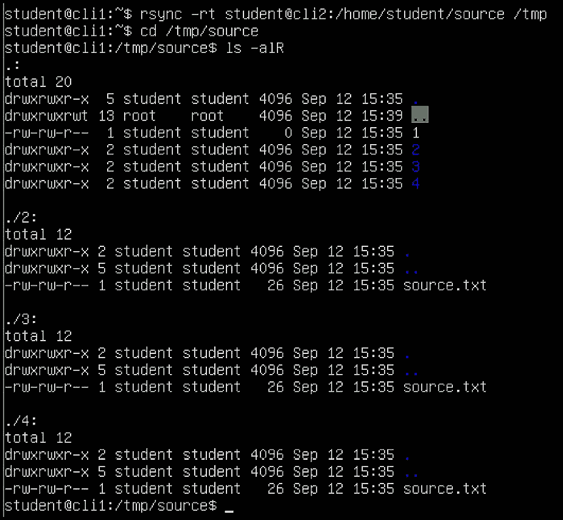

图 7.6 – 从远程源目录使用 rsync

所以，我们只用了一个简单的命令，`rsync -rt`（`-r` 表示递归，`-t` 用来保留时间），将源和目标作为参数，源目录成功地被传输到本地目录。这是因为我们在前面的操作中复制了 `SSH` 密钥，所以我们不需要进行身份验证，这使得整个过程变得非常简单和直接。

下一个场景将讨论同步源和目标后删除源文件。具体来说，我们是同步 *文件*，*而不是文件夹*，因为这些场景有不同的选项。让我们看看如何做到这一点：

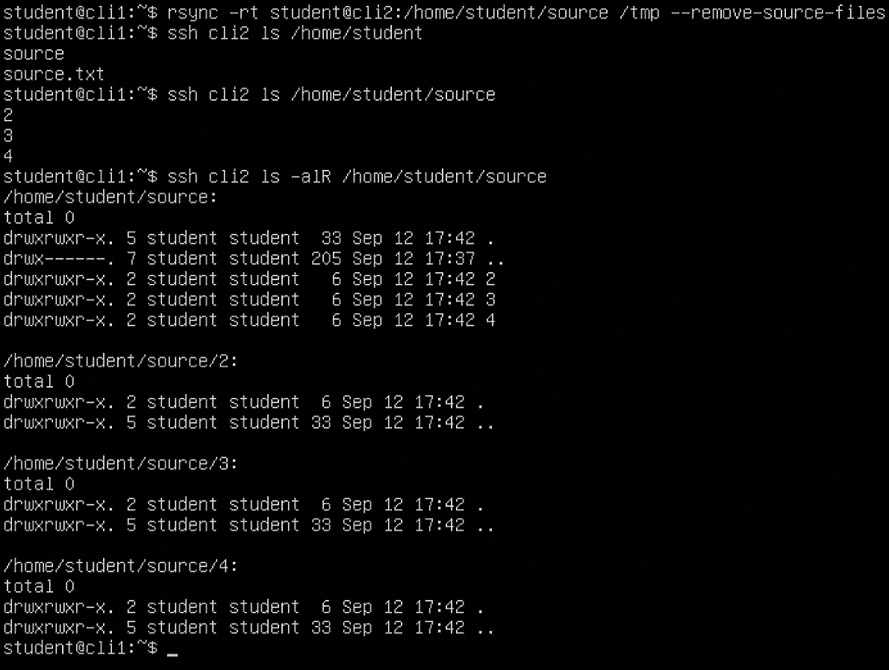

图 7.7 – 使用 SSH 密钥从远程服务器`rsync`，并在下载完成后删除源文件

现在，如果我们想要运行相同的场景，但在传输完成后从`cli2`中删除所有文件和文件夹，我们需要将其分成两个命令。下面是它的工作方式：

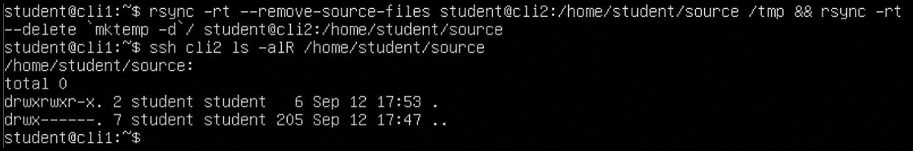

图 7.8 – 从远程源目录中删除源文件，然后删除源目录中的所有子目录

现在我们已经展示了这一点，我们还可以注意到其他几个项目，这些项目将使双向同步变得更加容易。像 Unison（[`www.cis.upenn.edu/~bcpierce/unison/`](https://www.cis.upenn.edu/~bcpierce/unison/)）和`bsync`（[`github.com/dooblem/bsync`](https://github.com/dooblem/bsync)）这样的项目已经实现了非常难以通过`rsync`实现的双向同步方法。如果您需要双向同步，请务必查看它们。

## 工作原理……

`rsync`是一种源-目标类型的命令，涵盖了其交互使用时的语法和操作模式（不涉及目标`rsync`服务）。也可以涉及`rsync`服务，这通常显著改变了操作模式。重要的是要指出，作为命令使用`rsync`（结合 SSH）最常用于备份。我们在某些环境中使用这种方式已经超过 15 年了，效果非常完美。

`rsyncd`（`rsync`服务）通常针对完全不同的使用模型，最常见的是软件镜像。如果我们想创建本地的 CentOS 或 Ubuntu 镜像，一般会使用`rsyncd`，因为它允许我们在`rsync`过程中进行更精细的配置。可能还有其他原因，比如我们可以配置`rsyncd`而不使用`SSH`，从而提高一些速度。

现在我们已经讨论了 SSH、SCP 和`rsync`的一些关键概念，是时候继续介绍它们——至少默认情况下——更不安全的表兄`vsftpd`。尽管如此，我们将确保将其更安全化，因为绝对没有理由不这样做。所以，让我们准备好配置`vsftpd`。

## 还有更多内容……

如果您需要了解更多关于`rsync`的信息，我们建议查阅以下链接：

+   如何在您的 Linux 服务器上设置`rsync`守护程序：[`www.atlantic.net/vps-hosting/how-to-setup-rsync-daemon-linux-server/`](https://www.atlantic.net/vps-hosting/how-to-setup-rsync-daemon-linux-server/)

+   Linux 中`rsync`命令的 10 个实际示例：[`www.tecmint.com/rsync-local-remote-file-synchronization-commands/`](https://www.tecmint.com/rsync-local-remote-file-synchronization-commands/)

+   17 个有用的`rsync`（远程同步）命令示例：[`www.linuxtechi.com/rsync-command-examples-linux/`](https://www.linuxtechi.com/rsync-command-examples-linux/)

# 使用 vsftpd

FTP 服务已经存在了几十年。早在 1990 年代中期，FTP 实际上占据了互联网流量的绝大部分。是的，随着时间的推移，它在流量量级上的重要性下降了，但情况并不仅仅如此。FTP 本身就是一个完全开放、明文传输的协议。所有主要发行版中包含的最新版本叫做`vsftpd`，它已经存在了十多年。我们将在本篇中关注三种场景：让`vsftpd`正常工作、让`vsftpd`与用户的主目录一起工作，以及——最后但同样重要——通过实施 TLS 和证书来使`vsftpd`变得更加安全。让我们开始吧！

## 准备工作

保持`cli1`和`cli2`虚拟机开机，并继续使用我们的 Shell。让我们通过使用标准命令来确保必要的包已经安装。对于 Ubuntu，可以使用以下命令：

```
apt -y install vsftpd
```

对于 CentOS，我们可以使用以下命令：

```
dnf -y install vsftpd
```

然后，我们启用它们并启动服务。我们将使用 Ubuntu 机器来展示`vsftpd`配置应该如何设置，但在 CentOS 上几乎是 100%相同的。所以，`cli1`（Ubuntu）将作为`vsftpd`服务器，`cli2`（CentOS）将作为`FTP`客户端。那么，让我们在`cli1`上运行这些命令：

```
systemctl start vsftpd
systemctl enable vsftpd
```

配置防火墙允许连接到必要的 FTP 端口（20, 21）是明智之举。所以，在`cli1`上，我们需要执行以下操作：

```
ufw allow ftp
ufw allow ftp-data
```

在客户端（`cli2`）上，让我们使用以下命令安装`lftp`，一个既简单又好用的`ftp`客户端：

```
dnf -y install lftp
```

现在，让我们根据我们提到的三种场景来配置`vsftpd`。

## 如何操作…

现在我们已经安装了必要的包，是时候在`cli1`上开始配置`vsftpd`了。这意味着我们需要查看`/etc/vsftpd.conf`中的一些选项（通常，在 CentOS 上是`/etc/vsftpd/vsftpd.conf`）。

通常来说，这个配置文件本身就有很好的文档说明，因此我们应该不会在配置它以适应我们的需求时遇到任何问题。默认情况下，它应该允许我们使用`FTP`客户端连接，但从一开始我们就做一些改变。让我们允许匿名 FTP 并禁止本地用户登录。如果我们检查配置文件，这意味着我们需要配置`anon_root`、`anonymous_enable`和`local_enable`这几个选项，所以我们就这么做。让我们确保这两行配置看起来是这样的：

```
anonymous_enable=YES
local_enable=NO
anon_root=/var/ftp
```

我们还需要创建一些目录，以确保此配置能够正常工作：

```
mkdir -p /var/ftp/pub
chown nobody:nogroup /var/ftp/pub
```

重新启动`vsftpd`服务，以便它能够与最新的配置一起工作：

```
systemctl restart vsftpd
```

在`cli2`上，我们已经安装了`lftp`，它默认会尝试匿名登录到远程 FTP 服务器（`cli1`）。让我们来看看它是如何工作的：

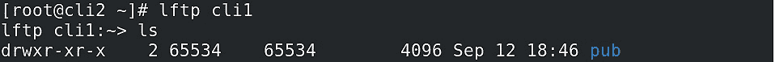

](img/Figure_7.9_B16269.jpg)

图 7.9 – 使用 lftp 测试 FTP 连接

我们可以看到没有错误，但在匿名 FTP 服务使用的目录中我们没有任何内容。在 Ubuntu 中，该目录位于`/srv/ftp`，但我们已经将匿名根目录更改为`/var/ftp`。让我们在这里添加几个文件，并尝试在`lftp`中列出目录内容：

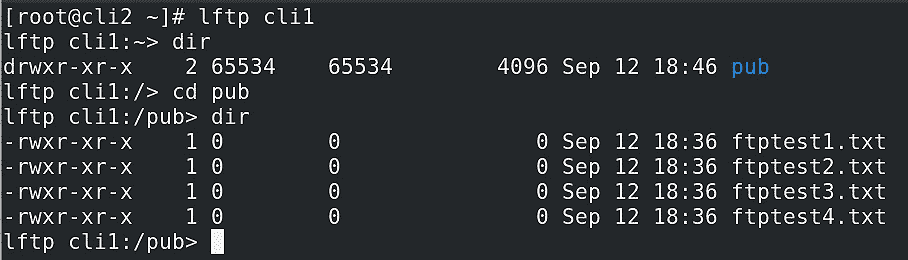

图 7.10 – 检查我们是否能看到通过 touch 命令在 cli1 上创建的文件

现在让我们尝试下载这些文件。为此，FTP 有一个叫做`get`的命令（类似于 HTTP 的`get`命令）。现在让我们下载这些我们用`touch`命令创建的四个文件：

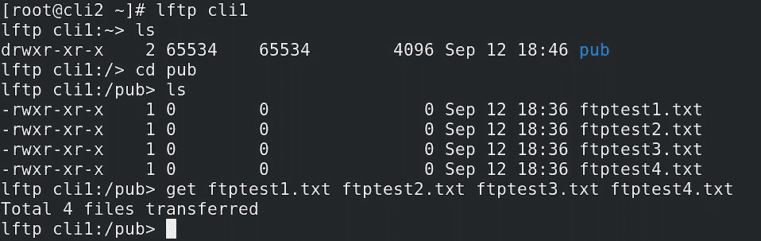

图 7.11 – 使用 FTP 的 get 命令从 FTP 服务器检索多个文件

如果我们想上传文件，我们需要使用`put`命令，但当然，这不会生效，因为默认情况下匿名上传是禁止的（这是应该的）。

我们场景的下一部分是允许用户登录到用户的主目录。这应该不会太难，因为我们已经提到过需要更改的第一个选项，`local_enable`，它需要设置为`YES`。之后，我们需要重启`vsftpd`服务。完成后，我们需要以本地用户身份登录到 FTP 服务器。考虑到我们有一个叫做`student`的用户，我们就用这个账户登录：

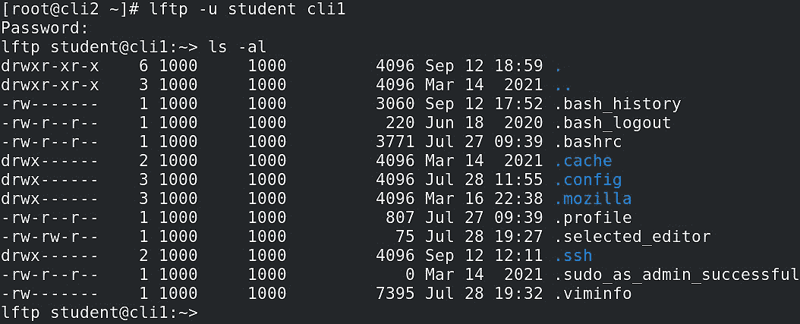

图 7.12 – 通过 lftp 以 student 用户身份登录（使用-u 选项）

到目前为止没有问题。但是所有这些步骤的前提是我们在一个内部的安全网络范围内进行操作。如果我们的 FTP 服务器需要暴露到互联网上会怎样？我们不想仅仅使用普通的明文 FTP，因为那样会带来灾难。所以，我们的下一步是将 FTP 配置为使用 TLS。

我们需要在`vsftpd.conf`中配置几个选项，我们可以自由地将这些选项放在文件的末尾：

```
rsa_cert_file=/etc/ssl/certs/ssl-cert-snakeoil.pem
rsa_private_key_file=/etc/ssl/private/ssl-cert-snakeoil.key
ssl_enable=Yes
ssl_tlsv1=YES
ssl_sslv2=NO
ssl_sslv3=NO
ssl_ciphers=HIGH
force_local_data_ssl=YES
force_local_logins_ssl=YES
ssl_request_cert=NO
allow_anon_ssl=YES
```

我们需要根据我们的安全要求配置这些选项。最常见的是，我们希望启用 TLS 1.2 或 1.3（`ssl_ciphers=HIGH`，`SSLv2`和`v3=no`）。我们总是可以不允许匿名用户使用`SSL`，如果我们不想运行基于客户端证书的认证，我们必须确保使用`ssl_request_cert=NO`选项。

在此配置的开始部分，我们可以看到`cert`文件以及相应的私钥配置选项。我们只是使用了内置的自签名证书。当然，我们也可以创建 Let's Encrypt 证书，或者购买商业证书并将其放入这里的配置中。这完全取决于我们想要运行此类配置的企业安全策略。

关于 Windows 上的 FTP 客户端的简要说明：许多人使用 WinSCP 通过 SCP、SFTP、FTP、WebDav 和 Amazon S3 等协议上传和下载文件与目录。如果我们使用 WinSCP，我们需要根据情况使用 FTP 配置、TLS/SSL 显式加密以及其他相关参数。如果我们点击`1.2`，还可以选择最小版本和最大版本。但如果我们已经按推荐设置了`vsftpd.conf`，则无需调整这些选项，因为**TLS v1.2**将是唯一可用的选项。我们只是想提到这些高级选项，以防万一你需要它们。

话虽如此，这里有一张截图，能帮助了解基本选项：

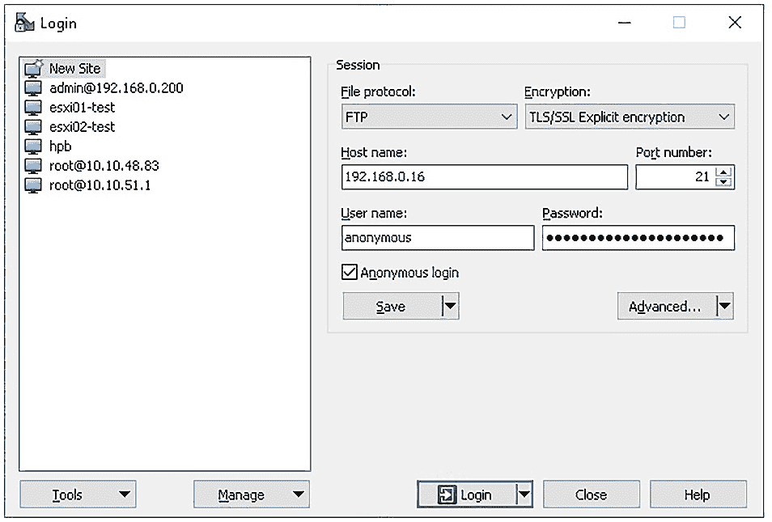

图 7.13 – 如何连接到启用 TLS 1.2 的 vsftpd

`192.168.0.16`是`cli1`机器的 IP 地址。通过使用之前提到的所有选项，我们可以匿名登录到`vsftpd`服务器并使用它，就像在进行 TLS 配置之前一样。但是，考虑到过去几年中`SSL`协议遭遇了成百上千种不同类型的攻击（如 POODLE、BEAST、CRIME、BREACH、Heartbleed、SSL Stripping、使用不受信任的虚假证书颁发机构等），我们必须密切关注每一个新出现的攻击，并采取一切必要措施来减轻这些威胁。

## 它是如何工作的…

`vsftpd`是 FTP 的一种实现，意味着它是一个基于 TCP 的服务，用于上传和下载文件。由于它是一个基于 TCP 的服务，这意味着它涉及套接字连接和可靠的数据传输，这对该服务至关重要。想象一下，如果我们的文件下载或上传不可靠，我们肯定不希望发生这种情况。如果我们通过使用 TLS 为其增加一层额外的安全性，我们仍然在使用相同的基本服务，只是它将更加受保护。

FTP 使用端口 `20`（`ftp-data`）和 `21`（`ftp`）。这两个端口需要通过防火墙放行，以便 FTP 服务能够正常工作。端口 `21` 用作*命令*通信通道，而端口 `20` 用于数据传输，尽管也有一些实现中端口 `21` 被同时用于两者。使用 FTP 服务时有其他选项（主动 FTP 和被动 FTP），但这些超出了本书的范围。一般来说，几乎每个人如今都使用 SCP 进行文件上传和下载是有原因的。此外，绝大多数的发行版仓库和镜像站点也转而使用基于 HTTPS 的交付方式而非 FTP。虽然也有例外情况，但这些更多是*例外情况*，绝不是标准做法。

FTP 使用 `put` 和 `get` 命令来完成其基本功能：上传（`put`）和下载（`get`）。这两个是 FTP 使用的基本命令/方法，尽管我们也可以通过 FTP 创建和删除内容。

## 还有更多

如果你想了解更多关于`vsftpd`的信息，确保查看以下链接：

+   `vsftpd` 官方页面：[`security.appspot.com/vsftpd.html`](https://security.appspot.com/vsftpd.html)

+   `vsftpd.conf` 手册页：[`security.appspot.com/vsftpd/vsftpd_conf.html`](https://security.appspot.com/vsftpd/vsftpd_conf.html)

+   FTP 服务器是如何工作的，以及它有哪些好处：[`www.ftptoday.com/blog/how-does-an-ftp-server-work-the-benefits`](https://www.ftptoday.com/blog/how-does-an-ftp-server-work-the-benefits)

+   如何在 Ubuntu 16.04 上设置 `vsftpd` 进行匿名下载：[`www.digitalocean.com/community/tutorials/how-to-set-up-vsftpd-for-anonymous-downloads-on-ubuntu-16-04`](https://www.digitalocean.com/community/tutorials/how-to-set-up-vsftpd-for-anonymous-downloads-on-ubuntu-16-04)
