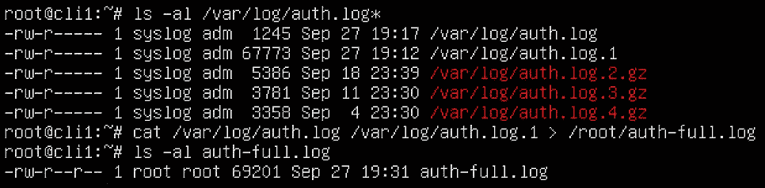
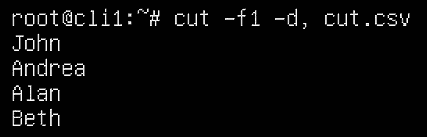
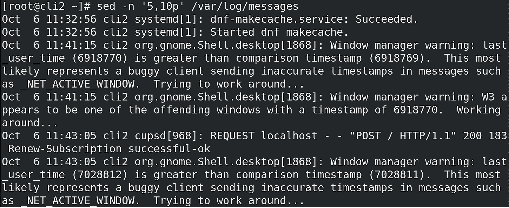

# 第八章：使用命令行查找、提取和操作文本内容

操作文本是全职系统管理员的日常工作。这可能出于多种原因——例如，你可能只是想找到你在某个配置文件中看到的某个服务选项，却记不起该配置文件的名字。你知道吗，那种星期一早晨，你还没喝上两杯提神饮料，CPU 还没正确启动的时候？或者，也许当你在处理一个包含大量内容的文本文件时，但需要做一些特定的修改，比如将一些配置选项从关闭改为打开、从真改为假、从 0 改为 1 等等。本章将作为后续章节讨论 Shell 脚本示例的前奏。

在本章中，我们将学习以下内容：

+   使用文本命令合并文件内容

+   将 DOS 文本转换为 Linux 文本，反之亦然

+   使用 `cut`

+   使用 `egrep`

+   使用 `sed`

# 技术要求

对于这些操作，我们将使用一台 Linux 机器——我们可以使用之前食谱中的 `client1`。实际上，使用哪台虚拟机并不重要，因为我们在这些食谱中讨论的所有命令在所有 Linux 发行版上都以相同的方式工作。

# 使用文本命令合并文件内容

我们先从简单的开始——即合并文件内容。当然，这里我们只讨论文本内容，因为合并二进制文件是没有意义的。我们的目标是学习如何使用两个命令——`paste` 和 `cat`——来做一些简单的事情，比如拼接和逐行合并。让我们开始吧！

## 准备工作

我们只需要一台 Ubuntu 和一台 CentOS 机器来完成这个操作。在这里，我们将使用 `cli1` 和 `cli2` 来掌握这些命令。

## 如何操作…

从本章最简单的命令开始——`cat`——我们来看一些它的使用示例。如果我们输入类似 `cat filename.txt` 这样的命令——前提是存在名为 `filename.txt` 的文件——我们将看到该文件的内容。我们来看看这个例子：


图 8.1 – 在文本文件上使用 `cat` 命令

因此，我们使用 `cat` 命令显示位于 `/var/log` 目录下的 `auth.log` 文件的内容。如果我们已经使用这台机器一段时间，可能会有其他以 `auth.log` 为前缀、后跟一个数字和 `gz` 扩展名的文件。我们来检查一下：


图 8.2 – 查找我们将要使用的内容

所以，为了这个教程的目的，我们使用`auth.log`和`auth.log.1`文件。如果我们想要一个文件同时包含`auth.log`和`auth.log.1`的内容，会发生什么呢？我们可以打开文本编辑器进行复制粘贴，或者使用`cat`命令来完成。`cat`命令可以同时处理多个文件，比如`cat auth.log auth.log.1`，这会显示第一个文件的内容，然后是第二个文件的内容。我们需要做的唯一事情是将该命令的文本输出重定向到一个新文件，这可以通过使用`>`符号轻松实现。假设我们想将命令的输出保存到`/root`目录下的`auth-full.log`文件中，下面是实现的方法：



图 8.3 – 使用 cat 命令连接文件

`cat`实际上是逐行显示文本文件，这是我们将在与 Shell 脚本示例相关的章节中大量使用的一个特性。

如果由于某种原因我们想逐行合并文件，可以使用`paste`命令。让我们来看一下它是如何工作的。由于这些文件太大，我们将创建两个文件。假设第一个文件（命名为`first.txt`）包含以下内容：

```
1 today
2 tomorrow
3 someday
```

第二个文件（命名为`second.txt`）将包含以下内容：

```
may be good
may be even better
will be excellent
```

现在，让我们使用`paste`命令并查看结果：


图 8.4 – 使用 paste 命令逐行合并文本文件

正如我们所看到的，`paste`命令通过将两个文件并排放置来逐行合并它们。

## 它是如何工作的……

这两个命令的操作非常简单：

+   默认情况下，`cat`会逐行显示文件或多个文件的完整内容。

+   默认情况下，`paste`命令是逐行并排合并文件的。

这两种方法在文本处理上完全不同，但都具有实际应用场景。

我们的下一个教程也很简单——当我们将文本文件从 Microsoft 操作系统转移到 Linux 时，如何处理使它们在 Linux 中可用。正如我们将看到的，Microsoft 操作系统和 Linux 之间在`.txt`格式上存在一些根本性的差异，这使得下一个教程成为必需。敬请期待！

## 还有更多……

如果你需要更多关于使用`cat`或`paste`的信息，确保查看以下内容：

+   Linux 中的基本`cat`命令示例：[`www.tecmint.com/13-basic-cat-command-examples-in-linux/`](https://www.tecmint.com/13-basic-cat-command-examples-in-linux/%0D)

+   Linux 中的`paste`命令（合并行）：[`linuxize.com/post/paste-command-in-linux/`](https://linuxize.com/post/paste-command-in-linux/%0D)

# 将 DOS 文本转换为 Linux 文本，反之亦然

这个想法很奇怪——你可能会认为`.txt`文件就是`.txt`文件，对吗？错了。

DOS/Windows 和 Linux 中的 `.txt` 文件格式之间有细微的差异。有时，这些差异可能让你在几秒钟内抓狂。我们也有过类似的经历——脚本不能正常工作，因为输入文件是在 Windows 而不是 Linux 上准备的；Excel 中的 CSV 文件 *按设计* 被不同地处理…有时候，经过几个小时的思考，当你意识到像在另一个操作系统上创建的 `.txt` 文件这样的简单问题造成了这么大的混乱时，真是太好笑了。让我们解释一下问题是什么，并一起来解决它。

## 准备工作

我们只需要一台 Ubuntu 机器来完成这个教程。假设我们将继续使用 `cli1` 来掌握这些命令。此外，我们需要安装一个名为 `dos2unix` 的软件包。所以，如果我们使用的是 `cli1`（Ubuntu），我们需要输入以下命令：

```
apt-get -y install dos2unix
```

安装好这个软件包后，我们就可以开始做我们的教程了。

## 它是怎么做的…

假设我们在 Windows 上使用 Notepad 创建了一个名为 `txtsample.txt` 的 `.txt` 文件，其中包含以下内容：

```
My first line in a file
My second line in a file
My third line in a file
My fourth line in a file
```

然后，我们将这个文件上传到我们的 `cli1` 机器，并在 vi 或 vim 中打开它来检查其内容。它看起来是这样的：


图 8.5 – 我们的文件看起来像什么

一切看起来正常，对吧？现在，让我们重新做一遍相同的事情，但这次从 vi 或 vim 中使用 `-b` 选项启动。例如，使用 `vi` `-b txtsample.txt` 命令并检查文件内容。现在应该是这样的：


图 8.6 – 我们的文件实际样子

现在我们可以在 vi/vim 编辑器中看到 `^M` 字符。这是 Notepad 和 Linux 文本编辑器处理 `.txt` 文件时的细微差别之一。Linux 的 shell 命令不一定会以友好的方式处理这种文本，有时脚本因为这些 Linux 命令不需要的 *额外* 字符而无法正常工作。

这个问题的解决方案是一个简单的软件包和命令，叫做 `dos2unix`，我们在本教程的 *准备工作* 步骤中已经安装了它。之后，只需输入以下命令：

```
dos2unix txtsample.txt
```

现在让我们在 vi 中用相同的 `-b` 选项打开这个文件，并检查文件内容：


图 8.7 – 结果 – 一个去除 CR 的文件

现在好多了。

还有其他类似的例子——文件结束字符，*看不见* 的字符，有时会在 Excel 导出的 CSV 文件中突然出现。因此，我们必须确保我们意识到这个问题及其简单的解决方法。

我们还可以使用 `tr`、`awk` 和 `perl` 等工具来做同样的事情。以 `tr` 为例：

```
tr -d '\15\32' < input_dos_file.txt > output_linux_file.txt
```

现在让我们解释一下这个过程是如何工作的，以及它为什么会成为一个问题。

## 它是如何工作的…

CR 是一个控制字符，它多年来被用来标识行尾，并因此开始新的一行。对于我们这些还记得旧打字机的人来说，打字机上的 CR 就是那个奇怪的杠杆，我们必须拉动它才能跳到下一行。它实际上是 ASCII 码的一部分，用于帮助定位光标（指向下一行的开始位置）。

如果我们不清理`.txt`文件中的这些字符（以及其他字符），在编写脚本时可能会遇到问题。在本书的最后两章中，我们将提供多个示例脚本，这些脚本使用`cat`命令从`.txt`文件中读取内容并传入循环。这些字符可能会干扰这个过程，我们可不希望这样。

`dos2unix`和前面提到的`tr`命令可以去除输入文件中的 CR 字符。我们可以辩论哪种方法更好，但最终重要的是结果，两者都能奏效。我们更倾向于使用`dos2unix`方法；当然，你也可以选择`tr`方法。

## 还有更多…

如果你需要更多关于将 DOS 格式`.txt`文件转换为 Linux 格式的信息，请参考以下链接：

+   `dos2unix`手册页：[`linux.die.net/man/1/dos2unix`](https://linux.die.net/man/1/dos2unix%0D)

+   `yr`手册页：[`linux.die.net/man/1/tr`](https://linux.die.net/man/1/tr%0D)

# 使用 cut

有一些工具在 IT 领域因其出色的功能而被推崇。接下来我们要使用的三个工具正是符合一些最伟大的命令行工具的标准。对我们来说，`cut`是历史上第二伟大的 CLI 命令；如果你想知道哪个命令摘得*第一*的位置，请继续关注接下来的教程。

`cut`是一个非常有用的工具，它能让我们在处理预格式化输入时事半功倍。例如，它可以轻松处理 CSV 格式文件，因为这种格式的内容可以被`cut`轻松解析。接下来我们将通过一些示例来学习如何使用`cut`。

## 准备工作

我们只需要一台 Ubuntu 机器来执行这个任务，所以继续使用`cli1`。`cut`命令是任何 Linux 发行版的标准工具，它的重要性不亚于其他命令，比如`ls`、`mkdir`和`ps`。

## 如何操作…

我们首先创建一个示例 CSV 文件。例如，我们将创建一个包含用户数据的 CSV 文件，并在这个文件上使用`cut`。以下是我们为这个任务所使用的 CSV 文件内容：


](img/Figure_8.8_B16269.jpg)

Figure 8.8 – 示例输入 CSV 文件

现在我们来看看如何使用这个文件和`cut`命令。首先从一些简单的操作开始。例如，我们将从这个文件中提取出名字，也就是提取第一个字段（第一个逗号前的内容）：



](img/Figure_8.9_B16269.jpg)

图 8.9 – 从标准格式文件中提取第一个字段

通过使用 `cut` 命令和两个开关，我们能够轻松地从 CSV 文件中提取名称。现在，让我们对这个过程再做一点扩展。让我们提取名称和登录名（第一个和第三个字段）：


图 8.10 – 从示例文件中提取第一个和第三个字段

此外，现在让我们提取前三个字段——姓名、姓氏和登录名：


图 8.11 – 从示例文件中提取字段范围

我们还可以选择按字母顺序对输出进行排序：


图 8.12 – 从切割文件中排序输出

另一个经典的例子是使用 `cut` 从某个特定字段开始输出字段——例如，从第二个字段到最后一个字段：


图 8.13 – 从第二个字段开始提取字段

如果你熟悉 Microsoft PowerShell，这个操作可能会让你联想到 `Import-Csv` PowerShell cmdlet，尽管相似之处仅此而已，因为 PowerShell 是基于对象的 shell 语言。

如你所见，`cut` 命令在处理一些标准格式的输入文件时非常有用，这些文件使用某些字符作为字段之间的分隔符。我们可以轻松地使用它从文本文件中提取内容，并为后续的操作准备基于文本的输入，这些操作可能会使用 `cut` 在 shell 脚本中进行。

## 它是如何工作的…

`cut` 是一个简单的命令，只有一个前提条件——我们需要有一个格式化为某种标准格式的输入文件。这意味着文件的字段由相同的字符分隔。如果满足此条件，我们可以轻松使用 `cut` 在一行命令和 shell 脚本中发挥作用。

最常用的是，我们在使用 `cut` 命令时会使用两个参数：

+   `-f` 参数用于选择我们要提取的字段或字段范围。

+   `-d` 参数用于选择分隔符，一个分隔我们文本字符串的字符。

我们还可以将其与其他命令一起使用，如 `sort`、`tr` 和 `uniq`，对使用 `cut` 命令提取的输出进行进一步操作。我们甚至可以使用其名为 `--output-delimiter` 的参数，将输入分隔符更改为其他输出分隔符。

这是一个热身练习，为了之后的明星命令——`egrep` 命令——做准备，因为它的重要性无法过分强调。接下来我们来讨论 `egrep`。

## 还有更多…

如果你需要更多关于 CentOS 和 Ubuntu 网络的信息，请确保查看以下内容：

+   `cut`命令手册页：[`man7.org/linux/man-pages/man1/cut.1.html`](https://man7.org/linux/man-pages/man1/cut.1.html%0D)

+   Bash `cut`命令示例：[`linuxhint.com/bash-cut-command-examples/`](https://linuxhint.com/bash-cut-command-examples/%0D)

# 使用`egrep`

使用`egrep`和正则表达式通常类似于《如何成为既酷又超级实用的 IT 手册》第一页、第一章的内容，尽管这本书从未写成过。毫无疑问，这是 UNIX/Linux 世界中为系统管理发明的最有用的命令。无论我们是在文件或一组目录中查找特定字符串，还是在大文本文件中找到包含特定字符串的行，或者查找特定字符串不存在的位置，`egrep`都能做到这一切。我们特别关注`egrep`，因为它支持该命令背后的两个概念——正则表达式和扩展正则表达式。这就是我们开始的地方——首先解释使用正则表达式的优点，然后进一步解释为什么`egrep`是如此重要的命令。所以，系好安全带，准备出发！

## 准备工作

我们将使用两台虚拟机进行这个教程——基于 Ubuntu 的`cli1`和基于 CentOS 的`cli2`。这样做可以为我们提供更多的示例，因为 Ubuntu 上的日志配置与 CentOS 略有不同，而 CentOS 的日志配置则更容易帮助我们理解一些要点。所以，请启动这两台虚拟机，准备开始吧。

## 如何操作…

如果我们花点时间了解如何使用正则表达式，使用它对每个人来说都会变得非常自然。由此，我们与正则表达式的第一个*前端*就是使用`grep`或`egrep`命令。这些命令使我们能够在文本文件或文本输入中找到特定的文本字符串。

让我们使用一个简单的例子。在*第四章*《使用 Shell 配置和故障排除网络》中，我们使用了`ps`命令来显示正在运行的进程。假设我们现在也想这样做，但是使用正则表达式。例如，我们需要列出在 Linux 服务器上由用户`student`启动的所有进程。

如果我们首先使用`ps`命令——例如，使用`ps auwwx`命令——我们会得到如下输出：


图 8.14 – ps auwwx 输入，因格式化原因被截断

现在，让我们简单讨论一下这只是一个文本输出的事实——它包含了大量的字母和数字。此外，我们还需要关注一个事实，即系统上运行的所有进程在 `ps` 命令的输出中都由一行表示——这一行，如图所示，以 `root, www-data` 字符串开头，或者其他代表拥有该进程的用户的字符串。那么，如果我们想办法利用这一点作为属性来过滤 `ps` 命令的文本输出呢？我们可以通过使用*以`student`开头*来进行过滤。

如果我们想要做到这一点，我们可以使用一个简单的命令：`ps auwwx | grep ^student`。正如我们之前讨论的，`|` 符号表示*我们希望将第一个命令的输出传递给第二个命令*。此外，`grep` 表示*我们希望过滤某些内容*。而这个 `^student` 是什么呢？它是我们所称的正则表达式模式，其中 `^` 字符是正则表达式符号。具体来说，它是一个锚点，当与 `grep` 或其他支持正则表达式的命令一起使用时，意味着*行以*该字符或其后的一组字符开始。让我们把这个理论付诸实践：


图 8.15 – 使用我们的第一个正则表达式

好的，我们通过使用 `student` 字符串作为过滤条件来过滤输出。我们还可以看到每次出现该字符串时，都会用红色标出。这是因为 `grep` 命令默认使用了 `--color` 选项——这个选项会高亮显示我们用作过滤条件的字符串。

假设现在我们想要查找所有在 `ps auwwx` 输出中以 `bash` 字符串结尾的行。我们可以轻松地使用正则表达式来实现这一点。下面是我们如何操作：


图 8.16 – 使用正则表达式查找位于行尾的字符串

到目前为止，我们已经使用过 `ps` 命令，因为它方便且熟悉。接下来，我们将转向其他示例，这些示例将以文本文件为基础。首先想到的是 `/usr/share/dict/words`，这是一个包含超过 100,000 个单词的字典文本文件。该文件的格式是*每行一个单词*，所以超过 100,000 个单词就意味着超过 100,000 行。我们来尝试找到所有包含 `parrot` 字符串的行。下面是命令和结果：


图 8.17 – 直接在文本文件上使用 grep

所以，`grep` 命令也可以直接用于文本文件，这在处理脚本、输入文件到脚本等情况时非常有用。

到目前为止，一切顺利。让我们把事情变得更复杂一点。假设我们需要找到同一个文件（`/usr/share/dict/words`）中所有符合以下规则的字符串：

+   这一行需要以 `p` 开头。

+   字母`p`后面需要*跟着一个元音*。

+   元音字母后面需要跟着`ta`字符串。

突然间，事情变得更加复杂。试想一下，必须使用常规文本编辑器来查找这些单词。写下所有这些组合将导致我们找到以下我们正在寻找的单词：

+   `pata`，后面跟着任何东西

+   `peta`，后面跟着任何东西

+   `pita`，后面跟着任何东西

+   `pota`，后面跟着任何东西

+   `puta`，后面跟着任何东西

在常规文本编辑器中，我们需要五次不同的连续查找来找到所有单词，即便如此，我们还需要按*下一步-下一步-下一步*来查找每个出现的地方，以防这些字符串样本可以多次匹配。

这就是正则表达式大有用处的地方。我们可以这样做：


图 8.18 – 查找更复杂的字符串示例

通过使用`^p[aeiou]ta`正则表达式，我们能够轻松找到所有符合该标准的单词。当我们使用这些方括号输入正则表达式时，实际上是在告诉支持正则表达式的命令去查找*字符 a、e、i、o 或 u*，作为正则表达式字符串中的一个字符。

正如我们所看到的，了解正则表达式是非常有用的。让我们再添加一些正则表达式，并简要解释一下：


表 8.1 – 常用正则表达式符号及其含义

我们可以使用更多的正则表达式，但我们先从这些开始，然后再转向更复杂的例子——例如，扩展正则表达式。

那么，如何匹配数字呢？用正则表达式匹配数字可以说是*有趣*的，特别是当我们需要查找数字范围时——如果是这种情况，事情很快就会变得非常复杂。我们通过三个示例来讨论这个问题——一个是单个数字范围，一个是简单的两位数字范围，还有一个是更复杂的两位数字范围。我们可以推断出这种逻辑如何应用于更大的数字范围。我们从一个简单的例子开始——例如，0 到 5 的数字范围——仅使用正则表达式，暂时忘记`grep`命令。在正则表达式中，这将是`[0-5]`。

对于下一个例子，我们使用一个简单的两位数字范围——假设是 14-19\。在正则表达式中，我们可以写作`1[4-9]`。

这意味着 1 作为前导数字（十位数），然后是从 4 到 9 的数字范围，即 14-19\。

到目前为止，我们特意选择使用 `grep` 命令做这些第一个示例，因为它适用于基本正则表达式。如果我们想要使用扩展正则表达式，我们需要在 `grep` 命令中添加 `-E` 参数，或者开始使用 `egrep` 命令。到目前为止，我们已经涵盖了一些基础内容，接下来是让事情变得复杂一些。到目前为止，我们讨论的所有内容中，`\?` 和 `\|` 在扩展正则表达式（ERE）中被替换为 `?` 和 `|`。这使得语法更简洁，视觉效果也更好。让我们继续举些例子，首先继续我们的 *使用正则表达式匹配数字* 的讨论。

如果我们需要找到一个数字范围，例如 37-94，该怎么办？正则表达式不能处理范围内的多位数字——我们需要将其分割为个位、十位、百位等等。然后，我们需要使用一个非常著名的概念——集合的并集（范围集合）来将所有范围组合成一个符合我们想要的正则表达式的范围。记住，我们需要一个集合——在这个例子中是一个数字集合——我们将通过使用扩展正则表达式（ERE）来实现这一点。让我们看看在最小化的前提下是如何工作的——我们希望得到尽可能短的正则表达式。知道我们需要使用集合的并集，最简单的实现这个数字范围的方法如下：

+   37-39

+   40-89

+   90-94

在正则表达式中，这些集合会是如下形式：

+   `3[7-9]` 代表 37-39

+   `[4-8][0-9]` 代表 40-89

+   `9[0-4]` 代表 90-94

作为正则表达式，我们会这样写：

`3[7-9]|[4-8][0-9]|9[0-4]`

这里，`|` 符号基本上表示 *或*。这是使用正则表达式时实现并集的一种方式。

记住，Ubuntu 版本的 `/usr/share/dict/words` 文件中没有任何数字，我们在文件顶部添加了一些数字，以便进行测试。例如，我们在文件顶部添加了以下内容：

+   `41`

+   `58`

+   `36`

+   `95`

+   `94`

我们故意选择了这些数字，因为它们既包含符合我们所做正则表达式的数字（41、58 和 94 会匹配），也包含不符合的数字（36 和 95）。如果我们在这个包含数字的文件上使用带有正则表达式的`grep`，我们将得到以下输出：


图 8.19 – 使用并集可以找到我们的匹配项

随着我们要查找的数字位数的增加，正则表达式变得越来越复杂。我们应该尽量简化，但在某些情况下，我们必须使用大量并集来找到我们正在寻找的内容。这就是规则，没有什么值得嘲笑的。

我们的下一个例子是查找长度为 19 到 20 个字符的单词（仅限字母），我们依然使用之前的文件，来看如何做到这一点：


图 8.20 – 查找特定长度的单词

很简单，对吧？我们匹配了所有的小写和大写字母，然后说*单词需要包含 19 到 20 个这样的字母*。

当你试图为一些既常见又不同的单词创建正则表达式时，事情往往变得更加复杂，特别是当单词的长度可变时，更加困难的是，如果涉及到数字范围，情况会更加复杂。但是所有这些并没有帮助我们更接近解释正则表达式的实际用途——即其真正的价值所在。到目前为止，我们所做的一切看起来像是一般的“胡说八道”，*尝试找一些文本——为什么我们要在乎这些呢？* 一般来说，我们只是描述了原理，因为使用通用的示例有助于理解。实际上，通过阅读 10-15 页的文本是绝对无法学会正则表达式的。但现在，我们将努力将这个故事推进到正则表达式在实际生活中的应用。

有一些常见的服务不断使用 `grep` 和/或正则表达式。我们必须记住，这个食谱是关于 `grep` 命令的，而不仅仅是正则表达式。

例如，正则表达式在邮件过滤中被广泛使用。检查电子邮件的正文——基本上是文本内容——如果你有一个支持正则表达式的邮件过滤器，这就很容易了。从日常系统管理员的角度来看，正则表达式被不断用于解析日志文件并从中找到有价值的信息。让我们通过对日志文件使用正则表达式来阐明这一点，因为这已经是几十年来最常用的做法之一。

现在让我们切换到 `cli2`，我们的基于 CentOS 的系统，并使用 `/var/log/messages` 作为接下来的示例。这个文件包含了 CentOS 上的主要系统日志，因此它非常适合使用正则表达式来查找其中的内容。我们从简单的开始。例如，假设我们需要查找 `/var/log/messages` 中所有在 10 月 6 日创建的日志条目，更具体地说，是在第九个小时，由名为 `PackageKit` 的服务创建的日志。首先，我们检查一下这个日志文件的结构 – 它看起来像这样：


图 8.21 – 我们将使用 `grep` 的文件格式

正如我们在之前的食谱中讨论的关于`cut`命令的内容，我们可以看到这个文件*大致上*有一个标准的格式。开头是时间戳，之后是主机名，再之后是服务和 PID，最后是某种文本消息。此外，请注意时间戳部分有一个非常酷的附加功能——其格式不是`Oct 6`，而是两个空格分隔，这非常重要，因为当我们遇到两位数日期（比如`Oct` `15`）时，这种格式能够保持日期长度一致。这样使得格式化更加整齐，非常棒。

所以，简单的事实是，我们可以轻松地通过使用`grep`来输出这个结果。让我们来做做看：


图 8.22 – 过滤掉我们想要过滤的数据

命令的第一部分从`Oct 6`中筛选出所有以`09`开头的时间戳消息；然后，我们将其通过管道传递给另一个`grep`命令，用于搜索`PackageKit`字符串。

下一个例子——随着年龄的增长，这种情况变得越来越常见——假设我们记不住文件名，而文件中使用了`firewall`字符串。我们记得它在`/etc/sysconfig`文件夹中，但就是记不住文件名——那种*星期一早晨，我还没来得及清醒*的时刻。我们可以通过使用`grep`来做到这一点：


图 8.23 – 在一堆文件中同时使用 grep

`grep`选项`-r`表示*递归*，而`-i`选项表示*不区分大小写*。此外，`-r`选项会忽略任何符号链接，因为它在递归地遍历子目录时会跳过这些链接。如果我们希望该行为发生变化，可以使用`-r`选项，这样符号链接就会被考虑进来。由于我们可以递归地搜索文件内容，这意味着`grep`将深入子目录并浏览所有文件。这也意味着我们必须在讨论中加入一个警告——我们真的，*真的不应该*在二进制文件上使用它，原因显而易见。如果什么都不发生，它只会让我们的终端输出变得一团糟。

让我们通过使用`egrep`来结束这个食谱，处理一个更复杂的场景，涉及 ERE 和不同的文本模式匹配，前提是我们希望看到一些*上下文*，以便更好地理解文本模式的匹配结果。假设我们正在浏览`dmesg`启动日志，并且我们正在搜索所有硬盘——所有`/dev/hd*`和`/dev/sd`设备。我们可以使用以下命令来完成这个任务：

```
dmesg | egrep -C2 '(h|s)d[a-z]'
```

让我们查看输出结果会是什么样子的：

```
[root@cli2 sysconfig]# dmesg | egrep '(s|h)d[a-z]' -C2
[    0.000000] Linux version 4.18.0-305.17.1.el8_4.x86_64 (mockbuild@kbuilder.bsys.centos.org) (gcc version 8.4.1 20200928 (Red Hat 8.4.1-1) (GCC)) #1 SMP Wed Sep 8 14:00:07 UTC 2021
[    0.000000] Command line: BOOT_IMAGE=(hd0,msdos1)/vmlinuz-4.18.0-305.17.1.el8_4.x86_64 root=/dev/mapper/cl-root ro resume=/dev/mapper/cl-swap rd.lvm.lv=cl/root rd.lvm.lv=cl/swap rhgb quiet
[    0.000000] Disabled fast string operations
[    0.000000] x86/fpu: Supporting XSAVE feature 0x001: 'x87 floating point registers'
--
[    0.000000] Built 1 zonelists, mobility grouping on.  Total pages: 1032024
[    0.000000] Policy zone: Normal
[    0.000000] Kernel command line: BOOT_IMAGE=(hd0,msdos1)/vmlinuz-4.18.0-305.17.1.el8_4.x86_64 root=/dev/mapper/cl-root ro resume=/dev/mapper/cl-swap rd.lvm.lv=cl/root rd.lvm.lv=cl/swap rhgb quiet
[    0.000000] Specific versions of hardware are certified with Red Hat Enterprise Linux 8\. Please see the list of hardware certified with Red Hat Enterprise Linux 8 at https://catalog.redhat.com.
[    0.000000] Memory: 3113700K/4193716K available (12293K kernel code, 2225K rwdata, 7712K rodata, 2476K init, 14048K bss, 256384K reserved, 0K cma-reserved)
--
[    0.023000] ... event mask:             000000000000000f
[    0.023000] rcu: Hierarchical SRCU implementation.
[    0.023375] NMI watchdog: Perf NMI watchdog permanently disabled
[    0.037028] smp: Bringing up secondary CPUs ...
[    0.037823] x86: Booting SMP configuration:
--
[    2.384538] scsi 2:0:0:0: Attached scsi generic sg0 type 0
[    2.384599] scsi 1:0:0:0: Attached scsi generic sg1 type 5
[    2.391073] sd 2:0:0:0: [sda] 41943040 512-byte logical blocks: (21.5 GB/20.0 GiB)
[    2.391149] sd 2:0:0:0: [sda] Write Protect is off
[    2.391150] sd 2:0:0:0: [sda] Mode Sense: 61 00 00 00
[    2.391304] sd 2:0:0:0: [sda] Cache data unavailable
[    2.391305] sd 2:0:0:0: [sda] Assuming drive cache: write through
[    2.401493]  sda: sda1 sda2
[    2.404998] sr 1:0:0:0: [sr0] scsi3-mmc drive: 1x/1x writer dvd-ram cd/rw xa/form2 cdda tray
[    2.405000] cdrom: Uniform CD-ROM driver Revision: 3.20
[    2.406103] sd 2:0:0:0: [sda] Attached SCSI disk
[    2.413125] usb 2-2.1: new full-speed USB device number 4 using uhci_hcd
[    2.417859] sr 1:0:0:0: Attached scsi CD-ROM sr0
--
[    4.345611] usbcore: registered new interface driver btusb
[    4.396658] intel_pmc_core intel_pmc_core.0:  initialized
[    4.421252] XFS (sda1): Mounting V5 Filesystem
[    4.596411] XFS (sda1): Ending clean mount
[    4.706702] RPC: Registered named UNIX socket transport module.
[    4.706703] RPC: Registered udp transport module.
```

如果我们查看这个输出的结尾部分，可以看到最后两行并不符合我们用来过滤数据的正则表达式。这是因为我们使用了`-C2`参数与`egrep`，该选项允许`egrep`显示模式匹配前后各两行。如果我们希望自定义显示匹配前后的行数，我们可以将该选项分解为`-A`和`-B`选项（分别表示匹配之后和之前的行数）。`grep`还有更多选项可供使用，但这些已经足够让我们入门。在下一篇食谱中，我们将介绍更多使用正则表达式的例子，以及一些我们在这里没有涉及到的主题，关于`sed`命令。

## 它是如何工作的…

`grep`是一个模式匹配命令，可以通过多种方式工作——它可以作为一个独立命令，接受文本文件作为输入，也可以作为我们在命令集中的输入管道。它的目的是明确的——在大量文本中查找特定的文本模式。几年前，它的默认输出有所变化，之前它只显示与我们搜索模式匹配的行，而现在，它不仅做到了这一点，还以彩色的方式显示，将找到的搜索模式标记为红色。

`grep`通过将文本模式搜索的思想融入到一个可编程的命令中来工作，这个命令是 shell 脚本中的常规部分，正如我们将在最后两章通过脚本的实际例子来解释的那样。因此，它是系统管理员工具包中不可或缺的一部分，因为它使我们能够从一个或多个文件中找到重要的文本数据，从而将混乱转化为秩序。

最常用的选项如下：

+   `-E`（或`egrep`）：默认情况下，`grep`只识别 BRE。如果我们使用`-E`参数，它将支持 ERE。

+   `-i`：不区分大小写的搜索。

+   `-v`：反向匹配，查找与搜索模式相反的内容；`-A`，`-B`，`-C`——这些选项提供*上下文*，显示模式匹配前后 A 行、B 行或 C 行的内容。

+   `-n`：显示模式匹配出现的行号。

让我们继续使用基于命令行界面的工具来处理文本内容，接下来我们将看看`sed`命令。这也将为我们提供更多的机会来扩展对正则表达式的理解，因为`sed`可以使用正则表达式，使它比常规的功能更为强大。

## 还有更多内容…

如果你需要更多关于 Linux 中`grep`的信息，可以查看以下链接：

+   `grep`手册页面：[`man7.org/linux/man-pages/man1/grep.1p.html`](https://man7.org/linux/man-pages/man1/grep.1p.html%0D)

+   Linux 中 20 个有用的`grep`命令示例：[`www.linuxbuzz.com/grep-command-examples-linux/`](https://www.linuxbuzz.com/grep-command-examples-linux/%0D)

+   `grep`中的正则表达式：[`linuxize.com/post/regular-expressions-in-grep/`](https://linuxize.com/post/regular-expressions-in-grep/%0D)

+   斯坦福大学的正则表达式备忘单：[`stanford.edu/~wpmarble/webscraping_tutorial/regex_cheatsheet.pdf`](http://stanford.edu/~wpmarble/webscraping_tutorial/regex_cheatsheet.pdf%0D)

# 使用 sed

除了我们讨论的文本处理问题，我们还必须讨论一下`sed`。它是一个解决许多需要快速处理大量文本问题的得力工具。过去几年里，我有不少案例，`sed`在其中帮了我大忙。例如，我有几个项目需要将 WordPress 网站从一个域名迁移到另一个域名。由于这项工作必须快速完成，测试迁移模块不可行。更简单的办法是直接导出 MySQL 数据库，将*domain1*改为*domain2*，然后检查是否有效。后来，我又做了几个类似的项目，这次不仅是域名的变更，还需要更改子域名等。考虑到如果手动处理一个几 GB 大小的数据库可能需要几周时间——是的，`sed`在这些困境中确实帮了我不少忙。让我们讨论一下使用`sed`的优点，并通过一些实例来学习。在本书的最后两章，我们还会通过一些基于 WordPress 的实例，快速演示如何使用`sed`来处理这些任务。

## 准备工作

继续使用前面配方中的`cli2`机器。如果它已经关闭，重新启动它，让我们学习如何使用`sed`。

## 如何操作…

当我们使用`cut`时，我们处理的是需要转换的标准格式输入。当我们使用`grep`时，我们只是为了找到某个文本样本而进行搜索。如果我们需要找到某个文本样本并将其替换为其他内容呢？

对大多数用户来说，答案是，*我会打开我最喜欢的编辑器，进行查找和替换*。

没错。这就是`sed`的主要功能，尤其是当我们处理一个非常大的文件，大小达到几 GB 甚至更大时。它的关键在于能够基于文本模式和正则表达式进行查找和替换，而无需打开编辑器。

你有没有尝试过在记事本或 Wordpad 中打开一个 1GB 的文本文件，进行查找和替换？如果试过，你觉得效果如何？更不用说需要在多个系统上阅读多个大型文件，尤其是在非 Windows 系统上？

让我们通过一些简单的、稍复杂的和更复杂的场景来练习`sed`。第一个场景将涉及插入和附加一些文本：

```
echo "This should be first line" | sed 'i\THIS will be the first line '
```

让我们检查一下这个命令的结果：


Figure 8.24 – 使用 sed 命令的第一个示例

此命令中的 `-i` 开关执行内联替换。记住，我们在没有任何额外选项的情况下使用 `sed`，它并没有进行任何替换，只是在 `echo` 命令之前插入了该行，尽管逻辑上应该是 `echo` 命令的输出应该最先出现。

一般来说，`sed` 具有以下语法：

```
sed -parameter 'option/sourcetext/destinationtext/anotheroption' sourcetextfile
```

如我们所见，在之前的示例中，我们在 `sed` 引号的开始和结束处没有使用任何选项；我们只使用了源文本。`sed` 还可以用来从文件中提取特定的行。例如，假设我们要从 `cli2` CentOS 机器中的 `/var/log/messages` 文件中提取第 5 到第 10 行：



图 8.25 – 使用 sed 提取文本文件的特定部分

`sed` 的默认操作方式是打印每一行，如果源/目标文本配置中有替换操作，它将打印替换后的文本，而不是打印原始文本。这就是为什么我们使用 `-n`，因为我们不想打印任何新行，毕竟我们没有做任何替换。`'5,10p'` 表示打印第 5 到第 10 行。

我们也可以做相反的操作 —— 假设我们想打印文件中的所有行，并删除第 5 到第 10 行。我们可以使用以下命令来实现：

```
# sed '5,10d' somefile.txt
```

我们还可以使用 `sed` 来显示文本文件中不连续的某些行，例如，显示 `somefile.txt` 中的第 20-25 行和第 40-100 行（每个表达式使用 `-e`）：

```
sed -n -e '20,25p' -e '40,100p' somefile.txt
```

但这仅仅是用 `sed` 做一些非常基础的操作。现在让我们开始使用它来进行我们通常会使用它的任务——字符串替换。

假设我们有一个名为 `sample.txt` 的文本文件，内容如下：

*这台相机会发出一些奇怪的声音。有时它会发出嗡嗡声，有时会尖叫，总是能够发出某种不符合相机特征的高频尖叫声，只有海豚和鲸鱼才能听到。作为相机，它不错；作为一台能录制声音的相机，它没用。所以，我们需要一台相机。*

我们的第一个基于 `sed` 的任务是将所有出现的 `camera` 替换为 `microphone`。为此，我们需要使用以下命令：

```
sed 's/camera/microphone/g' sample.txt
```

正如预期的那样，`camera` 被替换成了 `microphone`，在控制台中显示，最终结果如下：


图 8.26 – 使用 sed 替换单词，但不将这些更改保存到我们的原始文件中

如果我们希望将 `camera` 替换为 `microphone`，并且希望这些更改保存到原始文件中，我们需要使用以下命令：

```
sed -i 's/camera/microphone/g' sample.txt
```

正如预期的那样，最终结果如下：


图 8.27 – 使用 sed 替换单词并将更改保存到原始文件中

`sed`选项`s`和`g`用于搜索一个单词或正则表达式，然后全局替换它。通过使用`-i`开关，我们使得替换操作在原地进行，这意味着将替换的更改保存到原始文件中。

下面是一些更多的示例：

a) 为每个原始文件中的非空行插入空白行：

```
sed G somefile.txt
```

b) 通过创建一个备份文件来保留原始文件内容，并在原始文件中进行内联替换：

```
sed -i'.backup' 's/somethingtochange/somethingtobechangedto/g' somefile.txt
```

c) 当`practice`字符串出现在行中时，将`somethingtochange`替换为`somethingtobechangedto`：

```
 sed '/practice/s/somethingtochange/somethingtochangeto/g' somefile.txt
```

d) 否定前述语句：将`somethingtochange`替换为`somethingtochangeto`，并且仅在`practice`字符串不出现在该行时才进行替换：

```
 sed '/practice/!s/somethingtochange/somethingtochangeto/g' somefile.txt
```

e) 我们可以删除与某些模式匹配的行：

```
 sed '/somepattern/d'
```

f) 让我们在内联中搜索一个数字，并在数字前面加上货币符号（这里使用了查找数字的正则表达式，并且为了正确引用使用了反斜杠）：

```
sed 's/\([0-9]\)/EUR\1/g' somefile.txt
```

g) 让我们将`/bin/bash`替换为`/bin/tcsh`，在`/etc/password`中（这里不需要正则表达式，但我们必须使用`\`字符来正确解释`/`字符，因为`/`是一个特殊字符）：

```
sed 's/\/bin\/bash/\/bin\/tcsh/' /etc/passwd
```

如我们所见，`sed`是一个非常强大的工具，可以用来进行许多*即时*的更改。稍后在本书的最后两章中，我们将展示一些在脚本中使用`sed`的更多示例，特别是使用 Shell 脚本的示例。这将进一步加深我们对`sed`的理解，以及它在日常工作中的实用性。

## 它是如何工作的……

作为一个命令行文本替换工具，`sed`要求我们*解释*我们想要做的事情。这就是为什么`sed`命令的结构看起来有点*描述性*——那是因为它本来就是这样。它还有很多选项和开关，增加了其整体的可用性和可能的使用场景。

基本的命令结构通常是这样的：

```
sed (-i) 's/something/tosomething/g' filename.txt
```

或者，可能是这样的：

```
sed -someoption filename.txt
```

当然，`sed`通常在脚本中使用，无论是独立脚本还是作为串行管道的一部分，类似这样：

```
command1 |( command2 |) sed …..
```

无论我们如何使用`sed`，至少学习一些它的开关和设置都是必要的，从最常用的开始——`sed`表达式中的`s`和`g`以及作为命令行参数的`-i`。

假设我们有如下命令：

```
sed (-i) 's/something/tosomething/g' filename.txt
```

显然，这里有多个重要的选项。正如我们之前提到的，`-i`选项就是实现我们搜索和替换标准的交互式更改，它将直接在原始文件中应用。如果没有它，我们会看到`sed`命令的结果输出到屏幕上，基本上是结果写入控制台。引号内的选项——`s`和`g`——是最常用的`sed`选项，表示搜索并全局替换，即在整个文件中进行替换。

我们也可以不使用`-i`选项，做如下操作：

```
sed 's/something/tosomething/g' inputfile.txt > outputfile.txt
```

但是，正如你可能想象的那样，这需要更多的输入，一般来说会更复杂。

`sed` 命令行选项 `-n` 可以用来抑制终端输出，这也是它经常被使用的原因。如果我们有一个大文本文件需要修改，并且没有使用 `-i` 选项，那么如果我们不想让控制台被文本数据填满，这可能是我们首选的选项。

另一个非常有用的选项是 `-f` 选项，它允许我们使用带有替换定义的输入 `sed` 文件。假设我们运行以下命令：

```
sed -f seddefinitionfile.sed inputfile.txt > outputfile.txt
```

我们创建了一个名为 `seddefinitionfile.sed` 的文件，内容如下：

```
#!/usr/bin/sed -f
s/something/tosomething/g
s/somethingelse/tosomethingelse/g
```

我们可以使用这些选项在一个命令中进行多个 `sed` 转换。我们只需要在文件中创建 `sed` 定义并使用它。

本书的下一章将向我们介绍 Shell 脚本的世界——整本书的后半部分都将涉及 Shell 脚本。我们将使用到迄今为止讨论过的所有工具，并将它们结合起来创建 Shell 脚本，这些脚本是最常用的基于编程的管理工具之一。休息一下，准备好进行 Shell 脚本编写吧！

## 还有更多……

如果你需要更多关于 CentOS 和 Ubuntu 网络方面的信息，确保查看以下内容：

+   `sed` 手册页面: [`man7.org/linux/man-pages/man1/sed.1p.html`](https://man7.org/linux/man-pages/man1/sed.1p.html%0D)

+   50 个 `sed` 命令示例: [`linuxhint.com/50_sed_command_examples/`](https://linuxhint.com/50_sed_command_examples/%0D)

+   `sed` 快速参考指南: [`kwiki.kryptsec.com/books/sed-editor/page/sed-quick-reference-guide`](https://kwiki.kryptsec.com/books/sed-editor/page/sed-quick-reference-guide)
