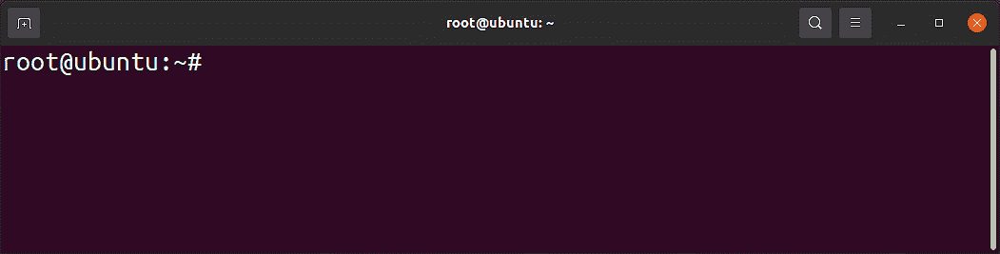
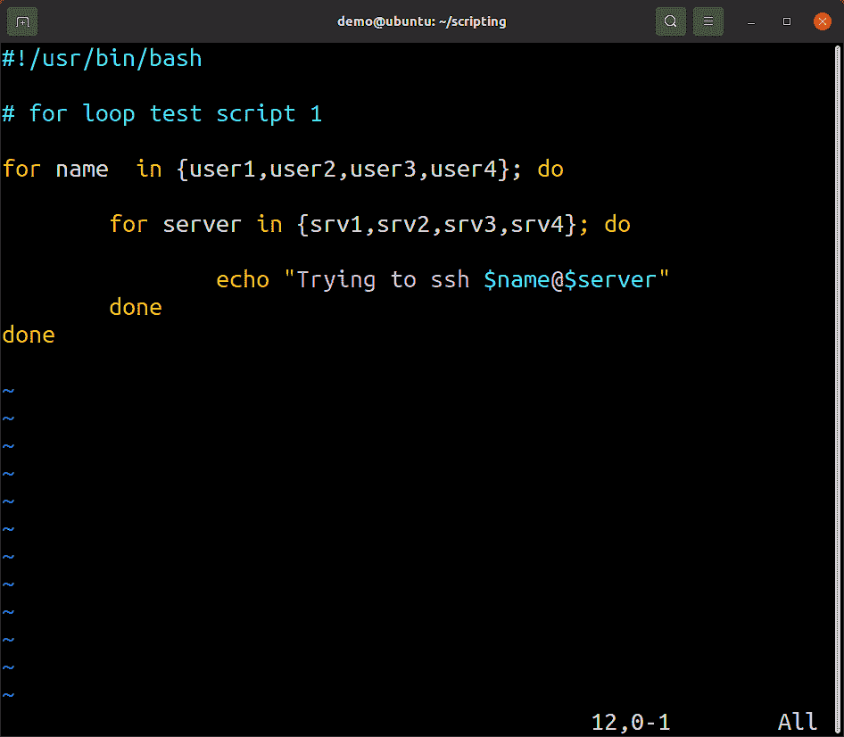
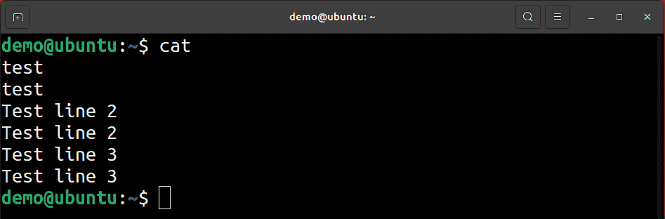

# 第九章: Shell 脚本简介

我们已经来到了定义 Unix（或 Linux）知名特性之一的部分——它的脚本编写。当谈到所谓的*Unix 哲学*时，不仅能使用命令行提供的工具，而且还能创建自己的工具，这是一个令人惊叹的能力，利用那些做一件事做得非常好的 Shell 工具。

脚本编写正是如此——能够创建简单（或复杂）的工具，本质上是执行特定任务的一组命令。在一切开始之前，我们需要澄清一件事——有些人将编程与脚本区分开。严格来说，所有脚本编写都是编程，但并非所有编程都是脚本编写。我们谈论的是遵循相同前提、逻辑和思维方式的学科，但同时，两者之间也有着重大区别。说到脚本编写，实际上我们是在创建文件，这些文件在运行时会被*解释*，这意味着 Shell（或其他*解释器*）会逐行读取文件并执行命令。还有另一种方式，那就是创建文本文件，在运行前进行*编译*。通常，这种方式比解释执行更快，但同时需要一些额外的步骤，并且不如脚本灵活。

我们不会浪费时间讨论与编译应用程序相关的内容；本书将严格处理脚本。

本章将介绍以下内容：

+   编写你的第一个 Bash Shell 脚本

+   序列化基本命令 – 从简单到复杂

+   操作 Shell 脚本的输入、输出和错误

+   Shell 脚本的基本规范

# 技术要求

本章的内容将在 Linux 机器上进行演示。我们使用与其他章节相同的设置：

+   安装了 Linux 的虚拟机，任意发行版（在我们的案例中，将使用*Ubuntu 20.04*）

+   Bash – 每个主流发行版的默认 Shell

本章及所有涉及脚本的章节中的脚本，应该能在任何使用 Bash 的发行版上运行。脚本的强大之处就在于这种兼容性；如果机器运行 Linux，几乎可以运行任何脚本，唯一的问题来自脚本本身对服务器的要求。

# 编写你的第一个 Bash Shell 脚本

在我们编写一个简单的`Hello World!` Shell 脚本之前，先快速了解一下 Shell 本身以及它在普通 Linux 机器上的作用。最简单的描述方式是，Shell 是用户（我们）与内核（操作系统中负责一切的部分）之间的连接。我们之前已经讨论过这个问题，但在这里我们需要澄清一些要点，以便更容易解释某些概念。

Shell 是一个应用程序，通常显示一个提示符，并查找并运行我们给它的任何命令。这称为**交互式 shell**，是在 Linux 中使用最广泛的工作方式。这就是所有**命令行界面**（**CLI**）的内容 - 拥有一个界面，使我们能够执行我们需要的命令：



图 9.1 – 一个典型的 root shell

然而，shell 的另一种操作模式称为**非交互模式**。这涵盖了 shell 在不根据我们从命令行输入的命令行为基础，而是逐行读取文件（我们的脚本）并执行命令时的所有实例。显然，我们无法直接与命令进行交互，因此该模式恰当地称为非交互式。

请记住，在执行脚本时，如果需要（并且计划），我们可以与其交互；名称仅指与 Shell 的直接交互或无 CLI 可用。同时，这种交互限制意味着我们可以在任何需要的时候，尽快地看到我们的脚本运行。结合 Linux 系统中我们随时可以使用的各种工具，我们拥有一个极其强大的功能，可以帮助我们完成任务。

## 准备就绪

让我们快速运行几个命令，了解一下我们当前的 shell：

```
demo@ubuntu:~$ ps -p $$
    PID TTY          TIME CMD
   5329 pts/0    00:00:00 bash
demo@ubuntu:~$ echo $SHELL
/bin/bash
```

这里发生了什么？我们使用的第一个命令是 `ps`，它为我们提供了当前正在运行的 shell 的信息，或者更精确地说，负责我们发出的命令当前执行的 shell。使用 `$$` 作为进程号，我们要求 `ps` 命令提供我们当前 shell 分配的进程号。我们在这里进行了一个小技巧 - `$$` 是 Bash 的内部变量，它给我们提供了一个进程的运行 PID。

我们使用的另一个命令是 `echo`，并使用了其 `$SHELL` 变量，该变量会自动解析为用户当前的 shell。

但是，这两个命令之间存在很大的区别。根据具体情况，它们可以给我们完全不同的结果，因为它们指的是完全不同的事物。让我们来解释一下 - 每个用户都有他们*分配的* shell，在用户登录时将被执行。`echo` 命令的结果将会给你这个信息，而 shell 本身则定义在 `/etc/passwd` 文件中，描述特定用户的那一行。因此，该命令的输出基本上会提供你的默认 shell 名称。

同时，每个用户可以作为命令运行系统上任何可用的 shell，并且自动将该 shell 作为他们的*当前* shell。这意味着这个 shell 将处理用户在命令行中输入的任何内容。这很重要，因为你的脚本可以使用与你应该使用的不同 shell 来自命令行运行，基于 `/etc/passwd` 文件中的信息。

你的 shell 不一定非得是 `bash`。你也可以选择系统中可用的任何 shell，或者甚至可以安装当前系统中不可用但作为软件包提供的 shell。

有鉴于此，谈到脚本编写时，即便你使用的是其他 shell，`bash` 仍然是首选的 shell，因为 `bash` 能在大多数甚至所有 Linux 机器上运行。

现在，让我们来聊一聊用于脚本编写的编辑器。

本书中涉及脚本编写的章节，我们将使用 `vim` 或 `vi`；然而，脚本示例将以文本形式显示，而不带有任何颜色。我们已经在另一个章节中讲解了很多编辑器。由于文本编辑器的话题往往引发较大争议，而我们对此较为务实，我们的建议是使用对你有用的编辑器。

Vim、JOE、nano、vi、Emacs、gedit、Sublime Text、Atom、Notepadqq、Visual Studio Code 等都是可用的编辑器，但选择哪个完全取决于你。对于简单的脚本，任何编辑器都能工作，通常你会选择系统上已有的编辑器，只因为你需要对脚本做一个小改动。

当你在自己的机器上开发脚本时，可能会选择更复杂的工具，因为它能让工作变得更轻松。Vim 就是一个很好的例子，因为它为 `bash` 提供了语法高亮和格式化功能。高级编辑器会为你提供更多功能，但我们的观点是你不应该过度依赖那些花里胡哨的功能，因为这会让你依赖某个应用，而这个应用可能并不总是能使用：



图 9.2 – 在 Vim 中打开的脚本 – 注意颜色高亮和缩进

最终，你将会使用两个编辑器，一个用于开发你的脚本，另一个用于你部署脚本的服务器。记住，你在部署脚本的系统上不可避免地需要进行调试，因此要做好准备，某些你平常使用的工具可能无法使用。不要过于依赖它们。

## 如何实现……

让我们创建第一个脚本，看看到底是什么让我们如此关注 shell：

```
#!/bin/bash
# Hello world script, V1.0 2021/8/1
echo "Hello World!
```

首先，脚本到底做了什么？它仅仅是将 `Hello World!` 输出到标准输出并退出。虽然脚本本身有三行，但其中只有一行是实际执行操作的，另外两行则有不同的用途。

我们要做的是首先解析前两行的含义，然后关注 `echo` 命令。

请注意，我们在脚本中不计算空行，尽管编辑器可能会计算。对于脚本，空行对解释器来说没有意义，因此我们使用空行使脚本更具可读性，但在讨论脚本时会忽略它们——Bash 在执行脚本时也是这样做的。

作为一个规则，如果我们在脚本中使用`#`字符，解释器将把该字符之后的内容视为注释（*在同一行*）。我们的前两行是注释，但脚本的第一行是特殊的——它定义了执行脚本命令的 shell，同时也是一行注释。这个序列被称为*shebang*。我们需要对此进行解释。

在 Linux 下，脚本编写并不局限于使用`bash`或任何其他 Bash 兼容的 shell。在你的脚本中，实际上可以使用任何你想要的脚本语言。除了 Bash，它还可以是 Python 或 Perl——你可以使用系统上可用的任何语言，只要你知道如何编写该语言的脚本。

通常，脚本是由解释器执行的。解释器基本上是一个能够理解文件内容的应用程序，然后逐行执行文件中的命令。我们提到的所有解释器（Python、Bash 和 Perl）都使用简单的文本文件作为输入，因此需要一种方法来告诉系统该文件中是什么类型的脚本，从而让系统知道如何执行它。

这可以通过两种不同的方式来实现——一种方式是通过使用正确的解释器直接调用脚本，例如以下方式：

```
demo@ubuntu:~/scripting$ bash helloworld.sh 
Hello World!
```

这只是确保我们为脚本使用了正确的解释器；它不会让系统或其他用户更容易理解我们的脚本。

现在，考虑另一种做法。让我们使脚本可执行，然后直接运行它：

```
demo@ubuntu:~/scripting$ chmod u+x helloworld.sh 
demo@ubuntu:~/scripting$ ./helloworld.sh 
Hello World!
```

这两者之间的区别微妙但重要，尽管最终结果是相同的，因为我们运行的是相同的脚本。

在第一个示例中，我们明确告诉系统使用特定的解释器来运行脚本。在第二个示例中，我们告诉系统使用它需要的解释器来运行脚本，这时脚本的第一行发挥了至关重要的作用。当前的 shell 会拿到第一行（shebang），并尝试找到该行指向的解释器。如果找到了，系统将使用这个解释器来运行文件中的其余内容。最终结果很简单——如果我们遵循约定并将解释器放在第一行的注释中，系统就能运行我们的脚本，即使我们没有明确提到它。

如果第一行是解释器的名称以外的内容，我们的脚本只有在明确使用解释器名称调用时才能运行——如果我们直接运行它，系统将抛出错误。

## 它是如何工作的……

Linux 不使用扩展名来标识文件，因此脚本可以有任何符合文件系统规定的名称；扩展名不一定是`.sh`。这意味着，为了让我们的脚本能够普遍运行，我们需要考虑第一行的正确格式。

脚本的下一行是我们的注释，它标识了脚本的名称和版本。当然，任何脚本都可以没有这样的注释，或者一般来说，没有任何注释，但在脚本编写中，注释非常重要。我们稍后在本章中会更加关注注释。

第三行实际上是在工作的那一行，它简单地将分配给脚本的字符串显示到标准输出。标准输入、输出和错误处理是我们稍后也会稍微涉及的内容。

这是我们的第一个脚本。在这一章的这部分中，我们解释了很多内容，重点是除了执行脚本任务的实际命令之外的一切，但我们必须处理很多其他事情。

### 还有更多内容…

在接下来的几章中，我们将会大量处理脚本，但我们有链接可以让您开始：

+   Bash 手册 - 包含有关 Bash Shell 的所有信息：[`www.gnu.org/savannah-checkouts/gnu/bash/manual/bash.html`](https://www.gnu.org/savannah-checkouts/gnu/bash/manual/bash.html)

+   Bash 脚本速查表：[`devhints.io/bash`](https://devhints.io/bash)

+   如何使一个 shell 脚本真正起作用：[`linuxcommand.org/lc3_wss0010.php`](https://linuxcommand.org/lc3_wss0010.php)

# 序列化基本命令 - 从简单到复杂

脚本只不过是按特定顺序执行的命令列表。在其最基本的结构中，顺序完全是线性的，没有任何决策、循环或条件分支。

命令按照从上到下，从行首到行尾的顺序执行。即使听起来很简单并且不是很有用，但通过这种方式创建脚本也可以有其用处，因为它使我们能够快速运行一组预定义的命令，而不是从命令行重复输入它们。换句话说，有些问题需要超过一行命令，但不复杂到需要复杂的逻辑。这并不是贬低复杂的 Bash 脚本逻辑，因为 IT 中有许多自动化任务可以通过使用 Bash 脚本来实现。

让我们现在想象一个简单的任务，比如我们将用作经常性示例的任务。我们将创建一个简单的备份脚本。我们的任务如下：

1.  在`/opt/backup`下创建一个以今天日期命名的目录。

1.  将所有文件从`/root`文件夹复制到此目录。

1.  向`root`用户发送一封空邮件，只说备份已完成。

1.  向`/root`文件夹中名为`donebackups.lst`的文件添加一行，其中包含今天的日期。

## 准备就绪

在我们开始之前——免责声明。这是一个简单的脚本，由于多种原因，它的意义并不大。最重要的一点是，它忽略了运行环境的上下文。我们需要先快速讨论这些问题，然后我们会编写一个能解决这个任务的脚本。

我们所说的*上下文*是什么意思？无论我们选择以何种方式运行脚本，脚本都是由用户在所谓的用户空间中运行的，它们有一些定义其环境的因素，我们通常称之为上下文。

上下文是运行脚本的整个环境，并且提出了以下问题：

+   哪个用户在运行脚本？

+   这个脚本有什么权限？

+   脚本是作为工具从命令行运行，还是作为后台任务运行？

+   脚本是从哪个目录运行的？

除了这些，通常还有一些其他可能对运行脚本相关的因素，我们将在本书的后续部分讨论这些问题。

现在，我们需要明确的是，上下文极其重要，我们的脚本绝不应当以任何形式或方式理所当然地假设任何元素。如果我们希望脚本正确运行，我们应该不做任何假设，而应该检查所有我们期望处于某种状态的内容。

一个能够检查并判断运行它的环境中可能出现的问题的脚本，要求具备我们尚未讨论的两个方面——控制脚本流程和与系统交互。现在，很明显我们仍然不知道如何做到这一点。

无法在脚本中测试某些内容意味着，在创建这个特定脚本时，我们将假设很多事情。要小心——这通常是导致问题的第一个原因。

如果在我们输入第一个字母之前没有仔细思考，通常是所有问题的根源；脚本很少是如此简单，能够在没有提前规划的情况下创建。

我们现在讨论这些问题的主要原因是希望在创建脚本时让你保持正确的思维方式。

## 如何做到这一点……

那么，如何创建脚本呢？在开始之前，你应该做以下几件事：

+   定义你的任务。

+   研究你将要使用的命令。

+   检查权限以及成功执行各个命令所需的条件。

+   在将命令用于脚本之前，先单独尝试这些命令。

想想你假设的一些事情：

+   如果你正在读写某些文件，你是否期望这些文件已经存在，还是你需要创建它们？

+   如果你正在引用某个文件或目录，它是否存在，并且你是否拥有正确的权限？

+   你是否使用了一些需要提前安装或配置的命令？

+   你是通过绝对路径还是相对路径引用文件？

这只是通常被称为**健全性检查**的冰山一角，在这种情况下，*健全性*指的是脚本运行时的状态。**健全状态**是指一切正常。当脚本偏离这一状态，或者出现错误或问题导致脚本行为异常时，那就是问题所在。这就是为什么我们需要提前思考的原因。也正因如此，进行健全性检查的代码可能比仅仅执行基础功能的常规代码更费力。

但是相信我们——这种类型的检查不仅有助于保持环境的正常运行，还能帮助你在处理复杂任务时保持理智。

现在，我们勇敢地忽略了所有这些，专注于基础知识。对于我们的备份脚本，我们假设`/root`和`/opt`目录存在，并且对运行脚本的任何用户都是可访问的。在我们这个特定的案例中，这意味着只有超级用户运行脚本时，脚本才会有效，因为该用户需要能够访问`/root`下的文件。

此外，我们假设某种类型的电子邮件系统存在，并且在本地计算机上运行。我们还假设在最后一步提到的日志文件可以被我们的脚本写入。

重要说明

在运行脚本时，你会做出很多这样的假设，如果任何一个假设不正确，脚本就会以某种方式失败。作为脚本创建者，你的主要任务就是防止这种情况发生。

我们将使用什么命令？

我们的第一项任务是创建一个名称中包含今天日期的目录。在这里，我们假设这个目录不存在，并且无论如何都要创建它。这与我们稍后使用的逻辑有显著偏差——像这样的命令通常会检查目录是否存在，且命令本身是否成功。如果任何条件不`true`，脚本应该优雅地失败，或者创建它所需要的目录。

在你说，*等等——我已经会这样做了；我知道如何在一个命令行中进行测试*之前，让我们回过头来再谈一谈脚本是如何运行的。

在此时，我们尝试创建一些没有控制脚本流程的逻辑，这样命令就能逐行运行。我们本可以尝试在每行中进行一些检查，但由于我们没有控制整个脚本的流程，这可能比根本不做检查还要危险。

解释器会运行所有命令，无论如何，即使我们检查是否存在问题并发现了它们，我们最终还是会执行脚本中的所有命令。如果出现问题，正确的做法是控制*脚本*的行为，而不是控制*单个命令*的行为。不管脚本任务是多么简单或复杂，你都应该始终考虑上述背景以及你的脚本对它的影响。如果出现故障，脚本需要决定——这个故障是可以处理的吗？还是需要中止整个脚本的执行？

如果你在脚本中途中止执行，是否有需要在脚本结束之前做的事情？通常，当某些事情迫使你中止任务时，你会有某种方式通知系统和用户发生了问题。有时候，这可能还不够——你的脚本需要自行清理。

这可能仅仅是删除一些文件的问题，也可能是需要恢复你对系统所做的某个更改，甚至是恢复数百个更改。每次失败都应该评估它的严重性，以及它如何影响系统和脚本在该系统上创建的状态。

## 它是如何工作的……

在创建了可能是世界上最大的免责声明，解释我们为什么脚本如此简单之后，咱们开始动手工作吧。

一步步来，我们该如何解决这个问题呢？

创建目录很简单；我们将避免使用 Bash shell 扩展，而是使用`date`系统命令。这里我们有点作弊，因为我们引用了系统环境，但这个任务没有它就根本无法完成，我们也没有依赖 Bash 本身的内置功能。请注意，这也展示了在脚本中通常有多种方法可以完成同一件事，唯一的区别是你的创造力。

第一个命令大概是这样的：

```
root@ubuntu:/home/demo/# mkdir /opt/backup/backup$ (date \
+%m%d%Y)
```

请注意，我们正在以`root`用户身份运行这个操作。我们来快速检查一下发生了什么：

```
root@ubuntu:/home/demo/scripting# ls /opt/backup/
backup08202021
```

我们可以看到我们的目录已经创建好了。现在，让我们处理复制操作：

```
root@ubuntu:/home/demo/scripting# ls /opt/backup/backup08202021/
root@ubuntu:/home/demo/scripting# touch /root/testfile
root@ubuntu:/home/demo/scripting# cp /root/* /opt/backup/backup'date +%m%d%Y'
cp: -r not specified; omitting directory '/root/snap'
root@ubuntu:/home/demo/scripting# ls /root
snap  testfile
root@ubuntu:/home/demo/scripting# ls /opt/backup/backup08202021/
testfile
```

我们成功创建了一个测试文件并将其复制到我们的目录。请注意，我们引用目标目录的方式——由于我们不知道*什么时候*脚本会运行，我们无法知道当前需要复制到哪个目录。

为了避免需要读取和解析目录的麻烦，我们简单地重新创建目录名称，就像我们创建目录时一样。这里可能会有一个错误——如果在某种奇怪的情况下，脚本恰好在午夜时运行，那么创建目录的部分可能会在午夜之前执行，而我们用来复制文件的部分则可能会在午夜之后执行。这会导致错误，因为名称将不匹配。发生这种情况的几率很小，我们也不会为此做计划。

在一个大型脚本中，如果不正确处理这类问题，将会导致严重的问题。

现在，让我们处理邮件功能：

```
root@ubuntu:/home/demo# mail -s "Backup done!" root@localhost
Command 'mail' not found, but can be installed with:
apt install mailutils
root@ubuntu:/home/demo/scripting# apt install mailutils
Reading package lists... Done
Building dependency tree……………………………       
```

这里的错误很重要。我们这样做是为了展示测试命令的重要性。在这种情况下，我们尝试发送邮件，这让我们意识到我们期望使用的命令并不是默认安装的。

要运行此脚本，实际上我们需要安装`mail`命令。在配置了邮件服务的服务器上，这个命令会存在，但在普通工作站上则不会。由于我们的备份脚本应该在任何服务器上工作，我们需要解决这个问题。

盲目地使用包管理器安装软件包通常是安全的；系统将安装该软件包或者如果已安装则更新它。

现在，我们将再次尝试该命令，但这次又将失败：

```
root@ubuntu:/# mail -s "Backup was done!" root@localhost
Cc: 
Null message body; hope that's ok
root@ubuntu:/# man mail
You have mail in /var/mail/root
root@ubuntu:/# mail -s "Backup was done!" root@localhost < /dev/null
mail: Null message body; hope that's ok
```

我们实际上没有失败，但当我们调用第一个命令时，它要求我们输入一些数据。它要求我们输入`Cc`地址，并且我们必须按下*Ctrl* + *D*来完成邮件正文。

这也是在脚本中使用命令之前进行测试的另一个理由。

在意识到我们需要做一些事情使这个命令无需人工干预运行并阅读手册后，我们发现只需将`/dev/null`重定向到命令中即可。

现在，对于我们需要执行的最后一个命令，我们实施备份的实际报告：

```
root@ubuntu:/home/demo# date +%m%d%Y >> /root/donebackups.lst
```

记住，我们需要向文件追加内容。另外，我们希望直接使用绝对路径引用文件；毕竟，在运行此脚本时，我们不知道会在哪里。

好的，我们已经尝试和测试了所有的命令。我们的脚本实际上是什么样子？并不复杂：

```
#!/bin/bash
mkdir /opt/backup/backup'date +%m%d%Y'
cp /root/* /opt/backup/backup'date +%m%d%Y'
mail -s "Backup was done!" root@localhost < /dev/null
date +%m%d%Y >> /root/donebackups.lst
```

现在，让我们运行它。

```
root@ubuntu:/home/demo/scripting# bash backupexample.sh
cp: -r not specified; omitting directory '/root/snap'
mail: Null message body; hope that's ok
```

有几件事情需要我们的注意。首先，请注意，我们有一些脚本输出是我们没有预料到的。这是正常的，直接是我们在测试命令时看到的结果 — 一些命令抛出了错误。我们看到这个错误的原因将在本章的下一部分进行解释。我们需要注意的另一件事是，除了错误之外，我们没有其他输出。我们唯一能判断我们的脚本是否成功的方法将是让脚本本身报告 — 我们需要检查脚本中提到的邮件和文件以确认一切是否正确。这提示我们还需要另一件事情 — 日志记录。我们将在后续章节中处理日志和调试问题。

现在，让我们稍微详细介绍一下您的脚本如何与环境通信。

## 还有更多……

+   Bash 中不同的命令链操作符：[`www.thegeekdiary.com/6-bash-shell-command-line-chaining-operators-in-linux/`](https://www.thegeekdiary.com/6-bash-shell-command-line-chaining-operators-in-linux/%0D)

+   在 Bash 中格式化日期: [`www.cyberciti.biz/faq/linux-unix-formatting-dates-for-display/`](https://www.cyberciti.biz/faq/linux-unix-formatting-dates-for-display/)

# 操作 shell 脚本的输入、输出和错误

没有什么比 Linux 中标准输入和标准输出的概念更具实用性了。

自从 Unix 起，系统上安装的不同应用程序和工具之间的互操作性一直是每个脚本、工具和应用程序必须遵循的主要前提之一。

简单来说，如果你在系统上编写任何工具，你可以依赖三个独立的通信渠道与外部环境进行交互。基于 ANSI C 输入/输出流的概念，称为**标准输出**和**标准输入**，在 shell 中运行的所有程序可以通过三种方式进行通信——它可以从标准输入接收输入，它可以将结果和信息输出到标准输出，并且它可以将错误报告到专门为此任务标记的另一个输出，称为**错误输出**。

将这个概念与每个工具应该输出仅包含文本信息并具有最小格式化的思想结合起来，并且应该准备好在需要时接受文本输入，你就得到了一个简单但极其强大且可移植的框架。

## 准备工作

当我们创建脚本时，我们将经常使用这些概念，以各种不同的方式。在这之前，我们需要确保理解实际存在且可用的输入和输出，以及在编写脚本时它们的常见使用方式。之后，我们将处理一些建议以及如何遵循在用户交互方面已确立的最佳实践。

甚至在此之前，我们需要定义一些概念。标准输入、输出和错误只是被称为**文件描述符**的某些特例。为了简化一些内容，我们不会花太多时间讨论文件描述符到底是什么；就本章而言，我们可以将其视为引用已打开文件的一种方式。

由于在 Linux 中一切都被视为文件，因此我们实际上只是为可以写入、读取或在某些情况下既能读又能写的内容分配一个数字，具体取决于上下文。显然，读取和写入的选项取决于实际设备的引用是什么。

默认情况下，你的脚本会*打开*与三个*文件*的通信。这些文件将用于处理标准输入，标准输入将与键盘连接；你的脚本将从键盘接收信息，除非你将其更改为其他东西，例如另一个文件或其他脚本或应用程序的输出。

标准输出默认设置为*控制台*或你运行脚本的屏幕。在某些情况下，我们还会将物理连接到服务器的屏幕称为**控制台**，但这不是我们现在要处理的内容。我们提到这一点是为了避免不必要的混淆。

我们无法从屏幕读取或向键盘写入，这就是为什么我们通常称它们为*控制台*，这是一种常见的名称，或多或少地描述了键盘和屏幕。这里还有很多内容可以学习，但现在我们就先停在这里。

## 如何操作…

为了更好地解释这两件事，你可以做一个简单的操作——运行一个没有任何参数的`cat`命令。当像这样执行时，任何命令，包括`cat`，都会接受标准输入并将结果输出到标准输出。在这个特定的例子中，`cat`会一行一行地处理，因为它在输出信息之前会等待一个行分隔符。

实际上，这意味着`cat`会逐行回显你输入的内容，直到你使用*Ctrl* + *D*发送一个特殊字符，称为**传输结束**（**EOT**），这告诉系统你决定结束输入。

这将结束应用程序的执行。在截图中，看起来我们输入了每一行两次；实际上，一行是我们的输入，另一行是命令的输出：



图 9.3 – cat – 演示标准输入和输出的最简单命令

还有标准错误，它也默认为屏幕，但它是一个独立的数据流；如果我们将某些内容输出到标准错误，它会以与标准输出完全相同的方式显示，但如果需要的话，可以进行重定向。

之所以有两个单独的流来处理输出，很简单——我们通常希望将某些数据作为脚本的结果，但我们不希望错误也成为其中的一部分。在这种情况下，我们可以将数据重定向到某个文件，将错误重定向到屏幕，或者甚至重定向到另一个文件，然后再处理它们。

现在，记得我们之前提到标准输入、输出和错误是文件描述符的特殊实例吗？Bash 实际上可以同时打开九个文件描述符，所以在编写脚本时我们可以做更多的事情。然而，这种做法很少使用，因为几乎所有的操作都可以通过使用默认的文件描述符完成。现在，记住以下几点：

+   标准输入是文件描述符号`0`。

+   标准输出是文件描述符号`1`。

+   标准错误是文件描述符号`2`。

为什么这些数字很重要？通过在命令行和脚本中使用一些特殊字符，如果我们只知道这三个数字，我们可以做很多事情。首先，如何停止脚本在屏幕上显示某些内容，如何将它输出到文件中？只需简单地使用 `>` 字符。

有时，你会看到命令行中包含 `1>` 而不是单纯的 `>`。这与使用单个 `>` 字符完全相同，但有时写成这样是为了确保你明白你正在重定向标准输出。

你可能对这种重定向形式很熟悉，因为这是你在处理命令行时学到的第一件事之一。需要注意的一点是，我们可以通过两种不同的方式将输出重定向到文件中，这取决于如果文件已经存在，我们希望对其做什么。

通过使用 `> filename`，我们将把脚本输出的内容重定向到名为 `filename` 的文件中。如果该文件不存在，它将被创建，如果文件已经存在，它将被*覆盖*。

通过使用一个额外的括号，`>> filename` 重定向在处理已存在文件时的方式会有所不同。如果我们使用这个符号进行重定向，我们将会*追加*数据到一个已存在的文件中；数据将被添加到文件的末尾。

提到 `1>` 后，我们需要处理更常见的 `2>` 符号，它表示标准错误。当脚本中出现错误时，它会将错误输出。通常，如果你只把脚本输出重定向到文件，你会注意到，如果没有提到 `2>`，只有错误会出现在屏幕上，而其他所有内容都会写入文件。

如果我们确实希望将错误的结果输出到特定的文件中，可以通过使用 `2> errorfilename` 来实现，脚本将把错误写入名为 `errorfilename` 的文件中。

还有一种可能性是我们希望将所有内容输出到同一个文件中，且有两种方式可以实现。一种是分别在一条命令行中执行两个重定向，使用相同的文件名进行重定向。这样做的好处是当我们尝试理解输出的去向时，它比较容易阅读。

主要的缺点是，这种重定向可能是处理脚本时最常用的，尤其是在我们让脚本在无人值守的情况下运行时，这使得它在大多数环境中*更难*阅读。当然，有一个简单的解决办法——我们可以通过使用 `&> filename` 来使用单一重定向代替两个分开的重定向。在 Bash 环境中，这意味着我们希望将标准错误和输出都重定向到同一个文件：

```
demo@ubuntu:~/scripting$ bash helloworld.sh 1> outputfile \
2>errorfile
demo@ubuntu:~/scripting$ bash helloworld.sh &>outputfile
```

请注意，这个技巧仅在将输出和错误都重定向到同一个文件时有效；如果输出文件不同，我们需要明确地分别指定它们。

当我们开始讨论输出时，我们提到过输出不仅仅限于三个预定义的类型，处理它们的方式是合乎逻辑的。如果我们决定将某些输出重定向到文件描述符 `5`，在命令行中的处理方式将是直接重定向 `5> 文件名`。这不是每天都会见到的情况，但如果你需要创建多个日志文件或从同一个脚本输出不同的内容到不同的目标，這將是非常有用的。这种方法很少使用，因为直接从脚本中处理重定向要简单得多，而且通过在脚本中使用变量，任何调试你脚本的人都将更加容易。

到此为止，我们处理的是来自*外部*的重定向。现在是时候转向如何在日常工作中使用它了。

我们使用重定向的主要目的是记录信息。有几种方法可以实现这一点。一种是简单地在脚本中使用 `echo` 命令，然后对整个脚本进行重定向——例如，我们可以创建一个简单的脚本，只打印四行文本：

```
#!/usr/bin/bash
echo "First line of text!"
echo "Second line of text!"
echo "Third line of text!"
echo "Fourth line of text!"
```

让我们将其命名为 `simpleecho.sh` 并通过 Bash 运行它：

```
demo@ubuntu:~/scripting$ bash simpleecho.sh 
First line of text!
Second line of text!
Third line of text!
Fourth line of text!
demo@ubuntu:~/scripting$
```

现在，我们将它重定向到一个文件：

```
demo@ubuntu:~/scripting$ bash simpleecho.sh > testfile
demo@ubuntu:~/scripting$ cat testfile 
First line of text!
Second line of text!
Third line of text!
Fourth line of text!
```

好的，我们可以看到文件现在包含了 `echo` 命令的输出。为了演示错误是如何工作的，我们将在脚本中插入一个故意的错误：

```
#!/usr/bin/bash
echo "First line of text!"
echo "Second line of text!"
echo "Third line of text!"
bad_command
echo "Fourth line of text!"
```

现在，我们将再次执行相同的操作，首先启动脚本，然后进行重定向，看看发生了什么：

```
demo@ubuntu:~/scripting$ bash simpleecho.sh
First line of text!
Second line of text!
Third line of text!
simpleecho.sh: line 5: bad_command: command not found
Fourth line of text!
demo@ubuntu:~/scripting$ bash simpleecho.sh > testfile
simpleecho.sh: line 5: bad_command: command not found
demo@ubuntu:~/scripting$ bash simpleecho.sh &> testfile
demo@ubuntu:~/scripting$ cat testfile 
First line of text!
Second line of text!
Third line of text!
simpleecho.sh: line 5: bad_command: command not found
Fourth line of text!
```

这里要记住的主要一点是，错误输出始终与标准输出分开，因此除非我们特意重定向它们，否则不会在文件中看到错误。

到目前为止，事情都很简单，因为我们的脚本只使用了标准输出。通常，与用户的沟通并不像这那么简单，因为我们希望脚本既能在屏幕上提供一些信息，又能输出到一个特定的日志文件。当处理无人值守脚本时，情况类似；能够将脚本输出重定向到特定文件是很方便的，但更常见的做法是让脚本自动使用一个特定的日志文件，无需用户或管理员在执行脚本时进行任何重定向。

实现这一点的过程非常简单——我们可以在命令级别使用重定向，将输出重定向到文件。这里唯一需要记住的一点是，重定向到文件仅限于单个命令；如果你重定向任何内容，文件将在命令完成后立即关闭。这一点非常重要，主要因为你通常需要将内容附加到文件中；如果你忘记这样做，文件将会被新数据覆盖，作为日志文件就失去了作用。由于日志通常用于跟踪脚本或服务的多次执行，你几乎总是会将数据附加到文件中。

## 它是如何工作的…

现在让我们扩展我们的初始脚本，增加一点日志记录。我们要做的是编写单独的日志，其中包含脚本运行时执行的操作信息。我们将此信息写入脚本调用目录中的日志文件。这意味着我们的脚本随时可以使用三个单独的输出通道；除了标准输出和标准错误之外，我们还使用我们的日志文件。日志文件与标准输出之间的主要区别在于我们的日志是硬编码的，没有办法将其重定向到另一个文件。当然，存在此问题的解决方案，但我们不会花太多时间在上面；我们已经说过可以使用其他文件描述符之一，并将输出映射到它，稍后将输出转发到任何所需的流。这很少使用，因为在运行脚本时需要额外注意：

```
#!/usr/bin/bash
echo "We are adding four lines of text!" >> simplelog.txt
echo "First line of text!"
echo "Second line of text!"
echo "Third line of text!"
echo "Fourth line of text!"
echo "Exiting, end of script!" >> simplelog.txt
```

这种方法为我们提供了额外的灵活性，因为我们无需转发标准输出即可获得日志；我们的脚本已经做到了这一点。这意味着我们可以从命令行或作为无人看管的任务启动脚本，并在日志中获得相同的结果。当然，我们始终可以使用重定向来确保每个输出都被写入和保存。

### 还有更多...

+   C 中的标准输入和输出：[`www.technologyuk.net/computing/software-development/computer-programming/c-programming/basic-io.shtml`](https://www.technologyuk.net/computing/software-development/computer-programming/c-programming/basic-io.shtml)

+   Bash 中的标准输入和输出（带示例）：[`tldp.org/LDP/abs/html/io-redirection.html`](https://tldp.org/LDP/abs/html/io-redirection.html%0D)

# Shell 脚本卫生

评论不仅仅是你可以做的事情；它本身就是一种艺术。在本章的这一部分，我们将处理评论，以便在编写脚本时使您的生活更轻松，但是在此处提供的建议和最佳实践在我们能想到的任何编程语言中都可以轻松使用。真正理解如何以有用的方式进行评论是您需要学习的事情，因为它将帮助任何在您完成编写后要使用您的脚本的人。

那么，评论是什么？可能描述它们的最简单方式是说它们是关于脚本预期执行的文档、脚本如何工作以及谁创建了脚本的文档，并且它们提供了有关脚本的技术细节的更多信息，例如创建时间。

评论是您应该自动想要做的事情。没有人是完美的，也没有人有完美的记忆。评论的作用是帮助您记住在某些脚本内部所做的事情，并向任何其他人提供关于脚本如何工作以及如果他们需要更改脚本中的任何内容时需要知道的不同事项的指导。

另一个重要的点是，注释并不等同于提供文档。有时候，人们可能会说他们不需要文档，因为他们在代码中已经有了注释，但这是完全错误的。除非你在讨论只有大约 10 行代码的脚本，否则注释会帮助你理解脚本的功能，而不必查阅整个文档，这可以节省大量时间。

## 准备工作

现在，让我们谈谈不同类型的注释。在编写代码时，总会涉及对各个过程或脚本部分的注释、预期的输入和输出、数据类型以及数据的注释。

在 Bash 中，注释通常以`#`符号开头。Bash 不识别多行注释，不像一些其他编程语言那样。这意味着我们需要注意，每一行包含注释的行都以`#`开头。某种程度上的例外是脚本中的第一行，它包含将运行脚本的解释器，但解释器在那行之后继续工作，所以我们可以说每一行以`#`开头的行实际上都是注释。Shell 会忽略注释内的所有内容，或者更准确地说，它会完全忽略包含注释的行。因此，请理解注释是为您和其他将要处理您的脚本的人编写的。尽量使它们易于理解、准确，并避免重复可以从命令本身推导出的内容。例如，如果您有一个命令在回显某些内容，请尽量不要说，“好的，这个命令将回显…”你要输出给用户的任何文本，而是尽量解释为什么。在注释带有许多变量的晦涩输出时，这尤其有用。

您可以并且应该在脚本中每个代码块的前面写注释，但也应该在脚本的开头和结尾写注释。

## 如何做到…

让我们从脚本的开始说起。第一个注释应该是什么？首先应该是解释器的名称，然后通常会提供有关脚本本身的信息。通常，脚本应该以一个注释开始，提供有关谁编写了它、何时编写的以及它是否属于负责脚本本身的项目的信息。

此部分还应该说明技术细节，如许可分发、对保证的限制以及谁有权使用脚本，谁没有。

完成了头部之后，我们还应该处理脚本的参数和运行方式，以及在输入方面的预期结果。如果输入有特殊要求，比如预期类型、参数数量或者在运行脚本之前需要存在或运行的先决条件，这些都应该在脚本的开头某处声明。

现在，我们来讲解函数。我们稍后会讨论函数的概念，但我们需要先讨论如何对函数进行注释，因为这也适用于任何其他的代码块。原因在于，函数本身是模块化的，并且以独立代码块的形式书写。

在函数内部共享某些内容时，给我们提供了注释的机会。我们应该利用这部分注释来描述函数或模块的作用，哪些变量会被修改或需要，函数将接收哪些参数，函数将执行什么操作，以及函数的输出是什么。如果我们处理的是某种非标准输出 —— 比如说，记录日志到单独的文件 —— 我们应该在函数头部说明。我们还应该注明函数输出的所有返回代码，尤其是在它改变脚本的退出状态时。

有一些有用的方式可以通过注释来创建提醒，提醒自己或他人脚本中仍需要完成的任务，这些被称为**待办注释**。它们通常以大写字母写成 —— **TODO**。

我们还应注意，存在一种叫做`heredoc`表示法的方式，它有时用于我们需要创建大块注释时。这种表示法通过特定的 Shell 重定向方式来提供注释块的头部和尾部，而不使用常见的符号。我们将为你提供一个该表示法的示例，因为你在分析其他人脚本时会遇到它，但我们在自己的脚本中不会使用它。主要原因是它往往使脚本的可读性下降。

例如，这是一种完全有效的注释创建方式：

```
#!/bin/bash
echo "Comment block starts after this!"
<<COMMENTBLOCK
    Comment line
    Another comment line
    Third one
COMMENTBLOCK
echo "This is going to get executed"
```

那么，我们到底注释什么呢？

让我们从一些一般性的事情开始：

+   明确标明脚本的编写者以及创建时间。

+   给脚本版本化 —— 如果有任何更改，更新版本号，以便你可以跟踪不同计算机上使用的脚本。

+   解释代码中任何复杂的部分 —— 诸如正则表达式、调用外部资源、以及任何引用脚本之外的内容都应该加上注释。

+   对单独的代码块进行注释。

+   清晰标注你注释掉并保留在脚本中的旧代码部分。

我们会稍微讲一下所有这些要点。

清晰地标明脚本的作者和创建日期至关重要。你的脚本可能会被其他人维护。打开一个有几百行代码的脚本时，最糟糕的情况就是不知道出问题时该找谁。有些人认为不签署脚本可以避免被其他管理员不断打扰，但这种想法是错误的。你写了这个脚本，为它感到自豪吧。

在提及作者后，请始终注意脚本的创建时间。这有助于人们优先考虑可能的更改，尤其是一些脚本中可能使用的外部资源。此外，请写出最后一次更改的时间，因为这对于所有维护脚本的人（包括您在内）都是相关信息。

在提及更改后，学习版本控制。版本控制是一种跟踪脚本中不同更改的方式，并确保您知道在任何给定时刻使用的版本。版本控制本身是一个简单的概念，使用一种方案来跟踪您的脚本的进展及所做的更改。

这可以通过几种方式来完成，因为目前没有官方标准来写下版本，尽管很多人倾向于使用语义化版本控制（`https://semver.org/`）。通常，版本号或多或少严格地遵循源代码的变化或特定版本创建时的时间。这两种方案都有其优点，但在撰写脚本时，我们认为跟踪更改是一个更好的主意，因为我们几乎无法从日期版本中推断出什么。

在我们承诺任何版本方案之前，我们将快速浏览一些示例。我们处理不同软件版本的方式直接与我们所处理的软件类型及版本之间的更改数量有关。

通用应用程序通常坚持使用一个*正常*的版本方案，其结构使用两个数字表示应用程序的主要和次要版本。例如，我们可以有 App v1.0，然后是 App v1.1，然后是 App v2.0，依此类推。第一个数字表示对应用程序进行的主要更改；第二个数字通常表示次要更改或错误修复。这实际上是今天市场上大型应用程序的通行做法。

在我们的脚本中，我们将使用相同的方案，但我们将实施语义化版本控制，因此版本将是`1.0.0`或`3.2.4`。第三个数字表示小的变更，并在变更数较少但变更显著时才有意义。请注意，有些应用程序将此方法推向极端，因此您将不可避免地遇到诸如版本`2.1.2.1-33.PL2`之类的情况。在处理脚本时，这只会使您的工作变得更加复杂，所以请不要这样做。

处理版本的另一种方式是参考时间，就像现在大多数操作系统所做的那样。例如，有 Ubuntu 20.04 和 20.10，分别代表 2020 年 4 月和 10 月发布的版本。这样做的原因是变更的数量巨大。每次发生变更时发布整个操作系统的新版本几乎是不可能的；你需要几乎每隔几小时发布一个新版本。

还有一种顺序编号方案，通常与我们提到的两种方法之一配合使用。微软使用这种版本控制风格，主要版本发布如*Windows 10*，更新版本发布如 20.04 或 21H1，代表发布的时间，然后使用构建版本来表示操作系统的小改动。

所有这些版本控制方案都有其优缺点，但无论你选择哪种，我们只有一个建议——坚持使用它。不要混合不同的版本控制方案，因为这会让人感到困惑。

说到版本控制，我们还应该谈谈变更追踪。当创建*新版本*的脚本时，大多数情况下你会对脚本本身进行很多更改。这些更改可能是修复 bug，或者使代码更快、更可靠。某些更改需要以其他方式记录，而不是单纯增加版本号。这样做很重要，因为它能帮助你记住对脚本做了什么。可以通过几种方式来实现。一种方法是将所有更改记录在一个单独的文件中（通常我们会使用`ChangeLog`文件来记录）。这样，你的注释和脚本本身会更加清晰易读，但你也需要关注这个新文件的更新。这样做还可以让其他人更容易阅读代码，因为每次新版本的发布都会更新它。另一种方法是直接在脚本中列出所有的更改。这种方法的好处是你可以快速查看哪些地方发生了变化，但这样脚本就会多出一些额外的文本，需要你跳过。还有一种版本是在修改所在的代码行之前记录更改，这样更改和代码本身紧密关联。

让我们看看这些在实践中是如何运作的：

```
#!/bin/bash
# V1.2 by Author, under GPLV2 licence
# V1.0 - Hello world script, V1.0 1/8/2021
# V1.1 - Added changes to comments on 2/8/2021 
# V1.2 - Added more changes to comments 3/8/2021 
echo "Hello World!"
```

我们将在这里暂停，因为接下来章节会详细介绍这些内容，并且在学习过程中逐步深入。

## 还有更多内容……

+   在 Bash 中注释 – 示例： https://git.savannah.gnu.org/cgit/bash.git/tree/examples

+   在 Linux 中识别文件： [`man7.org/linux/man-pages/man4/magic.4.html`](https://man7.org/linux/man-pages/man4/magic.4.html)
