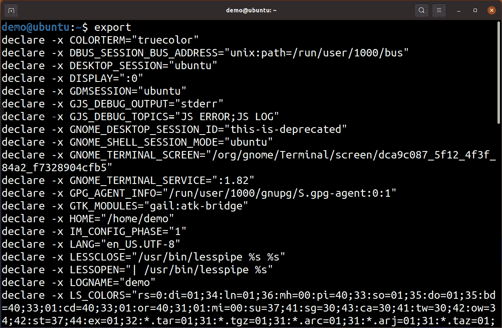
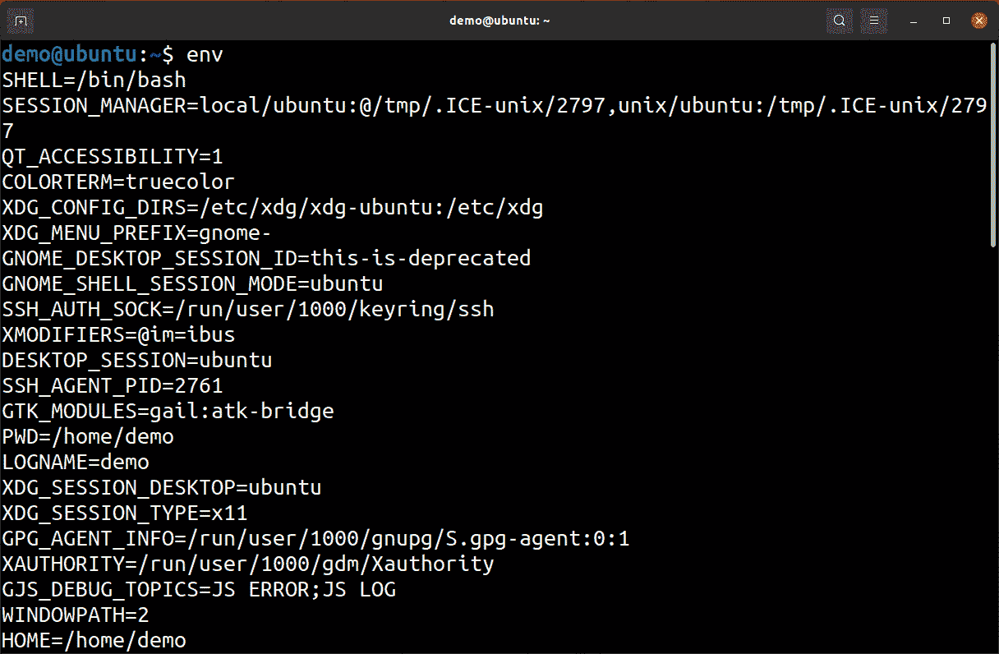
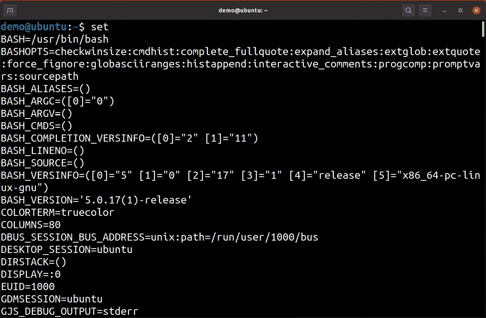
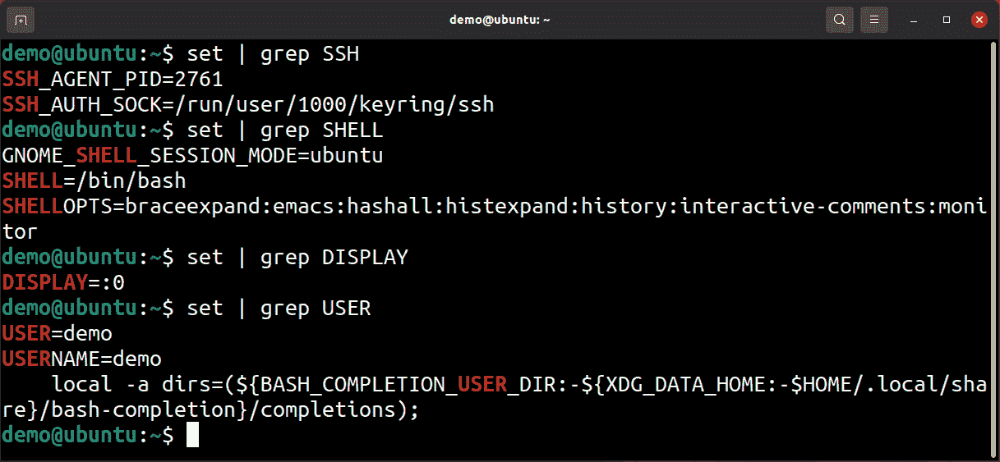

# *第十一章*：与变量一起工作

`if` 语句。

本章我们将涵盖以下内容：

+   使用 shell 变量

+   在 shell 脚本中使用变量

+   Shell 中的引号

+   对变量执行操作

+   通过外部命令使用变量

我们将涵盖你需要了解的有关变量的最重要内容，但和几乎所有其他内容一样，本章内容需要你进行实践。

# 技术要求

你可以使用的机器与前几章脚本编写中的机器相同——基本上，任何能够运行 bash 的机器都能使用。在我们的案例中，我们使用的是安装了 Linux 和 Ubuntu 20.10 的**虚拟机**（**VM**）。

所以，启动你的虚拟机，咱们开始吧！

# 使用 shell 变量

变量是你可能已经理解的概念，即使只是从概念上理解。我们这里说的不是编程；我们的日常生活中充满了变量。基本上，变量是能够存储一个值的东西，且在我们需要它时可以为我们提供这个值。

## 准备工作

用日常语言来说，我们可以说像开车这样的活动充满了变量。这意味着，天气温度、环境光照、路面质量等许多因素在你行驶过程中都会发生变化。尽管它们不断变化，但重要的是，在任何给定的时刻，我们能够看到天气的实际*值*、温度的实际值、光照的强度，以及道路的情况或结构。

这就是我们所说的变量以及查找变量的方式。

一旦我们确认了天气的实际情况，它就不再是变量了，因为它已经有了实际的值。当我们谈论编程时，变量的工作方式也是一样的。我们所做的是给一个空间起个名字，然后用它来存储某个值。在我们的代码中，我们引用这个空间来存储和读取其中的值。根据编程语言的不同，这个*空间*可以*存储*不同的内容，但现在我们只把变量看作是能够存储值的东西。

在 `bash` 中，变量比许多其他语言中的变量简单得多，基本上它们可以存储两种不同类型的值。一个是字符串，它可以是任何数字和字母的组合，也可以包括特殊字符。

另一个类型是数字，之所以这两种变量之间存在区别，是因为在处理字符串和数字时，一些运算符和操作是不同的。

## 如何做到这一点…

当你开始使用变量时，有两件事是你需要学习的。

首先，你需要了解如何为变量赋值。通常称为*赋值*变量或*实例化*变量。一个变量有一个名称和一个值。在`bash`中，当我们想创建一个变量时，我们只需选择一个名称并给它赋值。之后，我们的 shell 知道这是一个变量，并且会跟踪我们赋给它的值。在我们赋值之前，变量是不存在的，任何对它的引用都是无效的。

那么，如何为变量选择一个名称呢？

每个变量都有一个名称，用于在脚本或 shell 环境中引用该变量。名称的选择完全由你决定。名称应该是你容易记住的，并且不会与其他变量混淆。通常，一个好的选择是能够标识变量用途的名称，或者是一个完全抽象的名称，暗示该变量的含义。

在为变量命名时，你应该始终避免使用关键词，特别是那些在`bash`中已经有特定含义的关键词。例如，我们不能使用`continue`作为变量名，因为这是一个命令的名称。这将不可避免地产生错误，因为 shell 会对该变量产生混淆，无法知道该怎么处理它。

我们提到了环境变量。在交互式 shell 中，有许多变量用于存储有关你环境的信息。这些信息描述了不同应用程序所需的各种内容——例如用户名、你的 shell 等等。

让我们做几个简单的例子。我们按之前提到的方式给变量赋值，通过为名称赋一个值。在我们的例子中，我们将把一个`value`字符串值赋给名为`VAR1`的变量：

```
demo@cli1:~$ VAR1=value
```

很简单吧。现在，让我们读取刚才创建的变量：

```
demo@cli1:~$ echo $VAR1
value
```

正如我们所看到的，为了读取变量，我们需要在变量名之前加上`$`字符。此外，变量名在创建时使用的大小写需要一致，因为变量名是区分大小写的。

如果我们不这样做，我们将无法从`echo`命令中获得任何有用的值，但要非常注意，这两个例子都没有给出错误：

```
demo@cli1:~$ echo var1
Var1
demo@cli1:~$ echo $var1
demo@cli1:~$ echo VAR1
VAR1
```

我们故意犯这些错误是为了强调几个小点。当使用`echo`命令时，我们告诉它显示一个字符串。如果字符串包含变量名，它必须加上前缀；否则，`echo`命令将直接输出字符串内容，而不显示变量的值。

如我们所说，变量名区分大小写，但如果我们犯了错误，系统不会显示任何错误——我们只是会得到一个空行。这个行为是可以更改的，稍后当我们在脚本中使用变量时会处理这个问题。

现在让我们做点别的——我们将尝试在脚本中使用我们的变量。记住，我们在 shell 中分配了一个变量，但现在，我们将在脚本中引用它。

这个脚本将是最简单的：创建一个文件，命名为 `referencing.sh`，并输入以下代码：

```
#!/bin/bash
#referencing variable VAR1
echo $VAR1
```

运行它时会发生什么？让我们看一下：

```
demo@cli1:~$ bash referencing.sh
demo@cli1:~$ echo $VAR1
value
```

我们发现了一个问题。当我们从命令行读取变量时，一切正常，但这个变量在我们的脚本中不存在。问题的原因并不像看起来那么简单。我们之前提到过上下文和环境变量。每个变量都存在于当前环境中，并且不会被任何命令隐式继承。当我们启动一个脚本时，实际上是在创建一个新的环境和新的上下文，该上下文继承所有标记为可继承的变量。由于我们只是给变量赋了一个值，而没有做其他操作，因此该变量只会对我们的 shell 可见，而对从 shell 启动的任何命令或脚本不可见。

为了解决这个问题，我们需要 *导出* 变量。导出意味着标记我们的变量，告诉环境我们希望变量的值对作为其子进程运行的命令和脚本可用。为此，我们需要使用一个叫做 `export` 的命令。语法再简单不过了：

```
demo@cli1:~$ export VAR1
demo@cli1:~$ bash referencing.sh
value
demo@cli1:~$
```

如我们所见，我们的脚本现在知道变量的值，并且该值是从 `bash` shell 继承而来的。

如果我们只输入 `export`，我们将看到所有已导出的变量列表，这些变量可以供我们的脚本使用：



图 11.1 – 每个用户都有不同的导出变量

注意一件重要的事情：每行都以 `declare -x` 命令开头，后面跟着变量名和值。这指向了另一个非常有用的命令：`declare`。

当我们创建一个变量并给它赋值时，我们只使用了 `bash` 中处理变量的一个部分。记得我们是如何导出变量的吗？变量有一些属性，这些属性是关于变量应如何行为的额外信息。将变量导出是其中一个属性，但我们还可以将变量设置为只读，改变变量名称的大小写，甚至改变变量所持有信息的类型。要做到这一点，我们使用 `declare`。

## 它是如何工作的……

唯一剩下的就是给你提供更多关于环境变量的信息。

环境可能非常庞大，这取决于你的系统及其配置。它包含很多内容，并且因系统而异，因为环境中的变量及其值依赖于在特定系统上安装的不同程序和选项。例如，如果你使用的是 `bash` 之外的 shell，你可能会有特定于该 shell 的不同变量。如果你使用 `declare -p` 或 `env`。

这两者的区别非常重要。`declare` 语句是 `bash` 的内建命令。它会读取环境中所有的变量并显示出来。而 `env` 则是一个应用程序。它会运行，创建自己的环境来运行，然后显示该环境中的所有变量：



Figure 11.2 – 可以通过至少两种方式检查环境，但我们通常使用 env 命令

我们将提到一些最重要的内容：

+   `USER`—保存当前用户的用户名。如果你需要检查脚本是以哪个用户身份运行的，这一点至关重要。这个命令的替代方法是运行 `whoami` 命令。

+   `PWD`—保存当前目录的绝对路径。这对任何脚本来说都很重要，因为它可以帮助你找出脚本是从哪个运行目录调用的。这个命令的替代方法是 `pwd`。

+   `LOGNAME`—提供与 `USER` 相同的信息，特别是当前登录用户的用户名，因此得名。

+   `SHELL`—包含当前用户登录 shell 的完整路径。这与正在运行的 shell 不同；我们可以运行任何 shell 并从中工作，而此变量返回的是我们的登录 shell 设置的路径。这个值来自 `/etc/passwd` 文件。

+   `SHLVL`—当你最初运行 shell 时，你处于环境中的第一层。这意味着没有其他东西在你的 shell *之上*运行，或者更准确地说，是你的系统直接启动了你的 shell。随着你的工作进行，你可以运行其他的 shell、脚本，甚至是在 shell 中再启动 shell。每次你在 shell 内部运行一个 shell 时，`SHLVL` 就会增加。这在尝试找出你的脚本是从另一个 shell 中运行的还是直接由系统启动时非常有用。

+   `PATH`—`PATH` 包含了一个目录列表，shell 在尝试查找你执行的任何命令时会搜索这些目录。由于 Linux 上几乎所有东西都是命令，这个信息非常重要——如果某个路径不在 `PATH` 变量中，它将不会被搜索，且只有在你直接引用时，才能执行该路径下的命令。这在你不想每次都直接引用命令，或者你有某些理由更倾向于使用某个目录中的命令时非常有用。

在继续下一个食谱之前，还有另一种列出变量的方法，那就是不带任何参数使用 `set`：



Figure 11.3 – set 不仅可以显示变量，还能够配置 shell

当然，由于在任何给定时刻都有很多活动的变量，使用某种过滤方式要更好：



图 11.4 – 查找事物的唯一快速方法是使用 grep

## 参见

我们将为你提供一个起点，因为这个主题非常庞大：

+   [`tldp.org/HOWTO/Bash-Prog-Intro-HOWTO-5.html`](https://tldp.org/HOWTO/Bash-Prog-Intro-HOWTO-5.html)

+   [`ryanstutorials.net/bash-scripting-tutorial/bash-variables.php`](https://ryanstutorials.net/bash-scripting-tutorial/bash-variables.php)

# 在 shell 脚本中使用变量

变量有时看起来很简单——它们的作用是让你在代码中放入一个不断变化的值。问题在于，在这种简单性中，有几件事情你需要知道关于变量的实际位置——它存在于一个叫做上下文的地方。我们将在本章中讨论这一点。

## 准备就绪

当我们谈论脚本时，情况与我们在交互式环境中工作时略有不同。当你使用交互式 shell 时，你能使用的每个环境变量也能在脚本中使用。然而，有一件事你必须始终记住。正如我们之前所说，脚本是在某个特定的上下文中运行的。这个上下文是由运行脚本的用户定义的。在前一章中，我们让你确保拥有执行脚本中所需任务的适当权限。

在这个配方中，我们将确保你理解，这同样适用于变量。除非我们在脚本中显式设置变量，否则我们需要确保从环境中获得的变量是我们期望的。而且，很多时候，我们会先检查变量是否存在，因为它可能没有从 shell 导出，因此对我们不可见。

还有一类特殊的变量，它们在脚本运行的瞬间被设置，并包含一些对成功运行脚本至关重要的信息。

我们要做的就是从脚本如何与 shell 使用变量交互开始。

## 如何操作……

一如既往地，我们从简单的开始。首先，我们要做的是我们能做的最基础的事情——`Hello World`，但使用变量：

```
#!/bin/bash
# define a variable
STRING="Hello World!"
# output the variable
echo $STRING
```

这基本上是我们之前提到过的内容，只不过是在脚本中。我们创建了一个变量，给它赋了一个值，然后使用这个值输出文本。

现在，让我们尝试做一些更有用的事情。在编写脚本时，我们需要计算或以某种方式准备一些东西，以便在脚本的不同部分使用它们。变量是一个很好的方式，可以清晰地做到这一点，以便它们可以在代码中重用。

例如，我们可以创建一个包含今天日期的字符串。然后，我们可以使用变量，而不是每次都运行适当的命令，以重复创建指定格式的日期：

```
#!/bin/bash
# we are using variable TodaysDate to store date
TodaysDate=$(date +%Y%m%d)
# now lets create an archive that will have todays date in \
the name. 
tar cfz Backup-$TodaysDate.tgz .
```

在我们运行这个之后，输出将会很有趣：

```
demo@cli1:~/variables$ bash varinname.sh 
tar: .: file changed as we read it
demo@cli1:~/variables$ ls 
Backup-20210920.tgz  varinname.sh
```

我们可以看到文件已正确创建，日期看起来也正常。我们没有预料到的是错误。错误的原因很简单——`tar`首先创建一个输出文件，然后读取它必须归档的目录。如果归档文件是在它要归档的目录中创建的，那么`tar`命令会尝试对归档文件本身运行，从而产生这个错误。在这种情况下这是正常的，但应尽量避免这种归档循环。解决方案是将归档文件保存到我们要归档目录之外的地方。

现在进入有趣的部分——向脚本传递参数。到目前为止，我们创建的脚本完全不关心它们的运行环境。我们需要改变这一点，因为我们不仅需要能够向脚本传递信息，还需要让脚本报告发生了什么。

任何脚本，不论它是如何执行的，都可以有参数。这是如此常见，以至于我们通常不会特意去考虑它。参数基本上是执行脚本时，脚本名称后面的字符串。

这正是脚本中参数的工作方式——shell 会将启动脚本时命令行中的内容传递给脚本，并通过一个以数字为名称的变量传递它。下面是一个例子：

```
#!/bin/bash
# we are going to read first three parameters
# and just echo them
echo $1 $2 $3
# we will also use $# to echo number of arguments
echo Number of arguments passed: $#
```

现在，来看一下我们如何以几种不同的方式运行它：

```
demo@cli1:~/variables$ bash parameters.sh 
Number of arguments passed: 0
```

如果我们不给它任何参数，它也能正常工作，就像我们给它传递三个预期的参数时一样：

```
demo@cli1:~/variables$ bash parameters.sh one two 3
one two 3
Number of arguments passed: 3
```

但让我们尝试使用超过三个参数：

```
demo@cli1:~/variables$ bash parameters.sh one two 3 four
one two 3
Number of arguments passed: 4
demo@cli1:~/variables$ bash parameters.sh one two 3 four five
one two 3
Number of arguments passed: 5
```

我们在这里看到一个问题。保存参数值的变量是*位置性的*，我们必须正确地引用参数行中的所有内容。解决方法是读取`arguments`变量的数量，然后创建一个循环来读取这些参数。

你可能会想：*那$0 呢？* 程序员通常从零开始计数，而不是从一开始，这里也不例外——有一个叫做`$0`的变量，它包含了脚本本身的名称。这对于脚本编写来说非常方便。我们创建了一个名为`parameters1.sh`的脚本并运行它：

```
#!/bin/bash
# reading the script name
# and just echo
echo $0
```

如我们所见，这个脚本可以说是极其简单的。但在这种简单中，隐藏着一个巧妙的技巧：

```
demo@cli1:~/variables$ bash parameters1.sh
parameters1.sh
demo@cli1:~/variables$ cd ..
demo@cli1:~$ bash variables/parameters1.sh 
Variables/parameters1.sh
demo@cli1:~$ bash /home/demo/variables/parameters1.sh 
/home/demo/variables/parameters1.sh
demo@cli1:~$
```

我们要表达的重点是，变量保存的值不仅包含脚本的名称，还包含用于运行脚本的完整路径。如果我们是从`crontab`或其他脚本运行的，这可以用来确定脚本是如何被运行的。

接下来，我们需要学习一个新的概念——`shift`语句。

有两种方法可以解析脚本的参数——一种是使用一个循环，循环运行`$#`次，这意味着我们将对脚本的每个参数运行一次。这是一种完全有效的方法，但也有另一种更优雅的方式来处理这个问题。`shift`是一个内建语句，它使你可以一次解析一个参数，而不需要知道参数的总数。

## 它是如何工作的……

一旦你理解它的作用，移位的方式就完全是直观的。让我们引用一下`help`页面的内容：

```
demo@cli1:~/variables$ help shift
shift: shift [n]
    Shift positional parameters.
    Rename the positional parameters $N+1,$N+2 ... to $1,$2 ...  If N is
    not given, it is assumed to be 1.
        Exit Status:
    Returns success unless N is negative or greater than $#.
```

基本上，我们只需要读取`$1`参数，然后调用`shift`。该命令将删除这个参数并将所有参数向左移位，使下一个变成`$1`，依此类推。

这使我们可以做以下事情：

```
#!/bin/bash
while [ "$1" != "" ]; do
    case $1 in
        -n | --name )
            shift
            echo Parameter is Name: $1
        ;;
        -s | --surname )
            shift
            echo Parameter is Surname: $1,
       ;;
        -h | --help )    echo usage is -n or -s followed by a \
string
            exit
        ;;
        * )              echo usage is -n or -s followed by a \
string
            exit 1
    esac
    shift
done
```

我们需要在这里解释一些事情。我们使用`shift`而不是`for`循环的原因是我们正在解析可以是不同选项的参数。我们的脚本有三个可能的开关：`-n`，可以写作`—name`，`-s`，也可以用作`-surname`，以及`-h`或`—help`。在前两个参数之后，我们的脚本期望有一个字符串。如果没有使用任何参数，或者我们选择`-h`，我们的脚本将写出一个关于使用参数的小提示。

如果你尝试在`for`循环中做这个，你会遇到问题——我们需要读取选项，将其存储到某个地方，然后在下一个循环中读取`option`参数，然后再次循环，尝试判断接下来的内容是选项还是参数。

通过使用`shift`，事情变得简单得多——我们读取一个参数，如果找到任何选项，我们就移位；然后参数就存储在`$1`中，我们可以打印并使用它们。

如果我们没有找到选项，我们就忽略变量中的内容。

## 另见

使用参数的话题非常复杂，几乎在每个脚本中都需要。所以，针对这个问题有一些开源的解决方案，比如这些：

+   [`dev.to/unfor19/parsing-command-line-arguments-in-bash-3b51`](https://dev.to/unfor19/parsing-command-line-arguments-in-bash-3b51)

+   [`www.baeldung.com/linux/use-command-line-arguments-in-bash-script`](https://www.baeldung.com/linux/use-command-line-arguments-in-bash-script)

# Shell 中的引号

引号是我们理所当然认为的东西，不仅在 Linux 中，在许多其他应用程序中也是如此。在这个教程中，我们将讨论引号是如何工作的，应该使用哪些引号，以及如何确保你引用的脚本部分按预期行为运行。

## 准备工作

在 Linux 中，使用引号非常重要，不仅仅是在 shell 脚本中，也是在任何其他使用文本的应用程序中。在这种情况下，引号的行为与数学表达式中的括号几乎一样——它们提供了一种改变表达式评估方式的方式。几乎所有的命令行工具都使用空格作为分隔符，告诉工具一个字符串在哪里结束，另一个字符串从哪里开始。当你尝试使用名称中有空格的文件或目录时，你可能遇到过这个问题。通常，我们通过使用转义字符（`\`）来解决这个问题，但如果我们使用引号，它就变得更易于阅读。

这并不是我们使用引号的唯一原因，因此我们现在要更加关注它们。

首先，我们必须定义可以使用的不同引号符号，并概述它们的含义：

+   双引号：`""""`

用于引用字符串并防止 shell 将空格当作分隔符。这个引用风格会使用像 `$`、`` ` ``、`\` 和 `!` 等 shell 扩展字符，且不会引用它们，而是按通常的方式替换它们。你会一直使用这种引用风格。

+   单引号：`'`

它们的行为几乎与双引号完全相同，但有一个重要的区别。单引号中的所有内容都会被*原样*处理，且不会被以任何方式更改。即使使用了特殊字符，这也不会产生影响——它们将作为字符串的一部分使用。

+   反引号：``"`"`` 

反引号有时被视为引号，且常常与单引号混淆。注意，这是一个完全不同的字符——在标准的**美国**(**US**)键盘上，你可以在数字键*1*键左边的键上找到它，它位于最左边。区别在于字符的倾斜角度，因此“反引号”这个名称意味着它与引号字符的方向不同。在 shell 中，它用于运行命令——或者更准确地说，用于运行命令并将其输出替换在其位置上。

即使反引号严格来说不是引号，在大多数学习资料中你可能会看到它们被提到作为引号。这要么是因为它们看起来像引号，要么是因为它们是最可能在任何文本编辑器中自动变成引号的字符。

## 如何操作……

为了理解引号的使用，我们将做几个脚本示例，从一个简单的 `if` 语句开始，只是提醒你它长什么样。我们将创建一个名为 `quotes1.sh` 的文件，并使用以下代码：

```
#!/bin/bash
directory="scripting"
# does the directory exist? 
If [ -d $directory ]; then
             echo "Directory $directory exists!"
else 
              echo "Directory $directory does not exist!"
fi
```

一旦我们运行它，结果如我们所预期：

```
demo@cli1:~/variables$ bash quotes1.sh 
Directory scripting does not exist!
```

现在，让我们在 `quotes1.sh` 中做一个小改动并将其保存为 `quotes2.sh`：

```
#!/bin/bash
directory='scripting'
# does the directory exist? 
if [ -d $directory ]; then
             echo 'Directory $directory exists!'
else 
             echo 'Directory $directory does not exist!'
fi
```

在这种情况下，当我们运行命令时，结果会完全不同。由于我们使用了单引号，Shell 不会显示我们的变量，而是会显示我们实际的变量名及其前缀：

```
demo@cli1:~/variables$ bash quotes2.sh 
Directory $directory does not exist!
```

还有一个特殊的情况需要提及，那就是当我们在单引号内使用双引号，或者反过来。当双引号位于外部时，它们会否定单引号，因此我们会看到通常的变量扩展。这时，创建一个名为 `undeterdouble.sh` 的文件，并将以下代码输入其中：

```
#!/bin/bash
directory='scripting'
# does the directory exist? 
echo "'Directory $directory is undetermined since we have no \
logic in this script'"
```

当我们运行它时，得到的是：

```
demo@cli1:~/variables$ bash undeterdouble.sh 
'Directory 'scripting' is undetermined since we have no logic in this script'
```

注意，Shell 插入了另一对引号，以将变量值和字符串的其余部分分开。

如果我们把它反过来，那么所有内容都会被引用，因为单引号的作用就是这样：

```
#!/bin/bash
directory='scripting'
# does the directory exist? 
echo '"Directory $directory is undetermined since we have no \
logic in this script"'
```

注意，字符串中没有额外的引号：

```
demo@cli1:~/variables$ bash undetersingle.sh 
"Directory $directory is undetermined since we have no logic in this script"
```

## 它是如何工作的……

Shell 需要知道何时扩展变量，何时不扩展。空格在脚本中也是一个大问题——大多数时候，你的脚本会因为将字符串拆分成由空格分隔的单词而完全错过某些部分。

单引号和双引号各有其用途，但你大多数时候会使用双引号。原因是，你通常会有一个包含空格的字符串，但其中也包含不同的变量。使用双引号时，你的变量会被展开，同时保留文本内容。

## 另见

关于单引号和双引号，资源并不多，因为它们是直接明了的：

+   [`bash.cyberciti.biz/guide/Quoting`](https://bash.cyberciti.biz/guide/Quoting)

+   [`www.gnu.org/software/bash/manual/html_node/Quoting.html`](https://www.gnu.org/software/bash/manual/html_node/Quoting.html)

# 对变量执行操作

变量非常有用，因为它们可以存储我们能想到的任何值。通常，我们不仅仅需要在变量中存储一个值。在这个教程中，我们将处理许多关于如何操作变量的不同内容，有时修改它，有时完全替换它。

## 准备工作

为了能够修改变量，你需要理解一个简单的概念。`bash` 不能直接修改变量本身；我们稍后会提到这一点，但如果你需要修改变量中的某些内容，你必须重新赋值。

## 如何做到这一点…

变量可以做很多事情。有时，我们想了解它包含了什么；有时，我们需要修改其中的内容，以便以后使用；或者，我们可能只是想知道该变量是否有值。

在这个教程中，我们将大量使用命令行，因为它使得解释事物变得更加容易。

在我们开始之前，我们要介绍一个我们尚未提到的东西：数组。

数组是一个变量，它包含由空格分隔的多个字符串。你可以说它本身是一个字符串，但出于灵活性的考虑，`bash` 可以单独访问数组的不同部分，同时将所有值保存在一个变量中。

我们将定义一个包含四个字符串的数组。定义变量的方式是使用括号，并将字符串放入其中：

```
demo@cli1:~/variables$ TestArray=(first second third fourth)
```

现在，我们可以看到数组中有多少个元素。这时事情会变得有些奇怪。记得我们曾说过，`bash` 中的计数是从零开始的吗？

```
demo@cli1:~/variables$ echo ${#TestArray[@]}
4
```

我们看到得到了正确的信息——我们的数组确实有四个元素。我们得到这个结果的方法是使用大括号和一些特殊字符。我们的表达式以 `$ {` 开头，告诉 `bash` 我们要操作一个数组。然后是 `#` 符号，表示我们期待得到某个计数，无论是长度还是元素数量。接着，我们有数组的名称，后面跟着方括号和方括号中的 `@` 符号。在 shell 语法中，这告诉 `bash` 我们想要数组中的所有元素。

用通俗易懂的英文来说，这个命令的意思是：显示 `TestArray` 数组中有多少个元素。

但要小心——在语法方面，事情是极其敏感的。例如，如果你省略了`[@]`部分，这仍然是一个完全有效的命令，但它会给你完全不同的信息：

```
demo@cli1:~/variables$ echo ${#TestArray}
5
```

我们得到的数字实际上是数组中第一个字符串的长度，而不是数组本身的长度。这是因为如果我们只使用数组名，我们将只获得第一个字符串作为结果：

```
demo@cli1:~/variables$ echo ${TestArray}
first
```

为了避免这种情况，我们应该始终使用方括号并在其中放入数字。这是引用数组中字符串位置的正确方式。请记住，第一个字符串的索引是`0`：

```
demo@cli1:~/variables$ echo ${TestArray[2]}
third
demo@cli1:~/variables$ echo ${TestArray[0]}
first
demo@cli1:~/variables$ echo ${TestArray[1]}
second
demo@cli1:~/variables$ echo ${TestArray[@]}
first second third fourth
```

现在我们已经看到如何引用数组及其部分内容，让我们来看看如何检查一个变量是否存在以及如何检查其长度。我们已经知道如何做——我们只需要使用`${#variablename}`来让 shell 输出长度：

```
demo@cli1:~/variables$ TestVar="Very Long Variable Contains \
Lots Of Characters"
demo@cli1:~/variables$ echo $TestVar 
Very Long Variable Contains Lots Of Characters
demo@cli1:~/variables$ echo ${#TestVar} 
46
```

如我们所见，由于我们在引号中放入了一个字符串，我们的变量包含了字符串中的所有空格和字符。然后长度会被正确计算。

那么，如何通过查看变量的长度来检查它是否存在呢？

```
demo@cli1:~/variables$ echo $VariableThatDoesNotExist
demo@cli1:~/variables$ echo ${#VariableThatDoesNotExist}
0
```

在这个特定的例子中，长度是`0`。如果你不习惯这种计算方式，你可能会期望得到一个无效的数字，而不是 shell 报告变量未定义，但`bash`的做法是不同的。

接下来，我们可以做的是变量的替换。一项非常有用的功能是能够检查一个变量是否有值，如果没有值，就用另一个值替代它。换句话说，在使用一个变量之前，始终确保它有值，因为默认情况下，`bash`会在变量未定义时返回空结果。以下是一个例子：

```
demo@cli1:~/variables$ echo ${TEST:-empty}
empty
demo@cli1:~/variables$ echo $TEST
demo@cli1:~/variables$ TEST=full
demo@cli1:~/variables$ echo $TEST
full
demo@cli1:~/variables$ echo ${TEST:-empty}
full
```

我们在这里做的是测试`TEST`变量是否有值。如果没有，我们将输出`empty`字符串。一旦我们的变量被设置，输出将恢复为变量的值。

## 它是如何工作的……

到目前为止，我们提到的内容只是整个变量的简单替换。更常见的是需要修改变量内部的内容。这可以通过使用特殊的语法来实现。我们可以从变量中提取字符串。这不会改变变量本身；相反，如果我们以后需要这个字符串做某些事情，我们需要将其保存在另一个变量中。我们将使用的语法如下：

```
${VAR:OFFSET:LENGTH}
```

`VAR`是变量名。`OFFSET`和`LENGTH`是不言自明的——它们基本上意味着*从这个精确位置开始提取这么多字符*。解释这个功能的最简单方式是给你几个示例：

```
demo@cli1:~/variables$ echo $TestVar 
Very Long Variable Contains Lots Of Characters
demo@cli1:~/variables$ echo ${TestVar:5:4}
Long
demo@cli1:~/variables$ echo ${TestVar:5:13}
Long Variable
demo@cli1:~/variables$ echo ${TestVar:5}
Long Variable Containg Lots Of Characters
demo@cli1:~/variables$ echo ${TestVar:5:}
demo@cli1:~/variables$ echo ${TestVar:5:-4}
Long Variable ContainsLots Of Charac
demo@cli1:~/variables$ echo ${TestVar:5:-10}
Long Variable Contains Lots Of
```

请注意，我们也可以使用负数。如果我们这样做，我们将从给定的偏移位置提取字符串的一部分，直到最后的*X*个字符，*X*是我们使用的负数。

我们想向你展示的最后一件事是替换变量中的模式。为此，我们使用以下语法：

```
${VAR/PATTERN/STRING}
```

与我们讨论提取变量的部分时一样，所做的改变并不是修改变量本身，而只是修改了输出：

```
demo@cli1:~/variables$ echo ${TestVar/Variable/String}
Very Long String Contains Lots Of Characters
demo@cli1:~/variables$ echo $TestVar 
Very Long Variable Contains Lots Of Characters
```

## 另见

变量操作包含更多的可能性。请在此查看它们：

+   [`tldp.org/LDP/Bash-Beginners-Guide/html/sect_10_03.html`](https://tldp.org/LDP/Bash-Beginners-Guide/html/sect_10_03.html)

+   [`opensource.com/article/18/5/you-dont-know-bash-intro-bash-arrays`](https://opensource.com/article/18/5/you-dont-know-bash-intro-bash-arrays)

# 通过外部命令获取变量

有时，在编写脚本时，你需要运行某个命令，并将其输出用于脚本中的其他操作。一种复杂的做法是使用重定向。我们说它是*复杂的*，因为一旦你使用了重定向，就不能再用它做其他事情了。你可以重定向到不同的文件描述符，但这样会使事情变得更加复杂。

## 准备就绪

你很快就会发现，区分与 Shell 命令和函数相关的不同内容是很困难的。原因在于有一些基本规则会以不同的方式重复出现。我们将在本书中几次提到它们，不是因为我们喜欢冗余，而是因为你需要完全理解这些规则，才能编写出好的脚本。

这就是为什么 Shell 扩展存在的原因，它有两种方式可以将其应用到我们的任务中。

## 如何实现…

对此我们可以使用两种语法。一种是将命令及其所有参数用反引号括起来，像这样：`command`。另一种是使用`$(command)`。这两种方式得到的结果相同——无论命令的输出是什么，它都会被转换为一组字符串，并代替原始命令使用：

```
demo@cli1:~/variables$ ls
Backup-20210920.tgz  parameters.sh  quotes2.sh        undetersingle.sh
parameters1.sh       quotes1.sh     undeterdouble.sh  varinname.sh
demo@cli1:~/variables$ echo $(ls)
Backup-20210920.tgz parameters1.sh parameters.sh quotes1.sh quotes2.sh undeterdouble.sh undetersingle.sh varinname.sh
demo@cli1:~/variables$ echo `ls`
Backup-20210920.tgz parameters1.sh parameters.sh quotes1.sh quotes2.sh undeterdouble.sh undetersingle.sh varinname.sh
```

这只是为了向你展示这种扩展是如何运作的。仅使用一个`echo`命令是没有意义的；我们将尝试用更复杂的方式：

```
#!/usr/bin/bash
# testing extension on list of files 
for name  in $(ls) ;            do 
             for exten in .pdf .txt; do 
                          echo "Trying $name$exten"
     done
done
```

我们所做的是从当前目录获取文件列表，然后使用这个列表尝试不同的扩展名。这种处理文件的方式是你在脚本中最常用的。这样迭代时，可能会有文件或文件中的行：

```
demo@cli1:~/variables$ bash forexpand.sh 
Trying Backup-20210920.tgz.pdf
Trying Backup-20210920.tgz.txt
Trying forexpand.sh.pdf
Trying forexpand.sh.txt
Trying parameters1.sh.pdf
Trying parameters1.sh.txt
Trying parameters.sh.pdf
Trying parameters.sh.txt
Trying quotes1.sh.pdf
Trying quotes1.sh.txt
Trying quotes2.sh.pdf
Trying quotes2.sh.txt
Trying undeterdouble.sh.pdf
Trying undeterdouble.sh.txt
Trying undetersingle.sh.pdf
Trying undetersingle.sh.txt
Trying varinname.sh.pdf
Trying varinname.sh.txt
```

这个 Shell 功能很强大，但也有其局限性，主要的限制是括号内命令的输出必须是*干净的*。这里的“干净”指的是输出必须仅包含可以直接用作参数的信息。考虑到在我们的脚本中做出这个微小的修改：

```
demo@cli1:~/variables$ cat forexpand.sh 
#!/usr/bin/bash
# testing extension on list of files 
for name  in $(ls -l) ;         do 
               for exten in .pdf .txt; do 
                          echo "Trying $name$exten"
               done
done
```

我们通过添加`-l`选项更改了`ls`命令的两个字符，使其以长格式输出。如果我们现在运行它，得到的结果完全不符合预期：

```
demo@cli1:~/variables$ bash forexpand.sh 
Trying total.pdf
Trying total.txt
Trying 36.pdf
Trying 36.txt
Trying -rw-rw-r--.pdf
Trying -rw-rw-r--.txt
Trying 1.pdf
Trying 1.txt
Trying demo.pdf
Trying demo.txt
Trying demo.pdf
Trying demo.txt
Trying 494.pdf
Trying 494.txt
```

我们在这里停止了输出。

## 它是如何工作的…

从一个命令获取信息的方式可能是整个`bash`脚本中最简单的理解方式。Shell 所做的是执行命令，获取其输出，然后表现得就像它是一个使用空格作为分隔符的长字符串列表。

这也是为什么我们必须特别注意应用程序的输出是什么原因。Shell 无法*理解*我们希望从中得到什么；它只是解析它所看到的内容，并将空格当作分隔符。接下来会发生什么完全取决于你——你将这个表达式嵌入的命令可能会完全不同地处理最终结果。

## 另见

+   [`tldp.org/HOWTO/Bash-Prompt-HOWTO/x279.html`](https://tldp.org/HOWTO/Bash-Prompt-HOWTO/x279.html)

+   [`www.compciv.org/topics/bash/variables-and-substitution/`](http://www.compciv.org/topics/bash/variables-and-substitution/)
