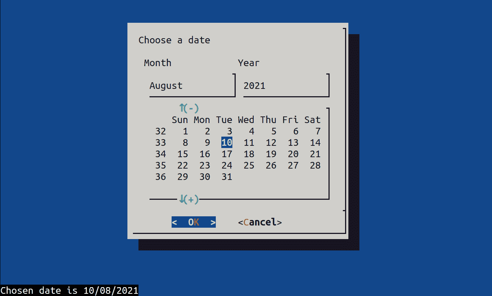
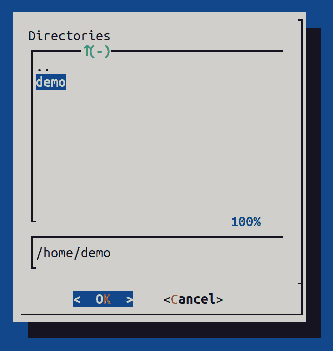
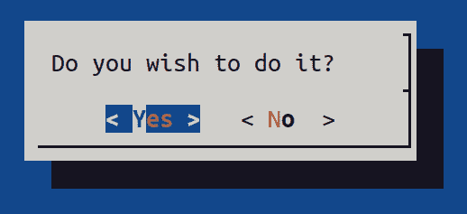
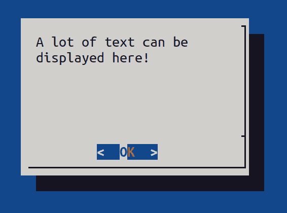
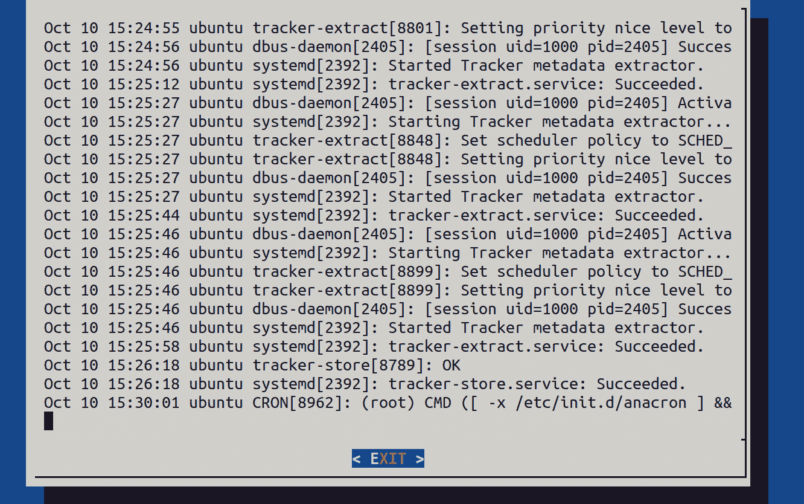

# 第十四章：与 Shell 脚本交互

我们几乎完成了对脚本基本概念的解释，但在我们完全完成之前，我们需要学习如何与 Shell 脚本进行交互。这在 Shell 脚本中并非总是必要的，但在大多数情况下是适用的。例如，创建一个只做一项工作且仅做一项工作的脚本是一回事。而创建一个在执行过程中需要我们做出一些选择的脚本则完全不同。如果没有其他原因，这第二种类型的脚本就是 Shell 脚本交互的一个典型候选。在本章中，我们将介绍三种不同的方式来处理 Shell 脚本的交互。

本章将涵盖以下内容：

+   创建基于文本的交互式脚本

+   使用 expect 自动化基于文本输出的重复任务

+   使用 dialog 创建基于菜单的交互式脚本

# 技术要求

就像到目前为止的所有章节一样，我们将使用运行 Bash Shell 的相同虚拟机。所以，我们需要一台安装了 Linux 的虚拟机——任何发行版都可以（在我们的案例中，它将是*Ubuntu 20.10*）。

现在，启动你的虚拟机！

# 创建基于文本的交互式脚本

到目前为止，我们做的唯一一件事就是没有在脚本中加入任何交互。原因很简单——到此为止，我们只讨论了如何输出信息，而没有讨论如何从用户或其他来源获取信息。在现实世界中，交互是我们必须处理的事情，因为它是创建任何脚本的核心。我们可以说，交互有两种类型。首先，我们的脚本可以与系统本身进行交互。这意味着使用不同的变量和其他信息，我们可以从系统中获取这些信息——例如，内存或挂载磁盘上的空闲空间。你可以说这不是实际的交互，而只是从系统中读取实时数据。但即便如此，这也是确保脚本按需执行的非常有用的方法。

另一个我们可以做的事情是与用户进行交互。如果脚本由系统运行，它不会以任何方式与用户交互，但当我们为日常工作创建脚本时，用户交互是非常重要的。考虑这个问题——为什么我们要创建一个只备份*一个文件夹*（仅一个文件夹）的脚本，而我们可以创建一个可以指定备份*一个或多个目录*的脚本呢？这种设计脚本的方式不是更具可用性吗？

## 准备工作

当我们开始创建我们的脚本时，我们必须决定它们需要的交互方式。根据所需的脚本类型，我们可以使用交互式提示、菜单、某种预配置或甚至一些图形界面。目前，我们将避免在我们的脚本中使用 GUI。然而，如果需要的话，我们可以使用适当的工具帮助我们使用它们。记住，脚本基本上只是一些执行控制，决定不同命令和应用程序如何交互，因此首先要关注的是这些命令。

首先，我们的第一个配方将是一个简单的交互式脚本，要求用户输入并根据输入进行操作。

## 如何做到…

在这个配方中，我们将要使用的主要命令是 `read` 和 `echo`。在我们做任何其他事情之前，我们需要学习关于这些命令的一些技巧。理论上，`read` 是很容易理解的——它等待用户输入，然后将该输入存储在某个变量中。但是为了向您展示这个简单命令所能实现的不同功能，我们需要展示一些例子。

`read` 在其基本形式中接受一个参数——变量——然后接受用户输入并将其放入该变量中，以便我们稍后使用。让我们考虑以下例子：

```
#!/bin/bash
echo "Input a value: "
read Value1
echo "Your input was: $Value1"
```

如果我们快速测试这个脚本，这将是我们得到的结果：

```
demo@cli1:~/interactive$ bash singlevar.sh 
Input a value: 
test
Your input was: test
demo@cli1:~/interactive$ bash singlevar.sh 
Input a value: 
test value
Your input was: test value
```

有时这还不够。有时，我们需要在我们的脚本中获取多个值。这里的问题是用户输入值的方式。Shell 使用空格字符作为分隔符，因此空格将分隔 `read` 命令中的值。如果我们需要获取包含空格的值，我们将不得不以不同方式处理它。正如我们在前面的例子中看到的那样，只有在使用多个返回变量时，这才会成为问题。

然而，如果我们使用不包含空格的值，我们可以简单地使用以下代码并将其保存在 `doublevar.sh` 文件中：

```
#!/bin/bash
echo -e "Input two numbers "
read num1 num2
echo "Two numbers are $num1 and $num2"
```

现在，让我们试一试，看看它是否按我们期望的方式工作：

```
demo@cli1:~/interactive$ bash doublevar.sh 
Input two numbers 
2 3
Two numbers are 2 and 3
```

我们必须在这里停下来，做另一个测试来澄清一些事情。Bash 对变量的类型不进行任何检查。在我们的脚本中，我们假设用户将输入数字，但没有任何限制他们使用任何字符串。另一件事是如何处理由空格分隔的多个值——第一个值将被分配给第一个变量；其余的值将分配给第二个变量。如果我们使用超过两个变量来存储值，结果将始终是序列中的每个变量都会被分配一个变量，最后一个变量将得到输入行中剩余的内容：

```
demo@cli1:~/interactive$ bash doublevar.sh 
Input two numbers 
First second
Two numbers are First and second
demo@cli1:~/interactive$ bash doublevar.sh 
Input two numbers 
first second third
Two numbers are first and second third
```

我们可以使用 `read` 的另一种方式是将值获取到一个名为 `$REPLY` 的预定义变量中。如果我们简单地省略变量名，那么您输入的所有内容都将在该变量中，然后可以在您的脚本中使用：

```
#!/bin/bash
echo "Input a value: "
Read
echo "Your input was: $REPLY"
```

一个简单的测试证明，这个行为和我们给命令一个正确的变量名时完全相同：

```
demo@cli1:~/interactive$ bash novar.sh 
Input a value: 
test value no variable
Your input was: test value no variable
```

使用`read`的另一种方式是通过使用`-a`选项。使用这个选项时，我们表示希望将所有获取的值存储为一个数组。在此选项后，我们需要指定用来存储这些值的变量名，或者我们可以简单地使用默认的`$REPLY`变量。我们不应该做的是使用多个变量名。这是因为我们将多个值存储在一个变量中，所以尝试引用多个变量本身就没有意义：

```
#!/bin/bash
echo "Input multiple values: "
read REGULAR
echo "Your input was: $REGULAR"
echo "This will not work: ${REGULAR[0]}"
echo "Now input multiple values again:"
read -a REGULAR
echo "This will work: ${REGULAR[0]}"
```

在这里，我们将多个值读取到一个变量中。由于我们没有要求 Bash 创建一个数组，它将把所有内容存储到这个变量中，但没有办法引用该变量内的元素。Bash 将变量中的所有值视为一个单独的、首个元素，因此如果我们尝试打印它，我们将看到所有内容。

第二次执行这个操作时，我们正在获取用户输入的值。这里，我们使用了一个数组。一切看起来一样，但如果我们引用变量的第一个元素，我们只会打印出第一个元素：

```
demo@cli1:~/interactive$ bash array.sh 
Input multiple values: 
first second third
Your input was: first second third
This will not work: first second third
Now input multiple values again:
first second third
This will work: first
```

现在，我们需要稍微实验一下`echo`命令。在本书的整个脚本部分中，我们一直在以最基本的形式使用这个命令来输出文本到屏幕，或者更准确地说，是输出到标准输出。这对于大多数情况都能正常工作，但有些脚本中我们需要更精确地控制输出。`echo`工作方式的问题在于它总是用换行符结束它输出的字符串，一旦它打印了作为参数传递的内容，输出就会强制换到新的一行。虽然对于打印信息来说，这没有问题，但当我们尝试在脚本中与用户交互时，如果总是强迫用户将我们需要的值输入到新的一行，看起来就很奇怪。所以，`echo`提供了一个额外的选项，改变了默认行为（`-n`）。让我们考虑这个例子：

```
#!/bin/bash
echo -n "Can you please input a word?: "
read  word
echo "I got: $word"
```

我们在这里告诉`echo`做的是打印引号内的文本，但打印完后，它应该停留在同一行。由于我们的`read`命令会从前一个命令放置光标的位置继续执行，因此结果是我们输入的值最自然地会出现在屏幕上：

```
demo@cli1:~/interactive$ bash echoline.sh 
Can you please input a word?: singleword
I got: singleword
```

还有一种做法看起来更复杂，但表现与上面相同：

```
#!/bin/bash
echo -e "Can you please input a word?:  \c "
read  word
echo "I got: $word"
```

我们向你展示这个的原因是，这个例子使用了特殊字符来表示行的结束，但与此同时，还有更多的字符可以用来更精细地控制输出。默认情况下，最常用的是以下几种：

+   `\\ 反斜杠`：当我们需要输出实际的`\`字符时使用。

+   `\a 警报（BEL）`：当我们想通过大声的声音警告用户时使用。

+   `\b 退格`：当我们需要提供一个退格字符，删除光标所在行的内容时使用。

+   `\c produce no further output`：这个用于告诉`echo`停止输出。

+   `\t horizontal tab`：这个用于提供`tab`并对齐输出。

现在我们了解了一些基本的`read`和`echo`语法，让我们在脚本中好好利用它们吧。

## 它是如何工作的…

现在我们知道了如何处理 Bash 脚本中用于交互的所有内容，我们可以创建一个展示所有内容的脚本。在这里，我们正在创建一个简单的菜单：

```
#!/bin/bash
echo "Your favourite scripting language?"
echo "1) bash"
echo "2) perl"
echo "3) python"
echo "4) c++"
echo "5) Dunno!"
echo -n "Your choice is: "
read choice;
# we do a simple case structure
case $choice in
    1) echo "You chose bash";;
    2) echo "You chose perl";;
    3) echo "You chose python";;
    4) echo "You chose c++";;
    5) exit
esac
```

试试看！

另一种在脚本中创建交互式菜单的方式是使用`select`命令。这个命令通常用于创建简单的菜单，像这样：

```
#!/bin/bash
PS3='Please choose an option: '
options=("Option 1" "Option 2" "Option 3" "Quit")
select opt in "${options[@]}"
do
    case $opt in
        "Option 1")
            echo "you chose Option 1"
            ;;
        "Option 2")
            echo "you chose Option 2"
            ;;
        "Option 3")
            echo "you chose Option $REPLY which is $opt"
            ;;
        "Quit")
            break
            ;;
        *) echo "invalid option $REPLY"
            ;;
    esac
done
```

`select`看起来像某种循环；它要求我们提前设置一些变量。`$PS3`包含用户将看到的问题，而`$options`包含一个字符串数组，表示可选项。当用户运行这个脚本时，将展示一个编号选项列表，用户可以输入任何一个数字。`select`将根据用户选择的数字从我们的选项列表中替换相应的字符串，并执行相应的命令：

```
demo@cli1:~/interactive$ bash select.sh 
1) Option 1
2) Option 2
3) Option 3
4) Quit
Please choose an option: 1
you chose Option 1
Please choose an option: 2
you chose Option 2
Please choose an option: 3
you chose Option 3 which is Option 3
Please choose an option: 4
demo@cli1:~/interactive$
```

这是快速创建一个多选项脚本的好方法。

## 另请参见

关于`echo`和`read`命令的更多信息可以在以下链接中找到：

+   [`linuxhint.com/bash_read_command/`](https://linuxhint.com/bash_read_command/)

+   [`www.javatpoint.com/bash-read-user-input`](https://www.javatpoint.com/bash-read-user-input)

# 使用`expect`自动化基于文本输出的重复任务

Bash 是一个强大的工具，但有时我们需要做一些特殊的事情，这时需要额外的工具。在这个示例中，我们将使用一个名为`expect`的工具。在开始之前，我们必须注意，`expect`并不是 Bash 脚本的一部分——它是一个完全独立的脚本语言，专门用于实现脚本与用户和其他系统之间的交互。它的核心思想是让脚本不仅能够执行提供信息的`普通`命令（命令输出），还能够与任何具有**命令行界面**（**CLI**）的应用程序进行交互，并从中获取信息。

## 准备工作

简单来说，`expect`充当了一个虚拟键盘，可以输入文本并读取屏幕上的内容。这是一个强大的功能，因为许多应用程序和脚本是由那些没有启用脚本支持的开发者创建的，或者他们只是选择不这样做。这意味着没有像`expect`这样的工具，我们将无法与这些应用程序进行交互。这有时意味着我们将无法在脚本中执行我们想做的事情。

在这个示例中，我们将学习如何使用`expect`与另一台计算机上的另一个 Shell 进行交互，如何输入密码并登录，如何输入命令并从对方获得响应。

但在我们做这些之前，如果系统中未安装`expect`，我们需要先安装它，因为它不是系统的标准组件。

使用以下命令并等待它完成：

```
sudo apt install expect
```

我们需要在这里使用`sudo`。只有管理员才能安装软件包，因此需要输入你的用户密码。

## 如何实现…

由于`expect`不是 Bash，我们必须告诉脚本使用它。语法与创建 Bash 脚本时相同——我们需要将`expect`的运行放在脚本的第一行。请注意，这意味着我们的脚本将不再使用 Bash 的任何命令，但我们可以执行许多新操作。

我们将从简单的`hello world`脚本开始：

```
#!/usr/bin/expect
expect "hello"
send "world"
```

脚本执行的操作与命令的字面意思完全一致；当我们启动它时，脚本将寻找`hello`字符串，并在收到后，回复`world`字符串。

字符串是区分大小写的，因此只有完全匹配的内容才会有效。另外，`expect`有一个内置的时间段，在此期间它会等待接收字符串。如果在此时间段内没有匹配的内容，脚本将继续执行下一个命令。在我们的示例中，即使我们不给它任何输入，`world`字符串也会被打印出来。

当我们启动脚本时，必须使用`expect`命令；我们不能使用 Bash 启动此脚本，因为它是专门为`expect`编写的：

```
demo@cli1:~/interactive$ expect expect1.exp 
HEllo
helo
hello
world
```

我们尝试了三种不同的拼写方式，只有完全匹配的才有效。

让我们做些更有趣的事情，并解释我们在过程中做了什么：

```
#!/usr/bin/expect
set timeout 20
set host [lindex $argv 0]
set user [lindex $argv 1]
set password [lindex $argv 2]
spawn ssh "$user\@$host"
expect "Password:"
send "$password\r";
interact
```

这个脚本的目的是帮助你快速使用`ssh`协议连接到另一台主机。当我们运行它时，我们需要提供三件事：主机的名称或 IP 地址、要使用的用户名以及将要登录的用户的明文密码。我们知道以这种方式使用密码并不常见，但这里我们提供一个示例。

在脚本开始时，我们设置了提示的超时时间。如前所述，如果`expect`命令没有检测到任何输入，它将在此`timeout`值指定的时间后继续执行脚本。接下来的三行代码处理我们传递给脚本的参数。我们将每个参数赋值给一个变量，以便稍后使用。

之后，我们使用`spawn`命令在一个独立的进程中调用`ssh`命令。我们使用标准的`ssh`客户端，并为其提供用户名和主机名，以便我们能够启动登录过程。

之后，我们的脚本会等待，直到检测到需要输入密码。当它检测到提示中的`password:`部分时，它会以明文形式发送我们的密码。

脚本中的最后一条命令是`interact`，它将控制权交给我们，这样我们就可以使用刚刚登录的会话来执行我们打算做的事情。这就是执行时的样子：

```
demo@cli1:~/interactive$ expect sshlogin.exp localhost demo demo
spawn ssh demo@localhost
demo@localhost's password: 
Welcome to Ubuntu 20.10 (GNU/Linux 5.8.0-63-generic x86_64)
 Documentation:  https://help.ubuntu.com
* Management:     https://landscape.canonical.com
* Support:        https://ubuntu.com/advantage
0 updates can be installed immediately.
0 of these updates are security updates.
demo@cli1:~$
```

如果我们需要在远程系统上工作，这是一个不错的起点。但我们如何在另一台系统上运行其他命令，又能做些什么呢？

这里有两种方式可以继续；一种是简单地等待提示符显示，然后发送命令，另一种是“盲目地”编写脚本，等待预定的时间，然后发送我们需要的命令。因此，让我们为这两种概念编写一个示例脚本。我们的目标是有一个场景，其中脚本的一部分作为命令输出的*回答*（在我们的脚本中，这是`ssh`部分及其输出）。第二部分与等待预定时间的概念有关（`sleep 5`意味着等待 5 秒钟），然后做一些事情。让我们来看看我们的示例：

```
#!/usr/bin/expect
set timeout 20
set host [lindex $argv 0]
set user [lindex $argv 1]
set password [lindex $argv 2]
spawn ssh "$user\@$host"
expect "password:"
send "$password\r";
sleep 5
send "clear\r";
send "ip link\r";
expect "$"
puts $expect_out(buffer);
send "exit\r";
```

我们添加了两个之前未提到的内容。第一个是我们使用`puts`命令向屏幕打印信息。它的行为类似于 Bash 中的`echo`命令。

`$expect_out (buffer)`变量保存脚本在运行命令（在两个匹配之间）时获取的数据。因此，在我们的脚本中，这将保存`ip add`命令提供的信息。如果你想知道登录信息去了哪里，它不可见，因为我们发出了`clear`命令清除了屏幕，而这也清除了缓冲区。

## 它是如何工作的…

`expect`是一个令人惊叹的工具，甚至还有更多的功能。它的主要用途之一是通过脚本自动化管理任务。它最常见的用途之一就是我们在前一个示例中所做的——远程执行命令。我们可能经常使用它的原因不仅仅是为了自动化登录，还为了自动化测试。运行特定命令后，我们可以做任何我们想做的事情，然后将结果获取到我们的脚本中。

通常，`expect`作为另一个脚本的一部分使用。当我们需要某些仅`expect`能够提供的数据时，我们调用它，然后继续在主脚本中处理这些数据。然而，自动化脚本还意味着另一件事——让它们接受信息，这使我们能够编写测试来检查脚本是否有效。因此，`expect`有一个工具，用来从任何包含与用户交互的脚本中创建一个`expect`脚本。

以下是一个快速示例，用于演示我们所说的内容，但首先，我们将创建一个非常简单的脚本，在其中使用不同方式调用`echo`和`read`命令：

```
#!/bin/bash
#echo -e "Can you please input a word?:  \c "
echo -n "Can you please input a word?:   "
read  word
echo "I got: $word"
echo -e "Now please input two words: "
read word1 word2
echo "I got: \"$word1\" \"$word2\""
echo -e "Any more thoughts? "
# read will by default create $REPLY variable
read
echo "$REPLY is not a bad thing "
echo -e "Can you give me three of your favorite colors? "
# read -a will read an array of words
read -a colours
echo "Amazing, I also like ${colours[0]}, ${colours[1]} and \n
${colours[2]}:-)"
```

现在，我们将启动`autoexpect`工具，以获取脚本的输入和输出：

```
demo@cli1:~/interactive$ autoexpect bash simpleecho.sh 
autoexpect started, file is script.exp
Can you please input a word?:   word one
I got: word one
Now please input two words: 
two words
I got: "two" "words"
Any more thoughts? 
none whatsoever
none whatsoever is not a bad thing 
Can you give me three of your favourite colors? 
blue yellow cyan
Amazing, I also like blue, yellow and cyan
autoexpect done, file is script.exp
```

在这里，`autoexpect`跟踪了我们的脚本使用的提示以及我们给出的答案。当我们执行完脚本后，它创建了一个`expect`脚本，允许我们完全自动化运行 Bash 脚本。我们将省略部分脚本，因为它包含了大量的注释，既提供了关于工具的信息，也给出了免责声明。以下是`autoexpect`的输出，它被保存在一个名为`script.exp`的文件中：

```
#!/usr/bin/expect -f
# This Expect script was generated by autoexpect on Sun Oct \n
10 13:35:52 2021
set force_conservative 0  ;# set to 1 to force conservative \n
mode even if
                                        ;# script wasn't run \n
conservatively
          Originally
               if {$force_conservative} {                                            
                          set send_slow {1 .1}
                          proc send {ignore arg} {
                          sleep .1
                          exp_send -s -- $arg
             }
} 
set timeout -1
spawn bash simpleecho.sh
match_max 100000
expect -exact "Can you please input a word?:   "
send -- "word one\r"
expect -exact "word one\r
I got: word one\r
Now please input two words: \r
"
send -- "two rods "
expect -exact "
send -- ""
expect -exact "
send -- ""
expect -exact "
send -- ""
expect -exact "
send -- ""
expect -exact "
send -- "words\r"
expect -exact "words\r
I got: \"two\" \"words\"\r
Any more thoughts? \r
"
send -- "none whatsoever\r"
expect -exact "none whatsoever\r
none whatsoever is not a bad thing \r
Can you give me three of your favorite colors? \r
"
send -- "blue llow and "
expect -exact "
send -- ""
expect -exact "
send -- ""
expect -exact "
send -- ""
expect -exact "
send -- "cz"
expect -exact "
send -- "yan\r"
expect eof
```

这个脚本是自动化工作任务的一个良好起点，但有一个致命的缺陷要小心。在最后一部分检查输入和输出时，它记录了我们在输入过程中所犯的每一个错字和错误，但它没有保存删除它们的整个过程，因此这个输入无法正常工作。我们在使用它之前，必须编辑这个脚本，处理所有错误和输入问题。之后，我们可以在此基础上扩展，并使用附加参数测试脚本的行为。

## 另见

`expect`非常适合进行测试。如需更多示例，请访问以下链接：

+   Expect 命令：[`likegeeks.com/expect-command/`](https://likegeeks.com/expect-command/)

+   Expect 手册页：[`linux.die.net/man/1/expect`](https://linux.die.net/man/1/expect)

# 使用`dialog`进行基于菜单的交互式脚本

既然我们已经使用了`expect`，我们知道如何与其他应用程序交互。剩下要做的就是学习如何让我们的脚本更加互动。毫不奇怪，这个问题已经有了标准的解决方法。在这个配方中，我们将使用`dialog`，一个看起来简单但可以让你与最终用户创建复杂且视觉有趣交互的命令。

## 准备工作

根据定义，`dialog`和任何交互工具一样，会使你的脚本在非交互环境中无法使用。可以通过不使用`dialog`或者检测脚本是作为服务运行还是作为交互式脚本运行来解决这个问题。

和`expect`一样，我们必须安装`dialog`才能使用它。只需使用以下命令：

```
sudo apt install dialog
```

所有所需的内容将根据要求安装。

## 如何操作…

`dialog`是一个完整的应用程序，不仅包含菜单，还有很多其他小部件，这些小部件会在文本模式下的 GUI 中显示。如果你的终端支持颜色，它将使用颜色（现代终端几乎都支持显示颜色），并且会使用光标键进行导航。我们将向你展示一些最常见的命令，并介绍如何使用它们。

首先，尝试运行此命令：

```
dialog --clear --backtitle "Simple menu" --title "Available \n
options" --menu "Choose one:" 16 50 4 1 "First" 2 "Second" 3 \n
"Third"
```

如果一切顺利，你应该看到类似这样的界面（具体大小取决于你的终端窗口）：


图 14.1 – `dialog`命令使我们能够在脚本中创建单行菜单

`dialog` 作为你的脚本与用户之间的一个漂亮代理工作。你的脚本负责你试图自动化的过程的逻辑；`dialog` 负责处理用户的输入和输出。我们需要对这个菜单做点什么；如果我们只是从 Bash 提示符中调用它，那它就没有什么用途。我们这样使用它的原因是为了展示如何调用一个小部件。许多人在第一次看到`dialog`在脚本中使用时，会期望一个复杂的过程，实际上这只是一个单行命令和几个参数。为了演示这一点，让我们创建一个实际的菜单并将其保存在名为`menu.sh`的文件中：

```
#!/bin/bash
HEIGHT=16
WIDTH=50
CHOICE_HEIGHT=4
BACKTITLE="Simple menu"
TITLE="Available options"
MENU="Choose one:"
OPTIONS=(1 "First" 2 "Second" 3 "Third")
CHOICE=$(dialog --clear \
                --backtitle "$BACKTITLE" \
                --title "$TITLE" \
                --menu "$MENU" \
                $HEIGHT $WIDTH $CHOICE_HEIGHT \
                "${OPTIONS[@]}" \
                2>&1 >/dev/tty)
clear
case $CHOICE in
        1)
            echo "You chose First"
            ;;
        2)
            echo "You chose Second"
            ;;
        3)
            echo "You chose Third"
            ;;
esac
```

我们在这里做什么？`dialog` 为它可以显示的每个小部件需要几个参数。它需要许多值来正确显示某些内容是否来自你的终端。这些值包括屏幕的宽度和高度，以及如何正确显示输出。通常，小部件只需要用户定义的内容——小部件本身的高度和宽度、在小部件中使用的标题和其他字符串，以及用户的选择。根据小部件的工作方式和使用方式，这些内容因小部件而异。在我们的第一个示例中，我们使用的是一个菜单小部件，它需要一个选项列表和菜单的大小。我们需要这个选项列表，因为它帮助启动此脚本的用户做出正确的选择。我们还提供了标题，尽管我们并不需要所有标题就能让菜单正常运行。

这里有一个有趣的地方需要注意，就是`dialog`返回用户选择的值的方式。为了获取这个值，我们在可能的选项列表中提供了索引。当我们运行`dialog`时，我们会将它从用户那里获取的值直接赋给一个变量，然后根据该值进行操作。

## 它是如何工作的…

`dialog` 基于使用不同的图形字符显示不同的小部件，从而在普通终端中给人一种图形界面的感觉。作为一个使用`dialog`的人，如果你愿意，你几乎可以改变所有元素的外观，但通常，大多数脚本只是简单地使用`dialog`来快速让用户输入他们需要的数据。

使用像`dialog`这样的工具是一种很好的方法，能够让用户为脚本中的不同事物选择值，同时避免大量输入错误。

另一个示例是，假设我们需要请求用户提供一个日期。我们可以使用`read`和`echo`命令通过一个简单的输入框来实现。虽然这样可行，但有很大风险用户会使用错误的格式。你可以通过向用户解释你期望的格式来解决这个问题，但他们不可避免地会忘记并使用错误的格式。

在`dialog`中，你可以做一些简单的事情，比如这样：

```
#!/bin/bash
DATEPROMPT="Choose a date"
CHOSENDATE=$(dialog --stdout --calendar "$DATEPROMPT" 0 0)
echo "Chosen date is $CHOSENDATE"
```

以下是输出：



图 14.2 – 使用日历小部件显示日期非常简单

我们得到的日期将根据运行脚本的系统的区域设置以正确的格式显示，用户可以从几个好看的日历中进行选择。`dialog`在这里非常有用，因为如果我们没有指定默认的具体日期，它会自动跳到当前日期。根据终端仿真类型，`dialog`甚至可能支持使用计算机鼠标来选择数据。

还有一些非常有用的小部件是`dialog`提供的，我们将展示其中的一些。我们不会为所有小部件创建脚本，因为它们使用起来非常简单。最简单的方法是使用`—stdout`选项将`dialog`的结果存入变量，然后从那里继续工作。

如果我们需要选择一个目录，这可能是一个大问题，因为用户通常会忘记正确写路径，或者使用绝对路径而不是相对路径。通过使用一个简单的`dialog 命令`，比如下面的命令，我们可以避免很多问题：

```
dialog --dselect ~ 10 39
```

这是预期的结果：



图 14.3 – 使用对话框选择目录可以避免很多错误

当我们需要从用户那里获取一个简单的*是*或*否*答案时，简单的`dialog`非常有用。我们可以使用以下代码来实现：

```
dialog --yesno "Do you wish to do it?" 0 0
```

使用这个`dialog`命令，我们应该得到以下输出：



图 14.4 – 有时候，你需要问一个简单的问题，答案也很简单

然后，我们有一些更具信息性的选择。在我们的脚本中，我们经常需要向用户展示一些他们需要阅读的信息。把它放在一个格式化的框中比直接在终端打印要好得多：

```
dialog --msgbox "A lot of text can be displayed here!" 10 30
```

这个示例将生成以下输出：



图 14.5 – 使用正确的小部件显示文本既简单又有效

有一些小部件我们不会提及，因为我们想快速向你展示一些可能的用法。对于最后一个例子，我们将向你展示一个非常有用的小部件——这个小部件显示文本文件的内容，并随着更改自动更新它，使你可以在用户安装某个东西时显示日志：

```
dialog --tailbox /var/log/syslog 40 80
```

这是预期的输出：



图 14.6 – tailbox 就像在文件上使用 tail -f，但外观更好

这就是我们对`dialog`功能的概述。确保你阅读文档，以了解其他可以使用的小部件以及如何正确使用它们。

请注意，存在其他实现相同思想的工具。其中之一叫做 *whiptail*，它与`dialog`相同，但采用不同的方式在屏幕上绘制对象。然而，它并不像`dialog`那样完整，并且缺少一些与`dialog`相比的控件。

## 参见

+   `dialog` 手册页：[`linux.die.net/man/1/dialog`](https://linux.die.net/man/1/dialog)

+   菜单框指南：[`bash.cyberciti.biz/guide/A_menu_box`](https://bash.cyberciti.biz/guide/A_menu_box)
