# 第十五章：Shell 脚本故障排除

如果你已经读到这里，说明你一定对如何编写 shell 脚本有了很多想法，也会有更多关于如何让脚本中的某些功能正常工作的问题。这是完全正常的。你的脚本之旅才刚刚开始。没有多少阅读能代替写脚本、尝试不同解决方案以及理解不同命令如何工作的实践时间。

我们有一些好消息和一些坏消息要告诉你。擅长编写脚本需要很长时间，而且在编写脚本时，大部分时间将用于理解你的脚本应该做什么，通常还要搞清楚为什么它做错了。好消息是，编写脚本永远不会让人感到无聊。

在本章中，我们将尽量为你提供调试和排除脚本故障的工具，帮助你快速而不混乱地解决问题。这些工具将以不同的方法形式出现，帮助你最大化找到脚本中的逻辑和有时是语法错误的能力。我们将从基本的技巧开始，逐步过渡到更复杂的脚本调试方法。

本章将涵盖以下几个方法：

+   常见的脚本错误

+   简单的调试方法——在脚本执行期间输出变量值

+   使用 `bash` 的 `-x` 和 `-v` 选项

+   使用 `set` 来调试脚本的一部分

# 技术要求

在本章中，我们将使用与本书前面所有关于脚本编写章节相同的机器。请不要因为有几张截图是 Windows 系统下制作的而感到惊慌。它们仅用于说明某个观点；你并不需要 Windows 来做任何事情。就像之前一样，我们使用的是以下内容：

+   安装了 Linux 的虚拟机，任何版本的 Linux（在我们的案例中，将是*Ubuntu 20.10*）

现在，让我们深入探讨故障排除。

# 常见的脚本错误

编写脚本将会遇到许多问题，包括如何设计脚本、如何找到适合不同问题的解决方案，以及如何将这一切应用到目标环境中。这些问题有些可能在几分钟内就能轻松解决，也有些可能需要你花费几天甚至几周时间来解决。所有这些时间可能只是你调试和排除脚本问题时所花费时间的一小部分。编写脚本和排除脚本问题是两件完全不同的事情——虽然你通常会从零开始编写自己的脚本，但你不仅仅会调试和排除自己的代码。

编写脚本需要技巧和对环境的深刻理解，但可以说，为了调试和排查故障，你需要更深入地理解任务以及脚本试图如何完成任务。在这个教程中，我们将学习如何掌握技能，不仅能够调试自己编写的脚本，还能理解任何遇到的脚本代码，无论是你自己创建的部分，还是由其他人创建的系统，你需要负责让它正常运行。

## 准备开始

故障排除和调试看起来像是同一任务，但它们有细微的不同。一般来说，当我们在调试时，我们集中精力寻找脚本中的逻辑错误和其他错误。而在故障排除时，我们不仅在调试，还在尝试更好地理解应该做什么，以及你的应用程序如何尝试完成这些任务。在本章的教程中，我们将这两个术语一起使用——试图让那些不正常工作的东西恢复正常，或者至少表现得更好。

有一些方法可以让这个过程尽可能简单，其中之一就是尽量掌握关于脚本的知识。能够理解脚本以及解决问题的具体方法，不仅能帮助你快速了解问题所在，还能帮助你找到解决方法。

有时候，解决方案可能是使用标准的解决方案简化代码的某个部分，或者将代码拆分成不同的、更标准化的模块。

当面对更复杂的脚本时，将代码分解成更易管理和理解的模块，这种方法可能会非常成功，因为即使是最优秀的脚本编写者，有时也会完全忽略他们所做事情的关键，甚至把最简单的任务都搞复杂了。

说到调试，我们需要谈谈错误。大致来说，我们的脚本可能有四种不同的结果：

+   脚本按预期工作。

+   脚本抛出错误。

+   脚本工作，但不完全，产生错误。

+   脚本可以工作，但有时会默默地破坏输入或输出数据中的某些内容。

当我们有时间时，我们可以着手处理这些可能的结果，并让脚本表现得更好，即使它已经正常工作。有时，花点时间让你的脚本更加优雅、注释更加清晰、代码更具可读性，哪怕它本来就能正常工作，这也是值得的。

另一个情况是脚本抛出错误。Bash 因其晦涩且通用的错误信息而闻名。其中一些信息过于模糊，难以提供帮助，有时甚至完全没有意义，无法帮助我们理解到底哪里出了问题。

一个常见的例子是有时无法正确理解行尾字符。Windows 和 Linux 处理行尾的方式不同。Windows 在终止文本文件时使用回车符和换行符，而 Linux 只使用换行符来终止行。Bash 可能会遇到问题，Windows 上编写的脚本有时会在 Linux 上莫名其妙地出错。这是 Windows 和 Linux 上相同的脚本，使用一个显示文件中所有字符的编辑器：

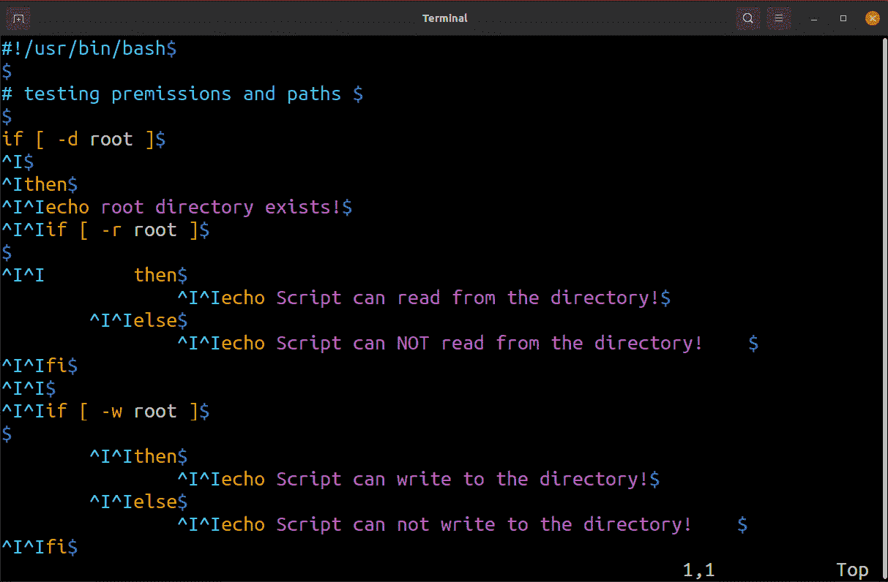

图 15.1 – 在 Linux 中，行通过单个字符终止

在 Windows 中，表现类似，但我们可以看到行尾有两个字符：

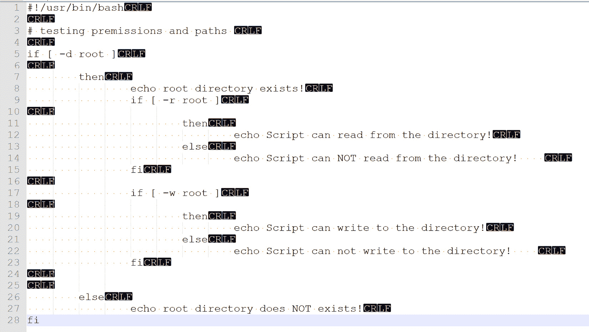

图 15.2 – 在 Windows 中，使用两个字符来终止一行

在 Linux 中，如果我们没有正确编辑文件并忘记去除多余的字符，最终我们会得到一些在普通编辑器中不可见的字符，并同时破坏代码：

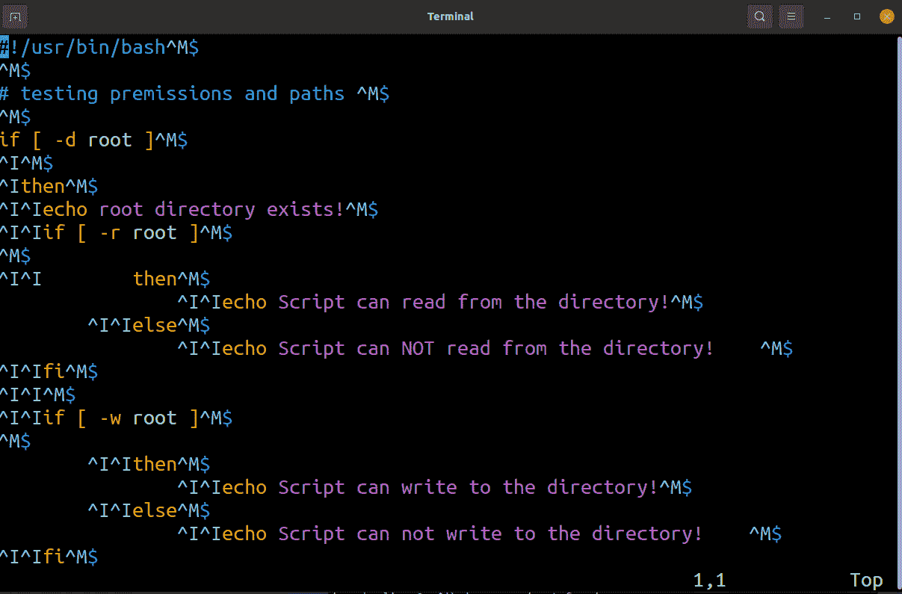

图 15.3 – 在 vim 中，你需要打开几个选项来查看特殊字符

请注意，有一个工具叫做`dos2unix`（如果你需要转换为另一种格式，也有`unix2dos`），它能在传输文件时修复行尾问题。这个问题是系统范围的，许多程序在遇到来自 Windows 的文本文件时会表现得异常。

如果我们不处理行尾的字符，脚本会出错。例如，我们尝试在 Linux 上运行从 Windows 获取的文件时，出现了完全无法理解的错误，错误信息中提到了看似根本不在脚本中的命令。我们使用`dos.sh`作为在 Linux 上保存的脚本名称：

```
demo@ubuntu:~/Desktop/allscripts$ bash dos.sh 
dos.sh: line 2: $'\r': command not found
dos.sh: line 4: $'\r': command not found
dos.sh: line 26: syntax error near unexpected token 'else'
'os.sh: line 26: '    else
```

此外，我们需要明确的是，如果你使用复制和粘贴在不同环境之间移动文件，这将直接解决问题。当你在某个操作系统中粘贴一行时，它会自动创建正确的行尾。这个方法并不适用于复制和粘贴整个文件；如果你这么做，你是在传输整个文件的内容。

另一个常见的语法错误是使用错误的引号字符，无论是混用引号，还是在脚本中执行命令时将反引号替换为引号：

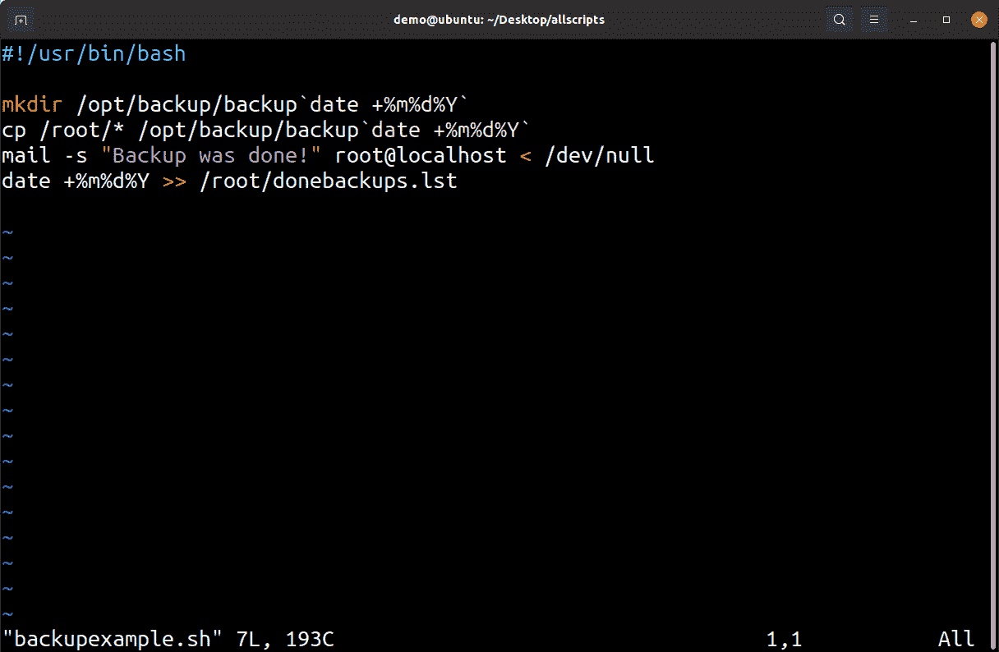

图 15.4 – 完全正常的脚本，在 vim 中用语法高亮显示

如果我们将一个反引号改成引号，它将变成如下所示：

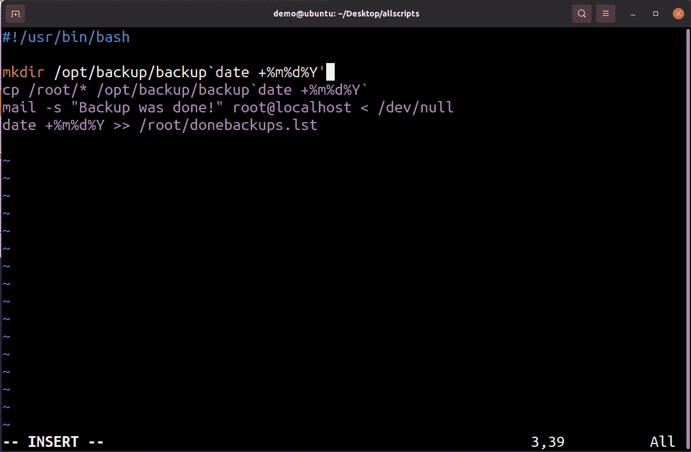

图 15.5 – 如果没有正确的高亮显示，像这样的错误可能会引发严重问题

我们在这里使用的是 vim，你会立即注意到变化。编辑器理解语法，并以不同的颜色高亮显示适当的代码块。

如果我们尝试运行这个脚本，它会抛出一个错误：

```
demo@ubuntu:~/Desktop/allscripts$ bash backupexample.sh 
backupexample.sh: line 4: unexpected EOF while looking for matching '''
backupexample.sh: line 8: syntax error: unexpected end of file
```

这个错误有点令人困惑。Bash 告诉我们，在试图找到结束引号时，它已经到达了文件的末尾。

所有这些错误的共同点是使用不同编辑器中的不同字体。有时，字符之间的差异非常微小，难以察觉。Bash 通过报告错误时，有时会指向完全不同的代码部分，使得问题更难以发现。

解决这个问题的方法是使用你知道能清晰显示的字体，并且使用一个能够配对括号等字符的编辑器。引号和反引号可能仍然是个问题，因为大多数应用程序无法匹配它们。然而，像 vim 这样的编辑器会高亮显示注释，正如我们在之前的例子中看到的，这样就能让像这样的错误变得可见。

这是在 Windows 上的 Notepad++中高亮显示括号的一个例子，因为我们提到了多平台的方法：

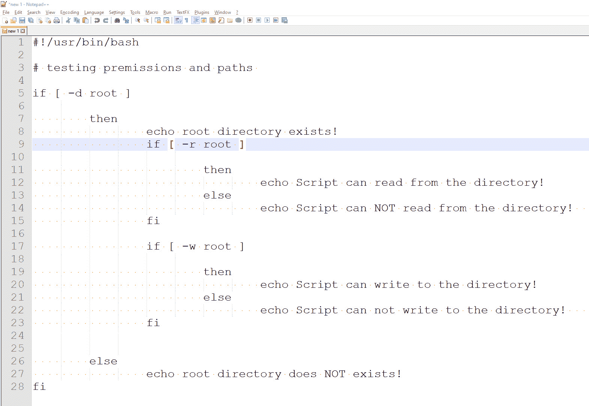

图 15.6 – 在 Notepad 中高亮显示括号

当然，我们还有一些标准的、不可避免的语法错误。一个好的编辑器也能帮助我们发现这些错误：

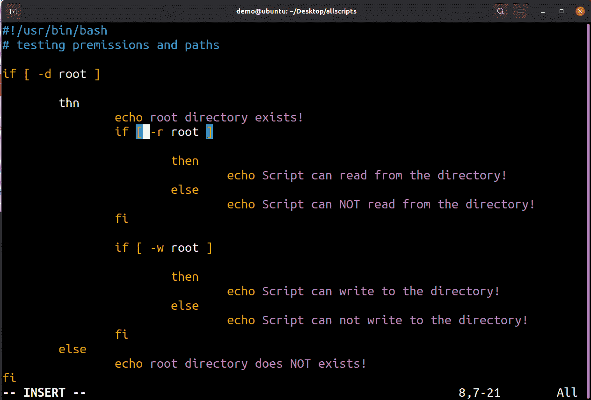

图 15.7 – 使用一个能够高亮显示大括号和括号的编辑器将为你节省时间

错误出现在`then`关键字上，vim 通过将该关键字的颜色改为白色（而不是通常的黄色）来高亮显示它。

处理完语法问题后，接下来是看看如何避免那些可以说是更复杂且更难发现的逻辑错误。

## 如何做……

在脚本中提到逻辑可能会造成误导。逻辑可以在术语的严格定义下，是指需要逻辑表达式来工作的条款中的形式逻辑，或者更广泛地说，是指脚本中的任何决策。当我们说*逻辑错误*时，我们通常指的是后者；即当我们的脚本按照我们告诉它的方式运行，而不是我们认为我们告诉它的方式时，所产生的问题。所有非语法错误导致的意外行为都属于这一类。

例如，假设我们想使用`sort`命令对几个数字进行排序。这看起来很简单，但有一个小缺陷。`sort`默认是按字母顺序排序，而不是按数字顺序：

```
demo@ubuntu:~/Desktop/allscripts$ du -a | sort
0           ./errorfile
0           ./settings
264      .
4           ./arrayops.sh
4           ./array.sh
4           ./associative.sh
4           ./auxscript.sh
4           ./backupexample.sh
4           ./dialogdate.sh
4           ./dos.sh
4           ./doublevar.sh
4           ./echoline1.sh
4           ./echoline.sh
```

我们最终得到的值是`264`，它大于`0`但小于`4`，这是错误的。如果我们想按照预期排序，我们应该使用适当的开关：

```
demo@ubuntu:~/Desktop/allscripts$ du -a | sort -n
0           ./errorfile
0           ./settings
4           ./arrayops.sh
4           ./array.sh
4           ./associative.sh
4           ./auxscript.sh
.
.
.
264       .
```

这种情况要好得多。像这样的错误不完全是 Bash 的问题，而是在我们不确定如何使用某个命令时发生的，结果就是我们的脚本会出现异常行为。

另一件你经常会看到的事情是无效的索引引用。在数组中，索引从`0`开始，但人们通常从`1`开始计数：

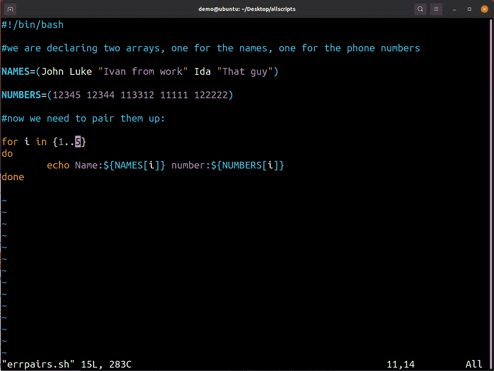

图 15.8 – 在任何语言中编程时，索引编号错误很常见

当我们尝试运行时，我们将在输出中丢失一对变量，因为我们错过了数组中的第一个元素：

```
demo@ubuntu:~/Desktop/allscripts$ bash errpairs.sh 
Name:Luke number:12344
Name:Ivan from work number:113312
Name:Ida number:11111
Name:That guy number:122222
Name: number:
```

当运行脚本时，执行这些操作会产生的错误有时很容易发现，但某些用例，特别是仅涉及数组部分的用例，可能会产生奇怪的问题。同样的问题可能会在使用参数的循环中发生，并且如果我们不立即打印值，我们可能不会注意到我们只处理了数组的一部分。

从根本上讲，问题在于我们计数的起始数字的定义是非常任意的。通常情况下，我们使用 0 作为第一个索引，但也有一些例外。如果你不确定，可以进行检查。

所有这些问题都在这里广泛提到。你需要知道它们，但是你在你的脚本中处理它们的方式将会因每个脚本的不同而不同。我们在这里的目的是让你意识到问题的存在，这样你就可以在它变得危险之前发现它。

我们提到的最后一个大问题是，有些脚本大部分时间工作正常，只在某些情况下失败，并且仅部分失败。这是最糟糕的问题，因为你不能完全信任脚本的输出，并且很难发现，因为大部分时间输出都是完全正常的。处理这些问题的唯一方法是仔细检查问题的所有边界情况，并在脚本本身上对它们进行测试。

## 工作原理…

在这个示例中，我们在描述可能问题时故意模糊不清。就像所有直接与在解决某些问题时出错相关的事物一样，我们希望避免所有这些问题，但在出现错误之前不可能定义避免的内容。我们看到的大多数问题将是假设不当或对事实的错误理解的结果。有时，这将是一个简单的打字错误，将不会被注意到。

当编写脚本时，还有一件事可以做得更好。为了避免语法和逻辑（主要是语法）中的最常见问题，您可以使用自动化工具。

你可以使用两种类型的工具。我们已经提到过其中一种，尽管我们没有明确提到它是一个实际的工具。我们只是说过你的编辑器会处理大部分问题。当前可用的编辑器通常包含一些功能，使其能够理解你正在使用的语言的语法，并在发现问题时提供帮助。编辑器中这种支持通常是基础性的，它只限于能够理解关键词和特定语言的词汇结构。当编辑器能够识别文件并自动检测你正在使用的语言时，通常会开启此功能。我们已经看过类似的例子。如需更多信息，请查阅 *第二章*，*使用文本编辑器*。

然而，确实还有另一类工具可供使用。我们在这里说的完全是自动化工具，这些工具不仅能找到你脚本中的错误，还能够发现你命令中的潜在问题，甚至能够建议你如何改进代码。

你可能会想，运行一个会报告与 Bash 相同错误的脚本是否有意义，你的问题是合理的。Bash 本身完全能够报告任何语法错误，但它只包括一组最小的消息来帮助你解决问题。从本质上讲，Bash 只会报告那些会阻止代码正常运行的错误。

一个好的 *代码分析* 工具（在谈论这些应用时通常使用这个术语）会找到你代码中的问题，并给出改进代码的建议。报告的内容可能一眼就能看出来，但其中也有一些错误可能会导致问题，例如缺少引号或变量赋值错误。

其中一个这样的工具是 **ShellCheck**，它既有在线版也有离线版，离线版以包的形式提供。要使用离线版，你必须使用以下命令进行安装：

```
sudo apt install shellcheck
```

之后，只需要在你的脚本上运行它。我们稍后会介绍如何在浏览器中运行这个工具，它会给出与离线版本完全相同的结果。唯一的区别是界面和在浏览器中点击链接的简便性。两个版本报告的错误完全相同，建议也完全一样。

我们将对我们的一些脚本运行这个工具，看看它对我们的代码质量有什么评价。首先，我们将看到在我们犯了一个简单的语法错误时会发生什么。我们使用的是在介绍 `if` 语句时用过的脚本。这个脚本名为 `testif3.sh`，我们只是删除了包含 `then` 关键字的一行：

![图 15.9 – ShellCheck 提供的语法错误警告比 Bash 更加详细]

](img/Figure_15.9_B16269.jpg)

图 15.9 – ShellCheck 提供的语法错误警告比 Bash 更好

我们可以看到该工具立即找到了问题，不仅报告了它，还给出了下一步应该做什么的建议。有趣的是，它标记了包含错误的`if`语句，而 Bash 给出的错误提示相对误导，指向了脚本中稍后的代码片段。

如果我们修复了错误，可以重新运行工具，如下所示：

```
demo@ubuntu:~/Desktop/allscripts$ shellcheck testif3.sh 
demo@ubuntu:~/Desktop/allscripts$
```

如果工具没有输出内容，意味着没有检测到错误。

现在，让我们在一个更复杂的脚本中进行尝试。在这个例子中，我们使用的是名为`funcglobal.sh`的脚本，来自*第十二章**，使用参数和函数*：

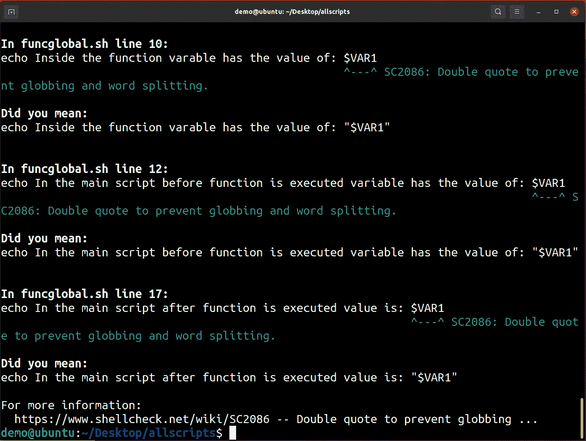

图 15.10 – 以这种方式使用变量本身不是错误，但可能会引发问题

输出看起来不太美观，因为终端中的字体过大，但它给了我们关于如何改进脚本的提示。正如我们之前提到的，空格是一个大问题，因此通过使用双引号，我们可以避免空格字符完全搞乱我们的脚本。

我们将做另一个例子，这是我们之前使用过的脚本的修改版，保存为`functions.sh`：

```
#!/bin/bash
#shell script that automates common tasks
function rsyn {
    rsync -avzh $1 $2 
}
function usage {
echo In order to use this script you can:
echo "$0 copy <source> <destination> to copy files from source\ to destination"
echo "$0 newuser <name> to createuser with the username\ <username>"
echo "$0 group <username> <group> to add user to a group"
echo "$0 weather to check local weather"
echo "$0 weather <city> to check weather in some city on earth"
echo "$0 help for this help"
}
if [ "$1" != "" ] 
             then
    case $1 in
         help)
            usage
            exit
            ;;
        copy)
            if [ "$2" != "" && "$3" != "" ]
            then 
            rsyn $2 $3
            fi
            ;;

        group)
            if [ "$2" != "" && "$3" != "" ]
                  then 
                       usermod -a -G $3 $2
            fi              
                       ;;
               newuser) 
                          if [ "$2" != "" ]
                          then
                                       useradd $2
                          fi
                          ;;
              weather)
                          if [ "$2" != "" ]
                                     then 
                                               curl wttr.in/$2
                                     else 
                                                  curl wttr.in
                          fi
                          ;;

        *)
            echo "ERROR: unknown parameter $1\""
            usage
            exit 1
            ;;
    esac
             else
             usage
fi
```

如果我们对这个脚本运行 ShellCheck，最终会得到一份长输出，其中一部分如下所示：

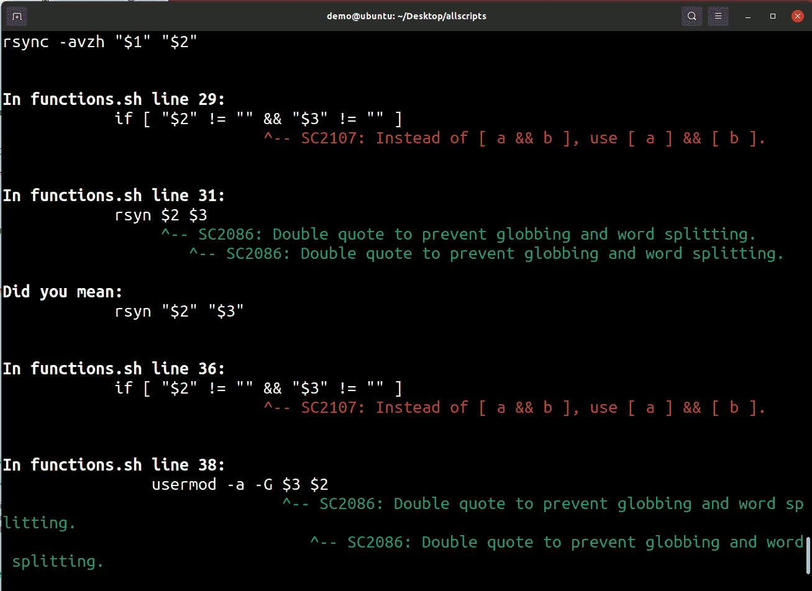

图 15.11 – 如果 ShellCheck 发现逻辑错误，它将发出警告

如果我们点击 ShellCheck 提供的作为输出最后一行的链接，会引导我们到详细的解释页面，正如这个截图所示：

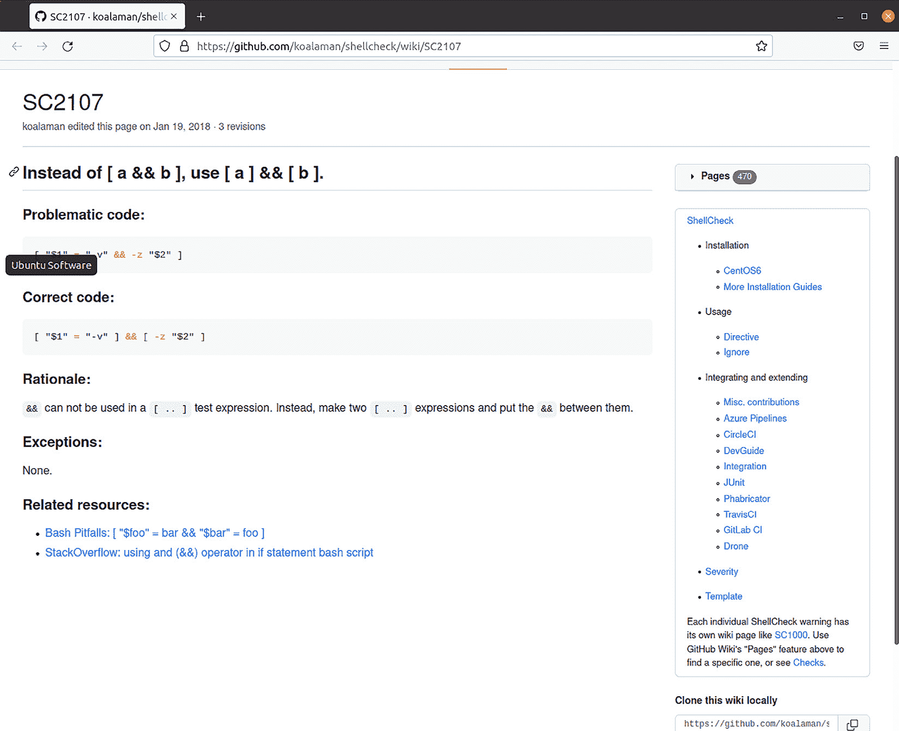

图 15.12 – ShellCheck 提供的链接为你提供有关错误的详细信息

这个解释不仅有用，而且还包含了更多的链接，供我们在了解究竟哪里出了问题、为什么出问题以及为什么这个问题需要注意时参考。有时，工具检测到的问题范围有限，可能在某些版本的 Bash 解释器中得到解决，但在另一些版本中依然存在问题。

## 另见…

故障排除是复杂的，因为我们无法预见所有可能的问题。不过，以下是一些常见问题：

+   [`mywiki.wooledge.org/BashPitfalls`](https://mywiki.wooledge.org/BashPitfalls)

+   [`mywiki.wooledge.org/BashGuide`](https://mywiki.wooledge.org/BashGuide)

+   [`www.shellcheck.net/`](https://www.shellcheck.net/)

# 简单的调试方法 – 在脚本执行期间回显值

当你开始使用 Bash 时，首先学会的就是如何在运行任何脚本时定期使用 `echo` 命令。这种方法很简单，因为它让我们有机会跟踪脚本的工作流，并在脚本的不同位置打印变量的值。能够理解这两点将帮助我们跟踪脚本的所有输入，并看到它们如何转化为我们预期的输出。

## 准备好

在这个教程中，我们将探讨一些简单的方法，使得我们的脚本可以帮助我们理解其运行过程。我们可以使用这三种简单的方法。

我们能做的第一件事是，在脚本中我们认为有帮助的地方使用 `echo` 命令。举个例子，看看前面章节中的一个脚本（`funcglobal.sh`），它已经相当冗长：

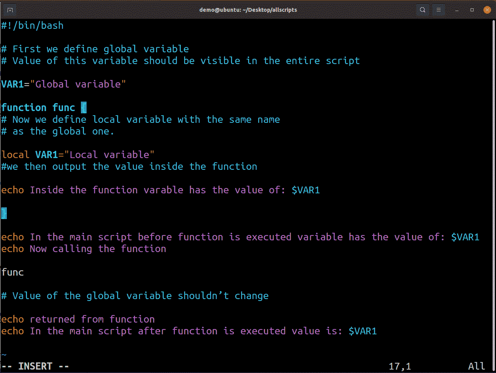

](img/Figure_15.13_B16269.jpg)

图 15.13 – 使用 echo 调试程序流程，在处理函数时非常有用

我们将增加更多的 `echo` 语句，让我们能够准确看到发生了什么，并且以什么顺序发生：

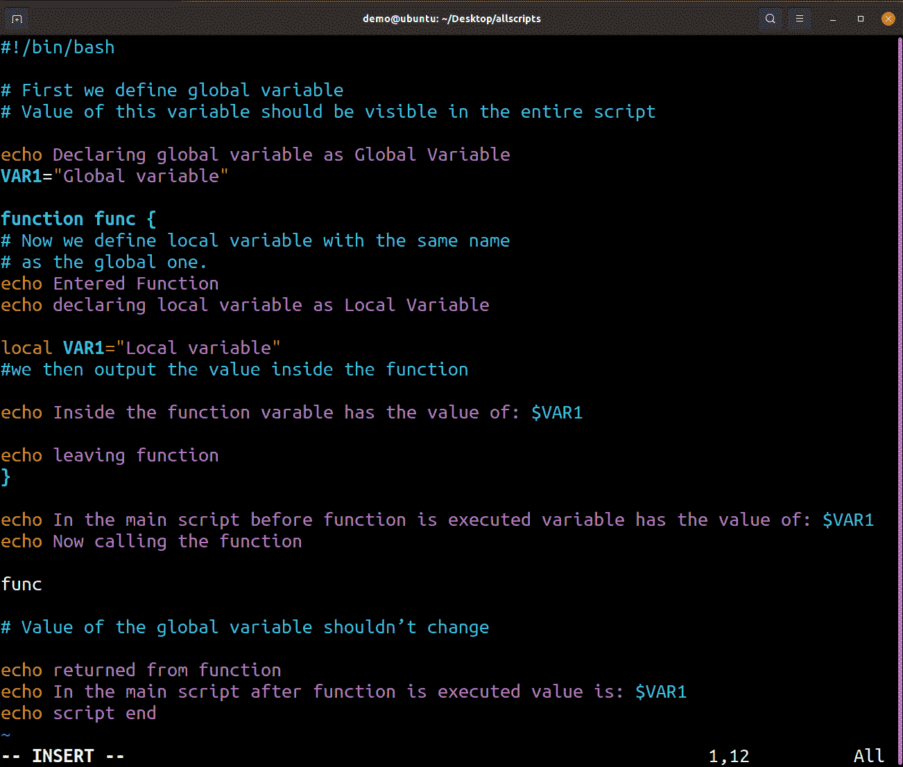

](img/Figure_15.14_B16269.jpg)

图 15.14 – 在调试时，echo 命令永远不会太多

如果现在运行我们修改后的脚本，我们将能够精确地跟踪脚本的执行流程：

```
demo@ubuntu:~/Desktop/allscripts$ bash funcglobal.sh 
Declaring global variable as Global Variable
In the main script before function is executed variable has the value of: Global variable
Now calling the function
Entered Function
declaring local variable as Local Variable
Inside the function variable has the value of: Local variable
leaving function
returned from function
In the main script after function is executed value is: Global variable
script end
```

这种方法在处理大量代码块、函数和条件语句时特别有用。这里的基本思路是，我们可以使用 `echo` 来宣布进入和离开每个代码块，从而看到我们的脚本是否正确执行。

另一件我们要做的事情是，在脚本执行期间打印变量的值。在这样做的时候，我们建议你在脚本的代码中始终注明这个特定命令打印变量的地方。当以这种方式调试时，变量的值会按照它们被赋值的顺序打印到输出中，帮助我们跟踪脚本的执行流程。我们之前的示例已经做了这一点。

## 如何操作…

你还可以做一件事，使你的脚本在调试时提供更多信息。bash 中有一个内建命令叫做 `trap`。它的主要作用是帮助你响应中断信号，并确保即使发生意外情况，脚本也能继续运行。它的语法很简单 —— 我们只需要告诉它在什么情况下做什么。这里的“情况”指的是 Linux 下的任何中断信号。最常见的有 `SIGHUP`、`SIGKILL` 和 `SIGQUIT`，但还有很多其他信号。

例如，我们可以创建一个像这样的脚本：

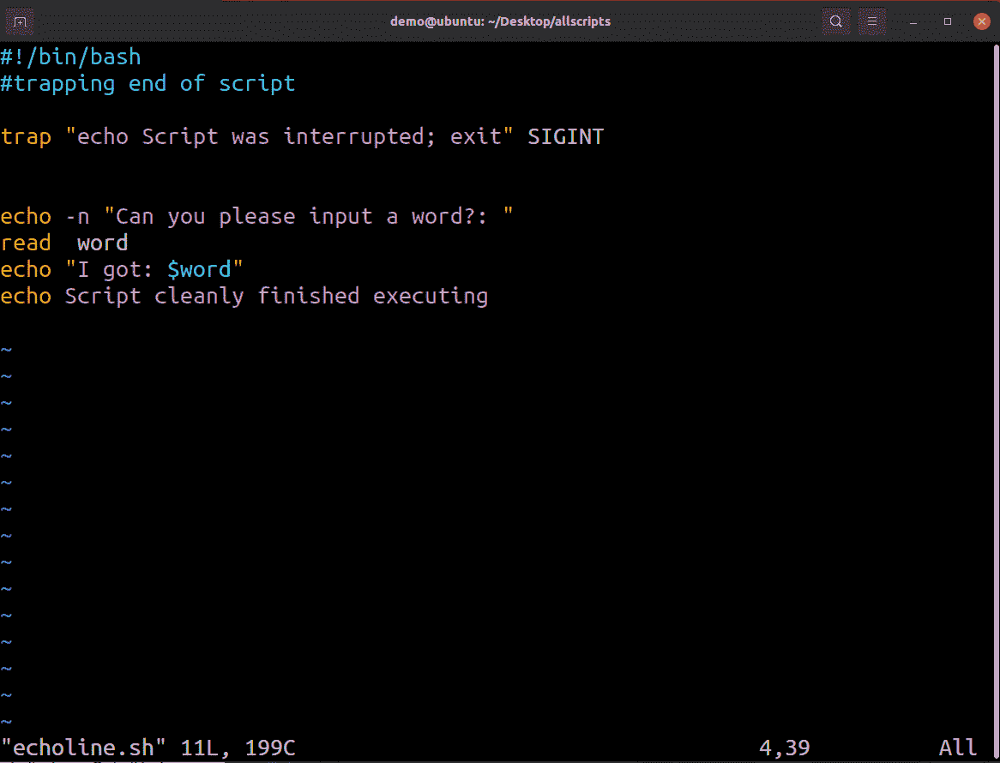

](img/Figure_15.15_B16269.jpg)

图 15.15 – 在脚本中使用 trap 停止 Ctrl + C

这一行代码的作用是建立一个被视为中断例程的东西。如果在脚本的任何时刻，有人按下*Ctrl + C*来中断它，我们的脚本会检测到这一点并执行引号内的两条命令：

```
demo@ubuntu:~/Desktop/allscripts$ bash echoline.sh 
Can you please input a word?: dsasd^CScript was interrupted
demo@ubuntu:~/Desktop/allscripts$ bash echoline.sh 
Can you please input a word?: nointerrupt
I got: nointerrupt
Script cleanly finished executing
```

当我们第一次尝试时，我们按下了中断键，我们的*例程*按预定操作执行，立刻退出脚本并给出警告。这条命令也非常有用，可以阻止中断脚本的尝试，因为它会执行我们告诉它的任何操作，然后继续执行脚本。

你可以做的另一件事是将`EXIT`作为`trap`命令中的关键字，如下所示：

```
trap "some command" EXIT
```

这个关键字涵盖了任何可能的退出脚本的方式，这意味着无论脚本发生什么，这个`trap`都会执行，并且会在控制权返回给运行脚本的进程之前运行。

以这种方式使用时，`trap`不仅对调试有用，还对脚本结束后的清理工作非常有帮助，因为它将在最后一个命令执行，允许你在脚本执行后进行必要的操作，如关闭文件和清理资源。

## 它是如何工作的……

无论你选择哪种方式来调试脚本，归根结底都是要对其进行大量修改。使用`echo`非常有用，但同时也需要在我们调试的脚本中添加很多命令。话虽如此，当你调试任何脚本时，这可能是你会尝试的第一个方法，因为它不仅可以帮助你理解脚本内部的值如何变化，还能让你了解整个脚本的工作原理，因为你能够获取到命令执行的确切位置，从而帮助你理解脚本的变量和工作流程。

使用`trap`是一种稍微更为细致的调试方法，当我们偏离了预期的程序流程时，它非常有用。若脚本中断或以其他方式停止，`trap`会为你提供发生了什么和发生地点的信息。

这里并没有特定的调试方法推荐，因为每种方法都在特定的场景下有效。我们可以说的是，你应该尝试所有方法，看看哪种最适合特定的场景。

## 另见

+   [`www.linuxjournal.com/content/bash-trap-command`](https://www.linuxjournal.com/content/bash-trap-command)

+   [`tldp.org/LDP/Bash-Beginners-Guide/html/sect_12_02.html`](https://tldp.org/LDP/Bash-Beginners-Guide/html/sect_12_02.html)

# 使用 bash 的-x 和-v 选项

到目前为止，我们已经尝试了使用不同方法调试脚本，这些方法都涉及在脚本中插入命令。不管我们使用的是哪条命令，这种方法有一个缺点——不管我们怎么做，脚本内部的命令要么非常局限于脚本的某个特定部分，要么过于广泛，因为它需要覆盖大段的代码。我们并不是说这种方法在解决脚本问题时无效，但我们仍然需要更多的调试方法。

## 准备就绪

在开始使用这些选项之前，我们需要了解的一点是，我们将通过将脚本作为解释器的参数来运行它们，所以会是这样的一种形式：

```
bash -options <scriptname>
```

这很重要，因为如果我们以其他方式调用脚本，就无法使用这些选项。

## 如何做到…

在这方面，Bash 相当复杂，因为它几乎没有提供任何系统性调试的支持，实际上几乎没有，我们已经提到过这一点。然而，仍然有一线希望，这就是两个开关，`-x`和`-v`。第一个开关会启动打印脚本中运行的每个命令，并且还会打印出所有使用的命令参数。这使得理解命令的工作流程变得简单。

使用`-v`的效果可以说不那么有用。它只是简单地打印出脚本每一行被读取时的内容。

为了理解这些选项，我们将创建一个小示例，使用我们在另一个配方中使用的脚本，但这次我们将使用不同的开关来运行它。

首先，我们将使用`-v`：

```
demo@ubuntu:~/Desktop/allscripts$ bash -v testif3.sh 
#!/usr/bin/bash
# testing premissions and paths 
if [ -d root ]
               then
                     echo root directory exists!
                     if [ -r root ]
                                   then
                       echo Script can read from the directory!
                                   else
                   echo Script can NOT read from the directory!    
                          fi
                          if [ -w root ]
                          then
                       echo Script can write to the directory!
                          else
                                       echo Script can not write to the directory!    
                          fi
                   else 
                          echo root directory does NOT exists!
fi          
root directory exists!
Script can read from the directory!
Script can write to the directory!
```

现在，我们将使用`-x`来运行脚本：

```
demo@ubuntu:~/Desktop/allscripts$ bash -x testif3.sh 
+ '[' -d root ']'
+ echo root directory 'exists!'
root directory exists!
+ '[' -r root ']'
+ echo Script can read from the 'directory!'
Script can read from the directory!
+ '[' -w root ']'
+ echo Script can write to the 'directory!'
Script can write to the directory!
```

这两个开关在调试中各有其作用。当我们说`-v`比`-x`不那么有用时，我们的意思是它仅仅让我们了解 Bash 如何解析脚本，但除此之外没有更多信息。

使用`-x`可以让我们看到 Bash 是如何执行脚本以及在执行过程中运行了哪些命令。你必须明白的是，这不会是脚本中所有命令的列表，而仅仅是那些实际上执行了的命令。如果脚本的某一部分没有被使用，例如它属于一个仅在特定条件下才会执行的命令块，那么这种运行脚本的方式就不会显示出来。

## 它是如何工作的…

最常见的做法是同时使用两个开关，因为它使我们能快速了解脚本的样子以及 Bash 在执行时做了什么。在一个较大的脚本中，这将生成大量的输出，但通常这正是我们实际想要做的。然后，我们可以逐步查看脚本，理解它实现的逻辑。

另一方面，我们不能将其视为解决任何问题的普适方案。虽然它为我们提供了很多关于所运行命令的信息，但它在变量值和数据处理过程中实际发生的情况方面非常有限。以文件`forloop1.sh`中的这个循环为例，它是书中附带的文件的一部分：

```
demo@ubuntu:~/Desktop/allscripts$ bash -x forloop1.sh 
+ for name in {user1,user2,user3,user4}
+ for server in {srv1,srv2,srv3,srv4}
+ echo 'Trying to ssh user1@srv1'
Trying to ssh user1@srv1
+ for server in {srv1,srv2,srv3,srv4}
+ echo 'Trying to ssh user1@srv2'
Trying to ssh user1@srv2
+ for server in {srv1,srv2,srv3,srv4}
+ echo 'Trying to ssh user1@srv3'
Trying to ssh user1@srv3
+ for server in {srv1,srv2,srv3,srv4}
+ echo 'Trying to ssh user1@srv4'
```

我们不会复制整个输出，因为它没有其他有用的信息。这里，我们可以看到我们正在一个`for`循环中循环，并且可以看到可能的值，但除非我们打印它，否则无法看到特定变量的实际值。这意味着，我们将不得不将这种调试方式与本章中介绍的其他调试方法结合使用。

## 另见…

+   [`linux.die.net/man/1/bash`](https://linux.die.net/man/1/bash)

+   [`tldp.org/LDP/Bash-Beginners-Guide/html/sect_02_03.html`](https://tldp.org/LDP/Bash-Beginners-Guide/html/sect_02_03.html)

# 使用`set`调试脚本的一部分

在前一个示例中，我们处理了全局使用两个选项来告诉 Bash 在输出中包含大量有用信息。我们提到这提供了另一种处理调试和排查脚本问题的方法。同时，我们也提到，这种方法与在脚本本身中使用命令的方式形成鲜明对比，因为在调试时我们可以全局处理，而无需对脚本做太多更改。

在这个方法中，我们将介绍另一种调试方式，这种方式与之前介绍的方式有很多相似之处，同时也有所不同。

## 准备就绪

在 Bash 中，一个非常有趣的内置命令是`set`。它的作用是让我们能够改变 Bash 使用的选项。通过使用`set`，我们可以更改许多内容，几乎是 Bash 所有的选项。在这个例子中，我们只使用了其中的两个，但你可以开启或关闭所有选项。

`set`使我们能够在代码的小块中启用特定的选项，而不是全局使用它。你还需要知道，`set`可以同时开启和关闭选项。如果我们使用带有`–`符号的`set`，则会启用选项。例如，我们可以这样使用：

```
set -x 
```

这告诉 Bash 在执行命令时显示它们。

一种稍微令人困惑的方式是，如果我们关闭当前使用的任何选项。为了做到这一点，我们必须使用`+`符号，这有点反直觉，因为通常*加*符号用于打开某些东西，而不是关闭。例如，看看这个命令：

```
set +x 
```

这将关闭 Bash 中命令的输出。

我们将通过几个例子来帮助你更好地理解。

## 如何实现…

使用`set`非常简单。在任何我们希望调试的脚本中，我们只需在开始跟踪的地方之前插入`set`语句。当我们不再需要跟踪脚本时，只需取消设置该选项，就完成了。我们可以根据需要多次执行此操作。

这是一个例子：

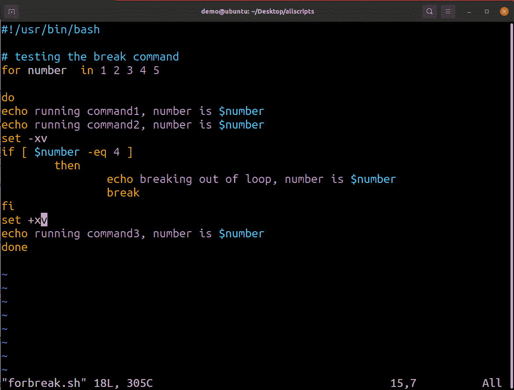

](img/Figure_15.16_B16269.jpg)

图 15.16 – 在运行脚本时如何设置和取消设置选项

在这个例子中，我们在测试变量之前开始跟踪。这意味着我们将在进行测试之前开始跟踪，并在继续循环之前停止跟踪。结果是这样的：

```
demo@ubuntu:~/Desktop/allscripts$ bash forbreak.sh 
running command1, number is 1
running command2, number is 1
+ '[' 1 -eq 4 ']'
+ set +xv
running command3, number is 1
running command1, number is 2
running command2, number is 2
+ '[' 2 -eq 4 ']'
+ set +xv
running command3, number is 2
running command1, number is 3
running command2, number is 3
+ '[' 3 -eq 4 ']'
+ set +xv
running command3, number is 3
running command1, number is 4
running command2, number is 4
+ '[' 4 -eq 4 ']'
+ echo breaking out of loop, number is 4
breaking out of loop, number is 4
+ break
```

我们甚至可以把这种调试方式看作是全局使用选项的一种特殊情况。我们基本上做的和之前示例中的`set`全局使用相同，但这次我们限制了作用范围，使输出更易读。有时，这可以让工作变得更轻松，因为我们不会生成太多无关的输出。

## 它是如何工作的…

`set` 命令还可以用于一个额外的功能，那就是强制 Bash 执行一些与平常不同的操作。例如，我们可以让脚本在其中任何命令失败时终止，或者当脚本引用一个未设置的变量值时让其失败，甚至可以改变 Bash 在命令行中扩展字符的方式。

所有这些内容在工作时可能非常有用，但在刚开始编写脚本时，可能会有点过于复杂，难以一次性掌握，因此我们决定在这些教程中不包括它们。

## 另见…

+   [`linuxhint.com/debug-bash-script/`](https://linuxhint.com/debug-bash-script/)

+   [`www.gnu.org/software/bash/manual/html_node/The-Set-Builtin.html`](https://www.gnu.org/software/bash/manual/html_node/The-Set-Builtin.html)
