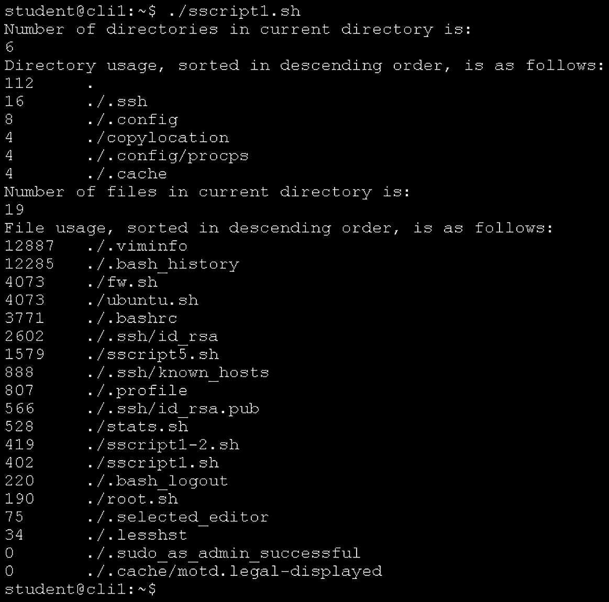
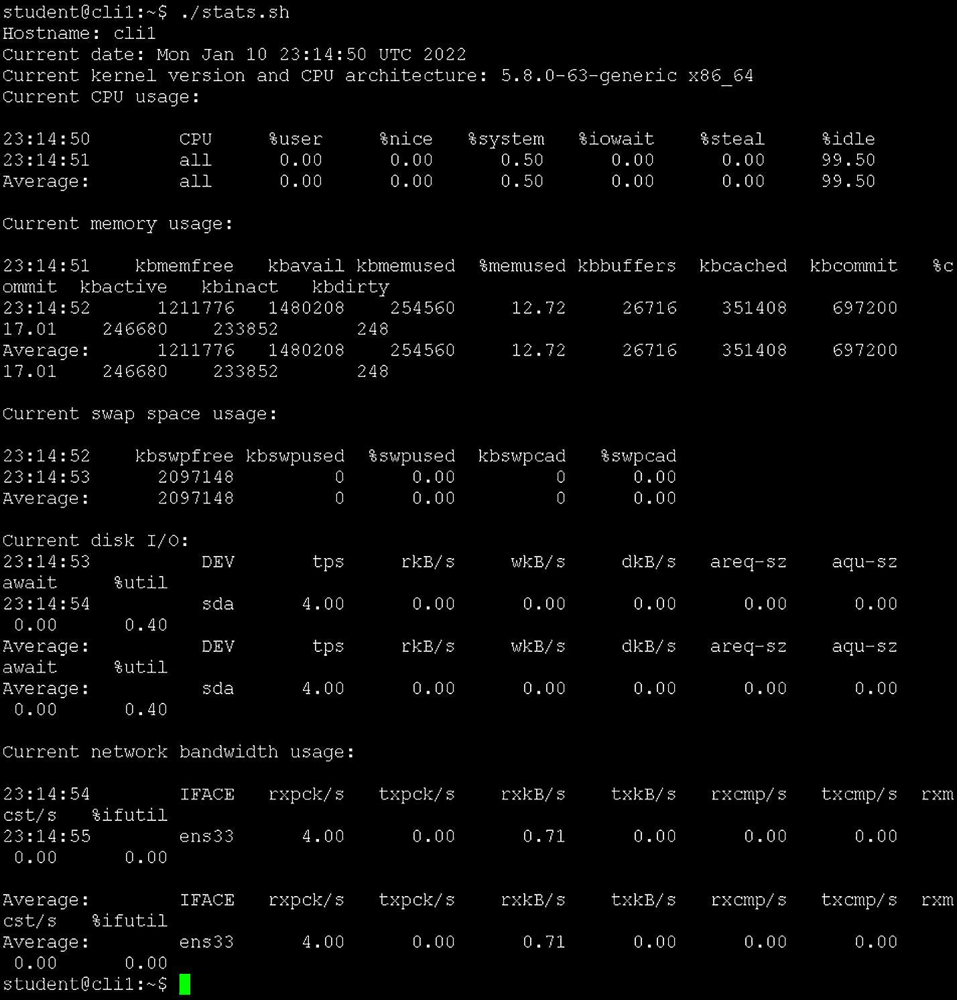
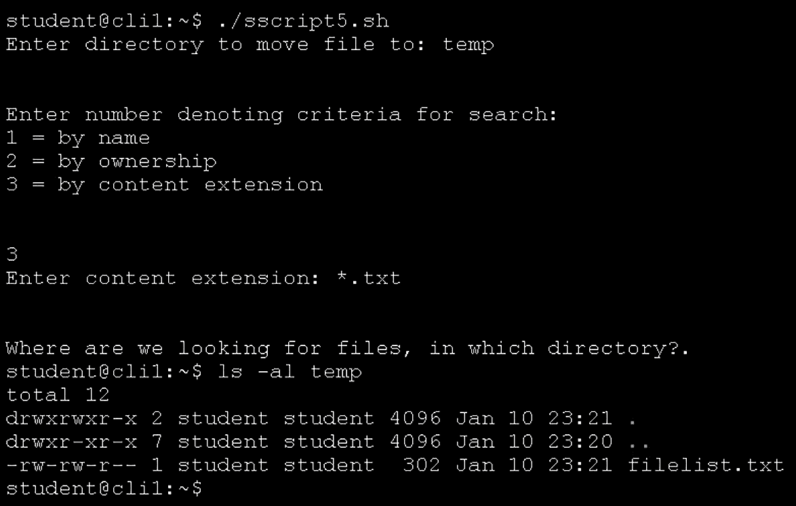
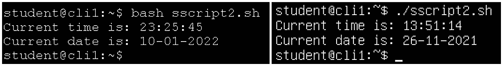
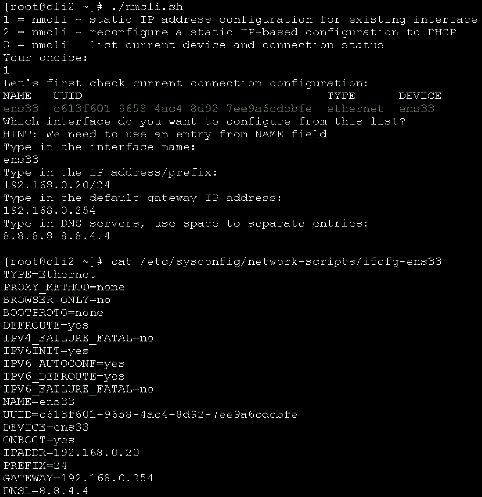
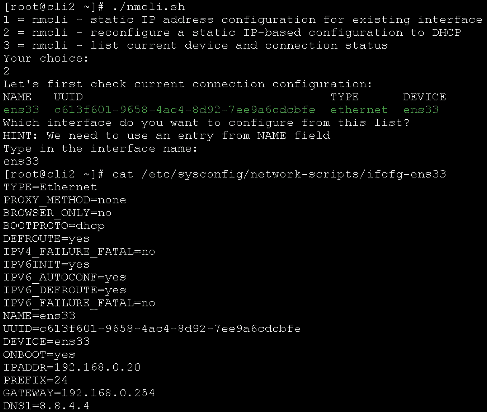
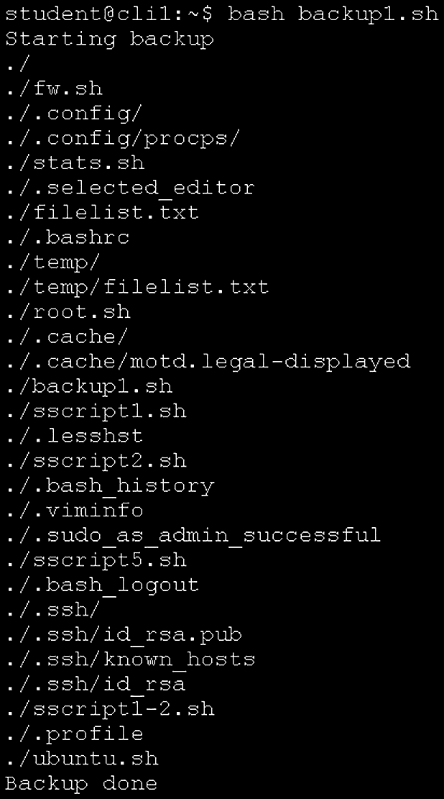

# 第十六章：用于服务器管理、网络配置和备份的 Shell 脚本示例

现在我们已经涵盖了在 Bash 脚本编程中涉及的各种概念和结构，接下来我们来深入探讨一些实例。通过这些示例，我们可以将之前几章的内容应用到实际中，因为 Shell 脚本是系统工程师日常工作中最常用的工具。因此，我们将通过一些 Shell 脚本来强调脚本编写的重要性——让我们的工作变得更加轻松。

本章将涵盖以下脚本示例：

+   创建文件和文件夹清单

+   检查是否以 root 用户身份运行

+   显示服务器统计信息

+   按文件名、所有者或内容类型查找文件，并将其复制到指定目录

+   解析日期和时间数据

+   配置最常见的防火墙设置（`firewalld` 和 `ufw`）

+   配置网络设置交互式（`nmcli`）

+   使用 Shell 脚本参数和变量备份当前目录

+   根据用户输入的备份源和目标路径创建当前备份

# 技术要求

让我们继续使用我们的 Ubuntu 机器，特别是 `cli1` 机器。如果你还没有启动它，请现在启动，以便我们可以继续进行示例。我们还将使用 `cli2` CentOS 机器进行一些操作，因此请确保在需要时启动它。

# 创建文件和文件夹清单

让我们从一个简单的脚本开始——一个报告文件夹和文件清单的脚本。尽管这个脚本看起来简单，但它可以使用各种不同的工具，包括命令、内建 CLI 应用程序、循环——选择很多。我们将用最简单的方式来做——利用我们对命令和 CLI 应用程序的了解。我们将创建几个不同版本的这个脚本，因为它可以有多种用途——例如，作为未来脚本的输入，或者作为纯文本报告工具。

## 如何实现…

我们从创建一个简单的脚本开始，这个脚本将告诉我们以下内容：

+   当前文件夹中文件夹的数量及其大小，并按大小降序排列

+   当前文件夹中的文件数量及其大小，按大小降序排列

这是我们脚本的第一个版本——我们将其保存为名为`sscript1.sh`的文件：

```
#!/bin/bash
# V1.0 / Jasmin Redzepagic / 01/11/2021 Initial script version 
# Distribution allowed under GNU Licence V2.0
echo "Number of directories in current directory is:"
find . -type d | wc -l
echo "Directory usage, sorted in descending order, is as follows:"
find . -type d | du | sort -nr
echo "Number of files in current directory is:"
find . -type f | wc -l
echo "File usage, sorted in descending order, is as follows:"
find . -type f -exec ls -al {} \; | sort -k 5 -nr | sed 's/ \+/\t/g' | cut -f5,9
```

如我们所见，我们这里只使用了基本命令，没有涉及太多的循环、实际编程等复杂操作。我们将此视为一个报告脚本，从这里开始。

在我们的 `cli1` 机器上，结果如下：



图 16.1 – 我们的文件夹和文件清单脚本的第一个版本

这已经可以工作，并且可以用于报告——是的，一切正常。但是如果我们想要更多功能怎么办？假设我们使用这个脚本的第一个版本生成一个 `.txt` 文件，里面包含当前目录中文件的列表，稍作修改后，再利用这个文件做其他事情，比如将这些文件复制到预设位置。

我们需要做一些调整，具体如下：

```
#!/bin/bash
# V1.0 / Jasmin Redzepagic / 01/11/2021 Initial script version 
# Distribution allowed under GNU Licence V2.0 
# First, let's find out if the destination directory exists by
# using test function. If it does, go on with the script. If it
# doesn't, create that destination directory. In our example,
# destination directory is called copylocation.
if [ -d "./copylocation" ]
then
             echo "Directory ./copylocation exists."
else
              echo "Error: Directory ./copylocation does not exist."
              mkdir ./copylocation
fi
# next step, let's create a friendly file list with all of the files
# in current folder
find . -type f -exec ls -al {} \; | sed 's/  */ /g' | cut -f9 -d" " > filelist.txt
# Last step, let's load this file into variable so that we can loop
# over it and copy every file from it to our destination folder
file_list='cat filelist.txt'
for current_file in $file_list
do
             echo "Copying $current_file to destination"
             cp "$current_file" ./copylocation
done
```

接下来的脚本虽然简单，但非常非常有用——它是用来检查我们是否以 root 身份运行脚本。这个逻辑很简单——有些脚本我们不希望以 root 身份运行，因为怕不小心破坏系统配置，这时我们就会利用一些可访问的资源。我们来看看怎么做。

## 另见

如果你需要更多关于 `sort`、`find`、`wc`、`cut` 或 `sed` 的信息，建议访问以下链接：

+   `sort` 命令手册页: [`man7.org/linux/man-pages/man1/sort.1.html`](https://man7.org/linux/man-pages/man1/sort.1.html)

+   `find` 命令手册页: [`man7.org/linux/man-pages/man1/find.1.html`](https://man7.org/linux/man-pages/man1/find.1.html)

+   `wc` 命令手册页: [`man7.org/linux/man-pages/man1/wc.1.html`](https://man7.org/linux/man-pages/man1/wc.1.html)

+   `cut` 命令手册页: [`man7.org/linux/man-pages/man1/cut.1.html`](https://man7.org/linux/man-pages/man1/cut.1.html)

+   `sed` 命令手册页: [`man7.org/linux/man-pages/man1/sed.1.html`](https://man7.org/linux/man-pages/man1/sed.1.html)

# 检查你是否以 root 身份运行

有不同的方法可以检查我们是否以 root 身份运行脚本。我们可以使用环境变量，也可以使用 `whoami` 或 `id` 命令，检查返回的是否是 root 或数字 `0`。

## 准备工作

我们将继续使用 `cli1` 机器来进行本教程，所以确保它已开启。

## 如何实现…

让我们创建一个简单的 Bash 脚本片段，帮助我们判断当前脚本是否以 root 身份运行。在 Linux 中，这其实是一个很简单的操作，因为我们可以轻松访问一个叫做 `EUID` 的环境变量，读取它的值即可判断我们是否以 root 身份运行（EUID=0）还是以其他身份运行（EUID 大于 1）：

```
#!/bin/bash
# V1.0 / Jasmin Redzepagic / 01/11/2021 Initial script version 
# Distribution allowed under GNU Licence V2.0 
# First, we need to check if our environment variable UID is set to
# 0 or not and branch that out to either yes or no with appropriate
# status messages
if [ "$EUID" -eq 0 ]
             then
                         echo "You are running as root user. Please be careful!"
             else
                         echo "You are not root. It's all sunshine and roses, you can't do much damage!"
fi
exit 0
```

接下来的例子我们将讨论如何显示服务器统计信息。我们将使用 `sar` 命令来实现，开始吧！

## 另见

如果你需要更多关于内部变量的信息，建议访问 [`tldp.org/LDP/abs/html/internalvariables.html`](https://tldp.org/LDP/abs/html/internalvariables.html)。

# 显示服务器统计信息

假设我们需要编写一个 shell 脚本，显示以下信息：

+   当前主机名

+   当前日期

+   当前内核版本

+   当前 CPU 使用情况

+   当前内存使用情况

+   当前交换空间使用情况

+   当前磁盘 I/O

+   当前网络带宽

这更多是一个过滤数据并使用命令的练习，但在如何格式化数据以使其看起来*漂亮*和*易读*方面，有一些有趣的概念。这是我们认为非常重要的内容。

## 准备工作

我们需要保持`cli1`机器的运行。此外，为了让此脚本正常工作，我们需要部署`sysstat`包，然后启用必要的服务。我们可以使用以下命令来实现 Ubuntu：

```
sudo apt-get -y install sysstat
```

我们可以使用以下命令来实现 CentOS：

```
sudo yum -y install sysstat
```

之后，我们需要启动`sysstat`服务：

```
sudo systemctl enable --now sysstat
```

现在，我们可以开始编写我们的脚本了。

## 如何做到这一点…

我们将使用`sar`命令获取关于 Linux 机器的大量信息，并且我们还将过滤掉一些不必要的细节。我们的脚本应如下所示：

```
#!/bin/bash
# V1.0 / Jasmin Redzepagic / 01/11/2021 Initial script version 
# Distribution allowed under GNU Licence V2.0 
echo "Hostname: $(hostname)"
echo "Current date: $(date)"
echo "Current kernel version and CPU architecture: $(uname -rp)"
# sar command has a default first line output telling us that it's
# running on Linux, and which kernel we are using. It's pointless
# to get this information four or five times, so let's filter that
# out from the get-go (grep -v "Linux" part of every command)
echo "Current CPU usage:"
sar -u 1 1| grep -v "Linux"
echo ""
echo "Current memory usage:"
sar -r 1 1| grep -v "Linux"
echo ""
echo "Current swap space usage:"
sar -S 1 1| grep -v "Linux"
echo ""
# When sar displays disk I/O info, it displays that info per
# device, which isn't all that important. What's important for
# us are sd* and vd* devices, as well as the status line telling
# us which specific metrics are shown in the column (DEV).
echo "Current disk I/O:"
sar -d 1 1| grep -E "(DEV|sd|vd)" | grep -v "Linux"
echo ""
# When sar displays network information, it shows it per device.
# Having in mind that we have a loopback network device (lo) and 
# that its statistics isn't important, let's just filter that out
# so that we can see network bandwidth info per real network device
echo "Current network bandwidth usage:"
sar -n DEV 1 1| grep -v lo | grep -v "Linux"
```

我们在这里多次使用了`echo ""`，以使我们的输出看起来清晰易读。输出应如下所示：



图 16.2 – 从我们的脚本中显示服务器统计信息

下一个配方是关于查找内容——按名称、所有权或扩展名——以便我们可以将找到的内容复制到特定位置。开始吧！

## 还有更多…

如果您需要了解更多关于`sar`命令的信息，请查看`sar`命令的手册页面：[`man7.org/linux/man-pages/man1/sar.1.html`](https://man7.org/linux/man-pages/man1/sar.1.html)。

# 按名称、所有权或内容类型查找文件，并将其复制到指定目录

文件管理可能会有点负担。通常我们有成千上万的文件，如果我们讨论的是企业级公司，可能有数百万个文件。如果我们需要查找符合特定条件的文件该怎么办？

我们从一个简单的开始——按名称查找。接着，我们将进入基于所有权的搜索，最后是最复杂的——基于内容类型的搜索。

## 准备工作

在开始这个配方之前，您需要确保我们的`cli1`虚拟机已启动并正常运行。

## 如何做到这一点…

这是一个完美的脚本，可以进行更多交互，因此，我们将使用 case 循环。我们有意识地大量使用 case，并加入了许多状态/调试代码，可以指导我们如何使用脚本。

我们希望将这个脚本分成三个部分，因为它将执行三项不同的任务。以下是脚本的样子：

```
#!/usr/bin/bash
# V1.0 / Jasmin Redzepagic / 01/11/2021 Initial script version 
# Distribution allowed under GNU Licence V2.0 
read -p "Enter directory to move file to: " DESTDIR
echo -e "\n"
# Let's first establish a destination directory with a loop that can test if that directory exists or not
if [ "$DESTDIR" == "" ];
then
        echo "You must specify a directory."
else
        if [ ! -d "$DESTDIR" ]
        then
                echo "Directory $DESTDIR must exist. Exiting!"

                exit
        fi
fi
# Directory is ready, let's go to the main part of the script. First
# step is selecting which type of search we want to use.
echo "Enter number denoting criteria for search: "
echo "1 = by name "
echo "2 = by ownership "
echo "3 = by content extension "
echo -e "\n"
read CRIT
# Let's start our case loop against CRIT variable.
case $CRIT in
        1)
                read -p "Enter name to search for: " NAME
                echo -e "\n"
                if [ ! -z  $NAME="" ]
                        then
                                find / -name "$NAME" -exec cp {} $DESTDIR \; 2> /dev/null
                        else
                                echo You have to enter the name!
                fi
                ;;
        2)
                read -p "Enter owner to search for: " OWNER
                echo -e "\n"
                if [ ! -z $OWNER="" ]
                      then
                                find / -user $OWNER -exec cp {} $DESTDIR \;  2> /dev/null
                        else
                                echo You have to input an owner!
                fi
                ;;
        3)
                read -p "Enter content extension: " CEXT
                echo -e "\n"
                if [ ! -z $CEXT="" ]
                        then
                                read -p "Where are we looking for files, in which directory?" LOOKUP
                                find "$LOOKUP" -type f -name "$CEXT" -exec cp {} $DESTDIR \; 2> /dev/null
                        else
                                echo You have to enter the content type!
                fi
                  ;;
        *)      echo please make a choice, either 1, 2 or 3!
esac
```

请注意，当我们被询问扩展名时，我们必须输入类似`*.txt`的内容，才能使此脚本正常工作。以下是脚本执行时，带有该扩展名的样子：



图 16.3 – 以文件扩展名作为条件执行脚本

在下一个食谱中，我们将学习如何处理基于日期和时间的数据，这是在 shell 脚本中常用于索引的概念。虽然它易于使用和理解，但我们需要学习如何通过编程、通过变量来使用这个概念。那么，接下来我们就来做这件事！

## 还有更多……

如果您需要更多关于`sar`命令的信息，建议您查看以下链接以了解更多：`https://www.howtogeek.com/662422/how-to-use-linuxs-screen-command/`。

# 解析日期和时间数据

处理基于时间的数据通常不太有趣，尤其是当你处理大量时间相关内容时。但在我们的使用场景中，我们通常使用日期/时间信息进行索引；也就是说，用它来命名我们的备份文件及类似用途。因此，学习如何从`date`命令获取信息，并将这些信息存储到变量中，以便让我们的代码尽可能模块化，是非常重要的。让我们创建一个 shell 脚本，作为将来脚本中可复用的代码片段——至少是其中的部分。

## 准备工作

我们不需要安装任何特殊的工具，只需要我们的 Linux 机器处于活动状态并准备就绪。

## 如何做……

我们将回归基础，使用`date`命令提取我们未来可能需要的所有日期和时间信息：

+   当前时间（以小时、分钟和秒表示）的信息

+   今天日期的信息

+   今天是星期几的信息

让我们在文本编辑器中输入以下内容并执行脚本：

```
#!/bin/bash
# V1.0 / Jasmin Redzepagic / 01/11/2021 Initial script version 
# Distribution allowed under GNU Licence V2.0 
# This part of our script is just plain using date command to assign
# values to "obviously named variables". This further shows two
# things - how to assign a variable value from external command,
# and how to use that principle on date and time data.
hour=$(date +%H)
minute=$(date +%M)
second=$(date +%S)
day=$(date +%d)
month=$(date +%m)
year=$(date +%Y)
# Let's print that out
echo "Current time is: $hour:$minute:$second"
echo "Current date is: $day-$month-$year"
```

这是示例输出的一个例子。我们将此脚本命名为`sscript2.sh`：



图 16.4 – 我们的日期和时间脚本的示例输出

这对备份脚本非常有用——例如，当我们按日期为备份文件（`.tar.gz`或其他格式）进行索引时。这是我们将在本章后续使用的一个概念。现在，让我们学习如何通过 shell 脚本配置防火墙设置。

# 交互式配置最常见的防火墙设置

防火墙配置就是这样的事情——我们经常需要做这件事，但我们不一定能马上记得所有命令。让我们通过 shell 脚本来完成它，适用于 CentOS（`firewalld`）和 Ubuntu（`ufw`）。

## 准备工作

在开始本食谱之前，您需要确保您的 CentOS 机器上已经启动了`firewalld`，Ubuntu 机器上启动了`ufw`。因此，首先，您需要使用以下命令：

```
systemctl status firewalld
```

在 CentOS 和 Ubuntu 上使用以下命令：

```
systemctl status ufw
```

如果它们被禁用，我们需要像这样启用它们：

```
systemctl enable --now firewalld
```

在 CentOS 和 Ubuntu 上，您可以使用以下命令：

```
systemctl enable --now ufw
```

现在，我们已经准备好开始了。当然，你需要以管理员身份登录才能更改防火墙配置，所以确保你已经以 root 用户（或具有类似权限的用户）登录，或者使用 sudo 配置来更改防火墙配置。

此外，使用 `firewalld` 时，很多人很难记住它使用的服务名称。其实这不是什么问题——我们只需要使用以下命令：

```
firewall-cmd --get-services
```

对于 `ufw`，我们只需查看 `/etc/service`，因为所有服务名称都列在那里，并且 `ufw` 使用这些名称进行配置。

## 如何操作…

首先，让我们为 `firewalld` 创建一个基于 CentOS 的脚本。我们将包括八个标准操作——操作服务配置、TCP 和 UDP 端口及丰富规则，既能添加也能删除，同时具备列出当前配置的功能。脚本应该是这样的：

```
#!/bin/bash
# V1.0 / Jasmin Redzepagic / 01/11/2021 Initial script version 
# Distribution allowed under GNU Licence V2.0 
echo "1 = firewalld (CentOS) - manipulate service configuration - add"
echo "2 = firewalld (CentOS) - manipulate service configuration - remove"
echo "3 = firewalld (CentOS) - manipulate TCP ports - add"
echo "4 = firewalld (CentOS) - manipulate TCP ports - remove"
echo "5 = firewalld (CentOS) - manipulate UDP ports - add"
echo "6 = firewalld (CentOS) - manipulate UDP ports - remove"
echo "7 = firewalld (CentOS) - manipulate rich rules - add"
echo "8 = firewalld (CentOS) - manipulate rich rules - remove"
echo "9 = firewalld (CentOS) - list current configuration"
echo -e "Your choice:"
read CRIT
# Let's start our case loop against CRIT variable.
case $CRIT in
        1)
                echo "Enter service names, using space as separator."
                echo "Hint: ssh http https etc. Get list from firewall-cmd --get-services"
                echo "Your input:"
                read -a FW1
                for svcs1 in ${FW1[@]}
                do
                        firewall-cmd --permanent --add-service=$svcs1
                done
                firewall-cmd --reload
                ;;
        2)
                echo "Enter service names, using space as separator."
                echo "Hint: ssh http https etc. Get list from firewall-cmd --get-services"
                echo "Your input:"
                read -a FW2
                for svcs2 in ${FW2[@]}
                do
                        firewall-cmd --permanent --remove-service=$svcs2
                done
                firewall-cmd --reload
                ;;
        3)
                echo "Enter TCP port numbers, using space as separator."
                echo "Hint: 22 80 443 etc."
                echo "Your input:"
                read -a FW3
                for svcs3 in ${FW3[@]}
                do
                        firewall-cmd --permanent --add-port=$svcs3/tcp
                done
                firewall-cmd --reload
                ;;
        4)
                echo "Enter TCP port numbers, using space as separator."
                echo "Hint: 22 80 443 etc."
                echo "Your input:"
                read -a FW4
                for svcs4 in ${FW4[@]}
                do
                        firewall-cmd --permanent --remove-port=$svcs4/tcp
                done
                firewall-cmd --reload
                ;;
        5)
                echo "Enter UDP port numbers, using space as separator."
                echo "Hint: 22 80 443 etc."
                echo "Your input:"
                read -a FW5
                for svcs5 in ${FW5[@]}
                do
                        firewall-cmd --permanent --add-port=$svcs5/udp
                done
                firewall-cmd --reload
                ;;
        6)
                echo "Enter UDP port numbers, using space as separator."
                echo "Hint: 22 80 443 etc."
                echo "Your input:"
                read -a FW6
                for svcs6 in ${FW6[@]}
                do
                        firewall-cmd --permanent --remove-port=$svcs6/udp
                done
                firewall-cmd --reload
                ;;
        7)
                echo "Let's manipulate rich rules - to add specific IPs access to specific port."
                echo "Hint: first, we need an endpoint IP address, like 45.67.98.43                   "
                echo "Your input (IP address):"
                read -a FW71
                echo "To which TCP port you want to allow access?"
                echo "Your input (TCP port number):"
                echo "Your input:"
                read -a FW72
                for svcs71 in ${FW71[@]}
                do
                        for svcs72 in ${FW72[@]}
                        do
                                firewall-cmd --permanent --add-rich-rule='rule family="ipv4" source address="'$svcs71'/32" port protocol="tcp" port="'$svcs72'" accept'
                        done
                done
                firewall-cmd --reload
                ;;
        8)
                echo "Let's manipulate rich rules - to add specific IPs access to specific port."
                echo "Hint: first, we need an endpoint IP address, like 45.67.98.43"
                echo "Your input (IP address):"
                read -a FW81
                echo "To which TCP port you want to allow access?"
                echo "Your input (TCP port number):"
                echo "Your input:"
                read -a FW82
                for svcs81 in ${FW81[@]}
                do
                        for svcs82 in ${FW82[@]}
                        do
                                firewall-cmd --permanent --remove-rich-rule='rule family="ipv4" source address="'$svcs81'/32" port protocol="tcp" port="'$svcs82'" accept'
                        done
                done
                firewall-cmd --reload
                ;;
        9)
                echo "Let's just list the firewalld settings first:"
                firewall-cmd --list-all
                echo "Let's list all the rich rules, if any:"
                firewall-cmd --list-rich-rules
                ;;
        *)      echo "Please make a correct choice, available choices are 1-9!"
esac
```

这是很多代码，但它让代码变得更加可读（因为我们使用了 case 循环）。我们本可以用几种不同的方式做到这一点，但这是最容易调试的代码，最重要的是，它能很好地工作。

现在，让我们来看一下 Ubuntu 的 `ufw` 脚本，它将非常相似——我们只需要确保 `ufw` 命令正确即可。我们还将查看两种删除规则的方法（通过索引号和通过规则），这样我们就知道如何同时进行操作：

```
#!/bin/bash
echo "1 = ufw (Ubuntu) - manipulate service configuration - add"
echo "2 = ufw (Ubuntu) - manipulate service configuration - remove"
echo "3 = ufw (Ubuntu) - manipulate TCP ports - add"
echo "4 = ufw (Ubuntu) - manipulate TCP ports - remove"
echo "5 = ufw (Ubuntu) - manipulate UDP ports - add"
echo "6 = ufw (Ubuntu) - manipulate UDP ports - remove"
echo "7 = ufw (Ubuntu) - manipulate whitelist IP/port configuration - add"
echo "8 = ufw (Ubuntu) - manipulate whitelist IP/port configuration - remove"
echo "9 = ufw (Ubuntu) - list current configuration"
echo -e "Your choice:"
read CRIT
# Let's start our case loop against CRIT variable.
case $CRIT in
        1)
                echo "Enter service names, using space as separator."
                echo "Hint: ssh http https etc. Get list from /etc/services"
                echo "Your input:"
                read -a FW1
                for svcs1 in ${FW1[@]}
                do
                        ufw allow $svcs1
                done
                ;;
        2)
                echo "Enter rule numbers from the list:"
                ufw status numbered
                echo "Your input, single number or multiple numbers separated by space:"
                echo "Hint: Best way to do it would be backwards - from top rule number to bottom rule number!"
                read -a FW2
                for svcs2 in ${FW2[@]}
                do
                       echo "y" | ufw delete $svcs2
                done
                ;;
        3)
                echo "Enter TCP port numbers, using space as separator."
                echo "Hint: 22 80 443 etc."
                echo "Your input:"
                read -a FW3
                for svcs3 in ${FW3[@]}
                do
                        ufw allow $svcs3/tcp
                done
                ;;
        4)
                echo "Enter TCP port numbers, using space as separator."
                echo "Hint: 22 80 443 etc."
                echo "Your input:"
                read -a FW4
                for svcs4 in ${FW4[@]}
                do
                        ufw delete allow $svcs4/tcp
                done
                ;;
        5)
                echo "Enter UDP port numbers, using space as separator."
                echo "Hint: 22 80 443 etc."
                echo "Your input:"
                read -a FW5
                for svcs5 in ${FW5[@]}
                do
                        ufw allow $svcs5/udp
                done
                ;;
        6)
                echo "Enter UDP port numbers, using space as separator."
                echo "Hint: 22 80 443 etc."
                echo "Your input:"
                read -a FW6
                for svcs6 in ${FW6[@]}
                do
                        ufw delete allow $svcs6/udp
                done
                ;;
        7)
                echo "Let's manipulate whitelist rules - to add specific IPs access to specific port."
                echo "Hint: first, we need an endpoint IP address, like 45.67.98.43"
                echo "Your input (IP address):"
                read -a FW71
                echo "To which port you want to allow access?"
                echo "Your input (port number):"
                echo "Your input:"
                read -a FW72
                for svcs71 in ${FW71[@]}
                do
                        for svcs72 in ${FW72[@]}
                        do
                                ufw allow from $svcs71 to any port $svcs72
                        done
                done
                ;;
        8)
                echo "Let's manipulate whitelist rules - to remove specific IPs access to specific port."
                echo "Hint: first, we need an endpoint IP address, like 45.67.98.43"
                echo "Your input (IP address):"
                read -a FW81
                echo "To which port you want to allow access?"
                echo "Your input (port number):"
                echo "Your input:"
                read -a FW82
                for svcs81 in ${FW81[@]}
                do
                        for svcs82 in ${FW82[@]}
                        do
                                ufw delete allow from $svcs81 to any port $svcs82
                        done
                done
                ;;
        9)
                echo "Let's list the ufw settings:"
                ufw status
                ;;
        *)      echo "Please make a correct choice, available choices are 1-9!"
esac
```

好了——这是另一个长脚本完成了。这应该能帮助我们在频繁使用 Ubuntu 时。接下来，我们将进入一个不同的方向——使用 `nmcli` 在交互式脚本模式下配置 CentOS 上的网络设置。

## 还有更多…

有关 `firewall-cmd` 和 `ufw` 命令行选项的更多信息，我们建议你访问以下链接：

+   `firewall-cmd` 手册页: `https://firewalld.org/documentation/man-pages/firewall-cmd.html`

+   使用 *rich language* 语法配置复杂的防火墙规则：`https://access.redhat.com/documentation/en-us/red_hat_enterprise_linux/7/html/security_guide/configuring_complex_firewall_rules_with_the_rich-language_syntax`

+   ufw 快捷手册：`https://blog.rtsp.us/ufw-uncomplicated-firewall-cheat-sheet-a9fe61933330`

# 交互式配置网络设置

通常，我们没有访问图形界面（GUI）和基于 GUI 的配置工具。如果我们需要配置网络设置，这可能会导致一系列问题。要么我们需要学习 `/etc/sysconfig/network-script` 文件的语法（这并不友好），要么我们需要使用可用工具从命令行界面（CLI）配置网络设置。让我们学习如何使用 `nmcli` 来实现这个目的。

## 准备就绪

在开始此配方之前，你需要确保你正在使用我们的 `cli2` CentOS 机器，因为 Ubuntu 默认不使用 `nmcli`。完成后，你就可以开始了！

## 如何操作…

通过 `nmcli` 配置网络设置并不困难，但同时，它远非非常用户友好。涉及的语法比较复杂，有时可能会让人感到有些困惑。所以，让我们创建一个脚本，帮助我们做三件事：

+   通过 `nmcli` 配置网络设置，以便我们使用静态 IP 网络配置。

+   通过 `nmcli` 配置网络设置，以便我们使用 DHCP 网络配置。

+   检查/输出当前的网络设置。

我们的脚本应如下所示：

```
#!/bin/bash
# V1.0 / Jasmin Redzepagic / 01/11/2021 Initial script version 
# Distribution allowed under GNU Licence V2.0 
echo "1 = nmcli - static IP address configuration for existing interface"
echo "2 = nmcli - reconfigure a static IP-based configuration to DHCP"
echo "3 = nmcli - list current device and connection status"
echo -e "Your choice:"
read CRIT
# Let's start our case loop against CRIT variable.
case $CRIT in
        1)
                echo "Let's first check current connection configuration:"
                nmcli con show
                echo "Which interface do you want to configure from this list?"
                echo "HINT: We need to use an entry from NAME field"
                echo "Type in the interface name: "
                read -a interface1
                echo "Type in the IP address/prefix: "
                read -a address1
                echo "Type in the default gateway IP address: "
                read -a gateway1
                echo "Type in DNS servers, use space to separate entries: "
                read -a dns1
                echo
                nmcli con mod $interface1 ipv4.address "$address1" ipv4.gateway "$gateway1"
                nmcli con mod $interface1 ipv4.method manual
                for dnsservers in ${dns1[@]}
                do
                        nmcli con mod $interface1 ipv4.dns $dnsservers
                done
                systemctl restart NetworkManager
                ;;
        2)
                echo "Let's first check current connection configuration:"
                nmcli con show
                echo "Which interface do you want to configure from this list?"
                echo "HINT: We need to use an entry from NAME field"
                echo "Type in the interface name: "
                read -a interface1
                nmcli con mod $interface1 ipv4.method auto
                systemctl restart NetworkManager
                ;;
        3)
                echo "Current status of network devices: "
                nmcli dev show
                echo "Current status of network connections: "
                nmcli con show
                ;;
        *)      echo "Please make a correct choice, available choices are 1-3!"
esac
```

如果我们使用这个脚本，输出将如下所示：



图 16.5 – 从 shell 脚本配置网络接口，将其设置为静态 IP 配置

如我们所见，所有的网络设置都已应用。此外，第二个使用场景——从现有配置恢复使用 DHCP——输出将如下所示：



图 16.6 – 正确设置 BOOTPROTO 参数后，恢复我们的 DHCP 配置。

这个文件看起来也不错，因此我们可以继续使用这个脚本。

接下来的脚本将涉及备份——一个将使用 shell 脚本参数和变量，另一个将使用 `tar` 的一个非常有用的特性。让我们一起编写一些备份脚本吧！

## 还有更多内容…

`Screen` 需要一些试验和错误，并且需要适应。我们建议您查看以下链接，以了解更多信息：

+   `nmcli` 手册页：`https://linux.die.net/man/1/nmcli`

+   `nmcli` 示例：`https://people.freedesktop.org/~lkundrak/nm-docs/nmcli-examples.html`

# 使用 shell 脚本参数和变量备份当前目录

系统工程师使用 Bash shell 脚本的最常见原因之一是为了备份。虽然有多种工具可供使用，但为了进行 shell 脚本编写，我们将创建几个基于 `tar` 的 shell 脚本，处理参数和变量，并学习如何通过使用 shell 脚本来简化我们的备份工作。让我们来看一下！

## 准备就绪

在你开始这个过程之前，需要确保你的 Linux 机器上已安装 `tar`。为此，你需要使用以下命令：

```
sudo apt-get -y install tar
```

如果你使用的是 CentOS 系统，请使用以下命令：

```
sudo yum -y install tar
```

现在，你已准备好开始了。

## 如何实现…

我们的第一个备份脚本的前提是基于 `tar`，其目标很简单：

+   我们希望能够在使用参数设置备份文件名时创建备份。

+   我们希望能够轻松地修改我们的 shell 脚本，以便它可以备份我们想要的任何数量的目录（这可以通过在`backup_source`变量中列出源目录来轻松实现）。

让我们看看这个如何工作：

```
#!/bin/sh
# V1.0 / Jasmin Redzepagic / 01/11/2021 Initial script version 
# Distribution allowed under GNU Licence V2.0 
# This script contains some pre-defined parameters:
# - which directories we want to backup, used as a variable
# backup_source
# - destination folder, via variable called backup_dest
# - indexing according to date, used as a variable date
#
# Also, it uses a shell script argument $1 (first argument that we
# use to call on the script) to set value for variable filename
filename=$1
# let's set the directory that we want to backup
# if we want to backup more of them, we create a space-separated
# list
backup_source="./"
# let's set the destination folder
backup_dest="/tmp"
# let's set value of the date variable in accordance to current date
date='date '+%d-%B-%Y''
# let's set the value of the hostname variable in accordance to host
# name
hostname=$(hostname -s)
# let's start the backup process
echo "Starting backup"
sleep 2
tar cvpzf   $backup_dest/$filename-$hostname-$date.tar.gz  $backup_source
# let's announce the end of the backup process
echo "Backup done"
```

过程应如下所示：



](img/Figure_16.7_B16269.jpg)

图 16.7 – 带参数的简单备份脚本

我们在脚本中输入的`backup`单词是脚本中的`$1`参数——即我们开始脚本时的第一个参数。正如我们所看到的，脚本正常执行了它的任务。

## 还有更多…

如果你需要更多关于`tar`命令的信息，我们建议你查看以下链接：

+   `tar`命令手册页：[`man7.org/linux/man-pages/man1/tar.1.html`](https://man7.org/linux/man-pages/man1/tar.1.html)

+   18 个实用的`tar`命令示例：[`www.tecmint.com/18-tar-command-examples-in-linux/`](https://www.tecmint.com/18-tar-command-examples-in-linux/)

# 基于用户输入的备份源和目标创建当前备份

在使用`tar`制作备份脚本之后，我们需要制作一个完全互动的脚本，要求用户输入所有详细信息。让我们学习如何实现这一点！

## 准备开始

如果你按照之前的步骤操作，那么你不需要任何新的东西——相同的要求适用。

## 如何操作…

这次我们的前提有所改变。我们希望有一个完全功能的备份脚本，但不使用任何静态变量（像之前那样）。此外，我们希望能够随时调用这个脚本，这就是为什么我们使用多个问题来设置必要的变量。脚本应该是这样的：

```
#!/bin/bash
# V1.0 / Jasmin Redzepagic / 01/11/2021 Initial script version 
# Distribution allowed under GNU Licence V2.0 
# This script does a custom backup, based on our arguments
# We need to give it a couple of arguments @start:
# - backup file name
# - list of directories (or a single directory) that we
# want to backup
# We also added a bit of code to skip standard error
echo -e "Type in the backup file name, use something like file-date.tar.gz:"
read filename
echo -e "Type in the list or a single directory that you want to backup:"
read directories
echo "Let's do this thing!"
tar cfvz $filename $directories 2> /dev/null
```

这很简单，但也非常有效。请注意，我们使用了`tar`命令的一个非常酷的功能，那就是使用一个目录列表进行备份，特别是作为`tar`命令语法中*末尾*的列表，这使得操作变得稍微简单一些。

在下一章中，事情将变得越来越复杂。确保查看我们那里的第二部分 Shell 脚本示例。

## 还有更多…

如果你需要更多关于`tar`命令的信息，我们建议你访问以下链接：

+   `tar`命令手册页：[`man7.org/linux/man-pages/man1/tar.1.html`](https://man7.org/linux/man-pages/man1/tar.1.html)

+   18 个实用的`tar`命令示例：[`www.tecmint.com/18-tar-command-examples-in-linux/`](https://www.tecmint.com/18-tar-command-examples-in-linux/)
